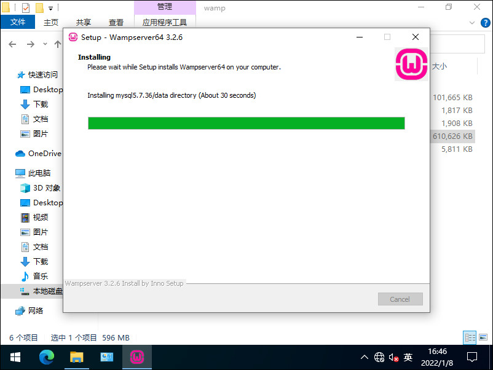
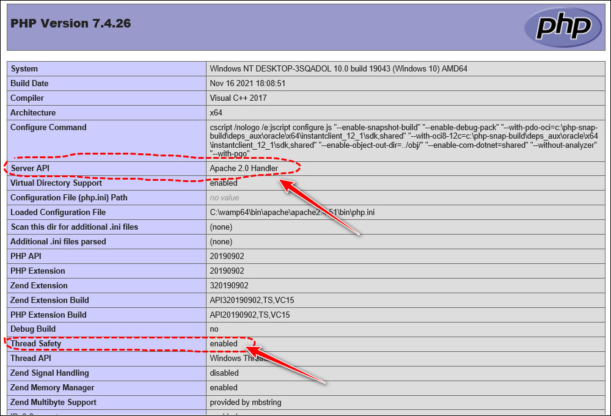
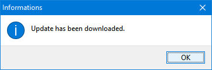
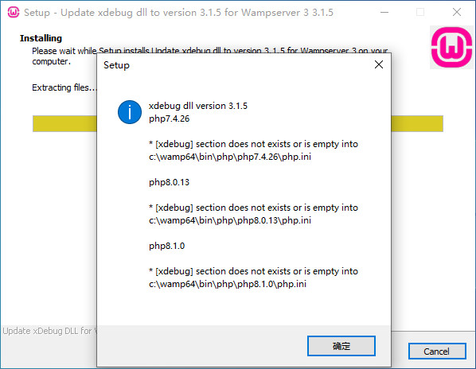

## 快速全面掌握 WAMPServer 合集教程

### Master WAMPServer Quickly and Comprehensively

### Collection Tutorial


**作者：网管小贾 / sysadm.cc (2022年8月26日)**


# 00.目录

##### 【快速全面掌握 WAMPServer】01.初次见面，请多关照

##### 【快速全面掌握 WAMPServer】02.亲密接触之前你必须知道的事情

##### 【快速全面掌握 WAMPServer】03.玩转安装和升级

##### 【快速全面掌握 WAMPServer】04.人生初体验

##### 【快速全面掌握 WAMPServer】05.整明白 Apache

##### 【快速全面掌握 WAMPServer】06.整明白 PHP

##### 【快速全面掌握 WAMPServer】07.整明白 MySQL 和 MariaDB

##### 【快速全面掌握 WAMPServer】08.想玩多个站点，你必须了解虚拟主机的创建和使用

##### 【快速全面掌握 WAMPServer】09.如何在 WAMPServer 中安装 Composer

##### 【快速全面掌握 WAMPServer】10.HTTP2.0时代，让 WampServer 开启 SSL 吧！

##### 【快速全面掌握 WAMPServer】11.安装 PHP 扩展踩过的坑

##### 【快速全面掌握 WAMPServer】12.WAMPServer 故障排除经验大总结

##### 【快速全面掌握 WAMPServer】13.PHP调试麻烦？请 xDebug 来帮忙！

##### 【快速全面掌握 WAMPServer】14.各种组件的升级方法


# 01.初次见面，请多关照

我们经常会听到不少人调侃，`PHP` 是世界上最好的语言。

那 `PHP` 真的是世界上最好的语言吗？

哈哈，认真你就输了，凡是具有一定判断能力的成年人看问题从来都不是非黑即白、非是即否的。


我们只要看看各大网站对于主流编程语言的排名就可以很清楚地了解到，`PHP` 热力不减、势头依然强劲持久。

哎，你可不要老是盯着那第一、第二名看，人家老外也有不少学习冷门语言吃香喝辣的呢！

至少 `PHP` 基本每年都在第十名之内，已经非常厉害，同时也很好地说明她的魅力了。

此外，在2021年11月包括 `JetBrains` 在内的多位社区成员宣布 `PHP` 基金会正式成立。

这愈加标志着 `PHP` 未来非常值得期待！


再说不管哪一门编程语言，它都会有优点和缺点，但至少 `PHP` 作为长年位于排行榜前列的主流语言，还是非常值得我们学习研究的。

更多想说的是，`PHP` 与其他语言相比较，她更适合初学者入门学习，通过简单的学习即可快速反馈效果，提振我们的学习兴趣和自信心。

因此，我们可不要人云亦云轻易放弃大好的学习 `PHP` 的机会哦！


说了这么多，那我们应该从哪里入手学习呢？

不管是哪一门编程语言的学习，我们总是先要有个编程环境，然后在这个环境中动手实践，才能有所体悟，有所进步，有所学成。

由于我们初学者使用 `Windows` 操作系统平台的居多，因此最理想的状态就是我们在现有的 `Windows` 上就能快速开始，实现学习 `PHP` 的目的。

根据我个人的学习经历，那么在 `Windows` 上的众多 `PHP` 集成软件包中，我首推 `WAMPServer` ！

当然也有很多其他的集成软件包，但个人不太建议，因为有些组件不全，有些又有可能捆绑了不良软件。

我还是强烈建议大家学习和使用 `WAMPServer` ，功能全面，干净省心。

接下来我们就开启学习 `WAMPServer` 之旅吧，内容丰富充实，值得小伙伴们期待哦！


### 初次见面，请多关照

如果你是第一次学习 `WAMPServer` ，那免不了首先要来个自我介绍。

`WAMPServer` 是一款由法国人开发的包括 `Apache Web` 服务器、 `PHP` 解释器以及 `MySQL/MariaDB` 数据库等好几样软件的整合而成的免费集成软件。

你瞧她的名字`WAMP` ，就是 `Windows` 、 `Apache` 、 `MySQL/MariaDB` 、 `PHP` 这几个单词首字母缩写的组合嘛！


* `Windows` - 即我们使用的操作系统，比如 `Win10` 
* `Apache` - `Web` 服务引擎，提供 `HTML` 代码的解析和显示
* `MySQL/MariaDB` - 开源数据库，前者算是商业收费软件，个人学习建议使用后者
* `PHP` - `PHP` 代码解释器


也就是说，`WAMPServer` 同时带有 `Web` 引擎、`PHP` 代码解释以及数据库访问等多项功能。

除了上面这几个被集成的部分主要软件之外呢，其实她还包含了其他很多软件和功能。

比如，`PHPMyAdmin` 、`Adminer` 、 `Phpsysinfo` 以及 `xDebug` 等等。


* `PHPMyAdmin` - 基于 `PHP` 的以 `Web-Base` 方式架构在网站主机上的针对 `MySQL/MariaDB` 的数据库管理工具

  > 官网：https://www.phpmyadmin.net/

  

  

  

  

* `Adminer` - 类似于 `PHPMyAdmin` 的基于 `PHP` 的 `Web` 式数据库管理工具，但不太一样的是，它一共就自己一个文件，而且不单单支持 `MySQL/MariaDB` 还支持多种不同的数据库

  > 官网：https://www.adminer.org/

  

  
  
  


* `Phpsysinfo` - 一个能够显示主机系统信息的 `PHP` 脚本程序

  > 官网：https://phpsysinfo.github.io/phpsysinfo/

  

  

* `xDebug` - 一个用于调试 `PHP` 程序的扩展程序

  > 官网：http://xdebug.org/


综上所述，可以说 `WAMPServer` 集成了很多我们需要用到的各种程序，有利于我们快速搭建编程环境。

看似这么多的小程序无从入手，其实不用担心，我们会在后面的教程中给大家逐一介绍讲解。

不过需要注意， `WAMPServer` 作为集成包软件，她只能在 `Windows` 上跑哦，要将她用到 `Linux` 上的小伙伴可别想多了哈！


### `WAMPServer` 相关站点

我们在今后的学习过程中，免不了要多次用到 `WAMPServer` 的相关站点，比如查看资料、下载安装包等等。

而事实上很多人并不知道的是，涉及到 `WAMPServer` 的正规官方站点可不只一个！

哎，很奇怪是不是？

由于学习 `WAMPServer` 的小伙伴比较多，网上铺天盖地又极其零散的教程资源又过于琐碎，显得非常不正规，因此我建议大家不管是第一手资料也好，还是下载软件安装包也好，最好是去官方的那几个站点。

其实多个站点这事儿吧也不算太奇怪，像 `WAMPServer` 这种免费分享给大家使用的项目可能维护者往往比较穷，因此就会出现在网络上随波逐流，没有固定住所的惨状。

所以我们应该好好学习，多多支持开发者维护者吧。

好，由此接下来我就带大家去发现这些被隐藏的官方站点吧！


##### 站点一

相信有不少小伙伴最初也是最大可能会访问到的这个网站。

> https://www.wampserver.com/en/


没错！这个的确是 `WAMPServer` 的官网之一，并且提供了法文、英文和俄文界面。

不过仔细深究，你就会发现这个仅仅是一个展示用的门户站点，或者说它的重点不在于给学习者提供知识或下载，而更多的似乎是贩卖主机服务之类的商业展示。

换句话说就是，这个页面提供的下载并不是最新版本，而是 `Sourceforge` 上保存的较旧版本，对我们灵活使用和深入学习帮助不大。


如下图，当你点击下载时，它会弹出一张表格让你填写，这就是套路，其实你只要点击箭头指向的那个直接下载即可跳转到 `Sourceforge` 了。


千万别被套路了哦，事实上，我们需要的所有下载被放到了另外一个神秘的地方......


##### 站点二

所有你想要的和不想要的，只要是有关于 `WAMPServer` 的下载都被托管到了下面这个神秘站点。

> https://wampserver.aviatechno.net/?lang=en

`WAMPServer` 可能涉及到的所有相关的软件包都可以在这里被找到并下载到，什么 `VC` 组件啦、什么扩展程序啦、就连 `PHP` 本身都提供了从 `5.6` 到最新的 `8.1` 的所有版本。


在页面的最上面，作者会第一时间更新主程序以及各个组件的最新版本，布局整齐划一，日期和版本号清晰可见。

非常难能可贵的是，这里还提供了以往的其他所有可用版本的下载。

下载完成后，还可以使用 `MD5` 码对比校验安装包是否完整有效。


这个网站我个人猜测是开发者找的一个个人站点，然后以 `wampserver` 的子域名将内容托管在上面。

从图中我们可以看到，这是一位名叫 `Livre d'Or Aviatechno` 的前法国航空的退休人员的个人站点。

> https://aviatechno.net/


这个站点似乎是站长对他过去几十年在法航工作经历的回忆录，不过这并不是我们想要的重点，我们的是重点是，`WAMPServer` 总算是有一个稳定的“家”了。

好了，总之大可放心的是，上面的 `WAMPServer` 相关内容基本上是实时更新的，不仅更新及时，而且下载包非常完整、版本齐全，要知道 `PHP` 开发过程中，对组件版本匹配还是有一定的要求的。

终于，我们有地方随时可以下载需要的文件了，这真是一件值得庆贺的事儿！

不过光有下载文件好像还不够好啊，如果我们在使用过程中要是遇到了什么问题又该如何解决呢？


##### 站点三

我们知道 `WAMPServer` 毕竟是一个“大杂烩”，食用过程中难免会有生出这样那样的“毛病”。

既然有了“毛病”我们就得治啊，那去哪儿找医生开“药方”呢？

哎，还真有个好地方，那就是官方论坛。

> http://forum.wampserver.com/list.php?2


虽说 `WAMPServer` 的开发者是法国人，但论坛也有提供英文服务，因此我们也可以很方便地在论坛中搜索到我们感兴趣的资料。

什么？英文也看不懂，那太好了，我帮小伙伴们解释（huyou）啊！

开个玩笑哈，在今后的教程中，我将为大家整理并分析在 `WAMPServer` 的使用过程中遇到的各种问题，并提供解决方法，敬请大家期待！


### 教程小结

本节内容为小伙伴们初步介绍了 `WAMPServer` 的一些个人情况，让大家对她能有个最初的大概的认识。

`WAMPServer` 内容众多，学习好她会非常有利于我们学习 `PHP` 、数据库乃至前后端等 `Web`  相关知识。

若要熟练掌握好她的使用技巧，还需要大家戒骄戒躁、认真细心地学习下去。

建议小伙伴们将本节内容多回顾回顾，之后我们下期教程再会啦！


# 02.亲密接触之前你必须知道的事情

我们在与他人打交道之前，较为合理的做法便是先打探了解一下对方的喜好和忌讳。

除非你只是接触一下而并不想继续打交道，否则提前了解对方的一些相关信息还是非常有利于我们更快更深入地建立加强合作关系，而且也更有利于以后能够扩展、吸纳和融合更多的其他关系。

道理很简单，也是相通的，因此在正式开始使用 `WAMPServer` 之前，我们当然有必要学习了解一些关于她的喜好和禁忌。


`WAMPServer` 也有喜好禁忌？

那是当然，如果你熟知她的这些喜欢禁忌，那么你就能更好地驾驭她，使她发挥出最大的特长。

那么，`WAMPServer` 到底都有哪些喜好禁忌呢？


以最新版本为例。


##### 一、`WAMPServer` 并不能工作在 `FAT32` 或 `exFAT` 分区上，而只能工作在 `NTFS` 分区上。

因此你可不要犯糊涂了，假如你的分区是 `FAT32` 或 `exFAT` ，那么 `WAMPServer` 是绝对没办法正常运行的，切记切记！


##### 二、安装所有 `Microsoft C/C++ Runtime Libraries` 。

这个可以说是非常硬性的前提条件，在安装 `WAMPServer` 之前务必确保安装了所有的微软 `C/C++` 运行库，注意，是所有的哦！

要是你少安装了某个或某些运行库，那么 `I'm sorry` ，请先不要安装 `WAMPServer` ，否则装了也会报错而无法正常使用。

还有更厉害的，如果你都装好了 `WAMPServer` ，那么在缺少部分运行库的情况下，你也不得不先卸载 `WAMPServer` ，然后待运行库全面搞定后才能再次安装 `WAMPServer` 。

灰常麻烦有木有？

那么所有的 `C/C++` 运行库都有哪些呢？


如下，你必须确保以下的运行库都是最新版本的。

* `Microsoft Visual C/C++ Redistributable 2012 (VC11)`

* `Microsoft Visual C/C++ Redistributable 2013 (VC13)`

* `Microsoft Visual C/C++ Redistributable 2015 - 2022 (VC17)`

  `VC17` 包含了 `Microsoft VC14, VC15, VC16` 。


恭喜小伙伴哈，`VC17` 包含了 `VC14` 、 `VC15` 和 `VC16` ，我们只要安装好 `VC17` 就行了，省去了不少麻烦！

为啥要安装这么多个运行库呢？

实际上它们都是用来针对不同的 `PHP` 版本的，换句话说，不同版本的 `PHP` 依赖使用的运行库是不同的。

比如，`PHP 5.3/5.4` 就需要安装 `VC2008(VC9)` ，以此类推。


如果你使用的是 `Windows 10` 以前的版本，并且运行的组件使用的是 `MSVC2015 (VC14)` 编译的 `Apache/MySQL/PHP` ，那么你还需要安装其他的通用运行库 `Universal C Runtime` 。

当然， `Windows Update` 的实难恭维，这自动更新的效率多少会让人抓狂，那么我们还有更好更快的办法来安装这么多的运行库吗？

好办法当然有，在前一篇文章中我们也提到了 `WAMPServer` 相关文件下载的站点，我们就利用这个站点即可。

等各个运行库组件安装完成后，我们可以到 `控制面板` > `程序` > `程序和功能` 中查看是否安装正常完整。

不过由于库文件实在太多，挨个下载再将它们逐个安装多少有点费劲，所以我发明了一键快速安装大法。


“一键快速安装大法”，请详细参考后一期关于 `WampServer` 的安装教程。


##### 三、绝对不要在系统已安装了 `WAMPServer` 的基础上再安装 `WAMPServer` 。

覆盖安装对于 `WAMPServer` 是行不通的哦！

即便你安装上了新版本，但也存在原有数据被覆盖而丢失的风险，注意注意啊！

如果你真的想要升级安装，那么是有 `WAMPServer` 的更新包的。

但是吧，对于 `Apache` 、 `MySQL/MariaDB` 和 `PHP` 来说，却需要专门的更新来升级，而不是简单地通过安装 `WAMPServer`来实现。

关于更新和升级安装，我们支在下一篇中为小伙伴们详细讲解。


##### 四、应该将 `WAMPServer` 安装在根目录上。

什么意思呢？

就是说 `WAMPServer` 必须安装在清爽的英文字母、非空格或没有特殊字符或中文字符的路径中。

比如：`C:\wamp` 和 `D:\wamp` ，64位的话就是 `C:\wamp64` 和 `D:\wamp64` 等等。

注意，绝对不要安装在如 `C:\Program Files` 或 `C:\Program Files (x86)` 之类的文件夹中。


##### 五、安装前需要先关闭一些程序

比如 `Skype` 和 `IIS` 等等。

至于 `Skype` ，它的配置中有可以开启了 `80` 或 `443` 端口，容易与 `WAMPServer` 产生冲突。

关闭 `IIS` 的道理自然也是一样的。


##### 六、多个安装包

其中包括各组件的更新包、工具、还有其他一些附加组件。

`WAMPServer` 主程序更新包。

`xDebug` 更新包。

`Aestan Tray Menu` 托盘管理更新包。

`PhpSysInfo`

`PhpMyAdmin`

`Adminer`

`wampmanager.ini` 修复工具

`Apache` 附加组件

`PHP` 附加组件

`MySQL/MariaDB` 附加组件


### 教程小结

本节内容为小伙伴们介绍了在正式安装使用 `WAMPServer` 之前的一些注意事项。

虽然这有些麻烦，不过了解这些注意事项还是很有必要的，它可以使你能更快地理解并驾驭 `WAMPServer` 的使用。

如果你想在后续的安装和使用中少踩坑，那么真心建议你好好地回顾一下本文前面的内容，这可是肺腑之言哦，我可没少吃亏哦！

只要你认真地阅读了本文，那么你就可以很顺利地去到下一节。

在下一节教程中，我们将正式开始 `WAMPServer` 的安装，并且还会在已安装的基本上进一步说明如何升级以及需要注意的事项。

好了，你准备好了吗？

我们下一节教程再见啦！


# 03.玩转安装和升级

大多数情况我们在了解和学习任何一款软件之前都会先去尝试一下软件的安装，毕竟只有安装好了软件，再通过使用它来进一步学习和掌握。

那么同样的道理，我们要学习和掌握如何动手搭建 `PHP`  的调试环境，那么作为神器之一的 `WampServer` 的安装方法也是我们必须首先了解的。

不过对于不太熟悉 `WampServer` 的小伙伴们，特别是初次接触它的新手小白们，它的安装方法似乎多少显得有些凌乱和繁琐。

其实不用担心哈，欲善其工，必先利器，就像孙悟空对金箍棒的要求“再短些细些更妙”一样，作为一件兵器或工具，我们应该将它变得更加称手才有利于我们高效地使用它。

因此经过我的一番整理和提炼，`WampServer` 的安装方法也就变得更加简洁、清晰和明了了。

接下来我们就一起学习一下如何正确地安装 `WampServer` 吧，保证你对其印象深刻！


### 实验环境

* `Windows 10 [Version: 20H2] [Build: 19042.508] 64 Bits Edition`
* `WampServer 3.2.7 64bit`
  * `Apache 2.4.51`
  * `PHP 7.4.26 / 8.0.13 / 8.1.0`
  * `MySQL 5.7.36 / MariaDB 10.6.5`


### 下载所需安装包

在前面几篇文章中我们曾经介绍过几个 `WampServer` 相关的神秘网站，我们所需的安装包都来自这些网站。

其中包含最新的、比较齐全的组件安装包的网站基本上可以在下面这个链接上找到。

请注意哦，我们接下来的演示基本是基于这个网站的。

> https://wampserver.aviatechno.net/?lang=en


网站打开了，哇，好多下载啊，不可能都给它下载下来吧？

没错哈，如果我们只是安装最新版的 `WampServer` 呢，实际上只需要下载很少的几个安装包。

那我们需要哪些安装包呢？

**简单地说，就三种，第一个是 `VC++` 组件包，第二个是 `WampServer` 主程序包，第三个是补充升级包或语言包。**

其中第三种不是必须的，但如果需要最新版本，那还是要升级一下的。


实际我们需要下载的安装包如下：

* `all_vc_redist_x86_x64.zip`    # `WampServer` 需要的所有 `VC++` 组件安装包
* `check_vcredist.exe`    # 检查 `VC++` 包是否正确安装的宝物工具
* `wampserver3.2.6_x64.exe`    # `WampServer` 本尊，版本 `3.2.6`
* `wampserver3_x86_x64_update3.2.7.exe`    # `WampServer` 升级包，版本 `3.2.7`
* `wamp3_x86_x64_language.exe`    # 多国语言包，外文障碍者的福音


OK，我们开始行动吧！


1、我们打开前面说的下载网站，在页面的最底下定位到 `Visual C++ Redistribuable Packages` 区域，找到 `All VC Redistribuable Packages (x86_x64) (32 & 64bits)` 一项。

这是用于 `64`  位系统上的，如果是 `32` 位系统应该选择 `All VC Redistribuable Packages (x86) (32bits)` 一项下载。

下载获得文件 `all_vc_redist_x86_x64.zip` 。


2、在下载页面中我们定位到 `Tools` 区域，找到 `Checks VC++ packages installed` 一项下载。

下载获得文件 `check_vcredist.exe` 。


3、在下载页面中我们定位到 `Installers Wampserver full version` 区域，找到 `Wampserver 3.2.6 64 bit x64 - Apache 2.4.51 - PHP 5.6.40/7.4.26/8.0.13/8.1.0 - MySQL 5.7.36|8.0.27 - MariaDB 10.5.13|10.6.5 ` 一项下载。

同样，如果你的系统是 `32` 位的，那么应该选择上面一项下载。

下载获得文件 `wampserver3.2.6_x64.exe` 。


4、在下载页面中我们定位到 `Installers Wampserver full version` 区域，找到 `Wampserver update 3.2.7` 一项和 `Language files` 一项，分别下载。

下载获得文件 `wampserver3_x86_x64_update3.2.7.exe` 和 `wamp3_x86_x64_language.exe` 。


### 开始安装

##### 首先，我们安装 `VC++` 包，这是 `WampServer` 成功安装的前提条件。

将下载下来的 `all_vc_redist_x86_x64.zip` 解压缩，然后依次安装即可。


各个组件的安装并没不遵循严格的顺序，一般从低版本到高版本这样安装即可。


在此友情提示一下，虽然官方已经尽大可能地压缩了这些组件包的数量，可是如果你真的挨个安装的话，少说也要等上一二十分钟，要是电脑再慢一点，那么小半个钟头就这么木有了，实在是费时费力啊！

更可怕的是，要是再漏掉哪个组件，还得从头再来，想想都糟心啊！

嗯，别担心哈，为此我自制了一个简单的批处理文件，只要将这个文件和组件包放在一起，然后执行这个文件就可以做到一键自动安装所有的组件包了。

不仅如此，还可以连带 `WampServer` 一起给安装上，有兴趣的小伙伴们可以试用一下。

在本文的后面一节内容中会和大家分享如何制作一键安装的方法，稍安勿躁哈！


##### 其次，Check 一下我们前面的组件是否都按要求正确安装完毕。

双击 `check_vcredist.exe` 启动检查工具。


较新版本的检查工具会询问你是否使用 `PHP 5.3/5.4` ，通常我们是不用的，所以我们选择 `否(N)` 。


好了，可以开始检查了，点击 `Check` 吧。


从得出的结果我们可以看出有哪些组件没有被正确安装，后续找到对应的组件安装即可。


直到安装并再次检查所需组件全部OK为止。


从这里我们也能看出来，一个一个地安装这些组件挺繁琐的，因此我建议小伙伴们参考使用我前面介绍的一键安装批处理文件。


##### 再次，安装 `WampServer` 主程序。

双击 `wampserver3.2.6_x64.exe` 开始安装主程序。


同意协议继续，如果有兴趣也可以阅读一下其中的内容。


重要说明信息，里面罗列了很多安装 `WampServer` 所需要了解的信息，包括不要覆盖安装的提示等等。

如果你是初次安装，还是建议你认真读一下哦！


选择安装路径，注意注意，不要安装在带有中文或特殊字符的路径中，建议可以选择诸如 `C:\wamp(64)` 或 `D:\wamp(64)` 之类的磁盘分区根目录中。


选择你想要安装的组件，像 `PHP 7.3` 之前的版本已经过了生命周期，在实际生产环境是肯定不建议勾选的。

不过你要是有一些老旧程序是依赖旧版本的 `PHP` 的话，那么可以选择上，然后再安装完成后就可以做到自由切换版本了。


这里有一个小问题，就是数据库的选择，比如对于 `MySQL` 来说，同一时间只能选择一个版本，要么 `5.7` 要么 `8.0` ，就看你的程序实际需要哪个了。


选择开始菜单中的文件夹名称和快捷方式，通常默认即可。


一切准备就绪，按下 `Install` 开始正式安装。


即使安装正式开始了，但是我们还不能完全放松，因为在此期间会有几个小问题需要询问用户，而我们必须做出应答才能继续并完全整个安装过程。

就像下面这个，询问我们是否需要选择其他的浏览器。

浏览器主要是用来调试我们程序代码的输出效果的，所以浏览器的选择比较重要。

不过通常我们选择 `否(N)` 来保持选择默认 `IE` 浏览器也是没问题的，因为这里的选择并不会对今后实际的使用产生影响。


还有一个，它还会问我们是否需要选择其他的文本编辑器。

文本编辑器是用来写程序代码的，你如果有喜欢的编辑器自然就可以选择，但和选择浏览器一样，这个选择并不会对之后的使用产生影响，因此默认情况下我们选择 `否(N)` 继续即可。


之后安装程序会继续安装并重启各个服务，期间我们需要耐心等待数分钟。





安装接近尾声，它会提示我们认真阅读之后可能用到的使用说明。

虽然这些是英文资料，不过不用担心，我们在后续的教程中会囊括这些内容，为大家详细讲解。


##### 再三，安装 `WampServer` 的更新程序。

注意，这个更新程序只是针对 `WampServer` 程序自身的，并不涉及 `Apache` 、 `PHP` 以及 `MySQL/MariaDB` 等具体组件。

关于这些组件的升级，我们会有专门的教程来讲解说明。


我们这里会将 `WampServer` 从 `3.2.6` 升级到 `3.2.7` 。

双击 `wampserver3_x86_x64_update3.2.7.exe` 开始安装更新程序。


选择之前我们 `WampServer` 安装的路径。


选择 `Wampmanager` 管理器菜单的颜色类型。

通常按默认的就行，至于出现这种选择的原因，是为了兼容较早的旧版本，最好与之前安装 `WampServer` 时的风格保持一致。


准备就绪，按下 `Install` 开始安装吧。


安装完成后我们可以看到新版本的更新日志。


更新完毕，一切OK！


##### 最后，安装语言包。

双击 `wamp3_x86_x64_language.exe` 开始安装语言包。

安装非常简单，选择正确的 `WampServer` 安装路径即可完成安装。


### 一键安装 `WampServer` 的制作方法

经过前面的介绍，我相信对于大家来说安装一点儿也不难对吧？

不过如果你想将 `WampServer` 快速地部署到多台系统中，那么很显然一个一个地去安装组件肯定是一件吃力不讨好的事情。

那么有没有一次性将所有这些组件自动完成安装的方法呢？

办法总比困难多，我们只要抓住问题本质就能轻松解决。


##### 首先，我们要让 `VC++` 组件能自动运行安装。

```
REM 2008版本，第一行卸载，第二行安装，q指静默，u指卸载
start /wait /b %~dp0\vcredist_2008_sp1_atl_x64.exe /qu
start /wait /b %~dp0\vcredist_2008_sp1_atl_x64.exe /q

REM 2010及以上版本，第一行卸载，第二行安装，passive指静默，uninstall指卸载
start /wait /b %~dp0\vcredist_2022_x64.exe /uninstall /passive
start /wait /b %~dp0\vcredist_2022_x64.exe /passive
```


##### 其次，我们要让 `WampServer` 安装包能够自动安装。

不同于前面的 `VC++` 组件，`WampServer` 安装包有它自有的安装参数。

我们在命令行状态下输入以下命令来获取安装参数。

```
REM 两行都可以获取安装参数
wampserver3.x.x_x64.exe /?
wampserver3.x.x_x64.exe /help
```


有了参数，我们就可以写出自动安装的命令行来了。

比如最简单的，让其静默安装，但显示安装进度。

```
wampserver3.2.6_x64.exe /silent /suppressmsgboxes
```


同样，自动卸载也是非常简单。

```
C:\wamp64\unins000.exe /silent /suppressmsgboxes
```


##### 最后，升级包以及语言包也是大同小异。

其安装参数几乎与前者相同，拿来直接用就是了。

```
REM 自动安装升级包
wampserver3_x86_x64_update3.2.7.exe /silent /suppressmsgboxes

REM 自动安装多国语言包
wamp3_x86_x64_language.exe /silent /suppressmsgboxes
```


**效果演示：**


**一键安装WampServer64位最新版 (668M)**

包含所有组件，即使手动安装也是可以的哦。

下载链接：https://pan.baidu.com/s/1oQLmnTTucZLnvryQpp0FWw

提取码：t886

（链接可能随时失效，请关注网管小贾微信公众号，随时随地获取最新下载信息！）


使用方法，只需以管理员权限运行 `一键安装WampServer64位.bat` 这个批处理文件。


### 查看并启动 `WampServer`

安装完成后，我们就可以在桌面上看到 `WampServer` 的图标，双击图标即可启动它。


在启动它之前，我们先来简单地看一下它的目录结构。

如图所示，下面的那个 `wampmanager.exe` 就是桌面快捷方式的主启动程序了。

而那个 `www`  就是 `WampServer` 站点的主目录，也就是我们的网页程序放置的地方。


好了，我来尝试启动它吧！

双击桌面快捷方式，经过几次黑色背景的命令行窗口的闪烁后，`WampServer` 成功启动了。

如果有至少一项服务未正常启动，那么右下角通知栏内的图标就会显示异常的颜色，而正常状态下应该是绿色的。


最后我们来确认一下 `WampServer` 的版本。

右键点击图标，选择最上面的 `About` 。


然后在出现的托盘菜单中选择右上角的 `Apps` 一项。

在其中我们可以很清楚地看到各应用的版本了。


### 教程小结

本节内容为小伙伴们介绍了如何安装 `WampServer` 以及部分应用升级的方法。

除最后一部分关于应用升级的内容之外，基本上我们按照前面三大步（ `VC++` 组件、主程序和升级包语言包）就可以获得一个较为完整的 `WampServer`  程序。

当然了，如果你已经有了旧版本程序，那么升级部分应用也是完全可行的，只需参考本文介绍的应用升级部分的内容。

如果你是一位新手，那么建议你多多练习几次安装方法，这样可以加深理解各程序组成部分的作用以及它们之间的联系。

好了，我们搞定了 `WampServer` 的安装，那么在下一节教程中，我们自然就要开始学习如何使用它。

敬请各位小伙伴们期待吧！


# 04.人生初体验

我们在前面的教程中为小伙伴们详细地介绍了 `WampServer` 的安装方法，相信大家对于如何安装应该已经有了一个比较完全的掌握。

在完全掌握安装方法之后，我们还可以更加便捷地使用我为大家提供的一键安装批处理程序来快速搞定安装部署。

当然大家如果自己有动手能力，还可以自行修改批处理程序代码，更好地为自己服务，代码可以随便修改哈，算我开源了哈！

我们安装好了 `WampServer` 之后，下一步自然就是如何去使用它了，通过使用它，我们就可以很好地学习和掌握关于 `WampServer` 的知识了。

OK，接下来就假设你已经安装好了 `WampServer` ，看看我们如何使用它。


### 实验环境

* `Windows 10 [Version: 20H2] [Build: 19042.508] 64 Bits Edition`
* `WampServer 3.2.7 64bit`
  * `Apache 2.4.51`
  * `PHP 7.4.26 / 8.0.13 / 8.1.0`
  * `MySQL 5.7.36 / MariaDB 10.6.5`


### 启动与退出

就像我们以前刚开始学电脑时一样，最先了解的就是开关机，那么同样 `WampServer` 也有启动与退出。

双击桌面上的 `WampServer` 图标，程序即可启动。


启动期间会有数次黑色的命令窗口闪现消失，这是各组件程序正在加载启动，不用介意。

同时系统右下角的任务通知栏内出现 `WampServer` 图标，在启动正常完成前它是非绿色的。


很快启动完成，如果一切OK（包括 `WampServer` 自身程序以及 `Apache` 、 `PHP` 和 `MySQL/MariaDB` ）的话，那么任务通知栏图标就会显示为状态正常的绿色。

将鼠标悬停在图标上，也会显示为 `local server - All service running` ，以表示服务状态OK。


启动正常完成，那么退出也是一样简单的，只需要右键点击图标，在菜单中选择最下方的 `Exit` 即可退出。

需要强调的是，在我们平时使用 `WampServer` 来调试程序时，为了避免出现一些诸如缓存不正常等问题，请勿非正常退出 `WampServer` ，比如直接关机或重启 `Windows` ，尽量先手动退出 `WampServer` 再关机重启电脑。


### 将界面语言修改为中文

虽然 `WampServer` 是由法国人开发的，但是由于它受益者众多非常受欢迎，因此还是有不少爱好者支持提供了多国语言包，其中当然也包括中文。

我们可以将界面修改为中文，这样对我们这些初次接触的小白们会友好一些。

右键点击图标，选择菜单中的 `Language`  一项，找到并点击下一级菜单中的 `Chinese` 。

程序重新启动加载后，菜单面板就会切换为中文了。


### 初步了解菜单项

`WampServer` 有两大菜单，分别通过鼠标点击左键和右键弹出。

我们很大一部分操作都是针对这两大菜单面板的，所以我们分别仔细讲一讲。


##### 左键菜单

点击鼠标左键，会弹出关于各组件服务的操作选项。


从上到下，分别是关于 `PHP` 所用到的第三方附件 `Addon` 程序，包括 `PhpMyAdmin` 、 `Adminer` 等等，主要是用于方便管理 `PHP` 和数据库等。


然后是虚拟主机列表、`Apache` 和 `PHP` 相关操作选项。

这几样可是重点哈，在今后的教程中会挨个重点介绍的，今天我们先大概熟悉一下，记住它在菜单中的位置。


接下来中间部分是数据库模块。

`WampServer` 默认提供两种数据库，分别是 `MySQL` 和 `MariaDB` 。

这两者大体差不多，不过也有些区别，具体也会在后面的教程中详细介绍。

这里需要强调说明的是，对于初学者来说这两者最好不要同时使用，择其一即可。

但若是你非要两个都用也不是不可以，那么其服务端口号必须区分开来，比如刚刚完成默认安装时，`MySQL` 的端口号是 `3306` ，而 `MariaDB` 的端口号则是 `3307` 。


最下部分是服务的启动和停止。

此处是指所有服务，包括 `Apache` 、 `PHP` 以及数据库，如果要启动停止或重启单独的一项服务，那么可以到各组件模块菜单项中选择单独执行命令。


##### 右键菜单

点击鼠标右键，会弹出关于 `Wamp` 自身程序的相关操作选项。


语言选项我们前面讲过了就不再赘述。


`Wamp` 设置菜单，主要是用来控制管理是否**显示/隐藏**或**启用/禁用**某些组件等等功能。


工具菜单，集结了很多与各个组件相关的便利操作，可以让我们很方便地完成各项组件的状态测试。


### 目录结构一览

`WampServer` 通常应该安装在如 `C:\wamp(64)` 或 `D:\wamp(64)` 的分区根目录中。

而在根目录中又有很多子目录，其中大部分目录和文件我们是不需要去改动的。

注意哈，就算需要修改某些文件的配置，有时也不能直接去修改文件，而是应该通过命令脚本或是管理程序去完成，在之后的学习教程中我们会为大家针对具体的内容进行讲解。


我们简单地解释一下各个子目录的用途，注意带星号的是需要重点学习的。

* `alias` - 别名目录，用于保存虚拟站点的别名配置
* `apps` - 应用目录，像 `phpmyadmin` 之类的用于管理 `PHP` 或数据库的第三方应用
* `bin` -  * 各重要组件的可执行程序目录，`Apache` 、 `PHP` 和 `MySQL/MariaDB` 的执行文件所在
* `cgi-bin` - 老式 `CGI` 程序目录，现在基本上用不到了，所以是个空目录
* `lang` - 多国语言文件目录
* `logs` - 日志文件目录
* `scripts` - 工具菜单中的便捷脚本文件
* `tmp` - 临时目录
* `www` -  * 存放站点文件的网站根目录


除了这些子目录外，根目录下的其他文件基本上我们也无需特别关心，基本的操作也都是通过菜单面板来管理。


### 打开默认首页

成功启动完成的 `WampServer` 现在已经在正常工作了，我们可以尝试打开它的默认首页。

我们左键点击任务栏图标，在弹出的菜单中找到最上方的 `localhost` 一项并点击它。

系统会启动默认浏览器，并打开 `WampServer` 的默认首页 `http://localhost/` 。

当然你也可以用你喜欢的浏览器来手动打开这个链接，效果是一样的。


这个默认首页其实不仅仅是给我们展示 `WampServer` 状态是否正常以及当前系统组件信息，而且它还另外提供了一些功能操作，比如查看 `PHP` 信息，还有添加虚拟主机等等。


实际上我们可以在前面讲过的 `www` 子目录中发现，它已经自带有部分站点文件了。

没错，这些示例文件正是刚才展示给我们的 `localhost` 首页的源文件。


作为给初学者们的建议，`www` 子目录中的示例文件最好先不要删除。

当你熟练掌握了 `WampServer` 之后，那么即使示例文件被删除了我们也可以灵活有效地创建我们需要的站点文件。


### 尝试访问自己的页面

既然 `Apache` 和 `PHP` 都显示为工作正常状态，那我们不妨试一试将我们自己的网页文件放上去，看看能不能正常显示访问。

怎么做呢？我们分两步来做。


##### 第一步，先测试静态页面。

比如，我们打开一个文本编辑器，将以下代码保存为一个文件，并命名为 `sysadm.html` 。

```
hello sysadm.cc !!
```

然后将这个文件 `sysadm.html` 复制或移动到 `Wamp` 的 `www` 子目录中。


接下来我们打开浏览器，在地址栏内输入以下网址。

```
http://localhost/sysadm.html
```


哎，网址顺利打开，网页内容也正常被显示了出来，这说明 `Apache` 工作得很好。

不过 `Apache` 只能解析静态页面内容，也就是 `HTML` 之类的标记语言，如果想要测试解析动态语言 `PHP` ，那么我们还要再来第二步。


##### 第二步，再测试 `PHP` 页面。

我们打开一个文本编辑器，将以下代码保存为一个文件，并命名为 `sysadm.php` 。

```
<?php
echo "hello sysadm.cc !!";
?>
```


接下来我们打开浏览器，在地址栏内输入以下网址，注意后缀是 `php` 哦！

```
http://localhost/sysadm.php
```


OK，正确显示动态内容，表明我们的 `PHP` 解释器也工作得非常好。


### 教程小结

我们接触新事物总会有第一次，只不过这第一次的体验对很多人来说实在是太重要了。

在本节教程中，为了让小伙伴们能有一个丝滑顺手的体验，我们详细但又不落复杂俗套地给大家介绍了 `WampServer` 的初步使用体验。

我们大体地熟悉了它的管理界面，大体地了解了它的目录结构，还有初步地测试了它启动站点的功能。

实际上我们完全可以导入一些具体的项目来进一步体验 `WampServer` 的使用，不过这可能稍显复杂，对小白们不够友好。

不过也不用太担心哈，在接下来的教程中我们会逐个为大家讲解其中具体各个模块的使用方法。

好了，请小伙伴们做好复习功课，我们下期再见啦！


# 05.整明白 Apache

阿帕奇`Apache` 是一个非常著名的软件基金组织，始建于 `1999` 年，有可能比在坐的小伙伴年龄还要大。

号称世界最大的开源软件基金组织 `Apache` 目前为止已拥有数量众多的开源软件，它为地球村的村民们做出了巨大而杰出的贡献。

不过从狭义的角度来讲，通常我们所说的 `Apache` 则是指 `Apache HTTP Server` ，是一款非常流行的开源网页服务器软件。

没错，这个软件同样也是 `Apache` 软件基金组织众多软件之一，因此注意哈，后面我们谈及的 `Apache` 单纯只是在说一款网页服务器软件！

网页服务器软件，简单地说就是你可以拿它来做一个网站，可以解析网页文件并提供 `http(s)` 连接访问服务。

只要你是学 `PHP` 的，肯定多少听说过 `LAMP` ，它是几个主要软件组合的简称。

`L` 代表 `Linux` ，`A` 代表 `Apache` ，`M` 代表 `MySQL` ，而 `P` 代表 `PHP` 。

本文我们就说一说这个组合中的 `A` ，即 `Apache` 。

当它正常运行时，你就可以使用浏览器来访问它，而 `Apache` 正是网页服务器软件界的前辈！


### 初识 `Apache`

我们打开 `Apache` 官网，来简单认识一下这位可能比自己年龄还大的互联网前辈吧！

> https://www.apache.org/


呃...首页一根羽毛映入眼帘......

什么，羽毛？

是的，它正是 `Apache` 的经典标志 `Logo` ，记住它！

在那个互联网还末有非常丰富软件的年代，`Apache` 完全可称得上是快速、高效、稳定的高级代表，我猜羽毛正是它想向人们表达自己是如何的轻盈而又飘逸。

作为一款非常流行的网页服务器软件，官网自然也是用着自家的软件了。

要想验证这个想法，我们可以在浏览器窗口上按下 `F12` 键开启调试模式，然后在 `网络` 一栏中查看消息头中的响应信息。


那我们想要得到的网页服务器软件又在哪里呢？

其实它可以从这边找到！

依次点击首页顶部菜单 `Downloads` > `Distribution` 。


在打开的页面中，我们从一大坨软件中找到 `httpd` 。

是不是有些奇怪呢？

其实没错！我们需要注意的是，其实软件包应该被叫作 `httpd` 才更合理，提供的是 `http(s)` 服务嘛，在 `Linux` 下就是这个软件名称哦！

你不可能去安装一个名叫 `apache` 的软件，因为那不是它真正的名称。


点击进入 `httpd` 目录后，我们就可以找到最新版的 `httpd` 程序包来下载了。

`tar.bz2` 或 `tar.gz` 只是打包的方式不太一样，但解压后本质是一样的。


刚才说的这些都是 `Linux` 版本，`Windows` 上想要跑 `httpd` 则需要到其他地方寻找。

> https://httpd.apache.org/docs/current/platform/windows.html


实际上 `httpd` 官方并不提供 `Windows` 下的二进制软件，而仅提供源代码。

因此如果想要获取可以在 `Windows` 上奔跑的可执行程序，那么需要我们自己编译。

这对于像和一样小白的朋友们来说，肯定是道不可逾越的鸿沟啊！

好在网络上大神辈出，比如像下面我们可以下载到 `Apache` 二进制文件和模块文件。

其中的 `VS17` 字样，是指对应的 `Visual Studio C++` 组件版本，比如 `VS17` 就对应的 `2022` ，那么我们事先安装 `VC++2022` 就可以正常使用 `Apache` 了。


当然了，被官网认证并列举出的 `Apache for Windows` 可不止一个项目，其中就包括我们这套系列所讲的 `WampServer` 。

使用 `WampServer` 中的 `Apache` 安装省时省力，使用起来也非常方便。

如果你老老实实依次安装前面所提到的二进制安装包以及数量众多的模块文件，那么很有可能你会遭遇到无数个深坑，所以说小白还是用 `WampServer` 来得实际一些。

因此珍惜生命，接下来我们还是聊一聊 `WampServer` 上的 `Apache` 吧！


### `WampServer` 中的 `Apache`

当我们安装完 `WampServer` 之后，`Apache` 也随之安装完成了。

理所当然地，它已经帮我们把二进制文件还有所需模块统统一股脑儿搞定了！


从图中的菜单上我们能看到，当前 `Apache` 的版本是 `2.4.51` 。

除此之外，菜单的上半部分是关于 `Apache` 服务、模块、设置以及工具的设定。

而菜单的下半部分则罗列了 `Apache` 几个主要的配置文件，通常我们不必刻意手动去修改这些文件，`WampServer` 往往带有配置修改工具，后面会说到。


##### 服务管理

好，我们来先看下 `Apache` 的服务管理。

这个 `Apache` 服务能否正常启动并运行可是关系到 `http` 是否有效可用的关键。

在 `Apache` 相关的菜单中的第二项，`WampServer` 就为我们列出了几个服务管理操作。


如图，在 `服务管理'wampapache64'` 的子菜单中，我们常用的就是前面三个：启动、停止和重启。

关于下面的安装/卸载服务，还有一个优雅地重启 `Graceful Restart` ，一般情况下不太用得到。

简单的说，安装/卸载服务用于有故障时重置 `Apache` 服务的。

而优雅重启则是当我们变更配置后想要让设定生效但又不想重启服务导致系统中断，那么就可以用到这个功能，它可以动态加载变更后的配置设定。

另外，也可以通过查看 `Windows` 服务管理中名为 `wampapache64` 的服务状态，来及时了解 `Apache` 是否工作正常。


##### `Apache 模块`

至于 `Apache` 模块，`WampServer` 已经帮我们搞定了一切。

你看，这么多模块，反正我是不可能自己去挨个下载安装的，这工作量想想都恐怖啊！

如果要启用或禁用某个模块，那就用鼠标点点，打上勾就生效，没打勾就无效。


##### `Apache` 设置

同样，关于 `Apache` 设置，也是不需要我们去刻意修改的，除非有特殊的要求。


##### `Apache` 工具

接下来是 `Apache` 工具，说白了就是 `WampServer` 为我们提供的额外的方便法门。

这几项都比较有用，特别是第一个检查 `httpd.conf` 语法，如果我们修改了配置文件，最好是先用这个检查一下，然后再重启服务以确保服务正常运行。


##### 别名（Alias）目录

还有一个，就是别名 `Alias` 目录，用来查看编辑 `WampServer` 中的别名目录。

别名实际上我们为给网站起的小名。

怎么理解它呢？

通常网站是一个域名，比如 `www.sysadm.cc` ，我们访问这个网站就打上这个域名回车就行了。

而别名呢，就是在这个域名后面加上个名字，这个名字指向了特定的网站目录。

比如 `www.sysadm.cc/adminer` ，我们在后面加了一个别名 `adminer` ，那么它就会访问我们指定的网站目录。

需要注意的是，这个别名 `adminer` 指向的目录并不一定是在网站根目录 `wwwroot` 中。

就像 `WampServer` 中的一些别名目录一样，它的实际目录路径在 `apps` 中。

这样做的好处显而易见，一个网站可以有多个不同的访问目录，非常灵活。


默认情况下，`WampServer` 已经有了四个别名目录，这些别名目录用于一些系统信息的显示和管理。

比如：`adminer` 、`phpmyadmin` 和 `phpsysinfo` 。

并且我们很容易就可以添加、编辑或删除别名，非常方便。


这个别名目录非常有用，我们可以设定多个不同的别名来访问不同的目录内容，但是它和虚拟主机名还不是一回事。

别名通常是在同一个域名下有多个别名子目录，它依附于同一个域名，而虚拟主机则是指不同域名的各个独立的站点。


##### 文件&文档

菜单的下半部分是一些 `Apache` 的主要配置文件和相关文档。

以下这些文件都是我们平时经常需要操作的。

* `httpd.conf` - 主配置文件

* `httpd-vhosts.conf` - 虚拟主机配置文件

* `Apache 错误日志`

* `Apache 访问日志`

  

配置文件叫作 `httpd.conf` ，这个我们前面说过，实际的软件包名字就叫 `httpd` ，因此也没什么好奇怪的。

通常 `WampServer` 默认已经帮我们设定好了一个 `localhost` 的站点了，并不需要特别去配置它就能使用了。

如果我们需要改变或设定一些特殊的设定，那么我们才需要直接编辑 `httpd.conf` 文件 或 `httpd-vhosts.conf` 文件。

比如我们想让用户通过指定的 `IP` 或端口号来访问网站而不是默认的 `0.0.0.0:80` ，那么我们可以在 `httpd.conf` 文件中修改 `Listen` 参数。

```
Listen 192.168.1.100:8080
```


而关于错误日志和访问日志，这两大法器对我们来说是非常重要的。

前者（错误日志）可以帮助我们判断配置文件是否配置成功，当有错误发生时我们就可以用它来查看是哪里出了问题，比如 `Apache` 服务无法正常启动等等。

后者（访问日志）则是用来查看用户访问我们网站时的连接记录，可以用来判断网站访问是否正常，比如访问端口是否正确、访问权限是否正确等等。

具体的使用方法将在后续教程中一一详细说明。


### 简单测试 `Apache`

说到这里，我们还是给小伙伴们实际操作演示一下，实践出真知，这样会比较好理解一些。


我们先找到 `WampServer` 的网站根目录，假如你是默认安装在 `C` 盘的。

```
C:\wamp64\www
```

在根目录下新建一个文本文件，内容如下，并保存文件名为 `test.html` 。

```
<!DOCTYPE HTML>
<html lang="en">
<head><meta charset="UTF-8"></head>
Hello！！欢迎关注网管小贾！！
</html>
```


好，我们在确保开启 `WampServer` 的前提下打开浏览器，输入如下网址访问。

注意，可不是直接双击这个文件哦！

```
http://localhost/test.html
```


之后我们就应该可以看到文件内容的正常输出了。


随后我来检查一下访问日志。

点击 `WampServer` 任务栏图标，依次点击 `Apache` > `Apache 访问日志` 。


在打开的日志文件 `access.log` 中，我们可以看到最新的几条日志记录。

从中我们可以得知用户源地址、访问请求方式和协议、访问的是什么，有没有成功等等信息。


比如就这个例子来说：

用户源地址是 `::1` ，这是个 `IPv6` 的回环地址，因为我们用的是 `localhost` 嘛；

访问协议及请求方式分别是 `http/1.1` 以及 `GET` 请求；

响应编号 `200` 表示连接成功；

最后面的数字则表示请求资源的大小。


### 教程小结

本文旨在入门式地为小伙伴们介绍了 `Apache` 的一些概念，具体比较复杂的配置可以参数其他文章，本文如果详细展开不太现实，也没有十分的必要。

由于 `WampServer` 为我们提供了非常便利的 `Apache` 引擎，因此我们只需初步的基础知识就能够很好地使用它了。

总之，当你接触多了，基本上所有的 `Web` 服务软件都能够理解了，因为它们本质上都是为了提供网页访问服务的，而 `IP`地址和请求方式啥的概念术语都是通用的。

当我们将一个文件放到 `Web` 服务器上时就能随时随地地访问它，不论这个文件是什么样的。

如果它是 `htm/html` 文件，那么它的内容就会被解析为标记语言。

如果它是个压缩包文件，那么它会被浏览器视为下载文件。

但是仅仅是用于显示和下载的话，那互联网也不会如此丰富多彩，要知道依靠 `Apache` 这样的 `Web` 服务软件仅仅只能做到显示静态内容而已。

什么是静态内容呢？

就是页面显示的东西是一成不变的，不管你刷新多少次看到的都是一样的，也无交互功能。

如果我想填写一个表单，用于向服务器提交一份资料，这个就是交互功能，那么只靠 `Apache` 似乎就不够用了。

这样的交互功能被称作动态内容，像这样超出 `Apache` 正常工作范围之外的事情肯定还是需要其他人来做的，而在 `WampServer` 中也的确有这么一位专业搞定动态内容的大拿。

没错，在下一期，我们将隆重介绍 `WampServer` 的另外一位成员， `Apache` 的好伙伴：`PHP` ！

各位小伙伴，敬请期待！


# 06.整明白 PHP

我们今天就要来学习了解一下作为 `LAMP` 四剑客之一的 `PHP` 。

`PHP` 是 `Hypertext Preprocessor` 即“超文本预处理器”的缩写，是在服务端执行的一种脚本程序语言。

通常它被用于 `Web` 开发，并可以嵌入 `HTML` 中，是具有交互功能的一种动态高级语言。


虽然 `PHP` 历史悠久、应用广泛，在上个世纪的90年代就已经诞生了，但是它有个基金会却是去年（2021年）才刚刚建立的。

难怪网络上充斥着黑色幽默： `PHP` 是世界上最好的语言！

当然在基金会建立之前 `PHP` 就已经是各界小伙伴们茶余饭后的调侃对象。

那这句话是真的吗？

如果你还在纠结这个问题的真假，那只能说明你的确有必要好好学习一下这里的内容。

我们不得不承认，有不少人被绑缚于无尽的纠结而畏首畏尾、束手束脚，最终一事无成。

你管它是不是最好的呢，有用就行，有用就学啊！

而事实上，到目前为止仍有大量的网站是建立在 `PHP` 基础之上。

比如你一直想要拥有的个人主流博客软件之一的 `Wordpress` 就是跑 `PHP` 的。

那么多人在用，你说 `PHP` 有没有用呢？

不要管别人说什么，一个事物总有好的一面和不足的一面，自己看到听到想到的才最真实！

好了，既然来到这儿就已经说明你是个头脑清晰、学习劲头十足的三好学生了，那就开始我们的 `PHP` 学习之路吧！


### 几个重要概念

即使是使用 `WampServer` 这样的方便盒子，我们也有必要先了解一下关于 `PHP` 的一些基础概念。

这将有助于你更深入地掌握使用 `WampSever` 甚至是其他的 `PHP` 环境。


##### `PHP` 的运行模式

`PHP` 有两种运行模式，分别是 `CLI` 模式和 `WEB` 模式。

`CLI` 模式就是终端模式，顾名思义，是指我们在终端输入 `PHP` 命令或语句，它就解释执行并同样在终端输出结果。

`WEB` 模式可能大家就知道了，当我们向 `WEB` 服务器发送请求，`PHP` 就会响应解释执行并通过 `WEB` 方式返回结果到我们的浏览器上。


##### `TS` 和 `NTS`

`TS` 就是 `Thread Safe` 线程安全，是指支持多线程的构建。

`NTS` 就是 `None Thread Safe` 非线程安装，是指仅单线程的构建。

`TS` 应用于多线程的服务端应用编程接口 `SAPI` 方式，而 `NTS` 则用于 `PHP` 作为模块加载到 `WEB` 服务器的方式。


比如 `Linux` 下的 `PHP-FPM` ，是用来解释 `PHP` 代码的 `FastCGI` 管理器，它就是使用的 `NTS` 。


而在 `Windows` 上跑的 `WampServer` 就是用的多线程 `SAPI` ，因此使用的是 `TS` 。




以上可以在 `phpinfo` 上查看到，`WampServer` 可通过在浏览器中输入以下链接查看。

```
http://localhost/?phpinfo=-1
```


如果你实在记不住也没关系，我们只要简单大概地记得，在 `Linux` 上一般是 `NTS` ，而在 `Windows` 上一般是 `TS` 。

这有什么用吗？

当我们选择 `PHP` 扩展时就会知道，这些扩展 `DLL` 分 `TS` 或 `NTS` ，可不要选错了哦，否则服务可跑不起来！


##### `PECL`

`PHP` 扩展社区托管库的简称，有很多扩展库就放在这里。

当我们需要某个扩展支持时，就可以到这里来淘一淘。

比如 `Redis` 缓存扩展，双比如第三方数据库扩展等等。

> http://pecl.php.net/


##### VC15 & VS16

较新版本的 `PHP` 是使用 `VC15` 或 `VS16` （分别指 `Visual Studio 2017` 或 `2019` 编译器）构建的。

`VC15` 和 `VS16` 版本需要安装 `C++ Redistributable for Visual Studio 2015-2019 x64/x86` 。

需要记住的是，以后只要我们看到 `VC` 或 `VS` 字样，自然而然就应该想到，这里所指的 `PHP` 是在 `Windows` 上跑的。

而不同版本的 `PHP` 应该对应不同版本的 `VC` 或 `VS` 。

我们使用的 `WampServer` 中的 `PHP` 正是需要相应的 `VC` 组件，并且通常 `x64` 和 `x86` 版本的都要安装，这在前面的安装篇教程中已经说明过了，道理就在这儿。


### `Apache` 是如何调用 `PHP` 的

如果我们只安装了一个 `httpd` （也就是 `Apache` ），那么我们也只能得到一个静态网站，什么交互功能都不能做。

因此我们要想办法，在我们访问网站时让 `Apache` 调用 `PHP` 来解析相应的程序文件，以此来响应交互信息。

通常最原始的访问方法是，我们建立一个以 `php` 为后缀的文件，将其放到网站上，那么它应该识别这个文件是含有交互信息的，而不是单纯地将它的所有内容以 `html` 形式显示在浏览器上。

OK，我们前面说过，在 `Windows` 下它应该是通过连接 `SAPI` （服务端应用程序编程接口）来实现的。

那具体是怎么做的呢？

分两步走。


**第一步，交给它武器（枪），让 `Apache` 加载 `PHP` 模块。**

我们以 `WampServer` 为例，打开 `Apache` 的配置文件 `httpd.conf` ，找到加载 `PHP` 模块的位置。

如下图，我们可以很清楚地看到，`Apache` 当前加载了 `php7.4` 的模块，这个模块文件名就是 `php7apache2_4.dll` 。

```
PHPIniDir "${APACHE_DIR}/bin"
LoadModule php7_module "${INSTALL_DIR}/bin/php/php7.4.26/php7apache2_4.dll"
```


**第二步，教它使用武器（学会开枪），让 `Apache` 识别 `.php` 扩展名。**

光加载模块还不够，还要让 `Apache` 知道如果碰到 `.php` 的文件就去找模块解析才行。

同样我们以 `WampServer` 为例，还是在配置文件 `httpd.conf` 中，查找识别文件类型的设定。

```
    AddType application/x-httpd-php .php
    AddType application/x-httpd-php .php3
```


经过以上两步，我们可以自己做一个简单的 `PHP` 文件来测试。

将以下代码保存为一个文件，比如 `phpinfo.php` ，然后将它放到网站根目录中。

```
<?php phpinfo(); ?>
```


如果打开浏览器访问这个文件能够正常看到 `PHP` 信息，那么恭喜你 `PHP` 环境安装成功了！

```
http://localhost/phpinfo.php
```


### `WampServer` 中的 `PHP`

既然我明白了前面的原理，那么接下来再看 `WampServer` 中的 `PHP` 就会清晰很多。


##### `PHP` 版本

首先我们来看一下 `PHP` 版本，在 `WampServer` 中安装有很多不同的版本。


从图中我们可以看到，当前有效版本是 `7.4.26` 。

目前为止，`7.4` 版本还是在有效维护周期内的，不过今年（2022年）年底也即将过期。

通常一个版本它的维护周期是三年，具体可以查看官方说明。

> https://www.php.net/supported-versions.php


`WampServer` 中之所以保留部分旧版本，实际上是为了兼容适应部分老旧系统。

如果你有一个 `PHP` 的系统挺好用的，但它是用 `PHP 5.6` 写的，所以即使这个版本早已不被官方维护，但我们还是可以继续使用的。

`WampServer` 提供了多个版本的 `PHP` ，并且我们可以随时切换版本，只需要点下鼠标即可，真心方便啊！


##### `PHP` 设置

`WampServer` 为我们提供了方便的 `PHP` 设置，我们可以在菜单中直接进行编辑，只需要点击鼠标选择，或是直接写入新参数值。


不过即使很方便，但我还是建议小伙伴们尽可能地编辑 `PHP.ini` 配置文件，这样会对搞懂 `PHP` 更有帮助。


##### `PHP` 扩展

`PHP` 在安装之初就已经集成了一部分扩展，不过有的是有效（被勾选）有的则无效（没被勾选）。

注意啦，这里显示出来的，仅仅是配置文件中所罗列出来的扩展。

如果你没有将扩展写进配置文件，那么它只能是默默无闻地呆在原地哭泣而无人知晓了。


此外，如果你还需要其他诸如第三方的扩展，那么就需要将下载下来的扩展文件放到指定的目录中。

这里需要注意的是，存放扩展文件的目录务必要对应好相应的 `PHP` 版本号，可别放错了哦！

比如，当前我们使用的是 `PHP 7.4.26` ，那么真正生效的扩展目录是这个。

```
C:\wamp64\bin\php\php7.4.26\ext
```


我们将扩展文件放到目录中后，就像前面所说还需要在配置文件中加载这个扩展。

具体做法是，打开配置文件 `php.ini` ，然后找到 `extension` 字样的行，照猫画虎新起一行后将扩展的名称添加进去。

```
extension=xxx
```


注意，在 `WampServer` 中，扩展的文件名应该是 `php_xxx.dll` ，而配置文件中应该写成 `xxx` ，请小心了！

好了，现在你可以去菜单中的 `PHP 扩展` 看看了，如果它还没有出现，那就重启一下服务再看看。


##### `PHP` 错误日志

和 `Apache` 一样，对于 `PHP` 配置是否正确、工作是否正常，我们可以通过查看错误日志来进一步判断问题所在。

在以后不管是添加扩展功能，还是判断用户连接问题等等，都需要我们灵活运用这个错误日志。


##### `php.ini` 的正确位置

作为非常重要的配置文件 `php.ini` ，它的位置难道不应该是在 `PHP` 相关目录下吗？

没错，但是吧在 `WampServer` 中可能有点不太一样。

实际上在 `WampServer` 中的 `PHP` 目录里，`php.ini` 被重命名为 `phpForApache.ini` 了。

与此同时，在 `Apache` 的 `bin` 目录中却有一个名字叫 `php.ini` 快捷方式文件。

其实这个快捷方式文件指向的就是前者 `phpForApache.ini` 。


我们在使用菜单项工具操作修改 `php.ini` 时，实际上是修改了 `phpForApache.ini` 这个文件。

**如果要手动修改配置的话，那么就找 `phpForApache.ini` 即可，可千万不要去直接修改 `PHP` 目录中的 `php.ini` 哦！**

这个坑我踩得痛苦万分，至今记忆犹新，小伙伴们请谨记啊！


### 浅谈在 `CLI` 中运用 `PHP`

前面说过 `CLI` 就是命令行方式，或者说是终端模式也可以，与图形模式相对，现在我们简单聊一聊以命令行方式运行 `PHP` 的问题。


实际上我们可以像用 `DOS` 命令一样来使用 `PHP` ，这一点很重要，因为两点。

一是有些场合，代码可能会以 `CLI` 方式在后台运行，而你必须学会区分它。

比如我有一次在使用著名的 `Swoole` 框架时，它并没有将结果返回到浏览器，而是输出到了终端，让我困惑了好一阵。


二是一些比如扩展或依赖库的安装需要用到 `Composer` 这样的命令来完成。

关于第二点我们会在以后的教程中专用来讲解。

我们先来了解第一点。


我们打开一个命令提示符窗口，然后进入当前版本的 `PHP` 所在目录中。

```
cd C:\wamp64\bin\php\php7.4.26
```

接着我们输入以下命令查看。

```
php -v
```

输出结果是当前 `PHP` 的版本信息，以及编译所需的环境组件。


我们可以从中看到 `cli` 的字样，这就是在终端模式中使用 `PHP` 。

接下来我们可以尝试解析 `php` 文件。

保存以下内容到一个新建文件中，并将其命名为 `test.php` ，保存目录无所谓。

```
<?php echo 'Hello！欢迎关注网管小贾！！'; ?>
```


保存好文件后，我们使用如下命令执行看看。

```
php <目录>\test.php
```

这样便可以在终端中得到 `PHP` 解析后的结果，说明一切OK。


说到这儿，我不得不讲一下，在 `WampServer` 中还存在一个坑。

实际上默认情况下，`PHP` 的 `CLI` 模式使用的是 `5.6` 版本而非当前的 `7.4` 版本，因此可能会给使用者造成一些困扰。

从图中我们也能看到，`CLI` 版本是 `5.6` ，而 `WEB` 版本是 `7.4` 。


想要清除这个问题困扰，我们需要右键点击 `WampServer` 图标，记住是右键点击哦！

然后在 `工具` 一项中找到 `更改 PHP CLI 版本` 这一设定。


### 教程小结

本文简单地介绍了关于 `PHP` 的一些知识，旨在让小伙伴们对 `PHP` 的使用有个初步的印象。

其中最主要还是我们在使用 `WampServer` 期间，与 `PHP` 相关的一些注意点。

即使 `WampServer` 是个很方便高效的集成盒子，但是我们还是要多多少少了解一些原理性的东西才能更好地驾驭它。

要想熟练地操作 `PHP` ，还需要我们平时多看多做，将基础打牢，以后会越来越熟练。

那么除了我们可以利用 `PHP` 制作具有交互功能的网页程序之外，其实我们还需要一样东西来锦上添花，那就是数据库。

毕竟动态交互的反馈信息和结果都是需要数据库来帮忙的，否则只靠 `PHP` 也是独木难支、寸步难行。

在下一期教程，我们将继续为小伙伴们介绍 `LAMP` 中的 `M` ，也就是数据库 `MySQL/MariaDB` 。

想必大家都知道数据库的重要性，那么 `WampServer` 中又是如何操作数据库的呢？

下一期教程敬请各位期待吧！


# 07.整明白 MySQL 和 MariaDB

上一篇我们学习了 `PHP` ，今天我们接着来学习了解一下另一位 `LAMP` 中的 `M` ，同样是作为四剑客之一的 `MySQL/MariaDB` 。

`MySQL/MariaDB` 实际上是指数据库，是一种关系型数据库管理系统，可与 `PHP` 解释器一起配合，作为后台的数据存储和记录工作。

数据库是学习任何编程语言都绕不过去的一道坎，不过也不用太担心，我们初学入门还不算太难的，此处可以有信心哦！

作为数据库这么一个内容，实际上是可以单独拿出来专门讲解的，但其所涉内容实在是太过庞大而繁杂。

因此，我们这里只讲与 `WAMPServer` 有关的数据库内容。

如果你之前有过 `MySQL/MariaDB` 的学习经历，那么非常好，对于后面内容的理解会变得容易得多。


好，有小伙伴可能会问了，这个数据库系统可真怪，怎么叫这个名字？

其实 `MySQL` 和 `MariaDB` 是两个名字，分别是独立的两套系统，你单独使用其中任何一套都可以作为数据库使用。

那为啥将这两套放一块儿，而不是其他的？

其实你可以将他们简单地理解为兄妹两人，是的，他们具有血缘关系，`MySQL` 出生早，是哥哥，而 `MariaDB` 晚一些，是妹妹。

关于这兄妹俩的前世今生呢就说来话长了......


### 插播 `MySQL/MariaDB` 趣史

`MySQL` 诞生于 `2000` 年前后，然而在他刚满8岁的某一天，也不知道怎么冷不丁地被一家名叫 `SUN` 的公司给看上了，想拉 `MySQL` 跳槽到他们那边搬砖，打着高科技的旗号美其名曰搬砖也可以高大上。

谁料年纪轻轻的 `MySQL` 他就信了，可是这非但不是他走向光明人生的开始，反而在短短一年左右的时间内被另外一家更多大的公司给相中了，这家公司叫 `Oracle` 。

虽然 `MySQL` 进入了大公司工作，个人能力也逐步上升，干着光鲜体面的工作，但他却因此失去了自由。

从前和他玩得好的一些小伙伴总是约不到他，`MySQL` 呢搬砖也很忙，不能完全放开和小伙伴一起愉快地玩耍。

更甚者随着时间的推移， `MySQL` 被看得越来越紧，小伙伴们感觉在不久的将来将永远见不到他了！

于是他们就跑去找 `MySQL` 的爹地商量，而事实上作为监护人的这位 `MySQL` 的亲爹地他也见不到 `MySQL` 了。

于是一来二去这么一折腾，`MySQL` 的爹地终于狠下心来，政策不是放开了嘛，那我就来个二胎，干脆给 `MySQL` 添了个妹妹得了，就是后来的 `MariaDB` 。

在 `2009` 年，`MariaDB` 呱呱坠地，而最初在她的身体里，可是与她的兄长 `MySQL`  有着 `99%` 高度相似的 `DNA` 。

只是后来随着 `MariaDB` 慢慢长大，渐渐地就与 `MySQL` 不一样了。


他俩长这样，哥哥 `MySQL` 是一头海豚，妹妹 `MariaDB` 则是一头海狮。


`MySQL` 与 `MariaDB` 的版本兼容的简单对照表。

| MySQL | MariaDB        |
| ----- | -------------- |
| 5.1   | 5.1 5.2 5.3    |
| 5.5   | 5.5            |
| 5.6   | 10.1 10.2 10.3 |
| 5.7   | 10.2 10.3 10.4 |
| 8.0   | 10.5 10.6      |


以上并非权威确认，仅供版本迁移时作为有限替代的参考，具体还是要请小伙伴们移驾官网按照实际情况确认。


### `MySQL` 与 `MariaDB` 可选其一

好了，关于兄妹俩的黑历史，有兴趣的小伙伴可以上网细细查来。

在这里我们只要知道：

1. `MySQL` 和 `MariaDB` 最初是一个爸爸。
2. `MySQL` 作为商用软件现在已经闭源，众多现有 `Linux` 发行版数据库源也早已将原先的 `MySQL` 切换成了 `MariaDB` 。
3. 而 `MariaDB` 作为开源软件，你可以随便使用，但有一个前提，就是兄妹俩有兼容冲突问题，需要先卸载 `MySQL` 才可正常使用。


敲黑板：同一时间，`MySQL` 或 `MariaDB` 你只能选择其一使用，否则他们是会打架的。

当然了，如果在 `WAMPServer` 中你非要一起使用也不是不可以，可以通过设定不同的服务端口来实现。

具体看后面的介绍。


### `MySQL/MariaDB` 的安装

在之前的文章《03.玩转安装和升级》中，小伙伴们应该还记得吧，在选择安装组件时，我们需要选择数据库。


从前面的图片中，我们也能看到， `MariaDB` 相较于 `MySQL` 所占磁盘的容量要小得多，前者是 `200` 多M，而后者竟然达到了将近2个G。

至于选择哪个系统以及什么版本，可以根据实际测试程序的场景来定夺。

比如将来要在生产环境部署的是 `MariaDB` ，那么最好就选 `MariaDB` ，以减少兼容适配问题。


`WAMPServer` 安装结束后会给我们一个提示，它告诉我们在以下路径中有 `MySQL/MariaDB` 的说明文档。

```
wamp(64)\mariadb_mysql.txt
```


这其中的内容非常重要，我们一一道来！


##### 1、关于 `WAMPServer` 的 `MySQL` 和 `MariaDB`

`MySQL` 从 `Wampserver` 的最初就被支持，而 `MariaDB` 是从 `Wampserver 3.0.8` 开始才受到支持的。

对于 `SQL` 连接，不管是 `MySQL` 还是 `MariaDB` ，其默认服务端口是并且始终是 `3306` 。

不管是 `MySQL` 还是 `MariaDB` ，在 `WAMPServer` 中都是由完整安装程序安装的，不存在精简程序的情况。


##### 2、通过 `MariaDB` 或 `MySQL` 连接数据库

默认数据库管理器端口为 `3306` ，未指定端口号的连接将始终位于默认端口上。

如果您要使用的数据库管理器（`MySQL` 或 `MariaDB` ）不是默认的，那么必须在连接请求中指定端口号，因为它不会使用默认端口 `3306` 。

再重复强调一遍，在不指定端口的情况下，它将使用默认端口 `3306` ，则非默认端口情况下，建立连接必须显式指定。


通常，连接脚本不必特别指定要使用的端口。例如：

```
$mysqli=new mysqli('127.0.0.1'，'user'，'password'，'database');
```


或者，在程序代码中：

```
$mysqli=mysqli_connect('127.0.0.1'，'user'，'password'，'database');
```


因此，要与不使用端口 `3306` 的管理器连接，则必须在连接请求中**指定端口号**（比如 `3307` ）：

```
$mysqli=new mysqli('127.0.0.1'，'user'，'password'，'database'，'3307');
```


或者，在程序代码中：

```
$mysqli=mysqli_connect('127.0.0.1'，'user'，'password'，'database'，'3307');
```


要检查 `MySQL` 或 `MariaDB` 数据库管理器上的连接，我们可以使用以下脚本：

```
wamp(64)\www\testmysql.php
```


请小伙伴注意了，这里并不让你去双击 `testmysql.php` 这个文件，而是要在启动 `WAMP` 之后，在地址栏内访问这个文件。

```
http://localhost/testmysql.php
```


从图中我们能很清楚地看到，当前数据库是 `MySQL` ，并且版本是 `5.7.36` ，连语言字符集都知道了 `latin1` 。

那我们前面明明也安装了 `MariaDB` ，这里怎么看不到呢？


##### 3、`MySQL` 与 `MariaDB` 之间切换为默认数据系统（ `DBMS` ）

敲黑板：如果你想将数据库从 `MySQL` 迁移到 `MariaDB` 或反向迁移，那么必须在切换 `DBMS` 之前以 `SQL` 格式备份数据库（比如用 `phpMyAdmin`的导出 `EXPORT` 功能）。

这是在 `MySQL` 和 `MariaDB` 之间传输数据库的唯一可靠方法。


如果 `MySQL` 和 `MariaDB` 两者都已启用，也就是这两个你都在用，那么有一个工具可以通过单击来切换当前默认的 `DBMS` ：

* 如果默认 `DBMS` 是 `MySQL` ，那么

  右键点击 `Wampmanager 图标` > `工具` > `调换默认 DBMS MySQL <-> MariaDB`

或者

* 如果默认 `DBMS` 是 `MariaDB` ，那么

  右键单击 `Wampmanager图标` > `工具` > `调换默认 DBMS MariaDB <-> MySQL`


在调换默认 `DBMS` 之后，我们还可以用前面介绍过的如下脚本来测试是否切换成功。

```
wamp(64)\www\testmysql.php
```

当然，最后 `DBMS` 调换成功后请千万别忘记还是需要导入之前保存的数据库备份。


##### 4、仅启用一个数据库管理器，也可以不启用任何数据库管理器

你不必保持 `MySQL` 和 `MariaDB` 两个数据库管理器同时处于活动状态，你完全可以停用不需要的其中一个管理器。

只要你愿意，你甚至可以完全禁用这两个数据库管理器：

右键点击 `Wampmanager 图标` > `Wamp 设置` > 取消勾选 `启用 MariaDB`

右键点击 `Wampmanager 图标` > `Wamp 设置` -> 取消勾选 `启用 MySQL`

在此之后，当你想要使用它们的时候，可以重新激活启用两者中的任何一个。

这些操作并不会卸载 `DBMS` ，它仅仅是暂时注销了该 `DBMS` 相应的 `Windows` 服务。


##### 5、没有默认的 `DBMS`

这个标题挺奇怪的哈！

其实这意味着当前 `WAMPServer` 可能没有数据库管理器正在使用默认端口 `3306` ，不管是 `MariaDB` 和/或 `MySQL` 这两者中一个或多个，即使它们已被启用，但其服务并没有工作在 `3306` 端口（可能工作在其他端口）。

因此这种情况下我们必须在连接请求中显式地指定实际使用的端口号，因为不是默认端口 `3306` ，连接程序可能无法正确识别。

接着可以的话最好还是选择默认情况下要使用的 `DBMS` 。

为此，我们可以使用内置工具（右键单击 `Wampmanager 图标` > `工具` ）将端口 `3306`（使用 `xxxx` 以外的端口）分配给要设置为默认值的 `DBMS`（ `MariaDB` 或 `MySQL` ）。

从以面图中我们可以看出，切换端口非常方便。


### 版本切换

对于同一数据库系统来说，在默认安装时，只能先选择一个版本（比如 `MySQL` 的 `5.7` 和 `8.0` 两个版本）。

如果我就是同时需要这两个版本，测试时来回切换行不行呢？

只要你想的，当然是可以的罗，只是你要稍后单独以组件方式安装另一个版本。

比如 `WAMPServer` 安装了 `MySQL 5.7` ，我想再要一个 `8.0` ，应该怎么办呢？


首先，我们看一看当前的数据库版本。

可以看到是 `MySQL 5.7` 没错了。


然后看到那个加号了吗？

它就是用来添加其他版本程序的，并且不限于 `MySQL` ，其他程序也可以用它来添加。


我们点击这个加号，出现了一个窗口。


实际上 `WAMPServer` 已经将添加组件更新为单独安装形式了。

换句话说就是我们可以直接去下载组件安装包来安装我们需要的组件。

作为例子，我们现在想要安装 `MySQL 8.0` ，那么我们就去下载相应的安装包回来安装即可。

**可以随时关注我的公众号，然后发送 wamp 来查看最新的组件安装包。**


好了，我下载好了 `MySQL 8.0` 的安装包，下面我来为小伙伴们演示一下。


整个安装过程非常简单，但有几点需要我们注意一下。

一是安装程序并没有指定安装路径，因此 `WAMPServer` 尽量以默认路径形式安装，然后再安装 `MySQL 8.0` 。

二是在安装之前切记备份原来数据库的数据，安装完成后再导入备份。

三是在安装过程中 `WAMPServer` 会中止服务，因此安装完毕记得重新开启服务。


一旦安装完成，我们再回过来查看，就可以看到 `MySQL` 的版本多了一个 `8.0` 。

此时就可以随时切换了，只要点选一下就行，很方便！


### `MySQL/MariaDB` 的卸载

当我们选择默认安装 `WAMPServer` 时，程序会自动将 `MySQL` 和 `MariaDB` 都给安装上。

这就是我们刚刚说到的兄妹俩共存的情况。

其实质是通过不同的服务端口实现共存，比如 `MySQL` 使用 `3306` 端口，`MariaDB` 则使用 `3307` 端口。

当然话说回来，有的小伙伴就只想用其中之一，那么没关系哈，我们完全可以在安装完成后，将其中一位请出去。


我们拿 `MariaDB` 举例，首先禁用 `MariaDB` 。

右键点击 `WampServer图标` > `Wamp设置` > 取消勾选 `启用 MariaDB` 。


然后删除未使用的 `MariaDB` 。

右键点击 `WampServer图标` > `工具` > `删除未使用版本` > `删除 mariadb 10.6.5` 。


这里需要强调两点。

一，如果没有万分的必要（比如空间不足），建议最好保留未启用的数据库系统，因为你一旦删除了，之后又想启用的话只能是再花时间安装，有点费时费力。

二，删除指定版本的数据库系统前，需要将其切换为非默认系统，同时禁用它。


### `MySQL/MariaDB` 客户端

在 `WAMPServer` 最初安装完成之时，在 `bin` 文件夹内会生成两个 `DBMS` 子文件夹，分别是 `MySQL` 和 `MariaDB` 。


我们以 `MySQL` 为例演示一下如何使用客户端程序。

在以下路径中，我们可以找到客户端程序。

```
C:\wamp64\bin\mysql\mysql5.7.36\bin\mysql.exe
```

敲黑板：`mysql.exe` 是客户端程序，而 `mysqld.exe` 后面加了一个字母 `d` 就是服务端程序了，切记！


我们可以直接进入这个目录，也可以将这个路径添加到系统变量中，那样我们就可以在任意目录调用 `mysql.exe` 了。

我们输入 `mysql` 命令执行一下，发现系统拒绝连接。


为啥会这样呢？

实际上命令不是这么写的，需要我们在命令后面加上一些参数才行。

由于最初 `MySQL` 的 `root` 用户是没有密码的，因此我们可以这样来登录数据库。

```
mysql -u root -p
```


这时系统提示我们输入密码，实际上密码为空，所以我们直接回车即可。


OK！成功登录进来了！

接下来我们就可以操作数据库了。

比如我们可以修改 `root` 的密码。

```
ALTER USER 'root'@'localhost' IDENTIFIED BY 'NewPassHere123!';
```


在这里需要强调的是，`root` 用户只修改了 `localhost` 的密码，并且根据密码策略可能我们需要设定一定复杂度的密码，否则命令可能不会通过。


以上只是为小伙伴们举个简单的例子，具体数据库是如何操作的，还需要大家参考学习其他教程内容，这里就不再赘述了。


### 对小白友好的图形客户端 `PhpMyAdmin`

有的小伙伴会说，这黑漆漆的命令控制台我用不惯，命令我也记不住几个，有没有更直观方便一点的客户端呢？

都说到这儿了，那必须肯定有啊！

就是我们前面有提到过的 `PhpMyAdmin` ，作为提供 `GUI` 界面的程序，其操作起来对小白新手是非常友好的。


`phpMyAdmin` 是一款非常流行的基于 `WEB` 形式的 `MySQL/MariaDB` 数据库管理工具。 

在安装时，`WAMPServer` 会帮我们安装好 `PhpMyAdmin` 组件。

至于为啥有两个版本，那是因为要兼容不同版本的 `PHP` 。


`PhpMyAdmin` 配置为允许访问当前活动的 `MySQL` 或 `MariaDB` 数据库。

如果两个 `DBMS` 都被激活，我们将在登录页面上看到一个下拉列表项，称为 `选择服务器` ，默认服务器将首先显示在下拉列表中。

注意选择要在此处用作登录的 `DBMS` 。


敲黑板：如果你有不同的用户帐户，则必须为所选 `DBMS` 使用对应正确的帐户哦！

此外，如果在两个 `DBMS` 上具有相同名称的帐户（比如 `root` ），如果你设置了不同的密码，那么请小心需要为帐户和`DBMS` 使用正确的密码。


那么具体在 `WAMPServer` 中怎么打开使用这个 `PhpMyAdmin` 呢？

OK，跟我一起做！


左键点击 `WampServer 图标` > `PhpMyAdmin` > `phpMyAdmin 5.1.1` 。

当然，你选 `4.9.7` 也是可以的，根据你当前活动对应的 `PHP` 版本来。


程序自动打开浏览器，并访问如下链接。

```
http://localhost/phpmyadmin/
```

我们输入用户名和密码，并选择登录的数据库管理系统，点击 `执行` 登录。


OK！顺利登入！


其界面大体分为左侧导航栏和右侧操作区域。

左侧导航栏罗列了当前的服务器，及其所具有的数据库列表。

右侧操作区域呢，由上部的菜单来区分具体的操作内容。

详细的使用教程请小伙伴们参考其他的文章吧，这里也不多啰嗦了。

总之，只要你多用用，很快就会熟练的。


### 教程小结

本文简单地介绍了关于 `WAMPServer` 中 `MySQL/MariaDB` 的相关知识内容，意在带领小伙伴们对数据库组件的操作使用做个入门。

文章的重点在于 `WAMPServer` 中如何灵活高效地调用数据库组件，如果自己动手安装使用第三方程序将会额外增加维护成本。

另外数据库本身又是一大学习内容，需要各位小伙伴另外参考资料学习。

有了一定数据库基础的小伙伴会更容易学习并理解前面所讲的内容，毕竟数据库完全可以单独拿出来使用。

所以说，学习数据库知识再配合阅读本文学习效果更佳！

某些极端情况下，你也可以不用费劲去找 `MySQL` 的安装包，直接用 `WAMPServer` 自带的也行。

但请注意，`WAMPServer` 作为调试之用，如用于生产环境还请三思。

好了，今天就讲这么多吧，下一期教程敬请各位期待！


# 08.想玩多个站点？你必须了解虚拟主机的创建和使用

有的时候，我们手头上同时推进的项目可能有好几个而不是只有一个。

例如像我，一会儿要用 `Wordpress` ，一会儿又要用 `Joomla` ，一会儿还要用个其他的什么某某系统。

那能不能不用来回切换就可以达到同时调试多个项目的目的呢？


提出这个问题，就会有肯定的回答。

在 `WAMPServer` 之下应该有两种可以实现上述效果的做法。


### 共用 `www` 目录的虚拟形式

一种是通过多项目的方法，就是将多个项目按子文件夹的形式分别放到 `wamp(64)/www` 主目录中。

形式就如这样：

```
wamp(64)
  |-- www
       |-- Project1
       |-- Project2
       |-- etc
```

使用这种方法的情况下，我们就必须以 `域名/子目录` 的链接形式来访问了。

比如对于 `Project1` 来说，应该这样访问。

```
http://localhost/Project1/
```

注意，`localhost` 也可以是其他域名，此外 `Project1` 子目录必须注意英文字母的大小写。


这种将项目直接放到 `wamp(64)/www` 中的做法非常简便。

它是基于默认 `DocumentRoot` 设定为 `c:/wamp(64)/www/` 的基础上的。

```
DocumentRoot "c:/wamp(64)/www/"
```


只要把项目文件夹放进去，就可以以域名加子目录的形式访问了，我们不需要额外做什么动作。

但这种方法在方便之余也有不足之处，比如，它可能与实际生产环境中的某些配置不兼容。

比方说，在实际生产环境中，对于项目来说，根目录应该是 `/` 。

而以域名加子目录的形式情况下，它的根目录就变成了 `/子目录/` ，显然这会造成一些严重的路径访问兼容问题。


一个鲜明而流行的示例，就是 `Laravel` 。

`Laravel` 为了提高安全性，通常会让用户访问 `/public` ，而不是直接访问其根目录。

如果我们使用了 `域名/子目录` 的形式，那么 `Laravel` 的访问就变成了诸如 `localhost/xxxx/public` 这样子。

虽说对于调试程序并无特别影响，但在迁移至生产环境时，修改配置也就变成了一件不大不小的麻烦事。

还好，我们还有另一种方法！


### 独立虚拟主机

另一种方法，可以使用虚拟主机，这有别于前面介绍的以同域名加子目录访问形式的方法。


使用虚拟主机的好处有这么几个：

* 它不用 `域名/子目录` 的形式，直接就和实际生产环境一样的，让项目感觉是独立运行环境一样。
* 域名不局限于本机域名，只要可以正确解析都可以使用。
* 不再局限于 `wamp(64)/www` 目录，你可以将项目目录放到磁盘驱动器的任何地方。
* 也可以创建多个，项目互相之间独立，没有干扰。
* 可以定义自己的 `Apache` 及 `PHP` 等配置参数，这有利于调试对环境要求不同的网站。


既然虚拟主机有这么多好处，那赶紧来看看，这个虚拟主机怎么玩的吧！


### 创建虚拟主机很简单

使用 `WAMPServer` 来创建虚拟主机只需要点击几下就可以实现。

在创建之前，我们需要先明确一些项目。

* 站点所在目录 `sitefolder` ：托管给虚拟主机所要实际访问指向的那个文件夹
* 站点域名名称 `sitename` ：给虚拟主机单独起的一个域名（比如 `http://sitename/` 中的 `sitename` ）


首先，选择我们要托管的本地站点位置，它可以是 `WAMPServer` 中的一个文件夹。

```
wamp(64)/www/sitefolder
```

也可以是其他位于磁盘驱动器上的任何位置。

```
D:/foo/sitefolder
```

只是需要注意的是，这些路径字符中要避免空格。


其次，在创建虚拟主机之前，我们指定的 `sitefolder` 目录必须事先存在，因此我们可以先将其新建出来。


再次，启动 `WAMPServer` ，等待图标 `W` 变成绿色。

然后通过以下两种中的任意一种方法打开创建虚拟主机页面。


**方法一：**

* 依次点击 `WAMPServer 图标` > `localhost` ，打开 `WAMPServer` 主页。

  

  

* 在 `WAMPServer` 主页的右下角 `你的虚拟主机` （ `Your VirtualHosts` ）区域中只有一个 `localhost` 而没有其他任何虚拟主机。

  这是正常的，等会儿我们创建好虚拟主机后就会看到的。

  

  

* 点击左下角的 `添加一个虚拟主机` ，我们就可以开启创建虚拟主机的页面。

  

  


**方法二：**

* 右键依次点击 `WAMPServer 图标` > `Wamp 设置` > 勾选 `显示虚拟主机菜单` 。

  

  

* 左键依次点击 `WAMPServer 图标` >  `虚拟主机列表` > `虚拟主机管理` ，我们就可以开启创建虚拟主机的页面。

  


打开了创建虚拟主机的页面后，我们就可以尝试建立一个我们自己的虚拟主机了。

创建步骤非常简单，只要在页面上按照提示填写即可。

注意其中有**必填项**和**选填项**，选填项具体要不要填写，我们在后面会详细介绍。


**第一项，主机域名。**

这个没什么问题吧，只要将你想要的主机域名写上去就行了。

注意点有两个，一是不能有空格或下划线。

二是这个域名并不一定是你当前主机的名字，随便啥都行，但要保证 `DNS` 可解析。


`DNS` 可解析是啥意思？

简单地说，就是这个域名要可以被正确识别并转变为 `IP` 地址。

在这里因为我们的域名都是随便起的，并不是互联网上的公共域名，因此无法正确解析。

不过不用担心，作为调试程序，最常用的方法我们可以通过修改 `etc/hosts` 文件来人为指定解析条目。

比如我们在 `Windows` 上的 `hosts` 文件中加上一条解析条目。

```
# 管理员权限打开并编辑 C:\Windows\System32\drivers\etc\hosts
# 在文件最后添加以下一行
192.168.66.88	sysadm.local
```

这样，我们使用 `sysadm.local` 这个域名时就可以正确解析到 `192.168.66.88` 这个 `IP` 地址了。

**（注意：在这里先不要照此添加解析条目，后面用到会再次说明的。）**


好，有了正确的解析，我们就可以放心在主机域名一项写下：

```
sysadm.local
```

那么我们之后来访问这个虚拟主机时，就应该用下面的链接。

```
http://sysadm.local
```


**第二项，虚拟主机站点目录。**

这个前面也已经介绍过了，可以是磁盘驱动器中任意目录。

但要注意，一是确保目录是完整的绝对路径，二是这个目录要事先创建好。

比如我设定了以下路径（作为参考提示这里使用斜杠 `/` ）。

```
C:/sysadm.local/
```


作为事先准备，我们可以在这个目录中放上一个测试文件，或者你直接放上你自己的站点文件都可以。


OK，这两项是必填项，可以参考如下我填写的图示。


我们填写好两个必填项就可以直接点击最下方的 `开始创建虚拟主机` 按钮了。

很快，虚拟主机创建完成！


根据页面上的提示，如果主机名无法正常访问，那么我们就要修正域名解析功能。

其实这个在前面第一项中有说明过，务必确保你填写的域名可以正确解析。

重启 `DNS` 之后我们就可以访问这个新建的虚拟主机啦，让我们来试一试！


我们在浏览器的地址栏内输入如下链接：

```
http://sysadm.local/index.html

```


为啥结果却出现了乱码，这是怎么回事呢？

原因很简单，就是页面编码设定的问题。

前面我们只是简单地用记事本程序写了几句话，关闭时文本是以 `UTF-8` 编码保存的。

因此我们只要将页面编码改为 `UTF-8` 即可修正乱码问题。

在实际应用中，网页中会有专门指定编码的代码，因此不用担心会出现乱码情况。


最后，如果你在刚创建并使用虚拟主机时出现了问题，那么至少需要确认一下以下两个地方是否出现虚拟主机名称。

如果没有，那么就说明没有创建成功，或者没有重启服务生效。


作为补充说明，虚拟主机的创建修改实际上就是操作 `httpd-vhosts.conf` 这个文件。

```
\wamp(64)\bin\apache\apache2.4.xx\conf\extra\httpd-vhosts.conf 
```


实际上 `localhost` 也是一个虚拟主机，只是最好不要去乱修改它，因为它涉及到很多其他 `WAMPServer` 系统的操作。

默认情况下，它的样子是这样。

```
<VirtualHost *:80>
  DocumentRoot "${INSTALL_DIR}/www"
  ServerName localhost
  ServerAlias localhost
  <Directory "${INSTALL_DIR}/www">
    Options +Indexes +Includes +FollowSymLinks +MultiViews
    AllowOverride All
 	Require local
  </Directory>
</VirtualHost>
```

其中 `${INSTALL_DIR}` 实指安装目录 `c:/wamp(64)` 。


然后，我们想要建立一个虚拟主机，比如 `sysadm.local` ，应该怎么办呢？

在前面代码的后面添加以下内容就OK了。

```
<VirtualHost *:80>
  DocumentRoot "d:/sysadm.local"
  ServerName sysadm.local
  <Directory  "d:/sysadm.local">
    Options +Indexes +Includes +FollowSymLinks +MultiViews
    AllowOverride All
 	Require local
  </Directory>
</VirtualHost>
```


这些代码可能对于初学者来说有点小复杂，因此建议最好先不要直接编辑这个文件，还是等熟练了以后再动手。

如果想尝试亲自动手调试这些代码，那么可以使用 `WAMPServer` 的 `Apache` 配置语法测试功能。

或者直接用命令。

```
cd \wamp(64)\bin\apache\apache2.4.xx\bin
httpd -t 
```


### 让网站获得 `PHP` 解析支持

到目前为止，我仅仅填写了两个必填项就创建了一个虚拟主机。

但是请小伙伴们注意了，这样创建出来的虚拟主机只能看看 `html` 之类的“固定”网页文件。

换句话说，它并不能识别并解析含有 `PHP` 等动态语言代码的文件。

如果你只是拿它当静态网页用，那么目前这个虚拟主机就够用了。

但如果你要调试个博客或 `CMS` 系统，那么这个虚拟主机是不行的，它必须追加其他一些设定。

要追加其他哪些设定呢？


我们回到添加虚拟主机的主页，点击右侧 `修改虚拟主机表单` （ `Modify VirtualHost form` ），并点选修改。


在填写好前两个必填项后（修改状态是无法编辑的），我还需要接着填写下面的选填项。

勾选启用 `FCGI` 模式，并选择 `PHP` 版本。


确认并完成修改，别忘记重启 `DNS` 服务。

然后我们将原来的 `C:/sysadm.local` 目录中新建一个文件 `index.php` （注意后缀），并添加以下代码。

```
<?php
echo '大家好！我是网管小贾，感谢各位的关注！<br>
网管小贾 / sysadm.cc';
?>
```


好了，让我们来访问看看吧！

```
http://sysadm.local/index.php
```

效果OK！`PHP` 代码被成功解析啦！


虽然OK了，但可能有心的小伙伴会问，这个虚拟主机怎么没有 `IP` 地址项设定？

是的，被创建到 `localhost` 也就是 `127.0.0.1` 上的虚拟主机只能在这上面跑。

若要是想设定为其他人也可访问，那么就必须设定 `IP` 地址而不能是本地回环地址了。

怎么做呢？

这我们就要回到最初创建虚拟主机时的最后一个选填项了。


### 虚拟主机的 `IP` 地址设定

设定域名需要解析到的非回环 `IP` 地址，通常是用于将虚拟主机开放以便让其他人也能访问。

注意，这一项可根据实际情况来设定，如果你只是自己用，那么用本地回环地址就OK了。

这个 `IP` 地址应该填写为本机网卡的 `IP` ，比如图示。

如果你有多块网卡，那么你就填写想要开放的那个即可。


好，之后我们就可以通知其他用户，使用 `IP` 地址即可访问虚拟主机了。

```
http://192.168.66.88
```


如果你还想通过域名让其他用户访问，那么务必确保用户端可以将这个域名解析为前面的 `IP` 地址。

比如以当前演示为例，将 `hosts` 文件中原域名解析修改为实际 `IP` 地址。


注：`index.php` 会被识别为默认的首页，因此如下两者实质上是一样的效果。

```
http://sysadm.local
http://sysadm.local/index.php
```


另外，考虑到其他用户访问时需要开放目录的访问权限，那么我们还需要在 `httpd-vhosts.conf` 中确认权限是否正确。

比如开放所有用户都可访问。

```
<RequireALL>
	Require all granted
</RequireALL
```

具体请参考 `Apache` 关于访问权限的参数说明。


### 删除虚拟主机

前面折腾了一大堆，但是删除虚拟主机是真心简单。

在创建虚拟主机的主页右侧，点击 `显示删除虚拟主机` 。


在出现的虚拟主机列表中勾选你想要删除的一项或多项，然后点击 `删除虚拟主机` 。


揍四这么简单哈！


### 教程小结

本文为小伙伴们初步地地介绍了关于 `WAMPServer` 中虚拟主机的概念以及设定方法。

虚拟主机实质上是 `Apache` 上面的内容，然而又关联着 `FCGI` 等动态代码解释器等内容，因此也算是比较重要的内容。

在实际使用中，站点多是以虚拟主机形式存在并运行的。

`WAMPServer` 默认的 `localhost` 其实就是一个虚拟主机，我们在前面的介绍中也能看到，很多的操作实际上都是在这个 `localhost` 的站点页面上完成的。

此外学好 `WAMPServer` 的虚拟主机概念后，你会发现将自己的项目迁移到网上空间主机时会变得非常容易理解和操作。

虚拟主机很重要、很重要、很重要，希望小伙伴们能够快速学习和掌握。

好了，今天就讲这么多吧，下一期教程敬请各位期待！


# 09.如何在 WAMPServer 中安装 Composer


`WAMPServer` 的大名想必应该有不少人特别是新手小白们略有耳闻吧。

它是出自法国大神之手的一款 `PHP` 开发环境集成包，工作于 Windows 环境，类似于它这样的集成包在 Linux 平台上反正我是没找到，所以它应该算是对使用 Windows 新手们极其友好的一款神器。

虽然它的知名度还算不上家喻户晓，但的确是一部分人入门 `PHP` 的首选开发环境之一，毕竟用 Windows 的人多嘛。

既然用的人多，又作为一款多数人入门要用到的神器，那么围绕它的一些辅助功能肯定还是有研究和使用价值的。

比如这里我们正要提到的用于学习 `PHP` 开发的另一款神器：`Composer` 。


`Composer` 翻译过来应该是指挥家的意思，指挥家嘛就是协调统一整个乐队的演出，以达到最佳演出效果。

那这个和 `PHP` 又有啥关系呢？

这个 `Composer` 呢，可能作为新手知道的人要少一些了，它是 `PHP` 用来管理依赖关系的一款工具软件，类似于 Linux 中的程序依赖库文件的管理器，有点像指挥家的意思对吧。

使用过 Linux 的小伙伴们应该都有过这样的体验，就是你安装使用一款程序期间，你必须要同时安装这个程序的一些附加的依赖关系文件，否则这个程序可能无法正常跑起来。

打个比方，类似于 `C` 语言前面要 `include` 的一些库文件，没有这些库文件，最后程序可是无法运行的。

而要手动一个一个去处理这些依赖关系，就好像让你一个人同时要照顾好几个甚至十几二十个学龄前的小朋友一样，不是忙死就是累死，要么就是气死，哈哈你们自己体会一下！

因此可以说 `Composer` 的作用很大、功能很强，可以帮助我们自动地完美地安装项目中声明的一些依赖库文件而无需我们自己一个一个去搞定，可以说是学习 `PHP` 开发必须接触和了解的一款神器。

对于初学者们，往往经常使用的 Windows 上的 `PHP` 集成开发环境就是 `WAMPServer` 了，而 `Composer` 又是我们必学的一款神器，那么问题来了，我们怎么将两者结合在一起，怎么能让这俩个好哥们更好地为我们服务呢？

欢迎走进本期的走进科学（删掉）！


### 创建可随时访问 php.exe 的批处理程序

首先，我们要知道，`Composer` 是一款命令行工具，它其实是要用到 `PHP` 本身的主程序 `php.exe` 的，因此我们的首要任务就是要确保在命令行模式下 `php.exe` 这个主程序必须在任何路径下都能正常识别和运行。

因此没什么大的花样，你只要在 Windows 系统中追加变量值到 `PATH` 这个环境变量中即可。

听上去很简单很 easy 是不是？

所以我们可以这样，创建一个批处理小程序，当你打开它时它运行命令输入窗口，此时 `Composer` 所用的完全路径 `php.exe` 文件会被自动追加到 `PATH` 环境变量中。


注意啦，这种情况下，`WAMPServer` 也无法感知 `PATH` 的临时变动。

但是请记住是临时变动，而非全局，你另外打开一个命令你输入窗口并不起作用哦。


这个批处理文件命名为 `phppath.cmd` ，并将其保存到系统环境变量 `PATH` 所指向的任意路径中，这么一来，我们就可以在任何地方启动这个批处理程序了。


可以直接下载批处理文件，也可参考如下内容。

**phppath.7z (29KB)**

下载链接：https://pan.baidu.com/s/1tnztK20hFhgseIJClmJiww

提取码：ozhk


批处理文件内容：

```powershell
@echo off
REM **********************************************************************
REM * 将此批处理文件放在 PATH 所能访问到的文件夹中，比如 C:\Windows
REM * 以下参数可自行调整，比如32位 wamp 则 baseWamp=C:\wamp
REM * PLACE This file in a folder that is already on your PATH
REM * Or just put it in your C:\Windows folder as that is on the
REM * Search path by default
REM * - - - - - - - - - - - - - - - - - - - - - - - - - - - - - -
REM * EDIT THE NEXT 3 Parameters to fit your installed WAMPServer
REM * - baseWamp : is the drive and folder where you installed WAMPServer
REM * - defaultPHPver : is the version of PHP that will be pathed
REM *                   if no Parameter is put on the bat file
REM * - composerInstalled : Where I installed Composer
REM * This next one probably does not need changing but is there just in case
REM * - phpFolder : The folder structure that contains the Multiple
REM *               possible version of PHP WAMPServer has installed
REM **********************************************************************

set baseWamp=C:\wamp64
set defaultPHPver=8.0.1
set composerInstalled=%baseWamp%\composer

set phpFolder=\bin\php\php

if %1.==. (
    set phpver=%baseWamp%%phpFolder%%defaultPHPver%
) else (
    set phpver=%baseWamp%%phpFolder%%1
)

PATH=%PATH%;%phpver%
php -v
echo ---------------------------------------------------------------

REM IF PEAR IS INSTALLED IN THIS VERSION OF PHP

IF exist %phpver%\pear (
    set PHP_PEAR_SYSCONF_DIR=D:\wamp\bin\php\php%phpver%
    set PHP_PEAR_INSTALL_DIR=D:\wamp\bin\php\php%phpver%\pear
    set PHP_PEAR_DOC_DIR=D:\wamp\bin\php\php%phpver%\docs
    set PHP_PEAR_BIN_DIR=D:\wamp\bin\php\php%phpver%
    set PHP_PEAR_DATA_DIR=D:\wamp\bin\php\php%phpver%\data
    set PHP_PEAR_PHP_BIN=D:\wamp\bin\php\php%phpver%\php.exe
    set PHP_PEAR_TEST_DIR=D:\wamp\bin\php\php%phpver%\tests

    echo PEAR INCLUDED IN THIS CONFIG
    echo ---------------------------------------------------------------
) else (
    echo PEAR DOES NOT EXIST IN THIS VERSION OF php
    echo ---------------------------------------------------------------
)

REM IF COMPOSER EXISTS ADD THAT TOO
REM **************************************************************
REM * IF A COMPOSER EXISTS ADD THAT TOO
REM *
REM * Ensure you have set variable 'composerInstalled' above
REM *
REM * Done this way as W10 has issues with setting path with (86)
REM * in the path inside an IF with parentheses, would you believe
REM **************************************************************

IF NOT EXIST %composerInstalled% GOTO NOCOMPOSER

echo COMPOSER INCLUDED IN THIS CONFIG
set COMPOSER_HOME=%composerInstalled%
set COMPOSER_CACHE_DIR=%composerInstalled%
PATH=%PATH%;%composerInstalled%
composer -V
echo TO UPDATE COMPOSER ITSELF do > composer self-update
echo ---------------------------------------------------------------
GOTO END

:NOCOMPOSER
echo ---------------------------------------------------------------
echo COMPOSER IS NOT INSTALLED
echo ---------------------------------------------------------------

:END

set baseWamp=
set defaultPHPver=
set composerInstalled=
set phpFolder=
```


在命令行中调用批处理，像这个样子。

```
// 使用默认路径下版本的 PHP
C:\> phppath
```

或者

```
// 使用指定路径下版本的 PHP
C:\> phppath 7.4.22
```


**最好以管理员身份运行此批处理程序哦！**

效果图：


本教程的其余部分假设你已完成（比如 `WAMPServer` 都是 OK 的），并且 `phppath.cmd` 可以正常工作。

接下来我们就要来安装 `Composer` 啦！


### 安装 `Composer`

作为举例，按前面批处理中的参数设定，我将把 `Composer` 安装到 `C:\wamp64\composer`  。

当然了它可以被放置在任何地方任何文件夹，只要你修改上面的批处理文件参数 `composerInstalled` 即可。


1. 启动命令提示符，指定你在 `WAMPServer` 中安装的 PHP 版本，然后创建一个文件夹来放置 `Composer` 。

   ```
   // 指定版本 8.0.1 的 php.exe
   C:\> phppath 8.0.1
   
   // 切换到 \wamp64 目录
   C:\> CD \wamp64
   
   // 创建名称为 composer 的新文件夹
   C:\> MKDIR composer
   
   // 切换到 \wamp64\composer 目录
   C:\> CD composer
   ```

   

2. 打开链接 `https://getcomposer.org/download` ，进入 `Composer` 官网。

   * 切记**不要**使用 **Windows Installer** 
   * 而是找到标有 **Command-line installation** 字样的区域

   

   此处共有四行命令，按顺序分四次每次只复制一行并执行之，一共复制执行四次。


为了使其更容易运行我们现在创建一个 `composer.bat` 文件，这样我们就可以像运行普通命令一样运行 `composer` 了。

OK，还是继续在刚才的 `composer` 文件夹中，然后复制粘贴并执行下面命令行，就可以创建 `composer.bat` 文件了。

```
echo @php "%~dp0composer.phar" %*>composer.bat
```


好了，现在你可以随时随地启动命令提示符并执行 `phppath.php` ，然后再执行 `composer` 命令了。

通过执行以下命令来查看 `Composer` 的状态信息。

```
composer -v
```


如果你在前面的安装过程中遭遇任何问题，别担心，完全可以将那个 `composer` 文件夹删除，然后再重新来过。


### 一劳永逸的方法

经过上面的操作，基本上我们就可以很好地使用 `Composer` 了，这也是官方建议的方法。

不过这里有一个问题，那就是每次我们需要用到 `Composer` 的时候，总是要先执行一下 `phppath` 这个批处理程序。

我是个完美主义者，我不想每次都要先执行这个 `phppath` ，而是想直接打开了命令提示符就能用上 `Composer` 。

嗯，其实这还是可以做到的！


之所以非要先运行 `phppath` ，其根本原因就是 `php.exe` 并不是在任何地方都能被找到并成功执行。

所以解决的方法就很简单了，那就是在系统环境变量中追加 `php.exe` 所在的文件夹路径。

怎么追加？往下看！


1、控制面板 > 系统和安全 > 系统，点击左侧的 `高级系统设置` 。


2、在 `系统属性` 中的 `高级` 选项卡中点击 `环境变更(N)...` 。


3、点击**系统变更**一栏中的 `Path` 那一行，再点击 `编辑(I)...` 。


4、点击 `新建(N)` ，追加一行 `composer.bat` 的所在路径，比如 `C:\wamp64\composer` 。


一顿确定、保存后退出，OK，搞定！

然后重新打开一个命令提示符窗口，再输入 `composer` 回车试一试，是不是可以直接用啦？


### 教程小结

`Composer` 本质上只是一段用 `PHP` 写的程序代码文件，是通过调用 `php.exe` 来解释执行的，实际与你自己写的 `php` 文件没有本质上的区别。

它与开发环境的 `WAMPServer` 并没有什么直接关联，所以你完全可以通过官网直接安装和使用 `Composer` ，这都是没什么问题的。

`Composer` 中文官方网址有详细地介绍和使用文档，小伙伴们可以去官网上参考学习。

中文网址：https://www.phpcomposer.com/

此外友情提醒一下，`Composer 1.x` 版本已被弃用，现在使用的版本是 `2.x` ，注意识别，在学习和开发中可能会遇到一些奇怪问题。

好了，最后如有什么疑问，欢迎大家关注讨论，祝小伙伴们工作学习一切顺利！


# 10.HTTP2.0时代，让 WampServer 开启 SSL 吧！


如今的互联网就是个看脸的时代，颜值似乎成了一切！

不信？看看那些直播带货的就知道了，颜值与出货量绝对成正比！

而相对于 `HTTP` 来说，`HTTPS` 绝对算得上是高颜值的帅哥，即安全又有范，拉出去逛街都倍儿有面！

在如今的互联网时代背景下，`HTTPS` 早已是流行标配，`HTTPS` 支持加密保护，只要你是正规网站，那妥妥地必须支持 `HTTPS` 。

`WampServer` 作为常用的 `Windows` 下开发调试 `PHP` 网站系统的神器，自然也是支持 `HTTPS` 的，只是很多小伙伴并不知道的是，其实她默认并未开启。


你说啥？还用着 `HTTP` 呢？

出门还好意思和人打招呼吗？

那位说，我用 `HTTP` 也好使着呢，没必要啊。

好吧，其实吧有很多情况，还是要用到 `HTTPS` 的。

比如新版的 `webrtc`，它就看上了 `HTTPS` ，非 `HTTPS` 不嫁啊！

如果你用 `HTTP` ，那她死活是无法调试使用的。

又比如微信等常见的应用程序接口，支持 `HTTPS` 就是潜规则，那是必须滴！

`HTTPS` 这么牛，以后早晚都要用到他，那不赶紧一起来看看 `WampServer` 开启 `SSL` 的正确姿势吧！


慢着，怎么又冒出来一个 `SSL` 了？

其实说白了，`HTTPS` 的最后一个 `S` 就是这个 `SSL` 。

在这儿我不做过多的名词解释了，总而言之，我们可以简单粗暴地将 `HTTPS` 理解为加密的 `HTTP` 。

具体的名词解释请小伙伴们自行百度吧，接下来我们还是来点正经的知识：让 `WampServer` 支持 `HTTPS` 访问。


### 测试环境准备

我们假定你已经安装好以下软件，当然可以有程序版本的些许差别，这对接下来的试验影响并不大。

* `WampServer` : `3.2.9` - `64bits`

  * `Apache`:  `2.4.51`
  * `PHP`:  `7.4.26`

  

### 相关路径变量预设

有两个非常重要的变量，为了让大家不至于头脑混乱，先罗列于此。

**名称意义 = 变更名称 = 实际路径举例**

* `[Apache安装目录]` = `${SRVROOT}` =  `C:\wamp64\bin\apache\apache2.4.51`
* `[Wamp安装目录]` = `${INSTALL_DIR}` = `C:/wamp64`


### 开启 `SSL` 的步骤

##### Step 1 - 确认以下文件是否存在并确保正确。

* `${SRVROOT}/modules/mod_ssl.so`
* `${SRVROOT}/bin/openssl.exe`
* `${SRVROOT}/bin/libeay32.dll` （仅用于 `32` 位 `wamp` ）
* `${SRVROOT}/bin/ssleay32.dll`（仅用于 `32` 位 `wamp` ）
* `${SRVROOT}/conf/openssl.cnf`


##### Step 2 - 修改配置文件 `httpd.conf` ，开启载入 `ssl` 模块及其配置文件。

```
${SRVROOT}\conf\httpd.conf
```


编辑 `httpd.conf` ，找到并修改以下代码。

```ini
# 去掉下列行首的#号
LoadModule ssl_module modules/mod_ssl.so 
Include conf/extra/httpd-ssl.conf
```


##### Step 3 - 生成 `SSL` 自签名证书

`WampServer` 已经为我们准备好了用于生成证书的配置文件 `openssl.cnf` ，我们只要拿来用就行了。


**首先，我们先进入 `openssl.exe` 命令所在目录。**

```
// 请将 ${SRVROOT} 替换为实际路径，比如本例为 C:\wamp64\bin\apache\apache2.4.51
cd ${SRVROOT}\bin
```


**其次，生成证书请求文件以及私钥，请注意指明正确的 `openssl.cnf` 路径。**

```
// 生成证书请求文件 server.csr
openssl req -new -out server.csr -config ../conf/openssl.cnf
```

 

生成证书请求文件时，我们需要输入 `PEM` 密码，不输入密码则无法进行下一步操作。

这个密码你随便输入，但需要记住它，因为之后生成证书时需要用于再次确认。


之后就可以输入证书相关的一些参数信息了，比如国家代码、行省代码、组织代码以及邮箱地址等等。

注意，这个证书将来是给自己用的自签名证书，因此它的 `Common Name` 可以随便写，密码也可以不用设定。

但是如果你是申请的互联网证书，那么至少 `Common Name` 这一项必须要与当前的服务器域名相匹配，否则证书无法工作正常哦！


**再次，生成服务器密钥文件。**

通过前面步骤生成的 `server.csr` 和 `privkey.pem` ，我们就可以生成服务器密钥文件了。

```
openssl rsa -in privkey.pem -out server.key
```

执行命令后，此时要求我们输入之前 `PEM` 密钥密码，我特别让大家记忆的，没忘记吧？

这样我们就得到了 `server.key` 。


**再再次，我们就可以创建证书了。**

按以下命令，通过请求文件 `server.csr` 以及密钥文件 `server.key` ，就可以生成最终的证书文件 `server.csr` 。

当然，其中我们也可以指定证书的有效期，比如 `3650` 天，也就是 `10` 年，这个任意填写即可。

```
openssl x509 -in server.csr -out server.crt -req -signkey server.key -days 3650
```


**最后，将生成的证书文件、密钥文件都放到一个指定的文件夹中备用。**

将  `${SRVROOT}\bin` 下面的 `server.csr` 、`server.crt` 、`server.key` 共三个文件统一移动到 `${SRVROOT}\conf\ssl` 文件夹中。


##### Step 4 - 修改 `httpd-ssl.conf`

证书文件我们已经拿到了，接下来就是将这些文件指定到配置文件中使其生效。

打开并编辑 `${SRVROOT}\conf\extra\httpd-ssl.conf ` 文件。


设置 `SSLCertificateFile` 和 `SSLCertificateKeyFile` 两个参数，将其修改为实际证书文件以及密钥文件的完全路径。

```ini
SSLCertificateFile "${SRVROOT}/conf/ssl/server.crt"
SSLCertificateKeyFile "${SRVROOT}/conf/ssl/server.key"
```


### 其他的补充步骤

一般来说，完成以上几步有可能还无法成功启动 `SSL` 。

原因多种多样，比如不同版本的 `Apache` 其代码语法不同造成的。

不过我们可以通过查看 `Apache` 安装目录下 `logs` 文件夹内的 `access.log` 和 `error.log` 中的记录信息来解决问题。

可能会遇到的坑以及有几种可能需要补充的步骤，我将其总结如下，供小伙伴们参考，希望大家少些走一些弯路。


##### 1、如果要使用 `shmcb`

`shmcb` 是用于 `SSL` 会话缓存的模块，有可能需要开启它 `HTTPS` 才能正常。

```ini
# 应该在 httpd-ssl.conf 文件中开启模块
LoadModule socache_shmcb_module modules/mod_socache_shmcb.so
# 同时在 httpd-ssl.conf 文件中写明参数
SSLSessionCache        "shmcb:C:/wamp/bin/apache/apache2.4.39/logs/ssl_scache(512000)"
```


##### 2、目录务必要指向正确

`WampServer` 默认的 `www` 目录指向了 `Apache` 所在的安装目录，实际上这是错误的。

如果你发现网站出现找不到文件或目录的错误，多半就是这个原因。

此时我们应该在 `httpd-ssl.conf` 文件中修正 `DocumentRoot` 为正确的目录。

敲黑板：注意区别 `${SRVROOT}` 和 `${INSTALL_DIR}` 。

```
# 在 httpd-ssl.conf 文件中，至少将 DocumentRoot 指向正确的 www 目录。
DocumentRoot "${INSTALL_DIR}/www"
ServerName www.example.com:443
ServerAdmin admin@example.com
ErrorLog "${SRVROOT}/logs/error.log"
TransferLog "${SRVROOT}/logs/access.log"
```


同样，我们还要确认自定义日志的路径是否正确。

```ini
CustomLog "${SRVROOT}/logs/ssl_request.log" \
          "%t %h %{SSL_PROTOCOL}x %{SSL_CIPHER}x \"%r\" %b"
```


##### 3、外网访问 `WampServer` 的权限问题

按照前面的设置，默认情况我们只能在 `localhost` 也就是本机下使用 `https` 。

```
Require local
```


如果想开放其他人也能同时使用，那么需要将访问权限放开。

一些基本语法：

拒绝所有

```
<RequireAll>
    Require all granted
</RequireAll>
```


开放所有：

```
<RequireAll>
    Require all denied
</RequireAll>
```


开放特定域名主机

```
<RequireAll>
    Require host sysadm.cc
</RequireAll>
```


开放特定IP地址（段）。

```
<RequireAll>
    Require ip 192.120 192.168.100 192.168.88.0/24 192.168.200.200
</RequireAll>
```


这些语法是基于 `Apache` 的 `Require` 指令访问控制，具体可参考相关的文档。

就以当前为例，我们现在想开放某个子网可访问 `https` ，可以简单地按如下设定。

```ini
# 编辑 httpd.conf 文件
# <Directory "${INSTALL_DIR}/www/"> 目录中确认权限，添加以下允许权限
<Directory />
  <RequireAll>
      Require ip x.x.x.x/24
  </RequireAll>
</Directory>
```


另外如果还想开放 `http` 即 `80` 端口访问的权限，那么可以在 `httpd-vhosts.conf` 中添加相应指令。

```
<VirtualHost *:80>
    ...

    <RequireAll>
        Require ip 192.168.1.0/24 192.168.100.0/24
    </RequireAll>
    
    ...
</VirtualHost>
```


### 写在最后

好了，调试一番后如果你能顺利地在浏览器中打开 `https://` 开头的页面，那么恭喜你，成功啦！

不过，注意到网址前面有把小锁了吗？

它带有感叹号，说明我们用的是自签名证书。

这个证书不能被浏览器的权威证书机构承认，只能自己用用，其实问题不大，只是有些警告而已。


我们使用自签名证书，我们知道是安全的，因此可以将浏览器的警告关闭。

通常在浏览器的警告界面点击 `高级` ，就可以看到更多信息，其中有临时将当前站点纳入信任之列的链接。


点击 `继续前往localhost（不安全）` ，我们就可以跳过警告看到网站的本来面目啦！

当然，证书非信任的警告还是存在的，但不会影响我们正常访问站点。


### 教程小结

虽说近期传言 `Web3.0` 时代即将到来，但毕竟瘦死的骆驼比马大，目前仍还是 `Web2.0` 主流的时代。

即便 `https` 自身也并不是100%的完美，也同样有着不少的缺陷，但是各大网站仍然还是欢快地跑着 `https` ，可见它有它存在的理由，一时半会儿还不会退休领养老金啊！

即使 `https` 对于传输损耗不少，但至少它的优势不在于此，牺牲一些性能换回更多的诸如加密等功能也算是比较划算的。

因此，不管怎么说，作为基础知识，我们仍然要学习这个 `https` 的相关知识，打好了基础才能更好地迎接 `Web3.0` 对不对？

我们有了 `https` 的支持，那么在使用一些需要加密协议接口支持的应用程序时就会方便很多。

好了，今天我为小伙伴们分享的 `WampServer` 开启 `SSL` 支持就是一个很好的学习切入点，大家可以拿来练习练习。

如果一次实验没有成功也没有关系，回头再仔细看一看，我想应该是问题不大，祝你好运哦！


# 11.安装 PHP 扩展踩过的坑

我们在调试程序代码时，总会遇到一些 `PHP` 项目需要某些扩展组件。

而在 `WAMPServer` 下通常的 `PHP` 扩展的安装也不算有多麻烦。

具体关于 `PHP` 扩展的区分（比如安全线程或非安全线程），以及怎么安装小伙伴们可以参考之前的教程内容。

但是世事无常，总有一些特殊情况发生，包括我们在安装扩展时。

接下来我就和大家分享一下，我在安装 `imagick` 扩展时遇到的奇葩经历。


**环境背景：WAMP（PHP7.1.9 + Apache2.4.27）**


### 起因

最近需要使用到图形添加水印等操作，于是找到了 `Intervention Image` 这个组件。

大神的轮子拿来用，还真是方便！啧啧！

出于好奇，发现配置文件 `image.php` 中，除了 `gd` 库外，还可以使用 `imagick` 。

哎，这个东东平时不太留意啊！听说效率比 `gd` 要高很多。嗯，盘它！

自此开启入坑之路......


打开 `phpinfo` ，从图中可以看到，我当前使用的是 `32` 位的 `WAMPServer` ，而由于是 `Windows` 系统，因此是线程安全的 `(TS)` 。


然后网上一顿猛搜索，找到了我当前环境所匹配的扩展包（ `32` 位 、 `PHP` 版本以及 `TS` ）。


下载完成后解压扩展包中的 `php_imagick.dll` 文件到 `php` 环境的 `ext` 目录中。

```
C:\wamp(64)\bin\php\phpx.x.x\ext
```

这里务必注意 `PHP` 的版本号，应当是当前默认运行的那个版本。


好了，轻车熟路，修改配置文件 `php.ini` ，开启加载 `php_imagick.dll` 扩展。

```
extension=imagick
```


### 问题出现

一切都是那么的简单，不是吗？

OK，重启 `WAMPServer` 服务加载扩展......

纳尼！没有成功？

使用测试命令 `php --ri imagick` 试试，还是失败，说什么扩展没找到。


打开 `phpinfo` 页面，居然也没有找到 `imagck` 扩展。（失败了当然找不到了）

看来问题并没有那么简单！


### 一顿折腾

接下来就是一番折腾了，前途很光明，道路很曲折！

我经历过的坑，总结如下，希望小伙伴少走弯路啊！


##### 1、到 `ImageMagick` 官网下载相应版本的安装程序。

安装过后仍然失败，其实告诉你，根本不需要安装官网的程序。


##### 2、按网上指导新建一个环境变量 `MAGICK_HOME` ，同样没有用。


##### 3、在安装了官网的程序后，`phpinfo` 中会出现 `imagick` 扩展项目。

先别高兴得太早，怎么 `ImageMagick number of supported formats` 一项居然是 `0` ！

网上的文章居然不明就里，说过段时间后再使用又好了。

说是 `apache` 下显示为 `0` ，换 `nginx` 就是正常的。

这不是放 `P` 嘛！我不信！事实证明我是对的。


##### 4、扩展包中的 `CORE_xx.dll` 的所有文件复制到php目录下，还有说复制到apache的bin下的，均告失败。


### 终成正果

好了，折腾得也够累了，给出最终答案吧。

其实很简单，只需两步即可。（ `php.ini` 开启扩展别忘记）


**第一步，把扩展包中根目录下的所有dll文件解压到 `php` 的 `ext` 扩展目录中。**

**第二步，在系统变量 `Path` 中添加 `php` 的 `ext` 扩展目录路径。**


打完收功！就这么简单！

给出最终成功搞定的截图。


不管是命令测试，还是 `phpinfo` 都正确显示当前 `imagick` 扩展版本为 `3.4.4` ，并且支持格式多达数十种。


### 教程小结

有时调试 `php` 环境也是非常考验人的一项工作，要想做好的前提便是对所做内容的充分了解。

本文之前为啥会失败，个人总结有可能是没有将扩展正确地都解压缩出来，导致未能完全识别扩展文件。

因此我们也从中可以了解到，安装扩展有可能并不是一个文件，也有可能是一堆文件。

此外对于扩展文件的属性，在安装之前我们也要充分把握以免折腾一场徒劳无功。

生命在于折腾，但也要少折腾！希望本文能够帮到爱学习求进步的小伙伴们！

让我们期待下一期教程吧！


# 12.WAMPServer 故障排除经验大总结

众所周知，搞开发需要先搭建相应的编程和调试环境。

对于 `PHPer` 来说，很多像我一样的新手小白们入门的时候，通常会选择一些集成开发环境包，其中就有 `WampServer` 。

集成环境包被许多人所诟病，说它存在各种各样的问题，然后再极力推荐小白们尽量在 Linux 环境下开发。

我作为有个数十个月经验的老菜鸟，很想说的是，集成包有集成包的好处，特别是对于刚入门的新手，可以大大简化搭建环境的流程，以便尽快投入开发演习之中。

而对于有一定经验的人来说，快速地建立一个测试用的开发环境，也是集成包的优势之一，并不是每个人都常用 Linux 的对吧。

所以说，我们没有必要说一个好就说另一个坏，要看你用的场景，武器好与坏、强与弱，关键要看你怎么用。


之前我制作并打包了一个可以一键安装 `WampServer` 的批处理小程序，方便了不少新入门的小伙伴。

> 前文参考：《WampServer最新版一键安装》
>
> 文章链接：https://www.sysadm.cc/index.php/webxuexi/746-wampserver-one-click-install


可是即便通过一键安装提高了不少效率，但正是一些刚入门的小伙伴们，对于他们也可能存在不少安装后遗症。

本文将就 `WampServer` 论坛上收集总结的关于故障排除的内容翻译成中文并增加了一些我个人经验性的具体说明于此，以便更进一步为各位遇到困难的小伙伴们解惑。

需要特别注意的是，以下内容即使在你正式想开始安装 `WampServer` 之前，也是可以先读上一读的，俗话说有备而无患，只有好处没有坏处。


**安装完成后 `WampServer` 运行正常的先决条件**

* 任务栏中的 `WampServer` 图标正常情况下应该是绿色的。
* 如果图标不是绿色的，那么这意味着 `Apache/PHP/MySQL/MariaDB` 这些服务中至少有一项未能正常启动。


那么接下来，让我们看看具体怎么处理实际可能遇到的问题。


### 0x01

如果你是尝试升级现有 `WampServer` 到更新版本或最新版本，那么请务必参考下面这篇文章。

如果还没开始升级，那么先看一遍是最佳选择。

（如果想让我也翻译一下这个升级所需的内容，请关注并留言给我哦。）

> http://forum.wampserver.com/read.php?2,123606


### 0x02

必须以管理员身份安装 `WampServer` ，就是右键单击安装文件，然后从菜单中选择 `以管理员身份运行` 。

墙裂建议将 `WampServer` 安装在分区的根目录，比如 `C:\Wamp` 或 `D:\Wamp` 之类），并且不要使用包含空格、特殊符号或中文之类的字符来做为文件夹名称，比如不要安装在类似 `C:\Program Files` 这样的文件夹路径中。


### 0x03

如果你安装并运行着 `Skype` ，那么很不幸它占用了 80 或 443 端口。

依次找到 `Skype` 菜单中的 `工具` > `选项` > `高级设置` > `连接` ，然后取消选中 `使用80和443端口作为接入连接的备用端口` 。


在 Windows 8/8.1/10 平台上的 APP 版本的 `Skype` 可能无法直接更改此设置，因此可以先卸载 APP ，然后再下载安装后按前面的设置操作即可。


### 0x04

如果 `WampServer` 图标不是绿色的，则表示至少有一项服务未启动成功。

注意：从 `WampServer 3.0.7` 开始，一共有三个服务（`Apache`、`MySQL` 和 `MariaDB`），不再只有两个（`Apache`  和 `MySQL`）。

* 32 位版本：wampapache、wampmysqld 和 wampmariadb
* 64 位版本：wampapache64、wampmysqld64 和 wampmariadb64


想检查那些服务未启动？

方法一：打开服务管理器程序（services.msc），检查名称为 wampapache、wampmysqld 和 wampmariadb 或 wampapache64、wampmysqld64 和 wampmariadb64 的服务状态。

方法二：右击 `WampManager` 图标，选择 `Tools` > `Check status of services` 。


可以看到，`wampapache64` 和 `wampmariadb64` 两个服务均已正常启动。


### 0x05

使用服务管理器来检查，除了 `wampapche(64)` 和 `wampmysqld(64)` 之外没有任何其他的 `Apcache` 或 `MySQL` 服务。


### 0x06

系统上是否还有其他未包含在 wamp 路径中的 `php.ini` 文件？

如果有，请删除它们。

`php.ini` 文件是 `PHP` 的主配置文件，同时存在多个主配置文件可能会造成系统加载配置错乱。

可以使用命令切换到分区根目录，然后执行 `dir /s php.ini` 来查找是否还有其他的 `php.ini` 文件。


### 0x07

系统上是否还有其他未包含在 wamp 路径中的 `my.ini` 文件？

如果有，请删除它们。

`my.ini` 文件是 `MySQL` 的主配置文件，同时存在多个主配置文件可能会造成系统加载配置错乱。

可以使用命令切换到分区根目录，然后执行 `dir /s my.ini` 来查找是否还有其他的 `my.ini` 文件。


### 0x08

你是否安装了 IIS ？

按不同的系统平台，可以这样来检查。

* (XP) 控制面板 > 添加/删除程序 > Windows 组件
* (W7/W8/W10) 控制面板 > 程序和功能 > 打开或关闭 Windows 功能


如何删除 IIS ？

* (XP/W7/W8) 取消选中：
  * Main Web Internet 服务实例 ( IIS)
  * 分支的所有项目: Internet services (IIS)
  * 分支的所有项目: Activation Windows service process


* (W10) 取消选中：
  * Internet Information Services (IIS) 的主要实例 Web
  * 分支的所有项目：Internet Information Services


### 0x09

以管理员身份编辑 `Windows\System32\drivers\etc\hosts` 文件，确保其中含有以下内容。

```
# 确保存在这么一行解析记录。
127.0.0.1 localhost

# 如果系统支持 IPv6 ，则可以再加上一行。
::1 localhost
```


### 0x10

确保杀毒软件或其他安全软件不会阻止访问以下相关文件。

比如，在 `Windows Defender` 中设置排除 `C:\Wamp` 文件夹的检查扫描。

- Windows\System32\drivers\etc\hosts
- wamp\Wampmanager.exe
- wamp\bin\apache\apache2.2.x\bin \httpd.exe
- wamp\bin\mysql\mysql5.xy\bin\mysql.exe
- wamp\bin\mysql\mysql5.xy\bin\mysqlcheck.exe
- wamp\bin\mysql\mysql5.xy\ bin\mysqld.exe
- wamp\bin\php\php5.3.x\php.exe


### 0x11

任何其他类似的集成软件（ `EasyPHP` 、`XAMPP` 、`IIS` 或其他）均与 `Wampserver` 不兼容，故必须在安装 `WampServer` 之前完全卸载之。


### 0x12

`MySQL` 或 `Apache` 日志文件中是否有任何错误？

日志文件位于 `/wamp/logs/` 文件夹中。


### 0x13

Windows 事件查看器中是否有错误记录？


### 0x14

确保您的防火墙和防病毒保护**允许**（而不是禁止）访问端口 `80` 和 `3306` 。


### 0x15

如果您之前卸载了 `Wampserver` ，请务必验证在安装新版本之前，`wampapache(64)` 和 `wampmysqld(64)` 服务均已被正确删除。


### 0x16

**仅当**您拥有 Windows 64 位操作系统时才安装 `Wampserver` 64位程序，在这种情况下，请始终使用最新版本的 `WampServer` 。

请注意，使用 64 位 `Apache` 、`PHP` 和 `MySQL` 以及所有扩展和模块必须始终**编译为 64 位线程安全（Thread Safe）**。


### 0x17

访问 `PhpMyAdmin` 时提示消息“禁止访问，您无权访问此服务器上的 /phpmyadmin/”。

这时你可以编辑 `wamp\alias\phpmyadmin.conf` 文件。

```
# 如果你用的是 Apcache 2.2.x

# 那么将
Allow from 127.0.0.1
# 修改为
Allow from localhost 127.0.0.1
# 如果系统支持 IPv6，则修改为
Allow from locahost ::1 127.0.0.1
```


```
# 如果你用的是 Apache 2.4.x，那么只要一行
Require local
```


此外如果为了兼顾 `Apache 2.2.x` 和 `Apache 2.4.x` 的其他配置而无需修改 `php.ini` 文件，你可以参考如下代码来编辑调整 `wamp\alias\phpmyadm.conf` 文件。

```
Alias /phpmyadmin j:/wamp/apps/phpmyadmin4.x.y/

<Directory j:/wamp/apps/phpmyadmin4.x.y/>
  Options Indexes FollowSymLinks MultiViews
  AllowOverride all
  
  # 如果是 Apache 2.4.x，则
  <ifDefine APACHE24>
    Require local
  </ifDefine>
  
  # 如果不是 Apache 2.4.x，则
  <ifDefine !APACHE24>
    Order Deny,Allow
    Deny from all
    Allow from localhost ::1 127.0.0.1
  </ifDefine>

  php_admin_value upload_max_filesize 256M
  php_admin_value post_max_size 256M
  php_admin_value max_execution_time 360
  php_admin_value max_input_time 360
</Directory>
```


### 0x18

本地访问提示“禁止访问，你没有权限访问服务器的 / ” 。

```
# 如果你用的是 Apache 2.2.x
# 编辑文件 “wamp\bin\apache\Apache2.2.xx\conf\httpd.conf”

# 将
Allow from 127.0.0.1
# 修改为
Allow from localhost 127.0.0.1
# 如果系统支持 IPv6，则修改为
Allow from locahost ::1 127.0.0.1
```

```
# 如果你用的是 Apache 2.4.x
# 编辑文件 "wamp\bin\apache\Apache2.4.xx\conf\httpd.conf"，就一行
Require local
```


### 0x19

**PhpMyAdmin**

安装 `Wampserver` 或新版本的 `MySQL` 或 `MariaDB` 后， `PhpMyAdmin` 登录的默认用户名是 `root`，而密码为空。


**Adminer**

`Adminer` 不接受空密码的连接。

安装 `Wampserver` 或新版本的 `MySQL` 或 `MariaDB` 后，唯一的用户是 `root` ，没有密码。

要连接到 `Adminer`，必须首先为 `root` 用户设置密码。


怎么事先设置密码呢？

可以这么干，两个办法：

1. 连接到 `PhpMyAdmin` ，找到用户帐户选项卡，找到 `root` ，然后编辑权限，最后更改密码。

2. 使用的数据库管理程序或命令控制台连接到 `MySQL` 或 `MariaDB` ，然后执行以下语句。

   

   修改 `root` 用户密码和权限。

   ```sql
   # MySQL 8 以下版本
   
   # Privileges for `root`@`127.0.0.1`
   GRANT ALL PRIVILEGES ON *.* TO 'root'@'127.0.0.1' IDENTIFIED BY 'password' WITH GRANT OPTION;
   
   # Privileges for `root`@`::1`
   GRANT ALL PRIVILEGES ON *.* TO 'root'@'::1' IDENTIFIED BY 'password' WITH GRANT OPTION;
   
   # Privileges for `root`@`localhost`
   GRANT ALL PRIVILEGES ON *.* TO 'root'@'localhost' IDENTIFIED BY 'password' WITH GRANT OPTION;
   GRANT PROXY ON ''@'' TO 'root'@'localhost' WITH GRANT OPTION;
   ```

   ```sql
   # MySQL 8 以上版本
   
   # Privileges for `root`
   ALTER USER 'root'@'localhost' IDENTIFIED WITH mysql_native_password BY 'password' PASSWORD EXPIRE NEVER;
   ALTER USER 'root'@'localhost' DEFAULT ROLE ALL;
   GRANT ALL PRIVILEGES ON *.* TO 'root'@'localhost' WITH GRANT OPTION;
   GRANT PROXY ON ''@'' TO 'root'@'localhost' WITH GRANT OPTION;
   CREATE USER IF NOT EXISTS 'root'@'127.0.0.1' IDENTIFIED WITH mysql_native_password BY 'password' PASSWORD EXPIRE NEVER;
   ALTER USER IF EXISTS 'root'@'127.0.0.1' DEFAULT ROLE ALL;
   GRANT ALL PRIVILEGES ON *.* TO 'root'@'127.0.0.1' WITH GRANT OPTION;
   CREATE USER IF NOT EXISTS 'root'@'::1' IDENTIFIED WITH mysql_native_password BY 'password' PASSWORD EXPIRE NEVER;
   ALTER USER IF EXISTS 'root'@'::1' DEFAULT ROLE ALL;
   GRANT ALL PRIVILEGES ON *.* TO 'root'@'::1' WITH GRANT OPTION;
   ```

   

   添加其他用户。

   ```sql
   # MySQL 8 以下版本
   
   # Usage privileges for `username`@`127.0.0.1`
   GRANT USAGE ON *.* TO 'username'@'127.0.0.1' IDENTIFIED BY 'plaintext password';
   
   # Usage privileges for `username`@`localhost`
   GRANT USAGE ON *.* TO 'username'@'localhost' IDENTIFIED BY 'plaintext password';
   
   # Usage privileges for `username`@`::1`
   GRANT USAGE ON *.* TO 'username'@'::1' IDENTIFIED BY 'plaintext password';
   
   # Eventual privileges on a database
   GRANT SELECT, INSERT, UPDATE, DELETE ON `mabase`.* TO 'username'@'127.0.0.1';
   GRANT SELECT, INSERT, UPDATE, DELETE ON `mabase`.* TO 'username'@'localhost';
   GRANT SELECT, INSERT, UPDATE, DELETE ON `mabase`.* TO 'username'@'::1';
   ```

   ```sql
   # MySQL 8 以上版本
   
   # Usage privileges for `username`
   CREATE USER 'username'@'localhost' IDENTIFIED WITH 'mysql_native_password' BY 'plaintext password' REQUIRE NONE PASSWORD EXPIRE DEFAULT ACCOUNT UNLOCK;
   GRANT USAGE ON *.* TO 'username'@'localhost';
   CREATE USER 'username'@'127.0.0.1' IDENTIFIED WITH 'mysql_native_password' BY 'plaintext password' REQUIRE NONE PASSWORD EXPIRE DEFAULT ACCOUNT UNLOCK;
   GRANT USAGE ON *.* TO 'username'@'127.0.0.1';
   CREATE USER 'username'@'::1' IDENTIFIED WITH 'mysql_native_password' BY 'plaintext password' REQUIRE NONE PASSWORD EXPIRE DEFAULT ACCOUNT UNLOCK;
   GRANT USAGE ON *.* TO 'username'@'::1';
   
   # Eventual privileges on a database
   GRANT SELECT, INSERT, UPDATE, DELETE ON `mabase`.* TO 'username'@'127.0.0.1';
   GRANT SELECT, INSERT, UPDATE, DELETE ON `mabase`.* TO 'username'@'localhost';
   GRANT SELECT, INSERT, UPDATE, DELETE ON `mabase`.* TO 'username'@'::1';
   ```

   

### 0x20

启动 `Wampserver` 时出现系统错误 “托盘菜单 Aestan 遇到问题，需要关闭” 。

或者有时打开 `PhpMyAdmin` 和/或 `localhost` 是空白页（未加载页面）。

最新版本的 `WampServer`（包括最新版本的 Apache、PHP 或 MySQL）针对 `PHP 7` 由 `VC9`  (Microsoft Visual C++ 2008)、`VC10`  (Microsoft Visual C++ 2010)、`VC11`  (Microsoft Visual C++ 2012)、`VC14` 、`VC15`  和 `VC16`  (Microsoft Visual C++ 2015-2019) 编译生成，因此你必须确保已安装了所有的 `Microsoft Visual C++` 组件包。

另外还要确保这些发行包 VC9、VC10、VC11、VC13、VC14、VC15 和 VC16 都是最新的。

即使你认为自己安装的已经是最新的了，但是也请以管理员身份安装每一个软件包，如果出现“已安装”提示，验证修复它即可。

`Wampserver` 的 `2.4`、`2.5` 和 `3.0.0` 必须安装这些软件包（VC9、VC10、VC11），即使你只使用  `Apache 2.4.17+` 和 `PHP 7` （VC11 和 VC13、VC14、VC15 和 VC16），前面提及的那些软件包仍然是必需安装的。


> VC9 Packages
> For Windows 2000 Service Pack 4; Windows Server 2003; Windows Server 2008; Windows Vista; Windows XP, W7, W8
> Microsoft Visual C++ 2008 SP1 Redistributable Package (x86) (32bits)
> Microsoft Visual C++ 2008 SP1 Redistributable Package (x64) (64bits)
>
> 
>
> VC10 Packages
> For Windows 7; Windows Server 2003; Windows Server 2008; Windows Server 2008 R2; Windows Vista; Windows XP
> Microsoft Visual C++ 2010 SP1 Redistributable Package (x86)
> Microsoft Visual C++ 2010 SP1 Redistributable Package (x64) 
>
> 
>
> VC11 Packages Nota: VC11 is not supported by Windows XP
> Windows 7 Service Pack 1; Windows 8; Windows Server 2008 R2 SP1; Windows Server 2012; Windows Vista Service Pack 2
> The two files VSU4\vcredist_x86.exe and VSU4\vcredist_x64.exe to be download are on the same page:
> Visual C++ Redistributable for Visual Studio 2012 Update 4 (x86 and x64)
>
> 
>
> VC13 Packages (Required for Apache 2.4.17 and PHP 7)
> Windows 7 Service Pack 1; Windows 8; Windows Server 2008 R2 SP1; Windows Server 2012; Windows Vista Service Pack 2
> The two files VSU4\vcredist_x86.exe and VSU4\vcredist_x64.exe to be download are on the same page:
> Visual C++ Redistributable Packages for Visual Studio 2013
>
> 
>
> VC14 and VC15 Packages are replaced by VC16 (VC 2015-2019) packages
>
> 
>
> VC16 Paquetages - VC 2015-2019 14.23.27820
> Visual C++ Redistributable Packages for Visual Studio 2015-2019 x86
> Visual C++ Redistributable Packages for Visual Studio 2015-2019 x64
>
> VC2015-2019 (VC16) is backward compatible to VC2015 (VC14) and VC2017 (VC15). 
>
> That means, a VC14 or VC15 module can be used inside a VC16 binary. 
>
> Because this compatibility the version number of the Redistributable is 14.2x.xx and after you install the Redistributable VC2015-2019, the Redistributable packages VC2015 (VC14) and VC2017 (VC15) are eventually deleted but you can still use VC14 and VC15.


如果出现 `api-ms-win-crt-runtimel1-1-0.dll` 丢失的提示，那么你可能还需要安装 Windows 通用 C 运行库更新。

参考链接如下：

[Update for Universal C Runtime in Windows](https://support.microsoft.com/en-gb/kb/2999226)

https://support.microsoft.com/en-gb/kb/2999226


**如果你使用的是 64 位 Windows，则必须同时安装 32 位和 64 位版本的 VC 组件，注意，即使你安装的不是 64 位  `Wampserver` 也要这么做。**

警告：有时 `Microsoft` 会禁用一些 VC++ 组件的下载链接，所以你可以在我的网站上查找所需的发行软件包来下载安装。


**验证是否已安装所有 VC ++ 软件包并使用最新版本的工具。**

[Checks VC++ packages installed](https://wampserver.aviatechno.net/files/tools/check_vcredist.exe)

https://wampserver.aviatechno.net/files/tools/check_vcredist.exe

将网站上所有的 `Visual C++ Redistribuable Packages` 都要安装，并且不要忘记：

* 64位 Windows 上，32位和64位组件包都要安装
* 必须以管理员身份运行来安装每一个组件包


### 0x21

昨天 `MySQL` 还是正常的，但是今天我的 `wampmanager` 图标变成了橙色，并且 `MySQL` 无法启动。

- 相较于 `MYISAM` 数据库引擎而言，这种情况往往多发于 `INNODB` 数据库引擎。

- 在“/wamp/logs/”中检查 MySQL 日志，如果你在日志中看到有提示信息说 MySQL 已尝试修复数据库或数据库表但失败了。无论出于其他何种原因，一般来说很可能是你的数据库已损坏从而导致 `MYSQL` 无法启动，因为它无法正确修复数据库。

- 最简单的解决方案就是恢复上一次的备份。（当然是假设你有一个备份，你肯定会做备份的，因为你不会傻得忘记做备份，对吧！）

- 好吧，如果你真的没有做任何备份，那么你应该检查一下 MYSQL 日志中的相关信息，里面会建议一些可能的恢复机制。

  亦或者，你只好自己阅读学习一下  [InnoDB Backup and Recovery](https://dev.mysql.com/doc/refman/5.6/en/innodb-backup.html) 。

  https://dev.mysql.com/doc/refman/5.6/en/innodb-backup.html

- 为了减少这种耸人听闻的事情发生的可能性，请务必确保是使用 `wampmanager` 菜单上的“Exit”来退出 `WAMPServer` 的，或者通过菜单来停止使用 `MySQL` 服务。


另一个问题，为什么需要在关闭 Windows 之前关闭 `Wampserver` ？

`Wampserver` 的“正常”关闭通常执行以下操作：

- 停止 Apache 服务
- 停止 MySQL 服务
- 停止 mariaDB 服务


当服务“正常”停止时会发生什么？

- 对于` Apache`：
  - 关闭 `Apache` 服务器
  - 关闭所有 `Apache` 进程
  - 关闭 `Apache` 的子服务

- 对于 `MySQL` 或 `MariaDB`
  - 清除队列
  - 导出缓存池
  - 删除临时表空间数据文件
  - 关闭 `MySQL` 服务


在未正常关闭 `WampServer` 的情况下关闭了 Windows 时，通常这些服务并没有能正常停止，但任务进程 `httpd.exe` 和 `mysqld .exe`  却被直接“杀死”了（TASKKILL）。

因此，队列和缓冲区不能再正常运行或转储，这就会损坏数据库，这可能会导致以下症状：

“昨天运行正常，但今天却挂了！”


### 0x22

新版本 Aestan Tray Menu (wampmanager.exe)

以下内容以 `Aestan Tray Menu (wampmanager.exe)` 的 `3.2.2.1` 和 `3.2.2.2` 版本来举例说明，并且假设 `Wampserver 64位` 安装文件夹为 `E:\wamp64` 。

当然这些具体的设定可以根据你自己的实际安装版本和安装路径进行调整和修改。


启动 `Wampserver` 时，你可以看到类似于以下内容的信息窗口：


有新更新可用 - 当前版本 3.2.2.1 - 新版本 3.2.2.2

这意味着 `Aestan Tray Menu (wampmanager.exe)` 有新版本可以升级。


在此窗口中确认 OK 并且 `Wampmanager` 图标变为绿色后，双击该图标以显示“关于...”窗口。

然后验证更新（Update）选项卡，然后点击验证（Verify）按钮。


你正在使用版本 `3.2.2.1`  ，新版本 `3.2 .2.2` 可以在作者的网站上下载了，你想现在更新你的应用程序吗？

点击“是”按钮。


你想阅读信息文件吗？

点击 “是” 获取所有更新信息内容。


显示的信息中重要的是对如何更新 `wampmanager.exe` 的说明。

请注意，下载的文件是 `AestanTrayMenu` 之一。

它以 `ZIP` 格式存档，可解压缩后获取 `EXE` 。

您必须将其重命名为应用程序的可执行文件。

升级前备份旧版本文件，这是可能发生错误前的安全措施。

点击确定。


对话框中选择下载目标文件夹，默认情况下建议 `Wampserver` 的安装文件夹。

确定下载。


比如将更新下载到 `E:\wamp\AeTrayMenu_3222_64bits.zip` 。




更新已下载，OK。


退出“关于...”，退出 `Wampserver` 。


打开文件资源管理器，转到 `Wampserver` 安装文件夹。

将 `wampmanager.exe` 重命名为 `wampmanager3221.exe` 或任意其他名字，而 `3221` 正是当前（旧）版本号。

将 `AeTrayMenu_3222_64bits.zip` 解压缩到 `wampserver` 安装文件夹而不是新文件夹中，你将获得文件 `E:\wamp64\AeTrayMenu.exe` ，将其重命名为 `E:\wamp\wampmanager.exe` 。

现在你可以删除文件 `AeTrayMenu_3222_64bits.zip` ，并且可以启动 `Wampserver` 了。


### 0x23

无法启动 `WampServer` ，提示缺少 `msvcr110.dll` 文件。

这是由于未正确安装 `Visual C++ Redistributable for Visual Studio 2012 Update 4` 组件引起的。

类似的错提示误还有 `msvcr100.dll` 、 `msvcr71.dll` 或 `msvcr120.dll` 等文件缺失。

只要重新安装这些 `VC++` 组件即可。

不过需要注意的是，应该先卸载 `WampServer` ，在保证安装好 `VC++` 组件后重启电脑，然后再尝试安装 `WampServer` 。

为确认是否正常安装了这些组件，可以使用本文第 `0x20` 项所提到的检查工具。


# 13.PHP调试麻烦？请 xDebug 来帮忙！

对于能否快速高效地编写程序，代码调试水平是多个重要指标之一。

按照这个逻辑，自然而然如何高效地调试代码也就成了一件非常重要而不得不让众多程序员面对的课题了。

其他编程语言的调试可能还好些，可是有过 `PHP` 程序调试经验的小伙伴们肯定多少有些感触，这似乎就不是人干的活啊！

虽然 `WAMPServer` 帮我们搞定了纷繁复杂的开发环境，但是程序调试这一块的确是一座不可逾越的大山。

虽然这么说，其实还好了，多亏 `WAMPServer` 多少还是帮我们做了一些工作的，不过之后还是需要我们自己动手才能更完美地搞定困难。

还好我们有神器 `xDebug` ，一款用来调试 `PHP` 程序的强大工具！

用它来结合 `WAMPServer` 使用，简直是天作之合！


在这里我先要和大家说清楚，实际上这个 `xDebug` 是可以安装在任何 `PHP` 开发环境的，这和 `WAMPServer` 本身没有太大关联。

在稍后一些的文章内容中我也会提到这一点。


### 安装 `xDebug`

有了 `WAMPServer` ，说实话，安装 `xDebug` 是真省心啊！

安装包就有现成的，可以到本文开头的 **WAMPSERVER免费仓库镜像（中文）**中下载。


双击安装包就可以开始安装了。


到了第二步给我们一个提示：当前版本的 `Xdebug` 仅适用于 `PHP` 版本 `7.2` 、`7.3` 、`7.4` 、`8.0` 和 `8.1` ，不应安装在旧版本上。

也就是说，这个更新程序将只考虑 `PHP` `7.2` 到 `8.1` 之间的版本。


没问题，我们继续安装。


再次出现提示信息，说什么在 `php.ini` 配置文件中不存在 `[xdebug]` 区域或内容为空。




如果你在前面的教程中认真学习过的话，那么应该还记得 `WAMPServer` 中其实存在两种 `php.ini` 配置文件。

一个是 `php.ini` ，还有一个是 `phpForApache.ini` 。

前者负责终端命令行环境，而后者则是应用于浏览器访问的 `WEB` 引擎。

也就是说，后者 `phpForApache.ini` 才是我们访问 `WEB` 时的真实配置文件。

打开 `phpForApache.ini` 即可验证，的确已经有 `[xdebug]` 的设定内容。

而作为终端命令行环境的 `php.ini` 的确还没有 `[xdebug]` 设定，有前面的提示信息也就不足为奇了。


由于 `xDebug` 高低算是个在图形下运行的程序，因此保持目前配置不变也能正常使用。


因此忽略提示，直接下一步，安装完成！


刚刚介绍的安装方法非常适合作为新手的小伙伴，不过除此之外呢还有其他的安装方法。

在此也简单地介绍一下，让大家有更多的了解。


### 安装 `xDebug` 的方法二，利用 `xDebug` 官方向导来安装

官方向导链接：

> http://xdebug.org/wizard


打开向导页面，将 `phpinfo` 显示的所有内容一字不落地复制并粘贴到向导页面的框框中。

然后呢，点击最下方的按钮来分析当前给出的 `phpinfo` 信息。

请放心，上面也有说明，系统只拿来做分析，并不会保存用户的什么信息，不放心的可以查看它的源代码。


不得不说这个向导是真心方便，我们可以很轻松地从结果中获得很多有用的信息。

比如，所需要下载的文件，又比如，接下来怎么安装，等等。


简单地总结一下安装步骤（以我当前版本为例）：

1. 下载 `php_xdebug-3.1.5-7.4-vc15-x86_64.dll` 。

2. 将下载的文件移动到 `c:\wamp64\bin\php\php7.4.26\ext` ，重命名为 `php_xdebug.dll`

3. 更新 `C:\wamp64\bin\apache\apache2.4.51\bin\php.ini`

   （注意：`php.ini` 的实际路径为 `C:\wamp64\bin\php\php7.4.26\phpForApache.ini`）

   并添加以下行：

   ```
   zend_extension = xdebug
   ```

   确保 `zend_extension = xdebug` 位于 **`OPcache`** 所在行的下方。

4. 也请更新 `php.ini`相邻文件目录，因为您的系统似乎配置了单独的 `php.ini` `Web` 服务器和命令行的文件。

   这句话的意思是，`php.ini` 不止一个，除 `WEB` 所属 `php.ini` ，其他都要更新，比如终端命令行所属 `php.ini` ，或其他 `PHP` 版本等等。

5. 重新启动 `Apache` 网络服务器。


重启服务后再查看 `phpinfo` 来确认 `xDebug` 加载是否成功。


### 安装 `xDebug` 的方法三，直接下载 `xDebug` 扩展后手动安装

`PECL` 下载链接：

> https://pecl.php.net/package/xdebug


下载 `PECL` 上最新稳定版 `3.1.3` 的 `DLL` 文件，这个文件就是在 `Windows` 下可使用的扩展文件。


接下来区分选择你正在使用的 `PHP` 版本、`64` 还是 `32` 位系统以及线程安全 `TS` 还是非安全 `NTS` 。

前面我们介绍过，在 `Windows` 下你可以简单地记忆为线程安全 `TS` ，然后再结合你的 `PHP` 版本及 `x64/x32` 就可以知道选哪个了。

比如我的 `PHP` 版本是 `7.4.26` ，`64` 位 `Windows` 系统，因此我下载到的文件名为 `php_xdebug-3.1.3-7.4-ts-vc15-x64.zip` 。


将下载的压缩文件解压缩后，找到 `php_xdebug.dll` 文件。


将 `php_xdebug.dll` 拷贝或移动到相应 `PHP` 版本的 `ext` 文件夹内。

```
C:\wamp(64)\bin\php\phpX.X.XX\ext
```


 然后打开 `php.ini` 配置文件，在文件的最后底部添加以下类似代码。

（不要照抄啊，代码不一样没关系，后面会介绍的。）

```
[xdebug]
zend_extension=C:/wamp(64)/bin/php/phpX.X.XX/ext/php_xdebug.dll
xdebug.profiler_output_dir="C:/wamp(64)/tmp"
xdebug.trace_output_dir="C:/wamp(64)/tmp"
xdebug.remote_port=9000
xdebug.idekey=VSCODE
xdebug.remote_autostart=1
xdebug.remote_host=localhost
xdebug.remote_enable=1
```

注意，不是简单地添加 `extension=xdebug` 哦！

重新加载服务并刷新 `phpinfo` ，可以看到 `xDebug` 出现了！


### 确认 `xDebug` 是否安装成功

我们打开 `localhost` 主页，在页面左侧工具区域就能看到 `xdebug_info()` 。


点开它你就能看到 `xDebug` 的样貌了，这在 `phpinfo` 中看到的应该是一样的。


### 启用 `xDebug` 的开发助手 - `Development Helpers`

`xDebug` 的开发助手可以优化你的调试错误信息，比如 `var_dump()` 功能的更新等等，使输出的结果更加优雅，看得眼睛不累。

还是举例来说明比如直观一些。


在 `wamp(64)/www` 下新建一个 `testxdebug.php` 文件，并用以下测试代码填充。

```
<?php
// 定义一个数组变量
$arr = array (
  "one" => 
    array (
	  "a" => "欢迎关注微信公众号：网管小贾！",
	  "b" => "网管小贾 / sysadm.cc"
	),
  "two" =>
    array (
      "two.one" =>
        array (
          "two.one.zero" => 210,
          "two.one.one" =>
            array (
              "two.one.one.zero" => 3.141592564,
              "two.one.one.one" => 2.7
            )
        )
    )
);

// 输出这个数组变量
var_dump($arr);
?>
```


没有使用 `xDebug` 扩展的情况下，所有的内容挤在了一起，这怎么看，简直是一团糟啊！


即便手动加了 `<pre>` 标签，一旦数据结构比较复杂，这没层次没重点的标识也很容易眼花。


但是加载 `Xdebug` 后它的感觉就完全不一样了！

眼睛、鼻子、嘴巴和耳朵，分分钟看得清啊！


哎，有的小伙们眼尖，为啥最后有三个黑点，我想看看后面不行？

其实这是因为 `xDebug` 默认设定了显示字符限制。

我们只要在 `php.ini` 的 `xDebug` 区域追加或修改以下参数即可。

```
; 允许一个数组最多显示多少个元素
xdebug.var_display_max_children=128

; 允许一个字符串变量最多显示多少个字节
xdebug.var_display_max_data=512

; 允许一个数组最多显示多少个维度
xdebug.var_display_max_depth=5
```


重启服务后我们再来试一试，果然显示完整了！


那这期间 `xDebug` 都为我们做了哪些工作呢？

- 它帮我们自动添加了 `<pre>` 标签。

- 它在输出信息最上部显示了 `文件/行` 信息，比如：

  ```
  /tmp/var_dump.php:23
  ```

- 格式更简洁，数组键和类型在同一行。 

- 为每种数据类型添加了不同的颜色。 

- 它特意压缩限制了嵌套级别的深度。

  这样有利于全局查看变量，如果要看完整内容，则应该设定前面说明过的三个参数。

  ```
  array (size=2)
     ...
  ```

- 指示递归是针对哪个对象。 

  ```
  &object(test)[1]
  ```


针对 `CLI` 终端命令行下的调试也是一样的。


如果在 `CLI` 下也需要显示不同颜色，那么也是可以做到的，只要在 `php.ini` 的 `xDebug` 区域添加或修改以下参数。

```
xdebug.cli_color=2
```

如果这个参数设定为 `1` ，那么还需要安装 `ANSICON` 工具，具体请参考官网。

只是这里设定为 `2` 呢，有可能会看到一些转义码。


还有一个堆栈跟踪 `Stack Traces` ，说白了就是可让我们更清楚明白地查看错误中的细节。

调试期间代码出错再所难免，但是没有加载 `xDebug` 的错误处理信息就显得有些干巴巴。


而加载了 `xDebug` 扩展的话，它会在原有的标准错误回调基础上显示得更像是在调试错误。


具体如何显示调试信息，由于内容庞大，请小伙伴们移驾官网说明页面吧。

> http://xdebug.org/docs/develop


### 启用 `xDebug` 的分步调试 - `Step Debugging`

啥叫分步调试呢？

其实只要调试过程序代码的小伙伴肯定会理解，实质上是指一行一行、一段一段地执行代码，而不是一下子全部执行代码的方式。

这样做有利于我们快速有效地定位代码问题。

通常很多开发环境或编辑器都有这个逐步执行调试代码的功能，但是当我们调试 `PHP` 代码时你就会发现，我去，这玩意好像只能一开始就跑到底啊！

原因是由于 `PHP` 程序通常是使用浏览器等客户端执行的，而服务端又没有调试中断机制。


一般程序如果不复杂，那么我们在代码中插入 `echo` 或 `var_dump()` 来凑合调试，这倒也没啥。

不过一旦代码复杂起来，并且如果是团队工作，那么这么玩肯定是死路一条，不累死也是被玩死！

真的没有办法了吗？

有！


这就要用到 `xDebug` 的分步调试功能，它主要是利用 `DBGp` 协议。

有了这个好东东，几乎所有的 `PHP` `IDE` 以及很多文本编辑器都能玩断点调试了，惊不惊喜？

至于这个什么 `DBGp` 协议是啥，说实话，我还没来得及研究，有兴趣大家可以到官网学习。

我们现在只要先学会应用即可，下面开始！


以 `VSCode/VSCodium` 为例：

首先我们修改一下 `php.ini` 中的 `[xDebug]` 区域的参数设定。

```
; 调试模式
xdebug.mode = debug

; 在PHP请求开始时激活调试功能
xdebug.start_with_request = yes

; 调试客户端的端口
xdebug.client_port = 9003

; 调试客户端的IP
xdebug.client_host= 127.0.0.1

; 连接VSCODE调试客户端
xdebug.idekey=VSCODE
```


打开 `VSCodium` ，点击左侧的 `扩展` ，在搜索栏内输入 `xdebug` ，查找到 `PHP Debug` 并安装。


然后编辑 `launch.json` 启动文件。

点击 `VSCodium` 左侧的 `运行和调试` ，然后再点击 `打开文件夹` 。

此处需要注意的是，我们必须先要打开某个文件或某个文件夹（项目）中的文件，在文件编辑状态下才能开启并修改启动文件 `launch.json` 。


比如我们随便打开一个 `.php` 文件，这时我们再点击左侧的 `运行和调试` ，就可以看到可以点击 `创建 launch.json 文件` 了。


点击 `创建 launch.json 文件` ，然后在下拉列表中选择 `PHP` 。

我们用的是 `xDebug` ，调试的是 `PHP` 程序，因此选择 `launch.json` 创建类型选择 `PHP` 。


这个 `launch.json` 文件实际位于你打开项目中名为 `.vscode` 的隐藏文件夹内，直接编辑它也是可以的。


我这儿的代码内容是这样的。

```
{
    // 使用 IntelliSense 了解相关属性。 
    // 悬停以查看现有属性的描述。
    // 欲了解更多信息，请访问: https://go.microsoft.com/fwlink/?linkid=830387
    "version": "0.2.0",
    "configurations": [
        {
            "name": "Listen for Xdebug",
            "type": "php",
            "request": "launch",
            "port": 9003
        },
        {
            "name": "Launch currently open script",
            "type": "php",
            "request": "launch",
            "program": "${file}",
            "cwd": "${fileDirname}",
            "port": 0,
            "runtimeArgs": [
                "-dxdebug.start_with_request=yes"
            ],
            "env": {
                "XDEBUG_MODE": "debug,develop",
                "XDEBUG_CONFIG": "client_port=${port}"
            }
        },
        {
            "name": "Launch Built-in web server",
            "type": "php",
            "request": "launch",
            "runtimeArgs": [
                "-dxdebug.mode=debug",
                "-dxdebug.start_with_request=yes",
                "-S",
                "localhost:0"
            ],
            "program": "",
            "cwd": "${workspaceRoot}",
            "port": 9003,
            "serverReadyAction": {
                "pattern": "Development Server \\(http://localhost:([0-9]+)\\) started",
                "uriFormat": "http://localhost:%s",
                "action": "openExternally"
            }
        }
    ]
}
```


从上述代码中我们可以看到，端口是 `9003` ，这个端口应该和再前面的 `php.ini` 中的 `xDebug` 区域中的端口设定一致。


最后确保 `VSCodium` 左上角的运行一栏是设定为 `Listen for Xdebug` 。


如何使用呢，也就是如何触发断点调试机制呢？

设定代码调试的断点，用鼠标点击来标记，也可以按下 `F9` 来设置。


打开浏览器，访问正在编辑调试代码的文件。

此时程序就会自动运行直至跑到断点处停下来，并且显示为一个箭头。


接下来应该就懂了吧，结合输出效果，一边按下 `F11` 等单步调试按钮，一边调试代码查找问题。


浏览器访问 `PHP` 代码程序调试已经OK，那终端命令行模式下呢？

其实很简单，配置和前面差不多，只是在 `CLI` 的 `php.ini` 中编辑而已。


关于分步调试还有很多参数，更多具体说明请大家参考官网吧。

> http://xdebug.org/docs/step_debug


### 教程小结

关于利用 `xDebug` 来实现远程服务端代码的调试功能，因为内容比较多，还是请小伙伴们先参考官方或网上的其他教程。

如果有时间我会另外给大家介绍的，本教程旨在带大家先入个门，把基础的东西熟悉了，之后再复杂一点的东西就问题不大了。

即使如今 `PHP` 框架大行其道、非常流行，对于我们快速调试程序、高效定位 `BUG` 已经有了质的飞跃。

但是要想深入学习，或是编写更加复杂一些的程序代码，那么这种局部调试的技术还不算过时，仍然是有用武之地的。

因此，就算我们学得不那么深，多掌握一些调试技术也可以技多不压身，总归有好处没坏处吧！

好了，我本人也只是众多初学者中的一个，写完本文的同时也希望与各位小伙伴们一起再学习、再进步。

敬请期待下一节教程，谢谢！


# 14.各种组件的升级方法

`WAMPServer` 更新很快，这是件好事！

但是 `WAMPServer` 更新快是因为他很勤劳吗？

其实这个问题的原因并不是出自 `WAMPServer` 自身，而是来自它的各个组件。

是的，你能想像得到，比如 `PHP` 、`MySQL` 或是其他。

那么在这些软件频繁地更新背景之下，我们想要获得最稳定最可靠的版本支持时，那就不得不也被推着往前走。

没错，我们需要学会如何及时安装各个组件的更新版本。


### 更新组件前的注意事项

由于所有的 `WAMPServer` 组件都工作在 `Windows` ，而它们都需要不同版本的 `VC++` 软件包支持，因此在更新它们之前务必要确保相应的 `VC++` 已经安装OK。

这一点在之前的教程安装篇中已有介绍，并且我们可以使用 `Check` 程序来检查是否已经正确安装。


`WAMPServer` 自身的更新可能就要先卸载再重新安装了，在此之前别忘记备份你的文件和数据哦！

我们重点讲一下 `PHP` 、`MySQL` 之类组件的更新。


### 升级 `Apache`

**示例：`Apache 2.4.51` > `Apache 2.4.54`**

打开官网下载链接：

> https://wampserver.aviatechno.net/?lang=en


在标有 `Addons Wampserver 3` 字样的区域找到最新版本的 `Apache` 组件安装包。


在下载完成之前，我们来看看关于 `Apache` 升级的重要提示。

在安装 `Apache 2.4.54` 之前，需要更新到 `Wampserver 3.2.9` 。

在安装之前已经安装 `VC 2015-2022 (VS17) 14.32.31326` 或更高版本也是必须事项。

可能通过集成 `Apache fcgi_module` 允许更改每个 `VirtualHost` 的 `PHP` 版本以获得具有不同 `PHP` 版本的虚拟主机。


开始安装。


提示我们务必事先安装好相应版本的 `VC++` 组件。


在安装快结束的时候，程序提示我们可以通过点击来切换不同版本的 `Apache` 。

此外，对于虚拟主机来说，也可以复制其配置信息来迁移。


重启服务后新版本出现了。


当我们点击新版本要来切换时，系统会出现一个版本比较窗口，然后询问我们是否将旧版本的配置复制到新版本中。

按钮含义：

* `ALL` - `A` - 所有
* `RESET` - `R` - 重置
* `CANCEL`- 按回车取消

注意：当你决定选择后，还要再按个 `G` 再回车哦！


看到打勾的没？成功切换到新版本了。


### 升级 `PHP`

**示例：`PHP 8.1.0` > `PHP 8.1.9`**

`PHP` 的安装非常简单，没有一点儿难度，看图就知道了。


就这样结束了？

是的，但是其实你并不知道，`WAMPServer` 默默地帮我们做了很多事，只是我们不知道而已。

其中就有，它将原来 `8.1.0` 的配置文件以及相关联的扩展等文件都帮我们复制过来了。

真是方便神器啊！


### 升级 `MySQL`

通常 `WAMPServer` 的默认安装只有 `MySQL 5.7` 而没有 `MySQL 8.0` ，因此当我们想使用 `8.0` 时，就需要我们自己安装了。

好，我们到文章开始的镜像页面下载好 `MySQL 8.0` 的安装包，下面我来为小伙伴们演示一下。


整个安装过程非常简单，但有几点需要我们注意一下。

一是安装程序并没有指定安装路径，因此 `WAMPServer` 尽量以默认路径形式安装，然后再安装 `MySQL 8.0` 。

二是在安装之前切记备份原来数据库的数据，安装完成后再导入备份。

三是在安装过程中 `WAMPServer` 会中止服务，因此安装完毕记得重新开启服务。


一旦安装完成，我们再回过来查看，就可以看到 `MySQL` 的版本多了一个 `8.0` 。

此时就可以随时切换了，只要点选一下就行，很方便！


### 教程小结

其他应用组件，比如 `Phpmyadmin` 、 `Adminer` 和 `Phpsysinfo` 等等，基本上都可以通过下载官方安装包来直接安装，非常方便。

这里不再赘述了。

此外，如果你觉得旧版本碍眼，那你可以直接将相关联的文件夹删除。

当然在此之前请务必小心保留设置和备份。

好了，亲爱的小伙伴们，如果你在学习的过程中遇到什么问题，欢迎评论留言！

以后如果有其他需要补充的内容，我也会不定期地更新在这里！

感谢各位的关注和支持！


**来杯冰阔落，扫码捐赠网管小贾~**


**扫码关注微信公众号@网管小贾，个人微信：sysadmcc**

网管小贾 / sysadm.cc

