## `Windows` 运用 `UrBackup` 备份服务的最佳实践

### Best Practice of Using Urbackup Backup Service on Windows


**作者：网管小贾 / sysadm.cc (2022年8月24日)**


各位小伙伴，大家好！

大家应该多少对我有一些熟悉，至少不应该太过陌生，因为我分享了很多关于`UrBackup` 的文章，其中有的是教程，有的是手册，有的是免费的，有的是付费的。

`UrBackup` 是一款开源免费的备份工具软件，可跨平台使用，部署方便，在欧美国家应用广泛。

这么好的一款工具软件，当然要抓过来学习学习了，可一上网，我才发现官网是全英文的，而且介绍特别简单，没几句话，更甭说是中文说明了。

我猜可能是作者怕多说几个字会破产，郁闷之余也没办法只好硬着头皮边学边将 `UrBackup` 的介绍说明给翻译出来。

就是在这个过程中，我学到了不少关于 `UrBackup` 的知识。

而现实场景中又以 `Windows` 平台使用的情况居多，所以我将个人实践及亲身体会同时接合学习翻译手册等经历向小伙伴们分享一下在 `Windows` 平台上如何更好地运用 `UrBackup` 备份系统。


本文八千字、上百幅插图，不仅包含管理手册中的部分内容，而且还有很多实操经验之谈，是我花费数周总结记录的，还请大伙儿尊重我的劳动成果。

转载可不必向我申请授权，但必须注明作者和出处，同时附上原文链接。

在此我多啰嗦一句，有时为规避网络爬虫采集或是部分白嫖党，不得不将一些文章设定为付费状态，请小伙伴给予理解！

如果你是真心求学、确确实实有需求的，请不必客气直接关注我或加我微信，我将尽我所能提供帮助。

好，接下来我们一起看看所谓最佳实践都涉及哪些内容，走起！


## 墙裂推荐 `PDF` 付费版本：《UrBackup Server 2.4.x 管理手册中文版（网管小贾高级进阶版）》

## <关注网管小贾微信公众号，发送 000946 获取>

> https://www.sysadm.cc/index.php/xitongyunwei/946-download-advanced-chinese-version-of-urbackup-server-2-4-x-administration-manual 


### 防火墙开放端口

`UrBackup` 使用到两个端口，分别是 `55413` 和 `55414` 。

前者用来与客户端通讯，后者则是用于提供管理页面的访问。

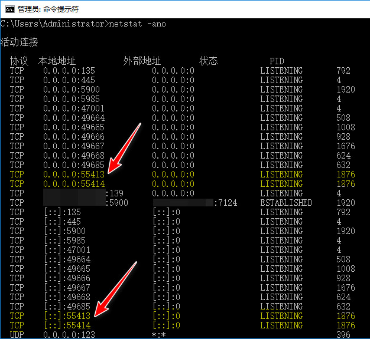


`Windows` 下确保防火墙中已开放 `55413` 和 `55414` 端口。

可以将 `UrBackup` 服务端主程序放入允许通过 `Windows` 防火墙的列表中。

```
C:\Program Files\UrBackupServer\urbackup_srv.exe
```

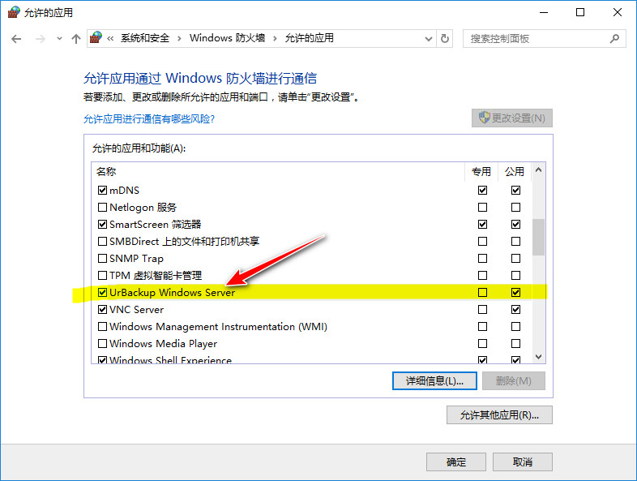


也可以手动新建防火墙规则，将协议端口开放为允许连接。

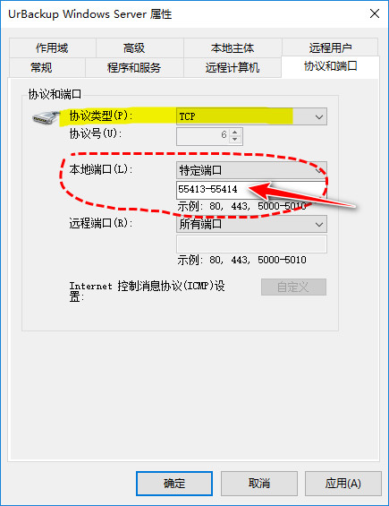


### 创建管理员

默认情况下初次访问 `UrBackup` 设置页面是不需要任何用户登录的，这意味着任何人都可以访问并查看到 `UrBackup` 的设置以及备份信息。

因此，在开始一些重要设定之前，我们必须先为 `UrBackup` 添加管理员帐户。

顶部菜单切换到 `设置` ，并点选 `用户` 选项卡，再点击 `创建用户` 按钮。

我们也能看到，此时并没有任何用户帐户存在。

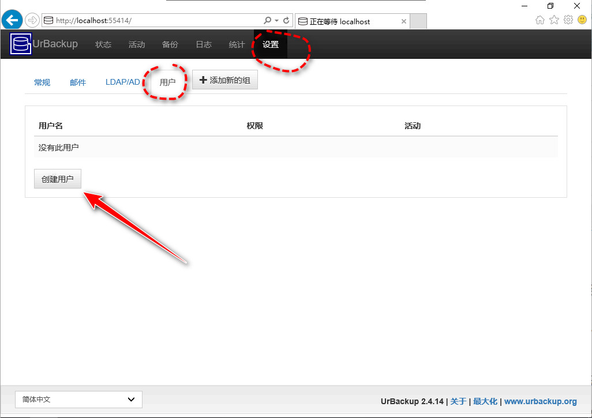


然后我们填写用户名和密码，并点击 `创建` 按钮。

默认权限是管理员的帐户就被成功创建了，在下次访问 `UrBackup` 管理页面进就会被要求使用管理员登录了。

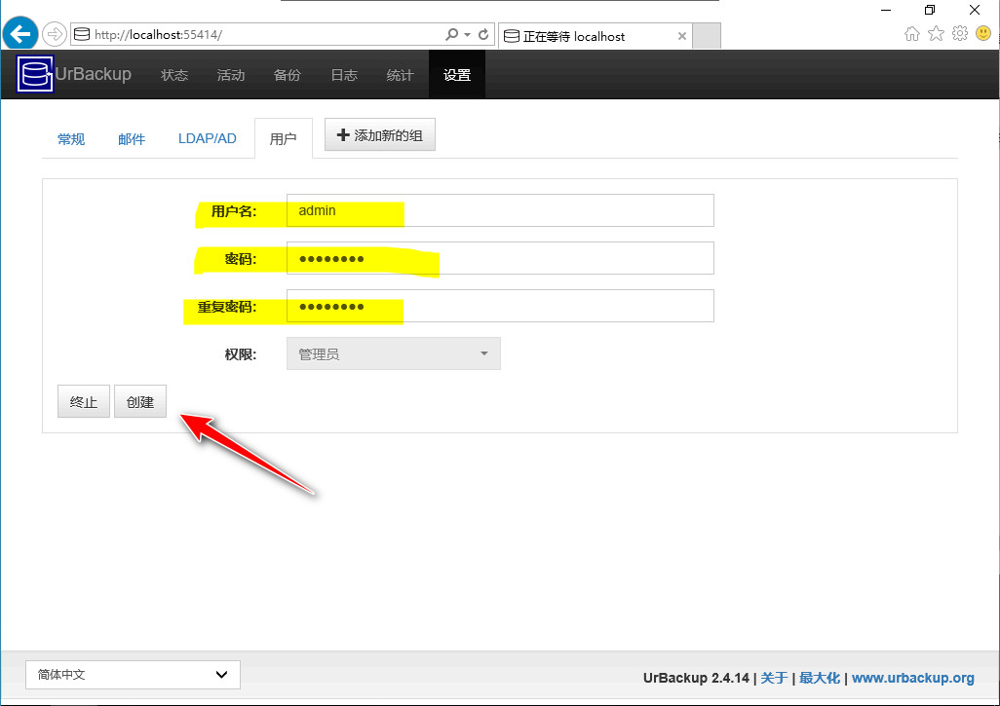


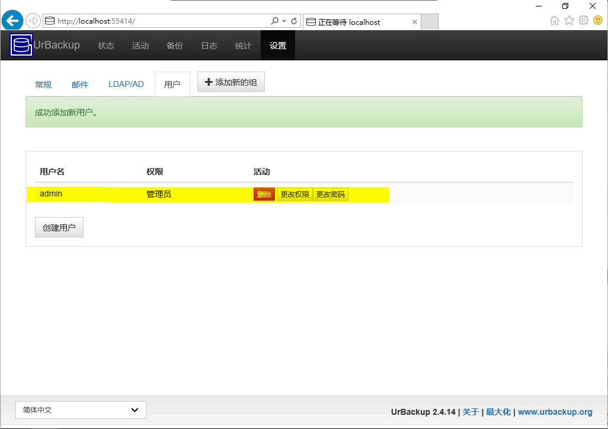


注意，管理员的用户名并不一定是 `admin` ，为了安全起见，你也可以自定义它的名称并务必牢记。

在后续的管理工作中，我们也可以按实际情况创建更多的用户。


### 语言设定

通常 `UrBackup` 会自动切换并显示当前系统所在地区的语言。

如果有必要，可以在 `UrBackup` 页面的左下角可以选择你想要的其他语言。

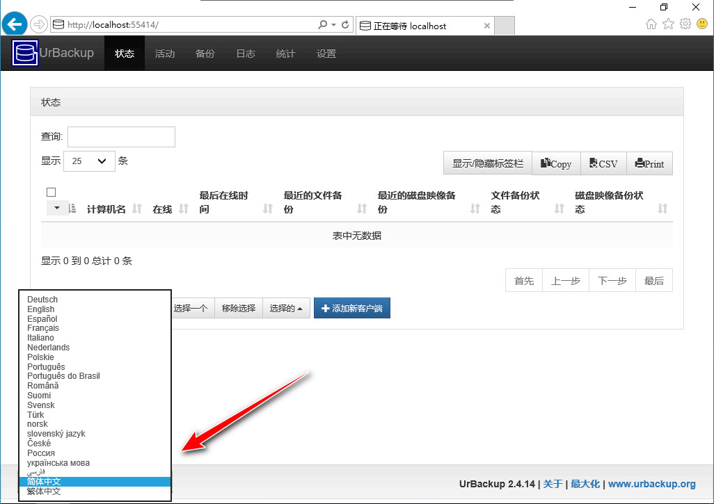


### 动态磁盘的概念

`Windows` 在我们平时使用时磁盘都是以基本磁盘的形态为主而存在。

基本磁盘就是传统的磁盘使用方式，有两种分区方式，一种是 `MBR` ，另一种是 `GPT` 。

`MBR` 最多四个主分区，也可以是三个主分区加一个扩展分区，然后扩展分区里再划分更多个逻辑分区。

`GPT` 最多可创建128个主分区，现在这些分区也可以被称为卷，现在的电脑基本都使用 `GPT` 了，分区数量也够用。

虽然 `GPT` 比 `MBR` 先进，也挺好用，但是它解决不了一个问题。

什么问题？

磁盘组队问题。


不管是分区也好，还是整个磁盘也好，无论 `MBR` 还是 `GPT` 都无法解决前两者的组队问题。

比如，我想把第一块磁盘的一个分区与第二块磁盘的一个分区组成一个大分区用于存放更多的数据。

又比如，我想把第二块磁盘和第三块磁盘组成冗余热备盘。

解决不了这些问题怎么办？

动态磁盘这时候就可以粉墨登场了！


动态磁盘对应并有别于基本磁盘，专门用来解决前面提到的一些更高级的硬盘使用问题。

动态磁盘划分的分区都被称为动态卷，而这些动态卷就可以用来灵活地应对磁盘组队问题。

动态卷有这么几种：简单卷、跨区卷、带区卷和镜像卷。

它们的区别大概如下所述。


* 简单卷：类似于基本磁盘的普通分区，简单卷是动态磁盘下的称呼。动态卷通常是用来组队的，而动态磁盘只有一块而暂时无法组队的时候，那么划分分区时唯一只能是简单卷。


* 跨区卷：用于将多个动态磁盘的不同卷组队在一起，最终形成随时可扩展容量的一个大的逻辑卷。


* 带区卷：两块或两块以上动态磁盘组成，读写数据时分散于各动态磁盘之间，为提高文件访问效率及降低CPU负荷，可以简单地理解为类似于 `RAID0` 。


* 镜像卷：两块动态磁盘组成互为镜像，用于数据容错冗余，可以简单地理解为类似于 `RAID1` 。


`UrBackup` 建议我们使用硬件 `RAID` 或是 `Windows` 动态卷来作为备份文件夹的理想存放目标。

硬件 `RAID` 好处和用法在此不必多说，我们就以前面刚刚解释过的动态卷来作为演示向大家说明其具体做法。


我们在原有 `Windows` 系统基础上添加两块相同容量的磁盘，并将这两个磁盘做成镜像卷。

首先，在初始化之后，磁盘是以基本磁盘形态存在的，我们想要将这两块磁盘做成镜像卷可以有两种方法。

一种是先将它们转换成动态磁盘，然后再组成镜像卷。

另一种是直接做成镜像卷，系统会自动帮我们将它们处理成动态磁盘。


我们就直接点，右键任意一块未分配磁盘，在右键菜单中选择 `新建镜像卷(R)...` 。

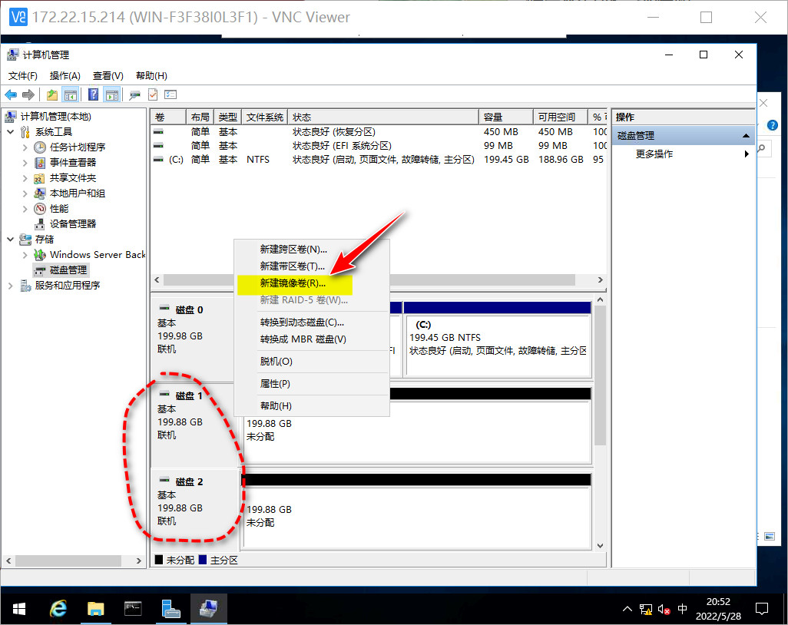


出现新建镜像卷向导，点击下一步。

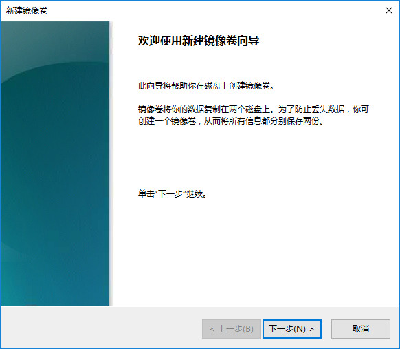


将两块未分配磁盘都添加到已选框内，点击下一步。

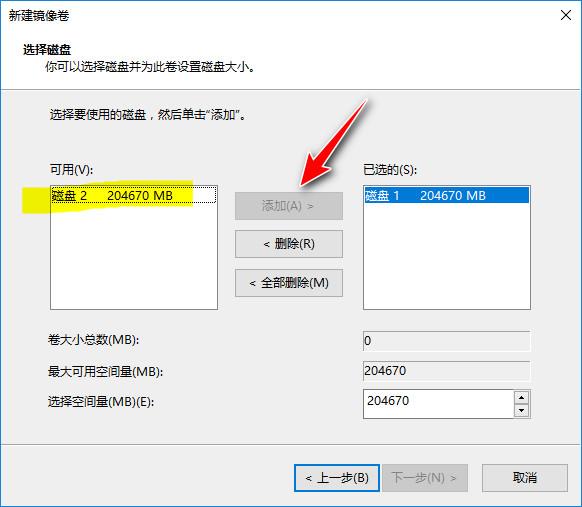


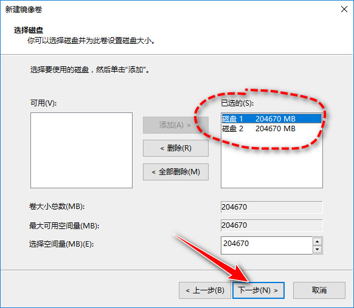


分配驱动器号，点击下一步。

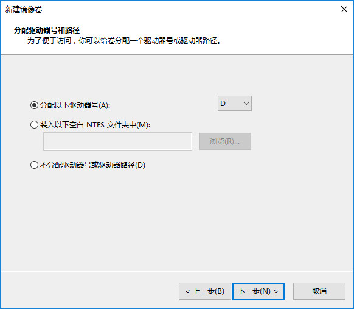


格式化镜像卷，可以在此设定卷标，标识备份盘。

注意，文件系统必须为 `NTFS` 。

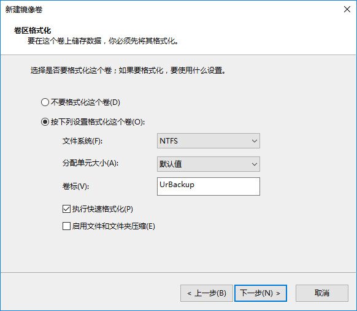


向导收集信息，确认无误后点击 `完成` 开始生成镜像卷。

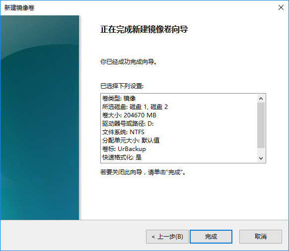


最终动态镜像卷新建成功。

可以看到两块磁盘上都标识为相同的 `D` 盘，它们互为镜像，实现冗余镜像的作用。

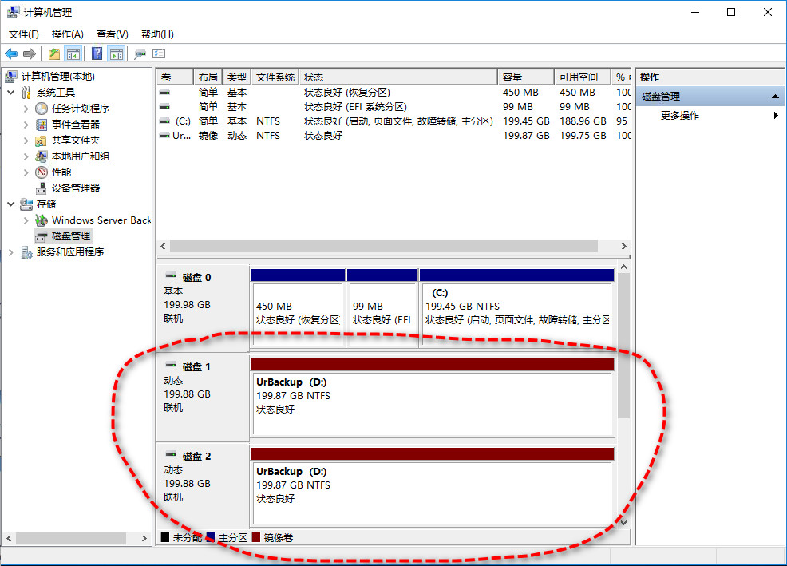


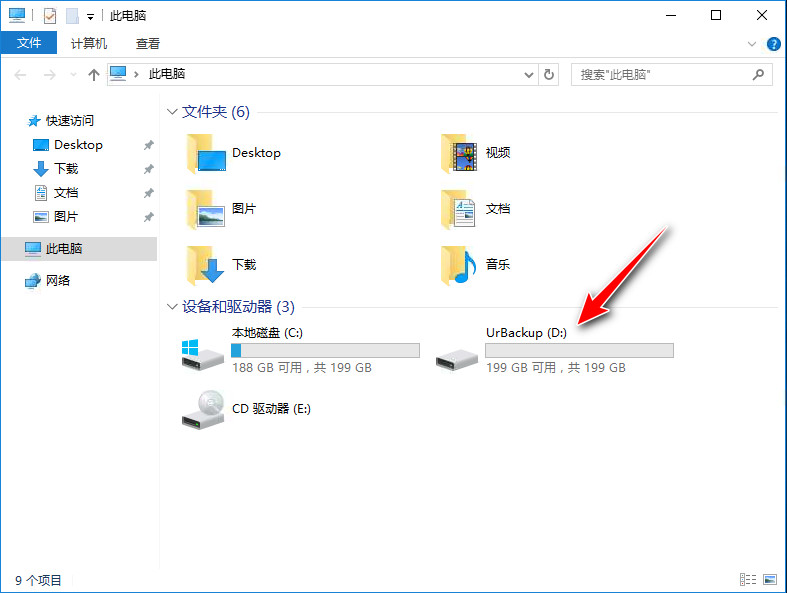


镜像卷可以粗暴地理解为 `Windows` 中的软 `RAID1` ，那么一旦出现磁盘损坏，我们怎么恢复它呢？

在这里顺带简单地说一说吧。

比如镜像卷中的第二块磁盘损坏需要更换一块新的，那么我们将新磁盘（注意容量一致）接入并启动系统后，可以在磁盘管理器中看到如下的样子。

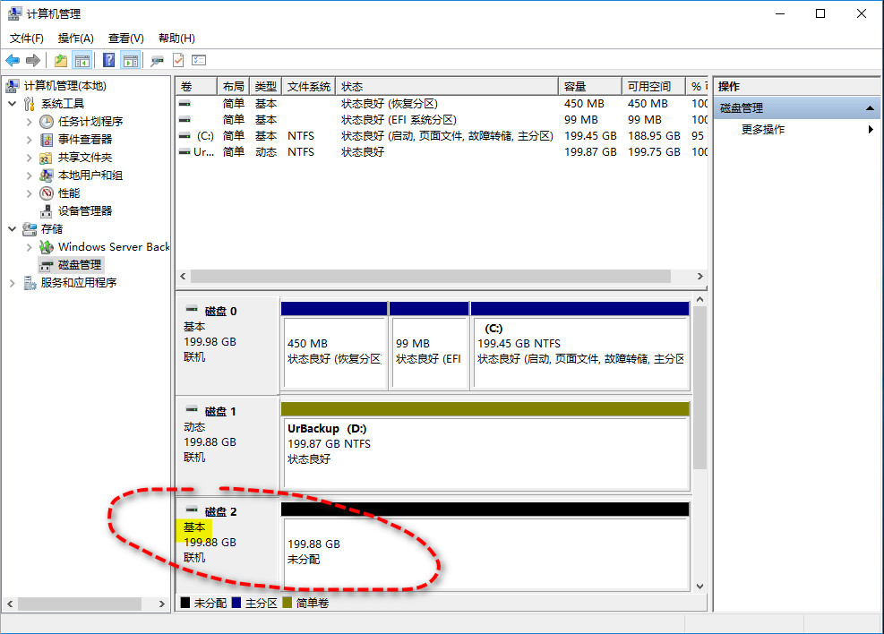


这时镜像卷的第一块磁盘是完好的，因此我们右键点击它，并选择菜单中的 `添加镜像(A)...` 。

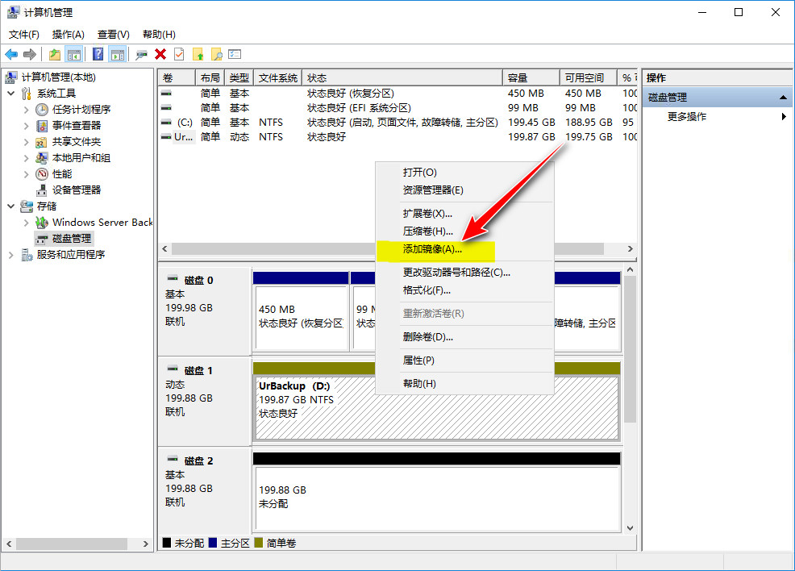


点选新接入的新磁盘，然后点击 `添加镜像(A)` 按钮。

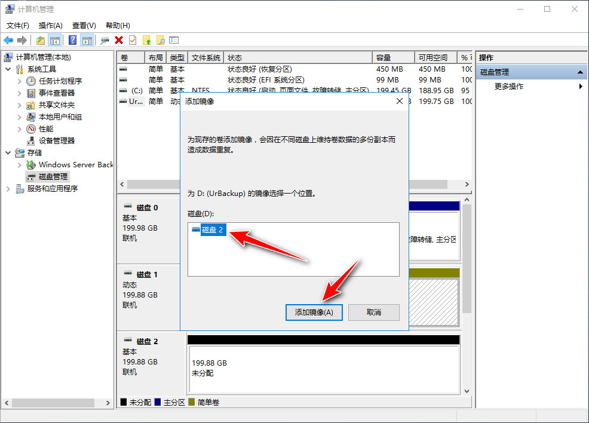


在出现的警告提示窗口中点击 `是(Y)` 继续。

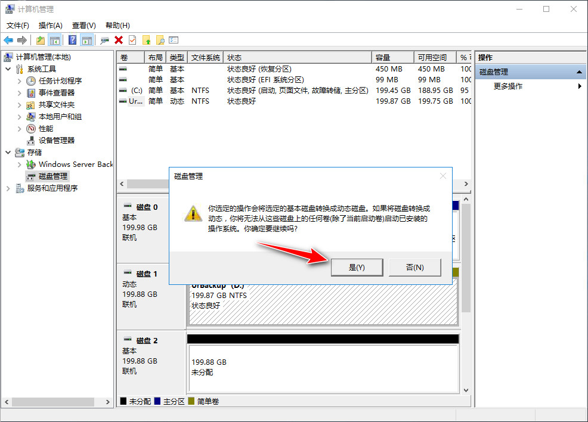


稍等一会儿，系统会识别新磁盘并重新同步镜像卷。

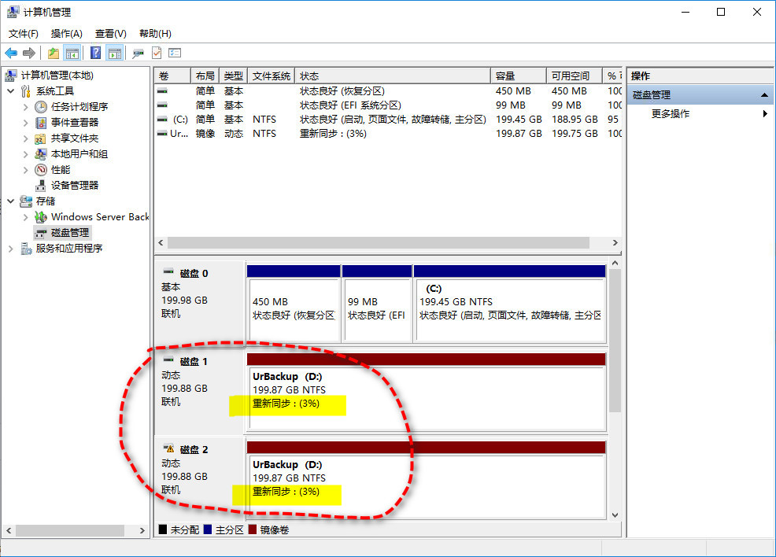


等到同步完成后，镜像卷就又重新恢复到良好状态了。


### 禁用 `8.3` 名称生成

`8.3` 名称概念可能要追溯到古老的 `DOS` 时代，由于计算机系统限制，文件名称超过8个字母或后缀名超过3个字母就会产生意想不到的错误。

具体的如有兴趣可以到网上查阅，有关如何执行此操作，请参阅 https://support.microsoft.com/en-us/kb/121007 。

`8.3` 名称生成在极少数情况下会导致错误，进而降低性能，并且 `8.3` 名称仅在极少数情况下使用，但是它默认却是开启的。

输入以下命令后重启系统可禁用 `8.3` 名称生成 ：

```
fsutil behavior set disable8dot3 1
```

有些 `Windows` 服务器版本的操作系统最好执行一下上述命令，以确保 `UrBackup` 能够正常工作。


### 专用备份分区（盘）

如果你使用的是 `Windows Server 2008(R2)` （或等效桌面版本），可能会有 `NTFS` 卷碎片化严
重而导致复制文件失败的系统问题，这时应考虑应用修补程序，然后使用以下命令格式化备份存储卷。

> https://support.microsoft.com/en-us/kb/967351 


格式化备份分区（盘）。

```
# 格式化命令语法
# /V:Label 分区卷标
# /Q 快速格式化
# /FS:NTFS 文件系统NTFS
# /L:enable 强制使用较大的文件记录，可简写为 /L
Format <Drive:> /V:Label /Q /FS:NTFS /L:enable
```


以当前为例，格式化 `D` 盘。

```
Format D: /V:UrBackup /Q /FS:NTFS /L
```


这可以防止这些操作系统上的大文件操作出现潜在问题。

由于 `Windows Server 2008(R2)` 或 `Vista` 之类系统的生命同期已经结束，因此微软官网相关
的更新补丁也不再提供，基于此建议大家尽量使用较新的 `Windows` 版本系统以避免出现大文件读
写失败问题。

经过我自己的测试，较新版本的 `Windows` 系统直接使用右键菜单中的格式化选项也是可以使 `UrBackup` 正常识别并工作的，并没有什么明显的错误产生。


### 创建并设定备份文件夹

在备份分区（盘）中新建一个用于存放备份数据的文件夹。

比如最简单的，在本例中我们在动态镜像卷 `D` 盘上新建一个名为 `Backup` 的文件夹。

```
MKDIR D:\Backup
```

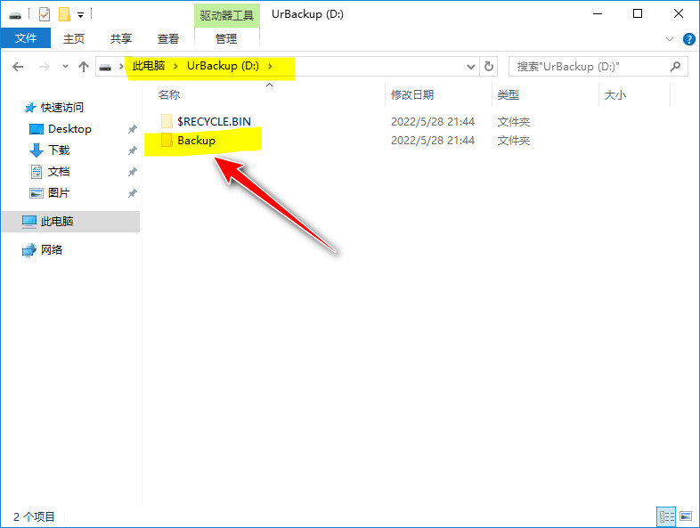


打开浏览器，输入以下网址访问 `UrBackup` 服务管理页面。

```
http://localhost:55414
```

初次进入系统，页面会提示我们无法访问 `UrBackup` 用于保存备份的文件夹。

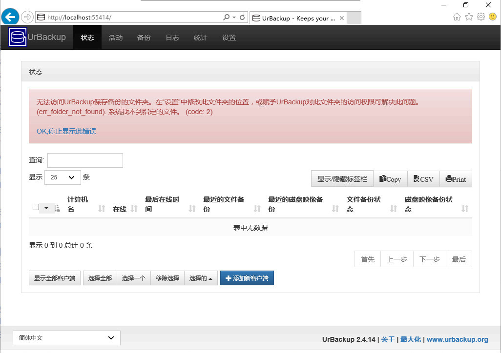


我们可以修改设置，将刚才新建的 `Backup` 文件夹指定为 `UrBackup` 备份文件夹。

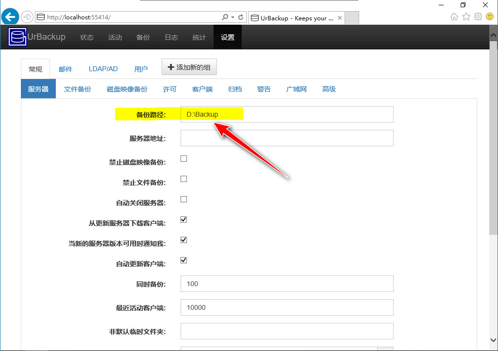


`UrBackup` 会自动在备份文件夹中再创建两个子文件夹，分别用来存放客户端和临时文件。

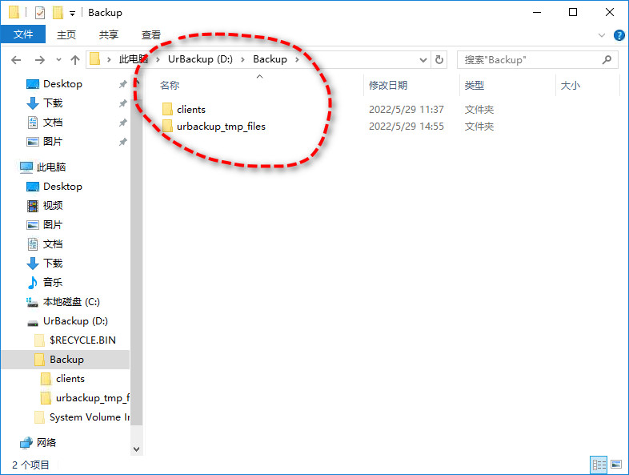


当我们保存备份文件夹设置后，可能会引起杀毒软件报警，这是由于 `UrBackup` 试图在备份文件夹中测试或创建一些必要的子文件夹或临时文件夹。

从图中我们也看到了一些奇怪的现象，`UrBackup` 创建了临时文件 `urbackup_tmp_files\1` ，被示为有安全风险。

但是查出来的结果报告却是 `EICAR_Test_File` ，这是用于测试杀毒软件的测试文件，并不是真正的病毒文件！

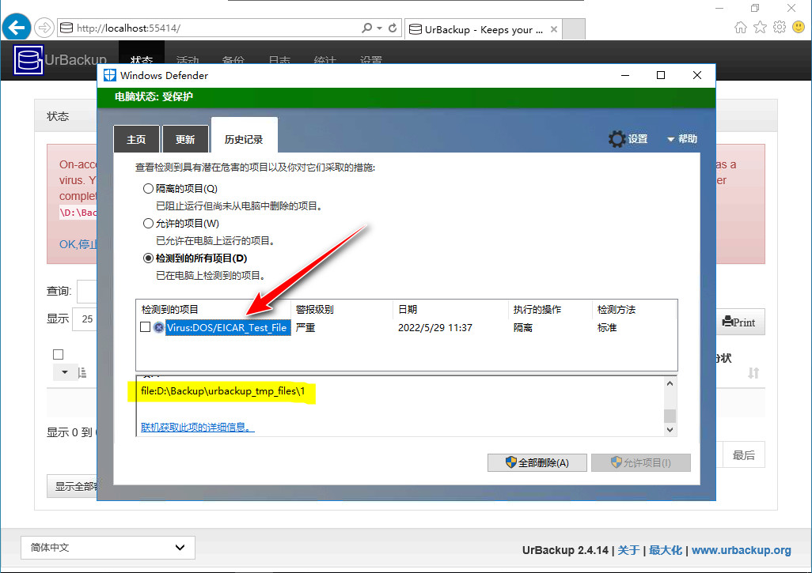


看到如下页面提示，我们才知道刚才实际上就是 `UrBackup` 在测试杀毒软件对备份产生的影响。

`UrBackup` 检测到有杀毒软件正在活动，如果杀毒软件将备份文件视为病毒，那么最终会导致备份失败。

并且，杀毒软件多次扫描备份文件也可能导致性能问题。

基于以上两点，`UrBackup` 建议我们禁用杀毒软件，或至少将 `UrBackup` 临时路径排除扫描监视之外。

答案很明显了，最简单的我们将备份文件夹添加到杀毒软件的排除项中。


各种杀毒软件添加排除项的方法都大同小异，这里用 `Windows Defender` 做为示例。

打开 `Windows Defender` 的设置界面，找到 `添加排除项` 。

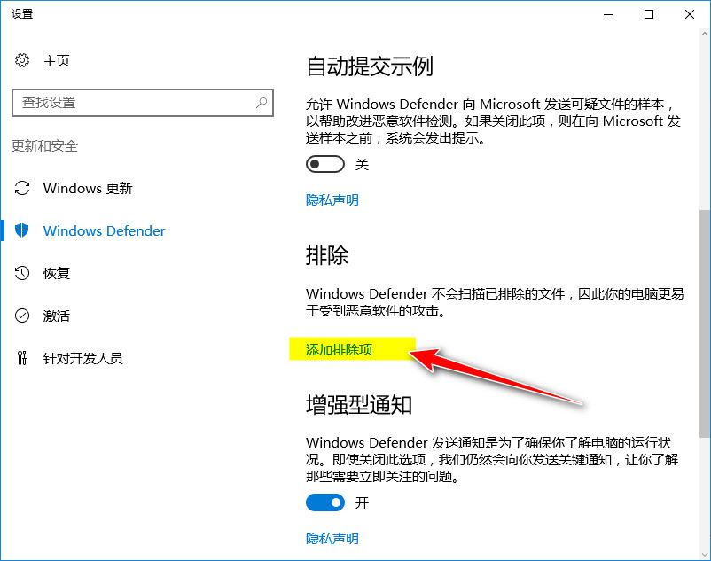


然后点击 `排除文件夹` ，选择备份文件夹即可。

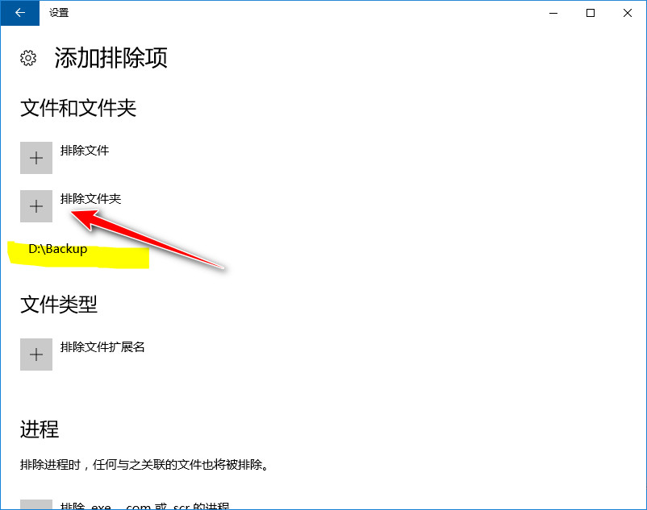


刷新页面，警告消失。


### 客户端正确访问备份

我们都知道，备份是放在服务端的，或者也是服务端指向的某个地方，总之一般是不会在客户端存放的。

假如我们从客户端一侧想直接访问备份的话，往往会收到一个错误消息。

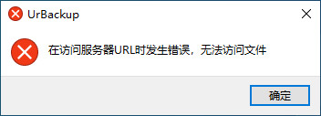


因此，客户端要想正确访问备份，必定要有正确的方式方法，这个方式方法就是设定正确的**服务器地址 `URL`** 。

在 `UrBackup` 管理页面顶部菜单的 `设置` 一项中，依次点击 `常规` > `服务器` 。

我们在 `服务器地址` 一栏中务必填入正确的服务器地址。

比如：

```
http://backups.company.com:55414/
```

需要十分注意的是，客户端应该确保能正常解析这个域名。

如果是内部网络，那么应该解析为内部私有IP地址，如果是外部网络，那么应该解析为外部地址。

基于此，**我们在填写这个 `URL` 时应该确保内外网络都能正常解析访问**。


### 邮件服务器

我们可以通过依次点选 `UrBackup` 管理页面中的 `设置` > `邮件` 来设置邮件服务器。

作为演示，最简单的你我这里可以只设置三项。

* 邮件服务器名 - 域名或IP地址
* 邮件服务器端口 - 数字形式
* 服务器管理员邮箱地址 - 用于接收报警信息


当然，出于安全等因素考虑，实际使用时肯定还会补充填写其他选项，请小伙伴们根据实际情况填写吧。

此外最后一项发送测试邮件，我们可以写上一个接收邮件的邮箱地址，保存设置后看看能不能正常收到邮件。

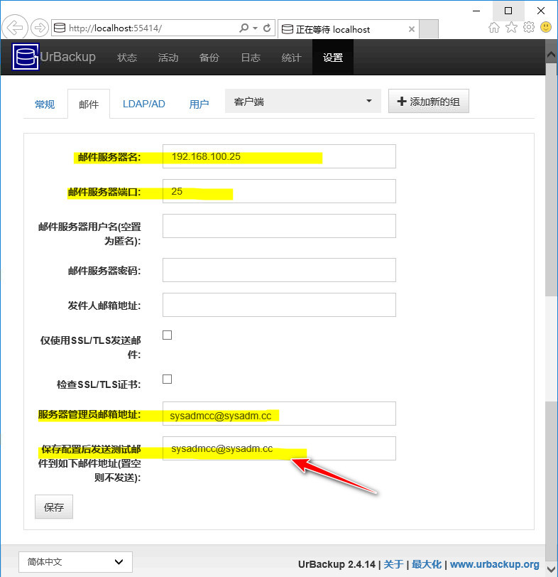


测试邮件发送成功后，我们会收到如下内容的邮件。

```
UrBackup mail test
This is a test mail from UrBackup
```

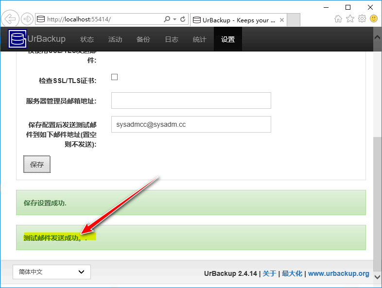


OK！和其他系统报警设置一样，如此一来当 `UrBackup` 有错误或其他一些信息的话就会通过邮件及时通知我们了。

比如，我们来到日志管理页面，输入管理员邮件地址，点击 `+` 加号按钮添加（可多项）。

然后具体地可以调整下面一些日志级别之类的选项，这样我们就可以实时收到日志方面的报告了。

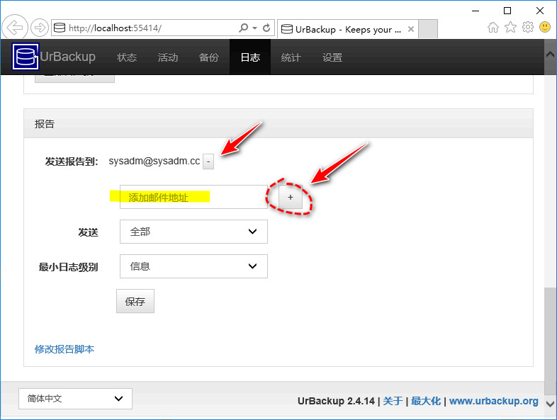


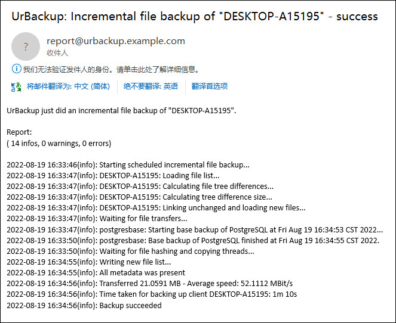


## 墙裂推荐 `PDF` 付费版本：《UrBackup Server 2.4.x 管理手册中文版（网管小贾高级进阶版）》

## <关注网管小贾微信公众号，发送 000946 获取>

> https://www.sysadm.cc/index.php/xitongyunwei/946-download-advanced-chinese-version-of-urbackup-server-2-4-x-administration-manual 


### 客户端安装

从官网下载最新版 `UrBackup` 客户端安装程序，通常选择 `exe` 可执行文件格式。

双击安装程序，选择语言。

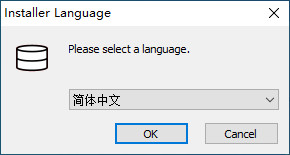


开启安装向导，点击下一步。

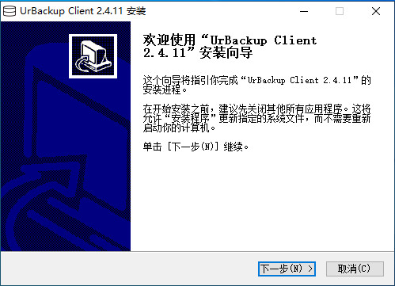


阅读授权协议，`UrBackup` 是 `AGPLv3+` 协议，点击 `我接受` 。

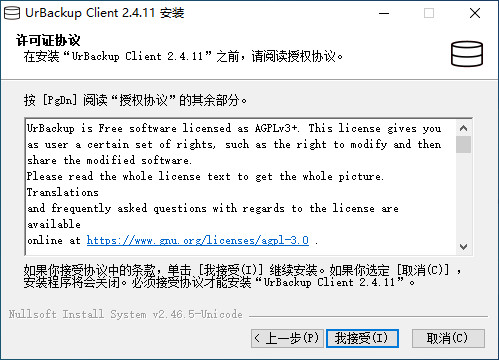


保持默认或选择安装路径，点击 `安装` 。

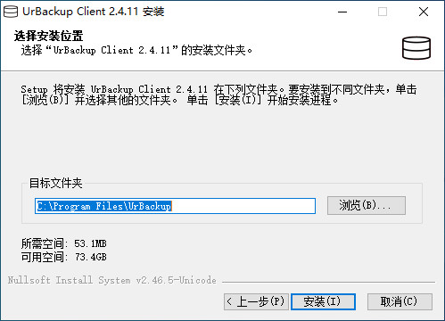


程序开始安装，稍等片刻即可完成。

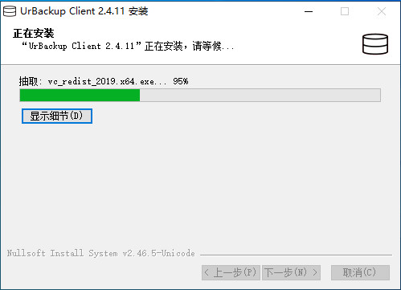


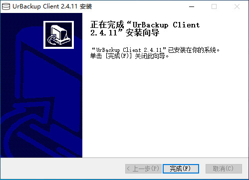


在点击 `完成` 按钮之前，我们在任务管理器中就能看到，`UrBackup` 的后台服务就已经开始为我们工作了。

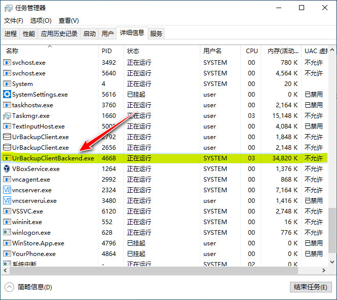


点击安装向导的 `完成` 按钮后，程序自动弹出备份选择窗口。

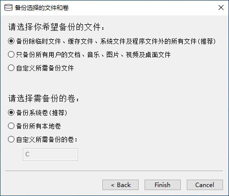


初次设定，需要我们选择所需备份的内容。

分两个部分，一是文件，二是卷。


所需备份文件方式又分三种。

* 备份除临时文件、缓存文件、系统文件及程序文件外的所有文件（推荐）

  *> 基本可以理解为备份整个系统，包括 `C` 盘以及其他所有盘*

* 只备份所有用户的文档、音乐、图片、视频及桌面文件

  *> 仅备份客户端所有用户的资料文档，适合普通用户资料较少的场合*

* 自定义所需备份文件

  *> 较为灵活的备份方式，比如只想备份 `E` 盘的某个文件夹*


所需备份的卷也分三种。

* 备份系统卷（推荐）
* 备份所有本地卷
* 自定义所需备份的卷


从前面的图片中我们也可以猜到，如果此时取消备份选择的话，那么 `UrBackup` 就会使用默认备份设置。

在我们做出选择之前，`UrBackup` 已经自动将客户端纳入管辖。

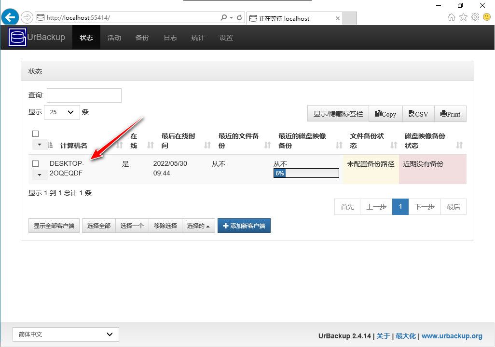


服务端的备份文件夹内也出现了客户端所属的子文件夹。

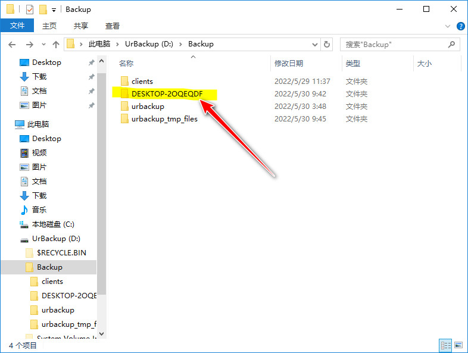


其中早已默默创建了系统卷的备份信息，甚至很神速的备份都已经搞定了？

实际上这些并非备份内容，只是客户端的一些系统信息，后续还需要我们指定具体的备份路径才行。

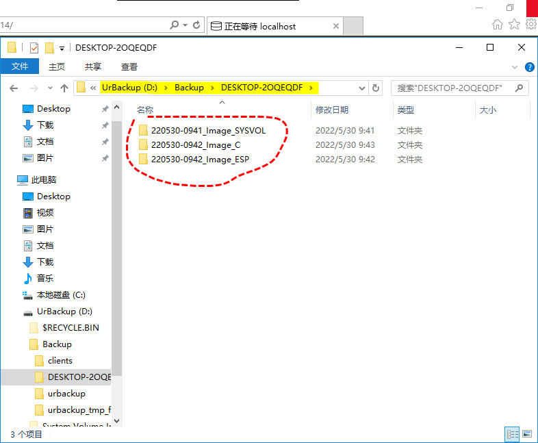


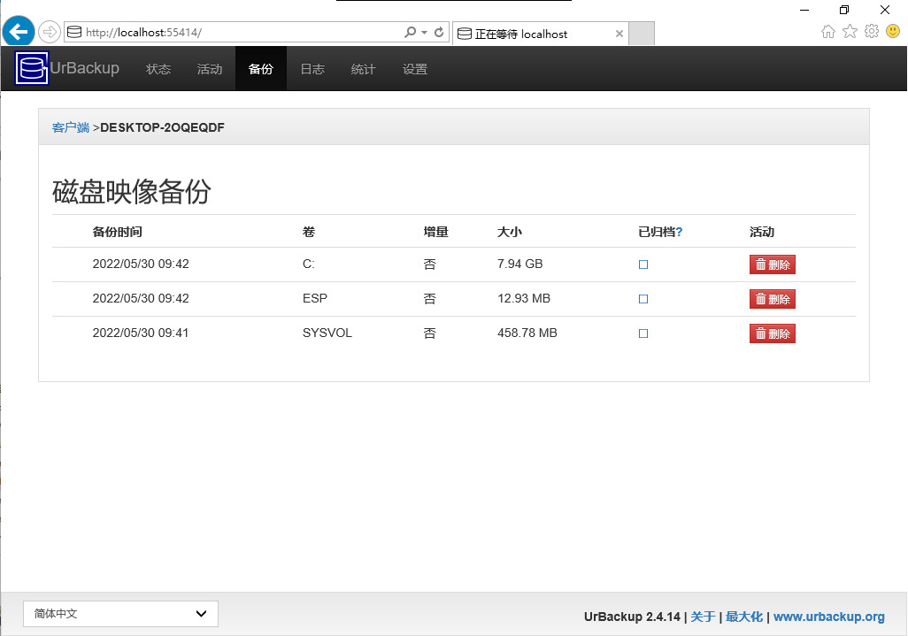


客户端安装完成后，在任务栏中会出现 `UrBackup` 图标，白色表示空闲状态。


鼠标左键点击图标，可以看到客户端已经正常连接到局域网中的服务器，当前处于空闲状态。

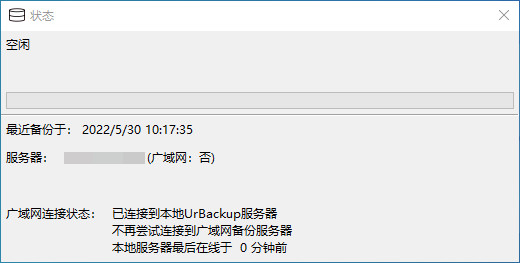


鼠标右键点击图标，弹出相关操作菜单。


##### 客户端右键菜单

点击 `访问/恢复备份` ，`UrBackup` 会通过 `Web` 方式自动找到并打开服务端的备份信息。

如果你的菜单中没有这一项，那么可能是你未在正确设定服务器地址 `URL` ，可以参考前面的内容。

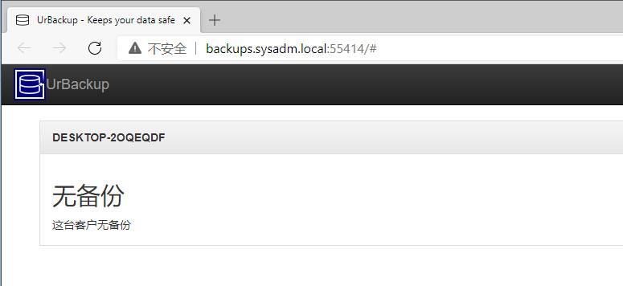


从图中我们了解到，当前客户端还没有可用的备份。

这个时候我们可以等待下一个备份时间窗口触发备份，也可以手动执行备份。

手动备份可以是完全备份或增量备份，也可以是磁盘映像（卷）的完全备份或增量备份。

这里还是要插句话，`UrBackup` 的增量备份是完全加增量，其概念有别于我们传统的认知，需要注意！


接下来是 `设置` 项，其中包括文件备份、磁盘映像备份、客户端以及广域网的具体设定。

文件备份和磁盘映像备份可根据实际情况调整备份时间间隔、上下限以及包含排除项等等。

磁盘映像备份的时间间隔须勾选 `活动中` 方可设置调整。

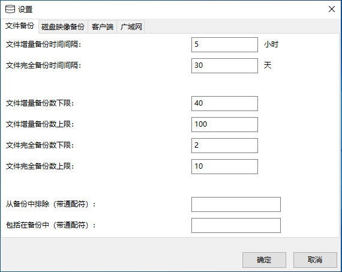


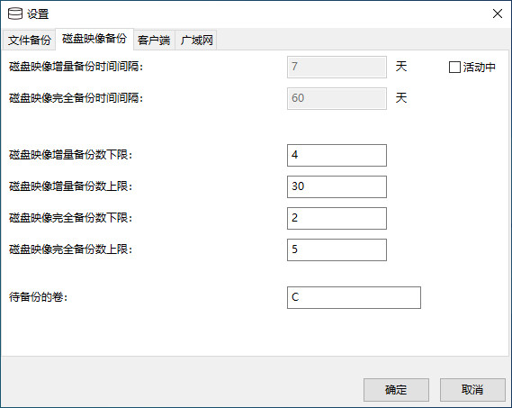


客户端选项卡中的备份窗口是以一周七天并24小时为默认值。

根据实际需求，可以自行调整，比如 `1-5/0-6` 为周一至周五的0点到6点期间进行备份动作。

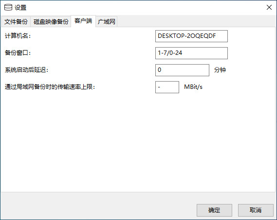


如果你的客户端并非与服务器在同一局域网内，那么在 `广域网` 选项卡中务必勾选 `启用通过广域网备份` 。

与此同时，填写服务器的域名地址，千万别忘记客户端一定要正确解析并访问到服务器哦！

广域网服务器密码用于通讯，可到服务管理设置中确认。


客户端在最初安装之后我们还没有指定具体的备份路径。

在右键菜单中点击 `增加或删除备份路径` ，然后在弹出的窗口中点击 `添加路径` 按钮。


在 `日志` 窗口中，我们可以通过切换过滤器来查看信息、警告或错误。


配置需备份的组件。

* `Task Scheduler Writer` - 任务计划
* `VSS Metadata Store Writer` - 卷影存储
* `Performance Counters Writer` - 性能计数
* `Registry Writer` - 注册表
* `COM+ REGDB`
* `WMI`


### 客户端卸载

卸载 `UrBackup` 客户端很简单，找到控制面板中的对应项卸载即可。


### 客户端任务栏图标颜色释义

*  - 备份状态OK
*  - 备份失败、未备份或未连接到服务器
*  - 备份索引或进行中
*  - 备份进程暂停中


### 客户端不开始备份的处理方法

遇到客户端安装好后却不开始备份的情况，那么大体地我们可以先去看一下服务器的设置。

首先，确认客户端是否已经被添加到了服务器中，并查看状态是否在线。

其次，有可能是我们还没有来得及给客户端配置备份路径，那么参照前面介绍的内容配置备份路径。


之后手动触发备份进程，确认备份状态是否变更为索引或备份进行中。


同时在服务器一侧确认备份状态是否正常。


然后等待备份逐步完成。


最后确认备份是否正常生成，再观察后续备份是否可以正常启动进行。

注意，如果我们看不到备份也不要着急，备份列表的生成是需要一些时间的，可以稍等一会儿确认。


### 客户端恢复备份

右键点击图标，在菜单中选择 `访问/恢复备份` 。


点击你想要恢复的备份。


在选择的备份中，我们可以直接点击 `将文件夹恢复到客户端` ，也可以按实际情况点击列表选择恢复部分文件。

注意，此操作在服务端也是一样操作的。


无论是由服务端还是客户端发起的，一旦备份被选定恢复，在客户端就会出现允许恢复的确认窗口。


根据备份大小和传输速度，恢复有快有慢。


注意，原数据有被覆盖的风险，请务必确认清楚所恢复的备份内容！


### 客户端广域网的连接方法

客户端安装完成后如果局域网内没有 `UrBackup` 服务器，那么它会提示连接广域网，并且图标呈红色状态。


为了让客户端能够通过广域网的方式连接到 `UrBackup` 服务器，那么我们需要做到以下工作。

首先，在服务端，设定允许广域网访问。

管理页面中依次找到 `设置` > `常规` > `广域网` ，勾选 `允许广域网模式` ，填写服务器的域名/IP以及端口号。


其次，客户端这边，我们右键点击任务栏图标，在弹出的菜单中选择 `设置` 。


服务端需要重启使广域网模式生效。


最好确认一下广域网服务是否正常工作。


在其中的 `广域网` 选项卡中，勾选启用广域网备份设置，并填写服务器的域名或IP地址，同时别忘了端口号。

此处需要我们注意两点。

一，服务器域名必须能正确解析。

二，端口号通常可以使用默认的 `55415` ，也可以在服务端设定新端口 ，另外确保已在防火墙开放。


即使设置完成，但是这个时候客户端仍然不能正常连接到服务器。

`UrBackup` 会提示未知客户端，很明显，服务端需要添加客户端信息。


我们来到服务端管理页面，在状态页面中点击 `添加新客户端` 按钮。


然后填写好客户端的主机名称，或是IP地址。


OK，客户端添加成功，同时系统也给出了认证密匙。


如果不小心关闭了当前页面也不用担心，我们可以在设置中选择新添加的客户端。

然后在其 `广域网` 选项卡中仍然可以查询到认证密匙。


而在客户端一侧，状态显示认证失败。


此时我们需要将服务端给出的密匙填写到设置中。


最后稍等一会儿，`UrBackup` 会自动识别并成功连接到服务器。


一旦通过广域网连接，客户端备份默认只能进行文件备份，而不能进行磁盘映像备份。

若要开启，需要到服务器上设置启用 `通过广域网进行磁盘映像备份` 。


无法开始备份，等待服务器中


解决的方法很简单，一是确认是否添加了备份路径，二是重启服务器的 `UrBackup` 服务。


可能通过为客户端新建用户，来使客户端自主查看服务端的设置。


### 移除客户端

有时我们想将无需要备份的客户端移出服务端，这样可以节省服务端的维护成本。

不过需要注意的是，在开始移除客户端之前，我们务必要先将备份妥善保存好。


不管是在服务端，还是在客户端，我们都可以找到被移除客户端的完整、有效的备份，将其以 `ZIP` 格式下载下来保管好即可。

切记一定要看清楚备份时间，并且最好打开 `ZIP` 压缩包检查一下备份是否可靠可用。


接下来就可以动手移除客户端了。

首先，我们右键点击 `UrBackup` 的任务栏图标，点击 `退出` 。


其次，依次打开 `控制面板` > `卸载或更改程序` ，找到 `UrBackup (remove only)` 一项开始卸载。


卸载完成后，检查一下服务管理器中是否还存在 `UrBackupClientBackend` 服务。

如果服务不存在，说明卸载成功完成。

此时我们查看服务端情况，发现客户端虽然完成卸载，但在服务端列表中却仍然保留着客户端信息，只是状态为离线。


可以理解为服务端为我们保留了客户端的原有备份信息，如果不到万不得已，建议最好保留这些信息。

如果为了节省磁盘空间，可以将较旧备份删除，只保留较新的备份。

话又说回来，我就是想将这个客户端彻底移除，那该怎么办呢？

接着前面讲的卸载客户端之后，我们继续作业！


我们来到服务端管理页面，在列表中找到将要移除的客户端，点击下拉箭头，选择 `移除客户端` 。


确认是否真的要删除客户端。


客户端一旦被移除，在页面的下方会出现将被移除的提示信息。

同时系统也给了我们后悔药，如果我们误操作，或是不想删除客户端了，那么我们可以点击 `停止移除客户端` 。


此外在清理时间窗口期过后，系统会彻底删除客户端。

需要我们务必注意的是，客户端一旦被彻底删除，那么与之相关的备份历史和记录也会一同被删除。

而清理时间窗口的设定与备份时间窗口原理一样，由 `周几-周几/几点-几点` 构成，比如默认值  `1-7/3-4` 就是周一到周日的上午3点到4点。


前面讲的是客户端配合服务端移除客户端的方法。

其实如果我们没有权限管理服务端，那么完全可以在客户端一侧自己完成卸载。

在服务端事先开通可以登录的用户帐户，通过在客户端浏览器上登录管理页面，我们就可以看到移除客户端的选项了。


如果你发现没有这么一项，那么可以为当前用户追加移除权限。


如果由于操作失误，或是其他什么原因导致客户端没能正常删除，那么在服务端有可能仍会残留部分客户端的信息和备份文件。

除了占用空间之外可能对你来说真的是一无是处，因此我们还可以强制清除已经删除的客户端。

这是用来释放被无端占用空间之用，相比手动删除文件要保险得多！

方法如下，以管理员权限运行 `cleanup` 命令即可。


```
# x是想要释放空间的容量或百分比，比如500M、20G或10%，要全部清空就用0%

# on GNU/Linux:
urbackupsrv cleanup --amount x

# on Windows:
cleanup.bat x
```


## 墙裂推荐 `PDF` 付费版本：《UrBackup Server 2.4.x 管理手册中文版（网管小贾高级进阶版）》

## <关注网管小贾微信公众号，发送 000946 获取>

> https://www.sysadm.cc/index.php/xitongyunwei/946-download-advanced-chinese-version-of-urbackup-server-2-4-x-administration-manual 


### 写在最后

以上内容可以说是在 `Windows` 上运用 `UrBackup` 备份系统时的最佳实践总结。

当然了肯定还有其他一些细节没有在本文中体现，如果有小伙伴遇到相关疑难问题，欢迎留言讨论。

**喜欢并使用 `UrBackup` 的小伙伴们，我建了一个 `UrBackup` 的讨论群，方便大伙儿一起交流学习。**

如果你们有兴趣可以留言给我，我可以把你们拉进来，如有好的建议，欢迎积极发言哈！

最后走之前，关注我，不迷路！


#### 创作平台：微信公众号，头条号，知乎（其他均为转载，请注意甄别）


**扫码关注@网管小贾，个人微信：sysadmcc**

网管小贾 / sysadm.cc


