## 使用 `UrBackup` 备份和恢复 `MySQL` 和 `MariaDB`

### Backup and Restore MySQL and MariaDB with UrBackup


**作者：网管小贾 / sysadm.cc (2022年9月20日)**


移动互联网如此发达的今天，伴随其一起成长起来的 `MySQL/MariaDB` 可以说是众多重要软件元老之一了。

`MySQL/MariaDB` 是最流行的关系型数据库，很显然它的备份非常重要，备份方式也是五花八门、不尽相同。

而 `UrBackup` 作为开源免费的备份解决方案，也同样提供对 `MySQL/MariaDB` 备份的支持。

那么今天我们就来看看，这哥俩能不能互相配合默契、一块有效工作。


我们假定 `UrBackup` 服务端已经安装好了，如果你还没有服务端，可以参考 `UrBackup` 管理手册或是我的其他文章，最简单地可以使用 `Windows` 来做。

**墙裂推荐 PDF 付费版本：《UrBackup Server 2.4.x 管理手册中文版（网管小贾高级进阶版）》**

**<关注网管小贾微信公众号，发送 000946 获取>**


### `MySQL` 服务运行环境

> 操作系统：`Oracle Linux 7.9`
>
> 数据库：`Percona MySQL 5.7`
>
> 备份系统：`UrBackup 2.4.x`

注：`Oracle Linux` 与 `CentOS` 类似，因 `CentOS` 被官方和谐，故使用 `Oracle Linux` 。


### 准备好 `MySQL` 数据库

安装 `MySQL` ，我这里用的是 `Percona MySQL 5.7` 作例子，具体安装过程就不赘述了。

反正假定你已经安装好了 `MySQL` ，注意哦不是 `MariaDB` ，当然其实都是一样的，只是接下来的测试中脚本内容会不太一样。

好了，新建一个数据库，对其做增删数据操作，一会儿好用于观察测试备份恢复情况。

```mysql
CREATE DATABASE `www.sysadm.cc`
```

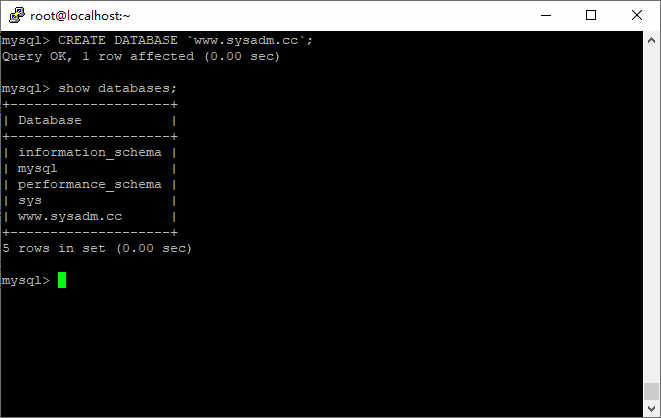


### 安装 `UrBackup` 备份客户端

当然，如果你的 `MySQL/MariaDB` 是在 `Windows` 上跑的，那么 `UrBackup` 客户端自然要安装 `Windows` 版本的。

不过大部分情况 `MySQL/MariaDB` 还是在 `Linux` 上跑的多，因此客户端也理所当然需要 `Linux` 版本了。


在 `Linux` 下安装 `UrBackup` 客户端程序，按照官网说明直接使用一行命令。

注意：可能会提示找不到 `wget` 命令，用 `yum install wget` 安装它即可。

> 官网链接：https://www.urbackup.org

```shell
TF=$(mktemp) && wget "https://hndl.urbackup.org/Client/2.4.11/UrBackup%20Client%20Linux%202.4.11.sh" -O $TF && sudo sh $TF; rm -f $TF
```


询问是否将 `UrBackup Client 2.4.11` 安装到 `usr/local` 。

我们就老老实实用默认设置吧，按 `Y` 继续安装......

下载过程可能会花些时间，别着急，可以先关注一下**@网管小贾**，后面可能会用到哦！


选择快照机制，备份时可以达到提高效率的一种快速机制。


注意了，快照备份可以在 `Windows` 上玩得开，但在当前的 `Linux` 环境上似乎还无法使用。

因为快照功能会先在本地磁盘上生成快照文件，然后再执行和传输备份，所以它要占用很大的磁盘空间。

同时我也没有开启 `LVM` 逻辑卷，此外我也没有安装 `dattadb` 写时复制内核模块，所以我们在这里选择 `4) Use no snapshot` ，也就是不用快照功能。

OK！最后 `UrBackup` 客户端也很顺利地安装完成了！

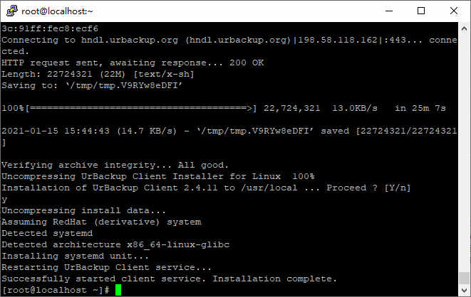


在同一局域网网段下，服务端很快就找到了客户端。

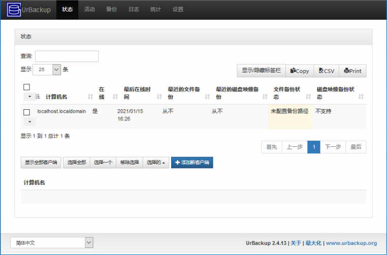


好了，就像众多美食节目一样，各种菜品出炉前的食材都已经准备就绪，接下来正式上手！


### 最简单易上手的方法，使用 `SQLDUMP` 来备份

我们这次不完全按照官网的说明来操作，我们按照 `UrBackup` 为我们默认提供的模板文件自己来自定义配置参数和脚本，这样做的好处就是可以做到多个目标服务的备份（也就是可以做灵活多库备份）。

官网的脚本都已经帮我们写好了，我们只要复制后再改一改就能用了。

那么具体怎么复制，又怎么改呢？

简单哦，只需要修改 **两个地方** 的 **三个文件** 就行了。


##### 先说说两个地方

一个是用户（也就是你自己）参数配置的所在地，路径如下。

```
/usr/local/etc/urbackup/
```


另一个是 `UrBackup` 程序本体系统的脚本所在地，路径如下。

```
/usr/local/share/urbackup/scripts/
```

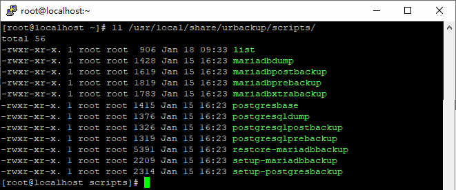


这两个路径中的文件就是 `UrBackup` 给我们准备好的脚本，接着就是针对这两个所在地中的文件来操作，复制并修改其中的三个文件，即可达到定制备份的目的。


##### 再来聊聊三个配置文件

**1、`UrBackup` 总列表 `List` 文件**

这是一个总览列表文件，有点像一个备份的计划总表，在其中我们需要添加两项内容：

a、给 `UrBackup` 看的执行脚本文件（跑备份用的）

b、你自己定义的参数配置文件及路径（你想让它生成什么内容等等）

```
vim /usr/local/share/urbackup/scripts/list
```

这里我们照猫画虎，仿照带有 `mariadbdump` 字样的那一项，然后在其下方新增一项并将其命名为 `mysql_for_dump` ，以区别原有的 `mariadbdump` 。

注意，千万不要复制错了，不同配置或脚本跑起来内容是不一样的哦！

记得在下方也要多复制一行脚本参数来对应前面的配置。


**2、给 `UrBackup` 看的执行脚本文件**

接着复制脚本文件 `mariadbdump` 到一个新文件，并将新文件重命名为 `mysql_for_dump` ，然后再修改一下脚本内容。 

```shell
cd /usr/local/share/urbackup/scripts/
cp mariadbdump mysql_for_dump
vim mysql_for_dump
```

将其中的大概第 `26` 行的

```
. /usr/local/etc/urbackup/mariadbdump.conf
```

修改为

```
. /usr/local/etc/urbackup/mysql_for_dump.conf
```

也就是指向前面那个新的配置文件。

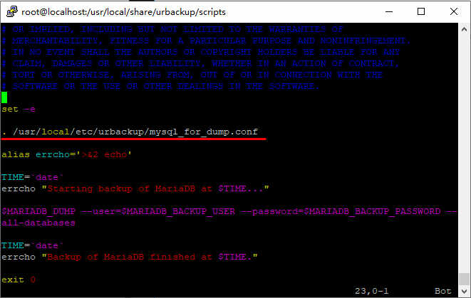


**3、你自己的参数配置文件及路径**

然后，就是复制配置文件 `mariadbdump.conf` 到一个新文件，并将新文件重命名为 `mysql_for_dump.conf` ， ，然后再修改一下配置内容。

```
cd /usr/local/etc/urbackup/
cp mariadbdump.conf mysql_for_dump.conf
vim mysql_for_dump.conf

```

将其中几个字段按实际情况修改，比如：

开启 `DUMP` 备份： `MYSQL_FOR_DUMP_ENABLED=1` 

别忘记确保可正常访问数据库的帐号和密码哦！

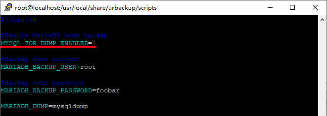


##### 测试备份与恢复

如果正确地按以上配置设定好文件及其参数，那么备份很可能已经自动开始了。

到服务端查看，可以看到备份已经完成了。


备份是全自动的，不用操心了，但恢复可就需要我们手动来操作了，正好我们也要测试一下恢复功能。

其实用 `sqldump` 的恢复本来就很简单，只要把备份的 `sql` 文件导入到数据库中即可，本地导入或远程导入都是可以的，怎么爽怎么来。

以前面的参数设置为基础举例，可以将备份 `sql` 文件上传到系统中，然后执行恢复命令。

```
mysql -uroot -p < mysql_for_dump.sql

```


小结一下，本方法就是利用 `UrBackup` 自带的备份脚本来实现 `SQL` 备份的，只不过如果我们想要更加灵活地实现一些备份效果，那最好是参考复制这些自带的脚本并修改其中一些参数。


通过 `SQL DUMP` 来实现备份的方法比较简单直观，由官方脚本背书不太会出大错，但它还是存在一些优缺点的，需要我们根据实际场景来调整切换使用。


**比如它有以下几个优点：**

* 易于设置，这个不用多说，拿现成脚本复制修改即可。
* 允许在恢复时迁移到不同的 `MySQL/MariaDB` 版本，因为它本质是执行 `SQL` 语句嘛！
* 备份结果为非二进制，因此你可以在恢复数据之前手动做一些删除表或修改数据的动作。 
* 备份容量可以更小，因为它不包含索引。 

**同时缺点也不少：** 

- 恢复时间可能会更长，因为 `MySQL/MariaDB` 必须重建索引。
- 增量备份可能会导致 `UrBackup` 增加较为明显地传输数据量。
- 在增量备份期间必须读取完整的数据库（不包括索引）。 


因此结论是，如果你拥有一个较小规模不是太大的数据库（比如 `1GB` ），那么可以考虑这个方法。

当然了，随着现在硬件性能的高速提升，这个 `1GB` 的官方提法并不是绝对的，还是要我们实际测试过了才算有比较可靠的结论。

PS：如果你在测试过程中遇到错误或失败，那么仔细对照前面的步骤，很可能有哪些地方你没有修改正确。


### 适合 `Windows` 平台使用的快照备份

这部分内容在之前的旧文章中并没有写进来，即使官网有这么一小块介绍。

我没有写它的原因是，在 `Windows` 所谓实现 `MySQL/MariaDB` 备份的本质怎么看都是文件备份的一种。

这次为了使文章内容更加完整，因此将其一起记录下来。


前面我们也说过，默认 `Linux` 是无法开启快照功能的，这要依靠某些模块配合，实施起来有点复杂。

但是换到 `Windows` 上就完全不一样了，妥妥地一切已经就绪，就等用户来用就是了。

原因很简单，`Windows` 就文件系统来说已经支持快照备份功能了，这个我们可以通过阅读 `UrBackup` 管理手册了解。

那么这个方法有哪些优缺点呢？


**优点：** 

- 易于在 `Windows` 上配置部署。
- `UrBackup` 仅传输更改变动的数据。
- 正确的进度指示。
- 如果网络速度很快，则可以快速恢复，因为备份中包含索引。

**缺点：** 

- 你可能无法在 `Linux` 上设置快照方法。
- 因为备份了索引，所以备份可能比 `sqldump` 方法生成的备份大。
- 数据无法被恢复到以前较旧的 `MySQL` 版本。
- 如果没有可用的更改块跟踪，则必须在增量备份期间读取完整的数据库。
- 快照可能会降低数据库访问速度，具体取决于快照存储写时复制数据的位置（ `Windows` 上的影子存储）。 


备份设置方法比较简单，只需设定客户端 `MySQL/MariaDB` 的备份路径即可。

想要恢复时需要先停止 `MySQL/MariaDB` 服务，然后再将备份文件恢复到原来的路径中，最后启动服务就OK了！


小结一下：这个应该是 `Windows` 用户最可接受的方法了。

如果你仍然坚持使用 `Linux` ，那么请务必确保开启了快照机制功能。


### 专业却有些复杂的方法，使用 `Percona XtraBackup` 备份

前面使用的 `sqldump` 简单易用，但它有个重大缺陷，通常只能满足数据库本身容量不大的场景（官方建议大小不超过 `1GB` ）。

如果数据库日积月累吃成了一个200多斤的胖子，那么 `sqldump` 可能就真的拖不动它了。

这个时候怎么办？

别急，还有更专业的解决方案，它就是 `XtraBackup` 。


`XtraBackup` 是由 `Percona` 推出的一款专门用于解决 `MySQL` 的备份软件。

使用 `XtraBackup` 来备份数据库，缺点之一就是要额外安装它，缺点之二就是它比较复杂。

不过这些也不算什么缺点了，毕竟它是应用于一般生产环境，当然要搞定它了。


##### 安装 `XtraBackup`

```
yum install https://repo.percona.com/yum/percona-release-latest.noarch.rpm
yum install percona-xtrabackup-24

```

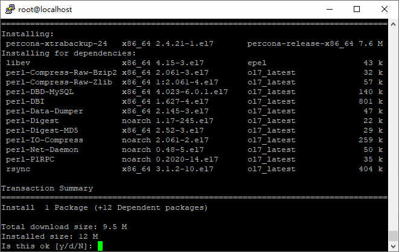


按照官网的说明，安装好后我们先小小测试它一下。

正如前面一小节提到的，不同的脚本其运用的对象和功能是不一样的，这次我们要找的就是 `mariadbxtrabackup` 这个脚本了。

```
/usr/local/share/urbackup/scripts/mariadbxtrabackup > /dev/null

```

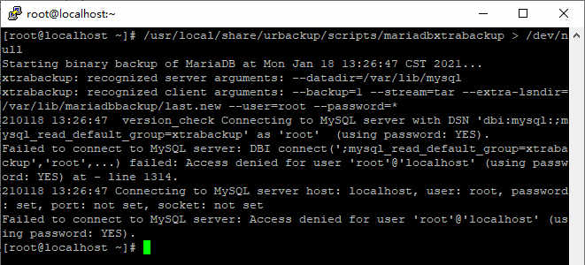


从上面的图片中可以看出，`xtrabackup` 命令可以正常调用了，但因为没有提供更多有效的参数（比如帐号密码），所以也无法验证是否可以正确备份。

那么接下来我们给它配置所需的备份参数。

和之前 `sqldump` 一样，我们不直接使用官方提供的文件，而是复制脚本模板来自定义自己的文件。

这里我们需要复制和修改的文件也有 **两个地方** 和 **三个文件**。


##### 两个地方，一个是配置路径，另一个是脚本路径：

```
/usr/local/etc/urbackup/
/usr/local/share/urbackup/scripts/

```


**1、`UrBackup` 总列表 `List` 文件**

其中添加两项：

a、你自己定义的参数配置文件及路径

b、给 `UrBackup` 看的脚本文件及路径

```
vim /usr/local/share/urbackup/scripts/list

```

这里我将新增项命名 `mysql_for_xtrabackup` ，以区别原先的 `mariadbxtrabackup` 。

注意，一定要看准了原来的模板文件名字是哪个。

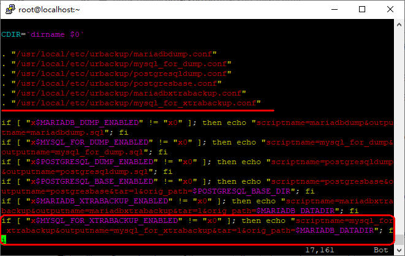


**2、你自己定义的参数配置**

然后，就是复制配置文件 `mariadbxtrabackup.conf` ，再修改一下配置内容。

```
cd /usr/local/etc/urbackup/
cp mariadbxtrabackup.conf mysql_for_xtrabackup.conf
vim mysql_for_xtrabackup.conf

```

将其中几个字段按实际情况修改，比如：

开启 `XtraBackup` 备份： `MYSQL_FOR_XTRABACKUP_ENABLED=1` 

另外还有一些设定，参考图片吧。


**3、给 UrBackup 看的执行脚本文件**

a、再然后，复制脚本文件 `mariadbxtrabackup` ，再修改一下脚本内容。 

```shell
cd /usr/local/share/urbackup/scripts/
cp mariadbxtrabackup mysql_for_xtrabackup
vim mysql_for_xtrabackup

```

将其中的大概第 `26` 行的

```
. /usr/local/etc/urbackup/mariadbxtrabackup.conf

```

修改为

```
. /usr/local/etc/urbackup/mysql_for_xtrabackup.conf

```

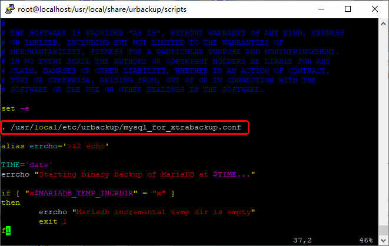


b、再再然后，复制设定脚本。

```
cd /usr/local/share/urbackup/scripts/
cp setup-mariadbbackup setup-mysql_for_xtrabackup
vim setup-mysql_for_xtrabackup

```

按图中修改，将配置文件修改为指向前面的配置文件。

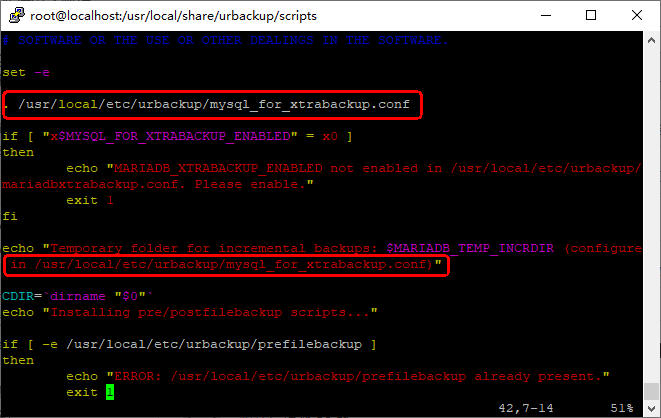


c、最后，用官方的 `setup` 脚本生成并修改另外两个脚本文件的内容。

```
# 执行设定脚本
/usr/local/share/urbackup/scripts/setup-mysql_for_xtrabackup

```


其中生成的两个脚本文件都需要修改一下才可以正常为我们工作，它们分别是：

```
/usr/local/etc/urbackup/prefilebackup
/usr/local/etc/urbackup/postfilebackup

```

将其中的大概第 `26` 行的

```
. /usr/local/etc/urbackup/mariadbxtrabackup.conf

```

修改为

```
. /usr/local/etc/urbackup/mysql_for_xtrabackup.conf

```


PS：`setup` 脚本的作用，是在服务端生成一个虚拟的客户端，其名称为当前客户端名称后再加个 `[incr]` ，用作增量备份。

官方建议增量备份时间间隔设定足够小，完整备份时间间隔设定足够大。

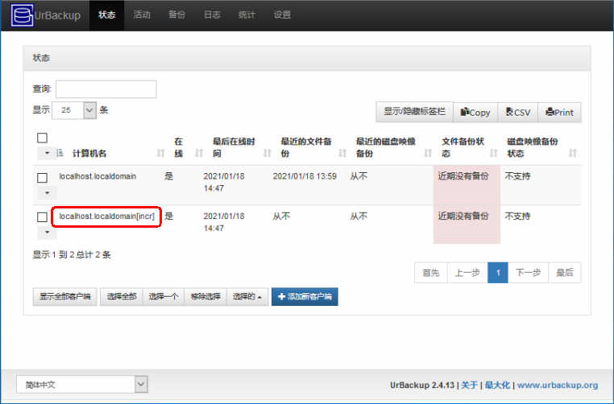


##### 测试备份与恢复

如果正确按以上配置好文件参数，那么备份很可能已经自动开始了。

系统会自动调用 `xtrabackup` 来备份数据库，然后传输到服务端。


先来测试一下备份，没错，小同学你的眼神很好，还是前面的那个命令哦！

```
/usr/local/share/urbackup/scripts/mariadbxtrabackup > /dev/null

```

之前因为参数配置不完整所以报错，不过现在OK了。


与 `sqldump` 恢复可以直接用命令不同的是，`XtraBackup` 恢复还需要配置一个恢复脚本。

这个脚本其实和备份脚本像哥俩一样，是成对出现的。

前面我们用的备份脚本是

```
/usr/local/share/urbackup/scripts/mysql_for_xtrabackup

```

那么我们的恢复脚本就可以这样生成

```
cd /usr/local/share/urbackup/scripts/
cp restore-mariadbbackup restore-mysql_for_xtrabackup

```

然后我们也要改一改它。

```
vim /usr/local/share/urbackup/scripts/restore-mysql_for_xtrabackup

```

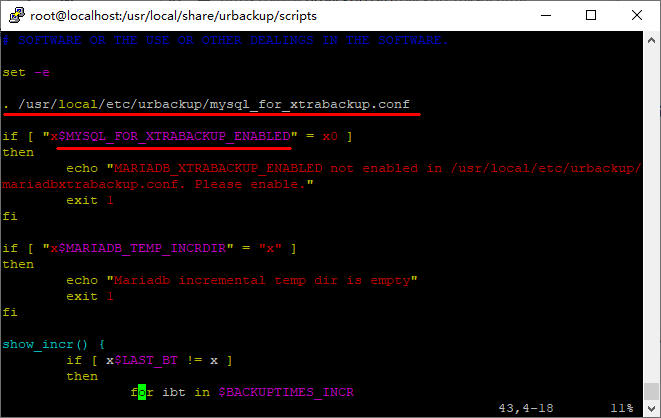


好了，我们尝试执行恢复命令。

```shell
/usr/local/share/urbackup/scripts/restore-mysql_for_xtrabackup

```


没想到准备了这么多，在这儿居然会出错，说什么缺少 `jq` ，遂安装之。

```
# yum install jq

```


再次执行恢复命令。

此时要注意，如果出现恢复失败的情况，那么就要根据提示来判断问题，通常应该是脚本程序没配置好。

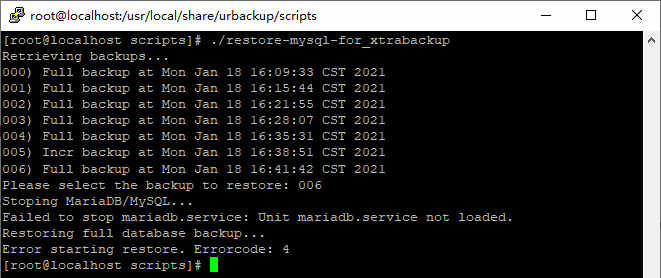


出现如图错误，通过对比恢复脚本中的代码与实际 `mysql`  服务名称后才发现，脚本中服务名称少了一个字母 `d`  。

```
# systemctl -a | grep mysql
mysqld.service		loaded	active	running MySQL Server

```


遂打开 `vim` 将脚本中的 `mysql.service` 全部替换成 `mysqld.service` 。

```
%s/mysql.service/mysqld.service/g

```


再来尝试执行恢复，还是不行，再找找原因吧。

脚本程序中修改一处如下，将最后的 `mariadbxtrabackup` 修改成 `mysql_for_xtrabackup`  。

```
echo "Restoring full database backup..."
urbackupclientctl restore-start -b $RESTORE_FULL_BACKUP -d urbackup_backup_scripts/mysql_for_xtrabackup

```

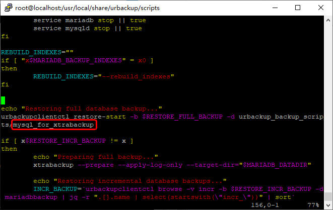


保存退出后再试一次，这次终于成功了！

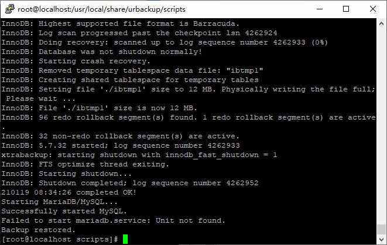


需要额外说明一下，在以上完成恢复的过程中如果你看到了 `mariadb.service: Unit not found`  之类的错误提示的话，也不用太在意。

因为我们根本就没有安装 `mariadb` 服务，`UrBackup` 实际上是自动判断、执行和重启 `mysql` 和 `mariadb` 两个服务的，并无特别影响。


使用 `XtraBackup` 来备份 `MySQL/MariaDB` 的方法，本质上借助了其本身就是备份软件的特性，然后利用一系列脚本程序来达到自动化高效备份的目的。

它并非完美，当然也是有优缺点的。


**优点：** 

- `UrBackup` 仅传输更改的数据，很明显这样可减小网络负担。
- 在更频繁的备份期间不会读取整个数据库（仅读取差异部分）。
- 可以配置为将索引包含在备份中。
- 数据库不会被快照影响性能。

**缺点：** 

- 你需要安装与你的数据库匹配的 `Percona XtraBackup` 版本。
- 可能比使用快照的备份稍慢一些。
- 目前此方法仅针对 `Linux` 平台实现。


小结一下：相对缺点来说，其优点才是重点，在需要备份大型数据库时这往往是最佳的建议方案。


### 写在最后

本篇以我个人惨痛的填坑经历简要地给小伙伴们说明了如何使用 `UrBackup` 来备份 `MySQL/MariaDB` 的过程和方法。

`MySQL/MariaDB` 作为应用场景非常广泛的数据库，其数据备份自然也显得至关重要。

通过本文的了解，也可以让小伙伴们多一个可选之项。

当然我也是新手，经验不足，在此仅做抛砖引玉，供小伙伴们参考。

如果有什么疏漏之处还请先关注@网管小贾，然后再狠狠地批评指正，也欢迎在留言区发表你的看法哦！


#### 原创平台：微信公众号，头条号，知乎（其他均为转载，请注意甄别）


**来杯冰阔落，扫码捐赠网管小贾~**


**扫码关注微信公众号@网管小贾，个人微信：sysadmcc**

网管小贾 / sysadm.cc

