## 使用 `UrBackup` 备份和恢复 `Microsoft SQL Server`

### Backup and Restore Microsoft SQL Server with UrBackup


**作者：网管小贾 / sysadm.cc (2022年9月20日)**


`UrBackup` 是一款非常著名的备份系统。

官方描述它具有多重特点，开源、免费、快速、易用、多平台，甚至还可以通过互联网来连接使用。

很多国家和地区，特别是欧美非常普及，瞧瞧这张图，密集恐惧症者暂请回避。

> 官网：https://www.urbackup.org

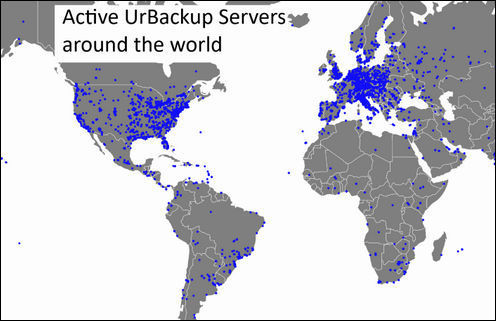


可是，`UrBackup` 在中国国内却又是那么的不太著名。

国人知之者甚少，用之者就更不用说了，可查询的资料大多都是英文的。

既然看上去和听上去都如此高端、大气、上档次的这么一款备份系统，那 `UrBackup` 的实际使用效果又是怎么样的呢？


在以前的多次使用过程中，我的体会是 `UrBackup` 功能的确非常强大，而且简单易用，关键是它不要钱，想怎么玩就怎么玩！

于是乎没事就跑到官网上逛一逛，偶然发现它还能备份数据库。

可能有的小伙伴会说，这备份数据库有啥稀奇的。

其实是你还不了解 `UrBackup` 它真正的特点。

官网上 `UrBackup` 号称可以抵御勒索病毒的备份系统，实际上我的理解是，它是依靠不断的监视系统变化而在无限最小时间间隔内执行备份动作，从而达到备份最优化，也就是备份能够最有效地接近故障发生前的那一刻。

说了这么多，其实还不如我们实际动手试试看。

这一回我就准备研究测试一下，用它来备份 `SQL Server` 数据库，看看有没有传说中的那么好用。


> Backup and restore Microsoft SQL Server (MSSQL) with UrBackup
>
> 官网链接：https://www.urbackup.org/backup_mssql.html


官网有现成的说明，那就打开这个链接看看。

哇！有没有搞错？写得这...这也太简单了吧！

就几张图，目测不超过10行文字，真有这么简单吗？

嘿嘿，你要是信了你就完了，要不我怎么会费事写这篇文章呢！

在下不才江湖人称填坑小能手（其实是踩坑摔惨了），走过路过不要错过，接下来就让诸位看官瞧瞧在下用 `UrBackup` 备份 `SQL Server` 时都遇到了哪些坑。


先罗列一下实验的基本步骤。

1. 安装 `UrBackup` 服务端
2. 安装 `UrBackup` 客户端
3. 测试备份数据库
4. 测试恢复数据库


简单、明了、外加清楚吧？

OK，咱们正式开始罗！


### 安装 `UrBackup` 服务端

如果你是在 `Windows` 平台上安装服务端，那么是真心简单的。

为了实验方便，我也用 `Windows` 来做服务端，当然实际生产环境还是建议你尽量做在 `Linux` 等更加稳定的系统环境下。

好，我们直接下载官方的 `Windows` 服务端程序，双击点开按步骤下一步安装即可。


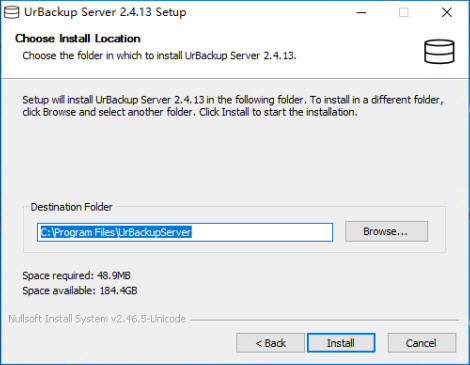


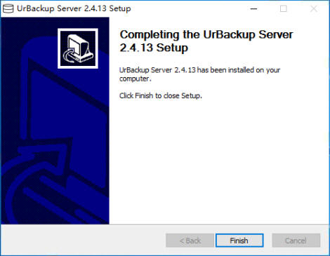


安装完成，接下来我们开始要使用它，那么就要先给它设定点什么。

打开你喜欢的浏览器，在地址栏内输入 `http://127.0.0.1:55414` ，回车。

正常情况下 `UrBackup` 服务端的管理 `WEB` 页面会被打开。

不过，一般来说头一次打开它你可能会看到这样的错误提示。

```
无法访问UrBackup保存备份的文件夹......
```

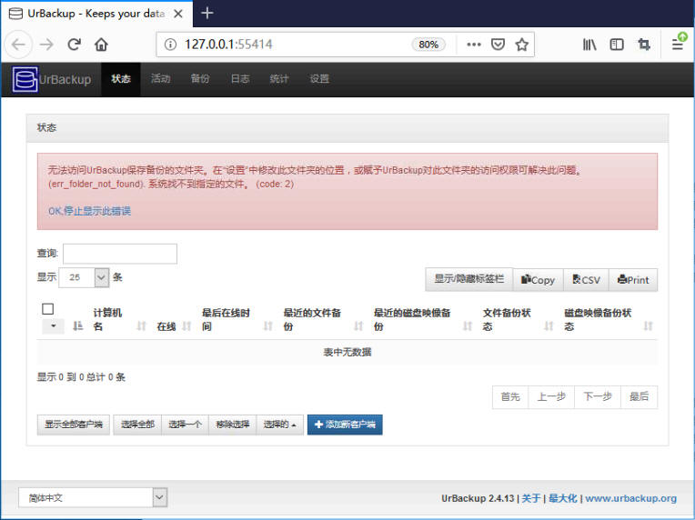


怎么还没开始配置就报错了？

如果你有这种想法，只能说明你是个学习认真专注的好同学，给你点个赞！

其实开源软件都有这样那样的“小问题”，需要我们自己动动小手做些微调，所以说习惯就好了。


那么出现的这个错误它是怎么回事呢？

其实是正常现象，原因正是它还没有开始配置，系统默认备份路径就是空值，这只是提示而已。

不要疑惑哦，没错，只要你配置好备份路径，并且保证备份路径可写，这个错误自然就消失了。

像下图那样，在 `设置 > 服务器` 选项中设定 `备份路径` 即可。

我在这儿暂时设定为 `C:\UrBackup` 。

至于如何设定备份路径最为优化，请参考我写的《Windows 运用 UrBackup 备份服务的最佳实践》。

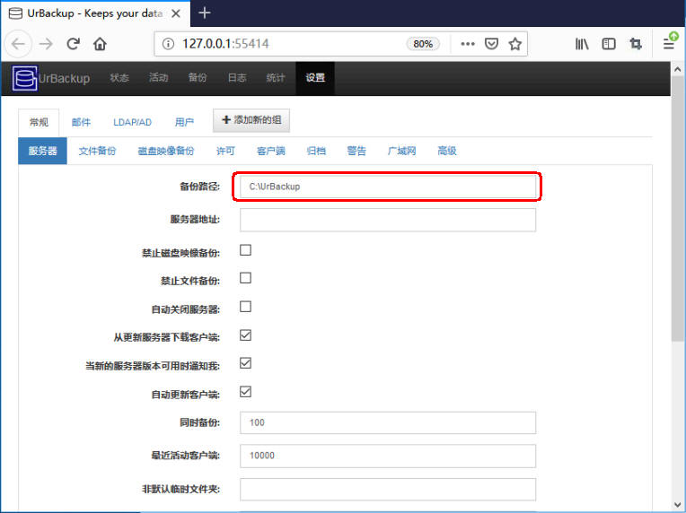


好了，回到首页再看看，是不是那个错误消失了？

一切顺利哈，服务端暂时搞定了。

嘿嘿，挺简单的不是吗，但是我这儿说的是暂时搞定，别着急，你懂的，后面会有坑。


### 安装 `UrBackup` 客户端

这个也不难，到官网下载客户端程序，一路“下一步”即可。


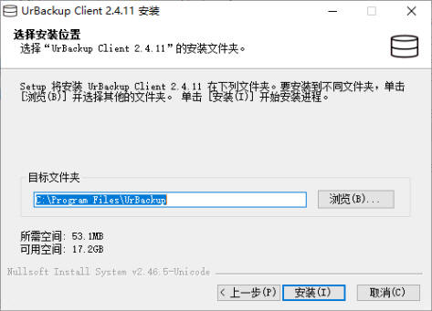


在安装的最后，点击 `完成` 后程序会弹出一个提示，询问你如何选择备份文件，就像这个样子。


要注意，对于我们这次测试这一步很关键。

我们选择 `取消` ，因为我们只做备份数据库的测试，而并不需要包含其他诸如文件或卷的备份。


程序装好后接下来怎么玩呢？

我们得先解决一个问题。

若要想把客户端的文件备份到服务端，那第一步当然要先保证它俩能通讯，对不对？

好，通常可以有以下几种办法让它们联系上。


##### 1、局域网内全自动连接

我们都知道，生活在一个小圈子里的人低头不见抬头见，很容易互相有接触，那么自然而然就更容易互加微信，建立联系。

同理，只要是在一个网段内，间隔一定的时间（管理手册称 `50` 秒左右）服务端与客户端就会自动建立连接。

不过如果不在同一网段内，又无法等待很长时间让其自己去连接，所以还有另外两个办法。


##### 2、服务端主动连接

当村里某些熊孩子不知道跑哪儿玩去了的时候，通过村口的大喇叭喊话就是最有效的找人办法。

和这大喇叭喊话原理一样一样的，当客户端通讯不畅或有其它情况时，那么服务端就可以主动添加客户端。


##### 3、客户端主动连接

小伙伴们都有旅游的经历，景区很大、好玩的景点又多，游客游玩通常都很分散。

那么，导游又是如何让分散各处的游客在指定时间集合的呢？

让导游挨个去找游客吗？好像既蠢又累啊！

其实答案很简单啊，那就是导游只要事先告知游客在某地点集合就可以了。

同样一般情况下，服务端由管理员操作，不方便在服务端添加连接，那么只能是客户端主动发起连接。

而我们要做的，就是告知客户端服务端的连接方法，比如 `IP` 地址。


当我们把客户端安装好了，可以看到右下角通知栏中会出现一个红色的类似磁盘的小图标。

右键点击这个小图标，在弹出的菜单中选择 `设置` 。

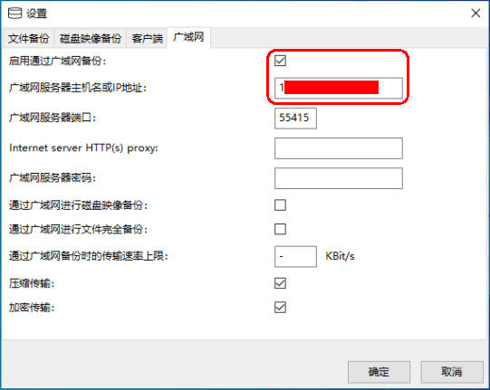


勾选 `启用通过广域网备份` ，并且在 `广域网服务器主机名或IP地址` 中填写服务器的名称或IP地址。

如果填写的是服务器名称，要确保这个名称可以正确解析。

这种情况通常是客户端已经完成安装，却长时间无法正确建立连接时设定一下。

通常这个设定是用来连接互联网服务端的，但这个时候变相地主动让其连接服务端也不失为一种有效的办法。

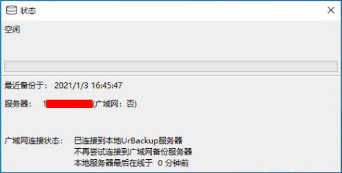


在客户端的状态选项中也能看到，连接建立成功，广域网的选项则是“否”的状态。

一旦双方建立了连接，那么在服务端的 `WEB` 管理页面上就能看到客户端的列表信息。

接下来我们就该测试备份和恢复功能了。

（详细的服务端与客户端建立连接的内容，请阅读参考 `UrBackup` 管理手册，我这儿也有自制中文版的，你自己找找吧！）


### 测试备份数据库

假设你已经有了 `SQL Server` 数据库，当然了，它应该是在安装有 `UrBackup` 客户端的那台机器上的。

为了实验快速进行，我这里安装了 `SQL Server Express 2014` ，在实际使用中效果都是一样的。


好，有了数据库，我们先随便新建一个数据库，我这建了一个名字叫作 `sysadm.cc` 的数据库。

那么怎么备份呢？

很简单，我们需要告诉程序，我们想要备份数据库而不是别的什么。

OK，我们右击系统托盘的 `UrBackup` 图标，在菜单中选择 `配置需备份组件` ，就像这个样子。


在出现的窗口中，选择 `SqlServerWriter` 中的任意你想要备份的项目。

**敲黑板：如果你全选了 `SqlServerWriter` 中所有的数据库，除了理所当然地全都给备份上之外，实际上以之后若有新增加的新数据库，`UrBackup` 也会毫不客气照单全收，意思就是连之后新进的也会一起备份。**


OK，接下来你就可以坐等它自动备份到服务器上了。

你说什么？坐等？

我的天，你知不知道我的时间有多宝贵！

好吧，我懂了，为了尽快测试出效果，那就主动备份一次看看吧。

当然你如果等得起，也可以尝试调整备份窗口时间。


还是右击那个可爱的小图标，点击 `执行文件完全备份` 。

可以看到这个图标由白色变成了黄色，说明它正在工作，这下你开心了吧？

不过很快它就又变成了白色，毕竟我们的数据库不大，它已经完成了任务。

如果在客户端看不到 `执行文件完全备份` 的选项，也就是说我们无法通过点击这个选项来开始备份的话，那么我们还可以到服务端一侧，找到对应的客户端主动选择完全备份。

我们到服务端看一下，果然生成了一个完全备份，大小有55M，传输速度还是挺快的。


既然有备份了，我们赶快测试恢复备份的功能吧。

嘿嘿，注意警报四起，大坑即将来临，Come on！


### 测试恢复数据库

终于到了恢复备份的阶段了，我们平日里所做备份，不就等的是这个时机嘛！

如果备份恢复不成功，那人生的意义也就成了灰白色的。


还是熟悉的操作，右击小图标，这时你会发现，菜单中多了一项 `恢复组件` ，没错找的就是它。


点击 `恢复组件` ，突然跳出个框框来，完了，这是什么鬼？


要知道，我当时害怕极了，像极了一只被抢食而无助的小猫咪。

我懵了一会儿才问自己，这可怎么办？到服务端瞧瞧吧。

找到客户端的备份项，点击进去，它居然来了个拒绝访问的错误提示！

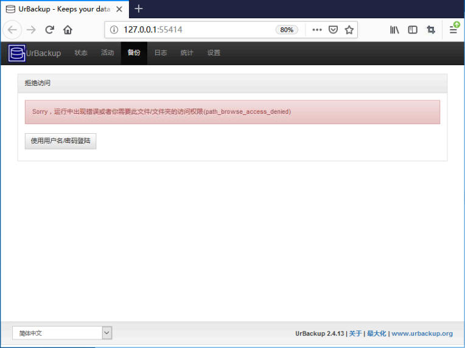


我的天，我和我的小伙伴们当时就惊呆了！

我尝试把备份路径文件夹（`C:\UrBackup`）的属性修改成非只读，然并卵，无效！

在 `Windows` 下你跟我讲什么权限拒绝访问啊喂！

此时我深深地意识到，我遇到了传说中的大坑！

这个“拒绝访问”以及什么“使用用户名/密码登陆”的破提示折腾了我半天时间。

要知道这可是大坑，再大就叫天坑了，天坑一般是搞不定的，还好最后被我找到了填坑方法。

在 `UrBackup` 论坛中找了这么一个回复。


搞了半天，在管理员手册中也有描述，即**如果想让客户端访问或恢复服务端的备份，那么必须要指定服务端的URL路径**。

它喵的不早说啊！

所以说各位小伙伴们，赶紧去看看管理手册，现在我都为你们准备好了中文版了！

火速来到服务端的设置一项中，老老实实填写了服务器地址，大概这样：`http://ip:55414` 。

当然域名形式的地址也是可以的，只要确保客户端能正常解析访问。

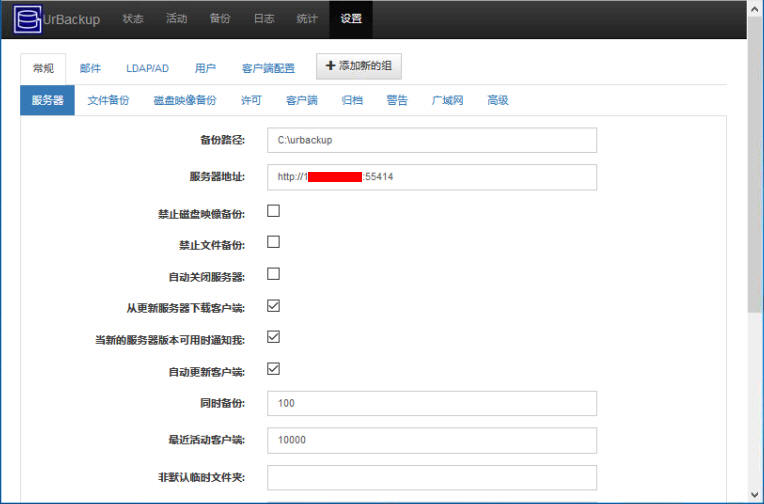


这里插一句话，如何让服务端URL支持 `HTTPS` 访问，我会另外写一篇文章说明。

再回到备份界面点击备份，它就这样OK了！

好了，时间耽误得够久了，赶快回到客户端，点击 `恢复组件`，这次果然出现了备份项。

如果这时仍有问题，那么除了服务器地址要检查以外，可以的话建议重启一次 `UrBackup` 服务，或许是服务调试卡死造成了问题无法解决。


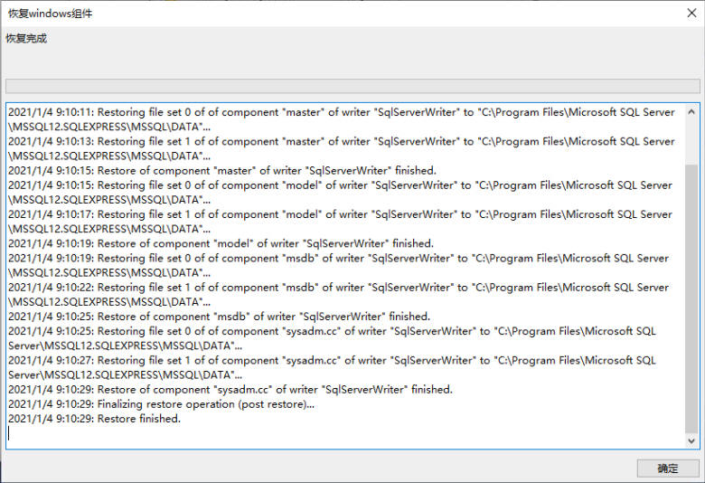


你可以选择任意项目进行恢复，但需要注意的是， **`SQL Server` 的系统数据库（比如 `master` 等）**恢复时可能会进程卡住或失败。

因此，最好可以的话请先停止 `SQL Server` 服务，然后再尝试恢复备份。

在实际使用中最好多测试测试，或单独备份恢复用户数据库。


另外，还有一种恢复方法，即通过服务端恢复。

在服务端 `WEB` 页面的备份一项中找到相应的客户端备份，确认时间大小等信息后点击 `将文件夹恢复至客户端` 按钮。

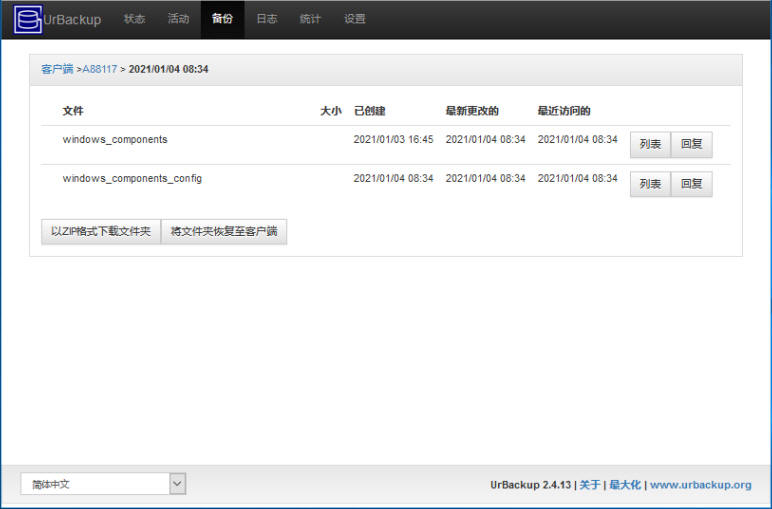


此时客户端这边就会神奇地出现如下确认是否恢复备份的提示窗口。


以上方法实际上也可以通过点击客户端菜单的 `访问/恢复备份` 一项来操作，效果和上面是一样的。


### 来个简短有力的结尾

除了前面通过 `Windows` 组件的方式来备份 `SQL Server` 之外，还有一种变相的备份方法，就是先利用 `SQL Server` 自身的备份功能生成 `.bak` 备份文件，然后再利用 `UrBackup` 来备份这些 `.bak` 文件。

不过这种严格来讲就不能算是 `UrBackup` 备份数据库的功能了。

使用 `UrBackup` 来备份 `SQL Server` 数据库，从本次的测试结果来看效果还是不错的，只是不知道当数据量非常大的时候，它的表现是否仍然OK。

作为一款远程备份软件，`UrBackup` 的特点之一就是实时备份，这一点对数据量变化快速的数据库备份非常有用。

下一集我会继续测试其他常用的数据库系统的备份效果，比如 `MySQL` 或 `PostgreSQL` 。

如果文章中有什么错误或纰漏，还请小伙伴们先关注微信公众号@网管小贾，然后好好批评我，我一定虚心接受！

哈哈，欢迎小伙伴们在留言区讨论！


#### 原创平台：微信公众号，头条号，知乎（其他均为转载，请注意甄别）


**来杯冰阔落，扫码捐赠网管小贾~**


**扫码关注微信公众号@网管小贾，个人微信：sysadmcc**

网管小贾 / sysadm.cc

