## Postal 用户手册中文版

### Postal User Manual Chinese Version


**作者：网管小贾 / sysadm.cc (2024年4月8日)**


* 欢迎

  * 功能列表
  * 常见问题

* 开始

  * 开始
  * 先决条件
  * 安装
  * 升级
  * 配置
  * `DNS` 配置
  * 升级到 `v3`
  * 升级到 `v2`

* 特征

  * 点击并开启跟踪
  * 运行状况和指标
  * `IP` 池
  * 日志
  * `OpenID` 连接
  * `SMTP` 身份验证
  * `SMTP TLS`
  * 垃圾邮件和病毒检查

* 开发者

  * 使用 `API`
  * 客户端库
  * 通过 `HTTP` 接收电子邮件
  * `Webhooks`（网络钩子）

* 其他说明

  * 自动回复和退回
  * 我们的容器镜像
  * 调试
  * 通配符和地址标签

  


# 欢迎

## 功能列表

这是 `Postal` 可以执行的功能列表（排名不分先后）。


### 一般特征：

- 支持具有邮件服务器和用户的多个组织。

- 显示传入和传出邮件量的图表和统计信息。

- 访问以查看历史消息。

- 访问以查看完整的传出和传入消息队列。

- 设置 `Webhook` 以实时接收有关投放信息的实时信息。

  此外，还存储了对过去 `7` 天 `Webhook` 请求的完全访问权限，以便进行调试。

- 内置 `DNS` 检查和监控，以确保正确配置您发送邮件的域，以实现最大的送达率。

- 每台服务器保留配置，设置消息在数据库中应保留的时间以及要保留在磁盘上的最大大小。

- 完整的日志记录，因此可以轻松识别交付问题。

- 邮件服务器范围的搜索工具，用于查找需要调查的邮件。


### 外发电子邮件：

- 将邮件发送到 `SMTP` 服务器或使用 `HTTP API` 。

- 管理每台服务器的多个凭据。

- 支持对出站邮件进行 `DKIM` 签名。

- 使开发能够将邮件保存在 `Postal` 中，而无需实际将其传递给收件人（可以在 `Postal` 界面中查看邮件）。

- 内置黑名单，可避免将邮件发送给不存在或无法接受电子邮件的收件人。

- 单击并打开跟踪以跟踪收件人何时打开您的电子邮件并单击其中的链接。

- 配置每台服务器的发送限制，以避免邮件服务器滥用。

- 管理多个发送 `IP` 地址池。

- 将不同的发件人或收件人配置为从某些 `IP` 地址传递邮件。

- 邮件标记，以便可以为某些电子邮件提供标记，以便在需要时对其进行分组。

  例如，您可以这样标记 `receipts` 或 `password-reset` 来发送电子邮件。


### 传入电子邮件：

- 能够将传入电子邮件转发到 `HTTP` 端点。
- 能够将传入电子邮件转发到其他 `SMTP` 服务器。
- 能够将传入的电子邮件转发到其他电子邮件地址。
- 使用 `SpamAssassin` 和 `ClamAV` 进行垃圾的邮件和线程检查，具有可配置的阈值和处理垃圾邮件的不同方法。

这是 `Postal` 可以执行的功能列表（排名不分先后）。


## 常见问题

在足够的时间内任何人有过频繁地提出相应的问题，则将其视为常见问题解答。

一旦我们有一些问题要回答，我们将立即更新此页面。


### 我应该使用它而不是使用云提供商吗？

这真的取决于你。

这两种解决方案都有优点和缺点，您应该选择适合每种情况的解决方案。

但是，不要掉以轻心地运行自己的电子邮件平台，需要考虑许多因素，以确保实现良好的可传递性（包括正确的 `DNS` 配置）。


### 通过 `Postal` 发送的电子邮件将成为垃圾邮件。

- 检查是否正确配置了 `DNS` 。

  首先，您需要为您的 `IP` 提供反向 `DNS` ，您需要配置 `DKIM` 和 `SPF` ，您需要确保您的 `rDNS` 与提供给收件人邮件服务器的 `HELO` 匹配。

- 确保您的发送 `IP` 配置了反向 `DNS` （ `PTR` ）记录。

- 检查您发送邮件的 `IP` 地址是否不在任何黑名单上。

- 检查您的实际电子邮件是否看起来像垃圾邮件。

- 发送大量电子邮件的新 `IP` 最初可能无法很好地传递。

您可以通过 `Mail Tester` （邮件测试器）之类的东西运行您的邮件，这将使您很好地了解邮件传递的垃圾级别，并确保您正确配置了所有内容。


### 您可以添加邮件列表功能吗？

不。

`Postal` 是邮件传输代理，而不是邮件列表管理器。

我们不希望添加更适合其他应用程序的功能，例如，通讯簿或处理数据库中人员的取消订阅。


# 开始

## 开始

`Postal` 安装起来相当容易，但运行自己的邮件服务器并不适合每个人。

如果您使用 `Postal` ，您还将负责配置您的 `DNS` 作为维护平台（包括运行升级）。

如果这听起来不像您想要的事情，请尝试托管平台。


安装 `Postal` 的过程概述如下。

当您准备好开始使用 转到“先决条件”页。

1. 安装 `Docker` 和其他先决条件
2. 添加适当的配置和 `DNS` 条目
3. 启动 `Postal`
4. 创建您的第一个用户
5. 登录到 `Web` 界面以创建您的第一个虚拟邮件服务器


### 可视化学习？

您可以观看此视频，该视频将介绍安装过程。

（请通过官网查看教学视频）


## 先决条件

在安装 `Postal` 之前，您需要执行一些操作。


### 服务器

我们**强烈**建议将 `Postal` 安装在其自己的专用服务器（即不运行其他软件的服务器）上。

`Postal` 的最低配置要求如下：

- 至少 `4GB` 内存
- 至少 `2` 个 `CPU` 内核
- 适合您的使用案例的磁盘空间量（至少 `25GB` ）


大多数人在虚拟服务器上安装 `Postal` 。

有很多提供商可供选择，包括 `Digital Ocean` 和 `Linode` 。


需要注意的一件事是，您需要确保提供商不会阻止端口 `25` 出站。

这很常见，用于防止垃圾邮件发送者的滥用。


您选择什么操作系统并不重要，只要您能够在其上安装 `Docker`（见下一节）。

这些说明中的任何内容都不会对您的操作系统做出可预见的影响。


### Docker

`Postal` 完全使用容器运行，这意味着要运行 `Postal` ，您需要一些软件来运行这些容器。

为此，我们建议使用 `Docker` ，但您可以使用任何您想要的软件。


首先，您需要在服务器上安装 `Docker` 引擎。

按照 Docker 网站上的说明安装 Docker。

您还需要确保已安装 `Docker` `Compose` 插件。

在继续操作之前，请确保可以同时运行 `docker` 和 `docker compose` 。

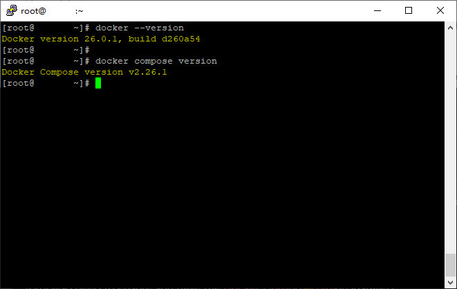


### 系统实用程序

在运行某些 `Postal` 命令之前，您需要安装一些系统实用程序。

在 `Ubuntu/Debian` 上：

```
apt install git curl jq
```

在 `CentOS/RHEL` 上：

```
yum install git curl jq
```

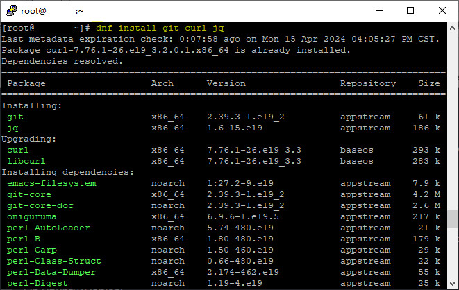

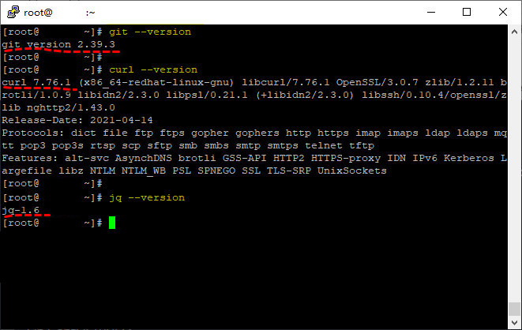


### Git & 安装助手存储库

您需要确保 `git` 已安装在服务器上。

然后，您需要克隆 `Postal` 安装助手程序存储库。

这包含一些引导配置和其他有用的东西，这些东西将加快您的安装速度。

```
git clone https://github.com/postalserver/install /opt/postal/install
sudo ln -s /opt/postal/install/bin/postal /usr/bin/postal
```

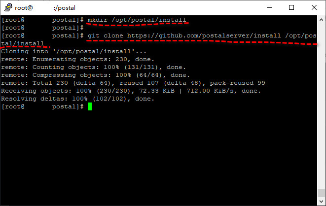

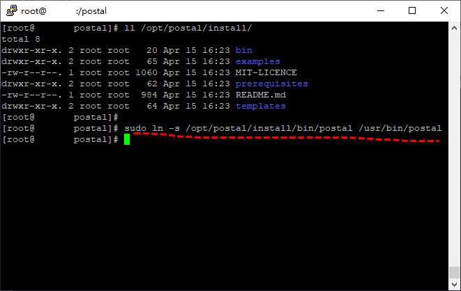


### MariaDB（10.6 或更高版本）

`Postal` 需要一个数据库引擎来存储所有电子邮件和其他基本配置数据。

您需要提供凭据，以允许创建和删除数据库的完全访问权限，以及对创建的任何数据库具有完全访问权限。

`Postal` 将为您创建的每个邮件服务器自动配置一个数据库。


我们不支持使用 `MySQL` 来代替 `MariaDB` 。


假设您有 `Docker` ，您可以使用以下命令在容器中运行 `MariaDB` ：

```
docker run -d \
   --name postal-mariadb \
   -p 127.0.0.1:3306:3306 \
   --restart always \
   -e MARIADB_DATABASE=postal \
   -e MARIADB_ROOT_PASSWORD=postal \
   mariadb
```

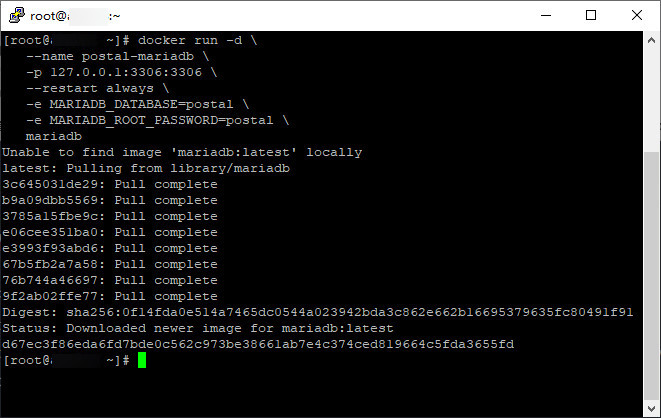

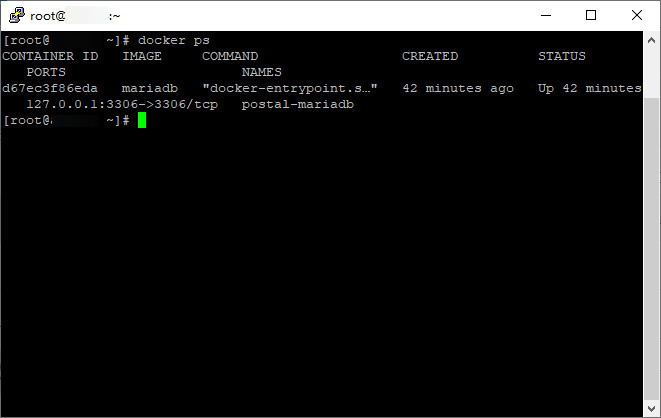


- 这将运行一个 `MariaDB` 实例，并让它侦听端口 `3306` 。

- 请务必选择安全密码。

  安装时，您需要将其放入您的 `Postal` 配置中，因此请务必（安全）记下它。

- 如果您无法或不愿意授予 `root` 访问权限，则您单独创建的数据库用户需要对名为 `postal` 和 `postal-*` （可以在配置  `message_db` 部分中配置此前缀）赋予数据库的所有权限。

```
虽然您可以根据需要配置最大消息尺寸，但您需要验证 MariaDB 配置的 innodb_log_file_size 至少是您希望发送的最大消息的10倍（15MB电子邮件为150MB，25MB电子邮件为250MB，诸如此类）。

如果您有旧版v1数据库，您可能还需要检查数据库中的原始表是否具有 LONGBLOB 类型。
```


## 安装

完成所有先决条件后，可以继续安装 `Postal` 。


### 配置

在启动 `Postal` 之前，需要进行一些配置。

克隆的存储库包含一个用于自动生成一些初始配置文件的工具。


运行以下命令，并替换 `postal.yourdomain.com` 为您要访问 `Postal` `Web` 界面的实际主机名。

在继续操作之前，请确保您已通过 `DNS` 提供商设置此域。

```bash
postal bootstrap postal.yourdomain.com
```

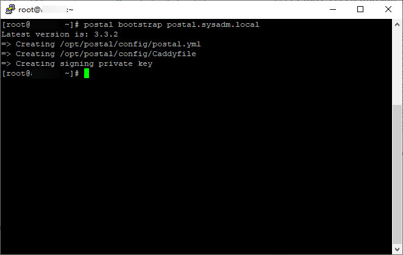


这将在 `/opt/postal/config` 中生成三个文件。

- `postal.yml` 是 `Postal` 主配置文件
- `signing.key` 是用于在 `Postal` 中签署各种事物的私钥
- `Caddyfile` 是 `Caddy` `Web` 服务器的配置


以上文件一旦生成后，您应该打开 `/opt/postal/config/postal.yml` 并添加所有适当的安装值（比如数据库密码等）。

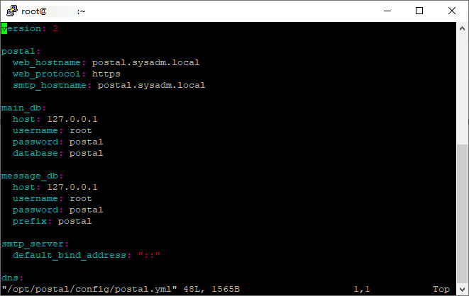


```
请注意，docker 设置挂载 /opt/postal/config 为 /config ，因此 postal.yml 中提到的任何完整目录路径都可能需要以 /config 开头，而不是以 /opt/postal/config 开头。
```


### 初始化数据库

添加配置后，需要通过添加所有适当的表来初始化数据库。

运行以下命令以创建架构，然后创建第一个管理员用户。

```bash
postal initialize
postal make-user
```

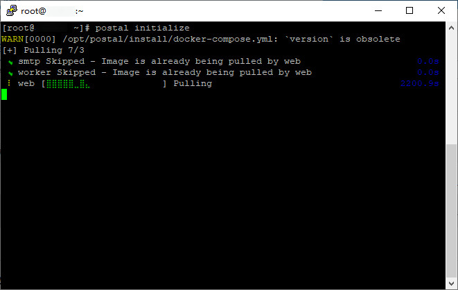

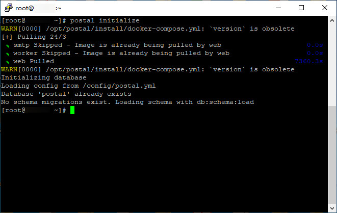

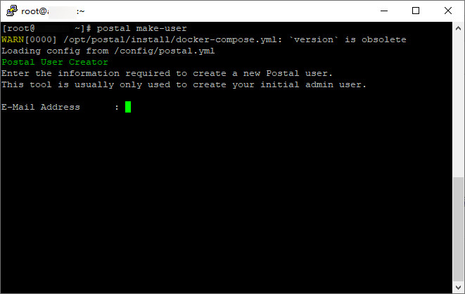

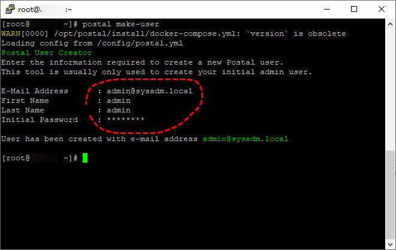


### 运行 Postal

您现在已准备好实际运行 `Postal` 本身。

您可以通过运行以下命令来继续执行此操作：

```
postal start
```

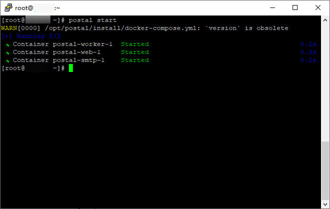


这将在您的计算机上运行多个容器。

您可以使用 `postal status` 来查看这些组件的详细信息。

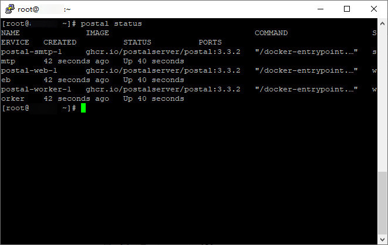


### Caddy

要处理 `SSL` 终端和所有 `Web` 流量，您需要配置 `Web` 代理。

您可以在这里使用任何你喜欢的东西 - `nginx` ， `Apache` ， `HAProxy` ，任何东西 - 但在这个例子中，我们将使用 `Caddy` 。

这是一个很棒的小型服务器，需要很少的配置并且非常容易设置。

```
docker run -d \
   --name postal-caddy \
   --restart always \
   --network host \
   -v /opt/postal/config/Caddyfile:/etc/caddy/Caddyfile \
   -v /opt/postal/caddy-data:/data \
   caddy
```

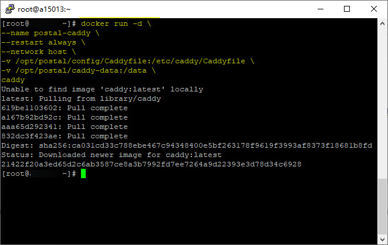


一旦开始，`Caddy` 将为您的域颁发 `SSL` 证书，您将能够立即访问 `Postal` `Web` 界面并使用您在前面步骤之一中创建的用户登录。

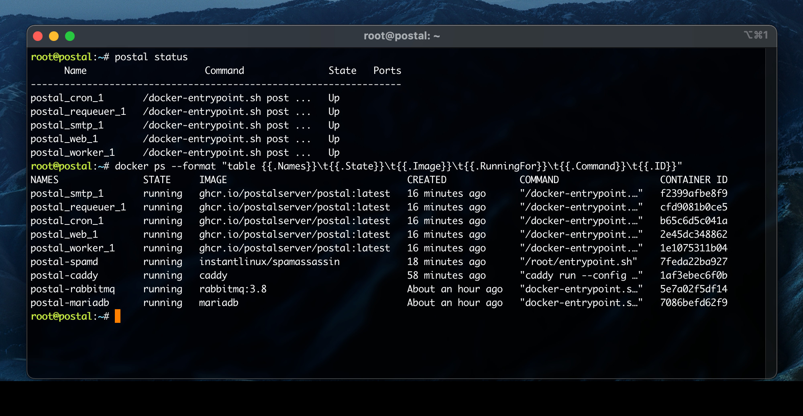


## 升级

```
如果当前未运行 `Postal` `v2` ，则需要先按照从 `1.x` 升级文档进行操作，然后才能使用这些说明。
```

安装 `Postal` 后，可以通过运行此命令对其进行升级。

这将始终将您升级到可用最新版本的 `Postal` 。

```bash
cd /opt/postal/install
git pull origin
postal upgrade
```


这将按以下顺序执行一些操作：

- 使用 `Git` 获取安装帮助程序存储库的最新副本
- 拉取最新版本的 `Postal` 容器
- 对数据库架构执行任何必要的更新
- 重新启动所有正在运行的容器


这不是零停机时间升级，因此建议在流量较低且已适当安排维护时执行此操作。

如果您需要零停机时间升级，则需要寻找可以处理此问题的替代容器管理系统（例如 `Kubernetes` ）。


### 更改为特定版本

默认情况下，运行 `postal upgrade` 将安装 `Postal` 容器注册中提供的最新版本。

如果需要将 `Postal` 的版本更改为特定版本，可以使用命令 `postal upgrade`  来指定版本，如下所示：

```bash
postal upgrade [version]
```


## 配置

`Postal` 可以通过其配置文件或环境变量进行配置。

有相当多的区域可以配置。


您可以查看所有可用的配置选项。

- 完整的 `Postal` 配置文件 - 这是一个示例配置文件，其中包含所有配置选项及其默认值和描述。

  此文件通常存在于 `/opt/postal/config/postal.yml` 中。

- 所有环境变量 - 此页面列出了所有环境变量。

  配置文件中可以设置的所有配置也可以由环境变量设置。

```
注意：如果更改任何配置，则应确保重新启动 Postal
```


### 端口和绑定地址

`Web` 和 `SMTP` 服务器侦听端口和地址。

这些端口的默认值可以通过配置进行设置，但是，如果您在单个主机上运行多个实例，则需要为每个实例指定不同的端口。


您可以使用 `PORT` 和 `BIND_ADDRESS` 环境变量为这些进程提供特定于实例的值。


### 旧配置

`Postal` 配置文件的当前版本是 `2` 。

这在配置文件本身中显示为 `version: 2` 。


`Postal` 仍支持 `Postal` `v2` 及更早版本中的版本 `1`（或旧版）配置格式。

如果您使用的是此配置文件，则在启动 `Postal` 时，您将在日志中收到警告。

我们建议更改配置以遵循上面介绍的新 `v2` 格式。


`v1` 和 `v2` 配置之间的主要区别如下所示。

- `web.host` 更改为 `postal.web_hostname`
- `web.protocol` 更改为 `postal.web_protocol`
- `web_server.port `更改为 `web_server.default_port`
- `web_server.bind_address` 更改为 `web_server.default_bind_address`
- `smtp_server.port` 更改为 `smtp_server.default_port`
- `smtp_server.bind_address` 更改为 `smtp_server.default_bind_address`
- `dns.return_path `更改为 `dns.return_path_domain`
- `dns.smtp_server_hostname `更改为 `postal.smtp_hostname`
- `general.use_ip_pools` 更改为 `postal.use_ip_pools`
- `general.*` 对命名空间 `postal` 下各种新名称的更改
- `smtp_relays` 更改为 `postal.smtp_relays` 并且现在使用字符串数组，其格式应为 `smtp://{host}:{port}?ssl_mode={mode}`
- `logging.graylog.*` 更改为 `gelf.*`


## DNS 配置

若要正常工作，需要为 `Postal` 安装配置大量 `DNS` 记录。

查看下表，并与 `DNS` 提供商一起创建相应的 `DNS` 记录。

您需要在配置文件 `postal.yml` 中输入您选择的记录名称。


在本文档中，我们假设您的服务器同时拥有 `IPv4` 和 `IPv6` 。

我们将在本文档中使用以下值，您需要根据需要替换它们。

- `192.168.1.3` - `IPv4` 地址
- `2a00:1234:abcd:1::3` - `IPv6` 地址
- `postal.example.com` - 您希望用于运行 `Postal` 的主机名


### A 记录

您将需要这些记录来访问 `API` 、管理界面和 `SMTP` 服务器。


| 主机名               | 类型   | 记录值                |
| -------------------- | ------ | --------------------- |
| `postal.example.com` | `A`    | `192.168.1.3`         |
| `postal.example.com` | `AAAA` | `2a00:1234:abcd:1::3` |


### SPF 记录

您可以为邮件服务器配置全局 `SPF` 记录，这意味着域不需要每个域单独引用您的服务器 `IP` 。

这允许您在将来进行更改。

| 主机名                   | 类型  | 记录值                                                |
| ------------------------ | ----- | ----------------------------------------------------- |
| `spf.postal.example.com` | `TXT` | `v=spf1 ip4:192.168.1.3 ip6:2a00:1234:abcd:1::3 ~all` |

```
您可能希望将 ~all 替换为 -all 以使 SPF 记录更严格。
```


### 返回路径

返回路径域是默认域，用作 `MAIL FROM` 通过邮件服务器发送的所有邮件的域。

您应该按如下方式添加 `DNS` 记录。

| 主机名                                    | 类型  | 记录值                                            |
| ----------------------------------------- | ----- | ------------------------------------------------- |
| `rp.postal.example.com`                   | `MX`  | `10 postal.example.com`                           |
| `rp.postal.example.com`                   | `TXT` | `v=spf1 a mx include:spf.postal.example.com ~all` |
| `postal._domainkey.rp.postal.example.com` | `TXT` | 值从 `postal default-dkim-record`                 |


### 路由域

如果您希望通过将邮件直接转发到 `Postal` 路由来接收传入电子邮件，则需要为此配置一个域，以便使用 `MX` 记录指向您的服务器。

| 主机名                      | 类型 | 记录值                  |
| --------------------------- | ---- | ----------------------- |
| `routes.postal.example.com` | `MX` | `10 postal.example.com` |


### Postal 配置示例

在您的 `postal.yml` 中，您应该有如下所示的内容来涵盖关键的 `DNS` 记录。

```yaml
dns:
  mx_records:
    - mx1.postal.example.com
    - mx2.postal.example.com
  spf_include: spf.postal.example.com
  return_path_domain: rp.postal.example.com
  route_domain: routes.postal.example.com
  track_domain: track.postal.example.com
```


## 升级到 v3

```
如果您当前运行的 Postal 版本低于 2.0.0，则应先升级到 v2，然后再升级到 v3。
```


`Postal` `v3` 于 `2024` 年 `3` 月发布，对 `Postal` 的运行方式进行了一些更改。

`v2` 和 `v3` 之间的显著变化如下：

- 无需使用 `RabbitMQ`
- 无需运行 `cron` 或 `requeuer` 进程
- 改进了日志记录
- 改进配置管理（包括使用环境变量或配置文件进行配置的能力）


### 数据库注意事项

数据库中任何预先存在的表都必须使用 `DYNAMIC` 行格式进行设置，这一点很重要。

否则，您可能会在数据库迁移过程中收到错误。

这是自 `MariaDB` `10.2.1` 以来的默认设置。


您可以使用 `SHOW TABLE STATUS FROM postal` 检查表的格式。

如果您的表不正确，可以使用以下命令进行更改：

```sql
ALTER TABLE `table_name` ROW_FORMAT=DYNAMIC;
```


### 升级

要升级，您可以按照升级页面上提供的相同说明进行操作。


### 配置

`Postal` `v3` 为其配置文件引入了一种新格式。

可以在我们的存储库中找到完整的新配置文件格式的示例。


虽然 `v3` 仍与早期版本的配置兼容，但应将配置更改为新格式以确保持续兼容。

任何新添加的配置选项在 `v1` 配置格式中都不可用。


### RabbitMQ

升级到 `v3` 后，您可以删除仅支持 `Postal` 安装的任何 `RabbitMQ` 服务。


### Cron & Requeuer 进程

这些进程在 `Postal` `v3` 中不是必需的，也不应运行。


## 升级到 v2

`2021` 年 `7` 月，我们更改了 `Postal` 的安装方式。

安装 `Postal` 的唯一支持方法是现在使用我们提供的容器。

您可以按照以下说明升级 `1.x` 安装以使用容器。


### 我如何知道我是否在使用 `Postal` `v1`？

两个版本之间有一些更改，这应该有助于识别您的版本。

- `Postal` `Web` 界面现在在所有页面（登录页面除外）上都有一个页脚，显示当前版本。

  如果没有页脚，则表示您没有使用 `Postal` `v2` 。

- 如果在不使用容器的情况下安装了 `Postal` ，则很可能使用的是 `Postal` `v1` 。

- 如果运行 `ps aux | grep procodile` 并可获得任何结果，则您使用的是 `Postal` `v1` 。

- 如果运行 `docker ps` 但未获得任何结果，则使用的是 `Postal` `v1` 。

- 如果您在 `2021` 年 `7` 月之前安装了 `Postal` ，则您使用的是 `Postal` `v1` 。

- 如果您有一个目录 `/opt/postal/app` ，您正在使用 `Postal` `v1`（或者您已经升级到 `Postal` `v2` 但尚未整理）。


### 假设

出于本指南的目的，我们将对您的安装做出一些假设。

如果这些假设中的任何一个都不成立，则需要确定适当的升级路线。

- 您已在单个服务器上安装了 `Postal` 。
- 您的服务器上运行着 `MariaDB`（或 `MySQL` ）数据库服务器，并侦听端口 `3306` 。
- 您的服务器上运行着一个 `RabbitMQ` 服务器，并侦听端口 `5672` 。
- 您当前的安装位于 `/opt/postal` 中，您的配置位于 `/opt/postal/config` 中。
- 您在 `Postal` `Web` 服务器前面使用 `Web` 代理（例如 `nginx` 、 `Caddy` 或 `Apache` ）。

```
执行此升级将意味着您的 Postal 服务将在短时间内不可用。
我们建议安排一些维护，并在流量较低时执行升级。
```


### 预备

您需要安装一些额外的系统依赖项。

- Docker
- docker-compose

```
重要提示：使用这些软件的最新版本，而不仅仅是安装操作系统供应商存储库中提供的最新软件包。
说明请参考前面链接。
```


如果您运行的是旧版本或不受支持的操作系统版本，您可能希望利用此机会进行升级。

执行此操作的方法超出了本文档的范围。


### 停止 Postal

首先使用 `postal stop` 停止 `Postal` 进程。


### 配置用于打开/单击跟踪的 Web 代理

在 `Postal` `2.x` 中，我们不再提供专用的服务器进程来处理打开和点击跟踪的请求。

如果不使用此功能，可以跳到下一部分。

但是，如果这样做，则需要向 `Web` 代理添加一些配置并颁发一些 `SSL` 证书。


对于您配置的所有**跟踪域**（例如 `track.yourdomain.com` ），您需要执行以下操作：

1. 在 `Web` 代理中配置虚拟主机，以将每个跟踪域的所有请求路由到 `Postal` `Web` 服务器（在端口 `5000` 上）。
2. 确保通过代理的所有请求都具有 `X-Postal-Track-Host: 1` 标头。
3. 为所有这些主机颁发 `SSL` 证书。
4. 确保您的 `Web` 代理正在侦听您之前用于 `Postal` `fast_server` 的 `IP` 地址。
5. 由于 `Postal` 不再需要有两个 `IP` 地址，因此您可以更新引用辅助 `IP` 的所有 `DNS` 记录，以指向用于 `Postal` 的主 `IP` 。


### 检查配置

您现有的 `Postal` 配置可以保留在与 `/opt/postal/config` 之前相同的位置。

如果您引用了 `postal.yml` 中的任何其他文件，则需要确保这些文件位于 `/opt/postal/config` 文件夹中，并将路径替换为 `/config` 。


例如，如果您有以下内容：

```yaml
smtp_server:
  tls_enabled: true
  tls_certificate_path: /opt/postal/config/smtp.crt
  tls_private_key_path: /opt/postal/config/smtp.key
```


您需要将 `/opt/postal/config` 更新为 `/config` ，如下：

```yaml
smtp_server:
  tls_enabled: true
  tls_certificate_path: /config/smtp.crt
  tls_private_key_path: /config/smtp.key
```

```
重要提示：如果您在操作系统的其他部分（例如 /etc 中）引用了文件，则必须确保这些文件现在位于目录 /opt/postal/config 中，否则它们在 Postal 运行的容器中将不可用。
```


### 删除旧的 Postal 帮助程序脚本

运行以下命令以备份旧的 `Postal` 帮助程序脚本。

```
mv /usr/bin/postal /usr/bin/postal.v1
```


### 安装 Postal v2

接下来要做的是下载新的 `Postal` 安装帮助程序存储库并设置新 `postal` 命令。

```
git clone https://github.com/postalserver/install /opt/postal/install
sudo ln -s /opt/postal/install/bin/postal /usr/bin/postal
```


接下来，使用新的 `Postal` 命令行帮助程序运行正常升级。

这将运行一个新镜像，将数据库架构升级到 `Postal` `v2` 所需的架构。

```
postal upgrade
```


最后，您可以启动 `Postal` 组件。

```
postal start
```


您现在应该会发现 `Postal` 再次运行并正常工作。

使用  `postal status` 确认所有进程类型都在运行。


输出应如下所示：

```
      Name                     Command               State   Ports
------------------------------------------------------------------
postal_cron_1       /docker-entrypoint.sh post ...   Up
postal_requeuer_1   /docker-entrypoint.sh post ...   Up
postal_smtp_1       /docker-entrypoint.sh post ...   Up
postal_web_1        /docker-entrypoint.sh post ...   Up
postal_worker_1     /docker-entrypoint.sh post ...   Up
```


### 有关 SMTP 端口的说明

如果预先在 `25` 以外的任何端口上运行 `Postal` `SMTP` 服务器，则可以还原此配置并让 `Postal` 直接侦听此端口。

为此，您可以删除可能拥有的任何 `iptables` 规则，并使用新的端口号更新您的 `postal.yml` 。


### 回滚

如果出现问题并且需要回滚到以前的版本，您仍然可以通过恢复 `postal` 帮助程序并重新启动它来执行此操作。

```
postal stop
unlink /usr/bin/postal
mv /usr/bin/postal.v1 /usr/bin/postal
postal start
```


### 整理

当您对一切运行良好感到满意时，您应该做一些最后的事情：

- 删除 `/opt/postal/app` 。这是应用程序本身所在的位置，不再需要。
- 删除 `/opt/postal/log` 。此处不再存储日志。
- 删除 `/opt/postal/vendor` 。这不再使用。
- 从 `/usr/bin/postal.v1` 中删除备份 `Postal` 帮助程序工具。
- 如果您更改了任何跟踪域以使用您的主 `IP` 地址，则可以在检查是否应用了所有 `DNS` 更新后从服务器中删除其他 `IP` 。


### 使用现有数据在新服务器上安装

如果您只想在新服务器上安装 `Postal` 并复制数据，您可以按照以下说明进行操作。

1. 创建新服务器，并按照说明安装 `Postal` 。

   此时，您应该有一个有效的安装。

2. 在旧服务器上，使用 `postal stop` 停止 `Postal` 。

3. 在继续使用 `postal status` 之前，请确保它已完全停止。

   在新服务器上，使用 `postal stop` 停止 `Postal` 。

4. 使用任何您喜欢的工具（ `mysqldump` 、 `Mariabackup` 等）将数据库复制到新服务器。

   确保复制 `postal` 数据库以及所有其他 `postal` 为前缀的数据库（或已将前缀配置为 `message_db` 配置部分的任何内容）。

5. 在新服务器上，运行 `postal upgrade-db` 以使用更改的表结构更新复制的数据库。

6. 确保 `postal.yml` 正确合并。

   例如，确保您的 `dns` 部分是正确的。

   无需复制 `rails.secret` - 新主机上的新密钥不会有问题。

7. 如果在开始之前完全停止了 `Postal` ，则无需从 `RabbitMQ` 复制任何持久化数据。

8. 关闭旧的 `Postal` 服务器。

9. 将 `IP` 地址从旧服务器移动到新服务器（如果旧服务器和新服务器都使用同一提供商）。

10. 使用 `postal start` 在新服务器上启动 `Postal` 。


# 特征

## 点击并打开跟踪

`Postal` 支持跟踪电子邮件的打开和点击。

这使您可以查看用户何时打开消息或单击其中的链接。

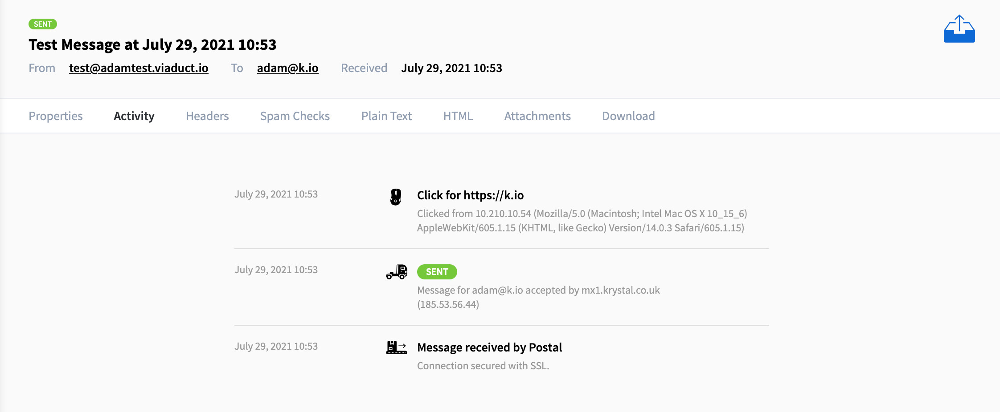


### 运作方式

启用后，`Postal` 将自动扫描您的外发邮件，并将任何链接和图像替换为通过您的 `Postal` `Web` 服务器的新 `URL` 。

单击链接时，`Postal` 将记录点击并自动将用户重定向到原始 `URL` 。

电子邮件中包含的链接应与发件人位于同一域中，因此您需要配置一个子域，例如 `click.yourdomain.com` ，并将其指向您的 `Postal` 服务器。


### 配置 Web 服务器

为避免邮件被标记为垃圾邮件，`Postal` 在重写的 `URL` 中使用的子域必须与发送邮件的子域位于同一域中。

这意味着，如果您从 `example.com` 发送邮件，则需要设置 `click.example.com` （或您选择的任何内容）以指向您的 `Postal` 服务器。


您需要在 `Web` 服务器上添加适当的虚拟主机，以将流量从该域代理到 `Postal` `Web` 服务器。

`Web` 服务器必须添加 `X-Postal-Track-Host: 1` 标头，以便 `Postal` `Web` 服务器知道将请求视为跟踪请求。


配置完成此操作后，您应该能够在浏览器中访问您选择的域并看到打印 `Hello.` 回给您。

如果您没有看到此消息，请检查您的配置，直到您看到为止。

如果您仍然没有看到此消息并启用跟踪，则您的消息将带有断开的链接和图像。


如果您对工作感到满意，可以按如下方式启用跟踪：

1. 在 `Postal` `Web` 界面中找到要启用跟踪的 `Web` 服务器

2. 转到 **`域`** 项

3. 选择 **`跟踪域`**

4. 点击 **`添加跟踪网域`**

5. 输入已配置的域，然后选择要使用的配置。

   **强烈**建议您将 `SSL` 用于这些连接。

   其他任何事情都可能导致声誉和用户体验问题。


### 禁用基于每封电子邮件的跟踪

如果您不想跟踪电子邮件中的任何内容，则可以在发送电子邮件之前为电子邮件添加标头。

```text
X-AMP: skip
```


### 禁用对某些链接域的跟踪

如果您不希望跟踪某些域中的链接，则可以在跟踪域设置页面上定义这些域。

例如，如果您列出 `yourdomain.com` ，则不会跟踪指向此域的链接。


### 禁用基于每个链接的跟踪

如果您希望禁用对特定链接的跟踪，可以通过如下所示的插入 `+notrack` 来实现。

`+notrack` 将被删除，留下一个纯链接。

- `https+notrack://postalserver.io`
- `http+notrack://katapult.io/signup`


## 运行状况和指标

`Postal` `worker` 和 `SMTP` 服务器进程具有附加功能，允许您监视进程的运行状况以及查看有关其性能的实时指标。


### 端口号

缺省情况下，运行状况服务器在不同类型的进程的不同端口上侦听。

- `Worker` - 侦听端口 `9090`
- `SMTP` 服务器 - 侦听端口 `9091`


与其他服务不同，如果这些端口在进程启动时正在使用中，则运行状况服务器将根本不会启动，但进程的其余部分将正常运行。

这将显示在日志中。


要配置这些端口，您可以设置 `HEALTH_SERVER_PORT` 和 `HEALTH_SERVER_BIND_ADDRESS` 环境变量。


### 指标

这些指标以 `/metrics` 形式并按标准的 `Prometheus` 导出器格式显示。

这意味着它们可以被任何可以摄取 `Prometheus` 指标的工具抓取。

然后，这将允许它们根据需要转换为图表。


### 健康检查

进程运行时，`/health` 节点将返回“OK”。

这可用于运行状况检查监控。


## IP 池

`Postal` 支持从不同的 `IP` 地址发送消息。

这允许您为不同的邮件服务器配置某些 `IP` 集，或根据发件人或收件人地址从不同的 `IP` 发送。


### 启用 IP 池

默认情况下，`IP` 池处于禁用状态，所有电子邮件都从运行工作线程的主机上的任何 `IP` 地址发送。

若要使用 `IP` 池，需要在配置文件中启用它们。

您可以通过在配置文件 `postal.yml` 中设置以下内容来执行此操作。

然后，您需要使用 `postal stop` 和 `postal start` 重新启动 `Postal` 。

```yaml
postal:
  use_ip_pools: true
```


### 配置 IP 池

启用 `IP` 池后，您需要在 `Web` 界面中设置它们。

您将在界面的右上角看到一个**`IP` 池**链接。

从这里可以添加池，然后在其中添加 `IP` 地址。


添加 `IP` 池后，需要为其分配应允许使用它的任何组织。

打开组织并选择 **IP，**然后勾选要分配的池。


分配给某个组织后，您可以从服务器的**“设置**”页面将 `IP` 池分配给服务器。

您还可以使用 `IP` 池为组织或服务器配置 `IP` 规则。

```
确保您在 Web 界面中添加的 IP 地址实际上是在您的 Postal 服务器上配置的，这一点非常重要。
如果服务器上不存在 IP，则邮件传递可能会失败，或者邮件无法正确出列。
```


## 日志

所有 `Postal` 进程都记录到 `STDOUT` 和 `STDERR` ，这意味着它们的日志由用于运行容器的任何引擎管理。

默认情况下，这里的容器指的是 `Docker` 。


### 将日志重定向到主机系统日志

如果要将日志数据发送到主机系统的系统日志，则可以对其进行配置。

如果您希望使用外部工具（例如 `fail2ban` 阻止用户访问您的系统），这将非常有用。


实现此目的的最快方法是在 `/opt/postal/install/docker-compose.override.yml` 中使用 `docker compose` 覆盖文件。

此文件的内容将包含以下内容：

```yaml
version: "3.9"
services:
  smtp:
    logging:
      driver: syslog
      options:
        tag: postal-smtp
```


如果您也想将工作线程和 `Web` 服务器日志放在那里，则可以定义它们。

上面的示例演示了使用 `smtp` 服务器进程。


### 限制日志的大小

`Docker` 可以配置为限制其存储的日志文件的大小。

若要避免存储大量日志文件，应对其进行适当配置。

这可以通过在 `/etc/docker/daemon.json` 文件中设置最大大小来实现。

```json
{
  "log-driver": "local",
  "log-opts": {
    "max-size": "100m"
  }
}
```


### 将日志发送到 Graylog

`Postal` 支持通过 `UDP` 将日志输出发送到中央 `Graylog` 服务器。

这可以使用以下选项进行配置：

```yaml
gelf:
  # GELF-capable host to send logs to
  host: 
  # GELF port to send logs to
  port: 12201
  # The facility name to add to all log entries sent to GELF
  facility: postal
```


## OpenID 连接

`Postal` 支持 `OpenID Connect` （ `OIDC` ），允许您将身份验证委托给外部服务。

启用后，有很多变化：

- 添加新用户时，无需输入密码。
- 当用户首次使用 `OIDC` 登录时，将根据其电子邮件地址将其与本地用户进行匹配。
- 在后续登录时，将根据 `OIDC` 颁发者提供的唯一标识符匹配用户。
- 没有本地密码的用户无法通过 `Postal` 重置密码。
- 用户在与 `OIDC` 身份关联时无法更改其本地密码。
- 当前拥有密码的现有用户将继续能够使用该密码，直到该密码与 `OIDC` 标识相关联。

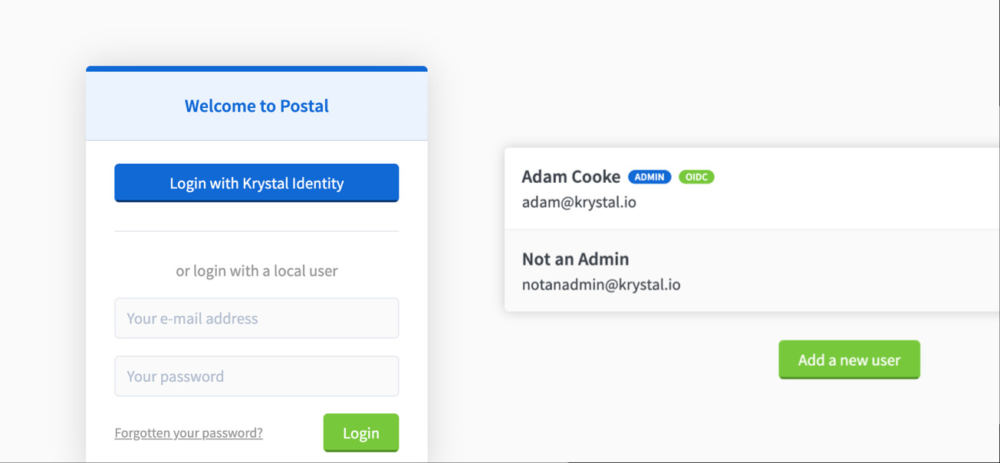


### 配置

首先，您需要找到启用了 `OpenID Connect` 的提供商。

应在提供程序中创建应用程序，以获取标识符（客户端 `ID`）和机密（客户端密码）。


在此过程中，系统可能会提示您提供“重定向 `URI` ”。

您应该输入 `https://postal.yourdomain.com/auth/oidc/callback` 。


最后，您需要像往常一样将配置放在 `Postal` 配置文件中。

```yaml
oidc:
  # Start by enabling OIDC for your installation.
  enabled: true
  
  # The name of the OIDC provider as shown in the UI. For example: 
  # "Login with My Proivder".
  name: My Provider
  
  # The OIDC issuer URL provided to you by your Identity provider. 
  # The provider must support OIDC Discovery by hosting their configuration
  # at https://identity.example.com/.well-known/openid-configuration.
  issuer: https://identity.example.com
  
  # The client ID for OIDC
  identifier: abc1234567890

  # The client secret for OIDC
  secret: zyx0987654321
  
  # Scopes to request from the OIDC server. You'll need to find these from your
  # provider. You should ensure you request enough scopes to ensure the user's
  # email address is returned from the provider.
  scopes:
    - openid
    - email
```


如果您的身份提供程序不支持 `OpenID Connect` 发现（默认情况下处于启用状态，您可以手动配置它）有关可用选项的完整详细信息，请参阅示例配置文件。


默认情况下，`Postal` 将在 `email` 字段中查找电子邮件地址，并在 `name` 字段中查找名称。

如果这些值可以在其他地方找到，则可以使用配置覆盖这些值。


### 登录

启用后，您可以通过按登录页面上的 **Login with xxx** 按钮登录。

这会将您定向到您选择的身份提供商。

一旦获得授权，您将被引导回应用程序。

如果存在与 `OpenID` 提供程序返回的电子邮件地址匹配的用户，则该用户将被链接并登录。

否则，将显示错误。


### 调试

当身份提供商进行回调时，有关用户匹配过程的详细信息将显示在 `Web` 服务器日志中。


### 禁用本地身份验证

建立 `OpenID Connect` 设置后，您可以完全禁用本地身份验证。

这将更改登录页面以及用户管理选项。

```yaml
oidc: 
  # ...
  local_authentication_enabled: false
```


### 使用 Google 作为身份提供商

设置 `Postal` 以使用 `Google` 进行身份验证相当简单。

您需要使用 `Google` `Cloud` 控制台生成客户端 `ID` 和密钥（请参阅文档）。

当系统提示您输入重定向 `URI` 时，您应该是 `https://postal.yourdomain.com/auth/oidc/callback` 。

以下配置可用于启用此功能：

```yaml
oidc:
  enabled: true
  name: Google
  issuer: https://accounts.google.com
  identifier: # your client ID from Google
  secret: # your client secret from Google
  scopes: [openid, email]
```


## SMTP 身份验证

要通过 `Postal` `SMTP` 服务器发送外发电子邮件，您需要通过 `Postal` `Web` 界面生成**凭据**。

此凭据与服务器相关联，允许您从与该域关联的任何域（或拥有该域的组织）发送邮件。


### 身份验证类型

向 `SMTP` 服务器进行身份验证时，有三种受支持的身份验证类型。

- `PLAIN` - 凭据以纯文本形式传递到服务器。

  使用此功能时，您可以提供任何字符串作为用户名（例如 `x` ），密码应包含您的凭据字符串。

- `LOGIN` - 凭据以 `Base64` 编码传递到服务器。

  如上所述，您可以使用任何内容作为用户名，并且密码应包含凭据字符串（ `Base64` 编码）。

- `CRAM-MD5` - 这是一种基于 `HMAC-MD5` 算法的质询-响应机制。

  与上述两种机制不同，用户名确实很重要，并且应该包含组织和服务器永久链接，以 `/` 或 `_` 字符分隔。

  使用的密码应为凭据中的值。


### 发件人/发件人验证

通过 `SMTP` 服务器发送传出电子邮件时，标头  `From` 必须包含服务器或其组织拥有的域，这一点很重要。

如果这无效，您将收到 `530 From/Sender name is not valid` 的错误。


如果已为服务器启用了“允许发件人标头”，则可以在标头 `Sender` 中包含此域，并在标头 `From` 中包含您希望的任何值。


### 基于 IP 的身份验证

`Postal` 可以选择根据客户端的 `IP` 地址对客户端进行身份验证。

要使用此功能，您需要为希望允许发送邮件的 `IP` 或网络创建 **SMTP-IP** 凭据。

请小心使用，以避免创建为一个开放中继。


## SMTP TLS 协议

默认情况下，`Postal` 的 `SMTP` 服务器未启用 `TLS` ，但您可以通过生成并提供合适的证书来启用它。

我们建议您使用由注册证书颁发机构颁发的证书，但这对于使用此功能不是必需的。


### 密钥和证书位置

证书应放在您的 `/opt/postal/config` 目录中。

- `/opt/postal/config/smtp.key` - `PEM` 格式的私钥
- `/opt/postal/config/smtp.cert` - `PEM` 格式的证书


#### 生成自签名证书

您可以使用以下命令生成自签名证书。

```bash
openssl req -x509 -newkey rsa:4096 -keyout /opt/postal/config/smtp.key -out /opt/postal/config/smtp.cert -sha256 -days 365 -nodes
```


### 配置

获得密钥和证书后，您需要在配置文件（ `/opt/postal/config/postal.yml` ）中启用 `TLS` 。

其他选项也可用。

```yaml
smtp_server:
  # ...
  tls_enabled: true
  # tls_certificate_path: other/path/to/cert/within/container
  # tls_private_key_path: other/path/to/cert/within/container
  # tls_ciphers:
  # ssl_version: SSLv23
```


如果更改配置或密钥/证书，则需要运行 `postal restart` 。


## 垃圾邮件和病毒检查

`Postal` 可以与 `SpamAssassin` 和 `ClamAV` 集成，以自动扫描通过邮件服务器的传入和传出邮件。

默认情况下，此功能处于禁用状态。


### 设置 SpamAssassin

默认情况下，`Postal` 将使用 `TCP` 套接字连接（端口 `783` ）与 `SpamAssassin` 的 `spamd` 通信。

您需要在服务器上安装 `SpamAssassin` ，然后在 `Postal` 中启用它。


#### 安装 SpamAssassin

```
sudo apt install spamassassin
```


安装后，您需要打开 `/etc/default/spamassassin` 并更改 `ENABLED` 为 `1`  以及 `CRON` 为 `1` 。

在某些系统（如 `Ubuntu 20.04` 或更高版本）上，您可能需要使用以下命令启用 `SpamAssassin` 守护程序。

```bash
update-rc.d spamassassin enable
```


然后你应该重新启动 `SpamAssassin` 。

```
sudo systemctl restart spamassassin
```


#### 在 `Postal` 中启用

若要启用垃圾邮件检查，需要将以下内容添加到配置文件 `postal.yml` 中，然后重新启动。

如果您已将 `SpamAssassin` 安装在与 `Postal` 安装不同的主机上，您可以在此处更改主机，但请务必确保 `spamd` 正在侦听您的外部接口。

```yaml
spamd:
  enabled: true
  host: 127.0.0.1
  port: 783
```

```
postal stop
postal start
```


#### 对垃圾邮件进行分类

垃圾邮件系统基于数字评分系统，为邮件中可能出现的不同问题分配不同的分数。

您可以配置不同的阈值，以定义何时将邮件视为垃圾邮件。

我们建议您从 `5` 开始，并在了解传入邮件的分类方式后进行更新。


您有三个选项可以按路由进行配置，这些选项定义了垃圾邮件的处理方式：

- **标记** - 邮件将发送到你的终结点，但垃圾邮件信息将提供给你。
- **隔离** - 邮件将放入保留队列中，如果您希望将它们传递到您的应用程序，则需要释放它们。他们只会在这里停留 `7` 天，
- **失败** - 邮件将被标记为失败，并且只会记录在邮件历史记录中，而不会发送。


# 开发者

## 使用 API

`HTTP API` 允许您使用 `JSON over HTTP` 向我们发送消息。

您可以使用当前的 `HTTP` 库与 `API` 通信，也可以使用其中一个预构建的库。


> 完整的 API 文档
>
> https://apiv1.postalserver.io/


```
此 API 不支持管理 Postal 的所有功能。
我们计划引入一个新的 v2 API，它将具有更多的功能和更好的文档。
我们没有这方面的预计到达时间。
此外，我们不会接受任何拉取请求来扩展当前 API 以具有比当前更进一步的功能。
```


### 一般 API 说明

- 您应该将 `POST` 请求发送到下面显示的 `URL` 。

- 参数应在请求正文中编码，并 `application/json` 应设置为 `Content-Type` 标头。

- 响应将始终以 `JSON` 格式提供。

  请求的状态可以通过您收到的有效负载中的 `status` 属性来确定。

  它将是 `success` 或 `error` 。

  可以在 `data` 属性中找到更多详细信息。


响应正文示例如下所示：

```javascript
{
  "status":"success",
  "time":0.02,
  "flags":{},
  "data":{"message_id":"xxxx"}
}
```


要对 `API` 进行身份验证，您需要通过 `Web` 界面为邮件服务器创建 `API` 凭据。

这是一个随机字符串，对于您的服务器是唯一的。

若要对 `API` 的请求进行身份验证，需要在 `HTTP` 标头 `X-Server-API-Key` 中传递此密钥。


### 发送消息

有两种方法可以发送邮件 - 您可以单独提供电子邮件所需的每个属性，也可以制作自己的 `RFC 2822` 邮件并发送此邮件。


有关这两种方法的完整详细信息，请参阅我们的 `API` 文档：

- 发送消息

  (https://postalserver.github.io/postal-api/controllers/send/message)

- 发送 `RFC 2822` 消息

  (https://postalserver.github.io/postal-api/controllers/send/raw)


对于这两种方法，`API` 将返回与结果相同的信息。

它将包含已发送的消息  `message_id` 以及服务器发送给每个收件人的消息的 `ID` 的 `messages` 哈希值。

```javascript
{
  "message_id":"message-id-in-uuid-format@rp.postal.yourdomain.com",
  "messages":{
    "john@example.com":{"id":37171, "token":"a4udnay1"},
    "mary@example.com":{"id":37172, "token":"bsfhjsdfs"}
  }
}
```


## 客户端库

有许多客户端库可以帮助使用 `Postal` 平台发送电子邮件。

这些并非都是由 `Postal` 团队开发的。

- `Ruby` - https://github.com/postalserver/postal-ruby
- `Rails` - https://github.com/postalserver/postal-rails
- `Ruby (mail gem)` - https://github.com/postalserver/postal-mailgem
- `PHP` - https://github.com/postalserver/postal-php
- `Node` - https://github.com/postalserver/postal-node
- `Java` - https://github.com/matthewmgamble/postal-java
- `.Net` - https://github.com/KingdomFirst/PostalServer-DotNet-Framework
- `Go` - https://github.com/Pacerino/postal-go


所有这些库都将使用 `API` 而不是使用任何 `SMTP` 协议 - 这被认为是传递邮件的最佳方法。

如果您的框架使用 `SMTP` ，则不需要客户端库，但是您也会错过某些 `Postals` 功能。


## 通过 HTTP 接收电子邮件

`Postal` 中最有用的功能之一是能够在收到的邮件到达后立即将其传递到您自己的应用程序。

要接收来自 `Postal` 的传入邮件，您可以将其设置为将它们传递到您选择的 `HTTP URL` 。


每个端点都有一个 `HTTP URL`（我们强烈建议尽可能使用 `HTTPS` ）以及一组规则，用于定义如何将数据发送给您。

- 您可以选择是将数据编码为普通表单数据，还是将 `Postal` 发送 `JSON` 作为请求的正文。
- 您可以选择是接收原始消息（原始消息）还是将其作为 `JSON` 字典（已处理）。
- 您可以选择是否希望将回复和签名与邮件的纯正文分开。


您的服务器应接受 `Postals` 传入请求并在 `5` 秒内回复。

如果花费的时间超过此时间，`Postal` 将假定它已失败，并且将重试请求。

您的服务器应发送 `200 OK` 状态，以向 `Postal` 发出您已收到请求的信号。


消息将尝试多达 `18` 次，并呈指数退避，直到看到成功的响应，但 `5xx` 状态将立即失败的情况除外。


当消息永久无法传递到您的终结点时（即服务器返回了 `5xx` 状态代码或在 `18` 次尝试后未被接受），收件人将收到退回邮件。


您可以在 `Web` 界面的消息页面上查看尝试（以及调试信息）。


### 已处理的有效负载

当您选择以 `JSON`（已处理）形式接收消息时，您将收到具有以下属性的有效负载。

```javascript
{
  "id":12345,
  "rcpt_to":"sales@awesomeapp.com",
  "mail_from":"test@example.com",
  "token":"rtmuzogUauKN",
  "subject":"Re: Welcome to AwesomeApp",
  "message_id":"81026759-68fb-4872-8c97-6dd2901cb33a@rp.postal.yourdomain.com",
  "timestamp":1478169798.924355,
  "size":"822",
  "spam_status":"NotSpam",
  "bounce":false,
  "received_with_ssl":false,
  "to":"sales@awesomeapp.com",
  "cc":null,
  "from":"John Doe <test@example.com>",
  "date":"Thu, 03 Nov 2016 10:43:18 +0000",
  "in_reply_to":null,
  "references":null,
  "plain_body":"Hello there!",
  "html_body":"<p>Hello there!</p>",
  "auto_submitted":"auto-reply",
  "attachment_quantity":1,
  "attachments":[
    {
      "filename":"test.txt",
      "content_type":"text/plain",
      "size":12,
      "data":"SGVsbG8gd29ybGQh"
    }
  ]
}
```

- 只有启用了 `attachments` 该属性，您才会拥有该属性。
- 每个附件的 `data` 属性都是 `Base64` 编码的。


### 原始消息有效负载

当您选择接收完整消息时，您将收到以下属性。

```javascript
{
  "id":12345,
  "message":"REtJTS1TaWduYXR1cmU6IHY9MTsgYT1yc2Etc2hhMjU2Oy...",
  "base64":true,
  "size":859
}
```

- 该 `base64` 属性指定是否使用 `Base64` 对 `message` 属性进行编码。

  这很可能一直都是如此。


## Webhooks

`Postal` 支持在消息生命周期内发生各种事件时通过 `HTTP` 发送 `Webhooks` 。

此页面列出了所有不同类型的事件，以及您将收到的示例 `JSON` 有效负载。

在许多情况下，只会发送少量信息，如果您需要更多信息，您应该使用 `API` 来获取它。


### 消息状态事件

这些事件是在电子邮件生命周期中的各种事件上触发的。

所有邮件的有效负载格式都相同，但 `status` 属性可能会更改。


可能会提供以下状态。

- `MessageSent` - 当消息成功传递到收件人/端点时。
- `MessageDelayed` - 当消息的传递延迟时。每次 `Postal` 尝试投递并且邮件进一步延迟时，都会发送此消息。
- `MessageDeliveryFailed `- 当消息无法传递时。
- `MessageHeld` - 当消息被保留时。


```javascript
{
  "status":"Sent",
  "details":"Message sent by SMTP to aspmx.l.google.com (2a00:1450:400c:c0b::1b) (from 2a00:67a0:a:15::2)",
  "output":"250 2.0.0 OK 1477944899 ly2si31746747wjb.95 - gsmtp",
  "time":0.22,
  "sent_with_ssl":true,
  "timestamp":1477945177.12994,
  "message":{
    "id":12345,
    "token":"abcdef123",
    "direction":"outgoing",
    "message_id":"5817a64332f44_4ec93ff59e79d154565eb@app34.mail",
    "to":"test@example.com",
    "from":"sales@awesomeapp.com",
    "subject":"Welcome to AwesomeApp",
    "timestamp":1477945177.12994,
    "spam_status":"NotSpam",
    "tag":"welcome"
  }
}
```


### 邮件退回

如果 `Postal` 收到之前已接受的邮件的退回邮件，您将收到 `MessageBounced` 事件。

```javascript
{
  "original_message":{
    "id":12345,
    "token":"abcdef123",
    "direction":"outgoing",
    "message_id":"5817a64332f44_4ec93ff59e79d154565eb@app34.mail",
    "to":"test@example.com",
    "from":"sales@awesomeapp.com",
    "subject":"Welcome to AwesomeApp",
    "timestamp":1477945177.12994,
    "spam_status":"NotSpam",
    "tag":"welcome"
  },
  "bounce":{
    "id":12347,
    "token":"abcdef124",
    "direction":"incoming",
    "message_id":"5817a64332f44_4ec93ff59e79d154565eb@someserver.com",
    "to":"abcde@psrp.postal.yourdomain.com",
    "from":"postmaster@someserver.com",
    "subject":"Delivery Error",
    "timestamp":1477945179.12994,
    "spam_status":"NotSpam",
    "tag":null
  }
}
```


### 消息点击事件

如果您启用了点击跟踪，则 `MessageLinkClicked` 事件将告诉您用户单击了您的一封电子邮件中的链接。

```javascript
{
  "url":"https://atech.media",
  "token":"VJzsFA0S",
  "ip_address":"185.22.208.2",
  "user_agent":"Mozilla/5.0 (Macintosh; Intel Mac OS X 10_11_6) AppleWebKit/537.36 (KHTML, like Gecko) Chrome/54.0.2840.98 Safari/537.36",
  "message":{
    "id":12345,
    "token":"abcdef123",
    "direction":"outgoing",
    "message_id":"5817a64332f44_4ec93ff59e79d154565eb@app34.mail",
    "to":"test@example.com",
    "from":"sales@awesomeapp.com",
    "subject":"Welcome to AwesomeApp",
    "timestamp":1477945177.12994,
    "spam_status":"NotSpam",
    "tag":"welcome"
  }
}
```


### 消息加载/打开事件

如果启用了打开跟踪，则 `MessageLoaded` 事件将告诉您用户已打开您的电子邮件（或者至少已查看其中嵌入的跟踪像素）。

```javascript
{
  "ip_address":"185.22.208.2",
  "user_agent":"Mozilla/5.0 (Macintosh; Intel Mac OS X 10_11_6) AppleWebKit/537.36 (KHTML, like Gecko) Chrome/54.0.2840.98 Safari/537.36",
  "message":{
    "id":12345,
    "token":"abcdef123",
    "direction":"outgoing",
    "message_id":"5817a64332f44_4ec93ff59e79d154565eb@app34.mail",
    "to":"test@example.com",
    "from":"sales@awesomeapp.com",
    "subject":"Welcome to AwesomeApp",
    "timestamp":1477945177.12994,
    "spam_status":"NotSpam",
    "tag":"welcome"
  }
}
```


### DNS 错误事件

`Postal` 会定期监控其所知道的域，以确保您的 `SPF/DKIM/MX` 记录正确无误。

如果您希望在检查失败时收到通知，可以订阅 `DomainDNSError` 事件。

```javascript
{
  "domain":"example.com",
  "uuid":"820b47a4-4dfd-42e4-ae6a-1e5bed5a33fd",
  "dns_checked_at":1477945711.5502,
  "spf_status":"OK",
  "spf_error":null,
  "dkim_status":"Invalid",
  "dkim_error":"The DKIM record at example.com does not match the record we have provided. Please check it has been copied correctly.",
  "mx_status":"Missing",
  "mx_error":null,
  "return_path_status":"OK",
  "return_path_error":null,
  "server":{
    "uuid":"54529725-8807-4069-ab29-a3746c1bbd98",
    "name":"AwesomeApp Mail Server",
    "permalink":"awesomeapp",
    "organization":"atech"
  },
}
```


# 其他说明

## 自动回复和退回

当您发送电子邮件时，目标邮件服务器可能会自动向您发送退回邮件或自动回复。

这些电子邮件的处理方式与普通传入电子邮件略有不同，值得了解它们的工作原理。


此类邮件通常不会发送到发送邮件的电子邮件地址，而是发送到**返回路径**地址。

这是 `Postal` 分配给您的邮件服务器的地址，并提供给目标邮件服务器，用于发送此类邮件。

返回地址将类似于 `abcdef@psrp.yourdomain.com` 。


如果您希望将发送到您的退回路径地址的邮件路由到您的应用程序，您可以设置**回信路径路由**。

这与普通路由相同，只是您应该输入名称像 `__returnpath__` 并将域字段留空。

您只能为此类型的路由选择 `HTTP` 终端节点。

添加后，发送到返回路径且未被检测为退回邮件的消息将发送到您选择的 `HTTP` 终结点。


## 关于退回的说明

如果 `Postal` 检测到您已发送的邮件被退回，则不会递送到您的退回路径路由。

原始消息将被更新，并将触发一个叫作 `MessageBounced`  的 `Webhook` 事件。


## 我们的容器镜像

此页面包含有关 `Postal` 实际如何在容器中打包和运行的信息。


### 容器在哪里？

`Postal` 打包并托管在 `ghcr.io/postalserver/postal` 。


`latest` 标记将始终跟踪存储库中的 `main` 分支，因此将拥有应用程序的最新副本。

不建议在生产中使用此标记，因为您可能随时开始使用它而不会注意到。


每个版本的 `Postal` 也会被标记，例如 `3.0.0` ，我们始终建议在生产环境中使用版本标记。

若要升级，只需开始使用较新版本的容器，并确保运行 `upgrade` 命令。

您可以查看 `GitHub` 和我们的 `CHANGELOG` 中存在的所有标签。


### 需要运行哪些进程？

要成功安装 `Postal` ，需要运行 `3` 个进程。

所有进程都在同一镜像 （ `ghcr.io/postalserver/postal` ） 中运行。

下表列出了这些进程。


#### Web 服务器

- **命令：** `postal web-server`
- **端口：** `5000`


这是处理 `Postal` 管理界面和打开/单击跟踪请求的所有 `Web` 流量的主要 `Web` 服务器。

默认情况下，它侦听端口 `5000` ，但可以在文件 `postal.yml` 中通过更改选项  `web_server.default_port`  或设置环境变量 `PORT` 进行配置。


您可以运行多个 `Web` 服务器并在它们之间进行负载平衡，以便为 `Web` 请求添加额外的容量。


#### SMTP 服务器

- **命令：** `postal smtp-server`
- **端口：** `25`
- **所需功能：**  `NET_BIND_SERVICE`


这是用于接收来自客户端和其他 `MTA` 的邮件的主要 `SMTP` 服务器。

与 `Web` 服务器一样，您可以通过更改配置文件 `postal.yml` 中的选项 `smtp_server.default_port` 或设置环境变量 `PORT` 来将其配置为在任何端口上运行。


您可以运行多个 `SMTP` 服务器并在它们之间进行负载平衡，以便为 `SMTP` 连接添加额外的容量。


#### 工作线程

- **命令：** `postal worker`


这将运行一个工作线程，该工作线程将从消息队列接收作业。

从本质上讲，这将处理所有传入和传出电子邮件。

如果您需要处理大量电子邮件，您可能希望运行其中的多个电子邮件。

您可以根据需要运行任意数量。


### 配置

该镜像要求所有配置都挂载到 `/config` 。

此目录至少必须包含一个 `postal.yml` 和 `signing.key` 。

您可以在安装工具存储库中看到一个最小的 `postal.yml` 示例。

有关完整示例，请参阅此处。

> https://github.com/postalserver/postal/blob/main/doc/config/yaml.yml


signing.key` 可以使用以下命令生成：`

```
openssl genrsa -out path/to/signing.key 2018
```


### 网络主机

如果希望利用 `IP` 池，则需要使用网络主机运行 `Postal` 。

这是因为 `Postal` 需要能够确定哪些物理 `IP` 可供其使用，并能够在这些 `IP` 上发送和接收流量。


如果不使用 IP 池，则无需使用网络主机，可以根据需要公开上面列出的端口。


### 等待服务

容器的入口点支持在启动基础进程之前等待外部服务准备就绪。

要使用它，您需要使用服务和端口列表设置环境变量 `WAIT_FOR_TARGETS` 。

例如 `mariadb:3306` ，替换 `mariadb` 为 `MariaDB` 服务器的主机名或 `IP` 。

您可以通过用空格分隔多个端点来指定它们。


默认的最长等待时间为 `30` 秒，您可以使用环境变量 `WAIT_FOR_TIMEOUT` 覆盖此时间。


## 调试

本页包含有关如何识别安装问题的信息。


### DNS

虽然 `Postal` 可以自行验证 `DNS` 记录，但检查互联网其余部分所看到的内容这一项可能很有用。

您可以使用 `Whats My DNS` 进行快速全局检查，或者使用终端上的 `dig` 命令，即 `dig txt yourdomain.com` 或 `dig a yourdomain.com` 。


### SMTP

确保互联网可以连接到您的 `Postal`  `SMTP` 的最快方法是使用 `telnet postal.yourdomain.com 25` 。

如果您熟悉原始 `SMTP` 命令，则可以继续尝试手动发送邮件，以进一步验证您的 `Postal` 安装是否正常工作。


#### SMTP SSL

如果您不确定提供给 `Postal` 的 `SSL` 证书是否设置正确，则可以使用 `openssl s_client -connect postal.yourdomain.com:25 -starttls smtp` 从 `SMTP` 的角度获取有关证书的一些信息。


## 通配符和地址标签

`Postal` 支持在路由中使用通配符和地址标签。


### 使用通配符

通配符将允许您接收域上每个地址的所有电子邮件。

但是，对于大多数用例，不建议这样做，因为这意味着您的邮件服务器可能会处理大量垃圾邮件，否则这些垃圾邮件会被 `Postal` 拒绝而不会给您带来麻烦。


只需在名称框中输入 `*` 即可为此创建路由。


### 使用地址标签

`Postal` 支持在电子邮件地址上使用“标签”，这意味着您可以添加单个路由，但仍可以从多个地址接收。

例如，如果您添加了 `email` 一个路由，您还将收到 `email+anything@yourdomain.com` 的消息，而无需任何其他配置。


**来杯冰阔落，扫码捐赠网管小贾~**


**扫码关注微信公众号@网管小贾，个人微信：sysadmcc**

网管小贾 / sysadm.cc


