Audacity


1. 手册主页

   1.1 导游

   ​	1.1.1 录制、播放和编辑 - Audacity 的基础知识

   ​	1.1.2 保存您的作品 - 音频格式

   ​	1.1.3 自定义 Audacity - 主题、颜色、首选项、布局和插件扩展

   ​	1.1.4 更快的做事方式 - 快捷方式和宏

   ​	1.1.5 更改音频的响度 - 淡入淡出、放大、声像和增益/音量

   ​	1.1.6 音频中的噪音 - 减少、添加、微调

   ​	1.1.7 导航和改变速度和音调

   ​	1.1.8 实时效果

   ​	1.1.9 很多你可能不知道 Audacity 可以做的事情

2. 使用 Audacity

   1. 开始
   2. 操作方法
   3. 教程
   4. 技巧

3. Audacity 图形用户界面

   1. 菜单栏
   2. 工具栏
   3. 轨道
   4. 影响

4. 定制

   1. 偏好
   2. 快捷键
   3. 主题
   4. 工具栏
   5. 影响


2. 参考

   1. 参考

      1. 搜索手册
      2. 数字音频
      3. 词汇表
      4. 所有命令
      5. 错误
      6. 指数

   2. 常见问题（FAQ）

      1. 关于 Audacity
         1. [Audacity 真的免费吗？为什么？](faq_about_audacity.html#free)
         2. [Audacity 使用安全吗？](faq_about_audacity.html#safe)
         3. [我可以分发 Audacity 的副本吗？](faq_about_audacity.html#distributor)
         4. [有人在 eBay 上出售 Audacity。这合法吗？](faq_about_audacity.html#ebay)
         5. [搜索结果误导我为 Audacity 下载付费。我该怎么办？](faq_about_audacity.html#misled)
         6. [Audacity 未以预期或期望的语言显示。我可以更改此设置吗？](faq_about_audacity.html#language)
         7. [会有适用于 iPhone/iPod、iPad 或其他智能手机或平板电脑的 Audacity 版本吗？](faq_about_audacity.html#mobile)
         8. [我可以在 Chromebook 笔记本电脑上运行 Audacity 吗？](faq_about_audacity.html#chrome)
         9. [Audacity 是否适用于盲人用户的屏幕阅读器应用程序？](faq_about_audacity.html#accessible)
         10. [Audacity 在语音转录或语音识别方面有哪些功能？](faq_about_audacity.html#transcribe)
         11. [Audacity 可以在 64 位系统上运行吗？](faq_about_audacity.html#64bit)
         12. [Audacity 是否支持低延迟 ASIO 驱动程序？](faq_about_audacity.html#asio)
         13. [如何找到我拥有的 Audacity 版本，这是否是最新版本？](faq_about_audacity.html#version)
         14. [我该如何帮助改进 Audacity？](faq_about_audacity.html#improve)

      2. 安装、启动和插件](#install)
         1. [如何安装或更新 Audacity？](faq_installation_and_plug_ins.html#install)
         2. [如何卸载 Audacity？](faq_installation_and_plug_ins.html#win_uninstall)
         3. [如果我在下载或安装 Audacity 时遇到问题，我该怎么办？](faq_installation_and_plug_ins.html#probs)
         4. [如何下载和安装 LAME MP3 编码器？](faq_installation_and_plug_ins.html#lame)
         5. [如何下载和安装 FFmpeg 导入/导出库？](faq_installation_and_plug_ins.html#ffdown)
         6. [Audacity 支持哪些效果器、生成器和分析器插件以及如何安装它们？](faq_installation_and_plug_ins.html#plug-ins)
         7. [如何解决 Audacity 在启动时不出现或崩溃，或者添加插件后崩溃的问题？](faq_installation_and_plug_ins.html#launch)
         8. [如果 Audacity 界面在 Mac 上响应缓慢，我该怎么办？](faq_installation_and_plug_ins.html#lag)
         9. [如果我在构建 Audacity 时遇到错误，我该怎么办？](faq_installation_and_plug_ins.html#build)
         10. [Windows：如何在双击 WAV 或其他音频文件时启动 Audacity？](faq_installation_and_plug_ins.html#win_associate)
         11. [Mac：为什么我在启动 Audacity 时看到“正在验证”或“已损坏”消息？](faq_installation_and_plug_ins.html#mac_launch)
         12. [如何重置我的 Audacity 设置？](faq_installation_and_plug_ins.html#reset)
         13. [为什么我在 Audacity 中播放或录制时计算机会重新启动或显示蓝屏消息？](faq_installation_and_plug_ins.html#reboot)
      3. [录制 - 故障排除](#rectrouble)
         1. [如何在没有小跳过（丢失）或重复的情况下进行录音？](faq_recording_troubleshooting.html#skips)
         2. [为什么我不能在 Windows 中录制？](faq_recording_troubleshooting.html#vista_7)
         3. [为什么我在 Mac 上录制时会出现平坦的线条并且没有声音？](faq_recording_troubleshooting.html#mac_silence)
         4. [如何防止在 Mac 上录制咔嗒声？](faq_recording_troubleshooting.html#mac_crackle)
         5. [为什么 Audacity 看不到我刚刚连接的音频设备？](faq_recording_troubleshooting.html#new_device)
         6. [为什么我听不到我正在录制的内容？](faq_recording_troubleshooting.html#playthrough)
         7. [为什么在收听我正在录制的内容时会出现延迟或回声？](faq_recording_troubleshooting.html#delay)
         8. [为什么我的录音会淡出或听起来像是在隧道中制作的？](faq_recording_troubleshooting.html#enhancements)
         9. [为什么我的新曲目与之前的曲目不同步，或者听起来噼啪作响或音调错误？](faq_recording_troubleshooting.html#sync)
         10. [为什么我不能使用 USB 数据线录制我的电子键盘或电子乐器？](faq_recording_troubleshooting.html#keyboards)
         11. [为什么从 YouTube（或其他流媒体音频）录制不起作用？](faq_recording_troubleshooting.html#stream)
         12. [为什么录音声音很大时会发出噼啪声、爆裂声或失真？](faq_recording_troubleshooting.html#clipping)
         13. [为什么我看到刚录制的曲目中有很多垂直的红线？](faq_recording_troubleshooting.html#red_line)
         14. [为什么 Audacity 录音滑块在最大值时显示为灰色？](faq_recording_troubleshooting.html#input_slider)
         15. [为什么我的录制不断自动暂停或为什么我的录制光标卡住？](faq_recording_troubleshooting.html#pauses)
         16. [为什么我尝试录制时只有一条平线而没有声音？](faq_recording_troubleshooting.html#flatline)
         17. [为什么录音时每 6 - 12 秒就会有周期性噪音？](faq_recording_troubleshooting.html#noise6)
         18. [如何防止半音量单声道录音？](faq_recording_troubleshooting.html#half_volume)
         19. [如何防止立体声录音不平衡或分离不良？](faq_recording_troubleshooting.html#unbalanced)
         20. [如何纠正不平衡的立体声录音？](faq_recording_troubleshooting.html#rebalance)
         21. [为什么记录的波形不是在0.0处的水平线上居中？](faq_recording_troubleshooting.html#offset)
         22. [为什么使用打孔和滚动录音时，我在拼接点处会发出一阵声音？](faq_recording_troubleshooting.html#squawks)
      4. [录音 -作方法](#rechowto)
         1. [如何以立体声录制？](faq_recording_how_to_s.html#rinstereo)
         2. [最佳录音电平的目标是什么？](faq_recording_how_to_s.html#olevel)
         3. [如何从黑胶唱片、盒式磁带或迷你光盘进行录音？](faq_recording_how_to_s.html#vinyltapes)
         4. [我可以在播放曲目的同时录制新曲目吗？](faq_recording_how_to_s.html#overdub)
         5. [Audacity 可以录制 YouTube、网络广播或其他流媒体音频吗？](faq_recording_how_to_s.html#streaming)
         6. [最大录制长度是多少？](faq_recording_how_to_s.html#remaining)
         7. [我可以将 Audacity 设置为在特定时间录制吗？](faq_recording_how_to_s.html#timer)
         8. [我可以从多声道设备（不仅仅是立体声）进行录音吗？](faq_recording_how_to_s.html#multi)
         9. [我可以同时从两个麦克风（或两个音频接口）录制吗？](faq_recording_how_to_s.html#twomics)
      5. [回放](#playback)
         1. [为什么我在 Windows 上连接 USB 设备后失去声音？](faq_playback.html#usb)
         2. [为什么录制或调整录制音量时播放会变静？](faq_playback.html#muted)
         3. [为什么我在 Mac 上听到点击播放？](faq_playback.html#mac_buffer)
         4. [为什么导出的文件会出现非常低级的嘶嘶声？](faq_playback.html#dither)
         5. [如何暂停播放以便在那里进行编辑？](faq_playback.html#set_cursor)
         6. [如何播放或导出多声道（环绕声）文件？](faq_playback.html#multi-channel)
      6. [打开和保存文件](#files)
         1. [如何保存音频以用于其他应用程序？保存项目（AUP3 文件）可以做到这一点吗？](faq_opening_and_saving_files.html#alternative)
         2. [Audacity 崩溃了，或者我不再有 AUP3 项目文件。我可以恢复数据吗？](faq_opening_and_saving_files.html#crashed)
         3. [Audacity 可以导入或导出 WMA、AC3 或 Apple Music/iTunes 文件 （M4A/MP4） 等格式吗？](faq_opening_and_saving_files.html#foreign)
         4. [如何导出为“导出音频”对话框中未列出的格式？](faq_opening_and_saving_files.html#export_extra)
         5. [为什么导出的文件不包括专辑艺术家或 BPM 元数据、专辑封面或歌词？](faq_opening_and_saving_files.html#meta)
         6. [如何从音频 CD 导入曲目？](faq_opening_and_saving_files.html#fromcd)
         7. [如何将录音保存在音频 CD 上？](faq_opening_and_saving_files.html#tocd)
         8. [如何将长录音拆分为多个文件或 CD 轨道？](faq_opening_and_saving_files.html#split)
         9. [为什么 Audacity 在导出时会警告名称或什么也没发生？](faq_opening_and_saving_files.html#extensions)
         10. [如何备份我的 Audacity 项目？](faq_opening_and_saving_files.html#backup)
         11. [如何将 Audacity 3.x AUP3 项目移回 Audacity 2.x AUP 格式？](faq_opening_and_saving_files.html#compatibility)
      7. [MP3 导出问题](#mp3)
         1. [为什么 Audacity 在 MP3 导出时崩溃或使用过多的处理时间？](faq_mp3_export_problems.html#hang)
         2. [为什么我导出的 MP3 无效/无法播放？](faq_mp3_export_problems.html#invalid)
         3. [为什么我导出的 MP3 播放速度太快？](faq_mp3_export_problems.html#fast)
         4. [为什么我导出的 MP3 音量低或没有声音？](faq_mp3_export_problems.html#volume)
         5. [为什么我导出的 MP3 比导入的 MP3 大？](faq_mp3_export_problems.html#large)
      8. [编辑](#edit)
         1. [为什么我不能使用效果或其他菜单项？](faq_editing.html#grayed)
         2. [为什么我不能选择少于一秒或在整秒之间点击？](faq_editing.html#snap)
         3. [为什么在移除或粘贴音频时，或者在曲目的开头或结尾时听到咔嗒声？](faq_editing.html#clicks)
         4. [如何在一个轨道中选择音频？](faq_editing.html#select)
         5. [如何将所选片段扩展或移动到其他轨道？](faq_editing.html#selcopy)
         6. [如何将两个文件合并为一个较长的文件？](faq_editing.html#join)
         7. [如何将两首曲目混合在一起？](faq_editing.html#mix)
         8. [我可以从录音中删除人声以制作卡拉 OK 曲目吗？](faq_editing.html#karaoke)
         9. [我可以使用 Audacity 创建铃声或 IVR 消息吗？](faq_editing.html#ringtones)
         10. [为什么我看到刚录制的曲目中有很多垂直的红线？](faq_editing.html#clipping)
         11. [Audacity 可以实时预览或应用效果吗？](faq_editing.html#real_time)
         12. [如何将立体声轨道转换为单声道，或将单声道转换为立体声？](faq_editing.html#stereomono)
      9. [错误](#errors)
         1. [打开声音设备时出错，或打开录音设备时出错](faq_errors.html#sound_device)
         2. [FFmpeg 错误 - 无法打开音频编解码器0x15002（或 0x15003）](faq_errors.html#codec_multi)
         3. [Audacity 已经在运行......](faq_errors.html#already_running)
         4. [Audacity 无法写入文件。可能是<驱动器>不可写或磁盘已满](faq_errors.html#full)
         5. [Audacity 配置错误](faq_errors.html#locked)
         6. [不合适的驱动器](faq_errors.html#unsuitable)
         7. [不允许将一种类型的轨道粘贴到另一种类型中](faq_errors.html#paste)
         8. [不允许将立体声音频复制到单声道轨道中](faq_errors.html#copy)
         9. [没有足够的空间来粘贴选择](faq_errors.html#room)
         10. [没有足够的空间来扩展切割线](faq_errors.html#room2)
         11. [Audacity 无法打开<驱动器>中的文件。](faq_errors.html#open)
         12. [Audacity 无法从  中的文件中读取。](faq_errors.html#read)
         13. [重采样失败。](faq_errors.html#resample)
         14. [数据大小不好。无法导入音频。](faq_errors.html#bad)
         15. [批处理命令 ...不认可](faq_errors.html#batch)
         16. [无法导出](faq_errors.html#esoteric)
         17. [打开 Audacity 项目时出错](faq_errors.html#aup3)
      10. BUG
          1. [我发现了一个错误。现在怎么办？](faq_errors.html#bugs)
          2. [功能 X 不够好或缺失。](faq_errors.html#frs)


## Audacity 项目窗口指南

**1** **[菜单栏](man/menu_reference.html)** **2** **[走带工具栏](man/transport_toolbar.html)** **3** **[工具工具栏](man/tools_toolbar.html)** **4** **[编辑工具栏](man/edit_toolbar.html)** **5** **[音频设置工具栏](man/audio_setup_toolbar.html)** **6** **[共享和效果工具栏](man/share_audio_toolbar.html)**

**7** **[录音仪表工具栏](man/meter_toolbar.html#recording)** **8** **[播放仪表工具栏](man/meter_toolbar.html#playback)** **9** **[时间轴上下文菜单](man/timeline.html#menu)** **10** **[时间轴](man/timeline.html)**

**11** **[轨道控制面板](man/track_control_panel_and_vertical_scale.html)** **12** **[垂直音阶](man/track_control_panel_and_vertical_scale.html#vscale)** **13** **[音轨](man/audio_tracks.html)** **14** **[标签轨道](man/label_tracks.html)**

**15** **[拍号工具栏](man/time_signature_toolbar.html)** **16** **[捕捉工具栏](man/snapping_toolbar.html)** **17** **[时间工具栏](man/time_toolbar.html)** **18** **[选择工具栏](man/selection_toolbar.html)** **19** **[快速播放工具栏](man/play_at_speed_toolbar.html)** **20** **[状态栏](man/status_bar.html)**


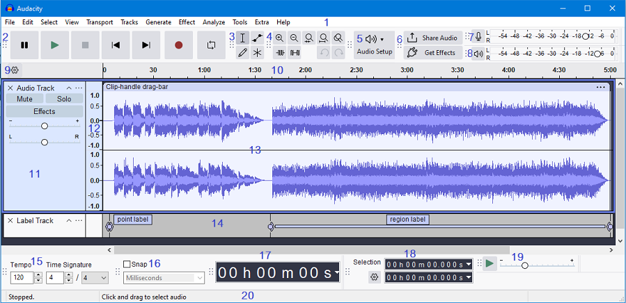


> 此图像*（以及手册中的许多其他波形图像）*已**打开** **[RMS](man/glossary.html#rms)** 显示，光色位于波形中心。RMS 显示现在默认关闭，但您可以使用“**在[波形中显示 ”查看>显示 RMS](man/view_menu.html)**“来启用它。有关更多详细信息，请参阅 [**RMS 显示**](man/audacity_waveform.html#rms)。


# 1 导航

## 1.1 导游


### 1.1.1 录制、播放和编辑 - Audacity 的基础知识

Audacity 可以**[播放](playback.html)**  **[、录制](recording.html)**和**[编辑](edit.html)**音频。要播放或录制，请单击工具栏上的按钮：

 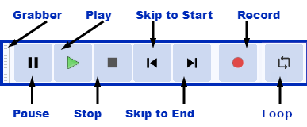 

[](click_tip.html)

**点击图片了解更多**


##### 1.1.1.1 循环

打开或关闭[循环播放](playing_and_recording.html#transport)。如果您在启用循环的情况下按下播放，它将一遍又一遍地循环播放当前循环区域，直到您按下停止。


##### 1.1.1.2 新的业绩记录

按住 **Shift** 键，录制按钮从 ***“录制新曲目”变***为“录制新曲目”。

单击 （*或使用快捷键 **Shift + R** ）*在当前光标位置或当前选择的开头开始在新轨道中录制。


默认情况下，Audacity 将在当前选择（或唯一）曲目的末尾录制


##### 1.1.1.3 选择和编辑

通过拖动[选择音频，](selecting_audio_the_basics.html)然后使用[剪切、复制和粘贴](edit_toolbar.html)等按钮重新排列音频。

您还可以将[音频效果](effect_menu_built_in.html)应用于所选音频。

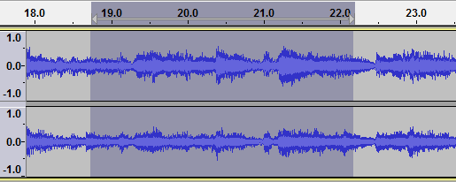


有关播放、录制和编辑的更多详细信息，请参阅手册的[入门](../quick_help.html)部分。


##### 1.1.1.4 打孔和滚动记录

这使您能够在录制会话过程中轻松纠正错误。

- 您可以停止、备份错误并继续录制，从而产生一个轨道，消除错误并正确计时，而无需使用剪切、粘贴和剪辑移动命令，或混合多个轨道。
- 您可以边做边做粗略的编辑，对表演的干扰最小，之后剩下的工作也更少。

有关更多详细信息，请参阅打[孔和滚动记录](punch_and_roll_record.html)页面。


### 1.1.2 保存您的作品 - 音频格式

##### 1.1.2.1 保存

Audacity 区分了以只有 **[Audacity 才能打开的 Audacity 项目格式](audacity_projects.html)**保存音频，以及以 WAV 和 MP3 等格式导出音频以用于其他应用程序。


##### 1.1.2.2 导出

如果您想创建音频格式的文件以在 Audacity 之外播放，请使用导出。

- **[FFmpeg](faq_installation_and_plug_ins.html#ffdown)：**可选的 [FFmpeg 库](faq_opening_and_saving_files.html#foreign)允许 Audacity 导入和导出范围更大的[音频格式](custom_ffmpeg_export_options.html)，包括 ***[M4A （AAC）、](glossary.html#aac)***AC3 和 ***[WMA](glossary.html#wma)***。

  Audacity 可以使用 FFmpeg 从大多数视频文件导入音频。


### 1.1.3 定制 Audacity

##### 1.1.3.1 主题

Audacity 有四个预配置的、用户可选择的主题。

|      | [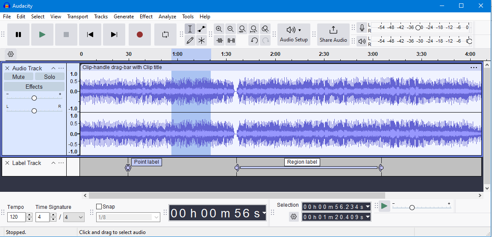](themes.html#light) |      | [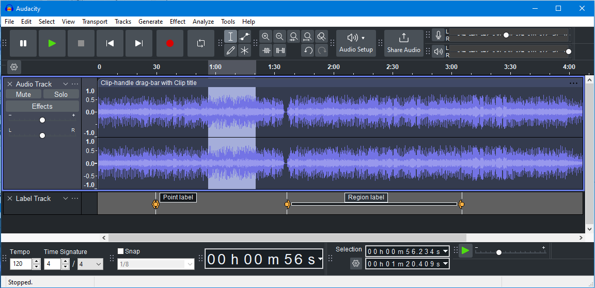](themes.html#dark) |      | [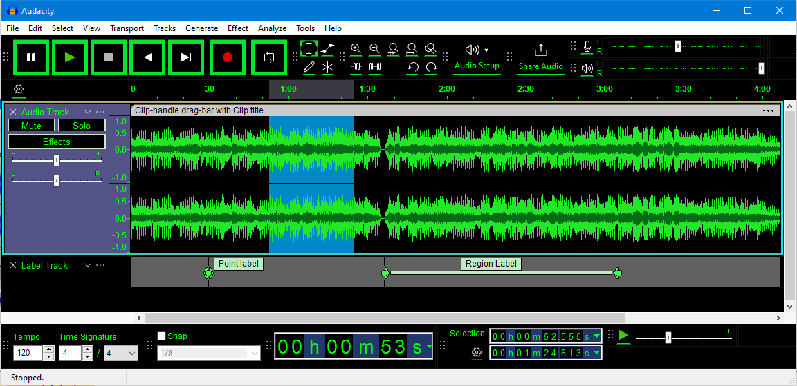](themes.html#highcontrast) |      | [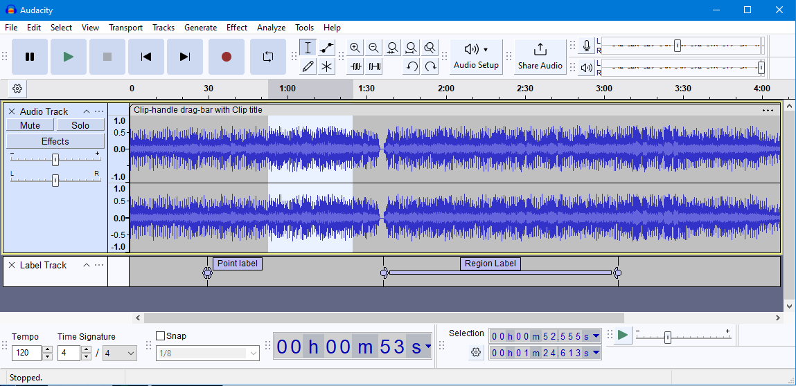](themes.html#classic) |
| ---- | ------------------------------------------------------------ | ---- | ------------------------------------------------------------ | ---- | ------------------------------------------------------------ | ---- | ------------------------------------------------------------ |
|      | **浅色**主题                                                 |      | **深色**主题                                                 |      | **高对比度**主题                                             |      | **经典**主题                                                 |

有关详细信息，请参阅[主题](themes.html)页面。


##### 1.1.3.2 波形配色

选择主题后，您可以选择更改项目中显示的各个波形的配色。

有关详细信息，请参阅[音轨](audio_tracks.html#colors)页面。


##### 1.1.3.3 偏好

Audacity 有无数的设置来调整其行为。

您不必调整这些，但它们就在那里，如果您愿意，可以在[首选项](preferences.html)中进行调整。


##### 1.1.3.4 布局

您可以通过移动、调整大小、隐藏和显示各种[工具栏](toolbars_overview.html)来更改 Audacity 的布局，而不是[首页上显示](../index.html#reference)的布局。

有关详细信息，请参阅[自定义工具栏布局](customizing_toolbar_layout.html)页面。


##### 1.1.3.5 效果插件

您可以使用插件添加到 Audacity 中可用的效果。

其中一些具有带有图表和按钮的非常漂亮的界面，并提供具有不同功能的类似效果，或 Audacity 不附带的效果。

有几种类型的插件。

例如，**[奈奎斯特](customization.html#plug-ins)**类型的插件是 Audacity 自己的插件格式。

奈奎斯特插件只需在文件中写入文本即可制作，因此 Audacity 的贡献者经常使用这种格式来创建新效果。


### 1.1.4 更快的做事方式 - [快捷方式](keyboard_shortcut_reference.html)和[宏](macros.html)

##### 1.1.4.1 快捷方式

许多按钮和菜单命令都分配了预定义的[键盘快捷键](keyboard_shortcut_reference.html)。

您可以修改这些或使用[快捷方式首选项](keyboard_preferences.html)添加您自己的首选项（在 Windows 和 Linux 上的“编辑”菜单或 Mac 上的“Audacity”菜单中）。


##### 1.1.4.2 宏

曾经想对大量音频文件做同样的事情，例如从中去除噪音并转换为 MP3？宏是此功能。

给它一个要处理的文件列表，并告诉它要做的事情顺序。

程序员可能希望改用[脚本，](scripting.html)这是一种实验性但更灵活的宏版本。

这需要一个名为 mod-script-pipe 的免费实验模块和编程经验。


##### 1.1.4.3 导出多个音频文件

您可以一次保存多个音频文件，而不是一个一个地保存它们。


## 1.1.5 更改音频的响度 - 淡入淡出、放大、声像和增益/音量

 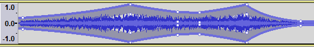 


##### 1.1.5.1 放大

“**[放大”](amplify.html)**音频效果使音频变大或变小。另外两个修改响度的效果是**[淡入](fades.html#linearfade)**和**[淡出](fades.html#linearfade)**。

这些通常用于音频的开头和结尾。

- **[包络](envelope_tool.html)**提供了一种更灵活的方式来控制响度。

  您需要选择“**[包络工具”](envelope_tool.html)**或**[“多功能工具](multi_tool.html)**”才能使用包络。

  使用包络，您可以以图形方式控制音频何时变大和变小。


##### 1.1.5.2 声像和增益/音量

这是轨道轨道[控制面板](audio_tracks.html#panel)中的两个滑块。

增**益/音量**滑块使您能够设置轨道的响度。

“**声相**”滑块可让您在左侧或右侧使音频更响亮。

您可以移动这些滑块以影响音频播放。


##### 1.1.5.3 静音和独奏

这两个按钮位于轨道的轨道控制面板中。

单击“[**静音**](audio_tracks.html#panel)”按钮可在播放时将此轨道静音，再次单击以再次收听。

单击“[**独奏**](audio_tracks.html#panel)”按钮以仅播放此轨道。

再次单击以释放按钮。


##### 1.1.5.4 自动鸭子

每当放置在下方的单个未选定的“控制轨道”的音量达到特定阈值级别时，这会降低（[闪避](http://en.wikipedia.org/wiki/Ducking)）一个或多个选定轨道的音量。

它可用于为播客或 DJ 集创建画外音，用于广播制作中背景音乐的自动“斜坡”，以及在翻译开始后立即关闭原始语言的声音。


##### 1.1.5.5 搅拌机

主轨道窗口中音轨的替代视图，类似于硬件混音板。

每个音轨都显示在轨道条中，其中包含一对自己的仪表、增益/音量滑块、声相滑块和静音/独奏按钮，在其轨道控制面板中镜像该轨道的控件。


### 1.1.6 音频中的噪音 - 减少、添加、微调

 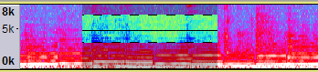 


##### 1.1.6.1 光谱选择

这是**[频谱图](spectrogram_view.html)**中的一项特殊功能，可让您查看音频的频率内容，然后仅编辑选定的频率。

这对于录音特别有用。

除其他目的外，频谱选择和编辑可用于通过删除特定频率、增强某些共振、改变声音质量或从语音工作中删除口音来清理不需要的声音。


##### [噪](noise_reduction.html)

Audacity 可以从录音中去除某些类型的噪音。

降噪是一种“音频效果”，是可以使用的更小技巧的音频效果之一。

此效果最适合相当恒定的噪音，例如背景嘶嘶声。

您首先选择仅是噪音的音频并创建一个“噪音配置文件”。

一旦 Audacity 知道噪声配置文件，它就可以降低您选择的音频中此类噪声的响度。


##### [陷波滤波器](notch_filter.html)

这可用于通过在这一点上从频谱中切出一个“缺口”来帮助您消除电源嗡嗡声或电哨声，同时将对剩余音频的损坏降至最低。


##### [生成噪声](generate_menu.html#noise)

Audacity 也可以为录音添加噪音。

可以产生三种不同类型的噪声。

白噪声具有最大的掩盖其他声音的能力，因为它在所有频率水平上都具有相似的能量。

如果您想添加一些房间噪音以使静音更逼真，请尝试以 0.001 振幅添加它。


##### [绘制工具](draw_tool.html)

如果将音频放大到**足够大，**则可以编辑单个音频样本。

通常每秒音频有 44100 个样本点。

这使您可以了解音频在计算机中的存储方式。

偶尔，音频中可能会出现咔嗒声，最好使用绘图工具去除，而不是使用**[单击删除](click_removal.html)**或**[修复](repair.html)**效果。

修复最好在放大很多时使用，因为它只适用于短音频片段。


### 1.1.7 导航和改变速度和音调

##### [快速播放](play_at_speed_toolbar.html)

Audacity 有一个 **[Play-at-Speed 工具栏](play_at_speed_toolbar.html)**，带有一个带有绿色箭头指向右侧的小按钮，看起来像带有绿色箭头的较大按钮，用于“播放”。

使用按钮右侧的滑块设置速度以更快或更慢。

速度变化也会改变音高。

这是播放期间的临时更改。若要永久更改速度和音高，请使用“更改速度”和“音高”效果（如下）。

  


##### [擦洗和搜索](scrubbing_and_seeking.html)

这是向右或向左移动鼠标指针以调整播放位置、速度或方向的动作，向前或向后，同时收听音频 - 一种快速导航波形以查找特定事件的便捷方法感兴趣。

在拖动或搜索时，您还可以使用鼠标滚轮来更改拖动或搜索的速度，因此这是更改播放速度的另一种方法。


##### [改变速度和音高](change_speed.html)，[改变音高](change_pitch.html)，[改变速度](change_tempo.html)

您可以通过应用更改音频的效果来加快或减慢音频速度：

- 使用**[“更改速度”和“音高](change_speed.html)**”可使音频更快或更慢，音调更高或更低。

- 使用**[“更改音高”](change_pitch.html)**可更改选区的音高，而不更改其速度（速度）。

- 如果您希望在加速或减速时音高保持不变，请使用**[“更改速度”](change_tempo.html)**。

  随着速度的大幅变化，变化速度并不总是那么好，最终结果可能听起来有点奇怪。


##### [时间轨迹](time_tracks.html)

时间轨迹是一条图形线，您可以拖动它来更改随时间变化的加速或减速量，而不必是恒定的速度变化。

与“以速度播放”一样，速度会立即更改，而无需等待运行效果，但除非删除时间轨迹，否则导出时会应用更改。

因此，为了安全起见，在使用时间轨迹之前，将您的作品副本导出为 WAV 格式。


### 1.1.8 [实时效果](https://support.audacityteam.org/audio-editing/using-realtime-effects)

如果单击轨道轨道控制面板中的效果按钮，效果堆栈将在轨道控制面板的左侧打开。

在这里，您可以将启用实时的效果*（一些 Audacity 和许多启用实时的第 3 方插件）*添加到堆栈中。

这些效果可以在 Audacity 播放时动态更改，因此您可以实时动态地听到更改。

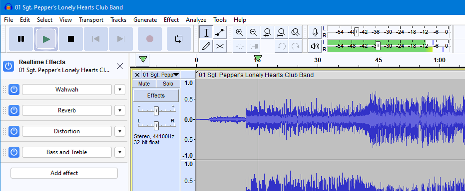

有关更多详细信息，请参阅[**使用实时效果**](https://support.audacityteam.org/audio-editing/using-realtime-effects)。


### 1.1.9 很多你可能不知道 Audacity 可以做的事情

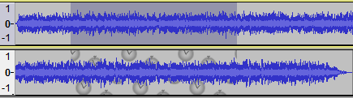

 **一对同步锁定的单声道轨道：选择会自动扩展到第二轨** 


##### [同步锁](sync_locked_track_groups.html)

当您有一个混音（几个轨道彼此相叠并一起播放）并且所有内容都排列得很好时，对一个轨道进行编辑（例如剪切一段音频）可能会导致混音不再同步播放。

要在剪切、粘贴或移动音频时保持轨道对齐，请使用同步锁定轨道。


##### [标签](label_tracks.html)

使用标签轨道来标记或注释音频。

与 Sync-Lock 结合使用，您可以保持标签和音频同步。


##### [撤消和重做](undo_redo_and_history.html)

这些在处理效果时最有用。

应用效果后，您可能会改变主意。

撤消按钮或菜单项**编辑>撤消**将允许您撤消更改。

“**[历史记录”](undo_redo_and_history.html#history)**菜单项可让您进一步回顾并一步撤消更多更改。


##### [截断静音](truncate_silence.html)

一种方便的效果，适用于采访和演讲的录音，可以消除长时间的沉默。

您可以告诉它什么算作长时间静音、响度级别和持续时间，以及要删除每个长时间静音的量。


##### [捕捉](snapping_toolbar.html)

在进行选择时，有时将选择边界自动移动到最接近的秒（或其他时间测量单位）会有所帮助。

如果你 [**Snap** to](snapping_toolbar.html) seconds，你的选择将始终是整数秒 - 例如，你不能选择半秒的声音。

将时间格式设置为秒或帧或您想要捕捉到的任何时间单位，并启用**捕捉**。


##### [多夹子](audacity_tracks_and_clips.html)

许多人在每个音轨上都有一段音频。

但是，您可以在同一轨道上拥有多个不重叠的音频片段。

这些称为剪辑。

可以使用**[“拆分”](audacity_tracks_and_clips.html#split)**创建剪辑，并通过单击剪辑之间的暗线边界重新连接在一起。

您可以将剪辑拖动到轨道上的不同位置，或使用[剪辑手柄拖动条](audacity_tracks_and_clips.html#move)将它们拖动到不同的轨道。


## 1.2 开始使用

了解如何：

- [导入并播放](man/play.html)现有音频文件
- [录制](man/record.html)你的声音、吉他、标准唱盘或磁带机
- [使用USB设备录制](man/usb_recording.html)*（USB唱盘、USB磁带机或USB音频接口）*
- 选择要处理[的音频](man/selecting_audio_the_basics.html)
- [编辑](man/edit.html)音效，包括应用[效果](man/effect_menu.html)
- [保存或打开Audacity项目](man/saving.html)
- [导出](man/file_export_dialog.html)为MP3或其他音频文件
- [刻录成光盘](man/burncd.html)


## 1.3 Audacity 基础

### 1.3.1 安装和更新Audacity

- [安装和更新Audacity](https://support.audacityteam.org/basics/downloading-and-installing-audacity)
- [重置Audacity为默认设置](https://support.audacityteam.org/troubleshooting/resetting-audacity)
- [FFmpeg 导入/导出](https://support.audacityteam.org/basics/installing-ffmpeg)库，提供更多导入/导出音频格式
- 主题——学习如何选择你喜欢[的](https://support.audacityteam.org/basics/customizing-audacity/using-themes)Audacity风格和感觉
- [安装插件](https://support.audacityteam.org/basics/installing-plugins)——你可以下载并安装插件，为Audacity添加额外功能


#### 1.3.1.1 下载和安装Audacity

Audacity 是一款易于使用的多轨音频编辑器和录音机，适用于 Windows、macOS、GNU/Linux 及其他作系统。本页将引导您完成下载和安装流程。


##### 1.3.1.1.1 Windows

###### 从Microsoft商店安装

你可以从[Microsoft Store](https://apps.microsoft.com/store/detail/audacity/XP8K0J757HHRDW)安装Audacity。

- 访问[**Microsoft Store官网**](https://apps.microsoft.com/store/detail/audacity/XP8K0J757HHRDW)。

- 搜索Audacity。

- 找到Audacity后，点击**“进入商店”应用**按钮。

  

- Microsoft Store 应用将打开。要安装 Audacity，请点击**安装**按钮。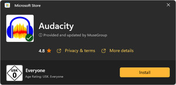

  

- 接下来，Windows安装程序会要求你更换系统。点击**“是”按钮**。

- 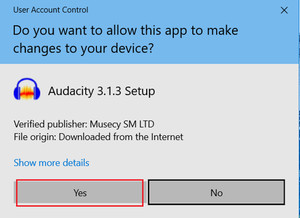


Audacity 已经安装，你可以从开始菜单打开它。


###### 从互联网安装 Audacity

- 前往 https://www.audacityteam.org/ 的 Audacity 下载页面，然后点击**“无 MuseHub 下载 Audacity**”按钮。

  你也可以通过 MuseHub 下载 Audacity，此时以下作方式将有所不同。

- 下载开始后，你可以点击**“运行**”或**“保存**”。

- 如果你点击**保存**按钮，进入你的下载文件夹（通常是C：\users\your name\Downloads*），*找到Audacity安装程序，双击它。
  
  - 如果你使用的是Windows 11，可能会被警告Audacity尚未获得Microsoft的认证。不过你还是应该点击**安装。**


运行Audacity安装程序时的Windows 11警告

- 如果你点击**“运行**”按钮，Windows 会自动启动安装过程。
- 当Windows安装程序要求你对系统进行更改时，点击“**是**”。

  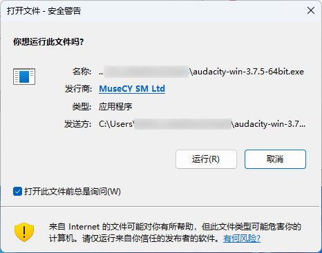
- 选择安装时将使用的语言，然后点击**确定**。

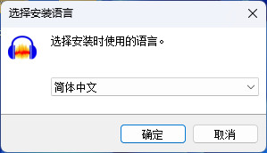

选择安装时使用的语言

- 一旦 Audacity 的欢迎页面出现，点击**“下一步**”按钮。

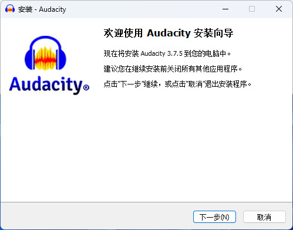

欢迎页面 - 点击下一步

- 接下来，**信息**页面将介绍Audacity的许可证。该软件采用GNU通用公共许可证（GPL）版本发布。点击**“下一步**”继续。

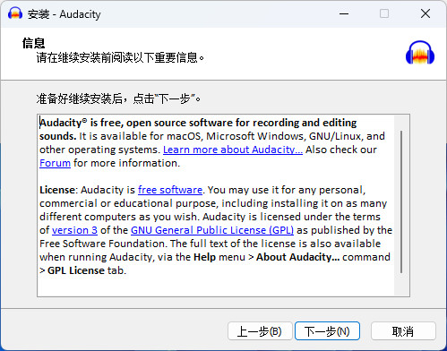

信息页面 - 了解更多关于 Audacity 及其授权的信息链接

- **选择目的地位置**页面将允许您选择是否在推荐目的地安装 Audacity，或通过“**浏览......**”按钮自行选择位置。点击**“下一步**”继续。

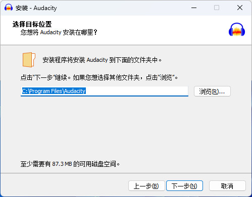

选择安装Audacity的文件夹

- **选择额外任务**页面允许你在桌面安装 Audacity 的快捷方式。如果你之前安装过Audacity，可以选择**重置偏好设置。**


选择是否创建快捷方式打开Audacity

- 在Audacity安装程序中核实你所做的选择，然后点击**安装。**

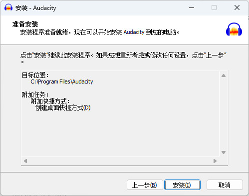

验证你的选择并点击安装

- 完成设置过程可能需要一些时间。

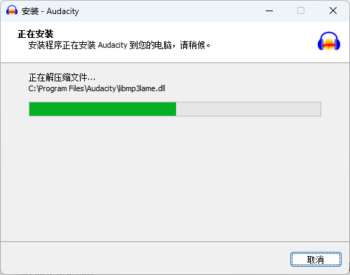

等设置过程完成后再说

- 当“**完成 Audacity 设置d向导**”窗口出现时，点击**完成**关闭安装程序。如果你愿意，在继续前选择“**启动Audacity**”复选框。

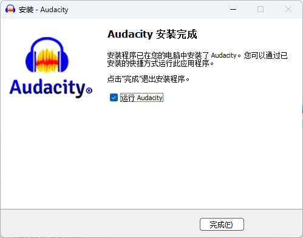


 点击“结束”关闭安装程序 


##### 1.3.1.1.2 macOS

- 进入下载页面：https://www.audacityteam.org/，点击“**无MuseHub下载**”按钮。

  或者，你也可以通过MuseHub下载Audacity，此时作步骤会有所不同。

- 如果系统提示，点击**保存**。

- Audacity官网会把Audacity的DMG文件保存在你的下载文件夹里。

  接下来，双击DMG文件开始安装过程。

- 当 Audacity 应用图标出现后，将其拖入 Applications 文件夹（见下文）。

  完成此任务需要管理员权限。*不要从DMG文件夹启动Audacity。* 

  - 您可以选择将 Audacity 应用迁移到任何其他地点。

  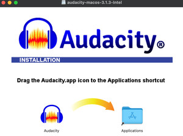

- 从应用程序文件夹或你选择的位置启动 Audacity.app。

- Audacity出现在屏幕上后，按下**确定**键开始编辑！如果你不想再次看到欢迎窗口，可以勾选“启动时不要再次显示此内容”提示。

   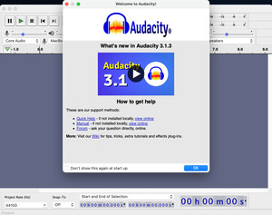


##### 1.3.1.1.3 Linux

###### 1.3.1.1.3.1 用AppImage安装Audacity

1. 进入下载页面：https://www.audacityteam.org/ 并点击下载按钮。

2. 下载的AppImage需要是可运行的。要实现这一点，请**右键点击**文件 **-> 属性 -> 权限**，或在终端内执行以下命令：

   ```shell
   chmod +x <path to your Audacity.AppImage>
   ```

3. 双击AppImage即可运行Audacity。

> **注意：**如果你在打开AppImage时遇到困难，可以试试安装**libfuse2**。
>
> 各种分布的具体步骤可在以下网站找到
>
> https://github.com/AppImage/AppImageKit/wiki/FUSE


###### 1.3.1.1.3.2 使用仓库中的包安装

你的Linux发行版（例如Ubuntu、Fedora或Debian）可能包含Audacity包作为仓库的一部分。

通常，发行版仓库中的版本比最新的 AppImage 还*要早*，但它可能更适合集成到你的发行版中。


请在您电脑上的软件中心、App Store或类似软件访问此版本，或尝试以下命令：

- Ubuntu、Debian，Pop_OS!，Linux Mint：`sudo apt install audacity`
- RHEL，Fedora：`sudo yum install audacity`
- Arch Linux：`sudo pacman -Syu audacity`

> 仓库包由社区维护，而非 Audacity 团队。


###### 1.3.1.1.3.3 使用Flatpak或Snap安装

社区维护的Flatpak和Snaps可在 [Flathub](https://flathub.org/apps/org.audacityteam.Audacity) 和 [Snapcraft](https://snapcraft.io/audacity) 购买。


#### 1.3.1.2 安装FFmpeg

FFmpeg 允许你导入/导出额外的音频文件格式到 Audacity 或

由于专利限制，FFmpeg 无法直接通过 Audacity 分发。然而，FFmpeg 需要导入和导出多种音频格式，包括 M4A 和 WMA。


**注意：**在之前的Audacity版本中，LAME需要导出MP3文件。现在它默认包含在Windows和macOS上的Audacity中。如果你遇到任何LAME错误，确保你使用的是最新版本的Audacity。

你可以按以下方式下载和安装FFmpeg：


##### 1.3.1.2.1 Windows

###### 1.3.1.2.1.1 推荐安装商

1. 从 https://lame.buanzo.org/ffmpeg.php 下载FFmpeg安装程序。

   对于大多数电脑来说，64位Windows版本是正确的。

   原生Windows ARM版本请访问 https://github.com/tordona/ffmpeg-win-arm64。

2. 运行安装程序。你可以忽略“未知出版商”警告。

3. 阅读并接受许可

4. 选择安装FFmpeg的位置。默认情况下，Audacity 会将 FFmpeg 安装在 **C：\Program Files\FFmpeg 中**

5. 完成安装

6. 重启Audacity

Audacity 现在应该会自动检测到 FFmpeg 并允许你使用它。


###### 1.3.1.2.1.2 使用 WinGet 安装

Audacity 版 FFmpeg 也可在 WinGet 上下载：

```shell
winget install --id=Buanzo.FFmpegforAudacity  -e
```


###### 1.3.1.2.1.3 其他FFMPEG构建

如果你更喜欢手动安装FFmpeg，可以从其他来源下载ZIP文件：

- https://github.com/BtbN/FFmpeg-Builds/releases
- https://www.gyan.dev/ffmpeg/builds/#release-builds
- Windows ARM64：https://github.com/tordona/ffmpeg-win-arm64
- 或者像这里描述的那样从源代码编译：https://trac.ffmpeg.org/wiki/CompilationGuide

> **注意：**
>
> - 并非所有FFmpeg版本都支持所有版本。
>   - Audacity 3.1之前只支持avformat-55.dll。
>   - Audacity 3.1及以后版本支持avformat-55.dll、avformat-57.dll和avformat-58.dll。
>   - Audacity 3.2及更高版本也支持avformat-59.dll。
>   - Audacity 3.3及更高版本也支持avformat-60.dll。
>   - Audacity 3.5及更高版本也支持avformat-61.dll。
>   - 你可以[在这里](https://ffmpeg.org/download.html#releases)查看哪个DLL出现在哪个FFmpeg版本里。
> - 一定要下载完整的FFmpeg副本，而不是单独下载avformat的*.dll。此外，确保下载或构建**共享**版本，因为只有共享版本包含.dll。
> - 不同版本的FFmpeg可能启用了不同的编解码器。特别是，AMR（窄带）未出现在推荐安装程序中。


###### 1.3.1.2.1.4 手动安装

如果你是从其他来源安装了FFmpeg，或者安装在不同位置，你需要告诉Audacity在哪里可以找到它。

具体做法：

1. 前往**编辑 > 偏好设置 > 库**

2. 点击定位**......**按钮。

   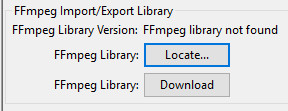

3. **如果出现以下提示**，Audacity已自动识别FFmpeg：

   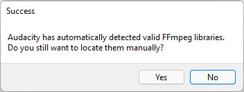

   你可以点**“否”**，因为Audacity已经知道FFmpeg的位置。

   如果**该消息未出现**，请继续下一步。

4. 在这个对话框中，点击“**浏览......**”以找到你在其他地方下载/安装的 FFmpeg 文件夹中的 avformat-*.dll

   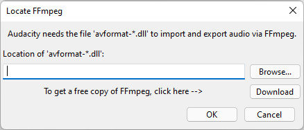

5. 找到后，点击**打开****，然后确定**，再按**确定**，关闭偏好设置。


#### 1.3.1.3 用麦克风录音你的声音

Audacity 可以使用多种麦克风和其他音频设备来录制音频。


##### 1.3.1.3.1 连接你的麦克风

你可以把麦克风插到合适的接口上。

一般来说，这意味着：

- 如果你有USB麦克风，插到USB接口上。
- 如果你有带3.5mm插孔的麦克风，插到麦克风输入口。
- 如果你有XLR麦克风，把它插到XLR-USB音频接口上，接口再插到USB接口。

你如何连接麦克风取决于你的电脑型号和麦克风。请使用手册或支持页面获取更多信息。如果你的电脑没有合适的麦克风接口，可能需要适配器。


> **注意：**许多笔记本电脑和笔记本都内置麦克风。虽然他们可能足够好录好你的声音，但他们制作的其他录音往往会有些不愉快。


##### 1.3.1.3.2 选择你的麦克风

一旦你把麦克风插到电脑上，在**音频设置**工具栏里选择要录制的麦克风。

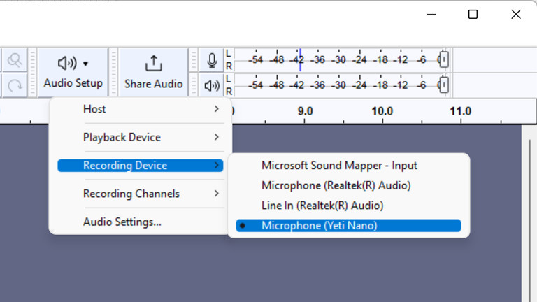

使用**音频设置**工具栏选择你想录制的麦克风

该工具栏可能会显示一些意想不到的设备（例如网络摄像头），以及虚拟设备（假装是麦克风的软件）。

选择与你真正想使用的麦克风匹配的条目。音频**设置**工具栏还允许你选择是单声道还是立体声录音。


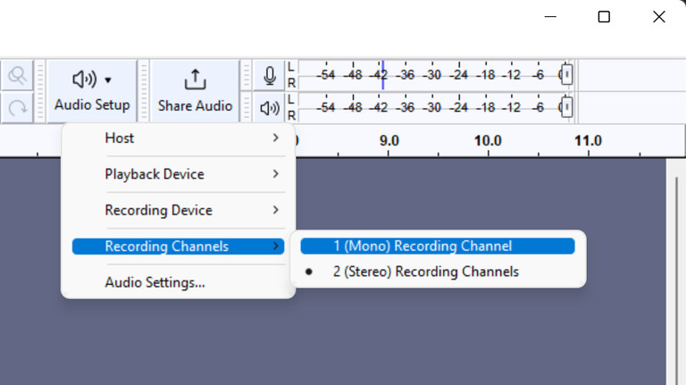

**音频设置**工具栏还显示麦克风可用的录音通道数量


> **注意：**大多数麦克风都是单声道的，单声道通常是录音的最佳选择。只有在需要方向性时才用立体声。


##### 1.3.1.3.3 测试你的设置

选择麦克风图标，选择**开始监听**（如下图），用手指轻敲麦克风。如果你看到点击麦克风时绿色条在移动，说明你在前一步选对了设备。

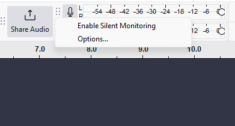)

点击麦克风开始监听

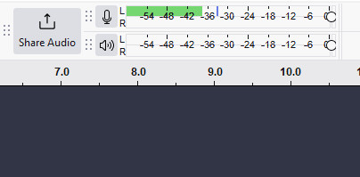

Audacity会在录音仪表中显示麦克风电平


然后尽量用正常音量说话。一般来说，音量应始终保持在绿色区域（一般来说，-18到-12 dB之间为最佳）。


> **谨慎：**如果输入音量太低（低于-42 dB）或太高（经常在红色区域），音频质量很可能会受影响。请参见此页面了解如何修复：[设置录制和播放音量](https://support.audacityteam.org/basics/recording-your-voice-and-microphone/setting-recording-levels-and-playback-levels) 


接下来，做一个测试录音。要开始在Audacity录制你的声音，只需按下红色录制按钮。


运输工具栏：录制按钮位于右数第二个


录音结束后，回放一遍。如果一切顺利，你现在应该能清楚地听到自己的声音。一旦你清楚地听到自己的声音，你就可以继续下一步了。


#### 1.3.1.4 设置录制和播放音量

录制和回放电平可以通过录制和播放计工具栏中的滑块设置：

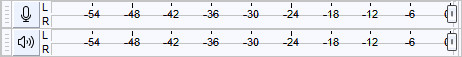

录音计量工具栏和带电平滑块的播放计量工具栏

- 带有麦克风图标的滑块用于设置系统级别的录音音量。如果作系统禁止此作，该滑块将处于失效状态。

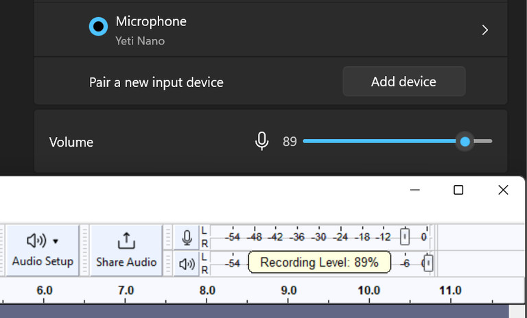

录制音量滑块会在系统层面改变录音设备的音量

- 带有扬声器图标的滑块可以设置播放音量相对于系统音量。导出文件的音量不会影响，使用每轨的增益滑块来编辑。


**最佳实践：**开始录音前，点击麦克风图标，选择**开始监听**以激活录音电平计。 如果在正常音量测试时进入黄色或红色区域（-9 dB到0 dB），请降低录音音量以防止真实录音中的削波和失真。

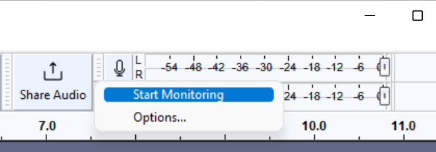

开始录音前先激活录音电平计

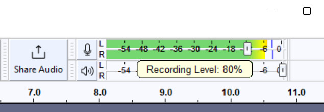

当音量过高时，使用录音音量滑块来降低


如果你在**音频设置>录音通道**中选择**了1个（单声道）录音通道**，仪表只会显示**左**侧左侧通道的音量

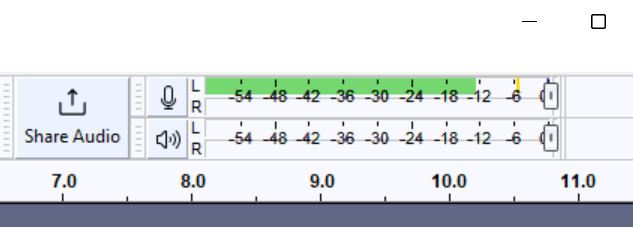

监听1（单声道）录制通道电平


#### 1.3.1.5 录制桌面音频

Audacity可以录制电脑音频（包括YouTube、Spotify等音频）。


##### 1.3.1.5.1 选择环回设备

###### 1.3.1.5.1.1 Windows

- 点击**音频设置**，选择**Windows WASAPI**作为主机。

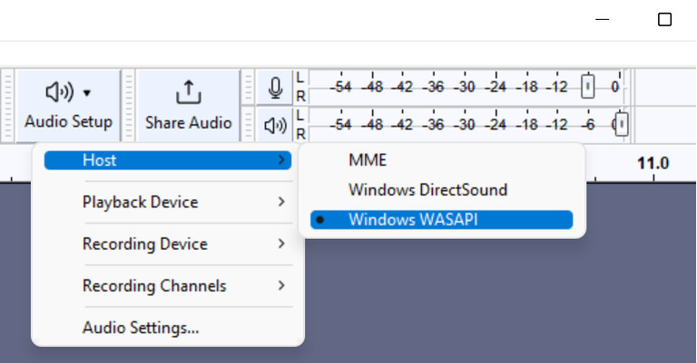

**在主机音频设置中选择Windows WASAPI>**

- 选择你想用的输出（你用来监听的设备）作为输入。它的名字后面会有一个（回环）标记。

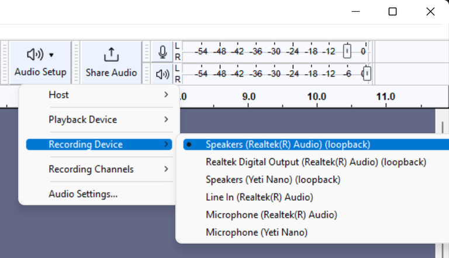

选择你想录制音频设备的**回环**选项。


使用（默认）MME设备时，你可能会发现一个名为*立体声混音*、*听到的*声音或类似的虚拟麦克风。这也能录下你的桌面音频。

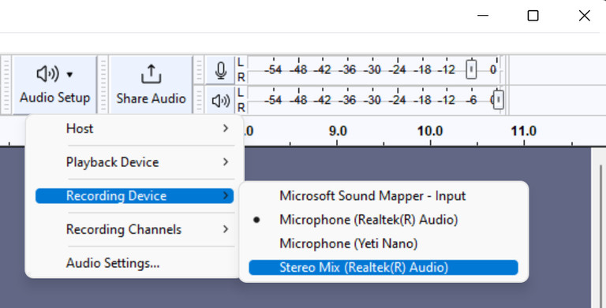

选择立体声混音作为录制桌面音频的替代方案


###### 1.3.1.5.1.2 检查所有设置是否正确

录制桌面音频会录制所有桌面音频，包括通知提示音、游戏和Audacity本身（例如如果你用叠录，时间线上的其他轨道）。所以除非你特别想听这些声音，否则一定要关掉它们。


录制桌面音频时**不要使用软件播放**。确保在菜单中关闭：**运输>传输选项 > 软件播放（开关）**——旁边的✔️勾选必须关闭。你也可以在这里关闭叠录。


###### 1.3.1.5.1.3 记录

点击播放确认音频正在播放，然后按录制按钮录制桌面音频。


录制桌面音频**时，确保先播放音频**，因为虽然WASAPI可以录制静音音频流，但当没有音频流时就不能录制。


#### 1.3.1.6 音频编辑

本页是一个关于Audacity编辑的入门教程。内容涵盖了如何导入文件、剪辑、重新排列剪辑和应用特效！

##### 1.3.1.6.1 导入文件

要开始编辑，你需要某种声音来编辑。你可以[录制一些声音](https://support.audacityteam.org/basics/recording-your-voice-and-microphone)，或者通过拖拽导入已有的声音文件（比如MP3或WAV）。你也可以通过**“导入”菜单**导入文件>导入。


> **注意：**  要导入专有文件格式如M4A或WMA，你需要先[安装FFMPEG](https://support.audacityteam.org/basics/installing-ffmpeg)。


一旦你有了这个，你就会看到声音的波形：

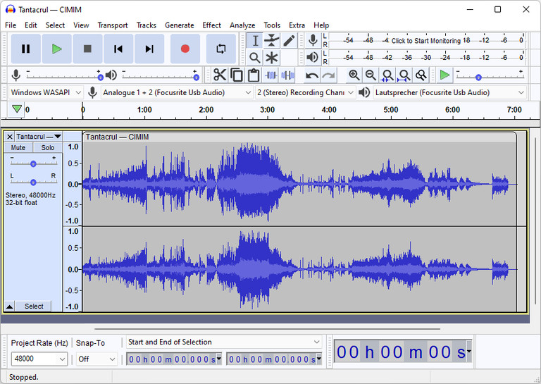

歌曲的波形


这种波形是歌曲的视觉表现。蓝色“斑点”越大，部分越响亮。独立的线（“尖峰”）表示突然且短暂的响亮段落，如点击声、断裂声、拍手声和鼓点敲击。经过一定练习，你可以用波形快速浏览音频文件。


##### 1.3.1.6.2 删除歌曲的部分

要删除音频文件中的某一段，首先通过**点击并拖**动波形来选择该部分。

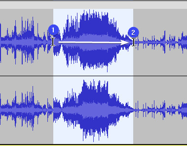

选定波形


> **提示**：你可以用Zoom+图标放大，或者用（）精确调整选择的开头和结尾。`Ctrl+Scroll``Cmd+Scroll`

一旦你选定了某个选项，按或键删除它。`Delete``Backspace`


##### 1.3.1.6.3 音频的移动部分（片段）

Audacity 支持剪辑，即项目内部可以独立移动的音频片段。从技术上讲，你录制或导入的任何音频都已经作为一个片段存在，用波形上方圆形的剪辑把手表示。

你可以点击剪辑把手上的**+拖动**来移动剪辑。

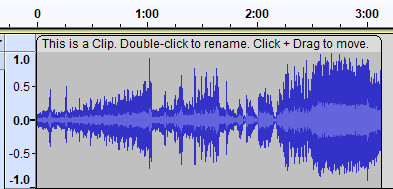

一个剪辑把手。双击重命名，点击并拖动移动。


##### 1.3.1.6.4 拆分片段

要将一个剪辑拆分为两个独立的剪辑，

1. 点击你想拆分片段的波形。

   **提示：** 要进行精确调整，请先放大。

2. **右键点击>分段剪辑** (`Ctrl+I` / `Cmd+I`)


**注意：** 如果你选择了某个音频，它会从中生成一个片段。


##### 1.3.1.6.5 剪辑尺寸调整与裁剪

要裁剪剪辑，将光标悬停在剪辑左右边缘的**上三分之一**处：

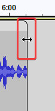

要裁剪剪辑，点击边长上三分之一处的+拖动键。

然后**点击并拖动**边缘，将剪辑到想要的长度。


**注意：** 裁剪是非破坏性的作。你可以随时取消剪辑。如果你是通过[拆分](https://support.audacityteam.org/basics/audacity-editing#splitting-up-clips)一个较大的剪辑创建的剪辑，你甚至可以将当前剪辑解剪直到长度与旧剪辑相同。如果你想永久删除裁剪数据，可以将剪辑复制到另一个项目，粘贴时选择**仅选定音频**，然后返回。


##### 1.3.1.6.6 效果应用

Audacity 支持多种效果和插件。这些效果可用于[降噪、去除](https://support.audacityteam.org/repairing-audio/noise-reduction-removal)等功能，虽然每个效果功能不同，但通常可通过以下方式应用：

1. 选择你想应用效果的音频。

2. 进入**效果菜单。**

3. 选择你想使用的效果。通常，这样的窗口会打开：

   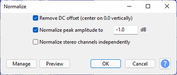

4. 根据喜好调整效果。你可以点击**预览**按钮，听一段简短的样本，然后再应用到整个选区。

5. 按下确定键应用效果。


> **最佳实践：** 如果你想给整首曲子应用效果，就用[实时效果](https://support.audacityteam.org/audio-editing/using-realtime-effects)。这样你就可以在之后任何时候改变效果。


#### 1.3.1.7 保存与出口项目

有两种方法可以让你的作品从Audacity中取出：保存项目，以及导出音频。


##### 1.3.1.7.1 将项目保存到云端

> 云项目有备份和版本控制，确保即使电脑故障，你的工作也不会丢失。此外，你还可以轻松地与合作者分享。


要将项目保存到云端，首先进入**文件 -> “保存到云**端”。在接下来的对话框中，点击**“链接账户**”。

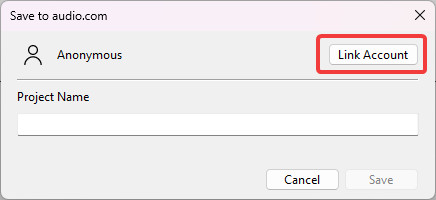

存档到 audio.com


您将被引导完成 [audio.com](https://audio.com/) 注册流程，最后会有将 [audio.com](https://audio.com/) 账户关联到Audacity的选项。

一旦你将 audio.com 账户绑定到 Audacity，只需**输入项目名称**并点击**保存**。项目现在会在后台上传。

你第一次保存时，系统会问你想多久生成一次混音。混音用于 [audio.com](https://audio.com/) 上预览文件。如果你不打算与他人合作，可能就不需要生成混音。你可以随时在**编辑 ->偏好设置 ->云中**更改偏好。


##### 1.3.1.7.2 将项目保存到电脑（.aup3）

你可以通过**文件 -> 保存项目 - 保存项目 - 保存项目菜单>保存项目**。

保存的项目包含关于你项目最多的信息。如果你保存了一个项目，之后可以更改[实时效果](https://support.audacityteam.org/audio-editing/using-realtime-effects)，或者取消剪辑。


> **警告：**避免将活动项目保存到外置硬盘、U盘或网络存储中。Audacity 在录制和编辑时需要快速且不中断地访问你的存储空间。


##### 1.3.1.7.3 导出音频（.mp3、.wav、.ogg等）

> **注意：**你可能需要[安装FFMPEG](https://support.audacityteam.org/basics/installing-ffmpeg)才能访问这些选项。


你可以用**“文件->导出音频......**”菜单项将项目导出为音频文件。导出的音频文件可以用各种程序打开。

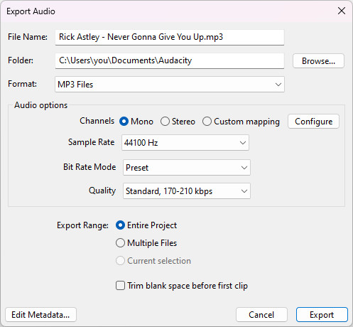

导出音频窗口


> **技巧与窍门**
>
> - 如果你不需要方向性（比如只是录音），就用单声道。
> - 作为MP3的替代方案，Opus和M4A（AAC）选项在相同文件大小下提供更高质量，相较MP3。
> - 作为 WAV 的替代方案，FLAC 和 Wavpack 选项提供无损压缩，文件大小可减少多达一半，同时不丢失任何信息。


#### 1.3.1.7 在线分享音频

从Audacity 3.2及以后，你可以轻松地在线分享音频。


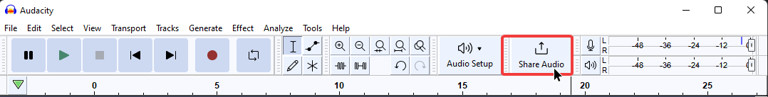

分享音频按钮的位置


借助Audacity 3.2，您可以使用新的服务 [audio.com](https://audio.com/) 快速在线分享音频。作方法是点击**“分享音频**”按钮。

你现在可以通过点击**继续**上传你的音频。如果你想先关联已有的 audio.com，可以通过点击**“链接账户**”来实现。

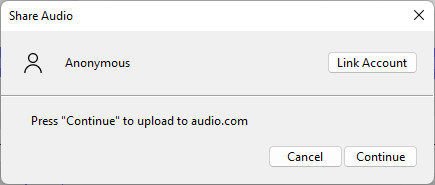

Audacity现在会准备轨道上传并上传你的音频。


> **注意：**这可能需要几分钟，具体取决于你的电脑速度、网络连接速度以及音频长度。


上传音频后，请按**继续**。您将被带到 audio.com 网站。

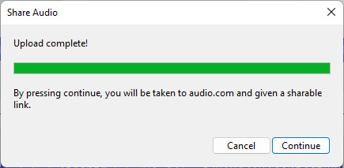


audio.com 现在你可以创建账户使用，或者复制匿名链接。分享链接，

1. 关闭报名面板，
2. 点击**分享按钮**（如下图），然后
3. 选择**复制链接**

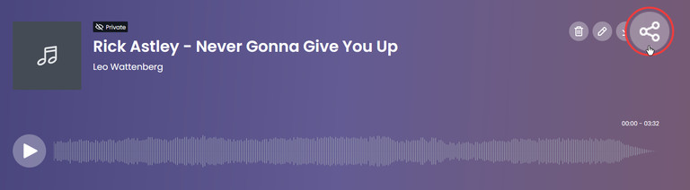

分享按钮的位置


你现在可以通过发送这个链接来分享你的音频。


> 所有上传的音频默认都是私密的。只有有权限访问该链接的人才能收听。


##### 1.3.1.7.1 将 audio.com 与Audacity联系起来

把你的 audio.com 账号绑定到Audacity，就能直接从Audacity获得可共享的链接。要关联你的账户，

1. 按下**“分享音频**”按钮。 注意：你的项目中需要有某种音频，这个按钮才能正常工作

2. 你的浏览器会打开 audio.com

3. 如果你还没登录，请**登录或注册** 

4. 您将看到以下页面：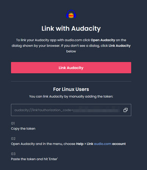

5. 点击“**Link audacity**”。

6. 你可能会弹出一个提示，问你是否想在 Audacity 中开启。

   

   点击打开Audacity的选项


#### 1.3.1.8 定制Audacity（Audacity）


##### 1.3.1.8.1 主题运用

Audacity 预装了四个主题：光、暗、经典和高对比。你可以通过选择**编辑 -> 偏好设置 -> 界面**（macOS：Audacity -> 偏好设置 -> 界面）切换主题。


主题选项的位置


选定主题后，点击**确定**关闭偏好设置对话框并加载新主题。


###### 1.3.1.8.1.1 安装自定义主题

自定义主题通常以称为ImageCache.png的文件形式分发。

你可以在这里找到一些自定义主题：


要安装自定义主题，请将ImageCache.png放入以下文件夹。

如果文件夹不存在，你可以创建它们。

- **窗户：** `C:\Users\<username>\AppData\Roaming\Audacity\Theme\custom\`
- **MacOS：**`~/Library/Application Support/Audacity/Theme/自定义/`
- **Linux：** `~/.local/share/audacity/Theme/custom/`


然后

1. 重启Audacity，
2. 打开偏好设置 -> 界面页面，
3. 选择自定义作为主题，
4. 按确定。


> **注意：**自定义主题仅针对某个 Audacity 版本进行优化，且可能在不同版本之间出现差异。如果某个主题和截图看起来不一样，那很可能就是原因。


###### 1.3.1.8.1.2 创建自定义主题

关于创建自定义主题的说明，请查看以下页面：


##### 1.3.1.8.2 安装插件

你可以在这里下载各种插件：

[Audacity 插件](https://plugins.audacityteam.org/)

大多数插件安装后会自动激活。


> **谨慎：**

- 64位Audacity只能运行64位插件，32位Audacity只能运行32位插件。
- 此外，Apple Silicon（arm64）Audacity无法运行Intel（x86-64）插件，反之亦然。
- 插件的“乐器”版本（VSTi、LV2i）不被支持。


###### 1.3.1.8.2.1 手动安装插件

如果某个插件没有被 Audacity 找到，或者没有安装程序，请将插件文件迁移到以下任一位置：


**1.3.1.8.2.1.1 Windows**

你可以通过点击“运行”并输入快速访问“Common Files文件夹`🪟 WINDOWS key + R``%ProgramFiles%\Common Files`

- VST2：或`C:\Program Files\Common Files\VST2``C:\Program Files\Steinberg\VSTPlugins`
- VST3：`C:\Program Files\Common Files\VST3`
- LV2：**注意：**务必复制完整的.lv2*文件夹*`C:\Program Files\Common Files\LV2`
- LADSPA：**注意：**你可以通过点击启动“运行”并输入快速访问该文件夹`C:\Users\\Appdata\Roaming\audacity\Plug-ins\``🪟 WINDOWS key + R``%AppData%\audacity\Plug-ins`
- 鞋面：`C:\Program Files\Vamp Plugins\`
- 奈奎斯特：见下文


**1.3.1.8.2.1.2 macOS**

所有插件都可以按 `per-user()` 或 `system-wide()` 安装。

以下仅命名系统范围的路径`~/Library/Audio/Plug-Ins/...``/Library/Audio/Plug-Ins/...` 

- Audio Unit: `/Library/Audio/Plug-Ins/Components/`
- VST2: `/Library/Audio/Plug-Ins/VST/`
- VST3: `/Library/Audio/Plug-Ins/VST3/`
- LV2:  or , **Note:** always copy the entire .lv2 *folder*`~/.lv2``/Library/Audio/Plug-Ins/LV2`
- Vamp: `/Library/Audio/Plug-Ins/Vamp`
- Nyquist: See below


**1.3.1.8.2.1.1.3 Linux**

- LV2: ,  (for 32-bit) or  (for 64-bit) **Note**: Always copy the entire .lv2 *folder*`~/.lv2``/usr/local/lib/lv2``/usr/local/lib64/lv2`
- VST2:  or  **Note**: Many VST effects are Windows-only`~/.vst``/usr/local/lib/vst`
- VST3:  or `~/.vst3``/usr/local/lib/vst3`
- LADSPA:  or `~/.ladspa``/usr/local/lib/ladspa`
- Vamp:  or `~/.vamp``/usr/local/lib/vamp`
- Nyquist: See below


###### 1.3.1.8.2.2 安装Nyquist插件

要安装奈奎斯特插件，请按照以下步骤作：

1. 下载相关的插件。
2. 打开Audacity，进入**Nyquist插件安装>工具**
3. 点击**浏览**，找到你下载的插件
4. 点击**打开，**然后**申请**，最后**确定**。
5. 重启Audacity。
6. 该插件现在应该会在相应的生成、效果或分析菜单中提供。


###### 1.3.1.8.2.3 停用和重新激活插件

1. 前往**工具 > 插件管理器**
2. 选择你想关闭的插件或效果
3. 点击**禁用**。
4. 要重新启用插件，选择它们并点击**启用**。
5. 点击**确定**关闭**插件管理器**并保存你的设置。


##### 1.3.1.8.3 效果预设

Audacity中的每个效果都包含一套预定义的数值，你可以根据需求和工作流程调整和保存这些值。

当你选择要应用到音频上的效果（例如效果**>噪声消除与修复>噪声门......**）Audacity 会显示效果设置窗口，你可以根据需要调整不同的数值。


**噪声门**效果默认设置


找到最适合你需求的设置后，可以用**预设和设置**按钮保存设置以备将来使用：

- 点击“**预设与设置**”按钮，选择**“保存预设......**


输入一个名字并按**确定**来保存你的预设

- 保存预设后，下次需要应用同样效果时可以调用它们。点击“**预设与设置**”按钮，选择**“用户预设”......**并选择之前保存过的预设名称：


要调回之前保存的预设，点击“**预设与设置”>** 


> 要恢复出厂默认设置**，选择 Presets & settings > Factory Presets > Defaults**


#### 1.3.1.9 键盘快捷键

本页面列出了Audacity菜单中的所有命令以及所有预定义的键盘快捷键。

与早期版本的Audacity相比，默认的**标准**快捷方式集有所缩减，以简化快捷方式集，并为希望创建自己快捷方式的用户提供更大的灵活性。此外，还有一套扩展的“**完整**”键盘快捷键，可以通过键盘偏好设置对话框中的默认按钮选择。这**套完整**套装是 Audacity 2.1.3 及更早版本中可用的。您可以使用键盘偏好设置来更改或移除现有快捷方式，或为没有默认快捷方式的命令分配快捷方式。

- 标准快捷方式如下所示： 。`Ctrl + A`
- 只有**完整**套装里才有的捷径会这样显示：*额外*。`Ctrl + #`
- 那些还没分配的快捷键，可以用键盘偏好设置，会显示成这样*（未分配）。*

一些较少使用的命令不在默认菜单中，但可以通过在界面偏好设置中启用**“显示额外菜单**”来通过菜单访问


**注意：**你可以通过偏好设置>键盘更改所有快捷方式。这包括添加新的快捷方式，或移除默认存在的快捷方式。

**其他提示和提示：**

- **Mac用户：**Ctrl = ⌘，Alt = Option。比如，Ctrl + Alt + K = ⌘ + Option + K。
- 关于更改曲目焦点和选择的示例，请参见Audacity Selection。
- PAGE Up 向右滚动项目，PAGE DOWN 向左滚动，相当于在水平滚动条两侧的白色区域内单击一次。这些快捷键无法在键盘偏好设置中配置。
- 有多种按键组合可以配合鼠标点击使用。这些无法配置。它们被列在鼠标偏好设置中


##### 1.3.1.9.1 文件菜单

文件菜单提供了创建、打开和保存Audacity项目以及导入和导出音频文件的命令

| 动作           | 快捷键       | 描述                                                         |
| -------------- | ------------ | ------------------------------------------------------------ |
| 新增功能       | Ctrl+N       | 创建一个新的空项目窗口，开始制作新轨道或导入轨道。           |
| 打开...        | Ctrl+O       | 呈现一个标准对话框，你可以选择音频文件、文件列表（。LOF）或Audacity Project文件以打开。 |
| 近期档案       | *（未分配）* | 列出了最近保存或打开的十二个项目或最近导入音频文件的完整路径 |
| 关闭           | Ctrl+W       | 关闭当前项目窗口，提示你保存作品（如果还没保存）。           |
| 保存项目       | *（未分配）* | 挽救项目的各种方法。                                         |
| 紧凑项目       | Shift+A      | 压缩项目，节省磁盘空间。使用这个命令会删除你的撤销/重做历史记录和Audacity剪贴板的内容。 |
| 导出           | *（未分配）* | 用于导出音频文件                                             |
| 导入           | *（未分配）* | 用于导入音频文件或标签文件到你的项目中                       |
| 页面设置...... | *（未分配）* | 在打印前打开标准的页面设置对话框                             |
| 打印...        | *（未分配）* | 打印当前项目窗口中的所有波形（以及标签轨道或其他轨道的内容），并显示上方的时间线。所有内容都印在一页上。 |
| 退出           | *（未分配）* | 关闭所有项目窗口并退出Audacity。如果你的项目有任何未保存的更改，Audacity 会询问你是否想保存。 |


##### 1.3.1.9.2 档案：近期档案

列出了最近保存或打开的十二个项目或最近导入音频文件的完整路径

| 动作 | 快捷键       | 描述                     |
| ---- | ------------ | ------------------------ |
| 清除 | *（未分配）* | 清除最近使用的文件列表。 |


##### 1.3.1.9.3 文件：保存项目

挽救项目的各种方法。

| 动作             | 快捷键       | 描述                                                         |
| ---------------- | ------------ | ------------------------------------------------------------ |
| 保存项目         | Ctrl+S       | 拯救了当前的Audacity项目。AUP3文件。                         |
| 保存项目为...... | *（未分配）* | 和上面提到的“保存项目”一样，但允许你把打开的项目保存到不同的名字或位置 |
| 备份项目......   | *（未分配）* | 将你的项目备份保存在 。AUP3格式改为不同名称或地点            |


## 1.4 修复音频录音 

### 1.4.1 降噪与去除

去除背景噪音是大多数音频清理工作的核心。Audacity有多种工具可以帮助实现这一点。


> **最佳实践：**虽然可以通过降噪技术挽救本来无法使用的文件，但如果你在录音*前*采取措施确保环境无噪，录音效果会更好。


#### 1.4.1.1 噪

降噪效果最适合消除持续存在的噪音源，比如风扇的嘶嘶声、冰箱的嗡嗡声，或者嗡嗡声、哨声和嗡嗡声。

使用时，请按以下步骤作：

1. 找一段录音中只有背景噪音的部分，最好是几秒钟，然后选择它。
2. 进入**效果>降噪**，点击“**获取降噪配置文件**”按钮。
3. 选择你想减少噪音的所有音频。
4. 再去一次效果**>降噪**。现在你可以根据喜好调整减速的设置。**提示：**调校设置时，使用“残留”开关来听到将被去除的声音。
5. 满意后，点击**确定**将其应用到所选音频上。**注意：** 如果你之前用过残留开关，记得在按确定前先切回减小。


> **技巧：**
>
> - 如果你把灵敏度调得太低，或者使用了一个无法准确反映整首曲目的噪声的噪声配置文件，你可能会遇到**伪影**（随机的非常短音爆发）。
> - 如果你在设置好噪声配置文件后不需要调整设置，可以按 / 立即将效果应用到你的选择中。`Ctrl+R``Cmd+R`


#### 1.4.1.2 噪声门

噪声门效应会削弱任何低于某个阈值的声音，而让较响的声音完全不受影响。用它

1. 选择音频中只是背景噪音的部分。
2. 去**效果>噪音门......**打开效果。
3. 点击**“选择功能：分析噪声水平**”，然后点击**确定**。Audacity现在会告诉你噪音水平，并推荐一个阈值。
4. 选择你想应用效果的音频。
5. 回到**效果>噪声门......**，设置回选择功能：门，输入之前的阈值。
6. 根据你来说，调整其他参数。
7. 按确定键应用噪声门。


> **最佳实践：**在应用降噪后使用噪声门。这样，你可以使用较少激进的降噪设置，从而获得更干净的效果。


#### 1.4.1.3 缺口滤波器

陷波滤波器在特定频率下去除嗡嗡声或哨声。使用方法：

1. 选择你想应用效果的音频
2. 进入**效果>刘海滤镜**打开效果。
3. 输入你想降低的频率，以及Q值（你希望影响的主要频率周围有多少个频率——数字越大，频率越少）。
4. 按下确定键应用效果。


> **技巧：** 
>
> - 电网的“市电嗡嗡声”在北美和中部为60Hz，在大多数其他国家为50Hz。
> - 如果你不确定频率在哪里，可以用**分析>剧情谱**来查找问题频率。
> - 声音通常有泛音或泛音。它们是主频的整数倍，所以对于50Hz的声音，你可能需要在100Hz、150Hz等频率上加陷波滤波器，才能完全去除。


### 1.4.2 重新录制一段

录音的穿孔修复是一种简单快捷的方法，可以通过重新录制来修复录音中的短片段。


#### 1.4.2.1 及时修正故障部分（打孔滚录）


> **最佳实践：** 
>
> - 确保在**传输>传输选项**中开启了叠录功能。
> - 确保你的延迟设置正确。


如果你的音频录音出了问题，你立刻发现了（比如说错了台词或咳嗽），可以通过打字录音立即停止录音并纠正错误。使用方法：

1. 在犯错之前，就照常录音。
2. 停止录音。
3. 在错误发生前，点击音频选择接线点。对于口语内容，这应该放在单词之间，这样你更容易插入。**注意：**接线点之后轨道上的所有音频都会被删除。
4. 用 **Transport > Recording > Punch and roll 录制**（）开始打孔滚录 （）。这会回放几秒钟的录音，让你找到正确的节奏和音色，在第三步设置的拼接点，它会切换到录制模式并进行交叉淡入淡出。`Shift+D`
5. 从现在开始，你可以像往常一样继续录制。如果再犯同样的错误，可以停止录制并撤销（Ctrl+Z / Cmd+Z）再试一次。如果你之后再犯错，可以通过重复上述步骤来做一次Punch and Roll的录制。


> 提示：你可以在“Punch and Roll”录制部分的偏好设置中更改预卷音频和交叉淡入淡出的数量**>**录音。


#### 1.4.2.2 之后修复一个有问题的部分

如果你的音频录音在某个特定时间点出现了故障（例如救护车经过），但你是在录制完所有内容后才注意到，可以用打孔修复技术重新录制这段音频。


> **最佳实践：**  
>
> - 确保开启了叠录，关闭了软件播放。这两个设置都可以在**运输>运输选项**中找到
> - 编辑项目**前一定要备份**。对于连续录制，通常通过[保存和导出项目](https://support.audacityteam.org/basics/saving-and-exporting-projects#exporting-audio)来实现。


使用方法：

1. 选择录音中坏的部分并将其静音。你可以通过点击“**静音音频选择**”按钮（位于*撤销*和*剪切/复制/粘贴*按钮旁边）来实现，或者按`Ctrl+L` (`Cmd+L`)

2. 在坏的部分之前和之后选择几秒钟的音频。开启叠录后，录音会回放录音，帮助你匹配时间。

   

3. 重新录制新轨道。作方法是**按Shift键**或按。

   它会自动从你选择的开头开始录制。`Shift+R`


### 1.4.3 去除咔嗒声和爆响声

#### 1.4.3.1 使用点击移除效果

消除点击效果可以自动移除整首曲目的点击。


点击移除效果对话框

使用方法：

1. 选择你想去除点击声的音频。 提示：
2. 点击消除**>噪音和修复>点击消除**
3. 设置阈值和最大尖刺宽度。默认设置在大多数情况下应该能正常工作。你可以预览效果，感受它对赛道的影响。
4. 点击**确定**来应用效果。


> **注意**：
>
> - 点击移除效果需要较大的音频选择（4096个采样）才能发挥作用。选择单点点击时可能无法使用。
> - 如果你有快速的轻微咔嗒声（比如乙烯基的爆裂声），使用[降噪](https://support.audacityteam.org/repairing-audio/noise-reduction-removal#noise-reduction)效果可能更好。


## 1.4.3.2 修复单个点击

修复效果可用于修复短击。使用方法：

1. 选择一段短小的音频部分（最多128个采样）。 提示：你可以在底部工具栏设置选择时钟，显示选择的开始时间和时长，并将时钟改为显示采样而非毫秒。
2. 前往**>噪音消除和修复>修复**。


## 1.4.3.3 让部门静音

在大多数情况下，短暂的静音比响亮的点击声更可取，因此如果其他方法失败，完全静音点击是有效的策略。只需点击并按下**静音按钮**（快捷方式：/ ）。  `Ctrl+L``Cmd+L`


##  1.5 音频编辑

### 1.5.1 使用主效果与实时效果


#### 1.5.1.1 为轨道添加效果

您可以通过以下步骤添加实时效果：


1 **点击效果**按钮或按**E**键激活实时效果面板


2 点击**添加效果**以显示可用效果列表


3 选择要添加到你的轨道上的效果


4 如果需要，你可以切换效果的状态


> **注意：** 实时效果总是适用于整首曲子。由于它们是实时计算的，不会改变源波形。


#### 1.5.1.2 为所有轨道添加效果（母带效果）

要添加主效果，首先**打开实时效果面板**（快捷方式：）。面板底部有一个**主音效果**板块。`E`

母带效果是应用于母带混音的效果（即在项目中所有单独轨道混合后，并应用了每轨的实时效果以及增益和声像推子）。


> 技巧与技巧：
>
> - 音乐方面，在母带上加点混响，让项目听起来不那么“枯燥”。
> - 你可以在主台上加个限制器来防止削波。限制器确实会让音频有些失真，但没有削波那么严重。
> - 在这个阶段你可以调整整个混音的响度，并做其他调整让音频听起来更好——这叫做“母带处理”。


#### 1.5.1.3 更改效果设置


你可以通过点击效果名称来更改效果设置。

这会打开一个设置窗口，通常带有一个图形界面，但看起来完全不像 Audacity 本身。

在效果设置打开时，你仍然可以与主Audacity窗口互动。


#### 1.5.1.4 绕过效应


你可以按效果旁边的蓝色电源键（或整个效果堆栈）来绕过它，这样它就不会被应用到你的音频上。


> **提示：** 如果你想完全移除某个效果，点击效果名称旁边的**三角形**，选择“**无效果**”。


#### 1.5.1.5 对波形应用效果堆栈

通常不需要应用效果叠加。[**导出音频**](https://support.audacityteam.org/basics/saving-and-exporting-projects#exporting-audio)时，堆栈会自动应用。

不过，你可以通过先选择轨道，然后进入**“轨道>混合>混合和渲染**”来应用效果堆栈。


> **谨慎：**当同时选择多条轨道时，混合和渲染选项会将所有轨道混合在一起。
>
> 母带特效只有在导出文件时才会渲染。


#### 1.5.1.6 获得更多效果

虽然Audacity目前还没有自带太多实时效果，但你可以下载相应的插件。

目前支持的插件格式包括 **Audio Units**（仅限 macOS）、**VST3**、**VST**、**LV2** 和 **LADSPA**。

你可以通过Muse Hub获得许多这些效果，我们也收集了一些插件 [plugins.audacityteam.org](https://plugins.audacityteam.org/)。

安装插件后，重启后Audacity应该能检测到，如果没有，[请查看安装说明](https://support.audacityteam.org/basics/customizing-audacity/installing-plugins)。


### 1.5.2 制作交叉淡入淡出

交叉淡入淡出将一首歌的结尾与下一首歌的开头融合在一起。在Audacity中有多种实现这一目标的方法。


#### 1.5.2.1 交叉淡入淡出片段

如果你想在一条轨道里做两个片段交叉淡入淡出，可以使用**交叉淡入淡出**片段效果。使用方法：

1. 在一轨里放两个片段。

2. 选择你想应用交叉淡入淡的区域。尽量在两个片段中选择大致相同的时间。

   **注意：**剪辑之间的空隙会在交叉淡入淡出时自动被移除并忽略。

3. 使用**效果>渐隐>交叉淡入**淡出片段来实现交叉淡化。


#### 1.5.2.2 轨道间的交叉淡入淡出

要在轨道间进行交叉淡入淡入，请使用以下步骤：

1. 将片段在轨道上定位，使其在你想要交叉淡入的范围内重叠，并在两个片段中选择重叠区域的音频：

   

   

2. 使用**效果>淡入淡出>交叉淡入**淡出轨道来横淡入淡出轨道。

   


### 1.5.3 音频的加速和减速

Audacity有多种方法可以改变音频的速度和节奏。


#### 1.5.3.1 保持音高的同时改变速度

在 Audacity 3.4 及以后版本中，按住 （macOS： ） 并将鼠标悬停在剪辑边缘时会显示一个时钟光标（如下图）。一旦出现，拖动边缘向内或向外可以改变剪辑速度。这个动作可以无限次重复。`Alt``Option`


带有时间拉伸光标的剪辑示例

要精确更改速度，右键点击剪辑头，选择“更改速度”。这会打开一个对话框，你可以输入一个数字。

另外，如果你想渲染拉伸效果，这个选项也在同一个右键菜单里。


与速度相关的


**注意：**直接对波形应用效果（而不是[使用实时效果](https://support.audacityteam.org/audio-editing/using-realtime-effects)）时，会为你选择的片段拉伸渲染。多次渲染剪辑拉伸会导致一定的画质损失。


#### 1.5.3.2 速度和音高随时间动态变化

你可以用时间轨迹改变整个项目的速度。要添加一个，请进入**“Tracks”>“添加新的>时间”Track**。

然后点击蓝线，向上或向下拖动，即可改变当时的速度。每次点击都会新增一个控制点，允许你随时间调整速度


带控制点的时间追踪


**注意：**时间轨迹总是影响整个项目。因此，每个项目只能有一个时间跟踪。


#### 1.5.3.3 改变剪辑的速度和音高

要同时改变速度和音高，使用**效果>音高和节奏>改变速度和音高**。


“改变速度和音高”效果对话框

与[Change Tempo](https://support.audacityteam.org/audio-editing/speeding-up-and-slowing-down-audio#using-the-change-tempo-and-paulstretch-effects)不同，Change Speed and Pitch效果保持了波形的完整，因此你可以反复使用这种方法而不会有显著的画质损失。


#### 1.5.3.4 使用变速和保拉拉伸效果


**谨慎：**变速和保罗拉伸效果会在音频中造成永久的伪影。建议采用上述无损方法以获得最佳质量。

要在保持音高的同时改变速度，选择你想应用效果的音频，然后选择效果 **-> 音高与节奏 -> 改变节奏**


“改变节奏”效果对话框

拖动滑块或输入数字，可以调整你想加快或减慢音频的速度。控件是关联的，所以你只需要更改你关心的值，其他的会自动更新。

对于极端减速（从慢10倍到慢几千倍），你可以用**Effect -> Pitch和Tempo -> Paulstretch**。


“保罗拉伸”效果对话框


**注意：**Paulstretch只能减速，所以拉伸因素取决于你想减慢音频的次数。

时间分辨率决定算法是专注于频率和音高，牺牲节奏（高时间分辨率），还是以牺牲音高为代价（低时间分辨率）而关注节奏。一般。0.25 是大多数音乐的不错折中值


#### 1.5.3.5 改变播放速度

如果你想以比平时更快或更慢的速度预览音频，但不影响最终效果，可以使用**“快速播放”工具栏** 

使用时，将滑块拖到想要的速度（0.01x到3x之间），然后点击旁边的小播放按钮，以该速度播放音频。你可以用普通的停止和暂停控制来停止/暂停播放。


### 1.5.4 音高变化

Audacity可以让音频听起来更高或更低

#### 1.5.4.1 每个剪辑调整音高

你可以通过选择片段，然后按**Alt+↓↑**来改变音高，从而改变音高一个半音。或者，你也可以点击剪辑右上角的溢出菜单（...），然后通过对话框选择“**音高和速度”**来更改。你也可以用对话来改变音高，而不是只用半音。

一旦你改变了音高，片段上会显示它被改动了多少：


夹音高指示器显示音高已提升4个半音。

你可以随时通过点击指示器来改变音高，或者通过+点击（macOS：+点击）来重置。`Ctrl``Cmd`


#### 1.5.4.2 整首曲目的音高校正（自动调音）

虽然 Audacity 本身没有音高校正功能，但你可以使用像 [MuseFX PitchFix](https://www.musehub.com/) 这样的插件来完成这项工作。关于如何使用这些插件，请参见[“使用主效果与实时效果](https://support.audacityteam.org/audio-editing/using-realtime-effects)”以及[“安装插件](https://support.audacityteam.org/basics/customizing-audacity/installing-plugins)”。


#### 1.5.4.3 任意音频选择的音高变化


> **谨慎：**这种方法会永久改变音频数据，之后无法更改。

要更改任意音频的音高，请进入效果 **-> 音高和速度 -> 改变音高**。


### 1.5.5 混音与声像轨道

#### 1.5.5.1 使用轨道控制

你可以在任何轨道左侧调整音量和声像：


轨道控制面板设有音量滑块（+到减速）和声像滑块（左到右）


> **注意：**如果你折叠轨道或将其垂直缩小，Audacity会隐藏声像和音量滑块。要再次看到它们，可以通过向下拖拽轨道的下边缘来扩展。


#### 1.5.5.2 使用调音台

您可以通过**“查看>调音台**”访问调音台。


该系统并排显示所有轨道控制，左侧有音量滑块，每轨音量计量表也显示。

默认情况下，每首曲目的图标是Audacity标志，但如果曲目名称包含以下关键词，可以更改：


其他乐器

- **原声钢琴，原声PNO** = 原声钢琴
- **和声，和声，BG** = 和声
- **电钢琴，电声琴，键** = 电子键盘
- **环形** = 环形轨道
- **萨克斯** = 萨克斯
- **synth** = 合成器
- **小号、圆号** = 通用铜管乐器
- **唱盘** = 唱机
- **颤音琴，颤音琴** = 颤音琴
- **主唱，vox** = 主唱


弦乐器

- **原声吉他，原声GTR**=原声吉他
- **电贝斯，贝斯，bs** = 电贝斯吉他
- **电吉他，吉他，GTR** = （标准）电吉他
- **弦乐、小提琴、大提琴** = 通用弦乐器


击发

- **
  拍手** = 拍手声
- **鼓，DR** = 鼓组
- **踢鼓** = 踢鼓
- **perc** = 打击乐
- 军**鼓** = 军鼓
- **铃鼓，tambo** = 铃鼓


#### 1.5.5.3 渲染混音

一旦你对混音、声像和其他实时效果的更改最终确定，并想将它们应用到波形本身，你可以用**Tracks > Mix > Mix and Render**来渲染混音。这会用混音替换所有选中的曲目。如果你使用过许多轨道和实时效果，这可能会显著提升性能。


> **谨慎：**渲染时，所有轨道都是叠加在一起的，这可能导致削波。如果发生这种情况，撤销混音并降低所有曲目的音量。


> **最佳实践：**如果你有好几个立体声轨道，但不需要立体声效果（比如左右声像），可以考虑用**Tracks > Mix > Mix Stereo Down to Mono**来混音到单声道。把单声道轨道导出成有损格式（比如MP3）可以让你在相同比特率下获得更高音质，或者用更低的比特率（也就是更小的文件）在同一比特率下。


### 1.5.6 减少动态范围（压缩器/限制器）

高[动态范围](https://en.wikipedia.org/wiki/Dynamic_range_compression)可能导致曲目中安静的部分比响亮部分过于安静，导致听众不断调整音量以保持音量在可接受的范围内。Audacity有多种工具可以帮助降低动态范围并提高音色的响度。


#### 1.5.6.1 压缩机


Audacity 的压缩机


该效果可在 **Effect -> 音量和压缩 -> 压缩**器中找到。

压缩器可用于将所有超过阈值的声音以一定比例降低动态范围。这样做会让最终的音频变小，所以你需要添加补音增益来弥补——或者，第二步对轨道进行归一化。膝盖宽度和平滑参数是为了减少变形。[更多信息可见手册。](https://manual.audacityteam.org/man/compressor.html)


> **最佳实践：**
>
> - 开始时，可以从**“预设与设置**”按钮里尝试出**厂预设**。这种效果为各种内容提供了实用的预设。
> - 把这个效果当作[主效果或实时效果](https://support.audacityteam.org/audio-editing/using-realtime-effects)，实时查看它的效果图。


#### 1.5.6.2 限幅器


Audacity 的限制器


限制器实际上与压缩器相同，区别在于它更为严厉：压缩器使用较低的比率，可能让声音暂时超过曲线上的线，而限制器则不允许任何声音超过阈值。


> **最佳实践：**
>
> - 开始时，可以从**“预设与设置**”按钮里尝试出**厂预设**。这种效果为各种内容提供了实用的预设。
> - 把这个效果当作[主效果](https://support.audacityteam.org/audio-editing/using-realtime-effects)，实时看到它的工作图，并防止项目出现裁剪。


### 1.5.7 将录音拆分成独立轨道

Audacity可以帮你把长录音拆分成独立的歌曲，作为每首歌导出一个音频文件。比如你可以录制一张音频CD，然后把每首歌导出成一个独立的文件。


#### 1.5.7.1 从录音中删除不需要的音频

使用**选择**工具去除录音开头不必要的音频（主要是静音）。

1. 点击**“跳过开始**”按钮
2. 放大到能看到曲目开头到音乐开头
3. 点击并拖动音乐开头到轨道开头
4. 点击**编辑**>[**删除**](https://manual.audacityteam.org/man/edit_menu.html#delete)

同样，从录音结尾和中间（LP或磁带的第1面和第2面之间）去除不需要的音频。


在本教程后面我们会提到，你可以使用**“分析>标签声音......**”命令来识别歌曲之间的空格，所以在编辑第一面和第二面之间的过渡时，一定要留出2到3秒的静默，类似于歌曲之间的静默。

**保存你的作品！**点击文件>保存项目>[保存项目](https://manual.audacityteam.org/man/file_menu_save_project.html#save_project)。


#### 1.5.7.2 给歌曲贴标签

**标记第一首歌的开始**

1. 点击**“跳过开始**”按钮

2. 点击**编辑>标签>**[**选择**处添加标签](https://manual.audacityteam.org/man/edit_menu_labels.html#addlabelatselection)，或使用快捷键**Ctrl + B**。

   在音频轨道下方的新[标签轨道](https://manual.audacityteam.org/man/label_tracks.html)中创建一个新的标签。标签内容已选定，准备编辑。如果你需要播放轨道来决定分割点的位置，可以用播放**位置的添加标签**（直接在[选择处添加标签](https://manual.audacityteam.org/man/edit_menu_labels.html#addlabelatselection)下方），或者用快捷键**Ctrl + M***（在Mac上是****⌘+）。****）。*

3. 输入第一首歌的标题

**标记剩下的歌曲**

1. 使用**选择**工具，点击第二首歌开头附近
2. 反复点击**放大**按钮直到你能看到歌曲的前几秒
3. 点击尽可能接近歌曲开头
4. 点击**编辑>标签>**[**选择时**添加标签](https://manual.audacityteam.org/man/edit_menu_labels.html#addlabelatselection)，或使用快捷键 **Ctrl + B**
5. 把歌曲的名字输入唱片标签
6. 反复点击**缩放按钮** 直到你能看到第三首歌的开头
7. 继续这样，添加标签标记每首歌的开头


**音频轨中第二首歌开头的标签**


你可以通过**使用“分析>**[**标签声音......**”来节省时间。自动标记](https://manual.audacityteam.org/man/label_sounds.html)歌曲要导出的区域。因此，这种方法可以排除歌曲之间的部分或全部区域。

这个工具依赖于正确检测轨道之间的“静默”，这取决于如何根据你的轨道设置参数。


#### 1.5.7.3 最大化录音音量

如果你是正确录制并避免了削波，录音音量可能没有达到最大。为了让LP或CD以最大音量刻录，从而与你收藏中的其他LP或CD匹配，我们需要修正这个问题。

1. 点击[**“**](https://manual.audacityteam.org/man/select_menu.html#all)**全部>选择**”，或使用快捷键**Ctrl + A**
2. 点击**效果>音量和压缩 >** [**归一化......**](https://manual.audacityteam.org/man/normalize.html)

该对话框默认选项是最大放大至-1.0 dB。最大设置是0 dB，但默认设置为-1.0 dB，提供了一些余量，因为有些播放器在0 dB时可能会遇到播放问题。

一些消费级唱盘、磁带机和/或放大器可能会录制立体声通道，其中一个通道的信号比另一个更强，你可能需要修正这个问题。在这种情况下，勾选“**独立规范立体声通道**”的选项。

复制唱片时的一个问题是，一个通道的响亮点击声会导致 Normalize 在立体声平衡中产生不必要的变化。在这种情况下，你可以考虑在归一化步骤之前用[点击移除](https://manual.audacityteam.org/man/click_removal.html)功能移除点击。


#### 1.5.7.4 导出多个文件

最后一步是从Audacity项目中创建多个音频文件。

1. 点击**文件 >导出>**[**导出多个......**。](https://manual.audacityteam.org/man/export_multiple.html)
2. 点击“**选择......**”按钮，选择导出曲目将被保存的位置。
3. 从下拉菜单中选择导出**格式**：
   - 如果使用 Windows 或 Linux，选择 16 位 [***WAV***](https://manual.audacityteam.org/man/glossary.html#wav);如果使用 Mac，则选择 [***AIFF***](https://manual.audacityteam.org/man/glossary.html#aiff)
   - 加载到MP3播放器时，选择[***MP3***](https://manual.audacityteam.org/man/glossary.html#mp3)
   - 加载到 Apple Music/iTunes/iPod 时，你可以导出为 WAV，并用 Apple Music/iTunes 将 WAV 转换为 [***AAC***](https://manual.audacityteam.org/man/glossary.html#aac) 或 MP3。
4. 基于以下内容的*分割文件*：
   -  **标签应**当检查
   -  在**第一个标签之前包含音频**应取消勾选，因为第一个标签之前没有音频
5. 姓名*档案*：
   -  使用**标签/曲目名称**应勾选。
6. 点击**导出**按钮。
7. 元[数据编辑器](https://manual.audacityteam.org/man/metadata_editor.html)将出现在第一首歌曲时。曲目标题和曲目编号会从唱片公司预先填写，但你可以输入任何你想要的额外信息（例如艺人名和专辑名）。
8. 点击元数据编辑器中的确定按钮（**不是**保存按钮）。
9. 元数据编辑器将用于下一首及后续歌曲;和之前一样，输入任何额外信息，并为每个窗口点击“确定”。当你在窗口点击最后一首歌的“确定”时，所有文件都会导出。


#### 1.5.7.5 备份

备份导出的WAV或MP3文件——你不想丢失所有宝贵的工作，还得重新做。电脑硬盘可能会故障，导致所有数据被毁坏。

理想情况下使用专用硬盘*（1+ TB外置磁驱方便且经济*），或者上传到在线（云）存储服务来存储WAV或MP3。更好的方法是分别在不同的外部设备上复制两份，更好的是同时保留在线备份和本地备份。

你可能想创建一个分类文件结构——例如，每张专辑可以存储在一个以专辑命名的文件夹中，再存储在一个以艺术家（或古典音乐的作曲家）命名的文件夹中，这样搜索和检索更方便。


### 1.5.8 响度归一化

应用该归一化效应来设定播客平台、电视/广播节目及部分网站所需的目标响度

Audacity 为你提供了两种内置的归一化效果，可以通过 **Effect -> 音量和压缩**菜单提供：

- **响度归一化**
- **正常化**


#### 1.5.8.1 正常化

**归一**化是一种峰值归一化效果，它对所选音频施加增益或减弱，使峰值的电平被调整到所需的电平。你在应用效果前，先设定峰值的期望水平（以dBFS）。该效应不考虑所选音频的感知响度，只考虑期望的峰值水平。


### 1.5.9 宏

宏（以前称为链条）允许你串联多个命令，以自动化重复性任务。


#### 1.5.9.1 管理宏量营养素

管理宏功能允许您编辑、删除或重命名已有宏，或添加新的宏。它还允许你将宏应用到你的项目或一组文件上。

在[效果菜单](https://manual.audacityteam.org/man/effect_menu.html)中显示的任何[内置](https://manual.audacityteam.org/man/effect_menu.html#built-in) [LADSPA、](https://manual.audacityteam.org/man/effect_menu_ladspa.html)[LV2](https://manual.audacityteam.org/man/effect_menu_lv2.html)、[奈奎斯特](https://manual.audacityteam.org/man/effect_menu_nyquist.html)、[VST](https://manual.audacityteam.org/man/effect_menu_vst.html) 或 [Audio Unit](https://manual.audacityteam.org/man/effect_menu_audiounit.html)（Mac）效果都可以添加到宏中。你还可以添加任何格式的插件，这些插件显示在[生成](https://manual.audacityteam.org/man/generate_menu.html)或[分析](https://manual.audacityteam.org/man/analyze_menu.html)菜单中（包括[吸血鬼](https://manual.audacityteam.org/man/analyze_menu.html#vamp)分析效果）、内置[的查找剪辑](https://manual.audacityteam.org/man/find_clipping.html)分析器以及多个导出命令中显示。

宏可以应用于当前项目的全部，或通过“Tools > [Macros...](https://support.audacityteam.org/community/contributing/tutorials/todo/using-macros-to-automate-frequent-tasks)”命令对部分文件进行应用。

在宏中可以使用[降噪](https://manual.audacityteam.org/man/noise_reduction.html)，但有关噪声剖面的捕捉方式，请参见降[噪技巧](https://manual.audacityteam.org/man/noise_reduction.html#macros)。


所有宏命令的完整列表及描述可在 Scripting Reference 获取。


##### 1.5.9.1.1 访问宏

您可以通过以下方式访问**“管理宏**”对话框：

- 菜单中的[**“工具**](https://manual.audacityteam.org/man/tools_menu.html)**>管理巨集**”，或者
- 宏[调色板](https://support.audacityteam.org/audio-editing/macros/macros-palette)对话框中的展开按钮。


管理宏对话框


##### 1.5.9.1.2 选择宏

***选择宏***包含已定义的宏列表。你可以定义一个新宏的名称，并选择哪个宏处于激活状态。

对话框左侧框（标记为**“选择宏**”）包含已定义的宏列表。在你添加新的宏之前，它只有内置**的MP3转换**和**淡出结束巨**集。

用左键（*或用上、下键）*选择你想做的宏

- **新：**在列表中新增一个宏。
- **移除**：从列表中移除所选宏——*当选择作为Audacity一部分发售的宏时，宏会显示灰色。*
- **重命名......**：重新命名所选宏——*当选择作为Audacity一部分的宏时，宏会显示灰色。*
- **恢复**：将 Audacity 提供的任何宏重置为默认设置——*当选择用户自给宏时，该宏会显示灰色。*
- **导入...**：允许您从TXT文件导入宏。
- **导出**：将选中的宏导出为TXT文件。


##### 1.5.9.1.3 宏中的编辑步骤

***编辑步骤***列出了在左侧[**选择**](https://support.audacityteam.org/audio-editing/macros/manage-macros#select-macro)宏框中所选宏的命令顺序，按从头到尾（结束）。

- 宏可以包含多种常见的Audacity功能和效果，按你指定的任意顺序执行。
- 要在宏过程中创建音频文件，必须包含“导出”命令（例如[**导出为 WAV**](https://manual.audacityteam.org/man/manage_macros.html#export)）。
  - 导出命令会使用你上次使用相同命令时用的设置**>导出>导出......**菜单命令，或者如果你从未使用过该命令，则使用默认设置。
- 在许多情况下，宏中每个命令的参数可以在**“管理宏”**对话框中指定。

您可以：

- 添加或移除所选宏的命令
- 更改宏中命令的执行顺序
- 编辑宏中某些效果的参数


##### 1.5.9.1.4 命令

- **插入**：向列表中插入新命令
- **编辑......**：编辑当前选择命令的参数
- **删除**：删除列表中当前选择的命令
- **向上移动**：将当前选择的命令在列表中向上移动
- **向下移动**：将当前选择的命令从列表中向下移动
- **保存**：只有在你对宏做了编辑时，这个按钮才会激活。它允许你保存这些更改。


你也可以通过双击命令，或者用**上**键或**下**键选择后按空格键来编辑已有的命令。该命令的参数设置对话框会显示出来。


##### 1.5.9.1.5 插入新命令

宏管理器中有意省略了一些命令（如 **Close：**），因为它们不适合在宏中使用。

要在宏中插入新命令，左键点击或使用**上**、**下**键箭头选择已有命令，然后按下**插入**。新命令会放在该选定命令之上。

- 会出现**“选择命令**”对话框，列出所有可用的命令。双击列表中的命令，插入“命令”框，如下图所示，插入“Normalize”后。

或者，使用**上键**或**下**键箭头选择命令，然后按空格键。


#### 1.5.9.2 宏量营养素调色板

您可以使用**宏调色板**应用任何现有的宏。要打开它，你可以选择：

- 使用菜单中的**“工具”>“应用宏>**[**调色板**](https://manual.audacityteam.org/man/tools_menu_apply_macro.html)，或者
- 使用[“管理宏](https://manual.audacityteam.org/man/manage_macros.html)”对话框中的**缩小**按钮


宏调色板显示多个用户添加的宏，以及原厂MP3转换和淡出结束宏


一旦调用，宏调色板窗口将始终显示在屏幕上，且处于活跃状态，除非你关闭或关闭Audacity。


##### 1.5.9.2.1 选择宏

在“宏”列表中，**左键点击**宏（或使用**上下****键箭**头）选择你想应用的宏。


##### 1.5.9.2.2 应用宏 于

###### 1.5.9.2.2.1 项目

使用**项目**按钮将选中的宏应用到当前项目中。

这个选项的典型目的是效果**自动化**——为项目应用一系列效果，使用效果参数和你发现适合你处理音频类型的效果的顺序。这节省了时间，也让你的工作流程保持一致。

宏中的效果会应用到所选[音频轨道](https://manual.audacityteam.org/man/audio_tracks.html)中[选定](https://manual.audacityteam.org/man/audacity_selection.html)的[波形](https://manual.audacityteam.org/man/audacity_waveform.html)区域。通常所选宏***不会***包含[导出](https://manual.audacityteam.org/man/exporting_audio.html)命令，以便利用[导出音频对话框](https://manual.audacityteam.org/man/file_export_dialog.html)的更大灵活性。

如果宏中包含导出命令，整个项目音频都会被导出，无论轨道或区域选择如何。因此，如果项目包含多个音频轨道，它们会被[混音](https://manual.audacityteam.org/man/mixing.html)，除非轨道控制[面板](https://manual.audacityteam.org/man/audio_tracks.html#panel)中任何轨道被静音。

- 如果项目已被保存，导出的文件会保存在一个名为**macro-output**的文件夹中。宏输出文件夹会位于[目录偏好设置](https://manual.audacityteam.org/man/directories_preferences.html)中指定的位置。
- 如果项目中的音频作为初始步骤来自导入文件*（即为命名项目），*宏**输出**文件夹也会位于[目录偏好设置](https://manual.audacityteam.org/man/directories_preferences.html)中指定的位置。
- 如果项目未保存且未命名，会出现正常[的导出音频对话框，](https://manual.audacityteam.org/man/file_export_dialog.html)允许你选择导出文件的名称和位置。


宏会基于你在运行宏之前在项目中预先做出的选择来处理。但选择可以被宏本身覆盖，因为音频中有宏命令可以影响选曲。特别是 **All（全部选择）**会选择整个项目并选择可参数化的 **Select**（参见提供的 **Fade Ends** 宏示例，其中音频的首秒和最后一秒被选中用于淡入淡出）。


###### 1.5.9.2.2.2 文件。。。

该选项的典型目的是批量**处理**——将宏应用于多个音频文件，以便对其应用一个或多个效果，和/或转换为其他文件格式。你可以从[Audacity支持](https://manual.audacityteam.org/man/faq_opening_and_saving_files.html#foreign)的任何文件格式转换为WAV、MP3、OGG或FLAC。

**使用文件......**按钮将选中的宏应用到同一目录中的外部音频文件。

如果你当前项目窗口已经有音频，必须先用**文件>**[**关闭**](https://manual.audacityteam.org/man/file_menu.html#close)保存并关闭该项目，然后再给文件应用宏。


你不能对多个Audacity AUP3项目文件应用宏，你需要使用Python脚本。


所选宏***必须***包含**导出**步骤，否则处理后的音频将无法被保留。

即使导入[/导出偏好设置](https://manual.audacityteam.org/man/import_export_preferences.html#export)为“使用自定义混音”，你也无法使用巨像处理[多声道音频文件](https://manual.audacityteam.org/man/file_export_dialog.html#compare)（例如5.1环绕声文件）。你导入的任何多声道文件导出时都会被混音。

- 会弹出一个标准的“文件打开”对话框。选择一个目录后，你可以选择该目录中一个或任意数量的支持音频文件，包括较早的 AUP 项目文件*（****但不包括*** *AUP3 项目文件）。*
  - 你不能选择该目录外的文件，目录内文件夹里的文件也不会被处理。
  - 因此，先将所有想处理的音频文件放到一个文件夹中再应用宏是方便的。
- 选择你想处理的音频文件后，选择打开。
- 每个文件都会导入Audacity并处理，导出为宏中选择的格式，然后处理好的音频会被移除，以清除已使用的临时磁盘空间。
- 导出的文件会保存在目录[偏好设置](https://manual.audacityteam.org/man/directories_preferences.html)中宏**输出**字段指定的“**macro-output**”文件夹中，名为“macro-output”的文件夹中保存。原始文件***未***被篡改。
- 如果你在目录偏好设置中将**宏输出**条目留空，Audacity 会默认创建一个名为“**macro-output**”的文件夹：
  - **窗户：**C：\Users\<你的用户名>\Documents\Audacity
  - **Mac：**/用户/<你的用户名>/文档
  - **Linux：**/home/<your username>/Documents


当宏应用到文件时，唯一的选项是导入并处理整个文件。因此，除非宏中的某个动作或效果（如[Cut](https://manual.audacityteam.org/man/edit_toolbar.html#cut)或[Truncate Silence](https://manual.audacityteam.org/man/truncate_silence.html)）删除了部分音频，否则整个文件都会被导出。

- 如果在导出前修改音频，选择[时间](https://manual.audacityteam.org/man/extra_menu_scriptables_i.html#select_time)功能可能有助于选择删除或修改的音频。
- 一些可选[的奈奎斯特插件](https://wiki.audacityteam.org/wiki/Nyquist_Plug-ins)有参数可以[裁剪或延长音频特定长度](https://wiki.audacityteam.org/wiki/Download_Nyquist_Plug-ins#time)，奈奎斯特也能做计算，所以在宏里使用奈奎斯特插件可能会有帮助。


建议一次处理文件不要超过500个。


##### 1.5.9.2.3 按钮

###### 1.5.9.2.3.1 扩大

使用展开键返回全尺寸、全功能的[“管理宏](https://support.audacityteam.org/audio-editing/macros/manage-macros)”对话框。

应用宏按钮也可在[“管理宏”](https://support.audacityteam.org/audio-editing/macros/manage-macros)对话框中使用——因此所有宏作都可以从该完整对话框中完成。


###### 1.5.9.2.3.2 取消以退出对话

要关闭对话框，只需点击取消按钮

否则对话框会保持在屏幕上，但允许你执行其他Audacity功能。


#### 1.5.9.3 宏示例

本页提供了Audacity中宏功能的一些使用示例。


##### 1.5.9.3.1 示例1：响亮的MP3

一个批量**处理**宏，用于压缩和规范化 [***WAV***](https://manual.audacityteam.org/man/glossary.html#wav) 文件，然后转换为 MP3：

1. 插入[压缩](https://manual.audacityteam.org/man/compressor.html)器以减少每个WAV的[***动态范围***](https://manual.audacityteam.org/man/glossary.html#dynamic_range)，同时将其归一化至最大[***振幅***](https://manual.audacityteam.org/man/glossary.html#amplitude)0 [***dB***](https://manual.audacityteam.org/man/glossary.html#decibel)
2. 插入**导出为MP3**以转换为[***MP3***](https://manual.audacityteam.org/man/glossary.html#mp3)格式
3. 点击**“应用宏到：****文件......**选择要运行宏的文件。
4. 点击确定关闭**“管理宏**”窗口


宏示例：响亮的MP3


或者，您也可以选择“**应用宏......”工具>**“应用宏”，选择**“响亮的MP3**宏”，然后点击“**应用宏至：****文件......”** 你可以选择要运行宏的文件


##### 1.5.9.3.2 示例2：NR&EQ

当前项目中应用降噪和均衡的**效果自动化**宏：

1. 插入标准[化](https://manual.audacityteam.org/man/normalize.html)，设置如下：
   1. 去除任何[***直流偏移***](https://manual.audacityteam.org/man/glossary.html#dc_offset)
   2. -10 dB（以便后期在宏中提升[***频率***](https://manual.audacityteam.org/man/glossary.html#frequency)而不[***削波***](https://manual.audacityteam.org/man/glossary.html#clipping))
2. 插入式[降噪](https://manual.audacityteam.org/man/noise_reduction.html)
3. 插入[滤波曲线均衡](https://manual.audacityteam.org/man/filter_curve_eq.html)器（用于频率调整）
4. 插入另一个Normalize，设置不同设置（不去除偏移，最终幅度为-1 dB）
5. 点击确定关闭[“管理宏](https://support.audacityteam.org/audio-editing/macros/manage-macros)”窗口


宏示例：降噪与均衡

当工作流程中需要时，选择工具>[应用宏......](https://support.audacityteam.org/audio-editing/macros/macros-palette)，选择**NR&EQ**宏，然后点击**“应用宏到：****项目**”，在当前项目窗口中将宏应用到选定的轨道上。


- 如果存在噪声剖面，就会使用该噪声剖面。通常最好在运行宏前捕捉合适的噪声特征。
- 如果不存在噪声剖面：
  - 如果宏应用到当前项目（如上所述），则使用当前选择来创建噪声轮廓。因此，宏中的其他效果命令也只适用于该选择。如果添加了导出命令，整个文件都会被导出。
  - 如果将宏应用于文件，第一个文件（全部）用于创建噪声配置文件。准备一个包含合适噪声配置文件的文件并命名为宏中最先执行的文件，可能会很有用。


##### 1.5.9.3.3 实用命令

带有“**Relative** To=Selection”的Select命令可用于扩展和收缩选择。

**命令：“**选择：RelativeTo=选择开始=-1 结束=1” **描述：**该命令将选区扩展两秒

**命令：“**选择：RelativeTo=选择开始=1 结束=-1” **描述：**该命令将选择缩小两秒

**命令：“**选择：RelativeTo=选择开始=1 结束=1” **描述：**该命令将选区向右移动一秒

**命令：“**SelTrackStartToEnd” **描述：**该命令（从“选择>区域 > 轨道开始到结束”）选择所有选定轨道中的所有音频。

**命令：“**SelNextClip”和“SelPrevClip” **描述**：这些命令对剪辑非常有用


##### 1.5.9.3.4 额外宏量营养素

###### 1.5.9.3.4.1 幽灵魔法怪诞宏观

该宏将单声道轨道转换为立体声轨道，一个通道为频谱图，另一个通道为波形。

这正是如何创造性地滥用宏系统的一个例子，因为Audacity并未设计来处理波浪轨迹上的混合视图。

- 注意在立体声轨道中选择两个通道中的一个时，使用了0.5的轨道计数。
- TrackCount 为 0 时用于取消所有曲目。

```
SelectAll:
Duplicate:
Select:"Mode=Set"
SetTrack:Pan="-1"
Select:"Mode=Set" Track="1"
SetTrack:Pan="1"
Select:Mode="Set" TrackCount="2"
MixAndRender:
Select:Mode="Set" TrackCount="0.5"
SetTrack:Display="Spectrogram"
Select:"Mode=Set" TrackCount="0"
```


###### 1.5.9.3.4.2 赔偿魔法咒语

在正常项目速率为44100Hz时，这会选择大约126个以光标为中心的采样，并对其应用“修复”效果。“修复”最多只能处理128个样本。

复制

```
SelectTime:End="0.00143" RelativeTo="Selection Start" Start="-0.00143"
Repair:Use_Preset="<Factory Defaults>"
```


#### 1.5.9.4 有声书母带制作

这是一套Audacity工具和流程，帮助你制作符合ACX技术合规标准的有声书朗读。


有关此过程的一般信息，请参见文末的[注释和评论](https://support.audacityteam.org/audio-editing/audiobook-mastering#notes-and-comments)


##### 1.5.9.4.1 安装ACX Check插件

下载并安装[ACX Check](https://plugins.audacityteam.org/analyzers/analysis-plugins#acx-check)插件，它能帮助你检查录音音量。


查看[安装Nyquist插件](https://support.audacityteam.org/basics/customizing-audacity/installing-plugins#installing-nyquist-plugins)，了解如何安装ACX Check插件

如果你使用的是 Audacity 2.4.1 之前的版本，你还需要下载并安装 [rms-normalize](https://forum.audacityteam.org/t/rms-normalize/45334)


##### 1.5.9.4.2 设置

从未剪辑的录音开始这个过程。没有处理、调整或修复。

导出一个WAV（Microsoft）16位原始音频文件，保存在安全的地方——最好不要放在机器上。你绝不应该因为意外而被迫再读一章。不建议保存Audacity项目。


##### 1.5.9.4.3 过程

###### 1.5.9.4.3.1 自动

要自动化有声书母带制作过程，首先下载宏：


498B

[Audiobook-Mastering-Macro.txt](https://2387260374-files.gitbook.io/~/files/v0/b/gitbook-x-prod.appspot.com/o/spaces%2F-MhmBVzGzh8SctWQ6jPR%2Fuploads%2FlBfItC14IZBtyLxB5GjC%2FAudiobook-Mastering-Macro.txt?alt=media&token=82894303-675b-4db7-9fc5-dbe0da5d27be)

下载[打开](https://2387260374-files.gitbook.io/~/files/v0/b/gitbook-x-prod.appspot.com/o/spaces%2F-MhmBVzGzh8SctWQ6jPR%2Fuploads%2FlBfItC14IZBtyLxB5GjC%2FAudiobook-Mastering-Macro.txt?alt=media&token=82894303-675b-4db7-9fc5-dbe0da5d27be)

然后，在 Audacity 里，进入 **Tools -> 宏管理器**，按下**导入......**按钮，浏览到文件。导入后关闭宏管理器。

你现在可以通过工具应用有声书母带宏 **-> 应用宏 -> 有声书-母带-宏**，就像应用任何单个效果一样。


###### 1.5.9.4.3.2 手动

这些说明简要说明：菜单 > 工具 ：选项 > 应用

点击Track控制面板底部的**“选择**”按钮，选择整本阅读材料或章节。

- 效果>均衡器和滤波器>滤波曲线均衡器......： 预设和设置 > 出厂预设 > 低 语音 > 应用。
- 音量和压缩> >响度归一化效果......：将有效值归一化为-20dB >应用。
- 音量和压缩>效果限制器>......：软限制，0.00,0.00，-3.50dB，10.00，无>适用。
- 分析>ACX检查。

前两个读数，峰值（不超过-3dB）和有效值（介于-18dB到-23dB之间）应该几乎完美。如果噪音低于大约-65dB（-60dB限制），而且节目听起来合理，那你可能就没机会了。

工具设置是固定的，你不必一直输入。如果你不做其他编辑，掌握一章的过程就是：

- 选择音轨或剪辑。
- 效果>均衡器和滤波器>滤波曲线......>申请。
- 音量>压缩>响度归一化的影响......>申请。
- 音量>压缩>限制器......>申请。

如果你在噪声问题上失败了，那么这个过程会有趣得多。详见下文[的噪声合规](https://support.audacityteam.org/audio-editing/audiobook-mastering#noise-compliance)部分。


##### 1.5.9.4.4 注释与评论

ACX有自己的帮助页面、教程和视频：https://help.acx.com/

该母带处理解决了技术层面。这里没有任何处理戏剧性错误，比如刺耳的齿音、沙哑的声音或湿润的嘴巴声。没有表演的过滤。你必须会朗读。

原始录音的质量非常重要。很容易记录那些无法修正的错误。在安静的房间里录制一个合理的音量（偶尔峰值为-6dB），没有回声。

完成章节后，**>文件**导出为WAV（Microsoft，16位），并用唯一名称保存音频文件。那是你的紧急备份，这样如果你损坏了作品或丢失编辑内容，就不用再读一遍。

只有在那之后，才开始编辑、处理、过滤和修正。在你做的过程中，继续用 **ACX Check** 插件测试工作。选择该作品并**>ACX检查进行分析**。


###### 1.5.9.4.4.1 ACX 对每个提交音频文件的技术要求

- 峰值不超过-3dB。
- RMS（表演响度）介于-18dB到-23dB之间。
- 噪音不要大于-60dB。

这就是ACX检查面板中显示的三个值


ACX（通过ACX-Check技术测试后的院线测试）的人类质量控制不喜欢繁重的处理。你应该尽量温柔，尽量少纠正。甚至别想提交听起来像坏手机、对着酒杯说话或在厕所里读书的占卜。


有声书的比喻就像有人在喝茶时听你讲故事。任何干扰这一理想的事物都应避免。


## 1.5.9.4.5 噪声合规

我们假设你已经通过了有声书母带处理，因为噪音（大于-60dB）而未通过ACX技术合规，或者你的表演有不喜欢的奇怪背景音效。噪音在家庭录音室很常见。


### 1.5.9.4.5.1 麦克风嘶嘶声


442KB

[NoisyMicrophone.mp3](https://2387260374-files.gitbook.io/~/files/v0/b/gitbook-x-prod.appspot.com/o/spaces%2F-MhmBVzGzh8SctWQ6jPR%2Fuploads%2F632kRr1mqWWJ7ksdxLjz%2FNoisyMicrophone.mp3?alt=media&token=1fd2842b-a6c1-42e7-9dd6-ea01c9a0b32d)

下载[打开](https://2387260374-files.gitbook.io/~/files/v0/b/gitbook-x-prod.appspot.com/o/spaces%2F-MhmBVzGzh8SctWQ6jPR%2Fuploads%2F632kRr1mqWWJ7ksdxLjz%2FNoisyMicrophone.mp3?alt=media&token=1fd2842b-a6c1-42e7-9dd6-ea01c9a0b32d)

麦克风嘶嘶声采样

这是你声音背后传来的温柔春雨，在树林中响起。麦克风系统自然会产生这种声音，你的任务是把声音调得足够大，这样别人不会注意到，但又不能太大以免声音失真。

如果嘶嘶声不严重，可以尝试温和的纠正方法，比如“野兽降噪”（6， 6， 6）或“**编辑>撤销**”，然后试试9、6、6。随着你调高第一个数字，你能听到嘶嘶声渐渐变小，逐渐退到背景中。先用鼻子缩减，然后再试一次ACX Check。如果你需要降低到12、6、6，你的声音可能会变得酒杯般的玻璃音或白人，演出可能无法通过ACX的检测。


详情请参见降[噪与消除](https://support.audacityteam.org/repairing-audio/noise-reduction-removal)。

解决办法可能是改变你的播报风格，甚至是麦克风。你应该离麦克风只有一根沙卡......


建议距离麦克风

... 或者近到拳头（声音更大、更亲密），但你可能需要一个爆破和爆破滤镜。


靠近麦克风时使用防爆滤镜


### 1.5.9.4.5.2 机器噪音

电脑风扇、空调、冰箱或其他机器。

如果可能的话，演示时关闭风扇或机器。是的，我们理解需要同时盯着Audacity屏幕、把吵闹的电脑移出房间、又要把电脑放在USB麦克风旁边的矛盾。

有人通过将键盘、鼠标和显示器延长到工作室外面，但有人警告不要在音频（或视频）制作中延长USB线。

不要堵住电脑的通风孔。

如果机器噪音持续且不算特别大，它们可能会响应“**噪声消除与修复效果”>噪声消除>降噪......**

试试温和的纠正方法，比如“野兽降噪”（6， 6， 6）或恢复，然后试试9， 6， 6。随着你增加第一个数字：鼻子缩小，你能听到嘶嘶声渐渐变小并退居背景。试试ACX-Check。如果你需要降低到12、6、6，你的声音可能会变得酒杯般的玻璃音或白人，演出可能无法通过ACX的检测。


详情请参见降[噪与消除](https://support.audacityteam.org/repairing-audio/noise-reduction-removal)。


### 1.5.9.4.5.3 蚊子哀鸣

有些电脑和USB麦克风互相厌恶，会产生蚊子哀鸣声。


300KB

[USBMicrophoneWhineClip.mp3](https://2387260374-files.gitbook.io/~/files/v0/b/gitbook-x-prod.appspot.com/o/spaces%2F-MhmBVzGzh8SctWQ6jPR%2Fuploads%2FzfGdGwmA2GU1422FpOoa%2FUSBMicrophoneWhineClip.mp3?alt=media&token=93869a20-e927-4160-a66c-f6939796f50d)

下载[打开](https://2387260374-files.gitbook.io/~/files/v0/b/gitbook-x-prod.appspot.com/o/spaces%2F-MhmBVzGzh8SctWQ6jPR%2Fuploads%2FzfGdGwmA2GU1422FpOoa%2FUSBMicrophoneWhineClip.mp3?alt=media&token=93869a20-e927-4160-a66c-f6939796f50d)

USB麦克风啸叫音样

Whine对效果**>噪音消除和修复>****降噪**效果不佳。

下载并安装[Mosquito-Killer4](https://forum.audacityteam.org/t/usb-whine-filtering-yeti-curse/45601/35)。

**效果 > n / a >蚊虫杀手4**： ...蚊子需要杀死？： 8 >适用。

我们期望该工具能让常见的USB啸叫消失，但有些版本的啸叫响应并不完美。仔细听，如果Mosquito_Killer4失败或效果不佳，请**编辑>撤销**，并在[Audacity论坛](https://forum.audacityteam.org/)或Discord的[Audacity服务器](https://discord.gg/audacity)发布帮助消息，附上作品样本。


请按照提供的说明[发布音频样本](https://forum.audacityteam.org/viewtopic.php?f=49&t=72887)

我不知道有什么简单、万无一失的方法能永久修复USB麦克风，一旦你有了嗡嗡声。最可能的解决办法是更换电脑。ACX通过不使用USB麦克风实现了这一点。他们使用了一只非常高质量的模拟麦克风，插入稳定的USB接口。


### 1.5.9.4.5.4 永久噪声或不可能噪声

没有工具可以去除不断变化的噪音。如果头顶的喷气机、交通噪音、狗叫声和隔壁的电视都被纳入你的演出，它们现在就是你的永久表演伙伴。在安静的房间里再读一遍作品。门禁也帮不上忙。


### 1.5.9.4.5.5 组合包

没人说不能有多个声音。ACX有声书噪音测试用家庭录音系统可能很难通过。如果你用上述工具无法达到，或者声音听起来不对，可以发到[Audacity论坛](https://forum.audacityteam.org/)或Discord[的Audacity服务器](https://discord.gg/audacity)，发一个干净、原始的音频。提到三位数的Audacity号码。

> 请按照提供的说明[发布音频样本](https://forum.audacityteam.org/viewtopic.php?f=49&t=72887) 


### 1.5.10 音乐

#### 1.5.10.1 启用音乐视图

##### 1.5.10.1.1 为音乐工作流程设置

你可以在 Audacity 中启用更音乐化的视图如下：

1. 右键点击时间线尺，选择拍**子和小节**。
2. 在时间小部件中，选择**节拍**，或更多细分选择节**拍和16th。**
3. 启用吸附，并将吸附间隔设置为音乐选项（例如 1/4、1/8 或 1/16）。

一旦你启用了所有这些，你的 Audacity 可能看起来像这样：


Audacity时，时间线尺设置为拍子和小节，启用拍号工具栏，吸附到16分音符，时间和选择工具栏设置为拍子、小节和刻度。还可见：[实时效果](https://support.audacityteam.org/audio-editing/using-realtime-effects)侧边栏


## 1.5.10.1.2 音乐视图的优势

音乐视图有助于你将[音乐与节拍和小节对齐](https://support.audacityteam.org/music/aligning-music-to-beats-and-measures)。

它还会自动调整新导入文件的节奏，以适应你的项目节奏。


# 1.5.10.2 将音乐与节拍和小节对齐


**注意：** 小节和小节是同一回事。Audacity 在“measure”太长的地方用“bar”。


## 1.5.10.2.1 检测速度（BPM）

要将音乐对齐到节拍和小节网格，首先需要知道歌曲的节奏，通常以每分钟拍数（BPM）来衡量。

- 如果你自己录音乐，试着用节拍器演奏，确保自己保持节奏。
- 如果你用的是从网上下载的音乐，试着摸索一下它的节奏。在某些情况下，网上搜索就足够了。`*song title*`` tempo`
- 你也可以下载一个BPM检测插件。[Vamp插件包](https://www.vamp-plugins.org/pack.html)包含多种节奏检测插件，例如：
  - *IBT - INESC 节拍追踪器*
  - *简单固定节奏估计器*，来自Vamp SDK示例库
  - *节奏与节拍追踪器：*伦敦玛丽女王大学的节奏


Audacity 还无法处理歌曲中段的节奏变化。


## 1.5.10.2.2 准备扣子

Audacity会根据你的节奏和拍拍设置，将片段开头的节拍和小节网格映射。如果你的第一个节拍不是从片段的开头开始，你可以修剪片段的开头。要修剪夹子，只需将上边缘向内拖动即可。


修剪夹子时，可能需要关闭扣合功能以进行更细微的调整。


## 1.5.10.2.3 对齐节拍和小节

一旦你设置好并启用了吸附功能，只需拖动你的剪辑就能对齐到节拍和小节网格上。


那个带有下拉菜单的吸附工具栏。

------

一旦你对齐了音乐，就可以开始为项目添加循环和其他内容[。处理音频循环](https://support.audacityteam.org/music/working-with-audio-loops)


#### 1.5.10.3 处理音频循环

介绍Audacity基于循环的音乐制作能力

##### 1.5.10.3.1 获得循环

你可以在互联网各处找到循环，包括[Muse Hub](https://www.musehub.com/)。

你也可以手动把歌曲的一段转换成循环。

[制作音频循环](https://support.audacityteam.org/music/working-with-audio-loops/making-audio-loops)


##### 1.5.10.3.2 调整环路以适应项目

导入循环到项目时，Audacity 会自动尝试匹配节奏。如果做不到，你也可以自己按住（macOS：）并拖动剪辑边缘来调整节奏，使其适应。`Alt``Option)`

[音频的加速和减速](https://support.audacityteam.org/audio-editing/speeding-up-and-slowing-down-audio)

另外，如果循环的调和你的项目不同，你也可以选择一个片段，按键按半音调整音高。`Alt+↓↑`

[音高变化](https://support.audacityteam.org/audio-editing/changing-pitch)


##### 1.5.10.3.3 重复循环

Audacity目前还没有传统DAW中常见的循环功能。相反，你可以通过**复制粘贴**循环，或者使用**效果 -> 特殊 -> 重复**效果来重复。


##### 1.5.10.3.4 制作音频循环

本页介绍如何从已有音频文件创建背景节拍和音频循环。

音频循环是一种反复播放几小节的音乐。它们可以通过从已有内容中取样并无缝循环生成。

###### 1.5.10.3.4.1 启用回放循环


要启用回放循环，只需点击**循环按钮**（1）。当你这样做时，你会注意到蓝色环形区域出现在时间线（2）中。你可以通过拖动区域，它能分别进入和出出。


**提示：**你总可以通过拖拽时间线内现有区域以外的任何地方来创建新区域。

###### 1.5.10.3.4.2 寻找环形区域


用音乐做循环时，你经常能看到波形中的重复，因为你的源素材里可能已经包含某些循环（比如鼓手整首歌都在打同一个节拍）。你可以用这些方法大致找到合适的循环区域，并将循环区域放在上面。


**笔记：** 

- 如果你找不到合适的立体声音轨区域，建议先把它转为单声道：**Tracks > Mix > Mix Stereo to Mono**
- 调整环形区域时，尽量瞄准*峰值前*一点。这样做可能让你完全跳过微调。
- 即使播放开启，你也可以调整循环区域。


**微调循环并去除咔嗒声**

为了让循环无缝，你可能需要用放大镜（）或放大镜再放大一些。`Ctrl+Scroll``Cmd+Scroll`


**最佳实践：**将循环点设为零交叉点，即波形（蓝线）与0（黑线）交叉：


###### 1.5.10.3.4.3 把你的环转成片段

一旦你的循环听起来合适，你可以在波形中选择它的长度。当光标正确对齐环路区域时，会出现一条黄色线条。选定后，你只需**右键点击>分段剪辑**（）。`Ctrl+I, Cmd+I`

拿到片段后，你可以复制粘贴到项目的任何地方。


**提示：** 如果你想重复使用这个片段，可以用**效果>重复。** 


###### 1.5.10.3.4.4 导出剪辑

如果你想在更多项目中使用该片段，最好单独保存。作方法是**选择**你之前制作的片段，点击**“文件 -> 导出音频......**”。在对话框中，选择文件名和位置，选择**导出范围：当前选择**。


**最佳实践：** 

- **使用无损格式**。WAV、WavPack和FLAC是循环格式的好选择，MP3则不行，因为它每次保存都会丢失信息（[代际损失](https://en.wikipedia.org/wiki/Generation_loss)）。
- **保持你的圈子有条理**。一般来说，把循环存放在分类文件夹里，并在文件名里直接写属性是个好主意。比如说，如果你有3个鼓循环、2个钢琴循环和4个合成循环，那么有：
  - 这些文件夹称为“鼓”、“钢琴”、“合成器”，以及
  - 如果你知道速度（BPM）和调性（例如，Amin.wav bpm.wav辅修）。Audacity和其他程序可能能读取你这里写的一些信息，并在你导入项目时自动调整循环。


# 1.5.10.4 从歌曲中分离或移除人声

本页介绍了一些尝试在立体声轨道中分离人声的方法。

## 1.5.10.4.1 用AI分离人声


此功能仅在Windows和Linux上提供

你可以用Intel OpenVINO Music Separation插件来把人声和音乐分开。要做到这一点，首先按照这里描述的下载并安装插件。


安装后并重启 Audacity，你可以在 **Effect -> OpenVINO AI Effects -> OpenVINO 音乐分离**中找到它。


OpenVINO 插件

在这里，选择合适的分离模式。双主干——器乐和主唱版本在大多数歌曲中都很合适，而四主控版本则适合只提取鼓和贝斯，如果歌曲恰好包含这些乐器。

推理设备设置允许你选择哪个处理器来完成这项工作：

- CPU总是能用，但通常最慢
- GPU通常在高端电脑上最快
- NPU只能在现代Intel处理器上使用，速度与GPU相当。


注意：该效果需要大量计算能力，所有AI效果也是如此。模型热身后，第二次运行时通常会更快。

## 1.5.10.4.2 手动分离立体声场

一种更快但通常不那么可靠的去除方法是利用人声在立体声场中通常的位置

1. 从立体声音轨下拉菜单选择**“立体声分流转单道**”
2. 拆分立体声轨道后，你会得到两条类似的单声道轨道：
3. 通过**选择**其中一条单声道轨道，然后选择**效果 -> 反转**
4. 回放结果。

这样会移除中间所有声像，不仅仅是人声，并返回双单声道结果（两个通道的音频相同）。在某些音乐中，这可能意味着去除乐器部分。人声的去除往往不完整，留下遗留的杂音;尤其是在有和声或加了混响（回声）的地方，因为混响会分散声音源，使得声音很难相互提取。

## 1.5.10.4.3 替代AI模型


**注意：** 这是一个实验性功能，不是普通Audacity安装的一部分。

要在Audacity中使用AI模型，首先需要从 https://interactiveaudiolab.github.io/project/audacity 下载当前带有此功能的alpha版本 

安装此版本后，您可以通过**Effects → Deep Learning Effects**下载并应用AI模型。


1.5.11 音频分析

# 1.5.11.1 谱分析

Audacity 拥有多个强大的频谱分析工具：每轨的频谱图视图、图谱，以及对插件的支持。

## 1.5.11.1.1 频谱图视图

Audacity 中的每条音轨都可以在声谱图视图中查看：


轨道的频谱图视图

要访问它，点击**轨道菜单下拉菜单**，选择**声谱图。**

轨道菜单还包含频谱图设置，你可以调整比例、颜色、所用算法和窗口大小。


轨道菜单下拉菜单


> **提示：**如果要同时查看波形和频谱图，请选择多**视图**。

### 1.5.11.1.1.1 提升频谱图视图的准确性

你可能会注意到频谱图通常有些模糊，即使你有一个精确的频率，频谱图看起来像是播放了整个频率范围。这是与窗口大小相关的固有数学权衡：


不同窗口大小的对比

根据你的需求，你可以调整窗口大小以适应你的分析：较小的窗口大小有助于时间分辨率，较大的窗口大小有助于频率分辨率。


**提示：**如果你将**算法从频率**切换为**重新分配**，Audacity将尝试通过重新分配方法同时提升时间和频率分辨率。这对时间和频率相较于分析窗口可分离的信号效果最佳。

你可以在轨道菜单下拉菜单的频谱图设置中更改窗口大小和算法。

### 1.5.11.1.2 聚焦特定频率

你可以在频谱图视图中右**键点击频率刻度**来垂直放大。

此外，在频率尺度上滑鼠时，你可以

- Ctrl+滚动可放大/缩小频率刻度，
- 按Shift+滚动键即可在保持相同缩放水平的同时上下滚动。


## 1.5.11.1.2 剧情光谱

用情节光谱来说，

1. **选择**你想分析的音频
2. 前往**分析 -> 情节谱**系。


情节光谱窗口

### 1.5.11.1.2.1 选项

#### 算法

- **频谱**（默认） 绘制数据的快速傅里叶变换（**FFT**），FFT窗口大小由**Size**下拉菜单确定。振幅经过归一化，使得0 dB的正弦波（纯音）在图上大约为0 dB。
- **自** 这些选项测量声音重复的程度。 这是通过取两份音频，再向前移动一份一个采样来实现的。然后将两份副本相乘，所有数值加起来。重复两个样本差，依此类推，直到**大小**选项中的样本数。如果波形是随机的（例如噪声），结果会很小;如果波形是重复的（比如音符），结果会很大。通过观察图中的峰值，即使噪声较大，也能确定存在的关键频率。
- **琴弦** 音频信号的逆频与频谱相关，但显示不同频谱带的变化速率。它对人声轨道的属性特别有用，例如在软件中用来通过声音特征识别说话者。

#### 功能

Function提供Rectangular、Hann、Hamming等多种选择。我们建议你在大多数情况下使用默认的Hann。


### 1.5.11.1.2.2 导出频谱以供进一步分析

点击**导出......**按钮，将当前视图导出为制表符分隔的文本文件。


## 1.5.11.1.3 分析仪插件

Audacity 支持 **Vamp** 插件格式等多种格式。其中很多都可以在[Vamp插件包](https://plugins.audacityteam.org/realtime-effects/plugin-suites#vamp-plugin-pack)中找到。


# 1.5.12 故障排查

1.5.12.1 错误代码

# 1.5.12.1 错误 -9996：设备错误

了解该错误的原因和修复方法。

## 原因

该错误表示尝试使用的设备无效，例如：

- 设备被拔掉了
- 设备连接不良或松动
- 设备本身有问题，或者不是真正的音频设备。

当你尝试录制当前配置中不支持的多个通道时，也会出现这种错误。

当使用 Windows 上的 Audacity 并以 Windows WASAPI 作为主机时，如果所选录制设备被其他应用程序独占使用，也可能出现此错误。一些可以独占使用录音设备的应用程序包括ASIO4ALL、Voicemod（配置时）或Voicemeeter（配置时）。

## 修复

你可以尝试以下方法来解决这个问题：

- **换个USB接口和USB线。** 如果问题出在线缆上，这样就能解决问题。
- **换个音频主机**吧。有时WASAPI能用，而MME不行，有时则相反。
- **使用不同数量的频道**。例如，有些Realtek只在单声道录制时工作，而另一些则只能在录制（回环）流时在立体声下工作。


# 1.5.12.2 错误 -9997：采样率无效

了解该错误的原因和修复方法。

## 原因

该误差可能表明采样率未被支持。

当使用 Audacity 在 Windows 上录制一首曲目同时听另一条现有轨道（也称为叠录），且 Windows WASAPI 作为主机时，如果录音设备的采样率与播放设备的采样率不同，也会出现此错误。

当你尝试录制当前配置中不支持的多个通道时，也会出现这种错误。

## 修复

- 请再次确认你的**作系统设置**和**Audacity项目频率**是否都设置为支持的采样率（通常是44100 Hz或48000 Hz）。
- **换个音频主机**吧。有时WASAPI能用，而MME不行，有时则相反。
- **使用不同数量的频道**。例如，有些Realtek只在单声道录制时工作，而另一些则只能在录制（回环）流时在立体声下工作。
- **使用你用作录音设备的播放设备**，尤其是在录制桌面音频时。


# 1.5.12.3 错误 -9998：通道数量无效

了解该错误的原因和修复方法。

## 原因

当你尝试录制不支持数量的通道时，就会出现此错误。

## 修复

进入音频设置 - > 录制通道，选择不同数量的通道。通常有效的数值是1（单声道）、2（立体声）以及列表中显示的最高数字。所以对于8声道接口，8声道应该可以。


# 1.5.12.4 错误 -9999：意外主机错误

了解该错误的原因和修复方法。

## 原因

这个错误最常见的意思是“出了问题”

- USB音频设备的连接丢失
- 作系统缺少麦克风权限。
- 你的设备在录制时无法播放其他轨道。
  - 这种情况最常见的是你试图录制采样率与设备播放率不同的采样率。确保 Windows 设置和 Audacity 的**音频设置 -> 音频设置**中的采样率都匹配，可能会解决这个问题。
  - 通过**Transport -> Transport Options**关闭Overdub可能会解决这个问题。

## 修复

你可以尝试[常见的故障排除步骤](https://support.audacityteam.org/troubleshooting/common-troubleshooting-steps)，或者尝试本页的其他变通方法。


# 1.5.12.5 错误开启声音装置

了解该错误的原因和修复方法。

这个错误表明播放所用硬件存在问题，无论是权限、驱动、连接，还是你让设备做它无法做的事情。你可以尝试以下步骤来解决这个问题。


# 1.5.12.6 错误开启录音设备

了解该错误的原因和修复方法。

## 原因

这个错误表明录制设备硬件有问题，无论是权限、驱动、连接，还是你让设备做它做不到的事情。

## 修复

你可以尝试常见的排查步骤来解决这个问题


# 1.5.12.7 错误：Audacity 未能读取 C 格式的文件，错误：未能打开数据库文件

了解该错误的原因和修复方法。

## 其他名称

- 错误代码11
- 错误代码13
- 错误代码101

## 原因

这些错误可能发生在你试图打开的项目处于只读位置时。

这些错误也可能在尝试加载损坏的 .aup3 项目文件时出现。

## 修复

- 确保 Audacity 有写文件所在文件夹的权限，或者把项目文件移到别的地方。
- 如果你的项目受损，你也可以尝试[项目恢复](https://support.audacityteam.org/troubleshooting/recovering-corrupted-projects)。


# 1.5.12.8 错误 Audacity 未识别该文件的类型

了解该错误的原因和修复方法。

当你试图打开的文件没有解码器时，会出现这个错误。

## 原因

这可能由多种原因引起：

- FFmpeg库可能缺失了。
- 负责文件导入的模块可能缺失或禁用。
- 文件本身可能会误报内容（例如：说是，尽管实际上是），或者文件损坏。`.mp3``.m4a`
- 你可能设置了自定义导入规则。

## 修复

你可以尝试以下方法来修复它：

- **安装FFMPEG。**FFMPEG允许你打开大多数类型的媒体文件。阅读更多：[安装FFmpeg](https://support.audacityteam.org/basics/installing-ffmpeg)
- 查看**偏好设置 - >模块**。你应该会看到几个模块，类似“mod-mp3”或“mod-pcm”，它们都应该设置为“enabled”，或者像“mod-script-pipe”那样设置为“no choice made”。如果你缺少模块，请重新安装Audacity并重置偏好设置。
- **检查你要打开的文件是否如其名**。例如，一些低质量程序会将任何音频文件命名为 ，无论它是否真的是MP3文件。阅读更多：[无法打开MP3文件](https://support.audacityteam.org/troubleshooting/solving-other-problems#cant-open-an-mp3-file)`*.mp3`
- **检查你的文件是否真的是音频文件**。某些程序中用于输出音频的文件实际上并不包含声音，而是程序发出某些声音的指令。试着看看用来创建文件的程序是否有导出按钮。如果不行，你也可以尝试在其他程序播放文件时录制桌面音频。阅读更多：[录制桌面音频](https://support.audacityteam.org/basics/recording-desktop-audio)
- **检查一下你是不是不小心创建了自定义导入规则**。在**编辑 -> 偏好设置 -> 扩展导入**（macOS 上：Audacity ->偏好设置 -> 扩展导入）中，确保你没有创建任何自定义规则。如果有任何规则，你可以放心**删除。**
- **导入音频为RAW**。这只适用于未压缩音频。你可以通过**文件 -> 导入 -> 导入原始数据......**


# 1.5.12.9 错误：Audacity IPC 服务器未能初始化

了解该错误的原因和修复方法。

## 原因

如果你使用的是低端机器，这可能是由于资源不足，特别是内存不足。

如果你在文件里给自己分配了静态IP，也会发生这种情况。`hosts`

## 修复

- 试着关闭其他程序或重启电脑以清理内存。
- 如果你在文件中使用静态IP赋值，只需注解赋值即可解决这个问题。`hosts`


# 1.5.12.10 错误代码=12：无法分配内存（macOS）

了解该错误的原因和修复方法。

## 原因

这是由于系统状态异常引起的。具体来说，macOS通常允许分配32个共享内存实例，Audacity需要从中分配一个实例才能启动。不过，你电脑上的其他应用可能已经占满了这些分配，这时Audacity无法启动。

## 修复

- **重启电脑**通常会解决这个问题，因为它会清除共享内存。
- 你也可以编辑 macOS 内核以允许更多共享内存，但这是一个非常技术性的过程。本质上，各种共享内存限制需要提高。[这个帖子](https://forums.developer.apple.com/forums/thread/669625)（Catalina）或[这篇帖子](https://github.com/audacity/audacity/issues/5983#issuecomment-1954253824)（Sonoma）可能会有进一步的说明。


# 1.5.12.11 错误：缺少插件

了解该错误的原因和修复方法。

## 原因

这是由于缺少[实时效果](https://support.audacityteam.org/audio-editing/using-realtime-effects)造成的。


Audacity 目前在绝对路径中寻找插件。这意味着如果你打开在另一台电脑上创建的项目，Audacity会继续检查插件是否处于与旧电脑相同的位置。

## 修复

- 你可以替换效果侧边栏中缺失的效果。
- 在新电脑上打开项目前，确保你用过的所有插件都和旧电脑的位置一致。


# 1.5.12.12 错误 FFmpeg：1008

了解该错误的原因和修复方法。

## 原因

这个错误表明FFmpeg加载不正确。

## 修复

重启Audacity可以解决这个问题。如果问题依旧，试着重装FFmpeg和Audacity。


# 1.5.12.13 安装出口代码

安装程序可能会返回以下退出代码之一：


| 出口代码 | 定义                                                         |
| -------- | ------------------------------------------------------------ |
| 0        | 设置是否成功完成，或者/HELP或/？使用命令行参数。             |
| 1        | 设置失败了。                                                 |
| 2        | 用户在实际安装开始前在向导中点击取消，或在开头的“This will install...”中选择“否”。留言框。 |
| 3        | 在准备进入下一安装阶段时（例如从显示预安装向导页面进入实际安装过程）时发生了致命错误。除非在极为罕见的情况下，比如内存或Windows资源不足，否则这种情况绝不应发生。 |
| 4        | 在实际安装过程中发生了致命错误。*注意：*导致显示中止-重试-忽略选项的错误并非致命错误。如果用户在该消息框选择*中止*，将返回退出代码5。 |
| 5        | 用户在实际安装过程中点击取消，或在中止-重试-忽略框中选择*中止*。 |
| 6        | 调试器强制终止了设置进程（运行Terminate在编译器集成开发环境中使用）。 |


在返回1、3或4的退出码之前，通常会显示一个解释问题的错误信息。

未来版本可能会返回额外的退出代码，因此检查退出代码的应用程序应被编程以优雅地处理意外退出代码。任何非零的退出码都表示设置未完成。


# 1.5.12.14 修复被腐化的项目

使用 Audacity 项目工具恢复损坏的项目

本文将讨论Audacity中的以下错误代码：

- 错误代码11
- 错误代码13
- 错误代码101
- “Audacity未能读取C语言中的文件：”（或D：， E：， ...）

一定要用最新版本的Audacity。更多信息请参见[下载与安装Audacity](https://support.audacityteam.org/basics/downloading-and-installing-audacity)。

有时候，只要打开最新版本的文件，项目就会自动恢复。如果没有，请按以下步骤进行：

首先，下载最新版本的Audacity项目工具：

[发行作品 ·Audacity/Audacity-project-toolsGitHub](https://github.com/audacity/audacity-project-tools/releases)

下载后，按照你系统相关的说明作。注意：macOS尚未支持。


**谨慎：**确保你的电脑空间足够。你需要大约是.aup3的4倍大小才能成功恢复。如果你有10GB文件，至少应该有40GB可用。

窗户

Linux

1. 在你的下载文件夹里，创建一个名为“AudRepair”的新子文件夹。
2. 解**压**你下载的audacity-project-tools的ZIP文件
3. 把解压的文件**移**到 AudRepair 里
4. 把你有缺陷的.aup3项目文件**复制**到AudRepair里
5. 将.aup3文件**重命名**为broken.aup3
6. 打开**终端**或**Konsole**程序。
7. 通过输入并点击`cd ~/Downloads/AudRepair``Enter`
8. 输入并按。应列出以下三个文件：、和`ls``Enter``audacity-project-tools``broken.aup3``sqlite3`
9. 通过输入并点击 ，将 Audacity 项目工具和 sqlite3 可执行文件化。`chmod +x audacity-project-tools sqlite3``Enter`
10. 输入并按。`./audacity-project-tools -drop_autosave broken.aup3``Enter`
11. 会出现“Project 需要 Audacity 3.0.0” 的消息。
12. 当命令提示符（）重新出现时，再次输入ls。`you@pc:~/Downloads/AudRepair$`
13. 如果出现文件，用Audacity打开。 如果文件正常，就去**“文件->另存新档”，**然后保存到你平时的位置。恢复过程现在已经结束，你可以继续正常工作。 如果该文件未出现或仍然损坏，请继续执行以下步骤：`broken.recovered.aup3`
14. 输入并按。`./audacity-project-tools -recover_db -recover_project broken.aup3``Enter`
15. 会出现“， 和 ”“ 的消息。之后，在重建已救援文件时，会出现“”这一消息。**注意：**这个过程可能会花相当长的时间，取决于你的具体机器。没有状态（或完成度）指示，所以你只能**耐心等待**。 你应该计划每GB使用15-30分钟，虽然如果你的电脑速度快，可能会更快。**注意可用的磁盘空间**。 由于故障，有时程序完成时会出现单个字符，例如“”。如果发生这种情况，只需按**退格**键。`Project requires Audacity 3.0.0``Using 'sqlite3' for recovery``Executing query #xxxx....``z`
16. 流程完成后，你应该能在Audacity**里打开**“broken.recovered.aup3”。 第一次打开恢复的项目时会出现“文件未正确保存”的提示。这是正常的，你可以忽略这条消息。

如果显示“”“，检查一下是否有音频被静音——通常是你最近编辑的地方。这些信息通常是虚假的。`Invalid block xxxx: Block not found`


**注意：**

- 没有保证所有内容都能恢复，甚至完全无法恢复。
- Audacity 项目工具的一些额外命令可以在 [Github](https://github.com/audacity/audacity-project-tools#using-the-audacity-project-tools) 上找到。
- 如果缺少一段音频，可能需要手动重新录制。更多信息请参见[“重新录制”部分](https://support.audacityteam.org/repairing-audio/re-recording-a-section)。


# 1.5.12.15 在 Audacity 旧版本中恢复损坏的项目


本文仅适用于Audacity版本，最高至2.4.2。

如果Audacity崩溃或电脑断电，Audacity通常会在你重启时[自动恢复项目](https://manual.audacityteam.org/man/recovery.html)。本页步骤描述了如何在以下情况下从项目_data文件夹或Audacity临时文件夹恢复音频：

- 自动崩溃恢复功能无法正常工作
- 你保存了一个项目，没有明显崩溃，但Audacity在AUP项目文件写入前就被关闭了，或者你没有可用的AUP文件。

本页步骤只能恢复未编辑的录音（立体声录音可能会恢复左声道和右声道部分处于错误声道）。


如果自动崩溃恢复未能正确恢复项目，**请不要关闭或保存**项目。

- 如果你需要在手动修复错误的自动崩溃恢复前关机，可以在系统任务管理器里强制关闭Audacity。这将保留下一次Audacity发射的临时数据。
- 如果你在崩溃前成功保存了项目，可能更简单的做法是先在自动崩溃恢复对话框中丢弃未保存的项目，然后打开保存的AUP文件。

## 1.5.12.15.1 项目位置_data文件夹

如果你保存了AUP项目文件，你需要恢复的_data文件夹会在你最初保存AUP文件的目录里。

## 1.5.12.15.2 临时文件夹的位置

如果你从未保存过AUP项目文件，你需要从Audacity的临时文件夹恢复。你可以在目录偏好设置里看到具体位置，否则你可以在audacity.cfg设置文件里的“TempDir”一行里看到位置。默认情况下，Audacity的临时文件夹应为以下内容。

- Windows：C：\Users\<你的用户名>\AppData\Local\Audacity\SessionData
- Mac：/用户/<你的用户名>/Library/Application Support/audacity/SessionData
- GNU/Linux：/var/tmp/audacity-<your username>

如果你是从之前的 Audacity 升级，如果之前的位置容易被清理应用或系统重启删除，该版本的临时目录可能会被更改到上述相关的安全位置。


**提示：**要在Windows或Mac上查看Audacity临时文件夹的默认位置，你需要显示隐藏文件和文件夹，或者在文件管理器的地址栏输入文件夹位置。

窗户

macOS

- 打开Finder，使用“前往”菜单，选择“前往文件夹”，输入所需的路径。

如果不行，试着通过终端输入以下命令让Finder显示隐藏的文件和文件夹：

复制

```
默认 writes com.apple.finder  AppleShowAllFiles TRUE
杀手寻觅者
```

## 1.5.12.15.3 手动恢复

如果你只有几个 AU 文件需要恢复，可以用“导入音频”命令打开 Audacity 临时文件夹或项目_data文件夹里的所有 .au 文件。使用Shift点击或Control点击来选择多个文件。这些文件将以大约6秒为一组，在Audacity界面中分成不同的轨道。立体声轨道的文件会在左右声道之间交替播放。

1. 点击最顶曲目的轨道控制面板（通过静音/独奏按钮）。
2. 捷径或选择>区域，>尽头是零过境。`Z`
3. 编辑>移除特殊>装饰。
4. 点击你想连接到最顶轨道的第一个轨道的控制面板。
5. 快捷 Z 或编辑>找到零交叉点。
6. 快捷键Z或选择>区域，>尽为零交叉点。
7. 点击最顶端的轨道结束后。
8. 按下键盘上的结束键。
9. 点击编辑>粘贴，剪辑轨会附着到最顶轨的末尾。
10. 必要时重复此作，将所有轨道合并到最顶轨道上。

播放结果。

如果发现文件顺序或通道错误，请按需剪切粘贴。

## 1.5.12.15.4 自动恢复工具

为遗留版Audacity 1.2编写的工具可以自动化数据恢复。


所有这些工具都需要将 .au 文件按字母数字顺序连续输入。Audacity 给文件命名是随机的，所以文件需要重新命名。

在系统文件管理器中打开Audacity的临时或项目_data文件夹。按时间戳顺序排序文件（最早者先排序），然后用连续的字母数字序列重命名，先按最小的数字。类似这样的安排应该可以：

b001.au 15：56：02 b002.au 15：56：02 b003.au 15：56：10 b004.au 15：56：10

### 1.5.12.15.4.1 将文件重命名为连续字母数字顺序的工具

- 在 Windows 上，资源管理器无法将名称重命名为恢复工具可接受的序列。你可以在21天的专业版或终极版[xplorer2](http://zabkat.com/x2down.htm)中使用大规模重命名工具。这些版本允许你恢复未经编辑的立体声录音，并且有精确的左右声道分配，前提是Windows运行的是[NTFS](https://en.wikipedia.org/wiki/NTFS)文件系统。[xplorer2的免费版本](http://zabkat.com/x2lite.htm)无法保证频道分配正确。
  1. *（仅限专业版和终极版）*点击“查看>原始内容”以启用最大日期分辨率。
  2. 在xplorer2中打开所需文件夹，按修改时间排序.au文件。
  3. 按Ctrl + A选择所有文件。
  4. 文件>大规模重命名。
  5. 在“批量重命名向导”中，点击“目标名称模板”，在字母后面加上 $ 输入字母 e。例如，e$0001.au 会将文件重命名为 e0001.au、e0002.au 等。在文件名中使用足够的零，使所有 .au 文件的数字数相同。
  6. 点击“预览”，如果预览看起来正确，点击“重命名”
- 在Mac上，试试Applications > [Automator](http://www.macosxautomation.com/automator/)。
- 在Linux上，可以试试[xfce桌面](http://xfce.org/)里自带的文件管理器[Thunar](http://en.wikipedia.org/wiki/Thunar)[。这里有](http://www.ubuntugeek.com/switch-to-a-lightweight-filemanager.html)关于在Ubuntu桌面上运行Thunar的帮助。

### 1.5.12.15.4.2 Linux命令行时间戳排序替代方案

1. 打开终端，然后“cd”进入包含AU 文件的目录。
2. 在终端中输入以下命令，将文件按数值时间戳顺序排序并重命名：`mkdir "renamed" | find -type f -name "*.au" -printf "cp %h/%f renamed/%h/%TY%Tm%Td-%TH%TM%TS_%f\n"|sh`
3. “renamed”文件夹中生成的文件名顺序不连续，不适合Audacity恢复工具。相反，使用[Nyquist](https://wiki.audacityteam.org/wiki/Nyquist_Plugins)插件[Append Import](https://forum.audacityteam.org/viewtopic.php?f=42&t=59528)，自动按文件名顺序从头到尾导入Audacity。

### 1.5.12.15.4.3 自动恢复工具的局限性

- 从重建的临时文件创建的任何 WAV 文件最大容量为 2 GB。这意味着最多只能恢复2000个.au文件。有时（可能是工具的bug）只恢复大约1000个文件时会出现错误。在这种情况下，你需要把临时or_data文件夹里的.au文件拆分成两个或多个文件夹，每个文件夹包含连续编号的文件，并从每个文件夹恢复一个独立的WAV文件。
- 在大多数情况下，未剪辑的单声道录音恢复应该是正确的。
- 未编辑立体声录音的恢复有时会在某些地方出现左右声道的移调。只有在你使用NTFS（Windows）或[ext 4](https://en.wikipedia.org/wiki/Ext4)（Linux）文件系统，并且文件管理器支持足够精细的日期解析（见上面Windows示例）时，通道分配才是正确的。这是因为每个通道的文件可能的时间戳过于接近，其他文件系统无法正确区分。
- 如果项目数据被编辑过，通常无法正确恢复。

## 1.5.12.15.5 其他工具/脚本

这些工具并不意味着一定能实现你想要的功能，也没有经过Audacity Team的测试。

### 1.5.12.15.5.1 GNU/Linux 和 Mac 脚本

**audacity_rescue.sh**

这个 [shell 脚本](https://gist.github.com/mef/2c90295920dc66f669a6)可以重组几千个 .au 文件。在bash终端上应用可能比本页提到的一些方案更简单，尤其是单声道录音。

### **1.5.12.15.5.2 袜 队**

1. 使用 [SoX](http://sox.sourceforge.net/)，从单声道录音中复制临时目录及其文件：

   `cp -r /tmp/audacity1.2-jbn ~/rescue`

2. 把AU文件转换成原始（无头）文件。文件必须已经经过时间排序并以前置零编号：

   `for f in *.au ; do sox ${f} -t raw ${f}.raw ; done`

3. 把这些原始文件串接在一起，形成一个长的RAW文件。将AU文件串接在一起（每个文件都有自己的头部）会导致AU文件之间的连接处产生噪声。

   `cat *.raw > bigfile.raw`

4. 最后，将原始文件导入 Audacity，指定合适的编码、端序、通道和采样率。


# 1.5.12.1 常见的故障排除步骤

## 1.5.12.1.1 音频设备重新扫描

如果Audacity在尝试录制或播放音频时出现错误信息，开始使用**传输>重新扫描音频设备**来更新设备列表。


尝试播放音频时出现错误信息


刷新设备列表


重新扫描音频设备后，尝试用**音频设置**按钮选择不同的主机，并确保你选择的设备是录音或播放设备


试着更换**主机**


重新检查是否选中了正确的设备


如果错误依然存在，试着把项目速率改成不同的值。这可以通过**音频设置 - > 音频设置 - > 项目采样率**来实现。常见的数值是44100和48000。

## 1.5.12.1.2 录音与播放音量

确认**录音计量器工具栏**和**播放计**量器工具栏的滑块是否设置在合适的电平。将鼠标光标放在计量器上，Audacity 会显示对应的等级


## 1.5.12.1.3 隐私权限

有些作系统可能会阻止不受信任的应用访问麦克风。你需要允许 Audacity 使用麦克风才能录音。

**Windows**

1. 
   开放**设置**
2. 前往**隐私**或**隐私与安全**
3. 进入**麦克风**
4. 切换麦克风**访问**，**允许应用访问您的麦克风**，如果有的话，**允许桌面应用访问您的麦克风**


**macOS**

1. 在你的Mac上，选择**系统偏好设置中的苹果菜单>**然后选择左侧菜单中的**“安全与隐私**”，再点击**“隐私**”标签。
2. 在左侧菜单点击**“麦克风**”。
3. 选择应用程序（Audacity）旁的复选框，允许它访问麦克风。


**Linux**

如果你安装了 Audacity 作为 Snap 或 Flatpak 格式，可能需要进入系统设置>应用程序设置


## 1.5.12.1.4 启用麦克风

如果你的麦克风没有在“**音频设置>录音设备**”下拉菜单中，选择**“传输>重新扫描音频设备**”以刷新录音设备列表。如果重新扫描后依然没有出现，可能是在作系统音频设置中禁用了。你需要启用它才能录制。

**Windows**

1. 打开**音效**控制面板，选择**录制**标签页
2. 确保选择**“显示已禁用设备**”
3. 找你的麦克风并**启用**它


  使用Windows声音控制面板启用麦克风 

启用麦克风后，使用Audacity**的传输 - 重新扫描音频设备**选项来更新可用设备列表。 


**macOS**

目前没有Linux的说明可用。


**Linux**

目前没有Linux的说明可用。


## 1.5.12.1.5 更新音效设备驱动和固件

建议更新你正在使用的音频设备的驱动程序。具体作方式取决于具体设备，但一般建议访问厂商支持网站。

一些音频设备会安装一个辅助应用程序，提供检查固件和驱动更新的选项。

#### 使用 Windows 设备管理器

Windows用户可以尝试通过**设备管理器**手动更新驱动，然后再在网上查找驱动。这最简单，但不一定能找到最新或最合适的驱动。

- **Windows 10 / Windows 11**：右键点击**开始**按钮，选择**设备管理器**
- **Windows 8 / Windows 7 / Windows Vista：**点击控制面板开始>，然后通过“类别”视图，点击“硬件与声音”，在屏幕顶部附近找到“设备和打印机”，然后点击“设备管理器”（列表下方的最后一项）。“图标”视图有直接链接到设备管理器，Windows Vista 上的“经典视图”也有。

然后点击+符号展开**声音、视频和游戏控制器**，右键点击声音设备，点击**更新驱动**。


使用**设备管理器**手动更新音频设备的驱动程序

更新后（即使找不到更新驱动），你应该再次右键点击设备，点击属性，然后在驱动标签页中查看“驱动提供者”。你不需要Microsoft的驱动——大多数情况下这些只是通用驱动，没有专门匹配你的硬件。这常常导致无法正确选择输入或录制不正确等问题。这些必须用硬件制造商制造的驱动程序替换，以确保与硬件正确匹配。

如果你现在已经有了更新的非Microsoft驱动，试试录像问题是否解决。

## 1.5.12.1.6 检查物理连接

使用**录音计****工具栏**检查 Audacity 从所选**录音设备**接收到的音频音量。点击麦克风图标以开始/停止监控音频音量。


**录音计量工具栏**显示麦克风音频电平

如果仪表上没有电平，检查作系统音频设置中麦克风是否静音：


检查一下作系统的音频设置，看看麦克风是否静音了

你也可以检查设备是否提供物理控制，可以静音或设置音量。


带麦克风静音和音量控制的USB声卡


USB接口，带麦克风和乐器增益控制

如果你设备的控制设置正确，应该检查电脑和录音设备之间的连接。

## 1.5.12.1.7 WASAPI和USB设备

由于Windows的限制，你不能在USB设备上使用WASAPI，同时在板载音频卡上回听。用MME或DirectSound代替，或者用USB设备同时接收输入和输出（如果可能的话）。


# 1.5.13 解决录制问题

# 1.5.13.1 Audacity 没有检测到我刚连接的音频设备

了解该问题的原因和解决方法。

## 原因

如果你在 Audacity 已经运行时将外部音频设备（比如 USB 麦克风或 USB 耳机）连接到电脑，Audacity 不会自动检测到。

## 修复

解决方法是确保设备作系统检测到，然后进入**音频设置 -> 重新扫描音频设备**。新设备应该会作为设备工具栏中录制或播放设备选择下拉菜单中的一个选项出现。


# 1.5.13.2 Audacity只是记录沉默

## 原因

- 你的麦克风增益可能会降低。要解决这个问题，请参见：[设置录制和播放音量](https://support.audacityteam.org/basics/recording-your-voice-and-microphone/setting-recording-levels-and-playback-levels)
- 你可能正在尝试以不支持的采样率录制蓝牙设备。要解决这个问题，可以看看[Audacity在使用蓝牙耳机作为录音设备时记录静音](https://support.audacityteam.org/troubleshooting/solving-recording-problems/audacity-records-silence-when-using-a-bluetooth-headset-as-a-recording-device)
- 你可能正在尝试录制一个没有声音的设备。为了解决这个问题，
  - 确保设备的所有部分（线缆、麦克风、接口等）都正确连接，
  - 需要幻象电源的麦克风也配备了该电源，
  - 任何设备上的静音开关都不会被打开，
  - 没有推子被调低，并且
  - 输入信号是由信号源产生的。


# 1.5.13.3 Audacity并没有回放录制的内容

了解该问题的原因和解决方法。

## 原因

默认情况下，Audacity不会播放输入。

## 修复

前往**传输 ->****传输选项 -> 启用听觉输入监控**。


**笔记：** 

- 你录完后会明显听到你正在录制的内容。这种延迟称为延迟。你可以在一定程度上减少延迟，比如在[延迟补偿](https://support.audacityteam.org/troubleshooting/solving-recording-problems/latency-compensation)中描述，但如果你在Audacity中使用输入监听，是无法完全消除延迟的——你需要一个具备实时监听功能的音频接口，才能在监听录音时完全消除延迟。
- 如果你想在录音前先听输入，可以点击录音表中的麦克风，然后**启用静默监听**。
- 输入监控也可以在偏好设置窗口的录制部分启用。


# 1.5.13.4 录音时的延迟和回声

了解该问题的原因和解决方法。

## 原因

听觉输入监听通常会导致直播录音输入延迟，因为它到达耳机需要时间。

## 修复

为了防止这种情况，关闭输入监控。这可以通过选择传输**>传输选项>启用听觉输入监控**，并点击它去除勾选（勾选）标记来实现。

要在没有播放延迟的情况下收听实时录音输入，需要**硬件**监控——也就是说;输入信号必须直接通过音频设备从输入到输出，而不是通过软件从输入传递到输出。


# 1.5.13.5 录音中出现爆裂声、爆裂声和失真

了解该问题的原因和解决方法。

## 原因

如果你在录音音量大时听到爆裂声、爆裂声或失真，或者波形明显接触到轨道的上下边缘，那很可能是削波，这意味着信号已经超过了最大允许的音量。

## 修复

试着用录制滑块或作系统里的录音滑块降低录制音量。


录音滑块是麦克风所在的——这里是最上面的那个

你也可以检查是否可以降低输入源本身（比如**磁带机**、**唱片机**或**麦克风**）的音量。许多声卡和USB唱盘或USB磁带机都配备了独立的音量控制，用于调节播放信号音量。关于USB唱盘或磁带机的更多帮助，请参见“用USB唱盘或USB盒式录音机录音”。

录音时，尽量将录音表的最大峰值设定在大约-6***分贝***，以避免触发红色削波警告。如果计量器设置为***线性***，则应达到的等效水平为0.5。点击并拖动计量表右侧边缘可以让你更容易扩展计量表来判断等级。录音后，你可以用放大或归一化效果安全地提升音量。


**修复剪辑录音的帮助：**如果削***波***量很少（只有几个孤立峰值的顶部），效果**->噪声消除和修复->剪辑修复**可以只应用在被削减的部分。该方法将尝试通过***插值***丢失的信号重建缺失的峰值。

在录音过程中存在轻微失真的情况下，使用**效果->均衡器和滤波器->滤波曲线均衡**器来降低高频，有助于减轻损害。有时候低音切割也能帮忙，让声音听起来不那么“浑浊”。


# 1.5.13.6 录音中的垂直红线

了解该问题的原因和解决方法。

## 原因

这是你的录音有[削波](https://manual.audacityteam.org/man/audacity_waveform.html#clip)的视觉提示。更多信息请参见[录音中的爆裂、爆裂和失真](https://support.audacityteam.org/troubleshooting/solving-recording-problems/crackles-pops-and-distortion-in-the-recording)。

## 修复

垂直红线显示裁剪发生的位置;这些削波指示器可以通过选择**“查看”->****“在波形中显示削波**”来开关（*Audacity默认设置为“关闭”*）。


带有削波的波形


# 1.5.13.7 录音音量滑块无法移动

了解该问题的原因和解决方法。

## 原因

如果录音滑块无法直接作作系统的声音滑块，或者该设备没有系统滑块，则该滑块会被故意禁用。如果要把Audacity的滑块调低以防止失真，是不够的，除非它也把系统滑块也调低。这只是让现有的失真变得更小，而不是消除它。

## 修复

- 如果滑块被禁用，请先通过**音频设置 -> 录音设备**检查你选对了设备。Audacity应该能够控制大多数内置音频设备的录音音量，前提是设备配备了相应的声音设备驱动程序。
- 外部录音设备如USB唱盘、磁带机或接口可能没有作系统滑块，尤其是在Mac上。对于没有系统滑块的情况，试着在录音设备上调整播放音量。
- 有时通过**音频设置->主机**切换主机可能会有帮助。


# 1.5.13.8 使用蓝牙耳机录音设备时，Audacity会记录静音

了解该问题的原因和解决方法。

## 原因

Audacity（以及大多数其他设备）的默认项目采样率是44100 Hz，而大多数蓝牙耳机使用不同的采样率：8000 Hz、16000 Hz，偶尔还有24000 Hz。

## 修复

为了让Audacity录制蓝牙耳机音频，采样率必须设置为你的蓝牙设备支持的值。要做到这一点，请进入**音频设置 - >音频设置**，然后将**项目采样率**设置为你的耳机支持的设置。通常，这个频率会是16000 Hz。一定要在新轨道上录音。


# 1.5.13.9 只有左声道在录音

了解该问题的原因和解决方法。

## 原因

大多数麦克风都是单声道麦克风，所以默认只在左声道录音。

## 修复

要同时听到两个扬声器的音频，确保录制为单声道，并且轨道是中声道。


# 1.5.13.10 录制断音、间隙、跳帧和故障

了解该问题的原因和解决方法。

## 原因

记录间隙通常由计算机过载或断裂的电缆和连接器引起。

### 计算机负载

Audacity 大部分时间是单核应用。在现代多核系统中，通常无法通过正常计算机使用来降低它，但由于硬盘访问和创建具有许多实时影响的复杂项目，可能会限制它。

你可能能在任务管理器的性能标签页（macOS：活动监控器）里看到瓶颈。典型的瓶颈是CPU或存储。


**注意：** 要查看单核能力，你需要查看逻辑核心。整体系统性能平均表现为核心过载且有许多空闲核心，给人一种一切正常的印象。

### 断裂的电缆和连接器

麦克风和Audacity之间的路径上有几个部件可能会损坏：麦克风本身、线缆、电脑线缆接口以及电脑本身。

## 修复

### 减轻计算机负载

#### 降低CPU负载

- 关闭所有不需要用于录音任务的其他程序。
- 在**音频设置 - >音频设置**中增加缓冲区长度。
- 在录制时关闭其他轨道播放及输入监听（**传输 -> 传输选项 -> 录制时听到其他轨道**并**启用可听输入监听**) 
- 结束背景任务，或者等它们完成。这些通常是杀毒扫描、系统更新或其他应用程序（如游戏）的更新。
- 通过 **Tracks -> Mix -> Mix 和 Render** 在 Audacity 中渲染所有轨道。
- 缩小Audacity窗口的大小，然后拉远。

#### 降低硬盘负载

- 录制到硬盘，硬盘容量还很大。
- 结束背景任务，或者等它们完成。这些通常是杀毒扫描、系统更新或其他应用程序（如游戏）的更新。
- 录制到直接连接到电脑的硬盘上（而不是USB集线器或类似设备）。
- 减少写入的数据量。特别：
  - 录制单声道代替立体声（**音频设置 -> 录音通道**)
  - 以16位录音而非32位（**音频设置 ->音频设置**)

### 如何应对断裂的电缆、连接器和其他损坏的硬件

- 试试换一根线。
- 试着把线插到电脑的其他端口
- 试试换个麦克风。
- 试试换台电脑。


# 1.5.13.11 延迟补偿

默认情况下，Audacity会补偿系统中的延迟130毫秒。通过这个方法，你可以估算并设定系统的合适值。


这个视频解释了如何在Audacity中补偿延迟


**注意：**延迟补偿仅在以下录制场景中重要：

- **叠加录音**：在聆听之前录制的轨道时录制新音轨。你希望你播放的内容能和你正在听的曲目同步。
- **打孔滚录**


# 1.5.14 解决其他问题

## 1.5.14.1 打不开MP3文件

如果在导入MP3文件时出现错误，原因可能如下：

- **你的文件不是用MP3编解码器**，而是用了与另一个文件扩展名关联的编解码器（例如，高级音频编解码器（AAC）通常出现在.m4a文件中，而PCM Wave通常出现在.wav文件中）。真正的MP3文件会显示。 为了解决这个错误，你可以用[MediaInfo](https://mediaarea.net/MediaInfo)查找文件中实际使用的编码器，并相应更改扩展名（例如将文件重命名为）。`MPEG Audio, Version 1, Layer 3``audio.mp3``audio.m4a`
- **你的文件部分损坏**（Huffman数据溢出）。这是Audacity 3.1.3及更早版本的bug，你可以安装[最新版](https://support.audacityteam.org/basics/downloading-and-installing-audacity)Audacity来修复。
- **你的档案完全坏了**。如果在Audacity或其他地方都打不开，你的文件可能已经损坏了。这本身可能有几个原因：
  - 如果你是最近从网上下载的，建议你再试一次——以防传输错误。
  - 如果你自己创建了，可能是写入错误。如果可能的话，尝试重新保存文件，重新安装用来创建它的应用，或者用其他应用创建。
  - 如果你之前在电脑上放了很久这个文件并且能正常工作，可能是你的硬盘开始出现故障了。

## 1.5.14.2 耳机里没有声音

这可能有多种原因。可以尝试的一些方法：

- 如果用有线耳机，确保线插好且插头干净。
- 确保在音频设置输出中选择了耳机。**注意：**在某些设备上，内部卡——通常称为“HD Audio”系列中的某个名称，同时负责内部扬声器和耳机，具体取决于插入的设备。即使显示“扬声器”而不是“耳机”，你可能还是需要选择这个选项。
- 如果你是在启动Audacity后连接耳机的，可能需要进入**“传输->重新扫描音频设备**”，才能让它们出现在音频设置列表中。

## 1.5.14.3 LAME缺席

在之前的 Audacity 版本中，LAME（lame_enc.dll）需要单独安装。最新版本已不再如此。

要解决这个问题，可以**卸载Audacity并安装最新版本**。更多信息请参见[下载与安装Audacity](https://support.audacityteam.org/basics/downloading-and-installing-audacity)。


# 1.5.15 重置Audacity

## 1.5.15.1 从Audacity内部重置

您可以通过以下菜单重置Audacity：

- 仅重置工具栏：**查看 -> 工具栏 -> 重置工具栏**
- 重置所有内容：**工具 -> 重置配置**

## 1.5.15.2 清除设置文件夹

如果你无法打开Audacity或想要更彻底的清理，也可以手动删除配置文件。这些配置文件可以在以下地点找到：

- 窗户：`C:\Users\\AppData\Roaming\audacity\`
- macOS：`~/Library/Application Support/audacity/`
- Linux：此外，XDG 文件夹 和 也用于 Linux。`~/.config/audacity/ ``~/.cache/audacity``~/.local/share/audacity``~/.local/state/audacity`


**提示：**  这些文件夹通常默认是隐藏的。你可能需要显示隐藏文件，或者直接访问它们的路径才能访问它们。

你可以删除文件夹里的所有内容，让Audacity恢复到“出厂设置”。或者，你也可以只删除文件夹中的某些部分：

- **Audacity.CFG** 负责所有偏好
- **pluginregistry.cfg** 包含所有插件的注册表及其是否可以使用。
- **pluginSettings.cfg** 包含最近使用的效果设置以及用户预设。

此外，你可能还会在那里找到其他文件和文件夹，比如用于宏、自定义主题或插件。不过这些也可以删除，通常在大多数排查场景中删除 audacity.cfg 和 pluginregistry.cfg 就足够了。


# 1.5.16 卸载 OpenVINO 模型

卸载 OpenVINO 模型的方法如下：

## 1.5.16.1 Windows

进入Windows设置 ->应用 ->已安装应用，卸载**Audacity的OpenVINO AI插件**。

或者，你也可以去删除openvino-models文件夹，同时删除。`C:\Program Files\Audacity``modules\mod-openvino.dll`

## 1.5.16.2 macOS

去那里删除openvino-models文件夹，同时。`/Library/Application Support/audacity/``modules/mod-openvino.dylib`


# 1.5.17 缺失功能

本页列出了从Audacity移除的功能及其替代功能。

## 1.5.17.1 声音减弱与隔离

该效果已被[OpenVINO AI插件](https://audacityteam.org/download/openvino)取代。

## 1.5.17.2 导出选择和导出多重

在 Audacity 3.4.0 版本中，这些选项现在集成到了**文件 -> 导出音频......**

## 1.5.17.3 连接剪辑线

在 Audacity 3.4.0 版本中，这一功能被移除。你可以选择多个剪辑，然后**右键点击 -> 加入剪辑**（）代替。`Ctrl+J`

## 1.5.17.3 Audacity 维基

Audacity 维基已被关闭。

您可以在以下渠道找到您所需的信息：


**插件下载**

包括[发电机](https://plugins.audacityteam.org/nyquist-plugins/generator-plugins)和[效果插件](https://plugins.audacityteam.org/nyquist-plugins/effect-plugins)以及[ACX检查](https://plugins.audacityteam.org/analyzers/analysis-plugins#acx-check)


**开发者信息**

漏洞追踪器和代码可以在[GitHub](https://github.com/audacity/audacity)


**贡献者信息**

为翻译者、测试者、教程制作者、论坛助手提供信息


**更新日志**

以及发行说明


**帮助与支持**

[教程](https://support.audacityteam.org/)以及[手动](https://manual.audacityteam.org/)


**音频技术**

在Hydrogenaudio维基（外部网站）

截至2023年3月31日，Audacity Wiki的维基转储可在[互联网档案](https://archive.org/details/audacity-wiki)馆中找到。它可以像维[基百科的转储](https://meta.wikimedia.org/wiki/Data_dumps#)一样访问和使用。

## 1.5.17.4 设备偏好

在 Audacity 3.3.0 版本中，设备偏好页面被重新命名为**音频设置**。

## 1.5.17.5 项目率

在 Audacity 3.3.0 版本中，项目采样率被重命名为**项目采样率**，并移至音频**设置按钮**中的>**音频设置。**为了导出，项目速率也可以在文件->导出音频对话框中找到。

## 1.5.17.6 剪切、复制和粘贴按钮

剪**切**、**复制**和**粘贴**按钮已在3.2.0版本中从**编辑工具栏**中移除。

Audacity 3.2.3 版本引入了默认禁用的**剪切/复制/粘贴工具栏**。请检查**“查看>工具栏”>剪切/复制/粘贴工具栏**以启用它。


剪切/复制/粘贴工具栏

您也可以通过以下方式访问剪切/复制/粘贴功能：

- **右键点击**选中的音频，选择剪切/复制/粘贴
- 在**编辑菜单**中，选择剪切/复制/粘贴
- 使用**快捷方式**：
  - `Ctrl+X`被砍掉了（macOS 上）`Cmd+X `
  - `Ctrl+C`是复制（macOS 上）`Cmd+C`
  - `Ctrl+V`是粘贴（macOS 上）`Cmd+V`

## 1.5.17.7 设备工具栏


设备工具栏的外观

设备工具栏在3.2.0版本中被音频设置按钮取代。不过，你可以通过**视图 -> 工具栏 -> 设备工具栏重新启用它。**

## 1.5.17.8 Zoom 工具

Zoom 工具在 3.2.0 版本中被移除。它的所有功能都可以通过Zoom按钮访问，或者通过以下方式访问。`**Ctrl+Scroll**` (`Cmd+Scroll`)

## 1.5.17.9 时间移位工具

Audacity 的时移工具在 3.1.0 版本中已被移除。后来每个弹夹顶部都装了拖把。现在你可以在不切换到特殊模式的情况下进行音频时移。


# 2 参考

## 2.2 常见问题（FAQ）


### 2.2.1 关于 Audacity


#### 2.2.1.1 Audacity 真的免费吗？为什么？

是的，Audacity 是[完全免费的开源软件](https://web.audacityteam.org/about/)。

您可以自由地将此应用程序用于任何个人、商业或教育目的，包括将其安装在任意数量的不同计算机上。

根据 [GNU 通用公共许可证](https://web.audacityteam.org/about/license) 的条款，您也可以自由地赠送、出售或修改它供您自己使用。


出于多种原因，Audacity 的作者决定在 GPL 下发布它。

我们中的一些人这样做是出于慷慨。

我们中的一些人这样做是出于道德原因，因为我们觉得所有软件都应该是免费的；其他人则认为免费软件和专有软件都有一席之地。


Audacity 免费的原因之一是它更受欢迎和更有用。

另一个原因是鼓励合作。

由于 Audacity 的免费许可，全球数十人贡献了代码、错误修复、文档和图形。


#### 2.2.1.2 Audacity 使用安全吗？

是的，如果您总是从我们的网站 https://audacityteam.org 下载 Audacity，Audacity 对于任何年龄的用户都是完全安全的。


我们在 Windows 和 Mac 上分别与 Microsoft 和 Apple ID 共同设计了 Audacity。

请通过访问 [virustotal.com 搜索页面](https://www.virustotal.com/en/#search)，在搜索框中输入“audacity”（不带引号）并单击“搜索它”按钮来查看 Audacity 软件的独立验证。

访问 [siteadvisor.com](http://www.siteadvisor.com/) 查看 [audacityteam.org 报告](http://www.siteadvisor.com/sites/web.audacityteam.org/)。


从我们这里下载时，Audacity 始终是[完全免费和开源](http://audacityteam.org/about/)的。

源代码可供任何人学习或使用。


尽管如此，病毒检查器偶尔会报告适用于 Windows 的 Audacity 安装程序 （.exe） 的误报。

发生这种情况是因为 Audacity 使用压缩安装程序。

如果您从临时空间运行某些防病毒应用程序，它们也可以阻止安装程序。

尝试将安装程序下载到桌面并从那里运行它。

如果您担心安装程序的安全性，请随时下载 Audacity 的 zip 版本并检查是否有病毒。

请向安全应用程序的供应商报告有关 Audacity 的误报，以便他们更新其病毒定义。


此外，最新版本的 Internet Explorer （IE） 或 Microsoft Edge 中的 SmartScreen 过滤器可能会抱怨 Audacity“不常见下载”或说“Windows 已保护您的 PC”并要求您确认下载。

此警告是正常的，

只有在新的 Audacity 版本或下载时才会出现（如果有的话）。

出现此警告是因为（除了检查已知恶意软件列表之外），IE 还检查了“许多 Internet Explorer 用户众所周知并下载”的 Microsoft 文件数据库。

如需更多帮助，请参阅此 [SmartScreen 常见问题解答](https://support.microsoft.com/en-gb/help/17443/windows-internet-explorer-smartscreen-filter-faq)。


从互联网下载任何应用程序时请小心。请参阅我们的建议 [下载时的在线安全](http://www.audacityteam.org/download/online-safety-when-downloading/)。


#### 2.2.1.3 我可以分发 Audacity 的副本吗？

您可以在 [GNU 通用公共许可证](https://web.audacityteam.org/about/license) 下重新分发 Audacity，只要您保留相同的许可证并提供源代码，它就允许您修改、复制或出售应用程序。

我们要求供应商对 Audacity 给予适当的认可，为他们的产品增加一些价值（例如，通过包含视频教程或公开许可的声音样本），并为客户提供技术支持。


#### 2.2.1.4 有人在 eBay 上出售 Audacity。这合法吗？

出售 Audacity 是合法的，只要供应商在 GNU 通用公共许可证 （GPL） 下提供应用程序和源代码。

如果供应商修改了 Audacity，我们的商标要求他们将应用程序称为 Audacity 以外的名称。

有关详细信息，请参阅我们的[许可证](https://web.audacityteam.org/about/license)页面。


一些供应商以不同的名称出售未经修改的 Audacity，或者不向我们提供该软件的任何链接或信用 - 在当前的 GPL 下很难防止这种情况。

如果您购买了产品，后来发现它是 Audacity，如果您觉得自己没有得到公平的交易，我们鼓励您**要求退款或提出投诉**。

请参阅“[我可以分发 Audacity 的副本吗？”](#distributor)，了解我们对 Audacity 供应商的期望。


#### 2.2.1.5 搜索结果误导我为 Audacity 下载付费。我该怎么办？

如果您在 Internet 上搜索 Audacity，您经常会看到“赞助结果”，这些结果是指向出售 Audacity（或访问权）以获取金钱的公司的链接。

例如，可能会有“免费”下载，但“小字”会让您每月付费订阅以购买软件或服务。

或者，当他们的版本过时时，公司可能会保证提供“最新版本”，或者有时下载确实是“免费”的，但携带间谍软件或病毒。


您应该避开这些广告商，只从 https://web.audacityteam.org/ 下载 Audacity。


如果广告由 Google 提供并且不符合他们的条款，您可以在[此处](http://support.google.com/adwords/bin/request.py?contact_type=feedback)向 Google 投诉。“Audacity”是美国的注册商标，并得到 Google 的认可，因此，如果 Google.com 上的广告在广告或链接文本中包含“Audacity”，您可以向 Google 举报。

如果广告没有“准确代表产品或服务”，您也可以向 Google 投诉 - 请告诉 Google 广告在哪些方面没有准确表示。


如果您因欺诈性广告而使用信用卡付款，您可以向信用卡公司发起拒付。

您需要证明您访问的广告和网站具有误导性。

一般来说，您应该先尝试与零售商解决退款问题，但通常很难联系到他们，而且申请退款的时间限制只有几天。


#### 2.2.1.6 Audacity 未以预期或期望的语言显示。我可以更改此设置吗？

Audacity 可以以多种非英语语言显示。

在 Windows 上，Audacity 安装程序设置 Audacity 显示的语言，但除此之外，Audacity 在首次运行时使用的语言由作系统使用的语言决定。

因此，您可能需要更改 Audacity 显示语言。


**如果您能阅读 Audacity 当前运行的语言，则**很容易更改为另一种语言。

打开首**[选项](preferences.html)**，然后从左侧列表中选择 **[界面](interface_preferences.html)** 。

现在从“语言”框中选择所需的特定语言，然后单击“确定”。

大多数 Audacity 界面会立即更改语言，但下次重新启动 Audacity 时，很少有界面元素会更改。


**如果 Audacity 以不熟悉的语言运行，请参阅**手册中的[此页面](languages.html)。


#### 2.2.1.7 会有适用于 iPhone/iPod、iPad 或其他智能手机或平板电脑的 Audacity 版本吗？

当前版本的 Audacity 在内部使用***[未压缩](glossary.html#uncompressed_format)***的音频，以允许具有各种效果的高质量编辑。

这需要比大多数移动设备上可用的处理能力和磁盘空间更多的处理能力和磁盘空间。

此外，我们使用的 [wxWidgets](http://www.wxwidgets.org/) 接口库对移动作系统和小[屏幕分辨率](http://en.wikipedia.org/wiki/Display_resolution)的支持有限。


因此，在 [Audacity 在 iPod](http://en.wikipedia.org/wiki/IPod) 等便携式音乐播放器、[iPhone](http://en.wikipedia.org/wiki/IPhone) 等[智能手机](http://en.wikipedia.org/wiki/Smartphone)、[iPad](http://en.wikipedia.org/wiki/Ipad) 等[平板电脑](http://en.wikipedia.org/wiki/Tablet_computer)或任何运行 [Android](http://en.wikipedia.org/wiki/Android_(operating_system)) 的 [Nexus](http://en.wikipedia.org/wiki/Google_Nexus) 设备上运行之前，需要对 Audacity 及其界面进行大量重写。


但是，Audacity 原则上确实支持运行 Windows 的平板电脑（包括 Microsoft 的“Surface with Windows 8 Pro”平板电脑）。

Audacity 不会在运行 [ARM](http://en.wikipedia.org/wiki/ARM_architecture) 架构的设备上提供的 [Windows RT](http://en.wikipedia.org/wiki/Windows_RT)作系统上运行（例如[带有 Windows RT 平板电脑的 Microsoft Surface](http://en.wikipedia.org/wiki/Microsoft_Surface)）。


在移动平台上进行轻量级录制或编辑有许多替代方案。


#### 2.2.1.8 我可以在 Chromebook 笔记本电脑上运行 Audacity 吗？

您无法在 [Chromebook](https://en.wikipedia.org/wiki/Chromebook) 上运行 Audacity，因为 Audacity 不支持 [Chrome作系统](https://en.wikipedia.org/wiki/Chrome_OS)。


Chrome OS 69 或更高版本支持运行容器化 Linux。在撰写本文时，Chrome作系统中的 Linux 支持还处于实验阶段 - 有关在 Chrome作系统上运行 Linux 应用程序的信息，请参阅 Google 支持。


#### 2.2.1.9 Audacity 对于运动或视障用户的访问程度如何？

Audacity 有许多[键盘快捷键](keyboard_shortcut_reference.html)，可以在[键盘首选项](keyboard_preferences.html)中自定义。

大部分 Audacity 都可以在没有鼠标的情况下全部或部分使用，并且[具有出色的键盘导航](audacity_selection.html#keyboard)选择。

一些功能目前没有键盘替代，特别是[剪辑](audacity_tracks_and_clips.html#split)、[时间轨迹](time_tracks.html)和[工具工具栏](tools_toolbar.html)工具，但[选择工具除外](tools_toolbar.html#selection)。


Audacity 适用于 Windows 上的大多数屏幕阅读器应用程序（包括 Jaws、Window-Eyes 和 NVDA）。

但是，一些功能，尤其是[标签轨道](label_tracks.html)，不会被读取。我们仍然需要改进对 Linux 的屏幕阅读器支持。


有关详细信息，请参阅[辅助功能](accessibility.html)。


#### 2.2.1.10 Audacity 在语音转录或语音识别方面有哪些功能？

Audacity 不是专门的转录或语音识别软件，但有一些有用的 手动转录语音的用户的功能。


- 你可以使用“[高速播放工具栏](play_at_speed_toolbar.html)”来放慢音频（同时降低音高）。

- 您可以使用 **Ctrl + M**（或 **Mac 上的 ⌘ + .**）在播放位置添加[标签](label_tracks.html)，然后在标签中键入。

  使用**“文件”>“导出其他”>[“导出标签](file_menu_export_other.html#export_labels)**”导出包含每个标签的文本和音频位置的制表符分隔的纯文本文件。

- Audacity 还有许多其他可配置[的键盘快捷键](keyboard_shortcut_reference.html)，可用于控制播放和编辑。

  但是，到目前为止，Audacity 没有全局快捷方式，即使您专注于另一个应用程序，也可以正常工作。

  还可以使用一些[鼠标手势](mouse_preferences.html)（尚不可配置）。


**脚踏板：**Audacity 没有对脚踏板的内置支持，但如果您可以安装合适的驱动程序，以便踏板提供鼠标点击或击键，则 Audacity 可以通过这些来控制。

踏板制造商可能能够提供帮助，或者某些踏板（例如，Vpedal 或 X 键）已经附带了将踏板按钮映射到特定击键的软件。

或者，如果您的踏板被计算机识别为游戏控制器或人机界面设备，您可以使用 [AutoHotKey](http://www.autohotkey.com/) （Windows） 等第三方软件将踏板按钮映射到击键。


**语音识别：**如果您正在寻找可以识别音频文件中的麦克风输入或语音并将其自动转换为文本文件的软件，请参阅维基百科的[语音识别软件列表](http://en.wikipedia.org/wiki/List_of_speech_recognition_software)。


#### 2.2.1.11 Audacity 可以在 64 位系统上运行吗？

##### Windows 64 位

从版本 3.0.3 开始，Audacity 作为 Windows 的 64 位应用程序提供。


##### Mac 64 位

随着 Catalina （macOS 10.14） 及更高版本的发布，Mac 现在***将仅***运行 64 位应用程序。

因此，Audacity for Mac 现在构建为 64 位。


##### GNU/Linux

如果您在 64 位机器上安装 64 位版本的 Linux，则通过打包系统提供的 Audacity 存储库版本通常应为 64 位。

如果您使用默认的 ./configure 从[源代码](https://web.audacityteam.org/download/source)自编译 Audacity，那么您绝对应该构建一个 64 位版本。

您可以使用 [file 命令](http://en.wikipedia.org/wiki/File_(command))检查您是否拥有 32 位或 64 位版本的 Audacity。


#### 2.2.1.12 Audacity 是否支持低延迟 [ASIO](asio_audio_interface.html) 驱动程序？

许可限制阻止我们在 Audacity 的发布版本中包含 ASIO 支持，但 Audacity 可以使用 ASIO 支持进行编译，以供私有、不可分发的用途。


有关详细信息，请参阅 [ASIO 音频接口](asio_audio_interface.html)。


#### 2.2.1.13 如何找到我拥有的 Audacity 版本，这是否是最新版本？

您可以单击**“帮助”>“关于 Audacity”**（或在 Mac 上单击***“Audacity”>“关于 Audacity***”）以检查您正在运行的 Audacity 版本。


单击“**帮助”>[“检查更新”](help_menu.html#check_for_updates)**会在浏览器中打开 Audacity 下载页面 http://audacityteam.org/download/，并在浏览器地址栏中显示您的 Audacity 版本号。


每当寻求帮助或报告可能的错误时，请引用 Audacity 的完整**三部分版本号**（例如，3.0.0）和**您的确切作系统**（例如，Windows 10 家庭版 64 位）。


#### 2.2.1.14 我该如何帮助改进 Audacity？

请参阅 Audacity 主网站上的[此](https://web.audacityteam.org/community/)页面。


### 2.2.2 安装、启动和插件


#### 2.2.2.1 如何安装和更新 Audacity？

有关所有三个平台的 Audacity 安装详细信息，请参阅 [**Audacity 支持**](https://support.audacityteam.org/)网站上的[**下载和安装 Audacity。**](https://support.audacityteam.org/basics/downloading-and-installing-audacity)


#### 2.2.2.2 如何卸载 Audacity？

请注意，在更新到当前 Audacity 之前，无需卸载以前的 Audacity 版本。


##### Windows

可以通过在 Windows 控制面板中选择“**添加/删除程序**”或“**卸载应用程序**”来卸载 Audacity。

从列表中选择“Audacity”，然后按照说明启动 Audacity 卸载应用程序。

确保在卸载之前退出 Audacity，否则您将收到无法删除某些文件的错误。


如果控制面板无法卸载 Audacity，请打开安装 Audacity 的文件夹并双击“unins000.exe”（此文件名称中可能有其他数字）。

这要求安装文件夹中存在“unins000.dat”（或类似内容）。


如果您仍然无法卸载 Audacity，请重新[下载](https://web.audacityteam.org/download/windows)安装程序。

将 Audacity 安装到您之前安装到的同一位置（默认情况下发生）。

这会用好的副本替换卸载文件，然后您可以再次运行卸载程序。


卸载会保留您的 Audacity 设置，以防您将来某个时候再次安装 Audacity。

如果您还想删除您的设置，请删除 Audacity 的应用程序数据文件夹，其位置[在此处](preferences.html#stored)给出。


##### Mac

退出 Audacity，然后 Audacity.app 拖到废纸篓。

如果您要卸载 2.1.3 之前的旧版 Audacity，请将包含 Audacity 的整个文件夹拖到废纸篓。


卸载会保留您的 Audacity 设置，以防您将来某个时候再次安装 Audacity。

如果您还想删除您的设置，请删除 Audacity 的应用程序数据文件夹 （ **~/Library/Application Support/audacity/**）。

> Смотритетакже： [如何重置我的 Audacity 配置设置？](#reset)


#### 2.2.2.3 如果我在下载或安装 Audacity 时遇到问题，我该怎么办？

如果您无法从我们的官方下载页面下载 Audacity https://audacityteam.org/download/ 请在 http://downforeveryoneorjustme.com/ 检查问题是否出在您的连接上。

如果下载的安装文件已损坏，最好清除浏览器或下载管理器中的下载列表或缓存，然后再次尝试下载。


#### 2.2.2.4 [如何下载和安装 LAME MP3 编码器？](faq_installing_the_lame_mp3_encoder.html)

> ***[LAME](glossary.html#lame)*** 编码库的软件专利已过期，因此现在用于 ***[MP3](glossary.html#mp3)*** 导出的 **LAME** 库内置于 Windows 和 Mac 版 Audacity。
>
> Linux 用户仍需要下载并安装免费且推荐的 LAME 第三方编码器才能从 Audacity 导出 MP3 文件。
>
> Linux 用户应使用以下说明下载并安装免费且推荐的 ***[LAME](glossary.html#lame)*** 第三方编码器，以使用 Audacity 导出 MP3 文件。

- **Windows：LAME** 现在内置于 Audacity for Windows。

- **Mac：LAME** 现在内置于 Audacity for Mac。

- **Linux/Unix：**请参阅[在 Linux 上安装和更新 Audacity](installing_and_updating_audacity_on_linux.html) 的 [**LAME 安装部分**](installing_and_updating_audacity_on_linux.html#linlame)。


#### 2.2.2.5 [如何下载和安装 FFmpeg 导入/导出库？](faq_installing_the_ffmpeg_import_export_library.html)

> 可选的 [FFmpeg 库](faq_opening_and_saving_files.html#foreign)允许 Audacity 导入和导出范围更大的音频格式，包括 ***[M4A （AAC）、](glossary.html#aac)***AC3 和 ***[WMA](glossary.html#wma)***，还可以从大多数视频文件导入音频。
>
> 由于软件专利，Audacity 不能包含 FFmpeg 软件或从自己的网站分发它。
>
> 相反，请按照下面的链接下载和安装免费和推荐的 FFmpeg 第三方库的说明。

##### 安装 FFmpeg

有关 FFmpeg 安装详细信息，请参阅 [**Audacity 支持**](https://support.audacityteam.org/)网站上的[**安装 FFmpeg**](https://support.audacityteam.org/basics/downloading-and-installing-audacity/installing-ffmpeg)。


#### 2.2.2.6 Audacity 支持哪些效果器、生成器和分析器插件以及如何安装它们？

您可以下载并安装插件以向 Audacity 添加额外的功能。

插件可以为您提供额外的效果，或更多的音频生成和分析功能。

> [奈奎斯特插件在[效果菜单](effect_menu.html)的分隔线下方提供了大多数可选效果。
>
> 它们还用于提供一些 Audacity 的内置音频[生成器](generate_menu.html)和分析[工具](analyze_menu.html)。
>
> 可以从我们 Audacity 支持网站上的[奈奎斯特插件](https://plugins.audacityteam.org/nyquist-plugins/effect-plugins/time-pitch-and-tempo)获得各种额外的奈奎斯特效应、生成和分析插件。
>
> [VST](https://en.wikipedia.org/wiki/Virtual_Studio_Technology)*（虚拟工作室技术）：*Audacity 支持 Windows、Mac 和 Linux 上的几乎所有 VST 效果插件，包括托管多个 VST 效果的“shell”VST。
>
> [LV2](http://en.wikipedia.org/wiki/LV2) 是最初在 Linux 上开发的 LADSPA 插件架构的更高级演变。[Vamp](http://www.vamp-plugins.org/) 插件通常用于分析音频，因此会出现在 Audacity 的[分析菜单](analyze_menu.html)下。

要添加新插件，请参阅 [**Audacity 支持**](https://support.audacityteam.org/)网站上的[**安装插件**](https://support.audacityteam.org/basics/installing-plugins) 。

了解所有三个平台的插件安装详细信息。


#### 2.2.2.7 如何解决 Audacity 在启动时不出现或崩溃，或者添加插件后崩溃的问题？

##### 2.2.2.7.1 Mac：“Audacity 已经在运行”- 错误消息

如果您在尝试启动 Audacity 时收到以下错误消息，则可能仍然存在旧的 Audacity“锁定文件”。

 ***Audacity 已经在运行了。系统检测到另一个 Audacity 副本正在运行。***

***同时运行两个 Audacity 副本可能会导致数据丢失或可能导致系统崩溃。***

***在当前正在运行的 Audacity 进程中使用“新建”或“打开”命令同时打开多个项目。*** 


锁定文件位于：

- **~/库/应用程序支持/audacity/SessionData**


查看 SessionData 文件夹并删除您在那里找到的所有文件和文件夹。


##### 2.2.2.7.2 不兼容的音频设备或音频驱动程序

如果在添加或启用新音频设备后发生 Audacity 挂起或崩溃，请尝试删除或禁用该设备（或更新其驱动程序），然后重新启动 Audacity。

如果问题发生在驱动程序更新后，请尝试回滚到上一组驱动程序。


如果在启动 Audacity 时整台计算机崩溃、重新启动或显示蓝屏消息，这几乎总是由于音频驱动程序错误或不匹配（或由于系统驱动程序与您的声音设备冲突）。

了解如何[检查计算机的内存转储或测试其内存](faq_errors.html#reboot)以诊断崩溃。


##### 2.2.2.7.3 LADSPA、LV2、VST 或 Audio Unit 插件

使用[“插件管理器：效果器、发生器和分析器](manage_effects_generators_and_analyzers.html)”对话框添加新的 [LADSPA、](effect_menu_ladspa.html)[LV2](effect_menu_lv2.html)、[VST](effect_menu_vst.html) 或[音频单元](effect_menu_audiounit.html) （Mac） 效果后，可能会发生挂起或崩溃。

在对话框中按“确定”后、使用效果时、退出 Audacity 或下次重新启动时，可能会立即发生崩溃或挂起。


如果在插件管理器对话框中启用一个或多个效果后立即崩溃，则下次启动 Audacity 时应禁用崩溃的效果。

它们将在插件管理器中重新列出为“新建”而不是“已禁用”。

如果从 效果菜单启动效果或应用于音频时 Audacity 崩溃，您可以重新启动 Audacity，然后尝试在插件管理器中禁用该效果。

此效果将在效果菜单中不可用。


有时，禁用哪些效果来解决挂起或崩溃可能并不明显。

如果有 Audacity [调试报告](help_menu.html#data)，您也许能够从**Audacity.zip**中识别出有问题的影响。

您还可以尝试 Windows 事件查看器（或者在 Windows 上更轻松地，在搜索框中键入“可靠性”而不带引号以打开可靠性监视器）。

要查看 Mac 报告，请打开 /Applications/Utilities/Console.app，然后查看系统诊断报告。


如果仍然不清楚哪些效果是造成的，重置 Audacity 以仅加载它在首次安装时启用的效果可能会很有用。

为此，请转到 Audacity 的应用程序数据文件夹，如下所示：

- **Windows：** `Users\<username>\AppData\Roaming\Audacity\`（或在资源管理器中键入 **%appdata%）**
- **macOS：** `~/Library/Application Support/audacity/`（在 Finder 中使用“转到”>转到文件夹）
- **Linux：** `~/.audacity-data/` 。


在该文件夹中，删除 **pluginregistry.cfg** 和 **pluginsettings.cfg** 文件并重新启动 Audacity。

然后，你可以使用 插件管理器（Plugin Manager） 对话框有选择地启用效果，以找到可能的罪魁祸首。

> 如果您发现在 Audacity 中行为不端的特定插件，请通过电子邮件发送我们的[反馈地址](https://web.audacityteam.org/contact/#feedback)。请包括 Audacity 生成的任何可用[调试报告](help_menu.html#data)。


##### 2.2.2.7.4 重置 Audacity 首选项

由于某些 Audacity 配置问题，Audacity 窗口也可能无法出现。

要解决此问题，请尝试[重置 Audacity 首选项](#reset)。


##### 2.2.2.7.5 病毒和防病毒扫描

与其他应用程序（例如安全或防病毒应用程序）的冲突有时会导致 Audacity 无法启动。

尝试关闭安全应用程序中一些更高级的行为检测设置，或在其设置中添加例外以使 Audacity 成为受信任的应用程序。

相反，如果您有一段时间没有运行病毒扫描，请将安全应用程序更新到最新的病毒定义，并执行彻底扫描，以防出现新获得的病毒问题。


#### 2.2.2.8 如果 Audacity 界面在 Mac 上响应缓慢，我该怎么办？

此问题是指光标滞后于播放或录制点，或者界面对拖动选择等作的响应速度较慢的情况。

这发生在具有“30 位”显示屏的 Mac 上。

请注意，并非所有 Retina 显示器都是 30 位的。要了解您的 Mac 是否配备 30 位显示器：

- 从 Apple 菜单中，选取“关于本机”
- 在“关于”窗口中，单击“系统报告”按钮
- 如有必要，打开左侧面板中的“硬件”列表
- 单击“图形/显示器”


如果“帧缓冲区深度：”显示“30 位颜色 （ARGB2101010）”，则表示您拥有 30 位显示器。


如果 Audacity 正在运行，请退出它。

右键单击 Audacity 应用程序图标并选择“获取信息”。

在“获取信息”窗口中，选中“以低分辨率打开”。

下次 Audacity 启动时，它将以低分辨率打开。

界面的某些部分可能看起来很软。

在某些情况下，这只是窗口标题，在其他情况下，整个界面可能看起来很软。


#### 2.2.2.9 如果我在构建 Audacity 时遇到错误，我该怎么办？

Audacity 为 Windows 和 Mac 提供现成的安装程序应用程序，但 Audacity 也可以从任何平台上的[源代码](https://web.audacityteam.org/download/source)构建。

只要有一点知识，构建就是定制 Audacity 的好方法。


如果您仍然无法构建 Audacity，请在[论坛](https://forum.audacityteam.org/)上的 [Compiling Audacity](https://forum.audacityteam.org/viewforum.php?f=19) 板上提问。

- 请告诉我们您是从 release tarball 还是 Audacity HEAD 构建。
- 在 Windows 上，请在 Visual Studio 输出窗口中提供“ERROR”的所有实例（包括链接器错误）。
- 对于 Mac 和 Linux，请提供失败的 configure 或 make 输出的最后一行。
  - 对于 Linux，还请告诉我们您使用的发行版和版本（例如，Ubuntu 11.10 或 Fedora 16）。


#### 2.2.2.10 Windows：如何在双击 WAV 或其他音频文件时启动 Audacity？

对于 **Windows**，单击 Windows 开始按钮，然后单击控制面板，然后单击“程序”。

在“默认程序”下，单击“使文件类型始终在特定应用程序中打开”。

选择“.wav”、“.mp3”或您选择的扩展名，然后单击“更改应用程序”并浏览 Audacity 以将其与该文件类型相关联。


另一种方法是使用 Windows 开始按钮，键入“运行”（不带引号），按 **Enter**，然后键入 **%windir%\system32\control.exe /name Microsoft.DefaultPrograms /page pageFileAssoc** 并按 **Enter**。


在 Windows 上，您可以通过右键单击该类型的任何文件，选择“打开方式”，然后选择“选择默认应用程序”来设置文件类型与 Audacity 的默认关联。


如果您有两个不同版本的 Audacity，并且您希望能够选择哪一个，那么您需要重命名一个以赋予它们不同的名称，例如 audacity.exe 和 audacity_old.exe。


#### 2.2.2.11 Mac：为什么我在启动 Audacity 时看到“正在验证”或“已损坏”消息？

在 macOS 上，Apple [Gatekeeper](http://support.apple.com/kb/HT5290) 功能默认会验证从 Internet 下载的应用程序的作者身份并控制它们是否可以启动。

Audacity 现在与 Apple Developer ID 共同设计，以便更轻松地安全地启动 Audacity。

下载后第一次启动 Audacity 时，Gatekeeper 将验证 Audacity，可能会显示一个进度对话框，但完成后您会看到一个标准警告，指出 Audacity 来自互联网并询问您是否要打开它。

您可以放心地这样做。

> 警告
>
> 如果经过验证后，Gatekeeper 说 Audacity“来自身份不明的开发者”或“不是从 Mac App Store 下载的”，这意味着您有一个未共同设计的旧版本的 Audacity。如有必要，您可以右键单击或按住 Control 键单击 Finder 中的 Audacity 应用程序，选择“打开”，然后在出现的对话框中选择“打开”，但我们建议您下载[当前版本的 Audacity](http://www.audacityteam.org/download/mac/)。


有时，您可能会看到一条错误消息，提示“Audacity 已损坏且无法打开，可能带有”您应该将其移至废纸篓“。

如果即使您右键单击或按住 Control 键单击 Audacity 将其打开，此消息仍然存在，请尝试从 http://www.audacityteam.org/download/mac 再次下载 Audacity。


如有必要，您可以打开**苹果菜单>“系统偏好设置”>“安全和隐私：”常规“选项卡**。

在标题“允许从以下位置下载应用程序：”下，选择“任意位置”。

在 macOS Sierra 10.12 上，“任意位置”选项默认不可用，但您可以通过打开终端并输入

```shell
sudo spctl --master-disable
```


然后在出现提示时输入您的密码。

Audacity 现在应该启动，假设它不是损坏的下载。

然后建议将 Gatekeeper 中的“Anywhere”首选项更改回更具限制性的设置。

在 macOS Sierra 上，这样做将再次删除“任何地方”选项。


#### 2.2.2.12 如何重置我的 Audacity 配置设置？

请参阅 Muse 支持网站上的 [**重置 Audacity**](https://support.audacityteam.org/troubleshooting/resetting-audacity)。


#### 2.2.2.13为什么当我启动 Audacity 或播放或录制时计算机会重新启动或显示蓝屏消息？

这主要影响 Windows 计算机。

当您的计算机声音设备驱动程序损坏或不匹配，或者与该声音设备交互的系统驱动程序存在问题时，就会发生这种情况。

即使更新到最新的 Audacity 版本后出现问题，这仍然不是 Audacity 的直接故障，因为 Audacity 没有内核权限来使计算机重新启动。

不合适的驱动程序也会导致 Audacity 在播放或录制过程中崩溃，而不一定会导致计算机崩溃。


最佳做法是确保计算机的内置声音设备具有由主板或计算机制造商提供的适用于您的作系统的最新驱动程序。

对于 PCI 或外部声卡，请获取设备制造商提供的最新驱动程序和固件。

如果播放或录制以前有效，但声音设备驱动程序合适或无法更改为防止问题的版本，请尝试 Windows 系统还原，将计算机还原到问题发生之前的状态。


如有必要，可以通过检查崩溃发生时产生的内存转储，在 Windows 上查明导致计算机崩溃的确切驱动程序或模块。

您可以通过右键单击**“我的电脑”**或“**计算机”>“属性**”来找到转储，然后单击“高级”链接或选项卡，然后在“启动和恢复”下选择“设置”。

内存故障有时会导致计算机死机或崩溃。


如果您最好的可用声卡驱动程序被证明与当前的 Audacity 不兼容，我们可能无法采取任何直接行动，但请[告诉我们](https://web.audacityteam.org/contact/#feedback)：

- 音响设备的确切品牌和型号
- 确切的驱动程序和固件型号
- 您使用的确切作系统，包括 Service Pack（如果您使用的是 Windows）。


### 2.2.3 录制 - 故障排除


#### 2.2.3.1 如何在没有小跳过（丢失）或重复的情况下进行录音？


> 对于 Audacity 2.2.2，我们添加了 **Dropout Detection**，默认情况下在[**录音首选项**](recording_preferences.html)中处于“**打开**”状态。
>
> 有关详细信息，请参阅[**录制**](recording.html#dropouts)页面。
>
> 您可能遇到过丢失但没有注意到，仅在播放时录制时无法辨别它们。
>
> 因此，Audacity 现在可能看起来比以前的版本差得多，而实际上：
>
> * Audacity 只是提醒您注意您以前不会意识到的问题，
> * 或者您可能归咎于麦克风不好或录音技术不佳。


如果听起来像是跳过录音，或者有时会丢失小片段，这意味着 Audacity 无法以足够快的速度将音频写入磁盘以跟上它正在录制的内容。

在录制过程中，您可能听不到跳过，但在播放时您会听到跳过。


##### 2.2.3.1.1 Audacity 设置

- **减少屏幕重绘：**至少缩[小](zooming.html)到要录制的整个长度，或者在[轨道偏好设置](tracks_preferences.html)中，取消选中如果头部未固定，则自动滚动。

  录制时关闭**“查看”>[“显示剪辑](view_menu.html#showclippingonoff)**”。只要您不需要看到 Audacity 窗口，请将其最小化。

- **关闭\**“传输”>“传输选项”>[启用声音输入监听](transport_menu_transport_options.html#software_playthrough_onoff)\****，除非您必须听到正在录制的内容。

- 在[音频设置偏好设置](audio_settings_preferences.html)中**增加默认的“缓冲区长度”设置** 100 毫秒。


> 在使用 Mavericks 或更高版本的 Mac 上，可能需要将音频*减少*到缓冲区，可能为零。


- **减少写入的音频数据量：**在[“音频设置”偏好设置](audio_settings_preferences.html)中选取“16 位样本格式”，然后在[“音频设置工具栏](audio_setup_toolbar.html)”中将录音通道设定为单声道（除非需要立体声）。

  这些作中的任何一个都会使 Audacity 必须写入的数据量减半。

  单个乐器或独奏人声通常应以单声道录制，稍后可以使用[音轨下拉菜单](audio_track_dropdown_menu.html)在立体声场中进行声像。

- **使用具有足够空间的本地驱动器：**将 Audacity [临时目录](directories_preferences.html)的路径设置为本地硬盘驱动器，因为它们通常比外部 USB 驱动器更快。

  选择空间最大的本地驱动器。

  Audacity 在窗口底部的状态栏中告诉您可以录制多长时间（基于可用磁盘空间）。


##### 2.2.3.1.2 计算机和硬件

您可以采取许多可能的作。有些可能对跳跃问题没有影响，有些可能有累积的有益效果，所以请全部尝试一下

- 关闭（或渲染）项目中轨道上的所有[**实时效果**](https://support.audacityteam.org/audio-editing/using-realtime-effects)。

- 退出尽可能多的其他应用程序或进程。

  特别是，停止扫描 Audacity [临时目录](directories_preferences.html)的防病毒应用程序。

  断开与 Internet 的连接。

- 在 Windows 上，定期对硬盘驱动器进行碎片整理（这应该在 Windows 上自动发生，但不要在录制期间安排碎片整理）。

  录制时禁用 Windows 更新。

  考虑创建硬件或软件配置文件，仅加载录制会话的基本硬件和服务。

- 在作系统中将 Audacity 设置为更高的优先级。

- 如果您使用的是 USB 录音设备。

  直接连接到 USB 端口，而不是集线器。

- 无论使用什么音频设备，请确保它具有主板或设备制造商（视情况而定）提供的最新驱动程序。

- 更快的处理器或更多的 [RAM](http://en.wikipedia.org/wiki/Random-access_memory) 可以帮助解决问题。

- 在Windows和Linux上为硬盘设置DMA模式，为显卡设置硬件加速，避免声卡中断共享。


#### 2.2.3.2 为什么我不能在 Windows 中录制？

在 Windows 系统上，当您尝试录制时，您可能会收到“打开声音设备时出错”。

当您第一次使用 Audacity 进行录音并且音频[设置工具栏](audio_setup_toolbar.html)中没有显示音频输入设备（或仅显示内置麦克风）时，通常会发生这种情况。

有关此错误的更多详细信息，请参阅[打开声音设备时出错](error_opening_sound_device.html)。


如果您的[音频主机](https://alphamanual.audacityteam.org/m/index.php?title=Audio_Setup&action=edit&redlink=1)尚未在音频设置工具栏中设置为 [MME](glossary.html#mme)*（Audacity 默认值），*请尝试将其更改为 MME，因为此主机与所有音频设备最兼容。


要进一步调查这一点，请退出 Audacity，然后在 Windows 上，右键单击系统时钟旁的**扬声器图标****，然后选择声音**，然后单击**录音**选项卡。

按照 Windows 上的步骤作[：访问 Windows 声音控件](windows_accessing_the_windows_sound_controls.html)以显示然后启用所有断开连接和禁用的录音设备。


许多新的 Windows 笔记本电脑、笔记本电脑或上网本计算机只有一个音频输入端口。

这通常是仅用于麦克风的单声道端口。

在某些机器上，此单个端口还可能能够接受立体声线路电平输入，这对于从独立盒式录音机或家庭音频系统进行录制至关重要。

但是，立体声质量或分离度可能较差。在将高输出设备连接到单独输入之前，请参阅“[如何连接您的设备](how_to_connect_your_equipment.html)”。

>**Windows 10 隐私设置**
>
>对于某些用户，Windows 10 现在基于隐私设置阻止 Audacity 使用麦克风（这也会影响非麦克风设备）。升级到版本 1803 后，一些用户报告说麦克风被检测到，但它没有拾取任何声音。
>
>为了解决此问题，Microsoft 建议您需要使用以下步骤在隐私设置中启用麦克风：
>
>1. 打开**设置**
>2. 点击**隐私**
>3. 点击**麦克风**
>4. 打开**允许应用程序访问您的麦克风切换**开关。
>
>有关更多详细信息，请参阅此 [Microsoft 网站](https://www.windowscentral.com/windows-10-april-2018-update-common-problems-and-fixes#fix_microphone_problem_windows10_1803)。
>
>*如果 Audacity 之前在 Windows 上运行，但您现在收到“**打开声音设备时出错**”消息，您可能还需要执行此作。*


另见：

- [Audacity 可以录制 YouTube、网络广播或其他流媒体音频吗？](faq_recording_how_to_s.html#streaming)


#### 2.2.3.3 为什么我在 Mac 上录制时会出现平坦的线条并且没有声音？

由于 Apple 更改了录音设备的**隐私**设置（使其更加保守、“更安全”），Audacity 中没有录音级别的问题在 Mojave 和 Catalina 上经常发生。

请注意，尽管 macOS 将此设置称为**麦克风**，但它适用于所有录音设备，包括外部 USB / Thunderbolt 接口。


要解决此问题，请执行以下作：

1. 在 Mac 上，选取**苹果菜单>“系统偏好设置”**，然后点按左侧菜单中的**“安全与隐私**”，然后点按“**隐私”**标签。
2. 单击左侧菜单中的**麦克风**。
3. 选中应用程序 （Audacity） 旁边的复选框以允许它访问麦克风。


#### 2.2.3.4 如何防止在 Mac 上录制咔嗒声？

有几种可能的修复方法。

- 打开[音频设置首选项](audio_settings_preferences.html)并调整“缓冲区长度”设置。

  将设置减少到 0 毫秒。

  如果录制中断或未开始，请以 10 毫秒的增量增加“缓冲区长度”，直到录制顺利为止。

- 如果从外部 USB 或 FireWire 接口进行录音，请打开 /应用程序/实用工具/音频 MIDI 设置并选择设备。

  在“输入”选项卡上，确保采样速率和通道数与 Audacity 中选择的通道数匹配。

- 关闭 WiFi。

- 减轻 Mavericks 或更高版本中可能干扰录制的省电功能。

  - 右键单击或按住 Control 键单击 Audacity.app 然后“获取信息”并启用“防止 App Nap”复选框。这应该可以防止 Mac 在没有焦点时将 Audacity 置于暂停状态。

另见：

- [为什么我的新曲目与之前的曲目不同步，或者听起来噼啪作响或音调错误？](#sync)


#### 2.2.3.5 为什么 Audacity 看不到我刚刚连接的音频设备？

##### 2.2.3.5.1 内置音频设备

通常，如果您将电缆连接到内置音频设备的输入之一，Audacity 将能够立即从该设备进行录制。

如果没有：

- 在 Windows 上，转到[“声音”控制面板](windows_accessing_the_windows_sound_controls.html)并确保设备已启用。

- 在 Mac 上，您可以在 /应用程序/实用工具/音频 MIDI Setup.app 中配置设备。

- 在使用 [PulseAudio](https://en.wikipedia.org/wiki/PulseAudio) 的 Linux 系统上，安装并打开 PulseAudio 音量控制。

  更改系统音频后重新启动 Audacity。


在输入和输出只有一个音频端口的系统上，您可能需要将输出更改为输入。

在 Windows 上，您可以在音频界面自己的控制面板中执行此作。

在 Mac 上，使用“系统偏好设置”中“声音”的“输入”选项卡，并将“使用音频端口：”菜单更改为“声音输入”。


##### 2.2.3.5.2 外部音频设备

如果您在 Audacity 已经运行时连接新的外部播放或录音设备（例如通过 USB 电缆连接的耳机、转盘或麦克风），则 Audacity 不会自动搜索这些设备。

要解决此问题，请确保[作系统检测](#detect)到该设备，然后重新启动 Audacity 或使用 Audacity [菜单栏](menu_reference.html)中的**传输>[重新扫描音频设备](transport_menu.html#rescan_audio_devices)**。

> 注意
>
> 对于大多数较大的音频接口，您必须从接口制造商的站点为您的作系统安装最新的驱动程序和/或固件。否则，可能无法检测到设备或无法正常工作。


另见：

- [为什么我收到“打开声音设备时出错”？](faq_errors.html#sound_device)
- [为什么我的新曲目与之前的曲目不同步，或者听起来噼啪作响或音调错误？](#sync)
- [我可以从多声道设备（不仅仅是立体声）进行录音吗？](faq_recording_how_to_s.html#multi)


#### 2.2.3.6 为什么我听不到我正在录制的内容？

要在 Audacity 录制时收听，请启用所谓的软件或硬件播放，如下所述。如果您使用 **Audible 输入监听**并想收听输入而不录制，您还必须左键单击录音[表工具栏](meter_toolbar.html#recording)以打开[监听](meter_toolbar.html#monitoring)。


在左侧的[“录音”](recording_preferences.html)部分中，在“**声音输入监控**”框中打勾，然后单击“确定”。

您还可以在**“传输”>“[传输选项](transport_menu_transport_options.html)**”菜单中打开和关闭“声音输入监控”。

这种类型的播放有延迟，因此您会在之后明显的时间内听到您正在录制的内容。您还可能会遇到音频中断的情况。

> 对于专业的多轨录音，您可能会发现 Audacity 的 Audible 输入监听具有不可接受的延迟。如果电脑的内置声音设备缺少硬件播放功能，您可以通过耳机插孔购买外置 USB 或 FireWire 设备和硬件监视器，延迟接近零。或者，使用计算机声音设备可以进行更低的延迟声音输入监控。有关详细信息，请参阅我们的[教程 - 录制多轨配音](tutorial_recording_multi_track_overdubs.html)。


另见：

- [为什么我在 Windows 上连接 USB 设备后失去声音？](faq_playback.html#usb)


#### 2.2.3.7 为什么在收听我正在录制的内容时会出现延迟或回声？

[声音输入监听](recording_preferences.html#playthrough)通常会导致现场录音输入延迟（延迟），因为到达耳机所需的时间。

为防止这种情况，请关闭 Audible 输入监听。

这可以通过选择 **Transport > Transport Options > [Audible input monitoring](transport_menu_transport_options.html#software_playthrough_onoff) 并**单击它以删除复选（勾号）标记来最方便地完成。


要收听没有播放延迟的现场录音输入，需要**硬件**监控 - 也就是说;输入信号必须直接通过音频设备从输入到输出路由，而不是通过软件从输入到输出。


并非所有音频设备都无法启用硬件监听。

特别是，只有当同一设备用于输入和输出时才能实现。

例如，通过插入不同音频设备的耳机监听 USB 麦克风将始终存在延迟。

如果您的硬件无法使用硬件播放，则可能需要直接（以声学方式）而不是通过计算机收听音频源。


有关如何设置设备进行录制而没有播放延迟的一些典型示例，请参阅有关[录制配音](tutorial_recording_multi_track_overdubs.html)的教程。


#### 2.2.3.8 为什么我的录音会淡出或听起来像是在隧道中制作的？

此问题可能发生在较新的 Windows 计算机上，偶尔也会在较新的 Mac 计算机上发生。

如果声音设备正在应用效果或校正增强功能，则其他计算机上也可能出现这些症状和其他症状。


- 如果录音在几秒钟后淡出，请查找可以在声音设备设置的*录音*侧关闭的“**噪音抑制**”设置。
- 如果录音听起来像是在隧道中进行的，请查找可以关闭的“**回声消除**”设置。
  - 如果没有回声消除设置或它没有帮助，请在声音设备设置的*播放*侧查找“**环境**”音效 - 这些会影响计算机播放的录音，有时也会影响其他录音。

**Windows**： 请参阅 [Windows：访问 Windows 声音控件](windows_accessing_the_windows_sound_controls.html)

**Mac：**

1. 导航苹果**菜单>“系统偏好设置”>“硬件>声音”**
2. 选择“输入”选项卡并确保未选中“使用环境降噪”。您可能需要选择内置内置麦克风才能使此复选框可见。如果选中，它可能会将效果应用于外部麦克风和内部麦克风。

> 有时，不适当的声音设备驱动程序可能会导致不必要的褪色或质量差。


另见：

- [为什么录制或调整录制音量时播放会变静？](faq_playback.html#muted)


#### 2.2.3.9 为什么我的新曲目与之前的曲目不同步，或者听起来噼啪作响或音调错误？

当您进行[配音录音](faq_recording_how_to_s.html#overdub)（在录制新曲目的同时收听现有曲目）时，计算机无法在您响应节拍唱歌或演奏的确切时刻放下您录制的内容。

因此，如果没有干预，录音不可避免地会在节拍之后被搁置。

Audacity 尝试通过在录音停止后向后推动录制的曲目来自动纠正这种“录音延迟”，但可能需要进一步调整。


如果新轨道未与其他轨道同步，您可以放大并使用其[剪辑手柄拖动条](audacity_tracks_and_clips.html#move)。

将轨道拖动到正确的位置。

如果您要进行大量配音，请尝试我们的[**延迟补偿**](https://support.audacityteam.org/troubleshooting/solving-recording-problems/latency-compensation)，为 Audacity 的延迟校正设置自定义值，然后可以在[音频设置首选项中](audio_settings_preferences.html)应用该值。

> [教程 - 录制多轨配音提供了](tutorial_recording_multi_track_overdubs.html)分步 手动校正延迟的指南。


边播放边录音对声音设备的要求比简单地录音要高得多。

硬件和声音驱动程序问题或 Audacity、作系统和声音设备之间的***[采样率](glossary.html#sample_rate)***不匹配可能会导致音频质量不佳或使曲目以不同的速度播放和录制。

如果以不同的速度录制新曲目，它将逐渐与其他曲目的节拍漂移，因此延迟校正永远不会使其沿整个长度正确同步。


**要解决速度漂移、俯仰和质量问题，请尝试以下提示。**

- 使用同一设备进行播放和录制。

- 确保您的声音设备具有主板或声音设备制造商提供的专门针对您的特定计算机型号和作系统的最新[驱动程序](https://wiki.audacityteam.org/wiki/Updating_Sound_Device_Drivers)。

  确保 USB 或 FireWire 设备具有制造商的最新固件。

- 如果您在同时播放和录音时听到噼啪声，请尝试增加[音频设置偏好设置](audio_settings_preferences.html#Latency)中的“缓冲区长度”设置。

  在 Mac 上，您可能需要*减少*“音频到缓冲区”设置，即使只是录制。

- 如果一起播放曲目时出现噼啪声，请检查播放[指示器的](meter_toolbar.html#playback)红色***[削波](glossary.html#clipping)***警告是否显示，这表明曲目的组合音量太大。

  要修复削波，请使用一个或多个轨道上的[增益/音量滑块](audio_tracks.html#gain)来降低整体电平。

- 确保预先存在的轨道的速率（如静音/独奏按钮上方所述）与项目采样速率相同。

  选择轨道，然后单击**“轨道”>[“重新采样](tracks_menu.html#resample)**”，将轨道重新采样为项目采样率。

- 将[“音频设置”偏好设置](audio_settings_preferences.html)中的“[项目采样率”](audio_settings_preferences.html)设定为 44100 Hz*（或者，如果音频接口仅使用特定速率，例如 48,000 Hz，请将项目采样速率设定为该速率）。*

  查看**“帮助”>[“音频设备信息](help_menu_diagnostics.html#audio_device_info)**”，查看设备声称支持的速率。

- 如果使用 USB 或 FireWire 接口进行录音，则采样率和录音通道数**必须**在任何地方都相同。

  将 Audacity 项目采样率和在 Audacity 偏好设置中设置的录音通道数与指定的通道数相匹配：

  - 在 Windows [Windows 声音控制](windows_accessing_the_windows_sound_controls.html)或 [Apple 音频 MIDI 设置中](https://wiki.audacityteam.org/wiki/Mac_OS_X)
  - 在设备具有的任何软件控制面板中
  - 在设备具有的任何硬件控制上。

- 确保您的 USB 设备连接到计算机的备用 USB 端口，而不是 USB 集线器。

- 如果您使用的是 Windows：

  - 将 Audacity 项目采样率设置为与声音设备的**默认格式**相同的速率。要查看“默认格式”，请转到 [Windows 控制面板](https://wiki.audacityteam.org/wiki/Windows_Vista_OS#cp)，依次选择“播放”和“录制”选项卡，右键单击“属性”>设备条目，然后查看“高级”选项卡。如果播放和录制格式速率不同，请将它们设置为相同。此外，请确保在 Audacity 首选项中设置的录音通道数量与默认格式中指定的录音通道数量匹配。
  - 如果这没有帮助，请在 Audacity 的[音频设置工具栏](audio_setup_toolbar.html)中选择 **Windows DirectSound** 作为“主机”。在 [Windows 控制面板](https://wiki.audacityteam.org/wiki/Windows_Vista_OS#cp)中“声音”的“高级”选项卡上，确保选中**独占模式**的两个框。为此，Audacity 项目采样率**必须**是您的设备支持的速率，并且所有其他采样率设置**必须**为相同的速率。

- 如果您怀疑录音丢失是导致同步丢失的原因，请阅读我们关于[管理计算机资源](https://wiki.audacityteam.org/wiki/Managing_Computer_Resources_and_Drivers)的提示。

> 要修复与其他轨道不同步的已制作的录音，您可以使用**效果>[更改速度和音高](change_speed.html)**。只需要非常适度的速度变化。


#### 2.2.3.10 为什么我不能使用 USB 数据线录制我的电子键盘或电子乐器？

电子键盘、钢琴、鼓机或其他电子乐器上的 USB 连接通常是 [MIDI](http://en.wikipedia.org/wiki/MIDI) 连接，其中包含 Finale 或 Cubase 等 MIDI 软件可以使用这些指令创建特定音高和持续时间的音符。

Audacity 尚不能接受 MIDI 输入，因此它只能录制音频信号（键盘产生的实际声音）。


如果您的键盘手册显示您可以通过 USB 发送音频但出现问题，请尝试拧紧或更换 USB 电缆，确保其直接连接到计算机上的备用 USB 端口，然后重新启动 Audacity 或计算机。


在没有 USB 音频输出的情况下：

- 从键盘的 **AUX** 或**线路**输出连接到计算机的线路输入（蓝色）端口
- 如果没有 AUX 或线路输出，请从耳机从键盘**连接到**计算机线路输入
- 使用**高质量麦克风**进行录音 - 请参阅[连接麦克风](connecting_a_microphone.html)
- 某些键盘可能具有直接录制到 USB 闪存或硬盘驱动器的功能 - 如果您想在 Audacity 中编辑录音，请选择 WAV 格式（如果可用）。

> 从耳机输出连接将断开键盘扬声器的连接。
>
> 在这种情况下，您可以使用将耳机加倍的适配器，或者在 Audacity 中启用**传输>传输选项>[声音输入监听](transport_menu_transport_options.html#software_playthrough_onoff)**，以便在录制时收听。
>
> 请参阅[连接乐器，](connecting_an_instrument.html)了解合适音频连接器的详细信息和图像。


如今，许多新的笔记本电脑只配备单声道“麦克风”（粉红色）输入，如果您将键盘连接到它，它会失真。

有时，粉红色输入可以在音频控制面板中切换到立体声线路电平，或者可能与立体声线路电平“兼容”（这可能不是最高质量）。

检查您的计算机手册或尝试将音量**调低**，从键盘耳机输出连接。

但是，在大多数情况下，最好购买[带有线路电平输入的 USB 接口](https://wiki.audacityteam.org/wiki/Sound_Devices_and_Interfaces#USB_Interfaces)。


#### 2.2.3.11 为什么从 YouTube（或其他流媒体音频）录制不起作用？

请参阅此教程：[录制在计算机上播放的音频](tutorial_recording_audio_playing_on_the_computer.html)。

> 与其在播放时录制 YouTube 视频，不如考虑直接下载 YouTube 视频。搜索 Google 或其他搜索门户了解如何执行此作。


#### 2.2.3.12 为什么录音声音很大时会发出噼啪声、爆裂声或失真？

如果您在录音声音很大时听到噼啪声、爆裂声或失真，或者如果波形明显接触到轨道的顶部和底部边缘，则您可能存在[削波](audacity_waveform.html#clip)，这意味着信号已超过最大允许电平。


尝试使用 Audacity Recording Meter 工具栏或作系统中的滑块降低录音电平。

您还可以检查是否可以降低输入源本身（例如**磁带机**、**电唱机**或**麦克风**）的音量。

许多声卡和 USB 转盘或 USB 磁带机都有一个独立的播放信号电平音量控制。

请参阅使用 [USB 唱盘或 USB 盒式录音机进行录音](recording_with_usb_turntables.html)，了解有关 USB 唱盘或磁带机的更多帮助。


录制时，尽量将[录音表](meter_toolbar.html#recording)中的最大峰值设置为 \xe2\x80\x936 ***[dB](glossary.html#decibel)*** 左右，以防止仪表的[红色削波警告](meter_toolbar.html#annotated)亮起。

如果仪表设置为***[线性](glossary.html#linear)***，则目标的等效电平为 0.5。

单击并拖动仪表的右边缘可以让您更轻松地展开仪表以测量电平。

录制后，[您可以使用“放大](amplify.html)”或“[归一化”](normalize.html)效果安全地提升电平。


帮助**修复剪辑的录音：**如果只有少量***[剪切](glossary.html#clipping)***（仅几个孤立峰值的顶部），则可以仅将**“效果”>“[剪辑修复](clip_fix.html)**”应用于剪切的部分。

这将尝试通过***[插值](glossary.html#interpolate)***丢失的信号来重建缺失的峰值。

在整个录音过程中出现轻微失真的其他情况下，使用**效果>[滤波器曲线均衡器](filter_curve_eq.html)**或**效果>[图形均衡器](graphic_eq.html)**来降低较高频率有助于减轻损坏。

有时，低音剪切也会有所帮助，使结果听起来不那么“浑浊”。


如果您正在录制[配音](faq_recording_how_to_s.html#overdub)，请注意，当多个轨道[混合](mixing.html)在一起时，它们的音量会合并。

这可能会使混音剪辑，即使单个轨道没有。

要解决此问题，请使用一个或多个轨道上的[增益/音量滑块](audio_tracks.html#gain)来降低整体电平。


另见：

- [为什么 Audacity 录音滑块在最大值时显示为灰色？](#input_slider)


#### 2.2.3.13 为什么我看到刚录制的曲目中有很多垂直的红线？

这是您的录音有[剪辑](audacity_waveform.html#clip)的视觉指示。请参阅上面的常见问题解答。


垂直红线显示剪切发生的位置;可以通过选择“**查看”>[“显示剪辑](view_menu.html#showclippingonoff)**”来打开和关闭这些剪辑指示器*（Audacity 默认设置为“关闭”）。*


#### 2.2.3.14 为什么我的录制不断自动暂停或为什么我的录制光标卡住？

如果您不小心在**传输菜单**中启用了[声音激活录音](transport_menu.html#sar)，并且当前录音输入低于设置为开始录音的阈值级别，则录音光标可能会合法地卡在 Audacity 中。

您可以看出情况确实如此，因为按下录制后将按下蓝色的暂停按钮。


要禁用声音激活录音，请单击**传输**菜单并取消选中*声音激活录音（开/关）。*


要开始声音激活录音，请在**“传输”>“传输”位置>“声音激活级别**”中提高录音级别或降低“激活级别”。


##### 2.2.3.14.1 资源不足

如果您没有激活[声音激活录音](transport_menu.html#sar)，并且红色录音光标不会从您开始录音的位置移动或在录音时停滞，这通常意味着您的计算机资源不足。

重新启动计算机可能会解决问题。


**注意：**Windows 默认关闭执行“混合启动”，将内核会话保留在内存中，从而产生“快速启动”。

当您想要补充资源时，您应该进行传统的“冷启动”（完全关机），在关闭后等待几秒钟，然后再打开计算机电源。


启用快速启动后，您可以通过按住 **Shift** 键同时单击“开始”菜单、“开始屏幕”或“Win + X”菜单中的“关机”菜单选项来冷启动（仅在 Windows 8.1 上，未经修改的单击 Win + X 菜单中的“关机”始终执行完全关机）。

如果愿意，您可以在**控制面板（图标视图）>电源选项中关闭快速启动>选择电源按钮的功能**，然后任何关机菜单项都将冷启动。


> 有关解决资源问题的深入方法，请参阅 Audacity Wiki 中的管理[计算机资源和驱动程序](https://wiki.audacityteam.org/wiki/Managing_Computer_Resources_and_Drivers#resources)。


##### 2.2.3.14.2 偏好

- 通过打开[音频设置首选项](audio_settings_preferences.html)检查“缓冲区长度”设置。缓冲区通常应设置为默认值 100 毫秒。

  非常低的设置将阻止录制开始。

- 其他非默认设置（例如[过高的项目采样率](audio_settings_preferences.html)）可能会阻止录制开始。有时它可以帮助[完全重置首选项](faq_installation_and_plug_ins.html#reset)。


##### 2.2.3.14.3 USB 转盘和磁带机

USB 转盘录音冻结或丢失的报告并不少见。

一般来说，它们**不**是由 Audacity 引起的，而是由劣质的设备和电缆，或缺乏足够的 USB 带宽引起的。


- 检查[“音频设置”偏好设置](audio_settings_preferences.html)中的“项目采样率”是否设定为 44,100 或 48,000 Hz - 设置非常高的速率可能会使 USB 带宽过载并导致传输问题

- 检查 USB 电缆两端是否松紧，并尝试使用其他电缆

- 始终使用备用 USB 端口，而不是集线器

- 在录制时限制 USB 带宽，谨慎使用其他 USB 设备，例如，如果您使用 USB 调制解调器访问 Internet，则简单地断开与 Internet 的连接可能会有所帮助。

- 检查有关通用串行总线控制器的任何系统警告（例如，在 Windows 中的设备管理器中）。

- 有孤立的报告称，如果在设备的 RCA 电缆连接到外部输入（例如家庭立体声音响）时尝试录音，录音会冻结，尽管暗示可以通过外部设备同时录制和播放。


通常，如果您发现可以录制到 Audacity 中而不会受到其他来源（例如插入计算机麦克风端口的麦克风）的干扰，则涉及转盘或 USB 电缆。

要检查其他来源的录制是否令人满意，请转到[音频设置工具栏](audio_setup_toolbar.html)并将[录音设备](audio_setup_toolbar.html#recording)更改为您的内置声音。


如果来自转盘以外的来源的录音也冻结或有丢失，则可能存在计算机资源不足的问题，见上文。

请参阅 Audacity Wiki 中的[管理计算机资源和驱动程序](https://wiki.audacityteam.org/wiki/Managing_Computer_Resources_and_Drivers#resources)页面，了解有关纠正此问题的提示。


如果您使用的是“声音输入监控”，则内置声音设备（用于在制作录音时播放录音）的问题也有可能中断录音。

请查看更新[声音设备驱动程序](https://wiki.audacityteam.org/wiki/Updating_Sound_Device_Drivers) Wiki 页面上的提示列表以获取帮助。


#### 2.2.3.15 为什么我尝试录制时只有一条平线而没有声音？

如果红色录音光标在屏幕上移动，但后面没有绘制波形（只有一条平线），则需要从头开始，正确设置录音设备和输入源。


**第 1 步：输入设备**

在 Audacity [音频设置工具栏](audio_setup_toolbar.html)的下拉选择器中选择您正在使用的**录音设备**（例如麦克风或线路输入）。

*您需要的下拉选择器是带有麦克风图标的选择器。*


如果要将麦克风或线路输入直接插入计算机上的插孔，或录制计算机播放（如网络广播），请选择内置声音设备或声卡的名称。


> **默认情况下，Windows 仅启用麦克风输入。
>
> 您必须退出 Audacity，然后转到 Windows 控制面板中的“声音”以显示和启用其他输入，然后才能从它们进行录制。
>
> 可以在此页面上找到说明：[Windows：访问 Windows 声音控件](windows_accessing_the_windows_sound_controls.html)。


如果您要将外部设备连接到计算机，例如 USB 声卡、USB 麦克风或 USB 转盘，请选择“USB 音频编解码器”或类似选项。


> **检测 USB 和 FireWire 设备：**
> 如果 Audacity 无法识别该设备，请尝试退出 Audacity 并重新启动它，或者在当前 Audacity 中选择**传输>[重新扫描音频设备](transport_menu.html#rescan_audio_devices)**。
>
> 如果这没有帮助，请使用以下步骤。
>
> 1. 退出 Audacity。
> 2. 拔下所有其他 USB 设备，然后关闭并拔下 USB 连接和电源上的录音设备*（在 Windows 上，使用系统托盘中的“安全移除硬件”图标）。*
> 3. 将录音设备插入备用 USB 端口（不是 USB 集线器），然后将其打开。
> 4. 等待几分钟，然后完全关闭计算机并重新启动。在 **Windows 8 或更高版本**上，您应该[禁用混合启动](http://superuser.com/questions/656459/disabling-hybrid-boot-in-windows-8?answertab=votes#tab-top)（或按住 Shift 键单击“关闭”选项，或者仅在 Windows 8.1 上，使用 Windows 键和 X，然后使用“关闭”）以确保 USB 驱动程序完全重新初始化。
> 5. 计算机完成重启后，启动 Audacity。
> 6. 如果 Audacity 仍然无法识别设备，请尝试另一根 USB 电缆或其他空 USB 端口，然后重复步骤 1 到 5。
>
> 
>
> **设定 USB 或 FireWire 接口的采样率：**
>
> 在“[音频设置”偏好设置](audio_settings_preferences.html)、作系统混音器、设备控制面板的任何设置以及设备本身的任何控件中设置相同的采样率非常重要。


**第 2 步：播放设备**

同样在 Audacity [音频设置工具栏](audio_setup_toolbar.html)的下拉选择器中，选择您正在使用的播放设备，通常这将是您计算机的板载声卡。

*这次您需要的下拉选择器是带有扬声器图标的下拉选择器。*


**第 3 步：频道**

在 Audacity [音频设置工具栏](audio_setup_toolbar.html)中，根据需要将**录音通道**设置为 **1（单声道）**或 **2（立体声）。**


**第 4 步：记录信号电平**

在录音表中，使用录音滑块*（带有“麦克风”符号的滑块）*与[录音表](meter_toolbar.html#recording)电平一起调整**录音电平**，以在开始实际录音之前设置正确的录音电平。


如果 Audacity 录制滑块无法控制设备的录制级别，请改用作系统中的滑块。这通常可以通过系统时钟附近的扬声器图标访问。


**进一步帮助**

- *记录源不可用/不可选择，或记录不正确：*尝试在系统混音器中选择它 - 请参阅 [Windows](windows_accessing_the_windows_sound_controls.html)、[OS X](https://wiki.audacityteam.org/wiki/Mac_OS_X) 或 [Linux](https://wiki.audacityteam.org/wiki/Linux_System_Mixer) 的帮助。
- *录制电脑播放：*请参阅[适用于 Windows](tutorial_recording_computer_playback_on_windows.html)、[Mac](tutorial_recording_computer_playback_on_mac.html) 或 [Linux](tutorial_recording_computer_playback_on_linux.html) 的特殊帮助。


#### 2.2.3.16 为什么录音时每 6 - 12 秒就会有周期性噪音？

Audacity 大约每 6 或 12 秒写入一次磁盘，具体取决于您的偏好设置。

如果您在背景中听到每 6 - 12 秒相对一致的有趣噪音，则意味着您的声卡正在从硬盘驱动器中拾取噪音。


请参阅 Audacity Wiki 中的提高[录音质量](https://wiki.audacityteam.org/wiki/Improving_recording_quality)，因为您可能需要找到更好的驱动程序或升级您的硬件。


但是，还要考虑安全应用程序是否可以扫描 Audacity 的磁盘写入。

如果是这样，则噪声可能来自扫描导致的 CPU 活动增加。

除非您与 Internet 断开连接，否则您不应关闭安全应用程序，但您可以向应用程序添加例外，以便它不会扫描 Audacity 或其[临时文件夹](directories_preferences.html)。


#### 2.2.3.17 如何防止半音量单声道录音？

当仅连接到具有单独左右声道输入的设备的一个声道时，可能会发生这种情况。

单声道录制通常会导致半音量轨道，如果不增加失真，就无法使声音更大。

如果发生这种情况：

1. 使用[音频设置工具栏](audio_setup_toolbar.html)录制[立体声](faq_recording_how_to_s.html#rinstereo)
2. 录制后，使用[音轨下拉菜单](audio_track_dropdown_menu.html)“将立体声拆分为单声道”
3. 使用上轨左上角的轨道关闭按钮 [X] 关闭静音轨道。剩余的单声道轨道将从两个扬声器中播放。


#### 2.2.3.18 如何防止立体声录音不平衡或分离不良？

确保使用 [Audio Setup Toolbar](audio_setup_toolbar.html) 将 Audacity 设置为立[体声录制](faq_recording_how_to_s.html#rinstereo)。

然后，您录制的曲目将在其[轨道控制面板](audio_tracks.html#panel)中显示“立体声”，当您按下**“录制”**按钮时，将显示左上方右上方的两个通道。


还要确保在系统混音器中将录音设备设置为立体声录制，并且左右声道是平衡的。

- 在 **Windows** 上，访问**[声音](windows_accessing_the_windows_sound_controls.html)**的录音部分。这通常可以通过右键单击系统时钟旁的扬声器图标来访问。在 Windows 上，设备通常默认为单声道，这将导致 Audacity 中的左右声道相同。
- 在 **Mac** 上，前往**“应用程序”>“实用工具”>“音频 MIDI 设置：音频设备**”。


确保调音台上的任何平衡控制、amp升压器或电唱机/盒式录音机位于中央。

对于非 USB 录音，请确保您使用的是干净、紧密连接的[立体声插头](https://wiki.audacityteam.org/wiki/Connecting_your_Equipment#trs)。

确保您要连接的计算机端口是立体声的。

大多数麦克风端口都是单声道的。

只有一个输入的笔记本电脑在使用立体声插头时通常只能提供低质量、分离度差的立体声。

如果需要，您可以购买价格适中、质量不错的带有线路电平立体声输入的 USB 接口。


> 如果您的源是单声道，但 Audacity 设置为立体声录制，则通常最好使用音频设置工具栏将 Audacity 更改为单声道录制。
>
> 否则，您可能有一个静音的右声道（或者有时是两个相同的声道，根据声音设备）。


#### 2.2.3.18 如何纠正不平衡的立体声录音？

如果无法防止输入阶段的[不平衡](#unbalanced)，则可以在录音完成后使用[“归一化”](normalize.html)效果来纠正立体声不平衡。

1. 在 Audacity 中，单击显示“立体声”的轨道[控制面板](audio_tracks.html#panel)以选择轨道的所有音频，然后单击**效果>[归一化](normalize.html)**。
2. 在对话框中，在将最大幅度归一化为：中打勾，然后键入所需的***[幅度](glossary.html#amplitude)***级别*（如果要进行进一步编辑，则 -6 dB 是一个不错的选择）。*
3. 在 Normalize stereo channel independently 中打勾。然后按 OK 按钮。


这将独立调整每个通道的音量，以便两个通道具有相同的最大（峰值）电平（在我们的示例中，峰值比失真电平小 6 dB）。


##### 2.2.3.18.1 自定义平衡

有时，即使在归一化之后，曲目在一个通道中*听起来*仍然比另一个通道更响亮。

这通常是由于内容而发生的。

例如，一个通道可能具有更深沉的低音，自然更响亮，或者一个通道可能大部分很安静，但有一个响亮的峰值。


要将每个通道调整到其自己的峰值音量，请单击[轨道控制面板](audio_tracks.html#panel)中的向下箭头以打开[音轨下拉菜单](audio_track_dropdown_menu.html)，然后选择“拆分立体声轨道”。

单击上部轨道的轨道控制面板中的“左”将其选中，然后使用**效果>[放大](amplify.html)**并选择所需的[新峰值振幅](amplify.html)。

单击确定，然后将右侧通道放大到您选择的新峰值振幅。

要将通道重新合并到一个轨道中，请再次使用轨道下拉菜单并选择“制作立体声轨道”。


在播放期间，也可以在播放过程中使用每个通道[上的增益/音量滑块](https://alphamanual.audacityteam.org/man/File:TrackGain.png)将轨道分成两个通道时执行自定义重新平衡。

此方法可能会导致失真，因此请检查播放[指示器](meter_toolbar.html#playback)是否不显示红色***[削波](glossary.html#clipping)***指示器。

一旦您对平衡感到满意，请使用**轨道>混合>[混合和渲染](tracks_menu_mix.html#mix_and_render)**来渲染增益变化并重新加入立体声轨道。


如果声音由于几个响亮的峰值而保持不平衡，您可以在未拆分的立体声轨道上使用**效果器>压缩[器](compressor.html)**来减少响亮和柔和之间的差异。


#### 2.2.3.19 为什么记录的波形不是在0.0处的水平线上居中？

**原因和影响**

信号从零开始的这种偏移称为[直流偏移](dc_offset.html)。

具有直流偏移的信号将出现在 Audacity 默认[波形视图](audacity_waveform.html)中，因为它不以 0.0 水平线为中心。


具有直流偏移的声音在归一化或放大时不会达到尽可能大的音量（因为偏移会消耗***[动态余量](glossary.html#headroom)***）。

这个问题可能会扩展到整个混音，因为有直流偏移的声音和没有直流偏移的声音在混音时会有直流偏移。


直流偏移可能会导致音频开始和结束时出现咔嗒声，或在运行效果后听到失真。 直流偏移还会导致听不见的低电平失真，在应用***[滤波器](glossary.html#filter)***或将音频[导出](file_export_dialog.html)为压缩***[音频格式](glossary.html#compressed_format)\***后，这种失真会变得清晰可见。


**免职**

您可以使用**“效果”>[“归一化”](normalize.html)**来删除 DC 偏移。

在删除任何直流偏移框中打勾，但未选中标准化最大幅度......框，然后按确定按钮。


**硬件升级**

直流偏移的常见原因是音频接口故障或不足。

可能值得考虑升级计算机的内置声卡或购买外部音频接口。

然而，Windows 机器上最近的内置声卡有时具有[直流偏移取消](dc_offset.html#cancel)控制，可以为每个输入设置。


#### 2.2.3.20 为什么使用打孔和滚动录音时，我在拼接点处会发出一阵声音？

[如果您没有](punch_and_roll_record.html)使用 Audacity 测量计算机的延迟并进行[**延迟校正**](https://support.audacityteam.org/troubleshooting/solving-recording-problems/latency-compensation)，则通常会发生这种情况。

有关详细信息，请参阅 Muse 支持站点上的[**延迟补偿**](https://support.audacityteam.org/troubleshooting/solving-recording-problems/latency-compensation)页面。


使用耳机而不是扬声器进行录音也有助于避免这种情况。


### 2.2.4 录制 - 操作方法


#### 2.2.4.1 如何以立体声录制？

默认情况下，Audacity 应该已经设置为立体声录制。

如果不是这种情况，请使用[设备工具栏](device_toolbar.html)选择播放和录制设备，并将通道设置为**“2（立体声）录制通道”**。


或者，您可以打开 [Audacity 首选项](preferences.html)，选择左侧的“[音频设置](audio_settings_preferences.html)”部分，然后在“录音”面板中，将录音通道数更改为“2（立体声）”。

> **Windows：**许多 USB 录音设备，即使是立体声，也被视为“麦克风”，因此 Windows 设置为单声道录制。如果 Audacity 设置为立体声录制，这将导致两个通道与其中一个通道具有相同的内容。


若要将 Windows 设置为以立体声录制设备，请执行以下作：

- 根据系统时钟，右键单击**扬声器图标**，选择**声音**，然后选择**录音选项卡，**然后单击列表中的 **USB 设备**并单击属性。单击**“高级**”选项卡，从“**默认格式”**下拉列表中设置所需的比特率和采样率（通常为**“2 通道 16 位 44,100 Hz”**）。


有关上述 Windows 步骤的更详细演练*（或者如果这不适用于你的 Windows 版本），*请参阅 **[Windows：访问 Windows 声音控件](windows_accessing_the_windows_sound_controls.html)。**


#### 2.2.4.2 最佳录音电平的目标是什么？

使用录音仪表上的录音音量滑块调整电平，目标是[在录音仪表](meter_toolbar.html#recording)上达到 -6 ***[dB](glossary.html#decibel)*** 左右的最大峰值（如果仪表设置为***[线性](glossary.html#linear)***刻度，则为 0.5）。

这应该可以确保避免***[剪裁](glossary.html#clipping)***。在默认[波形](audacity_waveform.html)显示上，录音只会显示 0.5 左右的最大峰值，但考虑到耳朵听到声音的方式，这实际上比明显的“半音量”要大得多。


如有必要，您可以在录制和编辑后使用**“效果”>[“](amplify.html)**放大”或“**效果”>[“归一化](normalize.html)**”来提高电平。


#### 2.2.4.3 如何从黑胶唱片、盒式磁带或迷你光盘进行录音？

1. 将 Audacity 设置为[立体声录制](#How_can_I_record_in_stereo.3F)。
2. 将立体声电缆的一端插入磁带机、MiniDisc 播放器或立体声系统上的“线路输出”或“耳机”连接器。将另一端插入计算机的“线路输入”端口。如果您没有合适的电缆，可以在电子商店找到一根。
3. 在 Audacity 的[设备工具栏](device_toolbar.html)或[音频设置首选项](audio_settings_preferences.html)中选择“Line In”作为录音源。
4. 按红色**的录制**按钮。在 Audacity 录制时，开始播放磁带或光盘。捕获要录制的音频后，按 **停止** 按钮。您还可以按“**暂停**”按钮暂停录音，再次按“暂停”以恢复同一轨道上的录音。


有关详细教程，请参阅[将磁带、LP 或 MiniDisc 复制到 CD](tutorial_copying_tapes_lps_or_minidiscs_to_cd.html)。这涵盖了从录制唱片、磁带或 MiniDisc 到导出为音频文件和刻录到[音频 CD](burning_music_files_to_a_cd.html) 的所有步骤。

黑胶唱片或虫胶唱片也可以使用连接到计算机 USB 端口的特殊类型的转盘录制到 Audacity 中。这些转盘的设置需要与连接到线路输入的转盘不同。有关设置说明，请参阅使用 [USB 转盘或 USB 盒式录音机进行录音](recording_with_usb_turntables.html)，然后在主教程中查看[基本录音、编辑和导出](basic_recording_editing_and_exporting.html)。

> > **连接提示：**
>
> - **请勿将转盘直接连接到您的计算机。**来自转盘的信号必须通过唱机前置放大器或具有提供唱机放大器的“唱机”输入的接收器 amplation。
>
>   否则，它会太安静，并且由于均衡不正确而听起来“细小”。
>
> - 请**勿将立体声设备插入计算机的“麦克风”端口。**此端口通常仅设计用于低电平单声道麦克风输入。
>
>   如果连接唱机，它会产生失真 amp放大输出。
>
>   如果有“线路输入”端口（在某些笔记本电脑或其他便携式计算机上，“麦克风”端口可以切换到线路电平输入）。
>
>   请参阅[进一步的帮助](how_to_connect_your_equipment.html#avoid_mic)。


另见：

- [如何将长录音拆分为多个文件](faq_opening_and_saving_files.html#split)。
- [如何将录音保存在音频 CD 上？](faq_opening_and_saving_files.html#tocd)


#### 2.2.4.4 我可以在播放曲目的同时录制新曲目吗？

这称为录制***配音***以创建***多轨***录音。

它可以与自己录制和声，或向现有录音添加新乐器或人声。

要在 Audacity 中执行此作，请按照以下说明作：

1. 在[设备工具栏](device_toolbar.html)的录音设备菜单中选择您插入的录音设备（可能是麦克风或线路输入）
   - 如果您没有看到所需的录音设备，请启用它并将其设为作系统混音器中的默认设备。对于 Windows，请参阅 [Windows：访问 Windows 声音控件](windows_accessing_the_windows_sound_controls.html)。 }}
2. [导入](importing_audio.html)或录制第一首曲目
3. 选择 {{menu|传输>传输选项 >在[录制期间收听其他曲目](transport_menu_transport_options.html#overdub_onoff)
4. 按**录制**按钮  。

> 如果您使用麦克风录制，请确保使用耳机，以便麦克风仅拾取您正在录制的内容。有关如何进行配音录音的详细图解说明，请参阅[教程 - 录制多轨配音。](tutorial_recording_multi_track_overdubs.html)


另见：

- [为什么我的新曲目与之前的曲目不同步？](faq_recording_troubleshooting.html#sync)

- [为什么我听不到我正在录制的内容？](faq_recording_troubleshooting.html#playthrough)

- [为什么我不能在 Windows 中录制？](faq_recording_troubleshooting.html#vista_7)


#### 2.2.4.5 Audacity 可以录制 YouTube、网络广播或其他流媒体音频吗？

- 对于大多数 Windows 和 Linux 音频设备，可以录制计算机当前正在播放的任何声音，包括网络广播流。
- Mac 用户可以使用第三方独立应用程序或系统扩展来捕获流媒体音频。


有关详细信息，请参阅在[计算机上录制音频](tutorial_recording_audio_playing_on_the_computer.html)教程，请点击适用于您的特定作平台的链接。


#### 2.2.4.6 最大录制长度是多少？

Audacity 不会限制最大录制长度，超出录制占用驱动器空间的实际限制，因此您只能在驱动器仍有可用空间时进行录制。


当您开始录制时，Audacity 会在 Audacity 窗口底部的[状态栏](status_bar.html)中显示“磁盘空间仍可供录制”信息，提供当前可用的录制时间。

使用默认的 Audacity 设置，立体声录制每小时占用 1.2 GB 的空间。


录制后，您仍然需要空间将录制内容[导出](file_export_dialog.html)为计算机的音频文件。

在导出之前编辑录制内容会占用额外的空间。每次编辑一个片段都需要与最初录制该部分所需的额外磁盘空间一样多。


要获得更多录制时间：

- 删除您的旧文件和文件夹（尤其是完成旧的 [Audacity 项目](audacity_projects.html)文件后）
- 在“[目录”偏好设置](directories_preferences.html)中选择具有更多空间的备用驱动器（但不要录制到外置 USB 或 FireWire 磁盘，因为录制需要尽可能快地访问磁盘）
- 以单声道而不是立体声录制（可在[设备工具栏](device_toolbar.html)或[音频设置偏好设置](audio_settings_preferences.html)中的“录音通道”中进行设置)
- 将[“音频设置”偏好设置](audio_settings_preferences.html)中的“默认样本格式”设置为 16 位而不是 32 位（对于无需编辑即可立即导出的“快速录音”来说，这是一个不错的选择）。


有关更多详细信息，请参阅[录制长度](recording_length.html)。


#### 2.2.4.7 我可以将 Audacity 设置为在特定时间录制吗？

是的，请参阅[“传输”菜单](transport_menu.html)中的[定时器记录](timer_record.html)。


您还可以按照[特定时间长度的录制](recording.html#duration)说明，使 Audacity 在一定时间限制后停止录制，而无需使用定时器录制功能。


#### 2.2.4.8 我可以从多声道设备（不仅仅是立体声）进行录音吗？

是的，但这并不简单;通常，这在 Windows 使用者系统上“开箱即用”不起作用，并且始终需要使用适当的硬件和设备驱动程序。

在通道选择和通道到轨道分配方面存在一些已知的 Audacity 限制。

采样率必须在所有地方（Audacity、作系统和设备）匹配。 

有关更多详细信息，请参阅[多通道录制](multi_channel_recording.html)。


#### 2.2.4.9 我可以同时从两个麦克风（或两个音频接口）录制吗？

Audacity 一次只能从一个声音设备录制，但这里有一些解决方案。


- 如果您的声音设备具有单独的左右麦克风输入，请将单独的麦克风连接到这些输入。

- 将单独的麦克风连接到混音器并从混音器录制。

- 如果这些是不需要额外电源的动圈麦克风，请购买一个适配器，该适配器具有两个麦克风输入，带有一个用于计算机麦克风端口的 1/8 英寸 TRS 连接器（这通常只会为您提供组合单声道输入）。

- 将每首曲目录制到不同的计算机。

- 如果您有两个 USB 麦克风或任何其他单独的声音设备，您可以将它们聚合为单个设备以在 Audacity 中录制，或者使用其他录音软件将两个设备录制到单独的轨道上。

  - 在 **Windows** 上，您可以尝试以下作。

    - 某些应用程序可以将两个设备路由到一个流。使用 [Voice Meeter](http://vb-audio.pagesperso-orange.fr/Voicemeeter/index.htm)（捐赠软件 - 请参阅此 [YouTube 视频教程](http://youtu.be/atobXq-iA-k)）或[虚拟音频线](http://software.muzychenko.net/eng/vac.htm)（非免费）。

    - 在 Windows 上也可以使用“监听”功能将输入路由到输出，尽管这有轻微的损失。

      1. 右键单击系统时钟旁的扬声器图标，选择“声音”，然后选择“录音设备”。
      2. 右键单击第一台设备，选择“属性”，然后选择“收听”选项卡（如果可用）。
      3. 选中“收听此设备”并将其设置为通过所需的音频接口播放。
      4. 对其他设备重复上述步骤。
      5. 使用音频接口上的“立体声混音”功能（如果有这样的功能）来[录制计算机播放](tutorial_recording_computer_playback_on_windows.html)。

    - [Alis](http://sourceforge.net/projects/alis/) 可以从不同的音频接口捕获同时录音。

    - **高深：**使用 ASIO 支持编译 Audacity 将允许您聚合两个 USB 麦克风，例如使用 WDM 音频的 [ASIO4ALL](http://www.asio4all.com/) 驱动程序。

      聚合两个使用 ASIO 驱动程序的设备不太可能正常工作。

  - 在 **Mac** 上，使用“音频 MIDI 设置”来聚合设备。

  - 在 **Linux** 上，您可以使用 JACK 将[两个设备路由到](http://jackaudio.org/faq/multiple_devices.html) Audacity 可以录制的一个流。另请参阅这两个论坛帖子

    1. https://forum.audacityteam.org/viewtopic.php?f=27&t=56492&p=146769p142160#p142160
    2. https://forum.audacityteam.org/viewtopic.php?f=27&t=56492&p=146769p142160#p146769 .


单独的音频设备（例如两个 USB 麦克风或不同计算机上的设备）将具有单独的时钟速度（在没有要同步的主时钟的情况下）。

因此，随着时间的推移，两个输入可能会分开。


### 2.2.5 回放


#### 2.2.5.1 为什么我在 Windows 上连接 USB 设备后失去声音？

当您将 USB 音频设备连接到 Windows 计算机时，它可能会自动成为通常用于播放和录音的“默认”设备。

如果 USB 音频设备不是电脑的播放设备（如麦克风、转盘或录音机），你可能会在 Audacity 或电脑上的大多数应用程序中丢失声音。

您可以按如下方式解决该问题。


右键单击系统时钟旁的**扬声器图标**，选择**声音**，**然后单击播放选项卡**。

然后右键单击您正在使用的扬声器或耳机设备，选择“**设置为默认设备**”并单击“确定”。


有关上述 Windows 步骤的更详细演练*（或者如果这不适用于你的 Windows 版本），*请参阅 **[Windows：访问 Windows 声音控件](windows_accessing_the_windows_sound_controls.html)。**


或者，您可以在完成录制后断开 USB 设备与计算机的连接。


**注意：**要在录制时听到音频，请确保“启用声音输入监听”为“打开”。

可以通过单击 **传输>传输选项 > [启用声音输入监控](transport_menu_transport_options.html#software_playthrough_onoff)**来打开/关闭此功能。


#### 2.2.5.2 为什么录制或调整录制音量时播放会变静？

您可能会在 Windows 上注意到这一点，例如在播放现有曲目时录制[配音](faq_recording_how_to_s.html#overdub)时。

当音频通过 Windows 中设置为“默认通信设备”的录制或播放设备时，此系统设置会关闭或静音其他声音。

此功能在拨打或接听 Internet 电话时可能很有用，但对于其他音频来说是不可取的。

要关闭此调整：

1. 右键单击系统时钟旁的**扬声器图标**，然后选择**声音**
2. 在打开的对话框中，单击**“通信”**选项卡
3. 在“当 Windows 检测到通信活动时”下方，选择“不执行任何作”并单击“确定”
4. 在“*播放”*和*“录制*”选项卡上，您可以选择右键单击设备并将其设置为或取消设置为“默认通信设备”。


有关上述 Windows 步骤的更详细演练*（或者如果这不适用于你的 Windows 版本），*请参阅 **[Windows：访问 Windows 声音控件](windows_accessing_the_windows_sound_controls.html)。**


如果音频输入或输出无法正常交互存在其他问题，请确保您的声音设备具有特定于您的特定计算机型号和作系统的最新驱动程序。

驱动程序应从主板或计算机制造商处获得 网站，或者如果那里没有，请从声音设备制造商的网站。

如需更多帮助。

另请注意，Skype 有时可以在运行时纵播放和录音级别，即使不使用。


另见：

- [为什么我的录音会淡出或听起来像是在隧道中制作的？](faq_recording_troubleshooting.html#enhancements)


#### 2.2.5.3 为什么我在 Mac 上听到点击播放？

如果您使用 *Soundflower* 或外部 USB 或 FireWire 播放设备而不是内置音频输出，则最有可能发生这种情况。

该问题通常可以通过打开[音频设置首选项](audio_settings_preferences.html)并调整“缓冲区长度”设置来解决，这也会影响播放。

将设置减少到 0 毫秒。

如果播放中断或未开始，请以 10 毫秒的增量增加“缓冲区长度”，直到播放流畅。


有时，在 Audacity 运行时运行其他音频应用程序可能会导致 Audacity 中的点击播放。

如果您正在运行其他音频编辑器、Apple Music/iTunes 或 QuickTime Player，则可能会出现这种情况。


如果您正在播放在 Audacity 中制作的录音，并且每次播放时点击都在同一位置，则可能需要在较低的缓冲区设置下重做录音。


另见：

- [如何防止在 Mac 上录制咔嗒声？](faq_recording_troubleshooting.html#mac_crackle)


#### 2.2.5.4 为什么导出的文件会出现非常低级的嘶嘶声？

当您*将缩减采样*到较低的***[采样格式](glossary.html#sample_format)***时，例如，当您从默认 32 位深度的项目导出到 16 位 ***[WAV](glossary.html#wav)*** 或 ***[AIFF](glossary.html#aiff)*** 文件时，或者当您在包含 16 位音频的项目上运行效果时，通常会添加故意的低级噪声。

额外的噪声称为[抖动](dither.html)，通常是有益的。

抖动可防止由于无法以 16 位格式准确表示 32 位值而可能出现的咔嗒声。


如果您仍想关闭所有数据处理（包括导出）的抖动，您可以在[“质量偏好设置”](quality_preferences.html)中的“高质量转换”中执行此作。

或者，您可以仅在导出步骤中关闭抖动。

如果您定期在同一文件上导出，这可能有助于避免累积抖动噪声。


#### 2.2.5.5 如何暂停播放以便在那里进行编辑？

Audacity 无法在播放暂停时应用[效果](index_of_effects_generators_and_analyzers.html)或更改音频。

要停止播放并将编辑光标设置在停止的位置，最简单的方法是按键盘上的 **X** 键“停止并设置光标”（如果有[选择区域](audacity_selection.html)，**X** 会修剪选择的左边缘以从停止位置开始）。

使用**空格键**或 **X** 从停止位置重新开始播放。


请注意，除了 [Scrub 或 Seek 播放](scrubbing_and_seeking.html)外，使用**空格键**或 Stop 按钮停止会将编辑光标留在播放开始的位置 - 可能不是您想要的。


您不必总是自己停止暂停的播放。

如果您有选择区域，则在暂停时仍然可以访问许多菜单项，并且 Audacity 将停止播放以将更改应用于该区域。

如果没有选择区域，Audacity 将停止播放，但会警告您未选择要作的音频。


还有许多其他替代工作流程，具体取决于您的目的。下面是两个例子：

- 当您听到每个兴趣点时，不要在每个编辑点停止，而是继续播放并使用 **Ctrl + M**（在 *Mac 上为 **⌘ + .***）添加[标签](label_tracks.html)。停止后，单击任意标签以将光标设置在那里进行编辑。
- 在播放和聆听编辑片段时，当您听到感兴趣的音频的开头时，使用键盘上的 **[** ，然后在听到感兴趣的音频的结尾时按下 **]。****]** 快捷键从按 **[** 到按 **]** 的点绘制一个选择区域。现在，您可以按两次**空格键**轻松停止播放，然后播放该选择。

> 您可以在[“键盘偏好设置”](keyboard_preferences.html)中更改上述任何快捷键。


请参阅[导航提示，](navigation_tips.html)了解查找要编辑的音频然后标记要剪切的点或片段的有用方法。


#### 2.2.5.6 如何播放或导出多声道（环绕声）文件？

Audacity 可以通过在[导入/导出首选项](import_export_preferences.html)中启用“**使用自定义混音**”来导出多通道文件。

您需要根据要导出到的格式的[通道顺序](https://en.wikipedia.org/wiki/Surround_sound#Channel_identification)调整高级[混音选项](advanced_mixing_options.html)中轨道到通道的映射，尽管某些文件或播放软件/硬件可能不一定遵循该顺序。


但是，Audacity 播放目前仅限于将曲目混合为单声道或立体声（两个通道）。

因此，除非您将设备配置为将音频复制到其他通道，否则播放将仅到达设备的两个通道。

许多播放系统还具有可选的“低音管理”，您可以在其中将立体声信号中的低音信号路由到低音炮扬声器的低频通道。


### 2.2.6 打开和保存文件


#### 2.2.6.1 如何保存音频以用于其他应用程序？保存项目（AUP3 文件）可以做到这一点吗？

**AUP3 文件只能在 Audacity 中保存和使用。**

如果需要，它可以让您稍后在 Audacity 中继续处理该音频。


**每当您想在其他应用程序中使用音频时**，请选择标准音频格式，例如 ***[WAV](glossary.html#wav)***、***[AIFF](glossary.html#aiff)*** 或 ***[MP3](glossary.html#mp3)***。

- WAV 和 AIFF 是***[无损](glossary.html#lossless)***文件，您也可以将其刻录到[音频 CD](#tocd) 或再次用于进一步编辑。
- MP3 和 ***[M4A/MP4](glossary.html#aac)*** 是***[有损](glossary.html#lossy)***较小的文件，可用于便携式音乐播放器或通过 Internet 发送。

> 如果您已经保存了 AUP 文件，但现在想要导出音频文件，请使用**“文件”>[“打开](file_menu.html#open)**”重新打开该 AUP。如果最近保存了项目，您还可以在“**文件”>“[最近的文件](file_menu.html#recentfiles)**”菜单中找到该项目。


要了解有关使用 AUP 文件的更多信息，请参阅 [Audacity 项目](audacity_projects.html)。


#### 2.2.6.2 Audacity 崩溃了，或者我不再有 AUP3 项目文件。我可以恢复数据吗？

如果在 Audacity 有未保存的数据（例如尚未保存为项目的录音或具有未保存更改的现有项目）时发生崩溃，Audacity 将在下次启动 Audacity 时尝试恢复该数据。

有关完整详细信息，请参阅[自动崩溃恢复](recovery.html)。


如果计算机本身崩溃，请参阅为什么[我在 Audacity 中播放或录制时计算机会重新启动或显示蓝屏消息？](faq_errors.html#reboot)。


如果 Audacity 崩溃并且您看到[调试报告“Audacity”](help_menu.html#data)对话框，请[写信给我们](http://audacityteam.org/contact/#feedback)，附上压缩的支持数据，以便我们进行调查，告诉我们您在崩溃前在 Audacity 中做了什么。


#### 2.2.6.3 Audacity 可以导入或导出 WMA、AC3 或 Apple Music/iTunes 文件 （M4A/MP4） 等格式吗？

Audacity 出厂时可以导入或导出以下音频格式：

- ***[未压缩的](glossary.html#uncompressed_format)***音频格式：大多数 ***[WAV](glossary.html#wav)*** 和 ***[AIFF](glossary.html#aiff)*** 文件，包括所有 ***[PCM](glossary.html#pcm)*** 变体

- ***[压缩](glossary.html#compressed_format)***音频格式：***[Ogg Vorbis](glossary.html#ogg)***、***[FLAC](glossary.html#flac)*** 和 ***[MP2](glossary.html#mp2)***


您可以安装可选的 [FFmpeg 库](faq_installation_and_plug_ins.html#ffdown)来导入和导出范围更大的音频格式，包括 **AC3、M4A、MP4 和 WMA***（仅在 Mac 上，Audacity 可以导入未受保护的 M4A、MP4 和 MOV 文件，而无需 FFmpeg）。

受 [DRM 保护](http://en.wikipedia.org/wiki/Digital_rights_management)且仅在特定软件中工作的音频文件无法导入。

FFmpeg 还将从大多数不受 DRM 保护的视频文件或 DVD 中导入音频。


您可以通过导出到计算机上的任何位置来导出到 Apple Music/iTunes，然后[将文件添加到 Apple Music/iTunes 资料库。](sample_workflow_for_exporting_to_itunes.html)

请参阅[导入音频](importing_audio.html)和导出[对话框，以](file_export_dialog.html)获取有关导入和导出的更多帮助。


如果要导入的音频文件受 DRM 保护（例如，较旧的 iTunes M4P 文件），请先在获得播放许可的应用程序中将其刻录到***[音频 CD](glossary.html#audio_cd)***。

然后[将 CD 轨道翻录](#fromcd)为 WAV 或 AIFF。

如果您的声音设备支持此功能，您还可以在文件在计算机上播放时[录制](faq_recording_how_to_s.html#streaming)文件，尽管这可能会导致质量略有下降。

> Audacity 本身不支持 **Opus**。如果安装了 [FFmpeg，Audacity](faq_installation_and_plug_ins.html#ffdown) 将尝试使用 FFmpeg 导入 **Opus** 文件。


另见：

- [如何导出为“导出音频”对话框中未列出的格式？](#export_extra)


#### 2.2.6.4 如何导出为“导出音频”对话框中未列出的格式？

如果您安装了可选的 [FFmpeg](faq_installation_and_plug_ins.html#ffdown) 库，则可以使用[“导出音频”对话框](file_export_dialog.html)中的 （FFmpeg） 选项来导出 ***[M4A （AAC）、](glossary.html#aac)***AC3 和 ***[WMA](glossary.html#wma)***。

如果您没有看到其中一种特定 FFmpeg 格式的选项，则表示您要链接的 FFmpeg 内部版本未编译为支持该格式的编码。


导出为更多格式的最灵活方法是在“导出音频”对话框中选择（外部程序），该对话框将打开 Audacity 命令[行编码器的](exporting_to_an_external_program.html)对话框。

将您的命令指向支持您要写入的格式的编码器，该编码器可以是 FFmpeg 或其他编码器（例如，替代 AAC 或 MP3 编码器）。

在 Windows 上，推荐的 [FFmpeg](faq_installation_and_plug_ins.html#ffdown) EXE 安装程序包含一个可用于此目的的ffmpeg.exe。

在 Mac 上，如果您在线搜索，您可以下载独立的“ffmpeg”二进制文件。


或者，你可以通过在 导出音频（Export Audio） 对话框中选择 [自定义FFmpeg导出（Custom FFmpeg Export](custom_ffmpeg_export_options.html)） 来导出为FFmpeg构建支持的一些其他格式。


#### 2.2.6.5 为什么导出的文件不包括专辑艺术家或 BPM 元数据、专辑封面或歌词？

导出文件时，默认情况下会弹出元[数据编辑器](metadata_editor.html)，您可以在其中添加、删除或更改有关文件的嵌入信息。

许多音频格式都很好地支持[元数据](glossary.html#metadata)，尤其是 ***[MP3](glossary.html#mp3)*** 使用的 ***[ID3](glossary.html#id3)*** 标签，但在 ***[WAV](glossary.html#wav)*** 中支持较少。

- 导入的 ***[MP2](glossary.html#mp2)*** 和 MP3 文件中的元数据（默认元数据编辑器标签“艺术家姓名”、“曲目标题”、“专辑标题”、“曲目编号”、“年份”、“流派”和“评论”除外）将导出为“自定义”ID3 帧。

  这意味着导出的自定义标签（例如“专辑艺术家”、“BPM”或“作曲家”）将不会出现在 Windows Media Player、Windows 资源管理器、iTunes 或其他忽略自定义标签的软件中。

- 相对较少的音频应用程序或播放器能够读取其他应用程序生成的 WAV 元数据，例如 iTunes 无法读取。

  对于 iTunes，您可以导出到 ***[AIFF](glossary.html#aiff)*** 作为支持元数据的替代***[无损](glossary.html#lossless)***格式。

- 对于 WAV 文件，Audacity 将所有七个默认标签以及“版权”和“软件”的元数据导出为 [RIFF INFO 块](http://www.sno.phy.queensu.ca/~phil/exiftool/TagNames/RIFF.html#Info)。它还将所有输入的标签导出为 [ID3 标签](http://en.wikipedia.org/wiki/ID3)。

  可以读取 WAV 文件中的 ID3 标签的应用程序可以读取这些标签。

- 可选的 [FFmpeg 库](faq_installation_and_plug_ins.html#ffdown)支持的某些音频格式可能无法导出完整的元数据。

- 对于所有格式，Audacity 目前在导出时会丢弃任何现有的歌词或专辑封面。您可以复制歌词（或在线搜索），然后将它们添加回您喜爱的媒体播放器中的导出文件中。

  使用 [IDTE](http://sourceforge.net/projects/idteid3tagedito/) 等标签编辑器提取专辑封面（或使用 [Windows Media Player](http://windows.microsoft.com/en-us/windows/add-change-media-player-album-art#1TC=windows-7) 或 iTunes 在线搜索插图），然后使用媒体播放器将插图添加回导出的文件。


另见：

- [如何下载和安装 LAME MP3 编码器？](faq_installation_and_plug_ins.html#lame)
- [如何下载和安装 FFmpeg 导入/导出库？](faq_installation_and_plug_ins.html#ffdown)


#### 2.2.6.6 如何从音频 CD 导入曲目？

Audacity 无法直接从音频 CD 导入曲目。

您必须使用单独的应用程序（如 Windows Media Player 或 [iTunes\xc2\xae](http://www.apple.com/itunes/)）将 CD 曲目提取（或“翻录”）为 Audacity 可以读取的格式，例如 ***[WAV](glossary.html#wav)*** 或 ***[AIFF](glossary.html#aiff)*** 。

然后您可以将这些 WAV 或 AIFF 文件导入 Audacity。


唯一的例外是，在配备光驱的 Mac 电脑上，CD 轨道作为 AIFF 文件安装在 Finder 中，因此可以直接导入到 Audacity 中。


有关更多详细信息，请参阅教程教程 [- 如何导入 CD](tutorial_how_to_import_cds.html)。


#### 2.2.6.7 如何将录音保存在音频 CD 上？

在 Audacity 中录制或编辑文件后，请按照以下步骤将您的作品保存在音频 CD 上。

1. 在[“导出音频”对话框](file_export_dialog.html)“另存为类型”下拉菜单中选择“WAV （Microsoft） 签名的 16 位 PCM”或“AIFF （Apple） 签名的 16 位 PCM”以导出为音频文件。

2. 使用任何 CD 刻录软件（例如 iTunes® 或 Nero）将此文件刻录到 CD。

   如果您在同时是媒体播放器的应用程序（如 iTunes® 或 Windows Media Player）中刻录，您可能需要将要刻录的文件拖到播放列表或库中。

   如有疑问，请参阅应用程序的帮助文件。


要制作可以在所有 CD 播放器中播放的光盘，请确保创建“音乐”或“音频”CD（而不是“数据”CD）。

使用 CD-R 光盘，因为某些播放器无法读取 CD-RW。

在大多数情况下，您只能将 74 分钟刻录到音频 CD，但根据 CD-R 的不同，最多可以刻录 80 分钟。

这是音频 CD 格式的限制。


某些 CD 软件将仅刻录 16 位、44,100 Hz 立体声音频文件。

如果您的 CD 刻录软件无法打开您的文件，请在 Audacity 中选择以下设置后再次导出文件：

1. 在[“音频设置”偏好设置中](audio_settings_preferences.html)，将**“投影速率”**设定为 4410 Hz。
2. 如果项目尚未包含立体声轨道，请选取**“轨道”>“添加新的>[立体声轨道](tracks_menu_add_new.html#stereo_track)**”。这将使 Audacity 导出立体声文件。


有关使用 Windows Media Player 或 iTunes\xc2\xae 刻录 CD 以及刻录“无缝”CD 或[更长](burning_music_files_to_a_cd.html#longer)的“数据”CD 的提示，请参阅将[音乐文件刻录到 CD](burning_music_files_to_a_cd.html) 教程。


另见：

- [如何将长录音拆分为多个轨道？](#split)


#### 2.2.6.8 如何将长录音拆分为多个文件或 CD 轨道？

请按照以下步骤为每首歌曲或长录音的片段创建单独的音频文件。

如果您正在创建音频 CD，这特别有用，因为将每个文件刻录到 CD 后，每首歌曲都会有一个单独的 CD 轨道，您可以在 CD 播放器中跳到该曲目。


1. 点按以将光标放在第一首歌曲的开头。
2. 选择“**编辑>标签”>“[在选择时添加标签](edit_menu_labels.html#addlabelatselection)**”。如果您愿意，您可以在标签中输入歌曲的名称。
3. 对每首歌曲重复步骤 1 和 2。
4. 完成后，选择 **文件 > [导出音频](file_export_dialog.html)** 并选择 [多个文件](export_multiple.html).当您单击“**导出**”按钮时，Audacity 会使用您选择的格式和位置将每首歌曲保存为单独的文件。


或者，Audacity 可以尝试检测曲目之间的静音并自动标记它们。

请参阅[将录音拆分为单独的轨道](splitting_a_recording_into_separate_tracks.html)中的完整说明。


**另见：**

- [如何将录音保存在音频 CD 上？](#tocd)


#### 2.2.6.9 为什么 Audacity 在导出或保存时会警告名称或什么也没发生？

##### 2.2.6.9.1 为导出的音频文件的名称添加扩展名和句点（点）

在 **Windows** 上，当您[导出](file_export_dialog.html)音频文件时，Audacity 在大多数情况下会为您选择的***[格式](glossary.html#formats)***添加句点（点）和适当（或最常见）***[的扩展名](glossary.html#extension)***。因此，如果您想导出名为“rhythms.wav”的 ***[WAV](glossary.html#wav)*** 文件，您需要做的就是键入“rhythms”（不带引号）。

如果您在名称本身中输入所需的句点，Audacity 通常会为您添加最后的句点和扩展名。


但是，如果您键入以句点和字符结尾的名称，则 Audacity 将显示警告，这些名称是任何常见媒体、文档或图像类型的扩展名，并且此扩展名对于您的音频格式来说是意外的。

如果您真的想使用此文件名导出，请按警告中的“是”，或按“否”返回导出对话框。

例如，如果这是您的明确要求，这使您可以灵活地导出带有 M4B 有声读物扩展名的 ***[M4A （AAC）](glossary.html#aac)*** （FFmpeg） 文件。


**更多 Windows 示例***（不要在给定的示例中键入引号）*

- 如果您导出为 WAV 文件并键入“1.2 小时”，则该文件将导出为“1.2 hours.wav”，没有警告。
- 如果您导出为 ***[MP3](glossary.html#mp3)*** 文件并键入“rhythms.jpg”，Audacity 将显示警告，因为 JPG 是一种图像格式。您必须键入“rhythms.jpg.mp3”才能生成具有该名称和扩展名的文件。
- 如果导出为 M4A （AAC） （FFmpeg） 文件并键入“rhythms.mp4”或“rhythms.m4r”（表示 MP4 格式的[铃声](tutorial_making_ringtones_and_ivr_messages.html)），则不会显示警告，因为这些是该格式的可识别扩展名。
- 如果导出为 M4A （AAC） （FFmpeg） 文件并键入“rhythms.mp3”，则会显示警告，因为导出的文件 Windows 会将其视为 MP3，但包含 MP4 音频。


在 **Mac 和 GNU/Linux** 上，如果您导出的文件名中包含**任何**句点的音频文件，Audacity 会警告您（除非隐含扩展名是您所选格式的公认替代扩展名）。

如果您对警告回答“是”，Audacity **将不会**为该格式添加标准扩展名。

因此，如果您需要在文件名中添加句点，则必须对任何警告回答“否”，然后在名称末尾添加另一个句点，然后在名称末尾添加正确的扩展名。

否则，该文件可能无法播放。


##### 2.2.6.9.2 操作系统禁止的字符

导出和保存 [Audacity 项目](audacity_projects.html)时，如果您键入的文件名包含作系统禁止的字符，Audacity 也可能会警告您（或无法正确响应）。


| **禁止角色：**                        |                   |
| ------------------------------------- | ----------------- |
| **在 Windows 上**，以下所有           | \ / : * ?" < > \| |
| **在 Mac OS X/macOS 上**，仅冒号（1） | :                 |
| **在 Linux 上**，仅正斜杠             | /                 |

(1)  保存的文件名中的“/”在 Audacity 中显示为冒号。


除了作系统限制外，Audacity 还完全支持文件名中的可打印 [Unicode](http://en.wikipedia.org/wiki/List_of_Unicode_characters) 字符。

但是，如果您想将文件发送给其他人、在其他作系统上使用它或在 Internet 上提供，请**仅使用 A 到 Z 或 a 到 z 字符、整数（0 到 9）、下划线或连字符减号（或使用 NUMPAD_SUBTRACT 键）。**

这将确保文件名始终兼容。


可能存在其他限制，例如文件路径中允许的最大字符数，或者某些文件名可能为作系统保留。

可以在[此处](https://docs.microsoft.com/en-gb/windows/win32/fileio/naming-a-file)找到 Windows 的完整详细信息。

> 在**计算机上显示文件扩展名：**当您在 Mac 上的 Windows 资源管理器或 Finder 中查看保存或导出的文件时，您可能只能看到文件名本身（例如，“92.3 FM 捕获”），而看不到它后面的扩展名。
>
> 这不是 Audacity 错误，而是您需要将作系统设置为显示文件扩展名。
>
> - **Windows：**打开文件资源管理器，单击“查看”选项卡，然后在顶部功能区右端附近，在“文件扩展名”中打勾。
> - **macOS：**在 Finder 中，选择 **Finder >首选项，**然后在“高级”选项卡上启用“[显示所有文件扩展名](http://www.bleepingcomputer.com/tutorials/show-file-extensions-on-a-mac/)”。


#### 2.2.6.10 如何备份我的 Audacity 项目？

Audacity 具有非常强大的[崩溃恢复](recovery.html)功能，在许多情况下，可以在发生电源故障、[计算机崩溃](faq_errors.html#reboot)或 Audacity 本身崩溃的情况下恢复您的大部分或全部工作。

但是，明智的预防措施是定期将[项目](audacity_projects.html)备份到单独命名的 AUP3 文件，以防 Audacity 无法正确恢复。这也使您可以灵活地重新打开项目，因为它在不同时间点，因为一旦项目的会话关闭，Audacity 就无法恢复项目的[历史记录](undo_redo_and_history.html)。


复制已保存项目的最佳方法是使用**“文件”>“保存项目”>[“备份项目](file_menu_save_project.html#backup_project)**”并保存为新名称。

这将使当前项目的副本处于当前状态，使当前项目保持开放状态以供继续工作。

有关如何使用 Audacity 项目文件的更多信息，请参阅[管理 Audacity 项目](audacity_projects.html)。


请记住，计算机硬盘驱动器可能会发生故障，从而破坏所有数据。

因此，如果可能的话，应定期备份到存储当前项目的设备以外的一两个设备。

例如，可以备份到计算机上的另一个内部驱动器，或者最好备份到外部 USB 驱动器或上传到在线（云）存储服务。


如果您刚刚录制了[录音](record.html)，强烈建议您在开始编辑项目之前立即将其归**档>[导出音频](file_export_dialog.html)**作为安全副本将其归档导出到***[WAV](glossary.html#wav)***或***[AIFF](glossary.html#aiff)***（最好是外部驱动器）。

如果您正在录制[多轨配音](tutorial_multi_track_overdubbing.html)（一个接一个地录制轨道，例如鼓声后是吉他声，后面是人声），请立即导出每个录制的轨道，请立即停止录音。


#### 2.2.6.11 如何将 Audacity 3.x AUP3 项目移回 Audacity 2.x AUP 格式？

虽然可以在 Audacity 3.x.x 中打开使用 Audacity 2.x.x 或 1.3.x 创建和保存的项目，但反之则不然。

一旦项目保存在单一 AUP3 项目文件中，就无法再在早期版本的 Audacity 中打开它。


有几种解决方法：

- 将整个项目导出为单个 WAV 文件并将该 WAV 文件导入 Audacity 2.x.x
- 使用**“文件”>[“导出多个](export_multiple.html)**”将每个单独的曲目导出为 WAV 文件，然后将它们导入到较旧的 Audacity 版本中。

有关更多详细信息，请参阅[将 AUP3 项目从 Audacity 3.x 移动到 Audacity 2.x](moving_aup3_projects_from_audacity_3.x_to_audacity_2.html)。


### 2.2.7 MP3 导出问题


#### 2.2.7.1 为什么 Audacity 在 MP3 导出时崩溃或使用过多的处理时间？

如果 Audacity 在导出 MP3 时崩溃或挂起，或者导出需要很长时间来处理，通常的原因是您在[音频设置首选项](audio_settings_preferences.html)中选择的项目速率与屏幕上音轨的采样率有很大不同（如静音/独奏按钮上方的轨道控制面板上的 Hz 所示）。

因此，导出时必须进行重新采样，这可能会在长轨道上产生问题。

在导出为 MP3 之前，尝试将曲目重新采样为您选择的项目速率。

为此，请通过单击“轨道控制面板”来选择所有轨道，然后单击“**轨道”>“混合[”>“混合和渲染](tracks_menu_mix.html#mix_and_render)**”。

如果由于重新采样而在轨道末尾添加了任何静音，您可以选择并删除它。

现在，当您导出 MP3 时，该过程应该会顺利快速地进行。

如果没有，可能有多种原因，例如，如果您将病毒扫描程序设置为扫描所有创建的文件，这将大大减慢写入导出文件的过程。

导出的比特率越高，文件就越大，因此如果启用病毒扫描，时间损失会更大。


#### 2.2.7.2 为什么我导出的 MP3 无效/无法播放？

有时导出的 MP3 可能无效且只有几个字节大小;结果，它不会播放并给出错误。


最安全的解决方案是**始终将“投影速率”设定为 44100 Hz**。在导出之前制定规则来检查这一点，因为导入其他采样速率的文件可能会将“投影速率”更改为该速率。


在[音频设置偏好设置](audio_settings_preferences.html)中使用**项目采样率**设置执行此作。


LAME 会自动从 44100 Hz 下采样到 56 kbps 或更低的较低采样率，因为低比特率可能会在较高采样率下产生较差的质量。

如果特别需要，可以使用当前版本的 Audacity 中的命令行导出器强制执行任何有效的采样率/比特率组合（在“导出文件”对话框的“另存为类型”中选择“外部程序”）。

或者从 Audacity 导出为 WAV，然后在命令行中使用 LAME.exe 转换为 MP3。


#### 2.2.7.3 为什么我导出的 MP3 播放速度太快？

如果 MP3 以错误的速度播放（通常太快），则您导出它的采样率不适合您的播放器应用程序。

同样，安全的解决方案是**始终将您的项目速率设置为 44100 Hz。**


在[音频设置偏好设置](audio_settings_preferences.html)中使用**项目采样率**设置执行此作。


这是 Adobe Flash Player 的一个已知问题，直到进入版本 9：为了使文件正常播放，采样率必须为 1,025 Hz 或其倍数，例如 22050 Hz 或 44100 Hz。

这在当前的 [Adobe Flash Player](http://www.adobe.com/products/flashplayer/) 中已修复。


#### 2.2.7.4 为什么我导出的 MP3 音量低或没有声音？

如果您可以看到导出的 MP3 正在播放，因为媒体播放器上的计时器在移动，但它没有声音，请确保声音设备未静音（在播放器或系统控制面板中），并确保使用正确的播放设备（在播放器首选项或系统控制面板中）。

如果这不是问题，请返回 Audacity 并确保轨道控制面板（静音/独奏按钮所在的位置）上的 -....+ 增益/音量滑块集中设置在“增益/音量：0 db”。

如果此滑块位于左侧，它将降低或终止导出的 MP3 中的音量。


#### 2.2.7.5 为什么我导出的 MP3 比导入的 MP3 大？

如果您将 MP3 文件导入 Audacity，那么导出后您会发现它比以前大得多，这是因为您导出它的[比特率](http://en.wikipedia.org/wiki/Bit_rate)高于原始文件的比特率。


Audacity 默认为 128 kbps 比特率，然后在更改时记住上次使用的比特率。


如果您需要导出的 MP3 大小与以前相同：

1. 通过在 Windows Media Player 中打开它并单击“**文件”>“属性**”来找出导入文件的比特率，或者在 Apple Music/iTunes 中，右键单击或按住 Control 键单击该文件并单击**“歌曲信息”**/**“获取信息**”。

   您还可以使用独立程序，例如 [MediaInfo](http://mediainfo.sourceforge.net/en)。

2. 单击**文件>[导出音频](file_export_dialog.html)**，然后在“格式”字段中选择 **MP3**。


如果您以与原始比特率相同的比特率导出低比特率 MP3，则与以较高比特率导出相比，其质量的下降程度将大大增加。

较高比特率的缺点是新文件会更大，并且文件合并工具可能无法再将新 MP3 连接到具有原始比特率的其他文件。

如果您以相同的比特率导出高比特率 MP3，您将有助于最大限度地减少质量损失（但不会在文件大小上节省任何内容）。


### 2.2.8 MP3 编辑


#### 2.2.8.1 为什么我不能使用效果或其他菜单项？

许多菜单项和其他功能在播放或录制时被禁用。

要启用它们，请按 **停止** 按钮 [](https://alphamanual.audacityteam.org/man/File:Stop.png)。

若要停止播放并将光标设置在停止的位置，以便从那里恢复播放，您可以使用[键盘快捷键](keyboard_shortcut_reference.html) **X**。


所有[效果](effect_menu.html)、大多数[编辑菜单](edit_menu.html)项以及[编辑工具栏](edit_toolbar.html)中的剪切、复制、修剪和静音都需要您选择要更改的音频。

- 要选择音频的特定区域，请在启用选择[工具](tools_toolbar.html)的情况下单击并拖动，以突出显示所选轨道。
- 要选择项目中的所有音频，请选择全**选>**或其快捷键 **Ctrl + A**。

- 您可以在播放或录制期间暂停，然后使用效果和其他菜单项，这将停止音频流。

- 如果您选择效果或其他需要选择的菜单项而不进行选择，则默认情况下，Audacity 将选择项目中的所有音频。

  你可以在[轨道偏好设置](tracks_preferences.html#behaviors)中禁用此行为，方法是取消选中 **选择项目中的所有音频，如果没有选择，但**如果没有选择，则需要选择的菜单项将显示为灰色。

- 如果您在拖动或搜索时暂停，菜单命令暂时显示为灰色。


#### 2.2.8.2 为什么我不能选择少于一秒或在整秒之间点击？

将[捕捉工具栏](snapping_toolbar.html)中的“[捕捉](snapping_toolbar.html)”更改为“关闭”。

如果将“捕捉”设置为“打开”，则根据在捕捉工具栏中选择的[选择格式](snapping_toolbar.html)，选择边缘或光标将被强制捕捉到精确的时间单位（例如，整秒）或最近的***[样本](glossary.html#sample)***或介质帧。


#### 2.2.8.3 为什么在移除或粘贴音频时，或者在曲目的开头或结尾时听到咔嗒声？

[删除](edit_menu.html#remove)或[粘贴](edit_menu.html#paste)音频的咔嗒声可能是由于波形中的[直流偏移](glossary.html#dc_offset)或编辑点选择不当造成的。


DC 偏移也可能导致轨道开头或结尾出现咔嗒声，即使您在[导出](file_export_dialog.html)之前没有编辑音频也是如此。

在录制或导入音频后立即使用[“归一化](normalize.html)”效果，并选中“删除任何 DC 偏移”，使其成为工作流程的一部分。


删除或粘贴音频时，**“选择>区域”>[“到”过零点“的](select_menu_region.html#ends_to_zero_crossings)**结束可用于将光标点或选择边界移动到音频***[样本](glossary.html#sample)***处于静音状态的安全位置。

这在单声道轨道上非常有效。


在立体声轨道中，过零点可能位于左右声道的不同位置，因此“查找过零点”仍可能在其中一个声道中留下咔嗒声。

将立体声轨道拆分为左右声道，然后在每个声道上找到零交叉点将无济于事，因为剪切或粘贴必须位于每个声道上的同一位置才能保持同步。


解决方案是注意编辑点在立体声轨道中的位置。

例如[，放大](zooming.html)然后尝试将选择边缘或光标点放置在静音的地方，或者放在强节拍的开始处（这将掩盖任何咔嗒声）。


如果这些解决方案都不可用，您可以通过以下任何一种方法来修复点击，从而产生最佳听效效果：

- 使用[修复](repair.html)效果
- 对点击应用[短线性淡入](fade_and_crossfade.html#declick)
- **编辑>将选择[复制](edit_menu.html#duplicate)**到下面的新轨道，然后[交叉淡入淡出](creating_a_crossfade.html)连接，使其听起来无缝。


#### 2.2.8.4 如何在一个轨道中选择音频？

请参阅 [Audacity 选择，](audacity_selection.html)了解选择音频的原则的扩展概述。

- 如何使用鼠标选择一个轨道中的音频？

  - 确保选择了工具工具栏中的选择工具[](https://alphamanual.audacityteam.org/man/File:Tool_select.png)，或按键盘上的 **F1**。

    左键单击将光标放在轨道的[波形](audacity_waveform.html)上，按住鼠标左键，沿任一方向拖动鼠标，然后松开按钮。

    如果您需要从左到右查看更详细的内容，[请放大](zooming.html#horizontal)。

- 如何使用鼠标扩展或收缩现有选择？

  - 将鼠标悬停在任一选择边缘上。当鼠标指针变为指向手指时，按住鼠标左键并向任一方向拖动。

    当边缘处于正确位置时松开按钮。

  - 通常，按住 **Shift** 键，然后左键单击并按住要将选择边缘移动到的点上的按钮会更快。

    然后拖动以微调边缘位置，并在满意时释放。

    收缩选区时，按住 **Shift** 键并在该选区内单击中心左侧以移动左边缘，或单击中心右侧以移动右边缘。

- **如何使用键盘选择和修改选择？**

1. 如有必要，使用键盘上的**向上**或**向下**箭头将焦点放在轨道上，然后输入**以**选择它。

2. 按 **J** 移动到轨道的开头，然后使用 **Shift + .** 向右*搜索*（移动光标）15 秒，或**使用 向**右搜索 1 秒。

   或者按 **K** 移动到轨道末尾，并在快捷键中使用逗号而不是句点来向左搜索。

   可以在[“播放偏好设置”](playback_preferences.html)中更改寻道长度。

   不播放轨道时，**向左**或**向右将**光标向该方向轻推一个屏幕像素。

3. 当光标处于正确位置时，使用 **Shift + Right** 向右展开选择，或使用 **Shift + Left** 向左展开。**Ctrl + Shift + Left** 从右侧收缩选择，**Ctrl + Shift + Right** 从左侧收缩。

   > 或者，使用[捕捉工具栏](snapping_toolbar.html)准确放置选区，而无需放大。

- 有没有一种快速方法可以从光标中选择开始或结束？

  - **从光标中选择以跟踪开始：**选择“**选择>区域”>[“跟踪开始到光标](select_menu_region.html#track_start_to_cursor)**”或使用 **Shift + J** 快捷键。

  - **从光标中选择到跟踪结束：**选择“**选择>区域”[>光标以跟踪结束](select_menu_region.html#cursor_to_track_end)**“或使用 **Shift + K** 快捷键。

  - **从光标到项目开始位置选择：**按住 **Shift** 键并单击“[](https://alphamanual.audacityteam.org/man/File:Rewind.png)跳到开始”按钮。

    或者，使用 **Shift + Home** 快捷键。

    如果您的另一首曲目没有在时间零开始，这可能很有用。

  - **从光标到项目结束进行选择：**按住 **Shift** 键并单击 [](https://alphamanual.audacityteam.org/man/File:FFwd.png) 跳到结束 按钮。

    或者，使用 **Shift + End** 快捷键。如果您的轨道长度不等，这可能很有用。

另见：

- [如何扩展或移动所选片段以使其显示在其他轨道中？](#selcopy)


#### 2.2.8.5 如何将所选片段扩展或移动到其他轨道？

[选择](audacity_selection.html)始终显示在[时间轴](timeline.html)上，但该选择仅在选择轨道时才存在于轨道中。

例如，您可能想要将所选片段向上或向下扩展到多个轨道，这样您就可以同时编辑所有这些轨道中的选择。

要使该选择显示在其他轨道中，您必须更改所选择的轨道。

- **若要将所选片段向上或向下延伸到其他轨道：**将鼠标悬停在任一选择边缘上。

  当鼠标指针变为指向手指时，按住鼠标左键，然后直接向上或向下拖动到相邻轨道中。

  如果您还想向左或向右扩展或收缩选择，则可以在释放按钮之前向左或向右拖动。

  如果不想更改选择长度，则无需拖动。

  按住 **Ctrl**（在 Mac 上为 **⌘**）的同时单击波形左侧的[轨道控制面板](audio_tracks.html)，将该轨道包含在选择中，从而将选择扩展到其中。

  在某些情况下，单击轨道的轨道控制面板以将其选中，然后按住 **Shift** 并单击另一个轨道的轨道控制面板以选择您单击的轨道之间的*所有*轨道（包括您单击的轨道）可能会更快。

  - 键盘用户可以在选择中包含轨道，方法是使用**“向上”**或**“向下”**更改具有彩色*焦点*边框的轨道*（实际颜色取决于所选[主题](themes.html)），*然后按 **Enter** 键选择该轨道。按住 **Shift 键**并按**向上**或**向下**键可向上或向下扩展相邻轨道的选择。

- **若要将所选片段移至其他轨道：**如上所述，将选择扩展到要包含选择的所有轨道。

  然后按住 **Ctrl**（在 Mac 上或 **⌘**）并单击要从中移动所选内容的一个或多个轨道的轨道控制面板，以取消选择这些轨道。

  - 键盘用户可以按**向上**或**向下**将焦点移动到要从中删除所选内容的轨道，然后按 **Enter**。

    > 将所选片段扩展或移动到其他轨道中仅决定所选片段是否显示在轨道中。它不会移动所选内容的音频内容。若要复制或移动所选内容，请使用**“编辑”>“[复制”](edit_menu.html#copy)**或“**编辑”>[“剪切”](edit_menu.html#cut)**，然后使用“**编辑”>[“粘贴](edit_menu.html#paste)**”。


另见：

- [如何在一个轨道中选择音频？](#select)


#### 2.2.8.6 如何将两个文件合并为一个较长的文件？

请按照以下步骤将两个文件拼接在一起：

1. 使用**“文件”>“导入>[音频](file_menu_import.html#audio)**”将两个文件导入到单独的 Audacity 轨道中，一个接一个

2. 通过单击其[轨道控制面板](audio_tracks.html#panel)上的“静音/独奏”按钮上方来选择第二个文件（其中显示以 ***[Hz](glossary.html#hz)*** 为单位的***[采样率](glossary.html#sample_rate)***）

3. 选择**“选择>区域>[到过零点结束](select_menu_region.html#ends_to_zero_crossings)**

4. 选择**编辑>[剪切](edit_menu.html#cut)**

5. 将光标放在第一个轨道的末尾，方法是单击它，然后按 **K**

6. 选择**编辑>[粘贴](edit_menu.html#Paste)**

7. （可选）单击 X 轨道关闭按钮 轨道[控制面板](audio_tracks.html#panel) 在您剪切音频的轨道上。

8. 按绿色的“播放”按钮收听结果，然后使用**文件>[导出音频](file_export_dialog.html)**命令将其保存为音频文件。

   > 如果您有许多轨道要组合，则可以节省时间的替代方法是选择“**全选>**”，然后选择“**轨道”>“对齐轨道”>“[首尾对齐](tracks_menu_align_tracks.html#align_end_to_end)**”。这会将所选轨道一个接一个地对齐，以便它们遵循[时间轴](timeline.html)。如果将结果制作成一个 Audacity 轨道更方便，则可以选择**轨道>混合>[混合和渲染](tracks_menu_mix.html#mix_and_render)**。


#### 2.2.8.7 如何将两首曲目混合在一起？

要混合两个文件，请将它们都导入 Audacity。它们将出现在单独的轨道中。


当您按下**“播放**”按钮时，您会听到两个轨道一起播放。因为这会将声音加在一起，所以最终结果可能会变得太大声和失真。

要解决此问题，请调低每个轨道上的 **-...+ 增益/音量滑块**，直到您在[播放表](meter_toolbar.html#playback)上看不到削波灯。

使用 **L...R 平移滑块**调整混音中每个轨道的空间位置。

您还可以使用 **View > [Mixer Board](mixer_board.html)** 在单独的窗口中一起显示每个轨道的控件。


当您使用**“文件”>[“导出音频”](file_export_dialog.html)**时，轨道将自动混合到音频文件中，以便在其他应用程序中使用。

如果要在导出之前将轨道显式混合在一起，以便将它们替换为单个混合轨道，请选择轨道，[然后选择](audacity_selection.html)轨道，然后选择“**轨道”>“混合”>“[混合和渲染](tracks_menu_mix.html#mix_and_render)**”。


有关更多详细信息，请参阅[混合音轨](mixing.html)。


#### 2.2.8.8 我可以从录音中删除人声以制作卡拉 OK 曲目吗？

这仅适用于**某些立体声轨道**。当两个立体声通道上的人声完全相同时，您可以通过从另一个通道中“减去”一个通道来删除它们。

这适用于人声轨道精确地在中心混合并且未添加立体声混响的录音。

请参阅此教程：[人声去除和隔离](tutorial_vocal_removal_and_isolation.html)。


#### 2.2.8.9 我可以使用 Audacity 创建铃声或 IVR 消息吗？

请参阅手册中的本教程：[制作铃声和 IVR 消息](tutorial_making_ringtones_and_ivr_messages.html)。


[IVR](glossary.html#ivr) 代表交互式语音响应，这是一种允许计算机通过使用通过键盘输入的语音和 DTMF 音调与人类交互的技术。


#### 2.2.8.10 为什么我看到刚录制的曲目中有很多垂直的红线？

当您的录音过饱和时，就会发生这种情况，其中发生[了削波](glossary.html#clipping)，即信号已超过最大允许电平。

垂直红线显示发生剪切的位置。可以通过选择“**查看”>[“在波形中显示削波](view_menu.html#showclippingonoff)**”来打开和关闭削波指示器*（Audacity 的默认设置为“关闭”*）。


有关波形显示方式的更多说明，请参阅 [Audacity 波形](audacity_waveform.html)页面。


#### 2.2.8.11 Audacity 可以实时预览或应用效果吗？

对于某些启用实时的效果，是的。

3.2.0 版及更高版本引入了新的实时效果堆栈，通过效果按钮访问轨道的轨道控制面板。


有关详细信息，请参阅 Audacity 支持网站上[**的使用实时效果**](https://support.audacityteam.org/audio-editing/using-realtime-effects)。


高级用户可以通过在 VST 主机中应用效果并将效果输出路由到 Audacity 录制来实时将效果应用于录音。请参阅[此论坛主题](https://forum.audacityteam.org/viewtopic.php?f=26&t=5033)，并在论坛上询问您是否需要任何帮助。


#### 2.2.8.12 如何将立体声轨道转换为单声道，或将单声道转换为立体声？

使用**轨道>混音>将[立体声低至单声道](tracks_menu_mix.html#mix_stereo_down_to_mono)**。

这会将[选定](audacity_selection.html)的立体声轨道转换为相同数量的单声道轨道，平均组合左右声道。

此命令不适用于拆分为左右声道的立体声轨道。

“立体声轨道到单声道”将两个通道混合在一起，然后将混音的音量降低 -6 ***[dB](glossary.html#decibel)***（音量减半）以产生两个通道的平均值。

因此，如果立体声轨道的一个通道比另一个通道响亮，则生成的单声道轨道的峰值音量将降低。

如果原始立体声轨道没有剪辑，则生成的轨道将永远不会***[剪辑](glossary.html#clipping)***。


或者，你可以使用 音[轨控制面板（Track Control Panel](audio_tracks.html#panel)） 中 音[轨下拉菜单](audio_track_dropdown_menu.html)中的 将**[立体声拆分为单声道（Split Stereo to Mono](audio_track_dropdown_menu.html#split)**） 为每个通道创建单独的单声道轨道。

如果要完全丢弃一个有故障或嘈杂的通道，请使用轨道左上角的 X 按钮，或选择轨道，然后选择**轨道>[删除轨道](tracks_menu.html#remove_tracks)**。

如果您要混合多个轨道，将立体声拆分为单声道也很有用。

与使用 轨道下拉菜单将立体声轨道拆分为左右声道相比，在单声道轨道上使用[平移滑块](audio_tracks.html#pan)可以进行更多控制。


将单声道轨道转换为立体声没有一般的音频优势。单声道轨道已经在立体声播放器的两个扬声器上播放。


### 2.2.9 错误


#### 2.2.9.1 打开声音设备时出错“或”打开录音设备时出错”

这些错误消息要求您检查录音或播放设备设置以及 Audacity [项目采样率](audio_settings_preferences.html)。

如果消息提到“录音设备”，则表示您的 Audacity、作系统或声音设备录音设置存在问题。

如果消息提到“播放设备”，则表示您的播放设置有问题。


此消息有两种形式：

- **打开录音设备时出错 - 错误代码 -xxxx** 这意味着您的 Audacity、作系统或声音设备录音设置存在问题，其中 xxxx 被数字代码替换，[有关详细信息，请参阅此处](error_opening_sound_device.html#codes)。
- **打开声音设备时出错 ...**这是与无法启动音频播放流相关的通用消息。


这些消息可能表明声音设备的驱动程序存在问题，或者您可能要求设备执行它无法执行的作。

例如，如果您尝试[录制](transport_menu.html#record)到比设备支持的更多的通道，或者您尝试在可以录制或播放但不能同时播放的设备上进行[配音](faq_recording_how_to_s.html#overdub)，您将看到此错误。


当其中一个声音设备输入未正确启用或无法响应 Audacity 开始录制的请求时，录制设备消息最常出现在 Windows 上。


有关如何解决此问题的详细信息，请参阅[打开声音设备时出错](error_opening_sound_device.html)。


#### 2.2.9.2 FFmpeg 错误 - 无法打开音频编解码器0x15002（或 0x15003）

如果使用“M4A （AAC） 文件 （FFmpeg）”导出选项导出超过 2 声道 M4A 文件（例如 5.1 环[绕声](faq_playback.html#multi-channel)文件），则会出现**错误 0x15002**。

要更正错误并导出最多 8 个通道，请选取[（外部程序）](exporting_to_an_external_program.html)并指定一个[命令](exporting_to_an_external_program.html#multi-channel)，告知 Audacity 显式使用本机 FFmpeg AAC 编码器。


如果导出超过 6 通道的 AC3 文件，则会出现**错误 0x15003**。AC3 的最大可能通道为 6 个。


#### 2.2.9.3 Audacity 已经在运行了......” 错误信息

如果旧的 Audacity“锁定文件”仍然存在，则可能会发生这种情况（*我们认为此错误仅发生在 Mac 计算机上）。*


> 在 Mac 上，锁定文件位于：**~/库/应用程序支持/audacity/SessionData**查看 SessionData 文件夹并删除您在那里找到的所有文件和文件夹。


有关详细信息，请参阅[常见问题解答：安装、启动和插件](faq_installation_and_plug_ins.html#already)。


#### 2.2.9.4 Audacity 无法写入文件。也许<驱动器>不可写或磁盘已满

此错误消息告诉您您正在使用的磁盘已满，或者您尝试写入的磁盘或文件可能已受写保护。

有关如何解决此问题的详细信息，请参阅[错误：磁盘已满或不可写](error_disk_full_or_not_writable.html)。


#### 2.2.9.5 Audacity 配置错误

此错误消息告诉您（至少）您的一个 Audacity 设置文件已变得不可写。

它所在的驱动器的文件可能已被锁定。


有关如何解决此问题的详细信息，请参阅[错误：Audacity 配置错误](error_audacity_settings_file_unwritable.html)。


#### 2.2.9.5 不合适的驱动器

此错误消息告诉您尝试使用的驱动器不适合 Audacity，

有关如何解决此问题的详细信息，请参阅[错误：不合适的驱动器](error_unsuitable_drive.html)。


#### 2.2.9.6 不允许将一种类型的轨道粘贴到另一种类型中

这意味着您尝试将一种类型的轨道（音轨、标签轨道、音符轨道）粘贴到另一种非相同类型的轨道中。

这没有意义，被 Audacity 阻止了。


有关详细信息，请参阅 [错误：复制或粘贴](error_copying_or_pasting.html) 。


#### 2.2.9.7 不允许将立体声音频复制到单声道轨道中

虽然可以从单声道轨道复制到立体声轨道*（Audacity 在左右声道中放置相同的内容），*但 Audacity 无法从立体声粘贴到单声道，因为这两个通道可能具有不同的音频数据。


有关详细信息，请参阅[错误：复制或粘贴。](error_copying_or_pasting.html)


#### 2.2.9.8 没有足够的空间来粘贴选择

如果有足够的空间来粘贴您放置在 Audacity 剪贴板上的选择，而不需要移动后续剪辑，那么将进行粘贴。

如果空间不足，则将显示此错误消息，并且不会粘贴剪贴板内容。

有关详细信息，请参阅[错误：轨道空间不足](error_insufficient_space_in_track.html)。


#### 2.2.9.9 没有足够的空间来扩展切割线

如果您在[轨道行为偏好](tracks_behaviors_preferences.html#cut)设置中打开了“打开”“启用**剪切线**”，则可以随时单击剪切线以恢复剪切的音频。

如果没有足够的空间在不移动后续剪辑的情况下恢复剪切的音频，则会显示此错误，并且不会恢复剪切的音频。

有关详细信息，请参阅[错误：轨道空间不足](error_insufficient_space_in_track.html)。


#### 2.2.9.10 Audacity 无法打开<驱动器>中的文件

Audacity 无法打开文件 - 文件或驱动器可能损坏。

有关详细信息[，请参阅错误：打开或读取文件。](error_opening_or_reading_file.html)


#### 2.2.9.11 Audacity 无法从 <drive> 中的文件中读取。

Audacity 无法读取文件 - 文件或驱动器可能损坏。

有关详细信息[，请参阅错误：打开或读取文件。](error_opening_or_reading_file.html)


#### 2.2.9.12 重采样失败

仅在以下情况下才会发生这种情况：

- 重采样尝试对它没有的样本进行重采样
- 重新采样器表示，它产生的样本数量为负数。

有关详细信息，请参阅[错误：重采样。](error_resampling.html)


#### 2.2.9.13 数据大小不好，无法导入音频

在正常使用 Audacity 时，您不应该遇到此消息。

这只能使用经过精心修改的虚假非 WAV 文件来生成。

有关详细信息[，请参阅错误：导入原始音频](error_importing_raw_audio.html)。


#### 2.2.9.14 批处理命令 ...不认可

从以前的 Audacity 版本更新时，宏中的一个或多个命令有时可能会出现此错误。如果共享宏的用户具有不同的 Audacity 版本或宏中使用的插件的不同版本，也可能会发生此错误。

有关更多详细信息，请参阅[宏](manage_macros.html#error)页面。


#### 2.2.9.15 无法导出

Audacity 中有很多**无法导出**的陷阱。

这些都有一个帮助按钮 wg=chich 链接到以下登录页面此登录页面[错误：无法导出](error_unable_to_export.html)。

他们还给出了一个代码，告诉我们错误是什么。


## 2.2.9.16 [打开 Audacity 项目时出错](faq_errors_on_opening_or_recovering_an_audacity_project.html)

如果您尝试打开在更高版本的 Audacity 中创建的 AUP3 项目文件，您可能会收到错误。

您需要升级到最新版本的 Audacity 才能打开此项目文件。


##### 2.2.9.16.1 [神秘的系统/数据库错误](faq_errors_on_opening_or_recovering_an_audacity_project.html#cryptic-error)

在极少数情况下，您可能会收到看起来像神秘的数据库错误消息。这些消息包含有价值的数据，供开发人员帮助解决问题。

如果您遇到其中之一，请在 [**Audacity 论坛**](https://forum.audacityteam.org/index.php)上详细报告，最好附上消息的屏幕截图。

该消息可能具有“显示日志”按钮。如果是这样，请按它并将带有该日志的完整错误消息的屏幕截图发送给我们，因为这将为我们分析问题提供有价值的数据。

有关更多详细信息，请参阅[常见问题解答：打开或恢复 Audacity 项目时出错](faq_errors_on_opening_or_recovering_an_audacity_project.html)页面。


### 2.2.10 BUG


#### 2.2.10.1 “我发现了一个BUG，现在怎么办？”

报告错误时最重要的是尽可能**具体**，并首先在发行说明中检查我们是否已经知道该问题。

如果不知道该错误，请向我们提供足够的信息，以便我们可以在正确的作系统上自行重现该错误。

否则我们不太可能修复它。


> **请在您的报告中包括以下基本信息：**
>
> 您的确切三部分 Audacity 版本号（例如，2.0.0）- 您可以在**帮助> 关于 Audacity** 或 **Audacity >** 关于 Mac 计算机上的 Audacity 中查看您使用的确切作系统（例如，Windows 10 家庭版、macOS 10.14.4、Linux Ubuntu 11.10）有关您的计算机及其音频连接的任何其他可能相关的信息（例如，2 GB RAM、2.2 GHz、M-Audio Fast Track USB 接口）。


如果您可以始终如一地使问题发生，请告诉我们从启动导致错误发生的 Audacity 开始的确切事件顺序。

如果您看到错误消息，请务必向我们发送错误消息的确切文本，或附上图片。如果您使用的是 Mac 或 Linux，崩溃报告也很有用。

准备好错误报告后，请在我们的[论坛](https://forum.audacityteam.org)上发帖。


## 2.2.10.2 “功能 X 不够好或缺失”

您可以将您对新功能或改进功能的想法发送到我们的[论坛](https://forum.audacityteam.org/viewforum.php?f=20)。

同样，尽可能具体，并随时建议您首选的方式来实现您想要的功能。


如果您是 C++ 程序员，您可以向我们发送补丁，或者最好是 Git 拉取请求以获取错误修复或新功能。


感谢您的所有报告、建议和补丁。所有这些都有助于我们让 Audacity 变得更好。


