Audacity参考手册中文版


使用的免费音频编辑器进行录音、编辑、混音和母带处理


作者：Carla Schroder

译者：浥尘伙伴社团


简要内容


致谢 ...................................................................xvii

引言 ......................................................................... xix

第一章：从头到脚打量 Audacity ............................................... 1

第二章：低成本搭建高品质数字录音工作室 ....................................... 31

第三章：将黑胶LP（及其他老式媒体）转换为CD ....................... 53

第四章：创建和编辑CD现场音轨 ............................................. 79

第五章：制作合辑CD .........................................................101

第六章：制作超高保真音频DVD ...........................................119

第七章：创建播客 ..............................................................133

第八章：成为网络明星 .........................................................151

第九章：多轨录音 ..............................................................165

第十章：制作自己的手机铃声 ................................................195

第十一章：Audacity 特效插件 .................................................207

第十二章：修复与清理 ........................................................233

第十三章：配置 Linux 获得最佳音质 .....................................257

第十四章：配置 Windows 获得最佳音质 ...................................291

第十五章：自定义 Audacity ....................................................303

附录A：音频硬件 ..............................................................317

附录B：术语表 ................................................................323

附录C：数字音频的七大误区 ..................................................333

参考文献与资源 ...............................................................337

索引 ...............................................................................344 


目录详述


**鸣谢				xvii**


**引言				xix**

Audacity 能做什么？ .............................................. xx

本书涵盖内容 ........................................................... xx

Audacity 与 Ardour 的比较 .................................................. xxii


###### 1

**从头到尾掌握 Audacity				1**

Audacity 快速入门 ............................................................ 2

Audacity 详解 ............................................................... 7

管理 Audacity 项目 ........................................................ 12

​		添加音频文件：导入与打开 ........................................ 12

​		保存你的工作 ............................................................... 13

选择轨道及轨道片段 ..................................................... 15

轨道面板 ................................................................. 19

剪切不需要的片段 ......................................................... 21

渐入和渐出 ................................................................. 21

提高录音音量 ......................................................... 22

定时录音和声音激活录音 ............................................ 23

混音台 ................................................................. 23

轨道元数据 .............................................................. 24

最终混音 ................................................................. 25

音频文件格式和质量设置 .................................................. 25

​		了解文件格式 ....................................................... 25

​		了解位深和采样率 ................................................... 26

​		16/44.1、24/96、32 位浮点 ........................................ 27

​		比特率、位深和文件大小 ............................................ 29

接下来做什么？ ........................................................ 30 


###### 2

**建造一个好的数字音频工作室但花费低廉		31**

将声音输入和输出到电脑 ......................................... 32

​		一个示例工作室 ....................................................... 33

​		整理连接器 ................................................... 36

多通道录音, PCI, USB, FireWire ........................................ 37

USB还是FireWire? ................................................................ 39

麦克风..................................................................... 40

​		极性模式............................................................ 42

​		哪些麦克风适合哪些场合? ................................ 43

​		麦克风线...................................................... 44

​		智能麦克风技术............................................................ 45

麦克风前置放大器.............................................................. 45

扬声器和耳机........................................................ 46

你的电脑必须强大且拥有海量存储 ................................ 47

操作系统 ............................................................... 47

便携录音............................................................... 48

录制自己优质音频的秘诀..................................... 50

参阅附录A................................................................. 52 


###### 3

**将黑胶唱片（及其他旧式媒体）转换为CD 53**

准备黑胶唱片以进行复制 ................................................... 54

将唱片转换为CD的八个步骤 ........................................... 56

Audacity 设置 ................................................................. 57

录音 ....................................................................... 58

修复缺陷 .................................................................... 58

​		淡入、淡出 ....................................................... 59

​		修复翘曲 ............................................................ 59

​		修复跳针和爆音 .................................................... 60

​		查找并修复削波 ........................................... 61

​		降噪 .......................................................... 61

自定义动态范围压缩 .......................................... 62

标准化 ................................................................... 63

将长曲目分割成单曲 ......................................... 63

导出为CD就绪文件，单个长 Audacity 轨道 .............................. 64

导出为CD就绪文件，多个 Audacity 轨道 ............................... 64

刻录歌曲到CD ............................................................ 65

复制复古78转唱片 ............................................................. 66

将旧设备连接到电脑 ....................................... 67

​		将唱盘连接到电脑 .................................. 69

​		连接磁带机 ................................................. 71

哪种更好：黑胶、磁带还是CD？ .............................................. 71

​		数字优势 .................................................... 73

​		使用寿命 ................................................................ 76 


###### 4

**创建和编辑 CD 的现场曲目 79**

制作优秀的现场录音 ..................................................... 80

​		便携式数字录音机 ..................................................... 80

​		配备 Audacity 的笔记本电脑 ..................................................... 81 

​		现场表演的多轨录音................................. 82

​		对音响团队友好 .............................................. 83

Audacity 录音设置 .................................................... 83

​		设置录音音量等级 ........................................... 86

​		开始、停止和暂停录音 ......................................... 87

​		监控你的现场录音 ........................................... 87

编辑现场录音 ........................................................... 87

​		编辑和下混多轨录音 ............................. 88

​		Audacity 中的特殊 CD 设置 ........................................... 90

​		裁剪 ................................................................ 90

​		分割立体声轨以进行精确修复 ................................. 90

​		修复削波和过大声段 .................................... 91

​		噪声消除 .......................................................... 92

​		压缩动态范围 ............................................. 93

​		将单个长曲目切成单独的歌曲轨道 ...................... 95

​		在歌曲之间创建平滑间隔 .................................. 96

​		标准化 ........................................................... 97

可选轨道元数据 ......................................................... 97

最终导出 ...................................................................... 98

将你的歌曲刻录到 CD ......................................................... 99

​		CD 标签 ........................................................ 99

​		大规模 CD 复制 ..................................................... 99

合并不同录音会话的歌曲、修复和特殊效果 ........100 


###### 5

**制作合集CD 101**

音频 CD.......................................................................102

​		没有特别的音频 CD..........................................102

​		将 MP3 转换为 Red Book CD............................................103

CD 刻录机和软件 .........................................................103

在 Audacity 中制作 CD 合集的三种方法................................104

​		每首歌一个音轨项目...............................................104

​		单个 Audacity 音轨合集项目..................................106

​		单个 Audacity 音轨 CD 母盘程序.............................108

​		CD Cue 表和 BIN 文件 .............................................110

修复和清理...............................................................111

​		拆分立体声音轨以进行精确修复 .................................111

​		标准化...........................................................112

​		制作平滑淡入淡出和歌曲间隙 ..................................112

为 Audacity 配置 Orange Book CD ........................................114

​		组装 Orange Book CD 收藏 ....................................114

​		文件格式和质量设置..........................................115

电脑媒体播放器..........................................................116

抽取 CD .....................................................................117

抽取 DVD....................................................................118 


###### 6

**作者制作 超高保真音频DVD 119**

什么是 WAV、AIFF 和 FLAC?.................................................120

DVD-Audio 概述.............................................................121

在 Audacity 中制作高质量录音.......................................122

​		更多功能.............................................................122

​		何种位深度最佳?...................................................123

​		何种采样率最佳?..................................................125

​		保存母带 .....................................................125

​		制作 5.1 环绕声 ...................................................126

​		导出为 16 位 .......................................................129

​		DVD-Audio 制作软件............................................129

传输传统媒体........................................................130

学习更多......................................................................131 


###### 7

**制作播客 133**

短篇故事...................................................................134

制作简单的语音播客 ....................................................134

​		Audacity设置 ........................................................135

​		清理你的录音 ......................................................136

​		降低过高的峰值 ..................................................139

​		淡入淡出 ...................................................................140

​		标准化 ...........................................................141

导出为MP3或Ogg？ ...........................................................141

​		Ogg Vorbis质量设置 ..............................................142

​		MP3质量设置 .....................................................142

​		其他有损格式 ......................................................145

​		导出你的播客 ...................................................146

双人播客 ..............................................................146

​		将双轨录音编辑为单一立体声轨 .....................146

​		将双轨录音编辑为两条单声道轨 .........................147

添加背景音乐轨 .................................................148 


###### 8

**成为网络明星 151**

文件格式和音频质量....................................................151

录音艺术家的业务..................................................155

建立网络存在感 ...................................................156

在线音乐发行商..........................................................158

自主托管......................................................................160

​		在线销售商品.......................................................161

是否使用DRM？..........................................................161

版权和法律问题 .......................................................162

了解更多......................................................................163 


###### 9

**多轨录音 165**

轨道、通道和片段 .......................................................166

如何制作多轨录音 ................................................168

播放技巧与提示 ..........................................................171

标记轨道 .....................................................................172

​		创建与管理标记 ...........................................173

​		使用标记编辑多轨 ........................................174

对齐和移动轨道 .......................................................175

​		链接轨道和轨道组 .............................................176

​		同时时间位移多轨 ................................................177

​		拆分轨道 ..........................................................178

​		使用片段 ......................................................178

​		内部轨道时间位移 ................................................179

节拍器轨道 .................................................................180

叠加录音 ..........................................................182

​		测量与修正延迟 .............................................183

​		改变节奏 ........................................................185

NTSC、PAL 和 CDDA 帧 ....................................................185

创建循环 ...................................................................187

混音到立体声 ...............................................................188

​		定制混音台 .............................................189

​		太响！削波！ ......................................................190

控制你的通道映射 ....................................................191

​		多声道环绕 ...................................................191 


###### 10

**制作您自己的铃声 195**

为手机定制音频 .............................................196

应用动态范围压缩 .............................................200

手机音频文件格式 .........................................................201

​		RTTTL ...................................................................201

专有音频文件格式 .....................................................203

如何将文件传输到您的手机 ................................................204 


###### 11

**AUDACITY 插件用于特殊效果 207**

交叉淡入淡出......................................................................208

​		生成菜单..................................................................209

​		正弦波示例 .....................................................209

​		生成音调的频率范围......................................209

​		DTMF 音调.............................................................210

​		啁啾声 ..................................................................211

​		生成噪声........................................................211

​		测试音...............................................................213 

​		ClickTrack..............................................................215

​		拨弦 ...........................................................216

​		RissetDrum..............................................................216

效果菜单......................................................................218

​		混响 ...........................................................218

​		放大.................................................................221

​		自动侧链...............................................................222

​		改变音高............................................................224

​		相位器 ..................................................................224

​		反向.................................................................226

​		滑动时间/音高变换 .............................................226

​		哇哇效果...............................................................227

Linux 插件 ....................................................................227

​		Linux LADSPA 插件....................................................227

​		Linux Nyquist 插件 ....................................................230

Windows 插件 ................................................................230

音频效果词汇表............................................................230 


###### 12

**修复与清理 233**

分割立体声轨道................................................................233

重复上一个效果.................................................................234

噪音消除...................................................................234

标准化 ...................................................................235

移除点击和划痕......................................................236

​		点击移除 ...........................................................236

​		修复 ..................................................................237

​		绘图工具...............................................................237

截断静音..................................................................238

改变节奏 ..................................................................239

改变音高 ....................................................................239

改变速度...................................................................240

压缩动态范围 ........................................................240

​		动态范围压缩多少？..............................................241

​		压缩器设置 .....................................................243

​		Chris的动态压缩器..............................................245

​		均衡器 .................................................................247

均衡.....................................................................248

修正时间和延迟错误......................................................251

分析菜单 ...................................................................252 


###### 13

**配置 Linux 以获得最佳音质 257**

使用带有实时内核的发行版 ...........................................258

​		专用多媒体 Linux 发行版 .................................260 

构建实时内核........................................................261

延迟没那么可怕 .........................................................262

理清 Linux 音频...........................................................263

使用 ALSA......................................................................264

​		在 alsamixer 中设置录音和播放音量 .................................266

​		主音量 vs. PCM .........................................................267

​		多声卡 ....................................................267

​		调整音量水平 ..................................................268

使用 alsa-utils 进行硬件测试....................................................269

​		测试扬声器.........................................................271

​		测试录音........................................................273

​		ALSA 应用程序 .......................................................274

查询你的声卡 .......................................................275

在 Audacity 中使用 JACK .........................................................276

​		连接 FireWire 录音接口.................................280

​		创建持久配置 .........................................282

​		JACK 设置 ...........................................................283

关闭 PulseAudio 和 Phonon ................................................285

Linux 系统调整..............................................................287

Linux 音频的曲折历史.................................................289

声卡.....................................................................290 


###### 14

**配置 Windows 以获得最佳音频质量 291**

启用 MP3 支持 ............................................................ 292

启用 WMA、M4A/M4P 支持 .............................................. 293

低延迟录音和音频驱动功能 ....................................... 293

调优 Windows 以获得最佳性能 .............................................. 294

​		调优 Windows XP ...................................................... 296

​		调优 Windows Vista 和 7 ............................................. 299

配置 Windows 音频设备 .............................................. 301 


###### 15

**自定义AUDACITY 303**

自定义Audacity的默认选项 ............................................303

设备..........................................................................304

播放 ........................................................................305

录音 .......................................................................306

质量..........................................................................307

界面.........................................................................308

音轨...........................................................................311

导入/导出....................................................................312

项目..........................................................................313

库.........................................................................314

频谱图....................................................................315 

目录.......................................................................315

警告.......................................................................316

效果...........................................................................316

键盘和鼠标.............................................................316 


###### A

**音频硬件 317**

PCI、PCI-e、PCMCIA 声卡..................................................318

PCI .....................................................................318

PCI-e ...................................................................318

PCMCIA................................................................319

USB 录音接口 .........................................................319

FireWire 录音接口 .....................................................320

独立 ADC/DAC ..........................................................321 


###### B

**术语表 323**

A–E.............................................................................323

F–J..............................................................................327

K–O............................................................................328

P–T .............................................................................329

U–Z.............................................................................331 


###### C

**数字音频的七个神话 333**

黄金耳朵的神话 .......................................................333

烧录的神话 ...............................................................334

电子管优越性的神话 ......................................................334

顶级音频线的神话 ..........................................................335

模拟音频优越性的神话 ....................................................335

你不需要音色控制的神话 .......................................335

别人比你更懂的神话 .........................................336 


**参考文献与资源 337**

图书 ...........................................................................337

网络资源 .........................................................................337

图片来源 ....................................................................337

GNU自由文档许可证文本 ........................................338


**索引 344** 


致谢


任何一本书都是许多人劳动的成果，这本书也不例外。

《Audacity之书》得益于以下人员的辛勤工作和才华：

• Tyler Ortman

• Alvin Goats

• Serena Yang

• Travis Peterson

• Megan Dunchak

• Riley Hoffman

• Bill Pollock

• Audacity开发团队 

• 感谢所有出色的 Linux 和自由/开源软件开发者，是你们让我能够在我的 Linux 系统上使用 Kile、LaTeX、Kmail、GFTP、Gimp、Digikam、Dolphin、Kate、Firefox、Gnome、LXDE、KDE、XFCE、Audacity、KSnapshot、Hydrogen、FFADO、Shutter、Brasero、K3b、Totem、K9Copy、VLC、Amarok、Kaffeine、Image Magick、JACK、ALSA、PulseAudio、Phonon、Ubuntu Studio、64 Studio、Arch Linux、Fedora 和 Planet CCRMA，以及 Debian Linux 写这本书。（还有更多！Linux 太棒了！谢谢！）


感谢大家！ 


# 介绍

Audacity 是一款开源、免费的跨平台音频录制、编辑和混音软件，适用于 Linux、Windows 和 Mac OS X。

它提供了易于使用的安装程序，适用于 Mac OS X 和所有版本的 Windows，而 Linux 用户可以在他们喜欢的 Linux 发行版的软件仓库中找到它。

访问 http://audacity.sourceforge.net/ 获取下载、文档和邮件列表。 


在本书中，我们将使用 Audacity 1.3.12（及更新版本）在 Ubuntu Studio 和 Microsoft Windows XP、Vista 及 Windows 7 上运行。

稳定的 2.0 版本即将发布，并且看起来应该与本书中展示的非常相似，因为 1.3.xx 系列是通向 2.x 的过渡。

本书基于最新发布的版本，因此其内容是现有书籍中最及时的。

1.3.xx 版本的 Audacity 相比旧的 1.2.x 系列有了显著进步。

每一个新版本都充满了优秀的改进和错误修复，因此如果你仍在使用那些旧的 1.2.x 版本，应该考虑升级。

（译者按：当前最新版本 3.7.7 ）


Ubuntu Studio 是带有大量多媒体应用程序的 Ubuntu。

它与 Ubuntu 完全兼容，并使用标准的 Ubuntu 软件仓库。

你可以下载 Ubuntu Studio，或者只需将 Ubuntu Studio 的软件包和界面艺术添加到任何 Ubuntu 安装中。 


有几种出色的多媒体 Linux 发行版，你可以在第 13 章中阅读相关内容。

你可以使用任何你喜欢的 Linux 版本；

你可能需要进行的一些重要系统修改在第 13 章中有所介绍。


Windows 也需要一些修改，你可以在第 14 章中找到。

由于 Windows XP 仍在继续使用并且拒绝退休，你将找到关于 Windows XP、Vista 和 Windows 7 的信息。

（译者按：Windows XP 已不被支持，目前可使用 Windows 10、Windows 11 等。） 


##### Audacity能做什么？

Audacity使用起来快速且简单。

你可以用它做什么？

很多事情： 

• 支持多种不同音频文件格式和编码，包括 WAV、AIFF、MP3、FLAC、AU、OKI、MAT4/5、Ogg Vorbis、WMA、M4A 和 AC3。

• 录制实时音频。

• 将传统模拟媒体转换为数字格式。

• 制作电影原声。

• 进行无限多通道录音。

• 编辑和混合多轨音频。

• 叠加录音。

• 使用各种特殊效果：哇音、改变音高和速度、低音增强、回声、反向、移相等。

• 添加优美的渐入和渐出效果。

• 标准化音量水平。 • 修复缺陷，如嘶声、静电、爆音和嗡嗡声。

• 进行频率分析。 • 为特殊效果编写自己的插件。

• 剪切、复制、拼接并混合音频。 


Audacity 可以比大多数其他音频应用程序更快地打开和编辑音频文件，并且几乎可以无限撤销和重做。

那么，你不能用 Audacity 做什么呢？


Audacity 不支持 RealAudio 格式，也不支持 MIDI（最新版支持）。

虽然它非常适合制作单声道和立体声录音，但在制作多声道环绕声录音方面则不太擅长。 


##### 本书内容概述

在本书中，我们将使用 Audacity 进行一些（我希望是）有趣且有用的音频项目。

在第1章中，我们将把麦克风连接到计算机，并学习录音、编辑、播放以及 Audacity 控制的基础知识。

我们还将学习一些重要的数字音频术语和概念。

如果你是数字音频制作的新手或是 Audacity 的新用户，你应该先学习本章内容。 


在第二章中，我们将详细介绍音频设备，包括如何选择设备、如何连接设备，以及如何避免花费过多金钱。

音频设备的世界广阔且令人困惑，但本章会为你理清一切。


如果你像我一样拥有一批珍藏的黑胶唱片、45转单曲或复古78转唱片，并希望既能欣赏又能保存，可以阅读第三章，学习如何将它们复制到电脑中。

之后，你可以将它们转存为CD，或者导出为MP3或其他任何你想要的数字音频格式。

任何类型的旧媒介都可以用同样的方法操作。


Audacity是一个非常棒的程序，无论是用来录制现场演出，还是用便携录音设备录制的现场演出进行编辑都很适用。

第四章将告诉你如何清理和优化录音，以便制作成光盘或DVD-Audio。


第五章将更详细地介绍制作音频CD和精选集CD。你将学习如何对不同音量进行标准化，将长文件分割成单独曲目，使曲目之间平滑过渡，以及编辑曲目的元数据。 


在第6章中，我们学习如何制作超高保真DVD-Audio光盘。

DVD-Audio是一种针对DVD的特殊音频标准；它与电影DVD使用的音频格式不同。

使用DVD-Audio，你可以制作非常高保真的DVD，或将几张CD的音乐内容加载到单张DVD中。


播客正越来越流行，第7章告诉你如何制作音质良好、带宽高效的播客，并介绍了互联网流媒体音频的基础知识。


第8章详细讲解如何制作最高品质的音频记录以便发行，并根据不同类型的发行形式（如网络广播、可下载格式和CD）调整发行策略。它还提供了寻找发行商及其他业务基础的指导。


Audacity能够胜任多轨录音，因此第9章向你展示如何录制多条音轨、混音、配音、编辑，以及混缩成最终的单声道、立体声或多声道环绕立体声作品。

你可以伴随已有音轨进行演奏或演唱，根据你的录音接口和电脑性能录制尽可能多的音轨，并将不同的录音段落混合在一起。


不要为铃声付费——学习第10章，了解如何轻松制作自己的铃声。

铃声不应太大也不应太小，可以是任何音乐片段、音效，甚至是你自己的声音。

学习一些技巧，使你的铃声在手机那微小低保真音箱上听起来更好。


你可以尽情地在Audacity中玩特效——奇怪的噪音、音效、回声、哇音、低音增强、颤音等等。

第11章向你介绍了许多特效，告诉你在哪里可以获得更多特效，并展示如何学习自制特效。


在电影和电视中，顶尖的犯罪技术人员将残碎的音频片段恢复成详细、高质量、美妙的录音，同时讲述他们的神奇算法。

这些都是胡说八道。

但你可以做很多工作来清理受爆音、嘶声和其他缺陷影响的录音，第12章将教你如何操作。 


第13章详细介绍了如何为音频制作选择Linux发行版、如何为最佳性能进行配置以及如何排除和修复常见问题。


第14章涵盖了Windows用户在高质量音频录制中需要进行的重要调整。


Audacity使用简单，但它有许多选项可能对非音频工程师的人来说不太容易理解，因此第15章深入探讨了自定义和配置。


附录A是您的硬件参考；您将找到适用于Linux和Windows的不同价位的音频硬件示例。


附录B是为普通人编写的音频术语词汇表，也就是说，针对不是物理学家或音频工程师的人，提供清晰的英语解释。


附录C揭穿了流行但荒谬的音频迷思，并帮助您避免一些常见且昂贵的错误。 


**注意**

Audacity 也可以作为源代码压缩包获得。

你会如何处理一个源代码压缩包呢？它包含了 Audacity 的源代码在一个压缩文件中。

如果你愿意，你可以从源代码安装 Audacity，并自定义编译时选项，检查代码，修改它，甚至修改并重新分发它。

如果你喜欢冒险并想帮助调试每日构建版本，你可以从并发版本系统（CVS）获取最新的 Audacity 版本并进行测试。 


##### Audacity 与 Ardour

另一个在 Linux（和 Mac OS X）上流行的音频录制应用程序是 Ardour，它自称为数字音频工作站。

Ardour 旨在满足专业人士的需求，并与 ProTools、Nuendo、Pyramix 以及其他昂贵的商业音频应用程序竞争。

它比 Audacity 拥有更复杂的混音器，并且提供一些不错的视频音频工具。

它具有高级配音功能，可以与 MIDI 序列器同步，并支持控制面板，这些是用于控制软件混音器的硬件设备。

它具有更多自动化功能，以及许多有用的实时特性，比如在播放时即时更改插件和将样本移动到不同轨道或时间线。


哪个更好？

这取决于你想做什么。

两者都是百分之百自由软件，因为它们均根据 GPL 许可，两者都很出色，并且都在不断改进。

对于复杂的多轨混音或精确的视频配乐同步，可以选择 Ardour。

对于录制长曲目，如现场演出，将唱片和磁带转换为数字格式，清理受嘶声、嗡声或其他缺陷影响的文件，制作播客，制作简单的视频配乐，以及现场录音，Audacity 是一个优秀、高质量的应用程序，学习曲线短，并具有许多实用且先进的功能。 


# 1

从头到脚打量 Audacity


让我们打开 Audacity 并进行录音。

我们将从快速入门教程开始，制作一个简单的录音来演示基本使用方法。

然后我们将从头到尾详细介绍 Audacity 的基本功能：录音、执行常见编辑任务、保存工作以及导出到各种音频文件格式和质量等级。


高端音频硬件我们稍后再处理；

现在，你所需要的只是任何配备普通声卡的 Linux 或 Windows 电脑，以及带有 1/8 英寸迷你插头的麦克风，或者 USB 麦克风或耳机。

任何麦克风都可以用来进行初步测试，即便是便宜的电脑麦克风也行。

我推荐使用外接麦克风，因为电脑内置麦克风音质较差且位置不方便。

当然，如果你有更好的设备并且知道如何连接，完全可以使用它。

USB 设备需要在打开 Audacity 之前插入。

如果在 Audacity 打开期间更换了 USB 设备，你必须关闭并重新打开 Audacity，它才能检测到变化。 


##### Audacity 快速入门

好吧，那么，别再瞎折腾了（除非你打算拉小提琴）！

让我们快速录一段音，因为这比坐着读书要有趣得多。

图 1-1 显示了在 Windows 电脑上进行录音之前，新的 Audacity 窗口的样子。 


图1-1


图 1-2 显示了在 Ubuntu Linux 电脑上的一个新的 Audacity 窗口。

正如你所看到的，Audacity 在两个平台上几乎完全相同。

唯一显著的区别是录音和回放设备选择器。

Linux 和 Windows 的音频子系统非常不同，因此设备选择器会显示不同的选项。


选择 **编辑** > **首选项** > **设备** 来设置默认的录音和回放设备。

这些可以在主 Audacity 窗口中的设备工具栏轻松覆盖。

图 1-3 显示了在 Windows 电脑上选中的 Plantronics USB 耳机。

（第 15 章详细讲解了 Audacity 的配置和自定义。）


USB 设备总是会以名称自行显示，因此你不需要猜测。

例如，在 Linux 和 Windows 上，录音设备选择器都会显示“Plantronics 耳机”。

如果你将麦克风直接插入内部声卡，你需要知道声卡驱动程序的名称。

在 Windows 系统上，不要选择 MME，它是过时的通用 Windows 音频接口。 

您想要选择现代 Windows 音频子系统，该选项位于 **编辑** > **首选项** > **设备** 对话框中。


图1-2


图1-3


在主机行中显示为“Windows DirectSound”。

图 1-4 展示了一台带有板载 SoundMAX 音频芯片组的笔记本电脑上选择项的示例。


在 Linux 上，你会有更多选择。

设备行上的“ALSA:default”适用于内部声卡（除非你已经更改了 Linux 系统的默认声卡设备；

有关 Linux 音频的详细信息，请参见第 13 章）。

选择 USB 设备的设备名称。完成后，点击“确定”关闭“首选项”对话框。 


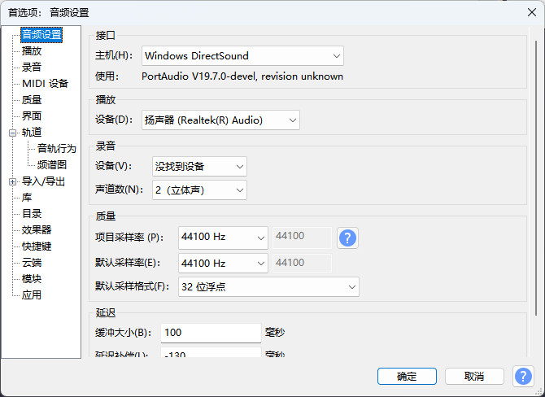

图1-4


注意

在 PC 上进行数字音频制作意味着你必须深入了解声卡驱动程序，并配置你的 PC 以获得良好的音质和性能。

请参阅第 13 章和第 14 章，了解如何调整系统以进行音频制作，以及如何管理操作系统的各种特性以控制音量水平、平衡以及输入和输出设备。 


在开始录音之前，通过选择 **文件** > **另存为**，将您的新 Audacity 项目保存并命名。

对于每次新的录音，立即这样做是一个良好的习惯。


在下一节中，我们将学习所有工具按钮。

现在，把光标悬停在工具栏和按钮上，以了解它们的名称。

现在让我们在真正开始录音之前测试录音电平。

转到图 1-5 所示的输入电平表。

点击“开始监控”，并开始发出声音。


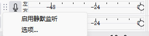

图 1-5


与模拟录音不同，数字音频不需要将录音电平推到红线。

尝试将峰值录音在 −6 或 −9 dB 左右。

您可以使用混音器工具栏来控制录音和播放音量，有点类似。

它并不是真正的混音器，而是一个录音和播放音量控制工具。

这个小工具栏有扬声器和麦克风图标，以及每个音量滑块。

它无法控制所有内置声卡的音量，因为一些低端声卡没有支持音量控制的驱动程序。

它可能也无法控制 USB 设备的音量，同样取决于它们的驱动程序支持情况。

如果是这种情况，在 Windows 中，去控制面板的声音模块控制音量水平。

Linux 用户应使用 alsamixer。

（记住，第 1 章，第 13 和第 14 章将对此有所帮助。）

或者，您也可以通过发出更大或更小的声音来调整音量。 


输入电平计使用两种不同的红色：亮红色的条用于显示平均音量，深红色的条用于显示峰值音量水平。

小的垂直蓝线标记了本次录音过程中达到的最高音量水平，小的垂直红线标记了最近三秒的峰值音量。

在录音监视器的右侧边缘有削波指示灯，当录音电平过高时会变红。

它们比较小，即使录音电平下降后仍会保持点亮，这限制了它们的实用性。

不过，你确实需要注意削波，当输入电平过高时就会发生削波。

任何超过0 dB的电平都会产生削波，而削波会导致失真。


现在让我们录制一些声音。点击红色的**录音**按钮并持续发出声音，你将会看到类似图1-6的显示。

当录制完成后，点击**停止**或**暂停**按钮。

点击停止按钮时，下次点击**录音**时会开始新轨道；

暂停按钮则允许你在同一轨道上从暂停处继续录制。

如果你想暂停却按了停止按钮，不用担心——你可以按住 SHIFT 键并点击**录音**，将录音添加到现有轨道。 


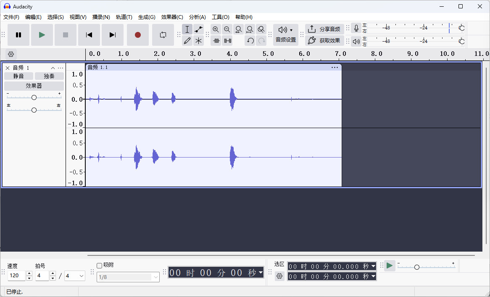

图1-6


自然，当你录音完成后，你会想听听刚刚录制的内容，而 Audacity 提供了即时的反馈。

点击播放按钮。如果你什么也听不到，那可能是因为你选择了错误的播放设备或音量设置得太低。

在更改播放设备之前，请先停止播放。

当你将光标悬停在时间刻度上时，光标会变成一个小手，你可以点击时间刻度上的任意位置重新开始播放。 


在数字音频中，通常录制到低峰值电平，最低可达−24 dB。

数字音频分贝刻度以负数贝尔为单位测量，最高可达零。我们能感知到的最小变化大约是1 dB，而对大多数人来说，−60 dB相当于静音，因此实际可用的范围是−60到0 dB。

3 dB 的音量变化会翻倍，−3 dB 则减半。


像−24 dB这样的超低峰值在录制电平不可预测的作品时非常有用，比如现场表演。

在其他更受控的情况下，良好的峰值电平介于−12 dB到−6 dB之间。

任何超过0 dB的声音水平都会导致削波，从而产生失真。

避免失真在数字音频录制中非常重要。

信噪比极高，所以你不需要把录音音量推到最大来保持噪声在可容忍的水平。


低峰值电平意味着录音声音不会太大，但这没关系。

你可以轻松解决这个问题。点击曲目标签（图1-7）选择整条轨道。

然后打开 **效果器** > **音量与压缩** > **标准化** 。

在“标准化”对话框中勾选这两个选项，并将最大振幅设为0（图1-8）。 


图1-7


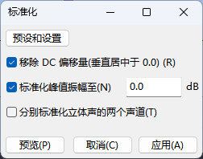

图1-8


最后一步是将您的新录音导出为可播放的音频文件。

Audacity 使用其自己的特殊文件格式，该格式只能在 Audacity 中使用，因此您必须导出为在播放设备上可用的音频文件格式。

选择 **文件** > **导出音频**，将工程导出为 WAV 文件，这应该是默认选项（图 1-9）。

为导出文件命名，可以随意，比如一些有创意的名称，如 test.wav。

WAV 格式几乎是通用的，并且可以在几乎任何数字播放设备或计算机软件媒体播放器上播放。


现在，您可以在计算机上播放 test.wav 文件，享受其全部音质。

Windows 用户可以使用默认安装的 Windows Media Player，或者选择众多第三方程序。

Linux 用户也有许多媒体播放器可供选择：Amarok、Rhythmbox、VLC、Mplayer 等。

最好将 WAV 设置为默认导出格式，因为它是一种无损、未压缩的格式，能够提供最高质量的录音。

WAV 文件在多次编辑后仍能保持较好的质量，而有损格式（如 MP3 和 Ogg Vorbis）在每次编辑时都会丢失信息。 


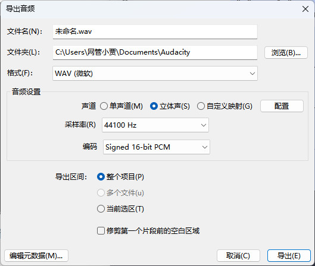

图1-9


你总是可以将 WAV 文件导出为较低质量、有损的格式，但你不能从低质量提升到高质量。

好了，这就是简短的版本。继续阅读以获取完整版。 


##### 详细了解 Audacity

请记住，Audacity 支持几乎无限的撤销操作，因此尝试不同方法是安全的。

即使在保存之后，撤销功能仍然有效；你只有在关闭项目文件时才会丢失撤销历史。 


当你在一个项目上工作时，Audacity 并不会直接操作你的音频文件。

相反，它会将文件复制到一个临时文件中，将其切成许多小片段，并将这些片段转换成仅能在 Audacity 中播放的 .au 扩展名文件。

你可以通过在任何文件管理器中查看你的项目目录来看到这一点。每个项目只有一个 .aup 文件；它包含了 Audacity 需要的所有元数据，以便将这些小文件在正确的设置下重新组合。

当你从文件管理器打开 Audacity 项目时，选择 .aup 文件。


假设你录制了一段精彩的表演，你发挥出了最佳水平，让所有人的眼睛都湿润了（是喜悦的泪水，而非痛苦），并且该录音是 WAV 格式。

当你将这个 WAV 文件导入到 Audacity 时，它会被复制并转换为 Audacity 的内部 .au 格式。

你的原始 WAV 文件保持安全和完好，不会被修改，只要你不通过将项目导出回同一个 WAV 文件来覆盖它。 


转换和拆分你的文件听起来可能有些奇怪，但操作许多小文件比操作几个大文件要快得多。

音频文件可能占用数兆字节甚至数千兆字节。

Audacity 有一个自动崩溃恢复机制，你只有在出现问题时才会看到它；当你重新打开 Audacity 时，它会显示一个恢复消息。

未保存的数据会保存在临时文件中，因此 Audacity 通常可以恢复它们。

选择 **编辑** > **首选项** 来设置自动保存间隔；我的设置是两分钟。

另外，就像我们在电脑上做的所有事情一样，良好的备份是必不可少的。

如今硬盘空间很便宜，所以不要在存储上斤斤计较。


让我们从详尽的游览开始，先看看 Audacity 的工具栏。

所有工具栏的左侧都有手柄，你可以将它们拖动到任何你想要的地方，甚至可以拖到 Audacity 窗口外。

如果将光标悬停在工具栏手柄上，工具栏的名称会弹出。

将光标悬停在按钮上可以看到它们的名称。


选择 **查看** > **工具栏** 来控制哪些工具栏可见。

图 1-10 显示了控制工具栏，其中有暂停、播放、停止、跳到起始、跳到结束和录音按钮。

现在让我们看看工具栏上的按钮：选择、包络、绘制、缩放、时间移动和多工具（图 1-11）。

这些会影响光标的功能。 


图1-10


图1-11


在“工具”工具栏旁边是“编辑”工具栏（图 1-12），其中包含“剪切”、“复制”、“粘贴”、“修剪”、“静音”、“重做”、“撤销”、“链接轨道”、“缩放”、“适合选择”和“适合项目”按钮。 


图1-12


表 1-1 列出了工具栏和编辑工具栏上的所有按钮，并描述了它们的功能。

 

选择 点击以标记播放起点。点击并拖动以选择轨道的一部分。双击以选择整条轨道。点击时间刻度的任意位置开始播放（它会变成一个小手）。
包络 用于精细控制轨道的振幅（音量水平）以及创建淡入和淡出效果。点击创建控制节点，然后点击并拖动节点以增加或减少振幅。控制节点可以在垂直和水平方向上拖动。将节点拖过轨道边界即可删除它们。
绘制 点击缩放按钮，直到可以看到单个音频样本，然后使用绘制工具进行操作。用于非常精细地平滑点击和爆裂声。
缩放 左键点击放大，右键点击缩小。记住缩放按钮！你可能会经常使用它们：使用放大进行精确编辑，使用缩小使长轨道可管理。更多缩放命令和键盘快捷键请参见视图菜单。
时间移动 通过沿时间轴向前或向后拖动来同步轨道。你也可以将轨道或片段拖入另一条轨道，只要有足够的空白空间来容纳它。
多工具 这是五合一工具，根据鼠标位置激活。通过垂直移动光标获得选择和包络工具，通过悬停在轨道开头或结尾的轨道控制手柄获得时间移动工具，通过向左移动到分贝标度获得缩放工具；缩放视图将以悬停的分贝数字为中心。绘制工具在放大到足够看到单个样本时出现。 


图 1-13 显示了电平表工具栏，它显示录音和回放电平。

当工具栏被压缩时，电平表可能无法显示刻度上的较小数值。

在这种情况下，抓住它左侧的把手，将其移动到空间更大的地方，然后抓住右侧的调整大小把手，最后拉伸它，直到可以看到整个分贝刻度。 


图1-13


图 1-14 显示了混音器工具栏，它实际上并不是真正的混音器。

相反，它旨在控制内部声卡的输入和输出音量。

不过，这些功能只有在你的声卡驱动支持时才能工作，所以如果不支持，请责怪你的声卡制造商。

（有关操作系统音频控件的更多信息，请参见第 13 章和第 14 章。） 


图1-14


转录工具栏（图 1-15）可以改变播放速度。

例如，您可以在转录歌词时使用它来减慢速度，或者让声音显得险恶邪恶。

或者您可以加快速度以增加趣味，比如艾尔文和花栗鼠。

这个工具栏只会影响 Audacity 的播放，不会更改项目文件。

（效果 > 改变速度 的行为相同，只是它会改变您的项目文件。

效果 > 改变音调 可以在不改变播放速度的情况下提高或降低音调，而效果 > 改变节奏 可以在不改变音调的情况下改变速度。）


图 1-15


图 1-16 显示了设备工具栏，您可以在其中选择录音和播放设备，而无需选择 编辑 > 首选项。

如果您插入或移除 USB 设备，需要重新启动 Audacity，否则它将无法识别更改。 

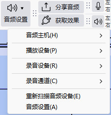

图 1-16


##### 管理 Audacity 项目

在一个新的 Audacity 项目中，你的第一步应该总是通过 文件 > 另存为 为它命名。

然后，你可以定期按 CTRL-S 保存更改，或者使用 文件 > 保存。

除了 .aup 文件，这是项目的主要元数据文件之外，Audacity 还会创建一个目录来存放相关的音频文件。

你可以在文件管理器中查看这些文件；会有许多子目录，里面充满了 .au 扩展名的文件。 


###### 添加音频文件：导入与打开

选择 文件 > 打开，将现有音频文件添加到新的空项目中。

之后，选择 文件 > 导入 以添加更多文件。在非空项目中选择 文件 > 打开 会在新窗口中打开该文件。 


###### 保存您的工作

Audacity 项目被优化为快速工作空间使用，并不适合存档存储。

没有快照机制来保存不同阶段的工作，用户也报告过在项目损坏时丢失数据。

我采用双重保险的方法：我会备份 Audacity 项目文件，同时还会制作 WAV 格式的工作室母带文件，因为每种方法都有其优点和缺点。

首先我们来看一种在不同阶段保存 Audacity 项目的方法，然后再看看如何制作 WAV 格式的工作室母带文件。 


通过从原始项目创建多个 Audacity 项目，您可以创建类似项目快照的内容。

首先，创建一个目录来存放相关项目，以免混乱或丢失。

然后选择 **文件** > **保存项目** > **项目另存为**，并给项目命名，以帮助您记住其内容，例如 Summer-Festival-1、Summer-Festival-2，或者使用更具描述性的名称，如 Summer-Festival-No-Banjos 或 Summer-Festival-Mondo-Banjos。 

当您这样做时，会看到类似图 1-18 的对话框。这里的关键问题是“将以下文件中的音频复制到项目中以使其自包含吗？

” 点击“将所有音频复制到项目（更安全）”按钮选择是。

这样会复制项目文件并占用更多磁盘空间，但这是最安全的选项。

在多个项目之间共享文件可以节省磁盘空间，但麻烦不值得，因为一个项目中的更改会影响所有项目。

更糟的是，您会失去冗余，而冗余是防止任何一个项目损坏不可用的保障。 


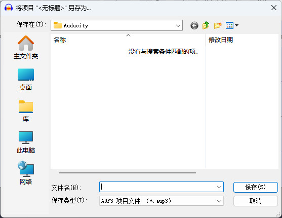

图1-18


为了制作高质量的工作室母带 WAV 文件，请通过选择 文件 > 导出 来导出您的项目。

在项目进行过程中，您可以多次执行此操作，创建多个母带，以保存项目在不同阶段的工作（或者直到您的磁盘空间用完！）。

然后，您可以随时导入 WAV 母带以进行进一步编辑，并且可以从您的 WAV 母带导出为任何其他音频格式。

这也为您提供了将 WAV 母带导入其他音频编辑程序的选项，而 Audacity 的项目文件则无法做到这一点。

WAV 的默认导出质量设置为 16 位整数，这并非最高质量。


Audacity 的默认录音质量设置（选择 编辑 > 首选项 > 质量）是采样率 44.1 kHz，位深为 32 位浮点。

（Audacity 术语中将位深称为采样格式，但正确的术语是位深。）

您可以通过导出为 32 位浮点 WAV 来创建高质量的工作室母带。

请按照以下步骤操作： 

1. 选择 文件 > 导出。

2. 选择 保存类型：其他未压缩文件。

3. 点击 选项，然后选择 头信息：WAV（Microsoft） 和 编码：32位浮点。

   你将看到一个如图1-19所示的窗口。 

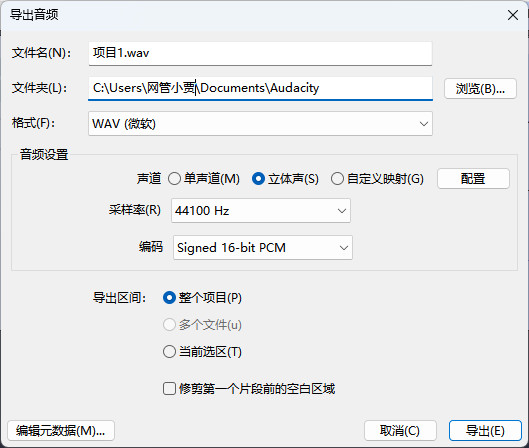

图1-19


生成的文件不是可播放的 WAV 文件，除了在 Audacity 和其他用于编辑的音频编辑器及使用 32 位浮点数进行编辑的数字音频工作站中可以播放。

然而，它非常适合用于录音室母带处理，因为你可以导入并编辑 32 位浮点 WAV 文件，几乎不损失质量，并将其导出到其他音频格式：16 位和 24 位 WAV、Ogg Vorbis、MP3、FLAC 等等。

WAV 在单个文件中最多支持 32 条音轨。

但是，这也有其缺点。当你只需要管理少量音轨时，它工作得很好——我能处理的上限是四条——因为 Audacity 不会保存音轨名称，而是将所有音轨重命名为 WAV 文件名。

假设你有一个四轨的录音，音轨分别命名为 vocal、piano、violin 和 vocal2。 


将此项目导出为单个 WAV 文件，并命名为 testwav.wav。

当你将 testwav.wav 导入 Audacity 时，所有四条音轨都会被重命名为 testwav 1.wav、testwav 2.wav 等。

它还会将音轨 1 和 2 设置为右声道和左声道，即使它们原本是单声道音轨。

图 1-20 显示了导出前后的情况。


你仍然保留所有单独的音轨，但会丢失音轨名称。

在多音轨项目中，我非常依赖音轨名称来保持组织，因此将它们全部合并为单个 WAV 文件对我来说不可行。

对于超过四条音轨的项目，我更喜欢将每条音轨保存为单独的 WAV 文件。

要做到这一点，选择你想要导出的音轨，然后选择 文件 > 导出多轨。

(我们将在下一节讨论如何选择音轨。)

每条音轨将被保存为单独的文件，音轨名称将成为对应文件的文件名。

当我这样做时，我会将它们放在自己的项目目录中，这样就不会和其他项目混在一起。 


##### 选择音轨和音轨片段

现在让我们学习如何选择音轨和音轨的部分。

Audacity 支持计算机用户习惯的常用编辑功能——复制和粘贴、删除、选择等等，但如果你不学会以 Audacity 的方式操作，它会让你抓狂。Audacity 的一个很棒的功能是，它几乎支持所有功能的键盘快捷键，所以你可以使用鼠标或键盘。


首先，通过选择 **文件** > **导入** 创建一个新的录音或导入现有的音频文件，这样你就有一些音轨可以进行试验。

确保“选择工具”处于激活状态。

如果你使用的是“多工具”，将其上下移动直到它变成“选择工具”，它看起来像一个小的竖线光标（I-beam）。

音轨焦点和音轨选择是两回事。黄色的音轨边框显示哪个音轨有焦点，但如果音轨面板是浅色的，则表示该音轨尚未被选择。

拥有焦点意味着该音轨已准备好接受键盘命令；光标线在该音轨中处于激活状态，你可以用箭头键来回移动它。


图 1-21 显示了两条音轨：底部的音轨有焦点，由黄色边框表示，上方的音轨被选中，由阴影的音轨面板表示。

光标线延伸到两条音轨中，但在底部音轨中处于激活状态。

拥有已选择但未获得焦点的音轨以及未选择但有焦点的音轨没什么用。

你可以在有焦点的音轨中选择播放起点，并用箭头键来回移动，但大致就只有这些功能了。 


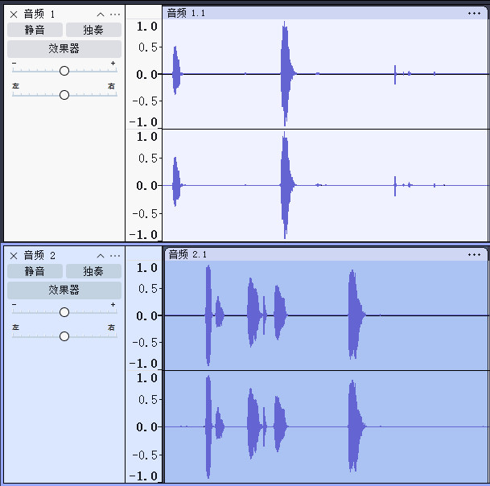

图1-21


当选择一个音轨时，它将成为你执行的任何编辑操作的目标，例如复制、剪切或应用效果。

这些操作将应用于整条音轨，即使它没有获得焦点。

选择整条音轨有两种方法：你可以双击波形的任意位置，或者点击音轨面板中的音轨标签（见图 1-7）。


大多数时候，你不必关注焦点和选择问题，因为在正常的编辑过程中，它们通常会处于你希望的位置。

但有时事情会表现得异常，意识到这个区别将有助于你理解当 Audacity 看起来响应异常时发生了什么。

你也可以选择音轨的一部分。

图 1-22 显示了仅选择了音轨的一个片段，而不是整条音轨。

注意选中部分和未选中部分的阴影差异。 

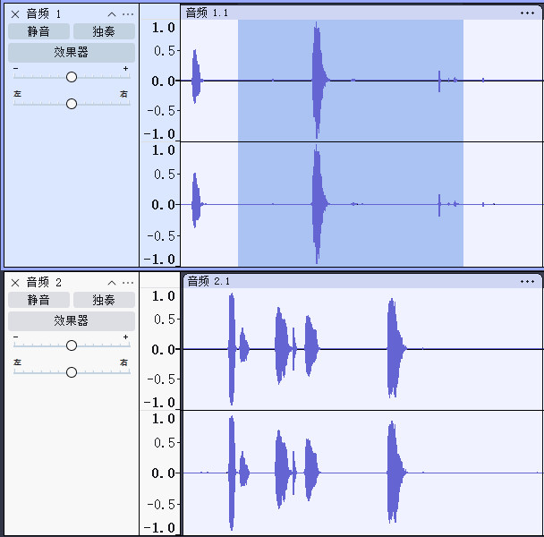

图1-22


CTRL-A 选择所有音轨，SHIFT-CTRL-A 取消选择所有音轨。

双击音轨内部只选择该音轨，或者在音轨标签上单击左键。

SHIFT-单击音轨标签可以一次选择或取消选择多个音轨，以及非相邻音轨。

在图 1-23 中，第一和第三条音轨是通过 SHIFT-单击选择的。 

 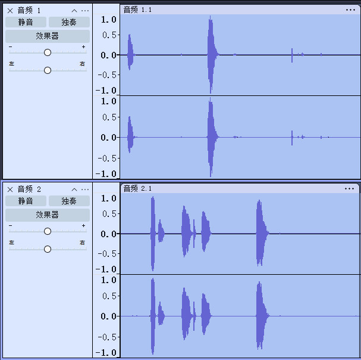

图1-23


要选择音轨的一部分，请使用选择工具点击并拖动。

要使你的选择变大或变小，将光标移动到选择的任一边界上，此时光标会变成水平箭头，然后点击并拖动该边界（图 1-24）。


你可以使用键盘的方向键在音轨之间导航并调整选择。

按住 SHIFT 键并按左箭头或右箭头键可以扩大选择；按住 CTRL+SHIFT 并按左箭头或右箭头键可以缩小选择。

一个在多个相邻音轨上进行选择的巧妙方法是，先在顶部或底部音轨上进行选择，然后按向上箭头或向下箭头键将在其他音轨上重复选择。 


控制工具栏中的“跳到开始”和“跳到结束”按钮可以将光标移动到音轨的开始或结束位置。

在点击“跳到开始”按钮时按住SHIFT键，可以从光标位置选中到音轨的开头；在点击“跳到结束”按钮时按住SHIFT键，可以从光标位置选中到音轨的结尾。

你也可以使用选择工具栏根据各种音轨参数进行精确选择，例如时间、采样以及各种音频和视频帧率。

你可以通过点击工具栏三个字段中的任意下拉菜单查看这些参数（图1-25）。 

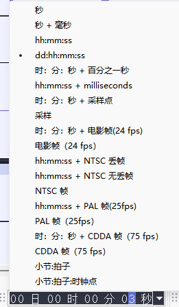

图1-25


假设您想选择一个从曲目开始48秒处开始的12秒片段。

有几种方法可以到达48秒的位置——使用选择工具点击、使用方向键导航，或使用选择工具栏。

设置选择开始时间：秒，然后输入48。

选择“结束”单选按钮，并在中间的框中输入60。这就是您的12秒片段（图1-26）。 


图1-26


上箭头和下箭头键也会改变数字，右箭头和左箭头键则用于前后导航。 


##### 轨道面板

轨道面板将许多有用的快捷方式放在你的指尖（图1-27）。

左上角的小 X 可以删除轨道。底部的箭头可以收缩或展开轨道。

你还可以用鼠标抓住并拖动轨道边界来改变它们的宽度。

增益滑块可以放大或减少轨道音量，而不会永久改变它，这在混合多个轨道时非常重要。声像滑块控制左右平衡。 


图1-27


默认情况下，当你点击播放按钮时，Audacity 会播放项目中的所有音轨。

使用独奏按钮可以选择播放某一条音轨，或者使用静音按钮来静音你不想听的音轨。

这仅影响 Audacity 中的播放，不会更改你的项目文件。


音轨菜单有一系列有趣的功能（图 1-28）。

你可以用它来创建音轨名称——当你处理很多音轨时，给它们命名是非常必要的。

它还提供不同的波形视图；允许你分割或合并立体声轨道；允许你设置单声道、右声道或左声道；允许你上下移动音轨；并且允许你更改位深（Audacity 称为采样格式）和采样率。


立体声轨道可以通过“分割立体声轨道”或“立体声转单声道”分成两条独立的单声道轨道。

使用“分割立体声轨道”会得到一条右声道和一条左声道。

使用“立体声转单声道”则会创建两条单声道轨道。

要创建立体声轨道，将两条单声道轨道放置在彼此相邻的位置，然后点击上方音轨菜单中的“创建立体声轨道”。

通过点击并拖动音轨标签，或者在音轨菜单中选择“上移/下移音轨”，可以移动音轨。 


图1-28


轨道面板右侧的垂直刻度是您参考音轨音量水平的指南。

默认显示是波形，您可以通过轨道菜单将其更改为波形（dB）、频谱或音高（EAC）。

波形是用来显示音轨幅度（信号的强度或音量）的常用视觉刻度。

波形的垂直标尺有一个从 1.0 到 −1.0 的线性刻度；任何超过这些值的情况都表示削波，这意味着您会产生一些失真。

线性意味着在刻度上所有频率的权重相等。

分贝是对数刻度而不是线性刻度，因此这不是一个真实的表示，但它易于读取。 


波形（dB）使用对数分贝刻度表示振幅。

不深入数学细节，对数意味着每增加3 dB代表响度的翻倍——因此，确定为6 dB的声音测量比测量到的3 dB响度大一倍，9 dB是6 dB的两倍。

人类能感知到的最小变化幅度大约是1分贝。

（更多音频术语请参见词汇表。）数字音频有一个特殊的分贝刻度，称为零分贝全刻度。这表示数字音频音量范围，负数最多可达0。


在Audacity中，你可以控制波形（dB）视图中播放的分贝范围，以及在“编辑>偏好设置>界面”对话框中的计量工具栏中播放。

点击“计量/波形dB范围”下拉菜单查看你的选项。最小的尺度为−36 dB到0，最宽的尺度为−145 dB到0。这只影响显示，对音轨没有影响。


你可以使用任一波形显示来监控录音水平;我觉得默认的波形显示最容易看懂。

你会注意到反弹中使用了两种蓝色调，一种较浅，一种较深。

浅蓝色代表对均方根（RMS）表示不满，通俗英语翻译为平均体积随时间变化。

较深的蓝色代表峰值，即瞬态的极端。 


注意

RMS和峰值功率在音频设备的营销中经常被（误）用来让你觉得自己得到的比实际更多。

例如，一套扬声器标称为50瓦RMS/150瓦峰值。

忽略峰值——RMS告诉你扬声器可以持续承受的功率。

峰值表示扬声器在非常短的（几分之一秒）突发情况下可以承受的功率。


频谱视图用颜色表示不同频率的能量水平（幅度）。

红色表示“热”或高幅度，蓝色表示“冷”或低幅度。如果你的波形大部分是蓝色的，说明声音不是很大，如果更多是红色的，说明声音更大。

你可以通过选择一首曲目或曲目的一段，选择“效果 > 放大”，然后输入负的放大数值（比如−30 dB）来轻松测试。

这应该会让波形大部分变为蓝色。设置更接近零的值会让波形更多变为红色。


音高（EAC）使用增强自相关（EAC）算法显示音频的音高轮廓。

EAC算法在音高检测方面很有趣；如果你有兴趣了解更多，‘增强自相关’和‘音高检测’是一些不错的网络搜索关键词。

Audacity对此的实现相当基础，所以如果你对此感兴趣，你可能会想寻找更高级的工具。 


##### 剪掉不需要的部分

你可以轻松地删除音轨中不想要的部分。

只需选择一个片段，然后按键盘上的 DELETE 键。

如果你只想保留音轨的一小部分并删除其余部分，选择 编辑 > 修剪 或点击编辑工具栏上的修剪按钮。

这会保存你选择的音轨部分并删除其外的所有内容。

有时候你可能需要将音轨的一大段静音，但保持音轨完整。

在这种情况下，选择你想要静音的部分，然后点击静音按钮或选择 编辑 > 静音音频 。


淡入淡出

当你删除部分曲目时，可能需要用优雅的淡入淡出来来平滑切割。

淡出是音频编辑中不可或缺的一部分，Audacity有两种方式来制作淡出。

最简单的方法是选择曲目的一段，然后选择效果>淡入或淡出。

你控制淡出的长度，Audacity负责剩下的。


包络线工具可以微调振幅水平;它适合进行Con Trolling的淡出，并用于微调音轨中任何地方的振幅，包括相对较长的段落。

图1-29展示了这种现象的样子。点击不同位置创建控制节点。

要去除节点，把它拖出轨道边界。 

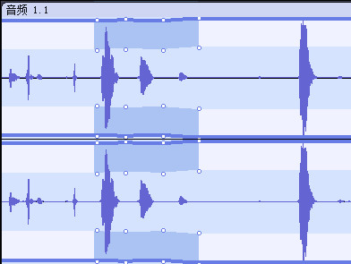

图1-29


每个节点都有四个控制点。节点控制点可以向任意方向移动。外侧的一对行为与内侧的一对略有不同——使用外侧控制点可以创建更优美、渐进的曲线。30秒标记两侧的虚线显示包络超出轨道显示的边界位置。


注意

除了编辑器工具栏中的缩放按钮之外，查看菜单还有一些不错的选项，用于操作和导航你的轨道，例如“适合窗口”和“缩放到所选”，并且它显示了有用的键盘快捷键，例如 CTRL-2 用于正常缩放，SHIFT-CTRL-F 用于垂直适应。


##### 让安静的录音更响

如果你的录音声音太小，想要提高音量，没问题！

选择你想要放大的部分，然后选择 **效果器** > **音量与压缩** > **增幅（放大）**。

Audacity 会自动计算可以应用多少放大而不会削波；也就是说，不会超过 0 dB（图 1-30）。

除非你非常确定，否则不要勾选“允许削波”选项。 

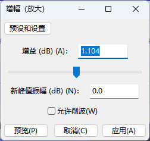

图1-30


放大录音过小的另一种方法是选择 “效果 > 归一化”。

勾选“去除任何直流偏移”，然后勾选“将最大振幅归一化为”，并将最大级别设定为零。

直流偏移指的是平均振幅；如果该值不为零，归一化将无法正确应用，因为振幅水平会不平衡，并可能产生一些失真。


当应用于多个音轨时，放大和归一化的区别就能显现出来。

放大会对所有音轨的音量按相等幅度进行调整。

如果你将音量放大 9 dB，一条峰值为 -20 dB 的音轨会被提高到 -11 dB，而峰值为 -9 dB 的音轨则会提高到 0 dB。

另一方面，归一化会将所有音轨调整到相同的最大音量水平，因此某些音轨的改变幅度可能比其他音轨大。


两者的默认最大设置都是零。

在你的工作室母带处理中，将其降低到 -12 dB 或类似值会很有用，这样可以留出一些余量进行更多微调而不冒削波的风险。

例如，当你将多条音轨混缩成一条音轨时，后者会包含这些音轨的总振幅，并且会变得更响，也许会响得多。

经验会告诉你需要多少余量。

在进行最终导出之前，不要将归一化设为零。

放大和归一化也可以用来降低振幅。在放大对话框中输入一个负值，例如 -6。

标准化对话框只使用负值，不允许设置超过零的值。 


##### 计时录音和声音触发录音

计时录音和声音触发录音都在“传输”菜单中。

要使用声音触发录音，请选择“传输”>“声音触发级别”，并设置您希望触发录音的分贝水平。

可能需要一些反复试验，找到一个既能捕捉您想要的声音，又不会捕捉大量不想要的声音的平衡水平。

然后打开录音监视器（表工具栏）并点击播放按钮。

当检测到足够大的声音时，Audacity会自动创建一个新轨道，并在您保持计时录音激活状态时使用该轨道。

随时点击停止按钮以停止声音触发录音。


计时录音同样简单——只需设置录音的开始和停止时间。

您可以将其与声音触发录音一起使用，设置开始和停止范围，这样您就可以离开而让Audacity运行，而不必担心硬盘被填满。 


##### 混音控制板

混音控制板是一个新功能，首次出现在 Audacity 1.3.8（图 1-31）。

 视图 > 混音器。

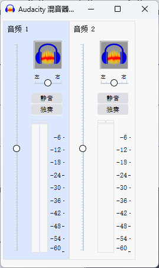

图1-31


这是一个精巧的小型调音台，每个音轨都有音量单位（VU）表，并配有声像（Pan）和增益（Gain）滑块。

它让你可以轻松控制基本混音设置，而不必将音轨加宽以便访问轨道面板上的滑块。


要使用调音台，请在 Audacity 中播放你的音轨，并使用 VU 表左侧的增益滑块调整音轨的相对音量，通过声像滑块调整每个音轨的左右平衡。然后进行导出。

声像和增益滑块不会改变你的项目文件——它们只影响在 Audacity 中的播放效果以及导出文件的声音效果。

查看第 9 章以了解有关多轨混音的更多信息。 


##### 轨道元数据

你可以在 Audacity 项目中保存有用的数据，如歌曲标题、日期、艺术家名称和流派，使用元数据编辑器。

在最终导出之前，选择 文件 > 打开元数据编辑器。

你会看到一个如图 1-32 所示的窗口。填写艺术家名称、专辑标题、年份、流派和备注字段，这些信息将应用于每个歌曲轨道。

Audacity 会自动填写轨道标题和轨道编号字段。 

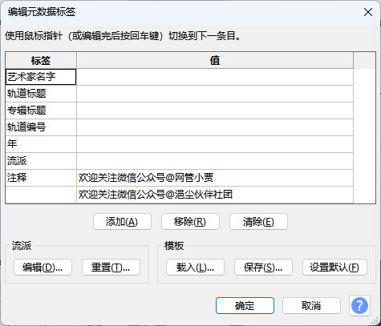

图1-32


如果你选择 编辑 > 首选项 > 导入/导出，会有一个“在导出步骤前显示元数据编辑器”的选项。 

如果选中此选项，每首曲目在导出前都会打开元数据编辑器，以便您查看或编辑元数据。 


##### 最终混音

通常你的目标是将你录制的多个音轨混音到一个立体声轨中。

然而，Audacity 也支持多声道环绕声，这将在第9章中介绍。

在导出之前，选择 编辑 > 首选项 > 导入/导出，然后选择“使用自定义混音”单选按钮。

导出时，会出现一个高级混音选项窗口，这是一个简单的通道映射器。

将你的音轨映射到你想要的通道上。

你的音轨可以进入左声道、右声道，甚至多个通道。

当有两条音轨时，通道1始终是左声道。

（参见图1-33的简单两轨示例。）当你使用这个工具时，你会为你的音轨命名感到高兴。

第9章将更详细地介绍多轨混音和通道映射。 


##### 音频文件格式和质量设置

有许多不同的音频文件格式，Audacity 支持许多其中的格式。让我们来看看 WAV、MP3、FLAC 和 Ogg Vorbis。这些被广泛支持的流行格式用于不同的用途。


###### 了解文件格式

WAV 文件是未压缩的、高质量的脉冲编码调制（PCM）文件。它们体积很大。一分钟的 CD 质量立体声 WAV 录音大约占用 10MB 的磁盘空间。WAV 是支持最广泛的格式，也是其他格式衡量质量的标准。 


MP3（MPEG-1 音频第3层，非 MPEG-3）是一种流行的压缩有损编码格式;MP3文件大小可达类似WAV文件的十分之一，但听起来依然相当不错。这意味着你可以在便携播放器中塞入更多音乐，实现更快的下载和更好的在线流媒体体验。代价是质量会丢失。请参阅第13章和第14章，了解如何在Audacity中启用MP3支持。虽然MP3非常受欢迎，但它也存在复杂的模式问题。不同国家的多家公司声称拥有MP3专利，根据你所在地区，如果你想分发用MP3编码的音乐，可能需要支付许可费。最终专利将在2017年到期。然而，专利情况并不明确，因为许多独立音乐人以MP3格式分发音乐而无需支付专利版税，且专利并不适用于其原产国以外的所有国家。免费无损音频编解码器（FLAC）是一种优秀的开放且免费的格式。这种无损压缩格式在质量上与WAV相当，但文件大小小于三分之一到一半。FLAC是PC媒体服务器的好格式，因为你能获得高质量，同时又不会占用太多硬盘空间。在线音乐服务以FLAC格式分发其最高质量的下载。如果你需要节省存储空间，甚至可以用FLAC来管理你的工作室母带。尽管FLAC格式不支持32位浮点，但24位FLAC文件依然非常高质量。Ogg Vorbis 是作为 MP3 的高品质、免费且开放的替代方案创建的。Ogg文件大小从大约和MP3差不多到大约25%不等。Ogg Vorbis 的支持程度不及 MP3 和 WAV，尽管其受欢迎程度正在上升。Linux、Windows和Mac都有多种支持播放独立Ogg文件和流式Ogg的软件音乐播放器。iPod和Zune不支持Ogg（这并不奇怪，毕竟这两大锁定游戏的巨头都支持），但越来越多的其他播放设备支持。第七章详细介绍了Ogg Vorbis和MP3的不同音质水平，第六章讨论了WAV和FLAC。下一部分将解释一些你会经常遇到的dig ital音频和术语的重要基本概念，所以拿杯茶，翘起脚，继续阅读吧。 


理解位深和采样率

数字音频制作可以概括为将模拟信号转换为数字信号，再将其转换回模拟信号。

换句话说，你从模拟麦克风或电子乐器捕捉声音，通过模数转换器（ADC）进行处理，并将数字化的位记录到硬盘或固态存储中。ADC 可以是声卡、前置放大器/ADC、独立 ADC 或其他组合设备。在某个环节，这些数字数据将被取出并转换为模拟形式以供播放。


你的电脑声卡在播放时会执行数字到模拟的转换，普通的 CD 或 MP3 播放器也是如此。你的目标是尽可能忠实地转换这些模拟信号。一旦它们变成数字形式，你就拥有了整个世界的工具，可以以各种创造性的方式操作它们，并且在播放格式和媒介上有多种选择。


##### 16/44.1、24/96、32位浮点

两种常见的数字音频规范称为16/44.1和24/96。有时16/44.1会缩短为16/44。这些编号指定了位深和采样率。位深会影响动态范围、信噪比和保真度。采样率决定了频率范围。CD质量音频定义为44.1 kHz、16位、双声道WAV和24/96的音质高于CD音频，如数字音频带（DAT）、DVD音频和录音室母带录音。所以，我们应该选择最高的数字以获得最佳质量，对吧？其实，没有——有很多因素需要考虑。采样由模数转换器完成;它在模拟音频信号中间隔采样电压，并将测量值转换为数字形式。每秒进行的次数越多，数字重复对信号的重发越准确。因此，采样率为44.1kHz，意味着每个通道每秒有44,100个采样。这是Audacity的默认设置。你可以通过放大任意Au dacity波形的截面来看到这张图片。这看起来像图1到图34，每个点代表一个音频采样。 


每个音频样本都表示为一个数值——在计算机中，一切都是数字。在CD质量音频中，每个样本的可能数值范围为16位，16位 = 65,536。这就是位深度。每个样本的大小不是65,536位，而是赋予一个单独的16位数值，该数值等于或小于65,535（0到65,535）。对于常用于专业录音的24/96录音，24位可以提供16,777,216个可能值。更大的位深度意味着更宽的动态范围和更细腻的音色——同时文件大小显著增加。一分钟的立体声录音在16/44.1格式下约为10MB（每声道5MB），在24/96格式下约为34MB。从理论上讲，16位数字音频的动态范围为96 dB，对应范围为−96到0。对于24位音频，它为144 dB，而32位音频为192 dB。在现实中，由于电子硬件的限制，实际动态范围较低：16位音频约为90 dB，24位和32位音频均约为115 dB。 


 宽动态范围的价值不在于你能用突然的极端音量变化震惊听众，而在于拥有非常高的信噪比，也就是所谓的“低噪声底”。信号越多、噪声越少越好。至于根据听众调整动态范围，录音中50 dB到60 dB的范围是大多数听众能承受的最大范围，这在安静环境下，系统质量理想。挑剔的发烧友，设备好，听觉安静，会喜欢60分贝动态范围的交响乐。一场现场交响音乐会的频率范围可能达到80分贝。在噪音较大或使用低质量音频设备听音乐的人，可能会更舒适地接受20 dB甚至更窄的动态范围。Audacity 允许你根据任何动态范围定制录音。（详见第6、8和11章，了解更多动态范围压缩内容。）音频界有一个著名的定理，叫做奈奎斯特香农定理。内容冗长且详尽——这里重要的部分是，当采样率至少是信号最高频率的两倍时，模拟音频信号可以实现完美的数字数字表现。最佳人类听觉能听到20 kHz到24 kHz的频率，因此40 kHz到48 kHz的采样率理论上可以重现整个人类听觉范围。Audacity的默认录音位深是32位浮点。许多数字au dio工作站，包括Audacity，内部运行为32位浮点。需要理解的是，这是32位浮点，而不是32位整数。在 con trast 中，16 位和 24 位深度表示整数值。一如既往，数学很复杂，如果你让音频迷讲这些，他们会无聊得流泪，所以这里有个简化的简短故事：整数是整数，float 是浮动小数点。这个32位浮点数是一个24位尾数加上一个8位指数。这在音频制作方面非常重要——它给你提供了大约1500 dB的动态范围，几乎没有噪声或削波，并且在整个模拟到数字转换的范围内，响应曲线更平滑、更准确。（相比之下，32位整数的动态范围为196 dB。）即使使用16位重配线接口，32位浮点录音和编辑也很有利。如果你工作到峰值为−24 dB，这个非常低且安全以避免削波，你的动态范围仍然会超出任何硬件支持的范围，而且你还有很多额外部分可以丢弃而不影响画质。这意味着你可以随意编辑和操作音频文件，同时还能做出高质量的16位和24位导出。你对录音处理越多，就越需要额外的余量。你总是导出到更低的位深，因为没有32位的Floa这种东西 


在实践中，许多因素会影响你选择的比特深度和采样率：你的听力有多好，你的设备有多好，最终的格式和播放介质会是什么？你的录音技术有多好？你正在制作哪种类型的录音——细腻的原声乐器和人声，还是猛烈的摇滚？你的电脑是否足够强大以处理更大的音频文件，你是否有足够的存储空间？由于“大即是好”的思维方式，你可以在16/44.1录音机和ADC上获得一些不错的优惠。另一方面，拥有额外的带宽也无妨——你总是可以降低质量和大小，但（尽管电视犯罪节目常常告诉你）你无法恢复那些最初不存在的内容。在实验时，我的建议是先尝试增加比特深度，然后再增加采样率。如果你的听力和音频设备都很好，你应该能够听出16位和24位录音之间的差异，尽管我怀疑需要进行对比才能明显分辨这些差异。我将工作室母带录制并保存为32位浮点/48 kHz WAV，并主要导出为CD质量的16/44.1。提高采样率在我听来没有任何区别，而且会占用硬盘空间。Audacity支持以16位整数、24位整数和32位浮点进行录音。作为比较，专业人士的录音和编辑深度为24位、32位，甚至64位。


注意

正如我们之前讨论的那样，将文件导出为32位浮点WAV是创建和存档工作室母带文件的一个好选择。然后你可以将32位浮点WAV重新导入Audacity（或任何其他使用32位浮点的音频编辑器），进行处理，并导出为16位或24位，而不会损失音质。 

 


比特率、位深和文件大小 位深是一个具有特定含义的术语，我们刚刚学习过。另一个常见的术语是比特率。这两个术语的含义不同，而且经常被混淆。比特率是传输音频文件所需的每秒数据量，通常以 Kbps 或 Mbps 表示；16/44.1 立体声大约是 1.4Mbps，而 24/96 大约是 4.6Mbps。你可以很容易地自己计算出来： 


> 位深 × 采样率 × 通道数 = 比特率（比特/秒）
>
> 16 × 44,100 × 2 = 1,411,200 比特/秒
>
> 24 × 96,000 × 2 = 4,608,000 比特/秒 


MP3（以及其他有损格式）是以比特率而不是比特深度/采样率来描述的。MPEG-1 第三层标准规定了从 32Kbps 到 320Kbps 的比特率范围。相当低保真，128Kbps 是早期因互联网下载速度慢和播放器存储容量小而常用的 MP3 比特率。现在 192Kbps 相当常见，有良好听力和合适 MP3 播放器的人能够听出差别。 


总文件大小对于录音极客来说是一个重要的数字。

数字音频文件很大，在繁忙的录音会话中，如果有很多录制，你可能很快就会用满一个大硬盘。


你可以用这个公式来计算大致的文件大小： 

> 位深 × 采样率 × 通道数 × （60 秒） / 8 = 1 分钟录音的文件大小（字节） 


在 24/48 kHz 下，一分钟立体声大约是 17.3MB： 

> 24 ×48,000 × 2 ×60/8=17,280,000 字节 


你必须除以8才能得到字节，因为每个字节有8位。 


##### 接下来做什么？

到这一点，你应该已经很好地掌握了 Audacity 的基础知识。

Audacity 很容易学习；难的部分是学习音频概念和术语。

在本书的其余部分，我会经常谈论这些内容，将它们翻译成实际术语，并向你展示如何在 Audacity 中实现它们。 


# 2

低成本打造一个良好的数字音频工作室 


在摄影界有一句话：摄影机背后的人比相机本身更重要。

制作出色的音频录音也是同样的道理——掌握设备的人比设备本身更重要。

这并不意味着设备不重要，因为它确实重要。

但仅仅拥有最昂贵、最顶尖的音频设备，并不能让你变成 Tom Dowd、Rick Rubin、Quincy Jones、George Martin 或者你最喜欢的传奇音乐制作人。

它也不会让普通音乐家一夜成名。


当你在挑选音频设备并被“规格越高、价格越贵越好！”的想法吸引时，退一步，重启你的思维。

深呼吸，放慢节奏，专注于学习如何充分利用低端设备。

因为如今普通的数字音频设备，其性能已经比过去顶尖的模拟录音室设备更好，具备更高的准确性、保真度、更宽的动态范围和更低的噪音，录音、混音、编辑以及应用特效都要容易得多。

你不必费心去研究如何使用设备，而可以更多地专注于学习如何以艺术性和技术性忠实性制作出优秀的录音。

如果后来你渴望更好的前置放大器、更好的麦克风、更好的音箱或其他设备，你会有充分的理由，也会在找到更高质量时懂得欣赏。


在本章中，我们将把一台电脑变成数字音频工作站，而且不需要花费大笔资金。

我们还将了解便携式数字录音设备，这类设备将惊人的音质和存储能力压缩到小巧的设备中，在各种情况下都非常实用。 


##### 计算机音频输入和输出

 电脑音频制作中最大的难题之一就是弄清楚音频设备。

市面上有大量令人眼花缭乱的音频组件，几乎包含所有可能的功能组合和价格区间。

在本章中，我将讨论小型录音室的基本元素。

附录A对硬件进行了更详细的介绍，并提供了不同价格范围内不同型号和品牌的示例。


将音频设备与计算机连接有几种方式：台式机的PCI或PCI-E声卡；笔记本的Cardbus或ExpressCard声卡；适用于任何计算机的USB 1.1、USB 2.0或FireWire音频接口。你需要其中之一。

哪一个合适呢？ 

对于一轨或两轨录音，任何一种都可以。

对于高负荷的多轨录音，USB 1.1并不适用。但它非常适合一轨或两轨录音，而且有很多出色的、价格适中的设备可供选择。

对于严肃的多轨录音，你需要更快的协议，尤其是当你要以高位深和高采样率录音时，因此我们将研究它们的优缺点。 


数字音频制作中最重要的组件是模数/数模转换器（ADC/DAC）。

ADC/DAC 是将模拟音频输入和输出到电脑的方式。

它将来自麦克风或乐器的模拟信号转换为数字信号，然后将数字信号转换为模拟信号以进行播放。 

ADC/DAC有多种形式： 最低端、最便宜的集成声卡芯片就有ADC/DAC，更高端的音频接口也同样如此。 

市面上有各种USB和FireWire录音接口，可将麦克风和乐器连接到电脑，而使用它们，你根本不需要内部声卡。 

还有一些精巧的小型便携ADC/DAC，可将唱盘、磁带录音机和立体声Hi-Fi放大器连接到电脑，还有带内置USB ADC/DAC的USB麦克风和唱盘。 

对于预算充足的工作室发烧友，还有更昂贵的机架式ADC/DAC。 


##### 一个示例工作室

让我们从一张基本的、中等质量的电脑录音工作室的照片开始，这正好是我的，完全是我的。图 2-1 显示了整个布局：电脑在桌子下面。从左到右依次是各种耳机；然后在桌上有一个外置 USB CD/DVD 刻录机、一个四端口有源 USB 集线器、一台液晶显示器、一台彩色打印机、非常重要的热饮杯、一台唱盘、一台出色的旧款先锋立体声高保真放大器、一台 Behringer 有源混音器，以及一台 MobilePre USB 前级放大器/模拟到数字转换器。在前面是两个动圈麦克风。未显示的是一对安装在墙上的漂亮 JBL 扬声器。你可以在小空间里塞入很多功能。 


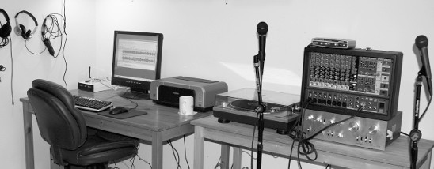

图2-1


同样没有显示的是一个很棒的 Focusrite Saffire Pro 26 I/O FireWire 多通道录音接口。

Focusrite 生产优质音频硬件，并支持 Linux、Mac 和 Windows。我们将在第九章中看到更多关于 Saffire 的内容。

它们的连接方式如下：

• 录音：麦克风和乐器 > Behringer 调音台 > MobilePre > 计算机

• 播放：计算机 > MobilePre > Pioneer 立体声功放 > 音箱


在录音方面，Behringer 调音台有一对 RCA 录音输出。它们通过 RCA 对到两个 1/4 单声道 TRS 转接器，将立体声信号发送到 MobilePre 上的两个 1/4 TRS 插孔。

MobilePre 使用 USB 线连接到计算机。所有接入 Behringer 的设备都会被 Audacity 捕获。 


注意

 连接器的术语有点混乱，所以我打算把电缆上的连接器称为插头，把它们插入的混音器、前置放大器、功放等设备上的接口称为插孔。我也会遵循惯例，称它们为公头和母头，尽管我一直觉得这样听起来很奇怪。公头和母头至少有一个优点，那就是含义明确，而不像很多音频术语那样模糊。 


 用于回放，MobilePre 有一个 1/8 立体声输出。这个输出通过立体声迷你插头转 RCA 对适配器连接到 Pioneer 功放的 Aux 输入。MobilePre 还有一对 1/4 TRS 输出，因此对于这些输出，我需要 1/4 TRS 转 RCA 适配器。图 2-2 显示了功放背面的插孔。像这样的好功放加上好的 ADC/DAC，可以成为转换工作室的绝佳中心，因为任何连接到功放的设备都可以在你的计算机上录制。 

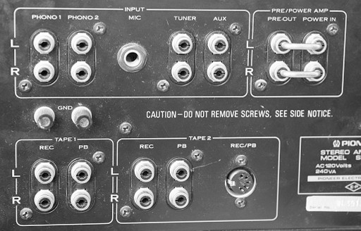

图2-2


 我也可以完全省掉 Behringer，例如用于采访和播客，只使用 MobilePre 配合任何电脑。当我把黑胶唱片复制到 CD 时，流程如下：
• 录音：唱盘 > Pioneer 功放 > MobilePre > 电脑
• 播放：电脑 > MobilePre > Pioneer 功放 > 扬声器
唱盘插入功放的唱头端口。功放通过一对录音输出连接到 MobilePre。我可以使用 RCA 转双 1/4 TRS 的适配器，或者 RCA 转立体声小插头，因为 MobilePre 在连接方式上非常灵活。使用这样的设置，你可以数码化任何传统媒体，因为任何连接到你的高保真功放或接收机的设备都可以复制到电脑里。录音和播放都是通过 MobilePre 路由的，因此我可以在好的扬声器上听到播放内容，而不是低保真电脑扬声器。MobilePre 有一个耳机接口，可以在录音时进行零延迟监听，这是一个很不错的功能。Behringer 混音器（Europower 1280S）实际上并不是为录音室混音设计的；它用于现场演出，并且做得非常出色，因为它是一个集成的混音器和 1200 瓦功放。当我录制现场演出时，会使用笔记本电脑和 MobilePre 连接它。我还有一个 Zoom H2 便携式数码录音机，可以替代笔记本和 MobilePre 的组合。现场演出中录制的最佳音质来自直接插入混音台。 


注意

我喜欢听和录制的本地老式乡村乐队有一个相当古怪的音响系统。他们有一个不错的公共广播系统，但不是把所有人都接到调音台上，只有歌手的麦克风连接到调音台。所有的乐手都必须自带乐器放大器。这使得舞台显得杂乱无章，录音更是噩梦——将录音设备接到调音台上意味着它只能听到麦克风拾取的乐器声音。Zoom H2 有一个很棒的小适配器可以把它安装在麦克风架上，这样我可以把它放在任何位置，但它仍然不如把所有设备通过音控台进行设置的正规方案好。 


让我们仔细看看 MobilePre，因为它代表了许多 USB 录音接口的特性。MobilePre 为电容麦克风提供 48v 幻象电源，并配有 XLR 和 TRS 接口、一个 1/8 英寸立体声输入、两个 1/4 英寸单声道输出，以及一个 1/8 英寸零延迟耳机端口用于监听。只要麦克风有 XLR 接口，动圈麦克风和电容麦克风都可以插入 XLR 插口。你也可以使用 XLR 转 TRS 适配器将动圈麦克风插入其中一个 1/4 英寸输入口。其内置 ADC 支持 8 到 48 kHz 采样率，16 位深度，并且通过电脑的 USB 总线供电，因此不需要单独的电源线。它有物理增益控制旋钮和耳机音量控制旋钮，因此无需在软件中调整控制。（我宁愿扭旋钮，也不愿摸索什么奇怪的软件界面。）你应该能以低于 150 美元的价格买到一个。在 16 位 / 48 MHz 的最高录音质量下，它正逐渐过时，因为同类设备支持 24 位录音。不过，它仍然是一个很棒的小设备，并且由于它符合 USB 1.1 类规范，可以在任何电脑上运行，无需特殊驱动程序。图 2-3 和图 2-4 显示了 MobilePre 的前面板和背面。 

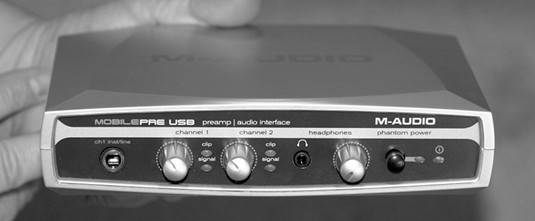

图2-3


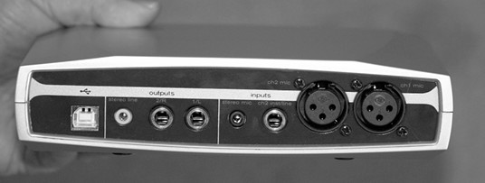

图2-4


 整理连接器 术语TRS和XLR来自哪里？TRS是tip-ring-sleeve的缩写，即TRS插头的物理描述。图2-5是立体声和单声道TRS插孔的标注照片。XLR的起源则稍微复杂一些。Cannon Electric是XLR连接器的最初制造商，一些老前辈仍然称它为cannon插头。它最初是“Cannon X”系列连接器。后来版本添加了锁扣，因此有了L，然后将触点封装在橡胶中，因此有了R。图2-6展示了一对三针XLR插头。 


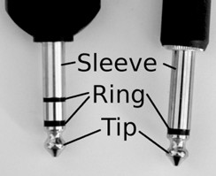

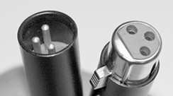


 图 2-7 展示了一组插头和适配器。你可以找到让任何东西适配任何接口的适配器。然而，你必须小心——仅仅因为某物能插入，并不意味着它应该放在那里，所以请阅读你的产品说明书。立体声 TRS 插头在尖端附近有两条黑色环，而单声道 TRS 插头只有一条。 


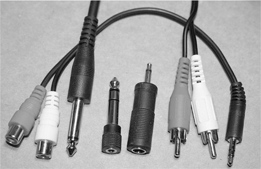


 图 2-8 显示了 Behringer 动圈麦克风上的三针公 XLR 连接器。 


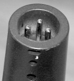


##### 多通道录音、PCI、USB、FireWire

多通道录音可以通过几种不同的方式进行。一种方法是使用像 MobilePre 这样的简单双轨录音接口。它最多支持同时六个输入，并将它们路由到两个通道。由于没有混音控制，这需要在录音中进行一些调整以获得合适的平衡。使用像 Pre 这样的双通道接口进行多通道录音的更好方法是一次录制两条轨道，为每个乐器或表演者提供各自的独立轨道，而不是试图一次性将所有信号通过 Pre。然后 Audacity 就是你的混音器，你可以单独控制每条轨道。 另一种双通道录音选项是一块高品质的双通道 PCI 声卡，例如 Emu 1616M PCI，你可以在二手市场上花不到 200 美元买到。它带有一个分离盒，支持各种插入、24位/192 kHz 录音、幻象电源和前置放大器。当我有更大团队进行录音时，我的 Behringer 1280S 就会投入使用。任何模拟混音器都可以，只要你有 ADC/DAC 来连接。我的设置有点临时，因为 Behringer 并不是真正的工作室混音器，但它可以使用并且听起来不错，这也说明了一点小创造力在音频世界中可以走很远。像许多混音器一样，Behringer 输出的是双通道立体声，所以我在录音时需要调整好混音——在 Audacity 中我只有两个通道可用。 


 我 37 用便宜的方法建立一个好的数字音频工作室 也可以一次用 Behringer 录一两轨，然后在 Audacity 中将它们拼接在一起；并没有规定说你必须一次插入所有设备。（尽管召集和组织音乐家有时像是在赶猫，有时你只能接受能得到的。）从 1.3.8 版本开始，Audacity 支持同时录制的轨道数量取决于你的录音接口支持的数量。旧版本最多只能录 16 轨。这就是 FireWire 和高端 PCI 声卡的优势所在，因为它们允许同时录制多轨。Focusrite Saffire Pro 40 是一个很有性价比的 FireWire 录音接口示例，价格约为 500 美元；它提供 8 个麦克风前置放大器、总共 20 个输入和 20 个输出、24/96 录音、闪烁的 LED，以及每个麦克风通道的幻象电源。M-Audio Delta 1010 是一款受欢迎的高端多通道 PCI 声卡，可连接到机架式拓展盒，价格约为 600 美元。一类很酷的新设备是 USB 和 FireWire 混音器。这些设备将所有功能集于一身——前置放大器、幻象电源、混音台、ADC/DAC，以及直接插入计算机的功能。在 300 到 1000 美元的价格范围内有很多不错的选择。Behringer 的 Xenyx USB 混音器系列价格在 150 到 600 美元之间。它们使用类兼容的 USB 1.1，因此可以插入任何电脑，无需特殊驱动程序。M-Audio NRV10 是一款不错的小型 FireWire 混音器/前置放大器，价格约为 700 美元。 


 如何选择使用哪一个？USB 和 FireWire 便携且易于连接。PCI Express 是最快的。单条 PCI-E 通道的双向传输速度约为 250MBps。注意，是 250 兆字节，不是兆比特。普通的 PCI 的最大速度是 133MBps。此外，与 PCI-E 不同，PCI 使用共享总线，所以更多的 PCI 设备意味着更多的带宽争用。每个 PCI-E 设备都有自己的专用数据通道，所以 PCI-E 设备不需要共享带宽。USB 1.1 额定速度为 12Mbps（兆比特每秒），USB 2.0 额定速度约为 480Mbps，但这些数字都高度理论化，在实际使用中很可能只能达到一半。FireWire 额定速度为 400Mbps。然而，FireWire 提供更高的持续吞吐量和更好的性能，这一差异将在下一节中详细讨论。内置声卡的常见问题是会从硬盘、电源和机箱内的风扇中拾取噪音和电气干扰。对于像 Emu、M-Audio 和 RME Hammerfall 这样更好的声卡，这通常不是问题，但对于消费者级和游戏用声卡以及低预算的板载声卡，这通常会成为问题。如果你遇到噪音，首先需要检查所有连接——确保一切连接正确，并且需要接地的部分已接地。有时将 PCI 卡移到不同的插槽会有所不同。检查你的主板手册，看看是否有共享 PCI 插槽；如果另一个插槽已被使用，你不想使用共享插槽。 


##### USB还是FireWire？

如果你喜欢USB音频接口的便利性，你也可以考虑FireWire设备。如何在FireWire和USB之间选择？USB设备通常比FireWire便宜，但代价可能是性能较差，因为两种协议存在差异。所有FireWire接口都有专用控制芯片，因此不会增加计算机CPU的额外负担。FireWire是一种对等协议，这意味着FireWire设备可以在不使用主CPU周期的情况下处理总线冲突。FireWire为你提供两种操作模式可选：异步或等时。等时模式意味着设备可以保留一定比例的带宽专用于自己，其他设备无法使用。因此不会发生冲突，从而实现高持续吞吐量。如果你的PC没有FireWire接口，添加一个也很容易。PCI FireWire接口大约花费50美元，许多笔记本电脑也包含FireWire端口。当你购买FireWire音频接口时，一定要检查硬件兼容性。例如，Presonus FP10已知与某些视频芯片组存在冲突，并且它只与已知兼容的有限FireWire接口良好配合使用。 


> FireWire 的未来 “FireWire 注定要消亡！”是近来常见的喊声。这也许是真的，尽管它还会伴随我们好几年。USB 2.0 被认为有可能达到 FireWire 的性能，而 USB 3.0 被认为将会超过它。音频硬件制造商在发布 USB 2.0 录音接口方面一直比较慢，尽管现在已经有相当数量的产品。它们中的许多依赖定制驱动程序，这些驱动程序并不符合 USB 2.0 标准，所以在购买时要仔细挑选，以免买到无法在你的电脑上运行的产品。USB 3.0 仍在开发中，而音频硬件制造商以动作慢著称。如果你喜欢 FireWire 录音设备，尽管买来使用，如果有一天 FireWire 确实过时了，你仍然可以继续使用你的设备，因为不会有人来收走它们。 


 USB 仅以异步模式运行。异步意味着同一总线上的任何设备都可以随时发送数据，因此有时会发生冲突，从而导致延迟。USB 依赖主机，并给 CPU 增加负荷，这也可能导致延迟。延迟是高质量音频的敌人。你会看到许多 USB 音频设备仍然使用 USB 1.1。USB 1.1 有两种速度：1.5Mbps 和 12Mbps。后者也称为全速。USB 录音接口不太可能降速到 1.5Mbps。你一次可以录制的通道数量取决于你想要录制的质量水平。CD 质量，16/44.1 两声道，码率为 1,411,200Mbps。两声道 24/96 的码率为 4,608,000Mbps，所以看起来你一次可以录制四个 24/96 通道。然而，这个 12Mbps 的最大值是理论值，你的实际吞吐量会减半或更少。最有可能的是，你最多只能录制两声道 24/96。若小心操作并拥有一台快速的多核 PC，并对其进行了音频制作优化，则可以录制四个 16/44.1 或 24/48 通道。（参见第 29 页“码率、位深度与文件大小”了解不同的码率。）购买 USB 2.0 音频设备需要谨慎，因为许多设备不符合 USB 类标准，而是提供自己的专用驱动程序。即使是 Windows 用户也需要自行研究，因为厂商对新 Windows 版本的驱动程序发布较慢。Mac 支持总体不错，而 Linux、Unix 和其他平台的用户通常处于后端。一些多轨 USB 2.0 设备得到了好评。例如，M-Audio Fast Track Ultra 8R（八进八出）获得了高评价，并且适用于 Mac、Linux 和 Windows。 


##### 麦克风

图2-9中的麦克风是中等档次的动圈麦克风，每个售价不到100美元。麦克风非常重要——低质量的麦克风无法录制出好的音质。麦克风有两种常见类型：电容麦克风和动圈麦克风。电容麦克风具有更宽的频率响应，更高的灵敏度，输出更大，并且瞬态响应更快。瞬态响应指任何突发的变化，例如边缘击打、强力拨弦的吉他，或歌手发出硬辅音（可能还会带一点唾液喷出）。 

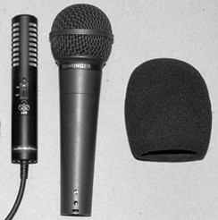


 电容麦克风需要电源。当电源通过麦克风电缆提供时，这称为幻象电源，因为没有单独的电源线。它们比动圈麦克风更脆弱。电容麦克风主要用于录音室。它们也在舞台上与动圈麦克风结合使用于鼓组；电容麦克风悬挂在上方以捕捉镲片和瞬态，动圈麦克风则放置在鼓旁边。图 2-9 显示了一支铁三角立体声电容麦克风、一支贝灵格动圈麦克风和一个防风罩。（有经验的歌手知道要避免使用鲜艳颜色的防风罩，因为它们看起来像小丑的鼻子。） 


 需要幻象电源的电容麦克风通常使用 XLR 接口。动态麦克风则使用 XLR 接口和 TRS 插头。动态麦克风不需要幻象电源，所以在将其插入带幻象电源的 XLR 插口之前，一定要确保幻象电源已关闭。这通常不会损坏麦克风，但会改变它的声音效果。音频设备上同时配备这两种类型麦克风接口是很常见的，而较新的设备有组合插口，可以同时接受这两种接口。图 2-9 中的小型 Audio-Technica Pro 24 立体声电容麦克风是一种不同类型的电容麦克风。它由一颗小型汞电池供电，内置电缆，并可插入任何 1/8 TRS 立体声麦克风插口，例如笔记本电脑、数字录音机和摄像机上。有两种类型的电容麦克风：大振膜（LDM）和小振膜（SDM）。两者都能在整个频率范围内均匀且准确地录音，尽管 LDM 以产生“更温暖”的声音而著称。大振膜麦克风的低频范围优于小振膜麦克风，但相同类型的小振膜麦克风在高频响应方面更好。低音被认为更温暖，高音被认为更清亮明亮。你会听到各种对音质的描述：温暖、冷、脆、软、硬、明亮、暗淡等等。相信你自己的感受，不必太在意别人告诉你应喜欢什么。 


 动圈麦克风的频率响应较窄，准确性不如电容麦克风。它们坚固耐用，防潮，并且不需要电源，因此动圈麦克风适合舞台和外场使用。动圈麦克风通常覆盖人声范围及其略高一点的频率，因此非常适合歌手使用。另一种值得考虑的麦克风类型是缎带麦克风，它是一种动圈麦克风。缎带麦克风的核心是悬挂在磁场中的金属缎带。它们价格昂贵，但因其清晰度、空间感和真实感而备受推崇。它们在20世纪30年代彻底改变了音响行业，缎带麦克风为真实感和准确性设定了新标准，这是当时的电容麦克风无法比拟的。随着电容麦克风和动圈麦克风的改进，缎带麦克风逐渐失宠。它们价格高昂，金属缎带易碎，而且输出较低，需要比其他类型的麦克风更多的放大。现代缎带麦克风更实惠、更耐用，输出音量也比其前辈大，因此非常值得尝试（见图2-10）。缎带麦克风本身是双向的，这意味着它对麦克风前后方向的声音都敏感，呈八字形拾音模式。 


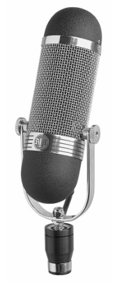


 它们在阻挡来自侧面的声音方面非常有效。八字形模式位于水平轴上，因此你可以将它们侧向倾斜以获得不同的效果。将一对匹配的リボン麦克风以90度角放置在一起称为布鲁姆莱因对或交叉八字形。这可以创建真实的立体声图像。如果你不想捕捉来自一侧的声音，例如观众那一侧，你将不得不以某种方式阻挡它，或者找到具有你想要的拾音模式的リボン麦克风。 


###### 极性模式

麦克风的重要考虑因素是极性模式。极性模式描述了麦克风的灵敏区域，如图 2-11 所示。这些二维图表没有显示极性模式是三维的，所以请记住它们不是平的和水平的；它们包括有高度和深度的区域。 

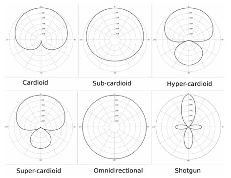


这些是常见的指向性模式：


**心形指向**

拾取来自前方的声音，并拒绝来自后方的声音。
次心形指向：有点像全指向，但对后方的拾音范围较小。
超心形和超心形（super-cardioid）：前方拾音范围较窄，并且后方有小范围的拾音。 这在舞台麦克风，尤其是歌手使用的麦克风中很常见。
不同的心形麦克风有不同的灵敏度水平。有些具有宽的拾音范围，非常适合经常移动的表演者；有些灵敏度区域较小，更适合避免拾取背景噪音。 


**全指向性**

可以从球形区域的所有方向均匀拾取声音。

尝试将你的乐队围成一圈，并在中间放置一个全指向麦克风，以获得宽广、自然的声音。


**枪式**

定向性最强，前方长而窄，后方拾音范围较小。

这类麦克风通常用于各种类型的电影摄像机，从胶片到数字，从专业到消费级，是野生动物摄影师的最爱。


**双指向性**

能够同等拾取前方和后方的声音；不会拾取侧面声音。（图2-11中未示出。）


**半全指向性或半球形**

能拾取大约180度的半球形区域。使用这种麦克风可以获得很好的现场录音，因为它具有宽广的前方拾音区域，并且不会拾取来自后方的噪音。（图2-11中未示出。） 


你可能会想，为什么不干脆对所有情况都使用枪式或心形指向麦克风，这样就能只录下你想要的声音呢？想做什么就做什么；让你自己的耳朵和审美来指导，并根据场合选择麦克风。不同品牌和型号的麦克风在灵敏度和类型上都有差异。例如，有些麦克风能容忍经常移动的歌手，而有些则只能在靠近时才能很好地捕捉声音。无线头戴麦克风对于充满活力的表演者非常方便，无线麦克风意味着不必担心踩到电缆。一些麦克风在靠近时会更强调低频，就像广播DJ那样，低音会被夸大。这称为近距离效应。《Cowboy Junkies》的《Trinity Session》专辑据说使用了一只价值约9000美元的单一全景声麦克风录制。全景声指的是环绕声录音技术和设备，旨在产生真实、空间感自然的声音。全景声麦克风有多个拾音单元，可以从不同方向捕捉声音，从四个到几十个不等。在音频制作中，这是一个有趣的细分领域；如果你有兴趣了解更多，可以搜索全景声和SoundField麦克风。 


###### 哪种麦克风适合哪种场合？

不同的场合有不同的麦克风，比如人声、吉他、鼓等等。歌手尤其挑剔，因为不同的麦克风会给他们的声音带来不同的色彩。你会在这个话题上找到许多充满热情的观点。请记住，有很多因素会影响你对录音效果的感受：录音的编辑方式、你听音所用的设备类型、听音地点（家里、朋友家、音乐厅、户外、车辆）以及你的心情和期望。我们从小就接触各种类型的录音：乙酸片、黑胶、不同类型的磁带，现在还有数字音频。因此，什么听起来“合适”，很大程度上受我们习惯听的声音影响。有些人仍然怀念60年代锵锵作响的AM广播、低音强烈的点唱机或四声道八轨磁带的声音。有些人认为黑胶唱片比数字音频听起来更“温暖”，电子管功放比晶体管功放听起来更温暖。 


 我一直想做一些盲测，只是为了看看我生活中那些挑剔的发烧友是否真的能听出差别。

我的盲测愿望清单中的第一项是电子管功放与晶体管功放的比较，以及冷电子管功放与经过24小时预热的电子管功放的比较，因为一些前面提到的挑剔发烧友坚称电子管功放需要长时间预热，否则听起来会“冷”。


电子管和晶体管之间确实有真实的差别。

电子管放大器系统驱动一个变压器，而变压器则驱动扬声器。变压器会抑制许多瞬态，如尖峰、爆音和点击声，从而产生更干净的声音。

冷状态的前置放大器噪音比热状态的前置放大器大。

电子管也有单一的噪声来源，而半导体器件有多个噪声来源，这会增加你可能听到的噪声。

不过，在高质量设备上，要察觉差别需要非常敏锐的听力。


几乎不可能定义一个“纯粹”的体验，因为即使是现场演出也会受到其环境和设备、氛围以及我们大脑处理数据方式的影响。

我总是很惊讶，我最喜欢的本地乐队在我录制的演出中听起来有多糟。

在演出期间，我玩得很开心，并且觉得他们的演出很棒。

然后后来当我听回放时，我听到各种缺陷：节奏不对、跑调、缺乏生气，等等。

也许我太挑剔，对录音中的错误太敏感；也许在现场演出中，我的大脑太忙于享受乐趣而没有注意到缺陷。

也许我做的录音很糟糕。

道理是音质取决于你自己的耳朵和经验——听起来好和正确的东西才是最重要的。

你可以追求最真实的还原度，也可以追求最佳的艺术性和创造性还原度。

一切都是主观的。 


###### 麦克风电缆

有很多品牌的麦克风电缆，你可能会在一些高端品牌上浪费很多钱。不要花大价钱；有许多价格合理、质量不错的选择。你可能会对平衡和非平衡电缆感到困惑。在连接麦克风的情况下，非平衡电缆是以同轴电缆结束于尖端-套筒（TS）连接器的电缆。它有一根单芯导线，周围包裹着屏蔽和地线。这种电缆在阻挡外部干扰方面是有效的，但易受感应的嗡嗡声和噪音影响，而且噪声通常比平衡电缆大。平衡电缆则以三针XLR连接器或TRS连接器结束。它有两根内部导线，一根热线和一根冷线，周围有一个不参与信号路径的屏蔽层，因此提供更干净的信号。平衡电缆可以比非平衡电缆传输更长的距离而不会引入过多噪音。请记住，是信号本身是平衡还是非平衡，使用平衡电缆并不会将非平衡信号变为平衡信号。然而，TS电缆可以将平衡信号转换为非平衡信号。你需要将电缆与麦克风以及前置放大器、功放、混音器或其他可能连接的设备匹配。 


 依赖幻象电源的电容麦克风很可能使用三针XLR平衡电缆，而动圈麦克风使用带有XLR和TRS连接器的平衡电缆。平衡信号不在乎传输介质，所以可以根据需要使用XLR转TRS适配器，前提是所连接的设备发送正确的信号。如今，你不需要花太多时间去弄明白这一点，因为大多数现代音频设备都支持平衡麦克风连接。麦克风电缆根据使用场所的不同，可以是硬的或柔软的。柔软电缆用于现场演出，而硬电缆通常用于不经常移动的录音室。如果可能的话，不要让音频电缆与电力线交叉，否则可能会产生干扰。如果必须交叉，请以直角方式交叉，以减少重叠。 


###### 智能麦克风摆放

将麦克风摆放到最佳位置本身就是一门艺术，而提高这方面技能的唯一方法就是大量练习。你希望尽可能靠近声源，但又不能太近，以免拾取电子干扰或不需要的声音，如歌手的嘴唇声和唾液声。防风罩对歌手很有帮助，而防风网在户外录音时必不可少。

“3比1规则”是一个简单的麦克风摆放指南，适用于现场演出或在同一房间同时设置多个麦克风和表演者的录音棚。当麦克风摆放得太近时，可能会产生尖锐声、衰减与峰值波动，或其他形式的不愉快干扰。3比1规则意味着相邻麦克风之间的距离应大约是麦克风与声源之间距离的三倍。

如果有多个音箱，就像我最喜欢的本地乐队那样，每个表演者都会把自己的音箱搬上舞台，这也会导致问题。有时仅仅将音箱转向不同方向就能解决啸叫问题。

麦克风支架是必需的——不要依赖手持。鹅颈支架占用空间小，调整迅速，但久用容易损坏。伸缩支架使用寿命长，但占用空间较大。有些人喜欢三脚架底座，但我总是被绊倒，所以我更喜欢加重底座。防震架和保护笼在隔离麦克风振动方面效果很好，而且价格不高。 


##### 麦克风前置放大器

麦克风前置放大器是音频链中仅次于ADC/DAC的重要设备。正如我在本章中已经提到的，我有一台M-Audio MobilePre和一台Focusrite Saffire Pro 26。有了这些设备，我就不需要内部电脑声卡或单独的前置放大器，因为它们自身就内置了麦克风前置放大器。然而，即使你更倾向于使用内部声卡或拥有良好的外部录音接口，你仍然可能希望使用单独的麦克风前置放大器。让我们来谈谈为什么前置放大器如此重要。

前置放大器——preamp，是preamplifier的缩写——用于将低电平信号放大到线路电平。来自麦克风、唱盘以及许多乐器拾音器的输出电平都低于线路电平。线路电平是一种标准的模拟音频信号电压，用于连接不同的音频组件。

那么，这个电压是多少呢？这是个好问题，因为虽然它被称为标准电压，但根据制造商的不同会有所变化。大多数在1到2伏之间。

前置放大器对音频质量有显著影响：
\- 低质量的前置放大器会引入噪音和失真。
\- 高质量的前置放大器能够干净地放大信号，而不会引入缺陷或改变音色。 


```
注意
音频术语有各种各样的曲解——你在家庭高保真系统中看到的许多前置放大器并不像麦克风前置放大器，因为它们不进行任何放大，只是插入设备的切换单元。 
```


前置放大器的种类从仅提供增益（放大）和幻象电源的基础型号，到装满各种特殊效果、旋钮和闪烁灯的华丽型号应有尽有。许多音频设备都配备了大量特殊效果，因为增加这些几乎不需要成本，而且会让你感觉自己得到了特别的东西。如果你喜欢大量特殊效果，这是一个很好的附加功能；只是不要让它分散你对设备真正质量的注意。至少，拥有一些实体旋钮总是好的。关于哪种前置放大器最好的争论几乎具有宗教性。专业人士可能会在一个前置放大器上花费数千美元。你也可以这样做，但在我看来，你最好从便宜的设备开始，并投资于完善你的录音技术。然后，当你准备升级到更好的设备时，你会欣赏到差异并知道如何充分利用它。 


##### 扬声器和耳机

在你的音频链中同时拥有扬声器和耳机可以让你以不同的方式听录音。录音室监听音箱据说是完全平坦且准确的，不会添加任何自身的色彩。它们通常也比较昂贵。我自己的工作室音箱是一套不错的JBL三分频音箱。它们不是真正的录音室监听音箱，只是我喜欢的好音箱。耳机是必不可少的——你需要它们来监听录音。带有内置零延迟耳机接口的音频接口非常适合监听。我似乎喜欢收集耳机：我有一副不错的Plantronics USB耳机，非常适合录制播客；一副带普通1/4英寸TRS插头的Sennheiser耳机；以及一副无线Audio-Technica耳机。我的工作室音箱由一台不错的老款Pioneer SA 7500立体声放大器驱动。我已经修过它两次，我会尽量让它继续使用下去。它每声道的额定功率为45瓦，这听起来不多，但它以相当大的电流输出这些瓦数。功率放大器的实际衡量标准是电流；这才是区分孱弱功放和强劲干净功放的关键。瓦数本身意义不大——这是销售人员喜欢强调的数字。 


 这些都不是超级高级的高保真音响，至少按照挑剔的音响爱好者的标准来说不是，但它们都是很好的组件，并且让我很满意。 


##### 你的电脑必须有肌肉和宽敞的抽屉

你的电脑应该是一台现代机器，配备高性能CPU和大量内存。我的工作室电脑配备了AMD Phenom三核CPU，配备4GB内存。多核CPU确实有很大不同。单核CPU在两轨录音和播客、访谈等简单录音中表现良好。比如，我有一台老款ThinkPad，配备800 MHzCPU和256MBRAM运行Linux，作为采访现场录音机表现不错。超过两首曲目，多核是最佳选择。别担心AMD和英特尔的较量;它们都不错，所以用你最喜欢的那个。你需要尽可能多的存储空间。CD质量音频（44.1 kHz，16位WAV）每条轨道每分钟约占5MB。别忘了把你用的所有曲目和重拍次数加起来。你可以买到TB级硬盘，等你读到这里时，硬盘可能已经更大了。另一种选择是将多个硬盘的容量合并成一个RAID（廉价磁盘冗余阵列）。音频制作中有用的两个RAID等级是RAID 0和RAID 10。RAID 0，也称为条纹，使两个硬盘看起来像一个硬盘，因此两个500GB硬盘看起来像一个TB硬盘。RAID 0 非常快，但和 sin gle 硬盘有相同的弱点——如果阵列中的一块硬盘故障，你很可能会丢失所有数据。RAID 10（使用高质量硬件控制器）是镜像加上条带，所以既有速度又有冗余。使用高质量的硬件拖钓器;你不想要一个廉价的机器，反而会给CPU带来更多负载，而是要用一个能自己承担负载的机器。它比流行的RAID 5更贵，但更可靠，速度更快——读写更快，故障硬盘恢复速度更快。我不会用RAID 5或6阵列来录音;事实上，我现在根本不用它们了，因为它们太脆弱，写入速度太慢，而且太容易传播奇偶校验错误。除非你经常耗尽一块太字节的硬盘，否则我不会担心用Audacity搭建超级高级的RAID阵列来记录和编辑。我在工作室电脑上用一个大硬盘，处理和处理不需要的文件都很不妥协。我用一台漂亮的四盘 Linux 驱动的 RAID 10 服务器做备份。 


##### 操作系统

 在本书中，我将涵盖 Linux 和 Windows。每一种操作系统都有其优点和缺点。如果你是 Windows 用户，XP 仍然是最可靠的版本，尽管 Vista 和 Windows 7 已经发布。你将获得最佳的硬件和软件支持以及最佳的性能。Vista 存在特殊问题，因为它对硬件的要求很高——它可能会使你的系统变慢，甚至无法舒适地用于音频录制，而且许多音频设备的驱动支持仍不成熟。音频硬件制造商似乎对 Windows 7 更感兴趣，但与 XP 比较，它仍然很占用资源。如果你想从 XP 升级，不要费心去用 Vista；直接升级到 Windows 7。如果你的音频硬件和软件在 XP 上运行良好，那么尽量继续使用它们。 


 Linux 用户在硬件厂商方面经常遇到麻烦，无论他们购买多少产品、炒作或提供免费支持，厂商们都假装这些用户不存在。附录 A 会告诉你在 Linux 上哪些硬件运行良好，你还会找到关于 Linux 音频硬件支持的最新信息网站链接。如果能稍微安慰一下的话，很多音频硬件厂商在 Windows 上发布的驱动程序也不怎么样。为什么会这样？谁知道呢；这是一个我花太多时间去思考的谜。不想要让顾客满意吗？延迟是高质量音频的敌人，所以请参考第 13 章和第 14 章，获取调整操作系统以获得最佳音频性能的建议。以下是根据 Audacity 文档列出的系统要求。对于 Windows 7，请假定与 Vista 相同： 


Windows 98、ME 推荐 128MB/500MHz，最低 64MB/300 MHz

Windows 2000、XP 推荐 512MB/1GHz，最低 128MB/300 MHz

Windows Vista Home Basic 推荐 2GB/1GHz，最低 512MB/1 GHz

Windows Vista Home Premium/Business/Ultimate 推荐 4GB/2 GHz，最低 1GB/1 GHz

Linux “Audacity 在至少 64MB 内存和 300 MHz 处理器下运行最佳，” Audacity 为 Linux 用户的文档中写道。

我建议至少使用 800 MHz CPU 和 256MB 内存用于播客、访谈和双轨音乐录音，并为多轨录音和编辑使用你能负担得起的最强大的三核或四核 CPU。 


##### 便携式录音

野外录音有几种不错的方法。我最喜欢的两种方法是把一台上网本改装成便携式录音工作室，或者使用便携式数字录音机。上网本非常酷；自从我发现电脑以来，我一直希望拥有上网本。普通笔记本电脑也可以使用，而且你会拥有更强大的CPU。你拥有与台式电脑相同的选择——可以选择前置放大器、混音器和其他音频接口、麦克风、软件——而且你可以在现场进行所有编辑，甚至还能刻录CD。你还有一个不错的屏幕和键盘，而不是便携式数字录音机那种小屏幕和按钮。

口袋数字录音机工作非常出色，也很有趣。这类设备从类似钥匙扣的小型设备（相当于音频便笺）到用于高质量语音记录的小型录音机，再到高质量的多通道录音机都有。让我们来看看高质量设备的组成部分。 


 有很多价格合理的设备，你可以把其中一个放进口袋，随身携带。带上备用电池和一些额外的存储卡，你就可以准备应对任何情况。我个人最喜欢的是Zoom Handy H2（图2-12）。它使用两节AA电池驱动，也可以使用交流适配器。它有四个内置的高质量麦克风，因此你可以录制双声道立体声或四声道环绕声。它没有扬声器，但附带耳机，也可以作为电脑的USB音频接口使用。它的1/8英寸线路输入可以直接连接到音乐会的调音台，也接受外接麦克风。它使用SD卡存储，并支持WAV和MP3文件格式。价格大约为150美元。 


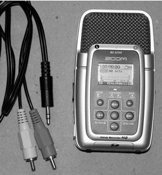


 其他一些流行且优秀的便携式数字录音机包括奥林巴斯 LS10、马兰士 PMD 620、马兰士 PMD 660、索尼 PCM-D50、雅马哈 Pocketrak 2G 和 Zoom H4。这些设备价格都在 600 美元以下，并且都内置麦克风。理想情况下，你应该能够在购买前亲自试用它们，因为它们都有一个共同的弱点——小型 LCD 控制面板和复杂的菜单。你还需要测试噪音水平，因为有些设备在使用内置麦克风时很安静，但连接外接麦克风时会有划痕声。大多数设备都支持外接麦克风——有些只有 1/8 英寸迷你插孔，有些则支持全尺寸 XLR 或 TRS 插头。带 XLR 插孔的设备并不总是为电容麦克风提供幻象电源。一个不错的选择是使用电池供电的电容麦克风，这样就无需担心幻象电源的问题。 


```
注意
提供幻象电源的设备通常会宣传“48伏幻象电源”。但实际上很少有麦克风真正使用48伏。它们通常使用的电压要低得多——仅为8到10伏。
```


 其他需要关注的方面包括电池寿命、存储卡的类型和大小。它是否有内置存储，它支持哪些音频文件格式？它是否附带有用的配件，如交流适配器、防风罩、耳塞和支架？一个有趣的变体是 M-Audio Micro Track II。它没有内置麦克风，但却是一个迷你两通道录音工作室，适合与高质量的外置麦克风一起使用。它支持动态麦克风和电容麦克风，并为电容麦克风提供完整的48V幻象电源。我更喜欢使用 USB 读卡器将文件从便携录音机传输到电脑。通常速度更快，而且不会耗尽录音机电池。 


##### 录制自己高质量音频的秘密

制作高质量音频录音的“秘密”并不是什么真正的秘密：最重要的因素是阻挡不必要的噪音。我们的大脑非常擅长忽略不想注意的声音，但麦克风会同等对待所有声音。阻挡不必要的噪音比想象中要难，因为我们的现代世界非常嘈杂：车辆交通、飞机、家用电器、电视和音响、荧光灯、街上120分贝的$2,000功放低音炮装在$500的车里、施工等等。众所周知，高频噪音比低频噪音更容易阻挡，这可以从我们徒劳地试图躲避那些四轮功放低音炮的努力中看出，它们可以穿透一切障碍。电脑也会产生自身噪音——常常会拾取硬盘和风扇的声音。因此，在你购买昂贵录音设备之前，首要工作是准备好你的录音室： 


• 使用带有吸音墙壁或墙面覆盖物的安静房间。旧车毯和毛毯的效果与昂贵的声学泡沫一样好。

• 将一个好的指向性麦克风靠近你正在录音的对象，并仔细对准。

• 保护你的麦克风免受电脑干扰。

• 仔细调整你的音量水平，既不太低也不太高。

• 将你的麦克风安装在防震架上。


 但是，你可能会问，为什么要费那么大劲呢？为什么不等以后再修复呢？反正这都是软件嘛。亲爱的读者，如果事情像那些愚蠢的电视剧和电影中描绘的那么容易，那么就不需要隔音的音乐录音棚，也没有人会大喊“拍摄现场安静！”你可以在Audacity中在一定程度上减轻问题，但你会得到更好的效果，如果尽可能做好录音，把修复留给那些无法避免的问题。这可不像犯罪类节目里那样，顶尖的音频技术人员可以将任何录音，无论多么凌乱，都清理得完美高保真。那已经不只是虚构，而是彻头彻尾的幻想。 


> 听觉范围 生活在所谓原始社会的人，没有我们现代的所有“便利”，在老年时仍然保持敏锐的听觉。我想如果他们想制作音频录音，他们就不必那么费力去阻挡不需要的背景噪音。据报道，美国印第安人和澳大利亚土著的听觉范围为10Hz到25kHz。普通人的听觉范围大约是32Hz到18kHz。这本书的优秀技术评论员阿尔文·戈茨（Alvin Goats）的听觉范围扩展到了大约22kHz。听起来并没有那么酷，因为18kHz以上的大多数声音都是噪音：风扇、电源、扬声器失真等等。他有时被指责听力不好，因为这些额外的声音掩盖了别人说的话。戈登·亨普顿（Gordon Hempton）是一位出色的艺术家，他称自己为“声音追踪者”（SoundTracker）（http://www.soundtracker.com/）。亨普顿先生以录制纯自然声音为职业，完全没有人声。1992年，他录制了全球黎明的合唱。后来多年，他根据马克·吐温（Mark Twain）的著作录制了密西西比河的声音，并根据约翰·缪尔（John Muir）的著作录制了优胜美地国家公园的声音。他使用Neumann KU-81i模型头（名叫弗里茨）尽可能模拟我们听到声音的方式。他已经发布了多张高质量CD，让你能够听到没有嘈杂人声的世界听起来是什么样子。亨普顿先生在1980年代初开始了他的录音生涯。很多他当时录音的地点现在因为噪音太大而无法再录制。 


 你的电脑应该专用于这项工作，不用于其他任何事情，无论是游戏、上网还是收发电子邮件等，因为你希望电脑的全部性能都用于录音。如果不这样做，你有可能产生跳音和卡顿。关闭屏幕保护程序、所有电源管理功能以及任何杀毒或反恶意软件程序。（Windows 用户，我是否需要说，在执行这些操作后不要连接互联网？）关闭所有不必要的服务、计划任务以及所有非必要的功能。你的麦克风会拾取噪音、振动以及来自各种意想不到来源的干扰。如果你还有旧的阴极射线管（CRT）显示器，换成现代的平板薄膜晶体管液晶显示器（TFT-LCD），因为 CRT 会发射辐射和噪音。有时候它们甚至会对某些声音产生共振并产生回声。你可以通过将一块地毯固定在一块胶合板或刨花板上，在麦克风和电脑之间制作一个廉价而有效的隔音屏障。 


```
不要吸烟
吸烟对你有害，对电脑和音频设备尤其是麦克风也有害。
对你的工作室访客来说很不舒服——他们可能不喜欢吸入二手烟，并在离开后需要洗澡换衣服。
```


给它装上支脚，让它可以自行站立，你就拥有了相当于一块昂贵高科技隔音屏障的效果。笔记本和台式机都应该放在不会共振的表面上。在紧急情况下，你可以把笔记本放在外套或枕头上，但要小心不要挡住其散热通风口。尽管许多操作指南建议让你的工作室尽可能地声学“死寂”，没有任何回声或共振，但你可以随意尝试。你可能会喜欢在有一些硬质表面的空间里某些声音的效果。心理声学在专业录音室中起作用；他们不会去打造完美的无响室，因为那样声音会过于平淡且听起来不舒服。没有声音反射，也没有任何赋予声音深度的元素。所以，专业录音室会减少随机噪音的数量，同时保留声音的一些深度。 


##### 参见附录A 

 既然你已经对所需的设备有了一些想法，请查阅附录A，那里列出了各个价格范围内的优质音频设备样例。这将帮助你在庞大而精彩的音频硬件世界中找到方向。官方录音室的狗狗莱拉和火箭祝你一切顺利（图2-13）。 

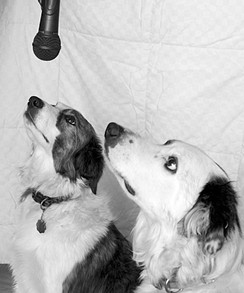


# 3

将黑胶唱片（及其他传统媒介）转录到 CD 


 保存和欣赏旧录音的一个好方法是将它们从任何传统介质——黑胶唱片、盒式磁带、磁带盘、老式78转唱片、录像带，甚至八轨磁带——转到CD。或者你也可以将它们转到硬盘、固态硬盘，或你喜欢的任何数字存储介质上。 


 将留声机唱片转录到CD上很受欢迎，你甚至可能因此发展出一个不错的副业。很多人仍然保留着他们的唱片收藏，但因为黑胶唱片易碎而不敢享受它们。许多优秀的专辑从未以商业CD的形式发行，或者现代CD的重新母带处理并不理想。有些人只是更喜欢老唱片的声音。虽然你可以复制任何模拟媒体并将其转换为任何数字音频格式，但在本章中，我们主要讨论将黑胶唱片专辑和单曲转录到CD。一旦你将旧的模拟媒体转换为数字格式，Audacity提供了许多工具来提升音质。你可能无法总是进行完美的修复，但可以将嘶嘶声、咔嗒声、爆音和其他缺陷降低到相当可接受的水平。 


 你还可以根据自己的需求自定义动态范围压缩，这是件好事，因为在现代流行CD上，动态范围压缩被滥用，甚至破坏了音乐的效果。即使他们做得很好，也可能不适合你，所以Audacity允许你按自己的方式进行压缩。最后，我们将讨论黑胶唱片与CD及其他媒介的优劣，以及如何将各种播放设备连接到计算机。如果你需要帮助设置硬件，请先跳到第67页的“将传统设备连接到计算机”。对于那些拥有敏锐听觉且对16/44.1 CD不满意的人，DVD-Audio格式支持高达24/196的音质。没错，每秒196,000采样，24位。DVD-Audio支持5.1环绕声，Audacity的1.3.x版本也支持。如果你不喜欢环绕声，你可以将16/44.1的多张CD音乐压缩到一张DVD上。我们将在第6章学习制作DVD-Audio光盘。好吧，那么让我们开始学习复制、编辑，然后制作CD。如果你需要复习使用Audacity的基础知识，请回顾第1章。 


##### 准备乙烯基唱片进行复制

 首先，尽可能把你的黑胶唱片清理干净。当然，你可以做很多事情来清理数字音频文件，但这并不像电视上那样，顶级实验室技术人员轻松地进行完美修复。亲爱的读者们，那是虚构的，我们还身处现实世界。最好从最高质量的录音开始；工作量更少，效果更好。我有我那些老式的Discwasher刷子，这是件好事，因为新的刷子质量不如旧的。真正的Discwasher刷子有方向性的刷毛——以一种方式清洁唱片，然后在干净无绒布上反方向刷动来清洁刷子。刷柄上有一个箭头，指向前端。你可以干用也可以湿用真正的Discwasher刷子。正确的湿用方法是只向刷子的前端涂抹清洁液，保持其余部分干燥。你可以让唱片在转盘上旋转时清洁，但要小心不要施加过大压力以免损坏电机。用湿刷毛的前端刷三到四圈，然后翻转刷子，让干燥部分接触唱片再刷三到四圈。播放前要等它完全干透，因为播放湿润的唱片可能会损坏唱片。（但是，对于已经损坏、无所谓损失的唱片，湿着播放可能会让声音更好。可以用蒸馏水或Discwasher D4液小心湿润，然后试着播放。它不会伤害你的唱针。）日常清理一把碳纤维防静电刷是很不错的。这种刷子总是干用，非常适合清除灰尘、绒毛和其他可能附着在唱片上的颗粒。但它们不适合清理指纹、粘性物质或其他需要湿性清洁剂处理的脏物。 


 有各种各样的清洁剂、微纤维布、刷子，甚至还有湿式高压清洗机。关于清洁黑胶唱片的最佳方法的争论永无止境且激烈；我就留给你自己去做研究，找出你喜欢的方式。你可以在二手商店用便宜的价格买到肮脏、不在乎损坏的唱片来练习。鉴于关于什么方法最有效的各种说法，我怀疑黑胶唱片比我们想象的要坚韧得多。 


```
唱片制作的历史
最早的录音是在旋转的蜡筒上进行的，中间有一根针连接在一个振动的振膜上，振膜附着在一个喇叭状装置上，就像老式的助听号。这个喇叭起到了麦克风的作用。针的振动在蜡上刻下不均匀的沟槽。现代单声道录音是用相同原理制作的，即振动的针刻入较软的材料，只不过针由磁铁驱动。当有人尝试调整磁铁相对于针的角度时，就产生了立体声，他们发现角度可以精确控制，使沟槽的两边以不同方式刻录，从而产生两个立体声声道。即使在CD和数字音频出现后，制作黑胶唱片的技术仍在不断改进，一些唱片公司仍在制作高质量的黑胶唱片。尽管有了这些进步，录音和播放两个声道仍然是通过一根针完成的，这会导致一些串音，因此需要精确调节唱盘以获得最佳性能。
```


> 注意
>
>  绝不要在老式78转唱片或任何醋酸盐或非乙烯基唱片上使用任何类型的酒精，因为这会损坏它们。最早的唱片是用蜡制成的，而且使用了多种不同的蜡成分，包括巴西棕榈蜡、蜂蜡和其他材料。了解这些的人建议根本不要使用液体清洁剂。如果你有老式唱片，我建议咨询懂得如何安全处理它们的专家。含酒精的溶液适用于现代乙烯基唱片，大多数唱片清洁剂都含有酒精。无论使用哪种清洁剂，都必须保证不留残留物。 


 你还应该投资购买一个唱针刷和清洁剂，因为唱针上会积聚污垢。这个比较不引人争议；我使用 Stanton SC-4 刷子和清洁剂，它们的效果非常好。记住，当你处理唱盘的唱针时，绝不能过于随意；尽可能只用其安装支架轻轻操作。绝不要用手指触碰它。使用唱针测量器来调节唱针的垂直跟踪力。高质量的唱头只需 0.5 到 3 克。中等质量的唱针以及为 DJ 设计的唱针，跟踪力可高达 5 克。按照你的硬件说明设置跟踪力。跟踪力过轻或过重都会导致过度磨损，所以你确实需要设置得恰到好处。 


 根据你的唱盘和唱臂，你可能还可以进行反滑动、垂直跟踪角和方位角的调整。你的唱盘说明书应该会告诉你这些是什么以及如何调整它们。目的是在不造成不对称磨损的情况下实现正确的接触。花一些时间调试你的唱盘是值得的，你可能会惊讶于微小调整带来的巨大差异。 


##### 将唱片转换为CD八个步骤

首先让我们列出所有步骤，然后在接下来的章节中详细讲解。老式唱片需要一些特殊处理，我们将在第66页的“复制老式78转唱片”中讲到。如果你不知道如何连接你的唱盘，请先参阅第67页的“将旧设备连接到你的电脑”。以下是需要遵循的步骤： 


1. 在选择工具栏中将 Audacity 的帧速率设置为 CDDA 帧。
2. 将项目速率设置为 32 位浮点/44.1 或 16/44.1。
3. 将你的专辑复制到 Audacity 中，合并为一个长轨道。
4. 进行任何修正，如去除噪音和爆裂声、标准化、压缩以及删除不必要的部分。
5. 输入元数据。
6. 将 Audacity 轨道导出为 CD 就绪的音频文件。
7. 使用你喜欢的刻录软件将歌曲刻录到 CD 上。
8. 将新 CD 放入播放器中享受音乐。 


最耗时的部分是修复缺陷。

本章提供了一些常见修复的技巧，而第12章则完全致力于修复和清理。

我喜欢以与第3步略有不同的方式录制单曲：我更喜欢将每首单曲录制到它自己的轨道上，这样看起来就像图3-1。 

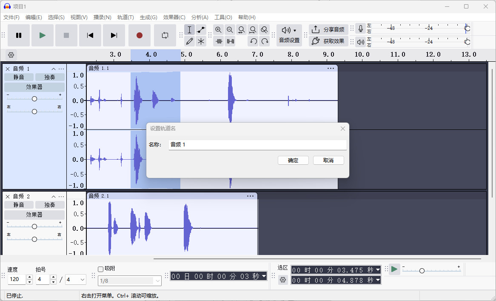


 使用每条音轨上的“音轨”菜单将歌曲标题输入为音轨名称。在导出时，当所有音轨导出为可刻录到 CD 的文件时，每个文件都会采用音轨名称。使用单曲的单独 Audacity 音轨的优点是更容易重新排序，并且可以一次性调整音量水平。当所有歌曲都在一条音轨中时，归一化操作不会将较安静的歌曲提升到与较响的歌曲相同的音量。任何差异必须逐首歌曲进行纠正。但是，当多个音轨被归一化时，它们都会在一步中提升到相同的音量水平。 


##### Audacity 设置

首先，在选择工具栏中为 CD 音频设置正确的帧率，如图 3-2 所示。这可确保您进行的任何分割都将在 CD 帧的起始和结束处进行。任何落在这些帧之外的音频都会丢失，并可能产生点击噪声。您可以选择 hh:mm:ss CDDA 帧（75 fps）或 CDDA 帧（75 fps）。前者显示时间加上 CD 帧，后者仅显示 CD 帧。勾选“对齐到”框以确保停止和开始总是位于 CD 帧边界上。 


 然后在“编辑 > 首选项 > 质量”对话框中设置您的质量偏好，采样率为44,100 Hz，位深为32位浮点。红皮书CD音频标准是16/44.1，但如果您的硬盘空间足够，使用32位浮点工作有许多优势。它提供了最大的动态范围，这意味着噪音更少，并且编辑空间更大，因此您可以进行大量处理而不会损失质量。如果您想节省硬盘空间，尤其是在进行最少编辑的直接复制时，使用16/44.1录音也可以正常工作。您操作越多，使用32位浮点处理就越好。在首选项菜单中，您还可以查看以下选项： 


* 在“录音”选项卡上，取消勾选“Overdub: 在录制新曲目时播放其他曲目”和“Software Playthrough: 在录制或监听新曲目时收听”。

* 在“导入/导出”选项卡上，勾选“导出前显示元数据编辑器”。

* 确保录音通道数量设置正确（设备选项卡），应为双通道立体声。即使是老式单声道唱片也使用两条轨道。 


##### 录音

然后点击 文件 > 另存项目，并为你的项目命名，启动你的唱机，并设置录音电平。你有足够的余量，所以给自己留些空间以避免削波。使用 32 位浮点深度意味着你可以录制到峰值为 −24 dB，而仍然拥有比你的硬件能使用的更大的动态范围；我通常录制到峰值为 −9 dB，因为唱片不像现场表演那样不可预测。如果它突然出现超级响亮的段落，我可以轻松重新录音。点击 查看 > 显示削波，Audacity 会用鲜红色的线条标出任何削波。然后点击录音按钮并开始播放你的唱片。除了一直放松享受音乐，直到需要翻到唱片的另一面之外，没什么需要做的。点击暂停按钮在翻转唱片时暂停录音。每次点击录音，它都会开始一个新轨道，因此使用暂停可以在同一轨道上继续录音。如果你不小心点击了停止，可以按住 SHIFT 并点击录音来追加到现有轨道。录一些噪音是个好主意，例如在唱片开始前的开头以及音乐停止后的结尾，这样你之后可以进行有效的噪音去除。最好是没有音乐的纯噪音样本。将其保存在单独的轨道中。 


##### 修复缺陷

首先进行粗略修剪以删除任何不需要的部分。不要剪得太紧，要留一些余量，然后再进行精细处理。修剪掉曲目中不需要的部分很容易；只需选择你不需要的部分并按 DELETE 键，或者点击剪切按钮。另一种删除的方法是选择你想保留的部分，然后点击修剪按钮。这会保留你的选择并删除其余部分。删除曲目的某一部分会使其变短，有时你可能不想这样做，而是想保持原长度。可以通过静音而不是删除来实现：选择你想要去掉的部分，然后点击静音按钮。这会使其静音而不移除，曲目长度保持不变。下一步是修复任何削波或划痕。缺陷通常只出现在一个声道。这在黑胶唱片中更为常见，因为唱针是被唱片沟推动的，所以推动唱针向内的一侧会磨损更多。磁带也会不均匀地磨损，因为一个轨道位于“内侧”，远离磁带边缘。最靠近边缘的轨道会受到磁力、电场以及磁带导轨造成的物理损伤的影响最大。 


> 注意
>
> 轨道的定义有点模糊。音轨可以是单声道轨道，或双声道立体声轨道，或者是在包含多首歌曲的长轨道上的单首歌曲。 


要修复仅一个通道的缺陷，请在轨道面板中使用“拆分立体声轨道”命令，将立体声轨道分成两个单独的轨道。然后您可以分别编辑每个轨道，并在完成后使用“合成立体声轨道”将它们重新合并。将它们分开的一个好处是，未受损的轨道可以掩盖另一个轨道中不完美的修复部分。 


你知道你可以插入静音吗？如果你需要填充音轨让它稍微长一点，或者需要插入一个静音间隙，首先单击以标记你想要插入静音的位置。然后点击 **生成** > **使静音**，输入你希望的长度，然后点击确定。新的静音部分将插入到标记的右侧。图 3-3 显示了如何创建一个两秒的静音。请注意，它包含一个下拉菜单，就像选择工具栏一样，里面有各种不同类型的值可以使用：秒、时/分/秒、不同的帧率等。 

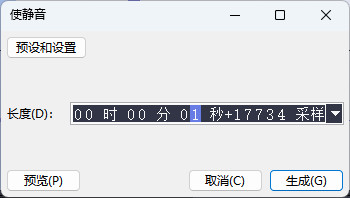


###### 淡入淡出

在录音中经常会使用淡入淡出。在图3-4中，我删除了一段冗长乏味的掌声，只留下大约三秒的空白，然后使用包络工具优雅地淡出到静音，然后再淡入。包络工具可以让你对淡入淡出和音量水平有很大的控制。小白方块是控制节点。通过点击你希望的位置来创建新的节点，向任意方向拖动它们以提高或降低音量，拖到轨道边界之外可以删除它们。几乎所有音频编辑应用程序中都配备了包络工具。 


另一种应用淡出的方法是使用“效果 > 淡出”和“淡入”。选择你想要淡出的音轨部分，点击“效果 > 淡出”或“淡入”，它会自动为你应用一个平滑、均匀的淡出或淡入。你唯一能控制的是淡出的长度。一些刻录 CD 的应用程序会自动在音轨之间创建一个两秒的间隔，所以要注意。在现场演出中，你可能不希望歌曲之间有间隔，或者不希望在你在 Audacity 中创建的淡出上再加一个间隔。优秀的刻录 CD 应用程序允许你控制这种行为。 

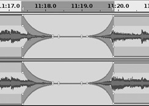


###### 修复唱片翘曲

Audacity 无法修复翘曲的唱片。高质量的唱盘在播放翘曲唱片时，比低预算的唱盘追踪得更准确。许多操作指南建议通过仔细加热唱片使其软化来平整翘曲——可以放在烤箱里、阳光充足的窗边或温暖的车内——然后将唱片放入干净的纸套中，并压上重物。我尝试过在温暖的车内加热的方法，因为使用烤箱让我感到害怕，如果小心并注意保持一切清洁，有时这种方法效果不错。把杂物压入柔软、温暖的黑胶中不会改善情况。你可以使用 Audacity 缓解翘曲唱片产生的一些噪音，如点击声、噼啪声和嘶嘶声；请参见下一节。 


修复跳针和爆音

你可以通过查看波形很容易地找到因划痕或变形引起的任何跳针或爆音，如图 3-5 所示。它们表现为突然的、细长的峰值。效果 > 点击移除 在批量去除点击声而不移除音乐方面效果相当不错。它会寻找波形中典型的划痕引起的爆音的尖峰，删除这些划痕，然后进行一些插值以重建波形。选择阈值设置决定了判断尖峰是否为划痕的灵敏度。较小的选择阈值更敏感，较大的值则不那么敏感。灵敏度过高意味着你想保留的内容可能会被识别为点击声并被移除，例如某些打击乐效果。 

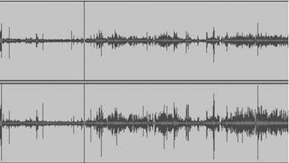


 最大尖峰宽度值决定了点击消除工具将移除的段落的最长长度，单位为毫秒（ms）。默认值是 20 毫秒，这比大多数划痕都要长。选择带有一些划痕的曲目的一小段进行尝试，通过点击消除效果的预览按钮可以快速进行一些试验和调整。听预览，如果听起来不对，改变设置再试一次。默认设置已经相当不错，一旦你对设置调整满意，就可以将其应用到整首曲目。 


> 注意
>
>  默认的预览长度是三秒。如果这太短，请打开“编辑 > 首选项 > 播放 > 预览长度”对话框并将其延长 


 如果只有少量的点击或爆音，你可能想手动修复它们。这并不需要很长时间。一种方法是选择“效果 > 放大”并将其降低到 −50 dB，这样可以将其静音。另一种方法是使用“修复”工具，它更具针对性。放大直到你可以看到单独的采样，选择要操作的片段，然后点击“效果 > 修复”。修复工具最多操作 128 个采样点。就像点击去除工具一样，它使用插值来减小并平滑修复片段的边缘，因此不会留下空隙。（图 3-6 显示了修复前后的效果。） 

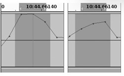


> 注意
>
>  记住缩放工具——你可以放大波形，足够看到单个样本，并给自己留下充足的空间进行精确编辑。为了在缩放时保持位置，请点击标记轨道上的位置，缩放工具将自动以你的标记为中心。 


 查找和修复削波 使用“视图 > 显示削波”可以快速找到任何被削波的片段。削波是当录音的音量超过 0 dB 时产生的。在数字音频中，削波很糟糕，因为它会导致失真。修复短暂削波片段的简便方法是使用增益效果。放大并仔细选择被削波的片段，然后选择“效果 > 增益”将其降低一到两个档次。增益设置使用负值，例如 −3.0。1 分贝大约是我们能够感知的最小变化量，每增加 3 分贝音量翻倍，减小时音量减半。因此，−3 dB 的音量是 0 dB 的一半，−6 dB 的音量是 −3 dB 的一半。持续几秒以上的削波段应重新录制。 


 降噪 黑胶唱片，即使在最好的系统上，也从未完全无声。总会有某种背景噪音：嘶嘶声、唱盘低沉声、由静电或黑胶压制缺陷引起的轻微划声。打开效果 > 降噪效果以去除这些不需要的噪音。它并不完美，总是在去噪和不对音乐造成过多损害之间需要权衡。当你有一个好的噪音预设文件且噪音与想保留的声音明显不同的时候，它效果最佳。首先你需要建立一个你想去除的噪音的预设，所以选择你曲目中只有噪音的几秒钟，例如在唱针在唱片上滑动但没有播放音乐的开头或结尾部分。 


 噪音采样越长越好，从5秒到30秒不等。选择你的噪声样本，然后在“降噪效果>消除”对话框中点击“获取降噪配置文件”按钮。接下来，选择你想应用降噪的片段并点击确定。你可以用预观看按钮确认它正常操作，然后按下确定键。尽可能精准地使用降噪效果，以减少副作用。嘶嘶声、哇声和长笛声、嗡嗡声以及低频的刮擦都是常见缺陷，如果你有一个干净的噪音样本，降噪工具效果很好。如果结果不满意，按CTRL-Z撤销，修改一些设置，再试一次。默认降噪电平为−24 dB，这意味着被识别为噪声的段会被衰减−24 dB。如果删减了太多录音，可以减少录音再试一次。类似的策略是，十个效果不错，是回到你的噪声样本，把振幅降低几dB，创建一个新的配置文件，然后再试一次。你不想完全抹去噪音，因为这可能会抹去你想保留的东西，只要把它调到不打扰的程度就行。频率平滑和攻击/衰减时间滑块在向左移动时会更偏向AG渐进，而在刻度右侧则不那么激进。频率平滑值越大，意味着它将更广泛的频率范围视为相同，因此变化更大。Attack是指音符被击打的力度，衰减则是音符渐渐消失所需的时间。因为只有一个攻击/衰减时间滑块，攻击和衰减时间总是相同的。数值越小越明显，数值越大，越接近学界。 


 另一个巧妙的技巧是使用均衡效果（参见第11章以了解更多信息）通过降低500 Hz以下和15,000 Hz以上频率的振幅来减少嘶嘶声或隆隆声。当然，这也会影响你希望保留的这个范围内的任何声音，所以它并不总是最佳解决方案，但这是可以尝试的另一种方法。你可以在含有不想要噪音的任何频率范围内尝试这个方法。限制频率范围的另一种方法是使用高通或低通滤波器。高通滤波器阻挡低频并允许高频通过，而低通滤波器阻挡高频。你可能需要安装一些插件来为Audacity获取高通和低通滤波器；在你的效果菜单中查看系统上安装了哪些插件。（第11章说明了在哪里可以找到插件以及如何安装插件。） 


##### 自定义动态范围压缩

 你可能希望调整录音的动态范围，以便在不同环境中更舒适地聆听。因为在嘈杂的环境中（如车辆中或工作时）听动态范围宽的录音意味着声音总是太大或太小，你可以通过动态范围压缩器来改变这一点。压缩器在音频制作中经常使用。我认为它们被过度使用，但 Audacity 的好处是你可以根据自己的喜好进行调整。 

 压缩器通常会衰减较响的频率，从而减少柔和和响亮段落之间的差异。一些压缩器还会增强较安静的频率。“压缩动态范围”在第240页详细介绍了如何将压缩应用到你的录音中。 


##### 标准化

现在您已经完成了修复，是时候对整张专辑的音量进行归一化了。如果您将所有内容复制到单一的 Audacity 音轨中，请选择整个音轨，然后应用效果 > 归一化。这不会影响动态范围或音频质量；它所做的只是提高整体音量水平。将最大振幅设置不高于 0.0，这是数字音频的最大值，并确保勾选“去除任何直流偏移”。直流偏移指的是平均振幅。如果不是零，则归一化将无法正确应用，因为振幅水平会不平衡，甚至可能产生一些轻微失真。完成后，您就可以进入下一部分。如果您将每首歌放入单独的 Audacity 音轨，请按 CTRL-A 选择所有音轨，然后应用归一化。然后跳至第 64 页“导出到 CD 准备文件，多音轨 Audacity”继续操作。 


##### 将一条长曲目分割为单独的歌曲

如果你把所有内容复制到一条长曲目中，你可以将其导出为16位WAV文件，然后再复制到CD上。但你不会有单独的歌曲；相反，你会得到一条长曲目，无法在歌曲之间跳转。下面是如何将其分割为单独歌曲的方法。从最开始的位置开始；通过按HOME键确保你正好在曲目开头。然后按CTRL-B。这将在你的专辑曲目下创建一个新的标记轨，并且光标会在一个小文本框内。在这个小框中输入第一首歌的名称，然后按ENTER。然后点击你希望第一首和第二首歌曲之间断开的地方，按CTRL-B，并输入第二首歌的名称。继续操作，直到所有歌曲都有其名称标签（图3-7）。 

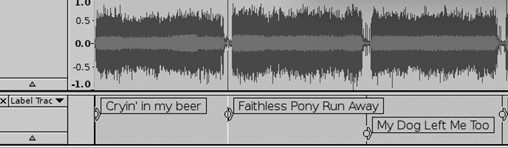


##### 导出为 CD 就绪文件，单个长的 Audacity 音轨

如果你已经将所有歌曲复制到一个长的 Audacity 音轨中，以下是如何将它们导出为单独的 CD 就绪音频文件。首先打开 文件 > 打开元数据编辑器，并输入专辑标题和艺术家姓名，以及你希望保存在音轨元数据中的其他信息。保持音轨标题和曲目编号字段为空，因为 Audacity 会为你自动填充这些字段。接下来，转到 文件 > 导出多个，并选择导出格式：WAV (Microsoft) 有符号 16 位 PCM。你将会看到一个类似于图 3-8 的窗口。我建议导出到一个单独的目录，而不要将导出文件与 Audacity 项目文件混在一起。选择“根据标签拆分文件”和“命名文件：使用标签/曲目名称”的单选按钮。仅在你确定希望新导出文件替换同名旧文件时，勾选“覆盖现有文件”框。点击确定，你就可以开始导出了。 

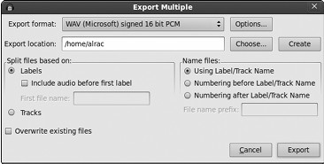


如果你按照我的建议在“编辑 > 首选项 > 导入/导出”对话框中启用了“导出前显示元数据编辑器”，元数据编辑器将在每首歌曲导出时出现。如果你不需要查看每首歌曲的元数据，可以关闭它。 


##### 导出到准备刻录的 CD 文件，多轨 Audacity

如果你将每首歌曲复制到一个单独的 Audacity 轨道，这是将它们导出为单独的 CD 准备音频文件的方法。首先打开 文件 > 打开元数据编辑器，并输入所有曲目共有的信息，例如日期、类型或艺术家姓名。曲目标题和曲目编号字段保持为空，因为 Audacity 会为你自动填写这些内容。接下来，进入 文件 > 导出多个，并选择导出格式：WAV（Microsoft）有符号16位 PCM。你将看到类似于图 3-9 的窗口。我建议使用一个单独的目录，并且不要将导出的文件与 Audacity 项目文件混在一起。选择“根据标签拆分文件”和“命名文件：使用标签/曲目名称”的单选按钮。仅在你确定希望新导出的文件替换同名旧文件时，勾选“覆盖已存在的文件”框。点击确定，你就完成了。最终，每首歌都会在一个单独的文件中，且你创建的曲目名称将成为文件名。 

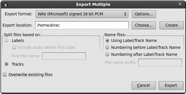


##### 将歌曲写入光盘

现在你已经有了一批不错的独立WAV文件，每首歌对应一个文件。使用你喜欢的CD刻录软件将歌曲刻录到光盘上，就完成了。不要以最大速度刻录，而要降低到一半速度，以确保获得优质的光盘。务必选择“新建音频项目”，或者你所使用的软件里制作音乐光盘的相应选项，因为这会创建符合Red Book音频标准的光盘。不要制作普通的数据光盘，否则在标准CD播放器中（如车辆或家庭音响系统）将无法播放。标准CD播放器无法播放WAV文件。（计算机CD播放器几乎可以播放所有格式，因为都是通过软件媒体播放器实现的。）注意歌曲轨道的顺序——你的光盘刻录软件可能会按字母顺序排列歌曲，而不是按轨道顺序。一种快速排序的方法是按日期排序，如果你的光盘刻录软件支持此功能，因为第一个导出的歌曲总是最早的，最后一个是最新的。如果你有支持在CD和DVD上打印的喷墨打印机，可以使用专门设计用于打印的CD空白光盘。这类光盘有白色或银色的一面，可用于墨水打印且不会晕染。另一种新型可打印的CD/DVD需要特殊的热感打印机，大约需要花费100美元购买。第三种可打印光盘类型称为LightScribe，需要特殊的CD/DVD刻录机。这些设备价格与普通CD/DVD刻录机相当，大约50美元。 


```
“我需要购买特殊的音频光盘吗？”
对于这个常见问题的回答是否定的。所有的光盘类型完全相同。一些国家对“音频”光盘征收税，这笔税款据称用于补偿音乐人因非法复制而可能损失的收入。（如果他们真的能公平地获得这笔税款，我宁愿吃掉我最喜欢的黑胶唱片。）它们的另一个特殊之处在于压制的数据标志，这是串行复制管理系统（SCMS）的一部分，用于控制受保护材料的复制。SCMS编码控制三种状态：允许复制（00）、只允许一次复制（11）、禁止复制（10）。它不会阻止你复制原始光盘。如果设置了“只允许一次复制”标志，可能会干扰将复制品写入连接到Hi-Fi系统的CD刻录机。计算机硬件和媒体免受要求SCMS的法律约束。我使用普通的非音频光盘空白盘，在所有CD播放器中都能正常使用。
```


##### 复制老式78转唱片

老式78转唱片是指大约从1890年代到1950年代末期制作的单声道唱片的简称。这些唱片也叫短片唱片和宽槽唱片。在20世纪30年代初之前没有真正的行业标准，所以较早的唱片播放速度各不相同，从每分钟60转到130转。老式78转唱片是由虫胶混合染料、填充物和其他材料制成的，尺寸也各不相同，最大可达16英寸。有些唱片是层压的，如果遇水会分开。酒精会溶解虫胶，过高的湿度也会损坏它。乙烯基LP，不论单声道还是立体声，播放速度为每分钟33 1/3转，单曲唱片的播放速度为每分钟45转或78转。是的，在很久以前确实有过78转单曲唱片；例如，这些在1960年代初期曾受到迪士尼的青睐。你可能还会找到一些45转的LP。这两者与老式78转唱片的主要区别在于：它们是由乙烯基而非虫胶制成，并且采用微槽而非宽槽切割。宽槽唱片需要3毫米的唱针，而微槽唱片使用1毫米的唱针。你可以用现代立体声唱头和唱针播放老式单声道LP和单曲，但不能播放老式唱片。有一些专门用于播放这些老唱片的现代唱头和唱针，例如流行的Shure M78S。我不是老式78转唱片的专家，但如果你需要有关正确储存、操作和播放这些老唱片的更多信息，网上和现实中有很多优秀的资源。有许多老唱片的专家、爱好者和交易者，所以找到一些专业指导并不难。 


 一旦你整理好所有硬件并确保安全操作后，在 Audacity 中有一些事情需要你采用不同的做法。打开 编辑 > 首选项 > 设备 对话框，将录音通道数设置为 1（单声道）。然后转到 编辑 > 首选项 > 导入/导出 并选择“使用自定义混音”。这样做的原因是将你的单声道轨道混合为两个通道，这样你在立体声系统上就能从两个扬声器中听到音乐。如果不这样做，你将只从一个扬声器播放。图 3-10 显示了 Audacity 混音器面板的样子：移动底部的滑块以创建两个输出通道，然后点击“音频轨道”（或你给轨道起的名字）和“通道：2”将它们链接在一起。 


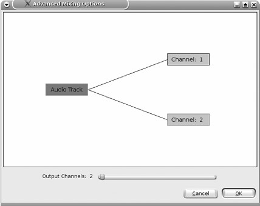


##### 将传统设备连接到您的电脑

有多种方法可以将唱机和其他传统组件连接到您的电脑。首先，让我们谈谈连接器。如今，插头、端口、插座和插孔这些术语被随意使用。为了保持清晰和简洁，我将把电缆和适配器上的连接器称为插头，而它们插入的地方（例如功放上的RCA和TRS插座）则称为插孔。此外，为了遵循标准术语，我将根据性别将插头和插孔分别称为公头和母头。这在使用性别转换器时尤为重要，性别转换器是用于将一种连接类型转换为另一种的适配器。 


 以前大家都用1/4（6.3毫米）TRS插头，生活很轻松。随后厂商开始生产1/8（3.5毫米）迷你插孔和插头，以及更小的3/32（2.5毫米）微型迷你插头。它不会影响你的设备，因为有适配器可以适应各种情况。事实上，带迷你插头的设备通常会配备1/4插头，你也可以买到能把1/4插头装进迷你插孔的适配器。只要确保你有一个匹配合适的适配器，无论是单声道还是立体声。单声道TRS插头有一个黑色绝缘环，立体声插头有两个。幸运的是，RCAaudio的连接器依然和以前一样。RCA插头有五彩缤纷的颜色，每种颜色都有平均音程：红色代表右声道，白色表示左声道或单声道声道，其他颜色代表不同的环绕声声道。它们都一样，所以用“错误”颜色也没关系。只有一种尺寸。它们也被称为唱头塞。第37页图2-7展示了各种TRS插孔、适配器、公母RCA连接器以及双RCA转单立体声插头适配器。适配器价格便宜，而且你总是需要它们，所以买一个适合各种场合的手提包。我最喜欢的数字化传统媒体方式是将立体声放大器或接收机连接到模数/数模转换器（ADC/DAC），然后再连接到计算机。然后，连接到放大器的所有组件——唱盘、磁带机、收音机调谐器、VCR、CD、DVD——都可以在Audacity中录制。（CD和DVD可以直接在电脑上播放和复制;详见第5章了解如何操作。）你电脑上可能已经装了ADC/DAC——你的计算机声卡。如果有线路输入端口，你应该用那个。这些是浅蓝色的1/8立体声插孔。根据你的功放或接收机，你应该有一对标准的RCA输出端口可以连接到声卡，通常称为录音输出或线路输出。翻回第34页图2-2，可以看到我珍爱的老Pioneer放大器背面。所以，把我的功放连接到内置电脑声卡需要一个两个RCA转1/8立体声迷你插头适配器，就像图3-11所示。环绕声家庭影院接收机，使用你的手册，找出最佳录音输出。比如，我有一台Onkyo 5.1系统，配有一对RCA磁带输出，就像我以前的Pioneer功放一样。你必须用遥控器选择正确的输出通道，然后它会录下当前播放的内容。 


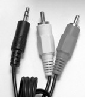


 我最喜欢的录音接口是 M-Audio MobilePre USB，它是一个集成了麦克风前置放大器和 ADC/DAC 的设备。这可以替代电脑的内置声卡。MobilePre 支持多种不同的连接器，因此我可以使用双 RCA 转 1/8 适配器，或者如图 3-12 所示的双 RCA 转双 1/4 TRS 适配器。 


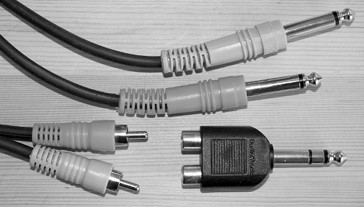


##### 将唱盘连接到电脑

除了通过连接电脑的放大器外，还有几种方法可以将唱盘连接到电脑。一种流行的方法是使用USB唱头前置放大器，这样你可以将任何唱盘，甚至是珍贵的旧唱盘，直接连接到电脑。事实上，你可能想找一台老式唱盘，而不是现代唱盘，因为很难不花大价钱就匹配那些老唱盘的质量。你可以用便宜的价格买到不错的USB唱头前级，比如ARTUSBPhonoPlus V2，价格大约100美元。它包含增益控制、剪辑ping指示器、显示器端口、USB端口、RCA输入输出、光纤端口以及S/PDIF端口。ADC/DAC运行于16/44.1和16/48。它甚至包含一个唱头接地接口，对于带接地线的Turnta Ble来说是必备的。如果不接地，会发出烦人的嗡嗡声。你需要的是唱头前级，而不是普通的前级，因为唱头前级会应用RIAA的均衡曲线校正。这非常重要。RIAA均衡曲线是业内标准，用于在黑胶LP中衰减低频（低于500 Hz）并提升2120 Hz以上的频率。黑胶唱片必须这样录制，否则低频沟槽会占据专辑大部分时间，导致播放时间缩短，高频几乎听不见。当你播放黑胶唱片时，你的中置放大器或接收机会通过内置的唱头前置放大器来校正这种不平衡，该放大器会反转RIAA曲线。声音很单薄，几乎没有低音，你只要关掉音箱，把耳朵贴近唱头播放，就能听到这种感觉。 


> 注意
>
>  放大器和接收器之所以被称为一体机，是因为前置放大器已集成其中。接受独立前置放大器的放大器和接收器通常仍然带有集成前置放大器。在音频组件的奇特世界中，你可能会花更多的钱购买一个没有集成前置放大器或收音机调谐器的空白放大器。我见过的最贵的立体声音响放大器有一个完全空白的前面板，只有一个电源开关、电源指示灯和音量旋钮。 


 RIAA 均衡曲线自大约 1955 年开始被广泛采用，因此之前的唱片可能使用不同的均衡曲线。如果你想尝试自己手工制作均衡校正，可以在 Audacity 中进行。Audacity 还提供了一些预设的均衡曲线，例如 Columbia LP、AES、Decca 和 RCA。使用普通前置放大器而不是唱机前置放大器，以获取未经校正的信号，将你的唱片复制到 Audacity 中，然后应用你自己的均衡设置。图 3-13 显示了 Audacity 中 RIAA 曲线均衡器的样子。 

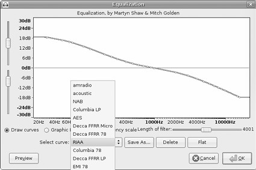


 正如前面提到的，将唱盘连接到录音接口的一个好方法是，将唱盘按常规方式连接到立体声接收器或放大器，然后将接收器连接到计算机的录音接口。另一个值得考虑的选项是购买带有内置唱机前置放大器的USB唱盘。随着越来越多的人想尝试将自己的唱片转换为CD，这类设备越来越受欢迎。这是一个很好的概念和便利，但其中许多质量并不太好，所以购买时要谨慎。我自己的个人唱盘是Audio-Technica AT-PL120。这不是一台几十年历史的复古唱盘，而是一台全新的直驱三速唱盘，带有内置唱机前置放大器。没错，它支持33 1/3、45和78转。它被设计为DJ唱盘，因此配备了椭圆形唱针，可用于正向和反向播放唱片。（天哪！我才不会对一张完美的LP做那种事呢！）它具有可调速度、音高、反滑和可调支脚，像一台好唱盘一样稳重。内置前置放大器可切换，因此你可以直接将其连接到录音接口，或者关闭内置前置放大器后连接外置唱机前置放大器。如果你想播放老式78转唱片，需要购买特殊的唱头和唱针，比如Shure M78S宽槽单声道唱头。 


> 注意
>
> 我们出色的技术顾问Alvin指出，广播DJ使用直驱唱盘是为了可以倒转唱盘：“你手动调整唱片，这样你就知道歌曲从哪里开始，然后将唱片倒转四分之一圈。当你在那些唱片机上按下‘播放’时，唱盘将在四分之一转的状态下全速旋转。” 


 图 3-14 显示了我在家的个人设置。我通过我的 M-Audio MobilePre USB 同时进行录音和播放。 

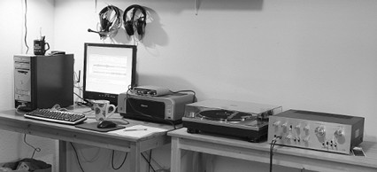


###### 连接磁带机

磁带机可以直接连接到您的电脑。只需使用适当的适配器将它们的RCA输出插头连接到您的录音接口。您的录音接口可能已经有RCA输入。 


##### 哪种更好：黑胶、磁带还是 CD？

关于哪种音质更好——黑胶唱片还是 CD——有无休止的争论。我从很小的时候就开始喜欢音乐，那时还是卷盘式磁带和黑胶唱片的年代。我爸爸是一名交响乐音乐家和音乐教师，直到今天，我都觉得他没有承认18世纪之后的音乐。（开个玩笑，爸爸！拥抱！）我认为 CD 是最棒的。在 CD 出现之前，许多想要保护黑胶的音乐爱好者会新购的黑胶唱片只播放一次，然后复制到磁带上。 

 购买商业录制的磁带没有用，因为它们的质量较差。 

 他们使用了最便宜的磁带，因此饱受嘶嘶声、动态范围狭窄以及整体音质粗糙的困扰。到70年代初，商业录制的卷式磁带几乎从市场上消失，因此如果你想要高质量的磁带录音，就必须自己动手制作。对于不熟悉音频磁带和LP的人而言，这听起来可能有些繁琐，但这两种媒介都有不足之处，没有一种能提供完全令人满意的解决方案。LP更容易跳过曲目，而且比卷式磁带更易于操作，但几乎不可能保持干净且不受损。它们存储的音乐量都不大。一张黑胶LP每面可容纳16到24分钟的音乐；现代舞曲LP由于低音冲击力极强，凿出更宽的沟槽，因此每面只容纳12分钟或更少。别提使用唱片自动换片机——那是给喜欢把唱片弄坏的人准备的。一卷常用于家庭录音的1/4英寸、7英寸、1200英尺长的卷式磁带，在3.75英寸每秒（ips）速度下可容纳每面64分钟，7.5 ips速度下可容纳32分钟。（相比之下，专业录音是在15和30 ips速度下制作的。）两者都不易携带，而且无法在汽车中播放。盒式磁带革命性地改变了家庭和便携音频。它们在音质、便携性和成本之间达到了良好的平衡，比卷式磁带或LP更耐用。你可以在任何时刻停止盒式磁带并将其从播放机中取出，而卷式磁带则不容易做到这一点。家庭用盒式磁带的播放速度为1 7/8 ips，磁带宽度为0.15英寸。音质不及LP和卷式磁带，但如果你有一台好录音机，并使用高质量的II型或IV型磁带，效果相当不错。每当我买新车（对我而言是新车），我做的第一件事就是安装一套好的音响系统。我进行过许多长途旅行，因为我喜欢外出，而带上一大箱音带使这些旅行更加精彩。盒式磁带有多种尺寸，我喜欢90分钟的盒式磁带，因为可以在一盘磁带上放两张LP。带自动反转功能的双槽盒式磁带机可以连续播放180分钟的音乐。更大的尺寸，如120分钟磁带，过于薄且易碎，无法使用。较薄的磁带容易拉伸；高质量60分钟磁带最厚，拉伸损失最少。 


 盒式录音机是音乐爱好者的救星。我和朋友喜欢制作和交换混音磁带，因为即使在很久以前的我年轻时候，商业广播也相当糟糕，总是不断播放同样的前二十名歌曲，广告比音乐多，还有那些打断音乐的恼人主持人。所以，交换混音磁带是发现新音乐的一个绝佳方式。另一件很酷的事情是，我们可以只复制自己想要的歌曲，而不必忍受困扰大量流行音乐的填充歌曲。考虑到音乐产业在不断企图满足顾客需求却屡屡失败，它还能存活下来实属令人惊讶。大型唱片公司的老板们应该每天都感谢那些能找出解决方法，从而享受商业制作音乐的坚定顾客，而不是完全放弃它的人。 


```
关于磁带的小贴士
阿尔文回忆说，磁带的生产非常宽且非常长：“最外面的边缘，以及磁带的第一段和最后一段，是质量最差的，用于最低档的音频磁带。质量较高的部分则成为较高质量的音频磁带，而最好的部分则成为用于计算的数字磁带。因此，你可以将大多数计算机磁带用于音频，我也是这样做的。那些已经坏掉的大型1/4英寸卡式(QIC)磁带，是极好的卷盘式磁带。我有一台很古老的固态安培克斯(Ampex)家用录音机，大约1969年出厂（使用晶体管，点对点布线，就像旧的电子管一样）。没有降噪功能，速度为1 7/8、3 3/4和7 1/2英寸，在使用RadioShack最便宜的磁带和最慢的速度时，它的声音比盒式金属磁带加上Dolby C降噪还要好。”
```


 磁带也被认为在传播西方流行音乐，尤其是朋克和摇滚音乐到发展中国家和东欧集团国家中起到了作用。对磁带并没有太多怀旧情绪。它们曾经有它的用途，而且仍然有人喜欢它们。但现在很难找到好的磁带，因为制造质量下降了。磁带和黑胶都不耐老化。磁带是一种磁性媒介，因此可能会被杂散磁场破坏。磁带比黑胶更不容易积灰和划伤，但两者都会受到物理磨损。如果小心处理和存放，两者都可以保存几十年，但令人遗憾的事实是，你越是播放和欣赏它们，它们就越容易磨损。它们不会突然变得无法播放；通常是高频先损失，并随着时间推移像洗过太多次的衣物一样逐渐衰退。 


###### 数字优势

黑胶爱好者声称它的声音更温暖，更贴近真实声音，并且具有更宽、更准确的动态范围。CD爱好者则声称，黑胶唱片爱好者怀旧的是播放黑胶唱片所带来的所有氛围：唱机发出的声音、灰尘和划痕带来的表面噪音、翻转唱片听另一面的声音，以及为保持黑胶唱片良好状态所需的一切繁琐操作。我怀念黑胶唱片附带的封面艺术、海报和大尺寸的说明书——小小的CD盒子是做不到这些的。但无论你多么小心地保持黑胶唱片清洁、仔细操作、保持唱针清洁、以及保持唱臂的最佳平衡和跟踪，仅仅播放它们就不可避免地会造成磨损甚至损坏，因为你是在用摩氏硬度为10的钻石唱针在摩氏硬度为1的表面上摩擦。 


 有些黑胶唱片保存得比其他的好，因为它们被设计得更专业。黑胶黑胶唱片最初是母带。这些会被复制到主盘上，母盘由金属或漆制成。录制唱片是一种妥协的手段。安静的段落不能太安静，否则会被噪音淹没，但如果太响，沟槽会重叠产生跳音。音量越大，播放时间越短，所以工程上的艺术性和音乐本身一样多。不幸的是，并非所有黑胶都是一样的。随着行业的发展，母带录音师面临诸多要求，他们常被要求制作母带同时作为磁带母带，甚至被剪辑成广播播放。乙烯基本身变得更薄。换句话说，最低公比亚名的纳特尔露出了平庸的头。老LP之所以受欢迎，是因为它们是“被打赌”的。CD拥有大部分技术优势。数字音频最大的优势是复制品与原件相当。但ana log audio则不然，每代都会损失一些东西。当你看到一份复本的复本时，你会知道它和原版相距甚远。ACD的动态范围高达96 dB，而最好的黑胶唱片大约能提供75 dB，更常见的是50多dB。因此，CD提供了极佳的信噪比，还有即使是最好的黑胶系统也难以实现的——静音段落中的绝对寂静。诚然，这种绝对的寂静很大程度上是理论上的，因为音频链中可能会产生一些声音——一点嗡嗡声，一点电流干扰——但CD本身是完全静默的。黑胶在频率范围上胜出，算是——如果你有足够好的设备（这会让你成为稀有、富有且精英的发烧友），它能捕捉高达70到75 kHz的频率，那就是蝙蝠飞翔的地方。更常见的是，它属于10 Hz到25 kHz的范围。在现实世界中，大多数音频硬件设计时都考虑了20到30kHz的最高频段限制。人耳可以检测到高达25 kHz的频率，而感知范围为50 kHz。如果你有东西在45 kHz频率下以115分贝的声压级轰鸣，你会感到疼痛，但不知道原因。有些人认为非常高频的声音仍会以某种方式被感知，从而增强听众的享受。他们说的可能是泛音。如果你有一个100 Hz的声音，那么该声音在25 Hz、50 Hz、200 Hz等频率上也有谐波。如果削减谐波，高频声音会显得有些死板。 


 我比较过我最喜欢的一些音乐的CD和黑胶唱片，黑胶唱片上额外的噪音使它们与众不同。我能清楚地分辨交响曲中的差别——CD上的安静段落不会被划痕、嘶嘶声或隆隆声破坏，而响亮的部分则响亮且准确，没有失真。如果你想自己做比较，请确保你手中的黑胶唱片和CD都是经过精心录制的。很多唱片都是劣质的，而现代流行音乐的趋势则是把CD上的所有音量都调到最大，却完全不顾动态范围、失真、细微差别或平衡。 


```
线式录音
原始母带“磁带”是用线式录音机制作的，这种录音机使用钢丝卷作为录音介质。线式录音机广泛使用到1960年代，随后被磁带录音机取代。像1920年代的卡特家族原始录音这样的旧音乐，就是用线式录音机录制的。钢丝会生锈，音质也没什么可激动的，但它非常耐用。尽管如此，大多数旧录音都已经遗失。但并非全部！《现场铁线：伍迪·格思里1949年的表演》赢得了2008年格莱美最佳历史专辑奖。它是从线式录音恢复而来的，被认为是他唯一的现场录音表演。像许多线式录音机一样，这些录音是在自制设备上制作的，这令任何恢复过程都非常复杂。但它们已经被恢复，现在你可以在CD中欣赏伍迪·格思里的现场表演。
```


 钢琴和管风琴非常适合测试音响系统的音质，因为它们的声音难以准确重现，它们具有巨大的动态和频率范围，而且你可以很容易地判断它们的声音是否正确。尝试约翰·塞巴斯蒂安·巴赫的《D小调触技与赋格曲》；这首曲子涵盖了管风琴的全频范围，就是你在大教堂里看到的那种大型管风琴。在某个地方，一个低音踏板持续按下，以至于你的扬声器可能会明显失真。平克·弗洛伊德《月之暗面》中的《Time》测试了左右声道与真正中心声道之间的声音分离。如果你能找到原版双LP，而不是一些不好的CD重制版，吉米·亨德里克斯的《Electric Ladyland》是一件令人惊叹的录音室与艺术奇迹，它能锻炼你的音响系统，并让认真聆听获得回报。CD在方便性方面无可比拟。它们坚固耐用，播放时不会损坏，不需要不断地操作，而且易于携带。大多数CD播放器都配有遥控器，你可以按任意顺序或随机播放曲目。你可以在CD切换器中加载多张CD而不会造成损坏，并享受数小时的极致聆听体验。 


 尽管音乐产业努力阻止我们行使合理使用权并享受我们想要的音乐方式，但制作自定义混音 CD 与制作我们自己的混音录音带一样容易。原因大致相同：为了以我们想要的方式整理音乐，并发现新艺术家。（第 5 章讲述了如何制作混音 CD。）然而，现在我们还有两个过去没有的绝妙新选择，那就是卫星广播和互联网广播。它们在音质上都不算高，但在多样性和发现新艺术家方面无与伦比。商业广播电台比以往任何时候都糟糕，我以前根本不相信会出现这种情况。在成本方面 CD 也获胜。花一百美元就能买到一台性能完全令人满意的 CD 播放器。即使在过去，一套高质量的唱盘、唱头和唱针也需要数百美元，而且价格并没有变便宜。 


```
CD播放器
你可以在CD播放器上花很少的钱，也可以花很多钱。理想情况下，在购买之前，你应该能够用你自己的音响系统测试它们，特别是如果你打算购买高端型号。与所有数字音频一样，数字到模拟转换器（DAC）的质量决定了声音效果有多好，所以花更多钱可能会有所不同。如果你将CD播放器连接到有自己DAC的接收器或放大器（你会看到光纤或同轴数字输入），那就意味着你有两个DAC可以尝试。使用数字连接器意味着CD播放器会向接收器发送数字信号，而不使用自己的DAC。相反，接收器会执行到模拟的转换。使用CD播放器的RCA连接器意味着CD播放器将进行转换，并向接收器发送模拟信号。如果你拥有高端CD播放器，你可能不希望接收器干扰其输出，因此使用模拟RCA连接器。当然，这并不总是那么简单，因为在一些现代音视频接收器中，集成前置放大器会将所有输入信号进行转换，而不管它们是模拟还是数字，这很愚蠢，但事实就是如此。这并不总是有文档记载，所以你可能需要烦扰你的供应商来了解你拥有的设备。
```


 哦，别忘了防尘罩，这一直是个价格过高的额外配件。还有唱针追踪力计、唱头对准工具、专用清洁配件，等等。那么谁赢了，黑胶唱片还是 CD？很简单——你更喜欢哪一个。不要纠结于规格；重要的是音乐和你的享受。 


###### 寿命

寿命仍然是一个未解之谜。当前的数字存储状况对长期保存并不乐观，所以你最好计划定期将档案转移到新的介质上。长期数字存储存在几个问题：
第一，物理介质可能在几年之内就会开始劣化而无法继续使用。
第二，想想在过去十年或二十年里出现过又消失的所有封闭的专有文件格式，这些格式现在已经无法读取。
第三，即使你的介质保存完好，文件仍然可读，你是否拥有可以读取这些介质的硬件设备？
如果有人递给你一张5.25英寸软盘、一张Zip盘、一张3.5英寸软盘，或者一张超级软盘，你会知道该怎么办吗？
目前我们认为CD、DVD、U盘和3.5英寸硬盘是理所当然的，但它们都只是几年的历史，我们无法预测未来会怎样。 


> 注意
>
> 旧驱动器和软件可能存在商业机会。Alvin指出：“对于那些能够将数据从古老介质转移到现有介质的人来说，有市场。我有一个用于DC300磁带的Viper QIC磁带驱动器，一个Bernouli驱动器，一个Questech 40MB驱动器（它是苹果Macintosh的最爱），一个TEAC数字音频磁带驱动器（205MB存储容量），Zip和Jaz驱动器，250MB Colorado QIC，以及其他软盘磁带驱动器。” 


商业光盘是通过压制而不是像家庭自制光盘那样刻录的，由于采用了更坚固的材料并有更深的刻槽，它们的寿命通常比大多数自制光盘长。CD-R的寿命比CD-RW长；不要将CD-RW用于你希望保存一年或两年以上的内容。不同品牌之间有显著差异。Taiyo Yuden是顶级CD和DVD空白光盘制造商。Taiyo Yuden的空白光盘既有自有品牌，也出现在不同品牌名下，但二级供应商经常更换供应商，因此你不能仅凭品牌名称判断所买到的产品。真正的Taiyo Yuden空白光盘仅在日本生产。市面上存在仿冒品，所以可以在网上搜索如何辨别真品。Verbatim、TDK和Sony也被认为是好的品牌，尽管它们使用多个供应商。购买后，你可以使用diskDVD Identifier和Windows的DVDInfo，Mac的DVD Media Inspector，以及Linux的cdrecord和dvd rw-mediainfo来读取光盘ID。 


# 4

创建和编辑用于 CD 的现场曲目 


 CD 非常适合存储和分发你自己的录音，你可以使用 Audacity 为刻录 CD 准备音轨。

假设你有一些在录音室录制的或现场演出的长音轨。你可能想把它们拆分成单独的歌曲，或者剪掉歌曲之间的部分并将其拼接在一起，使其听起来像一段长而连续的现场音轨。也许你正在剪辑并拼贴几次不同录音会话中的最佳部分。也许你有多轨录音，需要混缩为两声道立体声以刻录 CD。你希望把所有内容整理干净，使其听起来尽可能好。录制现场演出具有挑战性。我会讲解几种不同的方法，从便宜且简单到更昂贵但可以对最终混音进行完全控制。然后我们将继续讲解如何使用 Audacity 为 CD 准备录音。 


> 注意
>
> 如果你需要复习如何使用 Audacity，请查看第1章。


工作流程如下：

1. 录制内容。
2. 在 Audacity 中进行清理和修复。
3. 为单曲创建歌曲标题和元数据。
4. 导出为双声道 16/44.1 WAV。
5. 复制到 CD 并享受！


最耗时的部分是修复和清理。如果不需要做太多修复，速度会很快。 


##### 制作优质的现场录音

在第二章中，我们学习了如何搭建录音室以及如何将计算机变成数字音频工作站。制作优质的现场录音比制作优质的录音室录音更难，因为有太多因素是你无法控制的。然而，这并没关系，因为你不一定追求某种技术上的完美，而是要捕捉现场的兴奋感和能量。 获取良好的双声道立体声录音相对容易，因为几乎所有音频设备都支持双声道立体声。如果你想要多声道的现场表演录音（以便更好地控制混音），那么你需要更昂贵的设备。 一个最大的潜在障碍与谁控制场地的音响系统有关。如果是你自己，那么你可以随心所欲。如果表演者或场地有自己的音响系统和技术人员，那么你需要他们的配合。 记得录下一些观众的声音，以防你需要增加一些现场氛围。你还应该录制几分钟的各种背景和观众噪音，以便后期进行噪音消除使用。你希望得到干净的噪音样本，而不与音乐或你希望保留的任何声音混合，这样才能获得最佳的噪音消除效果。 


###### 便携式数字录音机

一台小型便携式数字录音机可能会让你惊讶于它捕捉现场表演的能力。Zoom H2 是我最喜欢的紧凑型数字录音机，它内置了四个麦克风。你可以使用前面的一对、后面的一对，也可以同时使用全部四个来创建空间感、三维立体声音。Zoom 配有一个小支架，可以将其放在任何平面上，还配有一个可安装在麦克风支架上的手柄，这样你可以轻松地将其放置在任何位置（图 4-1）。它不显眼，甚至看起来像一只老式麦克风。

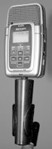

 


Zoom 有一个 1/8 立体声线路输入，这意味着你可以直接将其连接到调音台。通常在现场演出中，所有乐器和歌手都连接到一个单独的混音控制台，即使是最廉价的控制台也应该有一对立体声 RCA 录音输出。Zoom 使用一个双 RCA 转 1/8 立体声 TRS 适配器，如图 4-2 所示。 

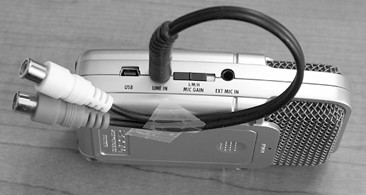


 通过连接到调音台监控端口的耳机听到的任何声音，都是你录音的实际效果，因此理想情况下，调音台上应该有一个优秀的人，保持所有通道的平衡并确保声音良好。由于所有内容已经混缩到两个通道，你的编辑选项有限，所以录音时必须正确。Zoom 还配备了一个 USB 1.1 接口，可以连接到你的电脑，因此如果你愿意，可以直接录制到电脑，而不是录制到 Zoom 的 SD 存储卡上。你不必因为我喜欢 Zoom H2 就使用它——有几十种不同的优秀便携式数码录音机可供选择，功能各异。 


使用Audacity的笔记本电脑 使用Audacity和一个不错的录音接口修好一台笔记本电脑，将其插入演出现场的混音台，你就可以现场编辑并制作CD。将原始音轨复制到USB闪存盘，提供给想自己进行编辑的表演者。如果你笔记本的内置声卡不适合，可以尝试一个好的外置USB录音接口，如图4-3所示，该图展示了一台ThinkPad和M-Audio MobilePre USB，它们已经准备好投入演出。另一种选择是使用高端PCMCIA声卡，如Digi gram VXpocket v2。Digigram的价格大约为500美元。它可以在Linux、Windows和Mac上使用；提供两个全双工通道；并且支持S/PDIF和XLR接口。 

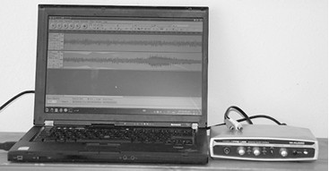


 现场表演的多轨录音 假设你想获得更多的编辑和混音控制，并且想制作一个多声道的现场录音。你该如何操作呢？需要有正确的知识和足够大的预算来支持所有必要的设备。Audacity 从版本 1.3.9 开始，可以同时录制与你的录音接口支持的轨道数量相同的音轨。较早的 Audacity 版本最多支持 16 条音轨。（参见第 9 章，了解更多关于使用 Audacity 制作良好多轨录音的信息。）没有真正了解自己在做什么之前，不要尝试这样操作，因为连接方式错误会导致音质差甚至设备损坏。如果你无法控制场地的 PA 系统，那么你将需要驻场音响工程师的配合和帮助。 这里有四种制作现场多轨录音的方法。 一种选择是提供你自己的麦克风，并为每个表演者和乐器单独设置麦克风，而不使用场地的音响系统。虽然这意味着到处都是大量麦克风和电缆，但这让你可以独立于主控台使用自己的录音设备。 更常见的选择是使用麦克风和乐器电缆分路器，使每个麦克风和乐器电缆能够发挥双重作用。这是许多专业人士录制现场音乐会的方式；他们共享通过分路器连接的麦克风，每个团队控制自己的录音台。有时这些录音台放在后台，有时则有长电缆延伸到移动录音车。这种设置非常灵活，你可以按需要添加自己的麦克风。例如，似乎有人认为没有两个人能就正确的鼓麦克风安装方式达成一致，因此他们会设立自己的鼓麦克风。 你将需要分路器、变压器、可能还需要一些电阻和配线板以及电缆，并且需要知道如何正确连接一切。你需要了解幻象电源的使用和提供者，正确顺序的连接与断开，与其他舞台和音响团队的相处，以及更多相关知识。 


 另一种选择是直接连接到支持多通道输出的混音控制台。（一个值得了解的词是“总线”——混音器的总线越多，其信号路由选项就越灵活。）这样你就不需要冗余的麦克风、分配器和长电缆。寻找直通输出、辅助发送或子组输出。有些输出会发送受混音器控制影响的信号，因此会有控制台技术人员应用的淡入淡出和特殊效果。如果你想要一个未经处理的信号，那将取决于声音控制台的功能以及音响技术人员允许你使用的功能。如果你是音响工程师并使用自己的设备，可以考虑购买多通道数字混音器，如PreSonus Studio Live 16通道FireWire数字混音器。这样你就不需要单独的ADC/DAC，也不必费心弄清楚如何将为现场演出设计的模拟调音台同时用于高质量数码录音。遗憾的是，Studio Live不支持Linux，但它对Mac和Windows有极佳的软件套件支持。这是一款超级出色的新一代混音器，设计上支持在录音室和演出大厅的多通道录音。价格约为2000美元，此外你还需要一台功放来为现场演出供电。 


###### 对音响团队要友好

对场地的音响工程师和工作人员要友好。他们是专业技术人员，需要将科学与艺术结合起来，他们会决定你的录音效果。不要表现得自以为是，因为他们不会上当。根据我的经验，现场演出的音响团队都是友好的人，只要你认真倾听、乐于助人并且不妨碍他们，他们会慷慨地分享自己的专业知识。 


##### Audacity 录音设置

我们来浏览一下在 编辑 > 首选项 中适合的录音设置。（请参阅第 13 章和第 14 章，了解如何调整您的电脑以进行音频录音以及管理您的声音设备。）首先，打开一个新的 Audacity 项目，并使用 文件 > 另存为 来保存并命名您的新项目。Audacity 在录音时无法保存更改，因此您可以利用短暂的休息时间停止录音，按 CTRL-S 或使用 文件 > 保存项目，然后使用 SHIFT 录音 从您停止的地方继续。 在 编辑 > 首选项 > 设备 选项卡中设置您的录音和播放设备，并设置您要录制的声道数量。Audacity 只会显示您的录音接口支持的声道数量。Windows 用户，请始终选择 Windows DirectSound，而不要选择 MME 作为主机，因为 MME 是过时的通用 Windows 音频接口。如果您的声卡只有一张，可以选择主要声音驱动作为录音和播放设备。如果您有多张声卡，则从下拉录音设备菜单中选择具体的录音接口（图 4-4）。（除非您使用与我相同的音频接口，否则您的选择会不同。） 

图4-4

图4-5


 你可能想在演出间隙回顾你的录音，所以请将你的播放设备设置为输出到耳机。在“录音”选项卡中，取消勾选“Overdub（叠加录音）”、“Software Playthrough（软件监听）”和“Sound Activated Recording（声控录音）”。除非出现丢帧，否则不要更改延迟设置。丢帧意味着你的CPU无法跟上，因此增加音频缓冲值，直到丢帧停止（图4-6）。“质量”选项卡上的设置（图4-7）取决于你的模拟-数字转换器支持的规格。假设你有一个模拟混音器连接到支持最高24/96（24位深度，96 kHz采样率）的高端声卡；如果你的硬盘空间足够，你可以以32位深度、96,000 Hz采样率录制，以获得最高质量。（位深在此菜单中称为“Sample Format（采样格式）”。位深是正确的术语。） 

图4-6

图4-7


我的 MobilePre 的最高支持是 16/48，所以我将 Audacity 设置为 32 位浮点/48 进行录音。设置比你的录音接口支持的更高采样率（上采样）没有意义，因为没有魔法般的音质提升。这会浪费磁盘空间并拖慢 CPU，还会损害音质。但即使使用 16 位声卡，录制 32 位浮点也有其好处，这在第 1 章中有说明。（参见第 27 页的“16/44.1、24/96、32 位浮点”了解更多质量设置。）如果你从数字混音器或带有数字输出的混音器录音，那么最大位深/采样率将由其决定。例如，Behringer Xenyx X2442USB 24 通道混音器是一个带内置 ADC 的模拟混音器，通过 USB 输出 16/48 数字信号。它可以直接连接到你的电脑，所以你不需要声卡。因此，你可以将 Audacity 设置为 32 位浮点/48 录音以获得最大音质。如果 16/48 不够好，你可以将支持更高位深和采样率的外置 ADC 连接到 Xenyx 的 RCA 模拟录音输出。 


```
在完成之前不要切换你的质量设置！
在录音和编辑的整个过程中保持相同的质量设置是最好的，直到最终导出。更改比特深度和重新采样对音质不好，所以录音被重新采样或导出为低比特深度的次数越少越好。我通常以32位浮点/48采样率录音和编辑，然后根据需要导出为不同的质量等级，例如24位WAV和FLAC以获得最高质量，或低质量的Ogg Theora或MP3格式。如果你更喜欢在较低质量等级下录音和编辑，例如16/44.1（即CD质量），同样的原则也适用：从录音到最终编辑都使用16/44.1，然后如果你需要更低质量等级，可以在导出时选择它们。44.1 kHz采样率与48 kHz之间差别不大。采样率决定你的频率范围，约为采样率的一半。44.1 kHz覆盖人类听觉范围。有时我可以听出48 kHz录音与44.1 kHz录音之间有些微差别，但必须在良好音响系统上有意识地聆听。16位和24位录音之间的差别更加明显。从高质量录音开始，然后你可以根据需要导出为任何数量的低质量格式。
```


##### 设置录音音量等级

在开始录音之前，通过点击输入电平表（图 4-8）来设置你的录音电平。由于数字录音具有很高的信噪比，也称为低噪声底，你可以设置一个较为保守的峰值电平，以应对现场表演的不可预测性。这不同于磁带录音，我们当时必须将录音电平调到尽可能高以保持噪声水平在可接受范围；在数字音频中，你不希望超过零，因为那会导致失真。我在现场演出中将峰值电平设为 −24 dB。仪表工具栏右侧有一个小把手，可以用来调节长度，左侧的把手用于将其拖动到任何你想要的位置，甚至可以移动到 Audacity 外部。 

图4-8


开始、停止和暂停录音

当你准备好开始录音时，只需点击红色的录音按钮。点击暂停可以停止录音，然后点击录音可以在同一轨道上继续。点击停止然后再录音会开始新的轨道，因此如果你本来是想暂停却按了停止，可以通过按住SHIFT再点击录音在同一轨道上继续。 


监控您的现场录音

监控录音的最佳方式是将耳机插入监听端口。例如，MobilePre 有一个零延迟监听端口，混音器上总是有监听端口。更好的录音接口有零延迟监听端口，这是您购物时值得注意的一个优点。 


##### 编辑现场录音

好吧，那真有趣！你听了一场精彩的演出，或者有了一次美妙的录音室录制会话，并且成功地记录下了一切。现在，如何把所有的精彩内容刻录到光盘上呢？

如果你使用的是数字录音机，你需要将录音机中的文件复制到你的 Audacity 计算机里。我更喜欢使用单独的存储卡读卡器，而不是将录音机直接连接到计算机，因为这通常效果更好、速度更快，尤其是在非 Windows PC 上。

任何 SD 卡或 CF 卡都应该被你的电脑识别为通用 USB 存储设备，但厂商总喜欢为使用这些卡的设备配备奇怪的、只能在 Windows 上运行的文件传输管理器。我不明白这样做的意义，因为 Windows 自带的 USB 存储设备管理完全可以胜任。

而且，许多厂商还喜欢使用 USB 1.1，而不是全速 12Mbps，而是那种极其缓慢的 1.5Mbps 版本，当你需要拷贝一个多 GB 的 SD 卡时，那真是超级糟糕。 


 无论你用什么方法，一旦你的录音被传输到 Audacity 所在的电脑上，打开 Audacity，然后通过 文件 > 打开 导入你的录音到 Audacity。然后使用 文件 > 另存为 项目 来保存这个新的 Audacity 项目，并给它一个与音频文件不同的名字。Audacity 会警告你“项目依赖于其他音频文件”（图 4-9），并询问你是否要将所有音频复制到你的项目中。点击 将所有音频复制到项目（更安全）。现在你有了原始文件和一个副本，无论你在 Audacity 项目中做什么，都不会影响原始文件。（有关更多信息，请参见第 13 页的“保存你的工作”）。 

图4-9


如果你的录音有多个文件，每个文件都创建一个单独的 Audacity 项目。我喜欢使用相关的项目名称，例如 Fiddle-Festival-1、Fiddle Festival-2，依此类推。如果你是在 Audacity 中制作的原始录音，你可以直接使用原始项目文件进行操作，这会修改原文件，或者你可以复制一份再操作。要制作副本，点击 文件 > 项目另存为，使用不同的名称保存。 


##### 编辑和混合多轨录音

如果你使用的是双声道立体声录音，可以跳过本节。本节是对多声道混合的简短回顾，因此请参阅第9章以详细了解多轨录音和混音。如果你制作了多轨录音（三轨或更多），你会比双声道立体声混音拥有更多优秀的编辑选项。每个歌手或乐器一轨道可以让你完全控制，即使由于混音器的限制不得不使用子组，这仍然提供了极大的灵活性。从Audacity 1.3.8版本开始，你可以使用全新的混音板，通过选择“视图 > 混音板”来调整每个轨道的声像和增益。Audacity中的播放效果正是你的混音效果，因此你可以准确预览你的混音。当然，如果你更喜欢，也可以继续使用每个轨道的轨道面板上的声像和增益控制。 


 编辑和修复你的音轨，无论是立体声混音还是多轨录音，方法都是一样的，我们将在以下章节中介绍。多轨音频有一些特殊的风险。其中之一是保持它们的同步。删除和添加时要小心，因为这会改变音轨的长度。另一个是降混到双声道立体声，这会将音轨合并，使音量变大，可能导致削波。第三个是“链接音轨”按钮，它首次出现在 Audacity 1.3.9 中。它可以保持标签音轨与音频音轨的同步。在项目顶部设置标签音轨对做笔记很有用，它不会与下面的音轨链接。但位于音频音轨下方的标签音轨——新建的标签音轨总是出现在这里——会创建一个包含其上方所有音轨的音轨组。默认情况下，“链接音轨”是启用的，因此如果它妨碍你的操作，只需点击“链接音轨”按钮将其关闭。更新的 Audacity 版本在你进行任何选择或时间偏移音轨时会显示链条图标，以表示“链接音轨”处于活动状态（图 4-10）。 

图 4-10


 有两种方式可以进行降混。第一种方法是点击“音轨 > 混音并渲染”，这会在你的 Audacity 项目中创建一个新的立体声音轨。然后你可以在导出前进行进一步的调整，例如创建标签、修正和其他编辑。它听起来就和在 Audacity 中的播放一样，因此当在 Audacity 中听起来正确时，就可以导出了。首先在音轨菜单中设置你的左声道、右声道和单声道的通道分配。左声道是通道1，右声道是通道2，单声道音轨会混合到两个声道。 


当你点击“轨道 > 混合并渲染”时，你的轨道会被替换为一个新的立体声轨道。如果你希望 Audacity 在不替换原始轨道的情况下创建新的立体声轨道，可以使用键盘组合 CTRL-SHIFT-M。我更喜欢第二种方法，因为我想保留我的原始轨道。然后我将新的立体声轨道复制到一个新项目中，完成编辑，然后导出。下混会合并轨道，因此它们会变得更响。确保激活“查看 > 裁剪”，这样你可以快速找到超限片段。你可能需要在下混前使用“效果 > 放大”将所有轨道的幅度降低到 −9 或 −12，然后在下混后应用“效果 > 归一化”将音量调整回你想要的位置。第二种下混方法会在导出时打开一个自定义混音器，这实际上是一个通道映射器。打开“编辑 > 首选项 > 导入/导出”，并选择“使用自定义混音”。然后选择“文件 > 导出”，你将得到一个简单的混音器（图 4-11），允许你控制通道映射。这就是你控制哪些轨道进入右声道、左声道或两者的方法。通道 1 总是左声道。 

图 4-11


这在“文件 > 批量导出”中不起作用，所以如果你想把你的下混音轨分成单独的歌曲，你必须将其重新导入到 Audacity。 


###### Audacity中的特殊CD设置

接下来你需要做的是进入选择工具栏，将时间单位更改为CD帧，即每秒75帧（fps）。这可以确保你进行的任何剪切都始于并止于CD帧。任何落在这些帧之外的音频都会丢失，并可能产生点击噪音。图4-12显示了其外观。你可以选择 hh:mm:ss   CDDA帧（75 fps） 或 CDDA帧（75 fps）。前者显示时间加CD帧，后者仅显示CD帧。勾选“捕捉到”框，以确保停止和开始总是在CD帧边界上。 

图4-12


 当你在选择工具栏时，将项目采样率值设置为 44,100 Hz。用于 CD 的音频文件必须是 16/44.1 的 WAV 文件。（位深将在导出时选择。） 


修剪

现在是清理录音的时候了。记住，你有很多不同的视图可以选择，例如 视图 > 适合窗口、视图 > 垂直适应，以及缩放工具。按下 CTRL-2 可以返回正常视图。视图 > 放大到选择范围 是一个很棒的小节省时间功能，它会将你的选择扩展到窗口宽度。同时记住，Audacity 的撤销几乎没有限制，即使是保存后的操作也能撤销。除非你关闭项目，否则你不会失去撤销历史。一个好的起点是修剪掉多余的部分。当你选择不需要的片段进行删除时，留一点余量总是好的。你总可以再修剪更多，但要把它加回来就更难了。图 4-13 中的阴影区域是一群人在讲话，我不打算保存，所以一次性全部删除。现在在歌曲的开头或中间似乎没有需要修剪的内容，所以我会先保持原样，稍后再处理。另一种修剪大量多余部分的方法是选择你想保留的内容，然后点击修剪按钮。这会保留你的选择内容，删除其余部分。 


###### 拆分立体声轨道以进行精细修复

有时，两声道立体声轨道中只有一个声道存在缺陷。如果你将其拆分为两条轨道，那么你可以仅对有缺陷的声道进行修复，然后再将轨道重新合并。这有几个优点：第二条轨道有助于掩盖不太完美的修复，而你对有缺陷部分所做的修复可能不会让另一个声道的声音更好，甚至可能会降低其音质。 

图4-13（ 使用 视图 > 适合窗口 来对显示整个轨道的粗略剪辑 ）


 要分割立体声轨道，转到“轨道”菜单并点击“分割立体声轨道”。要重新合并轨道，请在位于上方的轨道中使用“轨道”菜单并点击“创建立体声轨道”。这两个轨道必须相互相邻。 


###### 修复削波和过响的段落

查找任何削波和过响的段落并进行修复。这些会影响整个音轨的音量水平并让听众感到震惊，因此修复它们总是一个好主意。通过选择 查看 > 显示削波，可以快速找到任何削波段落。系统会用红条标记任何削波的段落。放大削波的部分，直到你能精确选择音量过高的部分，然后在效果 > 放大中使用负值，例如 −3 dB 来降低音量。重新录制削波段落效果更好，但因为你可能没有机会在现场演出中重新录制，所以使它们不那么明显是次佳方案。点击预览按钮查看声音是否正确，如果不对，修改放大值直到合适。然后点击确定使更改永久生效。 


> 注意
>
> 在“编辑 > 首选项 > 播放”中调整预览的长度。默认是三秒。 


 查找任何没有被削波的极端峰值，这可能是鼓声、突如其来的观众噪音、掉落物体、麦克风碰撞——无论是什么，都要检查并决定是否需要降低音量。如果有任何削波或过响的片段让你觉得非常刺耳以至于想完全删除它，选中它并选择 编辑 > 静音（或按 CTRL-L）使其完全静音。你可能不想删除它，因为那会使音轨变短，在多轨项目中可能会成为问题。如果该片段太长，静音会太明显，可以尝试用其他地方的片段替换这个令人讨厌的部分。为此，首先使用 编辑 > 分割剪切 删除有问题的部分，这会在删除的地方留下一个空隙。然后小心地将从轨道其他部分，甚至是不同轨道复制来的同长度片段粘贴到空隙中，只要听起来合适都可以。这可能是非常细致的工作，所以记得放大查看以便清楚地操作。信封工具适用于使用细致的淡入淡出平滑过渡，或者尝试使用绘制工具进行细致的插值处理。 


###### 噪声消除

Audacity 的噪声消除工具相当不错，但可能需要尝试几次才能做到理想效果，因为噪声消除总是伴随着副作用——消除噪声也会影响你想保留的声音。如果你想保留的声音与噪声的音量和频率相似，可能无法获得很好的效果。噪声消除在噪声与想保留的声音明显不同的情况下效果最佳。首先，你需要创建一个不需要的噪声的配置文件。这就是为什么你在现场演出时录制了各种观众和背景噪声样本，以便拥有好的样本来创建配置文件。通过选择一个 5 到 30 秒的噪声片段来创建噪声配置文件，然后进入“效果”>“噪声消除”，点击“获取噪声配置文件”。（如果你的样本时间不够长，可以通过将其复制并粘贴到同一轨道上来加倍长度。）然后选择你想要去除噪声的轨道部分，返回“效果”>“噪声消除”，点击“预览”按钮来听效果（图 4-14）。 

 噪声消除效果有三个可调节的设置：噪声降低、频率平滑和启动/衰减时间。噪声降低控制噪声的音量减少程度，因此值为−10会将其降低10分贝，而−50会将其完全消除。对于频率平滑和启动/衰减时间，将滑块向左移动会更激进，向右移动则会更温和。频率平滑的值越大，表示它会改变更宽范围的频率。请记住：启动（Attack）指的是音符的击打强度，衰减（Decay）指的是音符消失所需的时间。较小的值变化更突然，较大的值变化更平缓。当预览听起来满意时，点击确定（OK）。如果点击确定后不喜欢，可以按CTRL-Z撤销，或使用编辑 > 撤销再次尝试。 

图4-14


你可以使用来自 Freesound 项目 (http://www.freesound.org/) 的噪声样本来构建你的噪声配置文件。 这是一个合作的创意共享（Creative Commons）许可声音数据库。你几乎可以在这里找到任何东西，包括白噪声、粉红噪声和棕色噪声的样本；不良 TRS 插头连接产生的嗡嗡声；台球厅的噪声；以及更多。你也可以向该项目贡献你自己的样本。 


###### 使用动态范围压缩

明智地使用动态范围压缩是在音频编辑中一项重要技能。例如，在有多人对话的播客中，为确保各个说话者的音量水平相同，这是对听众的一种体贴。压缩也被用于改变声音的特性。例如，鼓大多是快速的峰值声音，所以使用一点压缩可以让鼓声更充实、更丰富。压缩可以让歌手或乐器在混音中“突出”，使其听起来更生动。压缩还可以帮助平衡表现不稳定的表演者，比如麦克风技巧不佳的歌手，或音量控制不良但在不合适时间音量忽大忽小的乐手。压缩能达到的效果取决于你的录音。如果你有多轨录音，每个表演者和乐器都在单独的轨道上，或者合理地分组，那么你将拥有各种编辑灵活性。如果你的录音是双轨立体声，那么你无法进行非常精细的编辑，但可以对整个录音应用压缩，使其在嘈杂环境（如车内或工作场所）中听起来更好。自己控制压缩意味着你可以恰到好处地调整量。在音频链中有几个环节可以应用压缩。录音时使用了压缩器吗？如果使用过，需小心再应用更多压缩，因为那可能会让你的轨道听起来不自然或奇怪。 


在使用压缩时，我比较保守。如果某个声音需要更大声或更小声，我更喜欢使用包络工具或放大效果进行调整。在磁带的旧时代，像杜比降噪这样的压缩技术被用来减少磁带嗡嗡声。音乐在录音时被压缩，然后在播放时扩展以降低噪声底。数字音频有如此高的信噪比，这并不必要。现在让我们学习如何使用 Audacity 的压缩器效果（图 4-15）。 

图 4-15


 选择你想要应用压缩的对象，是曲目的一部分还是整首曲目，然后点击效果 > 压缩器以打开压缩器效果。你可以通过拖动角来放大压缩器窗口并展开分贝刻度。阈值设置决定了音频信号增益开始减少的起点（以分贝为单位）。阈值为 −60 dB 意味着所有幅度为 −60 dB 及以上的声音都会被降低增益，这在大多数情况下过多，因为那几乎包括所有内容。阈值为 −10 dB 意味着曲目中最响亮的 10 dB 声音的增益将会被减少。噪声底设置通过保持增益不变，直到信号回升至阈值水平，从而防止在暂停时放大背景噪声；它不允许在低于噪声底分贝设置的安静段落中增加增益。如果音频中没有安静的暂停，这个设置就作用不大，你应该把滑块移到最左边，−80 dB，以使其无效。比率设置控制高于阈值的声音将被压缩（或减小增益）的程度。较高的比率，例如 4:1，意味着更强的压缩。 


 输入信号比您的阈值高 4 dB 将被降至比阈值高 1 dB，因此它会施加 3 dB 的衰减。先尝试更温和的比率，从 2:1 开始，然后聆听预览。如果不够，再尝试更高的比率。Audacity 的压缩器最大比率为 10:1，这已经很大了。其他压缩器的比率可高达 60:1。 


 攻击时间决定压缩应用的速度，而衰减时间决定压缩消退所需的时间。攻击时间过短可能会导致一些可闻失真，而衰减时间过长可能会错过一些短峰值。预览按钮可以帮助你快速尝试不同的设置。压缩会使音频变得更安静，因此在应用压缩后，你可能需要进行放大或归一化。压缩器效果有一个“压缩后使增益为0 dB”的复选框，这相当于应用归一化到0 dB。我不使用它，因为我更喜欢单独控制归一化，并且我并不总是归一化到0 dB，但如果你想省一步，它是可以使用的。还有一个“基于峰值压缩”的复选框。当此框未选中时（默认设置），压缩器会使用RMS值降低阈值以上声音的增益。“基于峰值压缩”会提高阈值以上较安静声音的增益。使用压缩时要小心，因为很容易用过度。在现代流行音乐中，几乎没有动态范围；一切都被压缩到相同的狭窄5 dB甚至更小的范围，没有安静段落，没有对比，只是一个大声的整体全都提升到最大，有时甚至产生失真。任何情感冲击和艺术性都被破坏。你尝试的是为了让不同的聆听环境更舒适，或改善人声或乐器的声音，而不是完全破坏录音。请参阅第240页的“压缩动态范围”以了解更多关于动态范围压缩以及如何使用卓越的Chris动态压缩器的信息。 


###### 将单一长轨切割成单独的歌曲轨

当你的 Audacity 项目中只有一个立体声轨，并且已经完成了所有其他的清理和修复操作时，执行此操作。Audacity 项目中的单个立体声轨可以包含多首歌曲，但对 Audacity 来说，它只是一个长而连续的轨道；它不知道歌曲的分界在哪里，所以你必须自己标记。有两种不同的方法可供选择。一种是通常的做法，将歌曲分开，中间用几秒钟的静音区隔开。另一种是标记歌曲分界，使你可以跳到各个部分播放，但歌曲之间没有间隔，就像现场音乐会专辑一样。无论你选择哪种方式，都按照图 4-16 所示操作：找出每首歌曲的分界点，然后按 CTRL-B 标记位置并创建标签。在这里输入歌曲名称。标签应放在歌曲的开头，因此开始时，首先按键盘上的 Home 键，确保位于最开头的位置。 

图 4-16


 如果你需要移动标签，请通过其移动手柄抓住它，这个手柄是一个小圆点（图 4-17）。角手柄用于延伸标签以标记曲目的各个部分。这些被称为区域标签（图 4-18）。在第 173 页的“创建和管理标签”中了解有关标签和标签曲目的所有信息。 

图 4-17

图 4-18


 在 Audacity 1.3.9 及更新版本中，请注意“关联音轨”按钮。它可以保持音频轨和标签轨的同步，但当你不希望音轨对齐时，它可能会妨碍你的操作。如果它妨碍你的工作，可以关闭“关联音轨”，不过对于单个立体声音轨来说，这种问题不太可能发生。“关联音轨”可能不会出现在最初的 2.x Audacity 版本中，但在问题解决之后的后续版本中可能会出现。关于“关联音轨”的更多信息，请参阅第 176 页的“关联音轨和音轨组”。 


###### 在歌曲之间创建优雅的间隔

在歌曲之间创建静音，并进行优雅的淡入淡出，在Audacity中很容易实现。有几种工具可供选择。首先，让我们尝试使用信封工具。图4-19显示了它的实际操作，创建大约2.5秒的淡出至静音，然后再淡入。小白方块是节点控制点。通过点击音轨可以创建这些节点，然后可以移动它们进行调整。每个节点有四个控制点——一对内部控制点和一对外部控制点。 

图4-19


 控制点可以水平和垂直移动。要删除一个节点，抓住一个控制点并将其拖到轨道边界之外。 

 包络工具是大多数音频编辑应用程序中的标准功能。掌握这些工具需要一些练习，但一旦你弄明白了，你就可以高度控制音量渐变和振幅。你也可以尝试选择“效果 > 淡出”和“效果 > 淡入”，这既快速又简单。你唯一控制的是淡出的时长。首先选择你想要淡出的片段，然后应用效果。图4-20展示了如何创建一个漂亮的10秒淡出。 

图4-20


 假设你想在歌曲之间有两秒钟的静音，但它们之间没有那么多空间——没问题，你可以通过选择“生成 > 静音”来插入任意长度的静音。使用选择工具标记你希望静音开始的位置，选择“生成 > 静音”，设置为两秒钟，然后点击确定。 


> 注意：警惕那些自动在歌曲之间插入两秒间隔的刻录应用程序。这应该是可配置的行为。 


归一化
执行的最后步骤之一是应用归一化以提高音轨的音量水平。选择整条音轨，然后选择效果 > 归一化。勾选“去除任何CD偏移”和“归一化最大振幅到”。最大振幅可以使用的最高值是零，对于双声道立体声轨道来说，这是一个不错的数值。 


##### 可选的曲目元数据

您可以选择使用 文件 > 打开元数据编辑器 对话框来编写曲目元数据。导出前，请填写所有曲目共有的信息：艺术家名称、专辑标题、流派、日期和备注。Audacity 将自动根据标签或曲目名称填写曲目名称，并自动为每个曲目编号。 


 如果你打开“编辑 > 首选项 > 导入/导出”对话框，并勾选“导出前显示元数据编辑器”，你可以在导出时查看每个音轨的预览。取消勾选此项即可跳过每轨预览。WAV格式不支持CD文本或元数据。（其他音频文件格式支持，例如Ogg、FLAC和MP3。）这与CD文本不同。CD文本是红皮书CD音频格式的一种非标准扩展，它可以在支持的CD播放器上显示歌曲标题。大多数软件CD播放器支持CD文本，新款家用和汽车CD播放器也支持。大多数CD刻录软件也支持CD文本，因此在制作CD时，你可以输入各首歌曲的标题。一些CD刻录程序（例如在Linux和Windows上都能运行的Nero）会从文件名中提取歌曲标题，这非常节省时间。元数据会在你的Audacity项目中始终保留。 


#####  最终导出

这是一段精彩的旅程，从录音到编辑，现在你距离制作你精彩录音的CD还有两步。倒数第二步是将你的录音导出为CD的正确格式，即16/44.1 双声道 WAV。这也是将曲目拆分为单独歌曲文件的步骤。（如果你的项目有超过两条轨道，请参见第88页的“编辑和混合多轨录音”部分。）如果你还没有将项目的采样率设置为44.1，现在就设置。在选择工具栏中将项目速率设置更改为44,100 Hz。然后选择 轨道 > 重采样，将速率设置为44,100，然后点击确定。对于较长的曲目，这将花费几分钟。现在点击 文件 > 导出多个。输入你希望保存音频文件的目录，并同时选择“基于标签拆分文件”和“使用轨道/标签名称命名文件”。点击选项按钮以设置正确的导出格式。选择 头信息: WAV(Microsoft) 和 编码: 有符号16位 PCM（图4-21）。 

图4-21


 您的曲目将被导出为一堆单独的 WAV 文件，每个标签一个。 


##### 将您的歌曲刻录到 CD

现在您手头有了一批不错的单独 WAV 文件，每首歌一个文件。使用您喜欢的刻录程序将您的音乐刻录到 CD 上。务必创建一个音频项目，而不是数据项目，因为 CD 必须使用红皮书音频格式才能在所有 CD 播放器上播放。将刻录速度设置为最大速度的一半，以防止刻录失败。一些刻录程序，如 Nero，会自动从 WAV 文件名中获取歌曲标题，这可以节省很多时间。大多数刻录程序会在歌曲之间创建默认的两秒间隔，因此请注意这一点。您可以通过消除这些间隔制作一个听起来像连续播放的现场专辑，同时仍然保持单独的歌曲轨道，以便可以跳过歌曲。 


###### 标记你的光盘

不要在光盘上使用粘性纸标签，因为这些标签会随着时间的推移损坏光盘。有更好的方法来制作漂亮的标签。你可以购买专门的光盘空白盘，这些光盘可以通过支持在光盘上打印的喷墨打印机进行打印。这些打印机与普通打印机不同，具有专门托盘来固定光盘。另一种可打印光盘需要使用特殊的热敏打印机。这些打印机并不贵，通常约为100美元。第三种类型是LightScribe光盘，它需要特殊的光盘刻录机和光盘空白盘。它们的价格与普通光盘/ DVD刻录机差不多，大约50美元。有许多软件程序可以用来设计你的光盘标签，使其看起来美观且专业。 


###### 大量CD复制

你可能想制作CD进行分发，而你可以在不花费大量资金的情况下完成。这方面有许多激光CD复制机，它们类似于你电脑上的CD刻录机，只是速度更快且带有多个托盘。这些设备的价格从简单的手动馈送复制机约400美元，到带自动进纸和本地数据存储的高端设备几千美元不等。市面上还有提供不同服务级别的商业复制服务，例如封面艺术和设计，这些服务可能具有成本效益，并能节省你的时间和麻烦。 最好的CD是压制而非刻录的。使用压制而非激光复制机的复制服务成本更高，且通常要求较大的批量。但你的光盘使用寿命会更长。“我需要购买特殊的音频CD吗？”这是一个常见问题。不，你不需要。所有CD都是完全相同的类型，但值得选择像Taiyo Yuden（我最喜欢的品牌）这样的优质品牌。Verbatim、Ridata 和 MAM-A 也是可靠品牌。始终购买CD-R；除非用于实验，否则不必使用CD-RW。更多信息请参见第102页的“没有特殊音频CD”。 


##### 将来自不同录音会话的歌曲、修正和特效结合起来

有几种不同的方法可以将来自不同录音会话的歌曲合并到一张CD上。

请参阅第5章以了解如何操作。

第11章介绍了特效，第12章提供了更多关于修正和清理的详细信息。 


# 5

 制作合辑光盘 


 你可以像过去制作自制混音带一样制作自定义混音CD。制作自己定制光盘的理由有很多：制作自己的歌曲收藏，制作自己的最佳精选集，合并你最好的现场表演，制作派对光盘，制作自己的音乐宣传CD，剔除不喜欢的歌曲，将多张CD或黑胶唱片压缩成更少的光盘……无论你的理由是什么，用Audacity都很容易实现。这个新奇的数字时代是最棒的：你可以制作与原版完全相同的复制品，而且在电脑上编辑文件比在磁带上更快、更方便。制作自己的自定义CD的步骤如下：在Audacity中收集你想用的音轨，进行清理和编辑，填写曲目元数据，导出为所需的格式，刻录到CD上，就完成了。 


#####  音频光盘

你可以制作两种类型的音频光盘，选择哪种类型取决于你的播放设备。可在所有CD播放器上播放的标准光盘是按照红皮书CD音频标准编码的。这正是商业录制CD所使用的，也是你想要制作通用播放光盘时应使用的标准。这没有太大的技术难度，因为你只需在刻录软件中选择“创建音频光盘”。制作红皮书CD时，你必须始终创建16/44.1的WAV文件。 你可以制作的第二种光盘是按橙皮书标准写入，以便在电脑上播放。同样，这也不是什么技术难题；它只是一张普通的数据光盘，在刻录软件中你将选择“创建数据光盘”。在这种类型的光盘上，你可以使用任何音频文件格式，例如为了更高音质的FLAC或24位WAV，或者为了在光盘上放更多歌曲而使用有损压缩格式如Ogg Vorbis或MP3。你唯一的限制是你选择的软件媒体播放器，如今很少有软件媒体播放器不能支持几乎所有格式。你应该在CD播放器上确认对CD-R和CD-RW的支持情况。CD-RW非常适合为聚会和特别活动创建临时合集，但有些CD播放器对它们的兼容性不好。有些甚至对CD-R也不太兼容，但这种情况现在相当少见。一些更新的CD/DVD播放器支持非红皮书格式，如MP3、WAV和WMA。 


> 注意
>
> 102 我们出色的技术评审 Alvin 解释了为什么旧 CD 播放器在读取较新光盘时会遇到问题。“较早的叠氮化物光盘具有很大的反射率差异，而播放器的灵敏度是根据这种大的差异设定的。对于 CD-RW 和酞菁（银）光盘，0 和 1（刻录与未刻录）光盘的反射率差异要小得多。” 


 没有特别的音频光盘 我以前说过，现在再说一遍：所有空白光盘都是完全相同的类型；根本不存在所谓的特别音频光盘，尽管你在商店里可能会看到它们。它们唯一特别的地方是压制的数据信号，该信号是串行拷贝管理系统（SCMS）的一部分，用于控制受保护材料的复制，以及一项拷贝税，这笔税款会交给美国唱片工业协会（RIAA）或其他国家的类似机构。SCMS编码控制三个状态：允许复制（00）、允许复制一次（11）和禁止复制（10）。如果你尝试使用连接到立体声音响系统的CD播放器来复制商业光盘的副本，它可能会受到限制。但你可以随意复制原盘，计算机硬件和媒体不受SCMS合规性限制。不同品牌之间存在质量差异，而且制作光盘的材料也不同。太陽誘電（Taiyo Yuden）自己生产光盘，其质量非常好，寿命最长。三井（Mitsui）、飞利浦（Philips）、柯达（Kodak）、Verbatim 和 TDK 也都很可靠。好品牌与一般品牌之间的价格差异并不大。 

 因为你只会用质量较差的品牌制作更多的杯垫，所以抠门是没有意义的，这样你也省不了钱。查看Andy McFadden的可刻录光盘问答 (http://www.cdrfaq.org/faq.html) 以了解关于光盘介质的所有信息。 


###### 将 MP3 转换为红皮书

CD
一个常见问题是“我如何将我的 MP3 复制到可以在所有 CD 播放器上播放的 CD 上？”它们必须先转换为 16/44.1 的 WAV 文件，然后进行红皮书编码。为此，请使用 Audacity 将 MP3 转换为 16/44.1 WAV 格式，然后在您的 CD 刻录程序中选择“创建音频 CD”。它不会提供 WAV 的音质；仍然是低保真、有损的 MP3 音质。即使文件较小，您的光盘上也不会超过 80 分钟的音乐。但您将获得一张可以在任何地方播放的标准 CD。 


##### CD刻录机和软件

如今，大多数面向消费者的CD/DVD刻录机性能都相当不错，而且价格不高，大约在40到90美元之间。外置USB刻录机便于携带，有些支持总线供电，因此无需电源线。CD刻录软件随处可见。对于基本的CD刻录，你不必花钱，因为有很多免费的软件。Windows系统自带CD/DVD刻录软件，尽管功能相当有限。Nero和Roxio都不错，并且提供价格低廉的版本。对于更高级的任务，索尼的创意软件CD Architect（仅限Windows）在CD母盘制作程序中性价比不错，价格不到100美元，具有专业功能，如交叉淡入淡出、cue表格、长现场曲目的索引、预览、抖动、重采样、卡拉OK和DJ混音。Linux用户有三个不错的图形化开源应用可供选择：Brasero、Gnome CD Master和K3b。它们都是强大命令行应用程序（如wodim、cdrdao以及各种编码器和转换器）的图形前端。当然，这些命令行程序也可以单独使用，无需漂亮的图形界面。
无缝烧录（Gapless burning）在自制音频圈子中是一个常见问题。这意味着制作一张CD，其播放效果像一场演唱会，一整首曲目连续播放，中间没有间隙。这可以由多个音频文件组合而成，也可以由一个长的WAV文件生成。你需要支持无缝烧录的CD刻录机，现在几乎所有的CD/DVD刻录机都支持。请关注支持“一次会话刻录”（SAO）和“一次性刻录整张光盘”（DAO）的功能。一次曲目刻录（TAO）意味着激光在每首曲目结束时会暂停。SAO一次性刻录整个会话，不会暂停，并保持CD处于开放状态以便可以添加更多曲目，而DAO会关闭光盘。对于音频CD的无缝烧录，请使用SAO或DAO。
CD制作软件的另一个挑战是为长时间连续表演创建曲目索引。在Audacity中创建一条长WAV曲目，然后在CD刻录软件中创建CD文本和曲目索引，从而可以像在多曲目CD上一样浏览光盘。（这在Audacity中无法创建。） 

 你最终应该得到两个文件：一个 .bin 文件，其中包含你的音频；以及一个 .cue 或 .toc 文件，其中包含光盘索引。 

 一些光盘刻录应用程序使用它们自己奇怪的非标准cue表格式；要注意这些格式，因为其他光盘刻录程序无法使用它们，而且可能会让播放设备混乱。Roxio、CDRWin、索尼的Creative Software CD Architect，以及Steinberg和Minnetonka的高端套件都是一些可以为Windows用户做到这一点的程序。Brasero和Gnome CD Master则是为Linux用户表现最好的程序。K3b可以为长曲目建立索引，但其界面操作起来相当麻烦。 


##### 在 Audacity 中编写 CD

合辑的三种方法 在 Audacity 中创建 CD 合辑有几种方法。一种方法是将每首歌曲拷贝到一个 Audacity 项目中，每首歌曲放在各自的单独轨道上。对每个轨道单独进行编辑和修复，然后对所有轨道进行一次性归一化。为每条轨道命名，这样就得到了歌曲标题。这是一种创建典型音频 CD 的好方法，每首歌曲之间有一个短暂的静音间隔。 另一种方法是将所有歌曲拷贝到单个立体声 Audacity 轨道中，进行修复和编辑，然后创建标签轨将它们划分为单独的歌曲。你可以使用它来创建一张看起来像是单一长曲目的 CD，通过在每首歌之间创建平滑过渡，并确保在刻录 CD 时歌曲之间没有间隙。使用前两种方法，最终结果是一批 WAV 文件，每首歌曲一个文件。 第三种方法是将所有歌曲拷贝到单个立体声 Audacity 轨道中，进行编辑和修复。将其导出为单个 16/44.1 WAV 文件，然后使用你的 CD 刻录程序创建歌曲标题，并将其划分为单独的歌曲轨，留出两秒空隙，或者对轨道进行索引，使其保持连续但仍可导航。每种方法都有其优点，所以让我们详细看看每一种。 


###### 每首歌一个音轨项目

我喜欢这种方法来创建带有多个歌曲音轨且每首歌之间有标准两秒静音间隔的CD。你可以一次性对所有音轨进行标准化，并可以单独编辑每一首歌，而无需担心无意中更改其他内容。当你项目中的每首歌都有自己的音轨时，它看起来如图5-1所示。你的第一步是通过选择 文件 > 另存项目 来创建一个新的Audacity项目。接下来，配置Audacity以使用以下设置创建可用于CD的WAV文件。在选择工具栏中将帧率设置为CD音频，如图5-2所示。这确保你进行的任何分割都会在CD帧的起点和终点进行。落在这些帧之外的任何音频都将丢失，并可能产生咔嗒声。你可以选择 hh:mm:ss CDDA帧（75 fps） 或 CDDA帧（75 fps）。 

 前者显示时间加 CD 帧，后者仅显示 CD 帧。 

图5-1

图5-2


 勾选“捕捉到”框，以确保停止点和起始点始终位于 CD 帧边界上。将项目采样率值设置为 44,100 Hz。现在打开 编辑 > 首选项 > 录音 对话框，并确保“叠加录音：在录制新轨道时播放其他轨道”和“软件监听：在录音或监听新轨道时播放”未被选中。在 编辑 > 首选项 > 设备 对话框中，将通道设置为 2（立体声）。现在向您的项目添加一些音频文件。要添加 WAV、FLAC 或其他格式的音频文件，请选择 文件 > 导入 > 音频。如果您想从另一个 Audacity 项目中复制轨道或片段，请在新窗口中打开另一个项目，然后复制并粘贴。在轨道菜单中用歌曲名称为每个轨道命名。（导出时，每个轨道将被导出为单独的 WAV 文件，并使用轨道名称作为文件名。）接下来，应用编辑和修复。（参见第 111 页的“修复与清理”部分。）我喜欢在每个轨道的开头和结尾添加一秒的静音，并将它们全部标准化到 0 dB。然后，在我建立 CD 预备的 WAV 集合时，它们都已准备好，无需在 Audacity 中进行更多处理。 


 确保你的项目采样率设置仍为 44,100 Hz。如果你打开或导入的第一条音轨采样率不同，那么该采样率将成为项目采样率。即使你的音轨采样率混合也没关系，因为在导出时所有内容都会重新采样到项目采样率。此时的一个可选步骤是通过打开 文件 > 打开元数据编辑器 来输入一些元数据。你可以输入专辑标题、年份、类型和评论等信息。这些信息只保存在你的 Audacity 项目中，因为 WAV 文件不支持元数据。（其他音频文件格式支持，例如 FLAC、MP3 和 Ogg Theora。）Audacity 会自动从你的音轨名称、音轨编号以及你在元数据编辑器中输入的所有内容填充每条音轨的标题。如果你想在导出每首歌曲时复查元数据，请打开 编辑 > 首选项 > 导入/导出 并勾选“在导出步骤前显示元数据编辑器”。现在你已准备好导出音轨以进行 CD 刻录。如果需要回顾多音轨导出，请翻到第 98 页的“最终导出”。确保点击“选项”按钮以设置正确的导出格式。点击确定，然后点击导出。你会看到每首歌曲的确认信息，并在完成时看到如图 5-3 的汇总信息。 

图5-3


 现在你有一批可以刻录到光盘的 WAV 文件。使用你喜爱的刻录程序来制作音频 CD，并确保创建的是音频项目，而不是数据项目。大多数 CD 软件都支持 CD 文本，并可以调整歌曲间的间隙。注意默认的两秒间隙设置，这会加上你在 Audacity 中创建的任何间隙。 


######  单轨Audacity汇编项目

对于这种方法，当你完成编辑并准备导出时，你的Audacity界面看起来会像图5-4。为什么要这样做？我认为这样更容易控制歌曲之间的渐入渐出和过渡，而且我喜欢将所有内容放在一个音轨上。这是我制作歌曲之间没有间隔的现场CD的最喜欢的方法。 

图5-4


 正如往常一样，你的第一步是通过 文件 > 另存项目 来创建一个新的 Audacity 项目。接下来，按照上一节的方法，为创建 CD 准备的 WAV 文件配置 Audacity 的以下设置。在选择工具栏中将帧率设置为 CD 音频，如图 5-2 所示。这确保你进行的任何切分都会从 CD 帧开始并结束。任何落在这些帧之外的音频将会丢失，并可能产生点击噪声。你可以选择 hh:mm:ss + CDDA 帧（75 fps）或仅 CDDA 帧（75 fps）。前者显示时间加 CD 帧，而后者仅显示 CD 帧。勾选“对齐到”选项，以确保开始和结束总是在 CD 帧边界上。将项目速率设置为 44,100 Hz。现在打开 编辑 > 首选项 > 录音 对话框，并确保“叠录：录制新音轨时播放其他音轨”和“软件监听：录制或监控新音轨时收听”未被选中。在 编辑 > 首选项 > 设备 对话框中，将通道设置为 2（立体声）。现在你可以将一些音频轨道放入项目中。如果你想从另一个 Audacity 项目复制一些轨道，在另一个 Audacity 窗口中通过 文件 > 打开 或 文件 > 最近文件 打开该项目，然后进行复制和粘贴。要添加音频文件，例如 WAV、FLAC、Ogg Theora 等，选择 文件 > 导入 > 音频。每次新的导入都将在自己的轨道中打开，因此你需要将其剪切并粘贴到你的汇编轨道中，然后删除多余的轨道。当你拥有所有想要的歌曲后，进行编辑和修复（参见第 111 页“修复与清理”）。如果你的歌曲音量各不相同并希望统一音量，则必须使用 效果 > 放大 单独调整每首歌曲。一次选择一首歌曲，然后将其提升到你期望的峰值振幅，不超过零。 


 现在创建一个标签轨。这就是每首歌曲获得标题的方式，以及这条长轨将如何被分割成一堆独立的歌曲文件。首先按下 HOME 键以确保你处于最开头，然后按 CTRL-B 创建标签。输入歌曲标题并按 RETURN 键。在第二首歌的开头单击，创建另一个标签，然后继续，直到完成所有歌曲的标签（图 5-5）。 

图 5-5


 确保在“选择”工具栏中的项目采样率仍为 44,100。任何采样率不同的片段在导出时都会重新采样为项目采样率。如果你愿意，可以输入一些元数据，但请记住，这些信息只会保存在你的 Audacity 项目中——WAV 文件不支持元数据。要将项目导出以进行 CD 录制，请参阅第 98 页的“最终导出”。完成后，你将会看到每首歌曲的确认信息以及如图 5-3 所示的摘要。 


###### 单个 Audacity 轨道 +  CD 母带制作程序

第三种方法需要一个支持 CD 文本、曲目拆分以及控制曲目间间隔的良好 CD 制作程序。其思路是创建一个包含所有歌曲的长 Audacity 轨道，并在 Audacity 中进行清理和修正。然后将其导出为一个 16/44.1 的 WAV 文件，并使用 CD 烧录程序创建歌曲标题、将轨道分割为单独的歌曲以及调整歌曲之间的间隙，或创建索引而不分割轨道。有许多 CD 制作应用程序可以做到这一点，例如 Roxio、CDRWin、索尼的 Creative Software CD Architect，以及为 Windows 用户提供的高端套件 Steinberg 和 Minnetonka。Brasero 和 Gnome CDMaster 最适合 Linux 用户。让我们以 Brasero 来说明如何操作，因为它界面最简单。首先，创建新的音频项目并加载您的音频文件。然后右键点击您的文件并选择“拆分文件”。这会打开 Brasero 的“拆分轨道”窗口（图 5-6）。选择方法：手动拆分轨道，点击播放按钮试听您的轨道，然后点击“切片”来标记歌曲分割点。 

图5-6


 拖动播放滑块来快速找到分割点，或者只需放松聆听，当出现合适的断点时点击分割按钮。完成后，点击确定。这将带你到一个类似于图5-7的窗口，在那里你可以输入曲目标题，然后你可以创建一个光盘镜像和Cue表，以便在任何刻录CD的应用程序中使用，或者直接刻录到光盘上。 

图5-7


 这个示例创建了一条没有歌曲间隔的长曲目。如果你想要歌曲间隔怎么办？不用担心：只需右键点击任意曲目即可插入两秒的暂停（图 5-8）。

图5-8


 如果你的长曲是由多首歌曲汇编而成，并且每首歌曲之间通常有静默间隔，尝试选择方法：按每段静默分割曲目。然后它会自动分割。当然，其他刻录 CD 的应用程序有自己的方式，但这应该能让你了解基本步骤。 


###### CD Cue 表和 BIN 文件

Cue 表与 .bin 镜像文件配合使用，.bin 文件包含您的音频，任何 CD 刻录软件都可以使用它来刻录新的 CD。Cue 表包含光盘的目录表，例如由 Brasero 创建的这个： 

```
FILE "/home/alrac/winding-road-1.bin" MOTOROLA
TITLE "Audio disc (26 June 10)"
TRACK 01 AUDIO
TITLE "Guitar Summit"
PERFORMER "Winding Road"
INDEX 01 00:00:00
TRACK 02 AUDIO
TITLE "Gone Away Again"
PERFORMER "Winding Road"
INDEX 01 02:50:24
TRACK 03 AUDIO
TITLE "Tennessee Waltz"
PERFORMER "Winding Road"
INDEX 01 06:45:63
TRACK 04 AUDIO
TITLE "Montana Two-Step"
PERFORMER "Winding Road"
INDEX 01 14:30:72
```


 Cue 表用于 CD 和 DVD。如果你喜欢抓取商业 CD 和 DVD，你可能已经了解过 cue 表，因为一些抓取软件可以根据 CD 上的内容表（TOC）创建它们。你也可以自己创建和编辑这些表，不过我比较懒，更喜欢让一些不错的 CD 制作软件为我完成。以下是最常用的字段，包括 Brasero 示例中未使用的一些字段： 

```
PERFORMER Theartistorgroup
FILE Thenameofthecorresponding disc image file, with the file
type. MOTOROLA is a type of binary file. Other options are BINARY,
WAVE, AIFF, and MP3.
TITLE Thedisctitle
TRACK Thetracknumberanddatamode, which is AUDIO
TITLE Thetracktitle
INDEX Thenumber01marksthestart of the track. The time values
are minutes, seconds, and CD frames. (Remember, in Audacity we always
set the time parameter to CDDA Frames in the Selection toolbar.) An
INDEX value of 00 creates a hidden track, which is a gimmick you’ve
probably experienced on some of your own CDs.
PREGAP Howmanysecondsofsilence to insert before a track starts;
for example, 00:02:00 is two seconds.
POSTGAP Howmanysecondsofsilence to insert after a track ends.
```


 你不必使用提示表。你甚至不需要了解它们的任何内容。它们只是你 CD 和 DVD 制作工具包中的另一个可选项目，帮助你控制光盘上的内容。如果你有兴趣了解更多，互联网上有各种免费的指南。 


##### 修复与清理

第四章包含了大量关于清理现场曲目的信息，其中很多也适用于清理合集 CD。我们将在这里回顾基础知识，同时解释在制作合集光盘时可能出现的其他一些修复方法。我们将讨论将立体声音轨拆分以进行更精确的编辑、标准化、调整歌曲间隙以及平滑淡入淡出。有关噪声去除、动态范围压缩以及修复点击声、爆音、削波和其他缺陷等修复与清理的更多信息，请参见第十二章。第十一章完全讲述了应用特殊效果。 


###### 为精细修复而拆分立体声轨

有时两声道立体声轨的一个声道上会出现缺陷。如果将其拆分为两条轨道，那么你可以只对有缺陷的声道进行修复，然后再将轨道合并回去。这有几个好处：第二条轨道有助于掩盖不完美的修复，而你对有缺陷部分所做的修复可能不会让另一个声道的声音更好，甚至可能会降低质量。 

 要分割立体声轨道，请转到“轨道”菜单并点击“分割立体声轨道”。要重新合并轨道，请在位于顶部的轨道中使用“轨道”菜单并点击“创建立体声轨道”。这两个轨道必须相邻。 


###### 归一化

 归一化，或者说将你所有不同的歌曲提升到相同的音量水平，是一个常见的音频编辑任务，可以在刻录光盘的软件中完成。但在 Audacity 中，你可以有更多的控制。在进行归一化之前，你应该检查你的音轨，看是否有任何异常的峰值，这些峰值可能表明某种缺陷，例如麦克风碰撞、咳嗽、掉落的物品，或者任何听起来不正常的过高声音。归一化不会改变动态范围，所以一个过高的峰值意味着归一化不会有太大效果，你可能会得到整体音量过低的音轨。要降低任何过高峰值的音量，放大直至可以精确选择它，然后打开“效果 > 放大”。输入一个负值，例如 -3 dB，以降低音量。你可以使用预览按钮来帮助调整。当听起来合适时，点击确定，然后继续下一个。如果你将整个项目放入一个单独的 Audacity 音轨中，你需要仔细选择每首歌，并将其提升到你想要的最大音量水平。你应该在创建任何淡入淡出之前进行此操作。另一种处理方法是使用包络工具，这样你可以用一个工具调整所有内容。当每首歌都有自己的独立音轨时会更容易——选择所有音轨（CTRL-A 或 编辑 > 全选），然后点击“效果 > 归一化”。勾选“移除任何 CD 偏移”和“归一化最大振幅到”，并输入你的最大音量水平，最高可达 0 dB。 


 制作优雅的淡入淡出和歌曲间隔
在歌曲之间创建间隔，并实现优雅的淡入淡出，在 Audacity 中很容易。许多 CD 烧录程序也可以做到这一点，但在 Audacity 中你有更多的控制权。我喜欢使用三种 Audacity 工具：淡入/淡出效果、包络工具和静音生成器。

淡入/淡出效果快速且简单；你唯一控制的是淡入或淡出的长度。首先，选择你想要淡出的片段，然后选择效果 > 淡出或效果 > 淡入。

如果你需要插入一段完全静音的间隔，使用选择工具标记你希望静音开始的位置，点击生成 > 静音，设置你想要的持续时间，然后点击确定。

包络工具可以让你更好地控制淡出的时间和程度。图 5-9 显示了它的使用，创建大约 2.5 秒的淡出至静音，然后再淡入。小方块是节点控制点，通过点击音轨来创建，然后你可以水平和垂直移动它们。要删除节点，只需抓住控制点并将其拖到音轨边界之外。包络工具在大多数音频编辑应用程序中都是标准工具。使用它们需要一些练习，但一旦掌握了如何将它们放置到你想要的位置，你就能对淡入淡出和振幅获得高度控制。

你可能会问交叉淡入淡出怎么办？交叉淡入淡出是指一条音轨同时淡出而另一条音轨淡入，且有一定重叠且没有间隔。交叉淡入淡出在音轨和音乐中使用频繁。一些 Audacity 插件包中包含了用于创建交叉淡入淡出的标准插件，但它们功能有限。我认为使用包络工具更简单、更好。将来 Audacity 会有一个好的交叉淡入淡出工具。与此同时，图 5-10 展示了我偏爱的制作方法。 

图5-9

图5-10


 这显示了两个 Audacity 立体声轨道。我们称顶部的为 Song1，底部的为 Song2。使用时间移动工具将 Song2 放置到所需的重叠长度；然后在每条轨道上使用包络工具设置淡入淡出的长度和程度。当达到你想要的效果时，你需要将这两条轨道混缩成一个立体声轨道。如果你想在一个项目中创建大量的交叉淡入淡出，可以像图 5-11 中那样使用两个独立的 Audacity 轨道。然后你只需要混缩一次。 

图5-11


 点击 Tracks > Mix and Render，将你的 Audacity 项目中的曲目混成一条新的立体声轨道，替换原有轨道。然后你可以在导出前做进一步调整，比如创建标签、修正修正和进行其他编辑。它听起来和Audacity的回放声音一模一样，所以当声音在Audacity里听起来合适时，就可以开始使用了。Chan nel的分配在轨道菜单中控制：左、右和单声道。左边是通道1，右边是通道2，单声道轨道则混合到两个通道。（如果你想让Audacity创建新的立体声轨道而不替换原有轨道，记得使用CTRL-SHIFT-M。）请记住，合并轨道会让声音变大，所以点击查看>ShowClipping，快速查找被剪辑的段落。如果混音控制有削波，可以撤销，使用效果器菜单中的“归一化”或“放大效果”来降低轨道的振幅，然后再试一次。如果音量调得太低，你总可以用效果>归一化或放大调高最终混音轨的音量。详见第9章，了解更多关于多轨编辑和混音的内容。 


##### 为 Orange Book 光盘配置

 Audacity
Orange Book 光盘是普通的数据光盘，没有任何特殊的音频编码。这些光盘可以在任何计算机上播放，但在大多数独立 CD 播放器中（例如汽车或音响系统）无法播放。你可以在这些光盘上混合多种音频文件格式，从而在一张 CD 上获得更多的音乐分钟数。

在“编辑 > 首选项 > 设备”对话框中，选择 2 声道（立体声）。
在“编辑 > 首选项 > 录制”对话框中，取消勾选“叠加录音：录制新曲目时播放其他曲目”和“软件播放：录制或监控新曲目时监听”。
在选择工具栏中，选择 CDDA 帧（75 fps）并勾选“对齐到”复选框（图 5-2）。 


###### 整理橙皮书CD收藏

如果你已经准备好一批音频文件准备复制到CD，根本不需要Audacity。只需打开你的CD写机，创建一个新的数据CD项目。把文件复制到光盘上，输入光盘文本（如果你愿意），刻录光盘，就完成了。在Audacity中，组装Orange Book CD项目有几种不同的方式。请记住，你的音频文件被视为普通数据文件，所以你可以使用任何媒体播放器支持的音频文件格式。如果CD包含所有格式和画质设置，比如所有FLAC、所有Ogg Vorbis或所有MP3，你可以按照制作红皮书CD的步骤，创建一个包含所有歌曲的Audacity项目。导出到你想要的格式和质量。然后在你的CD写作程序中，选择“创建数据CD”，而不是创建音频CD。如果你创建了曲目元数据，支持元数据的CD播放器会显示（WAV文件除外，因为不支持存储元数据）。你打开的第一个音频文件会设置项目速率。你可以把音频文件重新采样到不同的采样率，但这会影响音质。上采样不会增加画质，只是增加更多位。降采样会丢弃一些部分。一个好的策略是不要在 Audacity 里混淆文件，而是在一个 Audacity 项目中编辑采样率相同的文件。移植后，你可以随意混搭。你无法在CD写入程序中应用规范化或调整曲目间的间隔，因为它不会把文件视为au dio文件。在Audacity里应用归一化，确保每条轨道都没有被标记到同一个音量，比如0 dB或者你喜欢的。用 Audacity 调整歌曲间的间隔，像平常一样，比如淡出和静默。图5-12展示了在Amarok中播放CD时的元数据，Amarok是一款开源的跨平台媒体播放器。这张合辑包含了FLAC、WAV和MP3文件的混合，Amarok han轻松驾驭这些格式。几乎所有电脑媒体播放器都应该能做到同样的效果。FLAC格式能提供WAV质量，文件大小只有三分之一到一半，并且支持元数据。 

图5-12


###### 文件格式和质量设置

有许多不同的音频文件格式；WAV 和 FLAC 是最高质量的绝佳选择，而 Ogg Vorbis 和 MP3 是在需要节省空间时的良好有损压缩格式。Orange Book CD 支持所有 WAV 文件，所以你可以使用 16 位或 24 位以及你喜欢的任何采样率。像 Magnatune、Pristine Classical 和 Grooveshark 这样的在线音乐服务提供 FLAC 格式的下载，因为它在质量上与 WAV 相当，但文件更小。FLAC 支持 16 位和 24 位深度，并有九个压缩等级，从 0 到 8（图 5-13）。默认值是 5，这是一个不错的选择，尽管如果你尝试其他设置也没有关系。这些不同的设置对应不同的压缩等级，其中 0 是最小压缩，8 是最大压缩。FLAC 是无损格式，因此在质量上没有差别，唯一的区别在于文件压缩的程度。值 8 的编码时间比 5 所需时间长好几倍，但额外的好处不大。最大压缩的 FLAC 文件解码所需的时间并不比轻度压缩的文件更长，所以压缩程度不会影响播放。Ogg Vorbis 也是一种开放且无障碍的格式。在 Audacity 中，它有 11 个质量设置，从 0 到 10（图 5-14）。值 3 大约相当于 128Kbps 的 MP3，这种质量相当低。对音乐来说，我认为 6 是一个不错的选择。Ogg Vorbis 在所有 5 以下的等级中使用通道耦合，这意味着两个立体声通道之间的冗余信息被合并以节省带宽，因此你可能会注意到立体声成像的损失。6 及以上的等级不使用通道耦合。我没有感觉到超过 7 的设置有任何提升，但你的听感可能会不同。 


图5-13

图5-14


 MP3 是一种封闭的、专有的格式，带有专利限制，尽管我没有听说过小型音乐人因为版权费而被起诉的例子。无论如何，没有人会知道你在自己的个人音乐光盘上使用了什么。MP3 支持可变和固定比特率。固定比特率最适合互联网流媒体。可变比特率的 MP3 适合 Orange Book CD，因为它们通常听起来比固定比特率的文件更好。固定比特率意味着整个文件使用相同的固定比特率，即使某些段落需要更多或更少的比特。可变比特率在你选择的范围内运行，根据需要使用更多或更少的比特。以我的听感来看，一个可变 170 到 210 Kbps 的 MP3 听起来和更高比特率的 MP3 一样好，而且听起来比低比特率的 MP3 更好（图 5-15）。自然，最重要的是让你的耳朵满意。 


##### 计算机媒体播放器

软件媒体播放器可以播放你给它的任何音频文件格式。Windows 用户可以尝试使用 Windows Media Player、Winamp 或 VLC。Linux 用户可以从 VLC、Rhythmbox、Mplayer、Songbird、Xmms 或 amarok 开始。 

图5-15


 复制 CD 既可以从您自己的数字音频文件库中复制粘贴到 Audacity 项目中，也可以从 CD 上提取歌曲。CD 上的音轨是使用一种特殊格式写入的，即红皮书 CD 音频标准，因此您不能直接从 CD 上复制歌曲，而必须使用专门的数字音频提取器或 CD 抓轨器。一些 CD 烧录程序包括抓轨功能，例如 Nero（Windows 和 Linux）和 K3b（Linux）。各个平台都有大量独立的 CD 抓轨工具。例如，Windows 用户可以尝试使用 Windows Media Player、Audio Grabber 或出色的 Exact Audio Copy。Exact Audio Copy 有一定的学习曲线，但一旦为系统设置好后，它速度快且精确，并且比其他软件更能处理损坏的 CD。Linux 用户有许多优秀选择，如 Grip、KAudiocreator 和 VLC Media Player。CD 抓轨器直接从 CD 提取音轨，因此您不需要声卡。这是制作原始 CD 100% 高保真克隆的方法。您也可以通过各种方式截取播放信号并录制，例如通过 CD 播放器的 RCA 接口直接连接到录音接口，使用立体声放大器的线路或耳机端口，或者将麦克风放在扬声器前。然而，这些技术不能生成完美的复制品；它们可能会引入一些瑕疵、稍微丢失一些音质，或引入一些改变，例如不同的高低音曲线。这被称为模拟漏洞，这是娱乐产业的人发明的又一荒谬概念，他们似乎不理解音频技术。您不需要是音频工程师就能理解 CD 上数字比特的最终命运是被转换为我们可以听到的模拟信号，而我们听到的任何内容都可以被录制。人们尝试过各种徒劳无功的策略来“封闭模拟漏洞”，例如引入故意失真和信号退化以防复制，通过法律削弱音视频播放器功能，将播放与水印绑定，使只有带有正确认可水印的信号才能播放，以及在设备中设置后门，使供应商可以远程关闭或以其他方式控制它们。这是一场失败的军备竞赛，因为发明的任何东西都可以被规避，而顾客也不愿意为了听音乐去做不可能的事情。 

 无论如何，音频 CD 很少受版权保护，而且为数不多的几次尝试都以失败告终。当发现索尼 BMG 的拷贝保护在 Windows 电脑上秘密安装了 rootkit 时，这家公司的尴尬可想而知，这违反了多个国家的法律，也带来了安全漏洞。在美国，索尼 BMG 承认其违反了联邦法律，并且不得不应对多起民事诉讼。这种所谓的拷贝保护只在 Windows 电脑上无效，因此 Linux 和 Mac 用户，以及独立 CD 播放器和大批量 CD 复制机的拥有者不受影响。Ripper 对从自己的 CD 以及逐渐消失的绝版商业 CD 中恢复曲目非常有用。 


> 注意
>
> 在这个“知识产权”保护疯狂的时代（至少在美国），合理使用的原则受到了冲击。我不会提供法律建议，因为我没有资格，而且无论如何这也会变成一场抱怨。我确实想温和地提醒大家，另一种忽视版权的极端做法同样是错误的，不，我们没有权利免费获取所有东西。而且，一个人无需具备法律天才就能辨别自己何时在利用不公平的优势。 


专业的 CD 提取软件主要面向 MP3 用户，因此请注意你的文件格式。大多数 CD 和 DVD 提取软件都支持导出多种不同的音频文件格式，如 Ogg、WAV、FLAC、AAC、WMA 和 MP3。为了获得最佳质量，始终提取原生格式，对于 Red Book CD 来说，这总是 WAV。一旦你提取了音乐曲目，你就可以像处理其他数字音频文件一样在 Audacity 中编辑它们，并导出为你想要的任何其他格式。 


##### 复制 DVD

如果你想从 DVD 中提取音轨，那么你需要一个 DVD 复制器。一些适用于 Linux 的优秀 DVD 复制器有 K9copy、K3b、dvd::rip 和 VLC 媒体播放器。HandBrake 和 DVDFab 是适用于 Windows 的优秀复制器，VLC 也可以在 Windows 上运行。建议先试用 VLC；它是开源的，免费，并且功能最多。使用 VLC，你可以提取并转码 DVD 音轨到几乎任何格式。同样，通过复制到原生格式可以获得最佳质量，如果需要，你可以使用 Audacity 再导出到其他格式。 


# 6

制作超高保真音频 DVD 


CD音乐是一种通用的音乐载体，就像黑胶唱片曾经一样。有各种各样的播放设备，即使是便宜的CD播放器，音质也非常出色。但当你想要比音频CD更高的保真度或更大的存储容量时（例如在一张DVD上存储相当于七张CD的内容），你该怎么办？你可能会觉得自己被忽视了，因为所有注意力都集中在更新更好的视频格式上，而唯一受到关注的音频爱好者只是MP3的用户。有损格式和带有低保真耳机的小型便携设备正在获得所有的荣耀，而发烧友们则被困在多年没有进步的老旧格式和技术中。雪上加霜的是，新的视频和音频播放技术中不断出现的无效、敌意十足的DRM（即数字版权管理或数字限制管理——随你选）问题就像新房子里的白蚁一样蔓延开来。 


 幸运的是，对于金耳朵的数字音频爱好者，有一些选择。在本章中，我们将看看DVD-Audio。DVD-Audio是一种专用于DVD的数字音频格式；它与DVD电影中使用的音频格式不同。你会牺牲一些便携性，因为它不像CD音频那样广泛支持，但许多家用和车载DVD播放器都支持它。CD音频仅支持双声道16/44.1声音。DVD-Audio支持非常高分辨率的音频，最高可达24/192，并支持多达六声道环绕声。从1.3.3版本开始，Audacity也支持这些功能。如果你不追求极致高保真，你可以在DVD上存储大量音乐。创建DVD-Audio光盘不需要任何特殊硬件；你只需要普通的计算机DVD刻录机和空白DVD光盘。你确实需要特殊的制作软件来创建正确类型的DVD光盘映像，并且必须使用PCM类型的音频文件格式，如FLAC、WAV和AIFF。我喜欢FLAC，因为它是一种开放的、高质量的无损压缩格式，相比WAV和AIFF可以生成小30%到50%的文件。一些DVD制作软件的例子有DVD-AUDIO Solo Plus（Windows）、Minnetonka Audio Software discWelder（Mac和Windows）、Steinberg Wavelab（Windows），以及Linux的DVD Audio Tools。更多信息请参见第129页的“DVD音频制作软件”。 


> 注意：你可能想复习第1章和第2章，以回顾如何使用Audacity以及录音室基础知识。 


#####  WAV、AIFF 和 FLAC 是什么？

让 iPod 和 Zune 拥有它们小巧、价格昂贵的低保真设备吧，因为还有一个高保真数字音频的世界等待探索。正如我们在第 3 章中讨论的，数字音频相对于模拟音频有许多优势。Audacity 原生支持三种高品质的 PCM 音频格式：WAV、AIFF 和 FLAC。WAV 和 AIFF 基本上是相同的东西。波形音频格式（WAV）由 IBM 和微软在互换文件格式（IFF）的基础上开发，而 IFF 则由电子艺界（EA）和 Commodore-Amiga 在 1980 年代中期开发。IFF 可以携带文本、图像或音频数据，它旨在作为通用封装，用于在不同平台间交换不同类型的数据。音频互换文件格式（AIFF）由苹果公司开发，它同样基于 IFF。由于 WAV 和 AIFF 是为运行在不同操作系统上而开发的，因此两者在技术上存在一些小差异，但时至今日，大多数软件媒体播放器都能很好地支持它们。无损音频压缩编码（FLAC）是一种高质量的无损压缩格式。它是一个开放且无版权限制的标准。在线音乐服务，如 Magnatune、费城交响乐团在线音乐商店和 Linn Records，都提供 FLAC 格式的下载，因为其质量与 WAV 相同，但文件更小。FLAC 得到了良好的支持，而且正在逐渐流行。 


 FLAC、WAV 和 AIFF 都是线性脉冲编码调制 (LPCM)。线性意味着整数，我们将在第 122 页的“在 Audacity 中创建高质量录音”中详细讨论。三者都是您工作室母带和最终导出文件的优秀选择。您可以制作它们的完美副本用于存档和备份，也可以生成低分辨率的副本，如 Ogg Vorbis 和 MP3 等有损格式。您的工作流程如下：

1. 将来源材料，如现场录音或传统媒体的复本，在 Audacity 中转换为高分辨率母带。
2. 生成用于播放的 FLAC、WAV 或 AIFF 文件。
3. 使用专业创作软件将曲目写入 DVD。 


##### DVD音频概述

DVD音频是一种用于DVD的数字音频格式。它与DVD电影中使用的音频格式不同，而是专门用于音频的另一种格式。DVD电影使用各种压缩的、有损的音频格式以节省磁盘空间，即使在DVD上也是有限的，因为要结合影片长度的视频和多声道环绕声音效。DVD音频支持专业录音室母带音质，为24/192。如果你满足于CD音质（16/44.1 立体声），你可以在单张标准4.7GB DVD上存储大约七小时的内容。在24/192音质下，你可以在标准DVD上存储大约75分钟的音乐。一些DVD制作软件支持写入8.5GB的双层DVD，因此你可以真正大量存储音乐。DVD音频标准还支持静态图片和视频菜单。 


> 注意
>
> 有时自制的双层DVD在不同播放设备上并不可靠。请选择优质品牌的空白DVD，并确保您的DVD播放器支持双层DVD-R和DVD-Audio。您特定的DVD刻录机可能对特定品牌的空白光盘表现更好，因此请使用制造商推荐的品牌。 


DVD-Audio 是一种类似于 WAV 和 AIFF 的 LPCM 格式。它支持 16、20 和 24 位深度，以及高达 192 kHz 的采样率。Audacity 支持 16 位和 24 位深度，并且几乎支持你想要的任何采样率。如果你想要的采样率不在“编辑 > 首选项 > 质量”对话框中，只需在“编辑 > 首选项 > 质量 > 默认采样率 > 其他”中输入你自己的采样率。DVD-Audio 的理论动态范围为 144 dB，尽管音频硬件的限制意味着你的最大动态范围总是约为 120 dB。在此上下文中，动态范围并不是指提高音量或用突然的极端峰值震撼听众；极宽动态范围的优势在于为录音和处理提供了大量预留空间，并且噪声底非常低。DVD-Audio 支持一系列 24 位的立体声和环绕声通道组合：44.1 kHz、48 kHz、88.2 kHz、96 kHz、176.4 kHz 和 192 kHz 采样率下的 1.0 单声道和 2.0 立体声。 

 这些都支持 44.1 kHz、48 kHz、88.2 kHz 和 96 kHz 的采样率，位深为 24 位： 


* 2.1立体声	（左，右，低频效果声道）
* 3.0	（左，右，环绕）
* 3.1 （左，右，环绕，低频效果声道）
* 4.0（左，右，中，环绕）
* 4.1（左，右，中，环绕，低频效果声道）
* 5.0（左，右，中，环绕右，环绕左）
* 5.1（左，右，中，环绕右，环绕左，低频效果声道） 


 低频效果（LFE）通道值得稍作解释。人们通常认为它是低音炮通道，但这并不完全正确。LFE通道是一个特殊通道，传输3 Hz到200 Hz频率范围内的声音，并且LFE信号可以发送到任何能够处理该频率范围的扬声器。未压缩的DVD-Audio的比特率限制为9.6Mbps，因此你可以拥有辉煌的24/192两声道立体声。但是，你无法在完整的24/192分辨率下获得未压缩的5.1环绕声，因为9.6Mbps的带宽不足以支持所有这些通道的全分辨率。你能获得的最好的是5.1声道的24/96。不同通道可以有不同的分辨率，比如前两个通道为24/96，而环绕声通道为16/48。要获得5.1声道的更高分辨率，你需要使用压缩，而DVD-Audio标准唯一支持的压缩方式是专有的Meridian无损打包（MLP）无损压缩。MLP授权费用昂贵，通常超过2,000美元，并且仅在Windows和Mac创作软件中可用。 


##### 在 Audacity 中创建高质量录音

你的起点是你能够创建的最高质量的音频文件。这并不一定意味着要以尽可能高的采样率和比特率进行录音，而是使用良好的录音技术来制作声音效果最佳的录音。正如我们在第1章和第2章中讨论的，影响音频录音质量的因素有很多：背景噪音、麦克风的摆放位置、麦克风的质量、前置放大器、模拟到数字转换器，以及计算机的性能。Audacity 支持最高32/192的录音，所以让我们看看使用更高分辨率的优缺点。 


###### 更多的性能

你需要一个强大的CPU来处理高分辨率录音。我有一台配备 Athlon LE-1620 2.4 GHz 和 4GB 内存的电脑。这是一颗单核CPU，在高于48 kHz的采样率下会变得非常缓慢。多核CPU对于音频制作非常好用。Audacity 并未设计成可以利用多核，但你仍会看到明显的性能提升，因为你的操作系统会将额外的核心用于其他任务，从而为 Audacity 腾出 CPU 周期。我还有一台配备三核CPU（AMD Phenom X3）的系统，它可以毫无问题地处理八通道 24/96 的音频（使用 Focusrite Saffire Pro 26 I/O FireWire 录音接口）。我没有发现超过4GB内存有什么优势，但内存如此便宜，多装一些也无妨。（参见第13章和第14章，了解如何调优你的电脑以获得最佳音频性能。） 


######  最佳的比特深度是多少？

Audacity 文档建议以 32 位浮点进行录音，然后在最终导出时将其降采样为所需的比特深度。因此，即使您的最终产品是 24 位或 16 位，从 32 位浮点开始录音也会比以 24 位或 16 位整数录音获得更高质量。即便您的录音接口只支持 16 位，这也是如此。您始终需要降采样，因为没有 32 位播放设备；您必须始终导出为 24 位或更低的整数（也称为线性）格式。32 位浮点始终是中间步骤，而不是最终结果。让我们来谈谈什么是 32 位浮点，因为它常常被误解。整数是整数，浮点表示浮点小数。32 位浮点数是由 24 位尾数和 8 位指数组成的。32 位浮点意味着高精度和非常高的分辨率。您会在整个模数转换的范围内获得更平滑、更准确的响应曲线。比特深度控制动态范围，在音频制作中，动态范围非常重要。每一位相当于约 6 dB 的动态范围。因此，16 位的动态范围为 96 dB，24 位为 144 dB，32 位浮点约为 1500 dB；32 位整数为 196 dB。电子硬件存在限制，会将实际动态范围限制在大约 120 dB，而大多数人并不关心听超过 50 dB 动态范围的音乐，这已经相当大了。那么，拥有非常宽的动态范围有什么意义呢？所有这些动态范围的价值在于提供充足的编辑余量、最低的噪声、更低的削波风险，以及无损导出到更低比特深度。当您进行大量操作和效果处理时，那额外的八个位会产生显著差异。您可以尽情处理您的 32 位文件，完成后再进行无损的 24 位导出。如果您从 24 位文件开始，进行大量处理后再导出 24 位文件，您很可能会引入一些噪声并经历一些质量损失。 


 来自模拟时代的音乐工程师有一个习惯，就是尽量将录音电平推到红线附近，因为这样做有充分的理由。即使是最好的模拟磁带和录音机也会产生一些嘶嘶声，并且动态范围相对较窄，所以我们不得不推动信噪比的极限以尽量减少噪音。在模拟音频中，略微超过红线并不会影响太大，因为这是一个渐进的效果——在 2 或 3 时，失真只会让最挑剔的听众感到烦扰。在 4 或 5 时，你就是一支酷炫的摇滚乐队。在数字音频中则是全有或全无——当信号超过 0 dB 时，所有超过零的部分都会被丢弃或被削波。你可能会听到一个可听的点击声或类似于熟悉的模拟失真嗡嗡声。你可以自己轻松听到它。只需插入麦克风，调高增益，然后大声说话。或者使用“生成 > 音调”来创建一个正弦波，然后使用“效果 > 放大”将其调至零以上。你可以通过选择“视图 > 显示削波”轻松找到被削波的段落，它会用红色条标记出削波部分。 


 一些文档说，在32位浮点录音意味着几乎没有失真，即使超过0 dB。然而，有几个变量会影响超过0 dB的任何声音，主要是处理音频的软件。不同的Audacity插件或您可能使用的任何其他软件，对超过0 dB的声音处理方式不同，因此仍可能出现削波并产生失真。无论如何，没有必要将录音电平推得那么高，因为您有足够的动态范围可以使用。简而言之，16位、24位和32位深度都提供了比您实际需要更多的动态范围，因此使用它们中的任何一个都能保证有足够的裕量。当您以24位深度录音时，可以轻松丢弃顶部12 dB。在16位时，您可以将峰值设为−6或−9 dB而无需担心。Audacity的32位浮点意味着您可以录制到−24 dB的峰值，这在现场演出中有助于应对意外的峰值。当然，在高位深和高采样率下录音也有缺点。更高的分辨率会占用更多的磁盘空间，并需要更多的CPU性能（表6-1）。 


 表 6-1：不同位深/采样率组合每立体声分钟使用的磁盘空间 

| 位深/采样率 每分钟立体声 | 所需磁盘空间 |
| ------------------------ | ------------ |
| 16/44.1                  | 10MB         |
| 16/48                    | 11MB         |
| 24/48                    | 17MB         |
| 24/96                    | 33MB         |
| 24/192                   | 66MB         |


 如果你让CPU过载，你会遇到掉音的情况，这听起来非常糟糕。如果你喜欢跳音、爆音和毛糙声，最好是故意作为特殊效果添加。考虑一下你正在录制内容的复杂性。简单的声音录制，比如有声书或播客，从超高分辨率中几乎得不到收益。独唱歌手或乐器演奏者，或者小型乐队，在16/44.1下就能完美捕捉，而交响乐队则会用到你所拥有的一切资源。因此，对“哪一个最好？”这个问题的回答再次是“这取决于情况。”如果你的计算机有足够的处理能力和存储空间，以任何采样率录制32位浮点音频，会给你在各种编辑和导出中留下充足的操作空间。你总是可以降分辨率，但无法提升分辨率。另一方面，如果你小心且熟练，你音频链中的每个环节都是高质量的，并且你自己的耳朵对结果感到满意，那么较低的分辨率完全可以使用。有趣的是，你可以随心所欲地进行录制。 


###### 最佳采样率是多少？

现在我们已经彻底讨论了比特深度，那么采样率呢？ 正如我们在第一章中学到的，采样率决定频率范围。频率范围大约是采样率的一半。人类最好的听力范围大约是20 Hz到22 kHz，因此44.1 kHz的采样率应该能够覆盖人类听力范围。更好的音频硬件的上限为20到30 kHz。但事情并没有那么简单。一些研究似乎表明，非常高的频率仍然以某种方式被感知，并增加听者的享受。他们可能指的是谐波。如果你有一个100 Hz的声音，这个声音的谐波会出现在25 Hz、50 Hz、200 Hz等等。当你限制频率范围时，你也限制了谐波。如果你的听力很好，并且对音乐比较挑剔，我敢打赌24位会比16位更让你满意。根据我的经验，比特深度比采样率带来的差异更明显。我在录音时使用32位浮点/48采样率，并在希望获得最佳质量时导出为24位/48采样率。不要进行升采样，因为那样做只是增加位深而不增加质量，而且很可能听起来会稍微差一些。 


###### 保存您的母带

 Audacity 项目 (.aup) 文件并不完全适合作为存档，因为每次编辑项目时它们都会发生变化。它们是快速且高效的工作空间。但项目文件已知比较脆弱；如果项目损坏，您只能依靠 Audacity 的自动恢复机制来修复它。如果恢复失败，那么游戏就结束了。存档工作室母带的一个好方法是将其导出为 WAV 或 FLAC。最高质量是 32 位浮点 WAV。（选择 文件 > 导出 > 选项。）这样您就不会丢失任何数据，并且总有高质量的母带。FLAC 的最高位深为 24 位整数，这仍然是很多位，并且 FLAC 文件比 WAV 小。多轨录音在保存为 WAV 或 FLAC 时需要一些注意，因为 Audacity 的轨道名称和通道映射在导出时会丢失，并且只保存在您的 Audacity 项目文件中。如果您将大型多轨项目导出为单个文件，您可以取回所有轨道，但没有轨道名称。取而代之，它们都会使用文件名。如果您选择 导出 > 多个，将每条轨道导出为单独文件，轨道名称将变成文件名。我会同时保存 Audacity 项目文件和 32 位浮点 WAV 母带。“保存您的工作”在第 13 页中有更详细的备份方法。 


###### 创建 5.1 环绕声

Audacity 1.3.8 及更新版本可以同时录制与你的声卡支持的轨道数量以及你的计算机能处理的容量相同的轨道。旧版 Audacity 一次最多支持 16 条轨道。在“编辑 > 首选项 > 设备”中设置正确的轨道数量。如果你的录音接口支持的通道少于你想录制的数量，你将需要在多个会话中分段录制（见第 9 章）。Audacity 1.3.3 及更新版本配备了一个简单的多通道混音界面，用于将你的轨道映射到正确的环绕声通道，如图 6-1 所示。确保底部的滑块设置为正确的输出通道数量。 

图6-1


 如果你打开 编辑 > 首选项 > 导入/导出 对话框并选择“使用自定义混音”，导出文件时这个混音器会自动出现。不幸的是，Audacity 不会告诉你哪个轨道对应哪个声道。所以请使用本指南，其中详细说明了 DVD-Audio 的声道编号约定： 

 频道 1 前左

频道 2 前右

频道 3 中置

频道 4 低频效果 (LFE)

频道 5 环绕左

频道 6 环绕右 


 为了避免把自己逼疯，给你的音轨命名，这样你就知道它们是什么（使用“音轨”菜单），如图6-2所示。你可以随意命名它们。 

图6-2


 然后你将在混音器中看到音轨名称。然而，在图 6-3 中，两个前置通道的顺序是错误的。没问题——只需点击它们，将它们重新映射到正确的通道，使它们看起来像图 6-4。 

图6-3

图6-4


 如果你想从多声道项目获得立体声怎么办？没问题——只需更改混音器设置。按照图 6-5 的示例，将六个声道映射到两个立体声声道，首先确保输出滑块设置为两个声道。轨道可以映射到多个声道。 

图6-5


###### 导出为16位

你可以尝试在从32位或24位向16位下采样时应用一些抖动。这可以在 编辑 > 首选项 > 质量 > 高质量转换 下拉菜单中设置。抖动是故意添加噪声以平滑粗糙边缘，从而获得更干净的声音。形态抖动被认为可以提供最佳效果，但它也是最耗CPU的。三角抖动在质量和CPU消耗之间是一个很好的折衷，而矩形抖动轻量化，对音质的改变最小。24位文件不需要抖动，不过如果你想实验一下并自己听听效果，我也不会反对。 


###### DVD 音频制作软件

一旦你的 FLAC、WAV 或 AIFF 音频文件都准备好要刻录到 DVD 上，你只需要普通的空白 DVD、普通的电脑 DVD 刻录机以及专门的 DVD 音频制作软件。以下是一些例子：


DVDAudio Tools for Linux 我所知道 Linux 上只有一款 DVD 音频制作应用程序，那就是 DVD Audio Tools (http://www.dvd-audio.sourceforge.net/)。它既有命令行界面，也有漂亮的图形界面。它可以在 Linux 和 Windows 上运行，而且是免费软件（根据 GPL 许可）且免费使用。 DVDAudio Tools 简单而精简——你第一次使用时，应该在一小时内就能制作出可播放的 DVD。它支持 FLAC 和 WAV 文件。你还可以用它从未加密的 DVD 上“提取”音轨。 DVD Audio Tools 只创建光盘映像，因此你需要用你常用的 DVD 刻录软件来刻录光盘。 DVD-AUDIO Solo Plus Cirlinca 的 DVD-AUDIO Solo Plus (http://www.cirlinca.com/products.htm) 是一款不错的 Windows 程序，几乎支持你想要做的所有功能：它支持多声道环绕、8.5GB 双层光盘、无缝播放以及未加密的 CD/DVD 提取。目前零售价约为 $45。Cirlinca 不提供 Meridian 无损压缩 (MLP) 许可。（MLP 是用于 DVD-Audio 的一种专利无损压缩方法。） Minnetonka Audio Software discWelder Windows 版的 discWelder (http://www.minnetonkaaudio.com/) 有三个版本：Bronze、Chrome 和 Steel。Bronze 售价为 $99，Steel 为 $595，Chrome 要 $2,995 才能带回家。另加 $2,000 即可获得 MLP 支持。Bronze 与 DVD-AUDIO Solo Plus 可比较。Steel 支持 8.5GB 双层光盘和幻灯片图形，并让你对混音和映射拥有完全控制。按这个价格，Chrome 应该给你做早餐和打扫房子，但它没有。相反，它增加了动画图形支持，让你同时拥有立体声和环绕声流输出，并可以导出到 DLT 磁带。也有 Mac 版本。 

 Steinberg Wavelab 斯坦伯格的 Wavelab 7 (http://www.steinberg.net/en/products/wavelab.html) 有两个版本：Wavelab 7 价格约为 500 美元，Wavelab Elements 7 价格约为 100 美元。它们提供大量功能，用于音频编辑、母带处理、特殊效果、多声道环绕，当然还有 DVD-Audio。 


 在你花了那么多钱、费了那么多功夫之后，你可不想要那种肮脏、手写的光盘标签，对吧？当然不想，这就是为什么你会花几块钱买一个新的LightScribe DVD刻录机。它的价格和普通老式DVD刻录机一样，大约50美元或更少，而且你可以把漂亮的光盘标签直接刻在光盘上。你需要购买LightScribe DVD空盘，目前价格比普通空盘稍高一些。Linux和Windows都有创建标签的软件。另一个选择是购买喷墨打印机可打印的DVD空盘，这样你就可以制作彩色标签。你需要一台带有特殊CD/DVD托盘的喷墨打印机才能使用它们。用普通的毡头笔写光盘标签也是完全可以的。记住，不要使用带胶的纸质光盘标签，因为胶水会随着时间损坏光盘。 


##### 传输传统媒体

在第三章中，我们学习了如何将传统的模拟媒体转换为数字格式。磁带和黑胶唱片需要通过一些额外的硬件步骤来完成所有连接。CD 和 DVD 更容易，因为你可以在电脑上完成所有操作。首先将 CD、DVD 或传统媒体复制到你的电脑中。复制 CD 和 DVD 的流行术语是“抓取”，这是通过特定的、容易获得的软件完成的。一些适用于 Linux 的优秀 DVD 抓取工具有 K9copy、dvd::rip 和 VLC。抓取加密 DVD 需要 libdvdcss。libdvdcss 在许多 Linux 发行版中都有提供，并且应该很容易找到。HandBrake 是 Windows 上最好的 DVD 抓取工具之一，甚至还有 Linux 的命令行版本。VLC 也可以在 Windows 上运行，而 DVDFab Platinum 也非常好。这些工具都允许你只选择音频轨道。首先尝试 VLC；它是开源的、免费的，并且功能最多。使用 VLC，你可以提取并转码 DVD 音频轨道到几乎任何格式。C D 抓取工具多如牛毛。Linux 用户还可以尝试 K3B、KAudioCreator、Brasero、Asunder、SoundJuicer 和 Grip。Windows 用户也可以尝试 Windows Media Player、Audiograbber 和 Winamp。将 CD 抓取到硬盘的一个好的存档格式是 16 位 FLAC，而大多数 DVD 音频轨道适合使用 24 位 FLAC。它能做出完美的拷贝并节省磁盘空间。如果你认为将来会编辑抓取的音轨，可以考虑以 32 位浮点 WAV 母版格式存档，为未来编辑留出一些余地。 


```
SACD 怎么样？
音乐爱好者总是在问“索尼/飞利浦的超级音频光盘（SACD）怎么样？” SACD 并不是家庭或小型工作室的选择，因为录音机非常昂贵，而且你还必须支付格式许可和专利费用，这很遗憾，因为它确实是一种真正的突破。SACD 以 2.82 MHz 的采样率进行一位取样。没错，每秒 2.82 百万次。这比标准红皮书 CD 的 44.1 kHz 采样率稍高。从理论上讲，它比任何其他数字格式都更接近模拟波形。SACD 不使用脉冲编码调制（PCM），而是采用一种被称为直接流数字（DSD）的新的录音和播放方法。PCM 需要插值和过采样滤波器，而 DSD 则采用更直接、复杂度更低的信号路径。SACD 具有约 100 dB 的潜在动态范围。看来，无论是 SACD 还是 DVD-Audio 的厂商都陷入了 DRM 流氓行为，而没有以令人愉悦和吸引人的方式推广这些高质量格式，因此两者在市场上都增长缓慢。我认为它们最终都会消退。
```


##### 了解更多

请参阅第1章和第2章以学习使用Audacity和搭建录音室的基础知识，第9章了解多轨录音，第12章了解修复和清理方法。 


