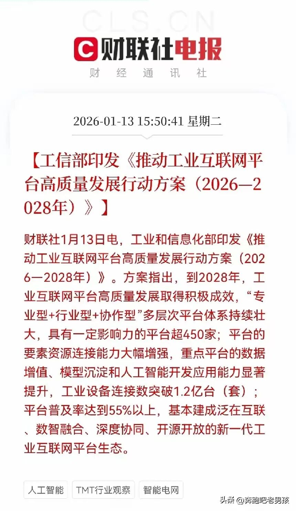

073 小明老师教你买股票，就像买菜一样

在工业和互联网时代，有一个非常好的减压方法叫简单劳动。

现在很多人炒股的方法是错误的，原因非常简单 —— 因为他们不了解世界正在发生什么。

我本来不想跟你们讲经济学原理，毕竟你们对政治太陌生了，不像我，从小就看《参考消息》，这张报纸你们小时候应该都没怎么看过吧？

我用最快的方式给你们讲明白，其中的经济学细节就不展开了，只梳理一个最简单的逻辑和线索。

**01**

**过去股市的底层逻辑**

我开始看《参考消息》的时候，二战已经结束几十年了。而二战结束之前，是英国的金融主导着全世界。

二战结束后，英国和整个欧洲都衰败了，这很大程度上是希特勒造成的。

之后，美国取代英国成为金融市场的垄断者。

为了进一步抢占英国在全球的金融地位，美国在二战后又进军了中东地区 —— 因为二战后人类的产业革命模式依然处于工业时代，只是欧洲旧的工业时代体系被摧毁了，全世界相当于重新发展工业时代。

工业时代最关键的经济杠杆是石油，而中国当时缺少石油，所以最敏感的经济杠杆是石油和煤炭，这也造就了山西和陕北这两个地区的快速富裕。

美国为了成为全球霸主，用了两个核心工具，这两个工具都堪称最关键的经济杠杆：**
**

**第一个是石油**，它把中东地区搅得一塌糊涂，从而控制了全世界最主要的石油资源；

**第二个是美元**，它要求全世界必须使用美元，其他国家央行的货币都无足轻重，而且全球要购买工业时代的核心经济杠杆 —— 石油，就必须接受美元的主导。

这就引发了一个严重的问题，中国股市的钱从哪里来？

过去，中国股民关注的是大资本（也就是所谓的机构）在盯着哪个板块。

这些机构会通过巨额资本操控该板块股票的涨跌，而且他们信息更快（毕竟是坐庄方，还掌握量化工具），交易也更迅速，所以庄家永远赚钱，散户只能跟着庄家猜测 —— 猜庄家今天会布局哪个板块，大后天又会转向哪个板块，然后跟风下注。

大家看懂这部分了吗？这就是为什么过去的老股民最关心三样东西：

第一，是 K 线；

第二，是消息（但这不是政治经济消息，而是庄家的动向消息）；

第三，是每个时间点大资本的资金撤离或注入情况。

这种跟着庄家走的思维定式，要求散户必须猜中庄家下一步的操作时间和方向。

但庄家会通过媒体传播假消息，最终必然会给股市里的人挖下大坑。

所以这种炒股方法，就算你想不被坑，也只能赚得更少、跑得更快。

可即便跑得更快，由于你的思维定式和庄家的思维定式高度重合，庄家依然会利用你的思维定式，再加上更快的量化交易工具，你终究还是跑不过庄家。

尤其是在一个周期结束前，庄家会集体收割所有散户 —— 因为你不知道庄家何时会最终撤离。

但过去股市里的散户都不明白一个核心问题：中国股市的钱到底从哪来？

过去是庄家操盘，散户本就赚得少，最后还会被假消息收割，想挣钱难上加难。

于是他们会使用杠杆，在大周期波动中或许能赚点钱，但当大周期转向（也就是牛市转熊市）时，就会遭受巨大损失。

这就是为什么每次牛市结束，中国几乎所有散户都会亏钱，甚至把之前赚的钱全部亏光。

你们可以看看 2014 年左右，我当时在成都讲课，主办方都在加杠杆炒股，可那正是牛市快要结束的时候，散户却根本不知道牛市何时会落幕。

现在最关键的问题还是：散户不知道股市的钱（包括那些杠杆资金）从哪来。

过去，不管是银行的钱、庄家的钱，还是国内的资金、各路庄家的资金，追根溯源都来自美国 —— 因为当时是美元控制着全世界。

散户搞不懂这个道理，想挣钱就渴望庄家注入大资本，于是跟着庄家下注。

庄家撤退时，又指望国家动用银行资金托底，好让自己趁机脱身。

但国家往往在牛熊切换的关键时刻不会托底，所以过去的老散户大多会亏大钱，除非在牛市中途就离场。

可牛市还在继续的时候，你一旦离场，看着行情走好，又忍不住会重新入场。

所以在过去的周期里，几乎没有散户能真正全身而退，这是人性使然，也是为什么我说每次牛熊交替，绝大多数人都会亏损。

现在我先给你们一个结论：现在没有牛市，也没有熊市，但老散户根本不懂这一点，还在用牛熊思维考虑问题。

第二个更严重的问题是，现在股市的钱从哪来？这些最根本的问题，过去的老散户完全没弄明白。

**02**

**全球金融格局剧变**

如今，全球的主导货币已经不是美元了 —— 这一点更可怕，老散户对此一无所知。

源头消失的原因是什么？因为特朗普正在把美国 “这家公司” 的所有美元撤回国内。

特朗普发现美国已经还不清美债了，所以他阻止美元再为全球 “兜底”，同时也阻止了美元成为全球游资。

而美元撤退后，资本家的钱是不会闲置的 —— 这就像我在 “看电影学心理金融课” 里给你们讲过的那部电影《华尔街：金钱永不眠》里展现的道理。

美元撤退后，现在的股市和过去有什么不同？

没有了美元游资，牛市又从何而来？这些问题，过去的老散户根本无法理解。

我再用最简单的方式讲讲过去的情况（尽量快一点，不然涉及的知识点太多，你们掌握不了）。

过去，全球资本以华尔街为顶级金字塔，他们系统性地组织起来，利用美元在全世界的触角，渗透到各国的银行系统和股市，通过资本力量操纵股市涨跌 —— 他们进场就是牛市，离场就是熊市。

所以当时中国股市的涨跌和全球其他股市并不同步，甚至各国股市的涨跌都和美国股市不同步，因为全世界股市的涨跌完全取决于美国华尔街垄断金融资本家 —— 他们不仅操纵股市，还操纵房地产、黄金等所有可炒作的资产。

过去的庄家就是华尔街资本家，他们坐庄全球，各国股民只能跟着他们下注。

最大的问题在于，他们进场比你快、离场也比你快 —— 等你知道机会来了，他们已经跑了。

等你以为没机会了，他们又回来了。等你以为他们回来了，他们又走了。

所以在华尔街资本家面前，没人能真正赚钱。这就是为什么这些年中国的股民基本上最后都赚不到多少钱，只能在牛市中途赚点小钱，最终还是会亏损。

你们现在看很多老股民手上还握着一些 “压箱底” 的股票，就是因为当时被华尔街资本家套住了，人家早就跑了，他们却握了十年八年。

下次行情一来，他们又用过去的逻辑跟着庄家下注，最后庄家撤退，又留下一堆卖不掉的股票。

所以过去的中国老股民都在等牛市，但现在的情况已经完全变了。

现在的情况是，美国 “这家公司” 运营不下去了 —— 过去摊子铺得太大，美元为全球兜底，华尔街资本家要操纵全球股市需要海量资金，这不断增加了美国的运营成本，如今海量美债连利息都还不上，美国随时可能面临崩盘风险。

就在这个时候，美国民众用群体意识选出了特朗普 —— 特朗普的出现不是偶然，而是美国 “这家公司” 出了大问题，急需一个激进的改革者。

特朗普上台后，必然按照美国民众的群体意识行事：收缩美元、收缩阵线，让美元只为美国人服务、只为美国股市服务。

你们不要以为只是资金撤回那么简单，特朗普还退出了全世界几乎所有的协会组织 —— 这意味着过去美元通过百年条约、合约、法律等确立的全球触角，现在特朗普都不认账了，全部撤回。

美元跑了，也就是过去的全球庄家跑了，接下来全球该怎么办？

在这种情况下，各国只能开始自己做主。现在的全世界有三个 “做主的力量”（也就是三个庄家）。

第一个，是美国。

作为食物链上层，它对全球依然有一定影响，现在美国 “没钱了”，所以采用直接武力抢劫的方式 —— 金融手段已经不好用了，因为金融手段还得依赖美元。所以第一个庄家造成了全球秩序的大混乱。

第二个，是世界各国政府。

理论上，各国政府都要从本国角度出发，发展经济、维护稳定，但现在大多数国家已经没有足够力量，所以实际上变成了中美两国的竞争 —— 中美两国为了争夺世界老大的地位，唯一的竞争焦点就是 AI。

现在世界上没有牛市也没有熊市，一切都围绕 AI 展开。

AI 发展方向错误的公司会被抛弃，发展方向正确的公司会被扶持。整个世界会不断淘汰公司，而不再有统一的牛市和熊市。

第三个，是全球的 “恐惧群体”。

也就是全球民众因强烈不安全感形成的群体无意识。

这个 “庄家” 追捧的是黄金、白银等贵金属 —— 现在全球做生意，大家觉得美元不可靠，任何货币都不可靠，所以即便交易赚了钱，也需要用贵金属做抵押，防止合同失效（因为 “世界警察” 美国已经撤走了）。

所以现在股市的涨跌，再也不是美国游资说了算。

**03**

**当下股市的核心逻辑**

你们一定要知道，过去股市里所有的资本、游资（包括你们所谓的中国优质资本），其实用的都是美国人的钱，说到底都是华尔街资本家的钱。

现在整个逻辑完全变了：股市没有统一的牛市和熊市，只有单个股票的牛市和熊市。

所以现在炒股，不要跟着庄家走，也不要跟着所谓的资本走，只需要看三个指标：中国政府的国家意志力、全球老百姓的恐慌程度、特朗普的疯狂程度，用这三个指标来衡量股市的板块变化。

这种情况下，市盈率重要吗？国内游资的撤退或坐庄重要吗？

你们想想，中国的航天板块现在谁说了算？是美国华尔街资本家在炒作吗？

再想想，在这三个同时 “坐庄” 的力量影响下，哪些股票会持续上涨？哪些会持续下跌？

答案很简单：没有统一的牛熊市，但有单个股票的牛熊市。

不过因为是三个庄家同时操盘，所以即便是长期上涨的板块，在上涨过程中也会持续波动、震荡。

我们要做的，就是在这些优质板块里低买高卖。

千万不要想着还像过去华尔街资本家操盘时那样 —— 今天看到某只股票价格低，就拉一把。

现在根本不可能了，比如让华尔街资本家去拉动中国的房市、茅台酒股价，他们拉得动吗？

所以你们千万不要违背当下世界的发展方向去炒股。

现在华尔街的资金只会对股市造成扰动 —— 他们想拉一把，可能会有小幅度上涨，过去的老股民就会闻风而动，很快上当，因为华尔街现在已经拉不动大行情了。

所以现在的股票投资必须用 “贝叶斯集合” 思维：不在贝叶斯集合里的东西，简单说就是违背当下人类发展方向的东西（比如茅台酒、伊利牛奶），不管小庄家会不会偶尔拉一下，都不要碰。

现在贝叶斯集合的核心理念是什么？是人类的想象力。

因为人类已经进入信息时代、AI 时代，也就是说现在的 “大趋势”（大他）已经变成了人类指向 AI 时代的创造力和想象力。

宁愿看科幻电影来指导炒股，因为现在的核心是情绪价值，而不是过去的 “填饱肚子”。

这个 “大趋势” 还指导着你的孩子未来在哪里找工作、该上什么样的大学、现在该学什么、该选什么专业 —— 这些东西外面的人根本看不懂。

正因为这一代家长完全不懂我们弟子班讲的这些知识，所以中国这一代孩子基本上会 “全军覆没”。

但这并不违背世界发展规律，因为世界不需要这么多庸才，只需要 1000 个顶级 AI 专家，其他人全部去提供情绪价值、或者直接躺平玩电子游戏，等着被淘汰 —— 所有的零零后都会面临这样的局面。

**04**

**投资决策的底层支撑**

学员问：“老师，按照买菜原理，每天早上看便宜的菜。但航天板块的股票每天都很贵，没有下跌的时候，我们买不到呀。是不是不跌的时候就不买？”

我的回答是：“我有时候会买上涨的股票，那是因为我知道它是持续上涨的方向，但你们判断不清楚，所以还是买下跌的股票比较安全。但千万不要买贝叶斯集合以外的股票，因为它们不符合人类文明的发展方向。所以大家要多看科幻电影，培养对未来的感知。”

学员又问：“老师，航空航天类的股票昨天在贝叶斯集合里的都涨了，今天还有哪些可能会涨？”

我的回答是：“我们不管哪些会涨，只在它涨的时候卖、跌的时候买 —— 主要是怕咱们弟子班的老股民判断出错，用过去的思维误判行情。”

所以大家一定要学懂心理学，心理学几乎是所有文科的基础学科。

学懂了心理学，你才能看懂整个世界。不信你们现在去问问全世界，有几个人懂 “现在股市已经没有牛市和熊市” 这个道理？

全世界只有我们弟子班的人知道，我们是全球首个看透这个趋势的群体。

说到底，现在的股市就是：涨的股票会持续涨，跌的股票会持续跌，不涨不跌的股票会一直不变。

记住，现在是三个庄家同时在 “牌桌” 上操盘，所以每天都有巨大的混乱度，没有清晰的统一规律。

大家只需要关注单个股票的涨跌，按照 “买菜卖菜” 的逻辑操作就行。

比如老股民一看今天大盘波动，就会受到游资庄家的影响开始出逃，却不知道自己出逃后股票就开始上涨。

你们的逻辑判断框架一定要换过来，不能再用过去的思维了。