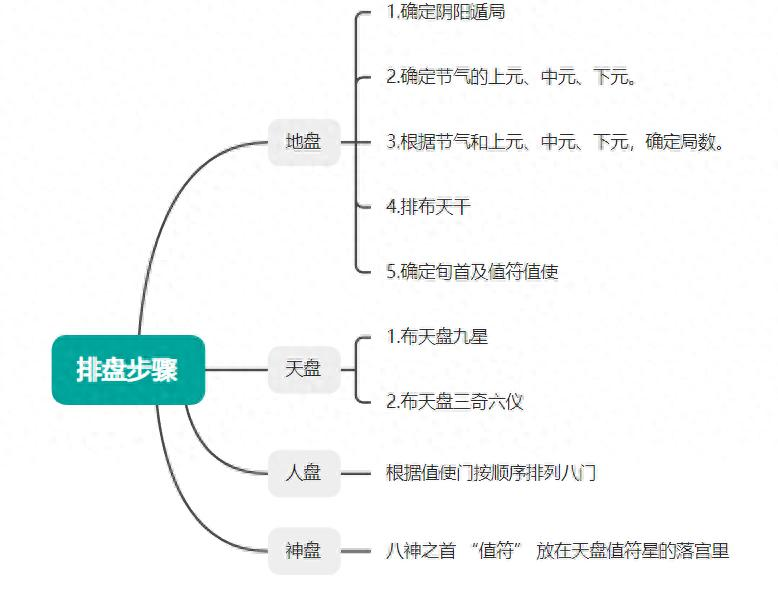
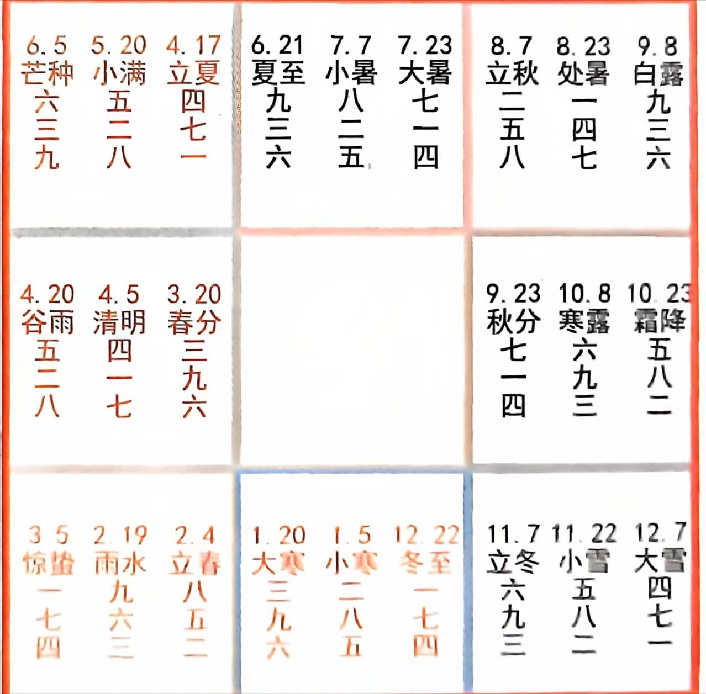
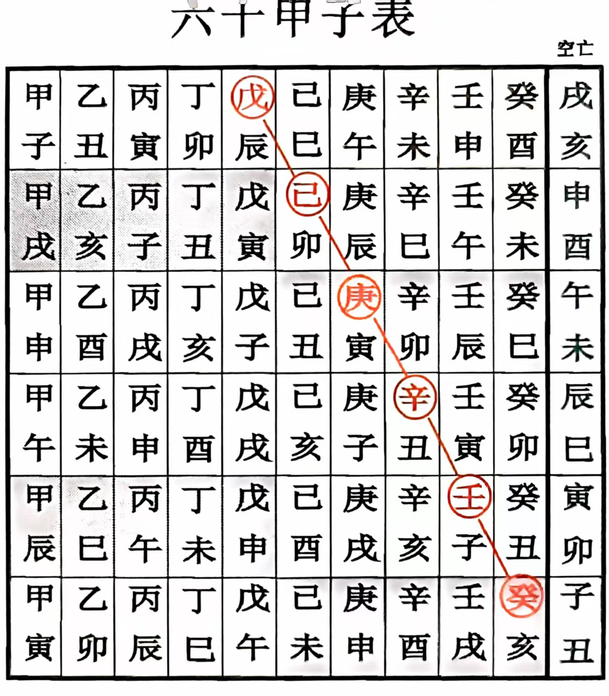
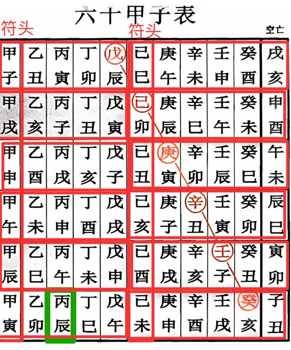
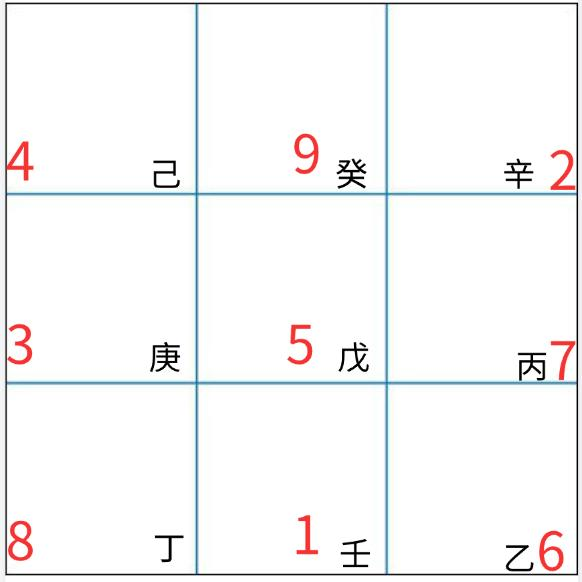
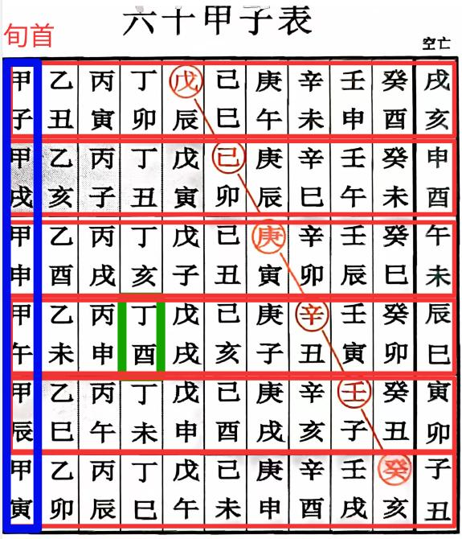
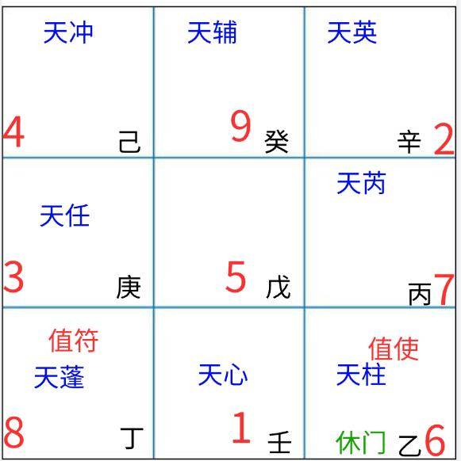
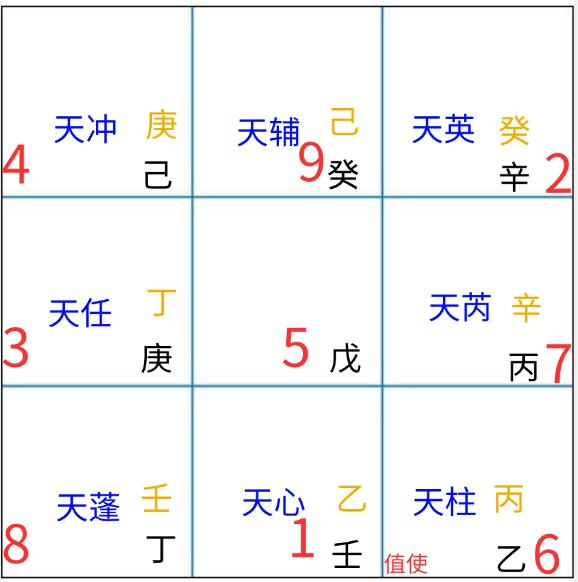
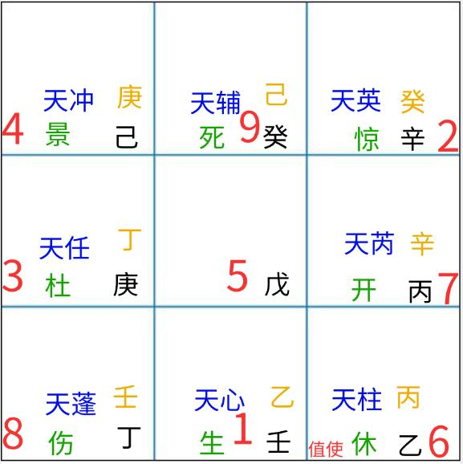
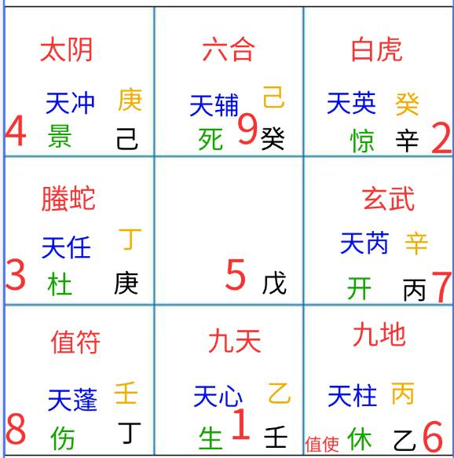

# 奇门遁甲排盘方法

2025-08-15 20:05·[杨帆启航](https://www.toutiao.com/c/user/token/MS4wLjABAAAAJz8MATQ-qfmBBY-gaeVnzzpUG04kL-pwCp6qRpDbHUJ3Brne3fdTcyzzleFKagIv/?source=tuwen_detail)

以下文章是我整理的关于奇门遁甲排盘的基础知识，以及排盘的步骤分类，最后再来一个排盘的案例分析，一步一步的拆解排盘的步骤。排盘方法为时家奇门转盘法。

奇门遁甲排盘需要用到以下基础知识

# 奇门遁甲必备歌诀

1.三奇六仪顺序：戊己庚辛壬癸丁丙乙。

2.三元：符头地支为子午卯酉者为上元，为申寅巳亥者为中元，为辰戌丑未者为下元。

3.六甲遁：甲子戊，甲戌己，甲申庚，甲午辛，甲辰壬，甲寅癸。

4.九星诀：蓬任冲辅，英芮柱心。

5.八门诀：休生伤杜，景死惊开。

6.八神诀：符蛇阴合，虎武地天。

节气三元表

# 排盘的步骤分类

**首先需要确定起局时间的四柱八字**

**然后分别排地盘，天盘，人盘，神盘。**

**地盘**

**1.确定阴阳遁局**：根据问测日期，确定其属于二十四节气中的哪一个。从冬至开始到芒种结束为阳遁，从夏至开始到大雪结束为阴遁。

**2.确定节气的上元、中元、下元。**

甲己为符头，

符头地支子午卯酉为上元，

寅申巳亥为中元，

辰戌丑未为下元。

**3.根据节气和上元、中元、下元，确定局数。**

每个节气分为上、中、下三元，每元五天，对应不同的局数，如冬至一七四，即冬至上元用阳遁一局，中元用阳遁七局，下元用阳遁四局。

**4.排布天干**：根据确定的阳遁或阴遁几局，将三奇六仪按照 “戊→己→庚→辛→壬→癸→丁→丙→乙” 的顺序排列，阳遁顺排九宫，阴遁逆排九宫。

**5.确定旬首及值符值使**：根据时柱干支，找出其所在的甲旬，即旬首。例如，时干支为戊申，可推出旬首为甲辰。

查看旬首所对应的六仪布于哪个宫中，该宫所对应的天盘上的九星就是值符，该宫所对应的人盘上的八门就是值使。若旬首天干落在中宫，则找中宫所寄的宫位的九星八门作为符使。

**天盘**

**布天盘九星**：值符星落入指定宫位后，其余八星按其固定相邻顺序顺时针依次排入其他八宫。

**布天盘三奇六仪**：值符所带的六仪落入值符宫后，其余天干按其在地盘上的原始顺序，阳遁顺布、阴遁逆布的原则，依次顺时针填入天盘。

**人盘**

**推出时辰地支在地盘所在宫位:**从旬首所在的宫，按九宫数字向前排，阳遁顺数，阴遁逆数。值使门落入指定宫位后，其余七门按其固定相邻顺序，即休→生→伤→杜→景→死→惊→开，顺时针依次排入其他八宫。

**神盘**

八神分别是值符、螣蛇、太阴、六合、白虎、玄武、九地、九天。小值符永远跟随大值符走，将八神之首 “值符” 放在天盘值符星的落宫里，其他八神按 “符蛇阴合，虎武地天” 的顺序在九宫格里顺时针转动排布。

# 排盘案例

例如：公历时间为2025年8月15日17时

节气为立秋

四柱八字为：乙巳年 丁亥月 丙辰日 丁酉时

**地盘**

**1.确定阴阳遁局**：时间在夏至开始到大雪之间用阴遁。节气为立秋。

**2.确定节气的上元、中元、下元：** 需要找符头，今日为丙辰日，则符头为甲寅，符头地支为寅。之后就确定为：立秋中元

**3.根据节气和上元、中元、下元，确定局数：**

根据节气三元表：立秋二五八，二代表上元，五代表中元，八代表下元。

确定局数是阴盾五局

**4.排布天干**：戊→己→庚→辛→壬→癸→丁→丙→乙的顺序，戊放在5宫位开始逆排

**5.确定旬首及值符值使**：时柱干支为丁酉，则旬首为甲午，根据六甲盾中”甲午辛”得到值符在“辛”的宫位。值符：天蓬星；值使：休门

**天盘**

**布天盘九星**：值符为天蓬星，根据九星诀顺序排。

九星诀：蓬任冲辅，英芮柱心。

**布天盘三奇六仪**：天干按其在地盘上的原始顺序，就是宫内九星原始的地盘干

例如天蓬星所在的宫位是艮八宫，原本天蓬星所在的宫位坎一宫，坎一宫的天干为壬，则天盘干为壬，其余以此类推。

**人盘**

**推出时辰地支在地盘所在宫位:**值使休门落入指定宫位后，其余七门按其固定相邻顺序，即休→生→伤→杜→景→死→惊→开，顺时针依次排入其他八宫。

**神盘**

八神分别是值符、螣蛇、太阴、六合、白虎、玄武、九地、九天。

八神诀：符蛇阴合，虎武地天。从值符开始，顺时针排布。

最终一个奇门遁甲排盘就完成了。

排盘步骤十分复杂，还有很多细节需要大量的推导，如果有什么疑问，欢迎大家留言讨论。