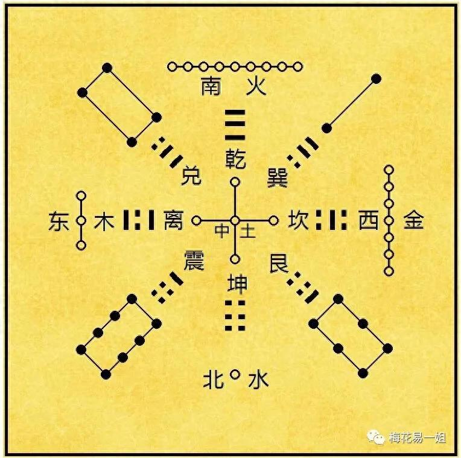
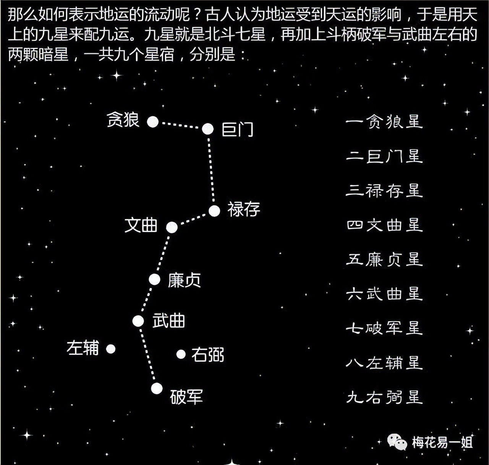

# 赤马红羊离火大运怎样发财？

2025-08-20 15:08·[梅花易一姐](https://www.toutiao.com/c/user/token/MS4wLjABAAAAHFmRKevNftxp2C6_AcutBe3zFI0evCbkAMxtPzowrNgOErLTJLe8VQQFXW9FfQA9/?source=tuwen_detail)

最近比较忙，无暇安静，只能抽出时间写点文章。

关注玄学的网友可能会发现这两年在网上有两个内容很火，一是离火大运，一是赤马红羊。我看到不少相关的内容，很多东西说的头头是道有鼻子有眼，有些则是故意博眼球胡说八道。

但说实话，对于认真理性研究玄学的我来说，看着这些内容感觉无比尴尬。我不是自命清高，也不是自夸，我敢说大多数人根本不了解离火大运和赤马红羊到底是什么！就像很多人信佛去寺庙烧香跪拜，却根本不懂佛法到底讲什么，白白把香火钱给了释大师这种败类。

很多人说离火大运离火大运，可没人知道离火大运这个说法到底是什么来的。一姐就卖弄一下才华，三元九运，其实正是从邵雍的《皇极经世》中而来。

根据我对古文历史的考证，在明朝之前，根本没有三元九运这个说法。最早出自明朝的幕讲禅师《玉镜正经》，这是一本关于风水的作品，其中有《九星八卦五行歌》云：

一白贪狼号水神，二黑坤土起巨门，三碧震木禄存是，四禄文昌巽木亲，五黄廉贞中宫土，六白武曲乾属金，七赤破军金管兑，八白艮土左辅星，九紫右弼离火焰，九宫八卦此中分。

又有《三元龙运诀》云：三元龙运理宜通，上元一白二三同，中元四绿中乾位，下元七赤艮离中。

而元世运会的概念来自哪里呢？正是邵雍的《皇极经世》，这本书太难懂，很多内容我也理解不了，简而言之，这书邵雍用自己数学理论推断了几百几年甚至上万年后的未来世界。

《四库全书》灵城精义纲目提要说：考元运之说，以甲子六十年为一元，配以洛书九宫，凡历上中下三元为一周，更历三周五百四十年为一运，凡为甲子者九，每元六十年为大运，一元之中，二十年为小运，以卜地气之旺相休囚。

提要又云：大抵因皇极经世而推演之，其法出自明初宁波幕讲僧，五代时安有是说?

三元九运和邵大师的元世运会是不同的理论，但很显然是受了邵雍的影响，要知道古代的文人最子崇拜的数术大师正是邵雍。

三元九运到底是什么呢？说白了它只是风水上的一种理论，和网上讲的什么离火大运根本没关系。我之前的文章写过：

元，就是六十年。传统文化称为六十甲子。为什么叫六十甲子？因为我们古人是用天干地支表示时间的，不像我们现在说十月五号八点。古人说时间是这样的：癸卯年甲辰月子时。

天干共有十个：甲、乙、丙、丁、戊、己、庚、辛、壬、癸。

地支共有十二个：子、丑、寅、卯、辰、巳、午、未、申、酉、戌、亥。

天干从甲，地支从子，一一顺序组合一轮不重复，共计六十个。这就是六十甲子。

一元是60年，又分为上下中，三个运，每运20年，如：上运，中运，下运。

三元，总共180年，分为上元，中元，下元。每一元三运，所以三元总共九运。

九运，怎么表示？要我说古人喜欢吃东北乱炖，喜欢把一切都掺和到一起。这九运，就用九宫八卦表示。

八卦五行方位颜色等等杂和在一起，三元九运即是：一坎水、二坤土、三震木、四巽木、五黄土、六乾金、七兑金、八艮土、九离火。

可以看出这种排列，既不是先天八卦顺序，也不是后天八卦顺序，那这是什么？忘记了古人还有一点最最最最重要的东西，那就是天象。这个九运，就是根据天上的九星而来。

以前太遥远，我只说现在。我们现在处于八运：2004-2023，艮土。那么从2024年开始进入九运2024-2043，离火大运。

讲完离火大运，再说赤马红羊。

赤马红羊到底是什么？

就是天干地支的两个组合，分别是：丙午，丁未。

我们知道，天干地支代表不同的五行，而丙和丁的五行都代表火，火是红色的。十二生肖午是马，未是羊。所以称为赤马、红羊。

就这么简单！

那么为什么网上把赤马红羊说得这么可怕呢？

因为一本书——南宋时期柴望所著《丙丁龟鉴》。这本书总结了自秦汉起总结了历史上逢遇丙午、丁未年份时发生的历史重大事件。从秦昭襄王嬴氏五十二年到后汉天福十二年丁未年，共计1260年的时间，这中间干支为丙午、丁未的年份共出现了二十一次。而这二十一次丙午、丁未之年都发生了动乱或天灾。

柴望写这书目的是什么呢？其实是希望引起朝廷的重视并引以为鉴。淳祐六年(1246)自编《丙丁龟鉴》，意在说明“今来古往，治日少而乱日多”，切望当局居安思危。由此触怒朝廷，被逮入狱，得临安知府赵与筹救助。

当时南宋什么情况，有兴趣可以自己搜。柴望编这书可真是用心良苦啊。但后人却给歪曲成劫难，不知道柴先生地下有灵会做何感想？

那么古人为什么会认为丙午，丁未，会发生不好的事？

其实还是易经的物极必反变化之道。因为丙丁属火，而一年之中最热的天气就是午月未月，热到极点就会变凉，就像子时阴气最盛却是阳气开始产生的时刻。

一年有365天，每年都有好事发生，也有坏事发生，你想证明今年好，挑几件好事出来就行；若是你想证明今年坏，你挑几件坏事出来就行。这么浅显的道理，我想聪明人都懂。

什么女性崛起，什么网络盛行，难道每个人都去搞这些都能发财？

所以别管什么离火大运，什么赤马红羊，好好努力的提升自己就行，别人说什么不重要，重要的是自己该做什么。