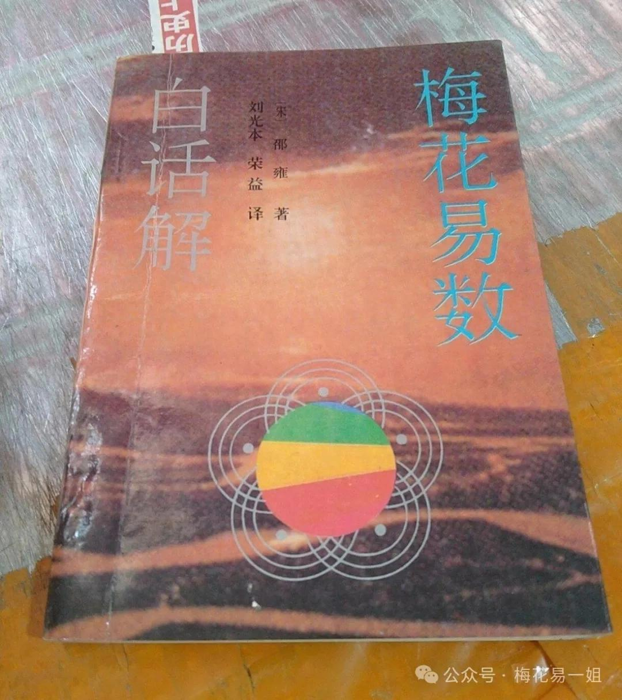
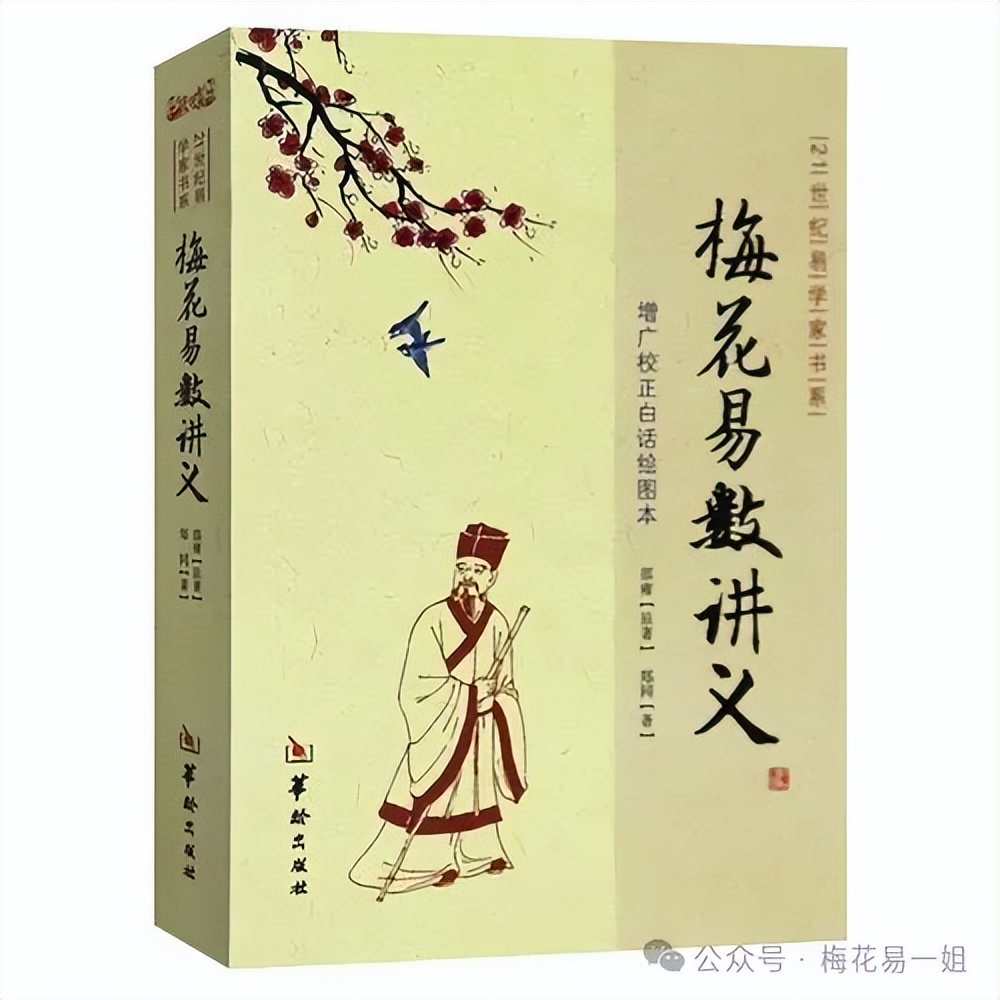
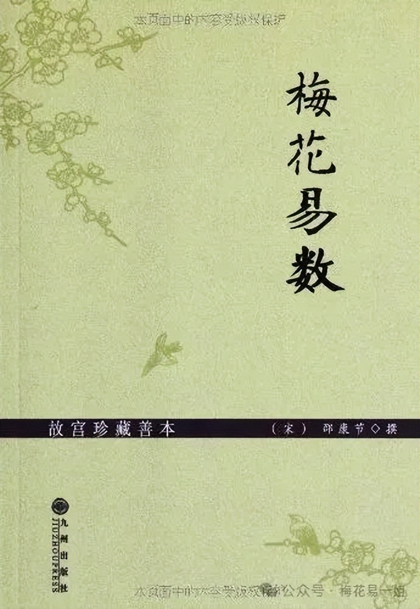
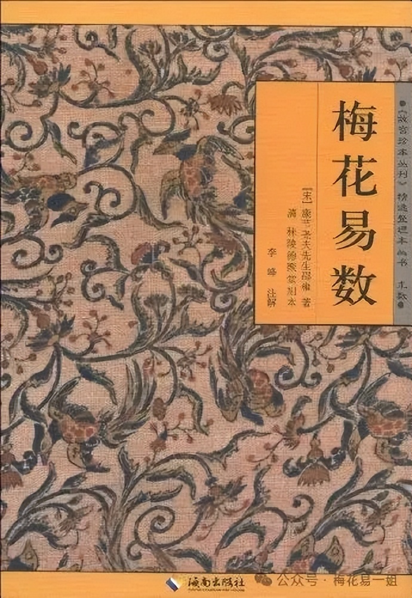
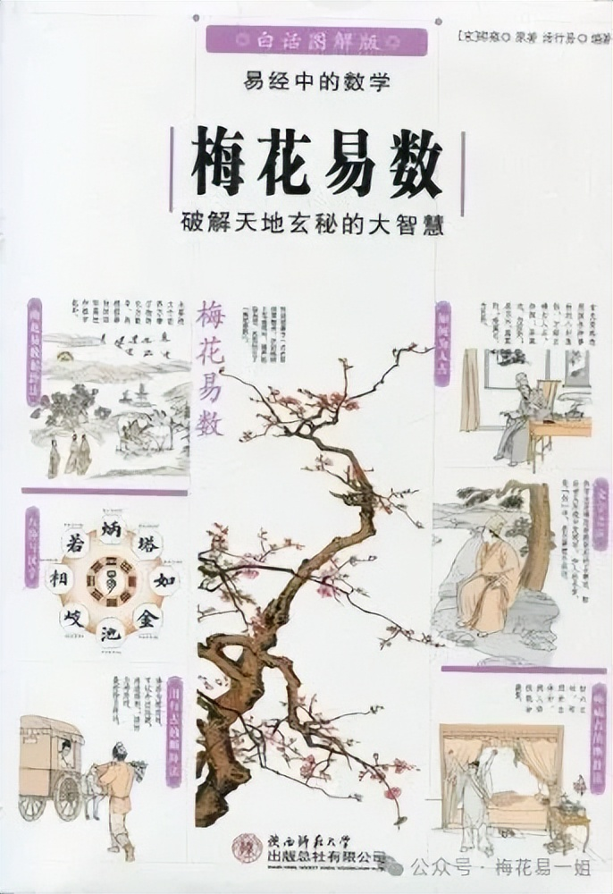

# 梅花易数哪个版本的书最好？

2025-10-27 11:00·[梅花易一姐](https://www.toutiao.com/c/user/token/MS4wLjABAAAAHFmRKevNftxp2C6_AcutBe3zFI0evCbkAMxtPzowrNgOErLTJLe8VQQFXW9FfQA9/?source=tuwen_detail)

作品声明：个人观点、仅供参考

不少网友总是问我，学习《梅花易数》看什么书？其实这个问题我早说过一百遍了，梅花易数相关的书籍少得可怜，只有一本《梅花易数》。但是版本却不少，很多出版社都有出版《梅花易数》，该选哪个版本呢？

首先，这篇文章不讨论古籍，因为梅花易数的古籍也就那两三个版本，差异并不太大。其次古籍的文言文很多人读不通顺，所以选白话本就好。这里说明一下，梅花易数是很简单的数术，古籍和白话本差别并不大。如果是其它的八字六爻，我建议还是尽量看古籍。

注意，梅花易数现行的版本较多，我也不是每版都读过，我写出来的仅是我读过的，至于我没有读过的就没列出来哈。

1：《梅花易数》1993年 山东人民出版社 刘光本 荣益 译注

《梅花易数》将《周易》八卦取象随历史环境与社会生活的变迁，作出了新的归整与推广，从而使《周易》卦象说更趋具体而完善。正因为它在《说卦》之卦象说的基础上，补入了符合当时时代需求的新内容，该书才在民间具有强大的生命力。《梅花易数》作为易占的一种，它独特完备的易占思想，处处展示出《周易》象数思维的智慧。

这个版本是我读的最早的一个版本，目前只有二手网站有售。后来又再版过，你只要看到译者是刘光本和荣益，就是这个版本。梅花易数通行的版本分为五卷。内容基本上都没什么问题，比较简约，没有过多的解释。

2：梅花易数讲义 2009年 华龄出版社 郑同 译注

《梅花易数》相传为邵雍所撰。明代大儒黄宗羲先生在编纂《百源学案》时，将此书收入其中，并亲自为其撰《序》一篇。《梅花易数》突出了《周易》的“易简”原理，是一本独特的把易理具体应用于占卜的经典著作。它独特完备的易占思想，处处展示出《周易》象数思维的智慧。

这个版本在市面上比较多见，我称为郑同版。郑同老师译注了很多易学方面的作品。这个版本的相对来说，解释的内容比较详细。初学者看比较合适。

3：梅花易数故宫珍藏本 2012年 九州出版社 周浩良 整理

此版整理的《梅花易数》以故宫珍藏的清德聚堂本（简称堂本）为底本，以清上海铸记书局石印《校正梅花易数》（简称校本）为参校本，吸取了前人的校勘成果。本书还收录了邵雍另两部著作《邵康节易数一撮金》及《渔樵对问》（一作《渔樵问对》）。其中《邵康节易数一撮金》以《古今图书集成》中收录的版本为底本，《渔樵对问》以《百川学海》中收录的版本为底本。本书最后还收录了《宋史》中的《邵雍传》。

这个版本只是整理本，没有白话注解，初学者可能不太适合。但是这个版本里多了两章内容，这是其它版本都没有的。

4：梅花易数 2011年 海南出版社 李峰 校注

通行五卷本，也是以清秣陵德聚堂刻本为底稿，这版梅花易数内容比较丰富，有作者的解释，还有不少作者的案例，尤其是拆字的内容，作者附注了不少案例。初学者看这个版本基本没问题。

5：图解梅花易数 2012年 陕西师范大学出版社 作者: 邵康节 / 汤行易 

副标题: 破解天地玄秘的大智慧

《图解梅花易数:破解天地玄秘的大智慧(白话图解版)》是中国易学发展史上一部以易学中的数学为基础，结合易学中的“象学”进行占卜的奇书，它集中国五千年术数之大成，将《周易》理性的“象数”哲学，还原为原始占筮法，第一次用数学公式推算占筮，建立了一套朴素、实用、易于传播的占卜预测学体系。

这个版本为图解版本，非常详细，而且因为有图片，更浅显易懂。如果初学者只选一本书的话，我推荐这本，注意我说的是初学者选这本。

市面上最常见的梅花易数基本上就这五个版本，很多封面不同的，其实是再版，你只要看译者就行了。总之如果是初学者，我最推荐图解版。如果有一定的基础，那么都可以看看，了解一下不同作者的解读思路也是挺好的收获。