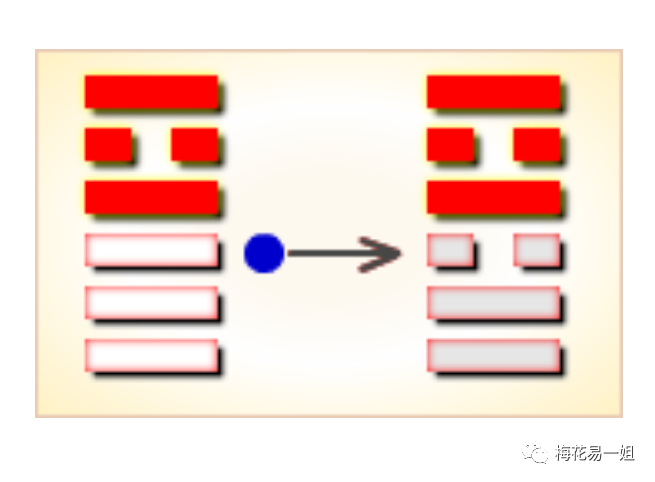
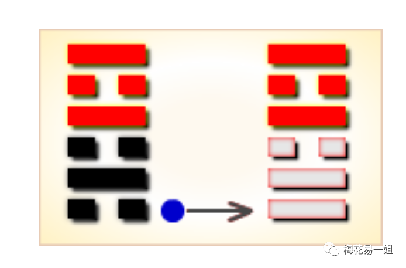

# 不一样的《梅花易数》第16讲：旺衰详解

观梅 

有过算命经历的朋友，可能都听说过这样的话：你的八字比较旺；你命里土弱，要补一下土。

在我们传统的文化之中，数术是指各种预测术，例如风水，面相，八字，六爻等等。基本上所有的数术，它的底层逻辑都一样：阴阳和五行。

不管表面上多么的花里胡哨，不管是用铜钱起卦，还是出生八字算命，不管是看面相，还是看风水，归根结底最后，还是要用到阴阳和五行。

这就有点像做菜，不管你是用刀切菜，还是手撕，不管是鱼，还是牛羊，最后都要放到锅里去煮。

阴阳是事物的两面，五行是五种气的运行。金，木，水，火，土，它们之间的关系仅有三种：生，克，同（比和，同类）。

金木水火土，不管是五种元素，还是五种行气，这怎么就能预测吉凶了呢？

很简单，只要上过小学，学过语文，我们就知道有种修辞手法：拟人。什么是拟人不用我过多解释了吧？

把五行拟人化，这就是预测吉凶的原理，古人的思想就是这么单纯。所以我最烦扯什么鬼神迷信的，阴阳五行，不仅不是迷信，当时还是为了反对迷信而生的。

我有一把刀，就能把树砍倒，这就是金克木。

我用火，能把金熔化，这就是火克金。

我每天给小树浇水，树就能长大，这就是水生木。

我给火添点柴，火就烧得更旺，这就是木生火……

那么有朋友会问了，如果我的火很大，你是一小杯水，你能灭了我吗？

这就进入了今天我要讲的主题：旺衰。

旺，就是强，就是多；摔就是弱，就是少。和打架一个道理，成龙李连杰再能打，我叫来一百个小弟，他能打得过吗？

那么《梅花易数》如何分辨卦的强弱呢？

第一步：先确定体卦与用卦。如果你连体用都分不清，那怎么分辨自己人？所以确定体用是第一步。

体用确定之后，看互卦与变卦之中，体卦的同类多，还是变卦的同类多。

比如：火天大有卦，三爻变，变卦火泽暌卦。

体卦：离火。用卦：乾金。

互上：兑金。互下：乾金。

变卦：兑金。

火克金，虽然体卦克制用卦，但是用卦旺势，体卦克不动。相当于体卦是孤家寡人一个，用卦有一百个小弟，这架没法打，对不？

第二步：加入时间的五行。

上面火天大有卦，是相对清晰明了，体用多少，一目了然。可是有的卦，就不好分辨了。

比如：火水未济卦，变火泽睽卦。

体卦：离火。用卦：坎水。

互上：坎水。互下：离火。变卦：兑金。

体卦有一个帮手，用卦也有一个帮手，看上去旗鼓相当，怎么判断？

这时候就要加入时间的五行。年，月，日，时，分别列出来，看看五行是什么，是体卦的帮手，还是用卦的同类。这样就好判断了。

注意，所有时间的五行，用的是地支五行，不用天干。

**亥子属水，寅卯属木，巳午属火，申酉属金，辰戌丑未属土。**

第三步：加入外应的五行。

有朋友会问，加入了时间的五行，还是没法判断，怎么办？

这时候我们就要加入外应的五行，以前我讲过外应，外应分为十种，在此就不一一列举了。

比如：北方代表水，南方代表火，东方为木，西方为金。这是方位外应。

再比如：看到一个穿红衣服的女人，属离火，这是人事外应。

再如：窗外天下雨了，属水，这是天时应。

这里有一个知识点：在梅花易数的规则之中，**真实的五行，要大于象征性的五行**，什么意思？

举例：中年女人，离卦，属火。看到一个男人拿着打火点烟，也是火。

但离卦属火，这是象征五行，也可以说是“假五行”，而打火机这是真火。

明白了吗？真实的五行，比卦象的五行要强！

再举例：一个人从东边走来了，东方属木，这是卦象属木。一个小孩儿拿了一根木棍，这是真实的木。

第四步：八卦五行的强弱。

乾和兑，都属金，但是乾金比兑金要强。

震和巽，都是木，但是震木比巽木要强。

坤和艮，都是土，但是艮土要比坤土强。

以上就是五行旺衰的一些要点，总之在用《梅花易数》判卦的时候，一定要灵活变通，切记不能刻板。