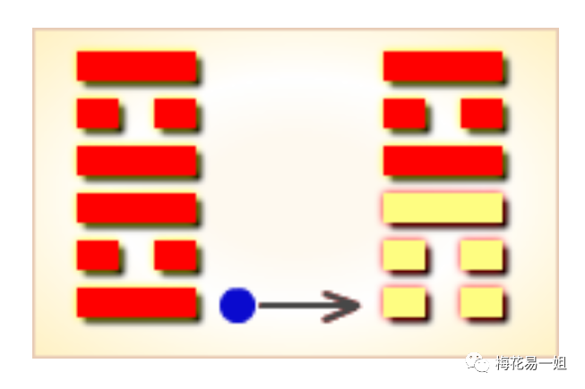

# 不一样的《梅花易数》第20讲：失物寻找

原创  

日常生活中，我们都有过丢东西的经历，小的物品如钥匙，戒指，证件等等，大的东西比如猫狗，自行车等等。丢失东西的心情大家都懂，那么如何寻找失物呢？《梅花易数》书中就记载有寻找失物的方法。

先看梅花易数失物占原文：

占失物，以体为主，用为失物。体克用，可寻，迟得。用克体，不可寻。体生用，物难见。用生体，物易寻。体用比和，物不失矣。

占卜预测寻找丢失的物品，以体卦为主，用卦代表丢失的物品。

体卦克用卦，可以找到，但是不会那么快就找到，得需要一点时间。

用卦克体卦，不好意思，东西找不到了。

体卦生用卦，丢失的物品很难找到。

用卦生体卦，丢失的物品很容易就能找到。

体卦与用卦比和，你要找的东西根本没有丢，大概是随手放哪不记得了。

这就是梅花易数寻找失物的占卜方法，是不是很简单？只看体卦和用卦就行，不看互卦变卦，也不考虑旺衰。

假设我的猫跑丢了，起了一卦，是用卦生体卦，说明猫很容易找到，可是我该去哪找呢？

梅花易数书中原文：以变卦为失物所在。

变卦，代表失物的方位地点。

例如上图：本卦为离卦，初九爻变，变卦为艮。艮卦就代表失物所在。

然后根据卦象，去推断大概位置。

乾卦，代表西北方位。高楼大厦，或者政府大楼等公共场所。金属，乱石，或者圆形的物体旁边。地势比较高，或者干燥的地方。楼梯，天台，或者老人家。

兑卦，代表西边。兑为泽，沼泽，小溪，小河边。兑为缺，破房子或者残破的物体旁边。或者顶上有口的物体。或者是小女孩有关的。

离卦，代表南边。厨房，火炉，透明玻璃物品。离中虚，或者空房子，书房。外部硬内部软的物体。或与中年女人有关的。

震卦，代表东边。震为木，树林，草丛。震为动，车上，热闹的街市等。与长男有关。

巽卦，代表东南。山林，庙宇，菜地，木制品，船等，柜子底下等。与长女有关。

坎卦，代表北边。与水有关的，河流，海边，水井，水沟等。或鱼缸，或者黑色有关的，外部软内部硬的物品。或与中男有关。

艮卦，代表东北。与山石有关，小路边，山林等，或者靠近路边的地方，山洞山沟等。与少男有关。

坤卦，代表西南。与土地有关，田地里，大仓库，或者陶制品土器，方形的物品。与老人有关。

以上八卦只是简单的卦象，更多卦象可以自行搜索一下。下面用一个实际例子讲解，记住一定要灵活，结合实际的生活去推断。

有一次同事的手机不见了，让我看看丢在哪了，能不能找到。当时我看了下时间，是16:22，于是起卦。

16除8，整除取八，八为坤，上卦坤。22除8，余6，六为坎，下卦坎。16+22=38，除6，余2，变爻为二爻。

于是可以得出：坤上坎下，地水师卦，九二爻变，变卦坤。

体卦：坤土。用卦，坎水。土克水，体克用，能找到，但是需要花点时间。

变卦坤，代表西南。用卦坎代表水。结合实际情况，当时是在上班，办公室西南方位是洗手间，坤为老年女性，又有隐藏的意思。于是推断，大概率是她上洗手间时把手机忘在厕所，然后被打扫洗手间的清洁阿姨捡走了。

后来果然如此。总之一定要结合实际情况去推断，切勿刻板。