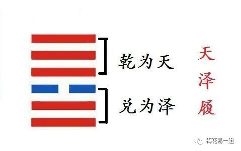

# 不一样的《梅花易数》第24讲：爻位详解

原创  

易经有六十四卦，但是最基本的组成元素却很简单，只有两条线：—和--。这线条在易经里叫做：爻。

长横线为阳爻，两短横线叫阴爻。阴爻和阳爻的组合变化，由此有了六十四卦。

阳爻由九代表，阴爻由六代表。因为九为奇数，六为偶数，奇数代表阳，偶数代表阴。可能有人会问了：七也是奇数，怎么不代表阳？四也是偶数，怎么不代表阴？

这个问题自古就很多解答，至今也没有清楚确定的答案。这就是易经，很多问题没有答案，我只讲一种我个人比较认同的看法吧。

古人对数字的了解，和我们现在是不同的。最早的数只有五个，一二三四五。甚至最早只有三个字，一二三。超过三古人就认为是很大的数了。

一三五为奇数，相加为九；二四为偶数，相加为六。这就是阴爻和阳爻的来源。

别看易经的卦很简单，但是有很多细节是需要思考的。比如：由下至上，第一爻叫初爻，如果是阴爻则是初六，阳爻则是初九。第二爻如果是阴爻，六二。是阳爻则叫九二……以此类推。

那么你有没有想过，为什么第一爻叫初，而不像二三四五那样，直接叫六一或者九一？第六爻为什么不叫六六，九六，而叫上六上九呢？

其实这里暗含了易经的核心：时与位。

初，代表的是时，我们常说最初，初衷，初代表的就是开始。 其初难知，其上易知，本末也。 因为事情什么时候开始是很重要的，万事开头难，开始的时候会发展成什么样，谁也不知道，而上易知，发展到一定程度了，结果会如何是显而易见的。这就是初难知，上易知。

比如，我们生孩子都想挑个好日子，开公司也会选个好日子，特别是结婚都要选个良辰吉日。没有谁公司倒闭了，还要挑个日子关门吧？

初代表时间，上，最上边，代表的是位置。从初到上，从时间到位置。这蕴含着时位的转换。所以第一爻为初爻，第六爻为上爻。

**初难知，上易知；二多誉，五多功；三多凶，四多惧。**

这就是对六爻的总结，二爻和五爻，是中位，一般都是好。三爻和四爻，处于下卦和上卦的交界处，不三不四不上不下，因此危险最大。

我们在用梅花易数解卦的时候，会根本爻变，来区分体用。很多人都知道，有动爻的就是用卦，没有动爻的就是体卦。但是很多人可能没有想过，一爻动和二爻动有什么区别？或者说不同的爻变动，代表什么意思，对解卦有没有影响？

不同的爻变，当然对卦有不同的影响。

最简单的，爻的顺序由下至上代表事情发展的过程。如果你占得一卦，是第一爻动，说明这事情才刚刚开始，未来一切都还不好下定论。

比如你喜欢上一个人，不知道和TA最终会发展成什么？

于是占得乾卦，初九。体用比和，挺吉利的。但这能说明什么吗？能说明你们会走到一起吗？这时候是不能这么断卦的。因为初九代表着刚开始，潜龙勿用，这时候还是没发生任何作用变化的，初难知，未来是捉摸不定的。这种情况最好就是过段时间，再占卜一次。

再从互卦的角度来思考一下。互卦是本卦第二三四五爻组成的卦。

如果是初爻动，还没有形成互卦。互卦代表事件的发展过程，所以这里也说明事情没有真正启动。

如果是二爻动，说明事情有了一点眉目。二爻也是互卦的初爻。也说明事情开始真正发生了。

事情的关键在于第三爻和第四爻。

在本卦来说，第三爻是下卦的最上，第四爻是上卦的最下，三和四代表着事情层次的转变。假如下卦代表失败，上卦代表成功，那么三爻和四爻就是在成功和失败的边缘。

再从互卦来看第三爻和四爻，二三四组成下卦，三四五组成上卦，看到没有？三爻和四爻在上卦和下卦中都有重复位置，这不更说明三爻和四爻的重要性吗？

至于五爻，是已经成功了。六爻是成功后如何应对的问题。因此来看，三爻和四爻，是最重要的两爻。

如果你在解卦的时候，遇到了三爻和四爻动，一定要谨慎仔细推断。