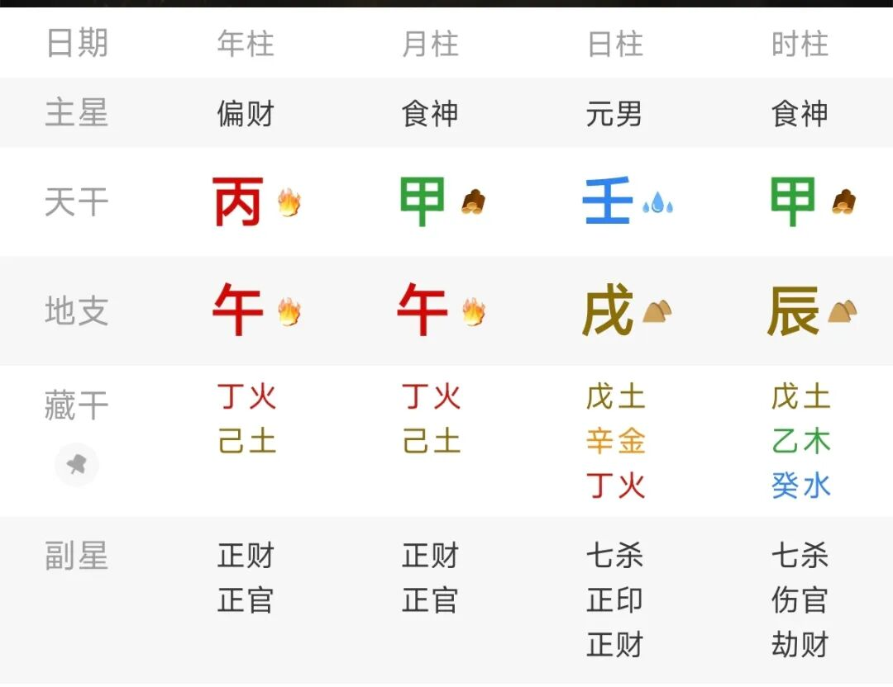

# 八字算命到底是怎样算的？

原创  

了解我们传统文化的朋友应该知道，占卜算命等玄学，其实底层逻辑是一样的，不管你是用铜钱摇卦，还是时间起卦，归根结底最后应用的都是阴阳五行。一姐主要研究梅花易数，但对八字也略懂一二，经常有朋友向我请教八字相关的问题，于是我想结合梅花易数大致讲讲。

一：八字排盘只有一种方式，那就是出生的年月日时。梅花易数起卦方式就多了，具体可以看我以前相关起卦的文章。

八字使用时间排盘，但并不直接使用年月日时，而是要把时间转换为天干地支。我们传统有三种历法，阳历，阴历，农历，而天干地支计时不属于这三种，它是一种独立的计时系统，主要就是为了结合阴阳五行。

具体如何把时间转换为天干地支，古代本身是有方法的，但比较复杂。我认为不用特意去学，现在有手机，方便多了。

二：排盘之后，确定十神。

我之前的文章里写过，八字和六爻其实有些类似。六爻里是兄弟，妻财，官鬼，父母，子孙，五行的五种关系。而八字在此基础上又加上了阴阳，于是就有了十种关系，分别是：

正官，偏官，正财，偏财，正印，偏印，食神，伤官，比肩，劫财。

有了这十神，就相当于六爻有了用神，你想问什么，然后去观察相对应的十神就好。

比如我想看财运，那就看正财与偏财。

三：如何推算？

这一步就是重点了，很多人看到一个八字，根本不知道该从何下手。其实那是因为你首先得提问。就像梅花易数占卜，你总得有一件事要问，才起卦的吗？八字排出来后也是这样，你想问什么？

假设我要问财，那就用八字里的正财偏财去推断就行。我用今天时间为例，给大家讲一下。

假设一个男命，出生时间2026年6月17日，早上8：30

转换成天干地，我直接排盘软件截图：

1：首先确定日主，日主类似梅花易数的体卦，代表你自己。八字的日主就是日柱的天干，图里的：壬。

2：问财运，根据五行生克，我克者为财，壬为水，水克火，火就是财。图里的：丙，午，都是壬水的财。

3：地支是藏干，地支午藏的丁火是正财，而不能直接用午火。关于八字的基础知识，大家可以自己了解一下，挺简单的。

4：确定日主强弱。壬水出生在夏天，根据五行旺相休囚，壬水处于弱的状态。而且壬水相临两个甲木，水生火，泄耗自身，更弱了。地支里藏的戊土也是克制水的，所以这个日主身弱。

5：问财，我们看财旺不旺。这个不用说了，一目了然，现在是午月，火当然旺，而且共有三个火（丙午午）。

6：这个八字就是典型的身弱财旺，口诀是：身弱财旺，富屋贫人。通俗地说就是财运很好啊，但是你吃不小。就像现在有五百万现金，一个三岁小孩子，他能扛得动么？这就是身弱财旺。

7：喜用。身弱喜欢帮扶，这个八字日主为水，金生水，比劫同类也可以起到帮扶作用。所以这个八字喜用就是金水。喜用金水（也叫印和比），并不是说你佩戴一个金项链、水晶就好运了。也不是起个名字带金水就行。

喜用真正的意思是，你以后的大运或者流年里，遇到了金水就会走好运。明白了吗？

这就是八字推断的方法，关键你要确定想问什么，比升职就看官星，问子女就看食伤……找到与之对应的十神，再根据强弱旺衰判断即可。

一姐讲的比较简单，但大体方法就是这样。如果你问我怎样看出具体能赚多少钱，那我不知道，因为任何一本命理书都没有怎么推断具体数字，只能是算命先生根据自身经验说了。