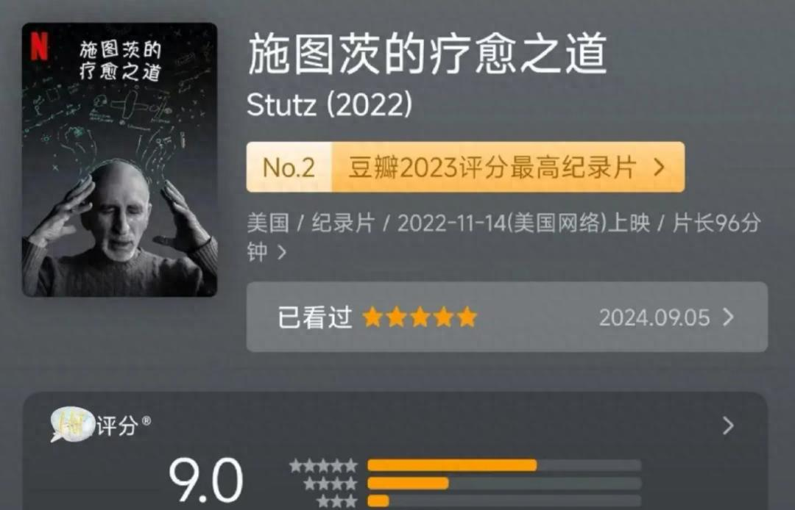
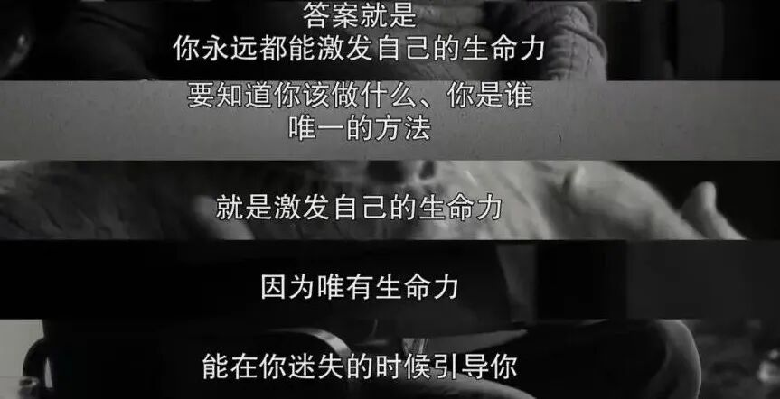
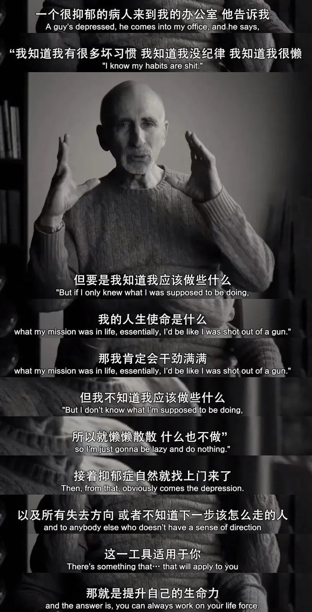
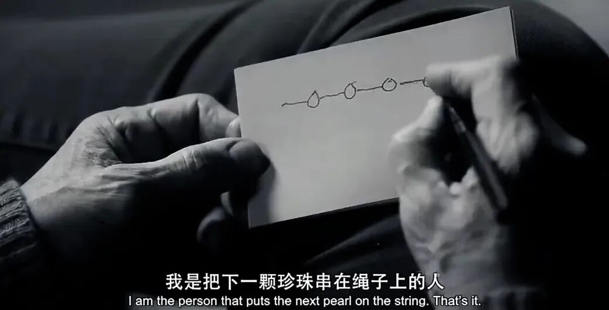
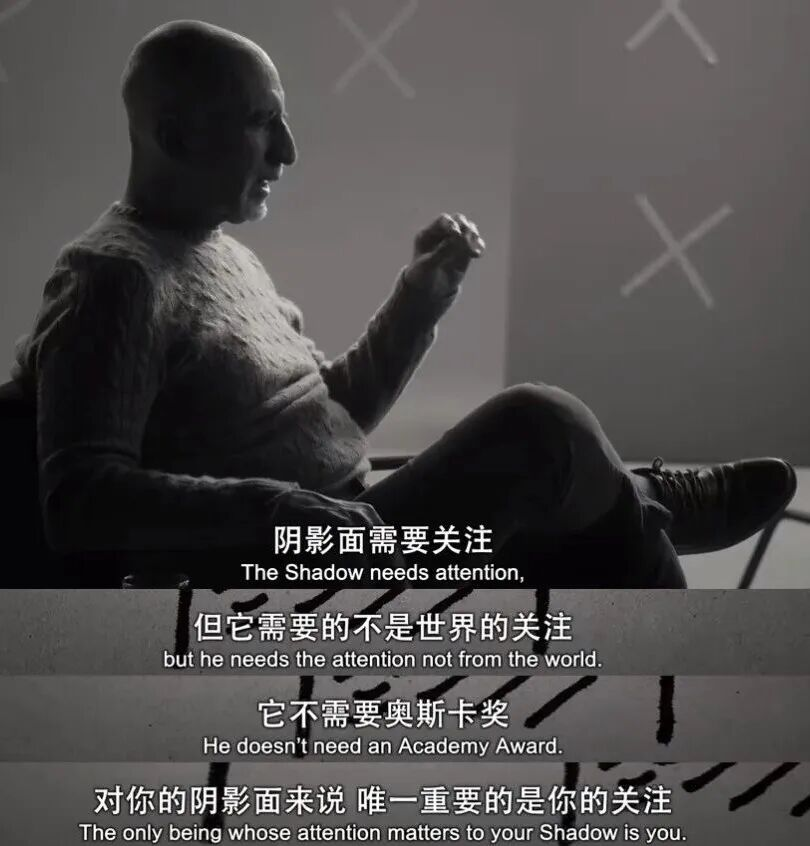
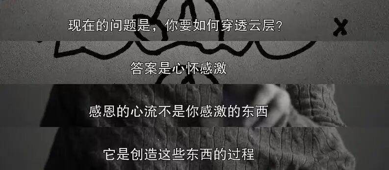
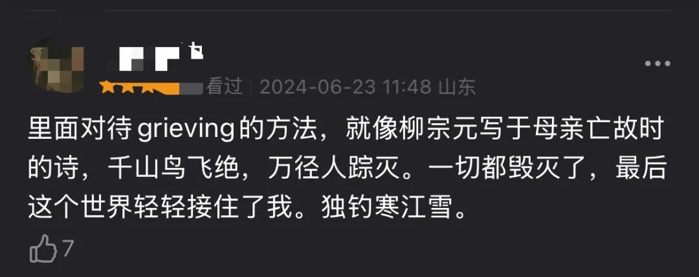
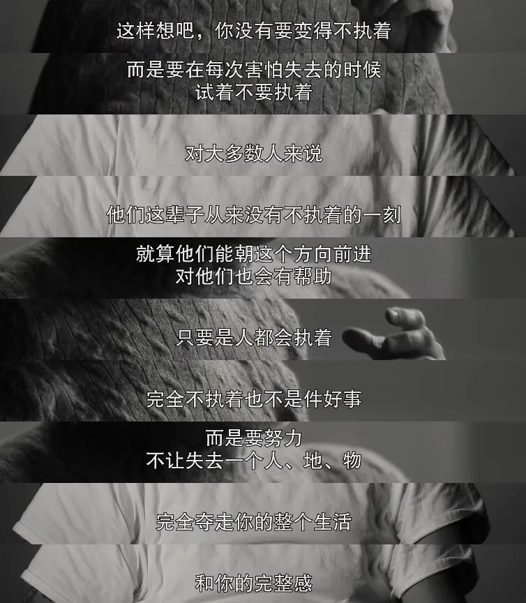
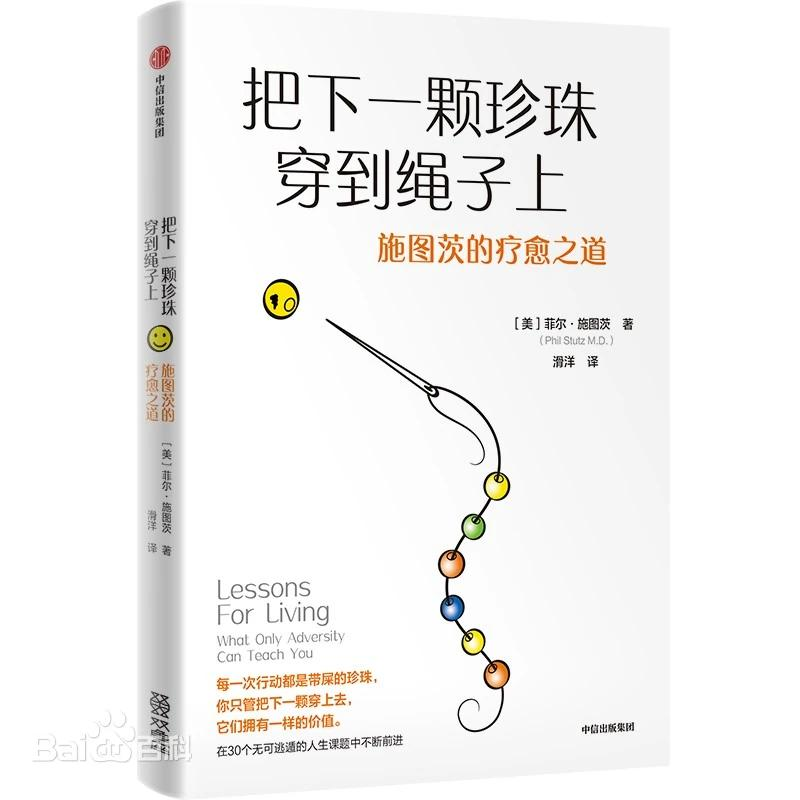

# 心理咨询师就是坐着听你倾诉？一部纪录片，揭秘这个行业的秘密

2026-04-25 11:00·[流心](https://www.toutiao.com/c/user/token/MS4wLjABAAAA3O6NGgbmK6N8xHtR_b6VM1aaMp2qI6WKW4RHJGrhuzA/?source=tuwen_detail)

作品声明：个人观点、仅供参考

最近又一次复看了**豆瓣9.0分、超6000人走心评价的心理纪录片《施图茨的疗愈之道》。**

菲利普·施图茨，世界一流的精神科医生，也被誉为“好莱坞一个公开的秘密”。

你有没有过这种经历——

心情糟糕到不行，花了几百块找一个心理咨询师，结果对方就坐在那里，安安静静地听你说了50分钟。

偶尔点点头，偶尔递张纸巾。

最后说一句："我们下次再聊聊。"

然后你走出咨询室，感觉……好像说了很多，又好像什么都没发生。

钱倒是花了不少。

**说实话，我之前也觉得心理咨询就是这样。**

直到我刷到一部纪录片。

等等，这不是你以为的那种纪录片

这部片子的导演是**乔纳·希尔**——对，就是那个演过《华尔街之狼》的好莱坞喜剧演员。

他找了自己的心理咨询师菲尔·施图茨，把两人之间真实的咨询过程拍成了一部纪录片。

**结果你猜怎么着？**

C罗在世界杯期间，专门发了一条动态引用这部片子里的话。

那句话说的是什么，能让C罗这种见惯大场面的人都专门截图分享？

**"现实的三个层面：痛苦、不确定性，以及持续的工作。"**

就这一句话，评论区炸了。

无数人说"被戳中了"。

为什么？

因为这句话太真实了。

真实到扎心。

# 好，让我们把镜头对准这个心理咨询师

菲尔·施图茨，现年70多岁，在洛杉矶执业了40多年。

他的病人名单说出来吓死人——好莱坞明星、商业大亨、世界冠军……

普通人想约他？门都没有。

但乔纳·希尔不一样。

他们认识十几年了，是病人，也是朋友。

所以当乔纳·希尔提出想拍一部关于他的纪录片时，施图茨答应了。

**然后他们聊了一些非常不一样的东西。**

# 这里面有个笑话，你先听听

在纪录片里，乔纳·希尔讲了一个笑话：

> "心理咨询有趣的地方在于——
> 你花钱请人听你说话。
> 你朋友也听你说话。
> 但区别是，你朋友会中途插嘴，疯狂给你提建议：'你应该这样，你应该那样！'
> 而你的咨询师只是安静地坐着，偶尔点头。
>
> 然后你还得多付300块。"

这个笑话太真实了，真实到有点扎心。

**但是——**

施图茨在听完这个笑话后，说了一句让乔纳·希尔都愣住的话：

"你说的对。传统的心理咨询确实是这样。"

"**但我的方法不一样。**"

# 不一样的在哪里？

施图茨的理论核心是三个工具**（Tools）**。

传统的心理咨询，核心是"谈话"——让你说出自己的问题，慢慢地、一点一点地理解它、接纳它。

这个过程可能需要几个月，甚至几年。

**但施图茨认为，这太慢了。**

他的病人来找他，很多已经处于崩溃边缘了。

今天晚上可能撑不过去的那种。

他们需要的是**能立刻起效的东西**。

所以他发明了一套"可视化工具"——

不是长篇大论的谈话，而是一些简单的、可以在脑海中进行的"练习"。

每次只要几分钟。

**但效果，纪录片里看，真的挺惊人的。**

# 第一个工具：珍珠串（String of Pearls）

施图茨说，我们的大脑有个讨厌的特点——**负面偏好**。

简单讲就是：好事不出门，坏事传千里。

你今天被夸了三次，可能第二天就忘了。但你被骂了一次，能难受一个礼拜。

这是进化给我们的"生存配置"，但在现代社会，它变成了焦虑和内耗的根源。

**珍珠串是什么？**

就是让你每天晚上，回想今天发生的三件好事。

不是大事，就那种很小的——

比如早上买的咖啡味道不错，比如路上没堵车，比如孩子今天主动说了"谢谢"。

把它们串起来，就像一串珍珠。

**这个动作看起来很简单对吧？**

但神经科学告诉我们——

大脑是会重塑的。你重复关注什么，就会强化什么神经通路。

每天练习感恩的人，大脑会真的变得更"擅长"发现美好。

三个月后，他们报告的幸福感明显高于对照组。

# 第二个工具：阴影（The Shadow）

这个工具稍微有点"重口"。

但特别适合那些对自己要求极高、极度追求完美的人。

**阴影是什么？**

想象你心里有一个"完美版本的你"。

那个你永远不会迟到、不会说错话、不会搞砸事情、不会被任何人讨厌。

我们每天都在努力扮演这个"阴影"。

累不累？累死了。

**施图茨的做法是：**

不要试图消灭阴影，而是把它当成一个"朋友"。

每次你犯了错、出了丑，第一反应不是自责，而是——

"哦，阴影又出来了。""它一直都在，没关系。""我不必消灭它，只需要和它相处。"

听起来很佛系对吧？

但这种方法在临床上有非常明显的效果——

完美主义者的拖延和焦虑，用这种方法干预后，显著下降。

# 第三个工具：感恩之流（The Gratitude Stream）

这个工具是施图茨在65岁以后才开发出来的。

**起因是他的身体出了问题。**

他的背部有严重的退行性病变，疼痛是常态。

有一次，他在极度痛苦中，做了一个"练习"——

他开始想象一股温暖的能量，从脚底一直流到头顶。

**不是那种玄学的东西。**

而是一种有意识的、主动的感恩练习。感恩自己的身体还在运转；感恩阳光、空气、水；感恩那些爱自己的人。

**他说，那一刻，疼痛还在。**

**但他不再被疼痛定义了。**

说到这里，你可能觉得——这不就是一些心理技巧吗？

是，但不完全是。

**这部片子真正厉害的地方，是它展现了两个人之间真实的脆弱。**

乔纳·希尔，好莱坞一线明星，财富自由，名利双收。

但他在施图茨面前哭了。

他承认自己有多年的抑郁和自我怀疑。

他承认自己拍这部电影，其实也是为了"自救"。

而施图茨呢？

这个被称为"能治愈整个好莱坞"的心理医生，在片中坦诚地说——

**他自己也有无法治愈的创伤。**

**他的父亲在他小时候抛弃了他和母亲。**

**他花了50年，都没有完全和解。**

两个如此成功的人，在镜头前如此坦诚。

**那一刻，你突然觉得——**原来大家都一样。都会有搞不定的事情；都会有深夜睡不着的时候；都会有"我是不是不够好"的念头。

# 所以，这部电影到底想告诉我们什么？

施图茨在片中说了一句很经典的话：

> "我们不可能每次都赢。我们不可能做到完美。我们无法控制这一点。"
>
> "但我们有不可阻挡的前进的意志。"

这句话是整部纪录片的灵魂。

**痛苦是真实的。**

不确定性是真实的。

我们永远无法消除它们。

**但我们可以学习与它们相处。**

可以给自己一些工具，一些"立即见效"的方法，让自己在最难熬的时刻，撑过去。

不是消灭痛苦，而是带着痛苦继续往前走。

**这才是真正的疗愈。**

# 写在最后

看完这部纪录片，我最大的感受是——

**原来心理咨询可以是这样的。**

不是那种漫长而模糊的"慢慢来"。

而是给到你具体的、可以马上用的东西。

**如果你也经常感到焦虑、迷茫、自我怀疑，**

**或者你觉得心理咨询"太慢""太贵""不知道有没有用"，**

**这部纪录片，值得你花96分钟看一下。**

它不会让你一下子变好。

但它会让你知道——**痛苦不是你的敌人。**

**我们都是一边挣扎，一边往前走的。**

