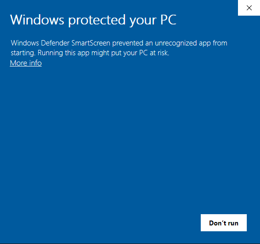
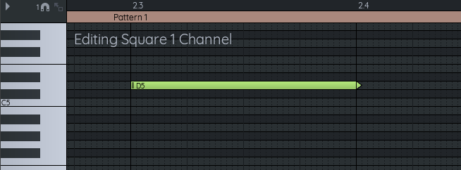
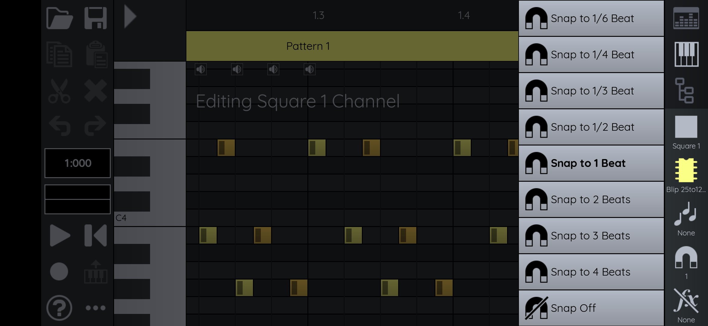

FamiStudio中文手册


# 欢迎

欢迎来到FamiStudio文档。请使用上方**的用户指南**菜单浏览各部分，或使用下方目录。此外，你也可以使用**搜索**按钮搜索特定主题。

# 目录

- [安装流程与故障排除](https://famistudio.org/doc/install/)
- [FamiStudio 基础](https://famistudio.org/doc/basics/)
- [编辑笔记](https://famistudio.org/doc/pianoroll/)
- [编辑模式](https://famistudio.org/doc/sequencer/)
- [剪辑乐器与琶音](https://famistudio.org/doc/instruments/)
- [歌曲编辑与项目](https://famistudio.org/doc/song/)
- [编辑DPCM采样](https://famistudio.org/doc/dpcm/)
- [导入歌曲](https://famistudio.org/doc/import/)
- [导出歌曲](https://famistudio.org/doc/export/)
- [使用扩展音频](https://famistudio.org/doc/expansion/)
- [清理你的项目](https://famistudio.org/doc/cleanup/)
- [配置FamiStudio](https://famistudio.org/doc/config/)
- [命令行处理](https://famistudio.org/doc/cmdline/)
- [NES/红白机音效引擎](https://famistudio.org/doc/soundengine/)
- [致谢](https://famistudio.org/doc/thanks/)
- [故障排除](https://famistudio.org/doc/troubleshooting/)
- [变更日志](https://famistudio.org/doc/changelog/)


# 一、安装

## 系统需求

对于所有3个桌面平台，FamiStudio都需要以下软硬件环境：

- Windows 8（64位）或更新版本
- macOS 10.15 “Catalina” 或更新版本
- .NET 运行时 8.0
- OpenGL 3.0 或更新版本的支持

## 窗户

### 安装

在Windows上，强烈建议使用安装程序并运行。这样可以解决所有依赖的安装。`Setup.exe`

如果你在运行便携应用时遇到问题，务必安装 .NET 8.0 运行时。

- [.NET 8.0 运行时](https://dotnet.microsoft.com/en-us/download/dotnet/thank-you/runtime-desktop-8.0.11-windows-x64-installer)

如果你收到VS2019 C++运行时错误提示，请务必安装以下包。

- [Visual Studio 运行时](https://aka.ms/vs/17/release/vc_redist.x64.exe)

### 首次发射警告

首次启动时，SmartScreen 可能会显示“Windows 保护了您的电脑”。



要绕过警告，只需点击“更多信息”，然后选择“无论如何运行”。


### Windows 7

Windows 7 没有官方支持。这意味着如果应用崩溃或无法正常工作，你只能自己解决。与 Windows 7 相关的 GitHub 问题或 Discord 上的 bug 报告将被忽略。

话虽如此，如果你愿意经历一些障碍，或许能让它成功：

1. 安装Visual Studio x64运行时，见上方链接。
2. 运行应用，跟着链接安装.NET 8.0，获取x64版本。安装后重启。
3. 运行这个应用。如果出现错误，下载[这个更新包](https://www.catalog.update.microsoft.com/Search.aspx?q=KB4457144)。下载Windows 7 x64版本，文件大约有235MB。安装并重启。`hostfxr.dll``.msu`
4. 运行应用。如果OpenGL初始化失败，可能需要使用软件渲染器。[Mesa](https://fdossena.com/?p=mesa/index.frag)是一个流行的渲染器，只需下载x64版本，并放在与之相同的文件夹中。注意使用软件渲染器会让应用运行更迟缓。`opengl32.dll``FamiStudio.exe`

## macOS

### 安装

在 MacOS 上，你需要安装 .NET 8.0 运行时。这里有一些来自Microsoft的直接下载链接。选择与你硬件相匹配的架构。安装适合你CPU的正确版本很重要，这样可以确保应用在你的Mac上原生运行。

- [.NET 8.0 Runtime](https://dotnet.microsoft.com/en-us/download/dotnet/thank-you/runtime-8.0.11-macos-x64-installer) for x64 （Intel）
- [.NET 8.0 Runtime](https://dotnet.microsoft.com/en-us/download/dotnet/thank-you/runtime-8.0.11-macos-arm64-installer) for ARM64 （M1/M2）

### 首次发射警告

GateKeeper 在刚运行应用时可能相当激进。一开始看起来你根本无法运行，它会给你一个选项，把FamiStudio扔进回收箱。


要绕过这个警告，打开“安全与隐私”设置，看看FamiStudio被屏蔽的警告。


点击“无论如何打开”，然后你会有启动它的选项。


## Linux

### 安装

Linux版本应该能在大多数x64扩展版上运行。但鉴于操作系统非常非标准，体验可能会有所不同。

在尝试运行Linux版本之前，请先安装以下依赖程序：

- [.NET 8.0 运行时](https://dotnet.microsoft.com/en-us/download/dotnet/8.0)

### 启动

然后只需用以下命令启动应用程序：

```undefined
dotnet FamiStudio.dll
```

如果你运行的是非常老旧的Linux版本，或者你用的是特殊架构，可能会缺少依赖。如果是这样，你可能需要编译一些库。这是一个相当手动的过程。请按照[GitHub](https://github.com/BleuBleu/FamiStudio)上的构建步骤操作。


# 二、概念

FamiStudio 项目包含：

- 歌曲列表
- 乐器列表
- DPCM样本列表
- 琶音列表

歌曲由Patterns组成，这些模式出现在NES支持的五个频道之一。模式包含由乐器演奏的音符（DPCM采样不需要乐器），可能指琶音。乐器的一些属性（音高、音量、琶音）可能通过包络进行调制。

# 基本桌面控制

大多数操作都是用鼠标完成的。总体来说：

- 左**键**可以添加和删除内容。
  - **单击**添加音符/模式。
  - **双击**可以删除音符/模式。或者也可以使用**Shift+点击**键。
- **右键**打开上下文菜单并选择内容。
  - 快速**右键点击**会打开一个右键菜单。
  - **右键按住+并拖拽**可以在钢琴卷轴或音序器中选择一系列音符或模式。
- **鼠标中键**用于导航：
  - **中键点击+并拖拽**可以平移视口。
  - **旋转鼠标滚轮**可以缩放视口的大小。

或者，如果你的鼠标没有中键或滚轮：

- 只要设置中启用“Alt+Left模拟中键”选项，所有需要按中键的操作都可以通过Alt+左键完成。
- 所有需要旋转鼠标轮的操作都可以通过Alt+右键点击，然后上下拖动完成。

如果你正在使用触控板，请查看如何在配置对话框中启用[触控板控制](https://famistudio.org/doc/config/#input-configuration)。

# 基本移动控制

在手机上，主要有三种手势：

- 快速**点一下**通常能添加内容。点击某些对象（音符、模式、乐器等）有时会在它们周围跳出**白色高亮**。当物体带有白色高亮时，你会允许你执行其他操作，比如移动它们。
- 在后台点击时，滑**动**通常会平移。在页眉上滑动可以选择时间范围。滑动带有白色高亮的物品通常会拖动或移动它。
- **长时间按**键有时会显示高级选项。

# 主窗口

主窗口有四个主要部分：

- 工具栏（顶部）
- 项目探索器（右侧）是添加/删除/编辑歌曲和乐器的地方。
- 序列器（工具栏下方）是你在5个通道之一调度节奏的地方。它提供了歌曲的整体视角。
- 钢琴卷轴（位于音序器下方）是你编辑节奏型的地方。


在任何时刻，总有：

- 选中的通道，在序列器中**以粗体显示**
- 项目探索器歌曲列表中**加粗**的精选歌曲
- 项目探测器仪器列表中**加粗**的选定乐器。
- 精选琶音，在项目探索者琶音列表中**以粗体显示**。

音序器和钢琴卷轴会显示当前选中的歌曲信息。按下钢琴卷轴上的按键时，它会为当前选择的乐器演奏音符，并在当前选择的通道上输出。如果你连接了MIDI键盘，情况也是一样。

# 工具栏

主工具栏里有你常用的功能：文件操作、撤销/重做、时间码、示波器和播放控制。


以下是每个工具栏图标的含义以及一些可以执行的额外操作。除非特别说明，额外操作需在桌面端右键点击，或在手机端长按完成。

|                             图标                             |              点击动作              |              附加操作 （桌面右键，移动端长按）               |
| :----------------------------------------------------------: | :--------------------------------: | :----------------------------------------------------------: |
|  |               新项目               |                                                              |
|  | Open FamiStudio 项目或其他文件格式 |               在桌面端，打开最近打开的文件列表               |
|  |              保存项目              |            打开一个右键菜单，选择“另存为......”。            |
|  |        导出为多种格式的项目        |       打开一个允许重复上次导出的右键菜单（如果有的话）       |
|  |              文案选择              |                                                              |
|  |              切割选择              |                                                              |
|  |                粘土                |    打开一个右键菜单，选择“特殊粘贴”（粘贴并有高级选项）。    |
|  |        删除选择（仅限手机）        |         在手机上，长按“特殊删除”（使用高级选项删除）         |
|  |                撤销                |                                                              |
|  |                重来                |                                                              |
|  |         变形/清理项目/歌曲         |                                                              |
|  |              应用设置              |                                                              |
|  |              播放歌曲              | 打开一个上下文菜单，可以从不同位置播放，调整播放速度，或者在[寻找时切换“完全模拟”](https://famistudio.org/doc/config/#sound-configuration) |
|  |            切换录制模式            |                                                              |
|  |             从起点开始             |                                                              |
|  |            改变循环模式            |                                                              |
|  |      切换QWERTY输入（仅桌面）      |                                                              |
|  |     切换弹出式钢琴（仅限手机）     |                                                              |
|  |           切换节拍器点击           |                                                              |
|  |             切换播放机             |                                                              |
|  |            切换跟随模式            |                                                              |
|  |   揭示隐藏工具栏按钮（仅限手机）   |                                                              |

## 提示

键盘快捷键或特殊操作总是以工具键显示在工具栏右上角。请持续关注，学习新功能。


## 播放/暂停歌曲

工具栏用于播放或暂停歌曲。另外，键盘也可以使用：

- 空**格**用于播放或暂停歌曲。
- **Shift+Space**从歌曲开头开始播放。
- **Ctrl+Space**从当前模式的开头开始播放。
- **Ctrl+Shift+Space**从歌曲的循环点开始播放。

## 改变播放速度

右键点击播放按钮会打开一个右键菜单，允许你将播放速度调整为1/2或1/4。这对听到非常小或短的音符很有用。


## 改变循环模式

循环模式有4种，但任何时候只能使用2种：

- **歌曲**或**无：**如果循环点是步进，则循环整首歌;如果没有循环点，则在结尾停止。
- **Pattern** 或 **Selection**：如果序列器中没有选择，会循环当前 Pattern。如果有选择，会循环覆盖该选择。工具栏中的图标会反映这一点。


## 切换节拍器

通过点击工具栏上的图标即可启用节拍器。节拍器会在每拍时滴答作响，只有在歌曲播放时才会工作。

## 拯救项目

点击图标“保存项目”，右键点击会打开一个右键菜单，允许你“另存为......”，并提示你更换新文件名。

## 导出到各种格式

请参阅[导出](https://famistudio.org/doc/export/)部分，了解如何导出为各种格式。

## 清理对话框

请参阅清理部分，了解如何清理您的项目。

## 配置对话框

请参阅[配置](https://famistudio.org/doc/config/)部分，了解如何配置FamiStudio。

# 探索者计划

项目浏览器会显示当前项目中的歌曲和乐器列表。


有关Project Explorer的更多详情，请查看以下部分：

- [歌曲编辑与项目](https://famistudio.org/doc/song/)
- [剪辑乐器与琶音](https://famistudio.org/doc/instruments/)

# 音序器

音序器是你整理歌曲高层结构的地方：哪些模式播放，何时播放。音序器中图案的缩略图绝非准确。请访问[编辑模式](https://famistudio.org/doc/sequencer/)部分了解更多详情。


你可以通过点击左上角那个小巧的“好奇角色”图标来隐藏没有任何图案的频道。这被称为“羞怯模式”，借鉴自Adobe After Effects。


# 钢琴卷轴

钢琴卷轴是你编辑歌曲实际音符、乐器包络以及一些特效的地方。


请查看[编辑笔记](https://famistudio.org/doc/pianoroll/)部分了解更多细节。

通过按下右上角的小极限按钮，或按**键盘上的1**，可以将钢琴卷轴最大化到全屏。


# 快速访问栏（仅限手机）

“快速访问栏”是移动版专用的，位于屏幕右侧（竖屏时是底部）。内容会根据上下文变化，但通常会给你一系列方便的快捷方式（比如切换当前频道、乐器等），让你不用在其他视图之间来回切换。


# 弹出式钢琴（仅限手机）

手机版独有的另一个小功能是弹出式钢琴，可以预览乐器的声音。这也用于录制模式，后面文档会详细介绍。


# 键盘快捷键

以下是一些有用的快捷键列表：

- **空间：播放**/停止停车
- **进入**：切换录制模式。
- **Ctrl+Space**：从当前模式的起点开始播放。
- **Shift+Space**：从歌曲开头播放。
- **Ctrl+Shift+Space**：从歌曲的循环点（如果有的话）播放。
- **首页**：回溯到歌曲开头。
- **Ctrl+Home**：寻找当前模式的起点。
- **ESC**：停止任何残留的声音，停止录制模式，清除选择。
- **Ctrl+Z**：撤销
- **Ctrl+Y**：重做
- **Ctrl+N**：新项目
- **Ctrl+S**：保存
- **Ctrl+Shift+S**：另存为......
- **Ctrl+E**：导出
- **Ctrl+Shift+E**：重复上次导出
- **Ctrl+O**：打开
- **Shift+Q**：切换QWERTY键盘输入。
- **删除**：删除选定的模式或笔记。
- **Escape**：取消选择模式或音符，停止任何卡住播放的声音。
- **F1......F24**：切换活跃频道（如果你启用了扩展音频，可以超过5个）。
- **Ctrl+F1......F24**：强制显示通道。（如果你开启了扩展音频，会超过5个）。
- **1**：切换最大化钢琴卷轴。
- **Ctrl+1**：切换效果面板。
- **Shift+S**：在钢琴卷轴中切换卡扣。
- **Alt+1**、**Alt+2**、**Alt+3**、**Alt+4**：将瞬移精度分别调整为1拍、1/2、1/4和1/8拍。
- 页面**上下**：QWERTY键盘的shift八度。

一些专为音序器设计的快捷键：

- **L+Click**：将环点设定在点击的图案上。

以下是一些专门针对钢琴卷轴的键盘快捷键：

- **R+Click**：添加发布说明。
- **S+点击**（并拖动）：创建或编辑幻灯片笔记。
- **A+Click**：切换音符的起音。
- **I+Click**：乐器选择器
- **T+Click**：增加一个孤儿音。
- **Shift+S**：切换切换。

当QWERTY键盘输入激活时，部分按键会被覆盖以支持钢琴输入。这是美国本土键盘的默认布局。[配置对话框](https://famistudio.org/doc/config/)允许重新映射其他类型键盘的按键。


------

文档用[MkDocs](https://www.mkdocs.org/)构建


# 三、编辑笔记

钢琴卷轴是你编辑歌曲实际音符、乐器包络以及一些特效的地方。


你也可以点击钢琴来预览乐器。当前选择的乐器（项目浏览器中以**加粗**显示）将在当前选择的通道上播放（在音序器中以**加粗**）。

## 细分

钢琴卷轴中的水平线条与钢琴音符对齐。垂直线代表多个细分层次：

- 细划线灰色分隔单个帧（NTSC为1/60秒，PAL为1/50秒）（仅限FamiStudio节奏模式）
- 细灰色线条分隔音符
- 细黑线分隔节拍
- 粗黑线分隔了图案

在FamiTracker的节奏模式下，你无法查看单个帧数，所以划线不会显示。


有关速度的更多信息，请参阅[本节](https://famistudio.org/doc/song/#editing-song-properties)。

## 寻求

点击钢琴卷轴的时间线（标题）可以移动播放位置。你也可以把寻点往后拖，这样移动更准确。

## 添加与删除音符

点击音序器中的某个模式会将钢琴卷轴滚动到其所在位置。

在桌面端，左**键点击**钢琴卷轴会添加当前选中的乐器音符，拖曳并按住左键可以设置时值。如果你点击了没有图案的区域，图案就会自动生成。**双击**可以删除笔记。或者，**Shift+点击**也会删除。


另一种删除多个音符的方法是使用**橡皮擦模式**，只需双**击**或**Shift+点击**后按住并拖动鼠标即可。光标会变成铅笔橡皮，方便你快速删除笔记。


同样，在手机上，笔记只需快速点击即可生成。


你可以通过**双击**删除单个音符。橡**皮擦**模式通过双**击**、**长按**（类似长按）并在看到手指周围的白色圆圈后拖动手指来激活。

## 音符移动与调整大小

当鼠标在钢琴卷轴上移动时，鼠标光标下方的音符会被高亮，鼠标光标也会根据你能执行的动作类型变化：


可能的措施包括：

- 移动一个或多个音符
- 调整一个或多个音符的大小
- 调整一个或多个音符的释放点

在移动端，笔记必须先通过点击一次给**白线高亮**，然后才能进行编辑。只有他们有这个功能，你可以移动或调整尺寸。


## 快速复制笔记

在桌面端，快速复制笔记的一种方法是按住**Ctrl**并拖动选区。它会复制选择，让你把新笔记放在你想要的位置。


另一种实现类似效果的方法是使用带有“重复”选项[的特殊导热膏](https://famistudio.org/doc/pianoroll/#special-paste)。

## 音符时值与优先级

FamiStudio 是一款单声道应用，换句话说，在同一频道上一次只能播放一个音符。

一般规则是，最新/最新的音符（时间线上最右边的音符）总是优先级，这意味着它可能会打断之前的音符，使音符比平时更短。

正如你所见，在下面的例子中，即使我试图调整左音的大小，我也无法超过右音。如果我现在把右音往后移，它仍然打断左音。只有当我把右音移到足够右边时，才能看到左音的真实时值。


## 选拔音符

选择音符主要有三种方式，选中的音符会带有粗银色边框。

- 你可以通过**右键点击并拖**动钢琴卷轴的头部或钢琴卷轴背景中没有音符的任意位置来选择音符。
- 你可以在右**键点击**音符上下方时，通过右键菜单选择音符的时长。
- 你可以通过右**键点击**标题时弹出的右键菜单选择整个模式或整首歌曲。

以下图片展示了所有三种技术。


选中音符后，可以一次性移动或调整大小。它们也可以通过键盘阵列键（上下、左、右）来移动或移调。同时按住**Ctrl**键，音符会以更大的幅度移动。

在手机上，选择音符的方式是滑动钢琴卷轴的标题。在背景长**按**可以清除音符。


## 释放点

释放点会触发包络跳到释放点，通过使音符变细来表示。释放包络有助于在释放时很好地淡出音符，同时保留颤音等其他效果。在没有释放包络的乐器上添加释放点毫无意义。

要在桌面上设置音符的释放点，只需**右键点击**音符，然后选择“切换释放”选项。或者，你也可以按住**R**键点击音符来切换释放。

一旦音符有了释放点，可以通过拖动来移动。


在手机上，释放点可以通过长按音符并选择“切换释放”来切换。释放的默认位置会在音符的中间，但你可以之后移动它。


## 音符

停止音只是停止声音，并以小三角形的形式显示。虽然它们显示在前一个音符旁边，但实际上没有音高或乐器，只是停止声音。

要在桌面上创建停止音符，右**键点击**某个音符并选择“创建停止音符”。或者，你也可以用**T+点击**创建停止音符。

> 自 FamiStudio 3.0.0 起，停止音不再需要，因为它们已被音符时值所取代。在检测到音符时值不一致时，停止音仍然会保留，但这类情况相对较少。一个有用的使用场景是中断之前模式中的长音符。



## 乐器选择器

你可以通过在音符右键菜单中选择“让乐器当前”，将音符所用的乐器设置为被选中的乐器。在绘图软件中，这通常被称为滴管或移液器工具。

或者，在桌面端，你可以按住**I**键点击笔记。


## 录制模式

录音模式是输入笔记的另一种方式，通过按下工具栏上的录制按钮来启用。录音模式允许通过MIDI控制器输入音符，或在QWERTY键盘上使用钢琴式布局。这种布局和FamiTracker使用的非常相似。请注意，这不是“实时”录音模式，而是一种逐音符输入模式。

这是美国本土键盘的默认布局。[配置对话框](https://famistudio.org/doc/config/)允许重新映射其他类型键盘的按键。


QWERTY键盘输入可提供大约2.5个八度的音域。默认情况下，这个位置会从C3移动到C5，但可以通过按下**Page Up**和**Page Down**来上下移动。哪个键盘键映射到钢琴卷中显示的哪个钢琴键。


当录制模式激活时，寻道条会变红。你输入的每个音符都会被吸附到当前吸附的精度（关于吸音的信息请见下一节），寻道条会前进到下一个吸附位置。

在录制模式激活时，还有一些其他特殊按键被启用：

- **退格**键：向后移动1个音符（或断音间隔），擦除音程内的任何音符。
- **Tab**：按1个音（或断音间隔）推进，不记录任何东西。
- **Page Up/Down**：通过上下移动可用QWERTY键盘输入的八度范围。

在手机上，录音模式会自动弹出钢琴，每个弹奏的音符都会被录制下来。


## 啪嗒声

快拍可以帮助你保持音符与网格对齐。

可以通过点击钢琴卷左上角的小磁铁来切换。**Shift+S** 还可以快速切换卡扣开关。

通过右键点击磁铁并选择不同的精度，可以调整弹指的精度。或者，你也可以把鼠标滚轮绕过磁铁旋转。


吸附精度以*节拍*表示（在头部编号为x.1、x.2、x.3等）。所以在默认设置下，弹指精度为1时会变成四分音符。目前，添加、选择和拖动笔记是唯一受吸附影响的操作。未来可能会根据用户反馈添加更多内容。

当吸附开启时，随时可以按住**Alt**暂时禁用它。

还有一个选项可以吸附效果值。启用后，效果面板中新创建的效果值会被吸附到所需的精度。

以下键盘快捷键可用于切换常见的吸附值：

- **Alt+1**：将吸附设置为1拍。
- **Alt+2**：将吸附设置为半拍。
- **Alt+3**：将吸附设为1/4拍。
- **Alt+4**：将拍动设置为1/8拍。

在手机上，快照的精度是通过快速访问栏设置的，大小合适，但操作方式类似。



## 音符攻击

默认情况下，音符会有一个“起点”，意味着它们会从头开始重新调整包络（音量、音高等）。这由每个音符左侧的小黑矩形表示。对于调频乐器来说，这意味着要重新触发它们的ADSR包络。

通过在音符菜单中选择“切换攻击”选项，可以切换特定音符的攻击。或者，你也可以按住**A**键点击音符来切换其攻击。同样，在手机端，切换音符攻击是通过长按音符并选择“切换攻击”来实现。

在这个例子中，第一个音符会有攻击音，而第二个音符没有。


由于包络不会被重置，这意味着如果一个音符被释放，即使后续音符没有起音，该音符仍会保持释放状态。


关于何时可以禁用攻击，有一些规则：

1. 如果音符使用了与前一个音相同的乐器，你可以关闭攻击。
2. 如果乐器不同但包**络线相同**，你可以禁用攻击。这在FM频道（VRC7或EPSM）中切换音色时非常有用。注意N163不支持此功能，仪器必须相同。

未遵守这些规则将显示“空洞”攻击，表示你违反了两条规则中的一条。在下面的例子中，绿色仪器的包络并不相同。我们会在未来版本中进一步放宽这些规则，以支持更多使用场景。


最后请注意，导出时通常不会带到FamiTracker，除非是幻灯片笔记相关的特定用例。

## 幻灯片笔记

滑棒音是指从某一特定音高（音高）开始，逐渐变化到目标音高，即三角形结束处。在这个例子中，第二个音符的攻击也被禁用。


滑棒音保证在音符结束时（三角形末端）会达到目标音高，但这可能比视觉表现显示的要早一些。尤其是在高音域。这是因为音高计算全部基于整数（分数为1位），通常无法获得准确的斜率以达到音高。

要创建滑棒笔记，只需在笔记上下文菜单中选择“切换滑动笔记”，并调整目标笔记。在桌面端，你也可以按住 **S**，点击笔记，然后上下拖动来创建幻灯片笔记。

## 琶音

琶音（不要与琶音乐器包络音混淆）通常用于通过非常快速地弹奏变化音符来模拟和弦。音符可以选择性地与琶音相关联，就像它有乐器一样。当使用琶音时，该琶音所用的音符会以半透明的方式显示，额外的音符则会采用相应琶音的颜色。请注意，为了保持简洁，琶音内的单个音符序列不会显示。


你可以像替换乐器一样，更改与音符关联的琶音。你可以选择新的琶音并点击已有的音符。或者你可以选择几个音符，然后从项目资源管理器中拖拽琶音到选择中。

如果乐器使用琶音包络线，同时使用琶音和弦，和弦将接管并完全覆盖乐器的琶音包络线。

## 更换乐器

要替换音符所用的乐器，只需拖动该音符上的乐器即可。要一次替换多个音符，只需创建一个选区并拖动乐器。


要替换选择中的特定乐器，你可以右键点击选中任意音符，右键菜单会提示你用当前选择的乐器替换该音符的乐器。


在手机上，你可以先选曲，然后在快速访问栏长按乐器，再选择“替换选曲乐器”来替换乐器或琶音。

对于特定的乐器更换，只需长按选区中的音符即可进入内容菜单。


## 复制粘贴笔记

就像音序器一样，选中的音符可以通过按**Ctrl+C**（或**Ctrl+X**）来复制（或剪切）。然后你可以把选曲移到别处，用**Ctrl+V**粘贴这些音符。

### 项目间的复制粘贴笔记

可以将一首歌的音符复制到另一首歌，或从一个项目复制到另一首。在此过程中，FamiStudio 会首先寻找可能存在的冲突，比如同名的物品（乐器、琶音、采样或模式），或者缺少的物品。如果检测到冲突，你需要选择如何解决这些冲突。

更具体地说，FamiStudio 能够识别粘贴数据中是否包含当前项目中不存在的数据。例如，如果你粘贴的音符涉及“钢琴”乐器，但项目中没有该乐器，你可以选择将其带入项目中。

此外，FamiStudio可能会检测到粘贴数据中的某些物品名称与现有物品相同，但看起来不同。例如，如果你粘贴了包含“模式1”的数据，但当前歌曲也有“模式1”，但它们包含的音符并不完全相同。对于这些数据，你会选择假设它们相同，或者重新命名输入数据并保留两者（“模式1”会被重命名为“模式2”，或者任何未使用的数字）。


## 特殊膏状物

“特殊粘贴”是更高级的粘贴形式。它用于粘贴音符而不使用相关效果或音量轨（或反过来），或者仅仅粘贴特定效果。你可以通过按**Ctrl+Shift+V**来使用“特殊粘贴”。这会弹出一个对话框。


- **与现有笔记混合**：粘贴的默认行为是完全替换成剪贴板的内容。使用“与现有音符混合”选项可以保留所有现有数据（音符、音量、效果），只有在没有新数据时才会插入。
- **粘贴笔记**：将粘贴实际的笔记（包括幻灯笔记和琶音信息）。
- **粘贴效果**：你可以选择要粘贴的效果列表。未勾选的效果不会被粘贴。
- **重复**：你可以多次重复同一个粘贴操作，快速重复一串音符/效果值。下一个粘贴的开始会是上一个粘贴结束的地方。

在移动端，同样的功能可以通过长按工具栏的“粘贴”图标访问。对话框看起来会不同，因为包含相同的功能。


## 特殊删除

与特殊粘贴类似，“特殊删除”是更高级的删除形式。你可以通过选择一系列音符并按 **Ctrl+Shift+Delete** 来弹出特殊的删除对话框。


- **删除笔记**：如果勾选，将删除所有选中的笔记。
- **删除效果**：你可以在这里选择要删除的效果列表。所有未受控制的效果将被保留。下一个膏的开始会是上一个结束的地方。

在手机端，同样的功能也可以通过长按工具栏的“删除”图标来实现。对话框看起来会不同，因为包含相同的功能。


## 剪辑效果

通过点击钢琴卷左上角的小三角形打开效果面板。在手机上，你可以通过[快速访问栏](https://famistudio.org/doc/basics/#quick-access-bar-mobile-only)在钢琴卷轴中选择想编辑的效果。

通过选择 和 效果并向上或向下拖动来修改效果值。双击效果值会删除它。对于具有巨大数值的效应（如FDS深度），它们可能会以对数方式变化。你也可以按住Shift来微调精确数值（移动1像素会让数值变化1）。

以下是所有支持的效果，请注意并非所有效果都能在每个频道使用。有些甚至是针对特定扩展或节奏模式的。


### 音量

音量轨道决定当前通道应该播放的音量。该音量与音量包络通过乘法结合（50%音量轨道 × 50%包络体积 = 25%总音量）。尽可能使用音量包络线，只用音量轨道来控制歌曲的全局音量，效率更高。

音量轨道允许滑动以平滑升降音量。

音量幻灯片的创建方式与普通幻灯片笔记完全相同，可以通过右**键点击**效果值后出现的上下文菜单，或按住**S**键，点击效果值并向上或向下拖动来实现。

这些幻灯片采用不动点算术，精度有限。它们最多每16帧会上下1个音量单位。非常缓慢或较长的幻灯片可能比其视觉表现更早结束。


在手机上，长按音量值并选择“切换音量幻灯片”即可创建音量幻灯片。


### 颤音深度与速度

颤音的深度和速度用于为歌曲的一部分增加颤音，而无需自己创造新乐器。请注意，颤音会暂时覆盖当前乐器上的任何音高包络。当颤音被禁用（通过将深度或速度或两者都设置为零）时，乐器基本上没有音高包络，直到弹出新的音符。

颤音的深度值与FamiTracker相同，但速度略有不同。请参阅[导出](https://famistudio.org/doc/export/)页面，查看一张在FamiStudio和FamiTracker之间映射的表格。

在当前的实现中，改变颤音的速度/深度很可能导致“爆音”，因为这会从头开始重启颤音包络，即正弦波。话虽如此，如果你想这么做，只要你仔细考虑一个完整周期的帧数，并在恰当的时间调整它是可行的。设置起来会很繁琐，但可以做到。

这里有一张颤音速度效果每个值的周期（帧内）。

| 颤音速度 | 周期（以帧为单位） |
| :------: | :----------------: |
|    1     |         64         |
|    2     |         32         |
|    3     |         21         |
|    4     |         16         |
|    5     |         13         |
|    6     |         11         |
|    7     |         9          |
|    8     |         8          |
|    9     |         7          |
|    10    |         6          |
|    11    |         5          |
|    12    |         4          |

例如，如果你从速度5开始颤音，你可以每13帧无缝切换颤音，因为你正处于循环的开始阶段。

### 音高

控制轨道的全局音高。可以用来让整个通道稍微走音。

### 工作周期

允许在不使用占空比包络的情况下更改仪表的占空比。这只会影响没有占空比包络的仪表。这个效果主要是为了与FamiTracker的兼容性而存在。除非你有特殊情况需要频繁更改占空比，否则你应该始终选择创建不同的仪表，而不是使用这个效果。

### 速度

这会改变 FamiTracker 节奏设置的速度参数，且仅在 FamiTracker 节奏模式下可用。数值越大，歌曲滚动速度越慢。有关节奏管理的更多信息，请参阅[“编辑歌曲与项目](https://famistudio.org/doc/song/)”部分。

### 音符与切音延迟

音符延迟允许在音符被演奏时延迟几帧，而切音延迟则会在几帧后停止音符。这也只在FamiTracker的节奏模式下可用。请参阅[“歌曲与项目编辑](https://famistudio.org/doc/song/)”部分，了解更多关于节奏管理的信息。

### DAC（仅DPCM通道）

DPCM通道独有，可用于手动设置当前DAC值。它可以用来人工制造“流行”音效，无需任何采样，或者由于NES/Famicom的非线性混音，稍微影响噪声/三角通道的音量。

### 相位重置

在支持的信道上，如果存在此效应，会重置相位。可以用来确保两个通道的波形完美对齐，产生创造性或破坏性干扰。请注意，在使用相位重置时，建议使用[“完全模拟](https://famistudio.org/doc/config/#sound-configuration)”选项。相位重置极其时间敏感，应用内和真实硬件/模拟器上的声音可能完全不同，未来版本中准确的时序甚至可能有所变化。

### FDS调制速度/深度（仅FDS扩展）

这些仅在使用FDS音频扩展时提供。这些可以用来改变调制速度/深度。请注意，使用自动调制的乐器不能手动更改速度。

此外，乐器会在每个有攻击音符时不断重置调制速度/深度到乐器的数值。换句话说，它会在每个音符攻击时失去效果，需要重置以覆盖乐器。

### 环境周期（仅限Sunsoft 5B和EPSM方格）

对于启用包络且不使用自动音高功能的乐器，控制包络的音高/周期。注意，由于包络在三个通道中共享，这种效应可能会影响其他方形通道。

此外，启用包络的乐器会在每个带有起音的音符上持续重置包络频率至乐器的数值。换句话说，它会在每个音符攻击时失去效果，需要重置以覆盖乐器。

### 速度（仅限Famitracker-Tempo）

改变FamiTracker节奏的“速度”参数。

### 音符延迟和切断延迟（仅限Famitracker-Tempo）

这两个效果分别用来使音符的开始和结束时，按特定帧数偏移。这是使用FamiTracker节奏时实现帧粒度最主要的方法。例如，音符延迟为2时，该音符会比正常延迟2帧触发。

------

文档用[MkDocs](https://www.mkdocs.org/)构建。


# 四、编辑模式

音序器是你决定哪个模式何时播放的地方。模式是歌曲中的一小部分，通常固定长度，且很可能被重复出现。

图案分布在NES支持的五个通道之一（如果你启用扩展音频，则更多）。


## 寻求

点击音序器的时间线（头部）会移动播放位置。你也可以把寻点往后拖，这样移动更准确。

## 更换有源频道

点击频道会变成活跃频道。或者，你也可以按键盘键**F1......F5**（如果用扩展键可以按更多）快速切换活动通道。

## 静音与独奏通道

**点击**频道图标（方形、三角形、噪声、DPCM）会切换静音。**双击**可以切换单人模式。或者，你也可以**右键点击**频道名称，进入一个上下文菜单，提供这些选项。

在手机上，这可以通过长按通道名称来完成，无论是在音序器里，还是快速访问栏。

## 部队显示通道

点击频道名称旁的小眼睛图标会强制显示在钢琴卷轴中。或者，你也可以按键盘键 **Ctrl + F1......F5**（如果用扩展则更高）。你可以通过**双击**眼睛图标强制显示所有频道。


强制显示的通道在钢琴卷中会显得暗淡。这在多个声道之间和声或编辑鼓组模式时非常有用。


在手机上，这可以通过长按通道名称来完成，无论是在音序器里，还是快速访问栏。

## 添加与移除图案

你可以通过**左键点击**空格来添加新图案。**双击**图案会删除它。

## 编辑模式

点击模式后选择该模式，并在该模式所在位置打开当前通道的钢琴卷轴。

右**键点击**图案（或在手机上长按）会显示一个包含多种选项的上下文菜单。选择“模式属性......”允许重命名和更改其颜色（图案名称需为每个通道唯一）。


## 选择模式

你可以通过**右键点击并从头条拖动**来选择整列图案。你可以在序列器里右**键和拖拽**任意模式位置进行矩形选择。

要取消所有选项，只需按**Esc**键。当选择多个图案时，只能在图案属性中编辑颜色。


在手机端，你可以通过从头部滑动来选择完整的图案列。你可以先选择一个图案，然后长按其他位置，选择“展开选择”来实现矩形选择。


## 移动与复制模式

当选择一个或多个图案时，拖动它们会在时间线上移动。拖动时，按住**Ctrl**键会创建该图案的另一个实例。实例是与原始图案关联的副本，名称和颜色相同。修改一个实例会修改所有实例。拖曳时会显示“链接”图标。


拖拽时按住**Ctrl+Shift**会创建一个完全独立的选中图案副本。拖曳时会显示“复制”图标。他们将在此过程中被重新命名。


拖拽图案到不同通道会创建副本，但会删除原始图样。这是因为内部模式无法跨渠道共享。图样可以在过程中被重新命名。按住 **Ctrl+Shift** 可以保留原始版本（创建副本）。


在移动端上，图案也可以以类似方式移动，但必须先点击才能获得白色高光。要创建一个或多个图案的副本/实例，先选一个，然后长按你想复制它们的位置。


## 复制粘贴模式

当选择一个或多个模式时，按**Ctrl+C**（或**Ctrl+X**切换）。把选区移到别处，然后用**Ctrl+V**粘贴。复制粘贴总是会形成模式实例。

### 项目间复制粘贴模式

项目间可以复制粘贴图案。在此过程中，FamiStudio 会假设同名图案相同。如果找不到图案，它会提供你为自己创建的方案。

例如，如果你把一个名为“Chorus1”的模式从一个项目复制到另一个项目。如果没有发现此类模式，则会被复制。否则，如果第二个项目中发现了名为“Chorus1”的现有模式，它会假设它与此相同。

在内奏模式中，无论是音符还是乐器，规则[也](https://famistudio.org/doc/pianoroll/#copy-pasting-notes-between-projects)相同。

## Paste 特别版

按下**Ctrl+Shift+V**会打开**“粘贴特殊**”对话框，提供比普通粘贴更多的选项。


- **插入**：将插入复制的图案，并将所有现有图案向右移动。
- **延长歌曲**：会延长歌曲时长以适应新插入的模式（仅在启用插入时可用）。
- **重复**：允许连续多次粘贴复制的图案。

在手机端，同样的功能也可以通过在音序器中长时间按“粘贴”按钮来实现。


## 设置环点

**循环点**是歌曲结束后重复的地点，用一个小箭头表示。


你可以通过**右键点击**（或在手机上长**按**）在页面标题中移动或完全移除环点，然后从右键菜单中选择相应选项。或者，你也可以按住**L**键，点击音序器中的某个位置。

## 自定义模式设置

右**键点击**序列器的头部，选择“自定义图案设置......”可以让你为一列或多列的图案设置一些自定义设置。这样你就可以调整音符数量和速度参数。

这个对话会根据你使用的节奏模式而有很大不同。想了解更多关于节奏模式的信息，请查看[项目属性部分](https://famistudio.org/doc/song/)。

|                       FamiStudio Tempo                       |                       FamiTracker 节奏                       |
| :----------------------------------------------------------: | :----------------------------------------------------------: |
|  |  |

启用**自定义模式**可以更改数值。一旦图案拥有任何自定义设置，它将不再取歌曲属性中的数值，而是在序列器中索引旁标注星号**（\*）。**

这里的参数与编辑[歌曲属性](https://famistudio.org/doc/song/)时相同，但局限于一列模式。

在移动端，同样的功能也可以通过长按序列器头部并选择“自定义模式设置”来实现。


------

文档用[MkDocs](https://www.mkdocs.org/)构建。


# 五、剪辑工具

项目浏览器会显示当前项目中的歌曲和乐器列表。本节只会讲到乐器编辑和琶音。请参阅[“编辑歌曲与项目](https://famistudio.org/doc/song/)”部分，了解如何编辑项目和歌曲属性。


大多数标准乐器有5个按钮：

- 工作周期包络
- 体积包络
- 音高包络
- 琶音包络
- DPCM样本

包络只是一个参数，随着音符演奏的时值会变化。它可以用来制造颤音、颤音，比如改变音符的起音和释放。如果某件乐器目前没有特定类型的包线，它会显得暗淡。

扩展乐器可能有不同的包络类型。有关扩展音频乐器的详细信息，请访问[扩展音频部分](https://famistudio.org/doc/expansion/)。

## 乐器属性编辑

点击乐器旁边的小齿轮图标（或**右键点击**并选择“乐器属性......”）会显示其属性（名称和颜色）。像FamiStudio中的大多数功能一样，你可以重命名乐器和更改它的颜色。


大多数乐器也有参数，可以通过点击乐器左侧的小箭头实时编辑。


大多数仪器可用的参数：

- **音高包络**：定义FamiStudio如何解读音高包络中的数值。
  - **绝对：**FamiStudio 默认的音高范围是绝对的。也就是说，你输入的音高包络值就是你将听到的音高。这对颤音尤其有用，因为你可以画出一个简单的正弦波。
  - **相对**音高包络：相对音高包络会在每一帧反复加包络值。例如，一个单一值为+5的包络，在第1、2、3帧等时会产生5、10、15的音高。用顺序来说，你控制的是音高的变化，而不是音高本身。这有助于创造快速上升或下降的音高（例如：低音鼓效果）。这就是FamiTracker处理音高包络线的方式。

对于某些数值参数，可以通过选择“输入值......”来使用键盘输入该值。在右键菜单中选择。


## 乐器添加

你可以按“+”符号添加乐器，右键点击并选择“删除乐器”来删除一个乐器。删除乐器会删除该乐器使用的所有音符。

## 用另一件乐器替代一件乐器

在整个项目中，你可以右键点击乐器并选择“替换乐器......”。这会弹出一个列表，让你选择新乐器。这在移动端上类似，只是列表颜色更少。


## 乐器进口

你可以通过点击小文件夹图标导入项目中任何支持的输入格式中的乐器，也可以导入FamiTracker乐器文件（FTI文件，仅限官方FamiTracker 0.4.6）。

从其他项目或FamiTracker文件导入乐器时，系统会提示你要导入的乐器列表。只需检查带过来的仪器即可。

此外，当从另一个使用 DPCM 采样的 FMS 文件导入乐器时，你也可以导入该项目中的“DPCM 乐器”。这样可以导入所有采样及其对钢琴键的分配。


请注意，使用不兼容扩展音频的乐器将无法导入。此外，同名乐器也被假定为同一个乐器。如果你的项目已经包含一个叫“钢琴”的乐器，然后你尝试导入另一个叫“钢琴”的乐器，就不会有任何反应。歌曲也是如此。如果乐器不同，你有责任为它们单独命名。

## 组织工具

你可以在项目资源管理器里按“+”键创建一个小文件夹。可以为歌曲、乐器、DPCM采样和琶音创建文件夹。文件夹不能包含其他文件夹，因此这是一个单层层级结构。文件夹外的物品排序总是高于文件夹。

要在文件夹内移动物品，只需将其拖入相应的文件夹即可。文件夹本身可以重新排序，并且遵守分类规则。如果启用排序功能，文件夹和里面的物品都会被排序。手动移动文件夹或物品会关闭自动排序功能。

如果你右键点击某个文件夹，还有可以折叠/展开所有文件夹的快捷方式。


## 编辑乐器包络

点击项目资源管理器中的包络图标，会打开该乐器的包络在钢琴卷中。信封长度可以通过**点击并拖动**右上角的小箭头图标来调整。将包络长度设置为零，实际上会禁用它。


包络线的环点可以通过在标题底部左**键点击**或使用上下文菜单来设置。

音量轨道（以及N163波形包络）也允许有释放点。当遇到释放音符并跳转到释放点结束循环时，会播放释放音符。这对于平滑地淡出音符很有用。

释放点可以通过**右键点击**页首底部或使用上下文菜单来设置。


在手机上，你可以通过点击信封来单独编辑。但更自然的绘制信封的方法是先**长按，**等待提示，然后画出信封形状。


## 复制包络值

右**键点击并拖**动包络编辑器可以选择包络值的范围。这些内容可以复制粘贴到其他地方。


也可以粘贴来自原始文本的信封值。任何由空格、制表符、逗号、分号或换行分隔的数字序列，都可以粘贴到信封编辑器中。

如果你想在其他应用中使用，也可以把信封值复制成文本。当有有效选择时，使用右键菜单中的“复制选中值为文本”选项。

## 复制信封

点击一个包络按钮并拖动到另一个乐器上，可以将该包络从第一个复制到第二个。注意，与FamiTracker不同，包络线不会在乐器之间明确共享。导出为不同格式时，相同的信封会合并使用，但你有责任优化内容，确保限制独立信封数量。

在手机上，你首先需要点击乐器一次，让包络周围出现白色高亮，然后你可以把乐器拖到另一个乐器上。


## 复制DPCM采样映射

你也可以把整个DPCM采样分配（哪些采样分配到钢琴哪个调）从一个乐器复制到另一个乐器，方法是把小DPCM图标从一个乐器拖到另一个乐器。


在手机端，你首先需要轻点乐器一次，白色高光就显现出来。

## 清除或删除包络

信封本身不能被删除，可以被清除，但基本上没有任何效果。要清除包络并加包络，只需在乐器菜单中选择“清除包络”选项即可。

# 编辑DPCM采样

DPCM样本在[DPCM](https://famistudio.org/doc/dpcm/)样本部分有详细介绍。

# 琶音编辑

琶音（不要与琶音乐器包络音混淆）通常用于通过非常快速地弹奏变化音符来模拟和弦。它们的工作原理与琶音乐器包络完全相同，但不绑定于任何特定乐器。例如，如果你定义了一个“大调和弦”琶音，重复0-4-7音序列，之后可以在任何乐器上重复使用这个琶音。这样可以省去麻烦，或者输入很多小音符，或者为每个和弦制作多种乐器。

琶音的处理方式与乐器非常相似。你可以点击**琶**音部分的**+**键添加新的琶音。要编辑音符序列，你可以点击琶音按钮右侧的小音符图标。


你也可以通过点击旁边的小齿轮图标（或双击琶音）为每个琶音命名和颜色。当使用琶音时，这种颜色会显示在钢琴卷轴中。


## 用另一个琶音替代琶音

就像乐器一样，你可以通过上下文菜单中的“替换琶音......”来替换每一次琶音。选项。

------

文档用[MkDocs](https://www.mkdocs.org/)构建。


# 六、编辑项目

项目探索器会显示项目名称、当前项目中的歌曲和乐器列表。这一部分将重点介绍最顶尖的部分，也就是项目和歌曲。


## 编辑项目属性

点击小齿轮图标或选择“项目属性......”项目的右键菜单（项目资源管理器中的第一个按钮）中的选项可以让你更改项目名称、作者和版权信息。例如，这些信息在导出给NSF时被使用。


也可以设置调谐频率，而不是 A = 440Hz。

## 节奏模式

FamiStudio 支持两种节奏模式：**FamiStudio** 和 **FamiTracker**。

节奏模式会影响你歌曲节奏的计算方式、你对歌曲音符的控制程度以及歌曲在PAL系统上的播放效果。请注意，创建歌曲时可以更改节奏模式，但不推荐，转换目前还比较粗糙。

### FamiStudio 节奏模式

FamiStudio的节奏模式可以完全控制每一帧（NTSC为1/60秒，PAL为1/50秒）。这是默认模式。在这个模式下，你会看到钢琴卷轴中的各个帧，并且能更精准地控制每个音符的起点和结束点。 例如，一个C-D-E-F音阶，每个音符之间停顿1帧，使用FamiStudio的速度就是这样。虚线分隔了各个帧，所以你可以在新音符开始前离开并清空第一帧。非常直观且直观。


FamiStudio 的节奏模式允许你简单地选择歌曲的 BPM 值（或单个模式），并自动选择相应的帧数来完成每个音符。有些BPM需要使用槽*，即不*均匀的帧序列。

例如，在142 BPM（NTSC格式）时，FamiStudio会知道使用7-6-6的节奏，这意味着第一个音符长7帧，然后是两个6帧音符，整个过程会重复，直到歌曲节奏发生变化。但为了保持钢琴卷轴均匀，FamiStudio只显示最小的槽值，比如我们示例中的6。这意味着在19帧中，你只能控制18帧。换句话说，每隔三个音符，FamiStudio 就会注入一个你无法控制的空帧。效果器、乐器包络和琶音仍会在这些空白帧中推进，但除此之外不会处理新的音符。你可以通过更改**Groove填充模式**（开始、中间或结尾）来告诉FamiStudio该*注入这个*空帧的位置。

FamiStudio 节奏模式的一个限制是它会限制你在节奏中突然改变节奏的能力。使用FamiStudio的节奏时，你只能在新节奏开始时更改BPM。

### FamiTracker 节奏模式

FamiTracker 的节奏视觉细度有限，依赖效果（延迟音符/剪辑）来实现帧级精度。它采用了速度/节奏范式。请查看[FamiTracker文档](http://famitracker.com/wiki/index.php?title=Fxx)，详细说明播放速度如何受到影响。如果你导入 FamiTracker 文本或 FTM 文件，项目将处于这种节奏模式。

同样的例子，但用的是FamiTracker的节奏。这里没有单独的帧，所以需要使用“延迟剪辑”效果来达到同样效果。延迟剪辑指示音效引擎在9帧后插入停止音，达到完全相同的效果。话虽如此，有人可能会说它视觉效果不强，感觉像是用追踪器。此外，这在PAL上并不总是能正常工作。


### 该用哪一个？

如果有以下情况，你应该使用FamiStudio的节奏模式：

- 你希望能够以帧级精度直观控制每个音符的位置。
- 你不打算在歌曲中做平滑的节奏变化，也可以只在新模式开始时改变节奏。

如果有以下情况，你应该使用 FamiTracker 节奏模式：

- 你可以用效果音轨（延迟音符、切音）来精细调节每个音符的起点和结尾。
- 你需要与FamiTracker兼容。
- 你希望歌曲中节奏变化流畅，尤其是在节奏中间。

## 扩展音频

项目属性也是你选择[扩展音频](https://famistudio.org/doc/expansion/)的地方。扩展会在NES默认支持的5个频道基础上增加更多频道。注意，移除项目中的音频扩展会删除所有相关的数据（模式、音符、乐器）。


请访问扩展[音频](https://famistudio.org/doc/expansion/)部分，了解更多关于每个扩展包的详细信息。

## 调音台设置

项目还可以覆盖一些音频设置，比如扩展音量和低频/高频滤波。被项目覆盖的设置将优先于全局设置（设置对话框中的[设置）。](https://famistudio.org/doc/config/#mixer)在项目中存储混音器设置可以保证，你发送给某人的项目听起来会完全符合你的预期，无论他们的全局设置如何。注意，你只能覆盖项目中使用的音频扩展的设置。


项目覆盖的设置可以通过点击项目名称旁的小混音器图标快速禁用。当这个图标变暗时，表示你不想使用项目覆盖设置，这样应用就会使用你自己的全局设置。当图标点亮时，你会使用项目设置（如果有的话）。


# 歌曲编辑

歌曲就在项目名称下方

## 添加/删除歌曲

要添加新歌曲，只需点击歌曲标题上的小“+”图标即可。

## 重新排序歌曲、乐器、DPCM采样或琶音

项目资源管理器的每个部分旁边都有一个小“排序”按钮（A-Z）。如果被高亮显示，表示项目将按字母顺序排列。禁用后，你可以按喜好重新排序内容。重新排序物品会禁用自动排序功能。

## 导入/合并歌曲

要合并来自其他项目的歌曲，点击歌曲标题上的小文件夹图标。

其他项目的歌曲必须使用相同的音频扩展和节奏模式。另外，请注意，另一首歌中使用的乐器、采样和琶音将与其名称相匹配。换句话说，同名的仪器被假定为同一种。如果你的项目已经包含一个叫“Piano”的乐器，而你尝试用另一个叫“Piano”的乐器导入歌曲，那么会用现有的那个。如果乐器确实不同，你有责任为它们唯一命名。

## 歌曲属性编辑

点击歌曲旁边的齿轮图标，或者使用“歌曲/节奏属性......”允许你更改它的名称、颜色及其他属性。名字必须是独一无二的。

这个对话框会根据当前项目的**节奏模式**不同而有所不同。

|                       FamiStudio Tempo                       |                       FamiTracker 节奏                       |
| :----------------------------------------------------------: | :----------------------------------------------------------: |
|  |  |

常见特性：

- **歌曲长度**：歌曲中的模式数量
- **每个模式的音符**数：一个模式中的默认音符数。音序器中可以根据每个模式自定义模式长度。
- **每拍音符**数：每拍音符数。钢琴卷轴在每一拍都会画出更深的线条。仅仅作为视觉辅助，不会影响音频，但会影响显示的BPM计算。建议保持在4个。

属性 FamiTracker 独特的节奏模式：

- **速度**：计时器每帧递增，150以外的数值可能导致音符不均匀
- **节奏**：在使用积分速度或150帧时，需要等待多少帧才能进入下一个音符。

Properties独特的FamiStudio节奏模式：

- **律动**：对于某些BPM值，你会有多种“律动”选择。沟槽是一系列为接近理想BPM而施加的帧数序列。这同样是因为NES运行时帧率为60 FPS（PAL为50 FPS），限制了我们实现精确BPM的能力。
- **律动填充**：FamiStudio 有时会插入歌曲未前进的帧以保持正确的 BPM。你可以设置“不做任何事”帧的位置。把音符放在音符中间更好，因为这样不容易听到速度不均匀。

## 节奏

在FamiStudio里配置节奏确实比普通DAW不直观，所以请多包涵。这主要是技术原因（NES运行时帧率是50/60）。

关键是钢琴卷轴只是给你一系列我姑且称之为**音符的（**如果你是FamiTracker的，就是音**列**）。作曲家负责配置这些音符并实现所需的拍号。

例如，我们来看儿童歌曲《A， B， C， ...》的简单旋律。右侧是用于实现这一功能的歌曲设置。在这个例子中，项目设置为使用 FamiStudio 的节奏模式，但同样的逻辑也适用于 FamiTracker 的速度模式。

[](https://famistudio.org/doc/images/TempoABC.png#center)*点击图片可放大查看。*

这是第一拍的放大版。 观察：

- 帧之间用划号灰色线分隔（如果你足够缩放，它们会消失）。
- 音符之间用细灰色线分隔。
- 节拍之间由细黑线分隔。
- 图案之间用粗黑线分隔。

这里我们选择了1小节=1个模式，我们本可以选择把整首歌放进一个模式里，这完全是任意的。你应该尝试使用纸样尺寸，这在可重复使用（能够复制图案并重复使用）和尺寸（有很多小图案会很烦人）之间取得一个不错的权衡。

另外，我们选择将4个音符组合成一个节拍，4个拍子组成一个模式（16个音符），这就是我们如何得到看起来像4/4拍子的声音。这也意味着我们旋律的最小粒度是1/16音符。不过你可以在帧级移动音符，所以实际上你能控制更多。

使用FamiStudio的节奏模式时，随着BPM的变化，音符中的帧数（1/60秒）可能会变化。在每分钟112.5拍时，FamiStudio计算每个音符需要8帧。使用FamiTracker节奏时，这相当于**速度**参数。

## 拍号示例

FamiStudio 里没有真正的拍号概念。但鉴于前一节讨论的细分，我们可以以一种感觉像拍号的方式分组音符。

这里有一些设置示例，可以实现不同拍号，假设你想每个模式用一小节。另外，这个表格假设你把“每拍音符数”留在4，这是默认值。

| 拍号 | 每个图案的笔记 |   附加设定    |
| :--: | :------------: | :-----------: |
| 2/4  |       8        |               |
| 3/4  |       12       |               |
| 4/4  |       16       |               |
| 5/4  |       20       |               |
| 6/8  |       24       | 然后将BPM加倍 |
| 2/2  |       8        | 然后将BPM减半 |

你显然可以把“每个模式的音符数”加倍或三倍，比如在一个模式里有2或3小节。你可以自由决定一个模式代表什么，不一定非得是1小节。

## FamiStudio Tempo 与 PAL 转换

这是关于FamiStudio节奏如何处理NTSC -> PAL和PAL -> NTSC转换的更技术性讨论。

### NTSC到PAL转换示例

例如，在下面的图片中，我们有一个150 BPM的NTSC，所以每个音符有帧（1/60秒）。在PAL系统（50帧/秒）上，如果播放这首歌，播放速度会慢20%。


为了忠实地在PAL系统上播放我们的NTSC歌曲，FamiStudio有时会在一帧PAL中运行2帧NTSC帧，以跟上NTSC的节奏。


这使得播放速度几乎相同，但遗憾的是，这并不总是这么简单。我们来看一个BPM为112.5的例子，也就是每音符8帧。同样，如果我们天真地用PAL回放，播放速度会比NTSC慢20%。


如果我们用同样的策略，每个音符只运行2帧NTSC，最终还是会慢5%。


这里的解决办法是跳过4帧NTSC帧，分3个音符来分散误差。这样播放速度误差会远低于1%。


### 节奏包络线

所以一般来说，FamiStudio会自动计算所谓的速度*包络*线，在非原生平台上播放时需要应用（例如在PAL上播放NTSC歌曲，反之亦然）。该包络将决定双帧必须运行的位置（在PAL上播放NTSC），或在哪里插入空闲帧（在NSTC上播放PAL）。

这个节奏包络线会被优化，并尝试按照以下规则放置双帧/空闲帧：

- 在保持音符内确定位置的同时，尽可能均匀地分配双帧/闲置帧。
- 避免在音符的第一帧上放置双帧或闲置帧，因为攻击通常就在那个位置。
- 避免在音符的最后一帧放置双帧或空闲帧，因为那里本可以有静音符。

------

文档用[MkDocs](https://www.mkdocs.org/)构建。


# 七、编辑DPCM采样

DPCM（Delta 脉冲码调制）采样是NES/红白机支持的1位数字采样。它们质量非常低，但已被成功用于鼓和贝斯。

使用DPCM采样时，首先需要加载它，然后将其分配到特定乐器的钢琴调上。要编辑乐器的调性/采样分配，点击乐器旁边的小“采样”图标（最右侧）。

> 在FamiStudio 4.1.0之前，只有特殊的“DPCM乐器”才能存储采样 就是这样。现在情况不再如此，任何非扩展的图文都可以成立 样本。

FamiStudio 中的采样工作流程是无损的，一旦采样导入，对采样进行的任何修改都不会改变源数据。每当参数发生变化时，源数据都会被重新处理以生成最终样本。

这个短短的6分钟教程将教你在FamiStudio中DPCM采样的一般工作流程。

<iframe src="https://www.youtube.com/embed/w6T_5e9uRhs" frameborder="0" allow="accelerometer; autoplay; encrypted-media; gyroscope; picture-in-picture" allowfullscreen="" style="box-sizing: border-box; position: absolute; top: 0px; left: 0px; width: 660px; height: 371.25px;"></iframe>


第二个教程更进阶，会教你如何采样乐器和处理循环采样。

<iframe src="https://www.youtube.com/embed/vkJxpi_iQ0Q" frameborder="0" allow="accelerometer; autoplay; encrypted-media; gyroscope; picture-in-picture" allowfullscreen="" style="box-sizing: border-box; position: absolute; top: 0px; left: 0px; width: 660px; height: 371.25px;"></iframe>


如果你不想使用FamiStudio内置的DPCM采样编辑器，还有许多其他选择：[FamiTracker](https://famitracker.org/)、[RJDMC](https://forums.nesdev.org/viewtopic.php?t=6975)和[MakeDPCM](https://www.romhacking.net/utilities/1451/)。

## 加载DPCM样本

通过点击项目资源管理器中“DPCM 采样”部分旁的小文件夹图标加载样本。FamiStudio 可以导入 WAV 文件或 DMC 文件中的采样。请注意，导入DMC文件并进行大量处理并不推荐，因为这些样本本身质量就很低，任何额外的处理都会进一步降低质量。

也可以导入其他FamiStudio项目的采样。注意，这样做不会导入钢琴琴键的采样分配或任何乐器信息。要导入这些，你可能需要在项目资源管理器的“乐器”部分导入整个乐器乐器。这样可以导入所有钢琴/调性分配，以及使用的采样。

加载完成后，你可以通过点击齿轮图标（或双击）按钮来重命名样本或更改颜色。你也可以通过点击旁边的小播放按钮播放采样：

- 左键点击即可播放处理后的采样。
- 右键点击会播放源样本（DMC或WAV）。


## 修改DPCM采样

样本加载完成后，可以通过点击小箭头展开，显示其一些属性。


- **预览速率**：按下小播放按钮时预览采样的速率。它对样品的处理没有影响。这些采样率是NES/红白机支持的采样率，和你把采样分配到钢琴的某个调时是一样的。这些设置会根据你是NTSC还是PAL模式播放而变化。
- **采样率**：重新采样的采样率。这有助于降低最终样品的尺寸，但也会显著降低质量。为了保持音高一致性，你可能需要调整预览率以匹配采样率。
- **填充模式**：影响样本最终尺寸的计算方式：
  - **无填充**：样本将为无填充。
  - **填充到16**：样本将被静音填充，直到达到16字节的倍数。大多数游戏都是这样做的，每次播放采样时都会多播放一个字节的垃圾数据，但通常听不到。
  - **填充至16+1**：样本将被静音填充，直到达到16字节的倍数（加一）。这技术上是处理采样的最佳方式，能确保不会播放额外的垃圾采样，但会浪费15字节。
  - **四舍五入到16**：样本将以对齐16字节的方式重新采样。这可能会稍微影响音高。这会导致每次播放采样时多播放一个字节的垃圾，但通常听不到。
  - **四舍五入到 16 + 1**：样本将以一种方式重新采样，使得样本末端对齐到 16 字节（加一）。这可能会稍微影响音高。这是一个创建循环采样的好模式。
  - **修剪至16**：样本将对齐到16字节的倍数。剩余的16倍字节将被裁剪。每次播放采样时会多播放一个字节的垃圾，但通常听不到。
  - 修剪**至16 + 1**：样本将对齐到16字节的倍数（加一）。剩余的16倍字节将被裁剪。会额外增加一个字节以防止播放一个垃圾字节，但会浪费15个字节。
- **DMC初始值**：DMC计数器的初始值（0-63，值实际上是硬件使用的一半）。可以调整为第一个值与WAV文件的初始值匹配，或者将整个DMC数据完全剔除。
- **音量调整**：全局音量调节，从0%到200%。
- **微调**：对音高进行细微调整，从95%调整到105%。对于调整走音的采样很有用。
- **作为PAL处理**：所有重新采样/处理均使用PAL采样率。
- **修整零音量**：去除波形中接近零音量的前导/后方部分。
- **反向位：**该选项仅在源数据为DMC文件时启用。将每个字节的位元反转。这可以正确地用于一些现有游戏中，样本被反向打包。

## 编辑DPCM波形

### 波形概述

点击采样旁边的波形图标，可以在钢琴卷轴中显示其波形。

- 源样本以灰色显示
- 处理后的样品以样品的颜色显示

头部中的颜色也会显示处理样品的长度，可能比源头短。


### 样本的选择与删除

放大时会显示两个波形的单独采样。可以通过按删除键选择源数据样本进行裁剪。注意，手动删除样本是你对源数据唯一能做的破坏性操作。


### 用音量包络调节音量

就像编辑音符一样，可以通过点击钢琴卷轴左上角的小箭头来展开效果面板。这将揭示四点音量包络，可以用来更精确地调节采样体积。


中心线代表100%的体积，底部和顶部分别代表0%和200%。你可以通过左键拖动包络点来拖动它们。注意，第一个和最后一个顶点总是位于样本的起点和结尾。右键点击顶点会将其音量重置为100%。

当它与“Trim Zero Volume”选项结合时尤其强大。例如，在上面的例子中，采样被大幅缩短（且更小），但不删除源数据中的任何内容，方法是将体积降为零，让FamiStudio裁剪该部分为零体积。

## 导出DPCM样本

点击项目资源管理器中的小圆盘图标可以导出样本。源数据和处理后的数据都可以导出。

- 左键点击可以导出处理后的采样作为DMC文件。
- 右键点击将导出源数据（原始格式，WAV或DMC）

## 将DPCM采样分配到仪器上

一旦样本加载完成，就可以将其分配到乐器的某个调性上。

> 在FamiStudio 4.1.0之前，只有特殊的“DPCM乐器”才能存储采样 就是这样。现在情况不再如此，任何非扩展的图文都可以成立 样本。

点击项目资源管理器中非扩展乐器旁边的小“样本”图标，就能在DPCM版模式下打开钢琴卷轴。


采样可以通过两种方式分配给键：

- 点击钢琴卷轴会提示你选择采样
- 从项目资源管理器拖动采样可以让你将其放置在键盘上的任意位置

## 取消分配DPCM样本

右键点击已映射到某个键的样本会将其从该键中移除。如果采样的内存仍被其他键使用，则不会释放该内存。

## 将DPCM采样移动到另一个键

DPCM采样可以拖到另一个键。拖拽完成后，FamiStudio会让你将旧调的所有音符移调到新调上。

## 编辑DPCM样本属性

双击现有样本即可显示其属性。这些是样本分配给该调的属性，而非样本本身（例如，同一样本可以用不同的音高）。

- **音高**：允许将采样调低。这些音高值是NES/红白机支持的采样率，在NTSC或PAL上听起来会有些不同。
- **循环**：决定采样是否循环。


## 采样仪器

贡献者*。隼鹰，*谢谢！

如果你想自己采样某些乐器，比如Sunsoft贝斯，可以试试这个方法。这也是Sunsoft游戏中使用的同样技巧。

1. 你只需要有5个不同的同一种乐器采样，这些采样应该能演奏这些音：A#、B、C、C#、D。这些样本应该比较高音，因为我们会把它们调低。这也有助于保持体积较小。
2. 把这5个采样分配到对应的音符上，此外你还会把这些采样用在较低音符上，把每个音高较低的采样分配给对应的音符。举个例子，我们取第一源采样A#，其中音高为15，当然也是同一个A#。如果你把音高降到14，它就会变成F音。第13号音高会变成D。你会把这个采样的音高降到对应的音符上。

这里有一张通过降低音高减少的半音表，目前我写这段时，只能调到7，也就是-24个半音，所以理论上，你只需用5个采样就能采样整整两个八度。

| 音高 | 半音（近似） |
| :--: | :----------: |
|  15  |      0       |
|  14  |      -5      |
|  13  |      -8      |
|  12  |     -12      |
|  11  |     -15      |
|  10  |     -17      |
|  9   |     -19      |
|  8   |     -22      |
|  7   |     -24      |

这里有一张表格，列出了最佳采样（A#、B、C、C#或D）以及最佳音高（0-15），用来覆盖整个键盘同时保持音准。请注意，这只针对NTSC生成。请联系我获取PAL版本。


------

文档用[MkDocs](https://www.mkdocs.org/)构建。


# 八、导入歌曲

要导入歌曲，只需打开一个文件。在 Windows 上，也可以在应用程序中拖放文件。

## FamiTracker 文本或二进制

从 FamiTracker（仅官方 0.4.6）导入支持文本（TXT 文件）或二进制格式（FTM 文件）。

请注意，只支持一小部分功能。仅支持以下效果。其他所有效果都将被忽略：

- 0xy（琶音）：将转换为琶音，名称基于xy值。
- 1xx/2xx（音高滑动上下）：将转换为滑音笔记。
- 3xx（滑音）：将转换为幻灯片音符。
- 4xy（颤音）：颤音速度会略有调整，详见上表的映射。
- Axx（卷级幻灯片）：完全支持。
- Bxx（跳跃）：将转换为环点。
- Cxx（暂停）：在效果发生位置截断歌曲并移除循环点。
- Dxx（跳过）：将转换为自定义图案长度。
- Fxx（速度）：仅支持速度。Gxx不允许延迟速度变更。
- Gxx（Note delay）：完全支持。
- Pxx（细音高）：完全支持。
- Hxx（FDS调制深度）：完全支持。
- Ixx/Jxx（FDS调制速度）：完全支持，但合并为一个16位值。
- Qxx/Rxx（音符上下滑动）：将转换为滑音符。
- Sxx（延迟切割）：完全支持。
- Vxx（音色）：支持，但仅影响2A03和VRC6方形通道的占空比。不影响《电锯惊魂》或其他任何东西。
- Zxx（三角洲计数器）：完全支持。

除了效果外，还有其他限制：

- VRC7 1xx/2xx/3xx/Qxx/Rxx 效果很可能听起来不像 FamiTracker，需要手动校正。
- 同时使用音高和琶音包络的乐器，声音很可能不会像FamiTracker那样统一。这是因为两个应用程序处理这些问题的方式截然不同。FamiTracker会在每个琶音音符处重置音高，而FamiStudio则不会。
- VRC6的锯齿通道不受FamiStudio的占空周期影响。FamiStudio 在 VRC6 乐器上有一个“锯齿主卷”。进出口流程没有考虑这一点。可能需要手动修正。
- 颤音效果听起来可能有些不同，请参见上表以获取准确的映射。

从FamiTracker导入时，所有可能的幻灯片效果（1xx、2xx、3xx、Qxx和Rxx）都会被转换为幻灯片笔记。有时攻击也会被禁用以模拟相同行为。这本质上是一个不完美的过程，因为他们的方法差异太大。因此，使用 FamiTracker 导入/导出幻灯片笔记应被视为**有损**过程。

## MIDI

标准MIDI文件可以通过FamiStudio桌面版导入。

音符、拍号和速度变化将被导入。只会创建以GM乐器命名的空白乐器。用户不应期望导入的歌曲听起来会像原曲。

此外，由于NES一次只能为给定通道播放一个音符，因此不支持任何形式的复音。用户需在导入MIDI文件前正确处理MIDI文件。话虽如此，这个功能可以把旧项目的笔记导入FamiStudio。


可选方案：

- **扩展**：允许选择项目中要设置的扩展音频。这样会增加额外的声音通道。
- **多音特性**：虽然不支持多音功能，但如果发生，FamiStudio 有两种解决方式：
  - **偏向最近的音符**：如果在弹奏时触发新音符，旧音符将停止，新音符开始。
  - **偏爱当前演奏音符**：如果在弹奏时触发新音符，旧音符将继续播放，新音符则被忽略。
- **每个模式的小节**：每个模式只用一个小节，往往会产生太多模式。FamiStudio 可以尝试在一个模式中塞入多个小节。注意，速度/拍号的变化总会导致新的模式开始。
- **将力度导入为体积**：将力度值转换为体积效果。
- **创建PAL项目**：将创建一个PAL项目，并使用PAL速度进行所有BPM计算。

对话框底部是通道映射表。对于每个NES通道，你可以指定该通道放哪些MIDI数据。双击NES频道会显示更多选项。


MIDI数据可从3个MIDI源读取：

- **通道**：指定MIDI通道的数据将分配给NES通道。这基本上是NES通道和MIDI通道之间的1：1映射。
- **轨道**：如果MIDI文件定义了合适的轨道，可以将该轨道的数据分配到NES通道。
- **无：**无法读取该通道中的任何数据。NES频道将保持空白。

MIDI频道10是特别的，可以选择特定的按键来过滤特定的鼓声。

## FamiStudio 文本

支持FamiStudio文本格式，请参阅上方文档中的格式规范。

## 任天堂音效格式

NSF（和NSFE）文件可以在桌面版FamiStudio中导入。这包括带有扩展音频的NSF。打开NSF文件时，会弹出一个对话框。


大多数NSF文件不会包含歌曲名称，因此通常会使用占位名称。除了要导入的歌曲外，还有最重要的设置：

- **持续时间**：从NSF提取时间（秒）。
- **图案长度**：图案中的帧数。
- **起始帧**：用于将整首歌的帧数帧相差。当歌曲的前奏长度与其他模式不同时，这非常有用。
- **调音**：用于调整使用非标准调弦的歌曲。如果已知歌曲的调音，这对更准确的细音效果非常有用。
- **去除前奏静默**：有些歌曲一开始会有一点静默，这会等到有声音出现后再开始录音。
- **反向DPCM位**：这将为所有导入的采样设置“反向比特”标志。这源于最近发现不少游戏的片段顺序错误，导致采样听起来比应有的更差。
- **保留DPCM填充字节**：强制FamiStudio保留每个采样的最后一个字节，这会让所有采样增加16个字节，仅仅是为了保留一个额外的字节。这有助于保持循环采样的完整。大多数游戏似乎忽略了这个字节，所以大部分时间应该关闭。

NSF 文件本质上是设计用于在实际硬件上运行的程序。它们不会包含乐器、包线、重复的模式等。所有音量和音高都通过效果面板设置。它们看起来会非常混乱且未优化。

话虽如此，NSF仍然非常有用，可以逆向推理歌曲的制作过程。事实上，大多数FamiStudio附带的演示曲都是这样制作的。

在下面的例子中，我们可以想象左侧的音符都使用了同一种乐器，包线体积逐渐递减。右音显然是用颤音效果或音高包络。


只导入FamiStudio支持的功能。硬件扫描和高级DPCM操作都会被忽略。

## VGM 文件

可以导入包含支持音效芯片的VGM/VGZ文件。

导入选项：

- **图案长度**：图案中的帧数。
- **开头跳帧**：用于移除曲目开头的帧，如果歌曲没有马上开始，这很有用。
- **调音**：用于调整使用非标准调弦的歌曲。如果已知歌曲的调音，这对更准确的细音效果非常有用。
- **反向DPCM位**：这将为所有导入的采样设置“反向比特”标志。这源于最近发现不少游戏的片段顺序错误，导致采样听起来比应有的更差。
- **保留DPCM填充字节**：强制FamiStudio保留每个采样的最后一个字节，这会让所有采样增加16个字节，仅仅是为了保留一个额外的字节。这有助于保持循环采样的完整。大部分时间应该保持关闭
- **调整音符以匹配VGM中的芯片时钟**：用于转换导入的音效芯片时钟频率与NES/扩展芯片使用的频率不匹配的音符。
- **导入 YM2149 作为 EPSM**：导入 YM2149/AY-3-8910 作为 EPSM 方块，而不是导入为 S5b，这是默认行为。

支持芯片：

- **NES APU**：进口型号为2A03/2A07
- **FDS**：以FDS形式导入
- **YM2149/AY-3-8910**：可导入为S5b或EPSM
- **YM2203（OPN）** **YM2608（OPNA）** **YM2612（OPN2）** **YM2610（OPNB）** **YMF288（OPN3）：**可作为EPSM进口
- **VRC7** **YM2413（OPLL）：**可导入为VRC7

# 错误日志

在导入/导出特定格式时，可能会出现错误日志，列出过程中发生的警告/错误。请注意这些内容，因为它们可能会解释为什么你的歌曲听起来和预期不同。


移动端版本不会显示这些错误，所以如果你遇到异常行为，打开桌面版文件可能有助于诊断问题。

------

文档用[MkDocs](https://www.mkdocs.org/)构建。


# 九、导出歌曲

导出对话框可以通过主工具栏或键盘上的 CTRL+E 访问。要快速重复之前的导出（格式和输出文件相同），你可以右键点击工具栏中的导出图标，或按CTRL+SHIFT+E。

## Wave / MP3 / OGG Vorbis 文件

一次只能导出一首歌曲。你可以选择采样率（MP3/OGG的比特率也一样）。如果你想让声音完全和FamiStudio里听到的一样，建议坚持44.1KHz。较低的采样率可能缺乏高频。

歌曲可以导出为两种模式之一：

- **播放N次**：播放指定次数的歌曲。
- **时长**：会循环播放指定秒数的歌曲。

其他选择：

- **延迟（毫秒）：**可选的音频延迟效果，包含指定延迟处的音频回声。强烈建议搭配立体声和重度左右声像（例如：完全把通道集中在一侧）使用，因为回声效果会在另一侧。
- **独立通道文件**：每个通道会输出独立的音频文件。
- **独立的前奏文件**：会在一个独立文件中输出环点之前的部分（前奏）。
- **立体声**：会输出立体声文件，并允许在通道列表中设置声像百分比。

需要注意的是，MP3编码的质量可能不如像LAME这样的完整MP3编码器，但应该足够用来快速发送预览给用户。


频道可以选择静音。例如，这可以用来创建立体声混音和外部应用。

OGG Vorbis 目前仅在桌面版 FamiStudio 上提供。

## 视频

视频导出是为你的歌曲在YouTube或社交媒体上分享时添加视觉元素的好方法。要实现这个功能，你需要[手动下载FFmpeg](https://famistudio.org/doc/ffmpeg/)，然后在电脑里解压。


视频模式主要有三种：

- **示波器**：一个示波器网格，每个通道一个。
- **钢琴卷轴（独立通道）：**钢琴卷轴网格，每个通道一个。
- **钢琴卷轴（统一版）：**包含所有通道的单一钢琴卷轴。

除了音频/视频质量设置外，还有几个选项可以控制视频的外观和感觉：

- **音频延迟（ms）：**可选的音频延迟效果，包含指定延迟下的音频回声。强烈建议与立体声和重度左右声像（例如将声道完全集中在一侧）使用，因为回声效果会在另一侧。
- **循环次数**：重复歌曲循环部分的次数。
- **立体声**：和WAV/MP3/OGG一样。
- **频道**：建议不要导出没有任何音符的频道，这样会给其他频道留出更多空间。
- **叠加寄存器值**：会在视频右上角绘制寄存器查看器。

针对钢琴卷轴视频的具体选项：

- **钢琴卷轴音符宽度**：钢琴卷键的宽度。
- **钢琴卷轴变焦**：变焦越高，音符滚动越快。
- **钢琴卷轴行**数：在独立通道模式下应有的音列数。
- **钢琴卷轴3D透视**：如果>0，将添加带有轻微景深效果的3D透视效果。

示波器视频的专用选项：

- **示波器列**：将通道分割成的列数。
- **示波器厚度**：示波器线的厚度，单位为像素。
- **示波器窗口**：示波器应包含的帧数。
- 示**波器颜色**：可以用仪器或样品的颜色来给示波器上色。否则我会用中性浅灰色。

钢琴卷轴格式示例，带有3D效果和叠加寄存器值。

示波器格式示例：

### 视频预览

在桌面端，你可以点击所有视频设置底部的“预览”按钮，获得视频的粗略预览。

在手机端，“预览”按钮通过点击“...”来访问。按钮


## 任天堂音效格式（NSF）

FamiStudio 支持的所有功能都可以在 NSF 中使用。


选项：

- **格式**：你可以在NSF或NSFe之间选择。NSF支持更广泛，NSFe则增加了对每轨名称和时长的支持。
- **模式**：歌曲可导出为PAL、NTSC或双模式。

最大歌曲大小约为28KB，减去所用DPCM采样的大小。请注意，这个大小没有任何地方打印，也与 *.fms 文件的大小无关。最好直接试试看是否有效。

## ROM / FDS 磁盘

歌曲可以导出为NES ROM文件或红白机磁盘系统光盘，无论是在模拟器上还是在实际硬件上播放。


导出的ROM可以通过[Everdrive N8](https://krikzz.com/store/home/31-everdrive-n8-nes.html)等设备在实际硬件上运行。

以下是每个音频扩展包使用的映射器：

- **无：**MMC3 - iNES Mapper 004
- **VRC6** ： VRC6a - iNES Mapper 024
- **VRC7** ： VRC7 - iNES Mapper 085
- **MMC5** ： MMC5 - iNES Mapper 005
- **N163** ： N163 - iNES Mapper 019
- **S5B**：FME-7 - iNES Mapper 069
- **EPSM**：MMC3 - iNES Mapper 004

请注意，使用多个音频扩展的项目无法导出到 ROM/FDS。


用户界面非常简单，按方向键左右键可以改变当前曲目。曲目/歌曲名称将被截断为28个字符。想要更可定制的，可以看看Brad Smith的[《EZNSF](https://github.com/bbbradsmith/eznsf)》。

对于FDS导出，过程非常相似，输出的是FDS磁盘映像而非ROM。它已经在实际硬件上用 [FDSStick](https://3dscapture.com/fdsstick/) 进行了测试。歌曲是按需从磁盘加载的，所以在FDS上切换曲目会比ROM慢一些。


## MIDI

使用 FamiStudio 节奏模式创作的歌曲可以导出为 MIDI。这功能仅在桌面版中提供。


FamiStudio 有两种方式可以分配通用 MIDI 乐器：

- **乐器**：每个FamiStudio乐器都会被分配到GM乐器。节目更改会插入歌曲以切换到这些乐器。
- **通道**：每个通道使用一台乐器。

对话框底部是乐器表。在这里你可以将乐器分配到通道或FamiStudio乐器（取决于乐器模式）。双击某行可以选择乐器。

## VGM

歌曲可以导出为支持的声音扩展的VGM文件，VGM文件基本上是写入到各个音源芯片的日志。


VGM文件格式支持的扩展包括：

- **NES APU**
- **FDS**
- **VRC7**
- **S5B**
- **EPSM**

## FamiTracker 文本

你可以用他们的文本导出格式把歌曲导出到FamiTracker。这功能仅在桌面版中提供。


有一些限制：

- 带有循环部分的音高包络线在导出时会被修改，使循环部分的总和为零。这样做是为了防止包络循环时音高上下漂移。原因是FamiTracker的音高包络是相对的，而FamiStudio的则是绝对的。

- 同时使用音高和琶音包络线的乐器在FamiTracker中听起来不准确。这是因为两个应用程序处理这些问题的方式截然不同。FamiTracker在每个琶音音符处重新触发音高包络线（可能是更合理的方式），而FamiStudio则直接同时运行两个音符。

- 对于幻灯片笔记，FamiStudio会尽力选择使用哪个FamiTracker效果。请注意，使用 FamiTracker 导入/导出幻灯片笔记应被视为**有损**过程。以下是一般规则：

  - 如果滑音符和目标音符都在16个半音以内，Qxx/Rxx（音符上下滑动）会更受青睐，因为它与我们正在做的效果最相似。

  - 否则，如果上一个音符与滑音音高相同，则使用3xx（自动滑音）。

  - 最后，如果以上条件都不满足，则使用1xx/2xx（上下滑动）。这并不理想，因为音高可能不完全符合目标音。

    

- 由于两个应用程序处理VRC7音高的方式不同，VRC7的幻灯片笔记肯定不会完美导出。

- VRC6的锯齿通道不受FamiStudio的占空周期影响。FamiStudio 总是允许锯子使用完整的音量范围。进出口流程没有考虑这一点。这可能导致FamiTracker和FamiStudio之间的音量不一致，需要将音量加倍或减半才能听起来正确。

- 颤音效果导出到 FamiTracker 后听起来可能会有些不同。FamiStudio 的速度数值和 FamiTracker 略有不同。这是一张关于FamiStudio和FamiTracker速度的表格（导入/导出时会自动应用）：

| FamiTracker 速度 | FamiTracker时期 | FamiStudio 速度 | FamiStudio 时期 |
| :--------------: | :-------------: | :-------------: | :-------------: |
|        1         |       64        |        1        |       64        |
|        2         |       32        |        2        |       32        |
|        3         |      21.3       |        3        |       21        |
|        4         |       16        |        4        |       16        |
|        5         |      12.8       |        5        |       13        |
|        6         |      10.7       |        6        |       11        |
|        7         |       9.1       |        7        |        9        |
|        8         |        8        |        8        |        8        |
|        9         |       7.1       |        9        |        7        |
|        10        |       6.4       |       10        |        6        |
|        11        |       5.8       |       10        |        6        |
|        12        |       5.3       |       11        |        5        |
|        13        |       4.9       |       11        |        5        |
|        14        |       4.6       |       11        |        5        |
|        15        |       4.3       |       12        |        4        |

## FamiStudio 文本

FamiStudio 文本格式是二进制 FamiStudio 格式的文本表示。它旨在促进与其他应用、工具和音效引擎的互操作性。不同于 。FMS文件，这种格式不向前也不向后兼容。FamiStudio 只能读取具有相同主修和副修版本（例如 3.0.x）生成的 FamiStudio 文本文件。


导出或导入时使用这种格式，大多是无损的。以下是不被保留的特征：

- 分配给歌曲、乐器、模式、琶音和DPCM采样的自定义颜色不会被保留，每次重新导入文件时颜色都会随机生成。
- 只有DPCM样本的最终处理数据会被导出。源数据以及任何处理参数都会丢失。

只有桌面版的FamiStudio支持导出为此格式。

### 格式规范

格式描述每行一个对象，随后描述一些属性和值。属性总是在双引号之间。所有凹陷纯粹是外观上的。

```javascript
Object Attribute1="Value1" Attribute2="Value2"
```

通过加倍数值来避免双引号，类似于某些CSV方言：

```javascript
Object Attribute1="Example ""Quoted"" Value1" Attribute2="Value2"
```

文件的一般结构是这些对象嵌套的，具体如下：

- **项目**：文件的根节点。
  - **DPCMS样本**：一个DPCM样本
  - **DPCMMapping**：将钢琴键映射到DPCMSample。
  - **乐器**：一种乐器
    - 包**络**：乐器的一个包络
  - **歌曲**：一首歌
    - **PatternCustomSettings**：可自定义模式列的长度或节奏设置。
    - **通道**：NES（或音频扩展）的一个通道
      - **模式**：歌曲中可重复的短段。
        - **注**：图案内的音符。
    - **PatternInstance**：在特定时间点的模式实例（副本）。

这里有一个非常短的文件示例：

```sql
Project Version="2.0.0" TempoMode="FamiStudio" Name="FamiStudio Tutorial" Author="NesBleuBleu"
    DPCMSample Name="BassDrum" Data="aaaaaaaaaaaff09e9ff006ae7c1b98f0000300"
    DPCMMapping Note="C3" Sample="BassDrum" Pitch="15" Loop="False"
    Instrument Name="Lead"
        Envelope Type="Volume" Length="1" Values="12"
        Envelope Type="DutyCycle" Length="1" Values="2"
    Instrument Name="Lead2"
        Envelope Type="Volume" Length="12" Values="15,12,11,9,7,6,5,4,3,2,1,1"
    Song Name="Tutorial Song" Length="5" LoopPoint="1" PatternLength="16" BeatLength="4" NoteLength="7"
        PatternCustomSettings Time="0" Length="10" NoteLength="7" BeatLength="4"
        Channel Type="Square1"
            Pattern Name="Intro1"
                Note Time="0" Value="G3" Instrument="Lead"
                Note Time="14" Value="A#3" Instrument="Lead"
                Note Time="28" Value="G3" Instrument="Lead"
                Note Time="42" Value="A#3" Instrument="Lead"
                Note Time="63" Value="A#3" Instrument="Lead" SlideTarget="C4"
            Pattern Name="Melody1"
                Note Time="0" Value="C4" Instrument="Lead2" Volume="15"
                Note Time="70" Value="D#4" Instrument="Lead2"
                Note Time="98" Value="D4" Instrument="Lead2"
            PatternInstance Time="0" Pattern="Intro1"
            PatternInstance Time="1" Pattern="Melody1"
```

可能的对象类型及其属性：

|      目标      |                属性                | 强制性 |                             描述                             |
| :------------: | :--------------------------------: | :----: | :----------------------------------------------------------: |
|      项目      |                版本                |  是的  |                  导出文件的FamiStudio版本。                  |
|                |                扩展                |        |    项目使用的扩展音频：VRC6、VRC7、FDS、MMC5、N163 或 S5B    |
|                |              节奏模式              |        |                  FamiTracker 或 FamiStudio                   |
|                |                名称                |        |                           项目名称                           |
|                |                作者                |        |                           项目作者                           |
|                |                版权                |        |                           项目版权                           |
|   DPCMS样本    |                名称                |  是的  |                         样本的名字。                         |
|                |                数据                |  是的  |        处理数据时，会以一系列十六进制的微词形式处理。        |
|    DPCM映射    |                注释                |  是的  |            用钢琴音符映射采样（位于C1和D6之间）。            |
|                |                样本                |  是的  |                      DPCM名称示例地图。                      |
|                |                音高                |        |                         采样的音高。                         |
|                |                环线                |        |                            真假。                            |
|      琶音      |                名称                |  是的  |                         琶音的名字。                         |
|                |                长度                |  是的  |                  琶音音符序列长度，0到255。                  |
|                |                环线                |  是的  |                         包络的环点。                         |
|                |               价值观               |  是的  |             喜乐区将琶音的值分开在-64到63之间。              |
|      乐器      |                名称                |  是的  |                          乐器名称。                          |
|                |                扩展                |        |        乐器扩展音频：VRC6、VRC7、FDS、MMC5、N163、S5B        |
|                |           FdsWavePreset            |        | （仅限FDS仪器）正弦、三角、锯齿、方形50%、方形25%，平面或定制。 |
|                |            FdsModPreset            |        | （仅限FDS仪器）正弦、三角、锯齿、方形50%、方形25%，平面或定制。 |
|                |              Fds大卷               |        |                    （仅限FDS仪器）0到3。                     |
|                |            FdsModSpeed             |        |                   （仅限FDS仪器）0到4095。                   |
|                |             FdsMod深度             |        |                    （仅限FDS仪器）0到63。                    |
|                |            FdsModDelay             |        |                   （仅限FDS仪器）0到255。                    |
|                |    N163WavePreset（N163波预设）    |        | （仅N163仪器）正弦、三角、锯齿、方形50%、方形25%，平面或定制。 |
|                |              N163波形              |        |         （仅N163仪器）4到248,4的倍数（4、8、12等）。         |
|                |            N163WavePos             |        |         （仅N163仪器）0到244,4的倍数（4、8、12等）。         |
|                |            Vrc6Saw大卷             |        |            （仅限VRC6仪器）全额、半份或四分之一。            |
|                |              VRC7补丁              |        |                   （仅限VRC7仪器）0到15。                    |
|                |          Vrc7Reg{1 to 8}           |        |   （仅VRC7仪器，若Vrc7Patch为0）8个自定义补丁寄存器的值。    |
|      包络      |                类型                |  是的  |   音量、琶音、音高、占空比、FDSWave、FDSMod 或 N163Wave。    |
|                |                长度                |  是的  |                      信封长度，0到255。                      |
|                |                环线                |        |                         包络的环点。                         |
|                |                发行                |        |                （仅限体积包络）信封的释放点。                |
|                |              亲属关系              |        |                    （仅限音高包络）真假。                    |
|                |               价值观               |  是的  |               信封的折差值分隔在-64到63之间。                |
|      歌曲      |                名称                |  是的  |                        这首歌的名字。                        |
|                |                长度                |  是的  |                歌曲的长度以多种模式形式计算。                |
|                |                环点                |  是的  |                 歌曲的循环点，-1 即可禁用。                  |
|                |              图案长度              |  是的  |                       模式中的音符数。                       |
|                |              节拍长度              |  是的  |                     一个节拍中的音符数。                     |
|                |              注释长度              |  是的  |             （仅限FamiStudio节奏）音符中的帧数。             |
|                |                律动                |  是的  |                    （仅限FamiStudio节奏）                    |
|                |           Groove填充模式           |  是的  |                    （仅限FamiStudio节奏）                    |
|                |          FamiTrackerTempo          |  是的  |           （仅限FamiTracker节奏）FamiTracker节奏。           |
|                | FamiTrackerSpeed（家庭追踪器速度） |  是的  |          （仅限FamiTracker节奏）FamiTracker的速度。          |
| 模式自定义设置 |                时间                |  是的  |               使用这些自定义设置的图案列索引。               |
|                |                长度                |  是的  |              图案的定制长度（以音符或框架计）。              |
|                |              注释长度              |  是的  |             （仅限FamiStudio节奏）音符中的帧数。             |
|                |              节拍长度              |  是的  |          （仅限FamiStudio节奏）一个节拍中的音符数。          |
|                |                律动                |  是的  |                    （仅限FamiStudio节奏）                    |
|                |           Groove填充模式           |  是的  |                    （仅限FamiStudio节奏）                    |
|      频道      |                类型                |  是的  | 方块1、方块2、三角形、噪声、DPCM、VRC6方形1、VRC6方形2、VRC6Saw、VRC7FM1、VRC7FM2、VRC7FM3、VRC7FM4、VRC7FM5、VRC7FM6、FDS、MMC5方形1、MMC5方形2、MMC5DPCM、N163波1、N163波2、N163波3、N163波4、N163波5、N163波6、N163波7、N163波8、S5BSquare1、S5BSquare2或S5BSquare3 |
|      模式      |                名称                |  是的  |                          图案名称。                          |
|      注释      |                时间                |  是的  |            该音符所在图案内的框架（或音符）编号。            |
|                |                价值                |        |     从C0到B7的音符，非音乐音符未指定。“停”表示孤儿音符。     |
|                |              持续时间              |        |                     音符时长，仅限音符。                     |
|                |                乐器                |        |   （仅当音符具有音乐价值，范围从C0到B7）使用哪种乐器名称。   |
|                |                琶音                |        |                     可选，使用琶音名称。                     |
|                |                攻击                |        |                 如果音符有攻击，则为真与假。                 |
|                |                音量                |        |                     便签的音量，0到15。                      |
|                |              音量滑动              |        |    如果指定，音符有音量滑动，滑动到指定值。还必须有音量。    |
|                |              颤音速度              |        |                      颤音速度，0到12。                       |
|                |              颤音深度              |        |                      颤音深度，0到15。                       |
|                |                速度                |        |      （仅限FamiTracker节奏）更新FamiTracker速度至新值。      |
|                |              精细音高              |        |                  细微的俯仰角，-128比127。                   |
|                |             幻灯片目标             |        |                   滑动音符目标，从C0到B7。                   |
|                |            FdsModSpeed             |        |                    FDS调制速度，0到4095。                    |
|                |             FdsMod深度             |        |                     FDS调制深度，0至63。                     |
|                |              职能周期              |        |          占空比，大多数频道是0到3，VRC6方格是0到7。          |
|                |              Note延迟              |        |                  延迟音符的帧数，从0到31。                   |
|                |              CutDelay              |        |                    音符在0到31帧后停止。                     |
|    模式实例    |                时间                |  是的  |                 该实例放置位置的模式列索引。                 |
|                |                模式                |  是的  |                     要实例化的模式名称。                     |

## FamiStudio / FamiTone2 音乐

导出音乐到 [FamiStudio Sound Engine](https://famistudio.org/doc/soundengine/) 或 [FamiTone2](https://shiru.untergrund.net/code.shtml) 的工作原理非常相似。它会生成汇编代码，可以包含在你的自制项目中，并用 FamiTone2 音源引擎播放。


导出文件分成独立文件时，你可以为每首歌指定名称格式模板。{project}和{song}宏可用。

导出为单一文件（非独立文件）时，会提示你将输出文件命名为汇编文件。如果导出的歌曲中使用了DPCM采样，也会输出同名的.dmc文件。

只有桌面版的FamiStudio支持导出为此格式。

## FamiStudio / FamiTone2 音效

音效导出也是同理。在这个模式下，一首歌就是一个音效，所以歌曲应该非常短。与只支持部分FamiTracker/FamiStudio功能的FamiStudio/FamiTone2音乐格式不同，这里可以使用任何功能（除了DPCM采样），并且音效应该能正确导出。


只有桌面版的FamiStudio支持导出为此格式。

## 分享（仅限移动端）

FamiStudio 会将你的项目存储在自己的内部文件夹中，手机其他部分无法访问。要将文件复制到设备存储，或通过手机上的其他应用（电子邮件、Discord 或各种消息或社交媒体应用等）发送给他人，可以使用**“分享**导出”功能。`.fms`

------

文档用[MkDocs](https://www.mkdocs.org/)构建。


# 十、使用扩展音频

## 概述

扩展音频指的是某些红白机卡带（或红白机磁盘系统中的附加组件）中存在的额外硬件。这些芯片在标准的5个声道基础上增加了几个额外的音频通道。

支持的扩展包列表：

- **Konami VRC6**：增加了2个方形通道和1个锯齿形通道。方形通道的质量比原厂的方形更好，因为它们能更好地控制占空比，而且不会受相位重置的bug影响。
- **Konami VRC7**：新增6个FM合成声道。它基于雅马哈YM2413 OPLL设计。从质感上看，它听起来像是90年代的老式SoundBlaster显卡。它包含15个预设音色和一个用户自定义音色。由于只能定义一个用户自定义音色，因此必须小心不要同时使用来自不同通道的多个自定义音色。
- **红白机磁盘系统**：新增一个通道，利用波表和调制单元创造出广泛的声音。
- **任天堂MMC5**：增加了2个方形通道。它们与红白机的普通方形通道非常相似，也存在相同的相位重置问题。与原厂方形通道不同，重置的漏洞无法绕过。
- **南梦宫163**：最多可加8个波表通道。它拥有128字节的内存，用于存储当前所有使用的波形。波形大小可以是4、8、16和32。小波形听起来会更差，但你随时可以有更多波形。FamiStudio 在样本量为 16 时表现最佳。另外需要注意的是，出于技术原因，你添加的频道越多，音质就越差。建议使用4个频道或更少，这也是大多数使用扩展包的游戏所做的。
- **Sunsoft 5B**：增加3个方形声道，并共享噪声和包络功能。这些通道固定在50%的占空比。它是基于雅马哈YM2149F。虽然这个扩展非常强大，但它只在一款游戏（Gimmick！）中使用过，而且这款游戏并未利用芯片的任何高级功能。因此，大多数模拟器只支持一小部分功能。
- **EPSM：EPSM**并不是曾经被使用的音频扩展，甚至在NES生命周期内都不存在，而是[Perkka](https://github.com/Perkka2/EPSM)的个人项目，他设计了一个可以插入NES扩展端口并由它控制的小型电路板，从而产生声音。该扩展基于雅马哈 YMF288 芯片，增加了 3 个带有共享噪声功能的方形声道、6 个 FM 合成声道和 6 个节奏声道。正方形固定在占空比或50%。它们本质上和Sunsoft S5B是一样的。FM频道是4-OP频道，可以独立配置。节奏通道由6个预定义的鼓样本组成。

## 支持扩展音频

所用音频扩展设置在项目属性中，你可以点击项目名称旁的齿轮（项目资源管理器的第一行）来访问。


需要注意的是，虽然FamiStudio支持使用多个音频扩展，但从未在NES游戏中附带多个扩展包。由于多种原因（成本、竞争公司、硬件冲突等），这可能不可能实现。所以要注意，使用多个扩展包时，你是在扭曲现实规则。

## 膨胀乐器

几乎所有扩展音频都需要在扩展通道使用特殊乐器，唯一的例外是MMC5，因为它与普通方形通道相似。

当你启用扩展并尝试制作乐器时，系统会询问你想制作哪种乐器。


某些膨胀仪器的参数与标准仪器有很大不同。其中一些参数可以通过点击工具名称左侧的小三角形展开来访问。

# 资料片专属信息

本节将对每个音频扩展包进行更详细的介绍。

## VRC6

VRC6 有一个额外的参数：

- **电锯主音量**：电锯声道通常音量很大，范围从0到63（虽然FamiStudio总是在0到15之间）。
  - **全：**将0-15范围映射到0-63范围，非常响亮。
  - **半**：将0-15区间映射到完整的0-31区间，可能是最好的折中方案。
  - **季度**：按原样使用0-15的数值，安静。


注意，VRC6 扩展可以用来导出到 [Rainbow Mapper](https://github.com/BrokeStudio/rainbow-net)，并与音效引擎一起使用。欲了解更多信息，请查看[Sound Engine](https://famistudio.org/doc/soundengine/)文档。

## VRC7

VRC7 的仪器无疑是旧扩展中参数最多的。


大致来说，芯片产生载波频率，然后通过调制器进行修改。要正确配置，你应该熟悉攻击[-衰减-持续-释放（ADSR）](https://en.wikipedia.org/wiki/Envelope_(music)#ADSR)声音生成方式。

- **补丁**：允许你选择内置补丁之一。更改任何参数值都会恢复到“自定义”补丁，因为那是唯一可以配置的补丁。
- **载波**/**调制器**：
  - **颤音**：切换颤音的使用。颤音速率是固定的，无法更改。
  - **颤音**：切换颤音的使用。颤音速率是固定的，无法改变。
  - **持续**：切换包络中延音的使用。
  - **波形整流**：启用后，波形裁剪至零。
  - **密钥缩放**：切换KeyScaling Level参数的使用。
  - **按键缩放级别**：影响ADSR包络速度。
  - **FreqMultiplier**：频率上的乘数器。
  - **攻击**：攻击速度。
  - **衰变**：衰变速度。
  - **延音**：衰减后的衰减。
  - **释放**：释放速度。
- **覆盖释放**：覆盖载体释放，值为5。
- **覆盖停止**：覆盖停止音符，将其视为值为5的载流子释放。
- **调制器电平**：调制器的输出电平。
- **反馈**：反馈作用于调制器。

## 红白机磁盘系统

FDS仪器采用单一用户绘制的固定波形（64）。波形也可以从WAV文件中重新采样，详情请参见[重采样部分](https://famistudio.org/doc/expansion/#resampling-wav-files-for-n163-and-fds)。

FDS仪器有两个额外的包络线和一些额外的参数。


额外的信封包括：

- **波形**：乐器的波形。它固定长度为64，并且可以完全自定义。你也可以从预设中选择。
- **调制表**：调制表用于调制波形。游戏长度固定为32，且可完全自定义。你也可以从预设中选择。如果调制速度或深度为零，它没有影响。请注意，调制表的编辑方式和FamiTracker差别很大。所有内部复杂性都被隐藏了。

参数如下：

- **主音量**：在最大音量下，FDS的音量可明显高于普通的2A03/2A07声道。芯片还支持 40%、50% 和 66% 的音效，使声音更加均衡。
- **波形预设**：一些可以用来设置波形包絡线的预设。
- **波形计数**：仪器将包含的波形数量。最高金额为16。
- **Mod Preset**：几个可以用来设置调制包络的预设。
- **调制速度**：调制速度。
- **调制深度**：调制深度。
- **Mod Delay**：在启用调制前，以帧为单位（1/60秒）的延迟。
- **自动调制**和**分子**/**分母**：切换自动调制，允许设置分子/分母分数。
- **重采样周期**、**偏移**和**归一**化：参见[重采样部分](https://famistudio.org/doc/expansion/#resampling-wav-files-for-n163-and-fds)

启用**自动调制**后，乐器会自动计算调制速度，按音符音高的比例计算。例如，将分子 = 1 和分母 = 4 设为调制速度为音高的四分之一。由于这个过程涉及乘法和除法，而NES/红白机并不适合这类任务，强烈建议你限制在简单的分数，比如1/4，避免使用13/27这样的数字。

当更改滑块的值时（比如Mod Speed），你可以在拖动时按住Shift来微调精确值。

## 南梦宫163

N163 乐器可以拥有自定义的用户绘制波形。波形大小可配置，但受限于可用 N163 内存容量，随着 N163 通道的增加，内存容量会减少。波形也可以从WAV文件中重新采样，详情请参见[重采样部分](https://famistudio.org/doc/expansion/#resampling-wav-files-for-n163-and-fds)。

由于内存容量有限，最多可同时播放8个通道，用户有责任确保波形不重叠。例如，如果两个N163通道同时播放两种不同的乐器，一个是正弦波，一个是三角波，它们必须占据不同的RAM位置。例如，两者都不能是RAM位置0。如果使用波长32，我们可以将一个波长置于偏移0，另一个置于偏移32。

寄存器查看器可用于处理波重叠问题。如果你觉得有问题，可以看看内存图里有没有错误信息。


FamiStudio 还支持时间内循环切换多个波形。所有波形以单一大波形形式呈现，每个波形可以通过在效果面板中设置“重复”效果值来重复若干帧。此外，循环点和释放点都可以配置。目前每个仪器的最大波形数据数为1024字节。因此，波浪规模为32个波浪，而浪长为16个浪时，浪数可是其两倍。

在下面的例子中，设置了4个波形，每个波形的重复次数会随着时间增加。


以下是可用的参数。


额外信封：

- **波形**：乐器的波形。它的长度固定，由“波长”参数规定。

参数如下：

- **波形预设**：几个可以用来设置波形包络线的预设。
- **波形大小**：N163芯片仅有128个RAM可存储任何时刻使用的所有波形。例如，如果你使用32号波形，任何时候只能使用4个独特的乐器。使用更多会导致频道使用错误的乐器。
- 波**形自动定位**：让FamiStudio自动定位波形，尽量避免波形重叠。当这个功能激活时，每次你按下播放键，FamiStudio都会扫描所有歌曲和所有音符，并尝试为所有启用此选项的N163乐器分配位置。注意，如果使用过多大波，这种方法可能会失败。当自动分配算法失败时，你不会收到错误信息，需要使用寄存器查看器来诊断问题，如上所述。
- **波形位置**：波形在128字节内存中的位置。你必须手动确保不同波形不会重叠。
- **波形计数**：仪器将包含的波形数量。最大强度取决于波长。
- **重采样周期**、**偏移**和**归一**化：参见[重采样部分](https://famistudio.org/doc/expansion/#resampling-wav-files-for-n163-and-fds)

## Sunsoft 5B

Sunsoft 5B 扩展增加了 3 个方形通道，可以加噪声和/或包络线。

对于每个通道，这些功能可以启用或不启用：

- **音调**：启用时，将产生占空比为50%的方波，其他则输出等于音量的平坦值。
- **噪声**：如果启用，将添加一个由“噪声频率”包线驱动的噪声
- **包络：**如果启用，音量将完全由包络控制。你可以选择不同的包络形状，有些是重复的，有些是非重复的。

调音器和噪声在混音器包络中启用，其中“N”表示“噪声”，“T”表示“音调”。禁用两者都会输出一个与音量相同的平整值，并显示破折号“-”。


包络设置在乐器本身，如果设置为非“关闭”，则视为启用。

关于噪声和包络功能，有一点很重要，那就是它们在**三个声道上是共享**的。这意味着，例如，如果两个5B通道上的乐器都尝试使用不同的包络，它们会相互竞争。最后一个频道总是占主导地位（频道3>频道2>频道1）。另外，即使两个通道都使用相同的包络线和相同设置，任一通道的音符攻击都会重置包络线。

对于噪声，频率也是同样的规则。如果一个通道的混音器包络线启用了噪声功能，它会为**所有使用噪声的通道**设置噪声频率。最后更新的频道也将拥有最终发言权。

非重复包络可用于模拟音符起音，而重复包络则可用于制作粗糙的低音乐器。乐器可以选择启用**自动音高**功能，该功能将相对于所演奏音符的频率来设置包络的频率。由于硬件用很少的位来编码音高，重复包络线在你弹高音时会听起来走音。未启用**自动音高**功能的乐器可以手动控制乐器或环境**周期**效果轨道的音高。


## EPSM

EPSM仪器无疑是参数最多的。


大致来说，芯片产生载波频率，然后通过调制器进行修改。要正确配置，你应该熟悉攻击-衰减-持续-释放（ADSR）声音生成方式。

- **补丁**：允许你选择FamiStudio默认的预定义补丁，参数更改时会自动切换为自定义补丁。
- **算法**：配置不同算符之间相互影响的方式。
- **反馈**：音频反馈给OP1。
- **左侧**：启用左侧通道。
- **右侧**：启用右声道。
- **AMS**：幅度调制灵敏度。
- **经前综合症**：周期调节敏感性。
- **低频振荡器EN**：启用低频振荡器
- **低频振荡器**：低频振荡器速率
- **OPx**：
  - **失谐**：失谐是一个参数，使每个槽位在频率信息中产生几次间隙微小，类似于由F-Number获得的频率信息。
  - **频率比**：频率乘数。
  - **音量**：操作员音量。
  - **密钥刻度**：影响ADSR包络速度。
  - **攻击速率**：目标攻击的速度。
  - 振**幅调制**：启用操作员的振幅调制。
  - **衰减率**：攻击后维持等级的衰变速度。
  - **延音率**：延音率是指从延音水平逐渐减弱的速度
  - **延音电平**：延音电平是指从衰减率变化到延音率的电平（衰减程度）。
  - **释放率**：释放率以以下衰减速度为关键。
  - **SSG Envelope EN**：启用 SSG Envelope。
  - **SSG信封**：SSG信封类型选择。

EPSM 方形声道的工作原理与 Sunsoft 5B 方形通道相同，唯一不同的是，由于 EPSM 的时钟更高，重复包络的音准会高出几个八度。

# 重新采样 N163 和 FDS 的 WAV 文件

使用波表的两个扩展包（N163和FDS）都可以导入和重新采样短的WAV文件。要导入WAV文件，只需**右键点击**乐器并选择“Resample Wav File ...”选项。只能加载非常短的文件，如果文件太长会被截断。

一旦加载了WAV文件，乐器将被设置为“重采样”配置文件，这意味着其波形是从加载后的WAV文件生成的。然后你可以根据需要调整“偏移”和“周期”，使波形与波表边界对齐。

可选地，“归一化”选项可以通过检测输入WAV文件中的最小/最大音量来调整音量，使用整个范围。

任何对波形的手动修改都会将乐器切换到“自定义”配置文件，完全禁用重采样。

小贴士：你可以按住**Ctrl**，同时使用项目资源管理器的滑块，这样滚动更准确。


------

文档用[MkDocs](https://www.mkdocs.org/)构建。


# 十一、清理你的项目

## 清理对话

清理对话框可从工具栏访问。它可以执行各种清洁操作，比如删除未使用的元素和合并相同的元素。

## 清理之歌


以下是可以对歌曲执行的操作：

- **合并相同模式**：同一通道上相同的模式将被假定为相同，并全部替换为同一模式的实例。要完全一致，模式必须拥有完全相同的音符、效果等。
- **删除空模式**：没有音符或效果值的模式将被删除。仅适用于选定的歌曲。

## 清理项目


以下是该项目可执行的操作：

- **合并相同乐器**：拥有相同设置和包络的乐器将合并为一个乐器，所有使用该乐器的音符都使用新的。
- **删除未使用的乐器**：未演奏任何音符的乐器将被删除。
- **取消未使用的DPCM乐器键**：将项目中未被任何歌曲使用的DPCM乐器调性取样。
- **删除未分配的采样**：未分配到任何DPCM乐器的调性的采样将被删除。
- **永久应用所有DPCM样本处理**：移除任意DPCM样本的所有源数据，并用其处理后的DMC数据替换。这也会重置所有处理参数。只有在确定完全完成采样调整后才做这个调整，以减少文件大小（如果你用的是WAV文件作为源）。这不会影响歌曲的声音，但会严重限制你无损调节音量等功能的能力。
- **丢弃NSF/N163的重采样wav数据**：丢弃FDS/N163仪器中从wav文件重采样的源数据。调整重采样参数后，你可以这样做来缩小项目规模。
- **删除未使用的琶**音：单个音符未使用的琶音将被删除。

------

文档用[MkDocs](https://www.mkdocs.org/)构建。


# 十二、配置FamiStudio

配置对话框可从主工具栏访问。

## 配置对话框

配置对话框可从工具栏访问。

## 一般配置


- **语言**：应用中使用的语言。这些翻译由用户贡献，质量和完整性可能有所不同。这也可能影响应用内使用的字体。默认情况下，FamiStudio会根据操作系统的语言做出最佳判断。
- **查看更新**：FamiStudio 启动时会在线检查新版本。这个功能可以被禁用。
- **启动时显示教程**：如果启用，FamiStudio启动时会显示入门教程。
- **保存时清除撤销/重做**：每次保存项目时都会清除撤销/重做堆栈。这有助于降低内存使用，但限制了你无限期撤销的能力。
- **播放后重新翼**：如果启用，停止播放时播放头会回到原来的位置。
- **启动时打开最后一个项目**：记住你最后打开的哪个项目，下次启动FamiStudio时重新打开。
- 每**2分钟自动保存一份副本**：每2分钟保存一份当前项目的备份副本。这样可以防止应用崩溃时丢失数据。
- **图案名称前缀**/**数字**：允许自定义图案的默认名称。前缀可以为空，以获得纯数字名称。数字前缀为零。

## 用户界面配置


- **缩放**：默认情况下，FamiStudio会使用Windows上主显示器的缩放（支持100%、150%和200%），而在macOS上则根据你是否有视网膜显示屏，选择100%或200%。这种行为可以通过你选择的等级来覆盖。这需要重启应用：

- **时间格式**：允许在应用程序主工具栏中更改计时器的格式。

- **跟踪模式**：选择使用哪种跟踪模式：

  - **跳跃**：当游戏位置到达屏幕右侧边缘时，前进一整屏。

  - **连续**：当游戏位置至少向右移动75%时，开始平滑滚动。

    

- **关注视图**：选择浏览的视图：

  - **音序器**：仅在音序器中启用跟随模式。

  - **钢琴卷轴**：仅启用钢琴卷轴的跟随模式。

  - **两者：**两个控制器都启用跟随模式。

    

- **跟随模式范围限制**：跟随模式开始滚动的位置，相对于音序器/钢琴卷轴的宽度。

- **滚动条**：在音序器和钢琴卷轴中显示滚动条。

  - **无：**无卷轴。

  - **薄**型：小卷轴条。

  - **厚：**大型卷轴条。

    

- **理想音序器高度**：音序器的理想高度，占 FamiStudio 窗口高度的百分比。需要注意的是，图案有最小大小，因此当通道众多时，这个*理想*大小可能无法实现。

- **DPCM通道色彩模式**：用于DPCM通道音符的颜色。你可以使用仪器的颜色，也可以使用DPCM采样的颜色。

- **允许序列器垂直滚动**：如果启用且无法达到理想高度（通常是因为通道过多），则允许序列器垂直滚动，而不会超过理想大小。

- **显示FamiTracker停止音符**：使用FamiTracker节奏模式时，将隐含的停止音符（当一个音符结束且未被其他音符打断时）显示为小三角形。这样设置音符延迟会更容易。

- **显示寄存器视图标签**：启用后，将在项目资源管理器中显示寄存器查看器标签，实时显示寄存器的状态。

- **使用操作系统对话框**：如果启用，将使用Windows对话框来处理文件打开/保存和消息框等操作。禁用时，将使用自定义的FamiStudio对话框。这功能仅在Windows上可用。

## 输入配置


- **触控板控制**：启用触控板控制后，将切换到更适合触控板用户的控制方案：

  - 你可以在触控板上上下/左右滑动来平移。

  - 捏合缩放（或**Ctrl+滑动**）可以放大/缩小。Linux不支持此手势。

    

- **反向触控板滚动 X/Y**：可用于翻转触控板滚动的方向。

- **触控板滚动灵敏度**：可用于调节触控板控制的灵敏度。

- **Alt+Left 模拟中键**：适用于没有中键的鼠标。允许用**Alt+Left**作为替代。

## 音效配置


- **音频缓冲区大小**：内部音频缓冲区的大小，单位为毫秒。建议将这个数字设置为电脑或手机能承受的最小值，否则音频会卡顿。在某些平台上，操作系统可能会将延迟限制在硬件支持的最小大小，因此你可能不会看到延迟低于某个值的减少。
- **缓冲仿真帧**：对于CPU相对较慢的系统，应用可以选择提前在不同线程上模拟额外的NES帧（NTSC为16毫秒，PAL为20毫秒），以防止音频枯竭。这会增加延迟，但让应用效率大大提升。启用此功能后，总音频延迟大致为NTSC。如果为零，则该功能完全被禁用。如果你的系统单核性能良好，设为零，否则保持低值（2或3）。`(Buffered Emulation Frames) x 16ms + (Audio Buffer Size)`
- **乐器停止**：当乐器有发布音符时，FamiStudio无法知道何时停止音符。这允许在指定秒数后停止任何声音。这只适用于MIDI或在钢琴卷轴上预览乐器时，对实际歌曲没有影响。
- **防止方形通道爆音**：NES/红白机存在一个bug，方形通道的相位会在某些音符附近重置（NTSC上的A-3、A-2、D-2、A-1、F-1、D-1和B，PAL上的A#3、A#2、D#2、A#1、F#1、D#1和C-0），导致可听到的咔嗒声或爆音。这个选项可以通过Blaarg的平滑颤音技巧绕过这个bug，从而实现平滑的音高变化。注意，如果你导出，这个选项不会带到FamiTracker。
- **混合Namco 163频道**：启用后，FamiStudio会正确混音Namco 163频道。关闭这个功能，设置一个非常激进的低通滤波器来模拟真实硬件。
- **夹音点和音符**：在真实硬件上听歌曲时，低于最低音或高于最高音的音符通常会被环绕。这是因为目前SoundEngine并未将音符或句号固定在有效音域内。FamiStudio 里的模拟默认就是这么做的。如果你想要更贴近硬件的表现，可以关闭这个选项。
- **播放时静音钢琴卷轴的操作**：启用后，拖动或添加钢琴卷轴中的音符不会在歌曲播放时预览音符。有些用户觉得这很分散注意力。
- **搜索时完全模拟**：启用后，按下播放键将从一开始完全模拟歌曲，达到目标播放位置，就像它在真实播放一样。这在使用时间敏感效应如相位重置时非常有用。禁用此功能后，FamiStudio会通过几个快捷方式快速从指定位置播放。在CPU密集型扩展中，如EPSM，歌曲可能需要几秒钟才会开始播放。
- **节拍器体积**：节拍器的体积。

## 调频器


该部分允许在FamiStudio NES音效模拟中调整FamiStudio的全局音量以及每个音频扩展的音量/高频。在同时使用大量音频扩展时，全局音频音量可能需要略微降低以避免削波。

音频扩展音量是一个棘手的话题，因为即使是不同版本的红白机，电阻值也不同，这极大地影响了扩展音频的音量。此外，一些扩展，如N163，有多个不同版本，体积差异显著。因此，FamiStudio甚至不追求硬件准确，允许你设置任何想要的数值。

高频（低通滤波器）在指定采样率下对高音dB有对数衰减。换句话说，高频会在指定频率以上逐渐减弱。负值会降低高音，而较小的正值（0到5.0）则会增加高音。

注意这些设置在FamiStudio之外没有影响。

## MIDI 配置


- **设备**：允许选择用于预览乐器的MIDI设备。

## FFMpeg 配置


FFMpeg 是一个启用视频导出所需的视频编码器。你可以从[这里](https://famistudio.org/doc/ffmpeg/)下载。下载并安装后，你需要告诉FamiStudio它的位置。

## 键盘配置


该部分允许对大多数操作的快捷键进行重新映射。默认布局通常基于 QWERTY 布局，但之后可以修改以支持任意键盘布局，如 QWERTZ 或 AZERTY。

## 移动配置


本部分仅在FamiStudio移动版上提供。

- **允许振动**：在应用中切换所有振动效果。

# 配置文件

所有FamiStudio的设置都保存在“FamiStudio.ini”中。该文件的位置会根据操作系统而异。

- 在Windows上，它会在，除非你用的是便携版，那它会在根目录里。`AppData\Local\FamiStudio`
- 在Linux上它会被应用到`~/.config/FamiStudio`
- 在 MacOS 上，它会被`~/Library/Application Support/FamiStudio`
- 在安卓上，用户无法访问。

## 未公开设置

几乎所有设置都可以通过用户界面配置。本节将包含一些只能直接在INI文件中更改的设置。

|             价值              |                             描述                             |
| :---------------------------: | :----------------------------------------------------------: |
| SeparateChannelsExportTndMode | 这决定了在导出为WAV文件时，是否应该模拟三角-噪声-DPCM音量的交互，使用独立通道（每个通道1个WAV文件）。可能的数值为0、1和2。 - 0（默认）完全不会模拟这些， 1 则完全模拟，这样可以获得正确的三角形通道音量，但也会让三个通道略微相互压缩。 - 2 会让三角形/噪声受到 DPCM 的影响，但反过来则不行。这样可以获得正确的三角形音量，但能防止泄漏到DPCM通道。 |

------

文档用[MkDocs](https://www.mkdocs.org/)构建。


# 十三、命令行处理

你可以从任何支持的格式导入，并通过命令行导出为任何支持的格式。

要查看选项列表，只需运行：

```undefined
FamiStudio.exe -?
```

或

```bash
FamiStudio.exe -help
```

# 用途

一般命令行语法如下：

```xml
FamiStudio <input> <command> <output> [-options]
```

示例：

```cpp
FamiStudio music.fms wav-export music.wav -export-songs:2 -wav-export-rate:48000
FamiStudio music.fms famitracker-txt-export music.txt -export-songs:0,1,2
FamiStudio music.fms famitone2-export music.s -famitone2-format:ca65
```

要查看完整的命令列表及其选项，请运行帮助命令。


# 十四、FamiStudio NES/Famicom 音效引擎

本节将介绍FamiStudio自带的NES音效引擎，你可以用它在自制NES游戏中播放FamiStudio制作的音乐和音效。

## 概述

FamiStudio 的声音引擎被 FamiStudio 的 NSF 和 ROM 导出器使用，可用于制作自制的 NES/Famicom 游戏。它支持 FamiStudio 的所有功能，包括音频扩展，未来将继续支持。其中一些功能可切换以节省 CPU/内存。

这个引擎本质上是[Shiru对FamiTone2](https://shiru.untergrund.net/code.shtml)进行大幅修改的版本。他的很多代码和注释依然保留着，非常感谢他！！我并不是想抄袭他的作品，我改了很多函数和变量，因为某个阶段它变得一团糟，代码标准变得混乱，维护变得困难。

该引擎以及一个演示项目均适用于所有四大汇编器：

- CA65（及CC65）
- NESASM
- ASM6
- SDAS（圣母安息日）

## 特色

引擎有一套基本功能，还有一些额外的可切换功能，你可以选择禁用到相同的CPU/内存。如果你禁用某个功能，必须确保你在任何歌曲中都没有使用它。在歌曲中使用该功能但未在歌曲引擎中启用，可能会导致崩溃（BRK）或行为不明确。

引擎中始终可用的基本功能集是：

- 支持前四个2A03通道（2个方形通道、三角形通道和噪声通道）。
- 支持完整的96个音符（C0到B7）。
- 具有工作周期、音量、音高和琶音包络的乐器。
  - 绝对包络和相对音高包络。
  - 信封里循环的部分。
  - 音量包络的释放点。
- 可以更改速度（仅限FamiTracker节奏模式）。
- 能够循环播放歌曲的一部分。
- 每次导出最多64件乐器，一次导出可包含1首歌曲，最多可达17首。

根据项目需求可开关的功能：

- 音频扩展芯片（最多可启用一颗）：VRC6/Rainbow Mapper、VRC7、FDS、S5B、MMC5、EPSM或N163
- PAL/NTSC播放
- DPCM样品
- DPCM银行交换
- DPCM 扩展范围（最多可 256 个独特的 DPCM 采样映射）
- 扩展乐器范围（每次出口最多256件）
- 支持音效（可配置流媒体数量）
- Blaarg 平滑颤音技巧，消除方形通道上的“爆音”
- FamiTracker/FamiStudio 节奏模式
- 发行说明
- 音量轨道
- 卷内幻灯片
- 细距履带支撑
- 幻灯片笔记
- 幻灯音符（噪声通道）
- 噪声滑梯 NTO
- 颤音效果
- 琶音（不要与始终启用的琶音乐器包络混淆）
- 占空比效应轨道
- 延迟音符/切切（仅在启用FamiTracker节奏时）
- 三角洲反效果轨道
- 相位复位支持
- FDS自动调制支持

## 内存/代码的使用

启用更多功能会让音效引擎代码变大，内存占用更多。零页占用量为7字节，且可以很容易地与部分ZP变量混淆，因为它们仅作为famistudio_xxx子程序中的临时变量使用。

这里有一张表格，粗略说明了RAM/CODE使用的最佳/最差情况。注意，每一列都包含左侧列的所有功能。所以最右边的列开启了所有功能。实际上，你可以单独切换功能。这些表格生成时仅启用了NTSC、DPCM支持，没有SFX流。

**代码大小**


**内存的使用**


## 演示

发动机音效代码附带一个小型演示。演示版适用于三大汇编器，它们都会生成二进制相同的 ROM。


演示的源代码位于 \DemoSource 子文件夹中。

- CA65：`DemoSource\demo_ca65.s`
- CC65：`DemoSource\demo_cc65.c`
- NESASM：`DemoSource\demo_nesasm.asm`
- ASM6：`DemoSource\demo_asm6.asm`
- SDAS：`DemoSource\demo_sdas.s`

演示中使用的歌曲可在FamiStudio附带的演示歌曲中收录：

- `Silver Surfer.fms`
- `Journey To Silius.fms`
- `Shatterhand.fms`

演示中使用的音效可在 SFX.fms 中获得，该文件夹与音效引擎一起附带的 \DemoAssets 文件夹中。

## 融入你的游戏

音效引擎包含在一个文件里，可以像演示中那样简单地包含在你的汇编文件中。

- CA65：`famistudio_ca65.s`
- NESASM：`famistudio_nesasm.asm`
- ASM6：`famistudio_asm6.asm`
- SDAS：`famistudio_sdas.s`

另一种方法是将引擎编译成一个独立的obj文件并链接。这可能需要你在项目的其他部分导入famistudio_xxx调用。

所有在项目中使用它的说明都作为注释附在这些文件顶部。

如果要用 C 绑定配合 CC65，你需要把 头部和 都包含进你的汇编启动例程。`famistudio_cc65.h``famistudio_ca65.s`

如果要在SDCC中使用C绑定，你需要包含该头部，并且也包含在你的汇编启动例程中。确保它要么是你外部配置的一部分，要么是在文件里设置的，这样才能调用 C 语言中的函数。`famistudio_sdcc.h``famistudio_sdas.s``FAMISTUDIO_CFG_C_BINDINGS = 1`

在LLVM-MOS中使用C绑定时，你需要按照LLVM-MOS中构建CA65对象文件的说明，并编译并链接项目中的CA65汇编源代码并匹配相应配置。然后你可以用提供的头文件调用Famistudio的函数。`famistudio_ca65.s``famistudio_llvmmos.h`

## 界面

界面基本和FamiTone2一样，只是命名方式略有不同。你可以从游戏中调用的子程序有：

- **famistudio_init**：用一些音乐数据初始化引擎。
- **famistudio_music_play**：从一首特定歌曲开始播放音乐。
- **famistudio_music_pause**：暂停/恢复音乐播放。
- **famistudio_music_stop**：停止音乐播放。
- **famistudio_sfx_init**：用SFX数据初始化SFX引擎。
- **famistudio_sfx_play**：播放音效。
- **famistudio_sfx_sample_play**：播放DPCM音效。
- **famistudio_update**：更新音乐/音效引擎，每帧调用一次，理想情况下是从NMI调用。

播放歌曲时，你需要先用歌曲数据打电话给**famistudio_init**，然后用歌曲编号**famistudio_play**，最后每帧打**famistudio_update**一次。

## 配置

配置音效引擎主要有两种方式：

- **内部**：也就是直接修改famistudio_xxx装配文件。这是处理小型项目最简单的方法。
- **外部：**这意味着所有配置都通过famistudio_xxx汇编文件外部提供的定义完成，不修改它。这是当代码文件在多个项目间共享时推荐的使用方式。NSF和ROM导出后，演示项目都是这样用的，因为它们指向同一个引擎文件，但设置不同。要启用此模式，只需定义 FAMISTUDIO_CFG_EXTERNAL=1，你将负责提供所有配置。

引擎中主要有五个配置要素：

1. 段（ZP/RAM/PRG）
2. 音频扩展
3. 全局发动机参数
4. 支持的功能
5. 每个项目的导出选项（应用内）

注意，除非特别说明，否则引擎对所有布尔值都使用 和，因此你需要定义这些值为非零值。未定义的值将被假定为零。`if``ifdef`

### 1. 段配置

你需要明确你想把零页、内存和代码分配到哪里。每个汇编器对此部分会略有不同。

#### CA65（及CC65）

对于CA65，你需要像下面的示例那样，指定你的ZEROPAGE、RAM/BSS和CODE/PRG段的名称，称为C风格宏（）。`.define`

```makefile
.define FAMISTUDIO_CA65_ZP_SEGMENT   ZP
.define FAMISTUDIO_CA65_RAM_SEGMENT  RAM
.define FAMISTUDIO_CA65_CODE_SEGMENT PRG
```

#### NESASM

对于NESASM来说，你可以指定ZP/BSS的.rsset位置和代码的/位置。可选地，可以输出 // 指令。请参阅演示文件或发动机组装文件，了解如何使用该文件。`.bank``.org``.zp``.bss``.code`

```ini
; Define this to emit the ".zp" directive before the zeropage variables.
FAMISTUDIO_NESASM_ZP_SECTION   = 1

; Address where to allocate the zeropage variables that the engine use. 
FAMISTUDIO_NESASM_ZP_RSSET     = $00a0

; Define this to emit the ".bss" directive before the RAM/BSS variables.
FAMISTUDIO_NESASM_BSS_SECTION  = 1

; Address where to allocate the RAN/BSS variables that the engine use. 
FAMISTUDIO_NESASM_BSS_RSSET    = $0400

; Define this to emit the ".code" directive before the code section.
FAMISTUDIO_NESASM_CODE_SECTION = 1

; Define this to emit the ".bank" directive before the code section.
FAMISTUDIO_NESASM_CODE_BANK    = 0

; Address where to place the engine code.
FAMISTUDIO_NESASM_CODE_ORG     = $8000
```

#### ASM6

对于ASM6，你只需指定分配/和的位置。`ZP``BSS``CODE`

```ini
FAMISTUDIO_ASM6_ZP_ENUM   = $0000
FAMISTUDIO_ASM6_BSS_ENUM  = $0200
FAMISTUDIO_ASM6_CODE_BASE = $8000
```

#### SDAS（圣母安息日）

对于SDAS，你需要指定你的ZEROPAGE、RAM/BSS和CODE/PRG段的名称，作为C风格宏（），如下示例所示。`.define`

```makefile
.define FAMISTUDIO_SDAS_ZP_SEGMENT   "_ZP"
.define FAMISTUDIO_SDAS_RAM_SEGMENT  "_BSS"
.define FAMISTUDIO_SDAS_CODE_SEGMENT "_CODE_0"
```

注意这里的“_CODE_0”指的是银行0。你可以把这笔钱换到你选择的其他银行。 或者，如果你使用GBDK的自动银行功能，可以使用“_CODE_255”，该功能会在编译和链接阶段之间帮你完成银行分配。

### 2. 音频扩展配置

你只能启用一个音频扩展（）。启用多个扩展会导致行为不明确。随着更复杂的扩展应用，内存使用量会上升。你选择的音频扩展必须与你将在引擎中加载的数据**匹配**。在启用VRC6的同时加载FDS歌曲会导致行为不明确。`FAMISTUDIO_EXP_XXX`

```ini
; Konami VRC6 (2 extra square + saw)
FAMISTUDIO_EXP_VRC6          = 1

; Rainbow-Net mapper (homebrew clone of VRC6)
FAMISTUDIO_EXP_RAINBOW       = 1

; Konami VRC7 (6 FM channels)
FAMISTUDIO_EXP_VRC7          = 1

; Nintendo MMC5 (2 extra squares, extra PCM not supported)
FAMISTUDIO_EXP_MMC5          = 1

; Sunsoft S5B (3 extra squares)
FAMISTUDIO_EXP_S5B           = 1

; Famicom Disk System (extra wavetable channel)
FAMISTUDIO_EXP_FDS           = 1

; Namco 163 (between 1 and 8 extra wavetable channels) + number of channels.
FAMISTUDIO_EXP_N163          = 1 
FAMISTUDIO_EXP_N163_CHN_CNT  = 4
```

想了解更多关于彩虹映射器的信息，请[查看这里的文档](https://github.com/BrokeStudio/rainbow-net)

### 3. 全局引擎配置

这些参数用于配置引擎，但与你将导入的数据无关，比如你想支持哪个平台（/），是否启用音效等。它们都有 的形式。`PAL``NTSC``FAMISTUDIO_CFG_XXX`

```ini
; One of these MUST be defined (PAL or NTSC playback). 
FAMISTUDIO_CFG_PAL_SUPPORT   = 1
FAMISTUDIO_CFG_NTSC_SUPPORT  = 1

; Support for sound effects playback + number of SFX that can play at once.
FAMISTUDIO_CFG_SFX_SUPPORT   = 1 
FAMISTUDIO_CFG_SFX_STREAMS   = 2

; Blaarg's smooth vibrato technique. Eliminates phase resets ("pops") on
; square channels. 
FAMISTUDIO_CFG_SMOOTH_VIBRATO = 1

; Enables DPCM playback support.
FAMISTUDIO_CFG_DPCM_SUPPORT   = 1

; Must be enabled if you are calling sound effects from a different 
; thread than the sound engine update.
FAMISTUDIO_CFG_THREAD         = 1
```

### 4. 支持的功能配置

FamiStudio支持的所有功能都由这个音效引擎支持。它们都有格式。如果你确定音乐中没有使用特定功能，可以禁用它们以节省内存和处理时间。在歌曲中使用某个功能却未启用，很可能会导致崩溃（），或行为未定义。FamiStudio的导出日志通常会告诉你正在使用哪些选项并需要启用。`FAMISTUDIO_USE_XXX``BRK`

```ini
; Must be enabled if the songs you will be importing have been created using FamiTracker tempo mode. If you are using
; FamiStudio tempo mode, this must be undefined. You cannot mix and match tempo modes, the engine can only run in one
; mode or the other. 
; More information at: https://famistudio.org/doc/song/#tempo-modes
FAMISTUDIO_USE_FAMITRACKER_TEMPO = 1

; Must be enabled if the songs uses delayed notes or delayed cuts. This is obviously only available when using
; FamiTracker tempo mode as FamiStudio tempo mode does not need this.
FAMISTUDIO_USE_FAMITRACKER_DELAYED_NOTES_OR_CUTS = 1

; Must be enabled if the songs uses release notes. 
; More information at: https://famistudio.org/doc/pianoroll/#release-point
FAMISTUDIO_USE_RELEASE_NOTES = 1

; Must be enabled if any song uses the volume track. The volume track allows manipulating the volume at the track level
; independently from instruments.
; More information at: https://famistudio.org/doc/pianoroll/#editing-volume-tracks-effects
FAMISTUDIO_USE_VOLUME_TRACK = 1

; Must be enabled if any song uses slides on the volume track. Volume track must be enabled too.
; More information at: https://famistudio.org/doc/pianoroll/#editing-volume-tracks-effects
FAMISTUDIO_USE_VOLUME_SLIDES = 1

; Must be enabled if any song uses the pitch track. The pitch track allows manipulating the pitch at the track level
; independently from instruments.
; More information at: https://famistudio.org/doc/pianoroll/#pitch
FAMISTUDIO_USE_PITCH_TRACK = 1

; Must be enabled if any song uses slide notes. Slide notes allows portamento and slide effects.
; More information at: https://famistudio.org/doc/pianoroll/#slide-notes
FAMISTUDIO_USE_SLIDE_NOTES = 1

; Must be enabled if any song uses slide notes on the noise channel too. 
; More information at: https://famistudio.org/doc/pianoroll/#slide-notes
FAMISTUDIO_USE_NOISE_SLIDE_NOTES = 1

; Must be enabled if any song uses the vibrato speed/depth effect track. 
; More information at: https://famistudio.org/doc/pianoroll/#vibrato-depth-speed
FAMISTUDIO_USE_VIBRATO = 1

; Must be enabled if any song uses arpeggios (not to be confused with instrument arpeggio envelopes, those are always
; supported).
; More information at: (TODO)
FAMISTUDIO_USE_ARPEGGIO = 1

; Must be enabled if any song uses the "Duty Cycle" effect (equivalent of FamiTracker Vxx, also called "Timbre").  
FAMISTUDIO_USE_DUTYCYCLE_EFFECT = 1

; Must be enabled if any song uses the DPCM delta counter. Only makes sense if DPCM samples
; are enabled (FAMISTUDIO_CFG_DPCM_SUPPORT).
; More information at: (TODO)
FAMISTUDIO_USE_DELTA_COUNTER = 1

; Must be enabled if your project uses the "Phase Reset" effect.
FAMISTUDIO_USE_PHASE_RESET = 1

; Must be enabled if your project uses the FDS expansion and at least one instrument with FDS Auto-Mod enabled.
FAMISTUDIO_USE_FDS_AUTOMOD  = 1
```

### 每个项目的导出选项（应用内）

在大多数情况下，应用会根据你项目中使用的功能，告诉你导出时需要启用哪些选项。`FAMISTUDIO_USE_XXX`

项目属性中需要手动选择加入的选项很少，因为它们更根本地影响数据的导出方式。


这些选项分别对应于这些选项。如果你在项目中启用了这些选项，也必须在汇编中启用相应的选项。`FAMISTUDIO_USE_XXX`

```ini
; Must be enabled if your project uses more than 1 bank of DPCM samples.
; When using this, you must implement the "famistudio_dpcm_bank_callback" callback 
; and switch to the correct bank every time a sample is played.
FAMISTUDIO_USE_DPCM_BANKSWITCHING = 1

; Must be enabled if your project uses more than 63 unique DPCM mappings (a mapping is DPCM sample
; assigned to a note, with a specific pitch/loop, etc.). Implied when using FAMISTUDIO_USE_DPCM_BANKSWITCHING.
FAMISTUDIO_USE_DPCM_EXTENDED_RANGE = 1

; Allows having up to 256 instrument at the cost of slightly higher CPU usage when switching instrument.
; When this is off, the limit is 64 for regular instruments and 32 for expansion instrumnets.
FAMISTUDIO_USE_INSTRUMENT_EXTENDED_RANGE = 1
```

## 将音乐/音效导出到引擎

你可以通过[导出](https://famistudio.org/doc/export/)对话框或[命令行](https://famistudio.org/doc/cmdline/)导出音乐或音效数据到引擎。

## ASM6 的问题

ASM6 有一个 bug，会导致在某些罕见情况下使用错误的宏值。FamiStudio 的音效引擎有时会受到影响。

bug出在ASM6扩展宏的方式上。你可以自己用原版ASM6代码修复，或者从[FamiStudio Github](https://github.com/BleuBleu/FamiStudio/blob/master/Tools/asm6_fixed.exe)下载修复后的可执行文件。

如果你想自己编译，可以修复代码：

```rust
void equ(label *id, char **next) {
    char str[LINEMAX];
    char *s=*next;
    if(!labelhere)
        errmsg=NeedName;//EQU without a name
    else {
        if((*labelhere).type==LABEL) {//new EQU.. good
            reverse(str,s+strspn(s,whitesp));       //eat whitesp off both ends
            reverse(s,str+strspn(str,whitesp));
            if(*s) {
                (*labelhere).line=my_strdup(s);
                (*labelhere).type=EQUATE;
            } else {
                errmsg=IncompleteExp;
            }
        } else if((*labelhere).type!=EQUATE) {
            errmsg=LabelDefined;
        } else {
            (*labelhere).line = my_strdup(s); // ***** MISSING ASSIGNMENT HERE *****
        }
        *s=0;//end line
    }
}
```

------

文档用[MkDocs](https://www.mkdocs.org/)构建。


# 十五、致谢

## 图书馆

FamiStudio 使用一些外部库进行声音模拟，导入导出为各种格式。非常感谢开发者们。

### Nes_Snd_Emu

[Blargg](http://www.slack.net/~ant/)制作的NES音效模拟库非常棒。还包括他们后来在Game_Music_Emu年所做的改进。我也修改了，增加了几个扩展包。

### 不那么胖

最初是 [Disch](http://www.vgmpf.com/Wiki/index.php/Not_So,_Fatso!) 制作的 Winamp 插件，用于播放 NSF，后来被简化为仅保留音频仿真核心，并用于 NSF 导入。

### EMU2149

一个小型库，模拟由[冈崎光](https://github.com/okaxaki)孝创建的YM2149芯片（又名PSG）。它用于EPSM SSG和S5B仿真。

### 鼯铯2413

与 emu2149 非常相似，同样由[冈崎光孝](https://github.com/okaxaki)创建，但用于 VRC7 仿真。

### 核弹-OPN2

[OPN2](https://github.com/nukeykt/Nuked-OPN2) 是一款高精度的 YM3438 模拟器。FamiStudio 使用了 [BambooTracker](https://github.com/BambooTracker/BambooTracker/tree/master/BambooTracker/chip/nuked) 中稍作修改的该库版本用于 EPSM 仿真。

### 闪耀MP3

由加布里埃尔·布维涅、皮特·埃弗雷特、帕特里克·罗伯茨等人创作。用于MP3导出。

### 沃比斯

由 [Xiph.Org 基金会](https://xiph.org/)创建。用于OGG/Vorbis导出。

### GifDec

[GifDec](https://github.com/lecram/gifdec) 是一个很小的 C 语言库，用来阅读动画 GIF 文件。它做得非常好。它用于在所有平台上展示教程。

### GLFW

[GLFW](https://www.glfw.org/) 是一个非常简单的 OpenGL 窗口和输入管理系统。桌面端的三个平台都用它作为主 FamiStudio 窗口。C# 绑定由 [GLFWDotNet](https://github.com/smack0007/GLFWDotNet) 提供。

### STB

[Stb](https://github.com/nothings/stb) 是一个非常棒的纯 C 单文件库，能做很多对游戏开发很有用的低层功能。FamiStudio 使用其 True-Type 字体光栅化和矩形打包代码进行文本渲染。

## 样带歌曲

FamiStudio还附带了几首演示曲。除非特别说明，这些演示歌曲是我通过逆向工程NSF重新制作的。非常感谢各位贡献者。

- 另一个冬天——阿纳马纳古奇（封面由[How2Bboss](https://www.youtube.com/c/How2Bboss)创作）)
- 突破 - Zabutom（翻唱：[How2Bboss](https://www.youtube.com/c/How2Bboss))
- 恶魔城2 - 血泪
- Dedrecil - 完整原声带（由[How2Bboss](https://www.youtube.com/c/How2Bboss)制作）)
- 《唐老鸭历险记》！- 月亮
- 邪恶发条 - 原版（[作者：Kawashin](https://www.youtube.com/@kawashin7427))
- 噱头——死亡的奇异记忆（改进由[marklincadet](https://youtube.com/@marklincadet)贡献）)
- 《Gradius II》——告别
- 回回 - 第二阶段
- 西利乌斯之旅 - 序言
- 拉格朗日点——伊西斯与渡槽主题（由[marklincadet](https://youtube.com/@marklincadet)贡献）)
- 莱拉：鸢尾任务 - 鸢尾（由Supper出版）
- 鲁邦三世（封面：[维鲁姆·科纳](https://www.youtube.com/@verumcorner393))
- 洛克人2 - 舞台选择与威利博士的城堡
- 洛克人10 - 刀锋之王（封面由[How2Bboss](https://www.youtube.com/c/How2Bboss)绘制）)
- 女神转生II - 探险者（由[marklincadet](https://youtube.com/@marklincadet)贡献）)
- 空洞的米娜——《地穴之路》（翻唱：[How2Bboss](https://www.youtube.com/c/How2Bboss))
- Nice - 完整原声带（由 [How2Bboss](https://www.youtube.com/c/How2Bboss) 制作）)
- 木皇大女 - （封面：[Kawashin](https://www.youtube.com/@kawashin7427))
- Pressure Burst - 原创（由[Kawashin](https://www.youtube.com/@kawashin7427)和[H-Mister](https://www.youtube.com/@HMister)创作）)
- 《泰拉瑞亚灾难模组》- 丛林龙之吼（DM DOKUROM，封面由[NicolARark](https://www.youtube.com/@NicolARark)设计）)
- SCAT - 第一阶段（由[marklincadet](https://youtube.com/@marklincadet)贡献）)
- 海螺搜索 - 原创（作者：Rei8bit）
- 破碎之地 - 最终阶段
- 铲子骑士——击打大地！（通路平原）与策士
- 银影侠：BGM2
- 刺猬索尼克1 - 部分原声带（翻唱：[How2Bboss](https://www.youtube.com/c/How2Bboss))
- 刺猬索尼克3 - 特别舞台（封面由[How2Bboss](https://www.youtube.com/c/How2Bboss)制作）)
- 俄罗斯方块主题A - FamiStudio教程歌曲（教程中创作的歌曲）
- 天塔 - 愤慨的神性（Flashygoodness，封面由[Danooct1](https://www.youtube.com/watch?v=0qV4dSBOH5s)设计）)

------

文档用[MkDocs](https://www.mkdocs.org/)构建。


# 十六、故障排除

本节将包含FamiStudio用户遇到的问题解决方案。该部分仍在进行中。

## MacOS 上的键盘问题

如果键盘在MacOS上不工作，可能需要给应用多一些权限。

在**安全与隐私**设置中，确保 **sh** 和**终端**都允许输入**监控**。


------

文档用[MkDocs](https://www.mkdocs.org/)构建。


