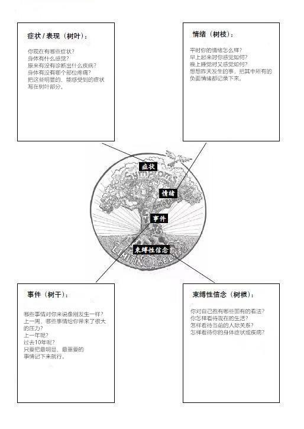

以EFT为基础的心理自助操在改善戒毒人员情绪中的应用探析

信息来源：云南戒毒　　　发布时间：2024年02月18日 09:24:27　　　分享按钮

云南省女子强制隔离戒毒所课题组

> https://jdglj.yn.gov.cn/ynjiedu/LiLunXingJiu/3535.shtml?f_link_type=f_linkinlinenote&flow_extra=eyJpbmxpbmVfZGlzcGxheV9wb3NpdGlvbiI6MCwiZG9jX3Bvc2l0aW9uIjowLCJkb2NfaWQiOiJlN2QwYTQ0YTU5MDdmNTI0LWJjYmY1NmJiNDA4MjZlMjQifQ%3D%3D

摘要：本文基于情绪释放技术EFT的概述、国内外相关领域的研究现状及戒毒人员习练以EFT技术为基础的心理自助操的实践过程，进行了心理自助操的理论研究和应用探析，结果显示，持续参加3个月EFT心理自助操习练的戒毒人员，在情绪调节、情绪接受、情绪知觉、情绪理解等四个维度上有明显改善，本文旨在为戒毒工作者推广应用EFT技术以及提升戒毒人员心理矫治工作质量提供建议与参考。

关键词：心理自助操  情绪管理  情绪释放技术  戒毒人员

情绪调节障碍是许多情绪问题的突出表现，与戒毒人员的心理问题能否妥善解决同样关系密切。本项目的研究以情绪释放技术EFT的理论依据和实操要点为基础，结合戒毒人员的身心特点进行心理自助操动作编排，通过持续的心理自助操习练，让戒毒人员在身体的充分伸展中释放、宣泄积聚的压力，从而有效控制个人情绪。心理自助操相较其他心理保健方式而言，其操作简单，操作者能在有限空间自行完成心理调节，是一种同时兼顾情绪疏导和身体锻炼的身心保健形式，适合戒毒人员通过日常习练以达到调节、疏导自我负性情绪以及锻炼身体的目标，对促进戒毒人员身心健康具有十分重要的意义。

一、EFT心理自助操的理论依据

（一）情绪释放技术EFT的形成背景

情绪释放技术（Emotional Freedom Technique,EFT）是借鉴中医经络理论并结合心理学创建的一种心理治疗技术，通过敲击特定的身体部位（眉头、眼尾、眼下、鼻下、下巴、锁骨、腋下、头顶8个穴位），同时倾吐出内心积压的情绪事件，再通过积极赋义，转变信念和惯性模式，以达到清理潜意识和缓解身心不适的目的。[1]

1980年，美国心理治疗专家Roger Callahan在治疗疾病时受到启发，认为心理疾病及其导致的负性体验与经络系统之间可能存在直接关联，并首次提出思维场治疗技术，逐渐引起各界关注。[2]1993年，另一位学者Gary Craig对穴位叩击顺序和使用穴位的数目进行改良，最终思维场治疗技术被简化成EFT。[3]自1995年起，EFT开始在西方心理学领域受到关注与发展。[4]目前，对EFT的应用研究较为深入的是美国、英国等发达国家，情绪释放技术可以视为能量心理学的一个有效应用，就像是一个“情绪橡皮擦”，可以快速地抚平情绪，如愤怒、委屈、恐惧等，心理学家、医师、治疗师等采用EFT治疗焦虑症、抑郁症、恐惧障碍等多种心理疾病和心理问题，其疗效已得到公认。[5]

（二）情绪释放技术EFT的治疗原理

EFT以中医心理学理论为背景，以经络学说为基础，并融合了神经语言程序学技术以及现代心理治疗理论。人类身体是个带电体，身体中的能量系统存在电流（能量）的明显证据是脑电图（EEG）和心电图（ECG），身体中的能量系统紊乱是产生情绪障碍的原因。哈佛医学院研究发现，刺激特定的穴位能降低杏仁核的红色警示，使人不再感觉到紧张恐惧，而是感觉到安全,对比实验发现，针灸和指压穴位产生的效果不相上下。[6]EFT中八个被敲击的穴位是精心选择的，对应着人体多条经络，当按照顺序敲击时，基本可以阻断常见的各种应激反应和激烈情绪，让人体快速地放松下来。

EFT不仅能阻断应激反应，而且还能重塑大脑边缘系统。EFT技术要求使用者一边敲击穴位，一边回忆特定的让自己感到焦虑或者痛苦的事件，当想到这些不好的事件时，身体会产生战斗或逃跑反应，敲击穴位可以让杏仁核安静下来。EFT技术让使用者与自己的身体对话，即使生活中出现的负性事件伤害了自己、给自己带来了困扰，但如果接受这样的自己，反复多次后，身体会对这些不良事件产生不一样的反应，从一开始的紧张恐惧到“没什么大不了的”。从这个角度来说，EFT和暴露疗法、认知加工疗法一样，在无法改变已经发生的事件的情况下，通过改变身体对事件的反应，从而让使用者能走出创伤，恢复正常的生活。

（三）情绪释放技术EFT的主要特点

结合戒毒人员的实际情况来看，情绪释放技术EFT的主要特点如下：一是基于中医的经络理论根植于中国的传统文化，具有明显的中国特色，符合中国人的情感特点，在戒毒人员中推行更易于被接受；二是简单易学、便捷有效，戒毒人员不需要学习太多深奥的心理学知识，操作流程一学就会，立即使用就能有较明显效果；三是操作流程规范统一、可推广性强，针对不同的情绪问题可使用同样的治疗流程和方法，戒毒人员学会之后可自行习练改善自身情绪问题，又能教会身边人进行习练，能较容易实现自助和助人。

二、以EFT为基础的心理自助操的设计

（一）EFT心理自助操的设计原则

1.整体性原则

整套心理自助操动作设计从头到脚活动全身，配合引导语和敲击动作，热身时的快节奏逐渐调整至情绪调节敲击操的匀速、较慢节奏，促进左右脑交叉活动，减轻身心疲惫状态，有效提升情绪愉悦度，帮助戒毒人员整体改善身心状态。

2.普适性原则

考虑到戒毒人员年龄、文化程度、体质状况的差异性，在设计动作时综合考量安全性、协调性、包容性等方面，确保在戒毒人员中推行时做到人人能学、能练、能教。

3.有效性原则

在设计引导语、敲击步骤时将戒毒人员常见的情绪困扰和心理问题的改善纳入考量，让戒毒人员脱离心理咨询师现场指导也能进行有效习练，能在日常习练中获益。

（二）EFT心理自助操的内容设计

笔者根据EFT 理论，结合戒毒人员的身心状况，将EFT心理自助操的内容设计如下：

1.设置自助目标

首先，聚焦情绪状态：在习练EFT心理自助操前，需要帮助戒毒人员聚焦情绪状态，将当前最大的情绪困扰或伤痛回忆起来，例如与亲人分离的场景、人际关系紧张的状态等，保持让自己不愉快的情绪状态。

其次，评估情绪强度：在聚焦好情绪状态后，评估一下情绪的强度，从0分到10分为自己的情绪强度打分，0分代表完全没有情绪，10分代表情绪强度达到忍受极限，评估的目的是为了关注每一轮敲打后的情绪变化情况，可以作为参照和对比的依据。

最后，建立心理支持提示语：心理支持提示语是作为念给自己听用于强化情绪改善的固定格式文字：“我对我自身存在的情绪负责；尽管我现在有（抑郁、紧张、焦虑或当前存在的其他任何）情绪，但我完完全全接受和爱自己；虽然我内心现在有很多负能量，生活中也遭遇了许多不好的事情，但我完完全全接受和爱自己，我敞开心扉去面对这些感受，并放松自己；当我释放之后，我内心也会回归平静，焦虑也会不复存在。”在说出心理支持提示语时要同时敲击手掌侧“手刀点”，以强化心理支持作用。

2.敲击穴位

用两根手指依次敲击或按摩攒竹、瞳子髎、承泣、人中、承浆、俞府、檀中、百会等穴位，同时保持持续聚焦情绪的状态，敲击穴位时重复心理提示语“虽然我现在有一些（当下的情绪状态）问题，但我完完全全接受和爱自己”

3.NLP情绪脱敏

敲击中渚穴时，运用9个NLP动作促进左右脑协调以加强情绪释放效能，这一步骤有时可以省略，直接进入下一项内容。

4.再次敲打穴位

重复第二步依次敲击穴位，再一次通过穴位的敲击完成身心状态的调整，随着情绪强度的减弱，将心理支持引导语做部分调整，将“虽然我现在有一些（当下的情绪状态）问题”改成“虽然我现在还有一些（当下的情绪状态）问题”。如在习练中有时问题只消失了一部分，可重复几次EFT心理自助操的习练。

（三）EFT心理自助操的流程设计

1.热身环节

（1）双手握拳，双肘打开与地面平行，手肘上下扇动四个八拍。

（2）双手合掌，指尖向正前方，手臂伸直与地面平行，伸直收回四个八拍。

（3）手指交叉置于后颈，收腹抬头眼睛看向天花板，保持四个八拍。

（4）双掌从上至下拍击双肋外侧，四个八拍。

（5）双掌拍击腋下，左右各两个八拍。

2.情绪调节敲击操环节

（1）身体站直，双脚打开与肩同宽，深呼吸三次，在呼吸中聚焦此刻内心存在的负性情绪，并为此刻的情绪进行评分。

（2）敲打手刀点，敲打时说：“我对我自身存在的情绪负责；尽管我现在有焦虑（抑郁、紧张或其他的）情绪，但我完完全全接受和爱自己；虽然我内心现在有很多负能量，生活中也遭遇了许多不好的事情，但我完完全全接受和爱自己，我敞开心扉去面对这些感受，并放松自己；当我释放之后，我内心也会回归平静，焦虑也会不复存在。”

（3）依次敲击或按摩攒竹、瞳子髎、承泣、人中、承浆、俞府、檀中、百会等穴位，同时保持持续聚焦情绪的状态，敲击穴位时重复心理提示语“虽然我现在有一些（当下的情绪状态）问题，但我完完全全接受和爱自己。”

（4）持续敲击中渚穴时进行以下9个步骤：眼睛闭上；眼睛张开；眼睛往右下看并保持头部不动；眼睛向左下看并保持头部不动；眼睛顺时钟旋转；眼睛逆时钟旋转；哼快乐的歌2秒钟；快速地数1～5；再哼快乐的歌2秒钟。

（5）再次敲击或按摩攒竹、瞳子髎、承泣、人中、承浆、俞府、檀中、百会等穴位，每个穴位5-10次，同时保持持续聚焦情绪的状态，敲击穴位时重复心理提示语“虽然我仍然还有一些（当下的情绪状态）问题，但我完完全全接受和爱自己。”

（6）再次对情绪状态进行评分，根据评分结果决定是否需要重复习练。

（四）EFT心理自助操的作用分析

1.热身阶段迅速活跃身心状态为情绪敲击做好准备。当存在负性情绪时或多或少会伴随着相应的躯体症状，如在紧张时肌肉收缩供血受阻，在热身阶段主要开展的是以全身经络操为主的全身放松习练，设计思路借鉴了医疗体操的优势，选择了易于掌握的动作幅度和运动强度的左右协调运动动作及拍打穴位动作，在室内外均可习练，经过热身后锻炼能很快感受到精神和体力的增加，增强身体灵活度和改善气血运行状态，能较快地将身心调整状态好，为之后的敲击操集中精神聚焦并释放情绪做好准备，有益于后续情绪敲击操的习练。

2.情绪聚焦找准问题实现心理反转机制的有效解除。聚焦情绪的阶段是释放情绪前的必备动作，主要目的在于为调整情绪解除心理反转机制。心理反转是一些疾病呈现慢性化并且对传统治疗反应不良的原因，由于戒毒人员大脑功能长期受到物质成瘾的损害，在处理情绪问题时，更容易引起潜意识中自我挫败感与负向思考习惯，通常这个状态是不被觉知的，但常常为其所苦，这也是戒毒人员情绪调节困难的原因所在，当这样的心理反转机制存在往往会影响到戒毒人员接受心理咨询的效果，因此，心理反转必须通过聚焦情绪这一环节进行修正，否则EFT的基本方法将无法继续运作，心理自助操也难以见效。

3.用中立化的引导语有效帮助修改心理反转机制。因戒毒人员的心理反转机制有可能引起负性思考，所以必须使用中立化的心理支持引导语去修改心理反转机制，一边敲击对应穴位堵点，一边说出心理支持引导语，这一过程能够有效地帮助戒毒人员识别自己的真实感受和实际行为之间的差异，思考负性情绪形成的原因，从接受自己的真实感受、理解自己开始，再到使用合理方式去表达自己的负面感受，即可有效疏通情绪、减少自我隔离和压抑，从而实现改变自己矛盾的行为状态，做到身心的内外一致。

三、以EFT为基础的心理自助操的实证研究

（一）研究对象

在云南省女子强制隔离戒毒所教育适应期和康复巩固期戒毒人员中随机抽取30名戒毒人员，组织开展情绪调节课程学习及每日进行心理自助操习练。

（二）研究方法

采用情绪调节困难量表（DERS-36）对实验组进行前测-后测实验设计。实验组戒毒人员每日傍晚进行一次心理自助操习练，每次习练约12分钟，为期三个月，数据采用SPSS 24进行统计分析。

情绪调节困难量表是一种测量情绪调节问题的工具，情绪调节困难量表（DERS）是一个36个项目的量表，用于评估个体调节情绪状态的能力。该量表有以下几个测量维度：情绪接受困难程度（情绪接受）；难以从事目标导向的行为指数（目标行为）；冲动控制困难（冲动控制）；缺乏情绪感知意识（情绪觉知）；有限的情绪调节策略（策略使用）；缺乏清晰的情感理解（情绪理解）。问卷回答采用5级Likert量表（1=几乎从不，5=几乎总是），分数越高表明情绪调节能力下降。

（三）研究结果

| 配对编号           | 项   | 平均值 | 标准差 | 平均值差值 | t    | p      |
| ------------------ | ---- | ------ | ------ | ---------- | ----- | ------- |
| 情绪接受           | 前测 | 11.867 | 3.636  | 2.133      | 3.043 | 0.005** |
|                    | 后测 | 9.733  | 1.837  |            |       |         |
| 目标行为           | 前测 | 11.8   | 2.952  | 1.433      | 2.055 | 0.049*  |
|                    | 后测 | 10.367 | 2.906  |            |       |         |
| 冲动控制困难       | 前测 | 13.533 | 9.164  | 3.967      | 2.672 | 0.012*  |
|                    | 后测 | 9.567  | 3.37   |            |       |         |
| 情绪觉知           | 前测 | 16.733 | 2.449  | 5.1        | 9.861 | 0.000** |
|                    | 后测 | 11.633 | 1.326  |            |       |         |
| 情绪调节策略       | 前测 | 15.533 | 4.725  | 1.767      | 2.172 | 0.038*  |
|                    | 后测 | 13.767 | 3.674  |            |       |         |
| 情绪理解           | 前测 | 16.367 | 2.327  | 4.3        | 9.007 | 0.000** |
|                    | 后测 | 12.067 | 1.23   |            |       |         |
| 总分               | 前测 | 79.633 | 20.28  | 12.5       | 3.777 | 0.001** |
|                    | 后测 | 67.133 | 7.825  |            |       |         |
| * p<0.05 ** p<0.01 |      |        |        |            |       |         |

测试结果显示，戒毒人员进行3个月的心理自助操习练后，其总分、情绪接受、情绪知觉、情绪理解四个维度有显著差异。在与戒毒人员及管理警察的访谈中了解到：参加心理自助操习练的戒毒人员近段时间对情绪的觉察及调整能力有明显改善，在生活中遇到问题时能进行自我调节，与他人发生口角的情况较少，表明持续进行EFT心理自助操的习练对帮助戒毒人员改善情绪调节能力有较明显的作用。

（四）研究过程中的常见问题分析

1.处理的情绪问题会发生变化

例如戒毒人员在初期，是针对愤怒或是焦虑的情绪进行心理自助操的习练，经过第一遍心理自助操的热身和敲击之后，愤怒或是焦虑会转化为悲伤或失落，继续第二遍心理自助操的习练时，悲伤或失落继而又转化为对过往事件和体悟的感想等等。这一过程是比较常见的：一种情绪得到缓解，又出现了另一种情绪，可以引导戒毒人员将负性情绪进行逐一排序依次通过习练来缓解，或是对问题较多且复杂的戒毒人员进行单独引导习练，并结合其他的心理技术帮助戒毒人员厘清并化解情绪矛盾。

2.被处理的情绪可能在一定时间内增强

实证研究过程中，有个别戒毒人员反馈：习练后，感觉想要缓解的某个情绪问题的负性情绪强度比习练前更大……逐渐增强的情绪体验感使得戒毒人员想主动停止训练。在与此类戒毒人员深入探讨后，分析得知因习练者之前从未有过情绪觉察方面的训练，过往对于负性情绪的处理方式多为忽视或压抑，在进行心理自助操习练后，之前被压抑了很长时间的情绪如被开闸放水一般涌现出来，带来的能量较大且需要一个释放和消解的过程。因此戒毒人员反馈习练一段时间内情绪问题加重，并且不想继续习练试图退回以往处理情绪问题的回避模式。这一情况出现后，笔者与戒毒人员探讨回避习练的想法，鼓励其继续坚持训练。当负性情绪得到持续释放后，戒毒人员获得平静与放松的愉悦体验时就能主动坚持习练。

3.情绪问题评分变化不大

有戒毒人员出现多次习练后情绪问题的评分变化不大的情况，究其原因主要有两方面：一是热身阶段的持续强度和持续时间不够，戒毒人员到第二阶段敲击时不能很好地进入状态，因此出现两轮的情绪评分变化不大的情况，针对这一问题解决是在综合戒毒人员体能状况和患病情况的基础上对热身部分的动作进行调整，并且根据教育适应期和康复训练期戒毒人员不同的体质特点分别设计两套心理自助操，帮助戒毒人员在习练中获得更好的效果；二是戒毒人员因个人理解能力和情绪感知能力受限，没有找准或正确命名个人当前存在的负性情绪，导致了在习练时排解的情绪并不是当前面临的最大问题，因而在多次习练后主要问题仍然没有解决，从而针对情绪的评分变化不大，这就需要对此类人员再次进行理论授课，帮助其掌握心理自助操的原理机制、情绪觉察及习练要点等重点内容，从而有效提升训练效果。

四、以EFT为基础的心理自助操的问题回应——使用问题树技巧帮助戒毒人员深入探讨情绪问题

在组织戒毒人员开展EFT心理自助操时，如遇到戒毒人员心理问题较为严重，或在自行习练中因不能找准自己的情绪问题所在而导致习练效果不佳时，心理咨询师需帮助戒毒人员找到症结所在，此时亦可采用EFT原理对戒毒人员的情绪问题及潜藏在情绪之下的深层次问题进行深度探讨，直至戒毒人员的情绪问题得到妥善解决，在此，可使用问题树记录与戒毒人员共同探讨当前存在的问题，具体操作如下：

1.树叶部分记录当下的症状和表现

与戒毒人员探讨其当前存在的躯体症状，以前是否有确诊的疾病？身体有没有哪个部位疼痛？将这些明显的、能感受到的症状写在树叶部分。例如，可能把症状记录为失眠、腰疼、抑郁、精力不足或者头脑不清等，如果戒毒人员不知道该写些什么，可以探讨平常抱怨最多的事情，或者想想别人问其“怎么了”时最常说的事情。

2.树枝部分记录情绪

可以直接询问戒毒人员平时的情绪怎么样？早上起来时感觉如何？晚上睡觉时又感觉如何？想想前一天发生的事，把其中所有的负面情绪都记录下来。如果想不起来时，就翻到前面列出的各种情绪状态看看。

3.树干部分记录发生的事件

询问戒毒人员哪些事情对其来说像刚发生一样？在过去一周、一年或是多年内，哪些事情给其带来了很大的压力？可以与戒毒人员详细讨论过往事件如何影响戒毒人员的，要对戒毒人员来说把最明显、最重要的事件记下来。

4.树根部分记录束缚性信念

与戒毒人员探讨其对自己抱有哪些固有的看法，对待生活、情感关系、你的身体状况等问题，可以提问这几个问题能帮住戒毒人员找到这样的束缚性信念：

对于我自己，我觉得哪些描述是正确的？

对于这个世界，我觉得哪些描述是正确的？

对于目前的生活，我觉得哪些描述是正确的？

对于情感关系，我觉得哪些描述是正确的？

对于我的身体，我觉得哪些描述是正确的？

写完之后的问题树非常形象地展示了上述四个方面的习练，症状和表现时最外面的树叶，情绪是树枝，过往事件是树干，束缚性信念是深埋的树根，问题书的图片罗列了当前戒毒人员所面对的问题以及各个问题之间的联系，引导戒毒人员在花时间画问题树，也是在帮助戒毒人员清晰地了解自己的真实状况，同时进一步帮助其厘清自己情绪、行为、过往经历、信念等方面问题背后的联系，无论是选择对这些问题中的某一部分进行治疗，还是解决所有的问题，都可以使用以EFT技术为基础的心理自助操来进行自我调节和情绪管理，持续坚持习练，就能不断清除束缚性信念，释放负面情绪，抚平过往的心理创伤，修正过往的心理应对机制。

绘制问题树能起到两个作用：其一，帮助戒毒人员看清生活中的问题，这样戒毒人员就能在习练EFT心理自助操时把注意力集中在准确的情绪问题上；其二，它显示了每件事的不同层面和各部分之间的联系，这样戒毒人员就能更有效地运用EFT心理自助操改善个人状态。

五、结论

笔者认为此次实证研究存在一定的局限性：一是本次实证研究是回顾性设计，前期设置了实验组和参照组，因场所收治人数大幅减少，未能完成实验组和参照组的数据对比，且对实验组人员的随访是在半年内进行的，该方法的普适性和长效性有待进一步验证；二是未对躯体症状的变化进行有效测量及对比，实验组戒毒人员普遍反馈除情绪调节能力及情绪状态得到改善以外，以前的一些躯体不适有了不同程度的改善，但研究中未能有效结合医疗手段对这些症状进行测量及对比。本次研究虽有未尽之处，但使用以EFT为基础的心理自助操对戒毒人员开展身心同步干预工作仍取得较好的效果。

实证研究过程中，课题研究人员不仅完成了理论层面的探讨，更是着力于形成操作性和推广性俱佳、适合戒毒人员日常习练的实用保健操，形成的心理自助操已被证实在改善戒毒人员的情绪状况上是行之有效的。课题研究人员充分考虑到戒毒人员在不同时期的身体素质差异，设计了分别适用于教育适应期和康复巩固期戒毒人员习练的2套心理自助操，对习练过程进行现场指导并根据反馈出来的问题及时完善自助操，取得了较好的推广效果。此心理自助操可以在戒毒所内进行广泛推广,源于心理自助操的习练效果体现在以下两个方面：一方面，其可以提高戒毒人员的身体素质、促进戒毒人员的身体健康，也可以放松和调整戒毒人员的心理状态；另一方面，其可以促进戒毒人员不断提升情绪管理和心理自救能力，增强戒毒人员的自我掌控感，从他律走向自律，促进戒毒人员以更积极稳定的状态融入戒治环境并最终顺利回归社会。

参考文献

[1]闫少校，吕梦涵，崔界锋，经穴情绪释放技术的机制与治疗程序探讨[J]，国际中医中药杂志，2014,36(8):681-684.DO1:10.3760/cma.iissn.1673-4246.2014 08.003

[2] 罗杰·卡拉汉，理查·特鲁波，敲醒心灵的能量:迅速平衡情绪的思维场疗法[M]，中国台北:心灵工坊文化事业股份有限公司，2003:30

[3] CHURCH D.Clinical EFT as an evidence-based practice for the treatment of psychological and physiological conditions[J]Psychology,2013,4(8):646654.DO1:10.4236/psych.2013.48092

[4] CHURCH D.Clinical EFT as an evidence-based practice for the treatment of psychological and physiological conditions[J]Psychology,2013,4(8):646654.DO1:10.4236/psych.2013.48092

[5]罗杰·卡拉汉，理查·特鲁波，敲醒心灵的能量:迅速平衡情绪的思维场疗法[M]，中国台北:心灵工坊文化事业股份有限公司，2003:30

[6]NELMS J A,CASTEL L.A systematic review and Meta-analysis of randomized and non-randomized trials of clinical emotonal freedom techniques(EFT) for the treatment of depressinlJ.Explore.2016, 12(6):416-426.D01:10.1016/i.explore.2016.08001

[7] 尼奥·奥特纳，轻疗愈1[M]，当代中国出版社，2014-09-01

[1] 闫少校，吕梦涵，崔界锋，经穴情绪释放技术的机制与治疗程序探讨[J]

[2] CHURCH D.Clinical EFT as an evidence-based practice for the treatment of psychological and physiological conditions[J]

[3]  CHURCH D.Clinical EFT as an evidence-based practice for the treatment of psychological and physiological conditions[J]

[4] CHURCH D.Clinical EFT as an evidence-based practice for the treatment of psychological and physiological conditions[J]

[5] 罗杰·卡拉汉，理查·特鲁波，敲醒心灵的能量:迅速平衡情绪的思维场疗法[M]

[6] NELMS J A,CASTEL L.A systematic review and Meta-analysis of randomized and non-randomized trials of clinical emotonal freedom techniques(EFT) for the treatment

[7]  尼奥·奥特纳，轻疗愈1[M]，当代中国出版社，2014-09-01