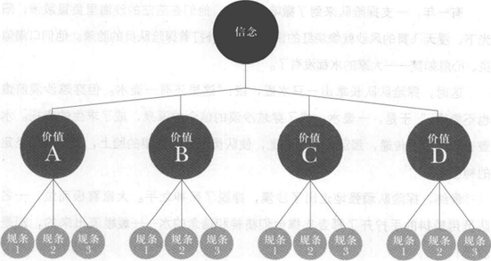

浥尘伙伴社团独家密训课程：儿童青少年心理健康训练

有这样一个故事，说的是自从被白人驱赶到保护区之后，印第安人一直过着贫困的日子。直到有一天，他们终于时来运转一一勘探发现在划归印第安人的土地底下，蕴藏着大量的石油。消息一经传出，各大公司蜂拥而至，争相出高价向拥有保护区的酋长买下石油的开采权。一夜暴富的印第安酋长决定一改乘光马背的习惯，订购了一部最高级的凯迪拉克大轿车。轿车在众族人的目光中用拖车运到。酋长端详了他的新宠座架半天，终于找到了驾驶这部轿车的方式。酋长要族人牵来两匹马，将马绳拴在凯迪拉克前的保险杠上，由马匹拖着大轿车前行。酋长每天坐着这辆由两匹马拉着的凯迪拉克，在印第安村庄中巡视。

有车后的酋长想要成为跟得上时代潮流的人，于是他又开始学英语。等他稍稍看得懂英文后，有天心血来潮，打开那份随车所附的操作手册。不看则已，一看之下，不禁火冒三丈。原来操作手册上清清楚楚地写着，这部凯迪拉克大轿车拥有260马力。酋长顿时恍然大悟，难怪他一直觉得这辆轿车虽然高级，但跑起来的速度远不及自己以前的旧马车，原来问题出在这里，这辆大轿车应该附赠260匹马儿来拉，才能跑得飞快。他心想：那些人做生意不老实，竟然扣下了附赠的马匹。稍通英文的酋长立刻写了一封火爆的抗议信寄给汽车公司，要求对方赔偿他应得的马匹。服务专员到来后，看到这种情景，笑着叹气，解下保险杠上的马，请酋长坐进后座，然后从箱中取出那部车的钥匙，插进锁孔轻轻一扭，蕴藏在引擎中的 260马力立即随着低沉的排气管隆隆作响。专员向酋长点头致意，拉下档位，轻踩油门，轮胎发出与地面快速摩擦的声音，这部大轿车首次由260马力驱动，全速奔驰而去。

我们有没有想到过自己与生俱来的潜能？我们有没有找到足以开启自己全部马力的钥匙？我们在用多少马力启动自己的凯迪拉克？

在拥有了“天生我材必有用"的信念之后，我们还需要“天生我材学会用"

##### 成长篇/专题一	信念力量的训练

第一课	信念是什么

第二课	信念的来源

第三课	信念的作用

##### 专题二	自我意识训练

第一课	自我意识是什么

第二课	自我成长的足迹

第三课	自我概念的优化

##### 生活篇/专题三	人际交往训练

第一课	交往之需

第二课	交往之惑

第三课	交往之道

第四课	交往有方

##### 专题四	情绪管理训练

第一课	认识清绪

第二课	情绪的来源

第三课	情绪的力量

第四课	管理情绪

##### 专题五	爱情与性心理修养

第一课	青春期的蝶变

第二课	心灵之约

第三课	青春期自我调适

##### 学习篇/专题六	学习心理训练

第一课	学习的发生

第二课	学习的过程

第三课	学习的方法与技巧巧

##### 职业篇/专题七	职业心理训练

第一课	生涯规划的概念

第二课	生涯规划的影响因素

第三课	如何进行生涯规划

> 皮格马利翁的雕塑
>
> 希腊传说中，塞浦路斯国王皮格马利翁是一位有名的雕塑家。一次，他精心地用象牙雕塑了一位美丽的少女，并深深地爱上了这个“少女"，给她取名叫盖拉蒂。他真诚地期望自己的爱能被盖拉蒂接受，但她只是一尊不会说话、不会活动的雕像。
>
> 皮格马利翁感到很绝望，他不愿意再受这种单相思的煎熬，于是，他就带着丰盛的祭品来到掌管爱与美的女神阿芙洛狄忒的神殿向她求助。最终，他的真诚期望感动了女神，女神决定帮助他。
>
> 皮格马利翁回到家中后，发现雕像活了过来。他惊呆了，一句话也说不出来。他的雕塑居然真的成了他的妻子。

这虽然是一个神话故事，心理学家们却发现它与一种心理现象不谋而一一期望能产生奇迹。所以，心理学家们就把期望和赞美更容易让人达到目标的现象称为“皮格马利翁效应"。抱着坚定的信念，相信自己一定会成功，并对自己的成功充满期待，那么你就更容易成功。当你相信了自己是怎样的人，就很可能成为这样的人，因为内心的期待会对自己产生一种潜移默化的影响。但是信念具有强大的力量，这种力量可能是建设性的，也可能是破坏性的。是什么决定了人生的基调和方向？

说起信念，我们会不由自主地联想起那些闪现在历史长河中的英雄或伟人，脑海里会浮现出崇高、执著、坚定等离现实生活有些遥远的字眼。其实，信念萦绕我们身边，无时无刻不在主宰我们的思想，左右我们的情绪，控制我们的行动。

> 有一年，一支探险队来到了撒哈拉沙漠。他们在茫茫的沙海里负重跋涉，阳光下，漫天飞舞的风沙就像烧红的铁砂一般，扑打着探险队员的脸颊。他们口渴似炙、心急如焚．．．．一一大家的水都没有了。
>
> 这时，探险队队长拿出一只水壶，说：“这里还有一壶水。但穿越沙漠前谁也不能喝。"于是，一壶水，成了穿越沙漠的信念的源泉，成了求生的寄托。水壶在队员手中传递，那沉甸甸的感觉，使队员们近乎绝望的脸上，又显露出坚定的神色。
>
> 最终，探险队顽强地走出了沙漠，挣脱了死神之手。大家喜极而泣，一名队员用颤抖的手拧开了那壶支撑他们精神和信念的水 缓缓流出来的，却是沙子。

信念能够激发潜伏在每个人身上的巨大能量。信念不仅仅是停留在脑海里的一些想法或者理想，它会通过某些方式影响、控制我们的行为，使我们坚定不移地朝着理想前进，进而将想法转化为现实。

心理学认为，信念是人对生活准则的某些观念抱有坚定的确定感与信任感的意识倾向，是人的动机系统的重要组成部分。  

信念是一个完整的系统。通过这个系统不辞辛劳地运转，我们的想法才得以实现。

信念系统中包括三个部分。

第一，信念：广义的信念是泛指我们对这个世界的人、事、物的基本看法，也即“事情应该是这样的"。它是我们认为世界维持下去的法则，是解释世界错综复杂的关系的逻辑，是关于世界真理性的认知。因此信念在一定的时间内是绝对的。

第二，价值观：是由信念所决定的，是有关事情的意义和价值的观念，也就是一个人的价值取向。

第三，规条：为了达成自己的信念，实现事情的价值，人们所必须采取的措施与行为。

> 王桐桐特别羡慕同班同学王强的人际交往能力，王强无论走到哪里都有几个同学跟他在一起，遇到困难一定有同学愿意站出来帮助他，到了陌生环境中，他也能很快打开局面。
>
> 桐桐经过观察，发现王强的表达能力很强，脸上的微笑也很可爱，于是他也从这两个方面入手，有机会就在没人的地方练习演讲与微笑，但他发现，不论他独自一人时做得多好，到了人多的地方，他还是无法自如地讲话，无法提高他的微笑魅力。
>
> 桐桐觉得很无助，他想也许自己在人际交往上的能力比较差，便放弃了这方面的努力。

你知道在这个过程中，桐桐为什么会受挫吗？

试试用我们上面讲到的信念的概念分析。

什么是桐桐的信念呢？“我应该有好的人际关系"这个信念是没有问题的，“人际关系很重要"这个价值观也是没有问题的， “在人际交往中，要表现出良好的表达能力与亲和力（微笑）"这一规条也是跟人际关系提升密切相关的。

但桐桐没有想过，其实还有很多其他行为（规条）可以提升人际交往能力呢，比如热情、真诚、会听别人讲话等。

我们不应该因为自己某些行为不太擅长而否认整个人的价值。

然而这种情况在生活中很常见！

我们会因为自己学习成绩不佳就觉得自己各方面都不如人，因为一次失败就觉得自己不会再成功，这些情况就是把行为与信念混在一起了。

行为与信念不是一一对应的，相同的信念可以由不同的行为完成。

因此，当我们陷入行动困境的时候，试着去追寻事件背后的信念和价值是什么，如果是规条（做法与方法）捆住了我们的手脚，不妨换一条路走走。

自我训练

）什么是信念

1、如果在异地找到一份好工作，你会远离父母到异乡去工作吗？

2、你去医院看病的时候，会选择满头白发的老医生还是年轻的医生就医？

3、在遭遇了一次次的失败和挫折以后，你会坚持还是放弃？

4、你觉得做生意的人值得信赖吗？

5、平时跟你有过节的同学，突然对你很友好，你会接受他的好意吗？

你知道在面临这些情境的时候，是什么在左右着你的决定吗？

当你找出自己做某件事的理由时，那些理由就可能是信念。

你能找出跟上面情境相对应的信念吗？

A.十商九奸		B.嘴上无毛，办事不牢

C.黄鼠犭良给鸡拜年，没安好心	D.父母在，不远游

E.天生我材必有用

二）案例剖析

王强，是一个学习很好的学生，因为最近寝室转来两个不爱学习、喜欢熬夜打游戏、肆无忌惮聊天的同学，而导致神经衰弱无法入眠。

他一上床就担心自己睡不着，休息不好，影响明天听课质量，而且越是担心，越是睡不着。

第二天上课瞌睡来了，他又怕老师批评，不敢合眼。

他白天都在和瞌睡作斗争，老师讲的全然没有听进去。

到了晚上，更加严重的焦虑和担心使得他更难以入睡，就这样进入严重的恶性循环之中。

失眠、焦虑与愤怒一并袭来，他和同寝室的同学关系异常紧张，正面的冲突也常常发生。

临近期末考试，他担心自己一向引以为傲的功课一落千丈。

因此，他来到咨询室求助。

请同学们帮他分析：

1、他的状况是由那两个同学一手造成的吗？

2、如果是你，你怎么办？

咨询老师了解情况以后，告诉他：“其实睡觉是一种休息的方式，是确保有良好的精力来学习的一种手段，不是目的。

休息的方式有很多种，比如听音乐、看课外书等。

这个世界上也有人几乎就不睡觉，照样正常生活的。

睡不着的时候，就带上耳机听听音乐，也许不知不觉中就进入了梦乡呢。"

他很紧张地说：“可是那样的话，我又会担心忘记关掉MP3 就睡着了。" 

3、请你补充，忘记关掉MP3的后果有几种？

最严重的后果是什么？

A. MP3一直播放到早上起床的时候；

B. MP3的电耗尽了，需要再充电；

C.                      D.

4、以上最严重的后果他能够承担吗？

那么，你认为他还需要那么焦虑吗？

他的状况你碰到过吗？

老师进一步启发他：“上课认真听讲，只是为了能够专心去听、去理解老师所讲的内容。

想睡觉的时候就小睡一下，精力恢复以后，听课效果会更好。"

他满脸困惑：“可是，上课不是必须专心听讲吗，怎么能睡觉呢？" 

5、请你进一步帮他分析一下，他的回答意味着什么？

他的困境在哪里？

（三）条条大路通罗马

第一步，列举出自己生活中的各种观念或一直坚持的一些行为习惯。

例如：我是一个学习不好的人。

第二步，判断它是信念还是规条。

第三步，如果是规条，又常常困扰你，请你追根溯源，寻找久违了的信念，然后制定新的、可行的规条。

| 举例 | 是否是信念 | 是否困扰你 | 研制新规条 |
| ---- | ---------- | ---------- | ---------- |
|      |            |            |            |
|      |            |            |            |
|      |            |            |            |
|      |            |            |            |
|      |            |            |            |
|      |            |            |            |

第四步，一个信念可以对应多个规条，在实践的过程中再筛选确定最有效的规条。

==============================================

第二课

# 信念的来源

如果你希望主宰自己的人生，那么就必须好好掌握自己的信念。

那么，信念是什么？

它是如何形成的？

既然一切行为的背后都有着相应的信念在支持，那么，人一生的信念真是无法计数。

我们坚持每天吃饭是因为我们坚信食物能提供营养，维持生命；

贪生怕死的人认为好死不如赖活着；

非常环境下不堪屈辱选择自杀的人认为尊严比生命还要重要；

爱情至上是爱美人不爱江山的温莎公爵的选择；

而也有人把爱情作为发展事业的跳板一一

那么，这个数目庞大的信念体系又是怎样形成的呢？

## 、信念的来源

（一）  自我经验的提炼

当婴儿的第一声啼哭引来了妈妈的时候，他就明白妈妈在自己最需要的时候，总是第一个赶到。

于是，无论是饿了、困了还是想尿了，婴儿会响亮地啼哭，而妈妈也总会及时赶到。

当幼儿可以爬行的时候，就已经在用自己的方式探索和认识这个世界了。

他们睁着好奇的眼睛，用四肢爬行若去探险，尽管那个时候的探索是有限的，但是他们获得了足够的经验和教训：

那熊熊燃烧的火苗很烫手，所以不能靠近；

茶几角很硬，头碰上去很痛；

洗澡的时候好舒服，不过一旦头沉到水里面，就很难受；

爸爸脾气很大，最好别惹恼他。

这些最直观的经验和感受形成了个体的原初信念。

但是由于个体的经历非常有限，这些信念难免具有局限性和谬误性。

不过，不要紧，在成长的过程中个体可以不断修正这些原初信念。

（二）  重要他人的灌输

“我爸爸说，男孩子不能随便哭鼻子。"  

“我妈妈说，不要跟陌生人搭话。"

“我爸爸告诉我，人要自食其力，别人才会尊重你。"

“我的一个中学老师说过，任何事情，不到结束的时候，都不要放弃。"

“我的一个同学说过一

日常生活与交往中，我们常常听到这样的句式，从天真的孩童时期到懵懂的青春期，再到为赋新诗强说愁的青年时代，甚至到了不惑之年、耄耋之年，这样的话也常被人挂嘴边。

也就是说，人们的信念系统中包含了很多其他人的认识与看法。

毕竟，个人的经历和经验都是很有限的，无论是从时间上讲还是机会上讲，凡事靠自己去感知和经历是不现实的。

好在我们身边还有父母、老师和朋友，他们的经验可以极大地弥补我们时间、空间以及认知上的局限性。

因此，父母的教诲、老师的传授、朋辈的经验分享，也成为我们信念系统中可贵的成分。

但是，我们对于这些外来信念并不是采取一味接纳的态度，而是会进行自觉或不自觉的筛选。

对这些观念与信念的接受和相信程度，取决于我们所处的年龄阶段、与这些人的亲疏关系以及这些人的人格魅力水平。

一般来说，在年幼时期，父母观念的影响程度是绝对的。

随着年龄的增长，父母观念的过时以及他们看待问题的局限性会逐渐被我们发现，这时候内心会产生轻微的冲突：爸爸妈妈也会犯错？我违背他们的想法，他们会难过吗？

让我们来做一个小测试，先闭上眼睛，深呼吸4次，让自己的身心完全放松，然后试想一想，同样的忠告，如果来自同学，你的感受怎样？

如果来自父母，你内心会完全接纳吗？

无可避免的青春期如期而至，冲动、迷茫、羞涩，我们不再事无巨细地与父母分享，我们开始有了小秘密：邻座那个腼腆的他/她看我的眼神好像有些异样。

把这些感受告诉父母无疑会遭到训斥，最好的分享人是深有同感的同龄人。

在这个时候，同龄伙伴的言行对于我们的影响就举足轻重了。

同时，青春期也是自我意识开始苏醒的时期，个体强烈地渴望自我的价值感得到确定。

于是，父母的照顾不再让我们觉得舒适，父母的武断和干涉甚至让我们感到窒息。

我们的意见和想法常常无助地淹没在父母的唠叨声中。

同学和伙伴可不一样，他们够哥们儿，也尊重我们的想法。

从人际交往心理来看，我们倾向于喜欢那些喜欢我们的人，也乐于听从他们的意见，相信他们的看法。于是，伙伴的信念就这样轻巧地进入了我们的心田。

艰难地熬过青春期，学习、运动无疑是宣泄青春能量和转移注意力的最好方式。而同时，我们也一再被告知学业是多么重要。当我们静心投入学业的时候，老师对我们影响的重要性日益凸显。这种影响不仅是学业的，更多的是人格和心理方面的。因此，我们会发现，师源性心理伤害也很普遍。

知识链接

> 罗森塔尔的期望心理实验
>
> 1968年，两位美国心理学家来到一所小学，他们从一至六年级中各选3个班，在学生中进行了一次煞有介事的“发展测验"。
>
> 然后，他们以赞美的口吻将有优异发展可能的学生名单通知有关老师。
>
> 8个月后，他们又来到这所学校进行复试，结果名单上的学生成绩有了显著进步，而且性格更为开朗，求知欲更强，敢于发表意见，与教师的关系也特别融洽。
>
> 
>
> 实际上，这是心理学家进行的一次期望心理实验。
>
> 他们提供的名单纯粹是随便抽的。
>
> 他们通过“权威性的 日曰示教师，坚定教师对名单上学生的信心，虽然教师始终把这些名单藏在内心深处，但掩饰不住的热情仍然通过眼神、笑容、音调滋润着这些学生的心田，实际上他们扮演了皮格马利翁的角色。
>
> 学生潜移默化地受到影响，因此变得更加自信，奋发向上的激流在他们的血管中荡漾，于是他们在行动上就不知不觉地更加努力学习，结果就有了飞速的进步。

是什么原因导致了这样奇妙的变化呢？不会是孩子的智力或是学习主动性发生了变化，因为这些学生并不知道测试结果。唯一改变的是老师对于这些孩子的看法。老师相信了专家的“谎言" 那些孩子智力超群，前途无量，于是对他们寄予了更高的期望，也更加信任、鼓励他们。也就是说，是老师的态度发生了积极地转变，使得这些孩子的自信心得到增强，因而比其他学生更努力，进步更快。

这项实验告诉我们，教师对学生的期望会对学生的心理产生巨大的影响。教师以积极的态度对待学生，学生就可能朝着积极的方向发展；相反，教师对学生的偏见也可能产生消极的结果而影响学生学习的积极性，甚至导致师源性心理伤害。

（三）文化与传统的影响

文化与传统对信念的影响是最深层的。

下面类似的故事，可能同学们也听过很多：

> 据说，德国人做事严谨，且严格遵守条例，这使许多中国人折服，有一个中国学生不信，想测试一下。他在大学校园里的两个并排的公用电话亭上分别贴上男、女，而自己在男电话亭假装打电话。该校的德国男教师来了，站在外面等了很长时间，而这时的女电话亭一直是空着的，那位德国男教师就是不使用女用电话。

在中国，孩子花父母的钱、孩子将来要赡养父母都是天经地义的，但在西方很多国家，很多孩子18岁后需要自己养活自己，父母不需要为孩子看下一代，孩子也不需要为父母的生活买单。

 有些在我们看来是天经地义的事情，也许都已经是信念了，渗透到我们的血液里、骨头里，不知不觉却顽强地影响我们的行为。

但是，不是所有的信念都是理性的，非理性也会影响我们的思维和习惯。

知识链接

一非理性信念一

追溯各种信念的源头，我们会惊讶地发现，它们来自四面八方，在我们成长的路途上纷纷加入到我们的信念系统中来，然后开始影响甚至是操控着我们生活中的点点滴滴。无论是来自自己的经验、他人的灌输还是文化传统的熏陶，归根结底，都是来自于人。也就是说，信念无法避免人类认知的局限性，也难免带有浓重的个人色彩和明显的时代特色。因此，一方面，信念本身很可能包含错误和偏差的成分，也可能在接收处理的过程中被我们的认知所扭曲。另一方面，有些信念也是具有局限性的，它们在某个阶段、某些环境下是合理的，但是不见得永远合理。

心理学家艾利斯仔细区分了理性信念和非理性信念，他认为非理性信念具有抽象化、绝对化和普遍化等特点。由绝对化的、概括化的、片面的认知导致的非理性信念常常导致我们内心产生冲突，出现情绪困扰，影响心理健康，妨碍我们的社会适应。

抽象化是指将具体环境中得出的特定认识概括为一般的准则，例如，有人会把心

自己在特定环境中受到的欢迎概括为一般的要求，强调自己所处的环境条件应该样样符合自己的心意。

绝对化是指对自己的要求过高，希望自己的生活完美无缺，无可挑剔。完全无法接受自己犯错误。一旦有所失误，就觉得自己糟糕透了，没有任何可取之处。

普遍化是指人们常把自己对某件或某些事物的看法概括为所有同类事物的普遍特征。比如，自己被某个朋友欺骗了之后就不再相信任何人，等等。

常见的非理性信念有以下几种：

1 ·我们绝对需要每一位生活中重要人物的喜爱或赞许。

2 · 一个人应该在各方面，至少在某一方面，有成就、有才干，这样才会是有价值的人。

3 ·有些人是卑劣的，他们应该为自己的恶行受到严厉的责备和惩罚。

4 ·如果遇到与自己希望不一致的事情，就认为很糟糕。

5 ·人的不快是由外在环境原因造成的，人无法控制自己的悲伤和情绪困扰。

6 ·常担心危险或灾难性事件的发生。

7 ·逃避困难和责任比面对它们更容易。

8 ·人应该依赖别人，而且需要依赖一个比自己强的人。

9 ·人的行为受到过去经验的影响。

10    ·应该对别人的困难和情绪困扰感到不安。

1 1 ·对于任何一个问题，都应有正确的、完美的解决方法，如果找不到，就会很糟糕。

二、自我训练

（一）测测你的不理性信念

你的信念的支持证据何在？

如果生活不是你想要的样子，就会可怕和恐怖吗？

为什么你认定自己是个“糟透了的人"？

你不能忍受的情境是什么？

如果你最担心的境况成真，那真的会带来大灾难吗？

看看以下哪些想法和你的想法相吻合？

1、当老师与我对功课上的看法不一致时，即使我觉得老师的看法不正确，我也不太想表达自己的看法，因为我根本无法改变老师的看法。

2    ·当功课好的同学与我对功课的看法不一致时，即使我觉得同学的力(念)看法不正确，我也不太想表达自己的看法，因为其他同学觉得我的成绩不的(量)训如他。

3．比我成绩好的同学说的话即使没有道理，我也不太想反驳，因为我根本无法改变他们。

4  ·当我经验不足，而且对一些事情不太熟悉时，若遇到问题，我觉得还是要自己想办法解决，因为别人的态度通常不是很和善。

5  ·我觉得人每天都要面对许多无法改变的困难，因此，有时候听天由命会比努力改善现状要好。

6  ·只要有老师质疑我的智力水平，我就会觉得自己的智力水平不佳。

7  ·只要有同学质疑我的智力水平，我就会觉得自己的智力水平不佳。

8  ·当同学或朋友提出的要求超出我的能力范围时，我还是会尽力帮忙，因为我担心不帮助他们会破坏我们的关系。

9  ·当同学或朋友与我产生不愉快的纠纷时，我觉得选择逃避对方是最佳的解决方式。

10 ·当我与家人产生不愉快的纠纷时，我觉得选择逃避对方是最佳的解决方式。

（二）自我设限的突破请写下：

一件你不愿意接受的事情：

一件你不愿再忍受的事情：

一件你希望改变的事情：

=）信念大挑战

第一步，区分理性和非理性信念。

列出和你生活息息相关并很重要的一些信念和预期，先区分出理性与非理性信念，然后按以上非理性信念的分类，对自己的非理性信念进行分类。

| 序号 | 非理性信念 | 理性信念 | 非理性信念的类册 |
| ---- | ---------- | -------- | ---------------- |
| 范例 | 无奸不商   |          | 普遍化           |
|      |            |          |                  |
|      |            |          |                  |
|      |            |          |                  |
|      |            |          |                  |
|      |            |          |                  |

第二步，驳斥非理性信念。

学习用一些问句或叙述句暗示自己，以驳斥非理性信念，通过自我辩论，纠正非理性信念，建立合理的信念以增强自信，改善自己的心理适应。

例如：

1   ·我并不是生活中唯一承担痛苦的人，其实生活中每个人都会有这样或那样的痛苦和忧虑。

2   ·我并不像我以前想象的那么无助，我和别人一样拥有许多可利用的社会资源。

3   ·我并不一定需要每个人都喜欢我、夸奖我，这实际上是任何人都做不到的。

4   ·我并不是一无是处，我也有很多值得欣赏的地方，我比自己以前认为的可爱得多。

5．要改变自己的行为必须付出努力，即使前途坎坷，但我仍抱有希望。

6 ·为什么人们一定要公平地对待我？

7．这是在哪里学来的？是谁说如果我不能每件事情都成功，我就会成为大输家？

8   ·如果我不能获得我想要的那份工作，我可能会很失望，但是我还能承受得起。

9   ·如果生活不能总如我愿，那也没什么可怕，只是不太称心而已。

| 序号     | 信念     | 非理性信念的类别 | 纠芷与驳斥                                                   |
| -------- | -------- | ---------------- | ------------------------------------------------------------ |
| （范例） | 无奸不商 | 普遍化           | 有例外吗？即便我遇到的商人都很奸猾，那也只是商人中很少的比例呀。 |
|          |          |                  |                                                              |
|          |          |                  |                                                              |
|          |          |                  |                                                              |
|          |          |                  |                                                              |
|          |          |                  |                                                              |

第三课	信念的作用

“你想什么，就带来什么。你的整个生命，就是脑中思想的彰显。

"莎莉·妮可在《秘密》一书中对吸引力法则的诠释，从另一个侧面揭示了信念的力量。

、信念的魔力

（一）信念改变我们的生理状况

> 这个故事发生在洛杉矶市的蒙特利公园橄榄球队身上，当时有几位球员出现食物中毒的现象，经推断可能是贩卖机里的汽水出了毛病，因为这些人都是在光顾了那台贩卖机之后才发现有异样。
>
> 随之喇叭便开始广播，警告人们注意别去买贩卖机里的饮料，因为有人病了，同时还描述发病的症状。
>
> 顿时整个观众席便发生巩慌有人开始反胃、有人昏厥，甚至有些只是经过贩卖机而什么都没买的人都觉得不对劲了。
>
> 那天救护车飞驰于球场和医院之间忙着载运病人，后来经过证实贩卖机没有问题，奇怪的是，先前的病人竟然都不药而愈了。

由这个例子可以看出，信念可以使人在前一刻得病，而后一刻又不药而愈，更有实验显示信念还会影响我们的免疫系统。

这一切都不打紧，重要的是信念不但能促使我们采取行动，也能削弱我们行动的念头。

知识链接

> 心理神经免疫实验
>
> 信念对于治疗的功效极其重要，甚至于比治疗本身还重要。
>
> 哈佛大学的亨利·毕其尔博士的研究，就说明其实康复在更大程度上归功于病人的信念。
>
> 他这项打破传统观念的实验以100个医学院学生为对象，分为两组，每组各50人。
>
> 第一组人分配了红色胶囊包装的兴奋剂，第二组人则分配了蓝色胶囊包装的镇静剂。
>
> 虽然是这么说，可是实际上胶囊里面的药粉却调了包而并未让学生们知道。
>
> 结果两组学生的反应都如先前所预期的那样，吃了红色胶囊的一组很兴奋，吃了蓝色胶囊的一组则很平静，由此可见，他们的信念压制住了身体服用药物的化学反应。
>
> 毕其尔博士因此推论：药物的功效不仅得看药性，同时还得看病人是否相信药物的药效。
>
> 这个经典的实验有力地验证了“安慰剂效应"的心理现象。

所谓安慰剂，是指由既无药效、又无霉副作用的中性物质构成的、形似药的制剂。

安慰剂对那些渴求治疗、对医务人员充分信任的病人能产生良好的积极作用，出现希望达到的药效，这种反应就称为安慰剂效应。

安慰剂效应是一种非常强有力的现象，能使至少1 /3甚至更多的患者病症显著改善。

这种现象凭借的就是信念，即健康状况的好转是因为个体相信身体将要好转。

这种看起来不可思议的现象是怎么发生的呢？奇妙的身心交互作用又是怎么回事？信念既是一个意识的过程，又是一个生理生物的过程。对信念生物学基础的研究证明，信念是真实的，它确实能对我们的大脑产生某种可检测的物理效应。而且，这些效应具有影响事情最终结果的奇妙力量。当那些患者认为自己的身体将会朝着什么样的状况转化时，他们的神经系统便会传达一个不容置疑的指令，使他们身体的生化机能作出极大的改变，以配合他们的想法。例如眼珠子的颜色变了、身上的某些记号消失了或出现某种特征等。这能在某种程度上解释自信心在帮助人们实现人生目标时所发挥的作用。如果对我们自身能力的自信真的能带来成功，那么信念将成为一种巨大的驱动力，成为对自我预言实现的一种切实保障。

一）信念扰动我们的情绪

ABC情绪理论认为：情绪主要根源于我们的信念，以及我们对生活情境的评价与解释。

事物本身并不影响人，人只受对事物看法的影响。

我们可能无法左右事情，但我们至少可以调整心情。

无数事实告诉我们：一切结果的根源常常不是事物本身，而是有权对该事物做出不同评价与解释的人们自己。

让我们不再抱怨，因为我们自己的心态决定着一切。

> 那天，小王站在一个珠宝店的柜台前，把一个装着几本书的包放在旁边。
>
> 在她挑选珠宝时，一个衣着讲究、仪表堂堂的男士也过去看珠宝，小王礼貌地把她的包移开。
>
> 但这个人却愤怒地瞪着她，告诉她他是个正人君子，绝对无意偷她的包。
>
> 他觉得他受到了侮辱，重重地把门关上，走出了珠宝店。
>
> 
>
> “哼，神经病。"莫名其妙地被人这么嚷了一通，小王很生气，也没心思看珠宝了，出门开车回家。
>
> 
>
> 马路上的车像一条巨大而蠢笨的毛毛虫，缓慢地蠕动。
>
> 小王看着前后左右的车就生气：哪来这么多车？
>
> 哪来这么多臭司机？
>
> 简直就不会开车！
>
> 那家伙开这么快，不要命了！
>
> 这家伙开这么慢，怎么学的车，真该扣他教练奖金。
>
> 后来她与一辆大型卡车同时到达一个交叉路口，她想：“这家伙仗着他的车大，一定会冲过去。" 
>
> 当小王下意识地准备减速让行时，卡车却先慢了下来，司机将头伸出窗外，向她招招手，示意她先过去，脸上挂着一个开朗、愉快的微笑。
>
> 在她将车子开过路口时，满腔的不愉快突然全部无影无踪。
>
> 
>
> 珠宝店中的男士不知道从哪里接受了愤怒，又把这种坏情绪传染给了小王，带上这种情绪，她眼中的世界都充满了敌意，似乎每件事、每个人都在和她作对。
>
> 直到看到卡车司机灿烂的笑容，他用好心情消除了她的敌意，有了快乐的心情，才听到了鸟儿的歌唱。
>
> 别人冲你生气，是因为他有气，而不完全是你的错。如果都能传染微笑而消除敌意，世界该有多美好。

（三）信念调整我们的人际关系

冯小刚执导的电影《天下无贼》中，傻根对刘若英和刘德华扮演的江洋大盗夫妻的无条件信任“我就知道大姐是好人"，最终使他们为了保护纯真的傻根，甚至无惧献出生命。

日常生活中，如果你对周围环境抱有积极的信念，这种信念就会引导着你和周围的人用行动来创造积极的人际关系。

同理，如果你对周围环境抱有敌意和不信任，这种信念也同样会引导着你和周围的人用行动创造消极的人际关系。

可见，你在自己的人际关系中扮演着非常重要的角色，你在用自己的信念塑造着自己，同时也塑造着别人，最终使自己的世界证实自我意识中的形象。

> 一天晚上，在漆黑偏僻的公路上，一个年轻人的汽车抛了锚：汽车轮胎爆炸了！
>
> 年轻人下来翻遍了工具箱，也没有找到千斤顶。
>
> 怎么办？
>
> 这条路半天都不会有车子经过，他远远望见一座亮灯的房子，决定去那个人家借千斤顶。
>
> 在路上，年轻人不停地想：要是没有人来开门怎么办？
>
> 要是没有千斤顶怎么办？
>
> 要是那家伙有千斤顶，却不肯借给我，那该怎么办……
>
> 顺着这种思路想下去，他越想越生气，当走到那间房子前，敲开门，主人刚出来，他冲着人家劈头就是一句：“小气鬼！你那千斤顶有什么稀罕的！"
>
> 弄得主人丈二和尚摸不着头脑，以为来的是个精神病人，“砰"的一声就把门给关上了。

在这么一段路上，年轻人走进了一种常见的“自我失败"的思维模式中去，经过不停地否定，他实际上已经对借到干斤顶失去了信心，认为肯定借不到了，到了人家门口，他就情不自禁地破口大骂了。

信念从生理、心理和情绪以及行为模式方面深刻影响着我们。信念有巨大的威力，也就是说，积极的信念有多大的动力，消极的信念就有多大的破坏力。信念是通过潜意识和意识两个层面来影响甚至是控制我们的行为和人生的。

> 杰瑞．利宁杰是一位美国宇航员。
>
> 1997年1月，他登上俄罗斯和平号空间站，开始了为期5个月的太空之旅。
>
> 离开和平号空间站后，他出了一本书叫《太空漂流记》，他自述了这样一件事：
>
> 
>
> 1969年7月，我随家人到休伦湖畔度假，在电视上看到，阿姆斯特朗和阿尔德林将一面美国国旗插在月球表面的土地上。
>
> 虽然当时我只是一个14岁的孩子，但我已约感觉到自己正在亲眼目睹一个壮举。
>
> 在那一瞬间，我下定决心，终有一天我也要成为一名宇航员。
>
> 像那两名在月球表面行走的人一样，我也要变得不平凡。
>
> 
>
> 我了解了当一名合格宇航员的要求，并从此在学校里认真学习科学知识，积极锻炼身体，不放过任何一个磨炼意志的机会。
>
> 终于有一天，我被国家选中，成了宇航员候选人。
>
> 接着，在俄罗斯的卫星城接受了为期两年艰苦而又枯燥的训练。
>
> 
>
> 终于，在1997年我飞向太空，在国际空间站连续工作了5个月，圆满完成任务后返回地球。

二、心理点拨

很多事情都是这样，你的信念越是坚定，克服困难的决心就越大，发挥聪明才智的可能性也越大。于是，你成功的把握就越大。

任何一个想有所作为的年轻人，都要学会利用信念的魔力，学会用坚定的信念来激发自己的潜能。

你的脑海里是否经常浮现诸如此类的念头：“我学历那么低，公司怎么会雇佣我"，“我长得不够漂亮，他怎么会喜欢我"，“老师不喜欢我，他肯定不会选我去参加比赛"，等等。你是否为此感到痛苦和困扰？这些消极的信念是否成为你通向成功快乐之路的绊脚石？在做一件事前，你是否常在心中对自己说：“可能不行吧，万一![img](data:image/jpeg;base64,/9j/4AAQSkZJRgABAQEAYABgAAD/2wBDAAoHBwkHBgoJCAkLCwoMDxkQDw4ODx4WFxIZJCAmJSMgIyIoLTkwKCo2KyIjMkQyNjs9QEBAJjBGS0U+Sjk/QD3/wAALCAAQAFsBAREA/8QAHwAAAQUBAQEBAQEAAAAAAAAAAAECAwQFBgcICQoL/8QAtRAAAgEDAwIEAwUFBAQAAAF9AQIDAAQRBRIhMUEGE1FhByJxFDKBkaEII0KxwRVS0fAkM2JyggkKFhcYGRolJicoKSo0NTY3ODk6Q0RFRkdISUpTVFVWV1hZWmNkZWZnaGlqc3R1dnd4eXqDhIWGh4iJipKTlJWWl5iZmqKjpKWmp6ipqrKztLW2t7i5usLDxMXGx8jJytLT1NXW19jZ2uHi4+Tl5ufo6erx8vP09fb3+Pn6/9oACAEBAAA/APVk17SpLCK+TUbVrSaQRRzCUbHcnAUHuc1ZF7bG9NmLiL7UE8ww7xvCZxu29cZ70w6nYgXRN5bgWn/HwfMH7njPz/3eOeaDqVkv2bdd24+1/wDHvmQfvuM/L/e454qtqWn2bCW8vLq7gjjTc7JeSxIqgcnCsAK5PwrcadqNtLcapcXEK6jcypZW891KqiNT5e0EtyzbSxGc89MVt+I4l07RLeyt0JtJW+yGHasmQwOOXdRgY9e/tXK6l4gmtdDntLhdUlh0yeyillZIzwrxsxLpISWZSAR6/U12Phq9aTS5Zp3vTbbjNFNfKqHym+YDIYkhR3bBrTGpWTJbOLu3K3X/AB7nzBibjPy/3uOeKljuoJbiWCOeJ5oseZGrgsmemR1Gaz28UaEkjo+s6croxRla5QFSDggjPqKsrpOnpaR2q2NqLeN/MSIRLsVs5yBjAOec1MLS3F4bsQRfaSnlmbYN5TOdueuM84qNtMsWW6VrO3IvBi5Hlj99xj5v73HHNI2l2L/ZN1nAfsfNtmMfueMfL6cccVRvNDk1fUA+qTiSwiYNFZRghHIwQ0p/iwRwv3fXPahoWmWus+F72z1GETwT313uVhj/AJbvgj0I7EfWofEWnlNH06xu5Jbi0ssTXN1PF5pkCKQqkAHLMSMnHABPXFczaaZcXWgDRbe0j8mKGK8naOIK3EAKwuAMGTftwDztHPOCet8JavYa5oiadGUuEtrKCKf+JSWTDIfcY5HvWx/Ymm+XZR/YYNlgQbUbB+5IGBt9Klg02ztr65vILaKO5utvnyquGk2jC5PfAqA+H9HZmZtKsSzMWYm3TJJOSTx1zX//2Q==)一"结果可能还没去做，你就没有信心了，事情十有八九就会朝着你设想的不利方向发展。

> 宾州大学的丁·塞利格曼教授在他所著的《乐观意识》一书中就指出，有三种特别模式的信念会造成人们有无力感，最终毁掉自己的一生。
>
> 这三种信念是永远存在、无所不在及我是问题。
>
> 有许多人之所以能无视横亘在跟前的巨大困难或障碍而做出伟大的成就，乃是他们相信那些困难或障碍不会“永远存在"；
>
> 而那些轻易就放弃的人，把小小的困难都看得像永远挥之不去的巨大阴影。
>
> 当一个人相信困难会永远存在时，那就有如在他的神经系统中注入了致命的毒药，别指望他会拿出任何力求改变的行动。
>
> 
>
> 人生中的赢家与输家、乐观者与悲观者的第二个差别在于是否相信困难的“无所不在"，乐观的人从不相信人生处处都是困难，因而不会单为一个困难便把自己绊住，反而把困难视为一种挑战。
>
> 而那些悲观的人，只因在某一方面失败，便死心眼地相信在其他方面也会失败，结果就真的如他所想，在金钱、家庭、工作乃至人际关系方面都出现了问题，他们把持不好自己的佇 当然对其他的事情也就无能为力。
>
> 相信困难“永远存在"且“无所不在"是很令人伤心的，所以当你碰到困难时一定要确信自己能找出解决之道，并且立刻拿出相对的行动。
>
> 只要行动，就必然能很快地消除这些消极的信念。
>
> 
>
> 塞利格曼教授所指的第三个不当的信念就是“我是问题"，意思是认为自己才是问题的所在。
>
> 如果你不幸失败了，不但不把它视为是调整行动的好机会，反认为是自己能力不足的结果，那么你很快就会没劲再做下去。
>
> 请问你到底要怎么去改变自己的人生？
>
> 那不是比单单改变行动更困难吗？
>
> 千万别把一切的问题都责怪到自己头上，毕竟一味地打击自己并不能使你振作，不是吗？

让自己的生命充满价值，成就快乐、理性而成功的人生，是每个人都渴望却觉得难以企及的目标。每当我们这样想的时候，其实就是我们的信念出问题的时候。

##### 、自我训练

）自信心训练

第一步，回忆自己以往的经历，找出信念使你最终成功的事例，选择一件最有意义的事情，用简洁明了的语言，写在你的励志日记里。

第二步，大声读一遍。以后每天去上班、上学前，都大声诵读一遍。

其实，意识和潜意识彼此搭档，玩着一个很有意思的把戏：

不管你的念头是真还是假，只要它明确地出现在你心海里，它们俩就把它当成是真的去接受，然后想方设法调动各方资源，促使其最终成真。

比如，粉红色的大象在现实生活中极为罕见，但你会发现，在你的潜意识的努力下，你的脑海中会出现一头粉红色大象。

由于我们的潜意识不分真假，所以当我们的意识中有一个消极想法时，不管这个想法多么没有依据，都可能对我们的心理产生极大的负面影响。

（二）理性信念训练

训练自己在看似令人绝望的情景中发现希望，思考下面每一个事件，找出其中的有利因素。

1、自己的腿不幸摔断了。

2 ·这次考试没有考好。

3 · 自己的自信心不足。

4 ·爸爸妈妈离婚了。

5 ·刚到一个新单位，规定一切新来的人都要从头做起，自己有很好技术，却需要做很多杂事。

（三）续写故事结果

付英和李成是一对处在热恋中的异地恋人，相隔千里却觉得近在咫尺。

刚开始，两人每天互相通电话、发短信，也觉得温馨甜蜜。

不过，好景不长。

过了一段时间，慢慢地，问题就开始出现了，付英还在上大学，李成已经毕业参加工作了，时间上难以自己控制。

付英有时给李成打电话没人接，发短信没有回，就会坐卧不安，开始怀疑李成是不是喜欢上别的女孩了，是不是故意不回电话。

付英对自己的外貌有些自卑，总是担心李成会因此不喜欢她，她总是会想：“我不能陷入太深，这样，他不喜欢我时，我也不至于太伤心难过。”

〈四）积极信念训练

选择下面的一些信念，每天念念，给自己一些积极的心理暗示。

树立积极的信念，勇敢面对未来。

1   ·我是最棒的，我一定会成功！

2   ·我是成功的根源。

3   ·我是我认为的我。 4 ·成功是因为太残、产．又．℃

5    ·过去不等于未来。

6    ·人，因梦想而伟大。

7    ·不是不可能，只是暂时还没有找到方法。

8．成功一定有方法。

9  ·成功者找方法，失败者找借口。

10  ·命运在自己的手里，而不是在别人的嘴里。

1 1 ·天助自助者。

12  ·我越努力，我的运气就会越好。

13  ·我要，我就能。

14．决心决定成功。

15． 山不过来，我就过去。

16  ·每天进步一占

17  没有失败，只是暂时没有成功。

18  ·只要不服输，失败就不会是定局。

19  ·坚持到底，永不放弃。 02 信  念

20  ·人人都能成功。

21 ·立即行动。

========================================================

专题二	自我意识训练

> 斯芬克斯之谜
>
> 斯芬克斯之谜出自希腊神话。
>
> 在忒拜城外出现一个可怕的怪物，它长着美女的头、狮子的身体，人们叫它斯芬克斯。
>
> 斯芬克斯虽是狮身人首的妖怪，可它很聪明，当它出现在忒拜城山道口时，每遇到过关人就用“早上四只脚，中午两只脚，晚上三只脚''的谜语让人猜，凡猜不出者皆被吃掉。
>
> 于是忒拜国宣告，谁能除掉妖魔，将就任忒拜国王，并娶新死了丈夫的王后为妻。
>
> 过路英雄俄狄浦斯终于猜中这个谜语，说这是人。
>
> 因为人在婴儿时匍匐爬行，长大时两脚步行，年迈时倚杖而行。谜底揭穿，傲慢的斯芬克斯也就自杀了。

这个故事是有象征意义的。

神话中的斯芬克斯“一半是天使，一半是野兽"，正是对现实社会一个形象的隐喻：现实社会中充满了诱惑一一一，．色、权、钱、名等，也充满了威胁一一一生、老、病、死等。没有特殊的天赋和才能，不认识自己的使命，一般人是很难战胜它的。这就是几乎所有人在“斯芬克斯"面前败下阵来的根源。作为现实社会形象隐喻的斯芬克斯，对个体的人发起“诱惑"与“恐吓"这双重挑战。任何一个人，特别是青年人，都要面临斯芬克斯的挑战，都要经过社会现实的洗礼，在生活中不断认识自己，丰富与发展自我，给这个谜题一个自己的答案一一如何更好地了解人，成为真正的自己。

##### 、什么是自我意识

> 这个世界上大致有两种类型的人。一种类型的人早上爬下床，看着镜子里的自己，就会说：“嘿，看看这个小帅哥，他挺好的嘛！我喜欢他，我敢打赌，其他人也一定会喜欢他。"另一种类型的人，当他望着镜子里的自己，就会说：“唉，看看这个人。我真讨厌他。我敢打赌，其他人也都不喜欢他。"

自我意识是哲学家、作家、科学家和常人都会关心的问题。当你遇到了一件令人开心的事情时，你会感到快乐，这个时候，快乐的感觉和体验就是自我。这种快乐的感觉是属于你的，是你感觉到快乐，这是自我的意识。或许你意识到了自己此时的快乐，或许你没意识到快乐，因为你正专注于打球，这就是自我注意的焦点。接下来，你可能把自我认为是一个快乐的人或是“我打球的时候感到快乐"，这些都是自我显示出的稳定表征。

我们对自己的认识与评价又可以叫做自我概念。每个人的自我概念包括多个方面，比如我们对自己长相的评价就叫身体自我，对人际关系能力等方面的评价叫社会自我，对自己能力等方面的评价是精神自我。

自我概念对我们的影响可以从三个方面表现出来：

第一，自我概念有引导个人行为的作用。在生活中我们会发现，自我感觉良好的人，往往有很多朋友，他们定期做家务，在学校里也不惹麻烦，他们认为对自己负责任是生活中自然而然的事情。每个人的表现确实与他们对自己的看法有着相当直接的关联作用，无论是在学校、在家里、在操场上，还是其他什么地方。当人们对自己感觉良好的时候，他们学习的效果最好，也最懂得承担责任。对自己心怀不满的人，常常就会忘记做家庭作业或欺负其他人，对老师、家长恶言相向，事情稍有不顺就逃避。总之，他们对 0M0 自己做的一切概不负责。

第二，自我概念起着经验解释系统的作用。不同的人可能会获得完全相同的经验，但他们对于这种经验的解释却可能是非常不同的。

比如，同样是受到老师的批评，自我概念积极的同学就会觉得老师在关心自己，希望自己能比现在更好，所以他把这种批评解释为爱护。自我概念消极的同学就会觉得这是老师不喜欢自己，打击报复，自己遇到了一个没有爱心的老师，他把这种批评解释为打击。

第三，自我概念决定着人们的期望。在各种不同的情境中，人们对于事情发生的期待，对于情境中其他人行为的解释以及自己在情境中如何行为，都高度决定于自己的自我概令

知识链接

中职生自我概念的特点

> 中职生正处在自我意识发展的关键时期，在他们的自我概念中已具备了丰富多彩的内容，但其结构和内容与同龄人和成年人有着很大的区别。
>
> 有研究发现，中职生人格不适应有两大倾向：一类是自卑或自大，看不清现状；另一类是满足于现状，潜力并没有得到充分发挥，但心理状态极佳，没有丝毫焦虑与压力。这两种都不是好的适应表现。在重视自己的心理特征、关注自己的心理现状与发展的同时，中职生自我概念中否定的自我概念占了很大比重，其中有对自己躯体特点的否定、对自己行为的否定、对人格和人际关系的否定，而这些认识又正是自我概念中最重要的内容，它们影响着个人的自我同一，决定个人的经验解释，也决定个人的期望。

我们对自己的评价，正面和负面的都有，这表明我们的自我意识还是相对全面的，但如果你的负面评价占到很大比重，就说明你可能存在过度自卑的现象，比如你常说：“我很笨，我很自卑，我有很多缺点，我不聪明，我记忆力很差一一一"等，用“很、不"这些很绝对的词语来描述自己某些方面的特点，显然是不恰当的。

##### 二、心理点拨

青春期阶段的学生在自我意识发展过程中会产生种种矛盾冲突：自我认识的主观性与客观性的矛盾，物质、精神需要与实现可能性的矛盾，社会期望与自我监控水平的矛盾。这些矛盾如果处理不好，必将影响青春期的心理发展，妨碍良好个性的形成。常见的自我意识偏差表现有：．自我概念失当一．．一高自我概念，低自我概念（如下面案例中的小敏）。高自我概念的学生盲目自负，自我期望超过现实可能性，因而时常处于心理不平衡之中；低自我概念者看不到自己的长处和潜力，时常自卑自怜、自自弃，妨碍了自己的正常发展，对心理健康也非常不利。@厌弃形体自我。．过度自我中心。@沉湎于幻想自我。自我监控困难。

> 小敏，女，职中二年级学生，家在农村，是寄读生，父母做小生意，常为钱的问题吵架。
>
> 她有个读高中的哥哥，她刚上职中时，为了保证哥哥的学费，家里考虑让她退学，最后在父亲的支持下她才得以继续上学。
>
> 她长相平常，不出众，忧郁，敏感。
>
> 上学期，一位帅气的同班男生比较关心她，经常和她探讨学习、作业，放学时两人一起回家。
>
> 这让缺少家庭温暖的小敏初次感受到了来自异性的关心和爱护，她真切地渴望能得到这份爱。
>
> 可是，同班女孩子经常在她面前夸那男生长得帅气。
>
> 于是，她开始失去自信，当她照镜子时，看着镜子里那个脸色黄黄、鼻梁塌塌、眼睛也不大的女孩就灰心丧气，原来和那位男生在一起时的快乐也消失了，只感觉周围有无数双眼睛在看着他们，议论他们：“快看，这么难看的女孩。"
>
>  “两个人的外表怎么相差这么远？"
>
> 小敏开始整夜整夜地失眠，“我为什么长得这么丑，这么笨"的想法像一块砖头堵在胸口，压得她喘不过气来。
>
> 她逐渐失去了往日的笑声，主动退出和男孩的交往，可是，她却从此变得更加孤僻，在班级里没有朋友，同学叫她到家里玩或一起上街，她都不敢去，因为她觉得同学家庭条件比她好，很有钱。
>
> 她不敢面对男生，觉得自己长得不漂亮，总是低着头，匆匆从别人旁边走过。
>
> 小敏感到无比孤独与困惑，总觉得自己很渺小，与同学在一起感到很痛苦，但是不与同学在一起，又觉得很孤独。
>
> 她对于生活的挑战，不是想方设法去适应，而是躲在一角悲叹自己的“无能"与不幸。
>
> 她觉得自己的家境太差，长相平常，于是认定周围的人都嫌弃她、鄙视她。

青春期的情感萌动，使小敏体会到了从家庭中不可能得到的温暖和爱护、甜蜜和快乐，但随之而来的是对自己外貌和体形的严重不满，从而产生极度自卑，对自身优点视而不见，全面否定了自己的价值，这是一个自我形象定位偏低的孩子。

自我形象定位偏低的人常常存在一个认知方式上的通病：总拿自己的弱势与别人的强项作比较，这样比较的结果是原来并非弱势的自身条件都从视野中消失了，余下的就只是令自己伤心叹息的无能，这是一种“消极定向注意"的认知特征。案例中，与同学比相貌、比家境的做法使小敏陷入不能自拔的自卑境地。

如何帮助自己成功地摆脱否定的自我概念，消除常用的自我“标签"？

你可采用以下具体方法。

第一，尽可能不使用贬义的否定自我描述式“标签"，而代之以类似这样的话语：“到今天为止，我选择了哪种个性，以后，我得·一 "或者“我过去曾认为自己· ·一· ·看来，这样真的错了。"选择自己原有的否定自我概念来练习。

第二，告诉你周围的朋友和同学，你将努力消除自己身上的一些“标签"，并找出那些对你生活和事业影响最大的“标签"，然后请他们监督并提醒你注忌。

第三，制定行动目标，特意以不同于过去的方式行事。例如，如果你认为自己害羞，就主动去接触一个你以前不敢主动接触的人。如果你认为自己胆小，就鼓足勇气在课堂上回答老师一个问题，或强迫自己走上讲台去表达。

第四，坚持写行为日记，记下你的自我描述性表现以及你当时的感觉。在一周内记录下你每天使用自我失败性标签的具体地点和时间，并努力减少这种行为。

第五，选四句自己最常使用的自我否定标签，每当发现自己又说出这些话时，大声告诫自己：“不要说·我就是这样'，而说'我以前曾经是这样'；不要说·我也没办法'，而说．只要努力一下，我就可以改变自己不要说．我一直是这样'，而说'我一定要做出改变'；不要说我天生就是这样'，而说'我曾认为自己生性如此'。

第六，选择危害性最大的几个自我否定概念词语，每天有针对性地消除一个。假如你经常说自己“记忆力不好"，那么你可以在某一整天专门注意这个问题，看看自己能否在一、两件事情上改变健忘的习惯。同样的道理，如果你不喜欢“固执己见，不能客观地看问题"，那么你可以在某一天专门注意这个问题，努力寻求不同意见，力求客观公正地看问题，看看你是否可以每天消除一个自己给自己下的否定的自我概念。

自我一旦形成了正确的自我概念，我们就能在自己的意识中形成一个没有意内在矛盾的、不再动摇的完整而稳定的自我，做出“我就是这样的一个人" 或“这才是真正的我自己"的回答。

也只有当人们形成了正确的自我概念，才能如实地承认自己、接受自己、表现自己，才能发挥出自己的能力和特长，提高自己的活动效率，发挥自己的创造潜力，顺利地成长，才能体验到自我稳定感、充实感和幸福感，才能与他人建立良好的人际关系。

##### 、自我训练

我们的自我概念是一个系统，有一般自我概念，也有特殊自我概令一0 这个系统中如果哪个子系统出了问题，其他子系统也会受到影响。比如一个男生个子比较矮（低身体自我），这个子系统可能会影响他对自己整体的看法。下面我们就了解一下自己的自我概念系统。

第一步，连续在纸上写下20个以“我是"开头的句子，尽量选择一些能反映个人风格的语句。

我是_________________________________________________

第二步，将以上20项内容归类。

1 ·属于身体自我的（包括年龄、身高、体重等）

编号：

2，属于情绪自我的（有关情绪描述的，比如乐观的、开心的）

编号：

3    ·属于才能自我的（描述智力与能力的，如灵活、能言善辩）

编号：

4    ·属于社会关系自我的（与他人的关系的描述，如乐于助人的，孤独的）

编号：

第三步，接着评估你对自己的陈述是积极的还是消极的，如果积极的描述多于消极的描述，说明你对自己的接纳程度比较高，反之说明自我接纳程度比较低。

第二课  自我成长的足迹

##### 、自我意识的发展

> 一个年老的富翁送他的儿子去闯天下。
>
> 青年来到热带雨林中找到一种树木，这种树木高十余米，在一大片雨林中只有一两株，青年觉得这种树木木质不错而且稀有，就准备砍去贩卖。
>
> 这种树木砍下之后，让外层腐烂，留下里头呈黑色的部分，会散发出无比的香气，放在水中也不像其他木头那样浮在水面上，而是沉到水底。
>
> 青年把这带有香味的树木运到市场出售，可是没人买他的树，倒是旁边卖木炭的小贩生意很火。
>
> 日子一天天过去，青年的树仍无人问津。
>
> 他想：大概我的树真的不及那人的炭。
>
> 于是他把香树烧成炭挑到市场上，结果一会儿就卖光了。
>
> 青年很得意地回家告诉了老父，老父听了，忍不住落下泪来。
>
> 原来青年烧成木炭的香木，正是世上最珍贵的树木一一沉香。
>
> 只要一小块的价值就超过了一大车木炭。

人的自我意识是非常宝贵的，但它并不是生来就有的。

自我意识是一种复杂的心理现象，它有一个萌芽、发生和发展的过程。

刚出生的新生儿，并没有意识，也没有自我意识。到1岁左右，产生了自我感觉，这是自我意识最原始、最初级的形态。3岁左右，是自我意识的萌芽阶段，也是自我意识发展中的一次质变和飞跃，人的自我意识从此萌生。

学龄前的儿童可以对自己的身体特征、年龄、性别以及喜爱的活动进行描述，但还不会描述心理特征，自我控制能力也相对较差。小学时期的儿童，自我意识处于一个客观化的时期，角色意识的建立标志着丿L童的社会自我观念趋于形成。在回答“我是谁"的问题时，低年级学生会说自己的姓名、年龄、性别、住址、身体特征、活动特征等；而高年级的学生开始根据品质、人际关系、动机等特点来描述自己。同时，他们对于自己的评价开始顶从到独立、从笼统到细致，并且出现了对自己内心品质的评价。随着儿

o              童理性认识的发展，他们的情绪体验也逐步深刻。

2

初中时期，个体的自我意识发展逐渐清晰、自觉，这时自我意识的水平还不高，对自己的内心世界了解也不深。

人的自我意识的全新发展和最后成熟，是从青年初期（高中阶段）开始的，并在青年期内基本完成。青年自我意识发展中的一个突出特征，是自我意识的分化与统一。自我意识的分化，就是自我意识在青年期由一个完整的自我一分为二，成为两个不同的“我"，一个是“理想的我"，即关于自己未来的总观点和总设想，“我希望成为怎样一个人"；另一个是“现实的我"，即当前的形象和实际水平，“我现在是怎样一个人"。

自我意识的发展促进了成年初期自我的形成，这是经过青年期的分化、整合过程之后得以最终完成的。但这并不是自我发展的结束，自我的形成，是以自我同一性确立而获得安定的心理状态为标志的。这一时期，要承担很多社会责任和义务，但在作出某种决断前，往往进入一个暂停局面，以尽可能满足避免同一性提前完结的内心需要。在这一延缓期内，个体要学习实践各种技能和本领，还可以利用这一时期触及各种人生观、思想价值观，尝试从中选取一些并进行检验。经过这种循环往复后决定自己的人生观、价值观及将来的职业，最终确立自我同一性。

知识链接

自我同一性的含义

青少年时期（12一20岁）的一个核心问题是自我同一性的发展，它将为成人期奠定坚实的基础。

同一性并不是在青少年时期才出现的，早在幼年时期，儿童已经形成了自我感知。

但是，到了青少年时期，个体才开始有意识地回答“我是谁"的问题。

他们会对工作、价值观、意识形态和承诺等方面的内容进行选择和最后决定，如果他们感到根本没有能力选择，那么就会发生角色混乱。

青少年常处在四种状态：

第一种是成就型。

这种青少年在面对新环境时，不会显得惊惶失措，整理出一个行动的依据，以更好地适应社会和自身的发展。

第二种是尚在寻求型。

这种青少年在面对新环境的时候，还不能在原有的经验上发展出另一套适应现实情况的价值观体系和行动方案，还须继续摸索。

第三种是排他型。

这种青少年对权威深信不疑，一旦遇到与权威信念不同的新情况时，就会倍感威胁，不知如何去面对。

第四种是弥散型。

这种青少年对抉择没有兴趣，对价值观、信念的形成更是 意识不在乎。

他们似乎乐意接受新事物，其实他们不清楚自己要的是什么，因此常感 训练到迷惘。

##### 、心理点拨

青年期是人的自我意识迅速发展的一个特殊阶段。学习如何认识自我、理解自我，是这一时期的一个发展任务，直接关系到青年能否建立健全人格。当个体无法形成正确的自我概念和适宜的自我评价，不能达到自我同一性的确立而获得安定、平衡的心理状态时，会出现自我意识混乱。

> 晓玉，女，17岁，中职二年级学生，父母均为农民，家境贫困。
>
> 一直以来，由于家庭贫困，她常担心因缴不起学费而辍学。
>
> 她觉得自己学习成绩不太好，没什么优点，不讨别人喜欢。
>
> 她总不相信别人，不愿理会别人，对人冷漠、缺乏热情。
>
> 总之，她感到学校生活非常灰暗，没有任何快乐，多次想退学。
>
> 近来，她连续几天晚上做相同的噩梦，梦见父亲去世了，自己从梦中哭醒，连续几天都很伤心，情绪很低落，无法学习。

从晓玉的案例中，可以看到由于家庭贫困带给她不小的压力，自己觉得很无助，因而产生自卑心理，由自卑心理又引发出许多不合理的观点，认为自己一无是处，从而更加孤独，陷入了一个自卑、孤独、抑郁的沼泽中不能自拔。

晓玉同学可以通过克服自卑心理，走出目前的困境。

克服自卑心理的方法有很多，可以试试以下几种方式：

第一，增强信心。

当知道自己在某方面有缺陷，不如人的时候，热爱生活，想成为生活强者的人，会懂得“以勤补拙"、“笨鸟先飞"的道理。而要做到这一点，自信心很重要。因为只有相信自己，乐观向上，对前途充满信心，并积极进取，才是消除自卑、促进成功的最有效的补偿方法。

第二，增加成功经验。

一个人的成功经验越多，他的期望也就越高，自信心也越强。对于自卑的人来说，重要的是建立起符合自身实际情况的抱负水平，增加成功的经验。这可以由小、由少做起，确保首次努力的成功，形成良性循环。如果已遇到困境，感到自卑时，则可改做一件 0 比较容易成功，或者自己愿意并有兴趣的活动或工作，以便增强信心，免除自卑。

第三，正确估价自己。

俗话说“尺有所短，寸有所长"，“金无足赤，人无完人"。每个人都有长处与短处，因此不能只看自己短处而不看长处。积极的态度是扬长避短，以“长"补“短"。这一方面不行，也许另一方面比别人强。

第四，多向名人学习。

多读些有关名人的书籍，尤其是可搜集了解一些曾被自卑感困扰的名人的事迹，从中获得克服困难的经验，进而鼓励自己加强自信，发挥所长，集中精力，矢志不渝地达到目标。这样，自卑心理也会不驱而散。

第五，可能通过专业老师的帮助。

如果在克服与努力的过程中，觉得自己的力量不足，可以请专业的心理学老师进行帮助，这样可以尽快恢复心理的积极状态。

##### 三、自我训练

在每个人成长过程中，自我概念的形成，往往是有根可寻的。

请按要求填写下面的表格。

请在各方格中简单描述不同人物对你的看法、评语及任何难忘的正面和负面的经历。

父亲

老师

自己

母亲

一位重要的人

一位重要的人

 想一想

1、你对哪一个人的看法最为重视？原因是什么？

2、最难填写的或资料最少的是哪一部分？原因是什么？

3、如果很多方格都是空白的，你觉得原因是什么？

4、如果所填写的都是正面的评价，说明你有健康的自我概念，如果出现差的评价比较多，要做有效的处理，必要时可以找好朋友或咨询师聊聊。

第三课	自我概念的优化

##### 、悦纳自己，提升自信

自信是发挥自身潜力的金钥匙。

> 在一个漆黑的夜晚，一个可爱的小女孩出生在一个贫穷的家庭里。
>
> 全家人没有因为她的诞生而喜悦，因为这个家实在是太穷了。
>
> 不久，女孩的父亲死于一场车祸，只剩母女俩相依为命，靠为人打毛衣生活。
>
> 就这样过去了18年，女孩已经是亭亭玉立的少女了，在圣诞节的早上，妈妈给了她20美元。
>
> 她很惊讶，妈妈却说：“这是你18年的辛苦换来的。"
>
> 女孩握着这20美元就去了商店。
>
> 因为她没有什么漂亮衣服，所以她低着头走在城市的道路边上，女孩看见了她心仪许久的男孩，女孩想：今天晚上，他的圣诞舞伴会是谁呢？
>
> 
>
> 到了商店，她看到好多漂亮的发卡，一个服务员说：“小姑娘，你看你这亚麻色的头发配这个绿发卡多么漂亮！"
>
> 女孩看了一下标签：16美元！
>
> 她刚刚想说买不起，服务员已经帮她戴上了。
>
> 女孩看了一眼镜子，她简直不认识镜子里的这个人了！
>
> 女孩下了决心，买下了发卡，拿着剩下的4美元飘飘然地走了。
>
> 
>
> 出门的时候，女孩撞到了一位老奶奶。
>
> 她隐隐约约听见老人在叫她，她没有回头，一路上她挺胸抬头，又蹦又跳。
>
> 那个她心仪许久的男孩看见了她，男孩想：原来镇上还有这么漂亮的女孩！
>
> 他走向女孩对她说：“我能否有幸邀请你做我圣诞舞会的舞伴？"
>
> 女孩很高兴地答应了。
>
> 她想：我已经奢侈一次了，不如再把这剩下的4 美元奢侈一下。
>
> 
>
> 女孩又高高兴兴地回到了商店。
>
> 老人还在那里，她对女孩说：“小姑娘，我知道你会回来的。刚刚你出门的时候，把发卡掉在地上了。”

当人在内心对自己有了积极的认可后，就会从内心中散发出积极的力量，这种力量会以一种精神面貌反映在人的外表上，周围人会通过对他外表的感知接受到他内心的力量。所以说，每个人改变自己的生活不应从改变外界环境做起，而应从改变内心环境开始，这个内心的环境就是人对自己的认识。

（一）正确的自我认知

俗话说“人贵有自知之明"，全面而正确的自我认知是培养健全的自我意识的基础。自我认知是从多方位建立的，既有自己的认识与评价，也有他人的评价。我们不妨认真仔细地想一想，用尽量多的形容词描述自己，要忠实于自己的内心。在此基础上，描述“父母眼中的我"、“同学眼中的我"、“老师眼中的我"、“朋友眼中的我"、“兄弟姐妹眼中的我"，再寻找这些描述中共同的品质，将其归类。描述的维度越多，越能找到比较正确的自我。

（二）    客观的自我评价

在正确的自我认知基础上，积极地自我悦纳、自我体验，有效地自我控制。

自我悦纳是自我意识健康发展的关键所在。悦纳自我首先要接纳自己、喜欢自己、欣赏自己，体会自我的独特性，在此基础上体验价值感、幸福感、愉快感与满足感。其次是理智与客观地对待自己的长处与不足，冷静地看待得与失。积极的策略是：关注自己的成功，并将优势积累。每个人身上都有着无数的闪光点，重点在于寻找自己的闪光点并将它们构成亮丽的人生风景线。

（三）    积极的自我提升

首先，要提高自我效能感，自我效能感是人在一定情境下对自我完成某项工作的期望与预期。当人期望自己成功时，必然会尽最大的努力，当他面临挑战性任务时，会表现出更强的坚持力，从而增加了成功的可能性。自我效能感高的人一般学业期望较高。

其次，要克服自我障碍。我们常听说这样的事情：某人把考试前身体不好作为在大考中没有取得好成绩的理由。这便是典型的自我障碍，为自己的考试不成功找到了适当的借口。一个渴望自我发展的人必须主动克服自我障碍，进行积极的自我提升与自我尝试，在积极的自我尝试中发现自己的新支点。

（四）关注自我成长

自我的发展需要不断的自我反思、自我监控。但将成长作为一条线索贯穿于人的始终时，整理自己成长的轨迹显得尤为重要。依照过去、现在、未来进行清理，深刻了解与把握自己。要记住：自我体验永远是个人的，当我们在分享他人自我成长的硕果时，也在促进我们自己的成长。

知识链接

提高自信的方法

第一，挑前面的位子坐。

你是否注意到，无论在教室还是在各种聚会中，后排的座位总是先被坐满？

大部分占据后排座位的人，都希望自己不会“太显眼"。

而他们怕受人注目的原因就是缺乏信心。

坐在前面能建立信心。

把它当作一个规则试试看，从现在开始就尽量往前坐。

当然，坐前面会比较显眼，要记住，有关成功的一切都是显眼的。

第二，练习正视别人。

人的眼神可以透露出许多有关他的信息。

他人不正视你的时候，你会直觉地问自己：“他想要隐藏什么呢？他怕什么呢？他会对我不利吗？"

不正视别人通常意味着：在你旁边我感到很自卑，我感到不如你，我怕你。

躲避别人的眼神意味着：我有罪恶感；我做了或想到什么我不希望你知道的事；

我怕一接触你的眼神，你就会看穿我。

这都是一些不好的信息。

正视别人等于告诉别人：我很诚实，而且光明正大。我相信我告诉你的话是真的了毫不心虚。

第三，把你走路的速度加快25％。

当大卫·史华兹还是少年时，到镇中心去是很大的乐趣。

在办完所有的差事坐进汽车后，母亲常常会说：“大卫，我们坐一会儿，看看过路人。

"母亲是位绝妙的观察行家。她会说：“看那个家伙，你认为他正受到什么困扰呢？"

“你认为那边的女士要去做什么呢？"或者“看看那个人，他似乎有点迷惘。"

观察人们走路实在是一种乐趣。

这比看电影便宜得多，也更有启发性。

许多心理学家将懒散的姿势、缓慢的步伐跟对自己、对工作以及对别人的不愉快的感受联系在一起。

但是心理学家也告诉我们，借着改变姿势与速度，可以改变心理状态。

你若仔细观察就会发现，身体的动作是心灵活动的结果。

那些遭受打击、被排斥的人，走路都拖拖拉拉，完全没有自信心。

走起路来比一般人快，像跑，则表现出超凡的信心。

他们的步伐告诉整个世界：我要到一个重要的地方，去做很重要的事情，更重要的是，我会成功！

使用这种“走快25％"的技术，抬头挺胸走快一点，你就会感到自信心在滋长。

第四，练习当众发言。

拿破仑·希尔认为，有很多思路敏锐、天资颇高的人，却无法发挥他们的长处参与讨论，并不是他们不想参与，而只是因为他们缺少信心。

在会议中沉默寡言的人都认为：“我的意见可能没有价值，如果说出来，别人可能会觉得很愚蠢，我最好什么也不说。

而且，其他人可能都比我懂得多，我并不想让他们知道我是这么无知。

"这些人常常会对自己许下诺言．“等下一次再发言。

"可是他们很清楚自己是无法实现这个诺言的。每次这些沉默寡言的人不发言时，他们就又中了一次缺少信心的毒素，他们会愈来愈丧失自信。

从积极的角度来看，如果尽量发言，就会增加信心，下次也更容易发言。

所以，要多发言，这是信心的“维生素"。

而且，不要最后才发言，要做破冰船，第一个打破沉默。

也不要担心你会显得很愚蠢，因为总会有人同意你的见解。所以不要再怀疑自己是否敢说出来，用心获得会议主席的注意，好让你有机会发言。

第五，咧嘴大笑。

大部分人都知道笑能给自己很实际的推动力，它是医治信心不足的良药。

但是仍有许多人不相信这一套，因为在他们恐惧时，从不试着笑一下。

真正的笑不但能治愈自己的不良情绪，还能马上化解别人的敌对情绪。

如果你真诚地向一个人展颜微笑，他实在无法再对你生气。

咧嘴大笑，你会觉得美好的日子又来了。

笑就要笑得“大"，半笑不笑是没有什么用的，要露齿大笑才能有功效。

我们常听人说：“话是没错，但是当我害怕或愤怒时，就是不想笑。"当然，这时，任何人都笑不出来。

窍门就在于你强迫自己说：“我要开始笑了。"然后，笑。

第六，怯场时，不妨道出真情，即能平静下来。

内观法是研究心理学的主要方法之一，就是很冷静地观察自己内心的情况，而后毫无隐瞒地抖出观察结果。

如能模仿这种方法，把时时刻刻都在变化的心理秘密，毫不隐瞒地用言语表达出来，那么就没有产生烦恼的余力了。

例如，初次到某个陌生的地方，内心难免会疑惧万分，这时候，不妨将此不安的情绪，清楚地用语言表达出来：“我几乎愣住了，我的心忐忑地跳个不停，甚至两眼也发黑，舌尖凝固，喉咙干渴得不能说话。"

这样一来，不但可将内心的紧张驱除殆尽，而且也能使心情得以平静。

再举一个真实的例子。

有一个位居美国第5名的推销员，当他还不熟悉这行工作时，有一次，他独自会见美国的汽车大王。

结果，他真是胆怯得很。

在情不自禁之下，他只好老实地说出来了：“很惭愧，刚看见您时，我害怕得连话也说不出来。"

结果，这样反而驱除了恐惧感，这要归功于坦白的效果。

第七，如用肯定的语气则可以消除自卑感。

有些女人面对着镜子，看到自己的形影或肤色时，忍不住产生某种幸福的感受。

相反的，有些女人却被自卑感所困扰。

虽然彼此的肤色都很黑，但自信的女人会以为：“我的皮肤呈小麦色，几乎可跟黑发相媲美。

"而她内心一定暗喜不已。

可是，一个缺乏自信的女人却因此痛苦不堪地呻吟起来："怎么搞的，我的肤色这么黑。"

两种人的心情完全不同。

更有的女人看见镜子就丧失信心，甚至在一气之下，把镜子摔破。

由此可见，价值判断的标准是非常主观而又含糊的。

只要认为漂亮，看起来就觉得很漂亮，如果认为讨厌，看来看去都觉得不顺眼。

所以说，否定意味的语言，对于一个人的心理健康有百害而无一利。

第八，用自信培养自信。

如果缺乏自信时，一直做些看起来没有自信的举动，就会愈来愈没有自信，所以这时更应该做些充满自信的举动。

缺乏自信时，与其对自己说没有自信，不如告诉自己是很有自信的。

为了克服消极、否定的态度，我们应该试着采取积极、肯定的态度。

如果自认为不行，身边的事也抛下不管，情况就会渐渐变得如自己所想的一样。

丹麦有句格言说：“即使好运临门，傻瓜也不懂得把它请进门。"

如果抱着消极、否定的态度，即使好运来敲自己的门，也不会把它请入内。

机会来临时，更应该抛开自己消极、否定的态度。

运气不仅发自于外，也发自于内心。“今天一整天都不说刻薄话"，这些事看起来容易其实不简单。

但是，只要下定决心去做，就做得到。

如果能在声音中表现得有笑容，那么人生就会一天天变得亮丽起来。

电话交谈时，如果用有笑容的声音说话，对方听了舒服，自己也觉得快乐。

喜欢别人，相对地，别人也会喜欢自己，慢慢的，就会克服对他人不必要的恐惧。

因为，用自信会培养出自信。

一次次的小成就会为我们带来自信，如果一下就想做伟大、不平凡的事，就会愈来愈没有自信。

第九，做自己能做的事。

做自己做得到的事时，个性会显现出来。

重要的是，与其急于恢复自我的形象，不如找出现在可以做的事。知道应该做的事，然后加以实行，就可以从自我的形象中获得解放。

总之，要试着记下马上可以做的事，然后加以实践，没有必要非是伟大、不平凡的行动，只要是自己能力所及的事就足够了。

就是因为想一步登天，所以才找不到事做。

“今日事今日毕"，今天可以轻松做完的工作，如果嫌烦而留到第二天，工作就会相对地变重。

今天能动手做的事如果拖到第二天，  那么那些延迟的事就会使自己的负担加重。

在完成大目标的时候，应该把它分成几个小阶段来达成。

每达成一个阶段，都会产生新的动力。然后就会激发达成终极目标所需要的动力。

、心理点拨

> 红艳，女，18岁，职中3年级。
>
> 她认为自己不够自信，做什么事情都没有信心！
>
> 认为自己没有什么优点！
>
> 自己很差劲！
>
> 不敢问老师问题，问老师问题会紧张，所以堆积了很多问题，到了期末考试就开始着急，每天休息的时间特别少，中午不休息在教室学习，晚上宿舍熄灯之后也躲到厕所去学习，在其他同学眼中，她是一位学习非常认真的学生，但是学习成绩并不是很好。
>
> 她觉得自己在大家面前表现的不是自己所要表现的，自己表现得很不好，如歌唱比赛，没有人在的时候唱得很好，但是有同学在的时候就唱得不好了。
>
> 平时讲话回答问题都能做好，但是在全班同学面前站起来说的却跟想好的不一样。

红艳是一个有能力的人，她很努力地学习，有良好的歌唱能力和表达能力，但是她的这些能力却没有成为她自我概念中的内容，为什么呢？

自我概念经常与事实不符，具有很大主观性。

就像红艳，她的表达能力没有问题，但是她的自我概念里有一条是“我的表达能力不行"，这种对自己的认识束缚着她的行为表现。

可见，我们需要建立客观、正确的自我概念。

假若一个人的自我概念是消极的，那么他的思想和行为也肯定是消极的。

相反，假若一个人的“自我概念"是积极的，他就能够对自己产生良好的感觉，也就能够产生积极的行为和观念。

从红艳的种种表现来看，她的自我概念是消极的，她只关注到自己的不足，而看不到自己的优点，甚至把自身的优点也当作缺点。

想让自己积极起来的一个重要方法，就是要允许自己有缺点、允许自己犯错误。

另外，要克服把自己与别人盲目对比的习惯，这样才能使自己变得自信起来。

知识链接

自我概念的形成途径

自我概念是后天学习而得，影响青少年自我概念发展的因素主要有：

1、个人因素， 2、家庭因素；3、学校教育与辅导因素；4、生物与社会文化因素。

个人因素：自我概念与个人的年龄、生理发展成熟度、性别及认知发展、自尊、学校课业表现等方面因素有关。

家庭因素：家庭是个体早期生活的重心，对青少年成长具有重要而长远的影响，家庭因素包括父母教养态度及家庭社会经济地位、家庭结构等。

学校教育与辅导因素：学校教育与辅导对学生自我概念具有相当的影响力，诸如生命教育、团体咨询、自我肯定训练、放松训练等

生物与社会文化因素：影响个人自我概念的相关因素还包括身体形象、自我形象、自尊与性别角色认定等，这些可以归纳为生物因素与社会文化因素两大类。

##### 三、自我训练

（一）了解你对自己的接纳程度

| 根据你的实际情况，对下列题目作出“是"或“否"的选择。 | 是   | 否   |
| -------------------------------------------------- | ---- | ---- |
| 1  ·在朋友和家人眼里，你是否显得过于敏感？         | 囗   | 囗   |
| 2  ·你是否喜欢与别人争论不休？                     | 囗   | 囗   |
| 3．你对人对事是否总是持批评态度？                  | 囗   | 囗   |
| 4  ·你是否容忍他人有不同观点？                     | 囗   | 囗   |
| 5 ·你是否过于易动肝火？                            | 囗   | 囗   |
| 6 ·你是否容易原谅人？                              | 囗   | 囗   |
| 7 ·你是否过于爱忌妒？                              | 囗   | 囗   |
| 8 ·你是否认真听别人讲话？                          | 囗   | 囗   |
| 9 ·你是否很难接受恭维？                            | 囗   | 囗   |

〖评分〗

第1、2、3、5、7、9题选择“是"则各得1分，选择“否"则不得分；

第4、6、8题选择“是"则不得分，选择“否"则得1分。

将各题得分相加，得出总分。

如果总分在5分以上，说明你自我否定得太多了。

（你的总分〗

（二）了解你的自信心

根据你的实际情况，对下列各题做出“是"或“否"的回答。

你觉得自己经常会遇到麻烦事。

2  ·你觉得在众人面前讲话是很困难的事。

3  ·如果可能，你将会改变自己的很多事情。

4  ·你很难作出决定。

5  ·你没有许多开心、愉快的事可做。

6  ·你在家里常常感到心烦意乱。

7  ·你对新事物的适应很慢。

8  ·你与同龄人相处不好。

9  ·你家里的人通常不关心你的感受。

10 ·你常常会对人、对事作出让步。

11 ·你的父母对你期望太多。

12 ·你是个很麻烦的人。

13 ·你的生活一团糟。

14 ·别人通常不听你的话。

15、你对自己的评价不高。

16 ·你多次有离家出走的念头。

17 ·你常常觉得学习很烦、很讨厌，毫无意思。

18 ·你认为自己不像大部分人长得那么漂亮。

19 ·你说话时常常欲言又止。

20．你觉得家里人不理解你。

21     ·你不像大部分人那样讨人喜欢。

22     ·你常常觉得你家里的人好像是在督促你、控制你。

23     ·你常常对自己所做的事情感到失望。

24     ·你常常希望你是另外一个人。

25     ·你是不能被人依靠的。

〖评分〗

每题回答“曰"得0分，回答“不" ' 1分。各题得分相加，然后乘上4即是你的自信指数或总分。

〖你的总分〗

女80分以上：属于自信程度较高的范围。

70、79分： 属于自信程度正常的范围。

60、69分·，属于自信程度偏低的范围。

50、59分： 属于自信程度较低的范围。

50分以下：说明你可能很自卑，做事总是畏畏缩缩，缺乏自信。

（三）练一练

请预各三张纸，首先在第一张纸上描述“理想的我"，时间约为10分钟，完成后放到一边，暂时不再观看。

然后，在第二张纸上描述“别人眼中的我"，时间约为10分钟，然后放到一边，暂时不再观看。

在第三纸上具体描述“现实的我"，时间约为10分钟。

当全部做完之后，将所有三张纸都放置在桌上，对三张纸上的三个“我"进行对比（或是填入下表），看看三个 “我"是否一致，特别注意“理想的我"和“现实的我"是否一致。

如果你发现这两者之间有差异，甚至是矛盾的，就认真思考一下，你需要做些什么让两者一致起来？

| 理想的我     |      |
| ------------ | ---- |
|              |      |
|              |      |
|              |      |
|              |      |
| 现实的我     |      |
|              |      |
|              |      |
|              |      |
|              |      |
| 别人眼中的我 |      |
|              |      |
|              |      |
|              |      |
|              |      |

一个心理健康的人，三个“我"是和谐的。

如果自己和他人眼里的自己没有太大的差异，个人理想也没有脱离现实，就是一个自我形象明确而健

康的人。

（四）提升自控力的心理训练

1 ·选择自己平时最喜欢做的一件事情或者喜欢吃的东西。·

2·以一周为一个练习周期，依次减少对这样东西的享受频率。

3．一旦计划完成，就满足自己一个愿望以资奖励。

4 ·练习到第三周就用挑战自己的自控力的极限来激励自己继续做下去。

| 提升自控力的练习                                             |                                                        |
| ------------------------------------------------------------ | ------------------------------------------------------ |
| 我最喜欢上网打游戏，平均每天要花两个小时打游戏               |                                                        |
| 计划                                                         | 是否完成                                               |
| 第一周：隔一天打一次，每次两个小时                           | 全部做到了                                             |
| 周一：不打 周二：打两小时 周三：不打 周四：打两小时 周五：不打 周六：打两小时 | 满足自己一个愿望作为奖励                               |
| 第二周：隔一天打一次，每次一个小时……                         | 全部完成了 满足自己另一个愿望作为奖励             |
| 第三周：一周打二次，每次一小时……                             | 全部完成了，制订更高的计划目标，挑战自己控制力的极限。 |

 

=====================================================================

专题三	人际交往训练

爱心传奇

> 一天夜里，已经很晚了，一对年老的夫妻走进一家旅馆，他们想要一个房间。
>
> 前台侍者回答说．“对不起，我们旅馆已经客满了，一间空房也没有剩下。
>
> 看着这对老人疲惫的神情，侍者又说；“但是，让我来想想办法……
>
> 
>
> 他当然不忍心深夜让这对老人出门另找住宿。
>
> 而且在这样一个小城，恐怕其他旅店也早已客满打烊了，这对疲惫不堪的老人岂不是要在深夜流落街头？
>
> 于是好心的侍者将这对老人领到一个房间，说：“也许它不是最好的，但现在我只能做到这样了。"
>
> 老人见眼前其实是一间整洁又于净的屋子，就愉快地住了下来。
>
> 第二天，当他们来到前台结账时，侍者却对他们说．“不用了，我只不过是把自己的屋子借给你们住了一晚一一祝你们旅途愉快！"
>
> 原来如此。
>
> 侍者自己一晚没睡，他就在前台值了一个通宵的夜班。
>
> 两位老人十分感动。
>
> 老头儿说：“孩子，你是我见到过的最好的旅店经营人。你会得到报答的。"
>
> 侍者笑了笑，说：“这算不了什么。"
>
> 他送老人出了门，转身接着忙自己的事，把这件事情忘了个一干二净。
>
> 没想到有一天，侍者接到了一封信，打开一看，里面有一张去纽约的单程机票并有简短附言，聘请他去做另一份工作。
>
> 他乘飞机来到纽约，按信中标明的路线来到一个地方，抬眼一看，一座金碧辉煌的大酒店耸立在他的眼前。
>
> 原来，几个月前的那个深夜，他接待的是有着亿万资产的富翁和他的妻子。
>
> 富翁为这个侍者买下了一座大酒店，深信他会经营好这个大酒店。
>
> 这就是全球赫赫有名的希尔顿饭店首任经理的传奇故事。

![img](data:image/jpeg;base64,/9j/4AAQSkZJRgABAQEAYABgAAD/2wBDAAoHBwkHBgoJCAkLCwoMDxkQDw4ODx4WFxIZJCAmJSMgIyIoLTkwKCo2KyIjMkQyNjs9QEBAJjBGS0U+Sjk/QD3/wAALCADGAMoBAREA/8QAHwAAAQUBAQEBAQEAAAAAAAAAAAECAwQFBgcICQoL/8QAtRAAAgEDAwIEAwUFBAQAAAF9AQIDAAQRBRIhMUEGE1FhByJxFDKBkaEII0KxwRVS0fAkM2JyggkKFhcYGRolJicoKSo0NTY3ODk6Q0RFRkdISUpTVFVWV1hZWmNkZWZnaGlqc3R1dnd4eXqDhIWGh4iJipKTlJWWl5iZmqKjpKWmp6ipqrKztLW2t7i5usLDxMXGx8jJytLT1NXW19jZ2uHi4+Tl5ufo6erx8vP09fb3+Pn6/9oACAEBAAA/AKOp6vfQ6hdRx6hdhUmcDE7dmIqgNd1MDjUrzHtM3+NH9u6mRxqV5xxjz2yf1ofW9UkBV9RvCD1Hntz+tRjUb4db26Ix/wA9m/xp66le9ft10R/12bj9aeNSvgf+P666/wDPZv8AGpBqN/jm+u8Y7TNx+tTxare7yHvrnHYGZuP1pZNXvgflvrnjoBK3+NImqaiw41C647ecw4/OrcF5qzXCE3l07scqglbn3PPArpLP7Siu91cNI8kZIyxzxx69OtWDcysGJkfm3B4Y9sc+1bljM7WkJZmyyg5zWH438yPS4riKaWORH25VyMg+uK4eO+1GZwiXV0zZ7St+fWtq2sL50EUmpXX2l8hMTMEU4yO/OaxJr/U7eZ4Zry7jkQ4ZTM2R+tNXW9QD5F/dnP8A02bn9aH1u/O5ft113GPOb/Govt94GP8ApVxjH/PU/wCNI2pXoXi7ueuc+Y3+NM/tO7Vf+Pu5+gmb/Gg6xfAHF5c56/61v8a97sHMun2zscs0Skn3IFeC6wxOsXuRx9ok6/7xqiB+HFJtI5A5pwUse4qdLZieMVMbcBeh5HOBULqd2QOB0OKBcbVC9R1phlLHjIpFL8eprQtbZ925lMk2QFj9Pc+9dbpWlPaKrzkmTLB8dBx096t53AYJ2+QcA/X2pqk7v+3fqPoK2dFcyabET2GPyJpviK0W+0G4hd9udp3YzjBz+dc7ZacIYJYbddq5KsxPLZGRk9/pVqNRDBBOMKwaNvfng1X8Y6D9pDX9rGfNQ4kA/iXGQfwrjPsrgg7QfekZQm4sDmq7H160jEgDvUZJK4zzTGOFJzX0Tpf/ACCbP/rgn/oIrwvWEzrN4AP+XiTp/vGqgQnt09KBERwOc1csrIzuBnB4NbUdgu4oF7dcVSngmEjKEPXjAzVC5sLkNuaNgp9KhFnJyAjDHfFWoNMaReVPSrNlprNfCCAGSXBBfsvHb/Guq07SI9OhGMNK+zc7dRz2q1jcwI6DzGHTNR4GzgZxb5HfvUYOWCjI/wBH/pWroX/HgvPdsnPuav3EYltpEPQrg1jRRhLmRVCgHZz6cEH+VVTk6a4H3ghGf91q3LdhJDHIRnKKc/oa4TxPpT6VeiSNSbeYkqeynuK52YMZGLnjPc1E4H1PtSEnPBzTduQc8YprBVXoOlfQul/8gmz/AOuCf+givIr20B1a8d8j9/JjPH8RqnOY1fcu4Ke/Sqpl+UrHkE9OetbWizRIoMiBpBxzXRJJGoGIwO9M2qzlhgZ6VMtpazR/MFz6jjNRPpNrCjStgIo3MxPAFUYbUakfkjaGz3dTw0w9vatmKKKCMLHhVAIHA9KduxIORjcoJ49KgzhQRnPlu2ckdzVZ2WNHLN8ot1JOD7fnULXX75okCgpZb8kdTt4B9fpWt4bZpNLiY4yQckDqc1ryE+U+MDAPUVjNxdMo+YmNTwPRqhSLCzoSCS7qM+/P41d0tmfS7cA/wFc49Kl1Cwi1Kxlt5ASHHXP3T1BrzC9tvs1zNFIMtE5U1UZQhBB4NQs3oM0hDEDPWgx/KQAeRxX0JpYxpNmP+mCf+givGtcupJdVukU7VWeQY9fmNZEjNnDMSB0pm455PBra0g4+ZmySfSumtJ0kiwW57VI8fAx1JJPpUcri1iMsjbUXvTIYZtR2z3ZZbZDlIO5Pq3tWkHYptUbRtwAOMDHalJ+ViegDeo9BTZZdsu4uqgOSeTjhaz7i9WOOQgFtlr5hIfGct+lUrlmJ1BSThbSMLz0+7UmP9MYDPNhgc/7P6Vs+FznSYQOcZHXqOK3DyhHse9Y0xP2uMYIzE3bjqPX+tQKwFxcnriRT165GOtWtDJWCRDwI7gg/Q/8A66vqp4AHGAMfTIrznxXA0PiK4GDiTbIvtkD+tZK2zjlx8vvTTGTnJBGcU4R+uT70rRFlOEx9TXvGmgjTLUHqIU/9BFeNa5bFdUvGXn9+5GP941ksGRjlDx69akhs3umJVQMep6VegtZoQp25BPr+tblnanCsGxzyc1fu7iC2t3lnkIA4AHU/SqUFnNf3AuLwbbcAeVF68g81qFi2M/MMfLn/AOuKUMH6EHJ5OBzz/wDWpVYlwOpO0Ywe7dKyJLqR4zvcgmGd2Xt1wKjnB+z3W5Rj7HCvP1BzTrlwraiwB+WCIcL/ALv5fWhWDakVGMGy5IH+yf1rb8KvnS4yc/ebhl57d63QvQZ61hzlmurdTx8zp04+7+vSomH+myHnLQox/A+vap9MkC3OoRqflBSUbR7VrHI3Z6gnp+dcn4wsRLfW8qZ+ZCpwPQ//AF65w2UhXoPXnrSNauq8sNucnA6UzyUUndJkfWmHyVU5y3HNe4abj+zLXHTyU6fQV55dW0V3f3MjpkJOw5PU7qZc+H7K/ffAfs0390/cP+FZiaU+nXTDLBlPQ9xWtBBFKv4dO4onkS1xHyZG+4q9W/wFNhsjJKZrsK8vG0AfKgHYVdfpnjjgZ/z7Ui5DEdAO/wD+r6UKeenTtwT0J/rQzGNC2zbgr068DOax9zNZsxXJWy3c9eXpb7iO9BUZCwr0+lJcsf8AibHAxtjHJzn7tO3Eanzlf9DHT733K2PCTqNOUcglmOM57Dr710SMCy56d6w70qk8bcEicAjtyCOveq0+BfwA9WidcbfTBGB/jU2nOV1xxjJmt+mckkHvWwrFtoOMHbk4+orJ8QR7rWJwVUI2CfqP/rVzjW2/gS5H04qvNabc/NkeorOdQMggYpPkK9MHHFe36b/yDLT/AK4p/wCgiuElG2aSFSpAuJDx3JY8/nTPNb7WsUK7uCSG/KtMrFKipOqlOwbtx2Pb8ahfSirE27Z77eh/+vVZo1+VSo3pnkjnnHWlLAtgE8mhsDBzjnk/l6fjURIPK/xDrjvj2+tBYjdghhgg7SDxkDoaLp/3EuCAVDnpjouKypvkt5lC9LWFAfXJBp14QYr8rkAyxITn29fwpLpwTqzIM7WQFsYHUYwO1LGcaquMYa1HJ/3T2rV8IMRZBSW4Y5BHtXTDqMVgaowjDucDy5VOc/7Xr2rI1LWreO5hWEhyjsGxkDkY5PU9RUegarJPr1q0uApRk2gdOf8A9VdfuCrjIyAw9uDmqWt4bS7gtg+X8/5H/wCvXINeQyRSP5vK9FHGTWfPqClcKG3d8niqJuNw5/8A11E02FYg8mvftK50iyP/AEwT/wBBFcLfOltqNyz5xG7HBGCcn/69EMeyRpAwO8LjsalkvBGwUDknB9hUsN+rBQrDgbsHp+FUXkLEyHPXJz60okz1PJ45pGkIIJO7uBnJ6H8aga6jEmGORnHQY/MfSn2syTohPJ+UsOCOTn/JovH22EuTwI5GwrZHXHArPu3XbdKpJyYBkdCMdfpTL77l7vyuLtMgdAOaW8z/AMTUjbjerDPpkcj1qRD/AMTWFgSm+2AUkZLfKentWj4Rc+SUO8fMc+h4711S4KgiuF8VvINXnj3sIiqsAenuR+dYDOCzMeSGDZPHYfnVvTpBHrULghYxJkHGBhvQV6HuDSkHj5wfwI61DcwC4spYXxmSMp+YI/nivKQGEm18qVOCD2qZ44mVeQvr7VXaEqcLyM8GmiMhd3rXvmkTI2jWTBsg28ZHB/uiuC1gk6tcr/z0uCM7uw60+W48tsRDpgAnkfjVdpQQocDBzyxyPTgjpUcrKsnEhA67W/Ic96lLEdcgkevSns5Chu456dayJrxyoJJJA698c/pxVZpX2/KSCATj1+X/AOvVjTppUaTBX5SoHqSPSrt3cM9jMBxmMoO5PzDOahuWLfbVBIXz4UxjjgevpTL0nyr8/wALXignOBxmluDtk1dlbnCgMR7jpTo8rqunuWKgwDLE5PfoKueFWxO4BkAMmDnv9a7BSeg6Y61w3jgFdURhjDRA9ef88VzhcK+PXqTznmkhlbzkbrjbgnoK9HtZfNt0JPLQhgfTFW3Owtk9GOD+RFeba3aeRrl4qjAaQsPoef61nGIgdSPYUAEd/wAPSpNny4JPPv0r2rRcjQrAYbi2j/i/2RXFaq+3xBcthX2SNgdOTVUF2XfncuT22n6H1pu/cTgnORkj5WP4Hg9e1NRsuQu0bRyBxz7j8akZyEyWxgHJPaql1epJHtU7sEEenGf8KqN/dBwcfrgD/GmMxO7OcHPJ780+ybN9EATjzCeDg1aupv8ARPLBOZmAIxgj5u57mpJTvklbAw2oAA9gB6D8ajmfdbXLEqM32AW6nr0FF1KwbWH3bW3rgsOfvDpSofL1fTmX5P3A+Y9+Tzip/DlyY9TVcs3mT7CWbGa7lemQe1cR47+TULRscNCRnv1rli2TkY6Z5oLfMRxnnn8c16Jo0gm0myIOcoyZ/CrZnwUDnghD/MVzPiKzL6ikqwqRJGNzE9xx/SsKSOOEHcn+FQNPGPuRAZqJpDtIwBXtGiN/xIdPzs/49o+3+yK4TWpMa3e44zMxO8decde3/wBeqe8qgjJKrnkN8wOPf+poLfIAxypH8R3A5Pr1qvJe+QCMbnYfKM5A5/zxVR5pZpSWye2aVSw5bO727Z4/rSu5AJ65II/MmmBzkcnqAfbvUtln7QsmIwoB5bkevSpZC32ixTDcsvXnqc8U+3kDPbEkfNfu2Ryx6dKh84myjOcbr5ic/e/zzT7iQsurkHH7zHz9T81PRimr2D4KZiHL89zzTtCbOqwFmJ/0rr6V6AXOcAd65Dx8v7yxckAfMK47fjBU5yMfXilY72JwBnjjntXdeGLiNtAg3k7lm+Y/WtGZiVwMqy7lUn2OaztaYRwRmQ4w7KCBnAPNcrcxqzbgxfJ6YxVNlO3GOaltbI3Uoi3hSeF4r2jSrYw6RZxFmJSBFzgc4UV57rjk69ejkAzMMjkY/pWbGQ7AoecHmI8c/wCyfaiSTn5SGxkgKdp44HHes+Zt0xLEnaQpOPT6UA8nJzkYzn/PtTmZd3UgdcY+p/wpu/C4z2xnPoMUrOAWLfe7Z6jAqTT5dkspBYMsR5Vc9qmLbdSs0UYClXIjbOcDrn1pliQW0vAGTLJIdv3u1NHyWlmrja32pif73anSnNvqhJGTN1fk/epl3OslzCY9xIhCnPrnkCn6Q4W/gb0u1wB25r0nODnJyK5Lx8QbWyZgB+8IGPpXE7tjqRyARjNTLIsr73GwEg7Y14H+FdT4YmX+z7qNAwRGyNxBOM8ZroWYNId2CTJkenzLWX4gAk0cuAMoUf8A9lNcg8uQAD1FQmQqc4zTkndehIOO3FezaKSdDsCW5NtH1P8AsivPfEGf+EgvyoYsJWBKHn8vyqgH+YcozE5+YbSce/f/AOvSSnaq7weo4kG7nqef89Kzw2/c+ODz1pC23045oaQleAMdMY+gpxY5BJOT1I9zTeWBAwQQTx0OfeljnMYdVJO87TjjjHNSQTmS6ieTHCuTs46LxTra4ji+wF2AEcb7tn3hn/IogkHlaau4AiVixHLDOKkkZ5LLUXPzgzgbm7fMeKj3J58ZDHdg/Jj3qXTXVLuLqn+lLj869Jz6flXMePV3aTbtxxN+PSuDOQD9aCQwI5P4+9dL4RuF33UZ/jXjFdJvZRleDsVgeuQDiodTi87TrqLHVHAwPQ5FcZJayxlS0bqGHBcEZFQmIg55/LtTlUgcr25r2TRS39h2HP8Ay7R/w/7Irz3XNra/ej5WP2h2GDgjB/XuKz3+ZyCWVSAAki5B/GoJn2xsY8gEE7lfINU8jHAXA4Oe/wCFKCvHGSTnH/16UsGwTgc+nHrQFwgyvI9e2BTRwwyQQcDB79+BTDJ+8VsE5LHI4GPSmj7qg9kzihBhlOAML+NPjcr5BGcpznuDirUXz6beOyuzmUEkdMZ5z703fsuEPA/dn5h1HNSWLATg7iT9oU9OvNemjAJGe5rmvHK40IEDOJRzXn5JbjPB54pSeD0zjj9K3fCz+VqoVlYCRPTqOK6YPlUH3ch0H8wPanmdi6kg8kE591x/Sr2tQ/a/D9xKVDywjeuRyRx/TNcP5isASq+uDzTflIOTx7DFet6QGOjWPX/j3j7j+6K828ROp1++H7tgbhlw2VxzyKzzIc5G9OSSR8wNUrqRcnATcWAOBjp61AGOccEY60gYnp17fzpfMLMc85HX9K07eIXNq5BAcDnb3/GqDuAeAqEHB6ksR/KoSxCgn+FDnPbNISRuAJ4TGKcWIc7QBheKmhgmkKGOOR+Owz2ro7PwrqEtiYhJHH9oxIAGIAA9fzrIvNOubOfM0LdD83UHmmwl4pjvVc+arAD616UOSTnB9RxWJ4zVX0By+47WB3AZxXnJdMKUU8DnnqaU4CI6/eJII96vaTdSjU4XkdnZflG5s4ArqxNmU9MCfGe3NO8weWBk5UHntw3+Fb1sBc2E0JODJGV/pXACTau1lHHynuaN8eGyvOOles6OV/sWx+5/x7x9v9kV5l4jZh4j1Ah0+WZjhuv5+lZYJXJKMOgzGe1VJpMsmTkYJ+YYqHJXPPTpTvlzgZPrn/PtRh8KxBAIyCe9aOlS4V1JPQZx/OqbQu7s8aOx+YjaP1pVsp7jO2M4wBluAfzq9FpMbOUmuVLHjanPAqaKS1gBMVsXYdWkqVb64eeJciNNw+VBXRQahci6jImIWNCqjHGM1Rj19WJS8t8Lk/MnI/EU9tP0zUlL2rpvbBPltg59xW9FPvRyy7Qg5bPGKzvFBEvhu4w2QQCCOhrzTPAI69xTt3ygBff8ans8R36kkhgwx+ldMk5cXBBxhsjb3wf/AK9WMgTY4wXI45ByK2tCuAxjBPYjk+2a5bVLdbfUblChUCU446jrVI8g8MQR6Yr13R2b+xbH73/HvH2H90V5n4n2p4kv0Lxvmfow6cZx71kP5YGQHXqflOeveqMzK0p5bpgE/wCfembsjPUk04AvkqpwT0XNS/Z2DneyoB/ePNWoJI4EZl3SMT16VMl3KZFEaqgJApszM0r7pHIz93NT2aqJcKOityKaMLyMgmnxMvmp/vADP1zW1A5E4AUEEHv71hM6iRl3EYJ5NDDPPTvuHWtPS9VuoYLiMSmRQmcPz69/wqJvENndxm3vVaIMcN1Kn8qgXwvBqJDaZdKd2cBjkVjXWkXlmW86FsD+IcjFU1b96CD6GtRLjyVJTdhuoz1/zgVOupyCVHB2/d3KOhI9q3NK1OKORghY+T854zxnt+FUda1CO61OWa2kbZJg8jbjjmqi3MAVfNuOWG0hefxr1bSJojo1kUdmU28eCV6jaK818XMw8U6gN6Fg/AYYxwMVz7MoGBGMHHKnGKhIDSYZwNx/h5NOQJvC7CcdST/SrAdnABdsA9Bx/KkfBkbIwc4yKftHlDnk5zU1sd0yH3GaFk/esQepzVqzw0rtnojVNDGpUAjexGeTj8vWmFY/tEXlkbCEcAjkZ7Vqwyolz94DCn+dYrgO79OTyaiMeMFeD7HFWtP3EzqWH+r5GPrWFOcyffHBPyt2q9ozmO8Rowyt2Ib696vpq11A7IXSRQ2CHHbPrVkPpOpW04vIWgmXBEqdBk+oqF/D0lyFGmSrNuOB8w79s1k3lnc2Um2eJ4yCQQR1P1qrkvJyeOnXFPVB5ZPGT05qcAyNztzgfdXsBXrmiBBoOnjHS2j7j+6K828Zg/8ACVX+CATJ1/AVzh+aQE880qkecGB6VLEMnd+WKmjbnnjB7dqYXPPNSMcIgBwdvPtU1tgS55OFJ/Sowc4xwCav2pG2Qg5OwgfjTg87KqpMi7cqAU7HqOKkgtmVkkeQOdwY4B5ycelatuB5w4/hNc8CEdsHjceRTi5yOmKn01nM0wwPuH271hzklv4Tz0PbgVZ0tlW7TcnVvXirwt/tF/NHvZeWb5uc+wpqI8RuouGJjJ+uDVKyuHt7+N4WZSGGSjEcfStw6vPHcuk4S5iVySkoyCM+tYOokDVLgxII0MpKoBwoPYU2NwFy+T6fNgVIrR5GVYZ/28mvXNDK/wBgadyT/o0fUf7Irzfxrx4r1E8Y83+grnxw2QMGlUYJJz7VIhAGSfanhsZI7CmAc8dfSppiRKf9kYp8JOJCxHCfrSIefUe9WI32Ws7IOdoA9OtVkuLnIPnNn1XjrVqyMrX0RaWRvnBOWOK3YFJnBDMAUPQ9Oa598hn+6fm9/wClBdlByp9DzVjTZCLt/lbBUjH5Vjz5LFsBvfvTrMBblCUIwwPt2rRmCrfSneUcFSvzdf8A61SrI0t0GZlfchXIGB0rI3bZhuJ69x3+tal3hrjd0LqDke4qhqI/0rcDncitn8P/AK1QqcgdevXFSK8gbo3A+let6K8/9haftjQj7NHglzz8o9q898bD/irNRJzjzB9fuiueHA/nTlPHGaevQfzpecfjjGacnMqgcEnHFPchmYr0zwakjJ8mVhk5wM/jTV4YYIP9asIc2kpznLL1qEYA5IGetW7D57yHH97OM101rp9x5wBhdSYt3NYcml3Ft+8nhIQnOVIP0zUBtJZPnhhkaI8ZIyP0pdOikjvAJUZAVIG4EVj3aqJZAVOc9fxNRW7ASDBI9R2NaWpoGvDkHDKD0/ziobNRHcxEHALYqC4UpcSAZADYODWjJLtjt5WH/LMZGPQ45qvezJiEmCPlSueRjB7c+9QRzQnI8plOP4Wz+hFSAoT8sm3jPzJ/hXq+jQOdDsCLk4+zR9CcfdFef+N8nxdqAUDHmYzkf3RXObhjIzkcHig49x2+73p3moO7cDHSlM8e0A7vrSpcRoQ2JMj3rRXT3W2+0vbyeV3O+mTqlqqq8DkSnKgPnNACGQL/AGfMW/u/WpJLlYVEb2EieY33W4JPQYFW1tp4xzpLHODyRUdlfrNfxW0dkkcskgjBY8Kc45NdHqWuzaQvnFraS4Vjb+ShJOB1b2rFXxYZcxm0zuGPvU9fFEMf7s2rLtHOHHFOg8X2qXSu1tIwXtkc1A3iKxlJ3owyc8qDUTarpkjAvGM+8Qqxe6lolyYWQBW8sB8qetVkfRzMjeZtIIPBOalubLRJryZ1vSFJyDuAyOvpUht9Ga0hVNQ/eKWG0kdDyO1UtUtLOPSllhvklkWX/VjGcEcn6ZA/Osq1yS6kA8d+xqxEjr0JJI4PpxXsGi5/sLT8jB+zR9/9kV5h44gZvGGpsApHmjuP7o7VgiKfaQEfa55C9DirPmXJZDNFK4EhdjjlmIqHzZIbSSFkYCRwxyPT/wDXVi21EwLlII1zn59mTn61U8rkEkFWPHzD9a2T4hnIz5KFWxlRjGRUck4v9QDT7CqRlgq4H4cUqTXX2mKSVUZVwVUDjgcZ/wDr0/xDetfapHJtEe3G0dMc9z9aeL64jnVmuOhBP70dux5rIE7STbmOSzEkntnNS+a0cuNpZCo3D1POP50y3luIZQ6ZU5A6ZwM1O0N1FcGV4eGYsC6gKe1VoVMNy+Rh0znIBxnrxQ8AMm51wMZ470ktuA429Dn8KrbDnAGfpUkDPDMki8YPU1PcW8jEkbsk5wRik2JtHGXHOc1LY/ZywEzrkk8Ecewzg4p7RwxuhRCu5cfKxbn+lMKDcpXzQUHOe9ew6GgGg6eCqj/Ro/8A0EVzXibwJqWq6/d3cE1oscr7lDuwI4A5wp9Kzf8AhWmqKqgXdn0x95//AImlPw81gY23VkMDg+Y+R/47TG+G+qzOge5s8KoUYkc/+y1M3ws1gRCJb6y2A55L9fyp8vwt1KQfNeWQI6YDf4U0fCzUk5+2WbAdju/wqf8A4Vpc7MGW1UsCCVdv/iaa3wxnfG6eDdgE4kYf+y1D/wAKxupwrR3MAVuAGZuB/wB80p+GF/u4urMcZ43f4Uh+GGoLkreWpxjg7v8ACnr8LNRnyxvbReccbj/SpP8AhV2rKRjUrYjYF/iHHp0pJPhfq5c51G1ZM/dJf/CnD4capGCEuLEE8MQzDP8A46aQ/DXUXbLXFoOeokcnH/fPNTp8NJ1OGvUPOOM/4U//AIVuw589GHP3nP8AhVa7+HN9uVrSWyVRg4kLk59uKRPhvqkkytcX1o2GyeGOf0rTHw7mUf6606cYT/61D/DlmwWktiVxjgj+lJH8PpUb/WW5yfVv8Kmk8F3ItjEjWhGMAEsP1xXT2Gk/ZdPtrfcP3USpwxI4AFf/2Q==)

有时，人与人交往并不难，多一点为他人考虑，多一点为他人着想，人与人的关系就建立起来了。

交往之需

请先阅读下面一则真实的故事：

 

2005年3月，一群武汉大学物理系81级的同学在加州硅谷相聚。

20年后的聚会带给他们无限的快乐和幸福。

20年前，他们每个人都怀着美好的理想和远大的抱负走出校门，20年过去了，在物理系接近140位毕业生中，约三分之一的人在北美地区生活和工作，其中大部分都不再从事与物理直接相关的工作。

他们有的在硅谷做软硬件工程师，有的在华尔街从事金融证券方面的工作，有的成了现代企业的管理者，有的则在大学任教，甚至还有人成了时装设计师。

聚会时，一位在华尔街工作的同学当场作了一个小调查，调查的内容是如果上帝把你送回武大，重新度过大学时光，那么，你最想做好哪件事情，以弥补20年前的缺憾？

A.用功学好理工科

8 ·努力学好英文

C.学习人际交流的艺术

D.将更多的时间花在恋爱和处理感情问题上

E ·辞职开公司，尽早走上创业的道路 

如果是你，你的选择会是什么呢？

猜一猜，这些成功人士的选择又会是什么呢？

令人惊讶的是，有90％的人选择了C。

也许这个结论让你感到惊讶，甚至觉得匪夷所思。

其实幸福成功的人生绝不仅仅是学业上的遥遥领先或事业上的功成名就，还包括和谐的人际关系、稳定的婚姻关系、温馨的家庭氛围等。正如著名心理学家丁瓒先生所说：生活就是与人相处，与人相处成功，你的一生就幸福成功。

卡内基理工学院分析了10 000个人的成长记录后得出结论：

15%的成功者是由于技术熟练、头脑聪慧和工作能力强；

85％的成功者是由于个性因素，他们具有成功地与人交往的能力。

反之，在生活中失败的人，90％是因为不善于与人展开有效交往。

##### 一、满足基本的生存需要

（一）获取生存需要的能力

社会学和人类学的研究指出：

群体合作具有生物保存与适应的功能。如果没有群体的合作，不仅是人类，许多生物都会灭绝。

也就是说，生存的原始本能就具有群居的天然要求。

另外，人际交往也是个人学习社会知识、生存技能和文化传统，从而取得社会生活的资格，开始发展自己的过程。如果没有其他人的合作，个人是无法完成这个过程的。通过人际交往，我们可以学习知识，增长才干，获取信息以把握更多稍纵即逝的机会，使自己的一技之长得以发挥，遭遇困难和挫折的时候获得实际帮助和精神安慰；等等。“一个好汉三个帮"，丰富而稳固的人际关系可能助你走上一条成功之路。

（二）    促进和维护身心健康

健康的个性总是与健康的人际交往相伴随的。愉快、广泛和深刻的人际交往有助于发展健康个性，如友好、可靠、替别人着想、温厚、诚挚、信任别人等。心理健康水平越高，与别人交往越积极，越符合社会的期望，与别人的关系也越深刻。如果一个人长期缺乏与别人的积极交往，缺乏稳定而良好的人际关系，这个人往往就有明显的性格缺陷。

生活是多姿多彩的，我们的情绪和心情也像重峦叠嶂，有起有伏。与朋友分享快乐就更快乐，与朋友分担忧愁就不再忧愁。倾诉的过程就是减轻心理压力、缓解心理紧张的自我治疗的过程。缺乏必要的社会交往会导致心理负荷过重，使人孤独、忧虑，甚至导致心理障碍，而人类的心理病态，大多是由于人际关系失调所致。长期处于恶劣的人际环境中会导致各种身心疾病，如神经衰弱、高血压、偏头痛和溃疡病等。紧张的人际关系会使人心灵蒙上阴影，导致精神紧张、抑郁，不仅可致心理障碍，而且可刺激下丘脑，使内分泌功能紊乱，进一步引起一系列复杂而消极的生理变化。许多心身疾交(际)病，如冠心病、消化性溃疡、甲状腺机能亢进、偏头痛、癌症，都与长期不训练(往)良情绪和心理遭受强烈的刺激有关。

知识链接

一人到底能承受多少孤独一

1954年，美国心理学家做了一项实验，实验者以每天非常高的报酬雇用了一批学生作为被测者。

为制造出极端的孤独状态，实验者将学生关在有隔音装置的小房间里，让他们戴上半透明的保护镜以尽量减少视觉刺激；

让他们戴上厚厚的手套，并在袖口处套了长长的圆筒；

为了限制各种触觉刺激，又在其头部垫上了一个气泡胶枕。

除了进餐和排泄的时间以外，实验者要求学生24小时都躺在床上，营造出了一个所有感觉都被剥夺了的状态（见右图）。

结果，尽管报酬很高，却几乎没有人能在这项孤独实验中忍耐三天以上。

最初的8个小时还能撑住，之后，学生就吹起了口哨或者自言自语，并逐渐烦躁不安起来。

在这种状态下，即使实验结束后让他们做一些简单的事情，也会频频出错，精神也集中不起来了，实验后，需要3天以上的时间才能恢复到原来的正常状态。

实验持续数日后，人会产生一些幻觉。

到第4天时，学生会出现双手发抖，不能笔直走路，应答速度迟缓，以及对疼痛敏感等症状。

通过这个实验，我们可以看出：要维持人的身心的正常运作，就需要不断地从外界获得新的刺激。

##### 二、满足普遍的心理需求

（一）我不孤独

马斯洛认为，人人都有这样的基本需要：爱和归属。人需要归属于一定的社会团体，需要得到他人的爱和尊重。融洽的人际关系能给我们带来稳定感和归属感，提高我们的包容力和理解能力；为我们提供学习社交技巧的机会，以获得丰富的社交经验。

当你得知自己的观点被他人反对时，你会觉得很沮丧，同时伴有一种恐惧感。可是，如果你知道自己还有同盟军，你的恐惧感就会减轻，安全感会增加。在社会生活中，每个人都具有合群的需要，适当的人际交往就是人满足自身合群需要的手段。

（二）     我是安全的

人都需要安全感。人们对于不可预见的未来多少会有一些焦虑，良好的人际关系网络能够帮助我们应对挫折，为我们提供保护和安全。社会心理学家所做的大量研究证实，与人交往是获得安会感的最有效途径。当我们面临危险的情境而感到恐惧时，与别人在一起可以直接而有效地减少恐惧感，使我们感到些许安宁与舒适。

（三） 我是有价值的

渴望得到他人的认可是人的另一个心理需求。即个体希望自己的价值得到广泛的认同。自我价值是个体对自身价值的意识与评价。自我价值通过他人评价而确认，并通过他人的评判而进行调整，得以不断完善。个人的价值也只有在群体中得以确认或者褒扬，才会让人感到荣耀。

##### 三、让人生变得温暖可依

爱是我们生命的源泉，也是我们生存与发展的重要动力。被他人接受和喜爱是每个人最基本的情感需求；而同样重要的情感需求，就是对他人投注兴趣、关切和感情。也就是说，投入地爱与被爱是我们内心深处的强烈渴望。这种情感包括亲情、友情和爱情，它们从不同的角度和层面满足我们内心对情感和亲密关系的需求。

（一）   在亲情呵护下成长

但丁说，世界上有一种最美丽的声音，那便是母亲的呼唤。亲情是所有情感中最纯粹的感情，它不带一丝功利色彩，仅仅因为那一缕浓于水的血脉关系而爱；亲情是最忠实的感情，无论你悲喜成败，它都永远在你身边；亲情是最包容的情感，无论你是上领奖台还是进监狱，爱依然不变。亲情是唯一陪伴我们一生而始终不渝的情感，也是让我们觉得最为温暖、最可依靠的情感。

（二）   在友情中拓展我们的世界

当我们逐渐长大以后，家庭与亲情已经不能满足我们的需要了。我们需要同龄伙伴一起交流思想，分享许多成长的情感：对未来的梦想、内心的感受、隐秘的冲动· ·一一友情对人生发展颇有裨益：沟通可以相互启迪，丰富彼此的人生，可以促进个人的成长，满足自我实现的需求。

（三）   在爱情中得到升华

爱情是人与人之间的强烈的依恋、亲近和向往，以及无私、专一并且无所不尽其心的情感。爱情也是人与人之间最强烈的吸引形式，是最具浪漫色彩的高级情感。在爱情关系里面，我们是对方心目中最重要的人，我们的任何想法和要求都会得到最大限度的满足。人们往往难以抵挡爱情的巨大诱惑力。爱情让我们变得高尚、纯粹而富有牺牲精神。

##### 四、自我训练

来测测你的人际关系指数吧。

下面这个量表共28个问题，每个问题做“是”或“否"回答。

请你认真完成，然后参看后面的计分方法，对测验结果做出解释。

1、关于自己的烦恼有苦难言。

2、和生人见面时感觉不自

3、过分羡慕和妒忌别人。

4.与异性交往太少。

5 ·对连续不断的会谈感到困难。

6.在社交场合感到紧张。

7.时常伤害别人。

8.与异性来往感觉不自然。

9 ·与一大群朋友在一起常感到孤寂或失落。 

10、极易受窘。

11 ·与别人不能和睦相处。

12.不知道与异性相处如何适可而止。

13 ·当不熟悉的人对自己倾诉他的生平遭遇以求同情时，自己常感到不自在。

14 ·担心别人对自己有什么坏印象。

15.总是尽力使别人欣赏自己。

16.暗自思慕异性。

17 ·时常避免表达自己的感受。

18 ·对自己的外表(容貌)缺乏信心。

19.讨厌某人或被某人所讨厌。

20.瞧不起异性。

21 ·不能专注地倾听。

22.自己的烦恼无人可申诉。

23.受別人排斥与冷漠。

24.被异性瞧不起。

25 ·不能广泛地听取各种意见、看法。

26.自己常因受伤害而暗自伤心。

27.常被别人谈论、愚弄。

28.与异性交往不知如何更好地相处 

【评分】

选“是”得1分，选“否”得0分，各题得分相加为总分。

* 0~8分,说明你善于交谈、性格开朗、主动、关心别人,你对周围朋友很好,愿意与他们在一起,彼此相处得不错。 

 * 9~14分,说明你与朋友相处有一定的困扰,人缘一般,与朋友的关系时好时坏，经常处于起伏变动之中。

* 15~28分，说明你在与朋友相处时可能存在严重困扰。分数超过20分，则表明人际关系行为困扰程度很严重，而且在心理上出现较为明显的障碍：受测者可能不善于交谈，也可能是个性格孤僻的人、不开朗，或者有明显的自高自大、讨人嫌的行为。

##### 第二课

交往之惑

人际交往非常重要，可以说是人一生中必不可少、举足轻重的一部分。人际交往给人带来安全感、价值感，满足人们生存与发展的现实与精神的双重需要。但是，我们还发现，生活中有很多的苦恼与冲突都来自人际交往，最能彻底击垮我们的情感危机也是来自人际关系。也就是说，人际交往就好似一柄双刃剑，既能保护你，也可能伤害你。当人际关系和谐、融洽时，它会给人愉快、充实、幸福、成功、欢乐的感受，并能充分调动起人的积极性；当人际关系紧张、失调时，它又会给人带来烦恼、痛苦、失望、忧伤和阴影，甚至影响到学业和正常生活。

##### 、偏见来自哪里一·一一一人际交往中的偏见性心理效应

人际交往中，有一些不被理性意识到的心理效应总在悄悄影响着我们

的情绪和行为，甚至带来人际困惑。

（一）首因效应

首因，即最初的印象。在人际交往中，人们往往注意开始接触到的细节，如对方的表情、身材、容貌等，而对后来接触到的细节不太注意。第一印象往往是深刻而牢固的，对以后的人际知觉过程会产生指导性的作用。这种由先前的信息而形成的最初的印象及其对后来信息的影响，就是首因效应，即我们常说的“先入为主"。

第一印象赖以产生的信息有限，不一定是真实可靠的。由于认知具有综合性，随着时间的变化、认识的深入，人完全可以把这些不完全的信息贯穿起来，用思维填补空缺，形成一定程度的整体印象。正所谓“路遥知马力，日久见人心"。

下面这个案例，就说明了第一印象的局限性。

> 人与人之间，真正地了解不容易，真正地理解更加困难，而在了解和理解的基础上建立真正的友谊，就难上加难了。至少我是这么认为的。别看同学们之间一团和气，真正建立起长久、浓厚的友谊的有多少呢？经常在一起吃喝，我认为不是友谊；笔记和作业互相抄，我认为也不是友谊；帮别人去打假闹事，更不是友谊了。
>
> 真正的友谊，我一直在追求“
>
> 上学期，我认识了一位三年级的同学。他叫喻光，也喜欢文学，尤其是诗歌。所以，我们一下子就很投机。他读了不少唐诗宋词之类的东西，算是学生中学识比较丰富的。而且，他居然也读过勃朗宁夫人的诗。我们产生了相见恨晚的感觉。从那以后，我们经常在一起畅谈各自的读书体会，交流、分享了许多感受。应该说，那感觉是相当好的。
>
> 我本以为，人生得一知己很难，因此，喻光可以成为我的知心朋友。我十分珍惜与他的友好关系，希望能成为真正的朋友。然而，让我痛苦的是，随着交往的深入，我逐渐发现他与我的世界观其实是有很大的差异的。我从小受到的教育是“莫以善小而不为，莫以恶小而为之"，“宁可天下人负我，我不负天下人"，等等，而他对这些却不以为然。他说，人不能太老实，否则就会吃亏。我本着别人怎么对我，是别人的事，而我怎么对待别人，是我的事这个原则处事。而他却本着别人怎么对待他，他也怎么对待别人的原则处事。

第一印象一般是根据比较明显的外部特征或是比较外显的性格特征形成的，而对人的内在特征，比如价值观、内心真实的想法，却需要通过较长时间的相处才能了解，而这些内心的品质却决定着友谊的长久与质量。

（二）近因效应

近因，即最后的印象。近因效应，指的是最后的印象对人们认知具有的影响。最后留下的印象，往往是最深刻的印象，这也就是心理学上所阐释的后摄作用。

与首因效应相反，随着人际的交往深入，最近的信息对认知的影响较大，所留下的印象也相对深刻，最后的印象就会冲淡或盖过以往的印象，对行为产生重大的影响。主要产生于熟人之间，也称为“新颖效应"。

（三）晕轮效应

晕轮效应是印象形成中产生偏见的一种心理现象，即判断者常从或好或坏的局部印象出发，扩散性地得出全部好或全部坏的整体印象，就像晕轮一样，从一个中心点逐渐向外扩散成越来越大的圆圈，所以称为“晕轮效应"，也称“光环效应"。

“一好百好”、 一白遮百丑"、“情人眼里出西施"都是晕轮效应的表现。比如，我们认为某个人热情开朗时，还会倾向于赋予他其他优良品质，如聪明、刻苦等。很多父母不喜欢自己的孩子和学习不好的同学交往，就是觉得学习不好的孩子其他品质也不好。这是一种以偏概全的判断方式，容易出现认知上的偏差。

（四）    刻板印象

刻板印象就是人在长期的认知过程中所形成的关于某类人的概括而笼统的固定印象。例如，男生认为女生细心、胆小、娇气；女生则认为男生粗心、胆大、傲气。农村来的同学认为城市来的同学见多识广，但狡猾、小气；城市来的同学则认为农村来的同学孤陋寡闻，但忠厚、老实；等等。

人们不仅会对接触过的人产生刻板印象，还会根据一些间接资料对未接触过的人产生刻板印象。例如：商人常被认为奸诈，有“无奸不商"之说；教授常常被认为是白发苍苍、文质彬彬的老人；南方人往往被认为是聪明伶俐、随机应变的，北方人则被认为是性情豪爽、胆大正直的；留着胡须且体毛多的男性则往往让人觉得要比胡须和体毛少的男性更具阳刚气概；`等等。

（五） 投射效应

人们在日常生活中常常不自觉地把自己的心理特征（如个性、好亚欲望、观念、情绪等）归属到别人身上，认为别人也具有同样的特征。所谓 “以小人之心，度君子之腹"，反映的就是投射效应的一个侧面。喜欢嫉妒的人常常将别人行为的动机也归纳为嫉妒；自己喜欢说谎，就认为别人也总是在骗自己；一个对他人有敌意的同学，总感觉对方的一举一动都有挑衅的色彩；在考场上，想作弊的同学总感觉到别的同学也在作弊，倘若自己不作弊就吃亏了。目的是通过这种投射将自己的不合乎社会道德规范的言行合理化，缓解因为不安带来的焦虑感，以求得心理上的暂时平衡。

知识链接

一影响人际交往的主要因素一

在人际交往中，我们会不由自主地被某些人吸引，很愿意和他们待在一起，而对于另一些人，我们则唯恐避之而不及，逃得越远越好。我们会和一些人一见如故，而与另一些人，则相处越久越觉得彼此格格不入，甚至“鸡犬之声相闻，老死不相往来"。这是为什么呢？

原因之一：外貌吸引力。

最常见的现象是，长相漂亮的学生，会成为同学们普遍钦慕和喜爱的对象。尽管我们常常不无妒意地认为他们是徒有其表的“绣花枕头"、“花瓶"。可是其实很多时候，我们也会情不自禁地暗自喜欢那些漂亮女生或者帅气逼人的男生。

原因之二：邻近性和熟米庐

人在长期演化的过程中，形成了一种不喜欢甚至恐惧未知事物的心理倾向。生活空间的邻近便于人们相互了解、相互帮助，人际之间的不确定性减少，相处安全，所以人际关系密切。

相近不仅指居住上的接近，还包括在一些学习和工作场合上的接近，如同桌同学，同办公室、同车间的同事等。人们较易与这些经常交往的人结成亲密的人际关系。

原因之三 相似性与需要互补。

相似性．物以类聚，人以群分。人们倾向于同在某方面或多或少和自己相似的人交往，包括共同的态度、信仰、价值观、兴趣；共同的民族、文化、宗教；共同的语言、种族、国籍、出生地；共同的教育水平、年龄、职业、社会阶层、共同的身体特征等。这些相似性让人觉得亲切，觉得自己的某些特性得到了肯定和认同。和相同的人在一起不易受到否定和攻击，因此觉得比较安全和放松。在相异的环境里，具有相同特征的对象所激发的人际吸引力是非常强烈的。

互补性：性格内向的同学特别羡慕外向活泼的伙伴，也特别愿意和他们交朋友；善于感性思维的同学非常敬佩善于逻辑思维的人；丢三落四的马大哈就需要身边有一个纟田心人随时提醒他一一当双方的需要以及对于对方的期望正好呈互补关系时，就会产生强烈的人际吸引力。这是人天生的不完美和力图追求完美的心理导致的局面。他人的某一特点满足了我们的理想，就会增加我们对这个人的喜欢程度。因此，互补性吸引需要满足两个条件，首先是这个特性是我们所缺乏的，其次是这个特性是我们所需要或欣赏的。反之，急性子遇到慢郎中，就会火冒三丈。

000 在实际生活中，人们在初次交往中不可能涉及信念、价值观、态度等较深的层次，此时年龄、社会地位、外貌的相似性往往起主要作用。但随着了解的加深，信念、价值观和个性特征这些内在相似性的作用就会凸显，甚至可能压倒其他一切因素。所谓“物以类聚，人以群分"，“酒逢知己千杯少，话不投机半句多"，说的就是这种现象。

原因之四：人格品质与能力因素。

人们更喜欢能力超群但是不完美的人。

1966年，美国社会心理学家阿伦森进行了一项实验研究。他让被试听录音。录音带有四种声音，显示出四种不同能力条件的人：第一种是能力超凡的人，第二种是能力超凡但犯了错误的人，第三种是能力平平的人，第四种是能力平平又犯了错误的人。

结果发现，最受欢迎的人是第二种，最不受欢迎的人是第四种。

##### 、自我训练

（一）     举一些日常生活中的晕轮效应的例子

正的晕轮效应一一一爱屋及乌，情人眼里出西施。

负的晕轮效应一一一厌恶和尚，恨及袈裟。

（二）     请判断以下情景属于什么心理效应

1  ·有些中学生往往仅凭第一印象就轻易地对别人判断下结论。第一印象好，什么都好，第一印象差，就不屑于交往。 

2  ·晓琳看到某个明星在媒体上爆出一些丑闻时总是很惊讶。  

3  ·张三和李四是一对形影不离的好朋友，常常一起到食堂吃饭。张三（如各种概念、定理、公式、事物的特性等）的区别和联系。

〖评分〗

 第1、3、4、5、1 1、 12、13、17、24、28、32、35题为反向题，这些题目选择“是"得0分，选择“否"得1分；剩下的题目为正向题，这些题目选择“是"得1分，选择“否"得0分。将各题的得分相加，算出总分。

〖你的总分〗

分数越高，说明你的学习方法越好，反之，则表示你的学习方法不够合理，适当地调整势在必行。

（四）练一练

回顾一下你的昨天是如何度过的，把它们依照比例画在下面的“时间比萨饼"上，看看这一天中，你做了哪些事情，用在实现自己目标上的时间究竟又有多少？

睡觉？小时

学习？小时

工作？小时

吃东西？小时	个人卫生？小时	打电话？小时

聊天 ？小时	上网？小时

注意：这里的学习是指你真正用于学习的时间，不包括学习的准备时间与学习过程中的休息或开小差等的时间。

看到了吗？一天24小时，我们能够用于学习的时间是不是比我们想象的要少？学会合理地利用时间是提高学习效率非常重要的方法。时间对每个人都是公平的，让时间效率最大化是很重要的。

​                                     时间比萨饼         

![img](data:image/jpeg;base64,/9j/4AAQSkZJRgABAQEAYABgAAD/2wBDAAoHBwkHBgoJCAkLCwoMDxkQDw4ODx4WFxIZJCAmJSMgIyIoLTkwKCo2KyIjMkQyNjs9QEBAJjBGS0U+Sjk/QD3/wAALCADEAOMBAREA/8QAHwAAAQUBAQEBAQEAAAAAAAAAAAECAwQFBgcICQoL/8QAtRAAAgEDAwIEAwUFBAQAAAF9AQIDAAQRBRIhMUEGE1FhByJxFDKBkaEII0KxwRVS0fAkM2JyggkKFhcYGRolJicoKSo0NTY3ODk6Q0RFRkdISUpTVFVWV1hZWmNkZWZnaGlqc3R1dnd4eXqDhIWGh4iJipKTlJWWl5iZmqKjpKWmp6ipqrKztLW2t7i5usLDxMXGx8jJytLT1NXW19jZ2uHi4+Tl5ufo6erx8vP09fb3+Pn6/9oACAEBAAA/APZqKKKKKKKrX+pWel2zXGoXUNtCvV5XCj9a5WT4l2V3K0Ph3TdS1uUZ+a2gKxA+7tjH1waFn8faqMpa6RosZ7TO1xKP++cLTv8AhDddvAf7U8aam2f4bGKO2A/EAmnj4b6Y8ZS61DW7sZz++1GQ8/gQKJPhZ4RmbfNpRlfpukuZmJ/EtTf+FT+Df+gKn/f+X/4qnN8NNEDFrabVLRj0aDUJQV9hkmmP4G1CBt2meMNcg4GFuJFuFGPZhSG08fabzDqGkaugHK3EDW7n6Fcj86b/AMJ7faa23xH4X1OxUdZ7cC5iHuSvI/Kt7RvFGjeIY92lajb3JxkorYcfVTyPyrWoooooooooooooorJ17xNpXhq2E2qXaRFv9XEOZJD6Ko5Nc6uo+L/FYP8AZlqvh3T26XN4nmXLj/Zj6L+NXdP+HOjW92L3U/P1i/znz9QfzcH2X7oH4cV1KoqIFRQqgYAAwBTqKKKKKKKK57W/Amga9J511YrFdA7hc2x8qUH13L1/HNZB0vxj4YYNpWoLr9gg/wCPS+IScD/Zl/iP+9WnonjvStXu/sE/m6dqi8NZXi+XJn/Zzw34V0tFFFFFFFFFFNd1iRnkYKijLMxwAPU1xVx4s1LxRcPY+ColMKnbNq86/uY/URj/AJaN+n860vD/AIIsNEuTf3Ek2pas4/eX12d7/wDAf7o+n510tFFFFFFFFFFFFFZOv+GNK8S2vkaraJNt+5IPlkjPqrDkVzBl8ReAP9e0+v6AvWTGbq0UDv8A31AHXr9K6/R9asNe06O+0y5S4t36MvY+hHUH2NXqKKKKKKKq6jqVppFhLe386QW0K7ndzwP8T7VxKWOp/Ee4FxqaT6d4YGGhs87Jr30aTHRPQZ/xrurW1gsbWK2tYkhgiUIkaDAUDsBU1FFFFFFFFFFFFFFFFcVrPg660zUX13wY6WmoHm4s2OLe8HoR0VvQ8fhnNbHhfxXaeJraTZHJa31u2y5spuJYW9x3Hoa3aKKKKKrajqFrpOnzXt9MsNtAu6SRugFcVpelXHj3U49f16J49HiIbTNOc8OO00o7k8YH9Ove0tFFFFFFFFFFFFFFFFFFcn4t8JTajcRa3oEws9ftB+7l6LOv/POT1B9au+FPFEXiOydZYza6nany72zfhoX/AKqexrfooopCcDJ6VwCr/wALI8Ru0nPhnSpdqoOVv5x1J9UX9fx479VCqAoAA4AHaloooooooooooooooooooorjfGWh3dpdp4q8Ox/8Ta0XFxCOl7AOqEdyAOO/H0rodC1uz8RaPb6lYSb4J1yAeqnup9weK0aKK47x3qV3dSWnhbSH2X+rZEsoP/Hvbj77/U8gfj3rptK0y10bTLfT7GIRW1ugRFH8z7nqT6mrdFFFFFFFFFFFFFFFFFFFFFFcCV/4QLxwpX5dB1+bBH8Ntdn09A/9Pau+oqO4nitbaWedxHFEpd3boqgZJrj/AABbyarJf+Lb1MT6q+LZT1itkOEH44yfXiu0ooooooooooooooooooooooorK8S6Db+JdAutMuuFmT5XxzG45Vh9DWd4C1yfWfDqx34K6nYSG0vFPXzE4z+Iwfzrpq474jzy3GlWegWrlLnW7lbXI6rF1kb8FGD9a6y2t4rO1it7dBHDCgREHRVAwBUtFFFFFFFFFFFFFFFFFFFFFFFFcS6jw58VI3UBLPxDblHx0+0xcg+2VP4mu2riVUaz8YHZvmh0TTwFHZZpT1/74rtqKKKKKKKKKKKKKKKKKKKKKKKKK474n2r/APCLLqtuD9q0i5jvYiOvysAw+mCT+FdZbzpdW0U8R3RyoHU+oIyK5LwDm7v/ABRqbrhrjVpIQfVIgFX+tdlRRRRRRRRRRRRRRRRRRRRRRRRRVPWLJdR0W9s2AIuIHiIP+0pH9awvhzqAuvh/ozyuFdIPKIYgH5CU/wDZag+FqIfBENzHjbd3M84OOSDIwGffAFdhRRRRRRRRRRRRRRRRRRRRRRRRRRXi+k6td6baS2lqyiCG6uFQMgY485+9dx8KVKfDfSkYEMolVgeoIlfINdhRRRRRRRRRRRRRRRRRRRRRRRRRRXzXrWkapqPiDVLrT7vyLWS9nMcfmsu394wPA4HINex/DRvL0bU7In5rLVbmE5GD9/dz7/NXY0UUUUUUUUUUUUUUUUUUUUUUUUUhIUEnoOa8r8JeGhr/AIei1Q+cPtc08vyEAYMz9M810fhg/wBn+P8AxTpp+VZ2i1CIeu9drn/voCuyooooooooooooooooooooooooorI8V6kNI8KapfE4MNs7Lzj5sYX9SKi8FacdJ8F6RZuu147VC49GI3N+pNYvioto3jvw3redtvOX0y5bsA/zR5/4EDXbUUUUUUUUUUUUUUUUUUUUUUUUUVxXxGb+0/7G8Nxn59VvV81f+mEfzuf0FdoBgYFY3i7Qh4j8MXunDAlkTdC5/gkXlT7cgUzwbrx8R+GLS9lAW5AMVynTZKvDDHbnn8a3aKKKKKKKKKKKKKKKKKKKKKKKK4fw4W8SePtV8QHmysF/s2yI6OQcyOPx4z6V3FFcMx/4Qz4gF2OzR/ELck/divB/IOP1+ldzRRRRRRRRRRRRRRRRRRRRRRRXL+Pdcn0vRUstNy2rapJ9ktFB5Vm6v9FHOfpWr4c0SHw54fs9Lt8FbeMKzAffbqzfiST+NadFZniLQrbxJodxpt5kJMvyuOsbDlWHuDWT4L166vEuNG1raut6YRHPz/r0/hlX1DDr7+ma6miiiiiiiiiiiiiiiiiiiiiq99fW+m2M15eSrFbwoXkduigVx3gyzuPEOsT+MtUjKeevlaZA3WC3/vf7zdfofQ13NFFFcv4v8N3N/Lb61ociw67p4PkMfuzp3if2POPQmr3hfxLbeJdOMsatDdwny7u1fh4JB1Uj064Petqiiiiiiiiiiiiiiiiiiimu6xozuwVVGSScACvP23/E7VyimRPCljJywyP7RlHYf9M1P5/y9ARFjRURQqqMBQMAD0p1FFFFcp4k8MXR1FPEHhpkt9aiGJEY4jvI/wC4/vwMHt+RF7w14rtPEcUsYR7XULY7bqym4khb6d19D3rdoooooooooooooooooqOeeK2geaeRI4o1LO7nAUDqSa4Ge4vPibcm1sWmtPC0T4uLggq+oEHlE7hPU/8A6q7y0tILG0itrWJIYIlCRxoMBQOgFTUUUUUUVzfifwfFrkseoWNy+na1bjEF7F1/3XH8S+x/+tVLTPGsun3sek+MYE06/Y7Yrpc/Zrr3Vv4T7H/61dgDnpS0UUUUUUUUUUUUUVj+IfFOl+GLZZdSuNryHEUEY3SynOMKvU1zUOh6x47uI7zxTG9ho6Nvg0hW+aXHRpj/AOy/y791DDHbwpDDGscUahURRgKB0AHpT6KKKKKKKKp6npVlrNi9nqVtHc27/eSQZH1HofcVyf8AYniLwed3hyf+1dKUf8gy8kxJGPSKT+jVpaJ490jWJ/sczSadqS8NZXq+VID7Z4b8K6aiiiiiiiiiiiqWqaxp+i2jXOp3kFrCP4pXAz7AdSfYVyLeK9e8VkxeD9ONtZtx/a1+pVcescfVvYnj1Fanh7wLYaJdtqN1LLqerycyX118zf8AAR0UfSunoooooooooooorN1nw9pXiG28jVrGG6TsXX5l+jDkfga5w+E/EGgkt4X19pIBjFjqgMsYHosg+ZRS/wDCb6rpKkeJvDN7bqvBubEi5i+pxyo+tael+PPDWsYFprFrv/55yt5T/wDfLYNb6srqGUhgehBzTqKKKKo6hremaUhbUNQtbUAZ/eyqv6E1zU3xP0eWUwaJb3+tXA42WVuzL+LHAx780zf468QrhI7Lw5auDlmP2m4x9OFFW9L+HWkWV0L3UTPrGof8/OoP5pH0U8D8q6oAAYHSloooooooooooooooorN1Hw5o+rg/2jpdnck9WkhUt+eM1gyfC/w+vOni+0xv71leSJ+hJH6Vga1Yal4fj/0PxNrjAyeXieaOTAGfVK4LU/in4u07UZrSLVy6RHaGkt4ix47nbVT/AIXB4y/6Cqf+A0X/AMTW34b8Y+JfErTfbNevIvnVMW6xpwf+AcGvQrb4e22pxmTUtd8QXilsNFLfEIwxjkKBWrYfDzwtpzBodFtXcc75wZm/N810UUUcEYjiRY0XgKoAA/Cn0UUUUUUUUV//2Q==)

6 ·有一条路是通往外面世界的必经之路，你打算把它画在哪里？

'

A ·这条路连着“家 '和公共设施

00M                   B ·这条路在画中人的脚下

c ·被花儿和树木掩映

D ·不管通向哪里，反正在自己的车轮之下

7 ·花丿L是必不可少的装饰，你喜欢：

A ·淡雅的桃李   B ·灿烂的樱花 c ·高贵的郁金香  D ·多情的玫瑰

8 ·你可以在画上留下签名，你会选择：

A.画的右下角  B ·画的右上角  c  .画的左下角  D ·画的左上角

〖评分〗

选A得0分，选B得1分，选c得2分，选D得3分。

〖你的总分〗

女0、3分，你可能很少产生嫉妒心理。

4、15分，你可能偶尔会有普遍而正常的嫉妒情绪。

16、22分，你的嫉妒心可能很强，需要适当地进行自我调节。

22分以上，你的嫉妒心可能很重，需要严加防范。

=============================================================

的结果。如果得大于失，交往可以满足自己的需要，人们就会倾向于建立和保持这种关系；如果失大于得，人们就倾向于回避、疏远和终止这种关系。

因此，人际关系是感情与功利的结合，应从各个不同层次上保持与周围人的关系，不能只用理想主义的纯情感定向的方式去交往。

（三）自我价值保护法则

如果你无意间从旁人那里得知一个伙伴很喜欢、很欣赏甚至有些崇拜你，你心里是什么样的感觉？你会无动于衷吗？你觉得反感厌烦吗？还是会心生感动，投桃报李？

自我价值是人们对自身价值的意识与评价。人为了保护自我价值，在心理活动的各个方面都会防止自我价值受到否定和贬低。由于自我价值是通过他人评价而确立的，因此，我们对他人的评价非常看重。对肯定我们的人，我们会对其产生亲切感，并反投以肯定与支持；而对批评和不喜欢我们的人，则唯恐避之而不及。因此，人际交往中，我们会更愿意和喜欢我们的人交往，不愿意和不欣赏我们的人深交。

（四）安全法则

人有预测和控制周围环境的需要。在一个自己感觉到无法控制、不安全的情境中，人们会产生焦虑和无所适从的感觉。因此，要想让别人从心灵深处接纳我们，就必须保证别人在与我们交往的时候能够真正感到安全，获得被尊重感和稳定感以及表达自己想法的自由。

##### 、人际交往中应持有的态度

人际交往中应持有的态度就是对于人际交往法则的具体运用和表达。

（一）理解与尊重

没有两个人是完全一样的，就好像世界上没有完全相同的两片树叶一样。不同人的经历、经验、反映、看法等都会有差异。正是不同的你我他才构成了丰富多彩的世界。对于迥异于我们的思维和行为模式，更需要彼此的理解：他这样做一定有他自己的道理。

 

从上面这个理论，你会发现职业规划是贯穿一生的问题，而不是面临就业时才开始考虑。个人的成长是一个持续不断的历程，随时都要做出不同的选择。事实上，许多国家和地区从中学就开始实施生涯教育。

比如，日本规定中学生必须接受“进路指导"（生涯教育）；

英国有统一的课程标准对中学生进行系统的生涯教育；

近45％的美国人在学生生涯里学习过3门或以上的生涯教育课程。

这些教育主要用于帮助学生设计和思考如何升学、就业和实现人生发展目标等。

 

C.不断充盈自己的生命，不断完善自己的人格

D.不断提升自己应对变化的应变能力

E.为结交不同的朋友积累经验

提示：在上面的选项中，你比较认同哪一个选项呢？你在自己的生活与学习中又是如何实践的呢？交往能力需要通过不断地练习才能够不断提高。

2 ·当别人表现出根本无法理解你的时候，你会怎么样？

A.觉得不被别人理解，很难受。

B.试图做进一步的沟通，以博得他的理解。

C.不愿意再和对方交往，开始回避对方。

D.以相同的态度对待对方。

提示：由于每个人的成长经历各不相同，对事情的看法存在着差异，对事物的判断与理解也各有不同，所以不被别人理解的情况会经常遇到。在这种情况下，首先要调整心态，不能着急，也不要急于辩解。其次要先理解别人为什么会有这种误解，是由于看问题的角度不同，还是大家的价值观差异比较大？有没有沟通的可能性？最后再做出决定，进行下一步行动。

3．请你将下列的沟通态度与人格特点之间连线。

| “我好，你不好"        | 自卑的人、自我否定的人                               |
| --------------------- | ---------------------------------------------------- |
| “我不好，你好"        | 快乐的人、良性互动、双嬴                             |
| “ 我不好，你也不好  “ | 自恃权威的人（抬高自己，否定别人）                   |
| " 我好，你也好        | 施害的人、否定别人（表面上否定别人，骨子里否定自己） |

提示：你可以正确地连出来吗？你认为哪一种沟通态度是值得我们学习的？我们每一个人都希望跟别人交往是快乐的、双贏的，那就从拥有良好的沟通态度开始一一我好，你也好。

高兴地扑上去大吃一顿时，放眼一看，却发现这颗大苹果是全树上最小的一个，上面还有许多更大的苹果。

更令它泄气的是，要是它上一次选择另外一个分枝，它就能得到一个大得多的苹果。

第三只毛毛虫也到了一株苹果树下。这只毛毛虫知道自己想要的就是大苹果，心理(业)并且研制了一副望远镜，还没有开始爬时就先利用望远镜搜寻了一番，找到了一个 训练很大的苹果。同时，它发现当从下往上找路时，会遇到很多分枝，有各种不同的爬法；但若从上往下找路时，却只有一种爬法。它很纟田心地从苹果的位置，由上往下反推至目前所处的位置，记下这条确定的路径。于是，它开始往上爬，当遇到分枝时，它一点也不慌张，因为它知道该往哪条路上走，而不必跟着一大堆虫挤破头。比如，如果它的目标是一颗名叫“教授"的苹果，那就应该爬冫木这条路；如果目标是“老板"，就应该爬“创业"这条路。最后，这只毛毛虫应该会有一个很好的结局，因为它已经具备先觉的能力。但真实的情况往往是，因为毛毛虫的爬行相当缓慢，当它抵达时，苹果不是被别的虫捷足先登，就是苹果已经熟透烂掉了。

第四只毛毛虫可不是一只普通的虫，它同时具备先知和先觉能力。它知道不仅自己要什么苹果，更知道未来的苹果将如何成长。因此当它带着“先觉"的望远镜观察苹果时，它的目标并不是一个大苹果，而是一朵含苞待放的苹果花。它计算着自己的行程，估计当它到达时，这朵花正好长成一个成熟的大苹果，而且它将是第一个钻入大苹果的虫。结果它如愿以偿地得到了一个又大又甜的苹果，从此过着幸福快乐的日子。

第五只毛毛虫什么也没做，就在树下躺着纳凉，而一只只大苹果却从天而降，因为树上某一大片树枝早就被它的家庭占领。它的爷爷、爸爸和哥哥们盘踞在某一树十上，禁止他虫进入。当苹果成熟时，就一只只地丢给底下的子孙们捡食。

第一只毛毛虫是只毫无目标、一生盲目、不知道自己想要什么，没有规划自己人生的糊涂虫。遗憾的是，很多人都像第一只毛毛虫那样活着。

第二只毛毛虫虽然知道自己想要什么，但它不知道怎么得到苹果。在习惯中的正确标准指导下，它做出了一些看似正确却使它渐渐远离苹果的选择，而正确的选择曾离它那么近。

第三只毛毛虫有非常清晰的人生规划，也能做出正确的选择，但它的目标过于远大，而自己的行动过于缓慢，所以追不上成功的脚步。

第四只毛毛虫不仅知道自己想要什么，也知道如何得到自己的苹果，

往活动，但要量力而行，并非多多益善。有量而无质的人际关系会牵制你太多的精力和时间，并无太大益处。有不少同学渴望成为身边每一个人的知心朋友，一旦照顾不到哪一位同学的需要，就会非常内疚并伴随焦虑和不安。

其实，过于广泛的人际关系反而导致更多的人际困．

（二）亲密有间

> 一群刺猬在寒冷的冬天围在一起，为了取暖，它们靠得越来越近。可是太接近时会刺到对方，它们为了避免疼痛逐渐散开，却因失去挤在一起的温暖而再度冷得发抖，于是又慢慢靠近。这个过程循环几次后，它们终于找到了最舒适的距离，既不会太冷，也不会刺痛彼此。

每个人都需要有自我边界，刺猬法则就是人际交往中的“心理距离效应"。

人际交往的密度要适宜，过于密切的关系往往令人觉得窒息与压抑。

从辩证法来看，物极必反，再好的东西，一旦逾越一定的临界值，就会转化成不好的东西。

在友谊之间建立一个“缓冲区"，彼此联系又彼此独立，彼此需要又彼此完整，这样的友谊才能经得起岁月和风雨的考验。

##### 、让心灵交汇的小河汨汨流淌

你和一个同学形影相随就是朋友了吗？当然不是。

事实上，尽管有些同学有沟通交流的愿望，却由于种种原因，比如封闭、自卑、恐惧（害怕接触陌生事物、害怕被伤害）等，潜意识中总在抗拒与他人的深度交流，不能主动搭建起与同学沟通的桥梁。

因此，这类同学表面上可能与同学们的关系都不错，实际上却没有真正的朋友。因为他们缺乏真正意义上的沟通。

沟通是人与人之间表达感情、消除误会、传递信息、获得帮助的重要方式。

要达到沟通的目的，使沟通具有好效果，最重要的一点就是要消除对方的心理防御，打开心之门，使得交流与沟通像溪水潺潺，不受阻碍。

 

价值等，随时作出调整。

​    我们可以从知己、知彼、解己、抉择与行动这四个方面来看职业生涯规划。

知己：这个是生涯规划的首要工作，即要了解自己的人格特质、兴趣、能力、价值观、生涯信念等。这个问题想得越清楚，越能在人生旅途上朝理想迈进。

认识自我的方法是多种多样的，大致可以分为经验法和职业测评法两大类。在经验法中，可以通过自我反省、回顾过去发现自我，也可以通过参与班级、社团或其他活动，亲身体验，还可以通过他人评价，让周围人指出盲点。而通过职业测评可以深入地分析和评价自己不知道且别人也不知道的一面一一一潜在我。

知彼：即是对外在环境的认识，从而为自己的生涯规划做一个完整的评估。

评估环境，相当于外在条件或环境评估。职业生涯机会的评估，主要涉及各种环境因素对自己职业生涯发展的影响。每一个人都处在一定的环境之中，离开了这个环境，便无法生存与成长。所以，在制定个人的职业生涯规划时，要分析环境条件的特点、环境的发展变化情况、环境对自己提出的要求以及对自己有利与不利的条件等。只有对这些环境因素有了充分的了解，才能做到在复杂的环境中趋利避害，使职业生涯规划具有实际的意义。

要了解环境，就要了解国家相关政策，比如职业资格证书制度与职业资格证书，了解职业的发展趋势，比如热门职业与将被淘汰的职业，以及了解相关的职业信息，比如就业形势信息、社会需求信息、用人单位信息。

解己：即是综合“知己"和“知彼"的分析，重点通过系统的逻辑思维找出自己的优势、劣势、机会和挑战，逐步解决问题。

抉择与行动：在知己、知彼、解己之后，开始行动，为自己的生涯中寻找一个适当的定位。

 

也担心你会将他的秘密泄露出去。当你也告诉他一些你的小秘密时，他就释然了。

o                （六）幽默一解除尴尬的魔方

幽默是一种良好的心理素质和出色的语言艺术，也是一种机智的应变能力，特别是在尴尬的场合中，它是一种润滑剂。在人际交往中，幽默的言行往往会激发别人对你产生兴趣，还可以启发自己和别人的智慧。如，一位演员谢幕时被绊倒了，观众哄堂大笑，演员却很机智地为自己解围说：“大家的掌声让我倾倒了，再次感谢！"从而化解了一个令人尴尬的局面，大家也更欣赏他。

> 苏格拉底的妻子是一位性情非常急躁的人，往往当众给这位著名的哲学家以难堪。有一次，苏格拉底在同几位学生讨论某个学术问题时，他的妻子不知何故，忽然叫骂起来，震撼了整个课堂。接着，他的妻子又提起一桶凉水冲着苏格拉底泼了过去，使苏格拉底全身湿透。当学生们感到十分尴尬而又不知所措的时候，苏格拉底笑了起来，并且幽默地说：“我早知道打雷之后一定要跟着下雨的。"这忍让、诙谐的一句话，却使妻子的情绪出现了“阴转多云"到“多云转晴"的良性变化。大家听了都大笑起来，更敬佩这位智者的坦荡胸怀了。

##### 、和潜意识的“精灵"对话

心理学研究发现，人的肢体语言传递的信息达70％以上。交谈中的坐姿、手势、握手的方式、面部表情的不同都包含着丰富的信息，需要我们在沟通时具备相应的敏锐才能保持良好的沟通。

潜意识大师摩菲博士说过：“要不断地用充满希望与期待的话，来与潜意识交谈，于是潜意识就会让你的生活状况变得更明朗，让你的希望和期待实现。"潜意识是人格结构的深层部分。人际交往中信息的收发量在潜意识层面传输比在意识层面大得多。也就是说，当语言文字表达的信息与非语言信息不一致的时候，我们接受和感觉到的一定是非语言信息。非语言沟通是指通过眼神、姿态、表情、动作、声调等进行沟通，比如双方目光的接触、身体姿势、说话的语气、语调及速度等。

 

需要做不同的事情。在大家这个年龄阶段是一个探索期，在这个时期，每个人要认真探索各种可能的职业选择，了解各种职业，通过学校教育、休闲活动和工作途径了解个人兴趣和能力。这个过程是了解自己、了解环境并将之匹配的过程。

希腊有一位大学者，名叫苏格拉底。一天，他带领几个弟子来到一块麦地边。那正是成熟的季节，地里满是沉甸甸的麦穗。苏格拉底对弟子们说：“你们去麦地里摘一个最大的麦穗，只许进不许退。我在麦地的尽头等你们。弟子们听懂了老师的要求后，就陆续走进了麦地。

地里到处都是大麦穗，哪一个才是最大的呢？弟子们埋头向前走。看看这一株，摇了摇头；看看那一株，又摇了摇头。他们总以为最大的麦穗还在前面呢。虽然弟子们也试着摘了几穗，但并不满意，便随手扔掉了。他们总以为机会还很多，完全没有必要过早地定夺。

弟子们一边低着头往前走，一边用心地挑挑拣拣，经过了很长一段时间。

突然，大家听到苏格拉底如同洪钟一般的声音．“你们已经到头了。"这时两手空空的弟子们才如梦初醒。

苏格拉底对弟子们说：“这块麦地里肯定有一穗是最大的，但你们未必能碰见它；即使碰见了，也未必能作出准确的判断。因此最大的一穗就是你们刚刚摘下的。"

苏格拉底的弟子们听了老师的话，悟出了这样一个道理：人的一生仿佛也是在麦地中行走，也在寻找那最大的一穗。有的人见了那颗粒饱满的“麦穗"，就不失时机地摘下它，有的人则东张西望，一再错失良机。当然，应该追求最大的“麦穗"，但把眼前的“麦穗"拿在手中，才是实实在在的。

##### 、自我训练

（一）做一做

假如你手上有5万块钱，你会为下面的12个项目出多少钱？

每项不少于 5000元，购买的项目不得低于5项，尽量不要有相同的钱数，将钱数填于下表中，时间是5分钟。

 

##### 四、自我训练

（一）换一种说话方式

回想一下，你的耳边是不是经常回响着以下这些语句？你的嘴边是否也经常挂着这些让人不舒服的字句？想一想，同样的状况，能不能换一种表达方式，以达到更好的沟通效果？

1    ·批评：“你是个没用的人！" “就这么点事情，你都做不好？"

体谅：这件事情难度是比较大，你能做到这个程度已经很不容易

了。看看问题出在哪里？还有没有其他办法？

2    ·命名（给别人带帽子）：“傻瓜"、“猪头"、“幸运儿"。

幽默：

3    ·诊断：“他会· ·“你会“ 猜测：

4    ·命令：“你必须·“你只能· 建议：

5    ·说教：“早就告诉过你，不能这么办，你偏不听。" 探讨：

6    ·威胁：“不好好学习，将来让你捡垃圾。" 设想·

##### （二）填写下面感受

1 ·你在对别人说话时，对方的目光散漫，东张西望。

你会感到

2 ·你看到对方双手交叉抱臂，不停地抖动膝盖。

你认为他

3 ·别人以冷淡的口气说出欢迎之类的话。

你觉得他

4．别人说话含糊、拖沓，跟不上你思考的速度。

你会

5 ·对方停下来不再说什么，目光凝视着空间中的某一占你觉得他

 

我就读这所学校的原因是：

我选择所学专业的原因是：

2．知彼

我所知最热门的行业是：我最想从事的工作是：

从事这样的工作，我需要具备的能力有：

![img](data:image/jpeg;base64,/9j/4AAQSkZJRgABAQEAYABgAAD/2wBDAAoHBwkHBgoJCAkLCwoMDxkQDw4ODx4WFxIZJCAmJSMgIyIoLTkwKCo2KyIjMkQyNjs9QEBAJjBGS0U+Sjk/QD3/wAALCAACAN4BAREA/8QAHwAAAQUBAQEBAQEAAAAAAAAAAAECAwQFBgcICQoL/8QAtRAAAgEDAwIEAwUFBAQAAAF9AQIDAAQRBRIhMUEGE1FhByJxFDKBkaEII0KxwRVS0fAkM2JyggkKFhcYGRolJicoKSo0NTY3ODk6Q0RFRkdISUpTVFVWV1hZWmNkZWZnaGlqc3R1dnd4eXqDhIWGh4iJipKTlJWWl5iZmqKjpKWmp6ipqrKztLW2t7i5usLDxMXGx8jJytLT1NXW19jZ2uHi4+Tl5ufo6erx8vP09fb3+Pn6/9oACAEBAAA/AOi8SeGdDhtLIxaNpyFgclbVBnge1YH9g6T/ANAux/8AAdP8KP7B0n/oF2P/AIDp/hR/YOk/9Aux/wDAdP8ACkOjabAPMh0+0jkXlWWFQQfY4q1badZ32m3ZvLS3uDG0ewyxq+3Oc4yOKrf2DpP/AEC7H/wHT/Cj+wdJ/wCgXY/+A6f4Uf2DpP8A0C7H/wAB0/wo/sHSf+gXY/8AgOn+FUdZsbXTdGvJ7C2htZhA+JIIwjDgnqK5vwMx1q5u11Ym+WJFKC5PmhCSc43ZxXZf2DpP/QLsf/AdP8KP7B0n/oF2P/gOn+FH9g6T/wBAux/8B0/wprWNrZHFpbQwBuWEUYXP1xXJ+ML66tJP9GuZof3IP7uQrzvAzxSeBf8Aidtff2t/p3lBPL+1fvdmd2cbs4zgflXX/wBg6T/0C7H/AMB0/wAKP7B0n/oF2P8A4Dp/hSHRNMjG+PTrNXXlWWBQQfUcVyvje9urK3tDaXM0BZmDGKQrngdcVx/9u6r/ANBO9/8AAh/8a7DwMi61FeNqyi+aNkCG5HmlQc5xuziur/sHSf8AoF2P/gOn+FIdI062Hm29haxSL0dIVUj8QK5jxZLJBd6fJDI8bhJ8MhII+T1rjP7d1X/oJ3v/AIEP/jX/2Q==)

我目前所在学校可提供的条件有：

3  ·解己

我是不是具有“感同身受，设身处地"的思考方式？

我是不是可以进行批判性思考（换位思考）？我在“利己"之前，是否可以先做到“利他"？

4  ·抉择与行动

青年时期的林肯，在同别人合伙开店时就给自己确定了目标一一当一名律师。

为此，他曾经穿越草原，到20英里外的小镇向一位律师借阅法律书籍。

白天，他一有空就在小店前的榆树下看书；晚上，他点着油灯，在店里读书到深夜。

无论何时何地，他的手中或腋下总有一本法律书籍。

有一天，一位叫曼塔·葛拉罕的人对林肯说：“若想在政界和法律界发迹，非懂文法不可。"

林肯便立即询问到哪儿去借这类书。

当他听说6英里外的农夫约翰·凡斯有一本《科克罕文法》之后，便立刻戴上帽子去借书。

后来，林肯成了一名出色的律师。

我该选择的职业目标是：

我达成自己目标的途径有：

〖评分〗

选A得3分，选B得2分，选c得1分。

〖你的总分〗

女15、22分： 你在人际沟通中会积极的表达自己，但是倾听有时候更重要。

22、38分： 你很善于沟通。

38、45分 ：你的人际沟通存在困难，尤其在表达方面，需要改善。

##### （四）梳理你的人际关系圈

1 ·你有几个朋友？

2 ·哪些和你关系非常亲密？依据关系的亲疏程度，将他们的名字填在以下的人际关系圈上面。

3 ·谁对你的影响最大？为什么？

4 · 当你遭遇困难的时候，你会向谁求助？为什么？

5． 当你心情低落的时候，你会找谁倾诉？

![img](data:image/jpeg;base64,/9j/4AAQSkZJRgABAQEAYABgAAD/2wBDAAoHBwkHBgoJCAkLCwoMDxkQDw4ODx4WFxIZJCAmJSMgIyIoLTkwKCo2KyIjMkQyNjs9QEBAJjBGS0U+Sjk/QD3/wAALCAGKAY0BAREA/8QAHwAAAQUBAQEBAQEAAAAAAAAAAAECAwQFBgcICQoL/8QAtRAAAgEDAwIEAwUFBAQAAAF9AQIDAAQRBRIhMUEGE1FhByJxFDKBkaEII0KxwRVS0fAkM2JyggkKFhcYGRolJicoKSo0NTY3ODk6Q0RFRkdISUpTVFVWV1hZWmNkZWZnaGlqc3R1dnd4eXqDhIWGh4iJipKTlJWWl5iZmqKjpKWmp6ipqrKztLW2t7i5usLDxMXGx8jJytLT1NXW19jZ2uHi4+Tl5ufo6erx8vP09fb3+Pn6/9oACAEBAAA/APZqKKKKKKKKKKKKKKKKinuIbWMyXE0cSDq0jBQPxNczqPxN8L6e5jGpLdz5wIrRDMxP/AeP1rPTx/rephf7E8GanKGPEl4wt0x65Oadt+JGoKG3aBpitn5cPLIo7eqk00+CfE96oOo+Ob4N1K2cCwgfiDUkXwzQszXfifxJcM2Mk3xX69B3pP8AhUugs5eS41WSTbgO962V9wfpxSp8HvByAA6a7YBGWuJOc/jQPhD4URGSK1uo0YAOqXcgDY9eaH+F1ltUW+veIoMDHyX56enIqM/D3V7cf8S/xvrcYX7onYTAenUihdI+IlijeT4g0q/xyourUoT/AN8jilXxL4408gal4Rhu1BIaWwuhyPZGyaWL4raXbv5eu6fqmjPnH+l2rbfzGf5V02l+JNH1pQdM1O0uSf4Y5QW/756itOiiiiiiiiiiiiiiiiiiiiiiiiiiiiiiimu6xoXdgqqMkk4Arj9Y+KGh6fcfZLAzavfnIW3sF8z5vQt0/LNU3f4geJeI47Pw3ZuM7mPn3GPp0B/KpoPhXplxKtx4ivb/AFy5BzuupmCD6KDwPbNdXpuj6do8Ai02yt7VAMYijC5+uOtXaKKKKKKKKKSkeNJUKSKrqeCrDINczqnw38L6qzPJpUUEx5EtrmFgfX5cDP1FZg8J+KvD4D+HfEjX0S/8umrLvBHoJByD+VCfEO90WYReMdAudNQ9LyA+fAfqR939a6zStb03XIDNpd9BdxjgmJwdv1HUfjV+iiiiiiiiiiiiiiiiiiiiiiiiiio554raF5p5EiiQbmd2Cqo9ST0ribz4jSaldPY+CtMk1q4Xh7gnZbxH3Y9fwx7Gok+H+p+IlSXxvrc10OosbM+VAv1I5b68fWuw0rQ9N0O2EGl2UFrH3EaAE/U9T+NX6KKKKKKKKKKKKKKKKa6LIhSRQyMMFWGQRXJav8NNGv7j7Zpxm0a+H3Z9PbyufdRwf0rNOreNPB+BrFkniDTV+X7VZLtuFHqydD+H4mun8P8Ai3R/E0RbS7xJJVGZIG+WWP8A3lPP9K2qKKKKKKKKKKKKKKKKKKKKKKK5HxB8QbPTb3+y9IgfWNZbIFpbHIQ+rt0XHfv9KzbfwHqnia5F7471Azx5DR6XauUgjP8AtY+8f85NdzZ2Vtp9qltZW8VvAgwscShVH4Cp6KKKKKKKKKKKKKKKKKKKKK5bxB8P9L1u5F9AZdM1RWLLe2R8uQk/3sfe/n71jDxT4g8EOsPjG3+36bnamrWcfI/66J2+v867nT9Rs9Vs0u9PuYri3kHyyRtkH/6/tVmiiiiiiiiiiiiiiiiiiiqep6rY6NZPealdRW1unV5GwPoPU+w5rhJLvxB8Sl26S8mieHSxVrpsi4u1/wBgdlP+c9K7Hw/4Z0zwxYLaaXbLEv8AHIeXkPqzdzWtRRRRRRRRRRRRRRRRRRRRRRRRTXRZEZHUMjDDKwyCPQ1w994EutDvJNU8DXK2Nw3zS6fJzbXHtj+E+4/StDwv46ttduH06/t30zWoR+9sp+CfdD/EP8+9dVRRRRRRRRRRRRRRRRRWB4q8Y6d4UtkN0Wmu5uLezhG6WY9Bgeme/wDXiue0zwXe+J9Qh13xwQ8i/Na6Wv8AqrcZ43f3m6Z/XPQd8qqiBUUKqjAAGABTqKKKKKKKKKKKKKKKKKKKKKKKKKKKwfFHg/TvFdsgu1aK7h5t7uI7ZYW7EH0z2rnNM8X6l4UvotF8cAbGOy11df8AVT+gf+63v+fqfQAQQCDkHoRS0UUUUUUUUUUUUUVyvjHxkdBMGm6Vb/btdvCBbWo7A/xt6KMH8vTJqPwp4K/s65Os6/KNQ8QzZMlw3KxD+7GOwA4zj8hXXUUUUUUUUUUUVHNPFbpvnlSNP7zsAP1rIvPGfh2wIFzrenoSu4Dz1Jx+B96ov8TPCMaljrtsQBn5QxP6Cmf8LQ8Ibiv9uQZBA+4+Ofw//VT0+JnhGTdjXLYbTg7gw/mOfrVu18ceGb3/AFGu6eT6NOqn8jite1vba9j8y0uIZ0/vROGH5ip6KKKKKKKKKKKparpNlreny2OpW6XFtIPmRh+RHofeuEt7vUPhffJZ6nLcX3hWUhYLthvksiTgK5H8P+R6V6JDNHcQpLDIkkbgMrochh6g1JRRRRRRRRRRRRXKeMvF0ujPb6Vo8H2zXr7i2gAyEHeR/RRz+R7A07wZ4OXw9DJe6jKL3XLv5ru8bJJJ/hXPRR+GfyA6miiiiiiiik6VzGsfEXw7o8gha+F3dMcLb2Q86Qn0+XgfiRWSPFPjTWyx0LwwljAR8s+qSFSfQ7Bgj9am/wCEN8S6on/E78Y3aA9YtOiWAAf73U/iKkg+E3hlWVryG61Bx/Fd3Tt+gIFa1n4G8M2BJt9CsASMZaEOf/Hs1oQ6JpdupWDTbONSckJAoz+QqT+y7H/nytv+/S/4U19H06RSr6faMGGCDCpyPTpVC68F+G71ds+h6c3GMi3VSPxAzWRcfCjwrK7Pb2UtnIwxvtbh0I/DOP0qr/wr/WdLU/8ACPeMNSgVeUhvALhPpz0H4Uw6r8Q9EAF7o+n63CpwZLOXy5CPXB/oKu6b8UNEuJlttVFzo14f+WOoRGPvjhumPc4rroJ4rmFZYJUlicZV0YMpHsRUlFFFFFFFFRXVrDe2sttdRJLBKpR43GQwPUEV5ygvfhVqSIzPc+ELmX75yz6ex6ZPdM/5z970eGaO4gSaF1kikUMjqchgeQQakoooooooooornPGfi2Pwvp0YhiN1qd23lWVqvLSOe5H90cZ/Ad6r+C/CMuirNqmsyi81+9+a5uDzsHaNPRR7fyArq6KKKKKKKZLLHDG0krqkaDLMxwAPUmuHvvibHeXT2HhDTbjXLwHBkjG23Q+7n/8AV702PwTrniF1l8Y67I8BGW02wzFD9Gbqw/zmuo0bwzo/h+MJpWnW9t6sqZc/VjyfxNatFFFFFFFFFFVNS0qx1i1a21K0huoT/BKgYfh6Vx83w0/suZrnwbq91osx5MJJlgc+6sf8fpUKePtV8MSrbeONKMEWdi6naZkhkPqVHK5/yK7bTdUstXsku9OuYrmBxlXjbI/H0Psat0UUUUUUVDdWsF9ayW11Ek0EqlXjcZVgexFefafPP8Mtdj0m+leTwxfSH7HcuSfsch/5Zsf7p7H8fWvRgcjI6UtFFFFFFFFZviDXbPw3otxqd++2GFc4HV27KPcmuW8E+H7zUNTk8X+JExqd0CLW3JytpD0AA/vEfofUmu7ooooooormPE/jvTvDsy2SK9/q0pAisLfmRiemf7o+vPtWHB4N1vxhILzxveNFaNho9ItHKovceYR1P+c9q7rT9Os9Ks0tdPtora3T7scShQKs0UUUUUUUUUUUUUU2SNJY2SRFdGGCrDIP4VxGo/DtrC7fUvBd82jXzYLwDm2m56Mnb8PyqTQvH5GoJoviu1/snWMYVnP7i4x3RunPp+tdrRRRRRRRVLV9JtNc0ufT9QiEttOu11P6EHsQec1xng/Wbzw5rr+DfEEhdkG7S7tz/wAfEXZSf7wH8iOwz6BRRRRRRRSEhQSTgDqTXm9ln4l+MWvZdx8N6LMBarg7bucdXJ7gfyI9TXpFLRRRRRTWZUUsxAUDJJ6AVwOpeMNS8VX82jeB0BRDsutXf/VQ+vl/3m/yPWt3wr4J03wrE7wb7m+mO6e9n+aWQ9+ew9vzzXR0UUUUUUUUUUUUUUUUUVm674f03xHp7Weq2qTxHOCfvIfVT1BriEvNb+GDLFqTT6x4ZzhLpVzPZjsHHdff+XSvQbC/ttTsoruxnSe3mXckiHIIqxRRRRRRXO+M/CsfijSdkb+RqNsfNsrkHDRSDkc+hwM/n2qHwJ4pbxFpLw3y+TrFg3kX0BGCrgkBvocfnmuooooooorhfiJql3eS2fhLRZNuoat/rnH/ACwt/wCJj9cEfQH1Fdbo+k2uh6TbadYpst7dAijufUn3J5Puau0UUUUVHNNHbwvNPIscUalndzgKB1JNeeXN7qPxPupLLSZJbHwxE5W4vhkPe46pH6L6n8/Su70rSbLRNOisdOt0gt4hhUUfqfU+5q5RRRRRRRRRRRRRRRRRRRRTXRZY2SRVZGBDKwyCD2IrzzUNEv8A4d3k2s+GIXudHfL32lb/APV9zJF6YHb09una6Jrdj4h0uLUNMnE1vL0I4KnupHYj0rQoooooorgPGljJ4X1238a6ZESseIdVhjH+uhJA347lePyHYGu4s7uC/s4bq1kEkEyCSNx0ZSMg1PRRRRVPVtTttF0q51C9cpb20ZkcgZOB2Huelcn8NtPuLqC98VaopGoay+9QR/q4B9xR9Rz7jFdxRRRRRSE4GT0rza7uLj4p6u+n2EjReFbKULdzqcG9cc7FP93p+efSvRLS0gsLSK1tIkhghUJHGgwFA6CpqKKKKKKKKKKKKKKKKKKKKKKK8917SLrwLqsniXw3Az6fId2q6cnQr/z1QdiOc/4ZrttJ1W01vTIL/T5hNbTruRh/IjsR3FXKKKKKKjmhjuIJIZkV4pFKOjDIYHgg1wfgiaXwp4hvPBl+7NDzc6XK5/1kR6p9V5/X2r0CiiiivPvGjSeK/Fum+ELcj7Km2+1M56xKRtT8T/NTXfoixoqIoVFGFUDAA9BTqKKKKK8/8XandeKddHgzQpjGpXfqt0v/ACxi4+QH+8f649cdppOlWmiaXb6fYRCO3gQIi9/qT3J7mrlFFFFFFFYWueNNB8PFk1HUYUnAyIEO+Q+g2jnmufHjjxFrZI8MeFbjye1zqTeSh+i9T17GpF0b4gaid154j07TBnPl2Vp5vH1ekf4a3Ny2b3xj4il5JwlwEH5YpP8AhUejNzJqOtO5+87Xpyx9TxSj4W28DqbHxH4itVXoqXuQPXHFOTwZ4msCP7N8b3hUHlL23WfP4k5qCS5+JGigtJbaTrkIyT5JMUuPocD8gas2nxR0uOdLXxBaXuh3bcFbyI+XnPZx1HvgCuwtby3vrdZ7OeKeFvuyROGU/iKmoooooopGAZSGAIPBB715tcxP8LvEou7dSfC2py/6SmMixlPRhjopz09BjsK9IR1ljV42DIwBVgcgg96dRRRRRXF/EvSJ5tIh13TPl1PRX+1RMP4kH31PqMDOPb3rpNC1eDXtDs9Ttf8AVXMQcD+6e4PuDkfhWhRRVbUb+DS9OuL26cJBbxtI59gM1x/wx0+eaxvfEuox4v8AWpjOCeSsP8Cj0H9MV3NFFFFFcx488TyeG9EUWK+bqt64t7KIAEtIe+O4H8yPWpvBfhhfC+hLBK/nX87edeTsctJKevPcDoP/AK9dDRRRRRRWF4l8YaV4Vtw+oTFp3OIraIbpZD6Bf6niueW18Y+M+b6VvDekPyIYGzdyL23N/B/PsRW9oXgfQfDpEllYRtcgljdT/vJiT1O48j8MV0FFFFFFFV77T7TUrZre+tobmBuscqBlP4GuNvPholnM914R1S60O4b5jDExa3kbtuQ//X+lQW/j7UvDd3HY+PNPFqH+WLUrUF4JD791P+cAV3ltcw3ltHcW0qSwyKGR0bKsPUGpaKKKKKrahYW2qWE9lexLLbzoUkRh1B/z1rh/BOoz+Gddn8E6vLuMI83S52P+uhOTt+q4P5EdhXoNFFFFFIQGBBAIPUGuB8FmTwz4y1jwpMcWshOoad6CNj8y/gf5Gu/oorgvifcy6imleFLRts+tXAWVh/BChDMf8+hrubeCO2t44IVCxxKERR0AAwBUlFFFFNdlRGZyFVRkk9hXn3g+F/Gfiq58ZXYYWcBa20mNuyDIaQj1PP5n0Feh0UUUUUVxGueM72/1ZtA8GRxXeorxc3b8wWYzjk9268fz6Ve8MeBLHQZ21C7kfUtalyZr+45Yk/3Qc7Rjj1/lXU0UUUUUUUUUVDd2dvf2slteQxzwSDDxyKGVh9K8/ufDesfD6SS/8Hl73SSxe40eVixXOMtEeufb+ddb4Y8Uaf4s0pb7TpCRnbLE/DxN/dYf5zWzRRRRRXJfEHw5NrOkx3+mEx6xpbfabORRySOSn0OOnqBWp4T8QR+J/DlpqcYCPIuJYx/yzkHDL+f6YrZooooorhPiXazaeNM8V2KZutImHnY/igbhxjv1/U128MyXEEc0Tbo5FDKw7gjIqSivP9BUeIvivrOsZ322kRDT7cnp5h5cj6HcPxFegUUUUUVw3xNv57i1sfDGmyBb7W5REWB5jhHLscc4/purr9M0+DSdMtrG0XbBbxrGgx2Axn61aooooorgPEevX/inWn8K+FZzCY+dS1Feluv9xT3Y+309SOo8N+GtP8K6UljpsW1Ry8jcvK395j3P8q16KKKKKKKKKKKKK4XxP4SvdO1UeJ/ByxxalGD9pswMR3qdwQON38/rW/4V8UWfirSVu7bMcyHZcW7/AH4JB1Uj88HvW3RRRRRXntkT4K+JkmngFdI8Q5mgAB2xXI+8B6Z/qPSvQqKKKKKq6np8Oq6XdWFyMw3MTRP9CMVyvws1CafwodNvOLvSJ3sZB3wv3f0OPwrtKz9e1RNE0C+1KTlbaFpMepA4H4nArB+GGmPp3gezknJa5vibyZj1ZpOQT+GK66iiiikrgfCCL4k8ea34oP7y1gxp9gx5BVfvsPqf/QjXf0UUUUVxfjzxBeo1t4b8OyL/AG3qWVDBsfZosHdISOnt+OORW14V8M2fhTQ4dPtFBYANNLjmaTHLH/PAraooooooooooooooorzzxbo1x4S1n/hM/D8ZKL/yFbJOBPH3cf7Q6/r657jStTtdZ0y31CwlEttcIHRh6eh9COhFW6KKKK5P4k6HJrPhKaS0BF/YMLy1ZTgh05OPqM/jitbwvrkfiPw1Y6pGR/pEQLgfwuOGH4EGtaiiiiiuFsSug/F6/tMt5Wu2i3KZbgSx5DAD3HNd1XEfFeaZ/C1vpVsP3urXsNnkdQCcn/0HH412dvAlrbRQRDbHEgRR6ADAqSiiiiud8e6z/YPgnU71WAlEJji/32+UflnP4VJ4I0b+wPBumWDJtkSENKP9tvmb9Sa3qKKKKzte1q18PaLdaneuFhgQtjPLnso9ycCuc+H2h3AjufE2sgnV9X/eEMf9TDxsjHpxj9PSu0oooooooqJ7mGL/AFk0ac4+ZgOaekiSDMbqwzjKnNOooooooprosiMjqGVhggjIIrz3QkPgDxs2guzDQ9XLS6cW5EM38UWfQ9vw9TXolFFFFIRkYNcH4B3aD4l8Q+F5HxFBMLyyT/pjJyQPoSB9TXe0UUUUVwnxKUaZd+HvEi8Np1+scpA6xScN/L9a7ociuF8VSDUfif4T0sKzC282+lweAAuEP/fSn867uiiiiiuC8dAa34y8L+HQFaPzzqFypGfkjB2g+x+YV3tFFFFFed+K0/4TH4gab4ZBZtO08fbtQ29C38CH/D0b2r0Olooooqnqeq2OjWT3epXUVtbp1eRsfgPU+wriY/F3ibxfKR4R0yOz04HH9o6iCN/uid/198VJH8NbvUfn8SeKdWvnI/1cEnkRqfoM5/SrCfCDwgsZV9OklY9Xe5k3H8iKjk+EWgxyGTTLjU9Lc97S7Yf+hZpj6L478PqDpGtW+twA/wDHvqMe2QD0Dg8n6kVa0P4i291qH9k+ILSTRdWBCiGc/u5T/sP0P0/LNdnRRRRRXOeO/Dx8R+GZ4YNwvrci4s3U4ZJV5XB7Z6fjU3gvxB/wk3haz1BwFuCvl3CdNkq8MMdvXHoRW7RRRRXBeMC2i/ELwxrcYAjuXbTbhj0w5yn6lj+Fd7RRRRRXMfEewGpfD/WIcZZIDMvHdCH/APZa0vC+o/2t4W0u+zlp7WN2P+1tGf1zXNaSRf8Axm1yfqNPsIbYZ7FyH/x6V3VFFFFFcHpRfVfjLrN0QDDpdjHaKevzOQ5/9mFd5RRRRUF5dxWFlPd3DbIYI2kkb0UDJ/QVxvwusJn0u+8Q3oP2rW7g3HzHJWIE7B+p/Aiu5oooorE8WeKLTwnoz3t1l5GOyCBfvTSHoo/qa5rRvBV54iv017x1tnuCM2+mdYbVTjqO7ev657d+AFACgADgAdqWiiisvxB4b0zxPp5s9Wtlmj6q3Roz6qexridO1fU/hxqcGjeI5pLzQ7hxHY6kRzCf7knt/npwPSQcjI6UtFFFFcDoA/4Rv4o6xpBJSz1aMahagngyf8tAPfqfoorvqKKKK4/4qWklx4Du54GKz2LpdxsByCjDn8ia6fTbsX+mWt2pBE8KSgj/AGgD/WrNFFFFRXECXNtLBIMpKhRh6gjBrjvhNNJ/wg8dnMCJbC5mtXBPIKuT/wCzY/Co/AAE/ifxleKvyvqXkhs5B2Ag/wA/1ruqKKKKK4L4WqLg+JdTJLNd6tKA5/iRfu/+hGu9oooorjPiteSweCZbS3OJ9Rnjs05/vnn9AR+NdXp9lFp2nW1nAMRW8SxIPQKMD+VWKKKKZJIkMTySuqIgLMzHAAHUmvPPCVrJ448SSeMNTQ/Yrdmh0m3YcKoODKR65/X6CvRqKKKKKKoa1o1lr+lT6dqMIlt5hgjuD2IPYiuR+H2rXun3974P12YSXumgG1lJ/wBfARxj1wMfh9K72iiiiuC+JkZ0268P+JY3KHTb5Ulx3ikwG/lj/gVd5S0UUVS1iyGo6LfWZIAuLeSLJGcblI/rXP8AwuuxefDrSWz80UbQsM5wVYj+QFdbRRRRRXBfDdTa654wsSTiLVWlAPXD5IP4gVL8Kwr6PrFyCc3Or3MhXP3eQMV3FFFFFRXMghtZZDkhELcdeBXG/CCER/DqxkCgGaSWQnP3vnIyfy/Su3oooorhPGxN9468HaYqhsXMl24PYRqCD/Ou7oooorivijdzN4ft9Esm23mtXCWkZ7BSQXJPpjj8a6zT7GHTNOt7K2ULDbxrEgA7AYqzRRRRRRRXn3xP0+XTm0/xhp6j7XpEi+cOnmwscFTj6n8GNd7BOlzbxzRNujkUOp9QRkVJRRRXNfEXT/7T8AaxABlltzKv1T5//Za0fDF//anhfS73PM9rG5+pUZ/XNalFFFFcP8LAsOk6zaIrAW2r3EfzdeoI/nXcUUUUUV5hHero/wASPFYlnWFZ/srr15/dnJ4rd+FYI8GDcqq/2y43BTkZ8xu/f612VFFFFZ+vyNF4d1KRCQyWsrAjqCENY3wzVV+HWjBSxBgySfUsc11NFFFFcLqbCX41aLG2P3GmSyLjrliVOfwruqKKKK4XWM6j8YtBtGG6OwsZrsg9NzHYD+GBXdUUUUUUUUVR1uzXUNCv7SQZWe3kjIxnqpFYfwyujd/DvR3ZgzJEYjg5xtYrj8gK6qiiiqWswLdaJfwOQFlt5EJJwMFSOvaud+FUxn+G+kFmLFUdMkejsB+mK6+iiiiuI+H3y614wTcjAaxI2V9x0z7f4129FFFFFeI/Ea+OkfEK+cG3P2m2gfE0hTGAy8cHPSu++FwK+DsFixF5c5JHX961dhRRRRWb4j/5FnVf+vOb/wBANZHw0kST4daKYwABBtODnkMQf1zXU0UUUVws48r45WpIQedozAELknEh6+nSu6oooorhXTyvjlG74/faIQnPpLzxXdUUUUUUUUVDdMqWkzOQqqjEk9AMVx3wez/wrXTsjHzy/j+8au3oooqC8z9hnwcHy2527u3p3+lcr8Js/wDCttJyGHEn3j1/eN09q7GiiiiuH8Atv8SeMjmRh/aeNzYA4GMAe3r3GK7iiiiiivnz41XM1v4/OwoA1pF/CDxlvX8a9O+Fcu7wvcxfKfI1G4jyGzn585/Wu1ooooqC9Qy2NwigktGwAHfIrlPhNN5vw30sF9zR+Yh9sSNx+WK7KiiiiuE8Q7bT4veFrktt+029xbnHfC5APtlq7uiiiiuB8cPJpHjvwlrKjMTTvYy84wJMAfzJ/Cu+oooooooornvHmrJovgjVbtt27yGiTaed7/Kv6tn8Kl8FaY2j+DNJspF2yR2y+YuOjH5m/Umtyiiis7xFcC08N6nOSMR2krcnHRDWP8NIPs3w60VOeYN/Ix95i39a6miiiiuF+GhWa78V3Sk4l1qYDjHTH+Nd1RRRRRXi3jvRYte+ImpC4imuBb29uqiMEbMhjg46+tdh8NisV54stQpUx61M3XPDYx/Ku5ooooorhvhZKqaZrNgGYmy1a4jAIxhScj+tdzRRRRXA/FMLYDw/ruATp2pJu/3G6/8AoIrvQcjI6UtFFFYHjfw83ifwpeafE224IElu2cYkU5XntnGPxpngbxF/wknhmC4mGy9hJgu4j95JV4OR2z1/GuiooooooorzbxaH8bePdP8ADVt81hpjrd6k4bjP8KfXHH/AvavSaKKKK5H4o3b2vgHUEiBMt1stkAPd2A/lmuj0qxXTNJs7JCCttCkQIGM7VA/pVuiiimTSiGCSVs7UUscDPAFcX8JFlfwX9tnA3X93Nc+5y2OfxBrt6KKKKK8+0qy/tf4jeLmMilYTaRLgkdI2z09yaf4UY2XxU8X2L4/fiC6T6bcHv/tV31FFFFFcB4ZP9lfFnxPprDC30cV9Fx1xw36sfyrv6KKKKw/Gmi/8JB4Q1LT1TfLJCTEP+mi8r+oFQ+Ata/t/wXp12xzMIhFNk8h0+U5+uM/jXRUUUUV514ls7vwL4kk8W6TDJPpl0QNWs4xyP+my+/r+PYkjvNP1C11WxivLGdJ7eZdySIcgj/H2qzRRRRRXKeN/GK+H7VbDTh9p128GyztkGTk8bz6Ae/XH1IseCfC3/CMaOy3EpuNRu5DcXs56vIev4D/E966OiiiiuE8ZN/bnjbw34dQApFN/aVyQeVWPO0EehOR+Vd3RRRRWB451L+yPBGr3YOGW2ZUOcYZvlH6kU7wTZHTvBOj2zfeW0jLfUjJ/nW7RRRRSVw/w3/0q/wDFeo4OLjV5EVyc7lTgc+gyah1FF0z43aTcAEDU9PkgJH8TJlufwC139FFFFFee+Myuh/EbwvrgAWO4dtPuGx2b7uT9Sfyr0KiiiiivPfCpHhX4h6x4cf5LXUT/AGhY57k/fUfl09Fr0KiiiimyRpLG0cih0YFWVhkEHqDXn914X1bwRfSal4LT7Tp8rF7vSJH4PvF6Hrx9OvQbnh3x/oviKQWqTNaaiCVeyuhslVh1GD1/CumooqOeeK2gea4kSKJBuZ3YKqj1JNcPqfxDl1W5l0rwNaHVL4cPd4xbQe5b+L+X16Vo+EvBCaFPJqmp3LajrtyP393Jzt/2UHZe3+A4rq6KKKKikuFiZ/MVljRN7SnG0DuP0zXCfD1n8ReIdd8XOv7i6cWliWGGEKdePc7fxBr0CiiiiuD+KTG/g0Tw/Gu5tV1BFcD/AJ5ocsf1Fd2AFAAGAOAKWiiiiorq4S1tJriU4SJGdj6ADJrj/hJbtF4AtZ5B893LLOxI5OXIyfwAqt8U92nJoGvx5B03UUMjAZxE/DfngD8a70EEAjoaWiiiiuU+JejvrHge+S3XNzbAXUJ7hkOTj327h+Na/hnWE1/w3p+poR/pEKswHZujD8CCK1KKKKK4z4k6HcX2kQavpaZ1XR5BdQEdWUcunvkDOPb3roPD2uWviTQ7XU7I5inTJU9UboVPuDkVp0UUUUVi6/4Q0TxNGo1WwjmdeVlUlHX/AIEMH8Olc2vgHXtIXHh3xhfRRKcpBexrOo9snoPwqdrT4jpsVNR8PyDHLPDIpz9BQNI+IF2VW58RaXZIfvG0tN7D6b/yqOL4VWN3cG48S6nqGtzE5xPKUjH0VTx+ddlYadZ6Xarbafaw20C9I4kCj8hVmiiiiiuI+JOrXLWlr4a0h/8AiaayxiGP+WcP8bH044+mfSur0nTLfRdKttPs12wW0YjQfTufc9auUUUUVwNtnxB8Zbmb79toFoIlOOBNJ1/TI/Cu+ooooorkvihqDWHgDUhGf310q2sYxncXIUj/AL5zW7oOmLo2gWGnJjFtAkZI7kDk/ic1T8aaSdc8HapYKMvLAxjH+2vzL+oFR+BNYXXfBel3gJLmARyZ671+Vv1FdBRRRRSMoZSrAEEYIPeuB8ASDw/4k1zwhIcR28v2yxHPML4JA/3SR+JNd/RRRRRXm6f8W08YyeYfL8L6zJuDfw2dx6H0U/4f3a9HBBAIOQe9LRRRRRRRRRRRRRRRVDW9Zs/D+kXGo6hKI7eBck92PZR6kniuV8A6PeXl5deLtcjK6hqQxbwtn/RoP4VwehOAf/1mu5oooorP1/V4tB0G91OcjZbRM+P7x7D8TgfjXP8Awx0qWx8KJf3oJ1DVXa9uXPVi5yv04xx7muwooooorhfG7/2p4w8K6CqhlN0b+cZ6LEDjPsTn8q7qiuD8BbtE8S+JPDTjEcNx9tteP+WUnUD2BwPqTXeUUUUUVwXxIt5tJutK8X2KEy6XKEugucvbscMPwyfzz2rt7W5hvbSG5tnEkMyCSNx0ZSMg/lU1FFFFUtX0m01zS7jT9QiEttOu11Pb0I9CDyDXE+GNdu/COrx+EfErs0X3dM1BxhJkA4Rif4h0/T0z6HRRRRRRRRRRRRRRUF7e2+nWct3eTJBbwrueRzgKK8606G4+KOvxavewvD4Z0+TNnbuObuQH77D09vw9a9Mooooorz3xy/8AwlHirSfCFuSY1kF9qJHRYl6Kfqf5rXoIAAAAwB2paKKKKK4Pwuza58S/EmsMSYLELplvnpxy+P8AgQz/AMCrvKK4Dxw3/CO+MvD3ifJW3LnT7wjgeW+SrE+gOT+ArvqWiiiiorm3ju7aW3nQPFKhR1PQgjBFcD4BvX8M63e+CNRmLPbsZtOkf/lrCcnH1HXH+96V6HRRRRRWV4k8OWHinR5dO1KPdG/KOPvRt2ZT6j/61cfpniPUfAd7Fofi93n09222Wr9iM8LL6Eev8xzXoasrqGQhlYZBByCKdRRRRRRRRRRRVLV9YsdC0+S91O5jt7ePqznqfQDufYVwNtZX/wAU7yK+1SKWx8LwPut7NuHvCP439F/yPWvSIoo4IUihRY40AVUUYCgdABT6KKKKz9e1m28P6JdaneMBFbxlsE43nso9ycD8a5j4a6PeR2N34g1gKdT1mQTtxzHFj5E56euPTHpXb0UUUUVk+Kdcj8OeGr7U5SoMERKAnG5zwo/E4rM+HGhy6F4NtY7of6Xck3VwcYO9+efcDA/CuporI8VaGviTwxf6W52m4iwjZxhxyp+mQKzPhxrkut+ELf7Xn7bZsbS5DHJ3pxk+5GD+ddVRRRRRXI+P/C8+s2UGpaRiPXNMfzrRx1fHJjPqD/P6mtTwp4ktvFWgwahbfKxG2aI9YpB95T/npW1RRRRRVa/0+01Syls7+3juLeUYeNxkH/PrXBtoviP4fyeZ4cL6xoW7L6bK2ZoBn/lm3ce36HrXSeGfHGi+KosWFyEuVH7y1m+SVD3GO/1Ga6GiiiiiiiikJCgkkADkk1xniD4kWdjff2VoVu+s6w2VWC35RD/tt0474/HFQaX4CutV1CPWPHF0uoXi4aGyTi2t/bb/ABH9Pr1rugAAABgDtS0UUUUV51qEn/Cw/G40qJi3h/Rn8y8YfcuZx0jz6Lzn6H2NeiUtFFFFFefeOSPE3i/RPCcZzCr/AG+/5/5Zrwq/jzx7ivQBxS0UV57cv/whnxRS4bKaV4jURuc/LHcr0J/3v/Zj6V6FRRRRRRXnHiKzn8AeJm8U6VCz6TeMF1e2QfcOeJVH1JJ98+vHoNpdwX1pFc2sqywSqHR1OQwPQ1NRRRRRSVz3iHwNoviSRZ7q3MN6nMd3bt5cqHsdw64981h/ZPHfhRCbW6g8TWa/8sp/3Vwo9m6N+JJ9qmtfirpKTi2120v9EuM4IvIDsz7MP5kCun03xBpOsIG03UrW5HTEcoJB+nWtGiikrF1Xxl4f0ViuoavaQuBny/M3Pj/dGT2rm2+Jd1rJMXg/w9famSdq3Uy+TAD65P8ALimv4I8R+KBu8Xa+YrYtk6fpo2R47hmPJ/HP1rrdD8N6V4ctfs+k2UVspA3Moyz/AO8x5P41qUUUUUUVxPjnxHcvcw+FvD0oOtX/AMruvP2SI/edvQ46d+/pnofDfh+08MaHb6bZDKRDLSEANIx6sfc/4CtWiiiiiq99fW+m2M95eSCK3gQySOeyjrXGfDWzm1D+0fFmoK32rV5T5Accx26nCAfXH44Bru6KKKwPGvhpPFXhm50/IWf/AFttJ/clX7p/p9Cag8A+I28R+Go3ucrqFoxtryNj8yyrwSfr1/Mdq6aiiiiio54I7mCSGeNZIpFKOjDIYHggj0rzi2af4U6z9ln3y+Er6XMUxJJsJG/hb/ZP/wBfrnPpKOsiK6MrIwBVlOQR6inUUUUUUUVDc2sF5CYrqCKaM9UkQMD+BrmNR+F/hTUmZ20pLeVjnzLZjEQfYA4/SqT/AAvjgeN9M8S6/ZvGeP8ASt64+hp8fgbXYmfZ451baxBAaNWI9ev9MYpG8A6xKxMnjfWsHjCbV469u/vTofhbpZOdR1PWtROMH7RfNgj0+XFamn+APC+l7Ta6JZ7lHDSJ5jfm2a6BVVFCooVQMAAYAp1FFFFFFFcz4y8XL4et4rSxjF3rV4fLs7ReSzH+JvRR1/D6kM8E+Em8P2097qMv2nW79vNvLg8kE87FP90fr+WOpoooooorgPHlzL4i1zT/AAZYlsXBW51Jl42W6npn1J/p613dvbxWttFbwIEiiUIijooAwBUlFFFFeeeIkPgbxtD4niUjSdS222qKvSJs/JLgfr+Pdq9BVldQykFSMgjoRTqKKKKKgvbK31GymtLyFJreZSkkbjIYGvOobm9+FF59lvPPvPCUr/uLgDe9ixP3Wx1XJ/w5yK9Ht7iK7t457eRZIpFDI6nIYHoRUtFFFFFFFFFFFFFFFFFFFFFcv4u8aweHDFY2cJv9aujttrKM5Yk5wzei/wCfUiHwd4Qm0u4n1vXZVu/EF7zNLjiFcf6tPYdMj0rrqKKKKKKzPEWu23hvQrrVLwnyoEztHV2PCqPqcCuf+HmjXUdtdeIdYUjVtYfzZFYf6mPPyIPbGD+XpXZ0UUUUVU1PTbbWNNuLC9jElvcIUdT6H+vvXGeBdTvND1a48Ga3IXmtF36dO3H2i37D3I/xHau+ooooooqK5toby2kt7mJJYZVKvG4yrA9QRXnc2max8M7mS70OOXUvDbsZLiwzmS1zyTH6j29ufWu20LxDpviTT1vNKukniP3gOGQ+jDqDWnRRRRRRRRRRRRRRRRRRRXDeIPHU91qD6B4MiW/1c8Sz9YLUdCzN0JHp0+p4rS8JeCrfw35l5czPf6xcc3N9Nks2f4Vz0Xj/ADxjp6KKKKKKK85ldPiT40FsoEnhzRJCZmzlbu47L7qOf8kV6KBgYHSloooooorl/HPhV/EOmx3GnOYNasD51jOpwVbqVJ9DipvBXipPFWjebInkahbt5N5bnhopBwePQ4yPxHauioooooooride8AN/aTa14Tu/7I1fGXVR+4uO+HX+uPw70mk/EWOG9XSfF1sdF1UcBpD/AKPL7q/T8/zrtgwYAqQQRkEd6WiiiiiiiiiiiiiiisvXfEel+GrI3WrXccCYO1Scs59FXqa47f4l+IcoCrNoXhpjnd926ul9P9kH/Oa7LQvD2meG7AWmk2iW8XViOWc+rHqTWnRRRRRRRXEeO/EF1NcweE/D8n/E41DiSRT/AMesP8Tk9jgcfX1xXS+H9CtfDeiW2mWSgRQLgtjBdu7H3J5rSoooooooorgfGWh32h6oPF3hiMm7jH/EwtF6XcQ6nH94AfXv2567Q9csvEWkw6jpsokglH4qe6kdiK0KKKKKKKKoavomna9Zm11WzhuoecLIudp6ZB6g+4rin8L+KPBoaTwjqI1DT1O7+y77lgO4R/5Dj8a0tL+JmlT3C2WuRzaHqXRre9UqPYh8YIPviuwVldAyMGUjIIOQRTqKKKKKKKKKKKzNb8R6V4dtjPq19DbLglVZvmfH91ep/CuO/wCEx8R+MCIfCGlSWVm5wdVv1wAO5RO/t1/CtbRfh3p9lef2lrM0utascE3N58wQj+4nRR6dSK66iiiiiiiiub8ZeLYvDFgiQp9o1W8PlWVqOTK5IAz7AkfyqDwP4Tl0KCfUNWkFzrmoHzLufrt9Ix7D2/kBXV0UUUUUUUUUlec63p158O9Wm8Q6BEZtGuHDalp6j7hzzLGBwPf/AA6d7pupWmr6fDfWE6T20y7kdehH9D7VaooooooooqjqmjadrVsYNTsoLqIjpKgOPoeo/CuR/wCFb3OjMZPCPiG+0zByLaY+fB9Np6fXmh/E3jHw+wTW/Di6pCTgXOksSfxjPP48CrVh8VvC92xjuLuTT5gMmK9iMZH48j9a6Wx1rTdUUNYahaXIP/PGZX/kauUtFFFMklSJd0jqi+rHArB1Hx94Z0oyC61qzDxjLJG/mN9MLnmsN/idLf8Ay+G/DOr6nk4WVovKiJ/3jnH44pp0/wCIPiJUN5qNj4ftn5MVopknA9Cx4Bx3BrR0b4Z6DpdyLu5il1O+zuNzfv5rZ+nT8cZrrQAoAAAA4AFLRRRRRRRRWL4q8UWfhTR3vbvMkhOyCBT88znoo/r6CsHwd4XvZtTk8VeKVB1m5GIYP4bOLHCgdmx1/wASa7iiiiiiiiiiiikZQ6lWAKkYII4Neb6ppV98NtQk1rw/HJcaBK++/wBNU58nPWSMdgPTtj06d3o+sWWvabFf6bOs1vKMgg8g+hHYj0q9RRRRRRRRRRVa802y1FQt9Z29yo6CaJXA/MVzN98K/Cd9z/ZS2z5yHtnaMj8AcfpVNvhckLK+neJ/ENqyfd/0veo/DFTP4N8Shv3Hjq+VSBkSWkbnr65FI3hvxxlgnjWIjAAJ0yPPB+vpT5PCvi6Z2ZvHMiZ42x6bEAAfxqN/AOrXKqt5421pxjDCHbFn8v8A69NHwi8PykG/n1S/GQSLm8Ygn14xW5pngnw5o+DY6NZow/jaMO3/AH02TW5S0UUUUUUUUUVieKPFVh4U04XN6xeWQ7Le3j5knfsqj+vasHw34Wv9U1hPFHi3DX5U/ZLHrHZKen1f+X16dzRRRRRRRRRRRRRSEBgQRkHqDXnuq+GtR8FanLr3g2LzbWU5vdIHCuP78foR6f04rqfDHivTPFmnfa9MmyVwJYX4kib0Yf16GtqiiiiiiiiiiiiiiiiiiiiiiiiiiiiiuZ8W+NLfw0IrSCB7/V7ri2sYeWc+rei/4fXGf4W8GXf9pf8ACReLZVvNaf8A1UfWKzXqFQdMj1/+uT21FFFFFFFFFFFFFFFFcV4l8BtLfnXfCs40zXFyxZeIrjg8OvTJ9fz9Q7w18Qob+9Oj+Ibf+yNdjO1reU4SU9jGx659PyJrsqWiiiiiiiiiiiiiiiiiiiiiiiiikJABJOAK4bVvHVxq1++ieCIkvb/kS3rf8e9qPUt0Y+nb69K1PCfgq18Nh7ueV77WLgZub6bl3J6hc9F9q6aiiiiiiiiiiiiiiiiiisfxH4W0vxTYG21O3DkD93MvEkR9Vbt/KuRGp+Jvh6wj1dJdd0Bel7GM3Fuv+2P4h7/r2rttG1zTvEFgl5pd1HcQsAcqeVPow6g+xrQooooooooooooooooooooooorG8R+K9J8K2gn1W5Ee/iOJRukkPoFH8+lcktl4k+Iw3ap52g+H25W2jOLi6X/bP8I9sfgetdxo+i2GgadHY6ZbJb28Y4VRyx9Se59zV6iiiiiiiiiiiiiiiiiiiik61xmr/DmBr06n4Yu5ND1Pklrf/VTHrh06fl+RqnF4+1Tw5Otp430l7eMME/tS0UvbvnoSMZX/ADwK7ew1G01WzS6sLmK5gf7skTBgas0UUUUUUUUUUUUUUUUUUVQ1fXNN0G0Nzqt5Daxc4MjYLewHUn2Fcb/wlviHxkTD4OsPsdiSQ2q3y4BHrGnc/XP4Vq+H/h7p+kXZ1HUZZNW1djua8u/mKn/YXoo/WusooooooooooooooooooooooooqOaGO4haKaNJI3GGR1BDD0INcXe/DG1t7pr/wrf3Gh3xbf+5JaFz6GM8Y9untVf8A4Srxb4X+XxPof9o2ij/j+0r5j/wJDj8+BXQaD440DxIqjT9Qi88kj7PKdkoI/wBk8n8MiugoooooooooooooopM4Fc1rfxD8O6Eximv1uLrotta/vZGPpgcA/UisdtY8beKMDRdNj0Gxc8XV+N05HqI+34j8at6R8MtJtLpb/WJZ9a1Lq09629QfZOgHpnOK7IAKAFAAAwAO1LRRRRRRRRRRRRRRRRRRRRRRRRRRRRXP654F8PeImL6hpkLTEk+dH+7kz6llwT+OaxE8Da9oRDeGfFNyIl6Wmor58Z44Geqj6Cmr4l8caPhdY8Lx6hGpO6402bkj2jOSf0qa3+LXh3zRBqZvNKuc4aK8t2UqfcjNdLY+ItI1JA9jqdnOCM/u5lJx9M8Vog5GRS0UUUUU13WNSzsFUckk4ArI1LxhoGkMq3+r2cLt0Uygt+Q5rAm+LegO5i0mO/1afoI7O1Y5P1OKjfX/AB1rSgaR4dt9KiYZ8/Upstj/AHF5B+oNRv8ADnVNbk3+KvFN7dxnk2toPJiB9PcfgDXT6J4S0Tw7Gq6VpsEDgY83bukP1Y8/rWzRRRRRRRRRRRRRRRRRRRRRRRRRRRRRRRRRRUF1ZW19EY7u3hnjPVZUDD8jXOXnwy8JX2/zNEt0L9TCWjx9NpGKzT8J7G2w2k63rensv3RFdZUdwMEdM+9O/wCEF8RQ8WvjvUlHUiaFZTn6k9PakXQPiDb5EXiuxnBH/LayAx+QNKNL+IwyDr2jHPc2x4/SlbS/iMzEjX9GUE/dFqcD8xTD4X8dXRH2nxpFCrHLLb2KfL7A8Gl/4QLxBMf9K8d6q2Pu+TGIvzweaIfhHo7gf2nqGr6lnlhcXZ2sfoMfzrWsfh14U08qYNDtCV6GVTL/AOhZroYYIrdAkMaRoBgKigAD8KkooooooooooooooooooooooooooooooooooooooooooooooooooooooooooooooooorPeVx4jii3t5ZtHYpnjO9ecevNaFFf/Z)

 

（一）个人因素

个人因素在人的职业生涯中起着基础作用，决定着人的发展方向和前景。它包含健康、性别、年龄、教育、自我价值观等要素。

1  ·健康

健康的身体是任何人职业生涯开始的首要条件。几乎所有的职业都需要有健康的身体。

2  ·性别

性别问题对事业的挑战别具意义。每个人都必须充分发展自己的性别角色的特色，并使自己能够扮演成功，这与个人的职业生涯发展密切相关。

3．性格

近年来，国外用人单位在选拔人才时提出了一种新的理念，即性格比能力更重要。因为一个人如果能力不足，可以通过培训提高，但其性格如果与职业不匹配，要改变起来就相当困难。

比如，你对某种职业感兴趣，就会对该职业表现出肯定的态度，并具有积极去了解、思考、探索和追求的动力。

5  ·能力水平

在职业选择时，还应注意个人能力与职业类型相匹配。

6  ·心理因素

美国的心理动力论者认为职业选择是个人快乐原则与现实原则相结合的结果。个人在人格与冲动的引导下，通过升华作用，选择可以满足其需要与冲动的职业。影响职业生涯的心理因素主要是个人需求与心理动机。同样的工作、同样的职业对于不同的个人有着不同的价值，同一个人对不同的职业有着不同的态度与抉择。

7  ·教育程度

教育是赋予个人才能、塑造个人人格、促进个人发展的社会活动。不同教育程度的人，在个人职业选择或被选择时是不同的。

8．专业类别

专业和职业有着十分密切的联系。个人的专业类别对其职业生涯有着重要甚至决定性的影响。

 

##### 专题四	情绪管理训练

> 一弥勒佛的大肚子一
>
> 大肚能容，容天容地，于人何所不容开口常笑，笑古笑今，世事付之一笑
>
> 一一一杭州·上天竺寺
>
> 人们游历五台山寺院，常常可以看到有尊胖胖的佛像，大肚子，袒胸露怀，满脸堆笑，使站在他面前的游客觉得他都快要笑出声来了。他那愉快的形象和表情感染着每个游客，禁不住跟着他笑起来。而在他的北面，则是黑口黑脸的韦陀。但相传在很久以前，他们并不在同一个庙里，而是分别掌管不同的庙。弥勒佛热情快乐，所以来的人非常多，但他什么都不在乎，丢三落四，没有好好管理账务，所以依然入不敷出。而韦陀虽然管账是一把好手，但成天阴着个脸，太过严肃，搞得人越来越少，最后香火断绝。
>
> 佛祖在查香火的时候发现了这个问题，就将他们俩放在同一个庙里，由弥勒佛负责公关，笑迎八方客，于是香火大旺。而韦陀铁面无私，纟田心谨慎，则让他负责财务，严格把关。在两人的分工合作中，庙里一派欣欣向荣景象。

弥勒佛代表着快乐情绪，韦陀代表着严肃情绪。与人交往时就运用快乐的情绪，工作时更需要严谨的情绪。在不同的情况下，调动不同的情绪，佛祖可以说是情绪管理的高手。

情绪是我们与世界联结的方式之一，也是我们表达态度与情感的方式，甚至还是我们做事情的动力之一。提升我们管理情绪的能力，就能在最大限度地挖掘我们的潜力，使得我们能拥有和谐温暖的人际关系、温馨甜蜜的幸福家庭和成功快乐的人生。

会性和生物性的统一

在个性特征中，性格是最突出的一个方面。性格是指一个人在生活与工作过程中形成的对人、对事、对自己较为稳定的态度，以及与之相适应的习惯化了的行为方式。 心理(业)性格可以分为敏感型、感情型、思考型和想象型。 训练敏感型的人：精神饱满，好动不好静，办事爱速战速决，但是行为常有盲目性。与人交往中，敏感型的人往往会拿出全部热情，但受挫折时又容易消沉、失望。

感情型的人：感情丰富，喜、怒、哀、乐溢于言表，别人很容易了解其经历和困难。不喜欢单调的生活。爱刺激，爱感情用事，讲话、写信热情洋溢。在生活中喜欢鲜明的色彩。对新事物很有兴趣。与人交往中容易冲动，有时易反复无常、傲慢无礼，所以与其他类型的人有时不易相处。

思考型的人：善于思考，逻辑思维发达。有较成熟的观占 一切以事实为依据，一经做出决定便能够持之以恒。生活、工作有规律，爱整洁，时间观念强，重视调查研究和精确性。但这类人有时思想僵化、教条、纠缠细节、缺乏灵活性。

想象型的人：想象力丰富。憧憬未来，在生活中不太注重小节。对那些不能了解其想法、价值的人往往很不耐烦，有时行为刻板、不易合群，难以相处。

性格还可以分为内倾型和外倾型。

内倾型的人：办事谨慎，深思熟虑，较为沉静；反应缓慢，应变能力较差。

外倾型的人：情感外露，自由奔放，不拘小节，独立性强，性格开朗，对外部事物特别关心，善于交际。

大部分人兼有内倾型和外倾型的特点，即属于混合型。

性格也可以分为独立型和顺从型。

独立型的人：独立性强，能独立地发现问题和解决问题·不易为次要因素所干扰，在紧急困难条件下表现为沉着、镇定，易于发挥自己的力量，甚至喜欢把自己的意见强加于人。

顺从型的人：独立性差，易受暗示，容易无原则地接受他人的意见和照他人的意见办事，在紧急与困难条件下经常束手束脚，甚至惊慌失措。

（二）情绪的类型

有关情绪的分类长期以来说法不一。我国古代有喜、怒、忧、思、蜚、恐、惊的七情说，美国心理学家普拉切克提出了八种基本情绪：悲痛、恐惧、惊奇、接受、狂喜、狂怒、警惕、憎恨。还有的心理学家提出了九种类别。虽然类别很多，但一般认为有四种基本情绪，即快乐、愤怒、恐惧和悲哀。

情绪从性质来讲，基本可以分为积极情绪和消极情绪。中学生的消极情绪主要有以下几种表现：

淡漠：人人都有喜怒哀乐，这是正常的情绪反应。人有七情六欲，如果一个人对外界的事物缺乏相应的情感反应，凡事漠不关心、冷淡、退让，则是情绪不健康的表现。

> 小樊认为自己把自己的生活照顾好了就可以了，别人的事情少管。为此，她从不关心与自己无关的事，即使同学们兴致勃勃地计划班级郊游，她也是一副“事不关己"的样子。有时候有人说了笑话逗得大家哈哈大笑，她内心也没什么快乐的体验，有时碍于同学的面子还是勉强露出笑容。她从不认为生活中有值得高兴或悲伤的事情。总觉得欢笑离自己很遥远，快乐只属于别人，自己的生活就像一池平静的湖水，掀不起一丝涟漪。

喜怒无常：正常人的情绪会因情境的变化而发生变化。喜怒无常则是在同样环境下，时而喜，时而怒，不能控制自己的情绪。

嫉妒：当别人在某些方面，尤其是我们看重的方面胜过自己时，就会引起我们的不快，甚至是觉得痛苦。

紧张焦虑：焦虑开始于对某种事物的热烈期盼，形成于担心失去这些期待、希望。适度焦虑有益于集中精力和注意力听课、复习，也有利于个人潜能的开发。但是，过度焦虑，往往会使人因过度紧张而产生注意分散和学习效率的降低，还会转化为一系列的负面情绪，如烦躁、压抑、愁苦，还常表现为不能集中精力，坐立不安，失眠或经常在梦中惊醒等外显行为。如果长期陷入焦虑情绪不能自拔，内心便常常被不安、恐惧、烦恼等负面体验所充斥，行为上会出现退缩、冷漠等情况。

自卑：自卑是一个人轻视自己，认为自己不如他人的情绪体验。有自卑心理的人在人际交往中往往缺乏自信，认为自己这也不行，那也不行。他

 

个总分。分数最高的一项，就是你的性格的基本类型，即：A为敏感型，B 为感情型，c为思考型，D为想象型。

（二）做一做

第一步，将儿时的梦想列入下表。

| 梦想的名称 | 梦想产生的时间 | 梦想是否实现 | 若没有实现，是选择放弃还是继续设法实现 | 实现梦想的计划是什么 |
| ---------- | -------------- | ------------ | -------------------------------------- | -------------------- |
|            |                |              |                                        |                      |
|            |                |              |                                        |                      |
|            |                |              |                                        |                      |
|            |                |              |                                        |                      |
|            |                |              |                                        |                      |
|            |                |              |                                        |                      |

第二步，梦想会成真。

| 梦想的名称《。 | 希望实现的时间 | 生活中的哪种角色 | 现在开准备 |
| -------------- | -------------- | ---------------- | ---------- |
|                |                |                  |            |
|                |                |                  |            |
|                |                |                  |            |
|                |                |                  |            |
|                |                |                  |            |
|                |                |                  |            |

结果分析：许多成功的人都是把儿时的梦想作为后来生活的指南。这种梦想就是一种人生规划，就是把未来摆放在面前，然后为它花些时间。如果我们对自己的人生进行一次完整的设计与规划，它将使我们对未来的想象转化为实现理想的行动。

职业心理训练

 

上大学。

这个年轻人在高考前半年天天闭门苦读14个小时，因为他知道，他的时间不多了，他已无退路可走。每当他偷懒、懈怠时，就想起警卫不准他搭电梯那一 0m0 幕，也就打起精神，加倍努力。后来，这位年轻人终于考上某大学医学院。如今，20多年过去了，他已成为一家著名医院的医学专家。

他人的歧视、嘲讽，让送货员品味到了屈辱和痛苦，正是这份情绪 “打醒"了送货员，成为他顽强奋斗以改变命运的强大动力，他的成功也得益于这样一份情绪。因此，只要我们正视自己内心的感受，积极主动地把它转化为学习的动力，就一定能够成为生活的强者、命运的主宰。

##### 三、自我训练

（一） 情绪感受对对碰

 

|      |                                                              |
| ---- | ------------------------------------------------------------ |
|      |  |

以下对躯体感受的描述代表的是什么样的情绪，请连线：

| 像有小兔子在心里扑腾 | 反感、恶心 |
| -------------------- | ---------- |
| 犹如咽下了苍蝇一样   | 悲伤、沉痛 |
| 嗓子里像堵了一块东西 | 吃惊、震惊 |
| 脑子里嗡的一声       | 紧张、不安 |

（二） 续写故事

考试成绩公布以后

期末考试，张琦和王常的总成绩都是621分，并列班上第9名。张琦兴奋异常，兴高采烈回家报喜去了。而王常却沮丧万分，拿了成绩呆呆坐在座位上，不愿意回家。

同样的成绩和名次，为什么他们的情绪反应如此不同？你能猜出个中缘由吗？

A.

B.

C.

 

们来说是一个萌芽、发展和形成的过程。目标不是一开始就有的，而是在追求的过程中渐渐明确起来的。下面讲一个按时间分解目标的方法。首先，认真想想自己的价值观是什么，自己最大的愿望是什么，这个最大的愿望就是 

我们最终的目标（这个目标是可能发生变化的）。这个目标离现实往往会有很大距离。但是可以作为最终目标。其次，想想为了实现这些目标，自己需要具备什么样的条件（包括心理条件与物质条件），之后把最终目标进行分解，变成一个一个的中长期目标，或是阶段目标，这些阶段可以是5、10年为一个周期。之后，再将中期目标细化为短期目标，一般以1、2年为一个周期，这时短期目标就要跟自己的现实结合在一起。

第二步，找准差距。当有了目标之后，我们就要把目标跟目前的情况进行对照，找出差距，进行调整。了解为了实现这个目标我们在知识、能力准备上的差异，正确认识这些差异的存在后，进入下一个环节。

第三步，制订计划。这个计划是用来填补这些差异的，比如我在知识准备上有差异，那么我准备用1、3年时间在知识准备上达到什么水平，3、5 年达到什么水平，为了达到这些目标，填补这些差异，我准备如何做，有哪些具体的措施。

第四步，落实到行动上。有人说，提出一个问题等于解决问题的一半，但有一打想法不如一个行动。只有付诸行动，成功才会与我们有约。

开学第一天，大哲学家苏格拉底对学生们讲：“今天，我们只做一件最简单也是最容易做的事：每个人都把胳膊尽量往前甩。"说着，苏格拉底示范了一遍，“从今天开始，每天做300下，大家能做到吗？"学生们都笑了，这么简单的事，有什么做不到的？

过了一个月，苏格拉底问学生们：“每天甩手300下，哪些同学坚持了？"有

90％的同学骄傲地举起了手。

又过了一个月，苏格拉底又问，这回，坚持下来的学生只乘刂下八成。

一年过后，苏格拉底再一次问大家：“请告诉我，最简单的甩手运动，还有哪几位同学坚持了？"这时，整个教室里，只有一人举起了手。这个学生就是后来成为古希腊另一位大哲学家的柏拉图。

成功在于坚持，让行动成为习惯。

取业心讲练

 

4 ·我感到我的身体好像被分成几块，支离破碎。

5．我感到事事都很顺利，不会有倒霉的事情发生。

6 ·我的四肢抖动和震颤。

082                 7 ·我因头痛、颈痛和背痛而烦恼。

8  ·我感到无力而且容易疲劳。

9  ·我感到很平静，能安静坐下来。

10  ·我感到我的心跳较快

。

11．我因阵阵的眩晕而不舒服。

12 ·我有阵阵要晕倒的感觉。

13 ·我呼吸时进气和出气都不费力。

14．我的手指和脚趾感到麻木和刺痛。

15 ·我因胃痛和消化不良而苦恼

。

16 ·我必须频繁排尿。

17 ·我的手总是温暖而干燥。

18 ·我觉得脸发烧发红。

19 ·我容易入睡，晚上休息很好。

20 ·我做噩梦。

〖评分〗

|       | A         |            |       |          |
| ----- | --------- | ---------- | ----- | -------- |
| 1  一 | 1         | 0-         | 00    | 4  '     |
| 0     | 1         | 0-         | 、3   | 4  一    |
| 00    | 1         | 0          | 3  、 | 一 4  ． |
| 4     | 1         | 0 厶       | 3 丷  | 一 4     |
| 一 5  | ．  4     | 3  一      | 0     | 1  `     |
|       | ．  、  1 | 0          |       | ．  4    |
| 07    | 1         | 0          | 3  ·  | '        |
| 8     | 1         | 0 厶       | ^  0  | 4        |
| 9     | ．  4     | ． 3  一   | 0     | 1  `     |
|       | 1         | 0-  ．  ． | '  3- | 一 4  ， |
|       | 1         | 0 一       | 00    | ．  4    |

## （待续）

与人格特质者。职业上的适应、满足以及成就表现可反映人格与该工作环境的一致程度。

霍兰德将人分为现实型、研究型、社会型、传统型、企业型以及艺术 一 职 83 业型这六种类型。职业环境亦可分为六种。人的职业选择即为其人格类型与职 心理业环境相互作用的结果。这六种类型的人的具体特点如下： 训练

现实型(R）：喜欢具体而有系统的工作，运用实际能力解决问题，拥有机械能力及体力，此类人重视具体的事物，喜欢户外活动，但在自我表达和向他人表达情感方面有困难；喜欢的职业包括机械制造、建筑、野外工作、工程安装、航空人员等。

研究型（1）：对科学研究和科学探索有极大的热情，喜欢向疑难挑战，倾向于怀疑和创新，拥有数字及科学能力，重视科学观念及方法，不喜欢社交活动或冒险性活动；适合的职业包括生物学、社会科学、实验研究工作等。

社会型（s）：喜欢社交活动，运用其感觉与操作能力解决问题，善于用语言交谈协助他人，避免以心智解决问题，不喜欢具体有系统的工作，此类人重视社会及道德问题，渴望从事教师、顾问、社会工作者、牧师等职业。

传统型（c）：喜欢从事高度有秩序化的工作，避免含糊、试探性的工作，习惯于服从，不习惯做决策，不喜欢人际或体力活动；适合的职业包括管理员、会计、税务员、银行出纳员、统计员、秘书、记录员等。

企业型（E）：善于辞令、自信、热情洋溢，喜欢操作他人以达成组织的目标，避免系统或象征性活动，具有侵略性、冒险性；喜欢的工作包括推销员、政治家、经理人等。

艺术型( A )：喜欢具有许多自我表现的艺术环境，以及自由、含糊的工作，避免有系统的问题和高度规范化、程式化的任务，具有创意、独立及艺术能力，重视审美上的价值，情绪变化大、敏感、好表现；喜欢的职业包括艺术家、画家、音乐家、作曲家、歌唱家、演员、诗人、作家等。

(第二课)的来源

# 、情绪的来源

仲夏夜的天空 一颗流星划破黑暗，不同的人却有完全不同的感受，滋生出不同的情绪。可见，情绪并不完全来源于外界事物。那么，情绪来自于哪里呢？请先阅读下面狐狸和葡萄的故事。

盛夏酷暑，一群口干舌燥的狐狸来到一个葡萄架下。一串串晶莹剔透的葡萄挂满枝头，狐狸们馋得直流口水，葡萄架很高。

第一只狐狸跳了几下摘不到，从附近找来一个梯子，爬上去满载而归。

第二只狐狸跳了多次仍吃不到，找遍些周，没有任何工具可以利用，笑了笑说：“这里的葡萄一定特别酸！"于是，心情愉快地走了。

第三只狐狸高喊着“下定决心，不怕万难，吃不到葡萄死不瞑目"的口号，次又一次跳个没完，累死在葡萄架下。

第四只狐狸因为吃不到葡萄整天闷闷不乐，抑郁成疾，不治而亡。

第五只狐狸想· “连个葡萄都吃不到，活着还有什么意义呀！"于是找个树藤上吊了。

第六只狐狸来到了葡萄架下，它发现想吃葡萄的愿望不能实现后，不久便产生了胃痛、消化不良的情况。这只狐狸一直不明白一向很注意饮食的它，怎么会消化系统出现问题。

第七只狐狸抱着“我得不到的东西决不让别人得到"的阴暗心理，一把火把葡萄园烧了，遭到其他狐狸的共同围剿。

第八只狐狸想从第一只狐狸那里偷、骗、抢些葡萄，也受到了严厉征鬥

第九只狐狸因为吃不到葡萄而气极发疯，蓬头垢面地满大街转悠，口中念念有

词：“吃葡萄不吐葡萄皮，不吃葡萄倒吐葡萄皮。"  0m0 第十只狐狸来到了葡萄架下，这是一只漂亮的狐狸小姐，它想自己身为一个弱女子无论如何也够不到葡萄了，因此，它找了一个男朋友，这只狐狸先生借助梯子给了狐狸小姐最好的礼物。 

面对同一个情景，十只狐狸的情绪反应各不相同，也就决定了它们行动的方式和结局迥然不同。看来，问题是出在狐狸身上喽。

如果有人问你，你能对自己的情绪负责吗？你可能觉得：情绪怎么能随心所欲地控制呢？有高兴事就乐，有伤心事就悲，这是人之常情嘛。

从上面的故事中，我们可以看出，面对相同的事件，不同的想法将会引起不同的情绪反应。因此，引起我们某种情绪体验的并不是事情本身，而是我们对这个事情的认识或想法。这就是著名的情绪ABC理论。

情绪ABC理论的创始人艾利斯认为，正是由于我们常有的一些不合理的信念才使我们产生情绪困扰。如果这些不合理的信念长时间困扰我们的情绪，久而久之还会产生情绪障碍。

情绪ABC理论中：A表示诱发性事件；B表示个体针对此诱发性事件产生的一些信念，即对这件事的一些看法、解释；c表示自己产生的情绪和行为的结果。

通常人们会认为诱发事件A直接导致了人的情绪和行为结果c，发生了什么事就引起了什么情绪体验。然而，你有没有发现同样一件事，对不同的人，会引起不同的情绪体验。同样是报考英语六级，结果甲和乙两个人都没过，但甲平静处之，而乙却伤心欲绝。

为什么？就是诱发事件A与情绪、行为结果c之间还有个对诱发事件 A的看法、解释的B在作怪。甲可能认为：“这次考试只是试一试，考不过也没关系，下次可以再来。"乙可能说：“我精心准备了那么长时间，竟然没过，是不是我太笨了，我还有什么用啊，人家会怎么评价我？"于是不同的 B带来的c大相径庭。诱发事件A只是引起情绪及行为反应的间接原因，而人们对诱发事件所持的信念、看法、解释B才是引起人的情绪及行为反应的更直接的原因。也就是说由于所持信念不同，同样一件事情发生在不同的两个人身上会导致截然不同两种情绪反应。

举个大家熟悉的例子：在沙漠里迷路的两个人只剩下半壶水，一个人想：沙漠这么大，我只剩下半壶水，肯定要命丧沙漠了。另一个人则想：太好了，竟然还有半壶水。这样一来，前者可能觉得绝望，甚至轻 0m0  易地放弃了；而后者可能充满了信心，最终走出沙漠。可见，正是人们对事物的看法、想法决定了人的情绪及行为反应。在这些想法和看法背后，有着人们对一类事物的共同看法，这就是信念。就上述两个人的信念而言，前者在ABC理论中被称为不合理信念，而后者则被称为合理的佇口令`凵` 0入匚] 理信念会引起人们对事物适当、适度的情绪和行为反应。若人们坚持某些不合理的信念，长期处于不良情绪状态之中，最终将导致情绪障碍的产生。

# 、自我训练

从情绪的来源我们可以明白，情绪虽然是由刺激引发的，但情绪是否发生，会发作到什么程度，则是由我们主观决定的。也就是说情绪归根到底还是主观的，别人可以任意按动我们的情绪按钮，可是情绪的心理程序却是由我们自己编写的。即便情绪出来了，我们也可以改写自己的情绪。

（一）案例分析

在学生会换届时，小明参加了学生会主席的竞选。小学以来一直是一帆风顶、心想事成的小明，自认为自己是班长，学习成绩较好，有较强的组织和沟通能力，学生会主席非他莫属。但事与愿违，他以一票之差落选。他受到很大打击，沮丧、失望，没有了以往对班级工作的热心，对自己的能力也产生了怀疑，从此，整日处在焦虑之中，一蹶不振。

分析：小明的反应是一种挫折后的心理反应。

你可以帮小明出出主意，帮助他从不良的情绪中走出来吗？

一）测一测：艾利斯的非理性信念测试

|                                                              | 有道理                          | 况  一小  艹恫                  | 无  道理                                                    |
| ------------------------------------------------------------ | ------------------------------- | ------------------------------- | ----------------------------------------------------------- |
| 1.人应该得到自己生活中每一位重要人物的喜爱与赞许  2．一个有价值的人应该在各方面都比别人强  3．对于有错误的人应该给予严厉的惩罚与制裁  4，如果事情非己所愿，将是可怕的  5．不愉快的事情是由外在因素引起的，自己不能控制与支配在面对困唯与责任很不容易，倒不如逃避更好  7．对危险与可怕的事要随时警惕，经常提防其发生的可能性  &人要活得好一点，就必须依赖比自己强的人  9，以往的经历和事件对现在县有决定性的难以改变的影响  10．对于他人的问题应当非常关切  11.任何问题都有一个唯=正确的答案 | 1  1  1  1  1  1  1  1  1  1  1 | 0  0  0  0  0  0  0  0  0  0  0 | 1  ．  11  1  一 1  、  11 41  还。  才 '  ^  《  41  ．  1 |

08 情绪管理训练

〖评分〗

分数在一1 1一11分之间，分数越低，表明你的非理性信念越少。

〖你的总分〗

（三）     做情绪的主人

1．迎面走来一位同班同学，你向他点头微笑示意，对方却好像视而不见，亳无反应地走了过去。

消极想法：这个同学看不起自己。

产生情绪：生气、埋死丿t、0 换个积极想法：产生新的情绪：

2 ·你和同学约好去看电影，按时去电影院门口等他，足足等了半个小时还不见他踪影。

消极想法：他太不拿我当回事了！产生的情绪：愤蜾凵、0 你打算：

A .马上走掉，不再理他。当时泄愤了，心里很

回家以后的情绪；你们俩的关系会

![img](data:image/jpeg;base64,/9j/4AAQSkZJRgABAQEAYABgAAD/2wBDAAoHBwkHBgoJCAkLCwoMDxkQDw4ODx4WFxIZJCAmJSMgIyIoLTkwKCo2KyIjMkQyNjs9QEBAJjBGS0U+Sjk/QD3/wAALCAAHAa0BAREA/8QAHwAAAQUBAQEBAQEAAAAAAAAAAAECAwQFBgcICQoL/8QAtRAAAgEDAwIEAwUFBAQAAAF9AQIDAAQRBRIhMUEGE1FhByJxFDKBkaEII0KxwRVS0fAkM2JyggkKFhcYGRolJicoKSo0NTY3ODk6Q0RFRkdISUpTVFVWV1hZWmNkZWZnaGlqc3R1dnd4eXqDhIWGh4iJipKTlJWWl5iZmqKjpKWmp6ipqrKztLW2t7i5usLDxMXGx8jJytLT1NXW19jZ2uHi4+Tl5ufo6erx8vP09fb3+Pn6/9oACAEBAAA/AO2/4WXpP/Prf/8AfCf/ABdH/Cy9J/59b/8A74T/AOLqzD8QNHljDEXMZP8AC0Yz+hIp/wDwnmjf35/+/dVL34oeG9PZFurmaNpPuL5DHd+X9aT/AIWXpP8Az63/AP3wn/xdH/Cy9J/59b//AL4T/wCLpV+JWks4X7NfDJxkomB/49Vv/hPNG/vz/wDfuo7j4iaDawPNPNMkaDLN5ROPyqnD8V/Dl3k2L3V0F+8Y4du30++R+lSf8LL0n/n1v/8AvhP/AIuj/hZek/8APrf/APfCf/F1LB8RdImcq0V5FgZy8a4P5Man/wCE80b+/P8A9+6q3vxP8Nabs+2XU0XmZ2/uGOcdegPrTf8AhZek/wDPrf8A/fCf/F0q/ErSmYAWt/ycfcT/AOLrTOi3R8aLqy31ytoLTyWtjKTG754IXtgdT3yPfO5WDqXhxdV8SW17dbXtIbcoYsn538xHXI6FRtzj1AqW006+k1e/udT+yNBNClvEkO7JQFydwP8Av449KbPoOyfQVsdkdrpUjHYzEnZ5LxqAe/3h19KnsLO+0/w1bWkLWxvYIFQF9xjLAY7YOKo6PoF3Y6To1vO8JmtLmS4n2E7cuJchc8nBkA5xwKTSPCsWl6BZ2/k28l9bBpBJJlkMzKVZj0J4JH04qvY+GdTt9P05VubW1uoLme4lMUe9F80udqA4yBuA59K0bPTNT03RpYbe8t571p5JvNnhIR9zlsEKeOoGRnp0qHTtL1XSdMaO3azlvrqeS5uJX3CKN3OSFUckDoMkdM5p6+FbZtPuYrieeW7upRPLeghZRKuNrLjhQuBhemODnJy+3t/EP2OS3ubyx80YWO7jibcR3JjJwG/EjPbtVFfC09tdaZDayRmxtbs3s0s0jNPLKUdST2O4vnPGMcCtTT9IfTL24NvcsbCVQUtny3kvk7ipJ+6cj5exHHWsyw8Oavb30t/d6nZXN9MNrSvZMfLTsiDzMKvf3PJzUlkt94V0u+k1a9fUbSFg8Dhf3wU8FDk4IB6HOcHnpVRfiTpLZ/0a+GPVE5/8eqy3j/RUXLSTAf8AXI1Qufi14Us7hoLm+ljlTG5fs7nGRnsMU9PifosqB4Ib2WJhlXWNQGHrgsD+Ypf+Fl6T/wA+t/8A98J/8XR/wsvSf+fW/wD++E/+LqxB8QdHmTcwuY+cbXjGf0JqvcfFPwxaIzXF5Kiq/lk+Q5w2M44Hoahi+Lnhe5fy7O5uLiXrsSBlOPXLYH61N/wsvSf+fW//AO+E/wDi6P8AhZek/wDPrf8A/fCf/F0o+JWkkgfZb8f8AT/4ulvfif4b04Iby6miD525gY5x9Aaqf8Lj8Hf9BGX/AMBpP/ianT4oaJMgkt4r2aJvuyLGoDfgWB/MU7/hZek/8+t//wB8J/8AF0f8LL0n/n1v/wDvhP8A4urNj4+0q/v4bRI7qOWeQRR70GGYgnsTjpWLffDq/vRGkOpQaeYi264tVcS3eTkNLyOR9T1PTpX/2Q==)

B.等他来了后骂他几句。然后看电影的心情   看他很郁闷，你的心情

088                 c.等他气喘吁吁跑来时，开个玩笑：“幸亏你终于来了，那只近视的

鸟错把我当一棵树，正打算在我肩上孵蛋呢。"他会看电影的心情

3     ·放学回家，突遭暴雨倾盆，你淋得像落汤鸡，只好找个地方躲雨。

你会：

A.不停抱怨这鬼天气，抱怨自己运气太差，然后你的情绪觉得时间很

B.静心去欣赏雨中的有趣情景：扭着高跟鞋继续奔跑的胖嫂真有趣，雨中的街景显得有一种朦胧的美一一· ·你的情绪，不知不觉中，雨就停了。

4     ·外婆苦日子过惯了，吃穿都特别节约。前天中午剩下的菜，她就是不让倒掉。今天中午吃饭，发现那碗剩菜不见了踪影，大发雷霆。

你会：

A.苦口婆心给她讲道理：“剩蔬菜含有亚硝酸钠，吃了对身体不好。" 外婆会，你情绪会

![img](data:image/jpeg;base64,/9j/4AAQSkZJRgABAQEAYABgAAD/2wBDAAoHBwkHBgoJCAkLCwoMDxkQDw4ODx4WFxIZJCAmJSMgIyIoLTkwKCo2KyIjMkQyNjs9QEBAJjBGS0U+Sjk/QD3/wAALCAAHAXsBAREA/8QAHwAAAQUBAQEBAQEAAAAAAAAAAAECAwQFBgcICQoL/8QAtRAAAgEDAwIEAwUFBAQAAAF9AQIDAAQRBRIhMUEGE1FhByJxFDKBkaEII0KxwRVS0fAkM2JyggkKFhcYGRolJicoKSo0NTY3ODk6Q0RFRkdISUpTVFVWV1hZWmNkZWZnaGlqc3R1dnd4eXqDhIWGh4iJipKTlJWWl5iZmqKjpKWmp6ipqrKztLW2t7i5usLDxMXGx8jJytLT1NXW19jZ2uHi4+Tl5ufo6erx8vP09fb3+Pn6/9oACAEBAAA/AOvb4w+D0Yq2oyhgcEfZpP8ACk/4XH4O/wCglL/4DSf/ABNWbf4m6HdFDAt28T/dl8oBSPXBOf0q3/wnmjf35v8Av2aP+E80b+/N/wB+zWZJ8X/CEUjRvqEodSVYfZpOCPwpP+Fx+Dv+glL/AOA0n/xNOi+LvhS4kEdteTzSt92NbdwW/FgB+ZrRXx7ozKCWnGRnBj6VHc/EXQLO3ae5nmjiTG5vJJxzjtzVOX4u+EYH2S6hKrYBx9mkPBGR0HoRTP8Ahcfg7/oJS/8AgNJ/8TR/wuPwd/0Epf8AwGk/+Jq7bfEjQbyLzbaWeSI42uISA34HB4qf/hPNG/vzf9+zVK8+KnhfT5hFd3ksUhXcAYHPH4A+lQf8Lj8Hf9BKX/wGk/8AiaF+MXg5mAGpSZJx/wAe0n/xNbslhqE3i211CC9mTTVtGSW3LApI5OVIXsRzk/QDvW3WBqvh3+1vEdpdXBzZQ2zxyIHwXYyRuoI7r8nI9h2zSwaLdXOs6rdaoLfyLq2SzRIWJ3RgyElsjgnzMYGelTnSngvtI+zjNtYxPGS75bG1VX69OTWNceGLxvBSaXGZGuJYhDMGvGCoD1I4IIHpgcVu6hpdxqE6r/aMsFls2vBCihnOe7nJxjjAA+tZVx4WkutYvbiSOyaF1ijhM6PK+FXBydwxyferNvpWraX4LtNM0ue0GoW9vHAJpgxjGAAWAHJ9gfxqla+G9Xs9Lazs7yytJC3mm6SOR5ZJc5LSEt8+ec59fYVNqnjbT/CtnYL4onW2vbiLcywxvIm4Y3YIHTJ71Rt/i54RuZ1hi1GQu5woNtIMn0+7V9vH2iqRukmGTgfuj9azP+Fx+Dv+glL/AOA0n/xNH/C4/B3/AEEpf/AaT/4mj/hcfg7/AKCUv/gNJ/8AE1bT4oeEnRWGq8EZ/wCPaX/4mpoviJ4duATa3jzgfe2wuMf99AU25+I2gWdu09zPNHEuNzeSxxk47c1Q/wCFx+Dv+glL/wCA0n/xNH/C4/B3/QSl/wDAaT/4mnJ8YPBzhsanINozzbS//E1Yi+KXhKaNXXVThumbaX/4mrX/AAnmjAZ8yb/v0azm+LvhFIUlbUJRG5IU/ZpOcde3uKZ/wuPwd/0Epf8AwGk/+Jo/4XH4O/6CUv8A4DSf/E1Yt/it4RuULpqjAA45tpf/AImrS6/pXjOwu7HRLyO4lVVZ1lhdUI3fdbIGVbBBx2JrKn8C6tNO8lprEelwscrZ2kZ8qL6dOvU8Dkmv/9k=)

B.很不耐烦地反：“一占剩菜有什么嘛，我们家也不缺这点钱。"外 ![img](data:image/jpeg;base64,/9j/4AAQSkZJRgABAQEAYABgAAD/2wBDAAoHBwkHBgoJCAkLCwoMDxkQDw4ODx4WFxIZJCAmJSMgIyIoLTkwKCo2KyIjMkQyNjs9QEBAJjBGS0U+Sjk/QD3/wAALCAASALEBAREA/8QAHwAAAQUBAQEBAQEAAAAAAAAAAAECAwQFBgcICQoL/8QAtRAAAgEDAwIEAwUFBAQAAAF9AQIDAAQRBRIhMUEGE1FhByJxFDKBkaEII0KxwRVS0fAkM2JyggkKFhcYGRolJicoKSo0NTY3ODk6Q0RFRkdISUpTVFVWV1hZWmNkZWZnaGlqc3R1dnd4eXqDhIWGh4iJipKTlJWWl5iZmqKjpKWmp6ipqrKztLW2t7i5usLDxMXGx8jJytLT1NXW19jZ2uHi4+Tl5ufo6erx8vP09fb3+Pn6/9oACAEBAAA/AOku9Vv31CZbK6KP/aCwt+8MKzFBufhwdgWMAMQMMxGMYqHwLqV1qmrThNUn+yxzNNMHmjbfI5JEO0oD8uRllO044610PiHxBbyh9LtrqKMSkxXN2zfu4F/iUH+KUjICjkZyemDn6N4gttCmbS4FuLvSIsfZ54IJHa2U9I5BjJAPRhnjAOOp7ZW3KGGcEZ5GDS0UUUUUUUUUUUUUUUUV5p4xsLWLUYVneC5iMnnzrbwwtdM24FVVOpDFRuI5O0Crmjf8T7V9uqyxWepW8u+1tLjT4hcJCpGDuZSDnB+4eARzmrnijWY9NvF0nTtTa11C5G/7ieXbRk8uRs+ZjztXqSaV76J9etNPuLnWYoZWU293mSNJZVBJjbKgcgEgDIOD04z2NLRRRRRRRRRRRRRRRRRUUVrBA7PDDFGz/eZUAJ+tOMSPIrsil0ztYjlc9cHtTsDOe9BGTzXzH408Q6xa+MdVht9Wv4okuGColy6qPoAaxP8AhKNd/wCg3qX/AIFyf40f8JRrv/Qa1L/wLk/xrT07xVr/AJkn/E81P7qf8vcnp9a6jRda1O8t5GutRvJ2VsAyTsxAx7msTVdd1WJ9Z8vU71PKeER7bhxsz1xzxmuf/wCEo13/AKDepf8AgXJ/jR/wlGu/9BvUv/AuT/GrNh4p14XK41vUxz/z9yf41uReKdeaZFbW9TILAEG7k5/WrvizV9RtdIWS2v7uF/NA3RzMpxg9wa43/hKNd/6Depf+Bcn+NH/CUa7/ANBvUv8AwLk/xo/4SjXf+g3qX/gXJ/jW5Z+Ktf8Askf/ABPNT6f8/cn+NXv+Eg1ibRrySXVb95EB2M1y5K/Kehzx0rn9R8S63HPGE1jUVBgiYgXTjJKAk9fWqv8AwlGu/wDQb1L/AMC5P8aP+Eo13/oN6l/4Fyf41//Z) ，你的情绪会

c.佯装拥护外婆：“就是嘛，太不节约了！谁倒掉的？待会儿把检查交到外婆手上。"你觉得外婆的情绪会

![img](data:image/jpeg;base64,/9j/4AAQSkZJRgABAQEAYABgAAD/2wBDAAoHBwkHBgoJCAkLCwoMDxkQDw4ODx4WFxIZJCAmJSMgIyIoLTkwKCo2KyIjMkQyNjs9QEBAJjBGS0U+Sjk/QD3/wAALCAAGANgBAREA/8QAHwAAAQUBAQEBAQEAAAAAAAAAAAECAwQFBgcICQoL/8QAtRAAAgEDAwIEAwUFBAQAAAF9AQIDAAQRBRIhMUEGE1FhByJxFDKBkaEII0KxwRVS0fAkM2JyggkKFhcYGRolJicoKSo0NTY3ODk6Q0RFRkdISUpTVFVWV1hZWmNkZWZnaGlqc3R1dnd4eXqDhIWGh4iJipKTlJWWl5iZmqKjpKWmp6ipqrKztLW2t7i5usLDxMXGx8jJytLT1NXW19jZ2uHi4+Tl5ufo6erx8vP09fb3+Pn6/9oACAEBAAA/ANX/AIX5oH/QN1P/AL5j/wDiqntPjZpmpSmKx0y8MgXcfOZUGPqC3PPpVv8A4WiP+gT/AOTP/wBjTZfiskMTyvpLbEUs2LjJwPT5az/+F+aB/wBA3U/++Y//AIqj/hfmgf8AQN1P/vmP/wCKo/4X5oH/AEDdT/75j/8Aiqvw/FiK5hSaDSnMTjcu+cK2PcBTj86sW/xNjlkIl0x0XHVZgx/kKy5/jtoVvPJC+nakWjYqcLHjIOP71M/4X5oH/QN1P/vmP/4qj/hfmgf9A3U/++Y//iqltfjfpWoTCCz0y9MpGQJSiLge4J/lWivxOQxOx0tgy42gT5B+p28VUvvjNpmlrEL7TbwPICQIWVwMH1JH8qqf8L80D/oG6n/3zH/8VR/wvzQP+gbqf/fMf/xVH/C/NA/6Bup/98x//FVaT4xWlxZNeW+lTm3AJ/eShX468AEdvWr118U7GyspLqewudkfJCMpOM474rH/AOF+aB/0DdT/AO+Y/wD4qj/hfmgf9A3U/wDvmP8A+Ko/4X5oH/QN1P8A75j/APiqfB8dNGu5kgt9N1AyyHC+ZsVc+5DHH5Vpv8TkVVK6WxJGSDPjB/75qs/xk0qK2kmk0+9xHEkrhdh4c4GOeauLc2Pxa8IE2i3NpEt2o3yHa6FCCWXaSCcHAz357V//2Q==)

（四）     改变情绪的心理程序

第一步，侦测自己不合理的信念：分别列出引发不良情绪的事件和认识，不要让他们老是盘旋在你的头脑中，想到什么写什么。非理性信念往往与“应该"、“最好"、“必须"、 “灬曰疋”、“绝对"等语词结合。

第二步，辩论：当所有想法都写下来以后，对每一种想法进行分析，找出你的认知失真，准确地揭示你对事实的歪曲，与自己的不合理信念辩论。

第三步，替代：练习对失真的思想进行无情的反击，用合理的信念替

代不合理的佇口今、0

月

范例：

| 问题情境（A）       | 当众发言                                                     |
| ------------------- | ------------------------------------------------------------ |
| 不合理观念（B）     | 我一定要表现得很好，否则会被人笑话的。                       |
| 情绪/行为反应（c）  | 紧张、焦虑、浑身发抖，无法集中注意力。                       |
| 反驳不合理观念（D） | 如果我没表现好，结果真的有那么糟糕吗？别人会整天无事可干，天天评论我吗？  我想表现好，就一定能表现得好吗？有些结果怎样并不完全由我  我为什么非要表现那么好呢？难道敢于尝试不是一种勇气吗？别人难道就一定比我强吗？ |
| 处理问题的态度（E） | 如果我继续坚持这个信念，我会更焦虑，而且会更糟。  你想紧张就紧张吧，你想脸红就使劲红吧，爱怎样怎样吧。 |

089 情

绪管理训练

| 问题情境（A）       |      |
| ------------------- | ---- |
| 不合理观念（B）     |      |
| 情绪/行为反应（c)   |      |
| 反驳不合理观念（D） |      |
| 处理问题的态度（E） |      |

（五）找回心中的快乐钥匙

建立自己的快乐银行，想出令自己感到快乐的事，填在下面的横线上。

当我睡了一个好觉的时候，我觉得很快乐。

当我早晨醒来，看到外面阳光明媚的时候，我觉得很快乐。

当我听到一首非常好听的歌时，我觉得很快乐。

当我给朋友一个小小的帮助的时候，我觉得很快乐。

当我无意中听到别人夸我的时候，我觉得很快乐。

当我的时候，我觉得很快乐。

000                        当我的时候，我觉得很快乐。

当我的时候，我觉得很快乐。

​                    当我              的时候，我觉得很快乐。

当我的时候，我觉得很快乐。

 

 情  绪量 训(管)理练

“怄气伤肝"、“和气生财"、“家和万事兴"这些说法表明，情绪不仅仅是我们对外在事物的内在反应，它还会影响到我们生活的方方面面。情绪就像“神奇果"，有时，它会使人精神焕发，干劲倍增；有时，它会使人无精打采，萎靡不振。那么，情绪除了表达我们的心情与感受外，它还在哪些方面影响了我们？

# 、情绪的影响

（一）影响认知水平

情绪和认知是相互制约的，认知参与情绪的产生，情绪影响认知的种类和进程。但是，在这种相互制约的关系中，情绪对认知的主导作用显得更为重要。

比如，焦虑的人对危险和威胁显得特别警惕；抑郁的人倾向于回忆过去的消极事件；自卑的人对于别人的评价极其敏感。而在学习过程中，学生并不是按照教学内容去思考所有的问题，而是对那些易引起其注意、使其感兴趣的问题进行思维，即思维的选择方向是受情绪状态支配的。当学生的情绪良好、心情愉快时更能够正向、弹性、复杂地思考，学生思维变得敏捷，思路变得宽广，解决问题效率高，反之，思维变得僵化。

## 一）影响人际关系

小李未完成值日工作，按班规课后要罚重扫。看来整个晚上都要用来写作业 092 了，今晚的湖人队对公牛队的比赛只有泡汤喽。正郁闷地扫地时，小许在一旁幸灾乐祸地笑话他，并大声地叫他的外号。怒不可遏的小李正愁找不到地方发气，便抡起拳头挥向小许，因此受到了警告处分。小许很委屈：平时都这么叫他的呀，而且平时他也很喜欢开玩笑的嘛，怎么今天突发雷霆？

小许不明白，人在充满消极情绪的时候，自控力大大下降，对于别人善意的玩笑也觉得非常刺耳，难以忍受。这个时候去招惹他是很不明智的做法，只会引发怒火，招来人际纠纷和人际冲突。

社会交往是我们的基本需要。和谐的人际关系有利于我们身心的健康发展。通过积极的情绪表达，如真诚的微笑、满意或欣赏的点头、富于同情  的表情等，往往能使人互相接近，互相了解，架起友谊和情感的桥梁，建立起和谐而友好的人际关系；而冷漠、猜疑、排斥、偏执、嫉妒和敏感的情绪反应，则会构成人际交往中的障碍。

（三）影响身体健康 

心理学家用猴子做了一个实验。两只猴子同时关在笼子里，一只被捆住了，不能动；一只可以在笼子里活动。实验者每隔20秒钟对猴子进行一次电击。每次放电前5秒钟，笼子里的红灯就会亮起来。笼子里有一个开关，可以自由活动的猴子在笼子里活动时发现了这个开关，每当红灯亮时，它就会按动开关逃出笼子。而另一只猴子不能活动。实验不间断地进行，有一只猴子先死了。猜猜看哪一只猴子先死了？

实验的结果是能够活动的猴子先死去了。因为：猴子害怕电击，都希望逃避。被捆住的猴子毫无办法，只好听天由命；可以活动的猴子为了逃避电击，需要时刻注意红灯的闪动。红灯一亮，就需要迅速打开开关，向外逃窜。可以活动的猴子在整个实验过程中，时刻处于紧张、焦虑、恐惧中，这些都是消极的情绪状态，对生物机体有重大的影响。

情绪是影响健康的心理因素之一。愤怒、焦虑、沮丧等压力和负面情

 

绪会降低免疫力，甚至引发死亡。医学家曾借助仪器观察情绪的变化对胃的影响，发现人在发怒时，胃黏膜充血潮红，胃的运动加强，胃酸分泌增多；当人感到前途暗淡、忧伤悲痛的时候，胃黏膜变得苍白，胃的运动减弱，胃

酸的分泌也减少；当人感到轻松愉快的时候，胃黏膜的血液循环适中，胃的运动不过强也不过弱。愉快、平静、心情舒畅等肯定的情绪，能保证机体的内脏器官和腺体的正常活动，促使人体分泌更多有益的激素、酶类和乙酰胆碱等有益于健康的物质。这些物质可把血液的流量、神经细胞的兴奋度调节到最佳状态，从而增加抗病力，促进健康长寿。而忧郁、愤怒、恐惧、过度紧张等不良情绪则会引起机体生理活动紊乱，导致免疫系统的功能障碍，如果长时间不能恢复正常，就可导致疾病。中医有所谓“怒伤肝、思伤脾、恐伤肾"的说法，强调的就是情绪对健康的影响。巴甫洛夫曾指出：“积极、愉快、坚强的意志和乐观的情绪，可以战胜疾病，更可以使人强壮和长寿。"

知识链接一链接一

世界卫生组织（囚HO）专家组报告：心血管疾病是威胁人类健康的头号杀手，每年夺走全世界1 200万人的生命。中国每1 5秒就有1位死于心血管疾病，每22秒就有一位因此丧失工作能力，每年死于这种病的人有300多万，占我国每年总死亡人数的50％，而幸存下来的75％不同程度的丧失劳动能力，4％重残。医生们认为导致心血管疾病的社会心理因素很多，曾经有一项实验让冠心病患者回忆过去六个月里发生的、至今仍使他们感到“挫折、愤怒、激惹或扰乱"的事件，结果表明，愤怒对心脏功能的损伤最大。

原因分析：发怒影响血液循环。有研究表明，人在平静时一般每分钟呼吸20 次，而愤怒时可达到每分钟40、50次。开始发怒时，血管扩张，皮肤里血液增加，面色发红；随着发怒时间的延长，血管收缩，面色呈现其他各种颜色，如白、黄、紫色；而盛怒可以使血管破裂、鼻孔出血。

一链接二

美国生理学家艾尔玛为了研究心理状态对健康的影响，设计了一个很简单的实验，把一支玻璃试管插在有冰有水的容器里（此时容器中冰水混合物的温度正好是 0度),然后收集人们在不同情绪状态下的“汽水"。结果是，当一个人心平气和时，他呼出的气变成水以后澄清透明，无杂色；悲痛时水中有白色沉淀；生气时有紫色

09 情  绪管理训练

 

沉淀。他把人在生气时呼出的“生气水"注射到大白鼠的身上，几分钟后大白鼠就死了。

原因分析：生气时人的生理反应十分剧烈，分泌物比任何情绪时都复杂，都更 00 具有毒性。一个人如果在精神上受到重大创伤或打击，或恼怒超过半年以上，大约要缩短2至3年寿命。

一链接三

人们在生气的时候，总会出些小意外，例如跌倒、手指被门夹住，忘记带钥匙，丢失钱包或别的什么东西等。

原因分析：脑科学家通过实验发现，当我们发生像愤怒这样的强烈情绪时，大脑皮层就失去了对皮层下神经中枢的控制功能，皮层下神经中枢的活动占了优势，此时，我们对周围事物的理解力降低，对自己行为的控制力减弱，经常意识不到自己在做什么，也不能预见行为的后果。

## 、心理点拨

我们常听到身边的人这样抱怨：“我心情不好，什么事情都做不了！还是等情绪好一些再说吧！"出口伤人以后还振振有词：“我话是说得不对，但是他该知道我那是在气头上啊！"也就是说，在人情绪不好的时候，整个人生就陷入了混乱，不想做事、乱发脾气、做事也总出错。我们的生活真的是被变化莫测的情绪控制着吗？

知识链接

一快乐的招数一

美国加州大学心理学家桑雅吕波密斯基根据研究结果，提出八项具体可行的方法：

心存感激：每周记下三至五件令你感恩的事件。这些可以是琐事（你的牡丹花盛开了),也可以是更具意义的事〔小侄子开始学走路了）。保持鲜活，内容愈常更换愈好。

时时行善：可以是随机的（排队时，让赶时间的人排你前面),或有系统的

〔每周日固定送晚餐给老年邻居）。对朋友或陌生人行善，会让自己感觉很慷慨、很

有能力，也会赢得别人的笑脸、赞许及仁慈回馈。这些都会让人感觉快乐。

品尝乐趣：多注意美好的事物，例如草莓的甜美、阳光的和煦。心理学家建

议，不妨将快乐时光如照相一般“印存脑海中"，在痛苦时回味。 000 情绪感戴良师：如果有人在你的人生十字路口予以指引，要赶快致谢，越详尽越 管理好，最好是亲自答谢。  训练学习宽恕：对伤害与误解你的人，就放下怒气与怨恨写封信给对方表示宽恕。

无法宽恕他人会让自己停在积怨与心怀报复上，宽恕则能让你继续前行。

爱家爱友：对生活满意与否，其实与钱财、头衔甚至健康关系不大，最重要的因素是坚固的人际关系。多花点时间与精力在朋友与亲人身上会让人更快乐。

照顾身体：睡眠充足、运动、伸展四肢、笑口常开都可暂时改善心情。经常如此会让你对生活感到满意。

逆境自持：人生不免有难关，一些非宗教的日常信条可助你渡过。例如“事情总会过去"，“任何击不倒我的事，都会让我变得更强壮"。关键在于，你必须相信它们。

、自我训练

# （一）情绪认知ABC

1  ·考试中，考生往往因过度紧张而不能发挥出原有的水平，甚至很容易的题目都会失误，这说明：

A.人不能有任何情绪

B.情绪总给人带来不好的影响

c.情绪是无法调控的

D.不良情绪会影响正常水平的发挥

2  ·《三国演义》中周瑜才华出众，机智过人，但诸葛亮利用其气量小的弱点，巧设计谋，气得他送了命，这说明：

A.情绪对身体健康有重要影响

B.情绪是不可能调节和控制的 c.周瑜是一个心理不健康的人

D.消极的情绪会影响人的智力

3．通常情况下，下列情绪中，属于消极情绪的有：

A. 兴高采烈

B.心旷神怡

c.郁闷

000                                                          D.舒畅

4 · “笑一笑，十年少；愁一愁，白了头"这句谚语告诉我们：

A.情绪随时可以发生变化

B.情绪对人有积极影响 c.情绪对人有消极影响

D.情绪对人既有积极影响，又有消极影响

5 ·一个年轻人在冬天时常到树林里寻找枯死的树，并把干枯的树枝砍来用作取暖的木材。春天来临时，他惊讶地发现，那些被他砍下来的枯枝居然长出了绿绿的嫩芽。一个老人告诉他：“记住，不要在冬天砍树，因为那时你看不到生机，也不要在心情沮丧时做决定，因为那时你看不到光明。" 这个故事说明了：

A.处于不同的情境中，自然会产生各种各样的情绪

B.丰富多样的情绪构成了我们多姿多彩的生活

c.砍树必须选择季节，才能心情好

D.人的情绪随季节的变化而变

参老．答案：1 · D 2 · A 3 · c 4 · D 5 · A

（二）我的快乐指数

首先，请你自己评估一下，在自己的日常生活中，快乐的时候多一些，还是不开心的时候多一些？如果0代表很不开心，10代表非常开心，你给自己打几分？

很不开心   非常快乐其次，想一想让你不开心的都是些什么问题？

A.学习成绩

B.体像烦恼 c.人际关系

D.两性困惑

最后，想一想当你遇到很不开心的事情时，你是怎样应对的呢？

A.积极面对，以理性解决问题

B.不管它，让时间慢慢冲淡

​      · c.假装没事（但压抑在心中）                                      00 情

D.把自己关在房中，独自承受痛苦（哭泣、写日记倾诉） 管(绪)E.找朋友倾诉，给家人打电话   训(理)练

（三）    尝试着写一份情绪/愤怒日志

愤怒日志

今天谁让我生气？

我回应他时，·是怎么说或怎么做的？我是怎么让别人不高兴的呢？发生了什么事？

我这次处理得好不好？

（四）    测测你情绪的控制能力

对下列题目作出：“是"或"否“的回答：每题选择“是"得1分，选择“否"得0分。

1 ·尽管发生了不愉快的事情，仍能亳不在乎地思考别的事情。

2 ·不计小隙，经常保持坦率诚恳的太山、产一又．0

3 · 习惯于把担心的事情写在纸上并进行整理。

4 ·在做事情时，往往具体规定有可能实现的目标。

5 ·失败时仔细思考，反省原因，但不会愁眉不展，整天闷闷不乐。

6 ·具有悠闲自娱的爱好。

7 ·常常倾听别人的意见。

8 ·做事有计划地积极进行，遇挫折也不气馁。

9 ·无路可走时，能够改变生活方式和节奏，以适应生活。

10    ·在学业上，尽管别人比自己强，但仍坚持“我走我的路"。

1 1 ·对自己的进步，哪怕只是一点点，都会高兴地表示出来。

12     ·乐于一点一滴地积聚有益的东西。

13     ·很少感情用事。

14     ·尽管很想做某一件事，但自己觉得不可能时也会打消令以凵、头丶O 巧·往往理智、周密地思考和判断问题，不拘泥于小节。

〖你的总分〗

女0一6分：你的情绪可能不是很稳定，经常患得患失，又不能很好地生  活。常常拘泥于一些小事情，无论做什么事情都过分认真，总是忙忙碌碌，

00m           耗费心机。难于做出重大的决策，一丝不苟反而使自己感觉迟钝。

女7、9分：情绪一般稳定。

女1 15分：你的情绪很稳定，比较擅长于判断及思考等，不拘泥于细微小节，能积极大胆地处理一些事情，在各种困难面前毫不动摇。
 

第四课    绪(情)情绪    训(管)理练

有时，外面下着雨心却晴着；又有时，外面晴着心却下着雨。世界上许多东西在对比中让你品味。心晴的时候，雨也是晴；心雨的时候，晴也是雨。

汪国真《雨的随想》

情绪管理就是指一个人在情绪方面的管理能力，它对人的一生会产生深远的影响。

# 、管理情绪的方法

管理情绪不是意味着无论别人怎样，我们只管一味压抑和控制自己的情绪就好了。真正的情绪管理不仅需要了解自己的情绪，能够疏导和掌控自己的情绪状态，同时还需要正确地解读别人的情绪状态以及情绪来源，并能帮助别人调整他们的情绪。

（一）提升情绪智力

 什么是情绪智力呢？情绪智力包括觉察自己情绪的能力、管理和调控自己情绪的能力、觉察他人情绪的能力和提升人际关系的能力。

今天在学校，老师莫名其妙地狠狠批评了小强一顿。小强心里很是郁闷，又不敢和老师争辩。骑车回家的路上，他又被一个石头绊倒在地上。狼狈不堪地爬起身来，他提起一脚，狠狠地把石头踢出去，结果正好砸在路边小卖部的玻璃橱柜上。老板娘冲上来揪住他不放，他不知哪里来的一股怒火，一拳抡上去，老板娘的鼻血就出来了。结果小强就被送到了派出所，等着怒不可遏的爸爸来领他回家。

一

00

事情就这样不可思议地发生连锁反应，而且越闹越大。问题在哪里？问题就在于小强没有正确知觉自己的情绪，而放任它像一匹脱缰的野马，疯狂乱窜，惹出一连串的乱子。如果小强知道老师委屈自己了，那是老师的问题，他就不会把怨气发在那块无辜的石头身上，更不会抡起愤怒的拳头。这就是觉察自己情绪的能力。

情绪管理能力具体表现在通过自我安慰和运动放松等途径，有效地摆脱焦虑、沮丧、激怒、烦恼等因失败而产生的消极情绪的侵袭，使自己不陷于情绪低潮中。

人际关系的管理能力是一种管理他人情绪的艺术，也就是回应他人情绪的艺术，是调控自己与他人情绪反应的技巧。这种能力包括展示情感、富于表现力与情绪感染力以及社交能力（组织能力、谈判能力、调解冲突能力等）。一个人际关系融洽的人，能够理解并回应他人的情绪。此种能力与一个人的人缘、领导能力、人际和谐程度有极大的关联性。

知识链接

一心理实验：情绪的传染

在两间墙壁镶嵌着许多镜子的房间里，分别放进两只猩猩。

一只猩猩性情温顺，它刚进房间，就高兴地看到镜子里面有许多“同伴"对自己的到来都报以友善的态度，于是它就很快地和这个新的“群体"打成一片，奔跑嬉戏，彼此和睦相处，关系十分融洽。直到三天后，当它被实验人员牵出房间时还恋恋不舍。

另一只猩猩则性格暴烈，它从进入房间的那一刻起，就被镜子里面的“同类" 那恶的态度激怒了，于是它就与这个新的“群体"进行了无休止的追逐和厮斗。三天后，它是被实验人员拖出房间的，因为这只性格暴烈的猩猩早已因气急败坏、· 心力交瘁而死亡。

（二）掌握管理情绪的方法

1．理性与感性的平衡

感性跟理性的平衡是调节情绪达到平和的好办法。绝大多数的情绪失控都跟理性的隐退或者完全丧失有关。若被刺激产生了强烈情绪，就努力中

   断正在发生的事件，理性判断和评估事件对自己的影响，然后再行动。            情

2．转移注意力 管(绪)转移注意力是转换情绪的最有效的方式。如：外出散步，看看电影、训(理)练

电视，读读书，打打球，下盘棋，找朋友聊天，换换环境等，都有助于使情绪平静下来，并在活动中寻找到新的快乐。一方面，中止了不良刺激源的作用，防止不良情绪的泛化、蔓延；另一方面，通过参与新的活动，特别是自己感兴趣的活动，能增进积极的情绪体验2 0

3  ·换个角度看问题

任何事情都具有多面的性质与多样的价值，即便是一个圆球，也有背光的一面。摆脱那种总看事物不利的一面的思维习惯，学着换一个角度来看待和思考问题。任何看起来很糟糕的事情，都可以尝试着去找它的正面价值。

4  ·自我安慰

自我安慰是一种自我心理暗示，对于情绪和行为的改变都具有积极作用。当人们遇到情绪问题时，经常用“胜败乃兵家常事"、“塞翁失马，焉知非福"、“失之东隅，收之桑榆"等词语来进行自我安慰，达到自我激励、总结经验、吸取教训的目的，有助于保持情绪的安宁和稳定。

在古老的西藏，有一个叫做爱地巴的人，每次生气或和人起争执的时候，就以很快的速度跑回家去，绕着自己的房子和土地跑3圈，然后坐在田地边喘气。爱地巴非常勤劳，工作努力，他的房子越来越大，土地也越来越广，但不管房和地有多大，只要与人争论生气，他还是会绕着房子和土地绕3鲞。

所有认识他的人，心里都很疑惑，但是不管怎么问他，爱地巴都不愿意说明。直到有一天，爱地巴很老了，他的房和地又已经太大，他生气后，拄着拐杖艰难地绕着土地和房子走，等他好不容易走完3圈，太阳都下山了，爱地巴坐在田边喘气，他的孙子在身边恳求他：“阿公，你年纪已经大了，这附近没有人的土地比你更大，您不能再像从前，一生气就绕着土地跑啊！您可不可以告诉我，为什么您一生气就要绕着土地跑上3毖？"

爱地巴禁不起孙子恳求，终于说出隐藏在心中多年的秘密，他说：“年轻时，我一和人吵架，就绕着房和地跑3圈，边跑边想，我的房子这么小，土地这么小，我哪有时间、哪有资格去跟人家生气，一想到这里，气就消了，于是就把所有时间用来努力工作。"孙子问到：“阿公，你年纪大了，又是最富有的人，为什么还要绕着房和地跑？"爱地巴笑着说：“我现在还是会生气，生气时绕着房地走3鲞，边走

一 边想，我的房子这么大，土地这么多，我又何必跟人计较？一想到这，气就消了。" 02

5 ·适当宣泄

对情绪进行一味的压抑不是好的管理情绪的方式，适度的宣泄和疏导才是明智之举。倾诉、哭泣、高喊、唱歌等都是宣泄和疏导情绪的好方法。

当然要注意宣泄情绪的程度、方式、对象和地点

6．幽默与欢笑

脑科学研究发现，笑可以促使大脑分泌一种物质，能够帮助止痛和提升免疫力，同时可以抑制伴随紧张而产生的生理反应，从而减轻心理上的压力和缓解紧张焦虑的情绪，促进生理和心理健康。

英国科学家法拉第年轻时体质较差，加上工作紧张，用脑过度，身体十分虚弱，多方求治也不见效。后来，一位名医给他进行了检查，没有给他开药方，只送他一句话：“一个小丑进城，胜过一打名医。"法拉第纟田细品味这句话，悟出了其中的奥妙。从此，他经常抽空去看马戏和喜剧。精彩的表演总是令他开怀大笑。此外，他还到野外和海边度假，调剂生活，经常保持愉快的情绪。久而久之，法拉第的身体逐渐地康复了。

## 、心理点拨

具有正常思维的人都可以控制自己的思想，而我们通过前面的学习，已经明白各种情感与情绪都来源于人们的思想，来源于人们对世界的看法。

由此可见，只要我们愿意，我们是完全可以控制自己的情绪的。

人是自己情绪最好的医生，能使自己痛苦，也能使自己快乐。我们可以成为情绪的主人，而不是任由情绪控制我们的思考、行为和感受。一个人的情绪管理能力也不是一成不变的，而是可以通过训练加以提高和改善的。

来测测你的EQ指数吧，完成下面的测验。

1、9题：请从问题中选一个和自己最切合的答案，尽可能少选中间的答案。

​      1．我有能力克服各种困难：                                      0一 情

A.是的 B.不一定 c.不是的 管(绪)2 ·如果我能到一个新环境，我要把生活安排得： 训练(理)

​             A.和从前相仿B.不一定           c.和从前不一样

3．一生中，我觉得我能达到自己预想的目标：

​          A.是的            B.不一定        c.不是的

4·不知为什么，有些人总是回避或冷淡我：

​          A.不是的          B.不一定        c.是的

5·在大街上，我常常避开我不愿打招呼的人：

​          A.从未如此        B.偶尔如此       c.有时如此

6·当我集中精力工作时，假使有人在旁边高谈阔论：

A.我仍能专心工作B.介于AC之间c.不能专心且感到愤怒

7·我不论到什么地方，都能清楚地辨别方向：

A.是的 B.不一定 c.不是的 8 ·我热爱所学的专业和所从事的工作：

A.是的 B.不一定 c.不是的 9 ·气候的变化不会影响我的情绪：

A.是的 B.介于AC之间c.不是的第10、16题：请如实回答问题，将答案填入右边横线处。

| A.是的 B.介于AC之间 1 1 ·我善于控制自己的面部表情： | c.不是的 |
| --------------------------------------------------- | -------- |
|                                                     |          |

| A.是的 B.不太确定 12 ·在就寝时，我常常： | c.不是的 |
| ---------------------------------------- | -------- |
|                                          |          |

| A.极易入睡   B.介于AC之间 13 ·有人侵扰我时，我： | c.不易入睡 |
| ------------------------------------------------ | ---------- |
|                                                  |            |

10 ·我从不因流言飞语而生气：

A.不露声色 B.介于AC之间 c.大声抗议，以泄己愤 14 ·在和人争辩或工作出现失误后，我常常感到震颤，精疲力竭，而不能继续安心工作：

​           A.不是的           B.介于AC之间c.是的

巧·我常常被一些无谓的小事困扰：

A.不是的 B.介于AC之间c.是的 16 ·我宁愿住在僻静的郊区，也不愿住在嘈杂的市区

o一                    A.不是的            B.不太确定c.是的

第17、25题：每题请选一个和自己最切合的，少选中间的答案。

17 ·我被朋友、同事起过绰号、挖苦过：

​                        A.从来没有        B.偶尔          c.这是常有的事

18 ·有一种食物我吃后会呕吐：

A.没有 B.记不清 c.有 19 ·除去看见的世界外，我的心中没有另外的世界：

A.没有 B.记不清 c.有 20 ·我会想到若于年后有什么使自己极为不安的事：

A.从来没有想过B.偶尔想到过c.经常想到

21 ·我常常觉得自己的家人对自己不好，但是我又确切地知道他们的确对我好：

A.否 B.说不清 C.：是 22 ·每天我一回家就立刻把门关上：

​                        A.否             B.不清楚        C.是

23 ·我坐在小房间里把门关上，但我仍觉得心里不安：

A.否 B.偶尔是 C.！是 24 · 当一件事需要我作决定时，常觉得很难：

​                        A.否             B.偶尔          C.是

25   ·我常常用抛硬币、翻纸、抽签之类的游戏来预测凶吉：

​                        A.否             B.偶尔          C.是

第26、29题：下面各题，请按实际情况如实回答，仅须答“是"或

“否''即可，在你选择的答案右边打“丷"。

26   ·为了工作我早出晚归，早晨起床时常常感到疲惫不堪。

是 否

一一 27 ·在某种心境下，我会因为困惑陷入空想，将工作搁置下来。

 

28·我的神经脆弱，稍有刺激就会使我战栗。

29·睡梦中，我常常被噩梦惊醒。

是 否疋 否疋 否

 

30、33题：每题有5种答案，请选择与自己最切合的答案，在你选择的答案下打“丷"。作答标准：

〖评分〗

评分时请按照评分标准，先算出各部分得分，最后将几部分得分相加，得到的那一分值即为你的最终得分。

卜9题，A得6分，B得3分，c得0分。你的分数

10、16题， A得5分，B得2分，c得0分。你的分数

17一25题， A得5分，B得2分，c得0分。你的分数

| 1          2           3           4         5               | 一 情 00 绪 |
| ------------------------------------------------------------ | ----------- |
| 几乎不      一半时间     多数时间     遁曰 | 管理        |
| 30．工作中我愿意挑战艰巨的任务。        1 2 3 4 5  31 ·我常发现别人好的意愿。 1 2 3 4 5  32 ·能听取不同的意见，包括对自己的批评。 1 2 3 4 5  33 ·我时常勉励自己，对未来充满希望。   1 2 3 4 5 | 训练        |

26、29题， ·是"得0分，“否"得5分。你的分数

30、33题．， 从左至右分别为1分、2分、3分、4分、5分。你的分数

〖你的总分〗

女90分以下：EQ较低，你常常不能控制自己，极易被自己的情绪所影响。很多时候，你容易被激怒、动火、发脾气，这是非常危险的信号一一你的事业可能会毁于你的急躁，对于此，最好的解决办法是能够给不好的情况一个好的解释，保持头脑冷静，使自己心情开朗，富兰克林说：“任何人生气都是有理的，但很少有令人信服的理由。"

女90、129分：EQ—般，对于一件事，你不同时候的表现可能不一，这与你的意识有关，你比前者更具有EQ意识，但这种意识不常有，因此需要你多加注意，时时提醒自己。

責130一149分：EQ较高，你是一个快乐的人，不易恐惧担忧，对于工作你热情投入、敢于负责，你为人更是正义正直、同情关怀，这是你的优点，应该努力保持。

女150分以上：EQ高手，你的情绪智慧有助于你事业成功。

## 、自我训练

（一）心情清单

一 完成下面的句子，哪些事件能引起你生气、难过、焦虑、害怕、丢脸、 00

无助的感觉呢？

我最生气的一件事：我最难过的一件事：我最焦虑的一件事：我最害忄白的一件事：我最丢脸的一件事：我最无助的一件事：你在填写中有何感受？

你认为自己对情绪的觉知能力如何？负性情绪出现时你是置之不理还是平和接纳？

别人的情绪经历对你有何启示？

（二）测试自己的情绪状态

将你一周的情绪状态进行评估，对应每天进行打分，然后将这7个点用折线连接起来，就是你这周的情绪状太

| 很愉快 +3 比较愉快十2 有些愉快 + 1 |                                      |      |      |      |      |      |      |      |      |      |      |
| ---------------------------------- | ------------------------------------ | ---- | ---- | ---- | ---- | ---- | ---- | ---- | ---- | ---- | ---- |
| 有些郁闷比较郁闷很郁闷             | 0  一1 一2                           | 周四 | 周五 | 周六 | 周日 |      |      |      |      |      |      |
|                                    | 很积极 +3 比较积极 十2 有些积极+ 1   |      |      |      |      |      |      |      |      |      |      |
|                                    | 有些消极 一1 比较消极 一2 很消极 一3 | 周四 | 周五 | 周六 | 周日 |      |      |      |      |      |      |
|                                    |                                      |      |      |      |      |      |      |      |      |      |      |

看看这两条曲线是波澜起伏还是波澜不惊？当你的詿线起伏很大的时候，身边的同学会是什么感觉？当你的曲线不起涟漪的时候，你内心的感觉

又会怎样？   0一 情绪管（三）自我激励  训(理)练 1 ·范例演讲稿

如果有一天醒来，被悲伤、自怜、失败的情绪包围时，我将这样与之对抗：沮丧时，我引吭高歌；悲伤时，我开怀大笑；病痛时，我加倍努力；恐惧时，我勇往直前；自卑时，我换上新装；不安时，我提高嗓音。总之，今天我要学会把握自己的情绪。 2 ·请你用自己的行为填空

如果有一天醒来，发现自己被悲伤、自怜、失败的情绪包围，我将这样与之对抗：沮丧时，我悲伤时，我病痛时，我恐惧时，我自卑时，我不安时，我

总之，今天我要学会把握自己的情绪。

（四）种植情绪树

一个月种植一颗情绪树。

情绪树渐渐长大了，结出了满

树的果子。 情绪树第一周，将自己的情绪填写在果子上面，也可以把导致这种情绪的原因或者诱发事件写在上面。

针对每一种情绪和对应的事件，制定解决问题或者调解情绪的措施，并认真执行。

一周过去了，树上的果实渐渐

成熟了，又一周过去了，树上有一些果子，应该完全成熟了吧？

秋天到了，是收获果实的季节了。看看有哪些情绪已经消失无踪啦？摘下这些果子。

一 看看树上还剩下几个果子？你的这个季节丰收了吗？ 08

（五）澄清负面情绪

当感受到自己被负面情绪掌控时，不妨给自己一个澄清情绪、说出自己真实感受的机会：

在下表中记下此时的情绪感受，并且按照强烈程度排序。

阐述这份情绪对于自己的不好的影响。

从积极的角度重新审视这些事情和情绪对自己的启发。

为自己制定行动的计划，挖掘和利用积极因素，化腐朽为神奇，将坏事情转化为好结果，并按照计划一步一步实施。

|      | 负性情绪 | 消极的看法 | 积极的元素 |
| ---- | -------- | ---------- | ---------- |
| 1    | 焦虑     |            |            |
|      |          |            |            |
|      |          |            |            |
|      |          |            |            |
|      |          |            |            |
|      |          |            |            |
|      |          |            |            |
|      |          |            |            |

任何负性情绪的价值都是双向或者多向的，生活中的负性情绪在留给我们痛苦的同时，还留了些什么给我们？

以前有没有这样换个角度看问题？以这样的角度看待负性情绪有什么特别的感受？你内心的感觉有什么变化？

（六）情绪调节法 1 ·表情调节法

用牙齿（不是嘴唇）轻轻横着咬住一支铅笔，这是个美好的微笑的表

情，它能在不知不觉中使我们的情绪也愉快轻松起来。

心情不好的时候对着镜子做出微笑的表情是否会让心情变得好一点？经常去一些快乐的地方，舒缓一下自己紧张的情绪，你会发现微笑其实很简单。

2   ·呼吸调节法   训(鹭)纺

当自己觉得很不开心的时候，闭上眼睛，深吸气，然后把气慢慢放出来；再深吸气一一“如此持续几个循环。你会发现自己呼吸变得平稳，整个人也平静下来了！

3   ·自我暗示法

我们做一个小实验：你静下心来，在心中默念“喜笑颜开"、“开怀大笑"，并且想象这类情景，你会产生什么感觉呢？你也许会产生一种真的很高兴的感觉。这个实验，说明了语言能对人的情绪产生暗示作用。当你发怒时，可以反复地暗示自己：“不要发怒，别做蠢事，发怒是无能的表现，发怒有害无益。"当你陷入忧愁时，可以暗示自己：“忧愁没有用，还是振作起来吧。"这种缓解情绪的方法称为自我暗示法。因此，一个人在消极的情绪中，通过积极的语言激励，能够有效地调控情绪。
 

爱情(专题五)与性心理修养

一小王子的花园

从前，有一个小王子快乐地居住在自己的星球上。有一天，他发现自己的星球上有一棵与众不同的小苗。他非常喜欢它，每天都在等待着它开花，希望能表达自己爱慕的心情。终于，那棵小苗开出了美丽的玫瑰花，小王子非常开心。此后，他更加小心地呵护着那朵玫瑰花。可是，玫瑰花仍然觉得不满意。

后来小王子决定离开自己的星球，可是，他发现自己已经真正爱上那朵玫瑰花了，而玫瑰花也喜欢上了小王子。

但，小王子还是走了。因为他要去其他的星球学习和锻炼自己。

于是，小王子去了周围的很多星球，遇到了各种各样的人和事，也学习到了很多东西。

有一天，小王子来到了地球上，他无意间发现了一座盛开的玫瑰花园，当小王子看见五千朵和他那朵一模一样的玫瑰花时，他觉得自己非常不幸，原来玫瑰花并不是唯一的。于是，他躺在草丛里哭了起来。就在这时跑来了一只狐狸。“来跟我玩吧。"小王子说，“我心里很难过“ 可是狐狸拒绝了小王子。“我不能跟你玩。"狐狸说，“我还没有被驯服。

“什么叫做'驯服，呢？' “驯服，就是把两样东西连起来吧。对我来说，你只不过是个小男孩，跟其他成千上

万的小男孩没有两样；对你来说，我也只不过是只狐狸，你既不觉得需要我，我也不觉得需要你一一·可是，如果你驯服了我，那么我就和其他的狐狸不一样了，在我的心里就只有小王子一个人了。我们就会互相不可缺少了。

这个时候，小王子意识到，原来自己早就被那朵玫瑰花驯服了。小王子发现了那朵玫瑰花的不同之处一一一．它是

世间唯一一朵活在小王子心里的玫瑰！

当小王子准备离开地球时，狐狸告诉小王子，这世间的一切，只有用心才能看清，实质性的东西，用眼睛是看不见的。正因为小王子为了他的玫瑰花费了很多的心血和时间，才使小王子的玫瑰花变得如此重要。

![img](data:image/jpeg;base64,/9j/4AAQSkZJRgABAQEAYABgAAD/2wBDAAoHBwkHBgoJCAkLCwoMDxkQDw4ODx4WFxIZJCAmJSMgIyIoLTkwKCo2KyIjMkQyNjs9QEBAJjBGS0U+Sjk/QD3/wAALCABCAIQBAREA/8QAHwAAAQUBAQEBAQEAAAAAAAAAAAECAwQFBgcICQoL/8QAtRAAAgEDAwIEAwUFBAQAAAF9AQIDAAQRBRIhMUEGE1FhByJxFDKBkaEII0KxwRVS0fAkM2JyggkKFhcYGRolJicoKSo0NTY3ODk6Q0RFRkdISUpTVFVWV1hZWmNkZWZnaGlqc3R1dnd4eXqDhIWGh4iJipKTlJWWl5iZmqKjpKWmp6ipqrKztLW2t7i5usLDxMXGx8jJytLT1NXW19jZ2uHi4+Tl5ufo6erx8vP09fb3+Pn6/9oACAEBAAA/AOm8ay3cOtxeTczRq8QICSFQOeelYZvdTDqw1C465z5hofWNXiKkahcEE/3+lTDXNTGFlv5sH0bmiLUr25bMt3O+G4Bc/wAqtLdXC8tJITnj5jmoHuJnYHzWGBj7x5pxvrtFXF1Owz03npST6ndrDJJ9quFKAkHeSwrvvD1499odrcS/6x0+Y56kcZq/JcxRHEkir9TilDrIuVYEeorl9f1Ge21uFElkSKJA5Vf4ic1nLrOpuxVbng85KjIqWTUtTjwDdE8ZxxVWbWNTSRozcyBhyenpV/Tr3U7i3LGTeVYrkqDWZ43kZvEEKgn5Y8EZrPSJJmgyD93BwOtSS2SeWvlnB5HTqapmA+ZsOd+Pu4qxDblBukBUk5BxirC/Mp7sM9+1Vlt98mSdpPHtWmltGqKCSu7npx71U1a2EVrO6hfLMZwc/p7V2XhbjwxZYOBs7fU1lpOYnkW8SSWQyN8xGSBnjrWlodyr3csUWQgXOD2P0rN8QjdqzNjpGuT+dVrCOLy5prj93FEpZnPQKOc1T0+8i1qYPp+5o5HKru4PB71Pq9i1tqhU4YOgZSPTpWnoJdbBuOshP8q5zxRIZfE8g7KQo/IU1g8Twso+5np0qa4bbMXBPYgAVVhuo7SzuL25J2J09T7Ckk1CO+0uO6hDrEzEDcuDx1qlcahDZxCW4dvmGFwMk1cgK3dsksO9o2Xep5FaaX6qi+Yx3YxgimXN/axwTO9tHIoU7lxjNdDon2j+ybWayVEtymViJ+77Vl6ruXUvPVHaUjLoJsL159q0/DT20e4iRftEpIKFskKvTnue9N1aNJNejjdhh0XPPQZNZOpahIYbqKLZb2Me5G4/1g7k59qo6Xc/ZZI5rCWFwgClVUBNvfAHf3qPTIJEs/Mlu5LidnfeXfcV56e3411egFX03LYB3nqK43WpS3iq6HpLjmpjI3lx9wKkmbdNgY+6MCmrbi50u4ieMEkEbW5BPaudtr+2S+j08K6LuCKyOSoY9sema6O7gs5V8mdYfIhGWLAHBHf2qbTdTs7uNvsMiTDOxhIuCvHUVnR6jE139laVHnyRtA6/5FZy6xdXwvI5rLyofLYK+CNpHr65r0LTZWi8FWuBh3iCjHUZNZ0Ucdy7rLGjeU2znnsDV7RLUSau7BQIrdcDHZiP8DUPiiG8ku5W0+5jtZo4gRNJyq9+ayZo5TaRpPJa3ZnQNJuO0PlcHA+tR2cEdm6QGyS3t8Fz5R+VRjJPPJ6VFpFxYXiTXVj5uyZ8t5i4ORxgdf8AJrs9FgEdgFA/iPWuF1UZ8WXg9JSfr0zVjJgALKeeDUUk6rMjk8YHX1qZJsuBG2Nw/wAms+TR4JZ/NhhTzywdm6EYOTj3NR32pY1JLWSzYLJGFyBwV9D60yaCXTbuK20vTkMOQ0rsTkZ4OTn0q7daPC2rTajbWzvC2QnlMVOcY9efwqub22vtIkNu5cx7Q4cH5TnOK7jT0SfwvZRwyKWSNGAPG4gdKwAuqJPcvp6W0lu7kqJSVcMOD06jINdL4TW5GlySXoiE7ztu8s8YGAOtZXiC5mutbFnNbqLKNPM84kYL9APrzWRqqy3Oj3FpArJI6gI23OACM479PSrS210un28ly5dygDOBtyfbNY2lyWUWrPp+nyOAgYyIfus3t6Yr0jR2Lachbqa841yXyfFt5nj993HYirsj+aEwuD1BPFU5iHUgcEk96fEN0qIAxZRkHPFI0dwke6X5NxPTrUN/d2tn9gg/fPJMpDR4yM7uDUuradqk9os8bwxz7+AgPA+p/CtyzikW0jilkjC4AjKDBLHr9O9YzwWx0u/fT545UUZbyyAQ2ckn611+h7ZNCslYAqYQeR7elVJHEGlCWNcYUsBjGOtWrE3LWLiAgDzWyoOM8D+LtWNrcayWF6xtZJJIWEgRW+bIxyDVaxma4tIbiWJ4XYEskgyy4Yj9cdKyzLp+m+JNjG4juJvu7nLIob296UW+maTqcqWl0w1Bx9xiSTnnHTGe+K9F8OTSXGiQPJnfyCcYzXn2uwXf9v3V3PaSwLISVyM4HrmqhuHDInKkdQxINWUXzJk3A7FfLN2A9fxqSc37amQllG2mrl1mVsZGORnPXPY1bjuHnuGEgTyD2CEgY6Z+tSaleWCwJdytc21vBgHylB8xz/CPfiq9/eyf8IxLNpNxne6tFvA3GM/e4PfNS6TqcS6PGNSkMd0EYlgMBcHpn3H4VnwXNpHpN++nCIWssZ6ZGHzg5z9eldhpTPB4QtmIIfyAoz1yeM1BqrCLT0jTjO1AO/JArT0oobaQJj5ZWGPrz/Wua8RanFazG1+0pFLPKxK9yMYA/PFR3E0tjpbzQRi7kjUMsbD73T8fWqekTT39mdSvrONHaUi3JGBgc8Z5696jlgivtZmuBEvmw7RvwOSeuT6j8a9J0mDydLt1xg7AT9amvLGO6jYMiFyMAsM4rPl8OWx0eSzhRFkMZVZigLKxGN1cfpPgibw+t1Jql4kizJ5arHk++4k/xelWYfD4t7U3l5cXEdupyEWMuWBGOQo5/Kr8yW8QjEEcpS4jyh8shsY78ZBrJu7BJrJ4LqIvFlXaFyUIbnbggVo2ej272avJDFFEGVIoyCdufpnFZmoaTiSW3kjUkHG09P8AJqvbeHhFpcscdkLho0Mgiycs3XH6Cug0LUb668JrJqloAc7V8o4IUdCQehyP0rFu9Yt21K1W9R0t/OG+U8AD8DkV2Wn6IlhdtcQ3c8kEi58uTDDPrn6VyevrFqmv/a4YImW0XbG7glXYHOcegPemW17ZarBcJFOsTW6l5fMXOxugGO/PHFZs9gsfzqgMnDt838Q70+0iup18tAI3Vt+VOAzHsTivVIE2W8ajI2qBUtJUcsaOPmVT9RTwAM4FBAz0pCitgFQc+opAqquFAA9AKr3UMT7S8aMfUqDRaxoq/KijPXA61KY0VdqooXHQDiudurW3a/AaCIguMgoOa6faNuMDHTFNMUZ4KKR9Kiks7bJP2eLLdTsHNUjZWu/P2aHOSPuD0ogtYFm4giHTog9a1B0Ff//Z)

爱是什么，爱是相互的付出，爱是相互欣赏，爱是彼此的心灵的需要。处于青春期的少男少女们，都渴望了解异性，憧憬获得美丽的爱情，希望证明自己的性别魅力。处理好有关爱情、性跟学习、生活的关系，也是一项很重要的能力。

 

![img](data:image/jpeg;base64,/9j/4AAQSkZJRgABAQEAYABgAAD/2wBDAAoHBwkHBgoJCAkLCwoMDxkQDw4ODx4WFxIZJCAmJSMgIyIoLTkwKCo2KyIjMkQyNjs9QEBAJjBGS0U+Sjk/QD3/wAALCABIAV4BAREA/8QAHwAAAQUBAQEBAQEAAAAAAAAAAAECAwQFBgcICQoL/8QAtRAAAgEDAwIEAwUFBAQAAAF9AQIDAAQRBRIhMUEGE1FhByJxFDKBkaEII0KxwRVS0fAkM2JyggkKFhcYGRolJicoKSo0NTY3ODk6Q0RFRkdISUpTVFVWV1hZWmNkZWZnaGlqc3R1dnd4eXqDhIWGh4iJipKTlJWWl5iZmqKjpKWmp6ipqrKztLW2t7i5usLDxMXGx8jJytLT1NXW19jZ2uHi4+Tl5ufo6erx8vP09fb3+Pn6/9oACAEBAAA/APZqKKKKKKKKKKKKKKKKKKKKKKKKKKKKKKKKKKKKKKKKKztVsb+8EX2DVHsCud5SBJN/TH3gcY9vWsOfwrqs9+lwfFt2lykRjzHbQqShIPIxzyvB7c+pqHUPGN9a+I5VttPe50iJlshKm0eZeMeF3Mwwo4UnB+Y4pkvjTUYdTSebSpV0j5LRyhRmF4zY27iwGwfd3Djdxmuo0q6vbu2d9Q082MokZVjMyybk7NlemR27Veork9X8U6po+la/PcaWqtpirJbzZPk3KseMdwR0I9ay734h3EBv4oZNEaS1tPtCv9pcq5O7CAbRk/L6/wAQrsdDvJtR0KwvLlI0muLdJXWMkqCyg4GfrV+iiiiiiiiiiiiiiiiiiiiiiiiiiiiiiiiis/VNOub8Ri21S7sNmd32dYzvzjrvVunt61hzeEJbjU0nbxVqovY4SgZPs6v5bEEggR8jKjr6H3rG1yWxTxDe2j6XZR2GnW0TvPcWUzqrncxwyDAAGDn1zz1rntCt11jw7rNparZzQy3dytu7W1y6KD90owBCjoR3rvfDmrl/DlnDo1s+oraL9kmkMnlYkjAVvv8AJBPOa0f7S1f/AKAR/wDAtKgmvNcuriG3OjCG0mylxML5RJEDwGTA6jnuPauRWye90vxZpbzX0y3WpmzSSS4V/KASMqAJHGSSxHBycD0rMXWYdY8Xappsd3rshubVdPcg2v8ArAZcqW4UjBOMHk7hnpXpnhxLiDQ7a2ubSS1a2QQKskiOWVQArZUkcgZx2rUooooooooooooooooooooooooooooooooorP1XSn1MRBNRvrLy882sirvzjrlT6frWQ/geKS7S6k1zXGnRDGsgulVgpIJGVUcZUVZl0C41idX164SW2RwyWEGRCSDkGQnmTscHC+xrP0rQNWg0fW4ILltMurjU7i4tZlVJBsZvlJU5GCB04NbXhzRE8O6FbaakzT+SGLSsMGRmYszfiSa1KK4dfAd82talcyapsgvrp5gYgQ8CsoUiPPCuwGC/JwMADJoHgiOXxNfxfZBbaOdNgt7d4GCskiOWBXHIZTg7j3x1rqNGsr3T7AQahqLahKrHEzxLG23sCB1Pv3rQoooooooooooooooooooooooooooooooooooorP1vXLHw7pj6hqkxhtkIVnCFsEnA4AJpNE17TvEVj9s0m5W5t92wsARhsA4IIBzyK0aKK5zSfH/hzW9T/s6x1FXvNzKImjdSxUEnGRg9D+VdHRWbd+ItIsNRjsLzUrWC7kAKQyShWYE4HX1IouPEOk2mqJp1zqNrDeuAVgkkCs2eBgH1rSpKWoUvLeS4aBJ4mmT70YcFl+o6inTTRW8TSzyJHGv3ndgAPqTSxyJNGskTq6MMhlOQR9afUFxeW1mFNzcRQhjhTI4XJ9BmpgcjI6VXbULNLo2z3UC3AXcYjIA4HrjOccGm2Oq2GqIz6fe210q8MYJVcD64NW6TpUFtf2l6WFpdQT7evlSBsfXFWKKKKKKKKKKKKK5vxh4wi8Ix6dJNAsqXd0sDMZlTylPV+eoH5epFdDHIksayRurowyrKcgj1Bp9FFFY+rzXFnJ5z61Z2FuxCqJ4Aecf3i4zXn3xR1L7T4Guo/wDhIdOvcyR/uYYlDN8w7hz0+lV/h9r6aN8N45m12zgEDSsbX7OJJidxwAN4JJ4xx3rR+Hwk8RatPr1r4m1E3HmAXun3MChcdhjOAMdCP8a9D1Wf7Np0kxvoLFUwTPOAUQZ75I+nWuYufE8MNrNInjPQnZEZgoRCSQOn+sryz4PoZPEt9qD6nZ2UscOA90oYsXbnaCy88HJ9/eun8Taha+KfFlt4cu/FzxNGVaGWztgsTTHopcSHLDjHbJI616rpltc2WmQW93dm8uI02tcMgQye5A714r4y+3v8bdHM8FoLkvbbEWVmjPznGSVBHPtUfi2PVrr412MYTT01AiLyQzPJCpAJUtkA5HXgdcVLPeeJl+MVrpmoay8E83lRztYOwjZdmeFbIz+GMk1FqdtqFp8coLCz1y+MkksQNxK4ZtpUMVIGAR2xjHNe16vrNjoOntfancC3tlZVMhBIBJwOgrxCD+wbz4k634l1O/T+ybGYTxeU/wA1w5xtCgcnB5OPbPFdn8RPFWk658J766026WeO4kihXHDK+8NhgeQcKTWP8OtX0XwH4FbU9U1EvcXrhvskUm9lGSFATPBIyST2xXqGheINN8Sact7pV0k8J4OOGQ+jDqDXkvxP8XaL4otdHSxleb7PflbiNoWG0dCDxzn0HWrfjv4lWOs+F9T0/RV1C3urSZA0gXywFWQLnIOQDxwQDzXL6NdvJ48s7m6tb65mOkhiZAJJGY2/+syT05yDnOMVofCLV9W0qyuDpfh6TUoJLnF1NG6q6qFG1VyRkjJODxzXt13JfBI2sILdyeXFxK0e30xhWrldf8c3eg6DPqv2XS76CCRYpFtb8sVJOP8AnnjrXlKfbdNu4fiRbW8Fvp818cWUMxV+pBUnbjBIP516ba+IvEPjfwdJcaBHp2nXFwCsbPeF5IwGwSQE4JAOPTINb/hCLxJb6a0HimSznuEIEc1uxJdf9obQM+46/wA9+iiiiiiiiio7gzC2lNsEM+w+WJCQpbHGcds14f8AFzwrJpuh2WsalfS3mrT3PlzvnEYBUkLGv8Krt47nJJr0DwX4fWx03StQ0O9lhsLq3SS4sZCZImJTO5MnKNu684PpXaUUUVzusX+raJpNzqN7ead9ntkLvss5Ccew8yuS1fVLL4g+GJLL/hI9Nit5WUsyWUokQqQcEF+Kr2Gu2nw18NQWSa3Z3kImIUrYOZPmJJJ/eAYFa0tlqvjy3s9U0TxfBbW8Dll+x2jDL4/5aBnzkDjaex966yeLWPs0MUbafcN5YE7TKyh27kKM4HtmvP8A4pa3daF4ZksriLSFuNQBiVIVYyBP4mGRgen4+1TfDvwhrPh7wqXNnpj3F2ftBjutwdePlQ8YHr7Zqxp2r3vjnQp4NGudH029IMcyqrGe2PQ4HH4MP59Or8KWGt6Zpn2TXr+C/eLCxTorB2X/AG89T7/nXk/xHETfGnTBPFNLEVt98cIbew3HIXbzn6c02RbRfjjoxsrW9tY2KEx3gcSZw2T85JxU/iOEz/tC2sQlkiLNEN8Zwy/uuxqO9tDZftCWUTXM9yfNiPmTkFuY+nAHTpXb/Gf/AJJxef8AXWL/ANDFc2up6RF8AhZLf2YuWtDiEzL5hffkjbnOea5Hw5ape+ELNrvT7l9D0+9a71SaGMZkOAqKMkbgATux0DV6D8S9Y0zXfhLPeaRPHNamWJVKDGzDD5SOoI9K1/hDZW9r8OdPlhiVJLgySSsBy7b2XJ/AAV4nbSoikNIqka5GxBYDA+bn6e9aF1LG2kfEBg6sJNRg2MDkN++kPB78DNamkQ2767p+qL4j0mxh/siK3ZpJVaRW8gIVKH3zXQfC3VNK8K383hx74Xtxeyh0ubaMmDdjATcec8dcY5xmu+8aeIx4a8PS3ESmW+m/c2cKjc0kp6YA646n6V4tq3w2uPD3w9utb1mWRdRkkj226twgLDl/VuvHarV8CP2eNOyMZ1A49/mkq+fC4ufg1pmvaWj2+sWMbSefASkjxiRsgkcnA5H0rvvhZr+p+IvB0dzq6sZo5WiWZlwZlAGG9+pGfauyoooooooooorlPGtql5qHhmOWHzYv7UBdSuRjypOtO+H0M2n6FcaROHzpd5LaozDl4870P/fLiupooormPiT/AMk71r/r3P8AMVwnwnubmHwbthvL6FftLnbBprTrnA53BTz7U34tXNzN4QRZ7y+mX7UhCzaYYVzhv4yowa7H4SQxxfDbS2jjRGkEjOVUAsfMYZPqcAD8K6HV7++tUWPTNPa8uZAdpZxHEnu7Hn8ACa8G+JWj6lY+K9Nm1++GoXl6oaRIUKpGofAjTJzjr6dfxr02aDSprZoX8IeIShXB5OSPc+bk14x4N8K6l4mur06Jc/Z72yjEsY3lC+TjAYdDXuXgbRPE9josj+IdZmkvZkKxwyBZRbnsxbqx6cZxXH+MdPsNL8c6Xf8AiDxTJHqYVJIZE08GOMK3ylwGzgnP/wBaq+oWVlrnxCjGoeJrqx1goiWk62aLFOjA7GjZXPUMcE4PbrWToHh99R+M76fNqN3fJYFvNuzKUlOxNo+YHIw2B16Cr17ZJp/7QVjbxSTyKJIjunlaVzmPP3mJNdv8Z/8AknF5/wBdYv8A0MVhwxQS/s8mf7NCsgs2G4IM8SEZz+FS/C3TP7a+EN9pvmeV9qeeEPjO3coGcVi+IvBUngb4SalbXV8lxNd3cL4QYVSD0GeScAn8K7z4WOsfwx0l3YKixyFmJwAPMfmvMvHtl4Q0iOxOgXdvcvJqAmuts4lZVx074HJrR8N+J9Iiv/EFha2ekQ25WW5e4kt3dLyNSSBsLALw3AHB7YrlD4pvvE/jjQr2DT7K2ntfLhtoI1YRHaxKjHpk44r1PT4df8aDT/EOl+K4bONYwGs4bZmjV+rLIC/J5x9ACPWu8NhbyXkV5LBG93EhRJdvKg9QvpnFcr4+stQtdKl1SwuLy4ihkWS6sfkZJIR94KGU4I+9nnoa4vxj4s8PyeAiumaxdXj3i+VFZOYx5PqWUJ8uO2Op6cc1pfBvQ/EtpYpfX1/LDpMi/ubGVdxcY4cZ+4Pp1/I16oAFACgADoBS0UUUUUUUUUUUUUUUVznxBtprzwHrEFtDJNM8BCxxqWZuR0A61j/B7Tb3S/Awh1C1mtZWuXcJMhVtpAwcHmuX+L8Xi2/uYdJgtTfaZKwmjNpaOWDDICueRkZ7YzXoPgHR7rQfBGmaffKFuYo2Mig52lmLY+oziuiryX4s+G9Y1vxbokmlWM86RphpUTKxnfnk9B6816Alhr6RsH1m0lJHU6eR/KSvPvg54S1vw/rGp3GrWElrHJCEQuV+Y7s8AGvWJnaOF3WNpGVSQi4yx9BnjJrgtI+Hbalr8niTxj5VzfyEGOyX5obcD7qn+8R+Wc9etVviZ4S/tnVNMutLFydXgULBFDF+7wGyGd+AgU59zngVo+FPBN74Q0K8mtJLW88Q3jeZNNcbhGxznbkc45PPcn8K838Oya34o+MkOqXmnuklvc7bgRIfLgCLtwT+A785r1b4kaDe+JfBlzp2moj3LyRsqswUEBgTyayLL4cyN8NU0S4nkh1BoCrEXMhiRixbGwNtPp0961vA3hO88J+EDpb3kTXbO8nmohZEZsY4OM4x7V5X8Qp/HOuavLoN5ZyXNvBKHjFlaMI5cj5Wzz6+uAc+leweDtCfRfBOn6TeKDIkG2ZM5AZslhn6sRWH4e+Evh3w45upYX1GdSWVrhQwXuMIOCfzNZmo+A5PG+vvfXFh/YumyBRKf+Xq8C4xkciNcKOOvHI9MvxRoJsvi54Tg0vT5EsbWOBR5UZKIBK5OT+pJ+pqe6+GfiDTPH5vPC2omw066YyyShh+5PUoU/jGenbnnpmvSdS1yx0G2jOp3RVivGIyzvjqQqgn8h3rk9U8aa/qqG28JeGr12cY+2X8XkxKD3AbG78fyNcNcfArW209rtdQsm1BmLtbKpVPXAbpn2wB71Tm8X/Enwivlait15UZ+/c2wkU/9tAOR+NeveBp9fvtCi1DxFPbtJdIskUMUOzy1PI3HPJII47V0tFFFFFFFFFFFFFFFFf/2Q==)

修养

青春的故事总是和荷尔蒙有关，青春期的显著特征是生理上的“蝶变"，心里也突然冒出一些奇怪而让人脸红心跳的想法和意念，我们有了被爱和付出爱的渴望，甚至情难自禁想偷尝禁果一·

这些变化是否是正常的？那些有关性的幻想和冲动别人也有吗？我们可以恋爱吗？如果不能够，又该怎样面对这些突如其来的变化呢？

# 、成长的魅力

有一道脑筋急转弯的题，问世界上一共有多少人，答案是：两个人，男人与女人。男人与女人组成了这个世界，两性之间有着巨大的差异，同时也具有一些联系，因为差异，两性之间相互吸引，因为联系，两性之间相互了解。男孩与女孩进入青春期后会发生很多性别成长中的变化，也会感悟到性别的魅力。

也许你会发现生理的发育变化突然来到了身边，咋天的假小子今天突然变得袅娜多姿了，昨天的瘦弱小男生今天突然需要抬头和他讲话了“

（一）男女生的生理差异

生理上的变化是显而易见的。这些变化让人感到好奇、兴奋，更让人感到羞涩难堪。同样是发育变化，可是好像又和孩童时代有很大的不同。那个时候，男孩和女孩的发育变化相差不大。青春期则感觉像是男孩和女孩的分水岭，男孩子变得高大强壮有阳刚之气了，女孩子则变得温婉丰满有曲线之美了。

1．男生的变化

男生喉结增大，声音改变，童音消失，音调变得低沉；肌群变得发达，身体渐渐长高，肩膀变宽；髋骨窄；不断增多的皮脂腺分泌导致粉刺的出现；性器官周围长出阴毛，睾丸、阴茎、阴囊慢慢发育，出现第一次射精。

2．女生的变化

女生骨盆变宽，乳房长大，身体逐渐变得丰满；性器官周围长出阴毛，出现月经初潮；生殖器官继续生长发育；卵巢开始释放成熟的可以受精的卵子；汗腺皮脂腺分泌旺盛，脸部开始出现粉刺；身高增长速度减慢。

（二）男女生的性心理差异

由于性心理与生理结构和社会对性别的角色期待相关，青春期的男女少年，性心理也呈现出明显的差异。

1 ·性意识的差异

男孩和女孩一样，在青春期特别关注自己的形象和性能力的发育变化，并由此引发普遍的青春期自卑心理。青春期男孩比女孩的自我意识更强，更急于摆脱家庭的束缚，完成自我塑造的心情更急迫。因此，通过性行为来建立另一份亲密关系和证明自己的独立、强大的欲望比女生更为强烈。男生比女生更渴望性体验，更积极地与固定异性对象交往，对性的需求更强烈，对性的态度更主动更开放。女孩对性的态度往往更加保守和谨慎，更容易受到道德和家庭教养的影响而拒绝发生性行为。

2．性情感的差异

女孩的依恋心理使得女孩比男孩更为关注性行为中的情感成分。相关研究表明，女孩多是出于爱，为表达对男孩的忠诚，或者为了满足对方的需要才发生了性行为。而男孩更多是出于性激素的作用，或者是对性的好奇而进行的性尝试，甚至仅仅是出于来自同伴的压力而发生性行为。在性活动过程中，男孩比女孩更多地感受到愉悦和快感，体会到支配和驾驭别人的成就感。这种愉快的情绪体验，增加了男孩继续实施性行为的可能性。女孩受到传统意识的影响，在性活动中更容易产生错罪感和羞耻感，由于担心被发现、感染性病以及怀孕的危险，女孩在性活动中更容易体会到害怕隹虍紧张等负性情绪。

知识链接

一男女生的性格差异一

一般而言，男性的性格特征凸显为果敢进取，其行为模式呈现为以下一些特点．粗犷、勇敢、大胆；@好动、有活力，敢于拼搏，有某种攻击性；．独立性强，依赖性弱，不易受他人影响；@做事比较坚决；．爱冒险，富于竞争性；@喜欢管

人、管事，具有支配性；@有很强的进取精神，不满足现状；O较少表露情感，小 修养事不易激动；9不注意修饰外貌，不拘小节；@慷慨大方，讲义气，重信誉。

女性与男性的性格是相对应的，主要凸显为温柔独立，其行为模式呈现出以下特点：．纟田心、谨慎，对人关心体贴；非常虔诚、文雅；．喜欢安静，习惯过稳定的生活，不习惯剧烈的运动；@有极强的安全感，比较满足现状；．依赖性较强，易受暗示，容易相信别人；@心肠软，易于表达温柔的情感；．爱整洁，喜欢打扮自己；O容易表露情感，对小事敏感，易激动；@富有自我牺牲精神；@对人、对事考虑较多，往往优柔寡断。

# 、心理点拨

（一）体像烦恼

在两性的吸引中，身体的魅力是最直接的原因，由于这个原因，一般的人都曾有过体像烦恼，据统计：90％以上的人曾有体像烦恼，连大家公认的漂亮或帅气的人也不例外。以下是两位同学的烦恼，先读一读。

老师：您好，我是一个男孩子。近年来我时常为自己的长相烦恼，我长得很白、很秀气，同学们都说我是女孩子，给我起了个绰号，叫我“女人"，我恨死了这张脸，我真想现在去学修车，我一直认为脸上沾满油污，特别有男人味。老师您说我该怎么办？

李明来自于农村家庭，从小体弱多病，比较羞怯内向。进入青春期后，总是担心自己的阴茎发育缓慢，比别的男孩子小。很怕其他同学取笑他而总是避免到公共浴室去洗澡。冬天还可以忍受，夏天就非常痛苦了，只好自己打水到厕所冲凉。可是他的奇怪行为又引来寝室同学的好奇心，围着他打听来打听去的，搞得他非常痛苦难堪。

以上两个例子都跟性体像烦恼有关。青春期的少年为了获得异性同伴的关注，开始特别注重自己的面孔及身材，也越来越注重衣饰打扮，容易引发对自我体像失望所引起的“性体像烦恼"，包括形体烦恼、容貌烦恼和性器官烦恼。女性对自己的乳房发育不满意，为形体的胖瘦而烦恼。男孩子在私下里也会与同伴进行比较。某些发育稍慢的男孩，由于自己的阴茎比别人 “小"常受到同伴嘲笑，易产生强烈的自卑心理，也有人常常为自己身材矮小而苦恼不已。

体像烦恼的学生体验到较多的是消极情绪，导致学习兴趣降低、学习成绩下降。体像烦恼的学生自尊感下降，也会因为对自己外貌的自卑而导致不能与异性从容、自信的交往。更为严重的是，体像烦恼还会导致严重的心理疾病，或损伤身体。

（二）青春期适应不良

首先，青少年的身体正在急剧发育，特别是性生理的发育和成熟，使他们积蓄了大量的性能量，容易过度兴奋；其次，由于社会竞争加剧，父母对独生子女的过高期望，使青少年普遍面临巨大的学业压力；再次，随着年龄的增长，人际交往也逐渐增多，以及越来越开放的社会文化环境，各种各样的信息和观念纷至沓来，使得他们面临的人际关系越来越复杂，需要处理的问题也充满着挑战性。这三方面的压力和挑战，极易给青春期的学生造成心理困扰。

# 、自我训练

## （一）青春期的变化

1 ·你的身高与周围的人相比： 

​                    A.较矮           B.差不多         O 较

2．早晨，照镜子后的第一个念头是： 

A.再漂亮（帅气）一点就好了

B.想精心打扮一下

c.别无他想，毫不在意

3 ·看到最近拍的照片你觉得： 

| A.不称心             B.拍得很好        c.还算可以  4、如果有来世，下列三种中选哪类好？  A.做女人够受的，做男人好  B.做男人太苦了，做女人好  c.什么都行，男女一样 |      |
| ------------------------------------------------------------ | ---- |
| 5．你是否想过五年或十年后会有什么使自己极为不安的事？  A.多次想过            B.不曾想过        c.偶尔想过  6 ·你受周围人们的欢迎和爱戴吗？  A.常有 B.没有过  c.偶尔有 7 ·你被别人起过绰号、挖苦过吗？  A.常有               B.没有过          c.偶尔有 | 修养 |

8    ·你对自己的身体感到满意吗？

A.非常满意

B.很不满意

c.一般，感觉还过得去

9    ·假如知道比你漂亮的姑娘或比你帅气的小伙正在迷恋追求你的心上人，你会：

A.灰心丧气

B.向那位姑娘或小伙挑战

c.亳不在乎，一如既往

10．面对影视作品或小说中的“激情"描写，你有过冲动吗？

A.常有 B.没有过 c.偶尔有过请参照得分，杳出你的分数。

〖评分〗

| 项目    |      |      |      | C    | 项目        |      |                |         |
| ------- | ---- | ---- | ---- | ---- | ----------- | ---- | -------------- | ------- |
| 1       |      |      | 1    | 1    | 一 6        |      | 1              | 00      |
| 一  0-  |      |      | 3    | 1    | ．  7  、． |      | 这  ．  。  、 | 3，  、 |
| 00      |      |      | 3    | 1    | ．8         |      | 3  ·           | ．1     |
| 、4  、 |      | 5    | 5    |      | 9  一       |      | ．  3  ～      | 1       |
| 5       |      | 5    | 1    | 3    | 10          |      | `1             | 3       |

〖你的总分〗

女10、20分，说明你对身体的关注度不高。

女21、35分，说明你也比较关心自己的身体，同时，你也是一个具有约束力的人。

女36、50分，说明你十分在意自己的身体变化，在意别人的评价，同时渴望引起别人的注意。

一）你有青春期适应不良吗

看看你自己的生理心理和情绪状态与下面多少描述符合？如果有三项及以上症状符合的话，则表明症状明显，需要进行自我调整和寻求专业的心理辅导。

1  ·记忆力、思维力下降，注意力涣散，听课困难，思维迟钝，意识模糊，学习成绩下降。（）

2  ·白天精神萎靡，上课易瞌睡，打哈欠，大脑昏沉；夜晚大脑兴奋，浮想联翩，难以入眠，乱梦纷纭，醒后大脑特别疲困，提不起精神。（

3  ·心理状态欠佳，自卑自责，忧虑抑郁，烦躁消极，敏感多疑，缺乏学习兴趣，生活冷漠，好动肝火。（）

4  ·情绪失调，忧伤、恐惧、自暴自弃。（）

​                5．厌学、逃学，甚至自虐，态度强硬，举止粗暴。（  

​                6 ·女性多见头昏头痛、食欲不振、月经不调。（   

（三）体貌烦恼的调适

1  ·不为发育的早晚而担心

每个人都会经历这些变化，但是由于个体的差异，有的人的变化来得早些，有的人晚些。发育早的可能从9、10岁开始，发育晚的可能从14、15 岁开始，这都是正常的。女孩青春期发育的开始时间通常比男孩早两年左右。女孩第一次来月经，平均在12、13岁，也可早在9、10岁，或晚至16岁以后才有月经初潮。男孩首次遗精，多发生在14一16岁。

青春期发育受遗传、环境等多种因素的影响。除青春期发育的开始时间外，青春期发育的结束时间、发育的速度和程度都会有较为明显的个体差异，这是很正常的。一般男女生在14岁时还不发育，才能基本认定是发育迟缓，这时可以寻求专业人士的帮助。

 

2  ·理性看待美丽与漂亮

每个人的外貌、体形、智力或活动的灵巧度都各不相同，这就意味着每个人都有一些先天的缺陷或者独特的优势。因此，每个人都或多或少会为

自己的不完美感到自卑。而大多数人都会为自己的外表不够漂亮而深感苦恼，是因为外表总是最先入别人眼帘，很多人也会以外表来确定对一个人的第一印象。

但是，随着交往时间的推移，仪表在评价标准中的地位会明显下降，让位于才能、内在品质等特征。更重要的是，个人事业的成功、家庭的幸福与否，与相貌的关联并不大。所谓“人不可貌相，海水不可斗量"正是说明了相貌的无足轻重。你身边功成名就的人、幸福快乐的人，有多少是仪表堂堂的美男子或者沉鱼落雁的漂亮女人？

外在的缺憾可以通过提升人格魅力来弥补，人格魅力的提升则是靠内在的丰富、素养的修炼、心胸的豁达、才能的提高来达成的。所谓“满腹诗书气自华"，是超越漂亮的更高境界的美丽，是不会随着岁月的流逝而退去颜色的醇厚而高贵的美。

不漂亮不要紧，因为人是因为可爱而美丽，而不是因为漂亮而美丽。

3 ·接纳自己的性别

人的性别角色与生俱来，对自己是一个女生或一个男生的自我确认，大约是在18个月至3岁之间建立。要肯定一个人的性别角色，要从他所说及所做的每件事情来看，男生如果表示应该保护女生，而不是仗着拳头大要欺侮女生，这是一个正面的男性性别认同，女生如果喜欢拿妈妈的裙子来穿，好奇如何保养皮肤及化妆，这也是一个正面的女性性别认同。由于传统文化中重男轻女观念的影响，以及独生子女的国策的约束，很多父母都希望自己能够生个男孩，因此，很多女孩子不认同自己的性别，往往会因自己是女孩，而产生强烈的挫折感。这种自我的不认同感也会给女孩将来的学业、交友和婚恋带来一定的心理困扰。因此，女孩子首先要接纳自己，喜欢自己的性别，同时既不需要争强斗狠和男生一比高下，也不能自甘柔弱，放弃成就梦想的努力，要树立自尊、自强、自爱、自立的精神，让自信心与智慧在努力奋斗中不断成长。

你注意到一个有趣的事实吗？男字七画，女字三画，男与女相加，刚好为整十，纵观纷繁复杂的人类社会，芸芸众生只有两种简单的组成，即男与女。男人和女人对社会的贡献都是不可估量的。

爱情与性心理修养
 

（四）青春期适应不良的应对策略

1  ·构建正确的自我观念

相关的调查显示，青春期适应不良与家庭关系、自我接纳程度与人生目标之间有较高的关联。因此，无条件地悦纳自己，就像父母爱自己的孩子那样爱自己，无论自己漂亮与否、聪明与否、能干与否，都喜欢自己，这份发自内心的自信，才能够引导我们真正走向健康与成功。

2  ·树立适当的人生目标

适当的人生目标是指既不超出我们的能力范围，也不能够轻易达成，让我们失去奋斗的原动力。坚定的目标使我们的人生有了方向，生活变得充满价值和意义。有了目标的人，就不容易陷入迷茫与空虚，也不会被一时的情绪所左右，学会理性地面对周遭的事与人。

3  ·建立和谐的人际关系

想一想，有谁是可以独立于任何人之外生存的？马克思说，人就是社会关系的总和。因此，和谐美好的人际关系，即给予我们温暖与支持，又给予我们帮助和发展。朋友多的人，心胸开阔，思维灵活，开心快乐。

4  ·学会寻求帮助

有了朋友与亲人，在我们遭遇挫折与打击的时候，在我们伤心郁闷的时候，在我们背负巨大心理压力的时候，我们就可以向他们倾诉。你会发现说出来就感觉好多了。特别是男孩子，更要学会这样的“清空"技术，不然，再大的“硬盘空间"也会“爆盘"。

 

心灵(第二课)之约

大诗人歌德说过“哪个少女不怀春，哪个少男不钟情"，这种“怀春"、 “钟情"都是说明少男少女们对异性交往的渴望，希望得到异性的关注，寻找更多的机会与异性一起参加集体活动。

# 、懵懵懂懂的爱      

由于性激素的推动作用，青春期的少男少女之间会产生连自己也无法解释清楚的向往，渴望有人关爱自己，尤其是异性同学的关注往往让人莫名地感动和冲动，并渴望在这种交往和情谊之中获取安全感和彼此依恋的温暖。当然，也不乏寻求刺激、新鲜、有趣的好奇心在其中作祟，使得我们对于爱情产生了渴望。与异性交往的心理随着年龄阶段的不同会有所不同，即异性疏远期、异性亲近期和恋爱期。青春期的少男少女正处于异性亲近期，在这一时期，主要表现为异性同学的感情吸引和与异性同学接近的交往的需要。学会调节这种渴望与需求，是处于这一时期的同学们需要学习的。

（一）     早恋的动因

早恋是青少年的性心理转化为性行为的一种实践。受性欲念的驱动和渴望探寻性的好奇心的驱使，而向异性眉目传情、暗送秋波、递字条、约会或山盟海誓。这些早恋者虽然互相传递着爱的信息，但其行为的主要内部动

爱情与性心理修养

 

机是一种捉摸不定的亲近欲和难以自控的好奇心。

1   ·生理冲动

青春期的个体随着体内性激素水平的增高，在身体发生一系列变化的同心  时，对性也产生了好奇心理，喜欢接近异性。当遇到自己钟情的异性时，爱

0

慕之情便油然而生。两人由初恋进入热恋，感情如胶似漆，有“一日不见，如隔三秋"之感。恋爱达到白热化程度，一旦海誓山盟，性行为也随之而来。

2   ·情感依恋需求

情感与亲密关系，是每个人内心深处的基本而强烈的心理需求。处于青春期的青少年，正急于挣脱对父母的依附和管束，在心理上的断乳期，巨大的情感空洞急需一种新的情感模式来填补。处在恋情中的青少年男女，钟情于对方又害怕失去对方，往往会以性来表达爱。

3   ·社会化的需要

青春期的学生正是自我意识逐渐确立并得以提升的阶段。他们急于获得同伴的认可，以证明自己已经长大成人，不再是爸爸妈妈的小宝贝。因此，他们总是试图在语言和行为上和同伴保持一致。有的人是为了对性及性技巧进行探索增加性经验，获取在同伴面前炫耀的资本。也有的人是为了获得一种成熟的感觉。

与异性的交往过程中产生的好感很难区分出是友谊还是恋情，因为这两种情感中有着太多的联系，很多爱情的发生都是男女双方通过交往建立起友谊，随着交往的深入，情感进一步深化，最后发展为爱情。不过虽然在异性的交往过程中，性因素可能潜然存在，但并不是交往双方就不可避免地会发生性关系，同学之间绝非没有纯洁的友谊。友谊属于爱的一种，爱的含义非常丰富，同学之间要把心胸放宽，让友谊之花在异性同学之间开放。

（二）     青春期异性亲密关系的特点

青春期性间的亲密关系有自己的特点，主要成分不是所谓的恋爱，而是表现为：

1    ·情境性与短暂性

因为这一时期的少男少女们比较敏感，如果接触频繁，会产生比较强烈的情感，一旦有情于谁，就会迅速进入热恋。但往往热得快，冷得也快。

2    ·传染性与模仿性

青少年喜欢群体活动，相互之间存在着平行影响，群体中出现了一对恋人，马上影响整个群体，效仿者接连不断。

3    ·逆反性与模仿性  与(情)由于自我意识的发展，这一时期青少年不听家长与老师的规劝，在处心(性)理亲密关系上会出现所谓的罗密欧与朱丽叶现象，即大人越是干涉，就越要 修养与心上人交往。“孩子气的钟情与赌气"是这一年龄阶段的特征。

知识链接

一中职学生常见的恋爱动机一

中职学生恋爱的动机和心理是多种多样的，常见的有以下几种：．逆反型〔心理及表现：周围环境越是反对，越是跃跃欲试), @跟风型（心理及表现：别人谈恋爱，我也不甘落后),．情感补偿型（心理及表现：缺乏家庭温暖或者和谐的人际关系，需要以恋情来填充缺失的情感，满足心理及情感需求), @心理安慰型（心理及表现：在巨大的学业压力和孤独的环境中相互安慰),．出风头型（心理及表现：满足自己虚荣心，以在同伴面前获得认同和推崇),寻找刺激型（心理及表现：填补空虚的情感游戏),．体验型（心理及表现：好奇心在作祟), O情感早熟型（心理及表现：受到童话中美好爱情的感召，坚贞执著地投入到恋情当中）。

# 、心理点拨

青春期的个体总会在异性面前不可抑制地表现出关注和好奇，这本是情理之中的事情，但事实上人们总会对这类事进行一些猜疑和议论，给懵懂好奇的少男少女带来极大的心理压力。这种焦虑感如果得不到适当的缓解和释放，潜意识就会启动心理防御机制来应对困境，把自己的心理与行为合理化，最大限度缓解自己的焦虑。这些防御机制往往不利于异性之间正常适度的交往，甚至易引发异性交往障碍，主要表现为：

过度交往：频繁地与异性单独交往，这时的异性关系容易超越普通交往的界线而过早演变成为恋情。

完全拒绝：虽无过多接触，只在内心朝思暮想，但表面上却作出排斥异性、拒不接纳的姿态；对异性没有好感或抱有偏见，回避或拒绝与异性的

任何形式的接触与交流。

异性交往恐惧：在异性面前会过度紧张和恐惧，严重的甚至害怕看到异性，与异性目光接触就会局促不安、心慌意乱，患上了“异性交往恐惧一   症"，并由此而引发深度自卑感，大大损害其社会功能。

22

# 、自我训练

（一）测测你的早恋倾向指数

1   · 以前不爱打扮的你突然喜欢打扮了。 是（   ）否（ 

2   ·你现在非常喜欢照镜子的感觉。 是（  

3   ·你近期非常喜欢购买比较时髦的衣服。  是（  ）否（ 

​                  4．你现在不如以前爱学习，成绩也明显下降了。   是（  ）否（  

​                    5 ·经常在写作业的时候想到别的事情。            是（  ）否（  

6．感觉自己现在比以前忧郁了。  是（ ）否（ 7．最近常常感觉和家人说不到一块儿了，变得喜欢一个人呆着。

#                                                  是（）否（ 

8    ·现在一有空就喜欢出去玩儿。 是（）否（ 

9    ·有时会对外人说谎。 是（）否（ 10．有时莫名兴奋，有时烦躁不安，有时忧郁伤感，情绪很不稳定。

是（）否（   11 ·你回家以后喜欢一个人待在自己房间里。   是（）否（   12 ·你喜欢看一些关于爱情方面的书籍，特别是凄美的爱情故事。

 

13  ·你喜欢看风花雪月的电视节目。

14  ·你会经常写信但又怕家长看见。

15．你近来经常光顾公园、溜冰场等娱乐场所。

16 ·收藏了一些来历不明的小礼物。

17．经常去礼品店购买礼物送给同学。

18 ·近期经常接到异性同学的电话。

〖评分〗

选择“是"得1分，选择“否"得0分。

是（是（是（是（是（是（是（

）否（ 

# ）否（  ）否（  ）否（  

）否（ 

）否（ 

）否（ 

 

〖你的总分〗

女0、6分：你现在没有早恋的倾向。

​    女7一13分：你现在没有早恋，但是可能已经有早恋的倾向了，要注意              

自我调节。

女14、18分：现在的你恐怕已经在恋爱中了，千万不要耽误学习，更要注意把握恋爱的分寸。

（二）    与异性交往的策略

正因为友谊与爱情的差异，在异性交往中除了遵守人际交往的一般原则，还需要注意一些方法。

1  ·自然交往

在与异性交往的过程中，言语、表情、行为举止、情感流露及所思所想要做到自然、顺畅，既不过分夸张，也不闪烁其词；既不盲目冲动，也不矫揉造作。消除异性交往中的不自然感是建立正常异性关系的前提。自然原则的最好体现是，像对待同性同学那样对待异性同学，像建立同性关系那样建立异性关系，像进行同性交往那样进行异性交往。同学关系不要因为异性因素而变得不舒服或不自

2  ·适度交往

异性交往的程度和方式要恰到好处，应为大多数人所接受，既不为异性交往过早地萌动情爱，又不因回避或拒绝异性而对交往双方造成心灵伤害。当然，要做到为大多数人所接受有时也并不容易，只要做到自然适度，心中无愧，就不必过多顾虑。

3  ·真实坦诚

这是指异性交往的态度问题，要像结交同性朋友那样结交真朋友。

4．留有余地

虽然是结交知心朋友，但是异性交往中，所言所行要留有余地，不能毫无顾忌。比如谈话中涉及两性之间的一些敏感话题时要回避，交往中的身体接触要有分寸等。特别是在与某位异性的长期交往中，要注意把握好双方关系的程度。

（三）    提升自爱的练习

选出一件自己十分喜爱的东西，然后写下自己如何对待它以及为什么

爱情与性心理修养

 

要这样对待它，至少5瓿丿、、0

|                        | 提升自爱的练习 |                        |
| ---------------------- | -------------- | ---------------------- |
| 我最喜欢：             |                |                        |
| 我怎样对待它           |                | 为什么                 |
| 嗎 1  000  4  0        |                | ．  1  0  00  ．  4  0 |
| 我很喜欢我自己         |                |                        |
| 我要这样对待自己       |                | 原来我也有这么多优点   |
| 1  亠 04  ^ 0 互  ．一 |                |                        |

（四）    走出失恋的演练

假如你发现自己或是朋友失恋了，请你设计几种解脱的方法。

 

# 第三课  25(一)青春期自我调适

无论男孩还是女孩，青春期涌动出来的性激素会通过血液循环运行于全身上下，急剧加大了性的驱动力，形成一种性张力，如果得不到规范的引导和释放，就会在内心形成压力，产生焦虑感。因此，少男少女对性的好奇，已由“性的知识"发展到“性的行为"，并开始兴奋而又有些胆怯地想去尝试体验性爱。性爱的萌发，是人们的性行为正式的开始，也是性行为自律的启程。

# 、安然度过青春期

（一）对“性"说不

当你与一位不值得你爱的女生发生婚前性行为，你就对不起你自己；当你与一位值得你爱的女生发生婚前性行为，你就对不起她。

男孩和女孩都要明白性行为包含的责任和附带的消极后果，以确定自己是否能够承受和承担；了解性传播疾病、避孕及生育的相关知识；懂得在两性关系中尊重对方的意愿，即不把自己的意愿强加给对方，能够接受性拒绝并不因此而感到受伤害，也懂得按照自己的意愿，拒绝对方的性要求，而不至于受到情感的胁迫。

爱情与性心

理修养
 

一个有趣的传说：有一个老和尚把一个弃婴带到了深山里的庙中去扶养。小和尚到了15岁还没有下过山，也没见过其他人。有一次，老和尚带他下山去看看。小和尚看到一个姑娘，奇怪地问老和尚：“这是什么？"老和尚怕他动了凡心，就骗他一 说：“这是老虎，会吃人的！"后来小和尚又看到了许许多多过去从未见过的事物。

26

回山后，老和尚问他：“你今天看到的东西中什么最可爱？"小和尚不假思索地说： “吃人的老虎最可爱。'

这个故事告诉我们，人的天性里就包含了异性之间的吸引。那么，是不是我们的行为就要顺应生理冲动的指引呢？性行为除了满足个人的生理欲望和心理需求之外，同时隐含着怀孕的可能性和感染性病的风险。也就是说，性行为已经演变成为涉及两个以上的人的利益的事情。因此，每个人都有权力和义务做出对自己和对别人负责的性抉择。尚未成熟就卷入到不成熟的性关系之中是冒险之举。洁身自爱、抵制来自自身和同伴的性压力，坚决对性说不。

（二）有效疏解性的压力

1  ·适当的异性交往

学校班级可以组织开展丰富多彩的文体活动，一方面，利用活动的趣味性转移青少年的注意力，使得内心汹涌的性能量得以升华。升华是指将被压抑于无意识中的性本能冲动，转向社会所赞许的各种活动中去，以求得变相的、象征性的满足。另一方面，丰富的文体活动也为学生提供了两性交往的正常渠道。通过适当的异性交往，实现青春期性冲动的脱敏。让男女生恰当适度地接触，学会认识与欣赏异性，消除内心的神秘感和朦胧感。有效地缓解内心的性张力，最大限度地减少性心理问题的发生。

2  ·避免性信息的刺激

杂志、电视、网络等传播媒体对有关性的内容的传播越来越开放，关于性的报道在各种生活娱乐类报纸杂志上随处可见。电影、电视节目中涉及性的内容也越来越多，有关婚前同居、婚外性行为的内容，逐渐模糊着性道德的底线。网络则更加凌乱，除了对错参半的性知识，还充斥着各种色情文字、黄色图片以及影像视频。这些传播媒体对青少年的性态度起着潜移默化的作用，也使得青少年的性观念日渐开放。社会和文化的广泛影响，使得越来越多的青年人轻率地面对婚前性行为。

 

为了避免受到这些不良性信息的刺激，建议大家尽量不要接触这些杂志、音像制品和网页，净化自己的耳根和眼球。

3  ·释放及升华   127 爱情相关研究表明，如果学生的自我接纳程度高、自尊水平高、具有远大 与人生抱负和明确的人生目标、具有和谐的人际关系、兴趣爱好广泛、性格外心(性)向、善于调节自己的情绪而且家庭关系和睦，发生早恋和性行为的可能性比修(理)养其他学生低得多。

# 、心理点拨

性压力是任何人都无法否认、无法回避的自然生理现象，也是青少年在迈向成熟之前必须经历的一项巨大的心理与意志力的磨炼。

任何压力都可以转化为动力，性压力也是一种能量。如果我们把它转化为学习成才的动力，它一样能成为我们迈向成功人生的助推器。所以，树立远大而明确的人生目标，利用青春期澎湃汹涌的生命原动力去奋斗，相信你的人生就会变得绚烂多彩。歌德不就是把对夏洛特深沉而无望的爱升华为旷世名著《少年维特的烦恼》吗？

虽然说爱是以性为原始动力的，但是不意味着爱就一定要发生性，性就代表爱。真爱需要等待，启动和提升我们的自控能力，让真爱之花在理性的呵护下灿烂开放。

# 、自我训练

）测测你的自控能力

1  ·你经常会说这样一句话：“这是最后一次了。"

2  ·你时常对自己做的事感到后悔。

 3 ·你的零花钱总是要超支。

4．你很容易答应别人的请求。

5  ·你总是不能完成自己制定的学习计划。

6  ·你的生活中时常会出现接二连三的麻烦事。

7  ·你经常会去幻想那些不切实际的事。

8．你经常在早晨赖一会丿L床。

9 ·你对老师和同学的保证时常不能兑现。

一 10 ·你到超市购物往往会增加一些计划外的物品 28 。

〖评分〗

回答“是"得1分，回答“否"得0分。

〖你的总分〗

女1、3分：抵抗诱惑能力强。你具有相当顽强的自制力，能够有效地控

 

制和调节自己的行为。你的理智常占上风，对“我想做"与“应当做"的关系把握得很清。你能够完成一些自我要求，从而对未来的新计划充满信心。

 

|      |                                                              |
| ---- | ------------------------------------------------------------ |
|      |  |

女4、10分：易于向诱惑屈服。你一而再，再而三地做了引诱的俘虏，你的设想与计划常在半路天折。如果你是这种情况，不要泄气。处理缺乏自制的问题，应从小事亻故起，例如强迫自己在寒冷的冬天从温暖的被窝里爬出来，逐渐培养自制的习惯。还可以对于自己的自制行为设定一定的小奖励。比如，如果一周都早起，就请自己吃一顿饭；认真完成了某项计划，就给自己买件新衣服等。慢慢地，你就会对自己的惰性说再见。

1  · “性"是否成为你依附或控制对方的工具？ 依附（）控制（   

2  ·你确定你已经明白“性"带来的有关早孕的风险了吗？明白（）不明白（  

3  ·你了解“性"会带来哪些疾病吗？你知道怎样预防这些疾病吗？了解（）不了解（）

4  ·安全套绝对安全吗？

是（）不是（）不清楚（  5 ·你确定你能为自己的行为负责吗？

厶匕  ）不能（  ）不确定（ 6 ·你了解早孕带给女孩子的痛苦和伤害吗？她可能会

她也许再也不能

她会遭到

 

她不得不

我和她再也不能

   7 ·你能全面地了解“责任"意味着什么吗？                                 

意味着我要给

意味着我必须意味着我应该意味着我愿意

思考并回答了以上问题以后，你还是打算要如期赴约吗？

（三）自我觉察 

完成以下语句，理清你对性、爱情、家庭、责任的价值观。

我们的身体家长

性是我认为结婚男性是

女性是手淫

家庭应该

作为男人（女人），我感到

如果我是另一种性别

我们生活将会改变，因为

爱情与性心理修养

================================================================

学习(专题六)心理训练

132

一猩猩的香蕉一

1913年至1 91 7年，苛勒在腾涅立夫岛的大猩猩研究站以大猩猩为被试，作了大量的学习实验研究。这些研究主要是给大猩猩设置各种各样的问题，并观察大猩猩解决这些问题的过程表现。他做了很多实验，其中最有代表性和最有说服力的是下面两个实验。

1 · “接竿问题"实验

实验时，大猩猩被关在笼内。大猩猩喜欢吃的香蕉放在笼外不远的地方（即用一根竹竿够不着，两根竹竿接起来可以够得着的地方）。笼内有一根较短的竹竿，笼外有一根较长的竹竿。

 

|      |                                                              |
| ---- | ------------------------------------------------------------ |
|      |  |

大猩猩为了取得香蕉，起初用那根较短的竹竿去够香蕉，但竹竿太短，够不到。猩猩常常将竹竿扔向香蕉，连竹竿也丢了。在用一只名为苏丹的大猩猩做实验时，出现了一个戏剧性的场面·苏丹为了取得香蕉，用较短的竹竿拨到了另一根竹竿。当它玩弄这两根竹竿时，好像突然明白了什么，然后用较细的竹竿插入较粗的竹竿，将两根竹竿接起来，用这根接起来的竹竿够到了香蕉。这个过程是缓慢的，起初把两根竹竿放在一起，苏丹一看到两根竹竿处于这种关系，就能够突然地发现这种关系，然后一次又一次地反复把一根竹竿插入另一根竹竿，从而够到远处的香蕉。

![img](data:image/jpeg;base64,/9j/4AAQSkZJRgABAQEAYABgAAD/2wBDAAoHBwkHBgoJCAkLCwoMDxkQDw4ODx4WFxIZJCAmJSMgIyIoLTkwKCo2KyIjMkQyNjs9QEBAJjBGS0U+Sjk/QD3/wAALCAFZAfIBAREA/8QAHwAAAQUBAQEBAQEAAAAAAAAAAAECAwQFBgcICQoL/8QAtRAAAgEDAwIEAwUFBAQAAAF9AQIDAAQRBRIhMUEGE1FhByJxFDKBkaEII0KxwRVS0fAkM2JyggkKFhcYGRolJicoKSo0NTY3ODk6Q0RFRkdISUpTVFVWV1hZWmNkZWZnaGlqc3R1dnd4eXqDhIWGh4iJipKTlJWWl5iZmqKjpKWmp6ipqrKztLW2t7i5usLDxMXGx8jJytLT1NXW19jZ2uHi4+Tl5ufo6erx8vP09fb3+Pn6/9oACAEBAAA/APZqKKKKKKKKKKKKKKKKKKKKKKKKKKKKKKKKKKKKKKKKKKjkGSKQdfSnZGBWT4m+1Hw/d/2fMsNxtGHeTywADz83bjIzXA6Tc6va6vp15PDNBp8jea80KSOGjIIw/J5yP1zmvTLO/tdQtlntJ0miJIDIcjI7VPu4ox7UEkn6UvXigHAwKOp570HAGaa3em4JHXmgZzn+dO7AH8qUDvQeCCaMVJRRRRRRRRRRRRRRRRRRRRRRRRRRRRRRRRRRRRRRRRRRTH6+9N560bSRlSQenNcd41u5IpFj274ba3a6aNhlXk3BY8+oBJOPYVoWvhW0e2R7qW6kviAWuxOyuG/2cHAHtjFZvgy4kfVrnzJN7TQl5SFwHdJGTfxx8ygflXaZGOKQt1xQR8vGM0q5A9aTgilAx3oPK8GmOMZxSgk49KTGCS+B6VBJqNnEN0t5boB1LSqMfrUlrd297CJrWZZY8kb0OQSOtSgdeKeMY606iiiiiiiiiiiiiiiiiiiiiiiiiiiiiiiiiiiiiiiiiimP1pucDpRk4+tYmu6PLqEqT2/ktIsbQyQzZ2TRt1Ukcg5GQa4HUb3W4NWXQra41KL93sW3LrIQCDhd46jphjggZrtNGsLXwpYNcapcQxSzbUO0nagUHbGnc459ya09J1+x1qS5Syd2NuVDh4ynUZBAPOK0hjHPWhQ2Se1RT3lvaLm4uYYR1JkcL/Os1/FGlAlYrk3DD+G3iaU/+OihdYu7hj9k0a8Zf785WEH8zn9KCNfuTjfY2MfsGmcfyFIdEu2YNNrmos3pHsjH5BaaPDkbj99qWqynpzdMvH/AcUsfhPSFP7y188/3p5HkP6mrcWi6bbEGGwtY8dNsK/4VcXC4AUAduKkHbP40uB6U6iiiiiiiiiiiiiiiiiiiiiiiiiiiiiiiiiiiiiiiiiimsMmmt6etA+71pCBk4rjzLBafEWd7h4og0Od7ttyNi+v0qPxNqltqsK/ZpgLPT5RPNeoScOvSOMjqx5yegB96d4a1C4uLa5nsdFdri4nkaW5d1jR/mOASck4BA6VtC11u5Y+dqNtaqf4baDeR/wACY/0qX+wUlXF5fX9znqGnKA/gmKlg0HS7chorC33D+JkDN+ZyauhdowoCjtgYpwOKWmsOT70cAAUdqCCOtL94Dt7UgJ3A0/5vanUUUUUUUUUUUUUUUUUUUUUUUUUUUUUUUUUUUUUUUUUUVn6lf3FpJFHbadcXbSA8xsqqmPUk1XNxrMgzHZWkRx0luC3/AKCtMaPxBJnNxptuvYrE8hH5kVl6hBEn/IY8WTID/wAs4XSDP4DLVxur6YTqTXVjBeLYMViFxdIdpBXG4F+Q5OQCRgcetTavqdnqVvb6bp8L22nWKb51ZMMgXqpH94kV6D4csXsdAtIp12TbN7j0Zjkj9a1cAc04EDrQTtXmgcjIPFGaTIA4HFAzzwKb3z3pdvalpCo+tOUY+lOzS0UUUUUUUUUUUUUUUUUUUUUUUUUUUUUUUUUUUUUUUUUU1utc34m0+ae7s7po7m6soAwltbeQo+T0cYI3Y54zXMNbG8mlSy06G6RSQI2vmEoGeA0chDA1LDd6npCnyPDNvCwOAyBAR+PWqWp+JdYvYpILyO3ht3UrMGbedpHPFT+GbQ3d3cXWoAR2NmyT3Ujj5ZJFjX5T9Dlj7gVZ1LxJqlwUm82Szt0mZo1WFo2njPCkO4Kseh2nGelbujeI5Z9QSwvWSSSVTskETROrAZ2uh6EjkEHBwa6XtR15NH0FHvQSB0oPQ0i4xjrQAM0uCOo+lIRuFAXC0bqkoooooooooooooooooooooooooooooooooooooooooopjnGPWkJHtVK/0XTtT5vrOGZh0dk+Yf8CHNUZvClm8Jjhlu7cH+5cuR+pNUofh/pgk3Xklxdj+5I+AD6/Lit+LT7a2sPskESrAFK7Ouc9c565964TV/C91pGgyoreZaRjMjxzyKWTPO+PlWHrjFLb20rN5lvHN5kLpbqN5la0kXmJ1P8cTBu/QE9q7XR9Q/tPSre6K7WkT51z91hww/MGrZ3Z4/KpBR1oxzmkPuaUDFHejOSKD700q2Bg0v4UnmckZFG80ByQaTzGxxis3V9Xk037EqqrNc3SQc54Bzk/pU+o6idP024u2AZYYmkx64FS2tzLNawySqqvIiswHIUkZxU3mHGeKBITR5hzjinbzQXIxUV1eRWcBmuJEjjXGWY4AycUlxeR2sLzTyJHEmNzNwBUnmH2pd7Z4IxSCRj6YpRIe+KTzW9qDIRTTcAOqFl3Nkhe5A64pJbuO3RWuJEjDMEUscAk9B9TU+40hYijcc0uTSZbNKGOeaC2DRk0bqM5NKM0tJSZOcU6iiiiiimkZNIRRxikB55NOwM0hAzTZ4UngeJ1yjqVYeoIwa4y3t7vQLpDcC5Tyo1hN1BB50dxEv3d6j5kcDjNZ+meK7q0vbu7S0L6TcXLNHGARIo7uvqCcnH1ruNO1Sz1a1E9lMsqZwcdVPoR1B+tWxjPenYOfanUhpOg5oH0o70Z+alyD2pNp9qiHc0ZGKFbtSn1rA8TNuutEjyfm1BD7HCsal8VSbPDGoAYG6BlH1PH9a04E2W0KH+GNQfwFPGAemBTvTFAG0nGOaUAA0ZP1+tYfi4GTRo48AiS7gUgnqPMHFP8AF4/4pa+A/wBjp/vitn0J5NOByKRhkUmRjJ5FGST6UmDjmsS7B/4TLSzu4+zXHH/fPao/GA36XbdARfQdv9sflXRA84pep/lTs47UZ4/pR2FGMmgjkVma/qT6Vpn2iJVZzLHEAx/vOB/I1pN8qsfQVjeDLiW68LWc07F5H3lmJzn5zW5S03nNIB81Poooooopp4NBINGBigClpMikY00Zwe1cnrmkjTGlvbeItYSndcwqM+S3eRfb1H41zrfadB1Fb/TWUkj51z8ky+h/oe1egaLrNtrdgtzbnGPlkjP3om7q3vWiWwKRc4zxQRzk0h5HNHU0vU5pAMU5RxTqqHPennG3igdO1KScDFYPiHCanoDHIBvsfnG1N8YKB4YuFIzuMa4+rrW2CRhcdO1OxQQD0/SnbT160oo6dR0rF8SkmPTYxjD6hCCPXBJ/pS+LV3eFb/I3YQNx7MDWusgIHuARTx05NB9u9NwKU9aQ8jGawr4hfGmkk5+a2uB/6CaPFf8AyC7dCh+e9t147fODn9K3z940AgH/AOtTgf8A9VL39qKXuKD1rnvGK+ZplnHgHff26kH/AH8/0roD39K5/wACrt8K2w9XlI5zx5jV0XSlpv8AFSDrT6KKKKKKa3WkoGetOB9aaTxXK6/4vm0/VBpemWsVxe4U5llCIM5+X/e4HHvVWw8YXp1Hy9Rt4ktjhWMasrRnIUkhuwY4I7ZB5BrswQB9KVlDKQwBBGCCOtcJrWlnRLjHP9mTH92T0t3P8B9FPb06VibrrR7/AO16dIUkHX+5IP7rjuPfrXoWha5Brdj50amORG2TRMcmNvT6dwa08k0H3pMc5yaBnvTjnj0oxS9qOah4oZdw70mNuADTuq5FYevktq2gRDHN4XI9ljY1H4x3Hw+3+1NCDxnjzFrcP3qMZpRkilY0idPf3p3bmsPxIxWbR+flOox7uPZqf4kkB8M6lj5gYGH51rRALHGOeFA5+lSdc0hII4oBO7B4oB+Y5o6DNYWoDf4y0gZIKwXD4HQ/dFL4nX5NM5/5iUGfzNbufmwO9LtJNAyrU7cDjFHNLmkLDP1rB8WHcmkw8HzNShGD6DJ/pW6xxGxb0J5rD8DADwhp+OAVYjH++1dB3paQ+1IB0p1FFFFFFNam+1OxxS0EZrlvEGkW1nJ9tt4I2a9njgureQEpch2AyR2YdQR6Vc1+OJNKi0yKPJvGW1jHUqv8RyfRQT+ArYVRgKOijHNPJxiormGK5t3hnjWSKQbWRhkMD2NedG0W2nvbEsWS3naNNx3ELgMo/AHFVNB1dtA1wPMT9mlIhnz2Gflf8D+hr1NGDqGHTHFKaM4x70dDS80DilHHvTqg45ppbaaU4HWmliBgdKwfEczW+qaDKDnF2ykY9Y2rM1iK3nsIblNOktZnv4UPnD72XBJwDjHFdeRg9aQHdwDT+QOKToRmlHUnFP8AQ1znis/v9HQHBa93D0+VGNJqbE+E7/dkEx/U9RXRDgAdMUucdqO1IB6mjkHnmjn8Kw78FfF2jOOjxXCcn2B/pTPFRJGkoGA8zUoQc+2TW/yHyTTtwJ46UoJNBHTHanZ5HXNL9DQQO/Wuc8TZfWfDkWMqb4uef7qE10EjbInJzwpJx9KyPBg/4pHTTkcxZ/Mk1uA5paaRR0I9KdRRRRRRRSEUnalFBrF8QuRJpILBVN/GSW9lY/0qNpYr/wAY26xyxyLZ2jyYVgcO7Bf5A/nW33JoPOPWsrUfE2j6WCL3UbeN14KBtzfkOa8+1DWLu612+vILUQ27FBJ5gYmIAfLI6jkBgfwxzVmXQfPjeSfU1yy4ISBduD9f8a0dN8XS6GtvZ6kyXVopWJblPldew3Lzu7cj8q7wnPNJwwpVGKeeBTQcmlIpag7GgHIpG+YYpAexFcz4uUvdaREhG8zuw3dMiNuuO3NV7i3a20bTI5Fy76jCSPMaQDn1bntXWYBHU/WkAwQfSn549KQcc/yp1IrHd04Nc94q4vdGY9rlxg+8ZpNXYL4QugM5kCoMd8sBXRhcAe3FPA9aQ4JpuCBwfzpC23k96TJI4rH1Mf8AFUaH3/1/5bBUfiUjz9GBPB1GPtkdGrcJ5Hv3pe5OaeOMetOB6dKQ8NnvTxjNBGTXPeJP+Qx4dHP/AB/HnHH+raty5OLSY88I3T6VmeD12+EdLH/TuprZWnUhOKQCnUUUUUUUUlFIOSaXvXL+NokvYdOsZ+be4uv3gBwWCozAfmBWF4T+z6N4o+zQRCKK8iKDHQupyOT7Zr0DJ7VyF7cXWo+NZtLurue30/ywiJC4Qu+3dyeuCNw/Crmp6bphsEso7GAxIwdEAx846Ekc/WuNbVrmaW5uVsbKyuLgPHcTMxdz2PHA7d+Kqm8Q20aW9wrwINmc9gKydQvQ6eUg3sWA4Pv2xXt1hcRXljBPA6yRyRgqwOcjFWR0pc4YUHp9aAPSn0VVPzAjpQSegpASSPSlI4zXNeI+dd0kY6LM/X/ZA/rTtWGbLSTk5/tCHGO/WuiAxQCFpR39KOmMUc4zilX3rmPFj7dX0j5WfHnNgeyf/XovVQ+HLOOOIxxzXcCmM4BGXBI9uldQCP1pfWkb3pCAGGc80P06ZpB8pAx171j3uW8ZaWM42Ws749clRUfiJN19oQ6Z1BTn6I1bu3B60hXI49aeCM0vBPFHpxSk9jShuxrA8QnfrPh6IKSTes+R2Cxt/jWvfk/2bdY6eS/fH8J71D4eAHhzTgAAPssfQcfdFaIx2paQ9OaaDT6KKKKKKKaxxilA4oAxQa53xjCRo6XiDLWMyzn/AHejf+Ok1x2s+ZC0d3bEebC4ljPTJHP6/wBa9A0XVItZ0uG8hPyyDkd1PcH6Vn67o8s15HqVmkM8iKokt5m2iTacqyt/CwyeehB5rHGtNqcTvp9pI0quVYzMFhjI77xneP8AdrkdatBC7Rm8lmlLGRiiKqZJz930ye5rJvZpr2WSW4Z2uJMbnwFHAwBgcDpVaK3ZW3BtxHQntXoXw21ZlkuNLkPykGaIHsc4YfqD+Jr0ENxz0p69cU7FIBjilPJoqvtwMUnGaCdvPakzkcVzXiEj/hI9NHTFvM315UVLqO0roqYP/H+hwB6KxrfDcYAOaCAee9PU/LSMR1oU5pQRg4rlPEzr/wAJDpnmHCrBOxY8jGF60upRmLwrYsrRN5d3A4MSbFI39h+NdO4+c845p6j3pxHr2pG96afu4B4p3GRWJKP+K3tOD/x4Sd/9taZr67ta8PDGcXjHrz/qzW5npnvTgKOCRn1p2MfNQxz0oxzQT1FYHiBtuteHCGAb7Yy/UGNs1p65N5Hh/UZQRlbaQgn/AHTUmjr5WjWMZydtvGMn/dFXaWkPNGOaWiiiiiiikIyKBQKCKimhSaF4pAGSRSjA9wRivNxamGCawkbMls7QHPfH3T+K4NQ6DrN34evpYordrmGdvnhDBdrY4cE9Aeh/Cte81CbUIC2rTxpB977HbsQhH+23VvpwK5/UvEwMYitAAqjCoowqj6VgSXTu7SSn5jyR/WofN8zBxU0SZ28ZOcGtXw5O9h4lsHTGJJTG2T2YY/mBXsCfMox0xT1bHBpScmnA8c0g606o+McimbT6Ghlz0qMrgjNc1rjE+KLYcfLZufzcf4VNe83ugowJDXTNx7Rt+lb4UZz60vGKBwPeqGo6zZaVE0l7cRxbVDFS3zYJxkDqeaw7vx9pttqC28Uc13GYw/nW2HAz6jrxW5petafq8Rewuo5iBygPzL9R1rA8SSuPEVmV3b0tJmQqm8g7lH3e9WtVaVtF0pZt2572AOdgBHzZ5HPtXSFuuRg0oH4UpODjFNyTR0HvQPm5zWM4DeOoTj7mnucjtmQf4UmtEvr+gIgGftEjn2AjOf51tk4x7UYy2acBmkcksPelYgYyetL0Ue9MYEYwc4NYeutjXvDoGebqTtx/qzU/izI8Japjr9nate1ObaI/7C/yqeikozS0UUUUUUUUlLSHpTTXI+L9Pa2nXVolzEQIrtR6fwv+GcH2rnbplSYsDhh3/vVjX7723TykA9ATjI+nemrpd4ohWKxmQTZEclwuwNgZJA69KzLmwnWU+cckHqBgUW0Lu4QD17VdiQxYBxz6UB2glWZSf3TrIPwYH+Ve02zB4UIPUZFTgU4iil6UUwHsaMgdaacEnmg4IxXH63KI/F8YKO++zVcIhO35zyx7CtC4UHW9FXP3RO/H+6B/WtwjC9aRvu1BPci2t5ZmVnWNSxVerADOBXjtoIdSuLm9ukluDJIfL84nhckjBz+BrbtLk2N4bq2t4o5SMEogGRnpWzbppGtuJLu0EF12ngJjcfiKS60rUdGvotVW4m1a1gjZGR8CZIzySpH3jx3rQ1LUbfU7PQbizk3wzahEQR1BAbII7EV0uecCpM8UgORk0c0jkACge9Y1sofxpeycZis4o/c7mY/0qLWxjxJ4efnHnypnHrGf8K38dCKUfWlxzSNywNMcfMOoqQcoMU0hv8awta58U+HUG4DzJn/Hy6n8VtjwnqYwM/ZyOfeta2+S3jHPCgfpUqyAn3p+aWm5yadRRRRRRRSEUE4paKTGabLEk0bRyKGRhhlIyCPQ1zD+A9N80kT3oizlYVmwqj0BxnH41q2GgaXpfNpZQpJ/z0I3Mf8AgR5qn4phJ06O9ClzYyidgOpTGHH/AHySfwrkNY00SSs8JyrDcpU8Edv6VzHltDMVIIIPPOKnjXcQMD8KlaIYIPRgVP0NekeD743vh22aQ5kiBhfPqvH/ANet8Ghjn296cCfwpQKKZxRikYe2aQDg1x+rRvN4umEcxjKW8OcKDkbmOOav8t4wshnCpp8hA9y61ut060zHfOK4bxtrcst0NEsnaMMm+6lU8qp6KPr3rBsLeNWSMALGnpzgVq6Tot54jjFyk/2HT84jZUBklweTzwBWm3glrdSbPW7pJByPO2upPuMVm6nrOs+GrZ49SiRiykQTwnMbt2Bz900s3h+58PpZ62s8l2kUgur6A4ADFcF1A9Mmu9triG8gjnt5FkikUMjKeCKmU5GacOT2xSMcdKQkHGaay5Oc9eKx7JwPFWrHr+6tx+jVHrRVvEGgA5z9okYHPpGa3z6d6Aeacoz1GKa35c96Tvjt3pw+XGMUpPI7Vg6oRJ4x0NBn5Y7h+vH3QOn40/xedvhi7Xrv2Jjucuo4rbGFAx24A9Kdx2pysAcc0obNL3paKKKKKKKQ0UtFFIelIaMAdKYyhgQwBBGCDXG6vpbaImUUyaYPusOWtfY+qc8HtXM6vpzLL5vAB9+vvWdGuCMnntVrap5I+ldD4J1IW2pzWMrYSceZFzwGAww+uMH8670HnjpTxS9OKUUZqPvSk8Udaaw6+tcdfQzz+JdV+yzpDLtgRWZNwHyk8j8av25L+LWUuGMGnIrcY5Zyf6Vtbj0HekPCk+leTB2upbi8k/1s8rOxHUAHAH4AVJPIbbSrqRMbljbGDXb6ZIdN8LW8NvG0skFuuEU4LnGcD61mbfEVynmm4srVjytuYzJge7ev0pRr9mIW07xVbLbCTjLgvDJ7hh0/Gr1x4rs5ALXQ4Dq05G3y4R+7QdPmY8AU3wFHMmj3AkjWKMXcojhUk+VzyuT1Gc4rqulMDZ5FO+9g0E8kUFffmuds5ANd1tuR+/iX1ziMf40a4QuseHptoIF2ycDP3oz/AIV0JbpjrTgCP604HGaRhmk9fftQOe/50p5FYGpjHjDQsEDKXAPHX5RR4wJ/sWJVUkteW4/8iCug5LdO9HrTjz0NIDxmnK2XqSiiiiiiiiiiiikNIevtR3pCKYVV1KsAQRggjIIridY0v+z7tbNB/okilrXn7pHLR5/Ue2fSuZuIjG7cc+3aqguP7/UVJ9rNt5V1GWEsLh4yFJ+YfTseQfrXpfh/xHaa4riBJIpYwC8My7WAPQj1Hv7VtijvTvak2+9MwM80HOOKXPHvSE8E1w99cCz8Rapvu4rYPNCQzpncCn3frx1rVtiF8ZXYPWSxiYewDMP61sjr1rK1jVpLM29pa24nu7tikascKoA5Zj6CuIv/AA9faVYvNa39rfLBlpbZF+dRnJxz/OqSmO7t9oYNHKm0sDnqO9dP4Z1H7XpiQSkC6t8RSpnnjgN9CBUnjKTVLfSrZtEimaWR8SPEu4oAOmPc/wAq17bU9POmwLqk1nHO0a+bFKyDDY5GD05rl9c8eaZZ6fc2Ph8GK4yAs0UQWPOeSPX2OK3/AABubwlbSu5d5nkkYn1LHNdMOuKawwfrSgbRSngZ4phG7OOK40DzL7Wk8yWPN9wUOCMIvQ1dv8G68ORli2LsjLnLHEbcmukQEDAHNSFsKTQmep/KnE0jtjk9KF6cUpwRgda5++fPjbR05+W2uGPp/CKTxmV/saHcAT9ttyufXeK6IZBJ96Qk7eg96VRxwOOtIMgnHrTl+90qWiiiiiikpaKKKTnPtS0mOaWm0mMZrmvGGZ4LC0UYeW6Vwe6qgLE/yH41x+rlY+hwzHjmsRhF/Ge/XFJdyMIAIyAQcdccVseB72W18U232tgFmjeBCTkljhhn0Hy16wvvSrx+NOFLTKQimt04pO+K5MW9zc+JdYktDD8ksKuJlJyBH2I+tWYTt8d3K8HOnR/+hmttzgDoTXM6zKtt4ps3nO2K5tJLaNjwFkLA4z6kfyrhNS0u+0u6ubqyQ2gt0IBRuXU/eLE9aWzaO205HljWFFQMwX/PJrp/C+iXEt62rXimJpIgsMQOCF/2/fpXQajbPd2LWiXU1upPzvCcMw/ug9s+tQaf4e0W3haFNOt2LDDM672P1JrDvPhdYtN5kGoS28TP9xlDYz2BrVhik8FNAiSGbQ5HCENzJbu3fPdSfyzXVqe9BySOKFznJNKz8UmMqMV54zxxtqBvHfd/acm/ZuyDxj7vbGK3tQAN94cdgMC7YZI7mM4rpd3TAzS7h0pykdaD1FIybu9Kq4pjg9u9YdyP+K40wYI/0Of6dVo8YjGgE9xcwEc458xa6LuKMZGaOg5pAc5pV++KloooooopKWkpaKKKSikIprYxyeK4zUbs392+oK4a3UNBagd1z87/AIkYHsPeuK1i7Y3oUdF5rLlut8xOcKKgSXzrjcSSin8K6XwvbNfeJtPQDIjl858DoEH+JFeujpnPenDrTsUtQnORS5zQxwMUzd/KsDR5A+teIDjAF0inI9I1rC1HxNY6d4znlDvcEWSxbYBv+feTjjpVC68cavcHNrDbWSHoZMyP+PasPUdQvtWiMWoanLIhIOxUVVyOn+c1W1K71BtKFrNfmaDcFCleTnoC3cVcsbRZtS0uxfLxmXc+T94KM/zr1KwOQ3THem3caKAy8Z/Wm2TBGG4cE96l1XS4dY02S0lJG7lGBwUYfdYH1BrIs2k8ReCriC9XF1skt5h/00TjP5gGtHw3cvd+HbCVvv8AkqrexHB/lWpy1B4GKbuBFKG3Eeleeiffc6jcvcLBu1JxuOCOMLj8cVv6xueXw9EoB3XysfYKrGukC0hXDbjUqpgZFGw8YpDwcYpQPfAoOc1hXAC+O7Ek5JsJRj0Adab4yjL+G7ggj928chBHYOprfHJJ9aVWBXml96TOOBSoPnqWiiiiiiiikpaKKKQ0nNIRtGea5vxPqLuF0u2cKZV3XT5wY4Tkcf7TEYH41xevazs/dxqEUDaijoo6CublLNFufJYnnPXPYVPJ4eu4YIbi9TyY5mYKh+8SBnJ/LpVNE8vgDHPbvXc/Dq0f+1bqdvuwwCM/7zHOPyA/OvRl5A9DTwKX+IUtQ5pCajllVVLOyqoGSWOBXM6n470+23RaeGv7kcbYvuKf9pun864S6v7q4u72W5vGjF24kltrZiEJxjk9Txiqf2tIvlt0WMDoFGM0iiaZctnJ6c8UGxmKhgppGgNwHikBTPOR1BHSls9Uk03VrG6u42HkSfOQMhlIwSP516pZXsRVZEYPFINwYdxVi+IFpLcIry7FLBIxlmx2HvXPp4p0yYDfepAw6pODGw/A1u6fq9hPCgj1C1kJ6bZVz/OoLZrHRLrUbi51K2WG7nEyozhfLO0Bh15ziqvgq98+HUIIsSW0F07QTrna6sS2B9P610/I59aQe9RsuM859KcM4AHWvPbF/wDXlFjffqE3fAxuxkeuK6K6+fxJoEbHCok0o9yFAH866FR83IxT8k1IpPSlGfakbn6UYprZyMVzupTGDxtp0nZrGdenoVNR6/O9z4V1MYBAQE+mNwrpEPyjvwMYpwXueDTu/GDUWHEnYj+VSofnqWiiiiiiiiikpaSlpOfWigjIrh9ehaw1+eScjyr9E8pzxhkGCn5HI/GuM1eD/SgWORnjitnwHZWk2szi6zNPHGJLfd0UZw3/AALOOfSuh8awD7Fp5C/Kt1tP4owFcFc2Sw3WG+Xcciu1+HUim0voZSv2oT7pMcZXaApHtgV2q8AGnLTqOarswGTnAA6muS1jxzFFI9vo0a3twvDSA/uoz7nv9BXG6ne318G/te+e6QkEQKNkan6DrWc8zuAkSeWmOFQYFPt9MnmYb8gdc461qW+jAEbgPUVfSxRF+6PfNTeVGg2EdaqS2MQckHDVQntjypXKnggjrUVtLfaSynTrkqnUwS/NGf8ACum0nxha3ZFvfH+z7o8BXP7tz7N/jW20CSqDLGkgI6lQ2R/hUP8Awj2jXSbbixtjn0jAP5imX+jeHPD+mTagNMtiw4QMu4u54CjOeSa0PCenPpugxRXCBJ5WaeRQMbSxzj8BgVtZGcUh55pG/KgA7gSea4DSED2vzIPMS7nBJHOd5/WugDb/ABfp0Y58uxlY8erKP6V0IHT60ufmAzzUo6UYyR7UEZpe9I3I6VymuhR4vsGxnFjPjn/aXqKh1gD/AIQvVCD/AMssY/4EK62L7iDvtHH4U8YIOabtw2eopFI5zTkPz4qaiiiiiikozS0UUmKWmnqKWkJPaqOq6fHqmnzWkwXbIMAkZ2t2Ye4PNea3lvJNA6XC7bqBjFKPRh3Hseo+tO8F5j8V2oPyloZQffocGvSb6xt9Qs5La7hWWGQYZT39/r715t4h0m40e5W2lJmick2s56sB/Ax/vD9RVbR9VbR9Vhv2X92B5dwB3Qnr+B5+ma9ajcSIGUgq3II6EVIOtH8VOya848X6vJqepTaZFO0en2oH2gocGaQ/wZ9B3rn4XR3MMSBFHCqvAAq1/ZZl+bcuB6c5qK4jh0yQPLbyvF1aSMbgh9x1q7b6lY3KZt7mJsDkFsEfgarXHiCytmKiUOw/u8/yqo3iSWUFba0Zie8nyioYknvJ47i7k3tGdyInCof6mtaFWZ9znAzV8xq67SOvWqktgpI5NC6VC6FJkWRW7MMin2un3OnuP7J1KW0XvHJ+8i/75PT8KsyXfiGHVILG6vdMhFwuYbowNskP9wdg3sa6Gw8MrDex3mpXk2oXMXMZl+WOM/7KDgH3rd6nOKOoGDSYPWlI6UoXIHrXC6GmdOL4I8y8nbnv85/wrbgBXxnAFJAOmtkYyP8AWCugIIApV5bmpgO1NJwRxS0ZBpe9cX4sDp4l09l3bms51TywN2flPBPtTbxnbwPeeYsgcoudxG774644zXZKMYI9KVcHv3pWzkUwdxSxghxzU9FFFFFFMdsEUA5Ip9FFFFN5B55paQmmHpXH+MtPFvPHqkeQkmIbrjgf3HP0PB9iPSuPh1ez0rU7C+hnSRknGQDkFGyrZ/Dn8K9fyGAKkFSMgjvVLVNMt9X0+Szu1zG44I6o3Zh7ivLr3bpGoS2eqkrPH3VCVlQ8Bh9c9PXNdn4C1gzaVFYXYaK4jBMCyAgyQ5+UjPUjofpXWg5pe1O4ryXWIms/EWoWMv8Ay8Sm5hJ/iVuo+oIrLlgkimDJgCrttftGAsg/pU9zqhSPMeMj1rGubm1vGxc2yMezBcN+dURa7f8Aj1lXbnhJB0/GrkS3MZGbDd7xyA5/OpkvRGfntruLB5BhJA/KriaxYK217oIf9tSv9K0bbUbS4YLBcxSMTwFcZzVvOCOMEUyWYQwO7ttCDOTVHTtW+2QrI0flh+QDzxmttI11bTp9OlYZkXMTnqjj7pH44rb8P6lJqmko9ynl3UbGG4T+7IvB/Pr+NayjA70vQUu4Yoz3pMZdeePSuO8PL5mhRlcEC5mBx2/eNWlbADxqcY/5BwyO4/eGuhB7U5e59KkBJobAxmkztHNAPOaUmuP8ZER6zpMrOsY8u4QSEZ2naDn+dRakc+CrwMQxIjUkDg/OvNdoo4+lKF5PakKn1pCPSiPhhU1FFFFFFRvnPApm7B+nWnq+fpTwwozRnFITSZ9KOn1oyayr/XY7S4NtFDLd3IAZ44QPkB6FmJAWsfUr1dRtpItY1Oz06zlXa1vDMsksi9wzdgf9kfjUZ1jwvZWjvDZtNCMOxjs2ZflXaDkjHA4zTfD/AIhtLCzmguhd28CzN9mWeBz5cXG0FgCPXHoMVd/4S2O+klg0SOG7kTgyyTLHEGx7/M34CrmnaRBZxvNeMt1dzfNPcyKPmxzgeijsKp3twuvXlkumRtItrdLKb4YEaY+8qn+Ikcccc9a6MMCc0CT1NOzxwaxtY0Gw1qHy76AOR91xwyn2I5Fcdf8AhjUtKJFqjaja9lyBKg/k386xbp4bVytyk9o3925jKn8+hqPaCgZJEkU91YHNRmzJP3Tg/wA6Uae5OVXn6YqW3ilRhuB4OcE/pWnDcOFBIP41I0sRjZ7gRiNeSzgYFY+haE3iXUdRmQxRNFxEUkw0T/wkYGCpPBrWsLp5Y2gvf3V7b/JPG3GCO/0NZGtapFeyLYWzySKxzM0KlvlHYY6mj7RHC8duI5rdyuFSaMoT9PWtXS71klABOQepro9Pn+yeLJF48jVIBMv/AF1Thh9SuD+FdPu59s8UHBHNNAww5p31NKDyprnPB8avos6upyl5Ooz1++asRKW8azEfwaeoPtlz/hWztJUYPbrWdqHiHS9EcJf3kcMrLuEZJLEeuKzD45+0vt0rSry6zwHkxEn5tz+lWvs3iLVVRri/t9NgPLR2iF5CPTe3A/AVR2t4V8Tabb/br24sb8NCyXMhcRvnKkN+nrXYHtjim+5rk/GW3+1NEDYxunzk/wCx6elVLh93giUjylBkiA8s5XHmL0rvF6n60q0dzUf40L8sgHY1NRRRRRRTH6imEdjS4AXBoU+lPzntzQTxVa9vIrC2kuLhiIoxk4UsfoAOpzWc+vzHiDR9QYf3pVWJfzY1j6p42uLG3Z4rSyaRCN0BvVeQjvgKD/Omv4g1e9ANsskeei21g8p/77k2r+lYcelXNpql5favDp8n2oBsandopVu52oCPTj2q19suIU/4k13ojXsjbEgsbPOT3LMTwoHJOKxtbjlsrueTUZ/7XV1eJ5uSI225IC5wrKfzU+opbAi1k06ayuHtHljKO8RyTlAcYbIIyK0bg3U7ZnbSLztunssMfqQah/sySWNo2tLQxScNFDdzRIf+A8ik1a/1zSobdLU3FrGQY0b7X5ynHOANoxxXW+GLrUWS/ttWuUupbW48pZkXAYbQcfhmuhX8hT8D1riIPiC91ceTFoV7MxDOvlMp3Rg43D8auDxxZxnF7YalaEdTLbEgfiK5fxr4o03WRZW1ldJJCjtLKWBCggYUHP1NcxBBaTOSwh59HHNXI9OtmbKBs+izH/Gn/wBlxkAFZmA6bpWOP1qeLSIJcgxyoc5+WRgT+tRXVvaW0ywQfa7i6PSOO4Pye7HtSSaPq0ljcJJeBgyfLATvDD0JxwfQ13Hgy50u709Gs4o4r6OJIrpfLCPkDuO496Txd4TGuW5uLRhFfou3OcCZf7jf41yNjeRQN9mFt9kli4eArhkPf610r20XiHSZLK4ADqN8Eg+9G3Yg1yVlLK8EcpJ8wEq3pkHBrpQZdU0lUt2CahaOJ7VicfMOq/Qjiur0XVk1fTY7hRslX5Jo+8bj7yn8avde/WlA5pWPIrJ1DxPpmlTiO6u1MvUxxKZGUepA6Cs/wJOk2jXLRsGjN9MVZc4ILZH86t2LEeM9UDZB+ywFRnqMt/Wt3tXBeLNPuk1kn+y2vILu4imWeBC0sQQDcntnHHOKuafrunDTbrUb2KSD7JIY5oSNzoQcY4+tb+m6pDr2iie0861EyMqFwA69QG/rXEi6uobSbQ/G73I3SK1reZ+UEdMOO/1963LS78SaaocSQa3aBclceXPj69GNalj4w0y7k8i4kfT7scG3vB5bfhng1neMSJdV0NQc5aZjjuNnrVa6UR+DrhP7skWM/wDXRf1ruQeTTg2KTPNGOaX+MU+iiiiiiopc5GBk4phyTxj6UpII5FKvfHpQTzQrjH41jeKNl1aW+nPIqJfTrG7F9p2D5mAPqcYH1rjT4O1fLXdn/pC/Mi2WrMXZACcEHOD7exq7pkkQX7NqGoTaTfL962jgitwfdGwdw/GoLu/0R/3Z1LUL3A+79qkfP4LVVNX0+ylWKw0ki7dcxq9sdz9sljyB7mtCwJsHub/UpUE7rmac8Kqjoq+gH60y/s5tY0mS9uI/JsChkt7cjDTNjiSTH6D865uCHz7fS4DKwyR8yttb7hPWteHQlmOPtt5+Ev8A9arKeGYflzNeE47XDf41W17SNLstIeRg/wBoUqI2knYnJYDoT0611vhvAuNXU8AXQYD6xqa31xngUnmD+7Xl+g6lHpPiSV79bowWSyW1qY7Z2LhnJJPHFdW3jewKFvsWqNH6/ZGxVBPG3hWYNG6eXG2cmS1wD69qU6h4HnTGdLP1jA/pVR9M8CSEus1nGXyP3dyVAP0B4qSLwh4XuoxJbXbshHWO9/Xr1p8fw808bjFfaioYZG2bj88VWtfhyLVpDFrN3Gj8kIgBP1PerDeA2cEjXNQVux4wPwrN1Dw/deD9mvQapJdNCyJOkihTIhOCM967iw1G21G1hnt3ys8fmIp4bb05H14rA8eaOl7oUt/ENl7Zr5iSLwxUdVz9Oar2Xgm1msobiLVdSiaWNXys44yMntVCTwOsDhLDW2WM5O2VVYc++asJ4S16H/VapZEA8EwNk0+x0HxPpeoXN7a3GmyPMoV42DBXx0bHr71pC68XlWBsdKDYyHMzEfTFJ5/jJuPsmkrz97zWOPwqC9l8Y3FlPbpZaejyKUEsU5DJn+IZrgNIuNQ07xTb20e+CcXKxSxKfv8AOGDf3s89a7DTzqWk61rJ0C1S50m3uAslqWIYNjLeX7j0rQ0vXrXVvGtvJYyk+bYutxEykMjKwIDZ6EZNdh3GaU5//VXnyRo3inxCksavC08ashGVPy9xTwh8I3SMpK6NeyfIck/ZpMdCf7prqDLb6jbtaXsSyIwwVcZBrmZLDUfCE26xjmvtI+8ApzLb+uP7wqEavN4geSKJdL1e3J/497tDDNH7A+3rVBbC70nxJpwm0+axtnMqIhufOjyVJIXuOlbmrSsPBupOpxtCtk+zjr7VfsNT8R6nbLJa3OgMpAPmJI7/AF4qwLXxXKwD6vpkfr5dszH9TWdqlz4j8M31ldT6imo2c8qwzRGJYyCxwNgHPv8AhXajh8U4deafRRRRRRUUwyRTCeRSsAabnBwD1oyCMntQEBA4xUV3bQXlu8N3EksTDBVlzXK6PY6jaJc29lqDGe0lMbwXjGSN1PKMp+8uVI9RkGsa61uDWY3t9TtjCEPziRd8anJH3sccg9cVXjtL3TITJo9ypQj5IphuQf7p7frUVj4jttMjf+0re4jvpP8AX3Dru8wj0b09BWrY/wBm6paNe61d2uHRvs9s0q7IuDgn+8/8q1TcLceCbKTOd1ovOc9Fwf5VxFtG0lrpio7RMXUblAyPkPrW3Z6fL5hD6henPHDBf5CtFtIjkyJ7u9kU/wALXDAfpisPX9KsLVrdYbdEYiVi4G5jheOT7muz0AgalrGSMiaIYx/0yFbinc2M0/KjjmkJJyM8VzvjTUJLDw/MIXIllxEn1bj/ABrzW2BjCQJyiDHPOatt5ZOAibRxnaKel3ZRqfNjt+OSSg4/SsucW+r3REFvFbwKcmVUw8n0rR+y2yRgQyXMSr0KTsMe/WprZrxWLRazqEXfmXd/OrMd5qzyFV8QXi9vuLVK8m1OHWreXUze6rawsJEjGNrN6EYxUs/iGI2Fzqckyf2vfk2yoMj7FDnnj9amvtTsFvY7SK+lu7eDSXhiZCXM0r+vv9elNtNAs10N7i6SUSRWpdgZWADBfr61jw6WtpbWf9qWflJdRh4rgO218jO0+h9quRW/lPiK5vLfuDFOw/TNaVvNrEXEHiC546CVFcfjmrf9p+J1Taup2bD++1vzThrXihc5u9Ob6wmqd54i8TRSW/nXllbRyyiMuIcqmehYntVWFfI14y2t9b6rr10T+/XCwWuRgvnuwH5V6DoelwaLpiWtu7SkkvJMfvSuerGqureGIdRvEvbSeWw1CMYW4gwN3sw/irB1PxZ4g0aJbPUrSKCTeF/tLYXiK/3to7+1bGka7cQa3LpetXlrJJJEk9rOi+UJA38OD3qlDEP+Ep8RJg5EkMvX1T0/CrOjXKazJrGiaoiyKj5jUj70LDgj6HvWL5FzbvN4dvbqWK7QBrO6XgzIOR9SOhFX9O8YSac32TxEhtpE4W4IPlze49PWta40TQfEmJ3hhlftNC+GH/Alrntf0CXRb7SGTU765t2utqw3DbxGdp5DdavTlT4Q1gPyPsz/AMqyrfwVqeqW8DPZaTY5iUmVVYu+R3AOM1Zi8N2Pg+3uZ9S16fzJ4zGsMTFC+egABLEg+mKX4eG51K+nOtPcy3Wnqv2eO4/5ZK2fmAPO7jGT2r0UChT82KkooooooqOTqKjbHBozgZIoGCM4oPv0oGcU0j5uax7zFj4htbjYPLvVNtK3owy0Z/8AQh+Irj/EU1xoHixzYRpI2ox/LE67gzMeRjv8w/8AHjS3OhJoOmNKb6SGcfNMyjMbsT0CfU4AGKr7rhbRTrem+XFIATKBvRc/3h1WmjwhE7rfaJdrby43JjDRv/h+tPt9XuNPtLPQb6FVldHZWU/NHksfm7HPJBHasqBnSw0+WJA8iyIApOAeo61uRtqbElBaQ57Nucj+VTw2WpXMgE+qeWhJB8iEKfzOazfFmjRWOnLeieeaVJUAeWUngnke2a7XRcjVNZAyQZomB+sS1shiDjFS7fY0nUV578RLsteWdsDwC0pH0GB/OuStclyQwNQXdzLGxA5B7ZqpBG924LAiPPC+v1rZgt9gBPQ46VZQFsjp65qpffNJHaoSAcSyMD2B4H4mrmmlnvixBx9a3wMkD8M1i+Ibe3j8RW3lRIskcHmSsB94ngZqnaxrHdkRqE34ztGM10GoRGfQGtF+9dTRW4/4Ewz+gNa/irToLyTQrGWMNbNd+WY92MrsP+Fc5rXhy78OO0lqst3pZ9t0kP19R71RjuYpVVopgVbhT0zVpJZ0BySR2p6XNyT0OfpT5JGljMcyBlYYIZcg/hVGawsmQmS0hAPcALj8RS2WyxYvp2qS2T9cLMGQ/VSa1IfHWoadhryXT9QhBG/yW2SAewzg10M+raZ4q0C7tbO5jllngcCBjtcHGeVPPpXAXt//AG89nbLEVvDYx2a+chDSS7xyvpt9a3dL1m6fXbPUNQtkt7TUofsbSq+4GRDgFvQ5yPxrV1eyu9M1CHVrBN9xb5WSIf8ALaI9V+vcVsSwaX4z0aCQ7mjb54pUO2SFvUHsR6Vg3Ek2gubPxOpvLBziG/WLdx6Sj196s23gvSLr/StMnlhilHEllOVB/LiqfiLSJdKj0wSajdXu+/G1rlslBsYADHWopbgyeCtVRpo2fHks0fQEsBz6da3o/DutToI7zxLOIgu3bawLGSPryaG0rw/4OgfUZo3luGO1JJmMsrt2Vc9z7Va8M6fdi5vdY1NPKvNQKnyc58mNR8qn39a6BTmgDDCpKKKKKKKjk6ioyMDml6f/AF6UnCn0pozxmlbpx0qPByCaz9espLzR7iOA4nUCWEjnDqdy/qMfjXLWGvWTxnXdXkSWZYd0SoVxExPMSJ13cAlj6+lKulXviZINWN9HbIf3lvbhFkVAejNnq/8AKrH9maiu7fryj6Qxis9/DT2c8ksOsNG8owyIsYjYn/Y6c1T0DSprjUGjlt9qW0rhpFGEJVAiKuTnoWP41kuws7C1yrOqXRACjJIVmx/Krz6/OQBDZP8AV2C1C2oapKCxlitkHGFG4/meKp3ZW+jX7XqrHYcje4Zc/wC6MCta28TyWryHSLy51HUbhlaWNLYNExAwPcYAxwa7rw3qlxrGjx3l1bC3kdmXywScbTj+YNa+80Edf515R42lEviWUH5vKhC/TJJrLshhHLDr61BcxBs7V4PGc9Kt2duscYyABUoYEnHTtinI2xeuT7VQRvMv7licn5V9xxn+taump++7nNdBaR+ddxrnqfSuS1G8+0a9cXKkFLido19kTgU6yJe/4B45xXTXEck91olvBMIZGuHnMhUEKETqQeD1rW1ZCt94b8yYzlbs5kKj5z5bc8cCujKg9eR6VzOoeA9Gvpp5jA0UsvJaNsbD6qOgJ71Xh+HGmr/rrq+kX087AP6VMfh1o+Pkkvk7Ei4OW+tH/CvNFP3/ALaxx1Nw3NZXirwfo+k+HLi4traUzqUVGaZjglgPX3q54e0LRbyNZJNIgikB2lJFJwR9ev5VBoHhXS9T0TUEntUDvdzxrKFG+NQ2BtPtis3VdO1WG+s4PsjtrEEiC01K2TCSx9D5noQPzrR1cyoIx4ssmjaA/udY0/OIucgkdRz+FPtfC0ep6WbbSvEHn6RO4kmVkEjiTOSyn+Ek9qupfatoafZ9etZL+0T7uoWy7iq/7adc+4qOCydS+s+DrqC4jmO6a0c4jlPqP7jfzrQt/F+mXMn2LUo3sLpsq0F2mFPrhvukVDc+E7aK4N3oF7caZM3P+jENE/1Tp+VYniWbxEkWnLrFvZtDFeRkXFu5BcnIwVPTrSXhYeEtW3ljkjChNpHzj86v6l4y1aXyV8O6PdTKUIdri2YYbtjn61keHNWaLxfFH4ntLiTUpSogmuGwIdw4AToAemetepBaXApR94U+iiiiiio5FyQfSo9p3c9KTIOVp4HGBSFcdKCMgc0FeucYpOlcLfeH/K1a6t2nVIZ4ZJkMMKrLtLcoXOTj5u3aueOl6Vo/iHSxJDJNZ3BdZYWBkzxgEAc9TXWxyeClYrJbWULjjbPbshH/AH0KuQaX4Tuh/osGky54+UqaztY0KTTbmyt/D17Jp/26dlZc741whbIU+u31rjdV0fUdBBkmdbtIzuVhyqknnjgjJJ55qey0rWtVso7mGa2t4ZOQApLVZj8ITSNm6ud+f9jd/wChEj9KvReGtOtlVZUEpB/5aNn9On6Vt2F7YaTEzSSW9tCBknhAT6Vq+Ffn8M2Em4NvjMmR0yxJ/rWr5TeppGOe1eO+JCT4m1XORiYD8AoqC3y0ACtU6njBUZ60gf5SO/TpSY2oSwxn1oAyccc+9U7dg9zdlOiuATnrxitbSGJnbnp2rde5+w6bf3h6wwMVPueB+pFcZPA1smmxuMFflOf7xH+NXNM4vQRg46mukljjl8Q6dDNGJALCYhGjMikkj+Ecn8Ku6lcpYzeGTdyR28SzuTtjMaKNhA4J4610cWrafMAYr+2bPQiVf8anS5gkPyTwsT0w4OalPyjLEAepOKQOmcB1z7EUbhjII/Oud8eqW8JTkDhZYiSew3iqvhclbyVNiqPMJG3dg+/zVf8AB+P7Muxx/wAf9x0PH366BBgAGlZVcFWUFTwQRkGuV8QeGbVAb3TFfT7xfmEtqdmf95RwRWRaeL9d05wuoWqX0IODJANr49dverNt/Y2v3pudD1CXSdUI+dYxs3f70Z4P1FXLu51awjMGv6RHrNlnH2i2jBYD/ajP9KZZaD4X12Mvo9xJCy8sLS4aNk+qdvyqLxNpJ0jweIxeXd0EvYpN9w+WXLDjPpWLegjTr8I6kLdwsVXK4xIODnjP0rtL/RtV1G9l/wCJ/cW9ox+SK3iVWUf755NYNhotldeNLKPTy91b6SjtdXMr+YWlYnauT1IOTx0r0EHHWjOaAeafRRRRRRTT1oIwKZtHWlAwTSgAimlBxzTigNMZKwdcG3WLBu0kU8Z6+it/SuRu2mj8S6PJbxrJMkx8uN22qxOByccd67L+1b1P+P7Qrrj+KFkmX+YP6VTubrwvOduo2lvC54/0q0Mf6kY/Wqw0/RrbV9Im0jyyz3DAmK4LqF8ts8ZNZnjJjlI8Y8yZAQD15z/SsrSPEBtdIght4p5nC4ISInnPTPSpZL7xBeZW105kHrM4H6Cli8M+JLyQGe9igU9RGmcVp2XgJbbfc3N9NLIqlt2F4wPUg4rq/DiFPDmnISCRbpyBweK1ahYcV5N4uhMfibUk2r87RyDHGQVxz+INZ1szbDnOe+7rU4ywHH5UgUgccc460hQBvvcenWoLl5U2w24LXE3EYHYetMjtFsr6e2Qk5jVs56nof1rS0nAuSCK1tcYr4c8lBh7q5jiXPcA7j/KuZ1J5rh38tMx2pWaZh/CN2B/OtSwsnjuyx+7njHetHUbtV1ppbe3N29tYquwEjDF8kAjodtWUml8T6npay6TKLW3dml+0qAhBXGMdzmuifwjoUh3NpNpkc8Jimf8ACF6A+f8AiWRKc5ypYf1pB4K0VSS1tI64HyPO7L+WaH8E6EzBhYgHOeJHH9ail8G6EgGbZ1wO1w4/rXI+JNKsbKxuPsk97mNdyq1yWQkY6g9a2vCuIb6SaeOOESBWMmcKzH0JJp2g6Dc3SXtwmq6jZbr2ceVGQF+91wRWsfDerIVNt4ovwR2ljRxj8qT+xvEsGPJ8RxynOf39ovT8KU2/i6MMpm0e7Q9C6PGR+VUZ7PxB8pk0LT5s/eMF1tx+DCsy60+adSdR8IXkjKch4Lhdy+4I5qD+3vFGj3ii0sNTubLAxFfQ7nAx03rz+dWHvfD2vTxzapZ3uhXx4W5wYgx9N4GD+NWda0bxLPoc9nbX9vq1nKF2lwFlwCDww4PSsjW75otGure40zU7O4lZNvn/ADxAhgT8/YVvR3mpeJF+zz6npen2nHnraXPmTMMZwG6KD6iun0uPS9OtUtNPe3SJeQqyAk57nnJPvWkuMDB4pMUo4NPoooooopDTRTgMCjFJ0PNLjNB6U2uf8SYW80pzwPOdM+7RtgfpXE6sbtNb0ttPANwspKKxB3HIwDkj+Yrel8Wa5YIBeaE7t3Ko6D8xuGPxpY/iPYupS9sbmM9CEKyj8s5/Sol1bw3f69pM2l/Zo737QwdfJ8t8GNhzwO+Ko+LG3X9r/wBdGx/3y1V/Dur2drp0O61upyiAHy48DP1OBV6bx0illtbBA3bdMHP5IDVB/EHiLUZSkarboT/CoB/XJ/SkTw7qOoQTPq2qXkkaRs2wOVXgZH4V6FoX/ID08jP/AB7x9R/sir+/2ppPBPpXn/j+0H2mLVIRuVE8m5VeoTPDY9j/ADrkgBDhxh1PRg2R+dSpKpPUA/yp2QeffrnFIWROrLgH86htH8iSWUt5ksh2g4+6vYD+tJIfKv7WeVgqSBkZj9M1pWd1aR3MP71cz8pnuKr6trn9oXdjY2kWJ7a5cDzMbGJGAc/nV+2dbPS59FS2+13upBlJzt3MerE9gKtxfD/UZbWEz6r5c0rBbpUOV2D7u0+vFXtN8E30cNybnVZI7ozBopoeQyhcfMp4NaEA8SaWpU21jqUY6NE3kv8AkeKd/wAJnHaNt1jTNQ085+80fmJ/30tbOnavZarEZNPuY50HDbDyv1HUVZeXaM9qyL7XkgJCA56CufutVurqT5d2D2qm2kXF8CskTFX4Oe9aejeAbGIxyXUTv5ZBVGkYrkdyK7Qc9eakXoAaf2owDTCOeaa8iRjLsBVO41i2tx98Z+uKwdX8SW9xA8LwJPG3VJFDA/ga4x9Rn0W6hl0i5msIHkJljJMkKenydhn0ro9I+IkF3DLBrFqQoG15oI2kiYe46gVYn8E+HtfRL/QpreGQcgxKJIm9mQ//AFqpS6daaW3/ABU/hqzFuWCi/sRhBk4BZc5Wuhi8E2Vu3mabqGp2eeQIbklfyOakGh63GCIPE05B/wCe1tG3H14q1Y2euQ38Zu9Vt7m0AO5BbbHY445BxW1RRRRRRSEZpNoBp1FJiig9abwD1rC8WozafalByt5EeOo5x/WuI8RtdWF9pdxaw+ZdCc+VGR95sqcY7960D8Q9VsTjU/D0sR9VZlH6ikPxA8Naodmr6bJHnoZoVkH5jmooj4cudd0ubQrotILjLWpztVdjHcNwyMH3xUfidt11auDx5+PzBrP0PQ476yheSMyA5OHYkDnsOldPb6Ja2kY85o40H0UU2TxB4f00lUkFxIOPLgUyMfbiqs/iLXNWikg0bRJbSIqR504GSMc8EgD9a63w1IsvhnTWU8fZkA5z0GD/ACrVwPSo9p5wDXOeINPd1Z4u/UV5zeaZLaOwtOIyeYXGF/D0+lUHEqN89rKh/wBj5h+Ypv2xPutKyH0ZSKelxZKd0lxkeigk1Zgtrm/b5D9lgzkHGXPv7Vf0jwr/AG3IhgytgsoZ5523NPg4KqOw6812SeBNEWe6kNuZFuBgRk8Rf7npzTLfwJZR6HJp00jy5mM0U2MSQk46H8PxrCn0HxHpus296lvFqCW6mMtGQrSJnnIPRselbUfjaGMlbjSNTiMY+f8AdBtn1weKtP4qWW0S70a2bU4t2JRE4VoxjP3TyTWhb6zHe6KNQ06N7kSKSkWQrMQcEc9DWDqPilNQtpbRbO7EYjb7bEjbLm2wRhlX+Ie4rnr+SOx8i9gvo5I5UdrTUY18qRZEGfLlA4bPTkZr0TT7iTUdFtrh4/LknhV2UjGCRVA6AJZt8jcda0LbSLa3GQgz71bSNE4VcfhUoXjA6UKOoOKeQQBx1p2Oc9qCOabKSEJXqBXLalOdxzIR7A1hzM8rAKrE9vWpbbRJ71gQjD3rbsPB8UbAz/NjtXRQWsdtFsjRVT0A61lX/hSwvJftNsGsL5eVubX5Gz7jow9jWHr+p6lp+g6hZeINP+0wvAyR3tsuUdscb16oc/hXU+Hg6+HNOEkqyuLaMF1OQ3yjvWhQOtPooooooopp6806iikpD0NVNSvF07T7m8dC6wRtIVHU4GcCuL1PxNe6lZKJLS307EkcsRvC5DlWDD5wuwZx60zUhqXiTVtIksNOWFbN2naZ5lkhY8YAZMnt6UzUNU1q2nInsUcA8+RLnI+jAUlv4isLuQW93HGHPWK5iA/nwfwpyWelQ+JNPmsrSO3kaOZmMeQGIUAcdB941V8TLhIXx92dDn8cf1qrolndy6REV1GeNOcRwqqkcnjdgmpY/DySyhpI5J29ZnL/AM60BaWWmhftV1BbY6IWAP4Acmr0OrGK3eTTrJ5Y0XJmu3FvF+Bbk/lV7wJdQXPhtI4HLeRK6MNuFUlidqnncozwa6YHA6imZwDnpVO+tTcQFQ2DXJX+jTlirqcdQf8A69Ys2myKxGMDOOKrPajdtfHA796h+wqrFlVM9QcUrM8fOOnvUFhqWpaIStmRPbZJEbHBX6Gums/iDDEwTULeaBv7zLlfzFdJp/iGw1Ig29xG/srVpgqwyCDWJq3h7R7ySS6uAbWdyN1xFKYmJ6DJ6GuAu9Cit9UuYNPeS9lQnzIJSYrjA7oejgirFhZzTQpNos81opO3auWXI6hlPetwaZ4mvr2wuWtbGC5sSf8ASjISJ1IxtKjnHfFaukeDLWzuPtN9Ibu48xpdpGIkdupVP8a6XaeMdMUuAOMUjdhThyOlKAcUmMkYPTrUo7UvoaXvSSqWQr6isaTRPNmLMeDzVmDRbaLkpk1eSFI8BVAqQDmlxnNIFx9aQoHRldQwPBBGQRSpEkSKkahUUYCqMAD0xSkUoApaKKKKKKQ0h5ApRxS0hNBpDWP4nBl0KWAEDz3jhYn0ZwD+hNcz4g0uCHxHa2tiXsopRErrbMU3FnIPHTovpUd74amsZS9sI7pe+f8AR5vqJEwCfqKr/wBqXNrHtuHk8vH3NRiLY+k0ecj6ilJs9RtWMto2wdTFi4i+uVyR+IFZqafFDeQXejAXKpuWWKBvnUEDnYT2PbFO1rUoJ9PSNjJ54lT908bBzhhnjFJYalcabYJC0VtbYZiGuHyxyxIwg57+tMuNQupQTJLdSof4pHFtF+QwSKpJKcq1vIEc87bCDJPrmRq1dO0ye7l3zQRRL1824P2ib8M/KP1rq/CR+zW9xBvllzdSEvJ9484GfwFdPlfb86UjK1G/AqExq/3hmqsumwSE5UfhWVfeGUnYtGxBrMbwrOCcPxSf8IvOrYPNRP4TkOCvBFUbjQLuJm2xkqe2OtUW8P8AIZ4CkgPDx5Rs/UVradd+ILIgRGO+jA5jl+ST6Z6ZpniPVoNUs5DJcyWNxCn73Tb+PEc4Bzwe59CDWVaW17qtsIrKyvZdpjNldSHabN/4lLHkpiu90HQTpMM8l3OtzdXUvmysF2ru/wBkdq2cdMYxTgAOcU7PIoH3qaRzk9qctKcUKuCcnOalHPNLgd6OhzQe2aToadjikxzS0LmnUlLSUtFFFFFFFIRmjpS0UlFBFZGukbbCPAPm3sQyegwS3/stc94jt7m48YWcdnOtrOyxskzLvwVEuPl9M8VFca94h0e4MeuaXb3Ft0F1btsX8c8D8cVPDrekXYVvtS2kh48u4IQ/gfun6gmibQ4ZWW4jhVJBytxAdjD3DL1/WsOQXt1DK8xt7l0meNHmj8udQpwP3qYOfwrIGq3ct01rqN1cxw7yib5S4Tp12AFs56k96uWmjWjvvtrl527tGQvP4fN+taUPhu1jUS3Agi/6aTN/VqlOpeHLEhZdUikfONkIMh/AAVfXVYls1nstOK27f8vF/ILdPqAcsfyrR8HzRXlreSCSKRlu3OYwwXBAIxu5xzXRfL/d/SpMCjAPajaPQflRtX0H5Um1fQflRsX+6Pyo2L/dH5UbF/uj8qQxIf4F/KkMMR6xof8AgIoEEQORGmf90U2W1t7gATQRSAdA6A4/OpAigABQABgcdKNi/wB0flS7V9B+VG0ego2j0FG0ego2j0FG0ego2j0FG0egoxRiijFGKWiiiiiiiiiiiiiiikJxSYz1p1FJQDmg1k6sN2paQgYA/aGfBHUCNv8AGuU8WXV3aeKIriwjia5jaJU89wqN8khI5I55q7Z+NxsKa3pF5aHoXSPzoz65Ip62nhjxAudMu4Ipm6/ZnCH8YzwfxFZd74N1Cycvp7Sg9pLCXyW/4FETsP4EfSmaYsn/AAiVvNcktPI0jux6sd55PvXI2gmuddma3kWJ0lLBnXcFxgdPzr0GG20m8TFzCgkIxvUlH/BhzWVe+ANOuLv7RFfyzKDn7PcyFgfbeORzRZ6e2nyOt3aNpdsOBJpkKygj1aQ5cH8BW5a/8IrbLHdtc2k0nVZZ5vNlJ/4ESc/hVzQ76K81/VXg3+UyQspdCm7hlyM9uK6DNPoooooooooooooooooooooooooooooooooooooooooopp6g0ueKKWkooPSsi8AbxFp2RnbDOw57/KOn41yuv6hYaf4tMmqorWu9A+5PMGPJI+76ZPWti00jwxq8IksI7VsjObZzGw/75IIqrd/D2wlWQwzyozDgTKsu0+uSN361TjsfF2gIRYzR38Kf8s3fdxjsGww/76NG4/8ACIaaz4BaAMQPU5J/nXIWGj/b72eUSyxuZH2mNsEc9/WtldHvrEHybxip5xcLuwfrwaz7vW5rAfvZraQ5xthl+Y/hViz8URFlDXEkLjna4J49eM11OmaZpGugXMsdvJcdVnt32yA+u5TmonhutF8YW6W0t9N9r8uFnu1Do0eWJCuMEMvJ59a7bJ96koooooooooooooooooooooooooooooooooooooooooopMUH2oOaKWk9aDmsjVre9+22l7YxQzNbh0eKRthZWx91ux471yd5Lfv4w+1Xei3q27Q7CqxCX+HB5HBGaqT6LoF/cFrK4WyulPKqfLYH3RsEfhikfTPFNttFjrUsyL0BlwfyfIP50j+LfE2iqU1azinjYEbpYzCf++hlSavTuw8KaXuzk2ycEYPSuc0C2vJ7gmJJipd8f6SIl6nuATXU2/gmK/wAvqc49TFbs2D9Wckn9KsP4U8PaSnmSQ2sQ7NMwJ/Nqhh17RNOQixjNywOMW0XH4scD9awNT1u2vZCs1vZ2EbnOLaMNcv8A8CAwv1GaveGhLPrcVystylpAG8mCecytluCxJ6cZGBXooORnPWp6KKKKKKKKKKKKKKKKKKKKKKKKKKKKKKKKKKKKKKKKKKTPNJ0P1pScUUd6Wimlc03ADe5qC7020vkZbq2hmBGD5iBv51hT+FDbEnS72e1XqIuJIx9A3I+gNZl3dazplvLFeWkeoWzKVYwLhgMdShzn8DUJV7rw1p0gBIFvGOPoKwdE1mPTbaTy7eW5lV3BVBhR8x5LHinXni/U5VYLPHZoegiG5v8Avo8fpWFNftLL5gXzXPPnTkvn6E01pp7gZknbB/hTgVZs7DMgEYAHqQOffNdn4fgittpZxuJ7Gu2VkKj6etWqKKKKKKKKKKKKKKKKKKKKKKKKKKKKKKKKKKKKKKKKKKKQijGaDRS0ho59qBzSEUAZ60x4kbhgK56Tw/e2ELQ6Tcwta8lba7QsE9lccgexzXCXXhzWbeBYZiFALHEXuSetUE8OXjN/x6s7E9TV5PCeqShf3B+pqeDwfqSnmI8+narEXhTUUK4jPvk1p2Gg30EgZ0Y4PrxXVJJcLGoMD5AAPStaiiiiiiiiiiiiiiiiiiiiiiiiiiiiiiiiiiiiiiiiiiiiikNLRRSHpSL0pT0pq/eNKe9JWbf/AHvwqCDov4fyq/H0FPbqKeO1Kfu/jUo+6K//2Q==)

2 · “叠箱问题"实验

“叠箱问题"实验是由“单箱问题"实验发展来的。香蕉挂在笼子的顶棚上。笼内有一只木箱可以利用。要想够

 

到香蕉，须将木箱搬到香蕉下面，然后爬上木箱，跳一下才能够到香蕉。这个问题对于大猩猩来说是一个难题。但是，苏丹在没有帮助的情况下就顺利地解决了这个问题。其他6只大猩猩也在人把箱子置于香蕉之下，或者看到其他猩猩使用木箱之后解决了问题。袂箱问题就更加困难了，香蕉挂在高处，大猩猩必须爬上叠起的三只木箱的上面才能够到香蕉。大猩猩解决这个问题表现出一定的困难。起初，它们站在一只木箱上够，却够不到。大猩猩跳下木箱，对周围的木箱和高处的香蕉进行了“良久"的观察，突然，大猩猩终于表现出一种突然的理解，迅速地将三只木箱叠在一起，爬到箱顶，取下香蕉。

学习就这么发生了，多些观察，多些尝试，多些积累，我们就有可能获得我们想要的知识与能力。细细想想，从吃饭到走路，从说话到写作，人类的每个社会行为获得都离不开学习，学习是生活在社会中的每个人的必备能力。

学习心理训练

 

的发生

下列哪种行为是学习的结果呢？小孩子会讲话了。

小明学会看地图了。

路路听到上课铃声进教室。

小海会开车了。

田田可以让自己的情绪慢慢平静下来了。

再看下面的现象是不是学习的结果？王明不喜欢学习。

张婧害怕考试。

杨扬不喜欢到学校。

强强喜欢上网。

于丽的动手能力比大数同学强。

是的，很多行为，不论是积极的还是消极的，都是我们后天学习才得来的，那到底什么是学习呢？

# 、学习的概念

学习一词，在我国古代文献中早有记载。孔子说：“学而时习之，不亦

说乎？" “学而不思则罔，思而不学则殆。"一提到学习，大家总想到课堂，其实学习是生活中常见的一种现象。

​    学习是指人和动物因经验而引起的行为、能力或心理倾向相对持久的             学

变化过程，这些变化不是因成熟、疾病或药物引起的，而且也不一定表现出  心(习)外显的行为。  训(理)练

（一）    学习是一种行为或行为潜能的变化

当你在展示你的成绩，如开车使用某种工具时，学习便发生了。也许你无法直接观察到学习的发生过叾、生理变化，但你的行为已经体现了你的学习。当你在对一件艺术品进行鉴赏或是领悟东方哲学时，学习也在悄然地发生，它不仅是一种外显的行为，还表现为一种可以改变的行为潜能。

（二）    学习的变化过程相对持久且稳定

一旦你学会了某种行为，比如游泳，那么你将长久保持这种行为。但这种持久稳定却是相对的。如果你每天都练习钢琴，音符会如行云流水般从你的指尖滑出；如果你放弃了练习，你的水平将会不断下降至最初水平；而如果你曾是一名钢琴家，你再次学起来就会相对容易，因为先前的经验被保存了下来。 

（三）    学习是基于经验而发生的行为

学习通过经验才能发生。没有尝试过被火烤过的食物是多么好吃，人类就不会开始利用火；没有被针刺过，就不会知道尖锐的东西会有危险。这里所说的经验包括了直接经验（自己亲身体验的）与间接经验（看到或听到的等）。行为上的持久变化还需要经验与成熟准备相结合，例如，在婴儿没有充足的成熟准备之前，进行的任何训练都将无果而终，而一旦到了适宜的年龄，简单的训练就会达到预期的结果。

知识链接

近二三十年以来，许多心理学家研究发现，动物，尤其是初生动物的环境丰富程度，可以影响动物感官的发育和成熟，也会影响大脑的重量、结构和化学成分，从而影响智慧的发展。

心理学家克雷奇将幼鼠分成三组：对第一组给予丰富刺激，使它们的反应越来

越复杂；让第二组在笼中过着正常的生活；第三组与环境刺激完全隔离。80天之后对三组幼鼠的大脑进行解剖比较分析。结果发现，在大脑皮层的重量和密度方面，第一组最优，第三组最差。

心理学家罗森茨韦格也发现，接受丰富多变的环境刺激和适当学习训练的一组幼鼠与另一组在环境单调贫乏而又缺乏学习训练的幼鼠相比，在4、10周中，前者大脑皮层的重量与厚度增加，神经胶质纟田胞数量增多，神经突触增大或增多。

心理学家怀特关于对初生婴儿眼手协调的动作训练的实验研究说明了学习和训练对成熟的促进作用。怀特发现，经过训练的婴儿，平均在3 · 5月时便能举手抓取到面前的物体，其眼手协调的程度相当于未经训练的5个月的婴儿的水平。这就说明了学习、训练对成熟的促进作用，学习促进了潜能的表现和能力的提高。

有的学者研究表明，在婴儿出生后的五年里，除了营养条件外，缺乏适当的学习训练或教育不当，也会给脑的发展带来不利的影响。

所有这些研究与事实说明，早期的学习、训练以及相应的文化环境，对人的感觉器官和大脑等机体功能的发展是有着一定影响的。

# 、心理点拨

学习不仅仅存在于学校，我们在几个月大的时候学会了爬，然后咿呀学语，后来知道和小朋友们一起玩耍很快乐，大了点后我们进了学堂开始学习1 + 1等于几，继而学会了更多的知识，我们的思想和情感越来越丰富，从学校毕业后我们将进入社会，开始新的人生，我们知道的将越来越多一一· ·不难发现，学习伴随着我们的一生，学习是生活的必需。

往往老师与家长对学习内容理解最大的误区就是：学习就是文化课的学习！在这样的情况下，大人们都一致认为学生就应该专心学习，认为学习成绩的表现好坏是影响将来生活质量的直接因素，觉得“只要有个好分数，干什么都行"。所以分数就成了学生和家长的“命根"，他们过分注重文化课的学习，而忽略了意志、思想、品德、生活、为人处世等的学习和培养。

这个误区的后果就是：天天学习，但不知道什么是学习，也不知道该怎么学习。每天按时完成老师的功课可不是学习的全部内容啊！

人在生活中的每个行为都不是孤立的，会受社会、环境、家庭、感情、个性等多方面因素的制约和影响。学习活动更是如此，而只关心文化课的学

 

习注定是失败的学习。只有同时关注到人格塑造、价值观的培养、视野的开阔等方面，才能全面、均衡、有效地发展。

如果只关注学习成绩，把学习成绩作为学生对生活的认识、感受的唯一评价标准，以为生活就是为了考试成绩，就容易造成一个不良结果一．．一越关心学习成绩，学习成绩越不理想，同时，也失去了培养健全人格和广泛兴趣的最佳时机。

# 、自我训练

来测测你的知识价值观吧。你是否同意下列观点？用“疋"或“否" 来回答。

1   ·好好学习才能成为一个对社会有用的人。

2   ·学习能使人明白人生的价值。

3   ·学习能使人了解到世界上的各种事情。

4   ·现在所学的知识将来一定有用。

5   ·任何学科的知识都有用处。

6   ·学习能使人的能力得到充分的发展。

7．学习可以使人的生活更加充实。

8  ·努力学习能使自己将来成为一个对社会有用的人。

9  ·学习对解决日常生活中问题的作用是很大的。

10  ·即使不想当科学家，也应该努力认真学习。

1 1 ·将来无论做什么，现在都需要认真学习。

12 ·学习可以使人头脑灵活。

13 ·只有多学习，才能取得成功。

14 ·学习是人类生存发展的基本手段。

15 ·学习可以使人眼界开阔。

16 ·学习使人的思路变得敏捷、活跃。

17 ·学习能使人明确自己的人生目标。

18 ·学习能使人克服精神世界的许多消极因素。

19 ·学习让人生活得更有乐趣。

20 ·学习会让人忘记各种忧愁、烦恼和困求

21 ·学习能填补内心的空虚。

22 ·学习能让一个人得到全面的发展，提高自身的素质。

23 ·努力学习才能实现自己的理想J、、

一                 24 ·无论学习什么学科，对一个人的(0)帮助都是很大的。

38

25·在生活中遇到的问题，大多是用学习中的知识来解决。

26·只有努力学习，才能为祖国建设贡献出自己的力量。

27·学习能使人博学、聪明。

28·知识给一个人带来的财富是其他任何东西都不能替代的。

29·要想体现个人的人生价值，只有通过努力学习。

30．学习可以提高一个人解决问题和处理问题的能力。

〖评分〗

每题凡是答“是"得1分，答“否"得0分。各题得分相加，得出

 

〗、丿〕

0

〖你的总分〗

女0、9分：你的知识价值观还有待改善，你须重新思考自己对知识的理解是否正确，让“知识无用论"的观点从你头脑中消失吧！

女10、19分：你是一个对知识比较看重的人。你对待学习的态度也较积极，只是会有其他因素影响你的学习。你应学会用知识来武装你的头脑，使你的才能得到施展，成为一个对社会有用的人。

賣20、30分：你的知识价值观值得大家学习。你很重视知识的学习，同时对待学习的态度也是非常积极的，相信你不仅是个热爱学习的人，也是一个热爱生活的人。从学习中你会得到许多有价值、有意义的东西，能够抵御社会上不良风气的“侵蚀"，因为你已经把学习看成是生命必不可少的一部

的过![img](data:image/jpeg;base64,/9j/4AAQSkZJRgABAQEAYABgAAD/2wBDAAoHBwkHBgoJCAkLCwoMDxkQDw4ODx4WFxIZJCAmJSMgIyIoLTkwKCo2KyIjMkQyNjs9QEBAJjBGS0U+Sjk/QD3/wAALCAAgACIBAREA/8QAHwAAAQUBAQEBAQEAAAAAAAAAAAECAwQFBgcICQoL/8QAtRAAAgEDAwIEAwUFBAQAAAF9AQIDAAQRBRIhMUEGE1FhByJxFDKBkaEII0KxwRVS0fAkM2JyggkKFhcYGRolJicoKSo0NTY3ODk6Q0RFRkdISUpTVFVWV1hZWmNkZWZnaGlqc3R1dnd4eXqDhIWGh4iJipKTlJWWl5iZmqKjpKWmp6ipqrKztLW2t7i5usLDxMXGx8jJytLT1NXW19jZ2uHi4+Tl5ufo6erx8vP09fb3+Pn6/9oACAEBAAA/AOk+Jmv+KPDmiyX1hLp1vbeYsasFaSbnOD8w2j8jXPeGvDXi+5W18Sf8JbGJ7y28xIZ90gdSM7CuQMD26dqj+DN3quvrqcF3rmpLFarH5arIrY3bs8urf3RWVpD6npvxvl0vTdWukjlvGEzTv5nnKF3NuHQkgEA9uK97ryH43NJp/h6ytX1K8uGurgt5cvl7Qqjn7qA5yw7+tZHhaLw14ht9Lg1fWNYsdYtLUC282ZYYgozjy229Prycd61/ht4ZuPC/9oNd+JNNtDcbAot54pS23dydw468Y/Gse5S08LfFy113VNdsru3nuHfdbnfIqlCoZ1UYUZPY9jxXucUyTwpLCyvHIoZGU5DA8givCfiyl34hubzWkbbpOmSJY27Y4nkJPmFfYEYJ9vrXSaF8O7fXbPwr4inuXQWdjCWtUhB80oSw5z3z6c1j/Gy7t7jTdMWLTLi0kWVjvlthGGGOgYfyroNA1zVLPQfDsOm+Epr2xFlH9pn2ojE7RygJ59cnrmvS48GNSFKjAwpGMe1ef/Gi3CfDpkt4sIlzEdqLwoyfTpyf1rV8NXGpab4C0FLTSZLyX7IgkjMqxGP5R13VzXxG0HxN45sbK3t9BFq1tIzlpLyJsgjGBg1cZfHll4W0rStE0iC2ns4445p5bmJxIEAGAOwOOe+K6GDV/FXkR+f4YgMu0bymoqBuxzgbTxn3r//Z)

你是否有过这样的经历．

当你在看恐怖电影时，主人公走向一扇紧闭的房门，影片中的音乐让人感到越来越阴森和恐怖，你突然感觉想大叫一声“别进去"，同时你的心跳加快，全身出汗。

 

|      |                                                              |      |                                                              |
| ---- | ------------------------------------------------------------ | ---- | ------------------------------------------------------------ |
|      |  |      |  |
|      |                                                              |      |                                                              |

 当你拾金不昧的行为受到表扬甚至得到奖励时，下次你捡到东西还是会上缴；而当你因为迟到被老师罚站时，你会尽量不再迟到。

你是否想过这些看似再简单不过的行为是如何发生的呢？学习又有着怎样的过程、条件和影响因素呢？

# 、我们如何学习

（一）经典条件反射一学习可预期的信号

知识链接

巴甫洛夫在一个研究狗的消化过程的实验中意外发现了经典条件作用，而这个意外的结果永久性地改变了心理学的进程。

条件反射建立之前

0

一

自动诱发 0   0

​                          食物一无条件刺激               流唾液一一无条件反应

​                         铃声一．一条件刺激                不流唾液一一无反应

条件反射建立期间

​                                       跟随                       诱发      0

0

​                   铃声一一．条件刺激         食物一．．．一无条件刺激       流唾液一=无条件反应

条件反射建立之后．

0

0

​                       铃声一一条件刺激                        流唾液一条件反射

上面的几幅图描述了经典条件反射发生的过程，这也就是学习的过程。对于条件反射是如何形成的，你明白了么。

了解了经典条件反射的基本原理后，我们来解释一下上面例子中“心跳加快，全身出汗"的原因吧。当一个环境事件（恐怖音乐）与另一个事件（恐怖的视觉事件）联系在一起时就会发生这种类型的学习一一经典条件反射。学习在一个先前不能诱发反应的刺激和一个本能诱发反应的刺激之间形成了一种新的联系。这种先天能力对人类的生存发展有着深远的影响。

行为主义创始人华生，曾以一名9个月大的健康婴儿小阿尔伯特为被试，将其放在许多玩具中玩要。当他无意中碰触到一只白鼠时，试验人员在其背后制造出了巨大的声响，小阿尔伯特于是被吓哭了。哄好以后，他继续玩耍，但当碰触到白鼠时，巨响再次发生。反复7次以后，即使不再出现响声，小阿尔伯特也对白鼠表现出极度恐惧，这种恐惧后来甚至泛化到对于白狗、白色皮毛大衣、棉花、华生头上的白发以及圣诞老人面具等毛茸茸的东西的无理由的害怕。

条件反射除了会形成一些消极情绪外，还能成就一些积极的体验。广告商们会将他们的产品与你的积极情绪联系，使你更青睐他们的产品。在我们完成一些很重要的事情时，如重要的工作、学习时，我们也可以将它们与一种快乐的情绪连接，这样更有利于完成任务。

（二）     操作条件反射一对行为结果的学习

笼子里的猫挣扎着想逃脱出来，一旦某些行为使它把笼门打开，所有其他未成功的行为便消失，而成功的特定行为因其愉快的结果而保留了下来。这就是另一个著名的学习实验一桑代克迷笼实验。

粼怎样才能跑出去呢？

让我们再回到电影院，电影结束了，你从座位上站起来，你的朋友问你是否希望有续集，你可能会说：“我不想看恐怖电影了。"这就是一种对行为结果的学习一一操作性条件学习。

42一            在操作性条件反射中强化起到了重要的作用，通过强化可以使一部分行为减少，另一部分行为增加。下表中就列出了一些生活中运用到强化的例子。想想在你的生活中，这些强化是如何体现的？

|                                                              | 辨别性刺激     | 自发反应       | 刺激结果               |
| ------------------------------------------------------------ | -------------- | -------------- | ---------------------- |
| 阳性强化：对有效信号的反应产生了预期结果，反应概率增加       | 饮料售货机     | 将银币插入槽口 | 得到饮料               |
| 阴性强化〖逃避）：通过操作性反应避免讨厌的情境，使逃避反应概率增加 | 野外的狮子     | 逃跑           | 逃避危险               |
| 消退训练：操作性反应之后无强化物相伴，反应概率降低           | 无             | 滑稽行为       | 无人理睬，反应频率降低 |
| 阳性惩罚：反应后伴随厌恶剌激，反应被消除或抑制               | 吸引人的火柴盒 | 玩火柴         | 被烫伤或被发现后挨打   |
| 阴性惩罚：反应后伴随着喜爱刺激的撤除，反应被消除或抑制       | 作业           | 未完成         | 不能看动画片           |

（三）     观察学习一让我们学得更多

许多时候，你所遇到的情境并不是你能预见的，或许你也不能直接获得体验与强化，所以你只能通过观察别人的行为及行为结果来获得新的行为，社会学习更是如此。

知识链接

在波波玩偶实验中，儿童们先看了一部录像，录像中一个人在攻击性地殴打一个塑料小丑，名叫波波玩偶。那人用棒槌敲玩偶的头部，把它朝下猛摔，坐在它上面，反复地打它的鼻子，把它抛到空中，用球击打它一“看完录像后，儿童们被放在一间有好玩的玩具的房间里，但他们不能动玩具。实验过程开始了，儿童们逐渐变得愤怒和沮丧。然后，把这些儿童领到一间放着和录像中同样玩具的房间。动机状态产生了。研究人员发现88Z的儿童模仿了攻击行为。8个月后，40％的儿童还能重演波波玩偶实验中观察到的暴力行为。

观察学习让我们学到了很多亲社会的行为，如尊老爱幼、团结互助、拾金不昧等，但还有一些反社会行为也在通过观察学习被传授，如电视暴力、网络暴力也会对人的行为产生不良影响。因此选择适当的节目对于行为 

的塑造有着重要的作用。

其实，学习的方式多种多样，因学习内容特点的不同、学习者喜好的不同以及学习目的的不同而方式各异。在学校的学习中，发现学习和有意义学习就显得更为重要。

知识链接

发现学习：学生利用教材或教师提供的条件自己独立思考，自行发现知识，掌握原理和规律的一种学习方式。

有意义学习：在学习知识的过程中，符号所代表的新知识与学习者认知结构中已有的适当观念建立一种内在的和逻辑意义上的联系，这是学习语言符号等系统知识的主要方式。

让我们再以去电影院看恐怖电影为例，如果你看电影是听从了朋友的建议，那么便是替代强化的作用；如果恐怖电影的音乐声使你对主人公的处境感到担忧，那么你就感受到了经典条件反射的效果；如果在电影中你观看的恐怖活动在现实生活中出现了，你对其容忍度可能提高了，这就是观察学习的作用；如果你无法欣赏这部电影，并发誓以后再也不看恐怖片了，那么惩罚对你的行为就产生了影响。

# 、影响学习的心理因素

影响学习的心理原因是多种多样、错综复杂的，归结起来，不外乎两个方面，即智力因素与非智力因素。在智力因素方面，有两种问题：一是由于主客观原因，正常智力没有发挥出来；二是智力因素出了毛病，如注意障碍、记忆障碍、思维障碍等。在非智力因素方面，也存在两种问题：一是非智力因素的积极性没有激励和发挥出来；二是非智力因素所包含的某个因素产生了问题。学习不良，往往是由于非智力因素不良造成的。

（一）智力因素

智力是以抽象思维为核心的各种认识能力的综合系统，包括注意力、观察力、记忆力、想象力、思维力等部分。人的智力水平有比较大的个别差异。

知识链接

经脑科学研究证明，每个人都有唯一独特的大脑，所有思考和行动都依赖于信息在神经路径中移动的方式。每个人神经路径的生成和皮层都是独特的，因而具有倾向性的收集和处理信息的方式。根据接收和记忆信息的感官倾向性的不同，可以把人的认知倾向性分为视觉倾向型（简称V）、听觉倾向型〔简称A )、运动/触觉倾向型（简称0。

视觉倾向型的个体对色彩和字体的大小、肢体语言、作业展示、图表、照片、实物模型、思维导图等方面比较敏感；听觉倾向型的个体对故事、朗读、音乐、与别人讨论互动等学习方式更容易接受；运动／触觉倾向的个体，在学习任何知识之前需要亲身体验，对自己亲身体验过的内容和知识将会记忆得更加牢固而长久。

就思维过程而言，有人习惯用左脑，有人习惯用右脑。习惯左脑思维的个体属于分析型，关注细节，做事有步骤，有计划。一般来说，他们能够顺应教师的思路来完成相应的学习任务，他们遵守规则，老师比较喜欢他们。而习惯右脑思维的个体属于创造型，有总目标方向，善于创新，常常不按照常规思维工作、学习，但他们不容易管理，有时会令老师头疼。

因此，在制定学习方法与策略时，要了解自己的特点，制定个性化的

二）非智力因素

学习动机、学习习惯、学习兴趣、自信心、情绪的调节能力、毅力等都是和学习密切相关的非智力因素。

曾获诺贝尔物理学奖的杨振宁博士，在南京金陵中学对学生介绍治学经验时说． “在读大学高年级时，我发现自己的英文不行，不能看英文小说，小说生字太多，都要去查，这样一页页查下去，查了几十次生字以后，趣味索然，就不想看下去了。后来有人告诉我，你必须克服这个困难，要硬着头皮不查字典看一本书。这样看了以后，有点模模糊糊，不大懂，但不要怕，继续看下去。我接受了这个忠告，就找

 

了一本书，中文翻译叫《金银岛》。前后花了一个星期，果然，有点模模糊糊，不大知道。然后我又看了第二本，汉语译成《傲慢与偏见》。我又同样是囫吞枣式地看。看完以后，我知道我的英文水平更上一层楼了。原因是有许多单词，你第一次看了不全懂，可是你继续看它几次以后，你就认识它了，它的含义就比较明白了。" 他又说：“其实这并不奇怪。比如一个两三岁的小孩听大人的话，很多是他不懂的，可是不懂并不代表他没有吸收进去，他吸收进去了其中的一部分，这样他连听几次以后，他最后就懂了。这种学习方法，我把它叫做'渗透学习法飞这不只是对学习语言有用，对学习其他知识也很有效。"

我们每个人都知道很多有效的方法，这些方法能够发挥出最大的效用就需要毅力做保障。

一群孩子在一位老人家门前嬉，叫声连天，几天过去，老人难以忍受。于是，他出来给了每个孩子25美分，对他们说：“你们让这儿变得很热闹，我觉得自己

" 年轻了不少，这点钱表示谢意。

孩子们很高兴，第二天仍然来了，一如既往地嬉闹。老人再出来；给了每个孩子1 5美分。他解释说，自己没有收入，只能少给一些。1 5美分也还可以吧，孩子们仍然兴高采烈地走了。

第三天，老人只给了每个孩子5美分。孩子们勃然大怒 一天才5美分，知不知道我们多辛苦！"他们向老人发誓，他们再也不会为他玩了！

这个故事讲的是动机问题。人的动机分两种：内部动机和外部动机。如果按内部动机去行动，我们就是自己的主人。如果驱使我们的是外部动机，我们就会被外部因素所左右，成为它的奴隶。孩子们在为谁玩？那位聪明的老人悄悄地把孩子们的内部动机“为自己而玩"变成了外部动机“为美分而玩"。

想想看，我们要如何做才能把学习和工作变成“为自己而玩"。

喜剧大师卓别林从小长在孤儿院，沿街乞讨，到处遭受责骂和惩罚。30年后，他变成了喜剧之王，受到了国王般的礼遇。他曾这样总结自己成功的秘诀：自信相信自己，这就是秘诀。即使他在孤儿院或者满街要饭的时候，他都认为自己是世界上最棒的演/贝(。)．0

学习心理训练
 

对学习的自信是最重要的非智力因之一，相信自己的学习能力，就会取得不一样的结果。

知识链接

作为一个学习者，学习过程中难免会遇到困难和挫折，这会不时地对你的学习信心提出挑战。树立和巩固学习信心，将是伴随你整个学习过程的一个重要任务。

下面是对树立和增强学习信心的一些建议。

第一，正确认识和估价自己的学习基础和学习能力，充分估计学习中可能出现的困难，制定一个符合自己客观实际的个人学习计划和总体学习目标。只有正确地评价和认识自己，客观地设定自己的期望值，才不至于因达不到过高目标而打击自己的学习信心。

第二，为每一个学习单元确定一个明确可行的学习目标，严格按照学习时间表完成每一个时间单元的学习任务和目标，通过平时脚踏实地地完成好每一个学习任务和目标获得小小的成就感受，不断获得和增强学习信心。

第三，多与同学交流学习心得和体会，互相鼓舞学习信心，激发学习动机。尽可能多地获得家人、朋友和教师的关心、支持和鼓励，学习他人的成功经验，也有助于你增强学习信心。

第四，遇到困难和挫折时，正确分析它们产生的原因，及时寻求老师、同学和其他人的帮助，找到解决问题的办法，消除它们带来的不良心理影响。

第五，为自己创造良好的学习环境，养成良好的学习习惯，掌握一些必要的学习技巧，提高学习效率和效果，这样就会逐渐增强你的学习信心。

“

# 、心理点拨 考试焦虑”的行为矫正

考试焦虑其实是一个常见的问题，利用行为疗法中的系统脱敏可以获得较好的矫正效果。

小洁，女，某职校二年级学生，1 7岁，性格内向，自幼学习刻苦用功。进入职中以后，其他各科成绩较好，但数学成绩较差。第一学期期末考试数学不及格，第一次这么差的成绩给她带来了沉重的心理负担，后来经过努力成绩虽有所上升。但每到数学考试临近期间就紧张焦虑，还表现为出冷汗、上厕所，有时还有睡

 

眠障碍。现在每逢数学考试（包括单元考试）都要频繁上厕所，几乎没有办法完成考试。更为严重的是，由于焦虑引起的频繁上厕所，招致同学们的讥笑，戏称她为 “厕所专家"，这使她的心理上又形成新的障碍，她认为自己“有病"，但是又无法克制。面对繁重的课业负担，她的精神高度紧张，强迫症状也愈加明显，从而陷入一个痛苦的恶性循环中，造成其他成绩也受影响，无奈之下去求助心理咨询师。

针对小洁的具体情况，可从以下几个方面对她进行帮助和指导。首先，消除对考试的不必要顾虑，通过谈话、回忆、分析，寻找致病的根源。其次，帮助她分析自己个性中的优点与缺点，通过心理测查，进一步了解自己在个性特征的强项和弱项，有意识地克服敏感多疑、顾虑重重、情绪不稳定等弱点，培养和训练豁达大度的个性。最后，进行系统脱敏。这是行为疗法治疗焦虑症的一种常用方法。

系统脱敏疗法主要有3个步骤：首先，需要确认引发来访者焦虑的刺激，并将刺激按照引发焦虑的程度由强到弱进行排序（见下表）。其次，来访者必须接受深度的渐进式的肌肉放松训练，以便在躯体上和心理上能达到较放松的状态。最后，进行实际的脱敏程序：处于放松状态的来访者从恐惧程度最弱的刺激开始进行生动的想象，当来访者在生动的视觉想象中不再对该刺激感到不安，就可以进行下一个恐惧刺激的想象了。

|       10  11  12  13  14 | 距考试一个月以前距考试两个星期以前距考试一个星期以前距考试5天以前距考试4天以前距考试3天以前距考试2天以前距考试还有1天考试之前的那个晚上面对考试卷时等待发考试卷子时在到达考场的门口时在写考试卷子时  考试当天走在通往学校的路上时 |
| ------------------------------------------------------------ | ------------------------------------------------------------ |
|                                                              |                                                              |

 

![img](data:image/jpeg;base64,/9j/4AAQSkZJRgABAQEAYABgAAD/2wBDAAoHBwkHBgoJCAkLCwoMDxkQDw4ODx4WFxIZJCAmJSMgIyIoLTkwKCo2KyIjMkQyNjs9QEBAJjBGS0U+Sjk/QD3/wAALCABHACgBAREA/8QAHwAAAQUBAQEBAQEAAAAAAAAAAAECAwQFBgcICQoL/8QAtRAAAgEDAwIEAwUFBAQAAAF9AQIDAAQRBRIhMUEGE1FhByJxFDKBkaEII0KxwRVS0fAkM2JyggkKFhcYGRolJicoKSo0NTY3ODk6Q0RFRkdISUpTVFVWV1hZWmNkZWZnaGlqc3R1dnd4eXqDhIWGh4iJipKTlJWWl5iZmqKjpKWmp6ipqrKztLW2t7i5usLDxMXGx8jJytLT1NXW19jZ2uHi4+Tl5ufo6erx8vP09fb3+Pn6/9oACAEBAAA/APZqyPFepyaN4V1PUIP9db2zvH7Njg/nXypLqt/PffbZb25e6/57NKxf/vrOa+ivhJr9/wCIfBYm1OQzTW87QCVslpFAUgse5+bGfau4ornPGvijRfDmiTf20wkW4jaNbVTl5gRggD09T2r5buGhe7ka3jaOAuSiM+5lXPAJwMnHfFfTPw0v9CuvCFvD4dLLDB8ssUpBlRzyS+OufXp+WB11cV8QPiNZ+DLYQRKtzqkq5jgzwg7M/t7dT+teG6/puvX+lDxVr0jkXkwjhMxw8gwTlV7IMcfXiuarp9Bn1/whbWnijTci0lkaFiOUYg8o49+36civoLwZ410/xppf2mzPlXEfE9sxy0R/qD2NcdoHwjuLjxJda14zuIL6WSUyLBESUds9WyBwOy//AKqb8e1C+F9LVQABd4AHb5DXhNe/fB22ttZ+GVxYXsCy27XMsUiNyGBCn8Ov6Vx194Y1z4WeM4NT0iG4vNNZwqsi7i6E8xPgcH0PTofavf68s+Pkbt4V0+QD5FvMMfTKNj+VeDV7v8A7nf4a1K23Z8q7D7cdNyD/AOJr1SlrzX47/wDIjW3/AF/p/wCgPXmOheBBrPw51fxAryfabOT90gI2sigF8j6Nn8K6f4AXQTV9YtOMyQJKP+AsR/7PXuNFeZfHiRF8F2kZPztfIQPXCPn+dXfhXpqT/CeG3cHF4Jw24f3mZfywK8z+Dszaf8S4raQYaWKaBhjuBu/D7lfRlFeK/Grxbo2rabb6Vp9yl1d291vkMYJWMBWBG7oTk9s9K7/4YQSQfDnRllLFjEXG7sCxI/DBFeNX3/FN/G4m3YRJHqat1OAkhBI/JjX0hSMoZSrAEEYIPeuQPwp8HG587+xk3ZztEsm3/vndj8K6yGGO2gjhgRY4o1CIijAVQMAAeleK+HfCt98RPHU/ijVFSHS0ucooYbpNhwiYHTAAyT17dePbq//Z)

练
 

# 四、自我训练

（一）  思维类型调查问卷

48一 这是一份简单的思维类型调查问卷。从下表中快速地选出你的答案或是经常发生在你身上的答案。

| 1    | A.你喜欢做清单、计划和时间表 B.你喜欢随心所欲地做事          |
| ---- | ------------------------------------------------------------ |
| 2    | A.你喜欢与他人竞争  B.你喜欢与他人组成团对进行合作           |
| 3    | A.你喜欢工作的地方干净整洁  B.你喜欢工作的地方舒适，但不一定整齐 |
| 4    | A.你喜欢别人一步一步按顺序向你解释事情  B.你喜欢别人首先告诉你大意，然后讲细节 |
| 5    | A.你对老师的个人生活不感兴趣  B.你对老师的个人生活感兴趣     |
| 6    | A.你通过把所有的知识块拼起来学习 B.你通过顿悟的方式学习      |
| 7    | A.你关心是否能按时完成一件事  B.你并不关心最后期限，也不会因为没有完成而着急 |
| 8    | A.你可以清楚地表达你的思想和感觉  B.你有时在表达自己的感觉方面有困难 |
| 9    | A.你喜欢记忆事实和细节  B.你喜欢记忆大意，容易忘记细节       |
|      | A.你买衣服时很仔细，一般事先已经决定好了 B.你只要看见喜欢的就会买 |
|      | A.你常常一次只做一件事，而且能做得很好 B.你常常喜欢一下子做好几件事 |
|      | A.你喜欢明确的规则  B.你喜欢灵活的规则                       |

（待续）

（续表）

|      | A.你喜欢查字典找出确切的含义  B. 当别人要找出确切的意思时你会生气 |
| ---- | ------------------------------------------------------------ |
|      | A.你喜欢照着食谱做菜  B.你喜欢按自己的想法做菜               |
|      | A.你能坚持记清单、日记和收支  B.你开始会做记录，但不久就忘记了 |
|      | A.你敬佩有明确目标的人  B.你敬佩有想象力和冲劲的人           |
|      | A.你喜欢仔细、有逻辑地做决定 B.你喜欢凭感觉临时做决定        |
|      | A.你喜欢研究有确切答案、有事实根据的问题 B.你喜欢研究与思想有关的问题 |

说明：A选项代表分析型的思维方式，B选项代表总体把握型思维方式。有分析思维倾向的人会选15个以上的A，而有总体把握思维倾向的人会选 15个以上的B。有些人选择的A或B未达到15个，提示他们可能没有很强的思维倾向。这一问卷可以帮助大家认识自．己思考的方法和过程。

（二）  知觉倾向性调查问卷

这是一个简易的感觉倾向性调查问卷。快速地从v、A、K中选出最合适你的答案。

1  ·为了放松你喜欢：

v.读书、看电视或录像

A.与别人交谈或听点儿什么

K.活动一下或做运动

2  ·告诉别人该怎么做时喜欢：

A.告诉他们怎么做

v.画图进行说明

K.用手势和行动

3 ·你最容易被什么分神：

 

![img](data:image/jpeg;base64,/9j/4AAQSkZJRgABAQEAYABgAAD/2wBDAAoHBwkHBgoJCAkLCwoMDxkQDw4ODx4WFxIZJCAmJSMgIyIoLTkwKCo2KyIjMkQyNjs9QEBAJjBGS0U+Sjk/QD3/wAALCABIACgBAREA/8QAHwAAAQUBAQEBAQEAAAAAAAAAAAECAwQFBgcICQoL/8QAtRAAAgEDAwIEAwUFBAQAAAF9AQIDAAQRBRIhMUEGE1FhByJxFDKBkaEII0KxwRVS0fAkM2JyggkKFhcYGRolJicoKSo0NTY3ODk6Q0RFRkdISUpTVFVWV1hZWmNkZWZnaGlqc3R1dnd4eXqDhIWGh4iJipKTlJWWl5iZmqKjpKWmp6ipqrKztLW2t7i5usLDxMXGx8jJytLT1NXW19jZ2uHi4+Tl5ufo6erx8vP09fb3+Pn6/9oACAEBAAA/APZqyfFWqyaJ4W1LUYE3y29uzoMZ+bHBPsDya+VbvV9QvtQN/dXk8t2W3eczncD7Ht+FfRfwm1q913wNDPqMzTzxTPD5rnLOBggk9zzj8K7WisLxjrmkaF4duZNcYNbTI0XkDG6bIwVUd+Pyr5VlMDXbmJHS3LkqrMCwXPTOBk49q+nvh1d6JceDrOPw85NtAu10kI8xH6neB3JyfT0rqa5vxr41sPBelG4uj5lzICLe3B+aRv6AdzXz14kvPEPie3PiXV1drR5fs8T/AHY1OCdqL6cHJ9epzXOV1PhzUNe8ECy8SWcZ+wXTNGcnMc204KNjoeCR+Y719F+F/E9h4t0aPUNOfKn5ZI2+9E/dT/nmvNbP4b654w8Z3Gr+NF8i0SUhLcSAl1B+VFwflT36n8c1e+OFrBZeA9OtrWJIYIr1FSNFwqgRvwBXg9e/fC3TbTxH8Jm0vUYQ9s00sZGeeoYMPQgnj6Vw9kNU+D3j5I7lnk024YK7gEJPET97/eXOcf0NfQ1eY/Hr/kTLL/r/AF/9AevAa94+AdyH8Malb8bo7veeezIB0/4Ca9Pmt4blQs8McoU7gHUNg+vNS15j8ev+RMsv+v8AX/0B68r0fwRJq/gLVvEMUzb7CUKIQOHUAFzn2DA/ga7X9n+7232s2Zb78ccoGPQsD/6EK9torzH49f8AImWX/X+v/oD1Z+FWmLcfCYW7oQL37QGzn5skrn8hXnXwWu/sHxDFvIdpuIJYcEdxhsf+O19FUV5P8edQt20Gw09Z4TcfavNaPzBvUBGGdvXBz1rrPhfGsXw40ZV3YMTN83qXYn8Oa8bsAfDHxuRJQUWPUmQBB/DISBx6YcV9IUh5rzOf4GaLcam91NqWoukkhd0ZlJbPJBbGfxr0PTtPt9J023sbNNlvbxiONc5wAP1NeI6d4dvfiL8TrnXVtprXSEug5nOV3CPCgL/tHaM4+7n6V7vX/9k=)

练
 

K.人或东西在周围动 v.事物看上去的样子

A. 噪音

一                   4 ·独处时你喜欢：

0                        

K.活动一下或做点儿什么

A.打电话给别人或听收音

v.看电视/录像或阅读

5     ·你解决问题的最佳途径是：

A.把可能的解决方法都讲一遍

v.回想实际的经验

K.勾勒出可能的解决方案

6     ·排队时喜欢：

K.晃动、总是坐立不安、动动手脚

v.看过往的人或周围的景色

A.自言自语或与别人交谈

7      

|      |                                                              |
| ---- | ------------------------------------------------------------ |
|      |  |

·

v.选择一张卡片

A.打电话

# K.拜访

8 ·你拼写一个较难的单词时喜欢：

A.听起来觉得是对的

K.写起来是对的

v.写出来看起来是对的

9 ·你喜欢你的事情：

v.看起来是对的

A.听起来是对的

K.感觉是对的 10．在班上你喜欢：

A.听讲和讨论

K.做实验和搞活动

v.图表、图画和录像

1 1 ·你更喜欢问：

K.你知道了吗？ v.你看明白了吗？

A.你听明白了吗？ 12．学诗歌的时候你会：

v.反复地读

练

K.不停地走动，把握诗歌的节奏

A.大声地朗读

13   ·你判断别人的情绪时喜欢：

v.看别人的脸

A.听别人的声音

K.注意别人的动作

14   ·你喜欢什么样的幽默：

A.不停说话的喜剧演员

K.动作喜剧

v.色彩丰富的喜剧和动画片

15   ·在聚会上你喜欢花大量的时间：

K.到处转悠或跳舞 v.观察正在发生的事

A.和别人交谈或听别人说话

16．你喜欢怎样的解释方法： v.图表、图画、地图

A.交谈、听课、讨论

K.实践

17  ·向朋友讲述你的假日，你会：

A.打电话

v.给他们看你的照片

K.去看他们，与他们分享你的经历

18  ·你买衣服时：

v.颜色和样式最重要 K.质地最重要

A.别人的意见最重要

说明：A代表听觉倾向，v代表视觉倾向，K代表动觉倾向。如果三

种选项的数量基本一样（大约6或7），那么你没有很强烈的倾向。如果某一项选了10个以上，则表明有强烈的倾向。

52                            （三）案例分析

陈红是班上的“记忆大王"，小花发现陈红在记东西的时候总是在纸上画很多图表和符号来帮助记忆，于是也学着她的样子来做，但是效果却非常差。小花很苦恼，你能帮帮她吗？讨论：小花的问题在哪里？

分析：陈红是视觉型的人，对图表和符号提供的信息比较容易接受，而且印象深刻。小花显然不是这一类型的人，她需要采用另外的方法！

（四）制定适合自己的学习方案第一步，回答下列问题。你属于哪一种学习类型？

你觉得在什么状态下，用什么方法学习效果最好？你觉得在什么状态下，用什么方法学习效果最差？你觉得一天要睡几个小时才能保证良好的体力和精力？在一天中，什么时候学习最好？

你觉得一天需要多少时间做作业和温习功课？哪些运动或娱乐能使你迅速消除疲劳？你能跟得上老师的教学进度吗？

除了做作业之外，你还有时间用来查漏补缺吗？当前，你觉得学习上最困难的是什么？第二步，个性化学习方案的设计。

在认真回答上述问题后，尝试设计两套方案：

第一套是作息方案。制作一个作息时间表，要求做到舒缓有致，张弛有度，以保证旺盛的精力。

第二套是学习方案。这一方案必须是适合你的身心特点的，是“你自己的方案"，它应符合以下原则：

第一，学习内容必须适合你现在的水平。有的人基础未打好就去钻那些偏、怪、难的题，是非常不合理的。

第二，学习方式必须适合你的认知特质。

 

第三，巧妙地运用生物节律。

第四，调配好各科的学习时间和间隔。

第五，在学习时保持自信和愉快。

第三步，在今后的学习实践中不断地调整和校正这一方案。

![img](data:image/jpeg;base64,/9j/4AAQSkZJRgABAQEAYABgAAD/2wBDAAoHBwkHBgoJCAkLCwoMDxkQDw4ODx4WFxIZJCAmJSMgIyIoLTkwKCo2KyIjMkQyNjs9QEBAJjBGS0U+Sjk/QD3/wAALCABkACgBAREA/8QAHwAAAQUBAQEBAQEAAAAAAAAAAAECAwQFBgcICQoL/8QAtRAAAgEDAwIEAwUFBAQAAAF9AQIDAAQRBRIhMUEGE1FhByJxFDKBkaEII0KxwRVS0fAkM2JyggkKFhcYGRolJicoKSo0NTY3ODk6Q0RFRkdISUpTVFVWV1hZWmNkZWZnaGlqc3R1dnd4eXqDhIWGh4iJipKTlJWWl5iZmqKjpKWmp6ipqrKztLW2t7i5usLDxMXGx8jJytLT1NXW19jZ2uHi4+Tl5ufo6erx8vP09fb3+Pn6/9oACAEBAAA/APZqw/GmsTaD4P1PUrYZnghJj4zhiQAcexOfwr5Vnvbm5vGu57iWS5ZtxldyXJ9c9c19IfCXWr3W/A0M2oySTTQyvCJZOWkUYIJPfrjPtXbUVy/jvxNoeg6DPDrbCVbqNo1tEP7yUEEceg/2u31r5eJjM5IVhFu4XdyB6Zx1/CvqH4eahod54RtIvDrYt4E2vE5HmxseTvx3Jyc9D2rqK4/x/wDEC08F6ftXbPqcy/uLfPT/AG29F/n+ZHgniC317VbQeKdbDmO9m8uKSTjfwT8i9kGMVz1dJ4fvdd8Giz8S2AItZ5GhJzlJNvVHHbPUfmOlfRnhLxZY+MNFS/sSVYHbNCx+aJ+4Pr7HvXnWh/CjVda8Tz6144eNg0vmfZ433eaewJH3UHAx1xxxVr49RpF4V0qONVRFutqqowAAhwAK8Kr334S6fY698LZtOvohNA9zLHKjDocKQQfUZBB7Vwz2mrfB7xzFMTLJpcr48wD5biHPIPbeB+vsa+iK8s+PkbN4V05wPlW8wT6ZRq8Gr3X4BXW/w9qlqWJ8q6EgHYblA/8AZa9TlginULNGkig5AdQRn15qSvNfjv8A8iNbf9f6f+gPXk2jeBrjWfBGreIIpGH2FwFiC/6wAAuc+wIP4Gux+AF3s1rV7TH+tt0lzj+62P8A2evcqK81+O//ACI1t/1/p/6A9SfCXS0n+FTQSKNl+04bnOQfk/8AZa83+D1wdP8AiVBbucGaOWBvqBu/mtfR1FeRfHTXrGbRLXSYLuCW6W6EssSNuaMBWHOOnJ6Hmuw+FlqbT4caQhzl42l5/wBp2b+teMQD+xPjaqjIVNX2jHJ2u+O/s1fSlNdQ6Mpzhhg4OK88PwO8LtIXMmonJyQZxz/47mu+tLWDTrGG1tkEdvbxiONB/CoGAPyrw3R/DGofET4jXOvS2stnpS3QkMjgqXCYCquepOBk9Bz7CveaRmCKWY4AGSajt7iG7t457aVJYZFDI6HKsD0INS1R1DWLPTJIo7mQiWZXMMYUlpSoyVX1bHQdT2qvYeJ9M1Se0hspzM93bfao9qE4jzjLf3ecjB7gjtXH3h8KRYvJdc8QeTNePbqYrq6MbSDkqu3qO2RxwcdK6rwhHo8Ph+OLw/LJLYxyOoMjOWDbjuB3c9c1uVwXjK2Fxre8zX7tGsLRQizu5II2VmbzAYSBv5X6bfeuc8GhbyeG92ahpzveRmNrS3vHW5iR24kLEqFYk9+Mkmt7QNKudQtba3t9TLeHdPvA9orWoWacRNuRVfdhkBGN20EhffNdF4OktZ9LurizllZZ72eV45o/LkhcuS0bLngg10FYXinVZdNsMLbzmKb92bmK5hhMTEgLzIQMknjrWfompSaEuk6JJoV/Z28rGCGaa4hl+YKz/NtYnJ2tziuQCXMOrarpUF/cxWnhoLdaeq7MozEjDEr8yhSygHsa7/wdYpaaBHKHeSa9drueR8ZeR+SeAAOwHHQVu1zvjrUTpnha6mFtbXKkbWiuE3owweCMj0rh/CWo3Wop4QnnlxFLeyqlsqgRwKlu4VU4zjk9STX/2Q==)学习心理训练

 

学习(第三课)的方法与技巧

你想过自己为什么学习吗？

你对知识能够举一反三、触类旁通吗？你容易混淆概念吗？

 你是否觉得学习起来很累，但学习效果总不尽如人意？你有对未来的计划和打算吗？

看完这一课，也许你将会对学习有些新的认识和看法，也许这些方法在接下来的学习中会对你有所帮助。

## 、动力来自何方

学习动机是激发人进行学习活动，维持已引起的学习活动，并使学习行为朝向一定目标的一种内在过程或内部心理状木

被称为“几何学之父"的古希腊数学家阿基米得对他的学生们循循善诱，不厌其烦，然而，当孩子们对学习产生动摇时，他也会用辛辣的讽刺来鞭挞他们。一天，阿基米得在课堂上给学生讲解几何第一定理，讲着讲着，他发现一个学生在底下坐不住了， 会儿和旁边的学生说说话， 会儿又在桌子下做小动作。阿基米得有意识地停顿了一下，用目光示意这位学生注意听讲，没想到这位学生却突然站起来，问道：“请问先生，学习几何究竟有什么实际好处？"阿基米得听罢，沉默了一 ，转身吩咐一旁的佣人 “拿一点儿钱来给这位先生，看来没有钱他是不肯学习的。

 学

看来，为什么学习的问题，从古希腊开始就开始被人们所思考了。其心(习)实学习的动机有很多种，它可以是为了社会和集体，也可以为了家庭、个训练(理)人；可以为了眼前的利益，也可以为了长远的抱负；可以因为对学习本身感兴趣，也可以是为了得到奖励而学习· ·一· ·适当的学习动机可以促进学习的发生，维持学习的过程，监控和调节学习的进行。正确而强烈的学习动机可以获得好的学习效果，而最佳的动机水平是随学习任务难度的不同而变化的。

在容易的任务中，强度偏高的学习动机能获得较好的学习效果；在较难的任务中，强度偏低的学习动机能获得较好的学习效果；在中等任务难度下，中等的动机水平可以获得较好的学习效果。这就是著名的耶基斯一多德森定律。

| 复杂任务  ![img](data:image/jpeg;base64,/9j/4AAQSkZJRgABAQEAYABgAAD/2wBDAAoHBwkHBgoJCAkLCwoMDxkQDw4ODx4WFxIZJCAmJSMgIyIoLTkwKCo2KyIjMkQyNjs9QEBAJjBGS0U+Sjk/QD3/wAALCACAAFgBAREA/8QAHwAAAQUBAQEBAQEAAAAAAAAAAAECAwQFBgcICQoL/8QAtRAAAgEDAwIEAwUFBAQAAAF9AQIDAAQRBRIhMUEGE1FhByJxFDKBkaEII0KxwRVS0fAkM2JyggkKFhcYGRolJicoKSo0NTY3ODk6Q0RFRkdISUpTVFVWV1hZWmNkZWZnaGlqc3R1dnd4eXqDhIWGh4iJipKTlJWWl5iZmqKjpKWmp6ipqrKztLW2t7i5usLDxMXGx8jJytLT1NXW19jZ2uHi4+Tl5ufo6erx8vP09fb3+Pn6/9oACAEBAAA/APZqKKKKKKw/EPi3TvDixx3DPPezcQWduu+aY+y/1NY0dp4x8TASXt2nhyzPIt7XEtyw7bnPC/gKlX4X+H5F/wCJiL7U5MYMl5eSOT+RA9O3alPws8KoD9nsZrYk5JgupUz/AOPe9dfRRRRRXIeIvFd42qjw94WiS51hgDPK4zDZIf4nPr6L/wDqN7w14Ps/D7SXUjvfarOS1xfz8yOT2H91fYV0NFFFFFFFch4q8SXb6jH4a8NlW1m5XdLMRlLKLu7e+Og9x7Z1vDPhix8LaWLSyUs7HfPO/Lzv3Zj/AJxWzRRRRRRRWF4v8Rr4a0RrhE869mYQ2cAGTLM33Rj07n2FQ+DPDTaBpjS3zmfV70ia+uGOS7n+EH+6vQV0dFFFNd1jRndgqqMkk4AFOoopksqQxPLK6pGilmZjgKB1JNcX4YEni/X5PFF4jCwgJh0iJwRhejzEerdAfQV29FFFMllSGJ5ZXVI0UszMcBQOpJrnNf0hvGlpYR22qKuhzZkuhAfmul42qHHRTzmumoorh/G9xPr+r2Xg6wd1F0PP1KVB/qrYH7uexY8f/WNdnb28VpbRW9vGscMSBERRwqgYAH4VLRRRXGa9p2r+LvEDaRNHNY+HLbDXMoba1+SAfLXHIQd/WuutraGztore2jWKGJQiIowFUcACpaKqapqMGkaXc3924WC3jMjnPYDp9T0rnPh/pc66dPruqRKuq6y/2iX1SP8A5ZoPQBcce9ddRRRXE3usX/ivxJ/ZHh+5e207T5QdRv4zyzA58mM+vHJ//Ue1paKK4fxe3/CUeIrHwjEC1rxeamynG2JT8kZPqzY9+lduqhVAUAADAA7UtFFYM/imMeK4dBsrZ7u42eZdujALaJ2LepPYda1bDTrTS7cwWNvHbxF2cpGuBuY5J/OrNFFUNc1m18P6Nc6lfPtgt03H1Y9Ao9ycD8aw/Aek3Fvp9xrGqIo1XWJPtM/qif8ALOP/AICv866uiiqt3cKd9nBdwxX0kTNCrkFh23bc5IBxWb4V8MweGtNMYcz3s7ebeXTfenkPJY+3JwK3KKKK4PV1/wCE28bw6RGS2j6Kyz35Bys0/VIvcDqfxFd3S0VS1jUhpGkXV+YJrgQRl/KhXc7+wFc94L8P3cUtx4h19Qdb1HkqeRaxfwxL6ds//WyeuoqC6vLayjWS7uIYEZggaVwoLHoMnvWde3etL4gtLay06BtNK77m7lmwR1G1VHOehyeKg8Y+IW8PaIZLaMzahcsLeyhAyZJm+7x6DqfpUnhPw7H4a0SO13CS6kJmup8czStyzH8eB7Ctuio55o7aCSaeRY4o1LO7HAUDkkn0rmvCOs6n4kub3VpAIdEkwmnwvHiRwOspPoT0Hp+vU0ySRIYmkldUjQFmZjgKB1JNcbc+PJ9YuXsfBNiNVmT5ZbyQlLWA44y38R9h+dS6X4BR79dU8U3ja1qQOU81cQQf7kfT8TXX1XudOtLy4tp7m3illtWLwu65MbEYyPSrNFFYWpy6R4mbUPDEtzI0ohU3KQllKKTwN2MZPp6dq2La2hs7aO3t41jhiUIiKMBQOABWB4g8bWGiziyt0k1LVn4jsLT5pM/7WPuDnqayo/Cms+K/33jO9aG1Y5XSLJysYHYSOOXPt0rsbGwtdNtUtrG3it4EGFjiUKB+AqxRRRRWX4jvb/T9CuZ9Js2vL4ALDCO7EgZPsM5P0rI0i1svh94TmvdZut07n7Rf3ZBLSysfbrycD/69WtQgvfFmhWcmland6PFcYklPkATGMj7oyfkPvVvQfDGl+GrdotMtVjZ+ZJmO6SU+rMeT/Ktaiiiiiobu6hsbSW5upFighUvI7HAUDqa8t0Hx94g8TX2pSaBZyXTXEoit1nXZb2Ma5w7t/E7ZztB7d+leh6Dp9/Z6UIdbvxqN07l5JPLCqM87QPQdq1aKKKKKKwvEXi/TvDhihn824vp+ILK2XfNKfZew9zXHWcN/8RtavbLxBdvaWViUMuk2mcHdyFllHVhjlR09jXo1jYWumWkdrY28VvbxjCxxqFAqxRRRRRRXDSeIdb8YuYPCUZsdNyVk1e6iILf9cUPJ+p/SrEfhUeEPD97ceH7V9R16VOLm5YNLK54yWY8AZzgenetXwh4cTwxoMdoX826kYzXc5JJlmb7zZP5fQVuUUUUUUUV//9k=) | 普通任务  ![img](data:image/jpeg;base64,/9j/4AAQSkZJRgABAQEAYABgAAD/2wBDAAoHBwkHBgoJCAkLCwoMDxkQDw4ODx4WFxIZJCAmJSMgIyIoLTkwKCo2KyIjMkQyNjs9QEBAJjBGS0U+Sjk/QD3/wAALCABRAIcBAREA/8QAHwAAAQUBAQEBAQEAAAAAAAAAAAECAwQFBgcICQoL/8QAtRAAAgEDAwIEAwUFBAQAAAF9AQIDAAQRBRIhMUEGE1FhByJxFDKBkaEII0KxwRVS0fAkM2JyggkKFhcYGRolJicoKSo0NTY3ODk6Q0RFRkdISUpTVFVWV1hZWmNkZWZnaGlqc3R1dnd4eXqDhIWGh4iJipKTlJWWl5iZmqKjpKWmp6ipqrKztLW2t7i5usLDxMXGx8jJytLT1NXW19jZ2uHi4+Tl5ufo6erx8vP09fb3+Pn6/9oACAEBAAA/AO2ksfHtiB9k1bRtRAyP9LtWhY+h+QkfyqJPFnibSmx4g8KzSRDrcaXIJx7nZ94CtjR/Gmg67IIrLUYvtHe3lzHKP+Atg9+1blYkfjHR5/ECaLa3X2m9bdvWBS6xbRk72HC9MfWqep6b4r1TUJ44dYtNK04MBE1vB5k7rjJyWOF544FaGi+HV0mwuLafUL/UjcEmWS8m3k5GMDptGOwrGPwm8GkEf2Mo9/Pl/wDiq2JfDFk3hldCtpLq0tERUja3nZZEAORhuvWsKPwp4p0mWM6T4skuYAcNDqcIl+X/AHxzmtrxD4ni8NGKS7sL6WzYEyXNvF5iQ4/vgHIHvirmka7puv2gudKvIbqLuY25U+hHUH61oUUUUUUVxvxAi8JCyV/EttFPcNxbxxD/AEmRugCbfmPP4Vz994L8TXugwDTdX1A2EgDy6TqM2yXb/wA8/OXJxjjB/GtXwr4o0HRY4NGutJfwzdudq29xGQkp9RL0fr1JzXeKwZQykEEZBB60tFFFIQCMEZBrNtfDmk2OqvqVnp9vb3jxmNpIk2blJBOQODyBz1rnb7xL4g8LXcsmvaat9pBdmW9sAS8CZ4EkZ9PUV1em6laavp8N9p86T20wyki9D2/nVqiiisQeLNPl8TLoVr511dhS07QLujtgOnmNngnpjmmab4P0/T9ZudWkaa91CdiRcXTB2iXsicYUD8/et6qepaVY6xaNbalaQ3ULfwSqGA9x6H3FciPCet+Ef3ng69NxZAlm0m+fKn2jk6r9DxWnoXjqx1S9/s2/hl0rV1xus7vClif7jdHH0rp6KKKKTrXP+K3ey0UGw1q00SWFxIjThBE4H8DA9FPtzXJ6J8YP7QVLJtGubvVmdkjWxwYZ9vVlZiCB9QcVsqfHmtEK66b4ft25LqftU49h/BUsfw/WVxLqniDXb2bGM/azCo+ipjFa2oznXLC/sND1aCG9iYQyypiRrcnrwDw2M49D9Kl0Dw7p3hrTls9MgEadXc8vK395j3NalFFFZmueHdM8R2X2bVbVJ0ByjdHjPqrDkGuYit/FHgogJJL4j0ZeNjYF3bqPQ/8ALT6dfpXQeH/Fuj+J0b+y7xZJUGZIWBWSPnHKnnrW1RWbaeINMv8AVbnTbS8jmvLUZmiTJ8vnHJ6Zz261zstp421+RluLq08P2RJG22Pn3DDPXecKv4c1Z0/4b6DaXBur2GXVb0kFrnUZDM5I9jx+ldQkUcSKkaKqqMKFGAPpXH3moeJfC+qTzXNvJrmiTyFw8CAT2YJyV2j76gdO9dPpWq2mtabDf6fMJraYZRwCM84PB6ciodC0Cw8OaZHY6dCEjX7znl5G7sx7k1pUUUUUUlcn4y8PeH5ov7U1C5TSL2L5o9RicRyBgOM/3/pXFWvxV12108wvaQ3sQlEEOuTRyQ2zjkB3G3+WK7zw5pGq/ahq2reIn1BpY8JBbKEtVB5yByW9mPNdDFbQwNI0MMcZkbe5RQNzepx1NS0UUVjeJINcfT4z4ZubWC7jfJjuI8xyrjBBI5GM549MVs0UUUUVR1XWdP0S1Nzqd5Dawj+KRsZ+g6n8K5MeL9e8TuY/CGkiO0zj+09RBSMj1ROrf/W5q3p3w+tWul1DxLcPrupjpJcr+6j9kj+6BXVSW0MtuYJIo3hYbTGygqR6Y6Yri5vC+q+Ep2u/BjrJYkl59Hnf5HPcxMfuH26fyrd8OeLdP8SLLHBvt763O24s5xtlibvle49xW5RRRRRRRRTGljWRI2dQ752qTy2OuBWVY6tf3mvXdm+jz29jbjC3srgCZ8jhU6468+1ULPwBpMWqyanqBn1W9ZiUkv380RDOQqr0AH0rpgMDApaKK5vxN4Ls9fdLyCR7DV4OYL+34dSOgb+8vsay9L8Y3+h3kekeOIktp3bZb6kn/Hvc/U/wN9cD6V24IIBBBB6EUtFFFFVNR1Oy0i0a51G6htoF6vK4UfT3PtXJr4s1rxUSng+wEVnnB1TUFKxn3jj6t9TxWhoHge20q9XU9Qu7nVdYAP8Aply5OzIwQi9FFdPRRRRRRVbUNOtNVspLS/t47i3kGGjkXIP/ANf3rihBrHw6LNbC41jw2Dkw53XFivfbn76Adu36nsdJ1ix13T0vdMuY7m3fo6HofQjqD7GrtFRXFzDaW7z3MqQwxjc8jsFVR6kmuOl8aX/iCU23gvTzcpnY2p3IKW0frtHVyPb9an0/4fWzXq6j4ku5dc1EchrkfuYj1+SPoB+ddcAFUBQABwAO1LRRRRRRRRRXG6t4OudOv5Na8HSpZX7HdPZt/wAe95jsw/hbk8j/AOvV/wANeMrXXXayuon07WIR+/sLjh191/vL7iujrmNV8EW+v62bzWb66vLNNph04ttgQjHLAff5GefXHSukjjSKNY40VEUYVVGAB7Cn0UUUUUUUUUUUVheJfB+meKI0a7jaO7h5t7uE7JYW7EMPQ84PFYkHim+8ITJp/jM77YjFvrESHy5cD7si/wAL8fQ13FFFFFFFFFFFFFFFFc54/wD+RK1D/tn/AOjFr//Z) | 简单任务  ![img](data:image/jpeg;base64,/9j/4AAQSkZJRgABAQEAYABgAAD/2wBDAAoHBwkHBgoJCAkLCwoMDxkQDw4ODx4WFxIZJCAmJSMgIyIoLTkwKCo2KyIjMkQyNjs9QEBAJjBGS0U+Sjk/QD3/wAALCAByAGwBAREA/8QAHwAAAQUBAQEBAQEAAAAAAAAAAAECAwQFBgcICQoL/8QAtRAAAgEDAwIEAwUFBAQAAAF9AQIDAAQRBRIhMUEGE1FhByJxFDKBkaEII0KxwRVS0fAkM2JyggkKFhcYGRolJicoKSo0NTY3ODk6Q0RFRkdISUpTVFVWV1hZWmNkZWZnaGlqc3R1dnd4eXqDhIWGh4iJipKTlJWWl5iZmqKjpKWmp6ipqrKztLW2t7i5usLDxMXGx8jJytLT1NXW19jZ2uHi4+Tl5ufo6erx8vP09fb3+Pn6/9oACAEBAAA/APTtd8LaX4ke2bVIZJfszbowszoOoPIUjPIFO13wvo/iWOJNYsUulhz5e5mBXOM4IIPYVif8Ku0CAltNbUNNfqGtL2Rdp9skioJNC8baNMJNH8QQ6rAOttqcYDfhIoyT9cVPD8QobG6Sz8VafcaHct92SUiS3c/7Mq8fniuuimjniSWGRZI3G5XQ5DD1BHWn0UUUUUUUUUUVBd2dvf2slteQRzwSDa8cihlYe4NcdP4U1TwpK954Kl32xO6XR7iT903r5TH7jfp/Kur0jUJNT02K5msriykbIeC4XDoQcH6j0Pcc1doooooorA8L+K4PEMUkE0TWeq2vy3dlLw8beo9VPYit+iiiisvxBoMPiHTfss09xbsjiWKe3kKPE46MPXr0NNbXrCx1i10O6unF9NDviMqECbHBw2ApbvgVrUUUUUVRl0bT59Xg1SS1jN9ApSOfowU9R7/j0rH0fxkt3rs+iavZtpepoS0MUjhluI84DI3AP0+vocdNRRRRWR4k8OWfifS2s7wFWB3wzpw8Eg6Op7EVi+EvEd9HqMvhnxOVXWLZcwzjhb2Ls6/7XqP/AK+OxooooorG8S+FrDxTYC3vVZJY2DwXMR2ywsOjK3akuNfsdDv9M0jULibz7pNkNxKvyyuuBgt03Hrj/wCtW1RRRRWB4t8Lx+JLBPKlNrqNq3m2d2n3oX+voe4qDwf4pfXI57DUoTa61p+I7yBsYY/89E9VP+exPTUUUUUVna7oVj4j0uTT9Si8yB+eDhkbsynsRVTwzZ6rpFhJZ61exXaQybLW5yRJJH28zPG7tx1rcoooorkvGnh+7ne317w+qrrun8oOguYv4om9c9vf0zmtjw34htfE+iw6jZkgP8skbfeicfeQ+4rVoooooqhrWj2mv6TPp1+heCZcHacMp6hgexBwRWB4YutY0fVD4c1pJrxEiMlnqaqSJIxxtk9HHr3/AJ9dRRRRXN2vhqbSvGM2qaZPHFYXyE31q2fmlA+WROwJ710YIYAggg9CKWimRyJNGskTq8bgMrKchgehB9KfRRTXUtGyhipIIDDqPeuN0HxDf6PrZ8OeKple4clrDUCoRbxepU9g4yBj/J7SiiimTRJPC8Uqho5FKsp7g8EVz2nf2R4Gt9O0KTUJv9LmdLNbhtxHfYDjgDIAz610lFcHJpWq+Arh7rQY5dR0FmLzaZnMtvnq0JPUf7P/AOsdZouuaf4h05L7S7lZ4G4yOCp7hgeQfY1oUUVS1LR7DWEhTUbWK4WGQSxhxna46EVlQeLUTxXNoWqWrWMzndYyOwKXaY5wR0bOfl64xXRUUUVleJfD1p4n0SbTb0ELJhkkX70bjkMD6j+WRWL4N167WeXw14hdRrVioxJni7i/hkX1OOD7/jjr6K5TW/CEovn1nwxcjTtW6umP3F3jtKo7/wC0Oaf4a8aR6vePpWqWr6XrcIzJaTdJB/ejb+Jf889a6iiisrxD4dsvEmmm1vFZWU74Z4+JIHByGRuxyBS2d9bWNxaaJdaiJ9T+zBx5nDzKOC/pnIPFalFFFYXijwxB4jsl2u1rqMHz2l7HxJA/bkc49R3rBsfiI+mwtZeKdOvYdUt2McptrZ5IpQOjqQOhHau7orG8R+FtP8TWgjvEaO4jO6C6iO2WBuxVv6dK5/TfFV/4a1GHRPGe394QlpqyjEM/HRyfuv8A59z3AIIBByDS0VgeLfDK+IrCNreY2up2b+dZXS9Y5B2Pqp6EVZ8M3mp32iRPrdn9k1BC0cyDG1ipxuX2PWtaiiikpaKKqanpdnrNhLZajbpcW0owyOOPr7H3FcYLjU/huRHdefqfhcYCT43TWA9H/vJ79R+QPb2d5b6haRXVpMk0Eyh45EOQwPep6KwPF1prMthFd+H7lkvrJ/NW3J/d3QxzG31HT3/MTeF/E9n4q0lbyzJR1OyeBxh4ZB1Uj+tbNFFFFFFFNdFkRkdQysMEEZBFcNd6Fqngm5m1HwpEbvTZGL3WkM3C9y0Hoevy9/yx02geJNM8S2RudLuVlC4EkZ4eJv7rL1B6/lWrRWBqwsvCVjqmvWWkma4k2y3Qg4eQA4Lc+gJP51q6ZqVrrGm29/YyiW2uEDxuO4/oe2KtUUUUUUUUVyeveDXOoNrvhqVbDXAPm/543Q/uyr3z/e61Z8NeL4dbkksL2FrDWrYYuLKXqP8AaQ/xKfUV0dIRmua8PeGbvw5r2ofY7iL+wbr99FaHO6CYn5tvYIeTj6fj01FFFFFFFFFcz4htYD4t8N3BhiM4mlUSlBuA8s8Z64rpqKKKKK//2Q==) |
| ------------------------------------------------------------ | ------------------------------------------------------------ | ------------------------------------------------------------ |
|                                                              |                                                              |                                                              |

任务完成情况

动机水平

动机强弱除了与任务难度有关外，还与个体的需求、期望值、内外部的诱因等因素有关。

大家还记得罗森塔尔效应吗？正是老师的期待，使学生更加自尊、自信、自爱、自强，激发起了学习的动机。有的同学也许会问，如何没有老师的期待呢？其实老师的期待发生作用也是通过学生相信老师的期待是真的并将之内化，因此只要我们能自己对自己有一份期待，也会产生出巨大的动机。

## 、心理点拨一一学习疲劳综合征心理辅导

小强，男，18岁，数控二年级学生，从小学到初中学习成绩都比较优秀，也深受老师的喜爱。上中专以来，学习一直刻苦认真，为争取获得一等奖学金，经常加班加点，比别人多付出两倍的辛苦。但一学期努力下来只获得了三等奖学金。因为成绩不理想，便更加发奋学习，结果却适得其反，他感到头脑越来越不灵活了。特别是新学期开始不久，教务处公布了上学期的考试成绩，他在获奖学金的学生名单中竟没能找到自己的名字，这让他更难以理解了，平时上课不认真、考试做“小动作"的那些人却榜上有名。从此，这个问题一直萦绕在脑际，使他上课总不能集中注意力，很多时候老师讲的内容听不进去，越是想集中精神学习，就越难做到，经常不能专心看书、思考，其他事情好像老在干扰着他的学习。有时想着这些事都会让他出一身冷汗。近几天又出现了心悸、失眠、头痛等症状，上课效率可想而知。

小强很困惑：“常言道：功夫不负有心人，可我在学习上下的工夫不比别人少，为什么学习成绩却总在下降？也用过功，但就是不见效果。最近都有厌学情绪了，可我还是不甘心，所以想找老师帮助我，您说，我为什么学得这么累呢？"

小强的这种想象属于一种“学习疲劳综合征"，造成这个现象的原因可以概括为4个：心理负担过重，出现过度焦虑和疲劳，又缺乏调节技巧；缺乏科学用脑的常识，听课时刻意集中注意力，使大脑过度兴奋，容易引起大脑疲劳；学习方法单一，只知道“刻苦"，缺乏对所学知识的理解；人际关系敏感影响了学习目标的正确性。

他可以做一些集中注意力的训练·

1    ·运用积极目标的力量，自觉提高自己的注意力和专心能力一一不仅仅是为获得奖学金而学。

2    ·培养对专心素质的兴趣。

3    ·善于排除外界干扰和内心干扰。

4    ·节奏分明地处理学习与休息的关系。

5    ·上课时有意动用多种感官，尽可能做到“五到"，即眼到、耳到、手到、口到、心到。

6    ·适当的有意锻炼自制力，培养“闹中取静"的心态，使注意力能高度集中和稳定。

 

7    ·注意适当休息，疲劳是集中注意力的大敌。

除了这些，还要转变学习方法，只知道“刻苦"，而缺乏对所学知识的理解，不能抓住问题的本质特征，就无法将问题类化，不能在新知识与已有 

知识之间进行很好的转化。

思维在学习的过程中很重要，可以使用以下提高思维能力的技巧： 1 ·掌握理解法，发展判断力。

2  ·学有条理，习有深度。条理即按先后、空间、结构、特征进行学习；要适当把握学习深度，既要注意外显特征，又要注意隐蔽特征，既要注意意料之中的事，又要注意意外情况。

3  ·听有记录，后有整理。要对所学知识进行记录、整理，并概括出规律性的东西。

4  ·思维要分析，还应有比较。当两个概念或事物的含义相似时，对比可以发现事物间的区别，从而发现它们各自的独特特征，抓住事物的本质。

5  ·善于发现事物之间的关系，学会联系学习。运用接近联想、类似联想、对比联想、关系联想、原型启发等。

6  ·有意培养，训练创造性思维。主要的创造性策略包括：逆向思维法、等值变化法、模仿法、列举综合法、头脑风暴法等。

7  ·此外，还要加强与同学的合作与联系，取长补短，并且调节自己的情绪，快乐地学习。

## 、自我训练

（一）测测你的学习动机如何？

根据你的实际情况，对下列题目作出“是"或“否"的回答。

1 ·如果别人不督促，极少主动学习。

2．读书时需要很长时间才能提起精神来。

3．一读书就觉得疲劳、厌烦，只想睡觉。

4 ·除了老师指定的作业外，不想多看书。

5 ·如果有不懂的地方，根本不想弄懂它。

6 ·常想自己不用花太多时间，成绩却会超过别人。

![img](data:image/jpeg;base64,/9j/4AAQSkZJRgABAQEAYABgAAD/2wBDAAoHBwkHBgoJCAkLCwoMDxkQDw4ODx4WFxIZJCAmJSMgIyIoLTkwKCo2KyIjMkQyNjs9QEBAJjBGS0U+Sjk/QD3/wAALCABIACYBAREA/8QAHwAAAQUBAQEBAQEAAAAAAAAAAAECAwQFBgcICQoL/8QAtRAAAgEDAwIEAwUFBAQAAAF9AQIDAAQRBRIhMUEGE1FhByJxFDKBkaEII0KxwRVS0fAkM2JyggkKFhcYGRolJicoKSo0NTY3ODk6Q0RFRkdISUpTVFVWV1hZWmNkZWZnaGlqc3R1dnd4eXqDhIWGh4iJipKTlJWWl5iZmqKjpKWmp6ipqrKztLW2t7i5usLDxMXGx8jJytLT1NXW19jZ2uHi4+Tl5ufo6erx8vP09fb3+Pn6/9oACAEBAAA/APZqoa5qDaToN/qCoHa1t5Jgp7lVJx+lfKF1repXuoG+ub+5kuslhKZTuGfQ9vwr6C+EHiS/8R+EpG1ORpp7ScwiZjlpF2gjPqRnGa7yisbxVrGkaPoNzJr0iCzkRo2iPLSgjBVR3JzXyldG3a9mNokiWxcmNZGBYLngEjgnFfS3wwOhjwXbR+H5mkiU5n8zHmCU/e3DsfT2x1rsK53xl400/wAGaX9pvT5k8mRBbqfmlP8AQDua+evE+p6/4ujfxHqaP9hWb7PERxHGTk7EHfgcn6Z7VzVdL4b1HXvBwt/EdhG4sZZTAxPMcxHJRh9Oh+uOhr6N8KeKbDxfoyahp7Ec7ZYm+9E/dT/j3rzOP4ba/wCM/Gt1qfi7NrZJKQsYkDF0B+VEwflXHf39a1fjZaQWHw8sLW0hSGCK8jSONBgKAj8CvBK96+Eem2viD4X3OnanCs1q13Im0joMKcg9iCcg157rFj4h+E3iKdNPupUguFxFcBfkmTOeQeNw/T6GvpSvNPjv/wAiPa/9f6f+gPXz9XunwBud+g6rbf8APO5V+v8AeXHT/gNepz20F0gS4hjlQHIWRQwz681LXnPxxhEngSNySBFexsQO/DD+teReGfBMviTw1rmqRTFX02MPHGBnzTglh7cD866v4CaiYfEmo2GDtuLYSZ9CjY/9nNe8UV578bv+SfP/ANfUX9aq/A+wUeA7h5Fyt1dSZB6MoVV/oa86+G5fRPi1bWjjBWaa1cfgw7+4FfSNFeW/HLWrNPC0elpcwteSXKM0IbLqgDHcQOnOOvrW78Ibb7N8N9NJXa0pkkPOc5dsH8gK8k1hf7D+ODOBtVdVjl+6Tw7Bjx/wKvpCkrzmf4H+Hbm9kuZbzVGaRy7Bp1OcnJySuT+ea77T7C30rTrexsoxHb26CONc5wB/OvEoPDOp/Ef4lXOsvaSWelJcLmaRSu9I8KAueSxCj2GT9K91r//Z)

学习心理训练

 

7 ·迫切希望自己在短时间内就大幅度提高学习成绩。

8 ·常为短时间内成绩没有提高而烦恼不已。

9 ·为了及时完成家庭作业，宁愿废寝忘食。

158                10 ·为学习放弃许多感兴趣的活动，如运动、看电影与郊游等。

1 1 ·常觉得读书没意思，想去找个工作做。

12  · 认为基础知识没啥好学的，只有高深的理论和大部头的作品才

13  ·只在喜欢的科目上狠下工夫，而对不喜欢的科目放任自流。

14  ·花在课外读物上的时间比花在教科书上的时间要多得多。

15．把自己的时间平均分配在各科目的学习上。

16    ·给自己定下的学习目标，多数因做不到而不得不放弃。

17    ·几乎毫不费力就能实现自己的学习目标。

18．总是为同时实现几个学习目标忙得焦头烂额。

19  ·为了对付每天的学习任务，已经感到力不从心了。

20  ·为了实现一个大目标，不再给自己制定循序渐进的小目标。

〖评分〗

上述20题可以分为4组，它们分别测查了学习动机上四个方面的困扰

1、5题测查学习动机是不是太弱，6一10题测查学习动机是不是太强， 1 1一15题测查学习兴趣是否存在困扰，16、20题测查学习目标上是否存在困扰。

选“是"得1分，选“否"得0分，将各题得分相加，算出总分。

〖你的总分〗

女14、20分：说明学习动机上有严重问题和困扰，需调整。

女6一13分：说明学习动机上有一定问题和困扰，需适当调整。

女0、5分：说明学习动机上有少许问题，必要时可调整。

（二）制订计划

下面这个方法主要用于分析如何提高具体一门课的学习成绩的计划。

根据自己的实际情况完成计划。

先看看下面这个例子。

分析英语学科：单词量不够。

​                         日目标：          个单词。

​       周目标：        个单词。

​       月目标：        个单词。

​       年目标：        个单词。                                         学

​        长期目标（英语阅读成绩提高）：                                       心(习)

好，完成下面的填空训(理)练我最想提高的学科：现在的学习基础

日目标

周目标月目标  长期目标

不算不知道，一算吓一跳吧？如果没有目标，我们的学习就可能是盲目的、被动的。制定切实可行的目标对学习而言非常重要。当然，如果只有目标没有行动，即使我们天天立志，每一个志向都是无比美丽和宏伟，收获也只能是零。

（三）     测测你的学习方法

根据你的实际情况，对下列各题作出“是"或“否"的回答。

1 ·准备考试时，先写好各道复习题的答案全文（或抄别人的），然后把它背熟，以便考试时能全部默写出来。

2 ·在某些主要学科或某门学科中，对特别重要或特别难学的章节，总争取提前预习。

3 ·平时不订学习计划，即使寒暑假或复习迎考阶段也是。

4 ·很少用红蓝笔或其他笔在课本或其他读物上画线或做记号。

5 ·每天晚上复习当天功课并完成作业都已经来不及了，所以第二天的功课一般都不先预习。

6 ·在寒暑假期间，常常要制订学习计划并努力按计划执行。

7 ·背诵课文时，常常在诵读几遍后就开始试背，然后再打开书诵读几遍，再试背，也就是让诵读和尝试背诵交替进行。

8 ·常常把写得好的文章（包括语文课文）反复诵读。

9．学习时，时常把教材内容分解为若干部分或若干要 10 ·上课时，尽力想想老师所讲的某些内容。

1 1 ·一般是没有先复习功课，就动手做作业。

12 ·学习时偏重于理解，不太重视记忆，以致有些重要的定义、定理、公式、结论，虽能理解却常常遗忘。

一00               13．做作业碰到难题经常找人帮助解决，免得自己花时间琢磨。

14．写文章或答题时，常常先列出大纲或要点，然后才下笔。

15  ·尽量做到当天的功课当天复习并做完作业。

16  ·重在平时复习，考试前到不紧张，有时反而出去玩一玩。

17  ·平时没有时间复习功课，一般都是考试时才复习。

18  ·喜欢独立学习、思考，但遇到问题时也喜欢和同学讨论。

19  ·听老师讲解时，自己往往还联想起与此有关的知识和事例。

20  ·很重视物理、化学课的实验，尽力想象实验进行的情景。

21  ·学习时经常把新材料和已有的知识经验联系起来。

22．学习比较抽象的材料时总是努力联系实际或实例去说明。

23 ·听课时把不理解的问题或联想起来的问题记录下来，以便课后进一步思考弄清。

24 ·由于种种原因，很难每天在固定的时间开始做功课。

25 ·学习理、化、生物等学科，不仅动脑想，还试图去做一下。

26 ·听老师讲课时总喜欢动笔记一些要点和纲要。

27 ·回答问题时喜欢根据自己的理解，用自己的话去回答，很少硬背课本上的答案。

28 ·认为学习时能记住定理、公式、定义、结论就可以了，至于它们  是怎么产生的则不重要。

29 ·考试时总是先把考题看一遍，把容易做的或得分多的题目先做了，把难做的题目留到最后去解决。

30 ·准备考试时常根据教科书写出各道复习题的答案要

31 ·发回的卷子或作业，总要弄清楚为什么错了，怎样做才对。

32 ·很少使用参考书和辞典。

33 ·复习时，喜欢把详尽的材料变成简要的提纲，以便更好地记住。

34 ·常把学到的各种知识进行比较，发现它们之间的异同。

35 ·在准备考试时，不是系统、全面地进行复习，而是猜想老师可能出什么题目，然后有重点地复习一些内容。

36 ·复习时，常常把学过的知识列成表或画成图，借以揭示各种知识

 

（如各种概念、定理、公式、事物的特性等）的区别和联系。

〖评分〗

  第1、3、4、5、11、 12、13、17、24、28、32、35题为反向题，这些           

题目选择“是"得0分，选择“否"得1分；剩下的题目为正向题，这些题目选择“是"得1分，选择“否"得0分。将各题的得分相加，算出总分。

〖你的总分〗

分数越高，说明你的学习方法越好，反之，则表示你的学习方法不够合理，适当地调整势在必行。

（四）     练一练

回顾一下你的昨天是如何度过的，把它们依照比例画在下面的“时间比萨饼"上，看看这一天中，你做了哪些事情，用在实现自己目标上的时间

![img](data:image/jpeg;base64,/9j/4AAQSkZJRgABAQEAYABgAAD/2wBDAAoHBwkHBgoJCAkLCwoMDxkQDw4ODx4WFxIZJCAmJSMgIyIoLTkwKCo2KyIjMkQyNjs9QEBAJjBGS0U+Sjk/QD3/wAALCABIACgBAREA/8QAHwAAAQUBAQEBAQEAAAAAAAAAAAECAwQFBgcICQoL/8QAtRAAAgEDAwIEAwUFBAQAAAF9AQIDAAQRBRIhMUEGE1FhByJxFDKBkaEII0KxwRVS0fAkM2JyggkKFhcYGRolJicoKSo0NTY3ODk6Q0RFRkdISUpTVFVWV1hZWmNkZWZnaGlqc3R1dnd4eXqDhIWGh4iJipKTlJWWl5iZmqKjpKWmp6ipqrKztLW2t7i5usLDxMXGx8jJytLT1NXW19jZ2uHi4+Tl5ufo6erx8vP09fb3+Pn6/9oACAEBAAA/APZqwPHOsz+H/Bmpala48+GICMn+FmYKD+Gc/hXy1cajeXV8b24uppLotvMzOS+fXPWvpP4V63e694GtrnUWaSeN3h81usgU8E+p7Z9q7GiuT+IPiXQ9E8PXFtrZ877ZE0aWiH95KCMcf3R/tdvrXzFmMz52sIt33d3zBc9M4649q+pPAF/oV54UtY/Djn7JbrsMb/6yNup3+5JJz0PaulrjPiF8Q7XwVZrFGouNTnUmGHPCj++/t7d/zI8F16113UbGPxPrbO6X0piiklOGfAzlV7KOg7VgV1Ph6+1/wRHZeJLFf9Buy0Z5zHJtJBRx2PGR+nevojwn4psfF2iR6hYtg/dmhJy0T91P9D3Fec6H8KdV1vxRPrPjh0YNIX+zpJv8054BI6IBjjrjjirHx7jSLw3pEcaqiLclVVRgABOABXhle/fCzTbTxH8JzpmpQCS2M8sZGeeoYMD2IJ4+lcXbW2s/CLx7EpEkumXcgj3KuVuIs/8Aoa56evsefoKvK/j5CW8L6bLkYS82kd+Ub/CvB695+Alyr+FtQt8kvFebyM9AyLj/ANBNeositjcoODkZHQ06vMfj1/yJll/1/r/6A9eW6R4JbVfh9q3iJZisllMFSPHDoAC//oQx9DXY/AC92anrFkW/1kMcoH+6SD/6EK9vorzH49f8iZZf9f6/+gPUvws01bv4RyWxB/037Qpz75Xj8q88+DF4dP8AiJHbvlTcwywEe4G7/wBkr6Morx745+INOutItNKtbuCa6juvMljjfcYwFYc46fertvhjAbb4c6MhzzCX5GPvMzf1rxbSj/YfxrRDhFj1Z4uDtAVnK/lhq+lKZJGJYnjbIDAqcHB59685X4F+GhOZGuNTdSSdhmXH57c16DaWsGm2ENrbR+Xb28YjjQc7VUYA/IV4f4Z8Mah47+IsviSe0ls9KW7+0B5AQX2kFVXPXoMnoOa94r//2Q==)

学习心理训练

 

究竟又有多少？

| 吃东西     小时   | 个人卫生       小时  一一一一 | 打电话      小时   |
| ------------------------------------------------------------ | ----------------------------- | ------------------------------------------------------------ |
| 聊天     小时                                                | 上网     小时                 | 找东西     /丶、                                             |

         睡觉学习         工作     小时

    看报纸       看电视       小时 想心事

​    乘交通工具      小时运动      小时     其他     小时

一

注意：这里的学习是指你真正用于学习的时间，不包括学习的准备时间与学习过程中的休息或开小差等的时间。

看到了吗？一天24小时，我们能够用于学习的时间是不是比我们想象的要少？学会合理地利用时间是提高学习效率非常重要的方法。时间对每个人都是公平的，让时间效率最大化是很重要的。

​                                 时间比萨饼         

![img](data:image/jpeg;base64,/9j/4AAQSkZJRgABAQEAYABgAAD/2wBDAAoHBwkHBgoJCAkLCwoMDxkQDw4ODx4WFxIZJCAmJSMgIyIoLTkwKCo2KyIjMkQyNjs9QEBAJjBGS0U+Sjk/QD3/wAALCADEAOMBAREA/8QAHwAAAQUBAQEBAQEAAAAAAAAAAAECAwQFBgcICQoL/8QAtRAAAgEDAwIEAwUFBAQAAAF9AQIDAAQRBRIhMUEGE1FhByJxFDKBkaEII0KxwRVS0fAkM2JyggkKFhcYGRolJicoKSo0NTY3ODk6Q0RFRkdISUpTVFVWV1hZWmNkZWZnaGlqc3R1dnd4eXqDhIWGh4iJipKTlJWWl5iZmqKjpKWmp6ipqrKztLW2t7i5usLDxMXGx8jJytLT1NXW19jZ2uHi4+Tl5ufo6erx8vP09fb3+Pn6/9oACAEBAAA/APZqKKKKKKKrX2o2el25nv7qC2hHV5pAg/M1yr/EzT7qVotA07U9akU7S1pbkRA+7tgD6003XxA1Qj7Pp+kaNF3+0zG4k/8AHeKcfCHiS8OdR8a3oyMFLK2SAD6Hk08fDaxkH+n6xr196+fqD4PpwuOlH/Cq/Ckhzc6fLct0DT3UrED0HzdKa/wm8IllaLTHgdTkPFcyqfz3U8/DTSU/49b7WrXPXydQkG70zkmom8D6xbDOm+NdZjbr/pey4GfxAoMXxA0wgrPo2sxg8q6Nbyn6EfKKD8QLrS+PEvhrU9OUcGeEC5hH/Al6flW/o/ifRtfQNpWpW1yeuxH+cfVTyPyrVoooooooooooooorK13xNpXhu3EuqXiQl/8AVxj5pJD6Ko5Nc0dS8ZeKmYaVaJ4f05vu3V4m+4ceoj6L+P51csPhto8Vyt5q7XGtXw5M+oP5gH0T7oHtg11cUUcEaxwoscajAVRgD8KfRRRRRRRRXO6z4E0DXGEtxYJDcjlbm2/dSqfXcvX8c1jjTfGfhZc6dfR+IbCPpbXn7u5C46CTox+tauheOtL1q8NhJ5un6ohw1leL5cmf9ns3TtXS0UUUUUUUUUU13WNGd2CqoyWJwAPWuIu/F2peJ7uTTvBESNEnyzavMP3MXqIx/G36fzrT0DwLpui3BvrhpNS1VuXvrw75M/7Ofuj6fnXTUUUUUUUUUUUUUVk694Z0vxLaeRqlqsu3/VyjiSM+qt1FcsbjxH8P8fbGm1/w+vWcDN3ar/tD+NR6/wAq7LStYsNcsUvNMuo7mB+jIc49iOoPsau0UUUUUUVV1HUbXSdPmvb+ZILaFSzux4A/qfbvXDQ2upfExludRE2neF/vQ2gYrNejs0hHRPQD/A13trawWNrHbWsSQwRKFSNBhVHoBU1FFFFFFFFFFFFFFFFcTrXhG80rUJNe8GFLe/bm5sW4gvB6EcBW68+vpya2fC/iyz8T20vlI9te2zbLqzmGJIX7gjuM5wa3aKKKKKrajqFtpOnz319KsNtAheR27CuJ0qxuviFqEWt63C0Ohwtu0/TpB/rj2mlHf2H9OvfAADAGAKWiiiiiiiiiiiiiiiiiiuT8VeE5rm6XXvDzi11+2X5W6JdL/wA85B3BAwD24/C74S8VweKLCRvKe1v7ZvLvLSQYeF/T6HBwa36KKKSvP/8AkpXiIqyk+F9Ll4Oflv5x/NF5+v48egABQABgDoBS0UUUUUUUUUUUUUUUUUUUVxXi/QrrTtRXxd4fTOo2q/6Xbg8XsI6qf9oAcH29hXTaLrFpr+kW+o2Egkt7hNynuD3B9weD9Kv0UVxvjvVLq5ks/C2jytHqOq5Ekq9be3H33/HkD8e+K6bSNLttF0m106zTZBbRiNB646k+5PJ9zVyiiiiiiiiiiiiiiiiiiiiiiuARB4A8bBF+TQNel+UdFtbr09lf+fsK7+iorm4itLWW4uHEcMSF3c9FUDJP5Vx3gC1l1a51DxdfRlZtUfbaK3WK2XhR7Z6n8DXbUUUUUUUUUUUUUUUUUUUUUUUVj+KtAh8TeHbvTZsBpVzE/wDzzkHKt+B/TNUvAWvT674cX+0Bt1Oyka1vEPUSIcZP1GD+ddLXF/Eu5ln0ux8P2jlbnW7lbbcOqxA5kb8sD6E119rbRWVpDbW6BIYUWNFHZQMAflUtFFFFFFFFFFFFFFFFFFFFFFFFcO+7w58VkfIWy8RQbSOgFxEOD+K8e5NdxXEQj+2fjDO7DdDodgqL7TS8k/8AfHFdvRRRRRRRRRRRRRRRRRRRRRRRRRXHfE+3dfCq6rboWutIuYr2LA/usA2fbaST9K6y2uI7u1iuIW3RyoHQ+oIyK5D4ff6XfeKNTI5udWkiU5zlIwFX+tdpRRRRRRRRRRRRRRRRRRRRRRRRRVLWbJdS0W+snxtuIHiOfdSKwfhvqKXXw90Z5JFVkg8ogsM/ISn/ALLUPwqVW8CW1yqhftc005A7ZkbjPfp1rsaKKKKKKKKKKKKKKKKKKKKKKKKKK8V0nVbvTbSWztZAsMN1cKgKgnHnP3ruvhPx8NtJU9VEoI9D5r8V2FFFFFFFFFFFFFFFFFFFFFFFFFFFfN2qWGs3Gt6lLpN55Nk17P5SNKQQPMbPGPXNev8AwzbZomo2bEF7PVLmFuCD9/dk/wDfVdlRRRRRRRRRRRRRRRRRRRRRRRRRSEhQSegryjwn4cGveH49TLTj7VNPL8ijbzM/TNdH4WY6d8QfFWlMAqTvHqEPPXeuHP8A30BXa0UUUUUUUUUUUUUUUUUUUUUUUUVj+LdSGkeEtUve8Vs5X/eIwv6kVF4J03+yPBekWZGGS2QuP9phub9SayPE7DQ/Hfh/W8BYLrdpdy/s/wA0f/jwNdpRRRRRRRRRRRRRRRRRRRRRRRRRXE/Ehm1KPR/DcJBfVr1RKv8A0wj+dz+grtVUKoVQABwAO1YvjHQv+Ej8L3tguBOyb4GzjbKvKHP1FJ4N15fEnhezvjxPt8u4U9UlXhwR9efoRW5RRRRRRRRRRRRRRRRRRRRRRRRXDeHMeJviBq3iDdvstPX+zrIg8FhzKw/E4z3BruaK4QE+CvH77/l0bxFINp6CC7A6f8D/AJ/Su7ooooooooooooooooooooooorlvHuvTaToq2enbm1fU2+y2SL13Hgv7BQc5+lavhvQ4PDfh+00y3wVgTDN/fc8s34kk1qUVleJNBt/Euh3Gm3RKLKMpIv3o3HKsPcGsnwTr9zeRT6JrRC65peI5wT/r0/hlX1BGM+/pmuroooooooooooooooooooooqvfXtvptjNeXkqxW8CF5HbooFcb4Osp/Emty+NNTiaNZU8rS7dzzDD0Lkf3m/kT6iu6ooormPF/h25vnt9Y0SRYdb08Ewk/dnTvE/qD29DV3wv4mtvE2mmaJWhuoT5d1ayDDwSDqpH1zg962qKKKKKKKKKKKKKKKKKKKa7qiFmYKqjJJOABXnsu/4n615SF08KWEuXcdNRlU9B/sAj8f5ehIixoERQqqMAAYAHpTqKKKK5LxP4ZvBff8JB4YdINbiXa8bf6u9T+449fQ/wD1iL3hfxZa+JIJIyjWupW3y3dlLxJC3T8R6Gt+iiiiiiiiiiiiiiiiiori4htLeS4uJEihiUs7ucBQOpJrgprm8+Jtw1pYmaz8Kxtie6wVkv8AH8Cdwnqe/wCld5Z2kFhZxWtpEkMEKhI40GAoHQVNRRRRRRXNeJ/BsOuSpqFhcNp2twD9xfRDn/dcfxL9f/rGjpXjeWwvo9H8Y266bqB+WK5B/wBGuvdW/hJ9D/8AWrsgc9KWiiiiiiiiiiiiiisfxF4o03wxaCbUJv3jnEVvGN0szdgq9T/KuZh0LV/HlxHe+KUfT9HRg0OkIx3S4PDTH/2X+XfuoYIraBIYI1jijUKiIMBQOgAqSiiiiiiiiqmpaXZaxZPZ6jbRXNu/3kkXI+vsfeuPGgeIvBrb/DNx/amlLydMvJP3kY9IpP6H9a1NG8f6Rqt19huTLpmpA4NnfL5T59s8N+FdPRRRRRRRRRRRVHVNZ07RLU3Op3kFrEP4pXAz9B1J9hXIt4r1/wAWMIvB+nm1smOG1W/TauPWOM8t9T+la3h7wPY6LeNqV3NLqesSf6y+ueW+ijoo+ldNRRRRRRRRRRRRWbrPh7S/EFt5GrWMF0mMAuvzL9G6j8DXOL4O1vQMnwt4gkEA5Wx1JTNEPYP95R+dIPGmu6QdviXwxdLGOt3pp+0R49Sv3lFaWl/ELwxq+BbaxbJIePLnbymz6YbFdEkiSKGjZWU91ORTqKKKKz9Q1/StJDHUNStLbb1EsyqfyJzXNzfE/Sp5DDoVnqOtTjtZ2zbAfdmwAPfmmL/wnfiD732Hw5at6f6TcY/9BH86vaX8PdHsbwX16J9V1Dr9qv5PNYH2B4H5V1AAAwOBS0UUUUUUUUUUUUUUUVman4b0fWVI1LTLS5z/ABSRAsPoeorCf4XeH0JbThf6Y5IO6yvJE5+hJH6VzuuaZqHh14xZeJ9eYbmUCa5WQAfinPXvXAXvxR8XaZqFxaxay7pHIVBlgiZsfXbUP/C4PGX/AEFV/wDAaL/4mtzw34q8SeJIZGvPEF/HumCYt/LTAOOny8da9Ag+HFnqUXmalrfiC8DE5jmvjtP4ACtbT/h54W0xxJb6LbNIOQ8wMpz65cnmujjjSJAkaKiLwFUYAp1FFFFFFFFFf//Z)

===================================================================

职业(专题七)心理训练

一风的方向一

你认识这个图吗？这个图叫做生涯彩虹图，是由著名的职业管理大师舒伯提出的。从1976到1979年间，舒伯在英国进行了为期四年的跨文化研究，他提出了生活广度、生活空间的生涯发展观。

在生涯彩虹图中，横向层面代表的是横跨一生的生活广度。彩虹的外层显示人生主要的发展阶段和大致估算的年龄．成长阶段（约相当于丿L童期),探索阶段（约相当于青春期),建立阶段（约相当于成人前期),维持阶段〔约相当于中年期）以及退出阶段（约相当于老年期）。在生涯彩虹图中，纵向层面代表的是纵贯上下的生活空间，由各种角色组成。舒伯认为人在一生当中必须扮演九种主要角色，依序是子女；学生、休闲者、公民、工作者、夫妻、家长、父母和退休者。

彩虹图中的阴影部分表示角色的相互替换、盛衰消长。它除了受到年龄增长和社会对个人发展、任务期待的影响外，往往跟个人在各个角色上所花的时间和投入感情的程度有关。从这个彩虹图的阴影比例中可以看出，成长阶段（0一1 4岁）最显著的角色是子女；探索阶段（1 5、20岁）是学生；建立阶段〔30岁左右〕是家长和工作者；维持阶段（45岁左右）工作者的角色突然中断，又恢复了学生角色，同时公民与休闲者的角色逐渐增加，这正如一般所说的“中年危机"的出现，同时暗示这时必须再学习、再调适才有可能处理好职业与家庭生活中所面临的问题。

环境决定因素历史的

 

从上面这个理论，你会发现职业规划是贯穿一生的问题，而不是面临就业时才开始考虑。个人的成长是一个持续不断的历程，随时都要做出不同的选择。事实上，许多国家和地区从中学就开始实施生涯教育。比如，日本 

规定中学生必须接受“进路指导"（生涯教育）；英国有统一的课程标准对中学生进行系统的生涯教育；近45％的美国人在学生生涯里学习过3门或以上的生涯教育课程。这些教育主要用于帮助学生设计和思考如何升学、就业和实现人生发展目标等。

职业心理训练
 

# 生涯(第一课)规划的概念

在开始我们的生涯之旅前，请闭上眼睛想想，你儿时的梦想是什么？现在的梦想和儿时的一样吗？你希望成为什么样的人？以后想做什么事？你的人生要如何经营？

如果你暂时还没想清楚，是不是因为自己扮演的角色太多（比如学生、朋友、同学、子女、兄弟姐妹、社会成员等），而不同的角色对你有不同的要求和期望，让你有些混乱，甚至无所适从呢？

别着急，让我们带着这些问题和疑惑，去探寻整合人一生中各种职业和生活角色的“生涯"并尝试对它进行规划。读读下面的故事，想想哪只毛毛虫做了规划？

毛毛虫喜欢吃苹果，有五只要好的毛毛虫长大了，各自去森林里找苹果吃。

第一只毛毛虫跋山涉水，终于来到一株苹果树下。它根本不知道这是一棵苹果树，也不知树上长满了红红的可口的苹果。当它看到其他毛毛虫往上爬时，稀里糊涂地就跟着往上爬。没有目的，不知终点，更不知道自己到底想要哪一种苹果，也没想过怎样去摘取苹果。最后结局如何呢？它也许找到了一颗大苹果，幸福地生活着；也可能在树叶中迷了路，过着悲惨的生活。不过可以确定的是，大部分的虫都是这样活着的，没想过什么是生命的意义和为什么而活着。

第二只毛毛虫也爬到了苹果树下。它知道这是一棵苹果树，也确定它的“虫" 生目标就是找到一个大苹果。问题是它不知道大苹果会长在什么地方。它猜想：大苹果应该长在大枝叶上吧！于是它就慢慢地往上爬，遇到分枝的时候，就选择较粗的树枝继续爬。它按着这个标准往上爬，终于找到了一个大苹果，这只毛毛虫刚想

 

古「司/地丶 扑上去大吃一顿时，放眼一看，却发现这颗大苹果是全树上最小的一个，上面还有许多更大的苹果。更令它泄气的是，要是它上一次选择另外一个分枝，它就

能得到一个大得多的苹果。   职第三只毛毛虫也到了一株苹果树下。这只毛毛虫知道自己想要的就是大苹果，并且研制了一副望远镜，还没有开始爬时就先利用望远镜搜寻了一番，找到了一个

练

很大的苹果。同时，它发现当从下往上找路时，会遇到很多分枝，有各种不同的爬法；但若从上往下找路时，却只有一种爬法。它很纟田心地从苹果的位置，由上往下反推至目前所处的位置，记下这条确定的路径。于是，它开始往上爬，当遇到分枝时，它一点也不慌张，因为它知道该往哪条路上走，而不必跟着一大堆虫挤破头。比如，如果它的目标是一颗名叫“教授"的苹果，那就应该爬冫木迴这条路；如果目标是“老板"，就应该爬“创业"这条路。最后，这只毛毛虫应该会有一个很好的结局，因为它已经具备先觉的能力。但真实的情况往往是，因为毛毛虫的爬行相当缓慢，当它抵达时，苹果不是被别的虫捷足先登，就是苹果已经熟透烂掉了。

第四只毛毛虫可不是一只普通的虫，它同时具备先知和先觉能力。它知道不仅自己要什么苹果，更知道未来的苹果将如何成长。因此当它带着“先觉"的望远镜观察苹果时，它的目标并不是一个大苹果，而是一朵含苞待放的苹果花。它计算着自己的行程，估计当它到达时，这朵花正好长成一个成熟的大苹果，而且它将是第一个钻入大苹果的虫。结果它如愿以偿地得到了一个又大又甜的苹果，从此过着幸福快乐的日子。

第五只毛毛虫什么也没做，就在树下躺着纳凉，而一只只大苹果却从天而降，因为树上某一大片树枝早就被它的家庭占领。它的爷爷、爸爸和哥哥们盘踞在某一树干上，禁止他虫进入。当苹果成熟时，就一只只地丢给底下的子孙们捡食。

第一只毛毛虫是只毫无目标、一生盲目、不知道自己想要什么，没有规划自己人生的糊涂虫。遗憾的是，很多人都像第一只毛毛虫那样活着。

第二只毛毛虫虽然知道自己想要什么，但它不知道怎么得到苹果。在习惯中的正确标准指导下，它做出了一些看似正确却使它渐渐远离苹果的选择，而正确的选择曾离它那么近。

第三只毛毛虫有非常清晰的人生规划，也能做出正确的选择，但它的目标过于远大，而自己的行动过于缓慢，所以追不上成功的脚步。

第四只毛毛虫不仅知道自己想要什么，也知道如何得到自己的苹果，

以及得到苹果需要什么条件，它能制定清晰实际的计划，在目标的指引下，一步步地实现自己的理想

第五只毛毛虫占据了先天优势，可惜的是，99％的虫子都不会如此幸运。

一 68

## 、生涯规划一一一个有系统、有步骤的过程

下面让我们来看看到底什么是“生涯规划"。

生涯的发展是连续不断的过程，每个人的生涯都是独一无二的，它是以职业的色为主轴，因个人的主动而展开的，它具有发展性、独持性、终身性和综合性等特点，其中独特性是最显著的特点。因为每个人都有自己的特质，有与众不同的成长背景及机遇。

知识链接

生涯发展的五个阶段

| 阶段 | 年龄跨度                     | 时期         | 发展任务                                                     |
| ---- | ---------------------------- | ------------ | ------------------------------------------------------------ |
| 预备 | o、10岁  11、12岁  13、14岁  | 幻想兴趣能力 | 接受家庭教育与父母影响适应学校与社会生活  了解工作的意义，逐渐认识自己 |
| 探索 | 15、17岁  18、21岁  22、24岁 | 试探转变尝试 | 职业喜好具体化  形成职业意愿，感受工作压力求职择业，学会面对挫折 |
| 立业 | 25、30岁  31、44岁           | 稳定立业     | 安家，养儿育女  上有老，下有小，肩负家庭和工作双重责任       |
| 维持 | 45、60岁                     | 维持         | 持续发展，准备退休讠卜划                                     |
| 衰退 | 60岁以后                     | 衰退         | 适应退休生活，发展新的角色                                   |

'

生涯规划是一个有系统、有步骤的过程，它必须结合自身特点展开。它不仅能帮助我们拓展知识，还能借助各种活动探索、认识自我，并掌握自己的竞争优势，为获得自己理想中的职业做好各种准备，进而找到真实的自己和适合自己的生涯道路。生涯规划并不是定下的计划就得一成不变，而是可以依据个人的智能、性向、价值等，随时作出调整。

我们可以从知己、知彼、解己、抉择与行动这四个方面来看职业生涯 一 职 00 业规划。  心知己：这个是生涯规划的首要工作，即要了解自己的人格特质、兴趣、训练(理)能力、价值观、生涯信念等。这个问题想得越清楚，越能在人生旅途上朝理想迈进。

认识自我的方法是多种多样的，大致可以分为经验法和职业测评法两大类。在经验法中，可以通过自我反省、回顾过去发现自我，也可以通过参与班级、社团或其他活动，亲身体验，还可以通过他人评价，让周围人指出盲点。而通过职业测评可以深入地分析和评价自己不知道且别人也不知道的一面一潜在我。

知彼：即是对外在环境的认识，从而为自己的生涯规划做一个完整的评估。

评估环境，相当于外在条件或环境评估。职业生涯机会的评估，主要涉及各种环境因素对自己职业生涯发展的影响。每一个人都处在一定的环境之中，离开了这个环境，便无法生存与成长。所以，在制定个人的职业生涯规划时，要分析环境条件的特点、环境的发展变化情况、环境对自己提出的要求以及对自己有利与不利的条件等。只有对这些环境因素有了充分的了解，才能做到在复杂的环境中趋利避害，使职业生涯规划具有实际的意义。

要了解环境，就要了解国家相关政策，比如职业资格证书制度与职业资格证书，了解职业的发展趋势，比如热门职业与将被淘汰的职业，以及了解相关的职业信息，比如就业形势信息、社会需求信息、用人单位伫皂

解己：即是综合“知己"和“知彼"的分析，重点通过系统的逻辑思维找出自己的优势、劣势、机会和挑战，逐步解决问题。

抉择与行动：在知己、知彼、解己之后，开始行动，为自己的生涯中寻找一个适当的定位。

知识链接

职业生涯四阶段表

| 探索阶段  （15、24岁） | 个人将认真探索各种可能的职业选择，试图将自己的职业选择与对职业的了解及通过学校教育、休闲活动和工作途径中所获得的个人兴趣和能力匹配起来阶段初期，个体往往作出一些带有试验性质的较为宽泛的职业选择！随着个人对所选职业以及对自我的进一步了解，最初的选择常常被重新界定；阶段后期，一个看上去比较恰当的职业就已经被选定并做好工作准备 |
| ---------------------- | ------------------------------------------------------------ |
| 建立阶段  （25、44岁） | 大多数人工作生命周期中的核心部分。个人在这期间希望能够找到合适的职业并随之全力以赴地投入到有助于自己在此职业中取得永久发展的各种活动之中，人们通常愿意早早地将自己锁定在某一已选定的职业上，然而在大多数情况下，这一阶段的人们仍然尝试与最初的职业选择所不同的能力、理想抗争 |
| 维持阶段  （45、60岁） | 多数人在自己的职业领域建立了一席之地，主要精力在于保持已经获得的地位 |
| 退出阶段  （60岁以后） | 接受权利和责任减少的现实，学会接受一种新角色，学会成为年轻人的良师益友；每个人必须面对退休，面临如何打发原来用在工作上的时间 |

生涯大师舒伯认为，每个人的生涯中有许多角色，伴随职业角色而来的生活经验是最主要的。职业生涯贯穿、涵盖了整个人生的发展期，职业生涯成功，个人才能实现完美人生。这是同学们在踏出校门前需要独立面对的第一课。或许有的同学认为，家里的亲戚朋友能替还没准备好的我们预习，甚至修完这门功课，但正如毛毛虫故事中讲到的，我们中又有多少能像第五只毛毛虫那般幸运呢？

我们在进行职业生涯规划中，最容易进入的误区就是期望值较高、对职业的选择比较盲目，受社会上一些舆论的左右，盲目从众，追逐热门，而不考虑自身牛及职业特点和社会整体需求，既影响择业，又压抑了自己的优势。

## 、心理点拨

做出适合自己发展的生涯规划是一个过程，也就是说不同的年龄阶段

 

需要做不同的事情。在大家这个年龄阶段是一个探索期，在这个时期，每个人要认真探索各种可能的职业选择，了解各种职业，通过学校教育、休闲活动和工作途径了解个人兴趣和能力。这个过程是了解自己、了解环境并将之 

匹配的过程。

希腊有一位大学者，名叫苏格拉底。一天，他带领几个弟子来到一块麦地边。那正是成熟的季节，地里满是沉甸甸的麦穗。苏格拉底对弟子们说：“你们去麦地里摘一个最大的麦穗，只许进不许退。我在麦地的尽头等你们。' 弟子们听懂了老师的要求后，就陆续走进了麦地。

地里到处都是大麦穗，哪一个才是最大的呢？弟子们埋头向前走。看看这一株，摇了摇头；看看那一株，又摇了摇头。他们总以为最大的麦穗还在前面呢。虽然弟子们也试着摘了几穗，但并不满意，便随手扔掉了。他们总以为机会还很多，完全没有必要过早地定夺。

弟子们一边低着头往前走，一边用心地挑挑拣拣，经过了很长一段时间。

突然，大家听到苏格拉底如同洪钟一般的声音：“你们已经到头了。"这时两手空空的弟子们才如梦初醒。

苏格拉底对弟子们说：“这块麦地里肯定有一穗是最大的，但你们未必能碰见它；即使碰见了，也未必能作出准确的判断。因此最大的一穗就是你们刚刚摘

" 下的。

苏格拉底的弟子们听了老师的话，悟出了这样一个道理：人的一生仿佛也是在麦地中行走，也在寻找那最大的一穗。有的人见了那颗粒饱满的“麦穗"，就不失时机地摘下它；有的人则东张西望，一再错失良机。当然，应该追求最大的“麦穗"，但把眼前的“麦穗"拿在手中，才是实实在在的。

## 、自我训练

（一）做一做

假如你手上有5万块钱，你会为下面的12个项目出多少钱？每项不少于 5佣0元，购买的项目不得低于5项，尽量不要有相同的钱数，将钱数填于下表中，时间是5分钟。

![img](data:image/jpeg;base64,/9j/4AAQSkZJRgABAQEAYABgAAD/2wBDAAoHBwkHBgoJCAkLCwoMDxkQDw4ODx4WFxIZJCAmJSMgIyIoLTkwKCo2KyIjMkQyNjs9QEBAJjBGS0U+Sjk/QD3/wAALCABHACgBAREA/8QAHwAAAQUBAQEBAQEAAAAAAAAAAAECAwQFBgcICQoL/8QAtRAAAgEDAwIEAwUFBAQAAAF9AQIDAAQRBRIhMUEGE1FhByJxFDKBkaEII0KxwRVS0fAkM2JyggkKFhcYGRolJicoKSo0NTY3ODk6Q0RFRkdISUpTVFVWV1hZWmNkZWZnaGlqc3R1dnd4eXqDhIWGh4iJipKTlJWWl5iZmqKjpKWmp6ipqrKztLW2t7i5usLDxMXGx8jJytLT1NXW19jZ2uHi4+Tl5ufo6erx8vP09fb3+Pn6/9oACAEBAAA/APZqx/FurS6F4U1LUrdQ01vAzRgjI3dAT7ZNfK1zq1/eX/225vLiW6znznkJcH2Pavoz4Taze634Fgm1GVppoZXhErElnVcYJJ6nnGfau1ormfHXifRPD2hTx62RMLqJo1tFPzzAjBA9Bz17V8uu0TXLMiMkJckJuywXPTOOTjvivp/4dX+h3nhC1i8OswtrcbHilI81GPJ347kknPQ9q6muM+IXxDtPBlj5UW2fVZlzDAeij++3t7d/1rwzxBpniDUdJHi3XXZkvJxDGZTh34JBVcYCcHHT2rma6jQptf8ABkFh4nsMiyuXaMkElH2sQY5B2zjI/TpX0R4R8WWPjDRUvrFgHGFnhJ+aF8cg+o9D3riND+Etzc+KrnW/F91DeuZjJHBGSyuc8Fs/wjsv07cVJ8eFC+C7FVAAF8oAHb929eBV9B/Ca0tdb+Ff9n31ustu00sTo3O4E7s+xGf0riU0jWfhN49gngS4uNJnkEfmIhYTRE8qQP4x2HqOODXv9eY/Hr/kTLL/AK/1/wDQHrwGve/gLcb/AAnfwEsTFeFuTwAyL0/I16hS15j8ev8AkTLL/r/X/wBAevNtE8CJq3w01bxDvkF1aS/ulyNpjQAvn3wx/wC+feup/Z/vduoaxZE/6yKOUDj+EkH/ANCFe3UV5j8ev+RMsv8Ar/X/ANAer/wy0xLj4RwWrEEXsc4bAxjczLXmvwWuHsfiL9mcbTPBLCwPGCMN/wCy19E0hIAyegrxT40+MdI1jTbXStMvY7qWG582YxglVwpA+boevbNekfDu1+x/D/RIsAZtVkIAxy3zf1rxPR0OjfHGOEAqE1V4gFGOHYqPww35V9IU2RFljaN1DIwIYHuDXHD4SeDhN5n9kDOc48+TH5bulda3l2dodiYjhT5UUYwAOg/KvGvAnhO98Y+MH8Z6qiQWZuDcQxowJkcH5R7AYGc9cV7XX//Z)

职业心理训练

 

|           | 价格 |              | 价格 |
| --------- | ---- | ------------ | ---- |
| 1.学业    |      | 7．特长      |      |
|           |      | &智慧        |      |
| 3．贝才富 |      | 9．美丽      |      |
| 4．自山   |      | 公平         |      |
| 5．信心   |      | 11.家庭      |      |
| 在健康    |      | 12，好的职业 |      |

172

结果提示：你给哪个项目最高的价格，说明在你心中，把那个项目看得最重要，这就叫价值观。给你自己的价值观排个队，这就是人生的选择。

这种选择会影响着我们的人生目标。

（二）想一想

从知己、知彼、解己、抉择与行动四个方面认识职业生涯规划。

1．知己

日本保险业泰斗原一平在27岁时进入一家保险公司开始推销生涯。当时他穷得连中餐都吃不起，甚至露宿公园。有一天，他向一位老和尚推销保险，等他详纟田地说明之后，老和尚平静地说：“你的介绍丝毫引不起我投保的意愿。"老和尚注视原一平良久，接着又说：“人与人之间，像这样相对而坐的，一定要具备一种强烈的吸引对方的魅力，如果你做不到这一点，将来就没什么前途可言了。"原一平哑口一 ？" “是

无言，冷汗直流。老和尚又说：“年轻人，先努力改造自己吧！ '改造自己

的，要改造自己首先必须认识自己，你知不知道自己是一个什么样的人呢？"老和

尚又说：“你在替别人考虑保险之前，必须先考虑自己、认识自己。" “考虑自己

" 

认识自己 “是的，赤裸裸地注视自己，毫无保地彻底反省，然后才能认识自己。"从此，原一平开始努力地认识自己、改善自己，并根据自己的特点设计了一套推销策略，经过艰苦的努力，他终于成了一代推销大师。

我的个性是：我的兴趣有：我的能力有：

我觉得人生最重要的是：

 

我就读这所学校的原因是：

我选择所学专业的原因是：

2．知彼

我所知最热门的行业是：我最想从事的工作是：

从事这样的工作，我需要具备的能力有：

我目前所在学校可提供的条件有：

3   ·解己

我是不是具有“感同身受，设身处地"的思考方式？

我是不是可以进行批判性思考（换位思考）？

我在“利己"之前，是否可以先做到“利他"？

4   ·抉择与行动

青年时期的林肯，在同别人合伙开店时就给自己确定了目标一一当一名律师。为此，他曾经穿越草原，到20英里外的小镇向一位律师借阅法律书籍。白天，他一有空就在小店前的榆树下看书；晚上，他点着油灯，在店里读书到深夜。无论何时何地，他的手中或腋下总有一本法律书籍。有一天，一位叫曼塔·葛拉罕的人对林肯说：“若想在政界和法律界发迹，非懂文法不可。"林肯便立即询问到哪儿去借这类书。当他听说6英里外的农夫约翰·凡斯有一本《科克罕文法》之后，便立刻戴上帽子去借书。后来，林肯成了一名出色的律师。

我该选择的职业目标是：

我达成自己目标的途径有：

![img](data:image/jpeg;base64,/9j/4AAQSkZJRgABAQEAYABgAAD/2wBDAAoHBwkHBgoJCAkLCwoMDxkQDw4ODx4WFxIZJCAmJSMgIyIoLTkwKCo2KyIjMkQyNjs9QEBAJjBGS0U+Sjk/QD3/wAALCABbACgBAREA/8QAHwAAAQUBAQEBAQEAAAAAAAAAAAECAwQFBgcICQoL/8QAtRAAAgEDAwIEAwUFBAQAAAF9AQIDAAQRBRIhMUEGE1FhByJxFDKBkaEII0KxwRVS0fAkM2JyggkKFhcYGRolJicoKSo0NTY3ODk6Q0RFRkdISUpTVFVWV1hZWmNkZWZnaGlqc3R1dnd4eXqDhIWGh4iJipKTlJWWl5iZmqKjpKWmp6ipqrKztLW2t7i5usLDxMXGx8jJytLT1NXW19jZ2uHi4+Tl5ufo6erx8vP09fb3+Pn6/9oACAEBAAA/APZqwvG2rzaD4N1TUbb/AF8MJ8s8fKzEKDz6E5/CvlmbU765vzfTXlxJdk7vPaQl8/73WvpX4X63ea/4Fs7rUHaS4VniaVusgU4B9+MDPqDXXUVznjrVdD07wzdR+InU21xGUEAbDzHqAo65zjntXy05hNyxRXWAudqlgWC56Z7nFfUXgC/0K88KWsfhtz9kt12GN/8AWRt1O8epJJz0Paumrj/HnxDsfBVoEwLnUpVJitweg/vP6Ln8T29R4L4iTxBrNmvijWy7w3c3kxO5xuwCfkXsox16Z/GudrqtCl8Q+C7Ww8VWA22V07RZBysm1iCjjtnacfTivoXwj4ssvGGiR39kQr/dmgLZaF/Q/wBD3FcBonwo1PWPE8+t+OJ4pmaTf9njbcJD2BPZBwAv+TL8eo0i8K6VHGqoi3W1VUYAAQ4AFeFV9BfCjT7bXPhV/Z+oRLNbPNLGyH0zn8Dk5rh/7P1j4QeOYpo1muNKncJvVcieIn7px0cfz9jX0FXlXx9/5FnTP+vz/wBkavCK96+Al0snhXULbjdFebz64ZFx/wCgmvUSAeoB70teVfH3/kWdM/6/P/ZGrzrSfAf9p/DbU/EgldZ7WX93HxteNcbyff5v/HT611/7P97i61myJ+8kcyjjsSD/ADFe10V5V8ff+RZ0z/r8/wDZGrY+G+lLN8Ire0YKftkM+7jIO5mHI+mK80+Cdy1n8QTbt8vn20kTDI6jDf8AstfRFITgZPSvEfjX4t0rWbWx0zS7uK7lhmaSVojuVeMAbuh6np6V6j4GtvsngbRYvlyLONjgY6rn+teG+H420H42xQMPLEepSQjaMfKxZR+GGH4V9IU10WRGRwGVhgg9xXGD4Q+Dxd+f/ZbHnPlmeTZ+Wa7GONLeBY4YwscahVRBgAAcACvIPDPgTVfE/jufxV4ktZLG3Fz50Vs42yOV+4COoAwOT1x717HUbzRxqzM4woye9R2N9b6lZQ3llKs1vMoeN16EH/PSrFc7qfjGHS9WlsZNMv5fKEJaWIRlf3rFExlwTlgR04+lJp3jWz1K5s447LUYo71ykE8sG2N2Cs2M59Fbt2qtpei+CNcR5NO07SrgoSJAIFDofRlIyD9RWr4YNh/YoXSrMWdpFPNEsQAABSRlY8epBP41r15T45YHxlLexWctwbT7Aob7JwHE5YqJ2wsfDL653Dpg1c0Elbnw95l7OdHS7nFg72yKJHCsqZcMeGDyFTjnaPUV13iDQdOvoXv5rVRe26FormNjHKhHo6kHHtms74YTyXPgOznmcvLJLO7serEzOSa62qGtWdvf6TPBeQRTwkBjHKoZSQQRkHg8gVYaztmgjhaCIxRFTGmwbUK8qQO2MDHpiv/Z)职业心理训练
 

# 生涯(第二课)规划的影响因素

从下面的职业探索轮中，你能试着归纳影响职业规划的因素吗？

![img](data:image/jpeg;base64,/9j/4AAQSkZJRgABAQEAYABgAAD/2wBDAAoHBwkHBgoJCAkLCwoMDxkQDw4ODx4WFxIZJCAmJSMgIyIoLTkwKCo2KyIjMkQyNjs9QEBAJjBGS0U+Sjk/QD3/wAALCADgAOUBAREA/8QAHwAAAQUBAQEBAQEAAAAAAAAAAAECAwQFBgcICQoL/8QAtRAAAgEDAwIEAwUFBAQAAAF9AQIDAAQRBRIhMUEGE1FhByJxFDKBkaEII0KxwRVS0fAkM2JyggkKFhcYGRolJicoKSo0NTY3ODk6Q0RFRkdISUpTVFVWV1hZWmNkZWZnaGlqc3R1dnd4eXqDhIWGh4iJipKTlJWWl5iZmqKjpKWmp6ipqrKztLW2t7i5usLDxMXGx8jJytLT1NXW19jZ2uHi4+Tl5ufo6erx8vP09fb3+Pn6/9oACAEBAAA/APZqKKKKKKKRmCqWYgADJJ7VzOo/ELQrG5Nrbzy6leY4t9PiM7H2yvA/E1VOs+M9WXGm+H7XTI2+7Nqdxub/AL9pyD9TTF8JeJ7192qeMrlF/wCedhbJCB0/i5NTf8K6sZ1Av9W12+4/5b6g+PyXApW+F3hKRt02lec+Nu6W5lc4+pauZ8GeAPDeo3HiMXemJILbVZrWIea42RgLheD7n3rpx8NdBiObP+0LPC7V+z38y7R7fNUY8C3ts5bT/F+vRdNqzyrOoI9mHI9qRoPHumtuhu9H1iIHlZomt5GHsVJUH60L4/OnhV8TaHqWkt/FN5fn24/7aJn68iuj0vWtO1q387TL63uo+5icNj6jt+NXqKKKKKKKKKKKKKKa7rGjO7BVUZLE4AHrXH3HjxtTuZLHwdYNq9yhw9yTstYvq/8AF9BSr4JvNacS+L9Xlvl/58bXMFsPqAdz/ie9dNp2lWGkW/kabZwWsX9yGMKD+VW6KKK434ff8ffiz/sOz/yWuyoopCAQQRkHtXN6n4B0TULv7bDDJp2oD7t3YOYZAfw4P4g1nfafF/hXH2yNPEemhsGWBNl3GvqU+6+Pbk10GheJtL8RwNJptyrshIkhYbZYyDjDIeRWtRRRRRRRRRRRWL4j8VWHhq3Q3ReW6m+W3tIRulnb0Vf69K5+Pwzq/jGYXfi2ZrXTiQ0WjW7kDHbznHLH2HFdnZ2Vtp9qltZwRwQIMLHGoVQPoKnooooorjfh8P8ASvFfvrtx/Ja7Kiiiiiue1/wbY61KLyB5NO1VB+7v7Q7JB7Nj749jWXbeLdR8O30eneNIo0jkbbBq8Ixby+gcf8s2/T+ddmrK6hkIZWGQQcginUUUUUUUUVy3ijxbLp95Fo2hWwv9duBlIc/JAv8AfkPYe3emaJ4I/s4vqF3fyXHiCcfvtQZQxUd0jVgQq9un+FLp661e61q1lNrTrFZtAsbx20YZiVDtnIPXp+Pas/xNrWqT+L4dJ0dbpHFrKEfaVieVtgLMe6xq273YgdateBdW1LUrOzW5uEkhjtF35tZgxfgczO21zwc4HOc5xXY1zXjG81iOC2ttDilSaV97XYRnSEKQcFVVidwyMYx15rnfDmt67PrkcCtJqYtz9nl+aSKOAFyzNIzRgPIF2KAOevqTXR61LqdnqlsReXEemzswknjSL/RTjI3blxs4PzZyCffhPBGp3Oq2epSXF/8Abkh1CWGGbaozGoXH3QAe9Uvh5n7R4qDYJGu3HIGM8LXY9K4ub4qaHb3N9by/aFmtmcIphcCYJHvJBIGPTn2PQ1sL4tsjpUV7smlyoMyWy+ebdtoYq5XgYz3rKsPiXp18SEsdRJkkYWoS3ZvtKjHzLwPXp7V2IOQDS0VBeWdvqFrJbXkEc8Eg2vHIoZWHuDXEyJqHw2w1sk+peF8/NF96bTx3IPVo+vHb+fa2N9balZRXdlMk9vMu6ORDkMKsUUUUUUVyvi3xPcWVxDoegoJ9evV/dKRlLdM8yyegHOPU1gp4e1L4dTNrljPcaxDOoOsRyAGZsZPmxnrxk/L6fmO3tr6PXNLgvdHvo/ImG5ZQm8EYPGDjBB/liqEPh2/t7rUbmHWWSe+2F3+zIdhVQoKjp0HfNXJNKlfxDbaiZlKw2ctsyleWZ2Rs/T5D+dVfD/ha20jR4LaZRJOLbyJiJHMZBHzBVY4UZ7DFXND0g6LZSWou57mLzneLzmLGJCciMEkkgdiafqWkWupAPNDE86IyRNKpZV3dcgEZHArH8M+CrLR9OtheWtnLfwyPKZokIUMzsw2gnPAOAeuBVqTwrbS3k97NNLd3TMWgN4fNjts9kj4AHv196XwnolzomnXC388M15d3Ul3MYVIjVnPRc84GO9ZXw+BFz4rJBwdduMH14WusuQzW0qqiyMUICN0Y46H2rxG30QTaxqM2oyRqYo1geCOXzJJrjG9VREXDANhcZ4AOSetdg0kd58I9bivFVr1IrmS8gdSphnLNJtx7EjB7gA1jabocdn418O2d3AIpEdphbna+3bExRiVJx834cD1xXrlFFFYPijxPDoEEUKQm81K7Pl2lkn3pm9/RR3J6CuP06w1v4bWg1S5ZLrTLmRpdTs7aPC2RY/fiHdR0I9Bn6ekWl1BfWkVzayrLBKoeORDkMD0NTUUUUVieK/EcfhrSDOI/PvJmENpbLy08rcAAfqfaq/hHw3Jo8Et9qbi41u/xJeXHXnHEa+ir0H0+ldHXCanpd34G1KbXfD8DT6VMd+o6an8HrNEPUd1/yOw0zU7TWNPhvtPnSe2mXcjqf09j7Vh+K3v01bRHsDdhY5ZWmaCEyqB5ZADqCM5J4z9R0qG18TSRXeoG6luZvs1qJxbfYDExyxVQG3HcSQQB/hXC3vizVNHi0OW6bc91qMmoXCrM7eTHuZNjY42DJwBx+7rs/E99erNo0b3bLC8c13cSWEgj3LHsIIZj93DHIzyD9K53w34pvtZGgt/ad2Gk1JorgSTRksmJGRWjUZGQoG7pkGnap4p1ePUtUMN6n+kSXNksSxSf6HHBu/fA5wTg7jgE8AAV13hDUr+5kvbG8mt7qKxS3SG6i3EzhogxZiSc5yOfc1U+H5BufFQx012459eFrr5HWKNndgqqCSScAD61w1z8TLCK5vXi09pFs7eKV5vOjOQ8ojwChbpuz19sVuDxTaT+G9S1QW0pSxEnnW77d/yruwQCRyuCPYis3T/iFDf6vaWA0y4ikuZzCrO6fJhC+W5yMgZA712NFFc/4p8Ux6BHDbW0JvNWvDstLNDy5/vN6KO5qLwt4Yl015NV1qVbzXrsfv7j+GIdo4/RR+tdG6LIjI6hlYYIIyCPSuHtV/4V74gjsixHhrUpCLcn7tlcE52E9kbt6H8z3VFFFMlkSGJ5JGCoilmY9AB1NcT4Wifxdr83iy8XNlFug0eNgRtQEh5SPVjwPYfSu5oorhNV0y78DX82ueHrdptKmbfqOmp/D6zRDsfUf5HRWkGh+I7VNVtoLS6W5TKzmIEkdOcjqOnPI6VV8L+F5NBu7+5uLiCaS42RxiC3EKRxpnA2jjJLEnHGap2HgZbKz0+MSwtNFe/arl2j3B12yARpn7qgPgDtk+tWW8EWAuNFSIH7BpYl228js+4sVK8k9FK9DkdOOKg/4QWOLVtHu4LoD+z5pZpJGiHnS72dtu8YwuZDxj8qktvCE8GsQ3b6l5kEd3dXH2YwjafO3cE5ySN3fg+lXPDOg3GjHUJr6eCe6vJw7NDF5aBFRURQuTjAX9ay/h+f9I8VDjjXbjt7LXYMqupVgGUjBBGQRXk19pFxJe+JdTZIfsNvPJbMXeQYiVVOzav8AJzwOuSR3rXstM0+L4VabbmxmF1PZ5hjt4n3tO0Z+YhcfiW4rkvD2gyPqaX2p2k82nJdmHUDFNLIRJ5QxuXglQzbSRnG09q9vAwMClrnPFXixdCENnYW5v8AWbs7bazQ8n/ab0Uev/6wzwr4UfSXl1PV5he67dj/AEi5PIQdo4/RR+tdNRVLWNJtNd0q406/j8y3uE2uO49CPQg4I+lc94I1S6he68M6xIX1LSsBJSD/AKTbn7kn17H3rrqKK4zxzNNrF1Y+E7CRlk1A+ZeuhwYrVT8303HCj8a663t4rS2it7dBHDEgREXoqgYAqWiiiuF1bSr3wXqcuu+HLd7jTpm3ajpcf6yxDsw7r3/l12k6tZ65psN/p06z20oyrr+oPoR6VcrhPiRr1zpE2looRLfzTPv+0LGZJE5VSOpQHDNjqBjvzm6Hrd9D4osJbi9lvbW6Atltor0SSJIwyZ5IsnCHBwAx2Ac88VB4jn1qTU9fk0x9Ud0v4La3kh1ARxRMViG3yyfmJLHPGOfrXW+DpS8uqRSW+pQz28yRyi8vftI3bA3ynJA4YZx7VW+H5/f+KR83Gu3HU8dF6V2FJgelLSUtc34p8VHR3h07TLf7drd3xb2q9FHd3PZB+v5kL4X8Jporzahfyi91u7+a6u2Hrj5E9EGOB7fgOjooorkPHdjPZi18UacpN5pGWlRTjz7Y/wCsQ+uByK6ewvYNSsILy1ffBPGskbeoIyKsUyWVIYnlkYKiKWZj0AHU1xvgFBrd1qfi6aNhJqUpitN3VLZPlUY7EkEn8K7WiiiiiuG1TSbzwXqM2u+HIDNpszeZqWmIPzliHZgOo74/LrdJ1ay1zTor7TbhLi2lGVdf5Edj7GqWteHl1m6gnN3LbmBHVfKjTdlsc7iCwxj+EjNU7Hw3q1nqUl2deD+cUEifYlGUTooOcjPOTzntiktPCUsd2Z7m/wDMxcSXaRpFtXz3zh2yTu2jAUcDjJyemh4f0ebSbe5a8uxd3l3cNPPME2BiQFUBcnACqo69qxfh8MS+J8lC39uXGSucn7vUV2FFFFc14p8VNpM0Ol6Vb/bdcvB/o9uPuoP+ekh7KP1/Wn+FfCq6Ck13eTte6zeYa7vH6sf7q+ijsPb6AdFRRRRTXRZEKOAysMEHoRXG+BnbQ9T1XwnO5P2KT7TY7v4raTkAeu1sg/Wu0rlfiJevD4XbT7dsXerSpYQ4POZDhj+C7q6OxsoNOsYLO1QRwQII0UdgBgVPWJr3iaLQfJD2V3cNLPHCPKiJGXYDr0zz079KZo/iqPVzMF0+/iEckyBmhOD5Zxz6E9l68Go7/wAZW1hZyTS2d3EVCFVuUEAk3MFwpbAyOpHpWzDqVlcWouYbu3kt2JUSpIpUn0znFZ2k+KbDVUdvNhhP2yS0iR5l3SshIyB74JA9K2q4bV9HvPBupz+IfDcD3FpO27UtLT+P1liHZx3Heur0fWLLXtLh1DTZ1mtphlWHUHuCOxHpV0kKCSQAOSTXKXvxF0pLtrLSYrrWr1SQYtPj8wKf9p/uj8z0po1XxtepvtvD2nWSnoLy+LNjHcIvH51l6NpHjrw//aDxQ6Bdm+u3u3HmyoVZsZA+XpwOvNX38b6rpKbvEXhW+toQfmuLORbmNR6kDBA/Ct/RfEukeIoPN0m/guRjJVW+dfqp5H4itSuY8UeK5NOuodG0SJLzXrsfuoSflhXvJIeyj06mo9D0aw8F2r3Wp3DXOq3rFrq+aJmaRupAwDtUdh04rRXxbpEq6a8F0ssOou6QSr93Kgk5zjH3SPrS634p07QZYIbuXNxOyhIkxu2s23ec4AUdz2q7Y6tZalHO9jcJcLA5jk8vnawAOPrgiqd34nsLGzkurlL2OCNDI7tZygBR3Py8VNrOvWehwW014X23MywRBFyWdgSOPwNU9F8Yafrl39mto7mOT7P9oPnIFAXdt5OTz7Uy58c6Fb3Vrbi9SZ7hiP3XzCNQM729F6DPqRWB4l1Wyi1/SPE+nXEckdlcCw1BgDhYZcYJ9QGIPHrXoFcXqR/tf4raVZc+VpFnJev6M7nYo/AZNdpRXA+O9Mg1S6ls9PYT6vexRwGPyPN8lASRIWP+qC7mOepOOtM8P2EU+reINTt7Nb6W1j+yW2bf7L5r7SZVxgDJJVS2O3pWJb2N/b6hBp19pVqjOI729uUk82S1VZRJIvyg7VbCqiLnG0n1rq9F1W2svCS3aae0j3tzcTWtnFGd826VyvBHy5XBJOAB1rPs7SOzvfDug7N2pxXTahfMkGFQFZGJDYwV3uEGPTFeg0VwHiO0fwDeTeJ9G2iwmcHUtPLBVkz/AMtI89H9u9LBp+q/ENRdaw8+m+HpBmHT422S3K9mmbsD/dHY/ie1sNOtNLtEtbC2it4EGFSJQoFWaKSua1vwJpmq3H2608zTNVUAR31mdjj6gcMOxz2rnrvxn4l0dk8PXunxS6/cuI7G9BC20695G9Co6r611HhXwrD4ct5ZZZWu9UuzvvLyT70re3oo7CofG9vc3+mRWGmJMNTmkzbTxkqLbA+aRm7DBK477se44uy0mzXXvDMV3Z2du91N5w0+WACSFRbMrK2RkrvXIzW34qu0s/HltI83lD+zGH/H00Gf3o4yqsT9OKf4Klkl03xQ8dw00gvHEcizNMeIIwuHIBYjgZxVWC+8P6v4QtodV8UTxy3NrGbjN5hg4UF+COOc5GKyvHt6PFemaRJpn9p7pYXuHjiWUoiBWCO20YyWGM9ce1Uvh/8Av/Fdi8moyxv9lBLSTFftXyIUjGGIYqWYsPoSMnjduba8TxtqE1/dNcvBZRPJOGFvHa7mfCofMX5TtH3ickc1esdPm8S/BVLV5Hubm5sCytKxLNICWXJPP3gK6Lwfqq614R0u+DBmkt1Dkf3wNrD/AL6BrK8K7b7xn4r1LGdlxFYoeuBGgLAf8CbpXX0UmMZwOtcrrfjqLSbmCFdNv5S12lvLm3dQAxxuU4wxzjgdc1cl8W2kejajqJt7iGOyjZs3UfkrKwB+VSepyMfiKpW/jpL+exh02zS9luypK290j+UmAXZ8dApyvOMkYHWurpaK4O3iHj/xXLdT5fw/o83l28RB23VyPvSEdCq9B/8ArFd5RRRRRWR4m8OWvifR5LG7yjZ3wzLw0Mg+66n1FUfBeuXWo2lxp2rqE1jTHEF0M/6wYyso9mHP510tc94k8V2Hh29soru1nnuLhXaEQopPy43AEkc8jpRofi2w8QT2xsbactNbmZ5Ci4gXPyq5B4LYJAGeBniq93498PWlu8lhd297O7I3kWzAvJuIXd+A5JPYVfvPFWjWmjT6n9sglt4maPKODvkAz5Y/2j6VDF4z0eW6it2uYUElt57SNNH5afNtCFt2C2QwwM/dNW9a1Ox8MaFLqFxARa2u0lIYxkbmC8Dju1XzBDLvZokPmqFfKj515wD6jk/mafFEkMSxRIqRoAqoowFA6AD0rj/hwrWcGu6WwwljqsyRDH8DYYfzNTfDorPpGpXyoVN7ql1Ocj/bKj9FFdbRRXn2v6J5mtXt3dacsyzatp4hd4lYsg2BwOuF6g54qxYaLqMHgzVrK20sRzand3Oy3kdIxbJISoY7cggdcDJ9K4rUdIvUlv72aKa3WNPs7PpscyC4kVCsaYUncSwGW+6AMH5mOPZNLga20mzgcENFAiEE5IIUDrVquc8e6tNo/g+9ltCftcwFvb4OD5khCgj3GSfwrR8PaPFoGgWWmQ8rbRBCf7zfxH8Tk/jWlWP4k8Rw+GbW3uLmCSWKadYMoyLtZumSxAA988VlWvj1bnTmvW0a+jhCwup3xHcszAR/x9Tnp2ra1HXILF7ZFHntNeJZsI2GY3Ybufwwce9Jomu2+tafaTrthmubcXItmkUyLGTgMQO3vWpRXG+Ik/sLxxouuRErDfN/Zl7zgHdkxMfo2Rn3FdlXmfxWjQ3ljMkbTNHGyzRl2VfmZfKG7BCkuO2CccnAqHwBZyTS6e1tE92ls0jzXDhooYXfIbb/AM9ZW45HyBenXnGtfBHiS38R6fbzPZx3Bsk5juJIwYojGrKxTBB+YD5evWtDRcp4VsibiST/AIqJB56q0pYhACRkZbkEZI7VBFbW2meEdpuQja5KITA0DB5JhdBS6cDaNmcLx0GB1ruPEqR+KLiPw7Cpmt/NWTUZFPyxxqQwjJH8bHHHYAk9s2PDOvPcs2jaoGj1qyTEylCFmQHAmQ4wVbg+xyO1dFXD6bqEekfEDxVHOrbJ/ssyYUnrGVPb/Zqj8PfGWhab4Ns7XU9ZtYL1ZJfOilkClGaRz09OfpzXSL8QfCrFQNfsPmzjMoHT19Pxp58eeFxn/ioNN4/6eF/xoHjzwuc48Qabwcc3Cj+tL/wnXhf/AKGDTP8AwJT/ABo/4Trwv/0MGmf+BKf40o8ceGCwUeINMyTj/j6T/GkHjnwwxwPEGmZ/6+k/xqQ+M/DYGTr2l/dDf8fSdD071zXinXNL13xF4W06w1S0uMamJ5FhlV8eWhYA4z1JA9/wrv6K5fx3peoavp1jDpsAlaO8SaRjMIwqqD3IPr6GuP0XTb648KR6ktjLJDbWlostuDJG90YG3EKpP8PTkfMwOMA5rT1+FZfF1hqtit8YmuYPtlsNPmIYoGKybtuMhWxxnPFWfhxbLZWtuL6G7/tSW0SMtJZSRpDFHwsQZhjOSSfUk+grvKK5H4o5TwDfXCAmW1eGePHZllU5/nW7Hr+kyBcapYktngXCHp179qd/a+lTJ/x/2TqQG/1yEEdj1pw1bTUUAX1oADtH75ePbrR/aum7h/p1pu5A/fLn370DVdMcri+s2P3l/fKfxHNKdS05yM3loSpyMyqcH86E1LTgDsvLUAkk4lXr3708ajZNuK3ducDJIkXgfnSDU7EnAvLYk/8ATVf8a8t8a6jeW3ju7bSZVk32kAl2TbdpDSYB9+tdN8M9Ksj4D09ZrS1kmieZGbyw3zCVweSM/wD1q6g6JpZj2HTbIpt27fIXGPTp0pp0DSGLE6VYncQTm3Tkjp2po8O6MpBGkaeCM4xbJ/hTf+EZ0P8A6A2nf+Aqf4Uf8Izof/QG07/wFT/Cj/hGdD/6A2m/+Aqf4Uf8Izof/QG03/wFT/Cj/hGNC/6Aum/+Asf+Fcv4q0rTtE8Q+FNQsrK0s8al9neSKJUyJEYAHA9fXpXeUVQ1zVotC0S81KdGeO1iMhVerY7Cs4+KguoafatZjN9KYlZLmN9nyFskA56KemR780k3i+1h8TvpAeB3EAdQJQJGk3EbMHAHAzkn2rRstSe6u5YZbYwbVDIWmjYyDPJAUkgDjr61oUVyXxPm8vwBqEYPzXHlwL9XdR/LNWx4A8LbedA07O3af3A/zn360p8AeFiCP7A07nH/ACwHb/P40P4A8LP10DTh34gA/lTD8PPChUL/AGDY4C7f9XzjOevr70z/AIVt4S/6AVp+R/xp3/CufCe0D+wbLAzj5PWm/wDCtvCX/QCtPyP+NH/CtvCX/QCtPyP+NH/CtvCX/QCtPyP+Ned+LNDttG8Xz2mgLDYQi0heSMRbgWLScjn0Fd78OikWl6rYoAPsWrXUPBz/AB7h+jCuuooooooornPHuky6x4QvYrVSbuEC5ttvXzEO4Y9zgj8a0vD+sQ6/oNlqduMJcxB9pPKnoR+ByPwrRrD8aRSz+C9Xigjlkle1kVUiGWYkdAK5tbPUG8R+Hna01EQxXTtI01rbosf7mQD5ouRyfofriqXiTRNQn8e3V0glnaWyXBjjLJbwhiCdpBEj8MVXH3ip6CtH4e6RdWWy4eyiNpOk7pNLbrDcQt57YTGAdjLhsHocjoQB3lFcV4tVtc8ZeHtCiAaO3l/tO7GeFROEz9WPSu1oopjTRpKkTSIJHBKIWGWA64HfGR+dPpqurjKMGHTIOadRRXn66fLrXxD8SeVKm22jtIvnjVsHY7YGR/tZ/GtDwsv2Hxx4ssSNokmhvYx6h0wx/wC+lrsKKKjFxCZXjEsfmRgM67hlQc4JHYcH8qWOWOWFZY5FeNhuV1OQR6g+lNiuoJ1jaKaORZV3xlXBDr6j1HPWpaKK4a2mPgTxRLZ3ICaDq85ktZei21w33o2PYMeR6dK7miiiiis3XtdsvDmky6hqEmyJOAo+9I3ZVHcmsjwTpF5DHea3rSBdW1ZlllQZ/cRgYSLn0HX3+ldTRUVxI8NvJJHC8zqpIjQgM59Bkgfma4PUNO1i58WafcXU8dvqV1HM1oEzIliIwvynpvD7iH4/u4xjNdjp95eDSjca3BBZTR7jII5t6BR/FuIHBHPPSua+HF4ws7qyuofs91LK2oojDDPFMxZWx6g5U+nFdrRSVx/gCMz3HiPUyxK3mqyiP0KR/ID+h/KjWo00r4l6Fqn3V1CCXTpT7/fj/MgjP0rsaKSvKbhtQXXvEt9Gt6kNvDALhZrtUfYQ43sqowKhctjIOBnkmkjNwnwh1MpPcQxRiO0hnW7LJOilYyyblG2NiSPcd6xIw9zOhmmkeQS3UUNqQ7xsFEK7VEXOOQSn3Pl7Y59q08TjTrYXcsc1wIl8ySIYR2xyQPQ1ZorgfEN3L4/upvDei7DpsbhdS1BlDKuDny4s8F+OT2qSLU9T8AbbXW/P1HQVGIdRRC8tuo6LMByQB/EBXYadqVnq9lHeafcR3FvIMrJGcg/4H2q1RRXPa/410rQXFsZDeak52xWFr88zt2GB0Hua5W/8N+LNcmtvEt6bZL+xk86z0ZvmiVcchm/56H16AgdO3aeG/Elr4l083FuskM0TeXcW0oxJA46qw/r3rXoorPuLGzu9Ts9SeX95ZJKI9rjbhwAxPrwv603V9PstRS3Goyn7MsqnyWcLHMxPyhh/EM9F6E9jUOo6Np2u31vM0zreabL8sltNskjyASjEfwsMZB7VsUVmeI9UGieHNQ1EkZtrd5Fz3YD5R+JwKq+CtM/sfwZpVmy7XW3V5B/tt8zfqTVb4g6dNf8AhG5ls1ze2LLeWxHVXjO7j3xuH41s6PqcWtaNZ6jb48u6hWUDOcZHT6jp+FXaK52fwRplzeXk0z3jJeur3EH2ltkuOgPcr1+XOOTxTl8FaTHZXVlGtwtncsjG2E7GOPawYbFJwoJAyBUUngXTJHZxPqMcjSyyNJHeOjN5m3epIOSvyLwfSt6xs4dOsLeztgVgt41ijBYsQqjA5PJ4FTE4GT0rhdS1O98dX82jeH52t9HibZf6nH1c94Yj6+rf5PX6XpdnounQ2OnwLBbQrtRF/mfU+9WyAwIIBB6g1yepfDrS7m7N7pUtzot8Tkzae/lhj/tJ0P6VCmkeO7Bj9n8RabqCDoL2zMZ+hMZqjpGs+OdfbUFt28OW4s7p7RyVmZt64yQM9OcjP5VeXwh4g1Mn+3/Fd0Yj/wAsNNjFsPoW5Yit3RfC+j+HkI0ywihc/elxukf6ueT+datct4k8MXT36674cmW21mJcMjf6q8T+5IP5N2/UX/DHie28S2bsiPb3tu3l3dpLxJA/ofbg4PetukrxC6dn0BYY2tnsmM5nubS1UGJ3aURwluuJDtzxkcdiCOg8aaq8nhHQE0aeeafdbuYbZgBtXyyMnaSG3NGBjnLdDWX4W1M23jC2mFrrV0k08sJ8xMSNc7QsjyHhWVQrYAJK4J717JRXHeOmj1a80fwv946jcia4GOBbxfO2fqQAK7ADAxQQGBBGQeorjPBmfD+u6r4TddsELG90/wBDA55Uf7rEj8a7SiiiikJCgknAHUmuFur+88f6hJp2jTvb+HoWKXt/GcNdHvFEfT1b/J7HTtOtNJsIrKwgSC2hXakaDAH/ANf3q1RRRXI+ABtHiMbizDW7nJK4J5HfvXXUUUVy/ibwxcT3aa54eeO112AAbm4S6jHWOQd/Y9Rgfhc8M+KIPEUEqNE9pqNqdl3Zy/fhf+qnse4rYnhS4t5IZN2yRSrbWKnB4OCORUdpYWthaJa2lvHDBGMLGigAfhWbb+EtJs7P7La25hgF4t8I0cgCUMGGPQZUcdKbaeENMsr+C8h+0+dBNLNHuuHZFMud+FJ2gfMe1blFcX4RH/CQ+JdV8UupNuT9g07d/wA8kPzuPZn/AJV2lFcj480+eGKz8SaZEZL/AEdzKUUkGaA/6xPfjkfQ10mm6hb6tpttfWj74LiMSIfYj+dWqKKa7rGjO7BVUZJJwAK4O4vbn4jXkthpkklv4ZiO26vFBV7xgTmOM/3PVvw+vb2dlb6fZxWlpCkNvCoSONBgKBU9FFFFcl4ABH/CRgqwH9uXOMnI6jpXW0UUUVy/ijwpLfXcWt6HMLTXrUfu5D9y4X/nnIO6n17VZ8LeKYfEdvLHLC1nqdodl5ZSffhb191PY1v0UUVyfj/U7pNOg0TSWI1XV38iIqcGKP8A5aSewC9/euh0rTYNH0q10+0UrBbRrGmeuAOp96t0UlcPpT/8IN4pbRJyV0bVZDLpr4+WCUnLwE9geq13NFNd1jRndgqKMsxOAB6muDmuLn4lXb2tlJJbeFoH2z3C5V9QI6oh7R+p713FrawWNrFbWsSRQRKEjjQYCgdAKmrPj13Tpr2K0juUaaYyqgHQtGcOuf7w9OuOajj8SaZLpFzqcdyGtLVpFkkCngpkMAMc9O3Wki8UaHPdx2sOr2Mk8hwkaTqzE8noD7GtWiuP+Hzh28TcKCNcuc4BB/h65rpNQ1S10v7N9rkKG5nW3iAUsWdugwPoee2KZpetWOsrcmwnEotp2t5cfwuvUfT371Xv/FWi6XLdxXuoRQyWkayTK2cqrfd7ck46Dn86tNrWmLE8rajZiONgruZ1wpIyATngkVSfxhoMazsdTt2S32+a6EuqbumWGRWyDkZFcz4o8Ky6hcw6xocy2eu2o/dzEfJOveOQd1P6VP4W8VReIYpYJ4WstVtDsu7KQ/NGfUeqnsfeugoqtqF/baXp897eyrFbwIXd2OAAK5jwbY3Gq3tx4s1WHy7m+UR2ULDm3tQcqD/tN1P4V2FFFFZfiLQLTxLo02nXoYJJyki/eicfdZT6g1k+E9fu2uJPD/iJlXXLRd27GFu4s4EqevuOx/Tp5ZY4IXlmdY40Us7scBQOSSfSuDlkuviZceTbNNaeFI2xLLysmokH7q91j9T3/l3VtbQ2VrHbWsSRQRKESNBgKB0AFS0h6V5Xqen6nq2p61LpEUUs8TR3X2m2dtkF1GpTZHkDe5U/N24APPFV/EF9C3wtSG1No1t5xt7dLWFiYgEYv5iupbcMEkgDr1HflIdIvb++ltYNPEst6jNH/qTE0e5csHGFUtghSoQ5IBzmvoWIBYkCrtUKAF9Pan1yHw+zjxHnzP8AkOXP3wPVe/eq/jTTpZvEWkXc+pXFpZxmVN0OF8lfJkMjMx7kAAEfd5PU1j+EdInl8Qaa63c9jLbaLaSSRwQqizAs/wAkmRg8ADPUc85zVLVdMmS+eG8kF1PdavKLqQwkCRPsyMEGCG2Lxgbu1alqXtvhxdhbiQ6jLfSx2hEQBlmEhEaBWzuU4wc543Z6Vy1lbxvLFplokNorWkyTBsqLZ1SMOJDjlibaRsDsVPevbopEmiSWNgyOoZSO4PSn1zPinwo2qzw6tpM/2LXbQf6PcfwyDr5cg7qefpmpvC3iga6k1pewGy1izIW7tG6qezL6oex//Wd8nAya4KRj8RvEAij+bwvpsoMjj7t/OP4R6opx7E/p3oAUAAYA6CloooorA8U+GF1+CGe2mNpqtm3mWd2vWNvQ+qnuK5C1utU8ea82geIwmmQ6eiveWMch33zZ+8D/AM8uhwCeo+o9Liijt4UihRY40UKiKMBQOgAp9FJTILeG1gWG3iSKJBhURQoH0Api2Vsr71t4Q+WbcEGct94/U9/WsyXwb4cmkZ5ND00s3U/Zk5/StlVCKFUAKBgAdAKWuP8Ah4+9fEZGwr/bdzhlPXkdu1dJf6RYao0DX9pDcm3fzIvNXcFb1wakSxto76W8SFRcyosbydyq5IH4ZP51Uk8N6RLePdyWELXDvvMjDLbsYJz9OKktND02xWQWllDCJfv+WuM9f15P51HJ4c0iXTRYSadbPaBt/lNGCN394+p9+prRjjSGNY41CIgCqqjAAHQCnUVznijwsdXkg1HTJ/sOt2fNtdAcEd0cfxIf0/MHmbPX9X+I8P8AZUFvLpdpEWi1a8jcNuYZBjhbuD3PYH8/QLCwttLsIbKyhWG3hXaiKMACrNFFFFFFYHinwrD4hhjmhmay1W2O61voh88R9D6qe4qlofi6dNSXQvFEK2Wr9IpB/qLwf3oz6/7J5/kOsooooooorlPATqyeIccEa3dZB6jkV1dFFFFFFRXFxDaW8k9zKkUMalnkdsKoHcmuJe+1L4g3Bt9Laaw8NDKzXuNst6OhSLPKp6t/+qux03TLTR9PhsdPgSC2hXaiL2/xPvVqiiiiiiiis/WtDsPEGnvZanbrNC3IzwyHsynqD7iuWF14g8DMUvVn13QV4S4jG66tl6/vB/GoHfrx+FdXpGs2Gu2CXmmXUdzA4yGQ9PYjqD7Gr1FFFFFcn4CcuniH5SB/bd1g5BB5HSusooooorB8QeMNN8PyJauz3WpTcQ2NsN80h7cDoPc1kReF9V8U3CXfjKVEtFYPFo9u2YlI6GVv4z7dP5V2aIsaKiKFVRhVUYAHoKdRRRRRRRRRRRXK6t4CtLm+k1LRru40XVHA3T2hwkmP78f3W/Sqx8S+IPDrsniTSGvbRR8uoaWhcEerxk5Xt04re0XxNo/iGESaTqEFzxkorYdfqp5H5Vq0UUVyXw/dGi8QKhQhdbuuF7cjt2rraKKSuc1jx7omkz/ZVne+vzwtpZJ50pPoQOB+JFZ6r4v8Ugebt8Nacx5VGEl5Iv1+7H+pFbegeE9K8Nq5sLfNxJ/rbmVt80p9Wc8/h0rZooooooopCMjqR9KWiiiiiisDVfA/h/WJvPutNiW57XEGYpAfXcuD+dZw8K+IdKx/Yfiq4kjXpb6pELgH/gYwwHSnf2z4y07i+8OWmoKPvS6debf/AByQA/rSL8QPJGNQ8NeIbU+v2PzF/NSaVvif4cilMdxNeW7gEsJbGZSoHXPy+9c94N8faBp0eti9vpY2m1aeZA1rJna5G3O1TgnHQ810R+JOjPkWsGq3TgZ2Q6dKT1x3UUg8b39zxYeD9dkb/p4jS3HT1ZqGn8c6mmIbPSdGUnlppmuZAPYKAufqaiXwBcakv/FUeIdR1RepgjItoT9VTk/nXR6ToGl6DbiHSrGC1QAKfLQBmHu3U/ia0KKKKKKKKK//2Q==)

## 、个人、社会和环境

职业生涯是个人发展的基础，也是个人发展的历程体现。人的职业生涯首先是选择哪条道路、发展顺利与否的问题，进而是能否获得成功、成就有多大的问题。个人的职业道路选择、职业发展和事业成功，在现实生活中由于受到个人、社会和环境等多方面因素的影响而具有各不相同的特征。我们在规划职业生涯的时候，或多或少会受到这些因素的影响，因此必须充分考虑这些因素。

 

（一）个人因素

个人因素在人的职业生涯中起着基础作用，决定着人的发展方向和前景。它包含健康、性别、年龄、教育、自我价值观等要素。

1  ·健康

健康的身体是任何人职业生涯开始的首要条件。几乎所有的职业都需要有健康的身体。

2  ·性别

性别问题对事业的挑战别具意义。每个人都必须充分发展自己的性别角色的特色，并使自己能够扮演成功，这与个人的职业生涯发展密切相关。

3  ·性格

近年来，国外用人单位在选拔人才时提出了一种新的理念，即性格比能力更重要。因为一个人如果能力不足，可以通过培训提高，但其性格如果与职业不匹配，要改变起来就相当困难。

比如，你对某种职业感兴趣，就会对该职业表现出肯定的态度，并具有积极去了解、思考、探索和追求的动力。

5，能力水平

在职业选择时，还应注意个人能力与职业类型相匹配。

6，心理因素

美国的心理动力论者认为职业选择是个人快乐原则与现实原则相结合的结果。个人在人格与冲动的引导下，通过升华作用，选择可以满足其需要与冲动的职业。影响职业生涯的心理因素主要是个人需求与心理动机。同样的工作、同样的职业对于不同的个人有着不同的价值，同一个人对不同的职业有着不同的态度与抉择。

7 ·教育程度

教育是赋予个人才能、塑造个人人格、促进个人发展的社会活动。不同教育程度的人，在个人职业选择或被选择时是不同的。

8．专业类别

专业和职业有着十分密切的联系。个人的专业类别对其职业生涯有着重要甚至决定性的影响。

、儿珥训纺

 

## 、自我训练

（一）测测自己的性格

一78 指导语：下面的问题可以帮助你判断自己的性格属于哪一类型。每一题中有四个选项，在最符合你情况的那个选项后填入4，其次符合的填入3，再次符合的填入2，最不符合的填入1。

1  ·我给别人留下的印象可能是：

​                          A.经验丰富 B.热情          c.灵敏        D.知识丰富

2  ·我按计划工作时，希望这个计划能够：

A.取得预期效果，不要浪费时间和精力

B.有趣，并能和有关的人一起进行

c.计划性强

D.能产生有价值的新成果

3  ·我的时间很宝贵，所以总是首先确定要做的事情：

A.有无价值

B.能否使别人感到有趣 c.是否安排得当，按计划进行

D.是否考虑好了下一步计划 4 ·对我来说，最满意的情况是：

A.比原计划做得多

B.对别人有帮助

c.通过思考解决了一个问题

D.把一个想法和另一个想法联系起来了

5   ·我喜欢别人把我看成是一个：

​                        A.能完成工作任务的人          B.充满热情和活力的人

​                       c.办事胸有成竹              D.有远见卓识的人

6   ·当别人对我无礼时，我往往：

​                       A.立即表现不快        

B.心情不快，但能很快消除

c.谴责对方

D.不去理他，考虑自己的事情

填好以后，把六个问题中A、B、c、D四项的分数分别相加，得出四

会性和生物性的统一

在个性特征中，性格是最突出的一个方面。性格是指一个人在生活与工作过程 

中形成的对人、对事、对自己较为稳定的态度，以及与之相适应的习惯化了的行为  职  业心性格可以分为敏感型、感情型、思考型和想象型。 训练(理)敏感型的人：精神饱满，好动不好静，办事爱速战速决，但是行为常有盲目性。与人交往中，敏感型的人往往会拿出全部热情，但受挫折时又容易消沉、失望。

感情型的人．感情丰富，一、怒、哀、乐溢于言表，别人很容易了解其经历和困难。不喜欢单调的生活。爱刺激，爱感情用事，讲话、写信热情洋溢。在生活中喜欢鲜明的色彩。对新事物很有兴趣。与人交往中容易冲动，有时易反复无常、傲慢无礼，所以与其他类型的人有时不易相处。

思考型的人：善于思考，逻辑思维发达。有较成熟的观点。一切以事实为依据，一经做出决定便能够持之以恒。生活、工作有规律，爱整洁，时间观念强，重视调查研究和精确性。但这类人有时思想僵化、教条、纠缠细节、缺乏灵活性。

想象型的人：想象力丰富。憧憬未来，在生活中不太注重小节。对那些不能了解其想法、价值的人往往很不耐烦，有时行为刻板、不易合群，难以相处。

性格还可以分为内倾型和外倾型。

内倾型的人：办事谨慎，深思熟虑，较为沉静；反应缓慢，应变能力较差。

外倾型的人：情感外露，自由奔放，不拘小节，独立性强，性格开朗，对外部事物特别关心，善于交际。

大部分人兼有内倾型和外倾型的特点，即属于混合型。

性格也可以分为独立型和顺从型。

独立型的人：独立性强，能独立地发现问题和解决问题·不易为次要因素所干扰，在紧急困难条件下表现为沉着、镇定，易于发挥自己的力量，甚至喜欢把自己的意见强加于人。

顺从型的人：独立性差，易受暗示，容易无原则地接受他人的意见和照他人的意见办事，在紧急与困难条件下经常束手束脚，甚至惊慌失措。

一）社会因素

社会因素，即社会环境。社会环境因素决定了职业岗位的数量、结构、层次等，也决定了个体对不同职业岗位的接受、赞誉或贬低的程度，还决定了个体步入职业生涯的基本方式、开始职业生涯后的基本态度以及由此引起的职业生涯变化。

（三）职业环境因素

职业环境对人的职业有着直接或间接的影响，它左右着人所从事的行业，改变着人生的发展轨迹。环境又有地理环境、行业环境、企业内部环境之刀。

## 、心理点拨

影响生涯规划的因素有很多，有宏观的，也有微观的，为了能生活得精彩，生活得顺利，我们需要了解很多方面的知识，把眼界放宽，把个人的发展与祖国的发展联系在一起。

1930年9月，被誉为中国“杂交水稻之父"的袁隆平出生于江西德安。他6岁时在武汉郊区参观了一个园艺场。那里芬芳的花草和鲜艳的果实成了袁隆平心中永远挥之不去的情结与梦幻，使他从此与“农"结下了不解之缘，最终改变了袁隆平一生的命运，并进而在某种程度上改变了16亿中国人的命运。

20世纪60年代初期，一场罕见的饥荒席卷神州大地。袁隆平为这沉痛的现实深深感到不安，他决心用自己的知识和汗水培育出高产的新稻种。从那一刻开始，他将“所有人不再挨饿"奉为终生的追求。

知识链接

一了解自己的个性特征一

个性不仅指一个人的外在表现，还指一个人真实的自我。个性是一个统一的整体结构，是人的整个心理面貌。是一个人比较稳定的心理倾向和心理特征的总和。个性具有复杂性。每一个人的个性都由独特的个性倾向和个性心理特征组成，是社

个总分。分数最高的一项，就是你的性格的基本类型，即：A为敏感型，B 为感情型，c为思考型，D为想象型。

179 职业

（二）做一做  心第一步，将丿L时的梦想列入下表。  训(理)练

| 梦想的名称 | 梦想产生的时间 | 梦想是否实现 | 若没有实现，是选择放弃还是继续设法实现 | 实现梦想的计划是什么 |
| ---------- | -------------- | ------------ | -------------------------------------- | -------------------- |
|            |                |              |                                        |                      |
|            |                |              |                                        |                      |
|            |                |              |                                        |                      |
|            |                |              |                                        |                      |
|            |                |              |                                        |                      |
|            |                |              |                                        |                      |

第二步，梦想会成真。

| 梦想的名称。 | 希望实现的时间 | 生活中的哪种角色 | 现在开始准备 |
| ------------ | -------------- | ---------------- | ------------ |
|              |                |                  |              |
|              |                |                  |              |
|              |                |                  |              |
|              |                |                  |              |
|              |                |                  |              |
|              |                |                  |              |

结果分析：许多成功的人都是把儿时的梦想作为后来生活的指南。这种梦想就是一种人生规划，就是把未来摆放在面前，然后为它花些时间。如果我们对自己的人生进行一次完整的设计与规划，它将使我们对未来的想象转化为实现理想的行动。

一                           第三课

80

# 如何进行生涯规划

泰莱神父去医院主持一位病人的临终忏悔，他到医院后听到了这样的一段话： “仁慈的上帝！我喜欢唱歌，音乐是我的生命，我的愿望是唱遍美国。作为一名黑人，我实现了这个愿望，我没有什么要忏悔的。我还用歌声养活了我的6个孩子，现在我的生命就要结束了，我死而无憚'

歌手的话让神父想起5年前他曾主持过的一次临终忏悔。那次是位富商，而他的忏悔竟然和黑人歌手差不多。他对神父说：“我喜欢赛车，从小研究它们，改进它们，经营它们，一辈子没离开过它们。这种工作与兴趣相结合的生活方式让我非常满意，而且我还从中赚了大笔的钱，现在我没有什么要忏悔的。'

泰莱神父给报社去了一封信，他写道：“人应该怎样活才不会后悔呢？我想也许做到这两点就够了：第一，做自己喜欢做的事；第二，想办法从中赚钱谋生。" 后来，这两条原则流传开来，成了美国人公认的“最不后悔的活法"。

## 、生涯规划的设计

你是否希望在职业探索和奋斗过程中，争取最大收益、少走弯路、不走错路、避免走回头路呢？职业生涯规划能帮助你选择实现职业理想的最佳路径，从而实现职业上的自我价值，促进和推动人生其他理想的实现。这个设计要经过哪些过程呢？

第一步，确定目标。所谓目标就是我们追求的方向。有时我们追求目标却把握不住，使美好的愿望成为“镜中花、水中月"，这是因为目标对我

 

们来说是一个萌芽、发展和形成的过程。目标不是一开始就有的，而是在追求的过程中渐渐明确起来的。下面讲一个按时间分解目标的方法。首先，认真想想自己的价值观是什么，自己最大的愿望是什么，这个最大的愿望就是我们最终的目标（这个目标是可能发生变化的）。这个目标离现实往往会有很大距离。但是可以作为最终目标。其次，想想为了实现这些目标，自己需要具备什么样的条件（包括心理条件与物质条件），之后把最终目标进行分解，变成一个一个的中长期目标，或是阶段目标，这些阶段可以是5、10年为一个周期。之后，再将中期目标细化为短期目标，一般以2年为一个周期，这时短期目标就要跟自己的现实结合在一起。

第二步，找准差距。当有了目标之后，我们就要把目标跟目前的情况进行对照，找出差距，进行调整。了解为了实现这个目标我们在知识、能力准备上的差异，正确认识这些差异的存在后，进入下一个环节。

第三步，制订计划。这个计划是用来填补这些差异的，比如我在知识准备上有差异，那么我准备用1、3年时间在知识准备上达到什么水平，3、5 年达到什么水平，为了达到这些目标，填补这些差异，我准备如何做，有哪些具体的措施。

第四步，落实到行动上。有人说，提出一个问题等于解决问题的一半，但有一打想法不如一个行动。只有付诸行动，成功才会与我们有约。

开学第一天，大哲学家苏格拉底对学生们讲：“今天，我们只做一件最简单也是最容易做的事：每个人都把胳膊尽量往前甩。"说着，苏格拉底示范了一遍，“从今天开始，每天做3開下，大家能做到吗？"学生们都笑了，这么简单的事，有什么做不到的？

过了一个月，苏格拉底问学生们：“每天甩手300下，哪些同学坚持了？"有

90Z的同学骄傲地举起了手。

又过了一个月，苏格拉底又问，这回，坚持下来的学生只剩下八成。

一年过后，苏格拉底再一次问大家：“请告诉我，最简单的甩手运动，还有哪几位同学坚持了？"这时，整个教室里，只有一人举起了手。这个学生就是后来成为古希腊另一位大哲学家的柏拉图。

成功在于坚持，让行动成为习惯。

![img](data:image/jpeg;base64,/9j/4AAQSkZJRgABAQEAYABgAAD/2wBDAAoHBwkHBgoJCAkLCwoMDxkQDw4ODx4WFxIZJCAmJSMgIyIoLTkwKCo2KyIjMkQyNjs9QEBAJjBGS0U+Sjk/QD3/wAALCABgACQBAREA/8QAHwAAAQUBAQEBAQEAAAAAAAAAAAECAwQFBgcICQoL/8QAtRAAAgEDAwIEAwUFBAQAAAF9AQIDAAQRBRIhMUEGE1FhByJxFDKBkaEII0KxwRVS0fAkM2JyggkKFhcYGRolJicoKSo0NTY3ODk6Q0RFRkdISUpTVFVWV1hZWmNkZWZnaGlqc3R1dnd4eXqDhIWGh4iJipKTlJWWl5iZmqKjpKWmp6ipqrKztLW2t7i5usLDxMXGx8jJytLT1NXW19jZ2uHi4+Tl5ufo6erx8vP09fb3+Pn6/9oACAEBAAA/APZqwfG+rXGh+DNT1Cz4uIYf3ZxnaSQM/hnNfLkurX896byW9uXuj/y2Mrb/AM85r6W+GWr3mueA9PvNQkMtwd8bSN1cKxUE+pwOtdXRXI/ELxXoegaFPbawoumu4yi2St80oPc/3Rn+L8ua+ZVaE3QZ0YQb8lFb5tuegOOuO+K+qPBF/o9/4Usv+Efb/QoYxEI2+/GR1D/7Xc+uc966CuL+IfxCtfBlh5UOyfVZl/cwHog/vv7e3f8AM14Treka7daMnivWnZkvrjy42lY75MgncB2XggfoMVztdZotx4k8FaZZeJNMl2WN8zIcfMjFGI2yL+Bx+ODXu3hj4g6N4h0OG+kvLaymOVlgmmVWRx16nkdwfeuW0j4S3N94qvNa8ZXMF4XmLpBESVfnjdnooHAX9fV3x5VU8G6eqgKovlAAGAB5b14JX0P8KLW21n4Ux2F9Aktu0k0Tq38QLE59j836V5v4i+EHiHT9anh0mykvrHO6GVXUHaezZI5FfRteX/Hv/kT7D/r+X/0W9eB1778BrgSeDr2D+KK9YnnsUX/A16fRXl/x7/5E+w/6/l/9FvXmek+Bv7T+G+qeIw8gntJgI4x91o1A3k/99Z/4Ca7H9n+8xdazZk/eSOVRn0LA/wAxXtdFeX/Hv/kT7D/r+X/0W9aHw00sXPwgitJAuLyK4B29wzMvPvXnPwRujZ+P3tn+U3FrJHtOPvAhv/ZTX0NRXiXxs8W6Xq9pZ6Vpt6lzLb3DSTiMZVSAVHzdCeT0r0r4eosfgDRAmcfZEPK7eTyf1/OvE9HH/CLfGxYpcoseovEAox8shKr+GGH4V9H0hGRg9DXJN8LPB7XJnOixbj/CJHC/987sV1MMMdpbRwwRhIokCIijAVQMACvIvDHgTVvEnjubxV4ltDZwCfzoraRcNIRwgI7AYHXrj3r2KqranZLkG7t8jt5q5/nTNJ1a01vTYb+wlElvKMqe4PQgjsQeCKu1zOr+NBpWpTWI0i/uJYjCN6NEsbea2xOS4PLAjpxj0qfTPEtzqunQXttoV8YZl3KTLAOPxeuba/025eGdPA1nPHqEzxWcpSHdM4JyXBX5AQrtnJ4HTNdX4Zu7W60x1tbBNPaCZ4ZrVFUCORT8wG3gg8HI6g1sV5T48lMXjCS9FtIUtn09fOltgIQwmZiDO3+rGGXJXPXBrb8OaZq8miwtpep3ttp/P2VJzDuMWflbHlZAI5AJzg1WuYPBMc7q3iYxNBK8kEA1MILSUnJMY/hOcjByBkjHNdJ4Im0y58L29xoxla3mLO7TtulaQsd5du7Zzz09OMV0Fcx411iG00q+tfKVrtLNryHzoQ8bbGA78EqSpx7g1b0LV2uI78X9xArQ300MQ3Kp8tWwuRX/2Q==)

、儿训纺

 

知识链接

一自我激励的方法一

当我们在行动时，总会遇上困难与挫折，或者是自己想懈怠，因此我们要学习一    自我激励。

82

方法一 自我交谈，或者叫自我暗示。有意识地进行正面的自我交谈，比如常对自己说“我一定行，我一定能办到"之类的话，用来塑造好的心情和积极的自我讠人讠只。

方法二 自我精神训话，即将自己的优点、长处与潜力，以及成功自信的事例编写成简短的自我激励的语言，每天给自己训话，以激励自己去完成新的目标。训词举例：

我有明确的奋斗目标，决不放弃。

我乐观、自信、自强！我是一个永不放弃的人。

方法三：自我承认。如果我们完成了一件值得骄傲的事，家长或老师却没有表扬，我们也一定要自己肯定自己，确认自己的能力和创造力，进行自我表扬和鼓励，增强自己的自信心。

方法四：镜子技术。在家里设立一面镜子，经常对着镜子说话，尽量赞扬镜子中的自我，如“你好，今天我的心情好极了，感到非常的愉快，精力充沛，我相信你也一样！"对镜子中的我进行鼓励，会使我们逐渐地喜欢自己、接纳自己。

镜子技术能增强自信、激情、激发潜意识，帮助我们成功。

方法五：运动和音乐转移法。心情不好的时候，应该尝试做做运动，放松一下筋骨。研究显示，除了运动外，首推音乐为个人心情管理的良好方法。音乐会使许多事物变得美好，增加前进的动力。

方法六：幽默和微笑法。适时地幽默和微笑，可以解除挫折感并缓解压力。笑能促进呼吸和血液循环，并会抑制压力荷尔蒙的制造。幽默感可以缓解人际间的冲突，解除彼此间的对立。

## 、心理点拨

心理学家霍兰德认为，人的职业选择是他人格的反映。个人因过去经验的累积，加上人格特质的影响选择某种职业，该职业也将吸引有相同经验

 

与人格特质者。职业上的适应、满足以及成就表现可反映人格与该工作环境的一致程度。

霍兰德将人分为现实型、研究型、社会型、传统型、企业型以及艺术型这六种类型。职业环境亦可分为六种。人的职业选择即为其人格类型与职业环境相互作用的结果。这六种类型的人的具体特点如下：

现实型（R )：喜欢具体而有系统的工作，运用实际能力解决问题，拥有机械能力及体力，此类人重视具体的事物，喜欢户外活动，但在自我表达和向他人表达情感方面有困难；喜欢的职业包括机械制造、建筑、野外工作、工程安装、航空人员等。

研究型（I）：对科学研究和科学探索有极大的热情，喜欢向疑难挑战，倾向于怀疑和创新，拥有数字及科学能力，重视科学观念及方法，不喜欢社交活动或冒险性活动；适合的职业包括生物学、社会科学、实验研究工作等。

社会型（s）：喜欢社交活动，运用其感觉与操作能力解决问题，善于用语言交谈协助他人，避免以心智解决问题，不喜欢具体有系统的工作，此类人重视社会及道德问题，渴望从事教师、顾问、社会工作者、牧师等职业。

传统型（c）：喜欢从事高度有秩序化的工作，避免含糊、试探性的工作，习惯于服从，不习惯做决策，不喜欢人际或体力活动；适合的职业包括管理员、会计、税务员、银行出纳员、统计员、秘书、记录员等。

企业型（E）：善于辞令、自信、热情洋溢，喜欢操作他人以达成组织的目标，避免系统或象征性活动，具有侵略性、冒险性；喜欢的工作包括推销员、政治家、经理人等。

艺术型( A )：喜欢具有许多自我表现的艺术环境，以及自由、含糊的工作，避免有系统的问题和高度规范化、程式化的任务，具有创意、独立及艺术能力，重视审美上的价值，情绪变化大、敏感、好表现；喜欢的职业包括艺术家、画家、音乐家、作曲家、歌唱家、演员、诗人、作家等。

一 职 83 业心理训练

 

## 、自我训练

一

84

第1部分你心目中的理想职业（专业）

对于未来的职业（或升学进修的专业）你也许早有考虑，它可能很抽象、很朦胧，也可能很具体、很清晰。不管是哪种情况，现在都请你把你最想干的3种工作或最想读的3种专业，按顺序写下来。

第2部分你所感兴趣的活动

下面列举了一些十分具体的活动。这些活动无所谓好坏，如果你喜欢去参加（包括过去、现在或将来），就请在答题卷的相应题号上的“是"一栏的方框口内打个“丷"，如果不喜欢就请在“否"一栏的方框口内打“丷"。注意，这一部分测验主要想确定你的职业兴趣，而不是让你选择工作，你喜欢某种活动并不意味着你一定要从事这种活动。答题时不必考虑过去是否干过和是否擅长这种活动，只根据你的兴趣直接判断即可。请务必做完每一题目。

R型（现实型活动）你喜欢做下列事情吗？ 1．装配修理电器。

2 ·修理自行车。

3．装修机器或机器零件。

4 ·做木工活。

5 ·驾驶卡车或拖拉机。

6 ·开机床。

7 ·开摩托车。

​                          8 ·上金属工艺课。

9  ·上机械制图课。

10 ·上木工手艺课。

1 1 ·上电气自动化技术课。 ![img](data:image/jpeg;base64,/9j/4AAQSkZJRgABAQEAYABgAAD/2wBDAAoHBwkHBgoJCAkLCwoMDxkQDw4ODx4WFxIZJCAmJSMgIyIoLTkwKCo2KyIjMkQyNjs9QEBAJjBGS0U+Sjk/QD3/wAALCABGACcBAREA/8QAHwAAAQUBAQEBAQEAAAAAAAAAAAECAwQFBgcICQoL/8QAtRAAAgEDAwIEAwUFBAQAAAF9AQIDAAQRBRIhMUEGE1FhByJxFDKBkaEII0KxwRVS0fAkM2JyggkKFhcYGRolJicoKSo0NTY3ODk6Q0RFRkdISUpTVFVWV1hZWmNkZWZnaGlqc3R1dnd4eXqDhIWGh4iJipKTlJWWl5iZmqKjpKWmp6ipqrKztLW2t7i5usLDxMXGx8jJytLT1NXW19jZ2uHi4+Tl5ufo6erx8vP09fb3+Pn6/9oACAEBAAA/APZqwvGusTaB4O1PUbUDz4If3ZIzhiQoP4E5/CvlyfWdSub77bNf3L3WSwmMrbgT6HPFfSvw01m813wLYXmouZLg742kPVwrEAn3wK6uiuU8f+K9F8O6FNBrA+0tdxNGtmp+eUHg/wC6Pf8ALJr5jjaD7WrSo/2ffllRhu256Akdcd8V9U+C7zRrvwtZf8I8wNhEgjVP4kPcN/tZOT9c1vVw/wAQ/iRaeDrVrW2KXGryL+7h6iIHoz/0HU/TmvDfEmla+1lb+IfEDOW1JyIzMf3jgAHdjsuDwP0xXO12Wg3niD4dtp2vwoH07UUyVDZjlUE5Rv7rjGR/XkV9DeHfENj4n0eLUtNk3wycFTwyMOqsOxH/ANeuG8N/CLyNem1jxVeR6pdNIZFQA7C2c7mz1/3elZ/7QH/IK0b/AK7Sf+givEK+jfAOj2PiD4P6fp2oRiW3mjkVgDyp8xsEHsR1rgdOGufCHxnNA9vcXml3AbHlqSs687WGOjg4z+PYg177Xk3x/iJ0LSZdwwty647nK5/p+teGV9EfBC68/wAACLP/AB73UkfTHXDfj96vRKK8s+Pv/Irab/1+/wDsjV59D4ESb4SS+JhuF2lzuAycGAHYRj13ZOfQV2/wAvA+lavZ5OY5klAz2ZSP/Za9doryn4/Sqvh3S4jnc12WHpgIQf5itnw7pIn+CUVjhR9o02Rhj1cMwPPuRXB/AO7EfifUbUnHnWm8DPUqw7f8CNe802SRIo2kkZURAWZmOAoHUk14J8Y/Guk+JTY2WkTG4Fq7tJMFIQkgABSevQ89OnWvaPDVn9i8K6XasoUxWcSMB67Bn9a8M+FxbSvi4LIA4LXFuwznhQT178oK+iKZNDHcQvDMiyRSKVdGGQwPBBHpXORfDjwnDceemhWm/IPIJAx/sk4/StjWtRGj6Hfahs3/AGWB5tn97apOP0ryr4QeF31bUpvGmozq8zzS+VHGMfO2Q7N2/iOAPWvY6//Z)

I型（研究型活动）  一 职 85 业你喜欢做下列事情吗？ 心 1 · 阅读科技书刊。 训(理)练

2 ·在实验室工作。

3．研究某个科研项目。

4．制作飞机、汽车模型。

5  ·做化学实验。

6  · 阅读专业性论文。

7  ·解一道数学或棋艺难题。

8  ·上物理课。

9  ·上化学课。

10     ·上几何课。

1 1 ·上生物课。

A型（艺术型活动）你喜欢做下列事情吗？

1．素描、制图或绘画。

2 ·表演戏剧、小品或相声节目。

3 ·设计家具或房屋。

4 ·在舞台上演唱或跳舞。

5 ·演奏一种乐器。

6 · 阅读流行小说。

7 ·听音乐会。

 8．从事摄影创作。

9  · 阅读电影、电视剧本。

10 ·读诗、写诗。

1 1．上书法美术课。

s型（社会型活动）

你喜欢做下列事情吗？

1    ·给朋友们写信。

2    ·参加学校、单位组织的正式活动。

3    ·加入某个社会团体或俱丶丿手丶立口阝0

86一                                4 ·帮助别人解决困难。

5 ·照看小孩。

6 ·参加宴会、茶话会或联欢晚会。

7 ·跳交谊舞。

8 ·参加讨论会或辩论会。

9 ·观看运动会或体育比赛。

10    ·寻亲访友。

1    1 . 阅读与人际交往有关的书刊。

E型（企/事业型活动）你喜欢做下列事情吗？ 1 ·对他人做劝说工作。

2    ·买东西与人讨价还价。

3    ·讨论政治问题。

4    ·从事个体或独立的经营活动。

5    ·出席正式会议。

6    ·做演讲。

7    ·在社会团体中做一名理事。

8    ·检查与评价别人的工作。

9    ·结识名流。

​                    10 ·带领一群人去完成某项任务。

1  1 ·参与政治活动。

c型（常规型/传统型活动）你喜欢做下列事情吗？

1．保持桌子和房间整洁。

2  ·抄写文章或信件。

3．开发票、写收据或打回条。

4    ·打算盘或用计算机计算。

 

职业心理训练

187

否

 

|      |                                                              |
| ---- | ------------------------------------------------------------ |
|      |  |

型0疋

口 口

口 囗

1 口 口

囗 口

4

囗

口

一

口 口

口 囗

-6「/

口

 

|      |                                                              |
| ---- | ------------------------------------------------------------ |
|      |  |

口

8 囗

囗

9·

口 口

口 口擞

的

 的

否 囗

### 型是 囗

1

否 囗

1

1

口 口

囗 口

0ㄥ 00

口 囗

0 (

囗 囗 口 口 口 口

囗 囗 口 口 囗 口

4 一 ,6  8 9一

口 囗 囗 口 口 口

4 L-n -6 8

4 一 -6-/ 8 9,

囗

囗

0

囗

0

 

​                 “是"的总数：         “是"的总数：         “是"的总数：

一 第3部分你所擅长或胜任的活动 88

下面从6个方面分别列举一些十分具体的活动，以确定你具备哪一方面的工作特长。回答时，只需考虑你过去或现在对所列活动是否擅长、胜任，不必考虑你是否喜欢这种活动。如果你认为你擅长从事某一活动，就请在答题卷的相应题号上的“是"一栏的方框口内打“丷"，如果不擅长，就请在 “否"一栏的方框口内打“丷"。注意，你如果从未从事过某一活动，那就请考虑你将来是否会擅长从事该项活动。请你务必做完每一个题目。

R型（现实型能力）

你擅长做或胜任下列事情吗？

1．使用锯子、钳子、车床、砂轮等工具。

2    ·使用万能电表。

3    ·给自行车或机器加油使它们正常运转。

4    ·使用钻床、研磨机、缝纫机等。

5    ·修整木器家具表面。

6    ·看机械、建筑设计图纸。

7    ·修理结构简单的家用电器。

8    ·制作简单的家具。

9    ·绘制机械设计图纸。

10．修理收录音机的简单部件。

1 1 ·疏通、修理自来水管或下水道。

1型（研究型能力）

你擅长做或胜任下列事情吗？ 1 ·了解真空管的工作原理。

2 ·知道三种以上蛋白质含量高的食物。

3．知道一种放射性元素的“半衰期"。

4 ·使用对数表。

5 ·使用计算器或计算尺。

6 ·使用显微镜。

7 ·辨认3个星座。

8 ·说明白血球的功能。

9 ·解释简单的化学分子式。

10 ·理解人造卫星不会落地的道理。 练 11．参加科技竞赛或科研成果交流会。

A型（艺术型能力）

你擅长做或胜任下列事情吗？ 1 ·演奏一种乐器。

2 ·参加二重唱或四重唱表演。

3 ·独奏或独唱。

4．扮演剧中角色。

5．说书或讲故事。

6．表演现代舞或芭蕾舞。

7  ·人物素描。

8  ·油画或雕塑。

9  ·制造陶器、捏泥塑或剪纸。

10     ·设计服装、海报或家具。

11     ·写得一手好文章。

s型（社会型能力）

你擅长做或胜任下列事情吗？ 1 · 向别人解释问题。

2 ·参加慰问或救济活动。

3 ·与人合作、配合默契。

4 ·殷勤待客。

5 ·能深入浅出地教育丿L童。

6 ·为一次宴会安排娱乐活动。

7．帮助他人解决困难。

8  ·帮助护理病人或伤员。

9  ·安排学校或社团组织的各种集体事务。

10    ·善察人心或善于判断人的性格。

1 1．善与年长者相处。

E型（企业型能力）你擅长做或胜任下列事情吗？

1    ·学校里当过班干部并且干得不错。

2    ·善于督促他人工作。

3    ·善于使他人按你的习惯做事。

4    ·做事具有超常的精力和热情。

5．能做一个称职的推销员。

6  ·代表某个团体向有关部门提出建议或反映意见。

7  ·担任某种领导职务期间获过奖或受表扬。

8  ·说服别人加入你所在的团体（俱乐部、运动队、工作或研究组等）。

9  ·创办一家商店或企业。

10   ·知道如何做一位成功的领导人。

11   ·有很好的口才。

c型（传统型能力）你擅长做或胜任下列事情吗？ 1 ·一天能誊抄近一万字。

2 ·能熟练地使用算盘或计算器。

3．能够熟练地使用中文打字机。

4  ·善于将书信、文件迅速归档。

5  ·做过办公室职员工作且干得不错。

6  ·核对数据或文章时既快又准确。

7  ·会使用外文打字机或复印机。

8  ·善于在短时间内分类和处理大量文件。

9  ·记账或开发票时既快又准确。

10   ·善于为自己或集体作财务预算（表）。

1 1 ·能迅速誊清贷方和借方的账目。

[你所擅长或胜任的活动]

 

R型题号是否 1

00                            口口

4 口口 ·

6          口口

0

/ 8

口口

“是"的总数：

s型题号是否

        口口       

口口

“是"的总数：

题号是 

          口口

          口口

口口

“是"的总数：

E型题号是否 1 口口

0 口口

3

一

4             口口

一 6

0

/

8 口口

“是"的总数：

1

0

3·

．

4

·

6

7

8

9

．

1

0

厶

4

一

．）

一 6

冖 /

8

9

．

型是口口口口口口口口口凵口擞

型 0 疋凵口口口口口口口口口口数

职业心理训练

 

第4部分你所喜欢的职业

下面列举了许多职业，对这些职业的基本情况你或多或少都有所了解，并在此基础上形成了自己的评价态度。如果你对某项职业喜欢的话，请在答题卷的相应题号上的“是"一栏中打“丷"，如果不喜欢则请在“否"一栏中打“丷"。这一部分测验也要求每题必做。

R型（现实型职业）你喜欢做下列事情吗？ 1 ·飞行机械技术人员。

一         2 ·鱼类和野生动物专家。

92

3 · 自动化工程技术人员。

4．木工。

5  ·机床安装工或钳工。

6  ·电工。

7  ·无线电报务员。

8．长途汽车司机。

9  ·火车司机。

10 ·机械师。

1    1 ·测绘、水文技术人员。

I型（研究型职业）你喜欢做下列事情吗？ 1 .气象研究人员。

2    ·生物学研究人员。

3    ·天文学研究人员。

4    ·药剂师。

5．人类学研究人员。

6 ·化学研究人员。

7．科学杂志编辑。

8  ·植物学研究人员。

9  ·物理学研究人员。

10  ·科普工作者。

11．地质学研究人员。

A型（艺术型职业）你喜欢下列职业吗？ 1 ·诗人。

2 ·文学艺术评论家。

3．作家。

4 ·记者。

5 ·歌唱家或歌手。   职

6 ·作曲家。 心(业)7 ·剧本写作人员。  训(理)练

8  ·画家。

9  ·相声演员。

10  ·乐团指挥。

1 1 · 电影演员。

s型（社会型职业）你喜欢下列职业吗？

1   ·街道、工会或妇联负责人。

2   ·中学教师。

3   ·青少年犯罪问题专家。

4   · 中学校长。

5   ·心理咨询人员。

6   ·精神病医生。

7．职业介绍所工作人员。

8  ·导游。

9  ·青年团负责人。

10  ·福利机构负责人。

1   1 ·婚姻介绍所工作人员。

E型（企业型职业）你喜欢下列职业吗？ 1 ·供销科长。

2   ·推销员。

3   ·旅馆经理。

4   ·商店管理费用人员。

6 ·律师或法官。

 

7.电视剧制作人。

8 ·饭店或饮食店经理。

9.人民代表。

941                    10.服装批发商。

11.企业管理咨询人员。

c型(传统型职业) 你喜欢下列职业吗?

1    ·簿记员。

2    会计师。

3    ·银行出纳员。

4.法庭书记员。

5.人口普查登记员。

6.成本核算员。

7 ·税务工作者。

8.校对员。 9.扌丁: -员。

10 ·办公室秘书。

11.质量检查员。

〔你所喜欢的职业〕

​                  R型                

 是否

1

(

4

​                                                                                           一                                                                                     

​                      '6        口口          

冖 / 8      

9.

型

疋口口口

口

囗口口口口

囗口

 

|      |                                                              |
| ---- | ------------------------------------------------------------ |
|      |  |

否

囗  口 

ㄇ             

口                 

囗  口    口    口    口    口    口    否口

囗口 ㄇ 口

囗口 ㄇ

囗口口

 

疋的总数：

s型题号是 否

1                   1，

0  000    00

4                          4

5

一

一     ． 6           6

o                    ～

/                                    /

8                          8

9．                        9

·

0 1

“是"的总数：

疋的总数：

c型题号是

1

00

3 、

4

．

6

0

/

8

9

，口

疋的总数：

职否 业心理训练

口

 

第5部分你的能力类型简评

下面两张表是你在6个职业能力方面的自我评分表。你可以先与同龄人比较一下自己在每一方面的能力，经斟酌后对自己的能力作一评价。评分时

请在表中适当的数字上画圈数字越大表示你的能力越强

。

注意，请勿全部圈画同样的数字，因为人的每项能力不可能完全一样。

| 高  中  低                         |                                     |                            | A型                               | s型      |                                     |      |
| ---------------------------------- | ----------------------------------- | -------------------------- | --------------------------------- | -------- | ----------------------------------- | ---- |
| 机械操作                           | 科学研究，                          | 艺术创造目匕               | 解释表达能力                      | 商业洽谈 | 事务执行能力                        |      |
| /冖  ． 6  一 5  4  ． 3  一  0  1 | 冖 /  ．  6  0  ．  4  00  0  ．  1 | /  ·  6  ．  4  ．  00  01 | 冖 /  ·  6  0  ·  4  00  0  ．  1 |          | /  ．  6  0  ．  4  3  一  0  ．  1 |      |

表B

|                                     |                                      |                                         | A型                                   | s型                                       |          |      |
| ----------------------------------- | ------------------------------------ | --------------------------------------- | ------------------------------------- | ----------------------------------------- | -------- | ---- |
| 体力技能                            | 数学技能                             | 音乐技能                                | 交际技能                              | 领导技能                                  | 办公技能 |      |
| 冖 /  ．  6  4  ． 3  一  0  ．  11 | 冖／  一 6  还  ．  ．  00  0  ．  1 | 冖 /  ．  6  0  ．  4  。  00  0  1  一 | 宀 /  一 6  1-0  ．  ．  00  0  1  亠 | 7  /  一 6  ）  ．  4  3  一  0  ． 1  上 |          |      |

好，第5部分已完成。请继续做第6部分。

第6部分统计和确定你的职业倾向

请将第2部分到第5部分的全部测验分数按前面已统计好的6种职业倾向（R型、1型、A型、s型、E型和c型）得分填入下表，并作纵向累加。

| 测验         |      | 1型  | A型  | s型。 | E型` | c型  |
| ------------ | ---- | ---- | ---- | ----- | ---- | ---- |
| 第2部分      |      |      |      |       |      |      |
| 第3部分      |      |      |      |       |      |      |
| 第4部分      |      |      |      |       |      |      |
| 第5部分(A)   |      |      |      |       |      |      |
| 第5部分（B） |      |      |      |       |      |      |
|              |      |      |      |       |      |      |

请将上表中的6种职业倾向总分按大小顺序依次从左到右重新排列：

​                你的职业倾向性得分最高分            ，最低分

得分最高的职业类型意味着最适合你的职业。比方说，假如你在1型上得分最高，说明你适合做自然科学方面的研究工作，如气象研究、生物学研究、天文学研究等，或科学杂志编辑。其余类推。

如果最适合你的工作和你在第1部分所写的理想工作之间不太一致，或者在各种类型的职业上你的能力和兴趣不相匹配，那么请你参照你的职业

 

价值观来作出最佳选择。比方说，假如第2部分你在1型上得分最高，但第3 部分你在A型上得分高，那么请参考你最看重的因素：假如你最看重能充分发挥自己的能力特长或工作环境舒适，那么A型工作最适合你；假如你最看重能从事自己感兴趣的工作或工作稳定有保障，那么1型工作最适合你；假如你最看重的是其他因素，那么请向A型职业方面的专家咨询，选择和你的职业价值观最接近的工作。

（二）   找一找影响当前生涯位置的因素

下图右下方的方框中，写着“学校"和“专业"。这是你目前的“生涯位置"。把你的学校和专业填写在这个方框中，并写出对此选择结果的感受与想法？以目前的“生涯位置"为起点，想一想是什么让你选择在本校本专业就读，逐一以方格的形式呈现。

如果你想到了更多影响你当前生涯位置的因素，可以继续画方框来补充。

校业

（三）   设计自我的职业生涯

|                                                        |      |      |      |      |      |      |      |
| ------------------------------------------------------ | ---- | ---- | ---- | ---- | ---- | ---- | ---- |
| 姓名                                                   |      | 性别 |      | 年龄 |      | 身高 |      |
| 我的现在（包括优势与劣势）                             |      |      |      |      |      |      |      |
| 我可能有的机会（分析环境：哪些对我有利，哪些对我不利） |      |      |      |      |      |      |      |
|                                                        |      |      |      |      |      |      |      |

（待续）

职

练

 

（续表）

| 我的目标                                               |      |
| ------------------------------------------------------ | ---- |
| 我现在与目标的差距                                     |      |
| 缩小差距的办法（设计实现目标的行动方案，需要具体可行） |      |
| 实践自我设计的保障措施                                 |      |

一 98